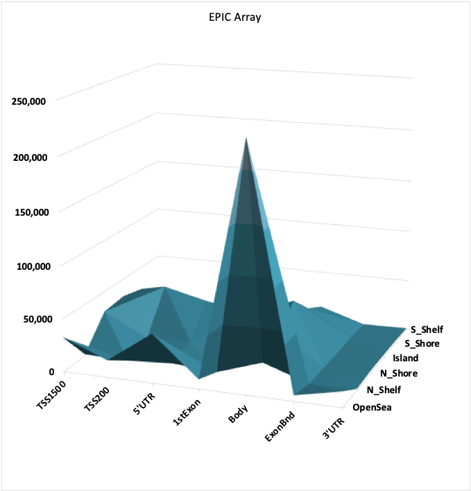

```{r setup_markdown, include=FALSE}
library(knitr)
opts_chunk$set(tidy.opts=list(width.cutoff=30),tidy=FALSE, warning = FALSE, message = FALSE, cache.lazy = FALSE)
options(knitr.kable.NA = '')
```

**Code Authors**: Mark E. Pepin **Contact**:
[pepinme\@gmail.com](mailto:pepinme@gmail.com){.email} **Institution**:
Heidelberg University Hospital **Location**: 669 Neuenheimer Feld,
Institute for Experimental Cardiology, 69120 Heidelberg, Germany

# Preliminary Setup

## Parameters

Define the parameters used, along with the conditions required for the
current analysis. This segment must be modified for each analysis
performed.

```{r Parameters}
##Set the experimental conditions [MUST DO THIS MANUALLY]
DIABETES=c("ND", "T2D") #Should define the reference group first
ISCHEMIA=c("NICM", "ICM")
RACE=c("Caucasian_American", "African_American") #, "Asian_American", "Eastern_African"
ISO=c("NONE", "DOB")
STATISTIC = 0.05 #P statistic threshold used in this combination.

VARIABLE = RACE

COMPARISON= paste0(VARIABLE[2], ".vs.", VARIABLE[1])

# Candidate Gene Selection (RNA-sequencing) EDIT THIS LIST BASED ON INTERESTS.
GENES=c("LEP", "ADIPOQ", "PLIN1")
VAR1="Race"
VAR2="Diabetes"
# Single Bar Graph
library(dplyr)
my_comparisons <- list( c("Caucasian_American", "African_American")) # Comparisons to make
# my_comparisons <- list( c("WT", "NR4A1.cKO"), c("ABHD5.cKO","cDKO"), c("WT", "ABHD5.cKO")) # Comparisons to make
## Create color based on Genotype
ann_colors = list(Race = c(Caucasian_American="grey", African_American = "darkcyan", Asian_American="black", Eastern_African = "black"))
RaceColors<-ann_colors$Race
ann_colorTable<-as.data.frame(ann_colors)

ann_colGroup<-subset(ann_colorTable, rownames(ann_colorTable) %in% RACE)
ann_colListGroup<-list(ann_colors$Race)
ann_colGroupVec<-ann_colGroup$Race
names(ann_colGroupVec)<-as.factor(rownames(ann_colGroup))
GROUP_colors<-list(ann_colGroupVec=ann_colGroupVec)

# Pathway Gene Screening
GENE.Pathway<-read.csv("../2_Input/Gene.Sets/Oxphos.KEGG.csv", header = F) #Can alter the gene pathway (just change path)
colnames(GENE.Pathway)<-"external_gene_name"

# Create Output Folder Structure
ifelse(!dir.exists(file.path(paste0("../3_Output/"))), dir.create(file.path(paste0("../3_Output/"))), FALSE)
ifelse(!dir.exists(file.path(paste0("../3_Output/1_RNA/"))), dir.create(file.path(paste0("../3_Output/1_RNA/"))), FALSE)
ifelse(!dir.exists(file.path(paste0("../3_Output/2_Methyl/"))), dir.create(file.path(paste0("../3_Output/2_Methyl/"))), FALSE)
ifelse(!dir.exists(file.path(paste0("../3_Output/3_Combined/"))), dir.create(file.path(paste0("../3_Output/3_Combined/"))), FALSE)
```

## Packages

```{r packages}
if (!require("pacman")) install.packages("pacman")
pacman::p_load(dplyr, Hmisc, openxlsx, corrplot, RColorBrewer, kableExtra, ggplot2, gridExtra, ggpubr, ggsignif, DESeq2, data.table, GenomicFeatures, biomaRt, Haplin, pheatmap, calibrate, ggrepel, tidyr, gtools)
```

# Figure 1: Pilot Analysis - Illumina(R) HumanMethylation 450k Array [GSE109097](https://www.ncbi.nlm.nih.gov/gds/?term=GSE109097%5BAccession%5D)

The current study originated from the preliminary analysis of a cohort
(n = 11) of patients with ischemic and non-ischemic end-stage HF
(**Figure 1A**). Although we have previously reported that a patient's
history of ischemic heart diseases is most responsible for global
differences in cardiac DNA methylation within this cohort [@pepin2018],
it was noted here that, although the gobal signature encoded ischemic
status, the most variable CpG probes on the array exhibited a divergent
bimodal distribution. Dataset is available at
<https://www.ncbi.nlm.nih.gov/geo/query/acc.cgi?acc=GSE109097>

```{r methyl450k}
#   Differential expression analysis with limma
library(openxlsx)
library(magrittr)
library(dplyr)
library(ggpubr)
library(matrixStats)
library("ggrepel")
library(ggplot2)
library(cowplot) 
options(ggrepel.max.overlaps = Inf)
m450k<-read.xlsx("../2_Input/_Pilot/Pepin.Wende_2018.xlsx", sheet = "betaData", rowNames = T)
colData_m450k<-read.xlsx("../2_Input/_Pilot/Pepin.Wende_2018.xlsx", sheet = "colData")
# MDS in ggplot2
Ntop = 1000
RowVar<-rowVars(data.matrix(m450k)) #calculate variances for each row (vector)
MDS.set<-as.data.frame(cbind(m450k, RowVar))
MDS_matrix<-MDS.set %>% arrange(desc(RowVar)) %>% top_n(Ntop,RowVar) #Select top N rows by variance
# Compute MDS
mds <- MDS_matrix %>% dplyr::select(-RowVar) %>% t(.) %>%
  dist() %>%          
  cmdscale() %>%
  as_tibble()
colnames(mds) <- c("Dim.1", "Dim.2")
rownames(mds)<-colnames(m450k)
mds$Sample_Name<-rownames(mds)
mds<-dplyr::inner_join(mds, colData_m450k)

#K-means clustering
clust <- kmeans(mds[,1:2], 2)$cluster %>%
  as.factor()
mds <- mds %>%
  mutate(kmeans.2 = clust)
# Main plot
COLOR=c("#1b9e77", "#7570b3")
pmain <- ggplot(mds, aes(x = Dim.1, y = Dim.2, color = Race))+
  scale_color_manual(values = COLOR) +
  theme(panel.background = element_rect("white", colour = "black", size=2), 
      panel.grid.major = element_line(colour = "gray50", size=.75), 
      panel.grid.minor = element_line(colour = "gray50", size=0.4),
      legend.position="bottom",
      legend.key=element_blank(),
      axis.text = element_text(size = 12),
      axis.title = element_text(size = 14, face="bold")) +
  geom_hline(yintercept = 0, size = 1) + 
  geom_vline(xintercept=0, size=1) +
  geom_point()+
  stat_ellipse()+
  geom_text_repel(data=mds, aes(label=Sample_Name), show_guide  = F) +
  labs(x="Principal Component 1", 
       y="Principal Component 2")
# Marginal densities along x axis
xdens <- axis_canvas(pmain, axis = "x")+
  geom_density(data = mds, aes(x = Dim.1, fill = Race),
              alpha = 0.7, size = 0.2)+
  scale_fill_manual(values = COLOR)
# Marginal densities along y axis
ydens <- axis_canvas(pmain, axis = "y", coord_flip = TRUE)+ #must set coord_flip = true if using coord_flip() below
  geom_density(data = mds, aes(x = Dim.2, fill = Race),
                alpha = 0.7, size = 0.2)+
  coord_flip()+
  scale_fill_manual(values = COLOR)
p1 <- insert_xaxis_grob(pmain, xdens, grid::unit(.2, "null"), position = "top")
p2<- insert_yaxis_grob(p1, ydens, grid::unit(.2, "null"), position = "right")
pdf(file="../3_Output/2_Methyl/Pilot.Scatterhist.pdf", height = 7, width = 7, onefile = F)
ggdraw(p2)
dev.off()

ggdraw(p2)
```

# Figure 2: Patient Information

## Figure 2A: Correlation and Covariate Network Analysis

The first task in this project was to understand the covariates that
accompany racial differences in the current cohort. Although both small
sample size and limited medical documentation preclude generalizing
conclusions, our initial observations. In accordance with the IRB
exemption, we obtained health history and available demographics from
the electronic medical record. Correlation-based analysis was then
performed using these metrics, visualized as a heatmap (**Figure 2A**).

```{r correlation_patients, fig.cap="\\label{correlation_patients}Correlation Matrix of Patient Characteristics. All data were obtained from electronic medical records and de-identified in accordance with the UAB Institutional Review Board requirements."}
Run_tS<-Sys.time()
library(openxlsx)
library(dplyr)
library(Hmisc)
library(corrplot)
library(RColorBrewer)
options(kableExtra.latex.load_packages = FALSE)
library(kableExtra)
Patient_Data <- openxlsx::read.xlsx("../2_Input/1_Patient/colData_CHAAMPS.FINAL.xlsx", sheet = "Matrix", rowNames = T)
Patient_Data<-as.data.frame(Patient_Data)
# Patient_Data<-dplyr::select(Patient_Data, -Syst.PA, -PCWP,-RA)
Patient_Data<-Patient_Data[complete.cases(Patient_Data),]

# # Print the table for use
# Patient_Data %>% kable(#format="latex", 
#                        align="c", 
#                        booktabs=T, 
#                        caption="Patient Characteristics") %>% 
#   kable_styling(latex_options=c("striped", 
#                                 "condensed", 
#                                 "repeat_header"))

# Format for Correlation
Patient_corr<-data.matrix(Patient_Data)
cor.r<-cor(Patient_corr)
paletteLength <- 100
myColor <- colorRampPalette(c("dodgerblue4", "white", "brown4"))(paletteLength)
p.mat<-cor.mtest(cor.r)$p
rownames(p.mat)<-rownames(cor.r)
colnames(p.mat)<-colnames(cor.r)
corrplot(cor.r, 
         order="original",
         type="full",
         method = "square",
         outline=FALSE,
         col = myColor,
         tl.cex=0.7,
         tl.col="black",
         p.mat=p.mat,
         sig.level = 0.05,
         insig="blank",
         addgrid.col = NA)

pdf(file=paste0("../3_Output/_Patient/Patient.Correlation.pdf"))
corrplot(cor.r, 
         order="original",
         type="full",
         method = "square",
         outline=FALSE,
         col = myColor,
         tl.cex=0.7,
         tl.col="black",
         p.mat=p.mat,
         sig.level = 0.05,
         insig="blank",
         addgrid.col = NA)
dev.off()
```

## Figure 2B-H: Patient Variables - Bar Graphs

To examine the changes of individual variables, we used bar graphs
according to patients' self-identified race, as previously reported
[@Pepin2019]. A pairwise comparison of numeric factors was generated to
identify any significant differences by categorical patient race
(**Figure 2B-H**). Although a few characteristics appeared to correlate
with race, no significant differences were present on pairwise analysis
following adjustment for multiple comparisons.

```{r patient.graphs}
#####################################################
# Bar Graphs of the PHI
######################################################
#Location where graphs will be saved
library(dplyr)
library(ggplot2)
library(ggpubr)
library(gridExtra)
VAR2="Race"
PARAMS=c("Age", "Creatinine", "Blood.Glucose", "LV.EF")

ifelse(!dir.exists(file.path(paste0("../3_Output/_Patient/Candidates/"))), dir.create(file.path(paste0("../3_Output/_Patient/Candidates/"))), FALSE)

# Patient_Data<-openxlsx::read.xlsx("../2_Input/_Patient/Patients_Health.Info.xlsx", sheet = "Matrix_Pre.v.CON", rowNames = T)
# Patient_Data$Sample_ID<-rownames(Patient_Data)
# Patient_Data<-dplyr::select(Patient_Data, -Sex)
# Patient_ALL<-reshape(Patient_Data, varying = 14:29, sep = "_", direction = "long")
# Patient_ALL<-dplyr::rename(Patient_ALL, Timing=time)

colData_all<-openxlsx::read.xlsx("../2_Input/1_Patient/colData_CHAAMPS.FINAL.xlsx", sheet = "Summary", rowNames = T, startRow = 2)
graph_info<-subset(colData_all, Race %in% RACE)

## create a function that converts factors to numeric
asNumeric=function(x){as.numeric(as.character(x))}
factorsNumeric=function(d){modifyList(d, lapply(d[, sapply(d, is.factor)], asNumeric))}

##
graph_info<-factorsNumeric(graph_info)
# graph_info$Response<-factor(graph_info$Response, levels = c("CON", "NR", "R"))
graph_info$Ischemia<-factor(graph_info$Ischemia, levels = c("NICM", "ICM"))
graph_info$Diabetes<-factor(graph_info$Diabetes, levels = c("ND", "T2D"))
graph_info$HTN<-factor(graph_info$HTN, levels = c("N", "Y"))

groupsize<-graph_info %>% group_by(Race) %>% tally()

#Define function for mean and standard deviation for each group
data_summary <- function(data, varname, groupnames){
  require(plyr)
  summary_func <- function(x, col){
    c(mean = mean(x[[col]], na.rm=TRUE),
      sd = sd(x[[col]], na.rm=TRUE))
  }
  data_sum<-ddply(data, groupnames, .fun=summary_func,
                  varname)
  data_sum <- rename(data_sum, c("mean" = varname))
 return(data_sum)
}
########################################################
plotlist = list()
for (i in seq_along(PARAMS)){
PARAM<-as.name(PARAMS[i]) #define a "name" for the variable
ds <- data_summary(graph_info, varname=PARAM, groupnames=c(VAR2))
ds<-dplyr::left_join(ds, groupsize)
ds<-dplyr::mutate(ds, upper=ds[,2]+(sd/sqrt(n-1)))
patient<-ggplot(ds, aes_string(x=VAR2, y=PARAMS[i], fill=VAR2)) + 
  geom_bar(stat="identity", color="black", 
           position=position_dodge()) +
  geom_errorbar(aes_string(ymin=PARAMS[i], ymax="upper"), width=.2,
                 position=position_dodge(.9))
patient_plot<-patient+labs(title=paste0("Patient Data - ", PARAMS[i]), x=VAR2, fill=VAR2)+
    theme_classic2(base_size = 10) +
    scale_fill_manual(values=c('black', "white", "#999999")) + 
    stat_compare_means(mapping = aes_string(x=VAR2, y=PARAMS[i]), data = graph_info,label = "p.signif")
pdf(file=paste0("../3_Output/_Patient/Candidates/", PARAMS[i], "_", VAR2, "_barplot.pdf"), width = 3.5, height = 2.5)
print(patient_plot)
dev.off()
plotlist[[i]] = patient_plot
}
t<-marrangeGrob(grobs = plotlist, legend, nrow=3, ncol=2)
ggsave(paste0("../3_Output/_Patient/Candidates/_barplots_", VAR2, ".pdf"), t, width = 6, height = 7)

##########################################################
#Boxplot
##########################################################

plotlist = list()
for (i in seq_along(PARAMS)){
PARAM<-as.name(PARAMS[i]) #define a "name" for the variable
ds <- data_summary(graph_info, varname=PARAM, groupnames=c(VAR2))
ds<-dplyr::left_join(ds, groupsize)
ds<-dplyr::mutate(ds, upper=ds[,2]+(sd/sqrt(n-1)))
g<-ggplot(graph_info, aes_string(x=VAR2, y=PARAMS[i], fill=VAR2)) + 
  geom_boxplot() + stat_compare_means(label = "p.signif")
g_plot<-g+labs(title=paste0("Patient Data - ", PARAMS[i]), x=VAR2)+
   theme_classic2(base_size = 10) +
   scale_fill_manual(values=c('black', "white", "#999999")) + ylim(NA, max(ds$upper+.25*(ds$upper)))
pdf(file=paste0("../3_Output/_Patient/Candidates/", PARAMS[i], "_", VAR2, "_boxplot.pdf"), width = 3.5, height = 2.5)
print(g_plot)
dev.off()
plotlist[[i]] = g_plot
}
t<-marrangeGrob(grobs = plotlist, legend, nrow=3, ncol=2)
ggsave(paste0("../3_Output/_Patient/Candidates/_boxplots_", VAR2, ".pdf"), t, width = 6, height = 7)

```

\pagebreak

# Figure 3: Survival Analysis

To determine whether our cohort reflected the known racial differences
in outcomes following LVAD-induced cardiac unloading, we were approved
an IRB amendment to obtain all-cause mortality in the 2 years following
LVAD implantation. Kaplan-Meier survival curve was generated with a
Log-Rank (Mantel-Cox) statistic comparing 2-year survival of AA and CA
patients. Subsequent Cox proportional hazards analysis was performed to
identify possible covariates that could also account for differences in
health outcomes. From this, it was noted that obesity was negatively
associated with mortality risk, consistent with the reported "paradox"
of heart failure among obese subjects.

```{r Survival}
library(survminer)
library(survminer)
library(RTCGA.clinical)
Outcomes<-read.xlsx("../2_Input/1_Patient/Outcomes.xlsx")
fit<-survfit(Surv(Censor_2yr, Outcome_2yr) ~ Race, data = Outcomes)
# ggsurvplot(fit, data = Outcomes, risk.table = TRUE)

###################################################
ggsurvplot(
   fit,                     # survfit object with calculated statistics.
   data = Outcomes,  # data used to fit survival curves. 
   risk.table = F,       # show risk table.
   pval = TRUE,             # show p-value of log-rank test.
   conf.int = TRUE,         # show confidence intervals for 
                            # point estimaes of survival curves.
   xlim = c(0,730),        # present narrower X axis, but not affect
                            # survival estimates.
   break.time.by = 100,     # break X axis in time intervals by 500.
   ggtheme = theme_minimal(), # customize plot and risk table with a theme.
 risk.table.y.text.col = T, # colour risk table text annotations.
  risk.table.y.text = FALSE # show bars instead of names in text annotations
                            # in legend of risk table
)
# Fit a Cox proportional hazards model
surv_object<-Surv(time = Outcomes$Censor_2yr, event = Outcomes$Outcome_2yr)
fit.coxph <- coxph(surv_object ~ Diabetes + Ischemia + Obese + HTN + B.Blocker + ACE + Family.Hx, 
                   data = Outcomes)
ggforest(fit.coxph, data = Outcomes)


pdf(file="../3_Output/_Patient/Cox.Survival.pdf", height = 5, width = 5, onefile = F)
ggforest(fit.coxph, data = Outcomes)
dev.off()
```

# Genome-wide DNA methylation - Illumina(R) HumanMethylation EPIC Array [(GSE164197)](https://www.ncbi.nlm.nih.gov/geo/query/acc.cgi?acc=GSE164197)

To replicate our pilot analysis of DNA methylation in the testing
cohort, cardiac DNA methylation analysis was again performed using these
31 cardiac ventricular biopsies
[(GSE164197)](https://www.ncbi.nlm.nih.gov/geo/query/acc.cgi?acc=GSE164197).
This platform permits the analysis of many additional CpG sites, as
follows:



```{r EPIC_Import, echo=FALSE}
library(minfi)
library(limma)
library(shinyMethyl)
library(dplyr)
library(IlluminaHumanMethylationEPICanno.ilm10b5.hg38)
library(IlluminaHumanMethylationEPICmanifest)
library(RColorBrewer)
#########Part 1: Importing the Data
#Parameters
##Set the experimental conditions
COMPARISON="African_American.vs.Caucasian_American"
ifelse(!dir.exists(file.path("../3_Output/2_Methyl/", COMPARISON)), dir.create(file.path("../3_Output/2_Methyl/", COMPARISON)), FALSE)
##Get the array annotation
annoEPIC<-getAnnotation(IlluminaHumanMethylationEPICanno.ilm10b5.hg38)
annoEPIC<-dplyr::select(as.data.frame(annoEPIC), Name, chr, pos, Relation_to_Island, UCSC_RefGene_Name, UCSC_RefGene_Accession, UCSC_RefGene_Group, Regulatory_Feature_Group)
#Import the sample sheet
targets<-read.metharray.sheet(base="../2_Input/3_Methyl", pattern="csv$")
# targets<-dplyr::filter(targets, Sample_Name!="LVAD054") #OUTLIER
# Filter targets
targets_filtered<-subset(targets, Race %in% RACE)
#Import the array data from input directory (red and green .idat files)
RGSet<-read.metharray.exp(base = "../2_Input/3_Methyl/", targets = targets, verbose = TRUE)
sampleNames(RGSet)<-targets$Sample_Name

RGSet@annotation = c(array = "IlluminaHumanMethylationEPIC", annotation = "ilm10b5.hg38")
#Check the phenotype metadata to verify correct parsing
phenoData<-pData(RGSet)
#Get the manifest annotation (EPIC, methyl450k, etc...)
manifest<-getManifest(RGSet)
typeIProbes <- getProbeInfo(manifest, type = "I")$Name
##Quality Control
#First step is to identify CpGs that failed to identify methylated positions (defined by expression intensity that reflects background levels)
detP<-detectionP(RGSet)
PLOT.COL <- brewer.pal(8,"Dark2")
##Detection P-value Plot
pdf(file=paste0("../3_Output/2_Methyl/", COMPARISON, "/", COMPARISON, "_detectionP.pdf"))
par(mfrow=c(1,1))
barplot(colMeans(detP), col=PLOT.COL[factor(targets$Race)], 
        cex.names=0.8, ylim=c(0,0.005), ylab="Mean detection p-values")
abline(h=0.05,col="red")
legend("topleft", legend=levels(factor(targets$Race)), fill=PLOT.COL, 
       bg="white")
dev.off()
## Filter RGSet by detection P-value
keep <- colMeans(detP) < 0.05
RGSet <- RGSet[,keep]
RGSet
##QC Report
qcReport(RGSet, sampNames=targets$ID, sampGroups=targets$Sample_Group, pdf="qcReport.pdf")
#
par(mfrow=c(1,1))
barplot(colMeans(detP), col=PLOT.COL[factor(targets$Race)], las=2, 
        cex.names=0.8, ylim=c(0,0.005), ylab="Mean detection p-values")
abline(h=0.05,col="red")
legend("topleft", legend=levels(factor(targets$Race)), fill=PLOT.COL, 
       bg="white")
# #Determine the fraction of "failed" CpG probes (those which failed to identify a methylated CpG)
# colMeans(failed)
#Convert R/G to Methylated/Unmethylated in an object of class MethylSet
MSet<-preprocessRaw(RGSet)
#QC data
qc<-getQC(MSet)
plotQC(qc)
pdf(file=paste0("../3_Output/2_Methyl/", COMPARISON, "/", COMPARISON, "_QC.Methyl.pdf"))
plotQC(qc)
dev.off()
##Density plot
# densityPlot(RGSet, sampGroups = phenoData$Race, main= "Beta", xlab = "Beta")
pdf(file=paste0("../3_Output/2_Methyl/", COMPARISON, "/", COMPARISON, "_densityPlot.pdf"))
densityPlot(RGSet, sampGroups = phenoData$Race, main= "Beta", xlab = "Beta")
dev.off()
densityBeanPlot(RGSet, sampGroups = phenoData$Race)
pdf(file=paste0("../3_Output/2_Methyl/", COMPARISON, "/", COMPARISON, "_BeanPlot.pdf"))
densityBeanPlot(RGSet, sampGroups = phenoData$Race)
dev.off()
qcReport(RGSet, pdf= paste0("../3_Output/2_Methyl/", COMPARISON, "/", COMPARISON, "_qcReport.pdf"))
# #Convert to a shinyMethyl dataset (nice summary of the quality control)
# summarized.data <- shinySummarize(RGSet)
# runShinyMethyl(summarized.data)

gRatioSet.quantile <- preprocessQuantile(RGSet, fixOutliers = TRUE, removeBadSamples = TRUE, badSampleCutoff = 10.5, quantileNormalize = TRUE, stratified = TRUE, mergeManifest = FALSE, sex = NULL)
beta.all<-getBeta(RGSet)
write.csv(beta.all, "../2_Input/EPIC.betaValues.csv")
```

## Supplemental Figure S2: Outlier (LVAD054)

```{r outliers}
par(mfrow=c(1,1))
barplot(colMeans(detP), col=PLOT.COL[factor(targets$Race)], las=2, 
        cex.names=0.8, ylim=c(0,0.005), ylab="Mean detection p-values")
abline(h=0.05,col="red")
legend("topleft", legend=levels(factor(targets$Race)), fill=PLOT.COL, 
       bg="white")
```

## Supplemental Figure S4, Figure 4B: SNPs in Methylation Data

SNPs have been shown to confound the interpretation of methylation
arrays when mutations exist within the CpG sites. To address this
concern, a package called "MethylToSNP" exists to identify novel SNPs
based on methylation array data, which has been proposed to reduce the
number of CpGs that are filtered. Using this approach, 1,294 CpGs were
identified as putative SNPs which are likely influenced by minor allele
fractions (MAFs); among these, 1,076 (83%) have been idenbtified as SNPs
via published genomic sequencing analyses.

To determine whether the SNP frequency in our dataset contributes to
racial differences, the beta values within these SNPs were clustered via
hierarchical clustering, resulting in a complete separation according to
patient race (see figure).

```{r SNPs}
#Remove SNPs
##Option 1: Built-in function that removes all known SNPs
gRatioSet_noSNPs<-dropLociWithSnps(gRatioSet.quantile, snps = c("SBE", "CpG"), maf = 0) #Doing this removes ~40% of all SNPs in the EPIC array
##Option 2: Identify putative SNPs using methylation barcoding (i.e. "gap hunting")
library("MethylToSNP")
library("RColorBrewer")
library("pheatmap")
Mvalues<-as.data.frame(getM(MSet))
x <- MethylToSNP(MSet, SNP=SNPs.147CommonSingle, verbose=TRUE)
x$CpG_ID<-rownames(x)
###
pdf(file="../3_Output/2_Methyl/Putative.SNPs.pdf", width = 10, height = 5) #Print Putative SNP Methylation
plotPotentialSNPs(x, MSet)
dev.off()
plotPotentialSNPs(x, MSet)
SNPs<-merge(x, as.data.frame(getM(MSet)), by = "row.names")
write.csv(SNPs, "SNPs.csv")
SNPs_matrix<-SNPs %>% set_rownames(.$Row.names) %>% dplyr::select(contains("LVAD")) %>% data.matrix()
SNPs_matrix<-SNPs_matrix[,colnames(SNPs_matrix)!="LVAD054"]
SNPs_matrix<-SNPs_matrix[!is.infinite(rowSums(SNPs_matrix)),] #One infinite value exists!! (took ~2-3 days to troubleshoot)

# Index
Index<-openxlsx::read.xlsx("../2_Input/1_Patient/colData_CHAAMPS.FINAL.xlsx", sheet = "Summary", startRow = 2, rowNames = TRUE)
Index_SNPs<-Index[colnames(SNPs_matrix),] %>% dplyr::select(Race)
ann_colors = list(Race = c(African_American="#1b9e77", Asian_American = "#d95f02", Caucasian_American="#7570b3", Eastern_African = "#e7298a"))
paletteLength <- 100
myColor <- colorRampPalette(c("dodgerblue4", "white", "gold2"))(paletteLength)
ann_colors = list(Race = c(African_American="#1b9e77", 
                           Asian_American = "#d95f02", 
                           Caucasian_American="#7570b3", 
                           Eastern_African = "#e7298a"))
heatmap_SNP<-pheatmap(SNPs_matrix, scale="row", #Heatmap of SNPs
                      cluster_cols = TRUE, 
                      cluster_rows = TRUE,
                     cutree_cols = 3,
                     cutree_rows = 4,
                     angle_col = 45,
                     fontsize_col = 8,
                     color = myColor, 
                     show_rownames = FALSE, 
                     border_color = NA, 
                     annotation_colors = ann_colors,
                     annotation_col = Index_SNPs,
                    filename = paste0("../3_Output/2_Methyl/SNPS.heatmap.pdf"))
pheatmap(SNPs_matrix, scale="row", #Heatmap of SNPs
                      cluster_cols = TRUE, 
                      cluster_rows = TRUE,
                     cutree_cols = 3,
                     cutree_rows = 4,
                     angle_col = 45,
                     fontsize_col = 8,
                     color = myColor, 
                     show_rownames = FALSE, 
                     border_color = NA, 
                     annotation_colors = ann_colors,
                     annotation_col = Index_SNPs)
## Cluster Analysis
hc <-heatmap_SNP$tree_row
lbl <- cutree(hc, 4) # split gene dendrogram in 5 groups
cluster1<-which(lbl==1)
cluster2<-which(lbl==2)
cluster3<-which(lbl==3)
cluster4<-which(lbl==4) 
#
Cluster1_data<-SNPs_matrix[cluster1,]
Cluster2_data<-SNPs_matrix[cluster2,]
Cluster3_data<-SNPs_matrix[cluster3,]
Cluster4_data<-SNPs_matrix[cluster4,]
#
heatmap_c1<-pheatmap(Cluster1_data, scale="row", 
                      cluster_cols = TRUE, 
                      cluster_rows = TRUE,
                      #breaks = myBreaks,
                      cutree_cols = 2,
                      angle_col = 45,
                      fontsize_col = 8,
                      color = myColor, 
                      show_rownames = FALSE, 
                      border_color = NA, 
                      annotation_colors = ann_colors,
                     annotation_col = Index_SNPs,
                      filename = paste0("../3_Output/2_Methyl/SNPS_Cluster1.heatmap.pdf"))
#
heatmap_c2<-pheatmap(Cluster2_data, scale="row", 
                      cluster_cols = TRUE, 
                      cluster_rows = TRUE,
                      #breaks = myBreaks,
                      cutree_cols = 2,
                      angle_col = 45,
                      fontsize_col = 8,
                      color = myColor, 
                      show_rownames = FALSE, 
                      border_color = NA, 
                     annotation_colors = ann_colors,
                     annotation_col = Index_SNPs,
                      filename = paste0("../3_Output/2_Methyl/SNPS_Cluster2.heatmap.pdf"))
#
heatmap_c3<-pheatmap(Cluster3_data, scale="row", 
                      cluster_cols = TRUE, 
                      cluster_rows = TRUE,
                      #breaks = myBreaks,
                      cutree_cols = 2,
                      angle_col = 45,
                      fontsize_col = 8,
                      color = myColor, 
                      show_rownames = FALSE, 
                      border_color = NA, 
                     annotation_colors = ann_colors,
                     annotation_col = Index_SNPs,
                      filename = paste0("../3_Output/2_Methyl/SNPS_Cluster3.heatmap.pdf"))
#
heatmap_c4<-pheatmap(Cluster4_data, scale="row", 
                      cluster_cols = TRUE, 
                      cluster_rows = TRUE,
                      #breaks = myBreaks,
                      cutree_cols = 2,
                      angle_col = 45,
                      fontsize_col = 8,
                      color = myColor, 
                      show_rownames = FALSE, 
                      border_color = NA, 
                     annotation_colors = ann_colors,
                     annotation_col = Index_SNPs,
                      filename = paste0("../3_Output/2_Methyl/SNPS_Cluster4.heatmap.pdf"))

```

## Figure 4A: MDS Plot - Unsupervised Clustering by Race

Because such a robust racial signature in cardiac DNA methylation was
seen in the pilot analysis, we reproduced the unsupervised method in the
larger cohort. This time, we continue to see a distinct racial
difference. Furthermore, we found that this racially-determined
clustering persisted to among the 500,000 most-variable CpG probes in
the EPIC array.

```{r MDS.methyl, echo=FALSE,results='hide',fig.keep='all'}
library(limma)
options(ggrepel.max.overlaps = Inf)
pdf(file="../3_Output/2_Methyl/MDS.4way.pdf", height = 10, width = 10)
##MDS Plot
par(mfrow=c(2,2))
PLOT.COL <- brewer.pal(8,"Dark2")
#top 1 000
plotMDS(getM(gRatioSet.quantile), cex = 1, top=1000, gene.selection="common",
        col=PLOT.COL[factor(targets$Race)], main = "MDS - Top 1,000")
legend("topright", legend=levels(factor(targets$Race)), text.col=PLOT.COL,
       bg="white", cex=0.7)
# Top 10 000
plotMDS(getM(gRatioSet.quantile), top=10000, gene.selection="common",
        col=PLOT.COL[factor(targets$Race)], polygon = TRUE, main = "MDS - Top 10,000")
legend("topright", legend=levels(factor(targets$Race)), text.col=PLOT.COL,
       bg="white", cex=0.7)
# Top 50 000
plotMDS(getM(gRatioSet.quantile), top=50000, gene.selection="common",
        col=PLOT.COL[factor(targets$Race)], polygon = TRUE, main = "MDS - Top 50,000")
legend("topright", legend=levels(factor(targets$Race)), text.col=PLOT.COL,
       bg="white", cex=0.7)
# Top 100 000
plotMDS(getM(gRatioSet.quantile), top=100000, gene.selection="common",
        col=PLOT.COL[factor(targets$Race)], polygon = TRUE, main = "MDS - Top 500,000")
legend("topright", legend=levels(factor(targets$Race)), text.col=PLOT.COL,
       bg="white", cex=0.7)
dev.off()

# MDS in ggplot2
Ntop = 10000
library(magrittr)
library(dplyr)
library(ggpubr)
library(matrixStats)
library("ggrepel")
library(wesanderson)
MDS.set<-as.data.frame(getM(gRatioSet.quantile))
MDS.set<-anti_join(MDS.set, SNPs) # REMOVE THE PUTATIVE SNPs
RowVar<-rowVars(data.matrix(MDS.set)) #calculate variances for each row (vector)
MDS.set<-as.data.frame(cbind(MDS.set, RowVar))
MDS_matrix<-MDS.set %>% arrange(desc(RowVar)) %>% top_n(Ntop,RowVar) #Select top N rows by variance
# Compute MDS
mds <- MDS_matrix %>% dplyr::select(-RowVar) %>% t(.) %>%
  dist() %>%          
  cmdscale() %>%
  as_tibble()
colnames(mds) <- c("Dim.1", "Dim.2")
rownames(mds)<-targets$Sample_Name
mds$Sample_Name<-rownames(mds)
mds<-dplyr::inner_join(mds, targets)

#K-means clustering
clust <- kmeans(mds[,1:2], 2)$cluster %>%
  as.factor()
mds <- mds %>%
  mutate(kmeans.2 = clust)
###
library(ggpubr)
library(cowplot) 
# Main plot
pmain <- ggplot(mds, aes(x = Dim.1, y = Dim.2, color = Race))+
  scale_color_brewer(palette="Dark2") +
  theme(panel.background = element_rect("white", colour = "black", size=2), 
      panel.grid.major = element_line(colour = "gray50", size=.75), 
      panel.grid.minor = element_line(colour = "gray50", size=0.4),
      legend.position="bottom",
      legend.key=element_blank(),
      axis.text = element_text(size = 12),
      axis.title = element_text(size = 14, face="bold")) +
  geom_hline(yintercept = 0, size = 1) + 
  geom_vline(xintercept=0, size=1) +
  geom_point()+
  stat_ellipse()+
  geom_text_repel(data=mds, aes(label=Sample_Name), show_guide  = F) +
  labs(x="Principal Component 1", 
       y="Principal Component 2")
# Marginal densities along x axis
xdens <- axis_canvas(pmain, axis = "x")+
  geom_density(data = mds, aes(x = Dim.1, fill = Race),
              alpha = 0.7, size = 0.2)+
  scale_fill_brewer(palette="Dark2")
# Marginal densities along y axis
ydens <- axis_canvas(pmain, axis = "y", coord_flip = TRUE)+ #must set coord_flip = true if using coord_flip() below
  geom_density(data = mds, aes(x = Dim.2, fill = Race),
                alpha = 0.7, size = 0.2)+
  coord_flip()+
  scale_fill_brewer(palette="Dark2")
p1 <- insert_xaxis_grob(pmain, xdens, grid::unit(.2, "null"), position = "top")
p2<- insert_yaxis_grob(p1, ydens, grid::unit(.2, "null"), position = "right")
pdf(file="../3_Output/2_Methyl/MD.Scatterhist.pdf", height = 7, width = 7, onefile = F)
ggdraw(p2)
dev.off()

ggdraw(p2)
```

## Supplemental Figure S3: MDS Plot

```{r MDS.range, echo=FALSE,results='hide',fig.keep='all'}
par(mfrow=c(2,2))
PLOT.COL <- brewer.pal(8,"Dark2")
#top 1 000
plotMDS(getM(gRatioSet.quantile), cex = 1, top=1000, gene.selection="common",
        col=PLOT.COL[factor(targets$Race)], main = "MDS - Top 1,000")
legend("topright", legend=levels(factor(targets$Race)), text.col=PLOT.COL,
       bg="white", cex=0.7)
# Top 10 000
plotMDS(getM(gRatioSet.quantile), top=10000, gene.selection="common",
        col=PLOT.COL[factor(targets$Race)], polygon = TRUE, main = "MDS - Top 10,000")
legend("topright", legend=levels(factor(targets$Race)), text.col=PLOT.COL,
       bg="white", cex=0.7)
# Top 50 000
plotMDS(getM(gRatioSet.quantile), top=50000, gene.selection="common",
        col=PLOT.COL[factor(targets$Race)], polygon = TRUE, main = "MDS - Top 50,000")
legend("topright", legend=levels(factor(targets$Race)), text.col=PLOT.COL,
       bg="white", cex=0.7)
# Top 100 000
plotMDS(getM(gRatioSet.quantile), top=100000, gene.selection="common",
        col=PLOT.COL[factor(targets$Race)], polygon = TRUE, main = "MDS - Top 100,000")
legend("topright", legend=levels(factor(targets$Race)), text.col=PLOT.COL,
       bg="white", cex=0.7)
```

# Differential Methylation of African American and Caucasian_American

## Using Minfi to compute differential expression

Owing to the remarkable separation by patient race, we chose to identify
the CpG sites responsible for a race-based epigenomic difference.

```{r African American.Caucasian_American}
library(minfi)
library(limma)
library(shinyMethyl)
library(dplyr)
library(IlluminaHumanMethylationEPICanno.ilm10b5.hg38)
library(IlluminaHumanMethylationEPICmanifest)
library(RColorBrewer)
#########Part 1: Importing the Data
#Parameters
##Set the experimental conditions
DIABETES=c("ND", "T2D") #Should define the reference group first
ISCHEMIA=c("NICM", "ICM")
RACE=c("Caucasian_American", "African_American")
ISO=c("NONE", "DOB")
STATISTIC = 0.05 #P statistic threshold used in this combination.
VARIABLE = RACE
COMPARISON= paste0(VARIABLE[2], ".vs.", VARIABLE[1])
ifelse(!dir.exists(file.path("../3_Output/2_Methyl/", COMPARISON)), dir.create(file.path("../3_Output/2_Methyl/", COMPARISON)), FALSE)
##Get the array annotation
annoEPIC<-getAnnotation(IlluminaHumanMethylationEPICanno.ilm10b5.hg38)
annoEPIC<-dplyr::select(as.data.frame(annoEPIC), Name, chr, pos, Relation_to_Island, UCSC_RefGene_Name, UCSC_RefGene_Accession, UCSC_RefGene_Group, Regulatory_Feature_Group)
#Import the sample sheet
targets<-read.metharray.sheet(base="../2_Input/3_Methyl", pattern="csv$")
targets<-dplyr::filter(targets, Sample_Name!="LVAD054") #OUTLIER
# Filter targets
targets_filtered<-subset(targets, Race %in% RACE & Diabetes %in% DIABETES & Ischemia %in% ISCHEMIA)
#Import the array data from input directory (red and green .idat files)
RGSet<-read.metharray.exp(base = "../2_Input/3_Methyl/", targets = targets_filtered, verbose = TRUE)
sampleNames(RGSet)<-targets_filtered$Sample_Name
#Check the phenotype metadata to verify correct parsing
phenoData<-pData(RGSet)
#Get the manifest annotation (EPIC, methyl450k, etc...)
manifest<-getManifest(IlluminaHumanMethylationEPICmanifest)
typeIProbes <- getProbeInfo(manifest, type = "I")$Name
##Quality Control
#First step is to identify CpGs that failed to identify methylated positions (defined by expression intensity that reflects background levels)
detP<-detectionP(RGSet)
failed<-detP>0.01
#Determine the fraction of "failed" CpG probes (those which failed to identify a methylated CpG)
colMeans(failed)
#Convert R/G to Methylated/Unmethylated in an object of class MethylSet
MSet<-preprocessRaw(RGSet)
#QC data
qc<-getQC(MSet)
plotQC(qc)
##Density plot
gRatioSet.quantile <- preprocessQuantile(RGSet, fixOutliers = TRUE, removeBadSamples = TRUE, badSampleCutoff = 10.5, quantileNormalize = TRUE, stratified = TRUE, mergeManifest = TRUE, sex = NULL)
#Quantification and Differential Expression Analysis
mVals<-getM(gRatioSet.quantile)
mVals<-mVals[,targets_filtered$Sample_Name]
phenoData<-phenoData[targets_filtered$Sample_Name,] #ensure that mVals has the same data as phenoData, otherwise dmpFinder won't work.
#Use Limma to perform differential methylation analysis using M-values (logit-transformed methylation data)
targets_filtered$Race<-factor(targets_filtered$Race)
targets_filtered$Race<-relevel(targets_filtered$Race, ref = "Caucasian_American")
targets_filtered$Diabetes<-factor(targets_filtered$Diabetes)
targets_filtered$ICM<-factor(targets_filtered$Ischemia)
design<-model.matrix(~0+Race, data = targets_filtered)
fit <- lmFit(mVals, design)
contMatrix <- makeContrasts(Race=RaceAfrican_American-RaceCaucasian_American,
                           levels=design)
contMatrix
fit2 <- contrasts.fit(fit, contMatrix)
fit2 <- eBayes(fit2)
summary(decideTests(fit2))
DMPs <- topTable(fit2, number = "all", adjust.method = "BH")
DMPs<-merge(DMPs, annoEPIC, by= 0)
rownames(DMPs)<-DMPs$Row.names
DMPs<-DMPs %>% dplyr::select(-Row.names)
beta <- getBeta(gRatioSet.quantile)
#create an annotation table
beta.table<-beta
colnames(beta.table)<-phenoData$Sample_Name
write.csv(beta.table, paste0("../3_Output/2_Methyl/", COMPARISON, "/", COMPARISON, "_beta.table.csv"))
# annotated<-merge(beta.table, as.data.frame(Islands.UCSC), by = 0)
# annotated<-merge(annotated, as.data.frame(Locations), by.x = "Row.names", by.y = 0)
# annotated<-merge(annotated, as.data.frame(Other), by.x = "Row.names", by.y = 0)
# rownames(annotated)<-annotated$Row.names

#Merge annotation with differential methylation table
# Results_dmp<-merge(DMPs, annotated, by = 0) #
Results_dmp<-merge(DMPs, beta.table, by = 0)
#Calculate Average CpG Methylation by race - African_American
library(dplyr)
library(matrixStats)
Results<-Results_dmp %>% replace(is.na(.), 0) %>% mutate(
  African_American_SD = rowSds(as.matrix(Results_dmp[,targets_filtered$Sample_Name[targets_filtered$Race=="African_American"]])),
  African_American_Mean = rowMeans(as.matrix(Results_dmp[,targets_filtered$Sample_Name[targets_filtered$Race=="African_American"]])),
  Caucasian_American_SD = rowSds(as.matrix(Results_dmp[,targets_filtered$Sample_Name[targets_filtered$Race=="Caucasian_American"]])),
  Caucasian_American_Mean = rowMeans(as.matrix(Results_dmp[,targets_filtered$Sample_Name[targets_filtered$Race=="Caucasian_American"]])),
  Methylation.Diff=(African_American_Mean-Caucasian_American_Mean)*100
)
rownames(Results)<-Results$Row.names
Results_dmp_p05<-filter(Results, P.Value<0.05)
Results_dmp_q05<-filter(Results, adj.P.Val<0.05)
#########################################
#Identify Promoter-associated CpG Islands
library(tidyr)
PromCGI<-dplyr::filter(Results_dmp_p05, grepl("Island", Relation_to_Island), grepl("TSS", UCSC_RefGene_Group))
#Separate Gene Names into unique rows
PromCGI_sep<-PromCGI %>% mutate(UCSC_RefGene_Name = strsplit(as.character(UCSC_RefGene_Name), ";")) %>% unnest(UCSC_RefGene_Name) %>% distinct()

#Save a copy of the countData
library(openxlsx)
wb_countData<-createWorkbook()
addWorksheet(wb_countData, "Unfiltered")
  writeData(wb_countData, "Unfiltered", Results, startCol = 1)
addWorksheet(wb_countData, "P_0.05")
  writeData(wb_countData, "P_0.05", Results_dmp_p05, startCol = 1)
addWorksheet(wb_countData, "Q_0.05")
  writeData(wb_countData, "Q_0.05", Results_dmp_q05, startCol = 1)
addWorksheet(wb_countData, "Promoter.CGI")
  writeData(wb_countData, "Promoter.CGI", PromCGI_sep, startCol = 1)
saveWorkbook(wb_countData, file = paste0("../3_Output/2_Methyl/", COMPARISON, "/", COMPARISON, "_DMPs.xlsx"), overwrite = TRUE)
```

## Regional Methylation

```{r DMRcate}
library(DMRcate)
library(missMethyl)
library(biomaRt)
myAnnotation<-cpg.annotate(object = mVals, datatype = "array", what = "M", 
                           analysis.type = "differential", design = design, 
                           contrasts = TRUE, cont.matrix = contMatrix, 
                           coef = "Race", arraytype = "EPIC")
design_test<-model.matrix(~targets_filtered$Race)
DMRs <- dmrcate(myAnnotation, lambda=1000, C=2) #calculates DMRs
results.ranges <- extractRanges(DMRs)
beta<-beta[,targets_filtered$Sample_Name] #ensure that columns are ordered exactly the same as the targets_filtered table.
groups <- c(African_American="#1b9e77", Caucasian_American="#7570b3")
type<-factor(targets_filtered$Race)
cols <- groups[as.character(type)] #creates a string of colors for the DMR.plot function
pdf(file = "../3_Output/2_Methyl/DMR.top.pdf")
DMR.plot(ranges = results.ranges, dmr = 3, CpGs = beta, what = "Beta", arraytype = "EPIC", phen.col = cols, genome = "hg38")
dev.off()
results.ranges.sig<-as.data.frame(results.ranges) %>% filter(Fisher < 0.05)
enrichment_GO <- goregion(results.ranges[(elementMetadata(results.ranges)[, "overlapping.genes"] %in% results.ranges.sig$overlapping.genes)], all.cpg = rownames(rownames(beta)), collection = "GO", array.type = "EPIC")

ensembl = useMart("ensembl",dataset="hsapiens_gene_ensembl") #uses human ensembl annotations
#gets gene symbol, transcript_id and go_id for all genes annotated with GO:0007507
gene.data <- getBM(attributes=c('external_gene_name', 'ensembl_transcript_id', 'go_id'), filters = 'go', values = 'GO:0006103', mart = ensembl)
```

## Figure 5B: Distribution of Methylation by Genomic and CpG Annotation

The following figure illustrates the enrichment of differential
methylation within CpG "Open Seas" (non-Island associatd CpG sites)
found within the associated gene body.

**change the viewing angle of 3D-Histogram by dragging mouse across
it.**

```{r Methylation Distribution}
library(plotly)
library(dplyr)
library(stringr)
library(reshape2)
library(readxl)
library(kableExtra)

##Create a regional annotation matrix of the EPIC array
Region_epic<-Results_dmp %>% 
  dplyr::select(Row.names, UCSC_RefGene_Group, Relation_to_Island)
Stage1<-Region_epic %>% 
  mutate(UCSC_RefGene_Group = strsplit(as.character(UCSC_RefGene_Group), ";")) %>% 
  unnest(UCSC_RefGene_Group) 
Stage2<-Stage1 %>% 
  mutate(Relation_to_Island = strsplit(as.character(Relation_to_Island), ";")) %>%  
  unnest(Relation_to_Island)
Stage3<-distinct(Stage2)
Regional.Groups<-dplyr::group_by_(Stage3, "UCSC_RefGene_Group", "Relation_to_Island") %>% 
  tally()
Region.matrix<-Regional.Groups %>% 
  spread(Relation_to_Island, n)
Region.matrix<-Region.matrix %>% 
  dplyr::select(UCSC_RefGene_Group, OpenSea, N_Shelf, N_Shore, Island, S_Shore, S_Shelf)
rownames(Region.matrix)<-Region.matrix$UCSC_RefGene_Group
Region.matrix<-Region.matrix[c("TSS1500", "TSS200", "5'UTR", "1stExon", "Body", "ExonBnd", "3'UTR"),]
rownames(Region.matrix)<-Region.matrix$UCSC_RefGene_Group
Contour_3D_epic<-Region.matrix[,-1]
rownames(Contour_3D_epic)<-Region.matrix$UCSC_RefGene_Group
write.xlsx(Contour_3D_epic, "../3_Output/2_Methyl/Contour.3D_EPIC.xlsx")

##Create a regional annotation matrix of differentially-methylated positions
Region_p05<-Results_dmp_p05 %>% dplyr::select(Row.names, UCSC_RefGene_Group, Relation_to_Island)
Stage1<-Region_p05 %>% mutate(UCSC_RefGene_Group = strsplit(as.character(UCSC_RefGene_Group), ";")) %>% unnest(UCSC_RefGene_Group) 
Stage2<-Stage1 %>% mutate(Relation_to_Island = strsplit(as.character(Relation_to_Island), ";")) %>%  unnest(Relation_to_Island)
Stage3<-distinct(Stage2)
Regional.Groups<-dplyr::group_by_(Stage3, "UCSC_RefGene_Group", "Relation_to_Island") %>% tally()
Region.matrix<-Regional.Groups %>% spread(Relation_to_Island, n)
Region.matrix<-Region.matrix %>% dplyr::select(UCSC_RefGene_Group, OpenSea, N_Shelf, N_Shore, Island, S_Shore, S_Shelf)
rownames(Region.matrix)<-Region.matrix$UCSC_RefGene_Group
Region.matrix<-Region.matrix[c("TSS1500", "TSS200", "5'UTR", "1stExon", "Body", "ExonBnd", "3'UTR"),]
rownames(Region.matrix)<-Region.matrix$UCSC_RefGene_Group
Contour_3D<-Region.matrix[,-1]
rownames(Contour_3D)<-Region.matrix$UCSC_RefGene_Group
write.xlsx(Contour_3D, "../3_Output/2_Methyl/Contour.3D_DMPs.p05.xlsx")
### Identify DMP Enrichment (IMPORTANT)
Enrichment_Region<-Contour_3D/Contour_3D_epic
Promoter_enr<-Enrichment_Region[rownames(Enrichment_Region)=="TSS200",] + Enrichment_Region[rownames(Enrichment_Region)=="TSS1500",]
rownames(Promoter_enr)<-"Promoter"
Enrichment_Region<-Enrichment_Region %>% 
  filter(!grepl("TSS", rownames(Enrichment_Region))) %>%
  rbind(Promoter_enr, .) %>%
  data.matrix()
paletteLength<-100
myColor <- colorRampPalette(c("dodgerblue4", "white", "brown4"))(paletteLength)
pheatmap(Enrichment_Region, color = myColor, cluster_rows = FALSE, cluster_cols = FALSE)
##Make a Table of the CpG Methylation Distribution
Enrichment_Region %>% kable( align="c", booktabs=T, 
                     caption="Methylation Distribution") %>% 
  kable_styling(latex_options=c("striped", "condensed", "repeat_header"))
write.xlsx(Enrichment_Region, paste0("../3_Output/2_Methyl/", COMPARISON, "/", COMPARISON, "_DMP.Enrichment_3D.xlsx"), rowNames = TRUE)
color <- colorRampPalette(c("grey", "orange", "red"))
t <- list(
  family = "times",
  size = 16,
  color = "black")
x_axis<-list(title = 'CpG Region', 
                     type="category", 
                     zeroline=TRUE, 
                     showline=TRUE, 
                     zerolinewidth = 4, 
            zerolinecolor="darkgrey", 
            linecolor="darkgrey", 
            linewidth=4, 
            titlefont=t, 
            tickfont=t)
y_axis<-list(title = 'Gene Region', 
                     type="category", 
                     zeroline=TRUE, 
                     showline=TRUE, 
                     zerolinewidth = 4, 
            zerolinecolor="darkgrey", 
            linecolor="darkgrey", 
            linewidth=4, 
            titlefont=t, 
            tickfont=t)
z_axis<-list(title = 'Number of DMPs', 
                     zerolinewidth = 4, 
                    zerolinecolor="darkgrey", 
                    linecolor="darkgrey", 
                    linewidth=4, 
                    titlefont=t, 
                    tickfont=t)
q<-plot_ly(z=~Enrichment_Region, colors=color(10), 
    text=as.character(rownames(Enrichment_Region))) %>% add_surface() %>% 
    layout(scene = list(xaxis = x_axis, yaxis = y_axis, zaxis = z_axis))

q #must comment out for PDF generation via knitr (Pandoc).
```

## Figure 5C: Heatmap and Hierarchical Clustering of Differential Methylation (P\<0.05)

Due to the prominent signature of CpG Island-associated promoter
methylation, we examined all DMPs present within this region via
heatmap.

```{r Methylation_Heatmap, fig.cap="\\label{Methylation_Heatmap}Heatmap and Hierarchical Clustering of Promoter CpG Island Methylation Significant Between ICM and NICM (P<0.05)."}
library(pheatmap)
library(dplyr)
##Import Data Matrix
# betaHM<-read.csv("../2_Input/EPIC.betaValues.csv", row.names = 1)
## Filters to Apply to DMR
pvalue_threshold=0.05
DMP_location="Island"
Gene_region="TSS"

##Filter Differential Methylation Data
DMR.p05<-Results %>% filter(P.Value<pvalue_threshold)
DMR.p05<-DMR.p05 %>% dplyr::select(Row.names, 
                            Methylation.Diff, 
                            P.Value, 
                            adj.P.Val, 
                            Relation_to_Island, 
                            UCSC_RefGene_Group, 
                            chr, 
                            pos, 
                            contains("LVAD"))
DMR.p05.Region<-DMR.p05 %>% 
  # filter(grepl(DMP_location, Relation_to_Island)) %>%
  filter(grepl(Gene_region, UCSC_RefGene_Group)) %>% 
  dplyr::select(contains("LVAD")) %>%
  data.matrix()
#Import the Index File
LVAD_Counts_Data <- targets
rownames(LVAD_Counts_Data)<-targets$Sample_Name
Index<-LVAD_Counts_Data %>% dplyr::select(Race, Age, BMI)
Index<-as.data.frame(Index)
paletteLength <- 100
ann_colors = list(Race = c(African_American="#1b9e77", Asian_American = "#d95f02", Caucasian_American="#7570b3", Eastern_African = "#e7298a"))
heatmap_DMC<-pheatmap(DMR.p05.Region, scale="row", 
                      cluster_cols = TRUE, 
                      cluster_rows = TRUE,
                      #breaks = myBreaks,
                      cutree_cols = 2,
                      cutree_rows = 2,
                      angle_col = 45,
                      fontsize_col = 8,
                      color = myColor, 
                      show_rownames = FALSE, 
                      border_color = NA, 
                      annotation_col = Index,
                      annotation_colors=ann_colors,
                      filename = paste0("../3_Output/2_Methyl/", COMPARISON, "/", COMPARISON, "_", DMP_location, ".", Gene_region,"_", "ALL_SAMPLES.heatmap.pdf"))

heatmap_DMC<-pheatmap(DMR.p05.Region, scale="row", 
                      cluster_cols = TRUE, 
                      cluster_rows = TRUE,
                      #breaks = myBreaks,
                      cutree_cols = 2,
                      cutree_rows = 2,
                      angle_col = 45,
                      fontsize_col = 8,
                      color = myColor, 
                      show_rownames = FALSE, 
                      border_color = NA, 
                      annotation_col = Index,
                      annotation_colors=ann_colors)
```

## Figure 8: GEO Coding

```{r GEO.Coding}
library(dplyr)
library("ggplot2")
theme_set(theme_bw())
library("sf")
library("rnaturalearth")
library("rnaturalearthdata")
library("tools")
library("maps")
library(openxlsx)
options(ggrepel.max.overlaps = Inf)
Patient_coord<-read.xlsx("../2_Input/1_Patient/colData_CHAAMPS.FINAL.xlsx", startRow = 2)
rownames(Patient_coord)<-Patient_coord$LVAD_ID
states <- st_as_sf(map("state", plot = FALSE, fill = TRUE))
states <- cbind(states, st_coordinates(st_centroid(states)))
states$ID <- toTitleCase(states$ID)
Patient_coord <- st_as_sf(Patient_coord, coords = c("Longitude", "Lattitude"), remove = FALSE,
    crs = 4326, agr = "constant")
pdf(file = "../3_Output/2_Methyl/GEO_Code.pdf", width = 10, height = 10)
ggplot(data = states) +
    geom_sf() +
    geom_sf(data = Patient_coord) +
    geom_text_repel(data = Patient_coord, aes(x = Longitude, y = Lattitude, label = LVAD_ID), size = 3) +
      geom_point(data = Patient_coord, aes(x = Longitude, y = Lattitude, colour=Race, label = LVAD_ID)) +
    coord_sf(xlim = c(-90, -82), ylim = c(30, 36), expand = FALSE)
dev.off()

ggplot(data = states) +
    geom_sf() +
    geom_sf(data = Patient_coord) +
    geom_text_repel(data = Patient_coord, aes(x = Longitude, y = Lattitude, label = LVAD_ID), size = 3) +
      geom_point(data = Patient_coord, aes(x = Longitude, y = Lattitude, colour=Race, label = LVAD_ID)) +
    coord_sf(xlim = c(-90, -82), ylim = c(30, 36), expand = FALSE)

```

## Figure 5A: Volcano Plot - DMPs

```{r Volcano}
# Load packages
library(dplyr)
library(ggplot2)
library(ggrepel)
library(openxlsx)
#
Results<-read.xlsx(paste0("../3_Output/2_Methyl/", COMPARISON, "/", COMPARISON, "_DMPs.xlsx"), sheet = "P_0.05")
#Read data from the web
Volcano_data = mutate(Results, sig=ifelse(Results$adj.P.Val<0.05 & abs(Results$Methylation.Diff)>10, "Q<0.05 and |Methylation| > 10%", "Not Sig"), minuslogpvalue = -log(P.Value), Methylation=Methylation.Diff)
max(Volcano_data$minuslogpvalue, na.rm = TRUE)
# Results<-Results %>% filter(grepl("TSS", UCSC_RefGene_Group))
#plot the ggplot
p = ggplot(Volcano_data, aes(Methylation, minuslogpvalue, color = sig)) + 
  scale_color_manual(values=c('grey','#E69F00'))+
  theme(panel.background = element_rect("white", colour = "black", size=2), 
      panel.grid.major = element_line(colour = "gray50", size=.75), 
      panel.grid.minor = element_line(colour = "gray50", size=0.4),
      legend.position="bottom",
      legend.key=element_blank(),
      axis.text = element_text(size = 12),
      axis.title = element_text(size = 14, face="bold")) +
  geom_point(size = 0.08) + 
  labs(x="Percent Methylation", 
       y=expression(-Log[10](P-value))
       ) + xlim(-75,75)+ 
  ylim(0, 28) + 
  geom_hline(yintercept = 0, size = 1) + 
  geom_vline(xintercept=0, size=1) +
  geom_text_repel(data=filter(Volcano_data, minuslogpvalue>15, abs(Methylation) > 25), aes(label=Name), show_guide = F)
#add a repelling effect to the text labels.
p

pdf(file = paste0("../3_Output/2_Methyl/", COMPARISON, "/", COMPARISON, "Volcano.Plot.pdf"), height = 6, width = 5)
p
dev.off()

## Interactive Volcano Plot
Filtered_methyl<-filter(Volcano_data, P.Value<0.05, abs(Methylation.Diff)>5)

library(plotly)
fig <- plot_ly(
  Filtered_methyl, x = ~Methylation, y = ~minuslogpvalue,
  # Hover text:
  text = ~paste("CpG: ", Methylation, '<br>P-value:', minuslogpvalue, '<br>CpG-ID:', Row.names, '<br>CpG-Region:', Relation_to_Island, '<br>Gene-Symbol:', UCSC_RefGene_Name),
  color = ~sig, size = ~minuslogpvalue
)
fig
```

# RNA-Sequencing Analysis ([GSE164197](https://www.ncbi.nlm.nih.gov/geo/query/acc.cgi?acc=GSE164197))

## RNA-Sequencing Alignment using STAR

Once the proper patient samples were selected for the analysis, RNA was
isolated from the left ventricle endocardial tissue using the RNeasy
Lipid Mini-Kit according to the manufacturer's instructions (Qiagen,
Valencia, CA). High-throughput RNA sequencing was performed at the
Heflin Genomics Core at the University of Alabama at Birmingham. Once
sample read quality was checked (multiQC analysis), the paired-end fastq
files were then aligned to the reference genome, which was created using
Gencode human sequence (GRCh38.p10.genome.fa) and annotation
(gencode.v27.chr_patch_hapl_scaff.annotation.gtf). STAR aligner is the
current gold-standard for this, which we used for the current analysis.
Before aligning each fastq file to the genome, an annotated reference
genome must first be assembled. This was performed as follows (this was
performed in Cheaha as \`bash GenomeReference.sh':

`STAR=../../Tools/STAR-2.5.3a/bin/Linux_x86_64/STAR`

`$STAR \`

`--runThreadN 12 \`

`--runMode genomeGenerate \`

`--genomeDir ./ \`

`--genomeFastaFiles /data/scratch/pepinme/huHrt/Input/Genome/GRCh38.p10.genome.fa \`

Alignment of short reads to this annotated genome could then proceed,
using the following SLURM batch script which was submitted to the UAB
*Cheaha* compute cluster (See **Attached Shell script**). This shell
script contains the following STAR alignment run settings:

`$STAR_RUN \`

`--genomeDir $GENOME_DIR \`

`--readFilesCommand zcat \`

`--readFilesIn $INPUT_DIR/fastq/${VAR}_R1_001.fastq.gz \`

`$INPUT_DIR/fastq/${VAR}_R2_001.fastq.gz \`

`--sjdbGTFfile $GENOME_DIR/gencode.v27.chr_patch_hapl_scaff.annotation.gtf \`

`--sjdbOverhang 99 \`

`--quantMode GeneCounts \`

`--runThreadN 12 \`

`--outSAMtype BAM SortedByCoordinate \`

`--outFileNamePrefix ${RESULTS_DIR}/Alignment/${VAR}_`

## Read Count Compiling

Before the DESeq2-based differential expression can be computed, the
counts generated by STAR need to be compiled, since the .tab file
contains count information based on forward, reverse, and combined
reads. Therefore, we will take the fourth column in each table and merge
them.

```{r Count.Compile}
Count.files <- list.files(path = "../1_Cheaha/counts/", pattern = "*_ReadsPerGene.out.tab", full.names = TRUE, all.files = TRUE)
Counts <- lapply(Count.files, read.table, skip = 4) #skip the first 4 rows, since these are summary data.
#Create a data.frame containing the raw counts
countData.raw <- as.data.frame(sapply(Counts, function(x) x[,4])) #selects only the 4th column as the raw counts.
#Generate Column names and Row names for the counts (remove the extra nonsense from the path names)
colnames <- gsub( "_ReadsPerGene[.]out[.]tab", "", Count.files)
colnames <- gsub( "[.][.]/1_Cheaha/counts//", "", colnames)
colnames(countData.raw) <- colnames
row.names(countData.raw) <- Counts[[1]][,1]
```

## Data Pre-Processing

After alignment of the fastq files to the annotated genome assembly
(hg38), the first step in the analysis is to consolidate the raw data
from the provided files into data matrix that can be used to generate a
normalized count matrix and differential expression dataset.

```{r tidy.data, echo=FALSE}
library(DESeq2)
library(data.table)
library(biomaRt)
library(dplyr)
library(openxlsx)
library(Haplin)
library(pheatmap)
library(calibrate)

#########Part 1: Importing the Data
##Set the experimental conditions
ifelse(!dir.exists(file.path(paste0("../3_Output/1_RNA/", COMPARISON))), dir.create(file.path(paste0("../3_Output/1_RNA/", COMPARISON))), FALSE)
# Create the countData (Input to DESeq2)
library(openxlsx)
colData_all <- openxlsx::read.xlsx("../2_Input/1_Patient/colData_CHAAMPS.FINAL.xlsx", sheet = "Summary", startRow = 2)
colData_all<-colData_all[colData_all$LVAD_ID!="LVAD054",]
#Parameters
colData_all$Race<- factor(colData_all$Race, levels = c("Caucasian_American", "African_American", "Asian_American", "Eastern_African"))
colData_all$Ischemia<-factor(colData_all$Ischemia, levels = c("NICM", "ICM"))
colData_all$Diabetes<-factor(colData_all$Diabetes, levels = c("ND", "T2D"))
colData_all$Adrenergic.Ag<-factor(colData_all$Adrenergic.Ag, levels = c("NONE", "DOB"))
#Select the patient characteristics needed for the current comparison.
colData<-dplyr::filter(colData_all, Race %in% RACE)
rownames(colData)<-colData$LVAD_ID
#colData<-filter(colData)
vector<-rownames(colData)

##Import Counts Data
countData<-dplyr::select(countData.raw, all_of(vector))

#Save a copy of the countData
library(openxlsx)
wb_countData<-createWorkbook()
addWorksheet(wb_countData, "CountData.Raw")
  writeData(wb_countData, "CountData.Raw", cbind(rownames(countData.raw),countData.raw), startCol = 1)
addWorksheet(wb_countData, "CountData")
  writeData(wb_countData, "CountData", cbind(rownames(countData),countData), startCol = 1)
addWorksheet(wb_countData, "colData")
  writeData(wb_countData, "colData", colData, startCol = 1)
saveWorkbook(wb_countData, file = paste0("../2_Input/", COMPARISON, "_input.xlsx"), overwrite = TRUE)
```

### Count Normalization

DESeq2 (version 1.18.1) was used to perform the raw count normalization
within R (version 3.4.2).

```{r DESeq2}
######### RUN DESeq2
dds<-DESeqDataSetFromMatrix(countData=countData, colData = colData, design= ~Race)
dds
# dds$ICM<-relevel(dds$ICM, ref = "NICM") # setting the reference to wild-type genotype. only relevant for factors.
#Determine the Dispersion Relationship (determines which distribution to use for the differential analysis) - should take about 2 minutes
dds <- estimateSizeFactors(dds)
dds <- estimateDispersions(dds)
plotDispEsts(dds)

png(file=paste0("../3_Output/1_RNA/", COMPARISON, "/", COMPARISON, "_Dispersion.png"))
plotDispEsts(dds)
dev.off()

```

There appears to be a linear negative correlation between the mean and
dispersion estimates, so the parametric "Wald" model should be an
appropriate fit for differential expression analysis. Furthermore, we
could get away with the parametric fit-type, but the run-time is not
significantly impaired, allowing us to use the 'local' fit-type. NOTE:
If it were nonlinear throughout, we would require a 'local'
nonparametric fit-type.

### Differential Expression Analysis

```{r Diff-Exp}
##Pre-Filter to reduce the size of this dataset (according to the DESeq2 document reccomendations)
dds <- dds[ rowSums(counts(dds)) > 1, ]
dds
################Run DESeq2 differential quantification (Likelihood ratio test (LRT) or Wald-test)
dds<-DESeq(dds, test="Wald", fitType="parametric")
#compile the results tables
resultsNames(dds)
resdf<-as.data.frame(results(dds, format = "DataFrame"))
resdf$ensembl_gene_id<-as.character(row.names(resdf))
```

Once the differential Expression analysis was performed, the following
were compiled into a results data matrix: Log2FoldChange, P-value,
Bonferroni-Adjusted P-Value (Q-value), and normalized counts for each
sample.

```{r Results}
####Add Annotation to the results file (this will take some time, about 5 minutes...)
##Add Gene Information
library(biomaRt)
hsapiens <- biomaRt::useEnsembl(biomart = "ENSEMBL_MART_ENSEMBL",
                                     host = "www.ensembl.org",
                                     dataset = "hsapiens_gene_ensembl",
                                     version = 94)
bm <- getBM(attributes=c("ensembl_gene_id_version", "external_gene_name", "chromosome_name", "start_position", "end_position"),  mart=hsapiens)
write.csv(bm, "../2_Input/BiomaRt_Annotation.csv")
bm<-read.csv("../2_Input/BiomaRt_Annotation.csv", row.names = 1)
results<-merge(resdf, bm, by.x="ensembl_gene_id", by.y="ensembl_gene_id_version")

####Add normalized count data (for heatmap and sota)
normcount<-as.data.frame(counts(dds, normalized=TRUE))
normcount$ensembl_gene_id<-rownames(normcount)
results<-dplyr::left_join(results, normcount, by="ensembl_gene_id")
results<-results[order(results$pvalue),] # order table by pvalue
##Create a Counts table with annotated Gene name
# Counts_table<-dplyr::select(results, external_gene_name, contains("LVAD"))
# write.xlsx(Counts_table, "../2_Input/CountData.xlsx", row.names = FALSE)
#Create filters as tabs
results_p05<-dplyr::filter(results, pvalue<0.05) 
results_q05<-dplyr::filter(results, padj<0.05)
library(openxlsx)
wb_DESeq<-createWorkbook()
#Unfiltered
  addWorksheet(wb_DESeq, "Unfiltered")
  writeData(wb_DESeq, "Unfiltered", results, startCol = 1)
#P-value Significant (0.05)
  addWorksheet(wb_DESeq, "P_0.05")
  writeData(wb_DESeq, "P_0.05", results_p05, startCol = 1)
#Q-value Significant (0.05)
  addWorksheet(wb_DESeq, "Q_0.05")
  writeData(wb_DESeq, "Q_0.05", results_q05, startCol = 1)
saveWorkbook(wb_DESeq, file = paste0("../3_Output/1_RNA/", COMPARISON, "/", COMPARISON,"_DESeq2.xlsx"), overwrite = TRUE)

```

### Supplemental Figure S4: MDS Plot Transcriptomics

In contrast to our epigenomic analysis, unsupervised MDS failed to
denote any separation by race (**Supplemental Figure S5**).

```{r MDS}
library(limma)
#Rewrite the plotMDS function to output gene index.
plotMDS.default<-
function (x, top = 500, labels = colnames(x), col = NULL, cex = 1, 
    dim.plot = c(1, 2), ndim = max(dim.plot), gene.selection = "pairwise", 
    xlab = paste("Dimension", dim.plot[1]), ylab = paste("Dimension", 
        dim.plot[2]), ...) 
{
    x <- as.matrix(x)
    ok <- is.finite(x)
    if (!all(ok)) 
        x <- x[apply(ok, 1, all), ]
    if (is.null(labels)) 
        labels <- 1:dim(x)[2]
    nprobes <- nrow(x)
    nsamples <- ncol(x)
    if (ndim < 2) 
        stop("Need at least two dim.plot")
    if (nsamples < ndim) 
        stop("Two few samples")
    gene.selection <- match.arg(gene.selection, c("pairwise", 
        "common"))
    cn <- colnames(x)
    dd <- matrix(0, nrow = nsamples, ncol = nsamples, dimnames = list(cn, 
        cn))
    topindex <- nprobes - top + 1
    if (gene.selection == "pairwise") {
        for (i in 2:(nsamples)) for (j in 1:(i - 1)) dd[i, j] = sqrt(mean(sort.int((x[, 
            i] - x[, j])^2, partial = topindex)[topindex:nprobes]))
    }
    else {
    
    #		Same genes used for all comparisons ,"common"
   
        s <- rowMeans((x - rowMeans(x))^2)
        q <- quantile(s, p = (topindex - 1.5)/(nprobes - 1))

        x <- x[s >= q, ]
	
	#	 an extra line
        ind.top.genes<-which(s >= q)
        
        for (i in 2:(nsamples)) dd[i, 1:(i - 1)] = sqrt(colMeans((x[, 
            i] - x[, 1:(i - 1), drop = FALSE])^2))
    }
    a1 <- cmdscale(as.dist(dd), k = ndim)
    mds <- new("MDS", list(dim.plot = dim.plot, distance.matrix = dd, 
        cmdscale.out = a1, top = top, gene.selection = gene.selection))
    mds$x <- a1[, dim.plot[1]]
    mds$y <- a1[, dim.plot[2]]
     mdsPlot<-plotMDS(mds, labels = labels, col = col, cex = cex, xlab = xlab, 
        ylab = ylab, ...)
list       (mds=mds,  ind.top.genes=ind.top.genes)  
}

# Perform MDS on RNA-sequencing data
MDS_data<-read.xlsx("../2_Input/CountData.xlsx")
rownames(MDS_data)<-make.unique(MDS_data$external_gene_name, sep = ".")
MDS_data<-dplyr::select(MDS_data, -external_gene_name)
## Create color based on race
ann_colors = list(Race = c(African_American="#1b9e77", Asian_American = "#d95f02", Caucasian_American="#7570b3", Eastern_African = "#e7298a"))
## MDS PLot
NGENES = 10000
mds<-plotMDS.default(MDS_data, gene.selection = "common", top = NGENES, col = colData_all$Color)
## Extract genes from this
MDS_GeneList<-rownames(as.data.frame(mds$ind.top.genes))
TopGenes_MDS<-subset(results, ensembl_gene_id %in% MDS_GeneList)
```

## Supplemental Figure S5: *In Silico* Cell Sorting via Cibersort

Due to the documented importance immune cell composition on cardiac
phenotype (18, 56), *in-silico* method of cellular deconvolution was
performed using CIBERSORT (<https://cibersort.stanford.edu>) to infer
relative enrichment of immunologic cell-types in our cardiac samples. No
racial differences were noted from this approach.


### QQ Plot

Before we examined the gene networks and pathways differentially
regulated by NRF2 knockout, the first task was to determine whether
transgene induction resulted in global changes. An effective way of
determining this is the QQ plot, which compares the P-value distribution
produced by the pairwise comparison to that of a random normal
distribution. Below, it is evident that differential expression
according to patient race yields a robustly divergent expression pattern
that likely reflects population differences in gene expression.

```{r QQ-Plot}
#Create Q-Q plot
test<-results
test<-test[complete.cases(test),]
pQQ(test$pvalue, lim=c(0,10))

png(file=paste0("../3_Output/1_RNA/", COMPARISON,  "/", COMPARISON,"_QQ.Plot.png"))
pQQ(test$pvalue, lim=c(0,10))
dev.off()
```

## Principal Components Analysis

Once we established that the populations under consideration truly
display divergene expression patterns, we sought to determine whether
unbiased global gene expression patterns recapitulate the described
phenotypes within each heart failure group. To accomplish this, an
unsupervised Principal Components Analysis (PCA) was initially used with
normalized counts.

### PCA Features

Before running the principal components analysis, it was necessary to
first determine the number of PC's required to account for 80% of the
variance, a machine-learning algorithmm benchmark that provides
sufficient confidence in the analysis.

```{r PCA_Features}
#Plot Features of the PCA
library(dplyr)
library(plotly)
##Import the data to be used for PCA
normCount_all<-data.matrix(read.xlsx("../2_Input/RNA_input.xlsx", sheet = "CountData", rowNames = T))
#transpose the dataset (required for PCA)
data.pca<-t(normCount_all)
data.pca<-as.data.frame(data.pca)
##Import the data to be used for annotation
rownames(colData_all)<-colData_all$LVAD_ID
Index<-colData_all
Index<-as.data.frame(Index)
##merge the file
data.pca_Final<-merge(Index, data.pca, by=0)
rownames(data.pca_Final)<-data.pca_Final$Row.names
pca.comp<-prcomp(data.pca_Final[,(ncol(Index)+2):ncol(data.pca_Final)])

pcaCharts=function(x) {
    x.var <- x$sdev ^ 2
    x.pvar <- x.var/sum(x.var)
    par(mfrow=c(2,2))
    plot(x.pvar,xlab="Principal component", 
         ylab="Proportion of variance", ylim=c(0,1), type='b')
    plot(cumsum(x.pvar),xlab="Principal component", 
         ylab="Cumulative Proportion of variance", 
         ylim=c(0,1), 
         type='b')
    screeplot(x)
    screeplot(x,type="l")
    par(mfrow=c(1,1))
}
pcaCharts(pca.comp)

png(file=paste0("../3_Output/1_RNA/", COMPARISON,  "/", COMPARISON, "_PCA.Charts.png"))
pcaCharts(pca.comp)
dev.off()
```

### 3-Dimensional PCA

From the previous calculations, it is seens that only 2 principal
components are necessary (accounting for \>80% cumulative variance).
Nonetheless, below is a 3-D PCA to ensure that all groups are
characterize to higher-degree of stringency. Nevertheless, a racial
difference could not be appreciated.

```{r PCA-Summary}
##Create a 3D-PCA for Inspection
library(plotly)
##Index
Index_PCA<-openxlsx::read.xlsx("../2_Input/1_Patient/colData_CHAAMPS.FINAL.xlsx", sheet="Summary", startRow=2)
# Index_PCA<-dplyr::filter(Index_PCA, Race %in% c("Caucasian_American", "African_American"))
Index_PCA$Race<-factor(Index_PCA$Race, levels = c("Caucasian_American","African_American", "Asian_American", "Eastern_African"))
rownames(Index_PCA)<-Index_PCA$LVAD_ID
PCs<-merge(pca.comp$x, Index_PCA, by=0)
rownames(PCs)<-PCs$Row.names
# PCs$Race[which(PCs$Race == 1)] <- 'Caucasian American'
# PCs$Race[which(PCs$Race == 2)] <- 'African American'
# PCs$Race[which(PCs$Race == 3)] <- 'Asian American'
# PCs$Race[which(PCs$Race == 4)] <- 'Eastern African'
PCs$Race <- as.factor(PCs$Race)
fig <- plot_ly(PCs, x = ~PC1, y = ~PC2, z = ~PC3, color = ~Race, colors = c("#7570b3", "#1b9e77", "#d95f02", "#e7298a"))
fig <- fig %>% add_markers()
fig <- fig %>% layout(scene = list(xaxis = list(title = 'PC1'),
                     yaxis = list(title = 'PC2'),
                     zaxis = list(title = 'PC3')))
fig
```

## Heatmap and Clustering of DEGs (P \< 0.01)

In order to visualize the distribution of differentially expressed
genes, as well as determine the effect various heart failure etiologies
on transcription, hierarchical clustering and heatmap visualization were
performed at the Q \< 0.05 statistical level. This analysis reveals that
P \< 0.05 is sufficient to delineate hierarchical clustering according
to patient race.

```{r heatmap}
library(pheatmap)
results_p05<-filter(results, pvalue<0.01)
normCount_all<-read.xlsx("../2_Input/CountData.xlsx", rowNames = F)
rownames(normCount_all)<-make.unique(normCount_all$external_gene_name, sep = ".")
normCount_all<-data.matrix(normCount_all[,2:ncol(normCount_all)])
hm_data<-subset(normCount_all, rownames(normCount_all) %in% results_p05$external_gene_name)
hm_data<-data.matrix(hm_data)
##
##Index file for annotating samples
rownames(colData_all)<-colData_all$LVAD_ID
Index<-dplyr::select(colData_all, Race, Age, Cardiac.Index, BMI)
Index<-as.data.frame(Index)
ann_colors = list(Race = c(African_American="#1b9e77", Asian_American = "#d95f02", Caucasian_American="#7570b3", Eastern_African = "#e7298a"))
paletteLength <- 100
myColor <- colorRampPalette(c("dodgerblue4", "white", "gold2"))(paletteLength)
pheatmap(hm_data, scale="row", 
         cluster_cols = TRUE, 
         cluster_rows = TRUE,
         #breaks = myBreaks,
         cutree_cols = 2,
         cutree_rows = 2,
         angle_col = 45,
         fontsize_col = 8,
         color = myColor, 
         show_rownames = FALSE, 
         border_color = NA, 
         annotation_colors = ann_colors,
         annotation_col = Index,
         filename=paste0("../3_Output/1_RNA/", COMPARISON,  "/", COMPARISON,"_Heatmap_Normcount.P01.pdf"))
vst<-varianceStabilizingTransformation(data.matrix(read.xlsx("../2_Input/RNA_input.xlsx", sheet = "CountData", rowNames = T)))
normhm<-vst[row.names(resdf[which(resdf$pvalue<0.05),]),]
normhm<-scale(t(normhm))
normhm<-t(normhm)
pheatmap(normhm, #Variance stabilized transformation
         cluster_cols=T, 
         clustering_method = "ward.D2",
         border_color=NA, 
         cluster_rows=T, 
         scale = 'row', 
         show_colnames = T, 
         show_rownames = F, 
         annotation_colors = ann_colors,
         color = myColor,
         annotation_col = Index,
         filename=paste0("../3_Output/1_RNA/", COMPARISON,  "/", COMPARISON,"_VST.Heatmap.P01.pdf"))

pheatmap(normhm, #Variance stabilized transformation
         cluster_cols=T, 
         clustering_method = "ward.D2",
         border_color=NA, 
         cluster_rows=T, 
         scale = 'row', 
         show_colnames = T, 
         show_rownames = F, 
         annotation_colors = ann_colors,
         color = myColor,
         annotation_col = Index)
```

## DEGs involved in Epigenetic Regulation

We used the following script to identify all epigenetic regulators that
appear differentially-expressed in cardiac samples of African Americans
relative to their age-adjusted Caucasian American counterparts. This
provides a list of candidate mediators of methylation differences.

```{r epigenome}
##########Find all Epigeneric Regulators 
EPIs<-openxlsx::read.xlsx("../2_Input/Miscelleneous/EpiGenes_main.xlsx")
EPIs_Genes<-EPIs$HGNC_symbol
DEG_List<-read.xlsx(paste0("../3_Output/1_RNA/", COMPARISON, "/", COMPARISON, "_DESeq2.xlsx"), sheet = "Unfiltered")
Epi_DEGs<-merge(DEG_List, EPIs, by.x="external_gene_name", by.y="HGNC_symbol")
openxlsx:::write.xlsx(Epi_DEGs,paste0("../3_Output/1_RNA/", COMPARISON,"/",COMPARISON, "_Epigenetic.DEGs.xlsx"))
#############################

```

## Differentially-expressed Genes in heart failure.

## Figure 6A-B: Gene Expression Bar Graphs

It was desired to inspect individual genes' expression according to
patient race. To accomplish this, the following script enables parsing
of normalized counts to generate a quick comparison of gene expression.

```{r Gene.Expression}
###########################################################################################################
library(ggplot2)
library(gridExtra)
library(ggpubr)
library(dplyr)
library(gtools)
library(openxlsx)
ifelse(!dir.exists(file.path(paste0("../3_Output/1_RNA/Candidates"))), dir.create(file.path(paste0("../3_Output/1_RNA/Candidates"))), FALSE)
#Import Index file
colData<-openxlsx::read.xlsx("../2_Input/1_Patient/colData_CHAAMPS.FINAL.xlsx", startRow = 2)
colData$Sample_ID<-as.character(colData$LVAD_ID)
##Import normalized counts
Counts<-read.xlsx("../2_Input/CountData.xlsx")
#Remove outliers
vector<-colData$LVAD_ID
Counts<-dplyr::select(Counts, external_gene_name, all_of(vector))
#Filter results by the gene vector
DEGs<-subset(Counts, external_gene_name %in% GENES)
rownames(DEGs)<-make.unique(as.character(DEGs$external_gene_name, sep = "."))
tDEGs<-as.data.frame(t(DEGs[,2:ncol(DEGs)]))
## convert all genes to numeric (from factors)
asNumeric=function(x){as.numeric(as.character(x))}
factorsNumeric=function(d){modifyList(d, lapply(d[, sapply(d, is.character)], asNumeric))}
##
tDEGs<-factorsNumeric(tDEGs)
tDEGs$LVAD_ID<-rownames(tDEGs)
colData.ex<-dplyr::inner_join(tDEGs, colData)
colData.ex$Race<-factor(colData.ex$Race, levels = c("African_American", "Caucasian_American", "Asian_American", "Eastern_African"))
colData.ex<-dplyr::group_by_(colData.ex, "Race") #define groups for statistics
write.xlsx(colData.ex, "../3_Output/1_RNA/Candidates/Candidate_genes.xlsx")
## For loop creating a graph for each gene
plotlist = list()
p<-1
for (i in GENES){
g_plot<-ggboxplot(colData.ex, x = "Race", 
          y = i, 
          fill = "Race",
          add = "jitter"
          ) + 
  scale_fill_manual(values = RaceColors) +
  stat_compare_means(aes(group = Race),
                    comparisons = my_comparisons, 
                    label = "p.signif"
                    ) +
  theme(axis.text.x=element_text(size=rel(0.75)), axis.text.y=element_text(size=rel(0.75)), legend.position="bottom") + # resize labels, remove legend
  scale_y_continuous(limits = c(0, max(colData.ex[,i])*1.1)) # + # expand = expansion(mult = c(0, 0.1)) ### Y scale (to see the statistics)
  # geom_text_repel(aes(label=Sample_ID), , color = "grey", size = 2) # Add Sample_ID
pdf(file=paste0("../3_Output/1_RNA/Candidates/", i, "_Expression.pdf"), width = 4, height = 3)
print(g_plot)
dev.off()
plotlist[[i]] = g_plot
}
t<-marrangeGrob(grobs = plotlist, legend, nrow=3, ncol=2)
ggsave("../3_Output/1_RNA/Candidates/_DEGs.pdf", t, width = 6, height = 7)
t
########################################################
```

## Pathway-based Gene Expression

Once it was noted that differential expression disproportionately
affected metabolic pathways, a script was created to examine all genes
encoding intermediates of said metabolic pathways, as follows:

```{r Geneset.graphing}
#GENE SET PLOTTING
####This code is useful in determining DEGs that associate with a given pathway
########################################################
library(ggplot2)
library(gridExtra)
library(ggpubr)
library(dplyr)
library(gtools)
######################################################
#Import dataset
Counts<-read.xlsx("../2_Input/CountData.xlsx")
#Import the Pathway Information
GENE.Pathway<-read.csv("../2_Input/Gene.Sets/Oxphos.KEGG.csv", header = F)
colnames(GENE.Pathway)<-"external_gene_name"
#Filter results by the gene vector
DEGSET<-Counts %>% inner_join(., GENE.Pathway)
rownames(DEGSET)<-DEGSET$external_gene_name
GENESET_FIL=as.character(DEGSET$external_gene_name)
colData<-openxlsx::read.xlsx("../2_Input/1_Patient/colData_CHAAMPS.FINAL.xlsx", sheet = "Summary", startRow = 2)
colData<-dplyr::filter(colData, Race %in% RACE, Ischemia %in% ISCHEMIA, Diabetes %in% DIABETES)
#Filter results by the gene vector
tDEGs<-as.data.frame(t(DEGSET))
tDEGs = tDEGs[-1, ]
## convert all genes to numeric (from factors)
asNumeric=function(x){as.numeric(as.character(x))}
factorsNumeric=function(d){modifyList(d, lapply(d[, sapply(d, is.character)], asNumeric))}
##
tDEGs<-factorsNumeric(tDEGs)
tDEGs$LVAD_ID<-rownames(tDEGs)
colData.ex<-dplyr::inner_join(tDEGs, colData)
colData.ex$Race<-factor(colData.ex$Race, levels = c("Caucasian_American", "African_American"))
colData.ex$Ischemia<-factor(colData.ex$Ischemia, levels = c("NICM", "ICM"))
colData.ex<-dplyr::group_by_(colData.ex, VAR1) #define groups for statistics
groupsize<-dplyr::tally(colData.ex) #define sample size (for SEM)
#Define function for mean and standard deviation for each group
data_summary <- function(data, varname, groupnames){
  require(plyr)
  summary_func <- function(x, col){
    c(mean = mean(x[[col]], na.rm=TRUE),
      sd = sd(x[[col]], na.rm=TRUE))
  }
  data_sum<-ddply(data, groupnames, .fun=summary_func,
                  varname)
  data_sum <- rename(data_sum, c("mean" = varname))
 return(data_sum)
}
#Create a p-value for every summarized data (relative to CON)
t.test2 <- function(m1,m2,s1,s2,n1,n2,m0=0,equal.variance=FALSE)
{
    if( equal.variance==FALSE ) 
    {
        se <- sqrt( (s1^2/n1) + (s2^2/n2) )
        # welch-satterthwaite df
        df <- ( (s1^2/n1 + s2^2/n2)^2 )/( (s1^2/n1)^2/(n1-1) + (s2^2/n2)^2/(n2-1) )
    } else
    {
        # pooled standard deviation, scaled by the sample sizes
        se <- sqrt( (1/n1 + 1/n2) * ((n1-1)*s1^2 + (n2-1)*s2^2)/(n1+n2-2) ) 
        df <- n1+n2-2
    }      
    t <- (m1-m2-m0)/se 
    dat <- c(m1-m2, se, t, 2*pt(-abs(t),df))    
    names(dat) <- c("Difference of means", "Std Error", "t", "p-value")
    return(dat) 
}
########################################################
plotlist = list()
p<-1
if(any(grepl("package:plyr", search()))) detach("package:plyr") else message("plyr not loaded")
for (i in GENESET_FIL){
  GENE<-as.name(i) #define a "name" for the variable
  ds <- data_summary(colData.ex, varname=i, groupnames=c(VAR1))
  ds<-dplyr::left_join(ds, groupsize)
  ds<-dplyr::mutate(ds, upper=ds[,2]+(sd))
  for(j in seq_along(ds[,4])){
    p[j]=round(t.test2(m1=ds[j,2], m2=ds[1,i], s1=ds[j,"sd"], s2=ds[1,"sd"], n1=ds[j,"n"], n2=ds[1,"n"], equal.variance = FALSE)[4], 2)
  } ### THIS MUST BE CORRECTED BASED ON THE ANALYSIS (change [,THIS] as needed to create: m = mean, s = standard deviation, n = sample size.
  ds$p_con<-stars.pval(p)
g<-ggplot(ds, aes_string(x=VAR1, y=i, fill = VAR1)) +
    geom_bar(stat="identity", color="black",
           position=position_dodge()) +
    # geom_point(shape="O",stat="identity", mapping = aes_string(x=VAR2, y=i),data = colData.ex, position=position_dodge(0.9), stroke = 2) +
    geom_errorbar(aes_string(ymin=i, ymax="upper"), width=.2,
                 position=position_dodge(.9)) +
    geom_text(aes(label=p_con), position=position_dodge(width=0.9), vjust=-1, size=5) +
    scale_fill_manual(values=c("white", "black", "darkcyan")) +
    ylim(NA, 1.1*max(ds$upper))
g_plot<-g+labs(title=paste0("Expression - ", i), x=VAR1, y = "Normalized Counts")+
   theme_classic2(base_size = 10)
pdf(file=paste0("../3_Output/1_RNA/Candidates/", i, "_", VAR1, ".and.", VAR1, "_Expression.pdf"), width = 3, height = 1.5)
print(g_plot)
dev.off()
plotlist[[i]] = g_plot
}
t<-marrangeGrob(grobs = plotlist, legend, nrow=3, ncol=2)
ggsave(paste0("../3_Output/1_RNA/Candidates/_DEGs_Pathway", VAR1, ".v.", VAR2, ".pdf"), t, width = 6, height = 7)
########################################################
```

# Figure 7: Combining DNA methylation with RNA-sequencing Analysis

```{r DEGs.w.DMRs}
library(dplyr)
library(openxlsx)
library(tidyr)
STATISTIC = 0.05 #P statistic threshold used in this combination.
ifelse(!dir.exists(file.path(paste0("../3_Output/3_Combined/", COMPARISON))), dir.create(file.path(paste0("../3_Output/3_Combined/", COMPARISON))), FALSE)
#Import the differential Methylation data
DEGs<-read.xlsx(paste0("../3_Output/1_RNA/", COMPARISON, "/", COMPARISON, "_DESeq2.xlsx"), sheet = "P_0.05")
colnames(DEGs)<-paste0("RNA_",colnames(DEGs))
DEGs$Gene.Symbol<-DEGs$RNA_external_gene_name
DMPs<-read.xlsx(paste0("../3_Output/2_Methyl/", COMPARISON, "/", COMPARISON, "_DMPs.xlsx"), sheet = "P_0.05")
colnames(DMPs)<-paste0("Methyl_", colnames(DMPs))
##
DMPs_separated<-DMPs %>% mutate(DMPs, chromStart=Methyl_pos, chromEnd=Methyl_pos+1, Gene.Symbol = strsplit(as.character(Methyl_UCSC_RefGene_Name), ";")) %>% unnest(Gene.Symbol) %>% distinct()
DMPs_separated$Gene.Symbol<-as.character(DMPs_separated$Gene.Symbol)
write.csv(DMPs_separated, "DMPs_separated.csv")
#Merge the datasets
DMPs_DEGs<-inner_join(DEGs, DMPs_separated, by="Gene.Symbol")
DMPs_promoter.DEGs<-dplyr::filter(DMPs_DEGs, grepl("TSS", Methyl_UCSC_RefGene_Group), RNA_pvalue<0.05) %>% filter((Methyl_Methylation.Diff>0 & RNA_log2FoldChange<0) | (Methyl_Methylation.Diff<0 & RNA_log2FoldChange>0))
Up.DEGs<-dplyr::filter(DMPs_promoter.DEGs, RNA_log2FoldChange<0)
Down.DEGs<-dplyr::filter(DMPs_promoter.DEGs,  RNA_log2FoldChange>0)

#Body Promoter DEGs
DMPs_body.DEGs<-DMPs_DEGs %>% filter(grepl("Body", Methyl_UCSC_RefGene_Group), RNA_pvalue<0.05) %>% filter((Methyl_Methylation.Diff>0 & RNA_log2FoldChange>0) | (Methyl_Methylation.Diff<0 & RNA_log2FoldChange<0))

library(openxlsx)
wb_combine<-createWorkbook()
#Unfiltered
  addWorksheet(wb_combine, "Inverse Promoter")
  writeData(wb_combine, "Inverse Promoter", DMPs_promoter.DEGs, startCol = 1)
  addWorksheet(wb_combine, "Direct Body")
  writeData(wb_combine, "Direct Body", DMPs_body.DEGs, startCol = 1)
saveWorkbook(wb_combine, file = paste0("../3_Output/3_Combined/", COMPARISON,"/",COMPARISON, "_Inverse_DMPs.Promoter.xlsx"), overwrite = TRUE)
```

## Figure 7A: Combined Heatmap

```{r DMP.DEG.heatmaps.overlap}
library(ComplexHeatmap)
library(openxlsx)
library(dplyr)
# detach("package:pheatmap", unload=TRUE)
#Index
Index_hm<-read.xlsx("../2_Input/1_Patient/colData_CHAAMPS.FINAL.xlsx", rowNames = T, startRow = 2)
Index_hm<-Index_hm %>% 
  subset(Race %in% RACE) %>% 
  filter(rownames(.)!="LVAD054") %>%
  dplyr::select(Race, Age, BMI, Cardiac.Index)

#Gene Expression
DEG_hm.prom<-DMPs_promoter.DEGs %>% dplyr::select(contains("RNA_LVAD")) %>% data.matrix()
rownames(DEG_hm.prom)<-make.unique(DMPs_promoter.DEGs$RNA_external_gene_name, sep = ".")
colnames(DEG_hm.prom)<-gsub('RNA_','',colnames(DEG_hm.prom)) #Remove RNA_ prefix from column names
DEG_hm.prom<-t(scale(t(DEG_hm.prom)))

DMP_hm.prom<-DMPs_promoter.DEGs %>% dplyr::select(contains("Methyl_LVAD")) %>% data.matrix()
rownames(DMP_hm.prom)<-make.unique(DMPs_promoter.DEGs$RNA_external_gene_name, sep = ".")
colnames(DMP_hm.prom)<-gsub('Methyl_','',colnames(DMP_hm.prom)) #Remove Methyl_ prefix from column names
DMP_hm.prom<-t(scale(t(DMP_hm.prom)))

#Make heatmap for DMPs
paletteLength <- 100
myColor_DMC <- colorRampPalette(c("cyan4", "white", "firebrick2"))(paletteLength)
ann_colors = list(Race = c(African_American="#1b9e77", Asian_American = "#d95f02", Caucasian_American="#7570b3", Eastern_African = "#e7298a"),
                  BMI = brewer.pal(6, "Blues"),
                  Age = brewer.pal(6, "Purples"),
                  Cardiac.Index = brewer.pal(6, "Reds")
                    )
heatmap_DMC<-pheatmap(DMP_hm.prom, scale="none", 
                      cluster_cols = TRUE, 
                      cluster_rows = TRUE,
                      cutree_rows = 2,
                      fontsize_col =  8,
                      color = myColor_DMC, 
                      clustering_distance_cols = "correlation",
                      show_colnames = F,
                      show_rownames = FALSE, 
                      border_color = NA, 
                      annotation_col = Index_hm,
                      annotation_colors=ann_colors,
                      annotation_legend = F,
                      filename = paste0("../3_Output/3_Combined/", COMPARISON, "/", COMPARISON, "_", DMP_location, ".", Gene_region,"_", "DMP.promoters.heatmap.pdf"))

#DEG Heatmap
colnames_ordered<-colnames(DMP_hm.prom)[column_order(heatmap_DMC)] #Get column order from the DMC Heatmap
Testing<-DEG_hm.prom[,match(colnames_ordered, colnames(DEG_hm.prom))]
paletteLength <- 100
myColor <- colorRampPalette(c("dodgerblue4", "white", "gold2"))(paletteLength) #DEG Colors
heatmap_DEG<-pheatmap(Testing, scale="row", 
                      cluster_cols = T, 
                      cluster_rows = TRUE,
                      cutree_rows = 2,
                      fontsize_col = 8,
                      color = myColor, 
                      clustering_distance_cols = "correlation",
                      show_colnames = F,
                      show_rownames = FALSE, 
                      border_color = NA, 
                      annotation_col = Index_hm,
                      annotation_colors=ann_colors,
                      filename = paste0("../3_Output/3_Combined/", COMPARISON, "/", COMPARISON, "_", DMP_location, ".", Gene_region,"_", "DEG.promoters.heatmap.pdf"))

pdf(file = paste0("../3_Output/3_Combined/", 
                  COMPARISON, "/", 
                  COMPARISON, "_", 
                  DMP_location, ".", 
                  Gene_region,"_", 
                  "DMC.DEG_Overlapping.Heatmap.pdf"), 
    height = 8, 
    width = 10
    )
heatmap_DMC + heatmap_DEG
dev.off()

heatmap_DMC + heatmap_DEG
```

Figure 7B: Dendrogram Link

```{r dendrogram.link}
library(tidyverse)  # data manipulation
library(cluster)    # clustering algorithms
library(factoextra) # clustering visualization
library(dendextend) # for comparing two dendrograms

##Methylation
res.dist_DMP <- dist(t(DMP_hm.prom), method = "euclidean")
hc1 <- hclust(res.dist_DMP, method = "ward.D2")
dend1 <- as.dendrogram (hc1)
colors_to_use <- as.numeric(targets_filtered$Race)
colors_to_use <- colors_to_use[order.dendrogram(dend1)]
labels_colors(dend1)<-colors_to_use

##DEG
res.dist_DEG <- dist(t(DEG_hm.prom), method = "euclidean")
hc2 <- hclust(res.dist_DEG, method = "ward.D2")
dend2 <- as.dendrogram (hc2)
colors_to_use2 <- as.numeric(targets_filtered$Race)
colors_to_use2 <- colors_to_use2[order.dendrogram(dend2)]
labels_colors(dend2)<-colors_to_use2
#
dend_list <- dendlist(dend1, dend2)
#
dendTangle<-dend_list %>% untangle(method = "step1side")
##

Test2<-tanglegram(dendTangle, sort = FALSE, common_subtrees_color_lines = TRUE, highlight_distinct_edges  = TRUE, highlight_branches_lwd = TRUE, lwd = 2, edge.lwd = 2, lab.cex=.7)
pdf(file = "../3_Output/3_Combined/TANGLE.pdf", height = 8, width = 10)
tanglegram(dendTangle, sort = FALSE, common_subtrees_color_lines = TRUE, highlight_distinct_edges  = TRUE, highlight_branches_lwd = TRUE, lwd = 2, edge.lwd = 2, lab.cex=.7)
dev.off()
entanglement(Test2)
cors <- cor.dendlist(Test2)

ha_index<-dplyr::select(targets_filtered, Race, HbA1C, BMI)
rownames(ha_index)<-targets_filtered$Sample_Name
ha = HeatmapAnnotation(df = ha_index)

# Print correlation matrix
library(ComplexHeatmap)
p1=ComplexHeatmap::pheatmap(DMP_hm.prom, scale = "row")
p2=Heatmap(scale(DEG_hm.prom), name = "RNA-Seq", km = 2, top_annotation = ha)

p1+p2

```

## Figure 7C: Circos Plot

```{r Circos, echo=TRUE}
library(dplyr)
#create gene labels
Gene_labels_Body<-DMPs_body.DEGs%>% dplyr::filter(abs(RNA_log2FoldChange)>.585, grepl("Body", Methyl_UCSC_RefGene_Group)) %>% dplyr::filter(abs(Methyl_Methylation.Diff)>5) %>% dplyr::select(chrom=Methyl_chr, chromStart=RNA_start_position, chromEnd=RNA_end_position, GeneSymbol=RNA_external_gene_name, RNA_padj) %>% distinct() %>% dplyr::top_n(50, RNA_padj) %>% dplyr::select(-RNA_padj)
Gene_labels_Body<-arrange(Gene_labels_Body, chromStart)
Gene_labels_Body$chrom<-factor(Gene_labels_Body$chrom, levels=c("chr1", "chr2", "chr3", "chr4", 
                                                      "chr5", "chr6", "chr7", "chr8", 
                                                      "chr9", "chr10", "chr11", "chr12", 
                                                      "chr13", "chr14", "chr15", "chr16", 
                                                      "chr17", "chr18", "chr19", "chr20", 
                                                      "chr21", "chr22", "chr23", "chrX", 
                                                      "chrY"))
Gene_labels_Body<-Gene_labels_Body[order(Gene_labels_Body$chrom),]
Gene_labels_Body<-Gene_labels_Body[!duplicated(Gene_labels_Body[,4]),]
Gene_labels_Body$Color<-"gray80" #Color the text of the corresponding circos
# Gene Labels based on Genomic Region
Gene_labels_Promoter<-DMPs_promoter.DEGs %>% dplyr::filter(abs(RNA_log2FoldChange)>.585, grepl("TSS", Methyl_UCSC_RefGene_Group)) %>% dplyr::filter(abs(Methyl_Methylation.Diff)>5) %>% dplyr::select(chrom=Methyl_chr, chromStart=RNA_start_position, chromEnd=RNA_end_position, GeneSymbol=RNA_external_gene_name, RNA_padj) %>% distinct() %>% dplyr::top_n(50, RNA_padj) %>% dplyr::select(-RNA_padj)
Gene_labels_Promoter<-arrange(Gene_labels_Promoter, chromStart)
Gene_labels_Promoter$chrom<-factor(Gene_labels_Promoter$chrom, levels=c("chr1", "chr2", "chr3", "chr4", 
                                                      "chr5", "chr6", "chr7", "chr8", 
                                                      "chr9", "chr10", "chr11", "chr12", 
                                                      "chr13", "chr14", "chr15", "chr16", 
                                                      "chr17", "chr18", "chr19", "chr20", 
                                                      "chr21", "chr22", "chr23", "chrX", 
                                                      "chrY"))
Gene_labels_Promoter<-Gene_labels_Promoter[order(Gene_labels_Promoter$chrom),]
Gene_labels_Promoter<-Gene_labels_Promoter[!duplicated(Gene_labels_Promoter[,4]),]
Gene_labels_Promoter$Color<-"gray40" #Color the text of the corresponding circos
# Create a composite Labels frame with coloring based on CpG Region
Gene.labels<-rbind(Gene_labels_Body, Gene_labels_Promoter)
Gene.labels<-Gene.labels[order(Gene.labels$chrom),]


##Gene Expression
##Fold Change UP
Gene_FoldChange.UP<-dplyr::select(DMPs_DEGs, chrom=Methyl_chr, 
                                                      chromStart, chromEnd, FoldChange_DEG=RNA_log2FoldChange)
Gene_FoldChange.UP<-dplyr::filter(Gene_FoldChange.UP, FoldChange_DEG>0)
# Gene_FoldChange.UP<-dplyr::mutate(Gene_FoldChange.UP, chromEnd=chromStart+1)
Gene_FoldChange.UP<-dplyr::select(Gene_FoldChange.UP, chrom, chromStart, chromEnd, FoldChange_DEG)
Gene_FoldChange.UP<-arrange(Gene_FoldChange.UP, chromStart)
Gene_FoldChange.UP$chrom<-factor(Gene_FoldChange.UP$chrom, levels=c("chr1", "chr2", "chr3", "chr4", 
                                                      "chr5", "chr6", "chr7", "chr8", 
                                                      "chr9", "chr10", "chr11", "chr12", 
                                                      "chr13", "chr14", "chr15", "chr16", 
                                                      "chr17", "chr18", "chr19", "chr20", 
                                                      "chr21", "chr22", "chr23", "chrX", 
                                                      "chrY"))
Gene_FoldChange.UP<-Gene_FoldChange.UP[order(Gene_FoldChange.UP$chrom),]
##Fold Change DOWN
Gene_FoldChange.DOWN<-dplyr::select(DMPs_DEGs, chrom=Methyl_chr, 
                                                      chromStart, chromEnd, FoldChange_DEG=RNA_log2FoldChange)
Gene_FoldChange.DOWN<-dplyr::filter(Gene_FoldChange.DOWN, FoldChange_DEG<0)
# Gene_FoldChange.DOWN<-dplyr::mutate(Gene_FoldChange.DOWN, chromEnd=chromStart+1)
Gene_FoldChange.DOWN<-dplyr::select(Gene_FoldChange.DOWN, chrom, chromStart, chromEnd, FoldChange_DEG)
Gene_FoldChange.DOWN<-arrange(Gene_FoldChange.DOWN, chromStart)
Gene_FoldChange.DOWN$chrom<-factor(Gene_FoldChange.DOWN$chrom, levels=c("chr1", "chr2", "chr3", "chr4", 
                                                      "chr5", "chr6", "chr7", "chr8", 
                                                      "chr9", "chr10", "chr11", "chr12", 
                                                      "chr13", "chr14", "chr15", "chr16", 
                                                      "chr17", "chr18", "chr19", "chr20", 
                                                      "chr21", "chr22", "chr23", "chrX", 
                                                      "chrY"))
Gene_FoldChange.DOWN<-Gene_FoldChange.DOWN[order(Gene_FoldChange.DOWN$chrom),]
##Fold Change List
Gene_FoldChange_List<-list(Gene_FoldChange.UP, Gene_FoldChange.DOWN)

# Methylation Density - Islands
DMR_Islands<-DMPs %>% dplyr::filter(Methyl_Relation_to_Island=="Island") %>% dplyr::select(chrom=Methyl_chr, Methyl_pos, perc.change=Methyl_Methylation.Diff)
DMR_Islands<-dplyr::filter(DMR_Islands, chrom!="chrM")
DMR_Islands<-dplyr::mutate(DMR_Islands, chromEnd=Methyl_pos+1) %>% dplyr::select(chrom, chromStart=Methyl_pos, chromEnd, perc.change)
DMR_Islands$chrom<-factor(DMR_Islands$chrom, levels=c("chr1", "chr2", "chr3", "chr4", 
                                                      "chr5", "chr6", "chr7", "chr8", 
                                                      "chr9", "chr10", "chr11", "chr12", 
                                                      "chr13", "chr14", "chr15", "chr16", 
                                                      "chr17", "chr18", "chr19", "chr20", 
                                                      "chr21", "chr22", "chr23", "chrX", 
                                                      "chrY"))
DMR_Islands<-DMR_Islands[order(DMR_Islands$chrom),]
Methyl.UP.Island<-filter(DMR_Islands, perc.change>0)
Methyl.DOWN.Island<-filter(DMR_Islands, perc.change<0)
Methyl.List.island<-list(Methyl.DOWN.Island, Methyl.UP.Island)

# Methylation Density - Seas
DMR_Sea<-DMPs %>% dplyr::filter(Methyl_Relation_to_Island=="OpenSea") %>% dplyr::select(chrom=Methyl_chr, Methyl_pos, perc.change=Methyl_Methylation.Diff)
DMR_Sea<-dplyr::filter(DMR_Sea, chrom!="chrM")
DMR_Sea<-dplyr::mutate(DMR_Sea, chromEnd=Methyl_pos+1) %>% dplyr::select(chrom, chromStart=Methyl_pos, chromEnd, perc.change)
DMR_Sea$chrom<-factor(DMR_Sea$chrom, levels=c("chr1", "chr2", "chr3", "chr4", 
                                                      "chr5", "chr6", "chr7", "chr8", 
                                                      "chr9", "chr10", "chr11", "chr12", 
                                                      "chr13", "chr14", "chr15", "chr16", 
                                                      "chr17", "chr18", "chr19", "chr20", 
                                                      "chr21", "chr22", "chr23", "chrX", 
                                                      "chrY"))
DMR_Sea<-DMR_Sea[order(DMR_Sea$chrom),]
Methyl.UP.Sea<-filter(DMR_Sea, perc.change>0)
Methyl.DOWN.Sea<-filter(DMR_Sea, perc.change<0)
Methyl.List.Sea<-list(Methyl.DOWN.Sea, Methyl.UP.Sea)
# All DMPs
CpG_EPIC<-DMPs %>% dplyr::select(chrom=Methyl_chr, Methyl_pos, perc.change=Methyl_Methylation.Diff)
CpG_EPIC<-dplyr::filter(CpG_EPIC, chrom!="chrM")
CpG_EPIC<-dplyr::mutate(CpG_EPIC, chromEnd=Methyl_pos+1) %>% dplyr::select(chrom, chromStart=Methyl_pos, chromEnd, perc.change)
CpG_EPIC$chrom<-factor(CpG_EPIC$chrom, levels=c("chr1", "chr2", "chr3", "chr4", 
                                                      "chr5", "chr6", "chr7", "chr8", 
                                                      "chr9", "chr10", "chr11", "chr12", 
                                                      "chr13", "chr14", "chr15", "chr16", 
                                                      "chr17", "chr18", "chr19", "chr20", 
                                                      "chr21", "chr22", "chr23", "chrX", 
                                                      "chrY"))
CpG_EPIC<-CpG_EPIC[order(CpG_EPIC$chrom),]
Methyl.UP.EPIC<-filter(CpG_EPIC, perc.change>0)
Methyl.DOWN.EPIC<-filter(CpG_EPIC, perc.change<0)
Methyl.List.EPIC<-list(Methyl.DOWN.EPIC, Methyl.UP.EPIC)

Methyl.List<-list(DMR_Sea,DMR_Islands)
#Plot the Circos
library(circlize)
library(gtools)
library(dplyr)

circos.genomicDensity1 = function (data, ylim.force = FALSE, window.size = NULL, overlap = TRUE, col = ifelse(area, "grey", "black"), lwd = par("lwd"), lty = par("lty"), type = "l", area = TRUE, area.baseline = NULL, baseline = 0, border = NA, ...) { if (!is.null(area.baseline)) 
data = normalizeToDataFrame(data)
if (!is.dataFrameList(data)) {
data = list(data)
}
if (length(col) == 1) {
col = rep(col, length(data))
}
if (length(lwd) == 1) {
lwd = rep(lwd, length(data))
}
if (length(lty) == 1) {
lty = rep(lty, length(data))
}
if (length(type) == 1) {
type = rep(type, length(data))
}
if (length(area) == 1) {
area = rep(area, length(data))
}

if (length(baseline) == 1) {
    baseline = rep(baseline, length(data))
}
if (length(border) == 1) {
    border = rep(border, length(data))
}
s = sapply(get.all.sector.index(), function(si) get.cell.meta.data("xrange", 
    sector.index = si))

if (is.null(window.size)) {
    window.size = 10^nchar(sum(s))/1000
}
df = vector("list", length = length(data))
for (i in seq_along(data)) {
    all.chr = unique(data[[i]][[1]])
    for (chr in all.chr) {
        region = data[[i]][data[[i]][[1]] == chr, 2:3, drop = FALSE]
        dn = genomicDensity(region, window.size = window.size, 
            overlap = overlap)
        dn = cbind(rep(chr, nrow(dn)), dn)
        df[[i]] = rbind(df[[i]], dn)
    }
}
if (ylim.force) {
    ymax = 1
}
else {
    ymax = max(sapply(df, function(gr) max(gr[[4]])))
}

circos.genomicTrackPlotRegion(df, ylim = c(-ymax,0), panel.fun = function(region, 
    value, ...) {
    i = getI(...)

    circos.genomicLines(region, -value, col = col[i], lwd = lwd[i], 
        lty = lty[i], type = type[i], border = border[i], 
        area = area[i], baseline = baseline[i])
}, ...)
}

environment(circos.genomicDensity1) <- asNamespace('circlize')

#to get error line number:

f <- function (data, ylim.force = FALSE, window.size = NULL, overlap = TRUE,
col = ifelse(area, "grey", "black"), lwd = par("lwd"), lty = par("lty"),
type = "l", area = TRUE, area.baseline = NULL, baseline = 0,
border = NA, ...)
{
circos.genomicDensity1(data, ylim.force = FALSE, window.size = NULL, overlap = TRUE,
col = ifelse(area, "grey", "black"), lwd = par("lwd"), lty = par("lty"),
type = "l", area = TRUE, area.baseline = NULL, baseline = 0,
border = NA, ...)
}
###########################################################
# pdf(file="trial_2.pdf",width=10,height=10)
# par(mar = c(1, 1, 1, 1))
# circos.par(gap.degree=1, track.margin = c(0, 0))
# circos.initializeWithIdeogram(track.height = 0.05)
# circos.genomicDensity(Methyl.UP, col = c("goldenrod3"), track.height = 0.1, baseline="bottom", bg.border ="white", track.margin = c(0, 0.0))
# circos.genomicDensity1(Methyl.DOWN, col = c("dodgerblue3"), track.height = 0.1, baseline="top", bg.border ="white", track.margin = c(0, 0.0))
# circos.clear()
# dev.off()
######################################################

om = circos.par("track.margin")
oc = circos.par("cell.padding")
circos.par(track.margin = c(0, 0), cell.padding = c(0, 0, 0, 0))
circos.par(start.degree = -250)
pdf(file=paste0("../3_Output/3_Combined/", COMPARISON, "/", COMPARISON, "_Circos.pdf"))
circos.initializeWithIdeogram(track.height = 0.05)

circos.genomicDensity(Methyl.List, col=add_transparency(c("gray80", "gray40"), transparency = 0.2) ,
                      track.height=0.2, bg.border=NA)
# ### Labels for DMRs in Islands
# circos.genomicDensity(Methyl.UP.Island, col = c("coral2"), track.height = 0.1, baseline="bottom", bg.border ="white", track.margin = c(0, 0.0))
# circos.genomicDensity1(Methyl.DOWN.Island, col = c("darkcyan"), track.height = 0.1, baseline="top", bg.border ="white", track.margin = c(0, 0.0))
# ### Labels for DMRs in Body
# circos.genomicDensity(Methyl.UP.Body, col = c("coral2"), track.height = 0.1, baseline="bottom", bg.border ="white", track.margin = c(0, 0.0))
# circos.genomicDensity1(Methyl.DOWN.Body, col = c("darkcyan"), track.height = 0.1, baseline="top", bg.border ="white", track.margin = c(0, 0.0))
#DEG with inverse GPI Islands Promoters
circos.genomicTrackPlotRegion(Gene_FoldChange_List,
                              ylim = c(-6, 6), bg.border=NA,
                              panel.fun = function(region, value, ...) {
 col = ifelse(value[[1]] > 0, "darkgoldenrod1", "dodgerblue2")
 circos.genomicPoints(region, value, col = add_transparency(col, 0.2), cex = 0.3, pch = 16)
 cell.xlim = get.cell.meta.data("cell.xlim")
 for(h in c(-3, -1.5, 0, 1.5, 3)) {
   circos.lines(cell.xlim, c(h, h), col ="#00000040")
 }
}, track.height = 0.2)

circos.genomicLabels(Gene.labels, labels.column=4, side='inside', col = Gene.labels$Color ,cex=0.6)
# circos.par(track.margin=om, cell.padding=oc)
# ## Add link for all DEGs with DMRs in promoter CGIs
# Link_Anchor <- read.csv("../1_Input/4_Combined/Circos/Link_Anchor.csv")
# Link<-read.csv("../1_Input/4_Combined/Circos/Link_DEG.DMR_Promoter.CGI_P<0.05.csv")
# Link$chrom<-factor(Link$chrom, levels=c("chr1", "chr2", "chr3", "chr4", 
#                                                       "chr5", "chr6", "chr7", "chr8", 
#                                                       "chr9", "chr10", "chr11", "chr12", 
#                                                       "chr13", "chr14", "chr15", "chr16", 
#                                                       "chr17", "chr18", "chr19", "chr20", 
#                                                       "chr21", "chr22", "chr23", "chrX", 
#                                                       "chrY"))
# Link<-Link[order(Link$chrom),]
# Link_Anchor<-Link_Anchor[1:nrow(Link),]
# circos.genomicLink(Link, Link_Anchor, col="black", lwd=0.5)
circos.clear()
dev.off()


om = circos.par("track.margin")
oc = circos.par("cell.padding")
circos.par(track.margin = c(0, 0), cell.padding = c(0, 0, 0, 0))
circos.par(start.degree = -250)
circos.initializeWithIdeogram(track.height = 0.05)

circos.genomicDensity(Methyl.List, col=add_transparency(c("gray80", "gray40"), transparency = 0.2) ,
                      track.height=0.2, bg.border=NA)
# ### Labels for DMRs in Islands
# circos.genomicDensity(Methyl.UP.Island, col = c("coral2"), track.height = 0.1, baseline="bottom", bg.border ="white", track.margin = c(0, 0.0))
# circos.genomicDensity1(Methyl.DOWN.Island, col = c("darkcyan"), track.height = 0.1, baseline="top", bg.border ="white", track.margin = c(0, 0.0))
# ### Labels for DMRs in Body
# circos.genomicDensity(Methyl.UP.Body, col = c("coral2"), track.height = 0.1, baseline="bottom", bg.border ="white", track.margin = c(0, 0.0))
# circos.genomicDensity1(Methyl.DOWN.Body, col = c("darkcyan"), track.height = 0.1, baseline="top", bg.border ="white", track.margin = c(0, 0.0))
#DEG with inverse GPI Islands Promoters
circos.genomicTrackPlotRegion(Gene_FoldChange_List,
                              ylim = c(-6, 6), bg.border=NA,
                              panel.fun = function(region, value, ...) {
 col = ifelse(value[[1]] > 0, "darkgoldenrod1", "dodgerblue2")
 circos.genomicPoints(region, value, col = add_transparency(col, 0.2), cex = 0.3, pch = 16)
 cell.xlim = get.cell.meta.data("cell.xlim")
 for(h in c(-3, -1.5, 0, 1.5, 3)) {
   circos.lines(cell.xlim, c(h, h), col ="#00000040")
 }
}, track.height = 0.2)
# 
# circos.genomicLabels(Gene.labels, labels.column=4, side='inside', col = Gene.labels$Color ,cex=0.6)
circos.clear()
```

# Supplemental Table: R Session Information

All packages and setting are acquired using the following command:

```{r settings}
options(kableExtra.latex.load_packages = FALSE)
Run_tE<-Sys.time()
Run_time<-Run_tE - Run_tS
Run_time
library(kableExtra)
sinfo<-devtools::session_info()
sinfo$platform
sinfo$packages %>% kable( 
                         align="c", 
                         longtable=T, 
                         booktabs=T,
                         caption="Packages and Required Dependencies") %>% 
    kable_styling(latex_options=c("striped", "repeat_header", "condensed"))
```
