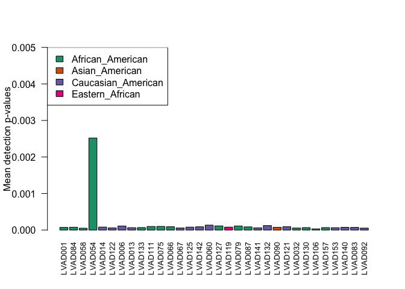
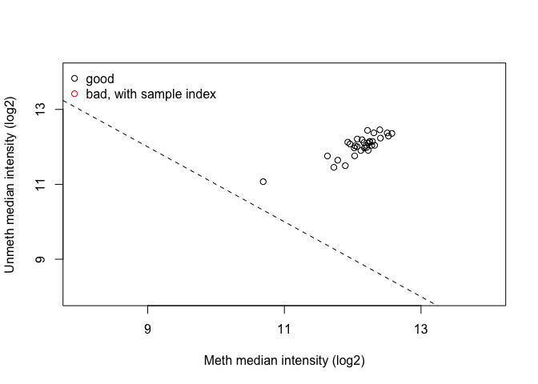
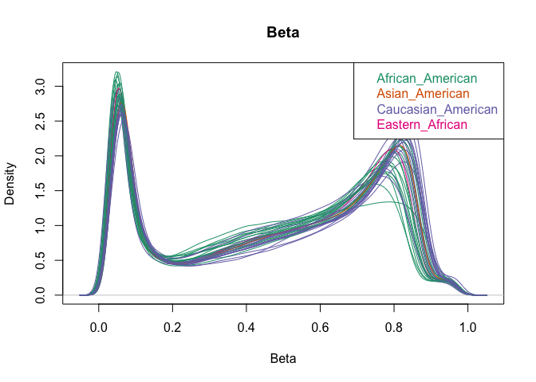
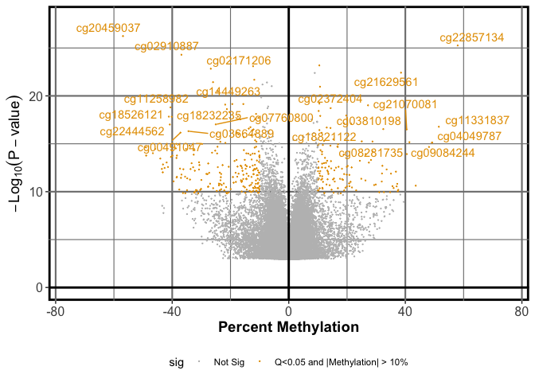

    <style type="text/css">
    .main-container {
      max-width: 1800px;
      margin-left: auto;
      margin-right: auto;
    }
    </style>


**Code Authors**: Mark E. Pepin **Contact**:
[pepinme\@gmail.com](mailto:pepinme@gmail.com){.email} **Institution**:
Heidelberg University Hospital **Location**: 669 Neuenheimer Feld,
Institute for Experimental Cardiology, 69120 Heidelberg, Germany

# Preliminary Setup

## Parameters

Define the parameters used, along with the conditions required for the
current analysis. This segment must be modified for each analysis
performed.


```r
##Set the experimental conditions [MUST DO THIS MANUALLY]
DIABETES=c("ND", "T2D") #Should define the reference group first
ISCHEMIA=c("NICM", "ICM")
RACE=c("Caucasian_American", "African_American") #, "Asian_American", "Eastern_African"
ISO=c("NONE", "DOB")
STATISTIC = 0.05 #P statistic threshold used in this combination.

VARIABLE = RACE

COMPARISON= paste0(VARIABLE[2], ".vs.", VARIABLE[1])

# Candidate Gene Selection (RNA-sequencing) EDIT THIS LIST BASED ON INTERESTS.
GENES=c("FABP4", "HOXC8","HOXC9")
VAR1="Race"
VAR2="Diabetes"
# Single Bar Graph
GENES=c("FABP4", "HOXC8","HOXC9")
# Pathway Gene Screening
GENE.Pathway<-read.csv("../2_Input/Gene.Sets/Oxphos.KEGG.csv", header = F) #Can alter the gene pathway (just change path)
colnames(GENE.Pathway)<-"external_gene_name"

# Create Output Folder Structure
ifelse(!dir.exists(file.path(paste0("../3_Output/"))), dir.create(file.path(paste0("../3_Output/"))), FALSE)
```

```
## [1] FALSE
```

```r
ifelse(!dir.exists(file.path(paste0("../3_Output/1_RNA/"))), dir.create(file.path(paste0("../3_Output/1_RNA/"))), FALSE)
```

```
## [1] FALSE
```

```r
ifelse(!dir.exists(file.path(paste0("../3_Output/2_Methyl/"))), dir.create(file.path(paste0("../3_Output/2_Methyl/"))), FALSE)
```

```
## [1] FALSE
```

```r
ifelse(!dir.exists(file.path(paste0("../3_Output/3_Combined/"))), dir.create(file.path(paste0("../3_Output/3_Combined/"))), FALSE)
```

```
## [1] FALSE
```

## Packages


```r
if (!require("pacman")) install.packages("pacman")
pacman::p_load(dplyr, Hmisc, openxlsx, corrplot, RColorBrewer, kableExtra, ggplot2, gridExtra, ggpubr, ggsignif, DESeq2, data.table, GenomicFeatures, biomaRt, Haplin, pheatmap, calibrate, ggrepel, tidyr, gtools)
```

# Patient Information

## Correlation and Covariate Network Analysis

The first task in this project was to verify that the heart failure
patients from which the cardiac tissues were obtained allowed for a
simple comparison (i.e. not requiring multiple regression) by both
racial and etiologic factors, as a means of examining the experimental
subjects for confounding variables. Although both small sample size and
limited medical documentation precluded any general conclusions, the
initial observations form that analysis prompted a larger follow-up
study. Therefore, cardiac biopsies from HF patients comprising equal
numbers of African American (AA) and age-matched Caucasian American (CA)
were collected for analysis (n = 15). Additionally, two additional
samples were obtained from patients who identified as U.S. immigrants,
both a first-generation eastern African and a second-generation eastern
Asian, leading to a total of 32 samples; however, one sample was removed
owing to concerns of poor analytic quality (see Expanded Methods). More
extensive curation of medical records was performed to understand
potential confounding effects of patient comorbidities and HF treatment
regimens (**Figure 2A**), followed by a pairwise comparison to identify
any significant differences (**Figure 2B-H**). Although a few
characteristics appeared to correlate with race, no significant
differences were present on pairwise comparison.


```r
library(openxlsx)
library(dplyr)
library(Hmisc)
library(corrplot)
library(RColorBrewer)
options(kableExtra.latex.load_packages = FALSE)
library(kableExtra)
Patient_Data <- openxlsx::read.xlsx("../2_Input/1_Patient/colData_CHAAMPS.FINAL.xlsx", sheet = "Matrix", rowNames = T)
Patient_Data<-as.data.frame(Patient_Data)
# Patient_Data<-dplyr::select(Patient_Data, -Syst.PA, -PCWP,-RA)
Patient_Data<-Patient_Data[complete.cases(Patient_Data),]

# # Print the table for use
# Patient_Data %>% kable(#format="latex", 
#                        align="c", 
#                        booktabs=T, 
#                        caption="Patient Characteristics") %>% 
#   kable_styling(latex_options=c("striped", 
#                                 "condensed", 
#                                 "repeat_header"))

# Format for Correlation
Patient_corr<-data.matrix(Patient_Data)
cor.r<-cor(Patient_corr)
paletteLength <- 100
myColor <- colorRampPalette(c("dodgerblue4", "white", "brown4"))(paletteLength)
p.mat<-cor.mtest(cor.r)$p
rownames(p.mat)<-rownames(cor.r)
colnames(p.mat)<-colnames(cor.r)
corrplot(cor.r, 
         order="original",
         type="full",
         method = "square",
         outline=FALSE,
         col = myColor,
         tl.cex=0.7,
         tl.col="black",
         p.mat=p.mat,
         sig.level = 0.05,
         insig="blank",
         addgrid.col = NA)
```


```r
pdf(file=paste0("../3_Output/_Patient/Patient.Correlation.pdf"))
corrplot(cor.r, 
         order="original",
         type="full",
         method = "square",
         outline=FALSE,
         col = myColor,
         tl.cex=0.7,
         tl.col="black",
         p.mat=p.mat,
         sig.level = 0.05,
         insig="blank",
         addgrid.col = NA)
dev.off()
```

```
## quartz_off_screen 
##                 2
```

## Patient Variables - Bar Graphs

To examine the changes of individual variables, we used bar graphs
according to patients' self-identified race, as previously reported
[@Pepin2019].


```r
#####################################################
# Bar Graphs of the PHI
######################################################
#Location where graphs will be saved
library(dplyr)
library(ggplot2)
library(ggpubr)
library(gridExtra)
VAR2="Race"
PARAMS=c("Age", "Creatinine", "Blood.Glucose", "LV.EF")

ifelse(!dir.exists(file.path(paste0("../3_Output/_Patient/Candidates/"))), dir.create(file.path(paste0("../3_Output/_Patient/Candidates/"))), FALSE)
```

```
## [1] FALSE
```

```r
# Patient_Data<-openxlsx::read.xlsx("../2_Input/_Patient/Patients_Health.Info.xlsx", sheet = "Matrix_Pre.v.CON", rowNames = T)
# Patient_Data$Sample_ID<-rownames(Patient_Data)
# Patient_Data<-dplyr::select(Patient_Data, -Sex)
# Patient_ALL<-reshape(Patient_Data, varying = 14:29, sep = "_", direction = "long")
# Patient_ALL<-dplyr::rename(Patient_ALL, Timing=time)

colData_all<-openxlsx::read.xlsx("../2_Input/1_Patient/colData_CHAAMPS.FINAL.xlsx", sheet = "Summary", rowNames = T, startRow = 2)
graph_info<-subset(colData_all, Race %in% RACE)

## create a function that converts factors to numeric
asNumeric=function(x){as.numeric(as.character(x))}
factorsNumeric=function(d){modifyList(d, lapply(d[, sapply(d, is.factor)], asNumeric))}

##
graph_info<-factorsNumeric(graph_info)
# graph_info$Response<-factor(graph_info$Response, levels = c("CON", "NR", "R"))
graph_info$Ischemia<-factor(graph_info$Ischemia, levels = c("NICM", "ICM"))
graph_info$Diabetes<-factor(graph_info$Diabetes, levels = c("ND", "T2D"))
graph_info$HTN<-factor(graph_info$HTN, levels = c("N", "Y"))

groupsize<-graph_info %>% group_by(Race) %>% tally()

#Define function for mean and standard deviation for each group
data_summary <- function(data, varname, groupnames){
  require(plyr)
  summary_func <- function(x, col){
    c(mean = mean(x[[col]], na.rm=TRUE),
      sd = sd(x[[col]], na.rm=TRUE))
  }
  data_sum<-ddply(data, groupnames, .fun=summary_func,
                  varname)
  data_sum <- rename(data_sum, c("mean" = varname))
 return(data_sum)
}
########################################################
plotlist = list()
for (i in seq_along(PARAMS)){
PARAM<-as.name(PARAMS[i]) #define a "name" for the variable
ds <- data_summary(graph_info, varname=PARAM, groupnames=c(VAR2))
ds<-dplyr::left_join(ds, groupsize)
ds<-dplyr::mutate(ds, upper=ds[,2]+(sd/sqrt(n-1)))
patient<-ggplot(ds, aes_string(x=VAR2, y=PARAMS[i], fill=VAR2)) + 
  geom_bar(stat="identity", color="black", 
           position=position_dodge()) +
  geom_errorbar(aes_string(ymin=PARAMS[i], ymax="upper"), width=.2,
                 position=position_dodge(.9))
patient_plot<-patient+labs(title=paste0("Patient Data - ", PARAMS[i]), x=VAR2, fill=VAR2)+
    theme_classic2(base_size = 10) +
    scale_fill_manual(values=c('black', "white", "#999999")) + 
    stat_compare_means(mapping = aes_string(x=VAR2, y=PARAMS[i]), data = graph_info,label = "p.signif")
pdf(file=paste0("../3_Output/_Patient/Candidates/", PARAMS[i], "_", VAR2, "_barplot.pdf"), width = 3.5, height = 2.5)
print(patient_plot)
dev.off()
plotlist[[i]] = patient_plot
}
t<-marrangeGrob(grobs = plotlist, legend, nrow=3, ncol=2)
ggsave(paste0("../3_Output/_Patient/Candidates/_barplots_", VAR2, ".pdf"), t, width = 6, height = 7)

##########################################################
#Boxplot
##########################################################

plotlist = list()
for (i in seq_along(PARAMS)){
PARAM<-as.name(PARAMS[i]) #define a "name" for the variable
ds <- data_summary(graph_info, varname=PARAM, groupnames=c(VAR2))
ds<-dplyr::left_join(ds, groupsize)
ds<-dplyr::mutate(ds, upper=ds[,2]+(sd/sqrt(n-1)))
g<-ggplot(graph_info, aes_string(x=VAR2, y=PARAMS[i], fill=VAR2)) + 
  geom_boxplot() + stat_compare_means(label = "p.signif")
g_plot<-g+labs(title=paste0("Patient Data - ", PARAMS[i]), x=VAR2)+
   theme_classic2(base_size = 10) +
   scale_fill_manual(values=c('black', "white", "#999999")) + ylim(NA, max(ds$upper+.25*(ds$upper)))
pdf(file=paste0("../3_Output/_Patient/Candidates/", PARAMS[i], "_", VAR2, "_boxplot.pdf"), width = 3.5, height = 2.5)
print(g_plot)
dev.off()
plotlist[[i]] = g_plot
}
t<-marrangeGrob(grobs = plotlist, legend, nrow=3, ncol=2)
ggsave(paste0("../3_Output/_Patient/Candidates/_boxplots_", VAR2, ".pdf"), t, width = 6, height = 7)
```

\pagebreak

# Pilot Analysis - Illumina(R) HumanMethylation 450k Array

The current study originated from the preliminary analysis of a cohort
(n = 11) of patients with ischemic and non-ischemic end-stage HF
(**Figure 1A**). Although we have previously reported that a patient's
history of ischemic heart diseases is most responsible for global
differences in cardiac DNA methylation within this cohort (57), it was
noted here that many of the CpG probes on the array exhibited only
subtle differences in methylation intensity.


```r
#   Differential expression analysis with limma
library(openxlsx)
library(magrittr)
library(dplyr)
library(ggpubr)
library(matrixStats)
library("ggrepel")
library(ggplot2)
library(cowplot) 
m450k<-read.xlsx("../2_Input/_Pilot/Pepin.Wende_2018.xlsx", sheet = "betaData", rowNames = T)
colData_m450k<-read.xlsx("../2_Input/_Pilot/Pepin.Wende_2018.xlsx", sheet = "colData")
# MDS in ggplot2
Ntop = 1000
RowVar<-rowVars(data.matrix(m450k)) #calculate variances for each row (vector)
MDS.set<-as.data.frame(cbind(m450k, RowVar))
MDS_matrix<-MDS.set %>% arrange(desc(RowVar)) %>% top_n(Ntop,RowVar) #Select top N rows by variance
# Compute MDS
mds <- MDS_matrix %>% dplyr::select(-RowVar) %>% t(.) %>%
  dist() %>%          
  cmdscale() %>%
  as_tibble()
colnames(mds) <- c("Dim.1", "Dim.2")
rownames(mds)<-colnames(m450k)
mds$Sample_Name<-rownames(mds)
mds<-dplyr::inner_join(mds, colData_m450k)

#K-means clustering
clust <- kmeans(mds[,1:2], 2)$cluster %>%
  as.factor()
mds <- mds %>%
  mutate(kmeans.2 = clust)
# Main plot
COLOR=c("#1b9e77", "#7570b3")
pmain <- ggplot(mds, aes(x = Dim.1, y = Dim.2, color = Race))+
  scale_color_manual(values = COLOR) +
  theme(panel.background = element_rect("white", colour = "black", size=2), 
      panel.grid.major = element_line(colour = "gray50", size=.75), 
      panel.grid.minor = element_line(colour = "gray50", size=0.4),
      legend.position="bottom",
      legend.key=element_blank(),
      axis.text = element_text(size = 12),
      axis.title = element_text(size = 14, face="bold")) +
  geom_hline(yintercept = 0, size = 1) + 
  geom_vline(xintercept=0, size=1) +
  geom_point()+
  stat_ellipse()+
  geom_text_repel(data=mds, aes(label=Sample_Name), show_guide  = F) +
  labs(x="Principal Component 1", 
       y="Principal Component 2")
# Marginal densities along x axis
xdens <- axis_canvas(pmain, axis = "x")+
  geom_density(data = mds, aes(x = Dim.1, fill = Race),
              alpha = 0.7, size = 0.2)+
  scale_fill_manual(values = COLOR)
# Marginal densities along y axis
ydens <- axis_canvas(pmain, axis = "y", coord_flip = TRUE)+ #must set coord_flip = true if using coord_flip() below
  geom_density(data = mds, aes(x = Dim.2, fill = Race),
                alpha = 0.7, size = 0.2)+
  coord_flip()+
  scale_fill_manual(values = COLOR)
p1 <- insert_xaxis_grob(pmain, xdens, grid::unit(.2, "null"), position = "top")
p2<- insert_yaxis_grob(p1, ydens, grid::unit(.2, "null"), position = "right")
pdf(file="../3_Output/2_Methyl/Pilot.Scatterhist.pdf", height = 7, width = 7, onefile = F)
ggdraw(p2)
dev.off()
```

```
## quartz_off_screen 
##                 2
```

# Genome-wide DNA methylation - Illumina(R) HumanMethylation EPIC Array

To replicate our pilot analysis of DNA methylation in the testing
cohort, cardiac DNA methylation analysis was again performed using these
31 cardiac ventricular biopsies
[(GSE164197)](https://www.ncbi.nlm.nih.gov/geo/query/acc.cgi?acc=GSE164197).


```
## [1] FALSE
```

```
## [1] "../2_Input/3_Methyl/Wende_CHAAMP_MethylationEPIC_Sample_Sheet.csv"
```

```
## quartz_off_screen 
##                 2
```

```
## class: RGChannelSet 
## dim: 1051815 32 
## metadata(0):
## assays(2): Green Red
## rownames(1051815): 1600101 1600111 ... 99810990 99810992
## rowData names(0):
## colnames(32): LVAD001 LVAD084 ... LVAD083 LVAD092
## colData names(17): Sample_Name Sample_Well ... Basename filenames
## Annotation
##   array: IlluminaHumanMethylationEPIC
##   annotation: ilm10b4.hg19
```

```
## quartz_off_screen 
##                 2
```

<!-- --><!-- -->

```
## quartz_off_screen 
##                 2
```

<!-- -->

```
## quartz_off_screen 
##                 2
```

<!-- -->

```
## quartz_off_screen 
##                 2
```

```
## quartz_off_screen 
##                 2
```

## SNPs in Methylation Data

SNPs have been shown to confound the interpretation of methylation
arrays when mutations exist within the CpG sites. To address this
concern, a package called "MethylToSNP" exists to identify novel SNPs
based on methylation array data, which has been proposed to reduce the
number of CpGs that are filtered. Using this approach, 1,294 CpGs were
identified as putative SNPs which are likely influenced by minor allele
fractions (MAFs); among these, 1,076 (83%) have been idenbtified as SNPs
via published genomic sequencing analyses.

To determine whether the SNP frequency in our dataset contributes to
racial differences, the beta values within these SNPs were clustered via
hierarchical clustering, resulting in a complete separation according to
patient race (see figure).


```r
#Remove SNPs
##Option 1: Built-in function that removes all known SNPs
gRatioSet_noSNPs<-dropLociWithSnps(gRatioSet.quantile, snps = c("SBE", "CpG"), maf = 0) #Doing this removes ~40% of all SNPs in the EPIC array
##Option 2: Identify putative SNPs using methylation barcoding (i.e. "gap hunting")
library("MethylToSNP")
library("RColorBrewer")
library("pheatmap")
Mvalues<-as.data.frame(getM(MSet))
x <- MethylToSNP(MSet, SNP=SNPs.147CommonSingle, verbose=TRUE)
x$CpG_ID<-rownames(x)
###
pdf(file="../3_Output/2_Methyl/Putative.SNPs.pdf", width = 10, height = 5) #Print Putative SNP Methylation
plotPotentialSNPs(x, MSet)
dev.off()
```

```
## quartz_off_screen 
##                 2
```

```r
plotPotentialSNPs(x, MSet)
```

<!-- -->

```r
SNPs<-merge(x, as.data.frame(getM(MSet)), by = "row.names")
write.csv(SNPs, "SNPs.csv")
SNPs_matrix<-SNPs %>% set_rownames(.$Row.names) %>% dplyr::select(contains("LVAD"), -LVAD054)  %>% data.matrix()
SNPs_matrix<-SNPs_matrix[!is.infinite(rowSums(SNPs_matrix)),] #One infinite value exists!! (took ~2-3 days to troubleshoot)

# Index
Index<-openxlsx::read.xlsx("../2_Input/1_Patient/colData_CHAAMPS.FINAL.xlsx", sheet = "Summary", startRow = 2, rowNames = TRUE)
Index_SNPs<-Index[colnames(SNPs_matrix),] %>% dplyr::select(Race)
ann_colors = list(Race = c(African_American="#1b9e77", Asian_American = "#d95f02", Caucasian_American="#7570b3", Eastern_African = "#e7298a"))
paletteLength <- 100
myColor <- colorRampPalette(c("dodgerblue4", "white", "gold2"))(paletteLength)
ann_colors = list(Race = c(African_American="#1b9e77", 
                           Asian_American = "#d95f02", 
                           Caucasian_American="#7570b3", 
                           Eastern_African = "#e7298a"))

heatmap_SNP<-pheatmap(SNPs_matrix, scale="row", #Heatmap of SNPs
                      cluster_cols = TRUE, 
                      cluster_rows = TRUE,
                     cutree_cols = 3,
                     cutree_rows = 4,
                     angle_col = 45,
                     fontsize_col = 8,
                     color = myColor, 
                     show_rownames = FALSE, 
                     border_color = NA, 
                     annotation_colors = ann_colors,
                     annotation_col = Index_SNPs,
                    filename = paste0("../3_Output/2_Methyl/SNPS.heatmap.pdf"))
pheatmap(SNPs_matrix, scale="row", #Heatmap of SNPs
                      cluster_cols = TRUE, 
                      cluster_rows = TRUE,
                     cutree_cols = 3,
                     cutree_rows = 4,
                     angle_col = 45,
                     fontsize_col = 8,
                     color = myColor, 
                     show_rownames = FALSE, 
                     border_color = NA, 
                     annotation_colors = ann_colors,
                     annotation_col = Index_SNPs)
## Cluster Analysis
hc <-heatmap_SNP$tree_row
lbl <- cutree(hc, 4) # split gene dendrogram in 5 groups
cluster1<-which(lbl==1)
cluster2<-which(lbl==2)
cluster3<-which(lbl==3)
cluster4<-which(lbl==4) 
#
Cluster1_data<-SNPs_matrix[cluster1,]
Cluster2_data<-SNPs_matrix[cluster2,]
Cluster3_data<-SNPs_matrix[cluster3,]
Cluster4_data<-SNPs_matrix[cluster4,]
#
heatmap_c1<-pheatmap(Cluster1_data, scale="row", 
                      cluster_cols = TRUE, 
                      cluster_rows = TRUE,
                      #breaks = myBreaks,
                      cutree_cols = 2,
                      angle_col = 45,
                      fontsize_col = 8,
                      color = myColor, 
                      show_rownames = FALSE, 
                      border_color = NA, 
                      annotation_colors = ann_colors,
                     annotation_col = Index_SNPs,
                      filename = paste0("../3_Output/2_Methyl/SNPS_Cluster1.heatmap.pdf"))
#
heatmap_c2<-pheatmap(Cluster2_data, scale="row", 
                      cluster_cols = TRUE, 
                      cluster_rows = TRUE,
                      #breaks = myBreaks,
                      cutree_cols = 2,
                      angle_col = 45,
                      fontsize_col = 8,
                      color = myColor, 
                      show_rownames = FALSE, 
                      border_color = NA, 
                     annotation_colors = ann_colors,
                     annotation_col = Index_SNPs,
                      filename = paste0("../3_Output/2_Methyl/SNPS_Cluster2.heatmap.pdf"))
#
heatmap_c3<-pheatmap(Cluster3_data, scale="row", 
                      cluster_cols = TRUE, 
                      cluster_rows = TRUE,
                      #breaks = myBreaks,
                      cutree_cols = 2,
                      angle_col = 45,
                      fontsize_col = 8,
                      color = myColor, 
                      show_rownames = FALSE, 
                      border_color = NA, 
                     annotation_colors = ann_colors,
                     annotation_col = Index_SNPs,
                      filename = paste0("../3_Output/2_Methyl/SNPS_Cluster3.heatmap.pdf"))
#
heatmap_c4<-pheatmap(Cluster4_data, scale="row", 
                      cluster_cols = TRUE, 
                      cluster_rows = TRUE,
                      #breaks = myBreaks,
                      cutree_cols = 2,
                      angle_col = 45,
                      fontsize_col = 8,
                      color = myColor, 
                      show_rownames = FALSE, 
                      border_color = NA, 
                     annotation_colors = ann_colors,
                     annotation_col = Index_SNPs,
                      filename = paste0("../3_Output/2_Methyl/SNPS_Cluster4.heatmap.pdf"))
```

\#\#MDS Plot - Unsupervised Clustering by Race

Because such a robust racial signature in cardiac DNA methylation was
seen in the pilot analysis, we reproduced the unsupervised method in the
larger cohort. This time, we continue to see a distinct racial
difference. Furthermore, we found that this racially-determined
clustering persisted to among the 500,000 most-variable CpG probes in
the EPIC array.


# Differential Methylation of African American and Caucasian_American

\#\#DMPs

Owing to the remarkable separation by patient race, we chose to identify
the CpG sites responsible for a race-based epigenomic difference.


```r
library(minfi)
library(limma)
library(shinyMethyl)
library(dplyr)
library(IlluminaHumanMethylationEPICanno.ilm10b5.hg38)
library(IlluminaHumanMethylationEPICmanifest)
library(RColorBrewer)
#########Part 1: Importing the Data
#Parameters
##Set the experimental conditions
DIABETES=c("ND", "T2D") #Should define the reference group first
ISCHEMIA=c("NICM", "ICM")
RACE=c("Caucasian_American", "African_American")
ISO=c("NONE", "DOB")
STATISTIC = 0.05 #P statistic threshold used in this combination.
VARIABLE = RACE
COMPARISON= paste0(VARIABLE[2], ".vs.", VARIABLE[1])
ifelse(!dir.exists(file.path("../3_Output/2_Methyl/", COMPARISON)), dir.create(file.path("../3_Output/2_Methyl/", COMPARISON)), FALSE)
```

```
## [1] FALSE
```

```r
##Get the array annotation
annoEPIC<-getAnnotation(IlluminaHumanMethylationEPICanno.ilm10b5.hg38)
annoEPIC<-dplyr::select(as.data.frame(annoEPIC), Name, chr, pos, Relation_to_Island, UCSC_RefGene_Name, UCSC_RefGene_Accession, UCSC_RefGene_Group, Regulatory_Feature_Group)
#Import the sample sheet
targets<-read.metharray.sheet(base="../2_Input/3_Methyl", pattern="csv$")
```

```
## [1] "../2_Input/3_Methyl/Wende_CHAAMP_MethylationEPIC_Sample_Sheet.csv"
```

```r
targets<-dplyr::filter(targets, Sample_Name!="LVAD054") #OUTLIER
# Filter targets
targets_filtered<-subset(targets, Race %in% RACE & Diabetes %in% DIABETES & Ischemia %in% ISCHEMIA)
#Import the array data from input directory (red and green .idat files)
RGSet<-read.metharray.exp(base = "../2_Input/3_Methyl/", targets = targets_filtered, verbose = TRUE)
sampleNames(RGSet)<-targets_filtered$Sample_Name
#Check the phenotype metadata to verify correct parsing
phenoData<-pData(RGSet)
#Get the manifest annotation (EPIC, methyl450k, etc...)
manifest<-getManifest(IlluminaHumanMethylationEPICmanifest)
typeIProbes <- getProbeInfo(manifest, type = "I")$Name
##Quality Control
#First step is to identify CpGs that failed to identify methylated positions (defined by expression intensity that reflects background levels)
detP<-detectionP(RGSet)
failed<-detP>0.01
#Determine the fraction of "failed" CpG probes (those which failed to identify a methylated CpG)
colMeans(failed)
```

```
##      LVAD001      LVAD084      LVAD058      LVAD014      LVAD122      LVAD006 
## 0.0002089850 0.0001916658 0.0001200798 0.0002678702 0.0001974388 0.0003175186 
##      LVAD013      LVAD133      LVAD111      LVAD075      LVAD066      LVAD067 
## 0.0001697281 0.0001766558 0.0003129001 0.0003486932 0.0003048179 0.0001731920 
##      LVAD125      LVAD142      LVAD060      LVAD127      LVAD079      LVAD087 
## 0.0002286134 0.0002678702 0.0003452293 0.0004018054 0.0003683216 0.0002771071 
##      LVAD141      LVAD132      LVAD121      LVAD032      LVAD130      LVAD106 
## 0.0001835835 0.0003025086 0.0002320772 0.0002112942 0.0002136034 0.0001177705 
##      LVAD157      LVAD153      LVAD140      LVAD083      LVAD092 
## 0.0002205311 0.0001951296 0.0002274588 0.0002147580 0.0001604912
```

```r
#Convert R/G to Methylated/Unmethylated in an object of class MethylSet
MSet<-preprocessRaw(RGSet)
#QC data
qc<-getQC(MSet)
plotQC(qc)
```

<!-- -->

```r
##Density plot
gRatioSet.quantile <- preprocessQuantile(RGSet, fixOutliers = TRUE, removeBadSamples = TRUE, badSampleCutoff = 10.5, quantileNormalize = TRUE, stratified = TRUE, mergeManifest = TRUE, sex = NULL)
#Quantification and Differential Expression Analysis
mVals<-getM(gRatioSet.quantile)
mVals<-mVals[,targets_filtered$Sample_Name]
phenoData<-phenoData[targets_filtered$Sample_Name,] #ensure that mVals has the same data as phenoData, otherwise dmpFinder won't work.
#Use Limma to perform differential methylation analysis using M-values (logit-transformed methylation data)
targets_filtered$Race<-factor(targets_filtered$Race)
targets_filtered$Race<-relevel(targets_filtered$Race, ref = "Caucasian_American")
targets_filtered$Diabetes<-factor(targets_filtered$Diabetes)
targets_filtered$ICM<-factor(targets_filtered$Ischemia)
design<-model.matrix(~0+Race, data = targets_filtered)
fit <- lmFit(mVals, design)
contMatrix <- makeContrasts(Race=RaceAfrican_American-RaceCaucasian_American,
                           levels=design)
contMatrix
```

```
##                         Contrasts
## Levels                   Race
##   RaceCaucasian_American   -1
##   RaceAfrican_American      1
```

```r
fit2 <- contrasts.fit(fit, contMatrix)
fit2 <- eBayes(fit2)
summary(decideTests(fit2))
```

```
##          Race
## Down      550
## NotSig 864898
## Up        411
```

```r
DMPs <- topTable(fit2, number = "all", adjust.method = "BH")
DMPs<-merge(DMPs, annoEPIC, by= 0)
rownames(DMPs)<-DMPs$Row.names
DMPs<-DMPs %>% dplyr::select(-Row.names)
beta <- getBeta(gRatioSet.quantile)
#create an annotation table
beta.table<-beta
colnames(beta.table)<-phenoData$Sample_Name
write.csv(beta.table, paste0("../3_Output/2_Methyl/", COMPARISON, "/", COMPARISON, "_beta.table.csv"))
# annotated<-merge(beta.table, as.data.frame(Islands.UCSC), by = 0)
# annotated<-merge(annotated, as.data.frame(Locations), by.x = "Row.names", by.y = 0)
# annotated<-merge(annotated, as.data.frame(Other), by.x = "Row.names", by.y = 0)
# rownames(annotated)<-annotated$Row.names

#Merge annotation with differential methylation table
# Results_dmp<-merge(DMPs, annotated, by = 0) #
Results_dmp<-merge(DMPs, beta.table, by = 0)
#Calculate Average CpG Methylation by race - African_American
library(dplyr)
library(matrixStats)
Results<-Results_dmp %>% replace(is.na(.), 0) %>% mutate(
  African_American_SD = rowSds(as.matrix(Results_dmp[,targets_filtered$Sample_Name[targets_filtered$Race=="African_American"]])),
  African_American_Mean = rowMeans(as.matrix(Results_dmp[,targets_filtered$Sample_Name[targets_filtered$Race=="African_American"]])),
  Caucasian_American_SD = rowSds(as.matrix(Results_dmp[,targets_filtered$Sample_Name[targets_filtered$Race=="Caucasian_American"]])),
  Caucasian_American_Mean = rowMeans(as.matrix(Results_dmp[,targets_filtered$Sample_Name[targets_filtered$Race=="Caucasian_American"]])),
  Methylation.Diff=(African_American_Mean-Caucasian_American_Mean)*100
)
rownames(Results)<-Results$Row.names
Results_dmp_p05<-filter(Results, P.Value<0.05)
Results_dmp_q05<-filter(Results, adj.P.Val<0.05)
#########################################
#Identify Promoter-associated CpG Islands
library(tidyr)
PromCGI<-dplyr::filter(Results_dmp_p05, grepl("Island", Relation_to_Island), grepl("TSS", UCSC_RefGene_Group))
#Separate Gene Names into unique rows
PromCGI_sep<-PromCGI %>% mutate(UCSC_RefGene_Name = strsplit(as.character(UCSC_RefGene_Name), ";")) %>% unnest(UCSC_RefGene_Name) %>% distinct()

#Save a copy of the countData
library(openxlsx)
wb_countData<-createWorkbook()
addWorksheet(wb_countData, "Unfiltered")
  writeData(wb_countData, "Unfiltered", Results, startCol = 1)
addWorksheet(wb_countData, "P_0.05")
  writeData(wb_countData, "P_0.05", Results_dmp_p05, startCol = 1)
addWorksheet(wb_countData, "Q_0.05")
  writeData(wb_countData, "Q_0.05", Results_dmp_q05, startCol = 1)
addWorksheet(wb_countData, "Promoter.CGI")
  writeData(wb_countData, "Promoter.CGI", PromCGI_sep, startCol = 1)
saveWorkbook(wb_countData, file = paste0("../3_Output/2_Methyl/", COMPARISON, "/", COMPARISON, "_DMPs.xlsx"), overwrite = TRUE)
```

\#\#DMRs


```r
library(DMRcate)
library(missMethyl)
library(biomaRt)
myAnnotation<-cpg.annotate(object = mVals, datatype = "array", what = "M", 
                           analysis.type = "differential", design = design, 
                           contrasts = TRUE, cont.matrix = contMatrix, 
                           coef = "Race", arraytype = "EPIC")
design_test<-model.matrix(~targets_filtered$Race)
DMRs <- dmrcate(myAnnotation, lambda=1000, C=2) #calculates DMRs
results.ranges <- extractRanges(DMRs)
beta<-beta[,targets_filtered$Sample_Name] #ensure that columns are ordered exactly the same as the targets_filtered table.
groups <- c(African_American="#1b9e77", Caucasian_American="#7570b3")
type<-factor(targets_filtered$Race)
cols <- groups[as.character(type)] #creates a string of colors for the DMR.plot function
pdf(file = "../3_Output/2_Methyl/DMR.top.pdf")
DMR.plot(ranges = results.ranges, dmr = 3, CpGs = beta, what = "Beta", arraytype = "EPIC", phen.col = cols, genome = "hg38")
dev.off()
```

```
## quartz_off_screen 
##                 2
```

```r
results.ranges.sig<-as.data.frame(results.ranges) %>% filter(Fisher < 0.05)
enrichment_GO <- goregion(results.ranges[(elementMetadata(results.ranges)[, "overlapping.genes"] %in% results.ranges.sig$overlapping.genes)], all.cpg = rownames(rownames(beta)), collection = "GO", array.type = "EPIC")

ensembl = useMart("ensembl",dataset="hsapiens_gene_ensembl") #uses human ensembl annotations
#gets gene symbol, transcript_id and go_id for all genes annotated with GO:0007507
gene.data <- getBM(attributes=c('external_gene_name', 'ensembl_transcript_id', 'go_id'), filters = 'go', values = 'GO:0006103', mart = ensembl)
```

## Distribution of Methylation by Genomic and CpG Annotation

The following figure illustrates the enrichment of differential
methylation within CpG "Open Seas" (non-Island associatd CpG sites)
found within the associated gene body.

**change the viewing angle of 3D-Histogram by dragging mouse across
it.**


```r
library(plotly)
library(dplyr)
library(stringr)
library(reshape2)
library(readxl)
library(kableExtra)

##Create a regional annotation matrix of the EPIC array
Region_epic<-Results_dmp %>% 
  dplyr::select(Row.names, UCSC_RefGene_Group, Relation_to_Island)
Stage1<-Region_epic %>% 
  mutate(UCSC_RefGene_Group = strsplit(as.character(UCSC_RefGene_Group), ";")) %>% 
  unnest(UCSC_RefGene_Group) 
Stage2<-Stage1 %>% 
  mutate(Relation_to_Island = strsplit(as.character(Relation_to_Island), ";")) %>%  
  unnest(Relation_to_Island)
Stage3<-distinct(Stage2)
Regional.Groups<-dplyr::group_by_(Stage3, "UCSC_RefGene_Group", "Relation_to_Island") %>% 
  tally()
Region.matrix<-Regional.Groups %>% 
  spread(Relation_to_Island, n)
Region.matrix<-Region.matrix %>% 
  dplyr::select(UCSC_RefGene_Group, OpenSea, N_Shelf, N_Shore, Island, S_Shore, S_Shelf)
rownames(Region.matrix)<-Region.matrix$UCSC_RefGene_Group
Region.matrix<-Region.matrix[c("TSS1500", "TSS200", "5'UTR", "1stExon", "Body", "ExonBnd", "3'UTR"),]
rownames(Region.matrix)<-Region.matrix$UCSC_RefGene_Group
Contour_3D_epic<-Region.matrix[,-1]
rownames(Contour_3D_epic)<-Region.matrix$UCSC_RefGene_Group
write.xlsx(Contour_3D_epic, "../3_Output/2_Methyl/Contour.3D_EPIC.xlsx")

##Create a regional annotation matrix of differentially-methylated positions
Region_p05<-Results_dmp_p05 %>% dplyr::select(Row.names, UCSC_RefGene_Group, Relation_to_Island)
Stage1<-Region_p05 %>% mutate(UCSC_RefGene_Group = strsplit(as.character(UCSC_RefGene_Group), ";")) %>% unnest(UCSC_RefGene_Group) 
Stage2<-Stage1 %>% mutate(Relation_to_Island = strsplit(as.character(Relation_to_Island), ";")) %>%  unnest(Relation_to_Island)
Stage3<-distinct(Stage2)
Regional.Groups<-dplyr::group_by_(Stage3, "UCSC_RefGene_Group", "Relation_to_Island") %>% tally()
Region.matrix<-Regional.Groups %>% spread(Relation_to_Island, n)
Region.matrix<-Region.matrix %>% dplyr::select(UCSC_RefGene_Group, OpenSea, N_Shelf, N_Shore, Island, S_Shore, S_Shelf)
rownames(Region.matrix)<-Region.matrix$UCSC_RefGene_Group
Region.matrix<-Region.matrix[c("TSS1500", "TSS200", "5'UTR", "1stExon", "Body", "ExonBnd", "3'UTR"),]
rownames(Region.matrix)<-Region.matrix$UCSC_RefGene_Group
Contour_3D<-Region.matrix[,-1]
rownames(Contour_3D)<-Region.matrix$UCSC_RefGene_Group
write.xlsx(Contour_3D, "../3_Output/2_Methyl/Contour.3D_DMPs.p05.xlsx")
### Identify DMP Enrichment (IMPORTANT)
Enrichment_Region<-Contour_3D/Contour_3D_epic
Promoter_enr<-Enrichment_Region[rownames(Enrichment_Region)=="TSS200",] + Enrichment_Region[rownames(Enrichment_Region)=="TSS1500",]
rownames(Promoter_enr)<-"Promoter"
Enrichment_Region<-Enrichment_Region %>% 
  filter(!grepl("TSS", rownames(Enrichment_Region))) %>%
  rbind(Promoter_enr, .) %>%
  data.matrix()
paletteLength<-100
myColor <- colorRampPalette(c("dodgerblue4", "white", "brown4"))(paletteLength)
pheatmap(Enrichment_Region, color = myColor, cluster_rows = FALSE, cluster_cols = FALSE)
```

<!-- -->

```r
##Make a Table of the CpG Methylation Distribution
Enrichment_Region %>% kable( align="c", booktabs=T, 
                     caption="Methylation Distribution") %>% 
  kable_styling(latex_options=c("striped", "condensed", "repeat_header"))
```

<table class="table" style="margin-left: auto; margin-right: auto;">
<caption>Methylation Distribution</caption>
 <thead>
  <tr>
   <th style="text-align:left;">   </th>
   <th style="text-align:center;"> OpenSea </th>
   <th style="text-align:center;"> N_Shelf </th>
   <th style="text-align:center;"> N_Shore </th>
   <th style="text-align:center;"> Island </th>
   <th style="text-align:center;"> S_Shore </th>
   <th style="text-align:center;"> S_Shelf </th>
  </tr>
 </thead>
<tbody>
  <tr>
   <td style="text-align:left;"> Promoter </td>
   <td style="text-align:center;"> 0.1285693 </td>
   <td style="text-align:center;"> 0.1358225 </td>
   <td style="text-align:center;"> 0.1551988 </td>
   <td style="text-align:center;"> 0.1823682 </td>
   <td style="text-align:center;"> 0.1568289 </td>
   <td style="text-align:center;"> 0.1320130 </td>
  </tr>
  <tr>
   <td style="text-align:left;"> 5'UTR </td>
   <td style="text-align:center;"> 0.0574760 </td>
   <td style="text-align:center;"> 0.0620397 </td>
   <td style="text-align:center;"> 0.0677872 </td>
   <td style="text-align:center;"> 0.0905560 </td>
   <td style="text-align:center;"> 0.0667659 </td>
   <td style="text-align:center;"> 0.0582758 </td>
  </tr>
  <tr>
   <td style="text-align:left;"> 1stExon </td>
   <td style="text-align:center;"> 0.0564209 </td>
   <td style="text-align:center;"> 0.0434783 </td>
   <td style="text-align:center;"> 0.0705167 </td>
   <td style="text-align:center;"> 0.0847120 </td>
   <td style="text-align:center;"> 0.0715037 </td>
   <td style="text-align:center;"> 0.0453401 </td>
  </tr>
  <tr>
   <td style="text-align:left;"> Body </td>
   <td style="text-align:center;"> 0.0600375 </td>
   <td style="text-align:center;"> 0.0646733 </td>
   <td style="text-align:center;"> 0.0697822 </td>
   <td style="text-align:center;"> 0.0974912 </td>
   <td style="text-align:center;"> 0.0749590 </td>
   <td style="text-align:center;"> 0.0661616 </td>
  </tr>
  <tr>
   <td style="text-align:left;"> ExonBnd </td>
   <td style="text-align:center;"> 0.0463516 </td>
   <td style="text-align:center;"> 0.0348432 </td>
   <td style="text-align:center;"> 0.0659091 </td>
   <td style="text-align:center;"> 0.0752212 </td>
   <td style="text-align:center;"> 0.0555556 </td>
   <td style="text-align:center;"> 0.0375940 </td>
  </tr>
  <tr>
   <td style="text-align:left;"> 3'UTR </td>
   <td style="text-align:center;"> 0.0630122 </td>
   <td style="text-align:center;"> 0.0531746 </td>
   <td style="text-align:center;"> 0.0837796 </td>
   <td style="text-align:center;"> 0.1099838 </td>
   <td style="text-align:center;"> 0.0596878 </td>
   <td style="text-align:center;"> 0.0493359 </td>
  </tr>
</tbody>
</table>

```r
write.xlsx(Enrichment_Region, paste0("../3_Output/2_Methyl/", COMPARISON, "/", COMPARISON, "_DMP.Enrichment_3D.xlsx"), rowNames = TRUE)
color <- colorRampPalette(c("grey", "orange", "red"))
t <- list(
  family = "times",
  size = 16,
  color = "black")
x_axis<-list(title = 'CpG Region', 
                     type="category", 
                     zeroline=TRUE, 
                     showline=TRUE, 
                     zerolinewidth = 4, 
            zerolinecolor="darkgrey", 
            linecolor="darkgrey", 
            linewidth=4, 
            titlefont=t, 
            tickfont=t)
y_axis<-list(title = 'Gene Region', 
                     type="category", 
                     zeroline=TRUE, 
                     showline=TRUE, 
                     zerolinewidth = 4, 
            zerolinecolor="darkgrey", 
            linecolor="darkgrey", 
            linewidth=4, 
            titlefont=t, 
            tickfont=t)
z_axis<-list(title = 'Number of DMPs', 
                     zerolinewidth = 4, 
                    zerolinecolor="darkgrey", 
                    linecolor="darkgrey", 
                    linewidth=4, 
                    titlefont=t, 
                    tickfont=t)
q<-plot_ly(z=~Enrichment_Region, colors=color(10), 
    text=as.character(rownames(Enrichment_Region))) %>% add_surface() %>% 
    layout(scene = list(xaxis = x_axis, yaxis = y_axis, zaxis = z_axis))

q #must comment out for PDF generation via knitr (Pandoc).
```

```{=html}
<div id="htmlwidget-31a6c8f5caeb552401e0" style="width:672px;height:480px;" class="plotly html-widget"></div>
<script type="application/json" data-for="htmlwidget-31a6c8f5caeb552401e0">{"x":{"visdat":{"5d62c659e50":["function () ","plotlyVisDat"]},"cur_data":"5d62c659e50","attrs":{"5d62c659e50":{"z":{},"text":["Promoter","5'UTR","1stExon","Body","ExonBnd","3'UTR"],"colors":["#BEBEBE","#CCB893","#DAB269","#E9AD3F","#F7A715","#FF9200","#FF6E00","#FF4900","#FF2400","#FF0000"],"alpha_stroke":1,"sizes":[10,100],"spans":[1,20],"type":"surface","inherit":true}},"layout":{"margin":{"b":40,"l":60,"t":25,"r":10},"scene":{"xaxis":{"title":"CpG Region","type":"category","zeroline":true,"showline":true,"zerolinewidth":4,"zerolinecolor":"darkgrey","linecolor":"darkgrey","linewidth":4,"titlefont":{"family":"times","size":16,"color":"black"},"tickfont":{"family":"times","size":16,"color":"black"}},"yaxis":{"title":"Gene Region","type":"category","zeroline":true,"showline":true,"zerolinewidth":4,"zerolinecolor":"darkgrey","linecolor":"darkgrey","linewidth":4,"titlefont":{"family":"times","size":16,"color":"black"},"tickfont":{"family":"times","size":16,"color":"black"}},"zaxis":{"title":"Number of DMPs","zerolinewidth":4,"zerolinecolor":"darkgrey","linecolor":"darkgrey","linewidth":4,"titlefont":{"family":"times","size":16,"color":"black"},"tickfont":{"family":"times","size":16,"color":"black"}}},"hovermode":"closest","showlegend":false,"legend":{"yanchor":"top","y":0.5}},"source":"A","config":{"showSendToCloud":false},"data":[{"colorbar":{"title":"Enrichment_Region","ticklen":2,"len":0.5,"lenmode":"fraction","y":1,"yanchor":"top"},"colorscale":[["0","rgba(190,190,190,1)"],["0.0416666666666667","rgba(196,188,174,1)"],["0.0833333333333333","rgba(201,185,158,1)"],["0.125","rgba(206,183,142,1)"],["0.166666666666667","rgba(212,181,126,1)"],["0.208333333333333","rgba(217,179,110,1)"],["0.25","rgba(222,177,95,1)"],["0.291666666666667","rgba(228,175,80,1)"],["0.333333333333333","rgba(233,173,63,1)"],["0.375","rgba(238,171,50,1)"],["0.416666666666667","rgba(244,169,35,1)"],["0.458333333333333","rgba(248,164,19,1)"],["0.5","rgba(251,157,11,1)"],["0.541666666666667","rgba(254,149,3,1)"],["0.583333333333333","rgba(255,137,0,1)"],["0.625","rgba(255,124,0,1)"],["0.666666666666667","rgba(255,110,0,1)"],["0.708333333333333","rgba(255,97,0,1)"],["0.75","rgba(255,83,0,1)"],["0.791666666666667","rgba(255,69,0,1)"],["0.833333333333333","rgba(255,57,0,1)"],["0.875","rgba(255,42,0,1)"],["0.916666666666667","rgba(255,30,0,1)"],["0.958333333333333","rgba(255,19,0,1)"],["1","rgba(255,0,0,1)"]],"showscale":true,"z":[[0.128569289569748,0.135822515232267,0.155198834270766,0.182368236572356,0.156828904460773,0.13201295259128],[0.05747596205554,0.0620396600566572,0.0677872183228666,0.0905559931553359,0.066765873015873,0.0582757584860318],[0.0564208691863631,0.0434782608695652,0.070516717325228,0.0847120048829066,0.0715036803364879,0.0453400503778338],[0.0600375234521576,0.0646732964025896,0.069782159749517,0.0974912397618075,0.07495900679316,0.0661616161616162],[0.0463516204961072,0.0348432055749129,0.0659090909090909,0.0752212389380531,0.0555555555555556,0.037593984962406],[0.063012226252855,0.0531746031746032,0.0837796480489671,0.109983766233766,0.0596877869605142,0.0493358633776091]],"text":["Promoter","5'UTR","1stExon","Body","ExonBnd","3'UTR"],"type":"surface","frame":null}],"highlight":{"on":"plotly_click","persistent":false,"dynamic":false,"selectize":false,"opacityDim":0.2,"selected":{"opacity":1},"debounce":0},"shinyEvents":["plotly_hover","plotly_click","plotly_selected","plotly_relayout","plotly_brushed","plotly_brushing","plotly_clickannotation","plotly_doubleclick","plotly_deselect","plotly_afterplot","plotly_sunburstclick"],"base_url":"https://plot.ly"},"evals":[],"jsHooks":[]}</script>
```

## Heatmap and Hierarchical Clustering of Differential Methylation (P\<0.05)


```r
library(pheatmap)
library(dplyr)
##Import Data Matrix
# betaHM<-read.csv("../2_Input/EPIC.betaValues.csv", row.names = 1)
## Filters to Apply to DMR
pvalue_threshold=0.05
DMP_location="Island"
Gene_region="TSS"

##Filter Differential Methylation Data
DMR.p05<-Results %>% filter(P.Value<pvalue_threshold)
DMR.p05<-DMR.p05 %>% dplyr::select(Row.names, 
                            Methylation.Diff, 
                            P.Value, 
                            adj.P.Val, 
                            Relation_to_Island, 
                            UCSC_RefGene_Group, 
                            chr, 
                            pos, 
                            contains("LVAD"))
DMR.p05.Region<-DMR.p05 %>% 
  # filter(grepl(DMP_location, Relation_to_Island)) %>%
  filter(grepl(Gene_region, UCSC_RefGene_Group)) %>% 
  dplyr::select(contains("LVAD")) %>%
  data.matrix()
#Import the Index File
LVAD_Counts_Data <- targets
rownames(LVAD_Counts_Data)<-targets$Sample_Name
Index<-LVAD_Counts_Data %>% dplyr::select(Race, Age, BMI)
Index<-as.data.frame(Index)
paletteLength <- 100
ann_colors = list(Race = c(African_American="#1b9e77", Asian_American = "#d95f02", Caucasian_American="#7570b3", Eastern_African = "#e7298a"))
heatmap_DMC<-pheatmap(DMR.p05.Region, scale="row", 
                      cluster_cols = TRUE, 
                      cluster_rows = TRUE,
                      #breaks = myBreaks,
                      cutree_cols = 2,
                      cutree_rows = 2,
                      angle_col = 45,
                      fontsize_col = 8,
                      color = myColor, 
                      show_rownames = FALSE, 
                      border_color = NA, 
                      annotation_col = Index,
                      annotation_colors=ann_colors,
                      filename = paste0("../3_Output/2_Methyl/", COMPARISON, "/", COMPARISON, "_", DMP_location, ".", Gene_region,"_", "ALL_SAMPLES.heatmap.pdf"))

heatmap_DMC<-pheatmap(DMR.p05.Region, scale="row", 
                      cluster_cols = TRUE, 
                      cluster_rows = TRUE,
                      #breaks = myBreaks,
                      cutree_cols = 2,
                      cutree_rows = 2,
                      angle_col = 45,
                      fontsize_col = 8,
                      color = myColor, 
                      show_rownames = FALSE, 
                      border_color = NA, 
                      annotation_col = Index,
                      annotation_colors=ann_colors)
```

<!-- ## GEO Coding -->

<!-- ```{r GEO.Coding} -->

<!-- library(dplyr) -->

<!-- library("ggplot2") -->

<!-- theme_set(theme_bw()) -->

<!-- library("sf") -->

<!-- library("rnaturalearth") -->

<!-- library("rnaturalearthdata") -->

<!-- library("tools") -->

<!-- library("maps") -->

<!-- states <- st_as_sf(map("state", plot = FALSE, fill = TRUE)) -->

<!-- states <- cbind(states, st_coordinates(st_centroid(states))) -->

<!-- states$ID <- toTitleCase(states$ID) -->

<!-- Patient_coord <- st_as_sf(colData_all, coords = c("Longitude", "Lattitude"), remove = FALSE,  -->

<!--     crs = 4326, agr = "constant") -->

<!-- pdf(file = "../3_Output/2_Methyl/GEO_Code.pdf", width = 10, height = 10) -->

<!-- ggplot(data = states) + -->

<!--     geom_sf() + -->

<!--     geom_sf(data = Patient_coord) + -->

<!--     geom_text_repel(data = Patient_coord, aes(x = Longitude, y = Lattitude, label = LVAD_ID), size = 3) + -->

<!--       geom_point(data = colData_all, aes(x = Longitude, y = Lattitude, colour=Race, label = LVAD_ID)) + -->

<!--     coord_sf(xlim = c(-90, -82), ylim = c(30, 36), expand = FALSE) -->

<!-- dev.off() -->

<!-- ``` -->

## Volcano Plot - DMPs


```r
# Load packages
library(dplyr)
library(ggplot2)
library(ggrepel)
library(openxlsx)
#
Results<-read.xlsx(paste0("../3_Output/2_Methyl/", COMPARISON, "/", COMPARISON, "_DMPs.xlsx"), sheet = "P_0.05")
#Read data from the web
Volcano_data = mutate(Results, sig=ifelse(Results$adj.P.Val<0.05 & abs(Results$Methylation.Diff)>10, "Q<0.05 and |Methylation| > 10%", "Not Sig"), minuslogpvalue = -log(P.Value), Methylation=Methylation.Diff)
max(Volcano_data$minuslogpvalue, na.rm = TRUE)
```

```
## [1] 36.50796
```

```r
# Results<-Results %>% filter(grepl("TSS", UCSC_RefGene_Group))
#plot the ggplot
p = ggplot(Volcano_data, aes(Methylation, minuslogpvalue, color = sig)) + 
  scale_color_manual(values=c('grey','#E69F00'))+
  theme(panel.background = element_rect("white", colour = "black", size=2), 
      panel.grid.major = element_line(colour = "gray50", size=.75), 
      panel.grid.minor = element_line(colour = "gray50", size=0.4),
      legend.position="bottom",
      legend.key=element_blank(),
      axis.text = element_text(size = 12),
      axis.title = element_text(size = 14, face="bold")) +
  geom_point(size = 0.08) + 
  labs(x="Percent Methylation", 
       y=expression(-Log[10](P-value))
       ) + xlim(-75,75)+ 
  ylim(0, 28) + 
  geom_hline(yintercept = 0, size = 1) + 
  geom_vline(xintercept=0, size=1) +
  geom_text_repel(data=filter(Volcano_data, minuslogpvalue>15, abs(Methylation) > 25), aes(label=Name), show_guide = F)
#add a repelling effect to the text labels.
p
```

<!-- -->

```r
pdf(file = paste0("../3_Output/2_Methyl/", COMPARISON, "/", COMPARISON, "Volcano.Plot.pdf"), height = 6, width = 5)
p
dev.off()
```

```
## quartz_off_screen 
##                 2
```

```r
## Interactive Volcano Plot
Filtered_methyl<-filter(Volcano_data, P.Value<0.05, abs(Methylation.Diff)>5)

library(plotly)
fig <- plot_ly(
  Filtered_methyl, x = ~Methylation, y = ~minuslogpvalue,
  # Hover text:
  text = ~paste("CpG: ", Methylation, '<br>P-value:', minuslogpvalue, '<br>CpG-ID:', Row.names, '<br>CpG-Region:', Relation_to_Island, '<br>Gene-Symbol:', UCSC_RefGene_Name),
  color = ~sig, size = ~minuslogpvalue
)
fig
```

```{=html}
<div id="htmlwidget-12e8cc0ed53c64533d10" style="width:672px;height:480px;" class="plotly html-widget"></div>
<script type="application/json" data-for="htmlwidget-12e8cc0ed53c64533d10">{"x":{"visdat":{"5d654bccf47":["function () ","plotlyVisDat"]},"cur_data":"5d654bccf47","attrs":{"5d654bccf47":{"x":{},"y":{},"text":{},"color":{},"size":{},"alpha_stroke":1,"sizes":[10,100],"spans":[1,20]}},"layout":{"margin":{"b":40,"l":60,"t":25,"r":10},"xaxis":{"domain":[0,1],"automargin":true,"title":"Methylation"},"yaxis":{"domain":[0,1],"automargin":true,"title":"minuslogpvalue"},"hovermode":"closest","showlegend":true},"source":"A","config":{"showSendToCloud":false},"data":[{"x":[-5.46440472263782,6.85531517698849,8.70081794861803,-12.585702804003,-17.7267620007629,22.070802957953,5.96660601610614,-6.86296410935613,-5.17340328679051,-6.40310216220857,6.94276692289572,5.6543778777456,6.65265009755037,5.2965411117235,-5.26003983100596,-6.17881392843887,5.88705875371444,11.5081583363769,-19.8054518065181,-12.9228843393766,-7.76381204674349,-5.61683114210277,6.03896076011307,5.78255558081752,5.0040810311476,-8.98094467374464,6.6638031026393,-10.3976646717122,9.84084235977038,14.0526645529991,-6.45094341605323,-9.9170460873726,-9.28969641946754,-6.59918598700142,7.11341318275555,16.748463085045,6.95341863645864,-7.25661624840637,-5.08763385461765,-10.3304744614058,5.49720291694676,6.11368344977284,11.7716940316848,-5.76688447332137,-23.7108414155497,9.2756113615819,-7.23935745900403,15.9083968656304,-5.80229089124429,5.44627988471411,-10.1026126849161,9.66940927933717,-9.08931601440678,6.18750677950515,18.5620383583114,12.263272218853,10.1000415206201,8.12065800666763,-5.67104111266694,-8.92239519396635,9.74595129488812,-9.21632416874622,-16.2248245205834,9.68085410696169,-7.4603450604125,-6.93782788393137,9.15258884660819,-5.67055170472032,5.10893908714385,7.17365607286948,-6.32335120655203,6.70688522147898,6.22888457189111,-5.6746001949203,-5.01440551699573,-12.509669206993,9.76358717030295,5.28532065393523,-5.00949438431167,18.238414163467,-12.2678719151735,-11.9898140166031,-9.03274180744869,14.3240298939045,5.60574945501007,15.8526443365175,-7.48699779696043,6.0469790176115,-11.6060482824756,-11.7753015906666,-9.86864642485582,-6.09000796504102,7.73642239695316,8.76655154132556,12.3279847643154,5.45096565145364,-17.0584696429874,-6.91974557227006,-5.10618134241738,12.9226833303351,-7.9227196237649,5.08562467487318,-5.11185925575373,-8.8209974345207,-14.6484136814508,6.49121184488463,12.625698824898,7.70779249804977,15.727712221091,-21.5087031051734,-5.29398473599371,5.09747221672789,15.1973325239729,6.09434312584947,-5.38530980844379,-15.1414710031292,-13.6615687488524,7.90014550553901,-5.89625920189105,-7.27811432022294,-14.4921270792939,10.7094273279884,6.32673785069172,5.99124083801366,-6.95474307578018,5.6708375959292,-6.04473717602075,-5.20274919645891,-5.08518182669385,22.050163800401,5.53050749978133,-5.99008930297791,5.95299141874281,6.14844578193577,-12.9277062698169,7.50124196555995,-27.7864079706897,-5.5775356049964,-7.62720198199632,-10.2011684829867,-7.15000022394214,-10.1616078614524,5.86454926155009,8.37887545226245,5.82347541942977,21.8893640533953,5.51642242226222,-5.67869568458054,-16.8118171693402,8.59990542925189,-7.65959772387201,-8.49629349481425,-5.48181341075631,5.16050481376454,-7.5421093672487,-9.27527428395578,-8.04643252437309,6.60038348999087,12.7532430546424,9.60729342580389,5.35255856675569,-13.5275870164211,-7.95715822689728,-6.58455355812028,-9.50601796787077,-6.87697635623855,-8.45004791442139,6.44633331105201,-9.31556047601166,-8.65768803129288,6.01938340362103,6.32083818280455,-5.91037729471198,5.18402707529632,22.6291312784282,-5.59299665514618,-6.02529775663194,-6.27445903755479,7.47355054885893,5.71757399905263,5.31135176216462,-8.48864780604372,-6.08872405763099,-25.9227151038876,-9.43472681818109,6.75757886119648,5.38881569768254,14.2787336621613,-8.2935482511448,-12.8331642589353,-6.54527299111795,-5.03263784864128,-13.5053913244854,5.90903511532164,-5.61757208401983,6.4588474929945,-6.28911934151658,-9.24284584245442,-5.74983035394423,-9.936285336404,-5.57901037022158,5.70798001146993,-6.15796620068267,-5.87605226755305,-7.57302095552316,-9.2445858440928,-15.0615755797903,-5.44274385644208,5.59068273618892,15.3483332795929,-7.53343800853506,-5.99494782488735,19.3485333470682,8.6929609013317,5.7188384222317,6.6087082464289,-7.0324770157743,-6.09634637581938,-8.94859844732771,9.8369101441526,-11.2844769881107,5.14338908199788,5.36536882694008,-19.9078214394012,-8.07400648062728,-6.42283056902645,17.0704174113411,9.89048288035653,8.81071823486393,6.60279862165057,-6.63252612210939,5.37624360941588,-6.48508601334269,7.54536687969705,11.9819306310543,5.06780764221426,-9.11141986753201,8.94148750997019,6.28840411982197,-5.24943334157934,-8.085002084339,-14.1192442350536,-8.78850804647026,-5.30768937728173,-7.74638670011428,5.81550159511992,5.2551307935588,5.72719851435049,-5.44132565860718,-5.95639023403722,-9.95941786010847,5.51044716087971,5.53457429496026,-8.76578610668432,-12.8813331563989,-6.50219969073137,-9.98889913425635,-5.15694288604946,10.3268352650839,5.18247310261654,-7.36217883472225,-5.20973354392972,-9.6885501507232,-6.1705974473969,5.52906312873312,-5.46381738925979,-5.86791722872639,-6.27405355511532,9.67536384668323,-5.8323802426568,-6.58983055616433,6.39272743445327,-9.82962173378953,-6.27109054000274,11.6171572202687,-7.60020769227926,6.29136371155497,-15.5859906986407,5.06996034784696,-6.13934622355394,5.72956891837676,6.12916660007149,9.35232283980896,-14.1955656310142,7.67525183567536,12.7980557692351,9.27770057266179,-21.0661930338073,-6.19841601995149,12.8318420059485,5.67512072555758,5.11551086952665,9.24756068799595,-6.32610810239148,-5.7224450826439,7.7145269309412,6.49227225721226,8.26662243053213,16.2041768191767,-5.01226744234813,-9.1819375241711,-6.27855580316686,-5.92056665050447,-5.81694577381852,5.28270033693388,-9.72607782164192,-6.8977006352485,-7.8495540559395,-13.1241622987182,-9.46906892672069,6.31417733241114,5.6192769634002,-5.65077135818072,5.16677619673668,6.39192872522367,-6.89120550296343,-18.8150549246958,6.32013150887337,-5.63611614487547,7.6552587093637,9.47246358317657,-5.09146705694271,5.98403762054878,8.16536886145915,-5.06227807330593,-6.15582521348526,-18.7909533795038,-18.1108142202503,-10.1936272777039,23.531573945713,-8.73575236127024,-8.96864229619769,-6.55840941166035,8.65014467525746,-7.38537004738165,-5.45127534108155,-7.26982590563197,-7.18625419220963,6.00392375322655,5.18460491584466,19.922723101573,11.4926144956018,7.35555138936945,-5.62675559235728,-5.87785042295218,9.12011329737621,8.54290659925969,-8.02653806385306,-20.855124433078,-6.39046841027446,5.65667206328851,16.111596054721,-7.20792647192697,-5.34712708456675,5.04481939360612,8.60138431748376,-5.75248158509606,-6.9758301429746,-5.17063510286295,14.6981078911477,5.96589104338501,-9.36846257395717,-23.0391022494048,-6.37833964121628,-5.41203218912036,5.87654558996114,7.01315175354764,-5.78511973701543,5.11482285892962,-7.51347666543323,12.5237303961336,-7.7634437287511,5.3093537174122,7.11829724169181,-12.0227729856525,-20.307305494707,5.71562022439214,7.83049902360424,5.93972033178151,5.50191136547307,6.5172706832349,-25.0691465648626,-6.36790532992798,-7.02700044212344,29.2519748741668,-23.1919416987792,-10.7663529075831,5.56168254326269,-5.35309187580226,-8.10652011123548,5.09248552035528,-7.88188708851316,-8.98311352221444,5.20169043081561,6.24547004832285,-6.70999016728612,8.14936455601779,-8.02617422733118,7.56657299945827,17.2238577848773,19.1963386665255,-5.45191661420167,-6.92765401367893,5.83767179080242,7.35952558357312,-5.87985199106829,-7.62223195632515,33.459306204664,8.25705712353586,7.87033059768241,9.70777003490371,6.16745719688696,-24.2826834406019,22.1335044481934,-6.05625879539796,5.95917356910574,-5.1526764908742,-7.92645315516124,8.40625035329622,-12.2291514279213,5.33901641231647,14.0947395956755,-6.50632155770461,-9.63312812389513,18.7625641165011,5.18790179379474,-7.61909997875301,6.72797595098889,7.04602070579353,-8.07674276841204,-7.3000644696242,-20.3632512643098,-7.2404031145637,-5.07464406592213,5.67594949117548,10.8215323192088,5.59948424318959,5.74445892267172,-5.16206804765419,7.53205376828675,-5.12039066997908,-5.09111782043905,-7.97631764858446,17.1334779618087,-15.5229557092767,-9.04119066731414,-6.32396338022909,6.29849218061842,7.7005718878897,14.1690046820362,-12.1131401957091,-17.2964615102128,5.61796702813117,6.90334803302715,5.44502234311686,6.19490877998871,6.11598667763696,-9.79490802688282,8.92195477288346,-6.84609967923095,12.3903076977285,-5.45441827719469,-6.39801358985766,14.6130017715666,-6.04012389539029,-11.1011987197827,-12.3507839427387,-7.85457140622345,-7.52048782743784,8.020904424067,-8.52578318244768,-5.25544500343111,5.08377508696276,-6.71740957956598,-5.43493084517491,7.20105247399888,7.36573250462457,-5.69290462885264,-8.09378981187103,-5.03126007631821,18.5413006985207,22.6751117773294,5.7696969007048,-20.894817452558,-8.01976401380801,7.07160639992432,5.19857626489885,5.74688849142696,-6.52098574177824,-5.46324415187632,5.28770953548252,-15.4525685153341,-10.981762689743,8.50099263106916,-7.37664547204904,-7.02326152767806,-7.3419414701289,5.55246819277222,6.59535235991047,8.03018759954226,-6.14312389779753,-5.35514230157187,-8.83380101444814,-7.55575611506987,-7.19076238465077,-6.91789859085469,18.9201417349281,5.69157700259706,-6.99913736469797,10.4370336865847,-16.6084878541668,-9.4073899133979,5.40712049873723,-15.3758280816225,-10.9305958495966,-8.15919214063286,15.0668944948065,-13.4622869513494,6.87408847099069,9.77563034012016,15.2297397464465,11.5768576888232,-5.51062888398539,-5.84523288671435,9.67308626506993,-5.51147258831747,7.66419107568129,-11.9108774073298,-12.3008760907563,-17.1504927530597,5.39980067723267,-6.11490506692541,11.6852738516182,5.27441916978316,5.39031050869371,6.38687559821742,-15.9440848770277,-5.37689507792226,-6.15530699948155,7.99834082422674,-20.6319359445945,8.9605566302788,-14.0853244855455,8.6605931500328,18.0191434526208,-5.54860869359012,-6.11214627834272,5.26564890489286,6.34847728004029,11.985265354836,11.0285082566554,5.92151165580843,-5.09669891115178,14.0879474361058,-9.2362806882995,-11.7584584395195,-5.6781206631675,-5.80050887489489,6.66109245738971,5.38519100640377,10.6087719915962,-5.09178080179495,-10.9733314392854,9.55613492887293,-5.22141449632308,-21.3110413927355,9.94146208793383,-8.90780255767882,-7.17024130705054,5.48171176731471,-31.931036335253,8.70211277581506,-16.6731327661229,-5.37649898123559,-8.574519446771,-6.88972406584104,5.78015104166731,-8.12713027978072,6.36994956313371,-9.41573107674313,5.56893877183355,6.26305858453504,-6.38936434817025,6.22665331751666,-20.7700683001947,-6.04235837410404,-7.52137037034563,-6.64313368898047,6.77393533386725,12.1712982386237,-13.6339977418831,-6.05034920707552,-19.0870500274804,-15.20614136509,6.55530606696707,5.78322593500405,-8.78823827603035,5.13239505549736,9.24058377473036,-5.33217650293575,9.24345946106189,-6.22063515339392,-6.4364584676185,5.95379251933885,6.27732231450988,-5.0927884133494,-9.6153231850799,-6.03093015891091,-5.23903298206086,-6.95997775608205,5.62568144583967,-5.14010573767526,-6.26545590754582,-5.48430255567703,-7.89526616687201,5.81639488422383,-14.4114473798592,-8.18896902683244,-5.08238059000311,5.27235650606533,-5.13657309004418,-5.34812218486784,5.55744207278294,-9.10597001590655,10.3145926479701,7.39999170216336,25.3711881926328,-43.4300202514445,-7.75387799556512,6.69031429856281,-23.9034469667882,-10.6535313525242,6.33677406664286,-6.69481645200057,20.9974482283555,-12.9966220975472,-8.9954664236846,-7.2779194981238,7.74506563644602,17.2711934787093,-8.22800163481653,8.43532269636655,-5.48882989408266,8.45745533013019,7.99592495771813,-5.3641773857576,5.90310385340038,-11.1070550676092,-10.0790178789962,-6.47188453116607,-21.4939245360352,5.47071208587668,5.69235700478465,13.5641201661713,6.77914727351252,5.49232850024305,-5.05506503894669,-6.74822676723764,-10.3100263703994,8.70257792905043,-5.26288200577948,-18.9307852919516,-6.11238806656265,-10.2036323638343,5.83044502218358,-6.56614175282144,-11.6889119506667,-5.01093417692399,-6.57812805177508,5.03013636659704,-8.41946503022052,8.42891337773267,14.793812148325,-5.83746176586069,-9.77462274099936,-5.55670841430963,5.5385369855902,-12.0272595723047,-9.42451063255018,-25.4554988289047,5.35287521007081,-6.67685564826261,-6.16844864217021,5.37226935273219,10.8170475060746,13.0018915418498,-7.63818141332209,-6.09377806111369,-7.81266831292565,-8.44583512105254,-8.59799583459779,-6.33926522223496,-13.9149295304069,8.09524788187247,5.50796971941551,-13.8466827796845,10.1762138757682,-6.85301648776181,-8.19150671404579,6.88355389470611,-6.84870919708258,-6.37353366183211,-6.91422231186856,-13.8479166846324,-6.01074052335923,-7.84140972206725,11.8747274816878,12.76618933325,-21.4869526892899,20.4742846582051,-5.47337125070176,5.31581826233818,8.52280448033222,7.34378016093538,7.26821390335212,5.02371319313484,5.0310591289826,-5.82180103281695,-6.24856561835251,6.69859489056616,-5.37043668402052,5.03851611290719,7.9013437004082,-6.13364750836822,-9.65623585168778,-5.50828554637841,-20.6918162836943,6.66419623121365,-10.2221280215696,14.6643004825924,-9.123315623835,-7.91232499339787,12.5494597120644,-7.62467790692865,-5.43720869829572,-10.2570574218845,-5.25084546187233,-6.77317950559631,5.48067421465779,-7.68710897608333,-5.80941689295668,5.75338430720003,-5.18725666995325,-12.2823510523654,7.98937897288319,-9.04980671002489,-6.32573000889952,-12.099616394014,-6.95803407905174,5.94335974244378,5.53338359486282,-8.93660012651281,-7.94816978255297,10.3904026260043,7.09960489332091,-6.17270411796275,-5.51562380215891,8.88533678867137,-5.01363424741205,-5.23938921401206,-32.3127113570747,-10.5254207191057,18.9825699106922,-12.5526420179476,5.31415986892622,-6.10671778094346,-5.39631143764119,-10.5668701345926,-5.13410622332721,-5.13042256064126,10.4676263221329,17.0082893177669,-5.80552512605176,-5.52529633245725,-12.0448798702089,5.59405235447142,-10.5618027347347,16.2617481553938,-11.2175148375297,-12.3542190106767,-5.08124312701096,-5.12121069763108,-28.9614847091194,5.3688636158693,9.1370910811685,-5.8409894251431,6.21640955379163,-25.4353964078885,-24.504833540706,-7.07570984547906,6.62692601744825,-10.5224830449647,6.06505388078659,-5.68816620687977,5.29376912076714,6.31390971651474,-5.34943502888774,5.70251344653359,5.6005730536572,-34.9387038152244,-15.3639248824059,10.4324006420606,-9.42355988726707,5.38638914169056,-6.92885730746636,-5.44264710598624,-11.6401305243202,5.09193714558228,6.66023794710638,-9.50323651593736,-5.78698802662501,-6.3767233864627,29.5618444143488,12.4313820674875,5.74705707268979,6.53602092671176,24.4983556033851,5.56593028312478,-10.5938516165218,-5.79424983588547,5.49395242223421,5.62558801030404,-6.03677138966904,24.3267329889019,5.19510204071375,11.1394974464133,14.0772374612557,5.30189029856086,6.48895006696685,-5.71289626227347,12.9408937713465,-5.63027253931394,-7.7083791135288,-16.7781475278552,-7.87198796734545,-9.42964943634722,5.68053790624267,-5.4019089917148,-13.5991873855526,13.9671248031729,27.7139819725111,-14.9713904573624,6.20773637193276,5.5246733819791,-18.8661636881183,-6.98213233234925,5.89631537078101,-9.14521937941885,5.53607426502797,5.51721346785439,9.62300681428641,8.55312784287158,-5.62373415274545,-10.8115164052353,13.2530378120493,11.5272991351438,7.75137881558758,20.0296760677213,-5.64137417438507,-5.11123226266698,6.81616670157976,-10.5937802656469,5.04588520765412,5.15338357539014,-8.34952450582955,-8.15804745502689,-5.69165964062239,-7.16488833702064,-5.01156336530716,-7.03398148500157,-5.48820875729875,8.0653956404256,5.5760935272533,8.61312446875498,8.45151718404311,-5.35752482542135,5.46509975875894,-12.3416878749472,5.47494495756484,-5.63292697579204,-8.11939356649589,-7.03503743050659,-12.5254439089273,-20.8357146652227,14.9724773858571,6.43739965452085,-12.156525840251,5.09434760173443,-5.83621095815467,-20.606233949229,5.25392354848872,-5.55916910015913,6.01743348646352,-5.08588286374675,5.583075251727,-6.55093675225536,6.87768209246014,8.50709554698169,13.8217725326956,-12.7221382650338,-7.99132701501452,-5.15891002708775,6.97429306475763,-13.5354650192155,-7.35493791669655,8.47906919408988,-5.51983993610711,-7.71971934528864,-5.39311934198274,-8.7705620927672,-17.7128906073671,-25.173225921711,-18.7588854271534,-9.40739801993004,-7.94399278587884,-12.6179050172002,-5.45862635305579,5.18482885583766,-6.95011038548605,-14.0075925039964,-6.71265045073587,5.46220270635697,-15.5584416259543,-7.3257370450127,5.10345137608694,5.06859599260089,8.01506952960386,15.0071136615393,10.224364847093,-7.83002311096829,-6.55885775130721,-9.74803472561767,22.3086910245342,-6.26600699196312,6.12216855101858,5.02185072824508,-7.90408486639905,-5.22596203762271,6.1712623340866,-10.0215651617478,-8.59758632386591,6.92338364799028,-15.2104027234438,13.6676651272967,5.55093917655377,6.26727666021764,-5.68042935310614,7.34892754572913,14.0547503611497,6.86605382148041,-5.05485556321665,26.6294332186723,6.96862590704781,6.20348995085245,-5.03036774469844,-7.72136240078358,10.5815311468992,-11.0028894422473,-5.33993119851656,-7.74949475531853,-12.0107758872748,-5.53464535977403,8.21138587486827,8.92357763909805,-6.05232282651925,5.5040925464397,-19.8789342048555,5.0485881732623,-11.3147057739065,-14.6505191644011,6.6079202962818,7.65206740251324,-16.6813033783598,5.76532581943794,-5.43963596988417,11.3743841071322,5.87832251503331,10.6242075416239,-5.07836106019934,7.41369147535436,9.25074244775138,-5.18944930652585,-5.14116661003213,6.11386419078016,5.07900713541575,-16.2487526555367,6.8713114216353,-5.89299692054497,-6.40930572285869,27.0220707266077,5.17235600415065,5.006889540683,-13.7227668494726,-7.75867240705215,8.23303837156845,21.3998203469504,5.70846115710626,-11.3719326564368,8.33012005271624,5.20509751816703,-7.56576434947833,7.26523717358615,-6.38885188311396,-5.7096327620328,10.8422268658687,-9.97043551679139,-6.37040121724696,5.89638286902764,-5.36435475804307,-10.2283326558592,-9.38317568047977,30.6263823083695,-9.34429933157476,-10.1614969756856,-8.46342060250482,-5.04699070590209,-6.35165606309115,8.73796649723001,7.80629595402101,-13.9466686016404,7.96301412343752,-6.81849346291591,9.84742011449709,9.29245645569583,-10.2187974802997,-5.59809603749051,-6.4345298020626,6.39731898710006,-5.94999303697399,-5.08131460792074,-12.1755740859378,-13.187438503551,5.35473081778087,5.5388405986434,-5.42765048626294,21.5266029517937,5.53471609891698,-5.99361751739317,-5.30676542888634,-8.51923282920735,-6.26737109997529,-10.2153712084601,-9.84743073532107,-14.4925458199683,5.23225315111236,5.95794375034984,8.74283710852233,-16.6790209454699,6.66512694157131,-9.94907131773355,8.55627490544773,-7.19721286878196,-10.336431785288,-6.92353271028869,24.9678499623109,-9.127823868032,-8.89337147096991,-6.43818709380604,-7.40816477755116,6.93862880233682,25.3005732710219,7.87679476493914,-12.359347220251,-7.3314578963759,9.63273029164182,5.83254473885717,5.73619080597233,-16.8016606963849,11.4951790111604,5.48577670703155,5.11066539226515,29.3469109616836,-19.5247736081101,5.11487235908445,6.8493530838601,-7.42722396264833,-5.9445844408864,-7.17236798361645,-11.5619097082766,-12.9374912099207,10.3548776892768,6.7906528449014,6.11993530336558,6.9141845259638,-9.34087498490544,30.3074743198961,6.11578531809452,33.6162811236862,8.15486165094438,-6.73392974797433,-5.93485940259674,-7.18881428457291,-11.9017239811612,5.19254813858244,7.24979002694373,5.70221303498694,-5.14847494835853,5.46374889816141,16.3504316781525,-5.60883393841805,-8.04091578871792,-5.58243176178895,-7.58601100826424,-5.65186368248427,-5.38263377042345,-6.02439302730212,6.52511337358259,-6.39094774823351,5.39459215532923,5.56218571644733,6.31416980103238,-7.59231213351308,6.01002569746758,6.21010841141918,-5.65391143673638,-6.25019388704215,25.1867545309633,-14.5853757160266,-17.9675225148152,-32.2970536832576,17.1931627937949,-5.077365595163,-6.80548149911392,-5.16900911347736,-5.1005509482703,5.14482994330002,-7.83110856387454,22.3231201729121,-5.89982622325113,-8.37670776333473,-13.4020906731358,5.75284191043847,-10.8129634484583,-14.6524604213322,-16.7902452288447,-14.5852821574189,5.55628284947663,-8.02158644581844,-5.31137569569809,28.0261056464192,12.0417215837962,24.1693942949627,-9.82399040918339,-5.27053560616429,-23.8903581709701,-12.5596134919431,-5.10005909151615,-20.3832227676584,-5.15119659896689,18.1805023289223,-10.240904909176,5.25619949130255,5.15154820082758,22.9035350675863,17.6668908807684,-5.77948733681943,-5.36047906142251,-8.03978574391536,-5.25712357621747,16.3556513783863,5.75449304594204,-7.00467607324036,13.9739586228478,-12.1458647532791,5.25673902187565,5.11723194205133,-5.17754118679908,-16.3447759710383,16.010411709818,7.29207032951706,-5.57291232462905,-9.64004358932307,-7.42552591174306,16.1821796289017,13.6086545198174,8.06187380451562,5.05198178466292,6.81123771057195,-6.13136078764303,11.0821648496254,20.9018826826189,-8.82169141269664,-6.35566587340772,-11.0618753730329,-5.12090588942988,5.71585699247124,23.0504028886269,-6.67192664082412,-11.9761153729847,-15.9528217835461,5.23076294039146,9.61529424813278,-5.87666492577788,-10.1830600760595,-6.09952696453865,-6.10579196109398,7.01792731433811,-5.1920854627979,-8.54961986641002,-8.52815183686134,8.0822645689208,-6.85156879447044,-5.47612927941371,-14.3290716699476,-5.98167760867542,6.81953947398654,5.95066386295944,-5.37057802617718,-8.48862914557218,11.4393397047651,5.08362768281493,5.79218055736043,-8.44679136341231,6.94774113232575,-5.36518747601165,26.6595944112343,11.9877329382668,-13.2673052409592,6.0707630859167,-6.54206683611001,-5.31163558286449,9.69132588018619,5.2885550857245,-6.43000994153713,-13.8879942203756,5.8616213403028,-5.68154505856516,-6.14666244194669,-7.35948907624457,-6.53753754482173,6.08413428752772,6.54364130509783,8.43748522909527,-5.28452118984774,5.25160442247335,-16.2271155912307,-14.2737055669494,12.5832740954344,-5.29877612639282,-6.2738299202157,5.91370038786911,-5.78241483027018,5.29608306878475,-5.18921985614503,5.74329708705125,8.36090224153437,-6.67534632242657,8.19957690594076,-8.20274924426937,-6.07838829407259,5.13549562593571,-5.54644900345407,8.09045085298419,-21.5939285486034,-5.7024354564379,-7.7643203051363,5.09572293148953,-9.03443088628295,5.80859922287003,-7.13382329394907,17.1368263970213,5.10527157668253,-17.5983060198358,12.4575815998742,-5.81789260600892,9.70515776999714,-5.28893221217079,17.8246341670487,-6.43389624983146,-8.71788018285663,-7.41253774446283,-7.29840199105803,-7.25806745384713,18.0167736094971,-5.43783771526396,-18.0247004004449,-10.4394772604198,-5.02885044239946,-6.61276436362409,-8.44459613385578,6.73985278650503,-9.27005791822122,-6.53895787223729,5.37557156383188,8.29621063326174,5.25503374230621,5.63210513885442,-16.715249331773,-7.06827280207113,-7.1419171435203,-5.15664019429737,8.66061646735075,6.98784037232981,-11.8113024099088,-6.91733747590189,8.51710246630293,-8.25463340302411,-12.2980461478739,5.11350069244853,7.36090799072251,8.42593952352843,-7.81130360982527,-6.65023552075857,-9.98480745106713,-6.20781823084913,-25.5900174547746,-6.12314192393804,-18.4353930312063,5.12056453899767,7.05858160534699,-5.20976583005007,-19.5114211730079,-10.5382421307432,14.1136235498449,-6.84937121904064,-21.5479606727119,-11.0837120972861,-6.42778355068521,-8.97258571512853,-6.49525458116745,5.60390899827555,-6.83048992419979,7.71630153739673,-10.3553376401106,5.14991986769112,5.78436232737255,5.98478059229938,5.06330102237362,-7.40206017688079,6.98217481066178,-6.56856126804452,-5.72596225761161,5.6312694993831,-9.12233970383944,6.48971074291791,5.62512737800935,5.30635208044655,6.5016273601593,-6.34452920714961,-5.06824873939858,-8.23125079460735,5.23584003678614,-7.37916364326556,-7.47523848375435,5.53427713889245,5.24662663979703,12.2384705814351,19.1203830261672,5.35301756843108,-6.90915962080332,-12.536616643318,-22.2356481520497,-5.87294244749667,13.9493270930675,-5.24576145187307,-7.67740680965925,-5.20396681755941,-6.74050513198599,6.9356428383554,8.26842848812004,14.6927354402052,-6.42474006653843,8.05946424488033,5.20962348712567,-5.03480020784658,5.08375984585192,-8.37205396458808,-11.6646132615311,-6.7319381722091,6.51305115070157,-6.73934878827278,-10.0932768285502,5.60710744615282,13.6892639655177,-8.09713568789105,5.00212082642112,21.0326269284754,-5.52294509416623,13.4989991970094,-5.31960262521954,-9.53720982848877,8.49605380370467,-18.0043387195941,-9.15153568973834,30.0964059704825,5.17686533464888,-7.22689376077793,16.6079982826656,5.25694462986971,-18.1263351032859,6.85551247994835,32.3827920868634,-6.54200599982144,5.54026477522798,-5.42915207782386,-7.94669396391278,14.2753214975813,-5.33246733201249,20.7869598731698,12.9728111424638,-5.60680551498751,-5.83831646470074,5.51841357497572,-5.11748074134954,-5.62456293131877,-6.63879460887171,-6.53538977325513,-6.45956531752607,-5.65376375576414,-8.12957227562609,-8.45429342472738,20.1933923464959,9.52372914165462,7.22205747552892,-5.12813357612669,7.74644682737686,-5.23993612043358,-7.1075530871762,-5.17606056169931,-15.4472517304281,-9.5755050004521,14.3685346789064,-5.46109870884982,5.27917033667578,-5.33952819062979,-12.0578552720516,-8.29992159830105,5.26538945804806,7.89854653242214,-12.6152311369886,6.08015424217534,5.07584465189916,6.66047691549678,-12.6935049126453,-6.56556817431722,-7.69352277273264,-13.8734767990502,7.34652440031309,-14.0692122409724,-8.60138403644383,16.7433968229504,-5.04509036999582,-10.3393814881345,-5.25322350705602,-5.20388987946831,-8.24826400128711,-6.09484698057105,-8.12342868793874,5.20480373694691,-5.35183213804444,5.00278758325813,-5.05643757097407,8.96224164822776,-14.3290946712609,-13.1736635342516,-9.60581894448427,-6.7615332416383,-10.6793033857712,-7.73162239177272,5.74942396805486,15.4642536786514,-25.1079421161229,-14.0479382514091,11.3904745051555,-6.34892846630283,-5.174004244408,5.89747650284561,6.63951745453383,-7.50320154661678,-17.7988142679771,-5.92256501670813,-27.4392148830037,5.32555967555235,21.6217711802555,-8.40580713524843,6.82162436251941,5.46491107404272,-9.86210674594873,6.92960875773331,5.2601107747932,-6.02353866911297,-6.03821989508479,-5.66726164853427,13.299858496394,29.0793506336998,5.30746741609136,-27.5956120344844,8.50041334664154,-9.9053267805417,-15.1831470012066,-5.92989032898406,-7.24513304830444,14.1224013901711,-8.12592499739845,-10.2249954068754,-6.82200659887657,-7.47630793807178,10.6035728227006,7.61324047961512,-12.9082273568793,-5.18488979336172,8.14875609035149,6.67987901060307,5.23698451934165,-7.59232389175235,-8.61653713437786,6.3108340426524,27.3291154711021,-6.07177310321062,-8.45719743178633,-17.9735776684488,12.2480961015378,-8.13821372893679,-10.0699019667154,6.26233316130992,-22.4980211506167,5.55395544202169,-6.85058949132427,-8.52944634554492,5.47269607281999,-12.7933304536942,-11.6142665909644,-7.99967214659932,-7.51711051435112,6.43307053300869,-7.78749178250047,24.3871694662744,7.09283471272708,5.0667294645687,7.31873822901265,-27.2927369452297,-11.1633710824825,-9.4215330848016,-5.31901430792254,5.03234279261624,-9.29355231063931,-5.59656104733252,-16.1480283001229,-6.07637009836784,-7.13620833787232,-5.78557260938355,11.6927591666307,8.12426658545034,-5.60101140954402,-7.06001801968059,5.56995371074206,-9.33516808560413,6.81176590400772,16.0499794268808,5.05518722741313,7.11373056072907,-7.0175353894991,5.53922139881071,-5.38629516046254,-5.71515732042641,-5.71401070461497,-9.47760063829998,-5.66039851632613,24.4982200342331,11.3569404426831,-10.2929265647473,8.01016095029108,7.73583586992814,-5.20061749036411,6.66820562038308,-8.68112170650929,6.5840063776769,7.75674283357525,-20.6809165489406,6.20594504903916,6.74585555704569,6.92010660404991,-9.42688176044444,6.83864384008301,-6.48266443635406,-9.14883305583241,-11.0513671657187,-9.90995847365589,5.08026837693636,-24.8538702019654,8.27890141111546,6.12034988455913,-5.99217123141451,-5.1963208493588,-5.53542414703499,7.03283044984469,-5.21351415748023,6.35972942033581,-9.47776356162736,7.9836601996027,-8.19339906630306,-9.90928964125,6.51094596039032,6.84502436474984,-6.09397689953356,-8.65998998005453,-7.76023971612401,12.2971488441819,7.65517651697513,-11.4180102854462,6.49407283235353,23.0711017821773,6.06183371919625,-32.4713433493597,-5.83750713516887,7.32919382904448,13.9817739322555,-5.96108366148174,8.29459752672507,10.2391530234518,8.16458860543048,-6.5957367670802,-5.26246656983217,-5.65932801095538,16.1794204132687,-9.04115066295789,-7.154289038823,-5.31005950394304,-10.245786817239,-7.9447674153074,-10.6846249449337,6.12810341003298,-18.3008462129779,-5.14551018502946,15.8155920646359,6.1512590056354,-6.76060940575205,-9.29989573346646,-5.09272068805048,-7.76988559807146,-11.0120592755592,-9.08060242271454,-18.8559095994984,32.6773804454973,-5.41625231989921,6.0147387157736,-7.44519122586255,18.3802631078378,-9.58420148710348,-5.12811054089472,-9.22977697907406,-9.90553139378536,7.12378559220069,-5.08308568950778,8.18143784856686,5.77695176704114,9.20371466232422,-9.19754055982233,-7.37973976805754,-6.10630688713942,-5.7025008565924,-7.61272808865534,-13.7719724853374,-7.43516444056199,8.36599370013352,-5.90469198889442,-7.45606256232986,-5.34957041951497,-5.71487235408356,-10.8875990519435,-9.65537197615318,14.7463039940263,11.958869217323,-10.2018083612997,-7.78889974534929,5.61124784164457,9.14738983259337,13.8219624180935,5.10126899749447,12.0384578831803,-5.75052388359022,-7.09069004050332,-7.26195309721617,-6.3453155972895,5.47873125025081,-6.38648561307252,15.9373772492134,5.1739499993208,-18.4329534859242,7.03412390136697,-5.57962320981136,-19.1518950798919,-5.75674266547026,-10.3157319612379,-5.05824330987429,-8.46843965622363,15.6089105080282,5.85973047764931,5.79201426665811,5.91025918374389,9.41019104182594,-9.23126581204662,-5.48196147351748,-5.49329802344072,5.1233384215193,-7.0376607867791,-5.06053032857964,-5.4245566963588,-5.98228414355138,-5.96008890481578,-6.93219768811084,10.5654325390135,5.34639110171077,7.14261945210822,-7.96299091074248,11.3939457044343,-7.02917310021844,-14.5076460360464,-15.6589933267206,-7.44595767247828,-5.9581234650416,-9.88145827807335,-9.23652299780646,7.39049227483784,-5.11236828310112,-13.2594121581968,5.69828086248595,8.386000434042,-6.38513441385893,6.71202549705973,-6.27866760874857,-6.8164341645392,6.15242528653126,-6.23424507757886,-6.4970247706369,15.9002508574827,-6.22421838328283,-26.4033599147761,6.17380824381716,-13.0108459067146,-6.52917346456168,-22.4552086562206,-5.72598259343888,-7.16157072446671,11.5801875532953,-7.19421299788198,5.73660838680234,29.1528129459225,8.69530351060851,-5.1627645784876,15.7194342430546,-7.65886504248096,-5.85904763338458,7.23221111125081,10.9995028719988,-6.61586288159182,-7.6857100637289,-19.314276354114,17.9981783328258,5.17488916446884,-5.59406068905846,-11.5304787348322,-10.3073893685438,8.31200702923985,-12.0563605384804,7.9166399458557,-5.85887650884654,-5.92550049098944,5.40583192077117,7.4247793234239,9.84219158114305,-10.5726583859975,-6.38896505586929,-14.8378203332592,-13.4436208227376,-24.4651486731933,-7.76175577726965,-5.72256513534992,-9.82528613241019,23.5621594221212,-6.77050381475682,6.09023863054628,-6.45570303054186,5.7510686810562,-6.30116663703881,7.38121282271171,5.76199234787343,-5.1039008721171,9.55667044861178,-6.12830038967903,-9.33546425639005,-6.79385379099344,-5.0962948661087,-7.46387562547438,-8.32809523894628,-8.96236338364409,-7.48198716215003,5.58305686318864,-15.2224505747564,-8.64020507786066,6.67344261843377,-8.87643545994816,-6.1449574364018,5.83972445294486,-9.78017911742383,5.11343892139418,-5.55885452539612,5.50764752824063,6.03115342546879,-7.36184968752526,5.01287764311814,-11.1161489813744,-5.09173759742892,-19.2143600678488,-9.72261539790483,-6.77706490861503,8.72695423367404,-6.20556657246297,-19.6984692532251,18.3540028380052,5.17806332631491,9.9542596245884,32.8910570809127,-16.8052620332095,-16.5802506842832,9.23451249819052,-6.78144017964828,-6.64963987581808,5.44494067267116,-5.72397031685859,-5.64280502451796,-9.75827377650211,-6.9959652210275,5.90277834757253,-10.0129930029525,-6.62921285431012,-7.04293849926976,11.8686121252159,-15.1530739201102,10.534411190388,-5.0069942347542,-5.37756426560836,7.3733415786111,7.53278648393441,6.98804443573672,13.6356816190982,-5.14417680285306,5.40904960766236,11.334905994625,-11.2444485005571,15.1244952653773,11.0658111841399,5.98090378420457,-7.25103418164219,-6.34780887869062,6.69992943773024,-15.6797783074158,-14.2583905468031,5.70779636670214,5.15869838642868,6.92077592448974,5.35912296082684,15.8236153829198,16.0655246990419,5.08970545957008,-9.00004406130402,5.89403672536381,8.58632369182704,8.08427784762013,5.53383089540511,19.3202278146931,-8.27434006812469,6.79668479462132,-5.4847297153359,5.80348715735429,-13.6118665821601,-5.80616312176795,14.2772725061188,5.45489213573018,-5.40269220675951,18.1483909319448,6.37764409771294,18.8523469379355,-6.29010828662542,-6.75847843603826,-5.43515980288959,5.61276595332262,8.11460070477606,5.15924550716598,-6.6695214141428,-12.4418357690909,-11.9341541268983,16.4118111426134,5.00838167280302,9.69566383532104,10.3884841897534,-5.3692601164074,8.87894064712293,-5.55077896856849,6.23208110503032,-10.7479691023846,16.0881674309904,-5.08033070120006,10.3380188044942,5.05674918273354,-7.9816606163352,-12.1825124965708,6.19176433954151,19.8650382238077,-11.5666310219192,-5.18445050303004,5.34400949696353,-13.765168983807,-6.03357937407258,-10.0930950507079,5.12163957982396,5.05354497971715,-5.61566252424605,-11.3318489732867,6.21047412298951,-5.7585424390415,-7.14677883834152,-9.12992800784255,-6.42213378136752,7.34469732058678,-15.1677927989616,-6.26457279312417,-14.4030506153073,8.93424464277309,7.18618463358237,-6.03943063471519,-6.31890997128032,14.4530102175702,5.3391976386141,-11.0953960804892,7.13607451171825,-16.293383401182,5.45395690941918,-5.80501750863939,-5.69232162981314,-7.07149176411377,5.41136412889475,7.6698535587426,-5.47735376286132,7.58756461184884,-32.6534556059906,6.81948510640487,-6.14128997191312,-5.69282161903061,-7.96184367042574,-11.1987543298348,7.10894137918437,6.08074409478113,-25.4085850446119,5.82951804526363,5.10217858819944,5.52914297248343,9.40589531431313,-5.6686875853544,9.12124574803855,-9.81229693508784,-9.0200991907126,-14.8598198696072,16.8922873292985,6.67264637946869,-5.61691020360767,9.68203813488784,6.20538807310358,6.3302787672174,-8.80869348273945,14.0014773762343,6.05138116029875,-7.91998011337258,-6.46585658939455,-5.0033820649676,-9.91627420333251,-13.3900928501039,5.19203595825752,-12.1230179944018,-11.6682190796049,22.6743077221504,18.6558323533201,6.02463183052619,5.11680564519843,8.5959946451158,-5.69801281916209,-6.38098386690787,-14.7134885372362,-6.21973677161178,6.63375061576445,-12.0752038747945,-31.9283026863256,-5.25309327420754,-9.507381288175,-8.56784127203028,-5.62243248309634,5.34924329333742,5.69180203796615,6.4622667810301,-9.33291201611553,-5.7385559255195,-13.7808375950088,-25.6529459169703,-8.91010198754387,-6.16372807096,-31.3798125848807,-7.5613610765744,-5.08860529042863,-5.25658424646709,-7.01946678569768,-6.77518500248013,-8.52022320370599,7.3571227058391,17.6477949691453,-5.28541780674349,-12.8529857509818,-6.20096639186253,-8.14670280835393,-7.46219977218318,-14.7284759017275,-5.70997138046818,29.1493368592172,5.6826635251562,-5.8123005770369,-5.12329256250434,14.8943248219864,-5.14918510174093,-11.2642078219744,5.65198327278776,-26.4632853704636,-6.25134982857154,-7.91975905513757,-7.94438807439563,-9.30321438927294,-11.936098860773,9.95232906408279,5.78946976446609,-6.69935464445948,6.06316800017963,5.16879143387472,-6.16607402580032,-15.6549680337367,-7.39439276062652,6.7085912203225,-6.08017747212492,-5.50399575572821,-6.50376263451731,-6.46085604059927,-6.76851196382465,-8.35391770921582,8.00942519333659,-7.0078193051297,-6.06005574378452,8.5649224444333,-6.20099303173667,5.68137765767954,-5.79475209494658,-5.97341618898165,20.542983860884,-14.9470346048413,8.31705980715354,5.11259984461293,5.07939493401794,23.5001133968083,-5.11547060920439,5.06980673516971,-5.33018368985544,-14.946049981649,-7.61192017751372,7.16777869370792,-6.07895975414978,-10.9104708841116,5.13044760316637,-10.1131062546981,-6.75947764138222,13.5745336469446,-5.31206245093577,-11.5070300561066,-5.30045417061704,-25.8046386810858,-7.35969647257933,7.05497443308379,6.84707401955279,-5.18226158346011,-5.69225111831488,5.01205812401145,-6.05133766107481,-19.7426721716237,-6.33747961157384,-5.00019328525045,6.48426555409181,5.25776103226194,-6.01684534985276,6.94939120702045,7.1926176196191,-11.2030780659488,-16.5203980961709,5.76266260087031,5.25641966897208,19.04067097638,-5.33263602920734,11.3855299294852,-6.4606627928957,5.16823044835586,-9.89189691641053,-9.21373100417316,-6.70596972503125,17.1524534156428,-11.7723347051721,-10.4856666529969,-6.52475180670896,6.25533541957396,6.91278383942842,10.0709442356904,7.21731145497505,13.421809292337,-5.51298069372566,-10.6117406167706,-14.9677691686697,-5.02131632525145,-5.66150911037253,-9.24549700461589,5.61989172553103,-10.7213220222464,-6.21036175703699,14.7796027405338,5.30250308426684,-10.1940976531542,5.04832868115711,-16.4602011440419,-22.1419333547326,7.08396664907364,7.84017626507016,-7.50275932065239,6.22466182693806,7.64052659665043,-21.010513113179,8.51864121217771,8.06260208095997,12.8218885254122,-6.54165869941137,19.408086211793,-5.86674888290073,-6.31364966083133,8.09341016767485,7.70755521679742,26.7927479617254,-6.32374360262334,-6.64152997744699,-6.9545698932362,-5.99972922170786,6.13033455728318,5.63889408094811,-6.51398306412615,-12.2834606610815,-5.48337246561381,12.2273849306652,-5.41452760156692,9.25846211920738,-5.10325048278856,18.3386804528671,-6.655193866433,-13.3256725269,-5.0671542346928,7.95295395053854,-6.3287601562264,-8.73652018705338,6.08956614689475,-5.09908170205973,-13.7971320614064,24.3129321906095,-6.79652018240233,6.29933099575392,13.726901945954,13.5456200267134,-6.59203956675906,-12.1000672634103,-5.35552973792494,-11.5619953709895,6.11219637939683,8.76773961202453,-5.67386128782219,-5.17728409903311,14.1724343243577,-5.74373195802065,-17.0389715422487,6.48871858778525,-9.7279970002785,-9.6854521726021,7.22883879773329,-16.1686031129088,-22.8062792711218,-7.6651542888523,5.33986462343973,6.99426656884503,-6.14270523339707,5.18126179553306,5.94690849019084,-16.0493935909576,-5.21380862702169,6.02405684099745,-5.90778982645321,19.746535370416,12.3386304159547,6.19503859520037,8.98117393502565,10.0021442001455,-16.3152952748868,-6.43341757402672,-5.93124759231939,-6.09512440750818,-5.27342683213596,-11.5774351822142,-10.049079086254,-10.8925972277243,-8.68242062646208,-6.40331443244477,-5.6734341971489,-6.95698852984837,-5.72350600162962,-5.91622657768913,8.15060882619784,-6.18728864831521,-16.8054004321605,6.06581033783204,-6.61982234186391,-12.8753474208896,-11.3131244610842,5.04764045514125,-6.50117325121733,5.57808805385751,5.07153261698874,5.23978668754644,5.45118123826677,5.63543340899144,5.10439577226548,-5.17487701298627,-6.65453921628587,-6.64062048260617,-6.01317477388488,-14.9503588211017,-9.51189077960244,5.7198925594776,-18.854942677628,6.01758523486015,-9.19281938568495,-7.02712999383174,5.37944126754443,7.2543933476794,-6.95353860176219,5.54562517543958,5.15087450779435,7.27419943144202,-21.6411872715188,7.10768367350806,-5.44965105924833,-14.2912956834484,-6.53196131605885,-8.80213489295125,10.1173518827681,-6.86935777778077,-10.0363045708316,29.047115761399,5.89964117586536,-14.7090291609473,5.25893592370693,-15.0395769118548,19.7260087525232,-5.89545207876017,6.81236181678509,8.19012829229282,5.75351890497291,-6.26784017595003,-5.48433979051802,-5.77681580147057,5.22669542103761,-25.9773360323812,-5.65711338179157,9.42876749201129,-5.2307630659119,-6.88480366728534,-14.2530468865633,6.12665662613047,-19.1805659590701,-6.22243392326324,-7.64339942192895,9.62818192032977,-6.38627435714658,-17.0500931352899,5.27831980001675,8.78996082245769,-5.63726958072406,-6.83194850088607,7.94104078509942,-6.65381807099268,19.3540791770929,-5.76566351493009,17.9703120039992,10.3643178463353,-7.11504960398646,14.2929172686567,-5.1569734960309,-20.3890299560674,-18.7159627186975,8.94562296748017,5.46675450042002,9.40436017000655,13.7681133576464,6.51427912898601,-7.82807342240895,-15.4881582785104,7.45349968347963,6.46613275895843,6.62249938804931,-9.96002991338627,-6.55130651951293,-5.05836805272712,-7.71833011503507,5.29161623283964,-7.89905579178478,-15.6561405707678,-21.9982487446499,-7.77433679241537,-6.96275861744397,5.56055259411121,-5.93104382822038,5.39565004079385,-13.3359983802242,-7.64538716949086,-5.3703963157626,-13.9390817605751,5.89432202815607,-5.0262465670308,-7.9746551557627,8.24943311796897,-11.2536937068876,5.96229738114086,14.2863120179041,11.6992704908885,-12.3895172706169,-20.4364239149012,-5.92840550167126,-7.28767129181034,-6.19304808004639,9.3954354156368,-8.92463644695057,-5.49930722147866,5.05190304500862,5.20406263990548,-6.38341784676494,-6.66559658450047,5.12567045816431,-8.11240479298688,8.10043837328172,6.79957058600618,-7.27422204824578,-6.85333501492217,-5.86672825122885,5.56880609228212,-9.62171137345589,-6.37460729518721,-7.47056159692647,-6.55046921716382,-5.04989802739222,-7.19957480749693,5.75681349695361,-6.79950080583825,-29.6087267827878,-6.49022847873195,-17.0839660228191,-5.26317182446593,6.79572511199512,-8.99406138521353,-6.01201690313707,6.11520136076481,5.29888394868755,-10.7834241012743,-5.6483797214272,7.3506831457226,5.12992884289579,-6.87839189895055,7.09159832998174,13.6940868965805,-17.2387584496417,-5.502311654392,-7.33425406638091,-5.0506404686739,5.59375359571636,-11.3958034927769,-8.6641334071785,-7.18325349812758,12.4427945585703,8.75981917342963,-5.9912228747989,-5.15350308048856,-5.10297781990811,7.06873338393049,-6.82598512579369,-23.6906304865182,7.16484328364302,5.0569117667115,22.5040655079162,-7.49109627854724,-12.8092352103397,-21.195864319034,-5.22805949017615,-6.93756031597942,-6.19903930652599,-5.05944923003279,21.8467031025665,5.38511755207174,-6.08481502051385,-6.55422342716181,-7.19773459217951,7.82704312463787,-26.7339311712868,7.17800834032184,33.2697802220429,-20.9224904646925,-5.47931693080626,-5.31821599464687,-6.13335554645723,8.28502755402862,-5.32217070120993,-29.1538138161942,-8.81397723444767,-5.91746718792364,-6.8885491720694,-5.47675596660119,-9.95298906831087,6.99986502579037,5.89492798892733,-12.7979839141511,-13.8394408370405,6.23455056707209,10.6973305765025,5.83050153977251,-5.45810667190062,-6.04036426069227,11.238668499106,-9.71973726625386,8.19244310385115,9.27657062406013,-5.08580427948416,23.3453000057351,11.044149553001,-7.7745410931069,-9.51588849732727,5.9393979656335,-16.7339366522587,5.99396561433901,-7.30669927754081,-14.3546314401868,10.2041353344262,-13.000072118368,-21.6961329031694,-8.24009673916359,7.09565153650796,5.44524156698909,-11.4406611089133,-6.64219013924543,-10.6449476105706,-5.28710554602055,5.3125990980822,-5.11427102818043,-7.35115909313352,-6.78220761596185,-6.07131429275558,-7.18926115479187,-8.64177196385232,-18.2786546013222,6.33911188628062,10.348787624103,-12.0394781469742,-5.46432426509817,-5.13877038613882,-9.59057755053221,6.55853826506301,11.5523051182616,5.05922594340526,5.42145072157828,8.29040666323726,-5.00311448540913,-5.02959550927761,-5.83842440130271,-16.6133764625371,9.99910979759283,5.97551472278734,-10.4678459647685,-5.37246004571407,-14.2281002465944,-14.3009470110538,-5.16730577046637,5.748596305747,-5.86396995100855,9.72593758960927,9.63030245858526,-5.31927060204721,-6.26018813789556,-12.4420332539502,-5.45201697306312,-6.93476241503637,-5.33220530213294,5.98775317077741,-5.75407596236851,-5.77797811945306,-12.5097107602654,-8.42846664590481,-6.08698030803239,6.71680606027009,9.1853770866726,6.77963457791225,13.0298231838855,-6.47418306623577,-9.40081304838411,-18.7744177888653,-9.68854509148463,-9.83267777677154,-8.55090015867927,-17.5536245527464,-11.9495367927558,-18.4267173496098,5.41035039905503,5.54032930767171,10.0280121641332,5.09832177192062,11.9671758772913,-5.72739725657563,-6.05561141507004,-5.53441748279844,5.3838642104479,5.93823592899774,-5.24132114332143,-23.0019901879272,16.8211471164761,-9.71226475346082,5.34375898548741,-5.96912344270371,-6.05073495192513,6.05994578757539,6.27718992065852,-5.34117310870981,5.62070573919938,5.00913438270429,17.0003002981179,12.0421481707558,5.08717857712433,-5.45294958990016,-15.4577309056929,-9.3723192471256,5.92553758761095,-17.7359930827937,-5.03052750112991,8.54154296461635,8.06240925642649,-5.05992393096424,-8.48781446224632,5.70219349474168,-5.28388518071005,-7.73447757146403,-14.4870904832345,-9.11862354596107,6.2276623191749,-7.279333943578,-15.164603808388,-9.68565687356426,-8.13115079820525,-8.74059913927345,-26.0972061464271,-7.83928569881419,-13.8980578992994,6.47988719705868,14.5448727184717,-5.85657129265267,20.770172950731,-5.57319151507353,-5.59882565663822,-5.93260782991715,-10.1698769019994,5.56163001524547,-5.78236245532283,-7.14599709088159,-5.40180887862594,5.44381221432144,5.33962876142782,-6.94668264128179,-5.25722323575886,-8.16365276599475,-19.7559627472344,5.14582688862953,-6.62807166506258,19.3761429785457,7.30335842501843,5.36090540504471,-7.35146306489393,-5.21016182527846,7.28015408761972,-6.53124168173158,-6.83640020471393,-6.28941176677953,-16.2637375077938,7.79694775581196,5.89988309589283,-5.30976618180744,-9.34463744563082,-5.76513282922102,6.22624002722797,-5.0362106646926,5.09518749548615,5.64419183965834,7.67112985795292,7.49049762868941,-6.49609718125258,-26.4483769523701,-21.1083964871974,-16.4451658022741,-7.08925846369888,5.89641536532388,-6.20697701912578,-6.49283806672943,6.83921427726484,5.12114151909098,-7.56234373500593,-5.06493115652655,-5.82085099470374,-7.27483383589602,7.70511430325898,7.33510742285388,9.22147616549996,-5.78181668577482,-5.35527621344335,5.18692578118452,5.30664473134054,5.14244327289868,-15.165218371014,7.65714807238254,6.32100697415389,-5.81352778564099,-17.2868489464318,8.40253430429231,5.00938114946024,-12.803311309431,-7.91855382948068,16.4643719001336,5.48953295676611,5.00635377931308,7.5966434603889,-17.7671330183446,-6.99439414224383,20.1793381313211,-6.40662018121091,-5.97966142672434,5.25403955798526,-5.62206982003381,-8.96071672361567,-19.9455088612781,-5.88502874092923,10.2671497932899,6.0937983617653,6.62483452017582,-5.51999356406299,-5.67378888699988,-17.9171412500208,-5.94598520049195,-21.5999609066063,-5.31510970985203,-7.85084588344754,16.7982422951918,-26.3534855519739,11.6348194478078,-5.53318732404794,5.94746778916859,11.1591272405255,13.0784526119471,-6.93287523071608,-14.9788017607581,-6.50195806643815,-8.6066462869125,6.00859712121516,5.55051787756697,-5.25460136417323,-28.3745427313061,9.01966825533598,-6.71642856556836,-17.9667499837291,5.38580207581829,-15.3948788934931,6.21341621375277,5.82659365016017,6.71021244980371,-10.3361004614376,5.2566970668868,-14.8664953957453,-6.60905191444971,-7.39495124937852,8.33018491928209,5.16493746822435,-5.75298252388011,-21.5726706241353,-8.36767376345674,-15.9903813399527,5.53879194542123,6.72061990498511,-6.95387837912352,-6.48061620051853,-8.78801393815895,-5.58588661969843,-6.54130737064017,-9.08519393024831,-5.45238422675853,-6.69464419813548,8.57541298059145,-13.458504323864,-7.16886826155123,6.45830590356107,-6.17272610449174,16.2477491417947,-10.3324912542658,5.029778233389,-9.92331268157802,34.6273761943071,-7.47131674498758,7.13128643157332,-6.072448756816,-18.7282711586112,5.62691070481213,-6.27173054282529,-5.15943781423325,5.07984320401744,13.028089028641,6.80711233579401,-12.8708071379785,-9.25518078211007,8.9650946250234,5.46662816328905,-29.7049761336148,-10.8288991052777,-18.2026928553108,-6.72713187884831,9.76835748968051,-5.22391073684006,21.4097384274656,-7.69343426755395,6.32378405656011,-9.76224642210152,8.56891561617413,-9.01567264178359,-5.8472663646485,7.44956078509494,12.5631331837941,9.7283028617878,5.47934285169951,9.63817450272566,-5.91457945839386,-8.04611309519125,-5.78384800750535,-35.4442991853682,6.56713780650828,-7.3928795782318,8.68861795978494,-5.10402311966769,6.70573657193589,-5.14767171799861,9.51969926789721,8.77421603802141,7.39853372179071,6.18802124352774,-5.18912238722529,7.34595128790143,5.859851829763,5.62633996115887,-6.87360157640755,-8.0898950718354,-6.71939360633235,5.9036906716364,-6.34535770724743,5.00909983855229,11.8943062737143,-6.12503936577504,-11.5644415218363,5.10748077916397,16.75856403454,-7.63982238854122,-29.797262919803,-5.40917061629025,-5.55471089627006,-5.99210601367966,-5.02073912171368,-9.1750028853271,-5.61035875521753,6.15213391513445,-5.26315151858788,-5.97806693044017,11.1759332714154,-5.8112766657514,5.95630827631145,5.7077908433678,-5.88573579098308,-5.09072147752551,5.4475896178198,-19.5022669784035,5.95724706263461,-12.8452758252256,-21.9272010614642,5.30285556551048,-5.52132795976408,7.76670477821395,-13.1168008949831,-7.46000656505358,6.82964754696202,-11.8997834226544,-19.7512821323819,-7.00214465689864,13.0570078149914,-6.05509473244106,-5.2438961454129,-10.2416915317828,8.70221962415285,13.1854243674842,-20.0709540255943,5.13448071973437,7.70948518035002,-7.04787541802392,6.38744769862274,-11.6336534015316,5.02627301437782,-10.471646929586,5.03291714908442,5.22183318080452,-8.0308247437589,14.1151270885187,-5.81342951493951,-25.617219059648,9.97141057703812,5.58031413433567,5.13959815349835,-16.3790077601397,-6.57310706796189,7.82606018797528,-5.20642088601031,5.92351553846605,6.88905959527757,-5.77869843382024,5.24054912750395,6.78299618483341,-13.132081321427,-5.02338966183139,-5.09236192894407,5.12031982392876,5.39633740644602,7.6962922988606,-9.03273012742643,-5.05520659073838,25.9047570429079,-9.00144157249339,23.0300597487114,-5.09926187674787,-10.1119092571314,-5.05868589359156,5.58467318846114,-19.2489411535698,-5.49483637732811,8.72500712518176,8.38981819427057,6.32392868119789,-9.76984040671224,-7.11390501487893,-6.04332424078793,-5.51908008481706,-5.07701685968064,-26.8265325120262,-5.8230989995842,5.64392576647894,-13.8404485357121,25.5908607883817,-7.94035047462176,-6.71445042948625,7.40315344778879,-9.01031273837056,-5.33713784150661,-6.87041053686996,11.0206328095818,5.7901484752095,5.75039780883714,-15.2121928812532,-6.57168785241,-5.07380075113684,9.8395499345219,-5.59869852137483,-21.1705470512209,-13.0886616961855,-13.2353276339153,5.26885312204737,8.48356092535558,15.3233402741561,-8.63877916174107,9.50239914995845,20.2570517511333,6.64465230309922,-5.58777358234205,-5.18245069375692,5.25791072662531,-7.70380312764009,-5.4486658608823,5.18143529416849,-6.6260145116313,-6.72273768848136,-6.37843646695547,-5.47415302522168,-8.56185745658843,5.06105099838339,-9.71452614843906,-6.4253596601781,6.28739708779223,11.1096732363651,-13.3074867837246,6.33549627766841,-6.65313380597251,5.32053660687946,-6.4131804491117,5.88830613100442,5.05544684119357,5.47806238428198,5.21464486784945,6.15796361949746,32.2356601018725,-28.9639052648765,12.2750373650919,-5.18340092869497,-5.12519953396154,-10.826787731696,-19.1919007764382,23.6817758227295,-14.411181615006,-15.1388203125575,-9.16339555997165,26.4025951505387,-6.20202155305174,-5.11031300170082,5.97334916311456,-9.23025744732401,-6.07956084009789,19.438065895328,22.2132741988471,5.62023413673541,-5.74391406900102,-13.8504459958372,6.00920192476821,-7.37146786170534,9.35391117835733,5.19500617887707,-7.5787306271313,-8.07710106546839,-6.2901286042753,7.44621146967093,-8.44992292547473,-7.34124103881866,11.3966460243025,-19.6366004344667,13.3181488489426,21.4475512749546,-5.69216005813362,-5.50835519123364,-6.8654105984192,5.61606542928575,5.98504640577716,-5.01689527948702,6.91132398018933,-7.87731630785378,-9.13046912890475,-5.48064015200891,9.82777239023188,5.49960746930617,20.8199230424675,-7.61640675697921,-5.50575421712129,12.6020758960053,-15.492477938404,-5.9161361317969,-5.13629729643102,-9.11988697052559,8.63379253415798,8.00012571193428,-7.04902076713434,6.02396482865349,-5.99453505107716,-16.9150166315913,-6.59424569278448,-5.46462755778083,-6.31341106989997,13.4338126250776,-7.56302388713443,-10.2488293939405,-15.4271225022801,-6.53987697567354,-6.30546011715452,7.8426419187539,-6.16251188461012,-18.8489954836263,-5.29731471571092,-5.08949105029295,-6.84554497415092,5.23466394846086,-6.41649805722771,5.27854458201861,-18.367579655184,-6.63564115509084,8.55079972977985,11.5798484757198,-7.07432834296349,-5.02604982657251,-13.5307050681105,-7.71973210755307,-7.02765494059736,-5.34457838662332,-6.85632393521938,-12.7438907160377,-6.95711279701597,6.03073340590424,-5.82905303222442,-5.62312496883782,7.77588323621686,-6.90684710816862,9.18406175876346,-7.35348879421133,-5.51851993414079,-7.17553508155809,-21.7267457673705,-5.27285419303931,5.52039227628847,-9.39916297607821,-5.90594959645563,5.26052226021678,-9.25800913544595,5.84603652601174,15.2071572223196,7.87283938345854,7.42378813497169,-5.18081248922048,-13.9832177152526,-19.1413971658122,-5.79335702255077,-7.85840930819293,-10.8772035448808,5.00590276674016,-16.0961611376194,-24.1028301393813,-5.20157082454278,-5.87172746897477,-7.86852701516195,11.7047601074181,-6.49569016902564,7.98725150327381,-15.8332945732157,-7.73281521842837,6.08719581891932,-6.35170699866363,-12.3084241448776,5.51739428118513,-11.4227847536725,5.34449148192543,-5.09634128689246,-7.50021074716072,-7.88839635544726,-7.97707035754355,5.4857957959998,-8.81951705509498,-5.80996338592197,-6.05324572565216,-13.741020356144,-5.23652335590118,6.13518856531982,5.50403848886568,5.25273235805793,-6.50671194323674,5.09263871860665,5.46078565930442,5.60685070357678,17.6950148760585,-7.98823002845396,-5.17781699458454,-11.3962505269251,11.843261146014,7.15535079867881,-9.48516564115038,-5.28147358316032,-11.2036537399684,-7.18770108133999,-5.54965401000243,5.54204934256323,-5.74897477827747,-5.62351542925659,-10.6323825270682,6.09911797916025,-5.34172899781828,-9.07072584898879,-6.02939596011811,-15.5980400343737,-6.53139139766586,7.73686270154851,-14.8842984975917,-5.11615109460395,-8.643894687369,-6.61090144672997,-9.20266841634622,6.42697965314386,-6.59099502229158,5.00412323093304,7.65331860681711,5.06294903919003,6.25979745627865,8.9855447184381,12.45495106415,14.6399386531396,-5.11185458683977,6.06667517875742,8.20387476367102,6.02259604784897,21.7847644923609,-22.7576226534753,5.26972280109062,6.32164829028988,-11.1987422119599,-17.2958694559101,-16.9865476389568,-6.56157811588317,-5.95121073667892,-6.36321338409074,-5.63416180869897,-5.27713271629579,-32.1093482273654,-7.91872039154313,-6.00834618551946,-12.6243008708608,-5.90152245451582,-11.7852436059135,8.6992697223887,-5.18341226487551,8.43486283355888,5.11218567464682,-5.18750083420766,-5.66989775440986,18.4707789195762,-7.22341758889575,-12.4657120653938,-9.24761690628642,-5.22736596808482,-7.41201942064697,-5.02208053315835,-6.57806578954452,-5.57166948070873,6.49386569855755,-5.11565254774776,8.75569344439711,-7.95213542469212,-10.1413342939095,7.30437945984699,-14.8635661219963,-5.41020123790312,5.06370266741158,-9.00066143576643,6.75622242575993,-16.0759116427909,6.1687233138399,-12.6042413398012,8.63723272016038,5.49026576717224,-6.01915420886903,24.4274040025549,-10.8067817468196,7.54431288416326,9.18189176706712,7.18332115827106,5.66234062632065,5.31520589910215,10.4098503835489,-5.0472467821879,-5.75087072104243,5.5131854060994,5.60295071887487,-10.6192630031237,11.8404493680071,9.37727144178541,23.3381383328422,5.55131922810453,-18.1630109002272,-7.08068289618644,-6.10174789040117,-5.13678795250182,-6.30275316863122,-5.39009503683852,7.26402373997418,6.28957996698701,6.42600376025024,8.40702812397,-5.29940016837206,5.06268115910867,-5.54744226585181,-13.8667333261989,10.1782003137312,16.1914182007279,-9.36657029990614,-7.41615629556061,13.336751034645,-6.1547178571043,5.06998853711471,-5.58431135107483,-5.08165739835122,5.28654578325952,-7.21676542752572,5.07301033251286,15.671546858073,8.90911333867279,6.64456520470411,5.05975520062756,6.28851994328572,9.66139696310972,-7.46771913568852,23.9355181086354,-12.666874850456,-5.97763363174859,6.57350549414119,11.0760576066891,-5.17248332140768,6.70066948831188,5.96906468761812,9.359345673724,23.2496699234924,-9.46719889198974,9.92903941023205,-13.3549620383577,-8.65623567689106,-5.65740761732468,10.8332246039341,-20.1028114968594,24.1545939087981,-8.90202899258949,-9.3097186922021,-12.0868986710917,5.21393849690285,-11.7187970525939,5.4800805594757,-6.64415589052255,-9.27301867900012,-12.1878711651836,9.83426328238326,-5.70303553813589,5.91291481719425,14.196827355341,5.07045158635566,-12.671563268152,5.61001719688576,-5.40282556927694,-8.53634537887451,8.30969451614331,-23.5768910014056,6.45867050274136,7.86674692026889,-5.71869441530692,17.5036753427235,5.40043300737621,-6.62734035988693,5.9999831042016,5.51350288367031,5.10037974591155,-5.6652710925872,-8.58932195576318,12.1711002889214,7.43289282226162,14.4174052450398,6.12991010408804,-11.589473329208,-5.19928519473082,-6.01038730496236,-6.3637677265454,6.72656959126899,-33.3080025357672,-7.64235705729194,-5.62428998952745,-8.84394604456891,5.0982787325046,5.02094263342028,16.1196198802518,-5.44223822404808,-12.4360410301696,-5.15010735151813,-7.24983019078775,-5.83912596248651,-5.7614586450472,5.38710331094525,9.00421667476671,5.34452061995798,7.41027294574284,17.2901893702476,8.02447638821209,-5.76707116123458,7.24546313029444,5.37851887251439,-15.7155512648388,5.28200546807333,-5.38386733759355,8.67190789603568,-5.43696295380356,-11.9592419792237,21.611820400815,-25.30083218179,-6.97977265916928,-14.8878180088017,14.4543000053189,-7.37260054169893,7.686982150335,7.21339382641238,-5.83603994744799,6.35181776805726,-5.20128214276725,5.68167458615603,-6.1932486131288,-8.22499571338338,-9.49822134685937,-7.13013051055731,5.51543492993589,5.3717737198041,-6.71035568776901,-5.04282313435715,-5.79014998088118,-6.13316055025192,10.5825324782806,-5.74380391642308,5.2539316441912,-5.43866538308549,6.01623439422579,-10.0239347568298,6.44960289482035,5.00414054189342,10.1759538015772,-8.61920843901935,6.37038755500137,-6.42576879873947,-7.86631552141852,-10.4331429826702,9.7162750060224,-5.4950535590738,-8.77947521772704,-5.51538413239188,6.63425230244578,-5.55487631501415,-5.35122563887194,-18.4002709243933,-7.12243916382906,22.2809812695166,5.48041341362659,5.4555943583964,17.2400875183883,-7.92319397459811,5.51334777175598,8.86531816819067,7.04824615835694,-6.04317548979504,8.87277084233719,10.4315352371078,9.47658690181792,6.98572305832115,-5.17005516732614,-7.52327582459496,-6.54787949396355,-5.09807852226295,-5.58144445100953,6.95716683158065,6.24810252803223,-7.22134090240175,5.84617448172637,8.32541221080438,-5.98564781374353,-7.88986186179021,-9.79358152453882,-5.05037404337233,-20.2237672979942,5.07122376869279,-14.2624921171283,-7.78804674352401,9.19903800306877,-8.35734306357087,6.80464850454553,-11.6844632773477,5.24536721147979,-5.68331988742636,-25.1327560780726,-5.90111308261247,-5.33529486115876,-10.8823494447109,-5.01915938684259,-11.5391747857038,6.79172779544943,-5.49138969765348,-10.4596176633136,-6.10251151671529,-12.7870127465961,-5.53852803720881,5.73042612868107,-5.91883925863046,-5.22154129911725,5.2766069334633,5.2326754423056,-11.0877555176252,-5.1128416109092,15.0087193844758,-7.09517786846683,5.08383519764137,5.18068139091045,7.40706412912705,-6.18182923040698,5.34850315620426,-8.89997472170937,19.303799493177,21.1513284286402,-5.42297907619895,-5.44613267372769,-5.34697709015883,-6.68201646657317,-5.56140183352921,5.04539963306233,13.0606276829442,-23.2171371998508,-5.28026777467647,-8.12719396626657,-5.44342188916789,-5.24303479287404,7.58230926731727,7.51762630078644,19.2606894482106,5.15096703973602,5.43425160066093,-6.64393866886274,5.39236102205768,-5.54727827778421,5.79987473300748,-6.03320119122359,-7.88958461648268,5.73301013195919,-17.8281343159434,-9.1372727493137,6.31071113078668,7.403909967128,-20.2818824898193,-10.5839488643957,9.98907441752532,-12.6140484318805,5.31558452931067,-7.7191727494812,-10.6821475872524,-23.6138449698169,-5.23187962686953,-8.12530234730971,5.89298616514285,12.2315140705224,5.54439078265195,-8.20429381188425,-6.13639021119828,-8.93436847938693,8.86648126554305,6.31233714050451,-5.40704548889048,-8.86010855605405,-15.6287227691343,14.8367069144107,-7.96861823522197,-5.4267726098036,14.169153192844,-15.0203532136911,5.61169522362714,-17.9629808494155,11.1416536945079,-6.76989823534587,5.31203624986989,-6.66984094283776,5.27320003102729,-12.6463521175396,-6.66197177533056,-6.99642282186416,-7.41463247644349,-6.72798474441031,-5.89118634685221,-7.20767127569345,-5.54128650346826,-8.69290194170091,14.0141712032957,-6.0528368204968,-6.0877463770915,-5.53262858004149,-7.0231295235159,-15.0051172699971,20.8314108268996,-9.67929492770682,-8.51046262836805,-5.8417557932601,5.04949825942765,8.62012119043961,-21.569838444671,-5.90855548982372,-7.03074475692459,-8.53080136243966,19.2758641736972,-7.21935354972754,6.18633345716114,-9.20434947578713,-5.7651970126172,-6.9226767849127,-14.8915197506048,19.8268580646156,5.340066576229,6.85019824853761,-13.2538783022541,5.10447100422854,-5.82345415367969,-5.34494585173556,5.01064929899216,8.21794336567198,-8.80311183761002,-9.00537896074636,5.27889084785089,14.7242669829921,19.5829521933193,6.52336751939613,-6.47612162347792,6.50838768331429,-6.51950579535344,6.77939094253243,-5.02175218124457,-5.53019049724315,16.8937544180643,-5.61151993813602,-6.98358656744025,13.53914474022,-5.44365645708796,-8.62263240001222,15.1489080790673,5.94870630152536,-7.95697213821699,-6.91674687017763,5.79631055189553,8.1440177798902,-9.01273597052957,-6.6185094675553,-7.40539450847086,5.53434703758117,6.64093719924462,-5.34883333303517,-29.904195612786,8.29098338120406,-8.80172194831565,-22.7355601163012,-12.5381069877953,-8.56179971943029,7.49181342924636,-6.48664410978857,-6.17267728921717,5.83007036654914,-5.11734671547924,-5.13227936516566,-10.3362696803158,-9.53159335306061,5.07724009825407,8.51779901892947,-9.03851690698447,5.95135394924644,6.30776636744863,-5.06403379878606,-8.031123209442,-7.42771091227689,-24.7232917967228,6.17899538515346,-6.57343076347821,-10.497592395269,-10.2765474615584,6.11141297052045,5.32760276053919,5.76671776979826,-5.51736255799179,-14.1262818763312,6.25869717603151,6.67860614563215,10.3685965070561,15.5588120638545,-22.5096949881053,-12.8376557264988,-7.93853461477108,-5.06616146353929,5.79913633278911,-6.65784507488311,-6.61492915611357,6.14338527972963,-6.4837280164204,5.83022276710233,-21.7101618741442,-17.210215415075,-20.7642615840612,-5.85886284182576,-21.3746000313258,5.2357743882604,-11.2942451657273,-10.1106151225333,6.75965502123449,-5.71791395328461,5.30247420176446,-10.0370498659429,-5.51588612569966,17.4987832496348,-5.08516610498115,-5.67742797609181,5.47171187217963,-5.28113729224789,13.8063278011928,5.58275993671981,-5.40179328555145,6.21674321042528,16.4015692508139,14.2355698891697,-8.66734268321298,-5.62132076064854,10.5931577917354,-5.97462670722858,-9.89366335801552,-5.27330759353727,-6.70673289725431,8.04487404394695,8.91725240547856,7.0809145458101,-6.21907463489912,7.50993619232948,-5.45058072931373,-6.32912240658199,-9.33152331133982,-5.32362857916935,-5.62882656721718,11.2119527078838,-15.4206710617823,-5.29365619745126,-7.04217809561847,-20.3022155659824,-6.78846506624827,-29.2431812252539,-10.7071426465624,9.12485513089637,-5.3805751644335,-6.2613567351234,-5.64846261450991,-7.66416624349704,-5.09337318052127,19.3180027441321,-12.211398812062,6.22192086183168,8.66878184920785,-11.7113102536338,6.23319201193413,-5.48368524154018,24.7275228032376,9.18244487478853,6.96910083590306,-23.8342023747233,-5.44991142011467,6.66232276110467,-8.88003921834095,5.43262275194549,-13.1733476433265,-5.58947308382741,5.93202159807837,6.98854599727191,-5.46352743520733,-9.48079242363207,5.43298565364966,6.92087487506242,7.98696232613799,-5.42706836106406,-6.35037194193061,5.28906180345868,5.16338455621232,6.26362656647345,6.15949926523844,5.26775925784386,6.45058806559317,-5.49931555034774,-5.29374101397701,-9.15466674093639,-5.7165046492729,-5.70123279481964,-6.20879580720672,9.17675318358079,13.4410618211232,7.15587589327784,6.25481930837116,6.51022031968088,5.81689411348472,-17.1552771824047,5.04823904632671,7.32283118327102,5.60999936060376,-5.18085613131501,6.93386045615111,-7.5338026435311,-18.6275044349969,-8.25067741832577,8.51574865945403,13.3888954723119,-17.0519798912524,-5.44447701993798,5.28111540082663,17.6360159453455,-9.53635100929633,-6.42869361832682,5.31998816142271,5.52431828705991,20.7902507988382,-10.3358221203116,-21.7220995105205,-6.71252578444809,-6.91502968046318,-5.0168818185392,-12.035588526309,-7.96632725494644,7.77484873072063,5.29693146508722,-12.3592563684389,-5.51392011919971,-5.04679098821742,-10.9372313874655,-9.20869380141183,9.74858004223936,-5.49572297775102,-16.5245280897231,-13.1115033036329,-7.08726188029365,-7.53235088206934,6.36179383993296,8.22921467677203,6.14743706370781,21.2006063002103,6.68820606255276,7.4799438741904,-6.77645688493462,-5.99138752490537,-11.1740749235716,-21.193121173814,-7.76648903186672,5.32808566485984,-6.43456635896255,7.75316441944131,-11.1770722299644,6.21219966786093,-6.94879684793025,5.65122175216059,-5.31767311530176,-5.3050956159334,5.21756730772709,10.047457399019,-7.03755749423828,-7.6277901355347,-16.3006554681438,-20.7788294948386,-7.77669793040648,-5.33251415124697,17.7498621351545,-6.37072404060166,6.47577052220305,-5.04035144339744,-8.56075054705651,-10.1361101612139,-5.20637546516873,-5.24747212197512,15.2392594851284,-5.56923281381255,-5.35559684252844,14.8086643457758,5.13861763606822,5.36634419509737,-5.3005726473272,7.21177491124588,-5.39484837501096,-5.92305744069716,-7.3121348347657,-12.5398293979478,-7.09399393216914,-13.0955176266787,-5.05130878311437,-6.0677442636577,5.76142269062767,10.7469633807584,7.75061264412981,-21.8153307429562,-22.7006008808421,-6.13785571143437,-13.9665853859967,-7.62767939814301,9.37104991693307,-5.36050647881771,5.99316386406424,6.83412753115728,5.31697066196918,9.30484989398447,-11.0631326554244,5.53802793851465,16.4198259826958,-24.79217974699,29.0206615488878,6.67194022905849,-7.06680270068689,-8.46218669338378,-5.21087175892115,10.2635078329274,5.28144717241262,-12.6774825497386,5.12947417545275,6.61068491631095,5.34811264659242,-5.83417491346571,-5.63738146828067,-5.316592008901,-6.73254195964815,-9.77190560391256,-5.6182800062457,-9.09455499150642,20.3564471735237,5.23523299677171,-11.8072517801424,-6.34480891773457,-7.19126525347499,-12.4324099096361,-7.09679872382839,10.2148131325237,6.25787419165185,6.25675311024209,-6.00696570248875,-9.72117933191743,-5.18105276038806,6.07410637586276,-7.7230235181732,7.67957628367069,17.8598249413962,5.9292184727645,-5.10023173600366,5.34397135132777,-7.38104611528531,12.8412287805419,14.633470347609,9.0722074235771,-12.7744343565356,5.44723779923854,5.30284471728264,5.8210827837785,-17.8159559472989,5.83823056301392,-7.29907970263733,-10.1998638229185,-5.06462396154758,-18.1197633689179,18.7420427698392,-5.24710766197433,6.37980356181583,-11.0184099421947,-11.7170092945279,-6.52200383773475,-5.94003333613374,7.31535515533352,6.20508864618583,6.18509239868348,8.07967241819909,-6.85166872815837,-5.59903172561167,-6.95397323563788,-6.3961633471752,-11.0183685921709,7.5768222963936,9.6248631659332,30.1717794425408,-13.5805679372907,5.25314050363685,-7.48651842047383,7.34982499860762,8.07822551394728,6.34373260447826,6.60832613699958,-9.5375308867715,7.21222751658466,9.2207604700385,-23.6648819608258,-13.8414053214474,-6.65217910229527,-5.3139921895775,-6.30220237619263,-5.87495191840146,10.5314921387211,-24.009111883286,7.55040270825446,8.14460030801644,-5.77850972852368,-12.7282755973265,5.01829034935668,-10.6025531543349,-6.49383563336021,9.60240144365737,-24.4822950368297,-16.4859949550584,-5.8078561494488,-6.45811169096254,10.1471674458861,-5.39695171651205,5.48008159331598,-10.9776071064752,-8.41080142398051,-6.25135764290657,5.16617461325204,-14.8314865301177,6.47388944609814,-6.82230015859308,-5.2482137970387,-10.688707091537,-9.48550795703959,8.76683127108464,-16.5360427976379,9.11349546267688,5.99541668372956,-6.11963331616592,5.91674955404504,7.89486149140123,-12.0743954757658,7.58522472102286,-5.88407759194868,5.66067606946269,7.85664968925838,12.5038618463057,5.86343891397079,-15.7644655225588,7.63896144052527,6.91874127190617,6.17563600219926,10.401417967894,13.3209218330078,6.76065310447884,8.60303868597416,-9.16176857092795,-5.23219343942192,-5.51658130050749,-29.7761162081363,11.7354789848927,7.80137060231922,5.88399899908705,5.54826709691292,-13.0049449894593,7.62347026826722,7.14408555448252,7.93136473755653,-6.64881261924775,30.6782078196438,-7.32874629021035,10.0947211283989,-5.34455821403231,6.52102636861583,-6.488302476544,-5.8521848597358,5.53281710938579,-6.3944002847652,-5.11611323189242,-6.11747956401215,-5.50818428040253,-5.28666734517058,-5.06881162273614,-8.36119184011745,-23.7082988705121,22.7327129200883,5.47381828695535,-7.68773111755397,9.82622203259896,5.54048705002087,5.75075783185679,-7.75435468236808,-5.34674065474227,5.40883504481506,-6.37565748871229,-6.59118876631466,-5.83710709547521,-5.07433029340996,5.30359450937316,6.09497149389729,-6.21374397998804,11.3148469925567,-6.13456933800708,25.6624109837449,-20.8995674584195,-12.977077938804,6.73016549284126,-7.18663485448268,6.96137473513996,-11.5144575661972,12.1451687592373,-23.2627382740078,5.54943549899041,8.41920911459756,6.04759793544747,-14.7898857346877,12.5993111027091,27.8816957617808,-25.1569657234647,6.42340923219438,14.426427444752,7.07190842609615,-5.83540759506166,-7.51775600281626,12.2809814167196,-11.8644989862821,-5.11829565594746,-15.2440627928753,-8.57776965464038,7.6017725048039,7.9534213871783,5.27416968198197,-12.6477542480022,5.12998903073472,-6.31979595862098,6.75099651963296,5.72840274411616,5.64869945398505,-5.2765554440791,-12.9720736975318,-5.96898041442755,-20.8332580234511,6.67775259782309,-5.83144398438079,-5.13134858909711,5.24405092459214,-6.01386623266214,7.04490933769266,-5.13002010855826,15.4344538176948,6.70635821632251,-7.56640559669255,-5.92837049703582,6.01800948770923,-13.4603778048252,14.2361175256342,-6.49820214362276,6.61192463230477,-8.83117428419036,11.6569171709398,-11.7584777638466,6.32566812835536,6.0379871943637,6.94691756303009,-5.12545612502117,5.38770453365302,16.9439148900777,22.4903693297018,-9.25888962935007,6.5909086193654,5.15562992012307,-15.8254043707274,11.0747878627035,20.4512592787005,6.09529271875641,-8.87885535971656,8.72009148775975,-5.91339697988147,-5.1329872208617,11.7537812500318,5.05363864656893,10.0042775995973,8.03470510237491,6.66302076737426,12.0043165911169,-5.59641954839136,11.8617949752926,-6.54290492495745,-5.96964482733122,5.67044457668926,19.6569723616728,-7.59299825208716,8.09729703932146,5.72848420105869,6.89860866997598,-6.8194890841849,5.81204391347249,-8.96014661611238,6.05062092991839,-9.52355028270769,6.4431085306468,8.1371073971061,8.23083442169522,7.82303019913929,-19.0284568292726,10.8647353256959,13.9551964594647,-5.16357248625394,-15.4555801277264,-5.20992531378125,-5.97530062065628,5.85752351337976,9.24713484810162,6.8045091545997,5.17301160570706,-16.2575186472498,-6.74301485788153,-8.68453944192787,-8.41506301584247,9.80974632456051,-10.5956289244893,6.84844578342345,-6.17897230886904,-13.3246361988068,-5.83253267406283,-9.61965121851949,-9.98016996629921,8.6836527652469,5.90660222333599,-5.18555239840335,-12.6747751044025,5.72390414349219,7.14678667832533,-28.6742637577542,-9.31630689897651,-5.58721199475307,-7.04846088212304,7.87210964218854,-12.3200595669035,-5.47077342792878,-5.48061271465744,-5.37597497910403,-6.01030176616932,5.77860156787243,-25.5576670028952,-18.2749233549193,-5.4322283601098,-11.7856053988963,-6.71057331383764,6.49628491786647,-10.1520012192897,-5.14819578773182,-8.9064688008525,-16.157977422604,-6.53586145594935,21.5087051166805,-6.45193689199374,-24.118999201213,-6.68539976290229,5.15967163120027,-6.23478017002814,-7.53451529940195,6.29488163596114,-12.9896001542516,-8.31074680351521,-8.02223559181401,-7.69630512782472,-11.4406084013974,9.54947231547538,6.90166443151161,-5.15807509761573,-22.2919213158109,11.464773132321,-6.02330881673546,-13.8004147542395,-26.9744117976445,15.2663338550655,5.01852002139124,-6.24430343282518,5.03580597280858,-9.89917813649568,-6.61680575962232,-10.8131958239201,-13.2436578576733,6.58654741127123,-36.2414798656949,-18.1926131090131,-13.1964127083258,5.03524274763323,13.7475736301822,-10.1039043811167,-7.78348510545023,-5.56042637620905,-8.14624208514063,-6.56011085408213,9.32802812365683,-8.82947959060839,-9.50955126141243,-7.04985177028674,5.07624116619181,9.7924902857256,-6.61529736532868,-20.6978354975655,9.59753465570934,-5.03792037767609,-33.3220189140787,5.15044584987838,-7.57387410593157,6.22730362172745,-8.90526362993187,-7.17074368393889,-6.07356263964305,5.55875137016569,-11.5186755314719,5.72148059566692,-5.97764386159642,-8.88967760341218,-16.6205704606132,15.0455036043498,-10.5493395681603,-7.06695684801272,6.94693472988102,-5.05333177690214,5.21742477430107,-5.18245174765618,8.42136121071331,-9.53779100130202,-16.2440456742277,7.82663127956745,-9.71630150675641,-6.42615412562463,5.66109162104488,-7.11992590400808,7.28357097147956,17.2068943894208,-22.3568152751119,-6.74873946583086,7.31399238625374,-5.84378836974558,6.68128671482503,-14.6804832750474,11.151148783016,-5.31284490288568,-8.24692187913808,-13.8280633497512,8.30041496715539,5.79283628885082,-15.187823893682,-5.05124451585715,-21.2813795730245,7.40161077366045,13.8014709255821,5.6461909370196,-17.0835224961099,24.400295739546,10.7986947872949,11.0051556749123,5.08188500185862,5.42744102771123,-5.66242253227848,5.07897849961291,-5.05487892442299,-6.50974992944796,-6.28976153840826,-7.02059251419955,5.69540288052182,-8.5690009574845,5.50617969889762,-23.4207574627876,-5.54316094522549,-27.9535064051802,-6.20271124135796,5.79533529805969,-7.59532592882229,7.44055966936635,5.49598110655741,-8.72726979582453,9.68858367358882,-10.4144205009535,-25.5480531727427,7.1906889159662,-19.2666455389602,-8.98405078163138,6.20149503825561,39.4238601975586,8.56210204402202,-7.68584563957957,6.19620357075569,-9.59269475618014,5.93674715204117,-11.8088831234482,9.57896542797844,-10.454194798168,-19.4080888568,-13.3929288973968,-10.7130793019444,-22.756764669502,5.79238736563744,-5.43731370413921,5.13794101264604,-10.7170472205883,13.5334397491481,-15.61678878297,7.91286149358792,-5.85408515016583,5.25462470546079,5.50039127508524,-8.626772689758,-6.14214848597057,-10.7982205218717,5.11000359296496,-18.1022541970674,-10.6052634160359,-6.93317171576084,-6.71183455623648,-5.67671881762736,-8.05235090556342,18.5995569862892,-7.44196774034145,-5.23139177348872,-6.032595462312,-6.60424710560091,32.8167990009955,5.9261913662808,-9.41507490495123,6.23441851094533,-16.4622898087491,8.56732177256352,8.64963024669035,-5.35963809843047,-7.83584105921537,-5.13836246083646,5.15230066874466,-17.5513794433188,-32.0824745907727,-19.8321838209923,5.94422887967754,14.7932362587739,-9.07027707572875,-6.18848597923954,-5.09472926926254,-6.09945788417812,14.3541966586352,6.10785752814349,-10.8349687537086,7.7593924392387,-11.6136675009976,-5.44113109110781,6.44794745178898,6.38178005875921,-11.3118178093743,-15.9860521063411,-5.04088194709527,5.86309276834024,-10.0290075390013,10.5542797694768,8.50544416711097,-9.51406361300606,-9.5373063591608,-5.44388228321015,5.76886581087754,7.64474747505289,-7.96208911801335,5.91532187189942,27.8379805250163,-5.13815742906794,-6.01611930558076,5.00937752727983,-5.59843137586857,-7.28341820183326,20.0667813173989,-8.19640481079112,-7.05760447534229,6.44785625407682,9.22796169670833,5.64163215525356,-5.94407445207029,6.53784115606456,6.3036611233952,-17.7594917926039,-5.26345296271312,-6.23965711209518,-5.76807444909282,5.45348881999418,6.76074654206029,-5.45550628352038,-8.1213023826587,-12.4504004514834,6.78135608963121,-7.72403217261441,8.15782336885357,11.5623233770054,8.21880564096972,11.3371286775902,-7.00993481561305,19.7217336790702,-5.99691092020591,-5.74333741527516,-5.65991764334021,-8.56856361621304,5.54855502342121,-12.0574795745907,-5.08159510121226,13.6762231512861,-21.2625514166902,-5.56107931078227,10.6326619883706,-5.01945055188121,6.65314168100813,13.4400858370115,-7.18376251645689,5.51793457104175,5.07306965088623,6.91059167614998,9.90661910913767,-14.1566250929164,-7.56712615815625,5.14456917373832,-6.52386557083342,-9.74770159176525,9.69548143874299,6.66399399822837,-9.72668556283402,-7.93495045785954,-7.12686663487366,5.14342569689116,23.9697045378839,5.69572177981122,-9.64699451836116,-9.22937299630919,7.33435675237152,-13.2160385321302,11.1342396432398,-6.51612924049756,6.66890294964191,18.3567828310105,-6.00280389576884,-7.8410809137366,16.8098735823185,5.18503838783447,14.36888462362,-6.71453183828326,-6.63498370274317,-9.95898256333841,-9.72378213636246,-5.91843146816913,6.124127596719,11.1422763781845,-5.02078018113629,10.2539006440328,-5.00962509044106,-6.02013982824289,7.82405088226559,-6.69595990871511,8.39085033438253,-6.57379740238471,-6.17475518769749,-5.1771168253046,-24.8473312227358,-8.09869785053352,-5.34110382430021,-6.19795130527137,5.74550229551126,7.3926315537004,5.4880203612052,-5.6635022975364,7.48374284961279,10.0718109940046,6.89367681500098,-6.7306530886579,-13.8127265701642,-11.4138252529057,-9.48716251465868,-5.61368861754463,-6.21713611538231,7.28761985275275,-6.24845705648848,5.5375754768529,-6.98371031544324,-7.5306380853109,5.73464521419499,5.87110951146771,-12.7793397452563,-10.758745431422,5.83348568153922,8.44114179457481,-6.39181714065763,-6.32943180731254,-13.1475363974206,-6.03940787056823,-18.0676260486792,7.37763012241039,7.00395233428214,-6.08798025301943,30.2636054413232,27.6339002120847,-6.18452163425963,5.34285375998297,5.59729537671655,5.62610029700962,-20.6615661747246,6.56609575059648,-5.12711725973717,-5.9953287249233,-8.59781673107188,5.01045317330408,-6.04434973633715,17.0578459618295,-21.7777791071837,-5.63594438915996,7.69561166984935,6.08426904729643,6.53353629887052,6.09586149637888,9.40110530920478,-7.93955167529292,-8.73521768507749,-6.30666872560115,-10.9871299471299,-13.5005251916043,23.4396004060079,6.53621514235879,8.93826998166699,-5.19628551859355,-5.3566814195648,-7.58920565453549,5.05592857478143,-8.88446658142468,5.59642488649453,5.60876174906901,5.10585366829427,-18.8387358382567,-5.14288504258984,-13.8287760755318,5.55203237414096,7.81105620577247,-16.6265473824,-5.92544633769228,11.6374927864355,16.2499580240981,-6.86472570408122,-8.58071436634346,14.7985409892307,-6.62694488298766,-6.54905948448556,6.60593725703554,-16.0495176008701,-6.96003471017618,19.666801781447,-6.77284341100096,-7.03204207038187,-7.56962033113141,-5.84858374780156,9.14582523216463,-5.94537277797255,6.5316960854328,-10.7862728288913,7.74669522184732,5.24107482332089,-10.3812558717993,-8.64197363945993,-5.54090491276104,5.39118440998017,-7.21658284846318,-8.8051441151053,-8.11923752176993,-6.48107543221719,-15.6113340515975,9.6256383548873,-5.27180383560899,-6.4961540102618,6.40629690983293,-8.55409665140423,6.03929879756609,-7.30734055557667,-10.5175507477385,5.07886285955805,5.86852845105026,12.2974370255587,6.40949099509486,-10.6156942770615,7.64662578311166,-5.99262885235744,15.1328030696535,6.97998013915076,5.32074790394024,-6.97019033490026,5.69526616525624,-5.21084452707359,19.6538947463752,22.139937984948,-5.19868048801899,-6.07898988234246,-6.51564493367789,7.647165153366,5.1734282349578,18.2818179003607,-5.30095683990359,-6.79489407123405,6.13288200930758,9.57557726851909,-5.07197296135153,-6.26823575869031,18.8261659053667,23.7187638610051,22.1563453700077,-6.97296240101859,7.84522135904928,-8.74240690233952,-10.1662594296212,-6.68070378014445,-7.39115298274268,-24.621579719006,-21.3765460018037,-8.37088383829561,7.98272629603797,-6.30650638258999,-8.63838308898898,-11.5609166858041,12.5375694462628,5.66901803541992,5.94136163598938,-8.75256631183191,-6.64339897027754,7.18954588738137,5.44155443713523,-8.13309629668851,-8.1827820604008,10.2634210563237,5.05752943194378,-5.12635156136302,7.10087013765531,-5.25313729243894,-8.76121636353916,6.43725253824956,5.35709006650115,14.6917311375722,-7.88262763397556,-5.48792206585588,-7.29213427373124,5.62245058231746,-20.16028418469,5.487787392326,6.13030565637898,9.60110810258755,5.06673993377924,-8.0808026281467,-5.01442377050449,-5.32182013034741,-6.53088533979476,-5.59552385860922,21.9582224653621,6.85932002709925,5.67377933607616,-5.16197230320215,-13.6882228705455,6.36023929998084,21.0905540371603,-9.27680437562177,-5.98403291025179,-14.397146186204,5.94985342263261,-6.74168375742462,-5.85712324285073,5.75499555011462,-15.36644051136,-5.65603293878953,-24.808379635254,12.9109621976952,-5.17373794107195,-12.4542773424362,-9.54581757124774,-12.3302247229063,7.64174867185372,7.01273800088115,6.08745620575943,-17.1509731277531,7.96208459045364,15.5068599281287,-6.02667707849032,-7.86468152326305,5.36279431068075,6.09685120166911,-11.9718150299694,-7.28014395149643,5.23082356270134,12.132729394934,24.7068955846324,-5.24859148391101,5.3095114459889,6.01107091035782,-13.9166999550722,5.05773653509475,-20.6955402655192,12.9825291334713,5.60600548700773,5.78811198019868,-6.23753992713899,6.28052950978141,-10.2647054902205,18.7699736274166,-5.01003544638599,15.3564145991428,5.15000264261901,6.63209390387273,6.607434138669,5.90270179053417,-6.74008586708675,13.4348943278925,-5.79146165922909,-24.8274398916633,-5.49366033043861,-11.9275628435922,7.16441039607362,6.7570098724286,-7.49499561428865,-20.0346638386121,5.26049528263413,7.85409017324459,7.86508628465439,-17.1157050532137,-5.37517469204881,-5.86515946557384,-5.99377531928394,-10.5186932297249,-6.71103654206122,-19.3336749904124,-6.37080181364903,-10.4300911173861,6.15736330112984,-7.81401181829997,6.51136707434259,-6.00899986323938,-18.0712440133527,-7.56295503563014,-6.32611128327371,-5.33678462086911,11.8366605718952,-13.6152766159609,-9.71924197245194,5.19794922103194,-12.1764771194713,5.5484278599787,9.67147882225157,11.7404174068757,-10.3779033373489,5.13511117461222,-7.19023219775546,-5.02743862688011,-9.51787973812719,-9.46053335987361,-5.03684225402087,-7.50427344712548,-8.55739952337956,-7.20141837661845,-5.12630800217615,5.25962825842889,-7.02343578386414,5.12342500516281,5.3167350511869,-6.77343033882171,-6.66771904331998,-10.5828021841362,-10.0357235053512,-6.40905359481389,-5.10735431244715,-12.3360706866196,-5.81956299828944,5.23857618965894,6.48729450978168,-8.67046205354246,-8.64649911969083,17.2724173379015,-5.92573225840011,-15.5061914067776,5.38196743203212,-15.1729577578397,-5.07585672314378,-7.53124151553583,-8.22417169062028,11.3763825637741,11.1186916143386,5.48654995814212,-12.0044342796391,-19.091185095675,-7.52146289823062,-5.42499069201233,-17.551096516455,-5.88767220924508,-8.55966243732031,5.8040369728762,5.08272146455123,9.61048224206277,10.97546790734,5.00017681909631,24.6963322691159,-18.1993065235222,-34.7059251574617,-5.32767505341504,-8.32231726209762,-5.13088352834316,5.51294030640137,24.5755453946516,5.82793516227967,-7.42637969612782,-5.08066282349056,-26.9576600241594,-5.12847891427279,6.35246714132806,13.2927627669921,-6.93521448949497,-5.79934067832995,5.10195139301547,5.02052715964693,-19.7825135991865,-6.89684079650128,-11.6671768303589,-6.13182002018369,5.46410531283796,-6.97517416040969,-5.04060622455275,6.51281343140116,5.38420690171768,6.89757992295074,5.00266890601919,-8.68271097606828,5.10106190981998,-7.71386062518377,-6.26142642077621,-10.4995098423759,5.57046832059557,-18.1102173413044,-6.85338344798869,24.3950015504998,9.21794829898389,5.43587647918393,-20.3791761480715,-7.07575147691342,-8.51912696301903,6.54494199831135,-5.25691427932936,6.29465483660095,10.052412165609,-24.4595912864698,-8.0100430760509,-7.04622077403928,21.3603688064453,5.17500519406272,-8.8863055971459,-13.3342664879283,-9.60273721556798,7.42721730987341,-5.06576284534315,5.30195463742522,-24.7145580505679,9.77230538927244,-6.55046097215908,-5.67397561935515,8.158321686961,-5.0264625187592,25.5366161340256,6.4514486965601,-8.06537759282584,27.9137532564485,5.83136031042958,8.79240961974734,-9.7530358561354,6.99974117442317,-5.74230316634805,11.852454829843,5.44899805423559,-17.3902824661856,-5.71243892543192,-5.95188978776766,-5.6232385809685,9.37496535604857,9.2828108744854,-6.87382069520462,-9.92515827511818,-7.73209740944161,-8.61529393261367,6.27387882427656,-5.77717185385827,-5.41418033818641,6.1323434620729,-6.98993181764583,-22.6911632621376,-13.3003880600239,5.02260609070383,-7.88744436967529,-6.63070080430414,6.51978211359263,-18.3835807669137,-5.48905274967094,8.07533364872515,6.08187667491438,-7.57276601533473,6.81122145017821,-22.4855279835737,-15.330367265391,6.03766514227719,8.3197683584258,5.39292538732377,-5.99792532192764,-5.20553754422941,-5.35129865712906,5.017557594697,9.95512439019027,-5.03335652534851,-6.57853786998839,6.01757957839193,13.6906977157464,-7.40885645832794,-6.36768233398115,-11.4599096627394,-5.99635311070548,-7.85087958475066,18.4505174524314,-13.0251472475642,25.8989347617494,-7.29102489116703,-19.1469912277019,-6.98245260186362,-13.1963482013768,-14.931695568538,6.08891870181681,-9.16393973070958,-9.84069827539806,-6.74192152735963,8.99272871461221,-26.6992952611528,-6.06942553148743,-5.65921967408224,10.2400030897194,-5.39114064325926,5.19936423492253,8.64700554538686,-18.7400835143995,5.25783277697202,6.50000078389673,-8.9285611300817,-6.68218880486078,-6.71706352753406,-15.4800193181839,-5.8922769453537,20.3231954205737,-5.50814649260208,-13.3329283933499,-5.08110745074276,5.32192966942712,-8.79348794959716,-7.20410279621275,-5.86099966863717,-6.58174457386297,5.75213286202594,-5.03847590627011,-14.0705191400589,-5.97326234473369,-13.0423794779223,6.29165007648708,12.5441743454988,-6.88558430158378,-6.1170790576407,-27.6659880785862,-6.23171602146144,6.4615443155837,6.82895119639663,-8.12374184841972,-8.05863537599178,-14.5210682863648,-9.22360014475637,6.4179244825712,-9.45854436246245,-6.74992478789903,-7.13990786846174,6.65892032350162,14.3696440927396,-6.06151969286108,-17.7808927528379,-15.8769333597473,5.63368326019845,19.0890226037941,-11.7359485702411,-7.42915815916417,-8.15959926350597,5.54633687989982,-9.76665675962971,-10.9786094546879,5.15501554405665,5.24712207535397,-11.9536135944252,5.27957320048789,6.46087535229341,-8.391740998337,-7.54674109540084,-6.04197737281424,-7.53649155364634,-6.10009217052425,6.17828716716668,-5.99686727523274,-5.10275093182762,-17.7840783558484,-10.516758039428,31.6103261431722,5.45964130480678,9.45871160826468,-24.1171078448567,-9.60702883698114,-12.2469663248398,5.30862701560096,-9.38834335577362,-15.8170729969301,-8.8298867022466,-16.8915154901018,-5.81980370961986,10.2147536094751,5.13413341820612,-5.852658045864,-12.1888022936349,-7.62293315203579,-16.9130922094774,-5.75295254247914,6.17599436095636,-5.91455238557103,8.60081532746734,-19.5004799078769,15.1179403717242,-5.72705950109305,-5.60002813918414,9.84190877258964,38.284503007463,-5.89291404654011,7.78031094922332,-6.79637790371386,-16.1236836452005,11.0359628338713,7.74210430274514,-23.4823802992979,5.82262484835638,-19.4692520805089,6.84543731176729,-7.44131981036027,6.83170710927033,-5.57654958430809,6.69231192182086,5.58721976096186,-9.03607946745391,5.12596854217496,-7.26061052797987,5.96408560289486,-8.58693531341235,12.5018035944984,-13.2274246982197,8.16197206220105,-5.04942312425897,6.67967330968749,21.3964964415858,-6.80130647729068,-24.7883580714138,7.84336665036655,-5.15344653095581,-6.31597754039206,-5.40128756125572,-20.4597484346719,5.47578783621331,6.79404086552812,-7.12666949229948,-16.9318685966182,-5.20359858408261,18.1519684560594,-5.13390526850697,9.7362028390725,-7.49338649355943,-9.5058609029995,6.78199092085199,-5.94396869142052,-13.1965074159841,5.39273007444968,-6.70241317367394,-5.73428485125032,-7.79486822598012,5.14918963319392,5.99546130980276,-19.593923252042,-8.09157758776297,14.0682108440841,6.26269864954471,-15.72340125175,6.87554000039727,5.10283656027432,5.02344154783413,5.03814951979741,5.37698644131028,-17.438771465011,-8.38404215894214,5.39198918186098,-22.391121974358,5.80181733025036,11.868276102823,5.50313640733717,-5.41852486168517,20.9358805016224,-6.84777950600848,-6.57132865603925,9.33126761433991,-10.0533860473683,-6.22439047995608,-6.09553715971358,-8.15150822889579,-7.61321201417003,5.75472427207688,6.67519071050195,5.34682643818715,8.64460956156305,5.20470959066498,-6.2678071154679,5.30486421341196,6.62809009436673,8.52657335929653,-23.4538657779272,9.21567656499001,-6.1664763986379,-6.45148615698018,5.07593827819468,6.49435042849469,-7.26158376302901,5.31259838256264,7.41633251950585,6.17050344038063,-9.84012051638358,5.00715050031951,27.9591456185215,5.01624874556844,-5.20919934809467,-5.32141733333106,-5.32276211373713,8.02426451654365,5.44702549803321,-5.78154546913133,-6.352705352178,-5.41624197487018,5.78030443804407,6.00011863475044,-6.89893464930713,-9.13387993440551,9.31346471415697,-5.12395383157759,-17.0359173408189,-6.22002024164556,5.00974567908577,-6.81617427744684,-14.5223284207324,6.02890896923058,27.7857089344105,-13.7089633765044,6.9664759013742,-5.55082421935825,21.6766079122374,-5.14558221514077,15.4214234179002,-6.50700025516232,18.1065983558515,-5.05141850496104,6.35716356226015,8.03068875269614,-9.18327897574673,5.86730722486386,6.75232439939426,6.17405415675675,5.33177548102743,5.14648435396671,5.19695752726361,5.68077369230666,-9.39857537856227,-5.9025781162596,-26.1323753601397,-10.9268229370262,6.15871871074293,5.82710261383254,6.07880010532678,5.89453576628587,-5.89370360432551,-6.35810467519278,7.23060515429929,-5.8232121709631,23.7650312333716,-9.5788271990138,16.9889974294278,-6.22784950267443,6.50404617319642,-7.36834540737549,-12.9081676217707,-5.92467572181135,10.6873408317869,5.04584957657783,5.5273553195694,5.11545250784615,-6.01732145965555,8.03100887311661,10.1322278756269,-5.3297713708347,17.4683723421524,-7.50214461717376,-6.59861865988356,-7.14988133565087,-6.31112533516716,-5.40416985073124,10.7419573498287,7.78812407227734,-11.1746440560543,-13.1328200470232,-6.74203792083901,6.34720329833943,-6.16786998656751,-9.31687546012127,-5.23133422909675,5.87371732302524,-14.9493418092583,-7.55208414040265,5.56968784449381,31.8556998495491,6.30006705823701,7.15373152853097,-7.36477915312018,5.92621963605703,10.0079152373817,5.06223404892733,-5.68290687309956,-25.9187100827435,-9.3551031099675,-5.90637425108072,27.5285882845035,6.76540093998523,-6.33406794579212,-5.16216840058151,-10.893086307712,-8.28559664270583,8.81150002598029,-5.10626496169225,15.9547051055591,5.80909928427392,-8.05616190681794,-5.10738470935819,-10.8062520639768,-5.13315471969728,5.47631121829126,10.6887564514944,-18.3091042106299,-5.86633030761781,-8.96513937665457,-6.2837470416871,14.3653372287349,5.65681274406026,19.8547256574351,-6.1908803821841,10.3846900932925,6.40161871218514,-21.8763997203107,13.7021571315004,7.33329003185528,-6.86740987987836,5.47113066781455,-6.86537212127823,-13.4342322620621,7.16599909006405,8.05903697538736,-7.43050888343504,-7.34046725401876,-21.2974655938036,-5.26244649361224,5.62477359365146,-5.39695815362251,-10.738927292456,7.82176387502461,13.625492110534,-5.57507144157797,-5.29066774094168,-6.95410561798288,-5.83477723217096,17.782786445671,5.22005580883602,-7.13506150341174,5.2840580721602,7.99527411765342,-9.70845272783825,-6.13927830803677,-6.67255538033954,8.68983276060467,6.20713172978633,-5.65141319793651,7.00328329564903,5.4719130442349,5.50086179380783,-7.98277708078936,-10.3041804718282,-5.40305040348086,-5.6318094501398,-9.25322042488348,-10.0688145432815,-6.58916444535936,-7.20532697206404,-8.92099982856863,-5.00478027390837,5.048837381502,5.46809931710191,8.89477886968504,-5.69130996644595,-5.70350767194876,17.5293049612515,9.43213188821339,5.06640390093513,-6.18116705518578,-6.16729000100141,5.85204359429181,5.40587208316947,-5.0703089412066,7.45534041393447,-6.74156398646985,5.11527605363167,10.0401454498774,-5.44924731612789,20.1348922654956,7.53712164882417,-6.31504240323992,-7.5143292233248,-25.3709214911095,-5.42918957549496,-5.46320397492609,5.94403526220001,-5.90440017229038,5.68056992139085,-8.72486394986688,-10.5722706544367,7.10286439112382,5.98505743466303,-6.80786138467786,-5.70390077585046,8.44309575231854,-10.3858945558727,11.3891684986955,-5.24376190523832,13.4419094551114,-5.49174237585374,6.59485464518789,7.54333683864622,8.20249630695943,-5.42609504211716,-10.818067342352,-18.0755969325701,-5.93867557284535,6.0618386688856,-16.4006464322923,7.85988566244964,5.07629309452895,-9.96097939832909,8.22901068910663,7.69154768519788,-18.9176791622926,8.7000732089151,-14.7137175154226,-8.15066096161959,-7.56271884042537,-11.9399631551241,-14.7611908984555,-23.7800270168691,7.7048271801387,-6.55758809930618,5.7651252728502,-6.94706734931548,5.79645974540931,10.5410843090806,-5.20428991597701,5.19391583148331,7.70213685210223,-7.06082173482105,9.89734676878934,-22.3882980742224,-5.61147727251746,-5.22341961454597,8.93519443887125,-7.70214335912189,5.02154665889826,5.34176548467988,-5.70376985761224,-5.90524446415222,10.7286355977198,-5.08935333962962,-5.12187645356902,29.8811585758702,-5.12227391637672,5.42451156637722,-21.369317926341,-7.196275029751,-6.89745883750716,9.64254452665341,-6.21608238780321,5.05456623757966,7.50941424158447,7.0845713150271,19.075910012599,7.90786785026711,6.46254305156927,-33.2977845537541,7.61030806517595,-6.38570401806572,-9.89823079405098,14.0995916949445,-5.79944442646461,7.27950611994943,5.08323396550358,11.596369797103,6.81270276306477,-5.90139121650693,19.5254901737972,11.9907979707192,-7.62753742725781,-6.14710810656037,5.43728027675811,7.72003086520211,-6.37964077874198,5.36692312560263,5.49089375188807,10.8920380394259,-8.57048042972284,-5.2480827591918,6.70232499193547,-7.02666752953742,8.1570075711812,-18.0308393286611,-6.95599438920268,-10.025720709011,-5.76630276033854,-10.7718239430143,-7.60622219188931,-6.28744425870738,-6.37106580700854,6.99052678561241,-8.44422799532914,-5.07211304688641,-7.39252901569713,-5.8695385080005,-6.37230771779523,-6.93254940819999,5.84127488252965,-14.6755050310367,5.07246441592228,-9.69001667455845,-10.2319377755316,6.76691855018179,9.85395088669362,7.90914038973218,8.02616867884855,-6.45396700105118,-14.7652174828778,-5.34578236708905,10.9256579169434,5.17721541951022,-5.55399592257551,-6.02471109126702,-5.02698659887631,-5.04320243853263,-5.51163036360867,9.30893467320463,-5.08866742630963,-8.16081807434905,-6.08441506899147,6.13607037461954,-42.8050888303857,5.7443678053006,6.14253918635685,20.9939264220154,-5.51672751912254,5.48462269725139,-10.9291051636205,6.78690934357865,-6.19979527604718,7.13837208644023,-6.96132280340445,-8.96474165760447,-5.6627465070988,11.7749885398455,-6.07544403221577,10.9443473393965,-7.73014035278651,8.70492225142559,10.455612949893,-5.9993290523861,-6.0539911671924,-5.80963011061152,-9.22390036219928,15.1789539112976,-5.94764204449383,-7.36631867748585,5.24214705286522,5.05183926445857,5.50922665575887,-10.5002781315932,-9.71571121401449,5.1293296246118,6.13073433840342,-7.29949960289017,-5.38786059923527,-5.46659530653942,6.38837442991569,5.16357554909171,5.96090060491942,-6.56257559471505,-6.13491949836899,-11.302568822714,-14.2374391585642,5.77397148777736,-5.34019375322325,5.15865113829608,8.92251840700156,5.12152599598916,7.03083746658339,-10.6323516836428,-5.42534932859149,-8.6489218678133,-5.80797188032347,-10.1427963110274,5.10185346037322,-6.01924874426089,-6.54342996272121,-6.75677078255329,10.6606004564325,-6.80591393832463,5.04444417640624,5.17014725746163,-5.77839364324003,8.6584558645244,-21.6749127142918,7.50673014458295,7.76479785020054,-15.5323713063075,7.54519645859166,5.5765570095164,5.07018112565538,-7.13226131192694,5.61818154078564,-5.03013894452978,5.7645529453302,-7.79081749600974,8.48604061098769,20.3789198332068,-5.81675270441997,-5.25397200919625,-20.0050326813109,-6.1508409749733,5.36951646051466,-10.1180694165688,-7.75325302546834,-12.1415914813613,-8.47824895069292,5.93437254176678,5.43610067823263,5.12977427539255,5.50692869824845,5.67005502950265,8.43237532166766,-5.33459927560306,7.25876342670867,-14.8216068972656,-7.24972241135735,-5.88038342208771,5.00033332211849,8.03381900650882,10.3002905035827,-10.5234827049999,-13.9612471616294,9.40600130253479,5.93979433343943,-9.2240692445882,5.62538347359345,5.46076603703575,-6.12191860835415,5.5834002979847,-6.05230604305187,11.6988024465178,-5.18452453096631,-6.43169013267642,-28.3059646326155,-5.94957873637816,6.4337041404592,-11.4131336977593,8.39295738154123,-12.6487886197117,-22.3153244858328,-5.89298234468238,-5.52147904678263,6.75902081187577,-16.7342889143623,-5.07810762841883,-5.81443157775707,-5.26551885504574,-19.6120909407606,6.789848772895,-10.47940956582,-18.7986169005638,6.85118018490878,-6.62409546063151,-5.36412904239745,11.2933420888011,-10.1804698061738,5.85992430668965,-9.78385048975619,5.80774976643824,5.68921368319734,6.62322148901388,5.52713932181183,-7.04075368301608,5.70395025603831,6.30405284607098,5.15036615284704,-6.75304067637776,7.79172095998311,-6.85440391773536,6.57238963918346,7.56482027550306,-6.26307148811899,-7.98369849175549,-5.07845480469851,-5.81570207943057,7.7972411741792,14.1781562293332,17.8695115899454,-5.7628262165674,-6.29593068254942,-5.41499360954998,5.32801248775548,-7.53257801046071,10.4473986192753,8.46675487432537,-11.0540050145593,5.29261134067291,7.19590713959557,-11.1829592796868,6.68708248793128,-13.333475172643,-5.62954705321149,-14.1618970614612,-13.2280708200543,-5.17872400677403,5.0886259239909,6.8988635234485,-9.33611041168328,-8.46145993359604,5.53389106686146,-6.65403822373664,6.33420636895008,21.4494211927151,-9.26961722066904,6.59261226804002,-15.3277385046244,-8.37226281556669,-7.95606392561675,-5.45942605280574,-5.89452296632125,-5.96152228529413,10.7528785722018,12.0629696996966,5.42500738428505,5.46692013559934,-11.1883175619909,-6.30937891641665,8.29083562004239,18.0842478447164,-13.2776601267,-9.90646771400937,6.84040048436609,7.76514063214277,15.3972896097455,5.41040384591287,-7.33651356333134,-8.13654560190218,5.38172292271104,11.4593944502087,5.63540313357263,7.07855805587743,-9.75198845007677,15.5532675342434,-5.1667941931633,-5.25466986524227,5.01801361581174,5.51875964706119,10.2571357416568,-5.0200145477827,-5.71856127384288,-12.244274550419,6.05446555652852,6.63285461153083,-11.2366168116744,-5.19794415913362,8.90748723463171,-12.1450709741664,5.16059745811808,-11.8255337369005,5.3651133508193,5.36900595966259,-5.63067633761996,-7.17731864323212,-18.7341109580763,6.28012918104001,-6.16878493015933,-12.0279146579131,-11.5529354171161,-5.03499014750369,-5.14684881420687,-6.00642933880258,-6.7278293767783,9.22605524157073,-24.8836220963741,-5.34436619280043,-32.6971263658021,-6.50298050807236,11.8164975559339,-5.6750811011874,5.89360894464473,-5.02074242006667,-20.7619272497219,6.3570121873312,-7.54490972566422,-17.770253626959,-7.10995954468097,5.83711778068329,-6.51580208224545,-7.98283484724322,-9.26874682462706,6.10640622720341,15.1247432033592,8.68439014318368,7.41412842063508,13.2641539964302,5.2108201685828,-17.065639684349,5.27376969405092,5.62646386801502,5.26200098509377,8.38496369168866,-7.82869127202738,-9.01453990354545,5.81456731043424,-5.23837876287121,-7.34918526381915,-14.7803352949707,-5.04330142274666,-19.5585426758518,-8.69507929699567,-6.14160873098623,9.52486919417654,-26.059565701493,-5.78589216732621,5.95988309310965,6.147013564955,17.1437846193386,-5.10546325162379,-14.7466333367314,8.14384684857914,-7.56735704099992,-11.7285361517852,5.44480488829936,-5.12824150895689,-6.0898019288334,-14.159973032407,-5.74893241303084,-5.7904358368123,-18.9717866970597,6.61628487362322,-9.88644908318265,-20.4701356730776,-11.8669716722801,-16.6136031429047,16.5838813040991,5.24160080919188,-5.86502694318271,-17.7217387431218,-9.99527447413665,-6.32733611096398,5.62649634756693,-5.99420932782692,14.9730172414344,-11.3593023347244,-5.34958351635947,7.95043138311016,-17.4717054155158,10.739276775682,5.41385961590939,-8.10003478127348,-14.2127358806075,17.6695562810668,5.47285943792226,-5.12376744182926,7.77719054451793,-8.51803321727339,18.4143532339147,8.78091721201423,-5.3718301982996,-12.4028920382818,13.4105745033735,-6.55131017802488,7.8496781960466,-5.01593602557867,9.52961030765126,13.5555411286153,-6.70084889167817,-5.87836144327856,7.33432767637943,-7.40523907189601,7.09701881676914,-7.47499671935914,7.24902879951541,5.40982323536367,-5.05157896582313,5.73834130193616,-6.40216671591106,-5.16097567374718,5.15721094397128,-5.77637671261557,-8.13675488090817,-7.38802134378193,-6.63108673458833,-6.48780692627942,-5.58182006767212,-7.05043826234522,-9.45950591338687,-19.4308878186597,-6.65960264751262,-7.49103941099485,11.4538510611607,5.75436960091826,-6.43697765159962,-5.68637102070214,-5.86266758286575,-5.90963131625432,12.5492697340059,-18.226265223712,6.23924312955532,-14.3787971778754,-17.0356504540249,-7.77029080395609,6.38324745383815,-5.27693748008861,7.68015125047523,-20.8651546938144,-5.57308263461866,11.9885894222175,7.67792898927799,-10.0566002674705,-6.38517644898796,7.92917208311051,5.71159300253548,-9.47211319433465,-8.39013798389914,-6.00712888157113,5.86714809823803,-20.0551054637845,6.05721089249902,-7.11617849063706,-5.2048270912447,7.21933858584584,8.20191566096198,5.98159504002845,-7.39233581876065,-9.89157660989212,-6.87164422704865,6.81169471354104,7.59751283421085,8.24234771309635,-8.75897836909977,-5.70905828458561,-13.4512195781917,-5.36371748780919,-6.36449467308181,-5.57875747406728,5.30914975060702,7.62078781316693,-6.41289855003804,-8.41293217010036,-7.78171464024599,-13.3064469362124,-6.9752774922523,-18.8636217683938,-6.08317796728068,17.6698479213335,-14.8250545074258,14.6461919409533,-5.46000875049099,-10.6130083921389,12.144325962234,-5.70297152317704,5.24927238772114,7.99730028052608,-5.67868925334761,6.92219187006631,-6.73032558408236,7.22352951978895,-5.47772748070325,6.22227658192007,6.0228728555799,-6.79446212164847,6.57888437437538,7.15028165660946,-15.2941743623783,-5.33016592363541,6.05810777223815,-9.32021378555343,13.5061248653943,-19.8056271299553,8.27265372231222,-5.25821386272774,-21.3567610331114,-25.6589937838393,-10.8309265038506,12.4621844231024,17.023500053438,9.99282090358407,-9.16186300206081,18.375441510017,-6.23162670717058,-11.9898235037373,-5.97054333673587,5.77114370488515,-11.6485344366282,-5.41944669249747,-7.42917662112772,5.65818433178022,-6.03732446466596,5.11922052850398,-11.2004924566952,5.59740103713203,5.74441606703958,-5.33452208251338,9.49309881726206,23.5936888925301,5.42974522980225,-5.08919011234584,-7.33271645838856,-15.4148002478258,-7.703406905779,7.22597648128995,5.61975168478473,6.59102088702953,-9.46240256450649,-6.38072008766013,-8.16967657832422,-10.1701284885437,-7.35753754782566,-5.68115473190835,-6.43582625247167,-5.13240278226655,17.6208460188575,-7.51613376774932,5.50066049644822,6.2460515557547,-5.05360804931004,-5.78456819402782,-5.89240847346433,-18.4721782363211,-23.0429840053894,-20.8467702021302,23.79203258953,14.0566963199288,6.30406016729704,8.4294297657195,-5.87028234814902,-10.1755974561619,7.25229740455344,-13.4720981680023,-6.73139524454083,-6.53137588421734,5.0617066085509,-7.13434452417339,6.2901167860421,-5.13069952960727,5.1426115164644,-6.10203037078244,-5.22720436858648,-5.63893187470206,5.38639511596475,6.59937480157576,8.43874302016359,10.5543400782159,-5.31318742997794,6.66082048392244,5.71201693701483,8.72387748151607,-5.09686492125619,-8.6486034866823,-6.91470766052161,5.54135128317808,6.33949638943943,7.6801394539405,5.81427506081336,5.97934245294331,5.60244208041494,7.61588114218987,-22.5331142746497,9.65696071589114,-6.50808964474482,8.98544824048248,-9.62715127051968,-6.41581717837755,-5.85268164262742,-11.5922525939567,-13.6902543534719,-10.0667189899905,-5.45289741218593,-25.7146034644381,5.0657612264148,-20.0310185004919,-8.0623112903308,8.65647086573367,-5.12020035139838,5.29610724080567,35.4823772995497,7.64185136232909,17.590998507188,-6.38587814538337,-10.5717220357399,-6.13207942689857,-13.5038585065441,-5.16221900445949,15.8408865042056,-9.5905977063437,16.8456702879681,6.31810542076771,-5.99165651752198,5.49980395742203,-16.0684359684691,-20.9202987799569,-8.14698101571453,-8.56621776448455,-8.04398061877768,-9.8218875372197,6.90615436503675,5.22998983268246,-5.38981457709566,-6.22600136621868,-12.7937638272272,-5.62042347210291,6.5892797800834,-11.0326870455756,-8.74073982743417,-14.6059921208153,-6.02920684665601,5.8096000532922,-7.75341247418312,18.5480633867028,-10.718023365676,12.4466497112957,-18.189105048733,6.62107340310123,-23.3670803352799,-14.3997104053734,22.1164633477701,5.03060001904836,5.81874437577381,-11.8895708559347,-5.98663782478615,-7.83022484612127,6.76493365038539,16.7849879397201,-9.53197248755859,5.03675195527522,-7.18778203631784,-5.49528943961399,-7.00749798277164,-7.28368300706994,-7.60621900628786,-6.40951680500632,-14.8630630114504,-18.941284500684,-20.616450194692,5.06566370720213,17.1974118689057,9.30104393718745,-6.31547502591108,7.3523918338341,6.8859844595479,-5.81583191735769,-12.7799528270536,-8.53352007872007,-8.0915212930789,-5.91175473450776,5.57245455019371,5.40767407690464,6.41730962678121,-11.7057047972188,12.2865795472915,8.60977552802269,-5.13420975663195,5.21503194090904,15.5297407435272,6.61290991297039,-5.51646452729048,-5.11471871306176,5.93898389994366,6.58991247805754,6.33758250596145,34.77626664974,20.5416092193421,-16.0447302276032,-5.12994415588393,8.94868227631483,-18.8951747202883,-5.99254491572849,-29.6294668289869,-12.7266891422556,25.0746026842324,-5.74733707206272,-5.00181413638442,-6.70173166084149,-17.7213550313834,-5.56134258270135,6.30143195934498,-5.44155983239615,-5.06411716886056,-5.24484890665728,21.1741492449968,5.70025312557654,-11.6656547868688,-5.02426474931555,7.28091041629451,-5.6707200262619,8.5329202782341,5.80129874588594,-6.53866158716436,-11.136769041009,-7.38750557026068,6.98380775235177,8.17206642637311,9.14032057386796,6.08046963600232,-24.7148386657747,-5.44823746380407,6.16321043193498,-7.60349015535915,-12.8265982053042,-8.32472444109427,-6.04981780577846,5.08263352822673,-6.68952540366561,-5.24279004251065,5.85752723392712,7.3535846421531,-5.19975242828964,-7.11414206708626,22.6308312518057,5.85088473115046,6.58365179389658,-5.59009767515022,8.14069448044971,8.69489467082057,-5.1109625447414,-5.17064903899281,-11.161120088884,-6.56980249523602,8.60119134224662,5.51737738250422,5.83928840122576,5.09902064713131,5.8340812725273,-5.67280091549004,5.25075858474253,6.45930190863973,-7.58020035650203,-6.67251184143396,5.18693286854069,21.3129322695153,7.88884749531018,-17.4022855228589,-6.78031527211503,11.3985709039621,7.0021287710014,-17.2527840984935,25.3579085512352,6.96142211147411,-7.02584027082261,5.58534540893428,5.00294985037455,-5.76676539188779,-9.15910340898456,-6.1881132102659,-7.36426863531312,-6.43056476006177,14.2973463941482,-8.31469181985864,-9.543713319074,-9.64857450102838,7.94170261196077,-5.55543949009046,5.83528852982146,5.53469327893873,-28.3196062779063,-12.6123251452953,-6.40557075042473,7.26088716845763,16.7687858428147,-5.07082815043979,-6.07116638054929,-14.4943788146378,-6.65443923686085,-7.0627529056103,-5.62277062899969,-8.10741351420838,29.8494935584474,-23.939734049551,-8.89870684344846,5.10097696425227,20.0098150681293,-6.15402681976656,9.54758033399125,5.33524212091488,7.93202808514022,-9.25969465702831,-20.4539106666307,-5.06903034664604,-5.06379963104504,20.7947326478788,6.28413811332954,-8.02137761225914,-5.41846218108807,-5.27756403154774,-12.0327560799723,-8.62614529437257,-17.3833515809027,-5.21674829169885,-16.6225430817562,-14.1360983096451,6.19703708833996,8.83912469817156,-6.29739526649074,7.34344848765178,6.42447787867465,-8.70138552166969,-5.57446495179853,-7.92348633097603,-10.9506024447379,5.42880450568577,5.9692300343768,-21.2637139228056,-13.6851759581477,5.88647612440276,5.43285133470143,-5.87429548790973,8.92787061980391,6.32472656533371,6.5515180219621,9.75090133175689,5.89721597684876,-5.92725832321744,8.28806869749537,9.19542680250842,-6.87011514134179,11.9020664555258,5.2386282754536,-5.15804757825651,6.48154445203202,5.70361165181875,-6.15849646836591,-13.0860552820951,-16.9328467033591,5.05247193368815,6.7784765533406,6.3787892686255,5.11184015513551,-5.56589707065744,7.81117961927768,-6.22850174326257,-6.09805912331589,-8.55303460237317,-5.87381555385249,-6.28706933941903,-5.41594864739097,14.009292456375,5.44839285071372,8.95915725289462,-6.53087964815804,-7.52115674778327,5.29605397179669,-5.7686551510442,-5.62746275436629,-8.50760659369609,-5.8538787577763,-5.83594438025364,-9.94051335437426,5.55480152281659,-5.95700909231425,-6.17219855516736,-6.11261101387063,-6.71533497790669,-9.17552039164821,-5.06405572909344,-5.62361424476548,-5.52524794631575,5.90793792768991,10.5256424190973,6.13094829446525,8.04760834975011,-7.74395346879054,5.52757889281689,-8.51407452734511,13.7854307845384,14.3046359766231,-23.8652865689976,-6.22444726894764,-23.1022775883192,-6.52647476330791,-5.85020862417292,5.96101509329287,-8.92658677524658,11.1854399247687,-6.1164603809954,-9.90685853925797,-6.49395426055972,-9.27593912805518,12.948101973108,5.22813605536038,5.31631880649818,10.3611077673835,9.10037146309964,6.20311180894392,5.64063531278332,5.25629011126572,-6.14799707700091,-8.84116666187912,9.15265482903868,16.5421820881475,-7.82536718015709,-8.43249861149351,-7.94827817617716,-5.09591561367357,6.77576508749496,-5.36329269118193,21.957081413757,5.28178843357092,-5.1531988602707,6.33773984265817,-13.4587658959938,6.4359958242292,-9.33020527526139,6.73631241431744,-6.15415908512922,-12.9204116970475,19.3738617770907,-9.04035908158781,-5.78254107722428,-5.34587800265887,-5.29693198378183,-5.08168226739297,5.52499677450779,8.41409546236577,-15.5535834101028,7.22149963248064,7.17084604720158,-14.7469102328153,-14.8690923268515,5.16848548291993,21.4196589359419,-5.42141013723264,6.3986891089768,15.2609010577182,-5.71570246963705,-7.14319764915245,10.3324478086814,5.35795669805368,-7.75676755222039,8.32313036605082,-10.4898748877257,6.83947605672691,7.62633413578955,-7.88032264376215,5.32787405434016,-22.3237649726831,6.10516311014744,5.18487899232859,-5.5187944301225,5.16661368579642,5.71517262743374,6.6915424354252,-5.37986647403126,9.85614028686198,-14.4701614828127,5.0083300617162,5.74150875595447,-8.94491966369026,-7.12601228633712,-7.39338036539329,5.02481040282078,-5.00503577695183,5.89180936495715,-5.49804284185285,-5.46624996097452,6.14350268661343,8.33374051502388,-9.16340984791045,6.45749498967055,5.19400147954043,6.52099246683682,-5.00939726913375,-9.10138086149276,6.12901972662173,8.40095661484298,5.16056560844777,-5.00291524300789,-7.50523153491269,-7.98936443936709,7.72275128770026,5.23758744547301,-7.04464391237445,-5.19464167644705,-11.4291781339743,-6.02770459791073,-7.44022177321103,7.5800190463541,-6.72815675342728,5.66414617747847,20.006851399637,-11.1781052476782,14.7673849178036,-7.37261129081201,-6.44157422870429,6.7950668463841,-5.00410887747564,-5.10454884015512,5.70206446421597,5.56864551961846,8.27605759231939,-6.08145243944285,-11.6178737227935,6.97995993537762,-5.20662092939247,-6.23719626525573,9.01847801013665,5.23421672079495,5.38254599351172,10.1115886075712,5.26026876445763,-6.99699563889644,6.07057218419937,-5.42296584453505,5.02845309015515,6.82445843168367,5.2131272170371,7.29050375123635,5.29418532242832,-8.28893758020895,-8.43729641738775,-7.0597308714404,8.29698272280502,7.03158316594121,-8.51815138323404,-13.5564724947528,-13.912047125112,6.08478109833937,7.20488092499483,-5.16375583344734,-8.48006848013153,10.5997611648913,-6.77768921897935,-7.84716305177544,12.1213792051926,-5.64952572601187,-8.62952288103233,-12.3340570443194,17.0158303169765,9.71553983388411,5.99208340353069,-11.0730770038709,-6.1805042676647,-8.95299153659059,-7.31710170251909,6.82807632872176,27.6777065027977,6.1826319231789,-5.87037208882522,5.11553226458271,5.99796345414379,-7.15675424996916,-11.7040579741616,-15.5655998573875,-6.03881942346206,-7.42220991024309,6.0416304671588,-5.50178716204136,-17.0619291411258,5.61952782792018,5.22390676269706,-19.6294955456105,5.02234319166004,15.2603362782242,5.19264290866549,-10.0174255064395,-6.05062013270749,-16.2429403295196,5.85921928018061,-7.79997097620125,6.98639310859237,-5.15152834505921,-5.48294591505331,-6.5123292788546,-8.18536008082867,-20.9406154788881,-6.26520240278277,7.28696368641986,8.26202575921693,-6.41339957729729,-5.73867455473311,-29.2829988821994,12.523729098943,-16.9019378955566,5.56458143502383,9.73679705373303,-10.6703747205806,6.15123255034633,-8.24434874689521,5.42932428214063,5.2515793017886,-5.99171352414845,21.6567102227961,-14.324839163126,-10.5640385045925,22.9559885635458,-7.62231082903861,-5.48921470388185,-8.69083573353159,-7.33546615432614,-7.87145857883165,-5.79293024851507,-8.17620379798189,6.12348012167681,11.1815073616875,-13.0392127604885,-5.90158921912243,7.25932557360014,6.31466587166524,5.07907522513374,-8.20986741552746,-5.51479461554407,15.3554751623655,5.47944381064922,17.1881348196096,-7.75173848184984,5.40319062538247,-12.3382016361654,5.1101049495418,-8.97868057897843,5.32194111045414,5.00030002328351,-15.0183843140965,8.15655299462453,6.58336516808541,6.08589722321182,-9.61528356472058,-5.73633826300624,-11.5205064669298,-5.46773266647894,-5.09889022050329,-9.72852174369927,-5.08909209909941,7.20644506909647,6.44557956890803,-12.8648993453647,-7.29740519307009,9.84699079328633,-6.13531394162157,-8.29537712748758,5.73266480962596,-9.00539521183358,-5.68383563131641,-7.00884117641277,6.39706548112005,9.03667856994545,16.9149862686544,6.46921530481599,-5.09965732076641,-5.48481172920285,-10.8325757597851,-11.6509737204657,-6.82722378146507,-23.5657872079337,-7.507756349434,-6.03194623414354,-8.69532886641488,-6.3395586265779,6.20403660561063,9.86264805464964,-5.46942679590358,-31.3991042433076,-6.28626580289017,-9.84936781296835,-9.75438628160373,7.48791915325409,5.39624398671349,-7.79216470456827,-11.4615885025167,14.0268488453508,-7.58617519610841,6.18444126540432,11.0290955205431,5.68997833936445,8.73341931322339,-5.70001878709798,-6.08237401783569,5.88414764251962,5.58877163374602,-12.4162197085279,5.27280443937637,-17.3725847714054,-7.78381145115037,5.73018902739232,-5.32823026729933,5.7553931380747,-5.69523636160432,-5.37614606260347,-14.8522123696712,-6.02490874668687,11.0928552205741,-6.62186709082092,-8.68039387903903,5.70464010393358,-5.9248641814028,-11.1099918909492,5.15838990395642,-5.1152230260384,22.5162334012657,9.54010937193682,5.26789094238469,-5.73064326018906,5.75105239091457,8.1378173409479,17.1903567916565,13.1485203309932,-6.17922148024278,-6.2816570301971,-19.7250902608909,-5.08944754742139,9.26533196959324,-5.15412261962924,5.21368353980929,-7.89741931582864,10.1530080806766,8.65997790091102,-6.69403763408832,-5.33968818448979,15.1388540818442,14.0488849957115,-12.4994191782254,29.0552615746297,14.2464435444731,-11.9621258240051,-9.51209651130793,-7.15055508846663,-6.97329742579963,-5.53191792255784,-5.74442289508519,5.13159580567529,-5.61109034256937,18.1055671281863,6.18306564614437,-5.25931228072054,-5.80809373944979,7.43350811402119,-6.04452749458831,-7.5228067795775,16.1066518895267,-6.14813577291394,5.13409923595696,14.69223508359,9.34843850548085,10.6492032590026,-9.37335716028296,-7.6511238512001,-5.09165041871994,-11.5209169037162,-5.62163009731332,-6.5358402573315,5.12658897251785,6.02777461151816,7.20154281573306,5.69675193528246,21.3483660785451,-5.05195340308567,5.71430755411753,9.24303510770262,-9.53358452639751,-5.26470088902161,11.3123303944448,-19.35125520279,-7.02364864523963,-5.32100398103661,-9.25410101221492,7.39325414770236,-7.67832215778767,7.00303400805403,-9.74365407667074,5.54398774507358,-7.60355516937674,8.80904927234034,-5.63665706210567,5.43023203135992,5.80663166000528,22.703229266203,7.28344811253121,-5.68915860846283,-9.17742419434864,-7.73873946940364,-6.23102850806505,7.02011846051389,9.33724320078276,-6.3836055103622,-9.66645083906521,-9.78389347015258,18.5659338748111,-8.3298575801182,-11.2417526670235,5.03346304085434,5.81179814800053,7.68730665334891,-6.09354013658077,20.7740927146412,-5.68078745581491,-7.68223163259568,-7.14042128190932,-7.67225932590521,5.512329706444,-5.63149117585879,-5.18865969201713,-12.9298718405282,-5.24958193258257,-6.54369994235823,5.92589908480187,-9.71323786712984,-16.2149216468634,-7.67441485520819,6.5022997924932,5.56401751154025,-9.12425760353974,6.17053923416611,5.42394893762324,8.56332594350359,10.5363375594645,-7.45492577393213,-15.0308736301453,6.87480564705756,-12.6151690057132,-5.20582357838635,5.35730503211586,11.9107083242025,8.58019690627653,-5.92508141633968,-8.2194323267893,-15.7490527521928,5.11356574915575,-6.4230678229208,8.80639763370805,-5.16496817052355,13.7307729249059,-6.10639086911943,-6.84480987344154,6.00507874053546,-6.53864658238057,18.9685627950107,5.62533676535256,6.27733602396942,27.1879240460496,-6.32270511816656,-6.76142431285691,-6.20197210683042,13.1442431345452,-5.8364449071446,11.4260937211338,-6.9150199473055,5.07265257183808,5.07680885143084,-7.21246440942311,7.08094200262758,-6.22970316902373,9.57261066593758,21.1344675192886,-5.95529331780989,-6.9920745653733,-11.0339827104875,6.0037697049378,7.3485521818427,6.08545454040932,6.48970804480939,-9.04650562326141,5.48461965018974,5.25409487043085,-5.71152862535564,8.02347415771081,10.1117649178832,-7.92300950377121,5.80922970007502,24.042658273254,5.11761903296378,-7.95522067460108,-31.2045757920946,6.71937133422325,5.6954530331602,5.68174490907218,-10.1914455355987,-6.69095917644607,-7.88297865618583,-5.73652184681009,-7.93364559059142,5.64125236211919,-5.42031768328797,-5.85366300132151,-5.77305677164887,8.33040268240935,-6.27985917716528,7.82731937702393,-6.6727023479036,-5.16542183242414,7.65717212707268,-11.9611350170753,6.99910075382872,-6.62830436844736,5.14419799123557,-5.028582291006,-5.02886325488337,-5.24651981922237,-7.99137756999584,-7.95656224548448,-8.36292312107333,-5.73332610234868,-11.4356619954469,-8.03159517063128,-8.55099829982581,-6.65962721726465,-22.5659991347661,5.15391372786299,5.77587680804966,-7.92616585456271,8.81629096664095,-8.61564747257283,-11.9465110698313,7.96494948148224,5.65672999330554,-7.31838596437617,9.0195534254252,-8.6038276579796,-6.58428579257001,-5.09082495022431,6.01096961824271,5.43155548290662,-19.5559092647851,7.45120458363034,10.6107860880838,9.93328348977869,-5.94889665135307,-5.89890622266583,-8.29030680292392,5.77033206551714,-7.68471574819614,6.01550751273993,-6.10020018194753,11.9589282163965,6.47225919540476,6.49066050499224,11.198331452715,-9.53761073140417,-10.432664498556,-6.22286522320578,6.50556625510577,7.03335763241561,9.33940909417059,-10.4754288787184,-10.5308289699215,9.08667818379866,-5.69567127518146,-13.9461160750482,7.51574676876643,-6.40383542740535,-5.47325326396073,-10.950776263696,-5.580785107304,5.19548691901898,-6.1511220014578,5.38523259953092,-7.9442996819686,5.80736258604286,-7.61874808065601,6.45230864789421,-7.51062194332989,-9.8132914987608,-5.29864981972866,-10.4084103879451,-19.456674653956,-6.72183656345635,-5.39523144719036,-6.52416046539982,11.415714091645,-11.5870177119076,-12.3606413020266,-7.18324461629022,-6.50291917264655,9.95914661942303,-5.92615754457562,-6.45804918566574,-5.71913381510169,-9.99114913678177,-6.5327100941269,-7.62565990696616,-5.85119806209913,5.06557333328845,6.84265925776512,6.24228036030821,-9.42658764520251,-7.1585228320277,-5.01972948837943,7.23715027121478,-7.00502766341856,-7.09567565643296,5.35803952417677,5.18409581772326,7.85152382004402,12.5466539198004,27.3665441793936,-11.8120904281411,-14.7773421563362,-11.1561950990413,-8.55877634158491,5.9254118071179,6.01230043354833,-8.45480112177242,-6.32760529013212,5.48811534769174,-5.16925109564231,5.69244283668195,5.60454558263887,-13.7785488092492,5.9807456174426,-6.23095512682578,5.71900412085184,-16.3549284715998,-5.29006573822453,12.3846421223402,-6.08757590014106,8.0803474276402,-9.58661028503494,-14.4384173847561,-9.85698407860086,7.11847682459791,5.12924653893735,-5.3708747629012,5.62686780126024,-6.67662116215365,-5.38288193047052,-8.14759558781535,5.76530292705235,-7.91327735266816,33.206337610933,6.2681757237696,5.22793553901782,7.2907253736114,5.54752939354876,-5.08509394019925,-9.98701781469525,5.20810120355319,5.9672481323069,6.94102879447208,-19.1859830395971,10.4545919225524,-5.26896679525229,8.52189198626316,-5.20560769336759,12.8383966328357,-8.76786275225452,6.53744036482246,12.8578078585226,-6.42681868802862,18.9989024815687,-7.44620792735244,6.17254866337915,5.56179526703139,-8.21414656062464,-14.324991429639,-7.51032102834244,9.6190684929104,5.95942984337923,-5.12456140015679,8.3397907827902,6.18386568182693,-14.8899270890575,-8.93984197527888,7.25412566271268,-5.40284425859761,5.57808333154579,5.86613279902246,-7.78497272291916,5.99250772624238,17.5176721547058,6.41256140383752,7.2354815420673,-5.03692902533709,-5.77462364450017,-5.13104299042026,-5.64199565380966,5.05070577940265,6.61405163756019,7.16198515757616,5.26880163315845,5.81966027119146,-7.3088972976881,-5.05012025721515,-8.41067613624539,7.44092069496272,13.6544206682587,-5.65254798163587,11.4473590248538,-29.9217717548003,-10.3238708489876,-11.074106457168,-7.16406681793529,-7.71632274406425,6.05077685274987,7.27627604557848,-10.5240353362737,5.29519265010854,-6.86654431284382,5.01590241476922,-11.0967963093083,6.50543065439274,-6.29583533574689,-5.32515633420454,7.7576940455192,-6.36089973982186,-6.42220585852061,5.25595406211957,8.48866907273947,5.5811230797567,12.5418437004726,15.3873830369119,6.64841376533386,5.74645490571721,-7.11115367704249,8.83795802898419,-12.8961948536957,5.7757620738912,-29.422284777977,6.65023874617799,6.57970979453917,8.35159273944166,5.56014771154927,23.7009311299457,-7.13592957805127,-6.58243694387171,-10.2186155660996,-17.1669296478214,-5.23566031537011,-29.3451116095325,-11.9089113639407,5.3804648166324,5.32234064523872,5.75547127867654,5.28256839466464,-9.98170951418222,5.22050300147585,5.77801881919254,-6.7811659458394,5.49918682896811,5.38559975243192,-9.47883934325106,9.3911907377917,23.8127025884686,5.4851401591629,7.50691576274286,7.23384871987089,-7.72165381469423,9.87672815360835,6.80981618244915,5.61270123123351,8.56996170634146,9.63891286774996,-13.8094739706103,-5.78365486019624,5.50733174005908,7.53668405955467,-5.82241976356724,5.6664864200883,5.70845636153627,5.94703940882739,-10.1041068225781,5.31002118363303,-7.49659671618648,5.04604191479082,-7.48263131617977,13.6379463027478,-5.38425564938932,5.28267212702889,-5.86656864167172,-5.33214898431624,-9.22477748034611,-7.56986945766362,-8.35875117075727,-13.9044146786346,6.31006976071649,6.21863874560845,6.74621038561179,6.04309978700464,17.8535278472031,7.96179459540179,-7.58064289837687,-8.85553431237163,-5.6018937108446,6.66498676379003,6.7635451034191,-13.8911023702609,-8.53616520658845,-8.28634482642493,6.52957980685792,7.24441942300262,-5.83212227800609,5.29657923849778,-7.98181274824606,12.0820704587161,8.13023585125223,-10.5423943610419,-6.48629575715653,-13.5792860507772,5.305612066269,-9.36736550686891,-15.7870909627736,-28.5708320131765,-5.26009368252218,8.5220841299729,-6.04333245935,6.37943246960875,5.30840288051595,-5.76466586219646,11.2785138109715,-5.44726445232364,5.84729672265922,-17.4628172610128,-8.28882538262,6.4978639391238,-7.2866684599066,6.06725501886443,-7.21134644907526,17.1751998454428,9.37677591904377,-6.07111938574777,-7.78709166584892,7.67497641418182,5.04472655150108,-18.2950008767904,5.86760017986908,-7.07505680206422,6.17002539628059,5.50105539201758,5.39668056915754,-8.93916842388234,-5.37394385675145,-9.67422530547914,-5.06291725373051,29.396513682998,-6.41646605421156,7.35971821899414,11.9576544574256,-6.95351866645229,-5.96020953174017,-15.6276805260346,5.02688367609463,-5.78269280843504,-13.3269349947324,-6.07516852175597,-5.56491127477357,-5.49579706024963,-7.54810841631108,9.00600105510127,-13.5175659942029,-19.7108650382575,-6.45565353083141,-9.774224488897,-9.81103668698947,-6.83870664159145,-6.96258245378189,5.54203202363827,6.05831711048243,-5.51122454882909,5.09302184736378,-5.22729110171235,8.81177904311943,-5.19596962046766,5.55574639470631,-8.75673016402299,5.18035993051368,-9.04638992321107,-5.06207914308026,-6.59586844566489,-6.85284159414151,5.34098624815496,20.2565692192159,8.04025307291001,5.7610713642581,-5.69770732853806,5.4707766960181,-6.81447091111557,5.4727010008074,18.8126379748637,5.30092166921949,7.33151206283762,-7.46281197703439,8.76499703696569,5.22003390779638,5.29996994437414,-7.10647056830093,29.5940697099141,-8.43072497201469,-10.401601277671,5.42933333421977,-5.09457475204991,-9.88122380277819,-6.57579027869358,7.08989895651272,5.70681505851289,-5.62884606623458,6.07753485218318,5.59391000316723,-5.23322062480689,-5.53955015829377,-5.26113042345399,5.73647191404832,5.32404370746264,-5.70514760555918,-18.0642685279801,-5.14478236834996,-22.0703964713588,5.22271523112899,-5.10428868073036,5.76840169164715,5.79610985594545,5.03969565295574,7.49923335616036,-5.86255040037257,6.92915805130841,-7.1951594461094,5.63981712842265,6.63546644347348,-8.8197523979566,-11.9757087006587,-6.07762141912981,-14.834875404516,-7.46023378748286,-7.21222535764064,-5.83045474390409,6.88202765591744,-8.99062522693866,-13.1263812703757,5.93503639365825,-8.1580707133735,6.34339801948886,8.23538004689266,5.84962688811773,-6.05665876465473,6.25519458102725,6.83586034986975,-9.35218082203298,6.39678029985611,-6.87223172710919,5.59063206422322,-5.14725132422982,-8.07366833200229,5.21071331028868,6.67739110186599,-22.7282609900876,6.09256252626463,5.2026913350567,8.89522341690889,5.01008828475694,5.75341757370101,22.626612037379,5.08098695141029,-6.49845111981197,-9.49424773265374,-21.2740691899575,-6.7607687454702,-6.63369309925387,6.72059939224765,-6.54063034505595,15.6014247753177,-12.4888337578652,-7.78005100423381,9.47498244914959,-5.58434683331671,5.45753174686052,7.64279345982358,5.07091187911616,-14.2577754204586,8.64560880812639,5.93379414730713,-5.99580563353817,29.5619157406587,7.63464117731498,-24.0184131894287,-6.52585417551855,6.09472223070273,-6.19519954976606,-7.80179916829171,-5.57907706120232,5.062984574634,-6.39860515502054,6.69718945722668,9.30371755736715,-17.398863450501,-5.01914582101593,5.67157619492044,-5.00936831945766,5.44773863364936,-5.5329030694045,-6.42807961433863,-5.34843750277105,7.64066974564614,-7.64127830885047,-5.55906275087703,9.21806500316935,6.9793082044687,10.937813262079,-6.86698475141921,-5.1815456182505,-13.3236140424717,5.20616614121874,-10.1125704437109,6.51308387180448,-7.29037815144508,7.29085734967255,5.53652067628326,7.95345441576009,-5.26902263026841,-13.4731679147856,-5.55937343747459,6.90792725301419,6.94084631791284,-9.93998588915105,-5.11424183747661,7.71301153474669,14.9278541893374,-10.7046151693331,11.1731538580246,-11.7082103674122,6.22493630766408,6.42812442027243,9.6886961229246,10.5883721380932,-14.1313105378364,5.54979211141126,-6.13626785015006,5.56978159230618,9.64077258061916,5.78177046042456,-6.35020271933875,-20.4982099322433,-5.07871946894449,-8.54875954634549,-9.20716655179472,5.13678927930122,-6.24930426452777,-6.75719817642588,5.45245229260011,-5.89031912028916,-20.9594009554301,5.79004548615689,5.83949349387122,5.73197588935618,16.435851853364,-5.42621657877157,-21.4515008467925,-13.5809481307689,5.94661016136299,5.49624534656047,5.49893205589848,6.20116878241736,8.49665855699534,-7.86781037578579,8.22586694506668,-5.39025777248624,-16.3088514352942,-6.5216304138035,-6.32813706558573,-6.84113223365616,-5.15681302088711,11.6690902038685,-6.39206691145734,-22.0530425733679,-16.1385280877863,5.7299736439259,-5.97001570194281,8.93284052455504,-5.86223823603524,-9.82887483815811,7.69927417551375,-5.53434617163661,-5.42322328193864,6.40032632623235,-5.08398685866968,-6.69749771297473,21.10930539068,-6.57246894686909,8.40814315529946,-5.16411422377927,-6.77513200928794,-7.04893297443485,-27.9389613572317,-5.6817739353796,5.79874107098097,5.69426881036431,8.84034563078132,-23.5587185223464,-6.78718159273093,-5.46703408662679,7.45782637759456,-20.1749164459425,-10.0091607698524,5.15794414261237,5.20497533108595,5.29643472331576,6.95529755261884,7.16887827985554,6.59648014794411,-7.18432094959932,-5.64876222453355,5.25778398988455,-7.31160515267145,-11.5423130979944,-7.67219130487556,-9.66193860823623,8.18584151773679,6.48501353891808,12.6709252168065,6.15547402705715,-6.51556373769456,-5.16897039459018,25.109846327927,8.64104137722007,7.52742794451947,6.70007382512329,-6.09134649606426,-7.0952426897625,-5.83885343480441,-6.51799772588622,-9.42495826002615,-5.11635697432276,8.4197596349598,-8.01645860397474,6.51299823270836,-7.83677498295111,7.16945988209118,-11.3335994123543,-6.51576789858926,6.72861852620766,-8.45653900456679,-8.01752432494518,8.40876410805686,-8.63179468341669,-5.12953738517704,5.72624241140821,5.11239637518518,-31.814357727459,-6.27828556286836,-15.2047581744931,5.7802956870266,5.6886025884635,-9.13717214087308,6.25908000110336,-6.04793671583859,5.5324926488563,-5.99201300462465,-6.57004018521723,-7.29366164349026,-6.86307818545359,-8.20323984245737,8.39960624398143,10.9322494928187,-21.8208394041352,-5.0236159187228,-6.09192670231588,-6.89695905935938,5.52006473821521,11.6443149111847,-5.91681293162123,-7.44270378962098,6.18937208134709,-8.14205652067548,5.09782434828852,5.43676958787068,11.4390910315903,-5.26306909865147,-5.1127888529465,-6.78415236962815,-7.2335492626572,35.9809587278988,-21.0033442395445,5.98922262387519,-18.0397383050091,6.11114892997868,15.2537708302244,5.3259517014496,6.89045467404503,-6.25919160663323,-11.0189851259826,5.37937612521171,-6.5040185261548,-5.85033747731452,-7.0555472718287,9.76961462586377,-7.11323568402844,5.18350176081008,-9.55581977370752,8.70498630389779,7.15367865504462,-8.87614493950328,-9.54924841904452,-14.8043743992652,-8.84529284341508,-10.6985722227321,5.05600684768252,-5.45976040709886,5.46378292298132,-13.7871884090284,-6.26808802261354,-5.73587005353067,5.18993240476779,-5.79323262321381,14.5845347772028,5.87460054226074,5.58365165345145,9.37913097835855,-36.6588553932566,7.1825182811564,11.5708974070165,5.27300905971859,-6.30061740457456,5.50137312228334,-7.32101126474433,6.11165936785679,-31.2615171273632,-6.04171091780852,-7.08171368800609,5.44400261532095,-5.68890354752063,5.21417244861699,5.0323270499529,6.66725823386902,9.35667262216291,-9.83653878244649,-11.2285335532222,7.20694088792176,-16.9915533716366,-6.58390409808207,-5.98836433255145,5.10386562621155,-5.44097359408751,-7.44299132719345,7.81003976377199,-5.65544276573626,-6.0693226010352,5.27855375648254,-5.05555605882665,5.10063624668821,-12.1294117766743,5.15885814820449,-15.2593432817931,5.53345179686613,13.5292028043222,-5.57330708759671,-5.31753853970417,-15.1832007412622,-22.9453060804192,-7.87700288948101,-6.71519682282773,31.1426688997746,-6.03926077761437,9.47536023977971,5.55263918721469,5.36126430956357,10.2603071258336,6.35686447462636,-7.29285030604584,6.67444576365741,-5.71818070650338,-5.62018833140896,5.84981810264251,-5.19357517375065,-5.3045671253062,5.66755700642601,11.4791848515337,16.3515747978523,-5.57219512997216,19.7372961471826,5.86652524607366,-6.21624564088596,-7.81672169818786,7.49245977239044,-9.73662368813803,9.5435825558149,7.21233304562163,5.98216173060865,-5.63957945760253,7.69176247153859,6.58168079970012,-5.24878817544455,-9.55601623719261,-5.41809437678003,-10.5069545082164,-7.56218888418992,5.61256229410441,-5.91365633516712,5.76568826602515,21.5792305115351,-5.92557913663466,5.63719645728789,-8.39368832713285,-11.0181554100459,-14.7630749515137,-8.34734631391289,-6.45586548887675,5.38664329847898,7.38469558164089,5.14491080856489,10.5525107856402,8.57864166020969,9.51019507018673,-7.2227792237024,-7.91618866692575,5.23764992092796,7.20033769344042,5.28726999509215,-6.92216088357996,-11.2966817938852,-13.3747667711792,-5.14417494039396,-12.8809050127671,9.22632632100179,-7.09442007546582,-5.63861983452861,12.3200300710148,-5.41911862608143,-8.17359476605566,-11.0393282017658,-13.7892662408623,6.38848438445593,-5.69190695558255,-9.01522331690083,-8.31333966863608,-12.0644024903009,-8.08442940743943,-13.203292832117,-5.47964683714732,6.25065595534125,6.12711203917836,-5.004053755789,5.93581305799128,8.9565078091712,-6.95821668875746,5.35470614703406,-6.37369754205523,-14.9102971339337,-5.11805274458639,-14.6581132620425,-11.0926046916611,11.8533492912803,9.1559363327681,6.24060658537744,-13.6167020370342,-5.19033863920894,5.2438268217533,7.36706657100682,6.50077369793821,-7.66530189753918,5.80908361406615,7.28703415374655,5.16609887857156,5.41569813189606,5.90686888317691,9.15277265029385,-5.430680393878,9.80046543829724,5.31058182269843,5.86152050304308,-16.3623320291662,5.60356362120169,-5.38430809032487,-8.92130873422312,-7.22993066552691,6.83159704856606,-14.6547166701337,-5.93037742731236,-5.22486040693055,16.9669274785579,5.15870052318311,13.6930268798262,6.49710357645008,5.76937852474578,-10.968503946571,-5.6767892425147,7.32031169101514,-9.67653650222908,-5.75465982544459,-15.1627007595527,-5.34610281897793,-6.22415220736229,-5.95038595272344,7.74865979994667,-5.3593442192942,-8.56228531711468,-5.11159182515165,-5.50879760953689,-12.039660475852,-5.17091976254581,5.26879584917122,-16.9069235875283,-5.71913698171494,6.3384863693566,-6.51849759461527,9.50190627769603,-7.10325155913967,-9.7391443364521,6.1805384162191,-5.07995599756981,5.01534757457107,5.33909775752112,-9.35902947297866,5.26954644704808,-13.0901883563247,-19.1453495241722,5.18465431420719,9.26306535474036,-9.31200061897359,5.14080378906341,-11.6374636846939,5.09799875984213,-17.4259128445278,-8.73867162951192,5.23017728612305,5.78410400616602,-5.7768014893926,22.1418556864313,-20.3039577506029,-5.58585973946396,-6.67387071073803,-5.60599911542392,-6.44826159870661,5.12545976831167,-11.9326727415028,5.07564499589155,-5.2142244702817,-7.61944977650875,-6.35073094682961,-14.9404094295093,11.6873894361488,10.9510824348565,-8.90299558189455,5.01252957882972,-5.04154410512438,5.69627440806043,-7.72446424483201,-6.24405897703701,-5.44236348154916,-5.80928040715013,14.4592995520089,11.55027605562,-18.2210882187175,-7.03108407960158,-7.67492212072043,-5.21805999640907,9.26889448076417,-10.6746574120329,-13.1868385408458,-12.8234164041852,-5.07730207577433,-5.94342470794763,9.36660130877605,-8.73901639820758,5.21137607672636,6.23724005624732,-12.0281622533191,5.0516921963587,-7.34284733791035,6.2354665908628,-6.80903068825536,-10.9783910759091,-5.07746368893242,6.77433324425998,-5.19327674893324,9.89445709696008,-7.27698841470437,-8.79889290057592,-8.41759959272459,-5.06079043537746,-17.2734840675209,6.53071468531927,6.98261644940771,6.94473805532166,6.13636704289688,6.15313485315848,-6.51595873666587,-6.17838878285742,-9.18482760391998,-6.97290781045484,7.25435053070207,6.79108892519826,-6.36719782195369,-12.895403997153,-8.70165144618794,5.04658055386195,-15.6928025680715,5.77797781969889,-7.8115488275763,7.43596183026443,8.07493859148398,-9.58073548693298,5.3984295233006,5.68838301667708,-5.52591331056629,-8.76831937389815,5.03299181290009,-5.46775430757522,-5.09909103456967,7.97995274880883,-11.9419585962512,5.61606079815392,7.75212844681911,-7.7195921380011,6.51467024261434,-5.96820528132583,6.02791101427954,-5.41272551326859,-5.03041470344712,-10.5949380565564,5.31453508685536,-7.09078483320329,-7.15854594446469,9.63649030261325,-6.40260325176855,-5.42971978311837,5.53303214227411,-10.7116066539248,-6.57444963458573,-5.13817320776415,-5.45896123565314,-7.73118646109117,5.87010192630875,-11.2485444059745,-5.06597564863525,-8.48344180864208,-7.72704678814374,-13.2905396810024,-9.00756543602103,-7.39268625763602,-7.07908749298124,5.91490423201925,12.518683343286,9.52142512107106,-8.55489113765483,9.43703697259592,-5.70548667330928,13.5963675659575,-7.60337850014796,-10.1946729371072,-7.74987575516051,-6.22978702882705,9.58836874299493,5.6222503430389,-7.75889650874587,-6.26669909192913,-11.0495931507338,-5.39168829006448,5.09543338706115,11.3255595094188,-5.31771688339409,-10.9681185161147,-14.9672854222237,5.11130764729804,-8.4078573197357,7.29854240082124,9.10219851970276,6.02637055847267,-5.89314568600757,8.14374562581575,5.16836879251276,-6.00921242256302,-7.60520319769341,5.18878687575909,8.35138420905533,-13.3133021467429,-9.68359152554402,-7.16042723498007,-6.41446354058482,11.7479297570592,-5.15603609713687,-27.1213842587652,-10.7114436494138,-7.65677070936767,5.08344233411609,5.82773309013254,6.20003353651115,-8.48322468986797,-6.60489556303847,5.76946787077864,-6.30822744787338,19.5590962529143,7.11326881289154,-15.4634284374255,5.63404584436332,-6.33619733811145,-9.81307787241189,15.5485273703724,6.36192485498749,-7.47194435825244,19.072489329569,-7.17809600598007,-7.31345818752022,5.67498468873422,-9.27261857886953,-5.64215544616475,-5.68845360853759,-6.52128016621543,-16.1366506658162,7.68812059424219,5.10062579744448,25.0094322529615,-14.8008271226663,-12.5115826090847,-6.60387888106602,6.59477321652829,-5.04505220935461,-9.40946145216002,6.37641708277231,5.17339646670769,7.32931962809614,5.76650451458358,-8.61865446482009,-5.29209156209469,15.3814460511418,-6.36309463991539,-5.27709573587094,8.91404304690295,6.43340498781132,6.40229383177636,17.5630300053348,-13.3372428094834,-5.34091276039758,-5.25788753575989,5.19714947870349,-17.8992067613436,-8.14239612339974,22.6289486382024,6.7156921551086,-5.24340854033606,-9.80028810909984,10.1689081100475,6.77706708168726,-5.25222203424218,7.99801522402825,6.5163015677641,7.46358020579768,5.89654786888201,-5.23893105775983,-7.6651012855028,7.33284191386144,5.6684845381795,-6.12180749513673,26.2202419758122,7.63257975061931,-7.07121934290841,5.08585826074414,5.95850027770257,-8.39579370576293,7.06603842073188,-6.65585351847603,5.16777494001878,-5.13281311125296,6.73660691397047,-8.08568320730297,-5.11139136081102,6.93250581899723,6.14946324637137,-5.53921815897783,8.00290957395791,6.77288004344334,5.17907450154803,6.3424222898817,-7.23848701565298,-5.42262101353514,-6.48317137945376,-6.60933934132834,-7.041384990494,-5.44032441912546,6.29926617775581,16.6703561121869,-6.62968978055409,13.6868688418771,-15.9378486862448,-5.4591969720358,-5.48413805195612,7.1470322229149,5.31785155809355,-8.45423126542495,-7.47799809458141,-6.09212769274988,6.25024949214081,-21.1898826015687,-5.60313543241465,5.40043834153692,5.21098714279548,5.22559144492594,8.11872178782563,-28.0983062181369,-11.5732588029008,-5.40407727314242,-5.9583063016611,-7.48490442130133,-15.292252385943,-10.7805088721258,-10.332249563093,5.6697453954968,5.13396916065604,-11.5521281495037,-8.4107885398857,5.66173456337907,-5.28138115750051,5.13379716656473,-11.5952356143229,-6.90464080048925,-5.35085398501591,-11.3606081222417,-9.48145583564152,12.8540630062747,5.32245389338041,-5.49161551391114,-6.98462130298445,5.30167903223893,-5.95835977726757,5.76742000174371,-9.26487775996721,-8.88240489058808,-11.6123769614191,-6.01966082573643,6.18536138728204,6.29455112472678,5.52757389487998,-6.57352720797036,6.99896599296179,6.87357530687469,-5.30049059556711,5.55133119026844,5.38272305209058,-6.16870303525914,-5.05984720248449,-5.12292650092838,5.02394534752884,-13.5903081404211,7.10035834799093,5.56489599326714,-5.6312241323671,10.9042240930486,5.52538268011161,6.59525100019915,-11.7253512894636,5.55981533629989,-17.3360138046167,8.13742883538715,-7.09390977402856,-5.51002413365673,-7.32627036349726,-6.78731949119961,8.4504988030729,-5.2440148555125,-6.37007687550973,-14.8408273413112,-9.3505152847865,6.98041050764729,-6.07190494394976,-5.34760767540502,-5.41280396198721,-12.2621772549376,5.81518981615828,-11.8394011386278,-7.85907229028899,-5.5733051909954,-6.75933310026953,-5.09427367371349,-18.3809074697945,-8.02443548338717,-5.29208278771662,6.13592784219267,-18.4267115700928,-5.64478818074845,-6.51678683562258,9.35008949331984,5.1333664593108,6.40738195651035,5.00483760233517,-5.21126863331261,-5.97453259929508,-5.57430589845077,5.74757711621516,-9.52576188551904,-5.46480762702404,-5.49733820876725,10.93454258826,6.22745156994217,-5.00806881889963,-5.40989153382025,-6.10848325886031,-11.6054282584109,-5.82281868332474,22.9184433765482,-12.4683580542845,6.34268199838814,12.2383221806627,5.85439764977867,-7.53771857806184,-6.4893476492158,-7.97651237702705,-9.42786300170669,8.54568992898971,-12.0101704863334,-17.7918523689561,-7.73870923364765,7.31796919869416,-5.15745299860353,-7.43321870315179,-8.86900952332033,-17.1048937074638,-6.12270730411933,8.52876699507079,-5.63481980119284,5.39085650969212,-5.87943415773232,-5.64039140976821,-7.32788982614757,5.07911065930635,-6.29810962834757,-10.2106984103636,-6.27227649176569,-5.14489159117225,20.0675344993391,6.31018142625361,5.40559341750514,8.3805105406858,-8.62129327585884,-10.972359073471,-5.30963869115854,8.62747398609767,6.96384156530777,-25.4602244383867,-18.885925077675,-9.03280914572053,33.659898565627,5.7832882719366,-9.68609651740003,-6.65004419100107,-5.1278746487782,-5.74304560881268,-11.3901266744027,-17.9501117566984,7.03924354297471,20.0766317429471,-9.11850616112369,-5.45344844070893,6.42327621574583,-7.46586616673662,-6.11753189742076,-6.51693305176798,7.16221204150403,-5.19633682651525,-10.617975430056,-8.30476160249961,-21.5491949249964,-6.02762031237663,7.20664239648258,-14.3410459027813,5.12800675759334,16.5818705861021,-17.2210295274518,5.32733078317951,9.62749942497626,7.27696810641779,-9.39691601617089,-7.80484850156712,5.32047023548125,-6.11769111772584,-5.80058996993232,-7.14938285302602,-6.80264021986016,-9.05681168179729,8.10027524785264,-9.48166177553379,10.3798361120714,-6.46483469488265,6.22281797367775,-12.9651789694743,-6.45206889006336,-6.52237537412407,-5.82555688047327,8.12937146488865,-7.57051650888547,7.39840704269082,-5.96184590714079,-5.00621242006348,-18.0370509234013,-9.55892017135987,-11.7562558791819,19.8111788642342,5.47853810980299,-7.98097093485859,-25.2761286779271,-8.15311279728678,7.05097653238998,-7.35923137897156,7.35045682005857,-6.18170354504595,5.95042627690091,5.37371496341995,5.21592029410051,-17.6436291748175,-7.4103570762614,-7.47468189212026,-7.84315007333626,-5.46299135248806,-17.9517069081858,5.46165549318687,-6.83866121514455,-5.00529211359657,-5.28160908986739,5.98578632497074,-14.995381479964,-5.69603038363667,5.12291950607878,-11.6949928945135,6.22517288557679,-11.4014912432109,5.02821891574909,5.502847784596,-5.3399006299185,-6.10137054445682,17.1924817360414,-5.37213334103412,-26.5578927579817,7.00397038342827,6.50347595773179,-6.48031523937391,7.94525073404152,5.54757675309981,-11.4345655590134,6.69793783469942,-5.42454880486287,-8.85601648032288,5.70511806689882,-6.47318051670989,-5.45675206945314,-16.6428798403276,-20.4029771032493,-9.4500958500875,5.19761638930011,-15.6468761247273,-6.56235194937033,-5.03809115539222,5.40618825163271,-23.8224212399345,9.52088315390499,-5.06735740705105,-5.51854523815127,5.7276116269972,5.37595021976328,5.82529985694481,10.4715259907579,-24.2212845473514,-9.97708496603886,-6.50350313534859,-5.37277263083185,-5.22281769871014,5.29470857854735,5.05997843143763,5.52222623664025,-7.54684954521245,-9.65032351444993,-5.98012049147937,-29.9745487832552,-6.66278621899397,5.00693545489114,-5.97662857556038,9.56819037206467,-9.40196586267061,10.3316666639846,5.27348954169469,-5.11488734813927,7.92419194251165,5.01301300476047,-5.70346196211413,-6.68783959287814,-13.6363266515131,8.89113604551015,-6.27065824990036,-7.69299690022924,-7.93945056102181,6.94309472194881,7.73361840036857,-6.07589023792108,-5.32213180035992,-5.93315114990305,-5.96374049952153,-5.16759251251932,-5.42176615916198,12.2897670431858,-11.0144140367702,6.23114575119523,8.98856585458142,5.01124037937081,-5.58206332882832,-7.00652933710726,6.00962550786214,5.44499411775992,-25.5959991476278,-16.9062366215656,-6.0459839506962,9.93671974746944,5.91305818467824,-22.7791474409253,9.42130523269521,-8.32129206490269,11.3940281567984,-6.27221908489926,-8.18667070913626,-17.8908914340501,7.67223518745365,-5.51612699338046,-10.3339538760576,-5.59729256882906,-14.1304374218999,-7.75117778332574,-5.18017129319728,11.4992649091483,5.94219933941411,5.0194175605934,-5.5113099971508,-6.0041070004335,-9.42865732003586,5.45428040055147,-5.36323040654649,7.57104786742835,-6.05060582176953,-7.33188118625435,-13.9658516030219,-5.56654310034381,-5.18876598161404,17.0858048028708,5.89628364944214,-10.5412567168913,-14.9265972972765,-30.0542264374598,-9.88188411463203,-5.90108186645099,-11.4788510188891,-9.32343026304903,-6.85173896975211,-21.9357046065977,-5.59093847901306,9.33219394548461,-6.51312191522609,5.32027590201858,6.13835526529659,-10.8635490665584,6.89079275234177,-5.43892721497422,5.43019741974038,-8.79424133056351,-8.6271988149678,5.13597481565271,6.3493740937954,-6.34924156546234,12.0397308076658,5.13224045238105,-7.08842192558939,-10.2564298408403,10.8876424165894,6.43502514566273,-9.12074925105443,-13.6269219277203,-5.3206067176285,-5.72651765707826,5.07405873582353,12.4672518261099,-7.88325349758555,7.60442035812346,-6.11320176106525,8.61122804795932,-7.02975339199613,5.58662803571537,-6.32552694133833,16.978306318723,-8.89389265079358,-5.16241729743658,-5.10914892169685,-20.3557073400795,-5.35636647916989,-14.6338756587404,-5.00461724187093,-6.10373832569039,-15.2240826401037,5.63661425063954,6.75748217365229,5.84880471143434,-6.73037742282856,8.1043966216258,8.42270348918459,14.5785879953884,-6.4531646930574,8.36475211077543,-5.54936103987673,14.8173415595194,-6.96956870615804,12.5343688170944,25.7283789488213,-6.29539121198162,26.7862681005552,6.18746819073722,7.42408272019025,-7.0845834357219,-5.11325206451427,13.5857924107072,-24.3650596668405,6.71485102553707,23.9691276832887,-5.0856808753416,5.16084220036874,-8.15714350099477,-5.11026317538921,-6.97773770322948,5.08065519651217,8.83726395279572,-5.92072403557997,5.81979522554748,-7.21395386508744,6.36670107792938,-5.44504200845696,-7.55026469657073,-6.82675364510615,-5.49871381957694,11.4596250712844,9.50592524592168,-5.78203163676522,5.32149766679416,-9.34525172022182,-10.9163803616783,5.96110375598613,10.7060016467133,-6.51122101834117,-7.50905230416255,5.00400934598424,7.91735945835578,6.56557759929342,-5.72930288253175,-8.12620543147002,-12.7017695394481,5.28826537211376,7.84523150691762,-9.55518751182944,11.8510070759006,6.60837511459167,-5.3116750513952,7.13682917691024,35.8569047416415,-9.24850446737097,-7.72165769454647,5.12490765164906,30.2452229577991,5.00210640782315,5.74798864413788,7.66992527080892,-8.12353985679963,-6.96622155574081,7.30708259516729,5.00390176428813,5.60403965370491,-7.77977754328256,5.9048175082508,7.0980322085581,-6.2948403361737,-20.1249693466776,-6.12805549424353,5.32044965395015,14.8329005594872,-5.71462139262823,-14.4140076277433,8.65134847635495,-7.02837356856774,-7.73430274831316,5.65240866436239,5.35102537364744,6.5328801577797,5.39366895862546,11.1432284959115,-6.14524795788473,-5.32366171328052,-12.8032297292707,6.35582735119502,10.7348730900999,-5.43352909788636,-5.16286937976326,14.8227053817534,-6.19472456390675,-7.34898198730103,-5.22020940415261,21.4595269108519,5.22244318218381,-5.27796560020778,-10.9974277379005,7.42927749352505,5.17575303985696,-5.35280854325644,25.2522019641454,-34.3270237285242,-5.80671855901025,5.33154586510588,-11.9998548909506,-6.14323983828239,-11.534249665657,5.65633494817729,5.4894282366568,5.4477955853583,-22.8696533799137,5.89811035451542,5.12944931523072,-20.0596755011079,-5.25864465599186,-7.4724825184883,-13.6505048952597,8.7519755824391,-6.53747280044662,-13.5394390112594,5.40813645558242,-19.6166058436453,-8.02278778609756,-7.03912764780901,7.00007648829121,-5.55211166023249,5.37243871572213,5.53052985835986,5.80658394992556,-9.82371359440827,15.7507418786135,5.79157908248806,-5.52070995381647,-5.95318077818509,-6.77152715815626,14.1880074345062,7.32317790427967,-6.98792077352184,-5.07470962622036,-6.1171812628862,18.4722501739063,9.61591372133862,-9.30107212108501,-8.16113016246671,5.27811917921731,5.47573243763295,7.65916348792232,5.04695409290585,9.91746047435046,-5.82295483584512,11.9924858513953,-5.07269170926129,-5.2931211735972,-5.24325044542238,-19.2749455759722,-7.61673381630453,9.45115373041121,5.44345005177165,-5.63722107727788,10.7496387823267,-43.0189799293749,-20.9109131152371,5.03200469403909,-22.1298370411827,6.17283031208063,9.59876831473073,-21.2151112280083,-6.96136580421601,-7.13501514926197,-8.58843918852448,11.8398813107846,-12.055853359778,-15.3689218039522,7.17207252186733,-5.5658998329815,-5.75337898554201,5.86830577318708,-5.32522690407973,-11.9054117192665,-6.24931710704203,7.27579147681441,-5.67514220621485,-7.4807712680369,12.1189328982547,5.63491850826433,14.5199859235752,-5.18555655394477,-8.19872147495478,-12.6254505959766,-5.63941625646624,-9.20700123765131,5.26303006806171,-9.28132875448,5.78027055698684,-8.85318884601741,22.9768646564814,-5.55475019723152,10.7345599706971,5.57537082306992,-11.4524326122743,-10.2235067187301,7.91071450659352,-5.56351649645024,-5.42218800837835,6.09523778832773,8.47926196871378,-7.0062579467973,-6.85260115093081,-16.5892623715825,-16.0311437003,-5.3506540666271,-14.0716737358767,5.81958632244485,-5.04148690309056,5.03917394065566,-6.6725286836266,-5.80035386192763,10.6733237234277,-5.09387673580552,-32.9840317124993,5.72235159186194,-5.17269897550329,-6.12873234464398,-5.39794333356214,-5.96243348663246,-8.63774696331723,-6.2711954853608,5.1655171897178,-7.24648497681216,11.6822762980487,-22.813359390626,-5.67859102570661,-15.9059594324533,-5.85390097837381,6.15444070969972,-5.25917477853019,-5.18597600245203,12.9068156009909,-5.67493474408424,22.2158219767922,5.75659262330063,5.86385023515693,13.2081412648776,-16.2294688099232,-6.19898505909583,-19.7555806052255,5.22296172988449,-5.22418014260326,-7.0607966051657,-13.3748197432033,-5.00943894238294,-5.16618579411294,-5.83897481542199,7.31251514197762,-27.4397294272224,-7.57516408522816,7.3753193781403,5.01704053979742,17.6827779697863,5.1463425369245,-12.547719767704,-5.40871248427336,5.10878201607472,5.37542967494358,-7.60825483887177,-6.65826629323119,12.8886500208057,24.5336133775057,-5.66041850236867,-5.70164554596236,-5.89300882205871,7.31356909833584,5.53090911049308,5.0175954554852,-5.48166639617164,-7.23153989883366,20.9100123981171,18.5666361467427,5.68454821411676,-5.37070255541617,5.02006869780195,-9.52772647141055,-24.9812018758919,5.39482969628651,6.15694874538853,6.28305345613205,5.53094236113372,5.27298132816119,-13.7851631978177,5.1620453952557,-5.20441830026623,-8.40519610576173,-5.16332285818399,-8.55659560952781,8.15432543222174,-6.20622692024809,5.44348941477767,-5.51269089830664,5.98689239473314,-10.1156342713579,5.18411235984143,-6.05564284727651,6.27176908951847,-7.33792292019684,13.9683841659476,6.07383754662523,-5.72790226773947,-8.29075014417381,-10.1886858437584,-13.8227392165829,7.02745640770685,7.5857881394449,26.8104490443266,-17.1315860205864,19.4537431074642,-15.3633311605269,-7.33517103785483,-7.763822578518,9.74684501470919,18.3194093793293,7.89163956189962,-14.6542717172599,7.37763950952995,-5.32330997657576,8.79213645977105,-8.93983869043143,5.04178863164,-14.757020814126,-5.03243483371456,-5.25409355714795,-5.53208158011544,-16.4882191027499,19.7562472919696,7.18791200718413,5.42953695521268,-5.65415820835402,-5.01557089261018,-7.83584760637321,-8.23631844019862,-6.00522859530559,16.3005633327573,-17.9610268719678,-5.9153386541821,-12.5321530811598,8.69970147192063,5.01277269696766,-22.2542810316972,-6.98212656143549,-5.32105110784198,-6.60374324677938,-11.5261330678229,-7.40581810803788,-20.3449467369487,-5.79269871552568,-6.36045549003936,10.3703872130426,-5.31368128888202,9.50927200703955,-8.27079349460891,5.28437815952208,5.51210825209349,-5.49701684245538,-5.34615215618463,-5.65006471271691,-6.85218216485626,7.43806292451388,-5.93300461147546,-5.41417896892372,6.41929625666081,-9.27856433366346,-6.25511170426283,8.47219978779553,13.4798669577772,-5.12674502193634,7.31925598076786,-6.45184900926118,22.6138344539414,-9.37669021680926,5.12139598703785,-6.47930840658958,-5.30429856412914,6.33848427334214,-5.32677045400501,-7.98343942701633,6.89826530377333,5.473395507399,-5.27096423433565,-6.13357825011276,8.2450176093939,14.3520191710841,-12.1894925237318,-6.03918283338876,-5.13237044021794,-17.209186697342,-5.10925718551614,-5.19299511470465,8.0587614375719,6.45208963116366,-6.66876979916875,7.09433751092652,5.31037146399682,-7.74122363069635,6.27356465130445,11.8516450039971,-7.98505125324214,20.6506166278415,-9.22680284474974,11.221260215245,16.3212079312658,-9.13770852990845,5.45655949236908,20.4513590119166,-6.69342478488731,-5.85338620807308,13.2278842604715,-15.415692892943,-5.88365463138979,-8.90453890240373,-5.82634233898258,-5.57352630169329,-5.33199842536735,-6.24063356934724,-7.50652953012219,-6.70145241769629,5.13902326895324,-17.6356155557211,-14.8337624890914,-7.2302351469794,5.92925775038701,-6.32022228721106,-6.39264361071221,-7.60460745799884,-8.83634655517906,-5.68006583773065,11.5900872672971,8.67745388084282,-6.83474164844745,-8.58771369569826,9.23637038273092,7.79936318281268,20.8224458797591,-5.12281440376132,-7.20698539513655,12.3670187808188,-7.10658153794751,-6.78383175457335,-10.2153494507608,-5.21721556472763,-7.29618020506684,-9.53841552072145,-9.25014655616568,-6.95436218317211,-7.29717276691688,5.77735410573367,5.01400470457908,-5.93017510219351,6.57074031566472,-5.46815508010654,5.25610946952439,6.67834117502074,6.16270555742582,5.64079259204147,8.01155034905508,6.69435147830169,-9.24797836658695,-5.54997852585273,-5.07568313505615,-9.0575482979851,-12.755483313877,-6.08365847499553,-5.3672230244089,-6.22011215137072,-7.54059455567282,6.25613442072906,-11.8895681248947,-6.72698921240844,5.00879044066612,5.59284053283245,29.6378009129611,-6.34285653395523,-6.30989020057839,-9.4992888768571,-6.43486391047249,-17.2402086450075,6.15817617810008,-5.02863256549527,5.05482248303331,5.35458963612876,-10.8957455725954,-13.3553266425477,7.68105096982136,-20.0645541127151,14.2608820335283,-5.7844268618513,-5.47348677917555,-5.01794895558863,5.73910206964697,-5.31115497938622,5.49342049522665,-5.01678008203178,-6.12185401974966,-5.33727985725696,6.96538705524973,-5.07146713861418,-5.4975444945054,6.77879704699694,9.81526121120026,-5.0106087731263,-6.48228388581452,-20.3913123142673,7.11740746809972,-5.50766605780634,14.129944007302,-6.04105200457002,-6.98444502775959,6.46336683539401,5.37091699840959,5.14595540539755,-5.68630763602287,5.26994584877372,-8.49570972201029,-7.96758230116107,-6.92942526509317,6.85714117537121,6.5800488451919,-20.3396803847039,-7.588948658858,-5.31427791699978,7.62995641834625,6.32102617127263,-8.65494903965246,-5.36424205697487,5.12433839765772,-5.31830250128489,-5.13649221558586,-5.58076572344965,5.22593306553745,5.27674061506382,-7.86007765237543,7.24862039516644,-6.82906546361938,5.25331753419723,8.49917376273796],"y":[3.41995632302875,7.49271320264439,3.06031263491257,3.52944491213613,4.50900986707584,3.73666990932284,5.37928973485066,10.8828268727952,3.93726630058847,7.84342937505286,3.69069155594742,13.3385270055857,10.2394653371131,8.05803803743871,5.02525186960259,8.85203030443973,4.73019378168044,7.67845596485809,5.25271357920749,4.8196816984108,3.50894173600044,3.88201925611835,3.69942802215944,4.14364850967987,7.45025142935307,3.39572244296892,3.38484040772476,3.23985177242802,10.5373914617709,6.23837135934053,13.5571805043143,3.82105813218752,4.47255863051474,7.35043295674467,3.29107425546444,5.33015203232738,3.10447817854953,4.92345223188413,7.20601622238012,3.84791800736893,6.15016102365392,4.05304719214701,6.2884651649309,5.50528039582902,8.9493200108811,7.31556783768714,5.00032804973457,3.87009821612212,7.80505850747967,4.19495888544595,3.04498502343905,5.11353152575303,4.08436007854098,3.48972180586063,5.95851855086309,6.79460619187643,3.29913785431258,4.81409516888202,4.96724773621251,3.25990876749421,5.21146421088703,3.01269035947823,8.54344211218099,4.99307317114805,3.7579369982469,8.99898264611412,3.77640919429218,9.02144153403473,5.27327977798188,5.79642080298094,6.47189546432077,7.34411664416728,3.66585607633341,5.08453413626326,3.20028233297176,6.08196129312586,3.88242994229283,3.18919069434101,4.13502239883667,4.47782756386982,6.23548441351979,5.4672576502084,4.37400607742057,9.32763305416131,5.40944941939133,3.24285529133647,3.219170423821,5.07929187429651,5.98910853478033,3.49094927540042,3.81426484619082,3.80500284208043,4.28791202881507,8.80992569008451,9.56176805970517,7.21969067420584,7.05419259878497,5.00126560389575,3.57880848007752,5.45015289079045,5.66874297353122,4.59012976962845,3.08832441202767,4.15580696750683,6.90876572301886,3.75509517239255,5.9927605314956,8.82948193460273,5.55770890781715,7.41715028763221,6.14350920954632,4.97392353349031,6.79971003613726,7.02603487111986,3.27777974204243,4.24567729155897,3.91232440610616,4.56810232551565,5.41555865972152,5.96851252029253,3.49267948762339,3.17858256431063,5.76167038068716,5.11899679259597,5.6681868124229,4.61751835909626,12.5541076877498,4.18654187640758,4.89113719234217,7.55776458917192,4.18656520151687,3.89183244364287,4.17702857507351,4.30066196082763,4.93026686143347,6.04213208977928,5.14930298515808,10.3950264707243,5.85181721465287,3.62837025316105,7.338014437285,4.75640300677825,10.1074352548188,3.44742904983192,5.41048710484209,9.12393075641492,10.9853525073705,6.28002948697609,6.10117122486148,4.32173505562267,4.45264274733531,4.76888427507629,4.45682888547292,8.63712394534901,3.55715522816184,6.62503212957209,4.96467362852723,10.8138980562923,4.28879208988978,4.80615119214241,3.3462610744973,5.6936615169982,6.66861462314473,6.95483712692657,6.63682366474958,5.1787076719237,3.1929196688973,5.86953862635373,4.24865039030388,9.19660481166538,4.95848633962894,3.86661621726072,3.09913434423729,7.1562061886788,5.65063283707921,3.23942977751802,4.08851445303005,6.0569948922728,4.28514651710403,3.13269113280281,7.21716896237242,5.7412220617692,3.02584888719892,8.2673487986227,12.1273184915406,7.00521473616058,5.11996209376276,3.38342760620115,9.73296963555802,4.85002828385373,5.81263380403355,3.30824989193866,9.13861035625225,3.07259617817384,3.32253673127269,3.74615117925547,4.37454704142296,3.05895274046001,7.27004034763398,4.18446567019067,5.50135087620954,4.43070937380932,3.34847290002094,3.6462689218919,3.2466638473685,4.04160522799485,4.03055522356763,8.21635089623175,7.7780993332547,4.43078656105988,11.6800303624328,5.82223692506455,4.10174651067916,11.082267707053,4.12361576670795,4.33187505921684,5.90683555000137,4.90226684304807,6.31857448913084,4.81103669261822,3.06587174174388,3.03925453446176,6.19150097577996,4.60427412365824,5.56279162872899,6.27838631505252,5.7877388932395,7.85505731931454,5.36701385568024,3.41324542195038,6.811369434742,2.99976275888879,4.78765425889345,5.81627340571826,4.11450037030548,4.32480195699051,4.41885177856851,4.11408909538655,6.17322677107475,7.37380970553094,4.3031969870917,3.81458934244102,7.44593789441836,4.2407842640674,7.29050048630297,4.68388230744614,4.28335373164093,3.46451061366701,3.69700232787551,4.26059376387377,5.72265458125052,7.49748754551463,3.92344064671825,10.2730692800876,7.40939259571371,6.86909752234362,4.51000402098945,4.45512894339822,3.78302330593014,5.863464111328,4.70611508622266,3.15299932276595,3.07583588247636,5.03655353764337,10.8186989317441,12.327081421985,8.36171064489348,5.11178341400438,8.57480496948507,3.47212000900507,4.57413254091259,7.89041011244674,5.16201363928626,4.90131540369474,3.24549268377096,5.49615122665119,5.02362358908161,5.27291415673949,6.80109464208806,3.05357159441793,4.22043571248882,4.92332489020762,3.28948487402371,3.1442670053623,5.26779997953574,3.32956920643955,4.37968313365674,4.87082594219881,5.10209788290055,7.44336715503697,3.0644818783428,5.05367883147716,6.41110421978434,5.75308984369521,4.0031574139033,7.68000074713889,5.76579450432522,6.1868843151799,4.22710802723329,5.76184879030705,5.76946310160101,4.72620062002195,5.23274145607558,5.28556547708207,4.54566509222196,4.55475129568578,3.50258044460857,3.13332792314451,5.06968063801287,6.96028209046247,3.21755952516104,5.57970921194537,3.95014180047486,3.82306254504239,7.03988424462304,5.56016205768698,6.53673912079658,4.2809627252551,3.36705266948404,3.26786605462987,5.95234374626696,4.01142938391982,5.84836542213671,5.64153981415004,3.34253411970221,9.75051976307463,4.8842635563493,4.81972763087598,3.08903474011585,9.2597813290934,4.97294178542604,10.4487452606695,3.81717209725095,11.1764055642406,4.36395280454279,6.21362041981743,7.56008910760993,4.4916218674438,5.85842479949205,5.48025427811798,9.76778431210504,4.02064956179308,4.74200659251957,4.41984668698857,3.11731250209084,3.54221263301661,4.43517883004971,9.53375366406993,3.0286451916415,4.72765861450234,4.08910311795901,8.34420863492007,3.09851544124992,3.14760139571672,3.83093117886055,3.02630949610359,7.65183782314902,6.51945572436718,7.61335389761472,3.47959007590968,6.38622659301504,3.3539072207434,6.42487666295393,4.02735801340333,3.6514483813003,4.04685954858445,3.12337470623914,3.34225969452227,8.71841758704509,5.3136108224737,3.02958117652983,4.25639891352164,3.93477749644762,7.76281239797077,6.81645756908905,6.71913640755392,4.153539230237,3.00295986552736,9.51834099563801,4.41383388496963,13.0018321308114,8.3424507358573,5.2776896840467,9.66672736063577,7.69178210209251,5.81808239082571,5.9810294997193,4.26749373841056,3.29493427783238,5.96522422348704,6.14963764078396,4.01523296238339,8.62359917921746,9.7687937981085,5.91053234945447,4.51698960970456,3.61146006159049,8.98766762402718,3.06565222737176,5.32741940097389,5.38005447109461,3.00020363979434,15.2590059636741,5.68504271046841,3.81936107337701,3.05560938693752,6.22023552036699,8.38329962891006,3.02156581849644,3.51637824832392,5.7848796266097,3.84526405276928,7.54060876305658,5.93410593873098,3.47815826482132,6.30570146697268,3.07264761896064,4.65101726884092,4.84691570767622,4.55038578766874,7.50010629871407,5.46603730914649,10.9742716803724,4.90995959860035,6.18181425779111,3.24279153388799,4.61315806205512,7.11309530988911,5.84729251389631,3.59121351715779,3.8844783914336,3.28747380392529,10.3458877998151,3.8848846632294,9.44073370545794,4.38809518125587,4.02135171195337,5.35291030151167,3.81623607068502,4.30137537610942,8.24447278284246,9.33882460122705,4.63511259274386,8.90238817134984,6.67958020352252,4.89787906012159,5.86028772843993,3.39811689631625,9.04323678920536,6.39740895357217,4.83801838908788,6.97918759177321,5.98588748609571,4.57236811081484,3.45198029292212,6.02093903776998,4.6403323534281,4.55648661882468,8.02203807403806,5.07921252490417,7.64551966752558,3.09513475825318,4.07848446984954,7.04925583202495,5.76396320541171,5.35400028563436,4.00800991364482,10.2732288628883,5.65594051455661,8.59503147317481,6.33267430367125,6.55860826456303,7.861755604801,4.64771688526551,3.84220849556796,5.06381675008493,6.00783890644363,3.32819578381912,7.64795071949695,3.19786891755158,5.97828299645208,3.89970946115874,5.20706005099526,4.99789982959903,5.40675412519683,6.27465484179996,5.96070638165364,5.77286478007586,6.96392159638246,5.6482506089535,5.13892891777669,8.35978470096896,4.09475733722151,6.66705352818922,3.19137260658514,7.94764782463149,5.92353579689499,7.00468227281342,3.64804255815661,7.65686580370708,3.13107953628357,9.50325465187192,3.02751030875503,3.43495144506623,4.88456970079103,4.37555194076066,7.70536980296047,6.10389253764941,5.48707742295819,5.66924381621008,6.29242392647334,3.30355819982513,3.39289476108131,6.33647663663759,4.73855127720928,9.61633299582056,6.18097775357939,8.02783521497384,4.58274482908898,8.54553008396636,4.16018840995607,4.42985749620232,4.79756669001708,4.08995017587066,3.23140169807116,3.38818476412531,7.94473531943892,7.60866008306299,3.92837851375577,3.93268024468917,5.12390918137359,3.185864260572,3.13451790949093,4.25703397530742,3.39936871398385,4.91133556845504,4.32687152207479,4.66553029185179,5.81102553094309,15.5035678737301,7.84251910721774,3.11779887589422,6.01999404880799,13.0775519402941,4.79069279540901,5.8592897978361,6.59582964630506,3.80824068049678,3.67630017545188,4.99764002362174,3.86395648871883,3.7416290470024,6.53715326418018,5.38992868724674,3.26577443091351,4.59347781598353,4.2418378656342,12.7672758253477,6.1924012722385,4.53523609314932,6.58445623938516,3.79267301705081,6.52131282592327,6.59996481979258,3.74973440220724,5.37423595142503,4.83520066682477,4.6059362914909,3.40378514567395,3.44912625448164,6.70627616553673,3.06123112819319,8.37885706880384,10.0014666291496,5.35578194345432,4.84340592199298,3.93736582492534,7.89535519472751,11.2792699020268,4.57316925353809,4.39781449044108,3.45941266566598,3.45042544126986,3.39612286453371,3.08327574254257,3.54454550802047,3.58789582604894,5.82464353118186,5.09175189316016,4.68680627169661,3.44413813219937,4.84604470272418,6.09079446075854,5.98348664894359,7.14438117649151,3.71838269897821,3.63573303835941,3.31319188151375,7.31266698754274,4.33329286604919,8.79694587170916,3.54198268179638,5.11132041376979,4.87179177915766,4.28200864639184,3.20877132481444,5.35563116502382,4.86736200328399,4.25672641875302,3.02507370431924,3.71006189051063,5.25836606313093,3.43051983522756,5.18349831928332,9.907789570891,6.056454422193,6.0170766558827,5.7053003930136,3.56226671044583,4.14445376919335,3.51975921930964,4.68200786133193,3.11215030390853,9.37003996593338,3.93175724764687,8.14709230514185,4.50583364520191,8.52592481561934,3.21509523304355,6.45588188639148,6.69317223143298,5.96260271103849,9.09612997477352,3.58955312131099,6.01335101591282,6.81768280544889,4.6736535092366,5.34655106783854,5.63047126245249,4.56940246259805,5.27092530345504,5.62581497143935,4.28219468377852,7.03347036542041,3.69034703146751,3.88141442193089,6.75207818652379,7.76884233868781,7.12401443274789,8.03258309161416,7.08519871560177,6.86128164081505,7.46308907134612,8.36436655858994,4.42058669774591,8.2844293507396,3.38175208294233,6.2739081171389,3.94357449492783,12.0373137074571,3.79785597741855,3.48048673354816,3.31518934785905,7.26455012623617,3.92121053822286,9.07300831030256,5.2798470456353,10.4937022272683,6.87903080965055,5.01713343178456,12.1709262525609,3.1923461095972,5.38911381565235,3.24388267559732,5.2803890956328,5.68141406359153,3.66176313934327,3.36339836890461,3.51656304417784,5.88054521156597,3.31418600215742,3.55025238757312,4.82101674267833,6.75548079935347,4.59008073308448,3.04841042446618,5.27206024069057,4.85065252479707,8.49848758480849,3.69989406273514,3.54561721110774,6.45434010063302,3.29419467221367,8.75170429934426,6.13042464286593,6.58868028637642,3.42128910812567,3.87217148315718,8.54295505466686,5.3204742013582,9.98389178718811,4.59482972418598,3.15351031761834,6.96790247050039,4.3279111210993,7.40416545152159,4.76058131204531,4.89509810426106,4.39180698700323,7.12458017993151,7.28032851993672,8.76826921361928,3.90535651035506,8.05465465142423,3.08527913658077,4.63419522522373,5.87898197907476,9.6601128677353,4.59873961662573,6.65170745459556,4.82893497566821,4.47332765404219,6.68205495337369,4.59420867901084,10.6530958369845,5.51653617573344,5.31954075851068,13.7993657961116,8.93514998593106,3.53572904909271,6.83605310356355,4.26996608117074,7.64756909937247,4.08147579637149,4.18800334536525,4.79557527474304,3.81373915906851,6.31175718593521,3.87892893206556,4.94131624839452,4.20059786817319,3.33663226948266,3.37354104518018,5.31830349378168,8.70423106797282,3.54257117762199,3.67694060742267,6.26278115998638,7.87586349493499,3.45600816518637,3.93884195553685,5.06485399124021,3.38656594003217,6.11002740851807,6.46846373623573,5.3722612876889,3.32287651063555,8.47372569069753,5.25393307967527,5.69805677387061,8.29731732174536,3.08058991477506,4.78331178654887,4.05042078863316,4.14818520511648,4.93621086569979,4.98261405915883,8.41818557957331,4.28535331613615,3.83828071603594,9.01256663328515,7.57467750640619,7.78167628894999,4.59755398726657,8.90809094246999,3.06896117536518,8.32438059343196,6.47516367739528,6.11415137537375,5.59671058292805,6.35327087722774,10.7807772914155,9.11658468887276,6.07581406440364,6.23912536996707,21.0177501369145,4.77991983204364,7.19928237557276,4.48760798435035,4.06951184517999,4.1801139460021,4.13541717616892,5.5465029539587,3.8876126730351,6.03442031361454,9.74385224527209,6.29371743303463,9.72260812631432,7.3621817956899,7.6578977581336,5.34607083929459,3.61854313025443,4.08203534877598,4.59436204709984,4.69346954563839,3.22036816247368,9.08229034366215,4.70364274972006,7.70290326686526,3.02226817227522,6.07472820288429,6.44502845250777,6.61572309255375,3.81608368765742,4.63927206767985,9.02345602847118,8.70502345186818,9.01171178907169,3.31617091764562,7.76508959898824,8.10318955647842,3.23274249759724,3.06663032802696,8.8087313553315,5.38577812389491,4.62158002314654,4.65001053789933,3.16176040423426,4.89366649098826,6.06018715332456,4.75007881194414,4.28837282430392,3.23549640115088,3.85166703132383,5.50132777506405,7.33450147421332,6.83525247934345,6.86537686576126,4.91598212153442,5.47312693426745,9.4052832165424,8.0052046252387,5.16168429999412,3.02902560179777,7.92980295530768,9.85410267861,6.76593716769029,5.89359628370535,4.46070215471054,5.5333631342491,5.98177789087863,3.83496984398781,4.26928222739793,4.10487271225726,6.33599993437691,6.42696788107214,5.63356121044728,3.46613915302685,7.65181610211035,10.3744943663282,11.0630232304205,3.35399381185435,6.59959071301769,4.05814541893635,3.12920131502168,4.77949622959692,3.58338114432966,6.80641977315913,5.42155800200369,10.0083660077749,7.40346227306649,6.28369177644722,6.89248344044512,5.11486599386225,4.76374277859933,5.7238164108286,3.25399948106159,5.09527239441574,6.23034140800436,5.59435064666347,9.02952848713818,16.2260225499343,4.53740256791352,7.51739122761889,5.09695322618628,7.32849984612879,4.06809355060407,10.1185986916189,3.19478328808774,5.26392818677165,4.74566466793295,8.67648616767103,12.7820162345795,3.18407972975761,5.2802463910763,12.0751128514909,14.7803092427152,3.51313939364753,3.21699974980849,8.04407377463012,10.5699922310037,3.29913177715104,3.16839528333967,4.26114941832607,7.8228360412585,5.33740825079211,5.0817682600446,3.84502374832526,3.06936418510664,4.23663068409925,3.00850406516314,6.58062294340992,6.68824537394242,3.62820134150394,7.35957934128947,5.8593695097317,7.26306192385584,3.91836411956432,7.34484333949785,5.7020313080914,3.63141469249597,6.80970812733168,6.81418808838172,5.66999290313639,3.03605619341197,4.95570276933048,8.20611729051828,6.61672725460267,3.15605607608993,4.62517373566639,6.74385837834339,5.60373043569809,6.34574525671365,4.73117552741676,6.0338513589096,3.89518027468836,4.46360050888083,3.65779854404572,6.13662580086739,5.48050490930615,4.03769164031476,5.33919550076534,3.24237116527185,9.43625768808147,4.44923548312147,3.39866915032957,4.29589621273516,5.07655544031156,4.3580712557112,3.15545084097277,6.400511721465,7.91305632965238,4.16939269442294,3.49908352118674,4.40558309162906,9.31294392463106,3.58928929334025,3.71859627005194,4.69255753085278,5.0879897105312,3.27330428774168,5.77709967597789,8.63995812408966,4.95138695099773,5.40327641137218,3.06697953439158,7.50610908675253,9.0362784874079,4.54613728881199,6.54968010997652,5.155938282385,4.52964714320059,4.04277379302927,8.38267726904391,3.08646617693164,5.18421726070494,3.54927762070524,4.46352498180928,10.9128384185224,4.57703809887382,3.53032554845823,4.03536228724445,5.00259081010748,4.87085439923089,3.77082779933382,4.45580985313176,6.23145128092253,4.56614872893105,7.46506551848442,8.54195194414471,3.19751085949983,6.06144931037491,5.68861137384465,5.15647588440382,8.67221234935031,5.9727666964495,6.76814172872726,8.61760031551674,7.46064422456167,6.35585962346986,9.90852320841478,3.22315940294627,3.68622745461727,3.77641423158088,3.99055685674851,9.52199083613873,4.21744527255507,6.32872479388902,7.75488449171175,8.25290214136499,4.45157400911128,8.99602731072143,4.40628906783447,4.99601809716719,3.17799032307173,5.83814288189255,4.03200684155551,3.244894606972,3.99041882451922,7.79673623554793,5.57077846603384,4.38958888753715,3.20140670902919,3.70767600913392,3.37458113578207,4.25040464158395,4.24104871574598,4.54541203843024,7.93888202421603,4.93547305840076,4.13634073663274,5.03207054446318,4.11055200589369,7.36979852212446,5.61449902247883,4.9043320552165,4.89268744234161,5.25208290276697,3.87282476339623,4.00440937783164,3.50973583430177,5.72847118861745,3.72842327530461,4.13111935923401,5.23090146976015,8.79835935394865,6.55784595867835,9.78456998938987,6.74019263851681,3.81942668853175,4.43535078039219,5.28812035507473,5.6519946918654,3.9936419408543,7.82225852925684,14.4876661522389,3.27983259460099,7.1444510269574,6.14524542083289,6.01111486577307,6.30516214508199,4.41216540887593,5.26387715059385,7.13189813241961,4.37215582411232,3.7975504376281,3.07737665436292,8.41757158390077,4.78720003862369,9.00851562326908,4.04201636976771,6.68013695533151,4.1823001227967,7.13297759715994,8.27533868367589,7.01650165282676,5.89292084860863,3.89503966129207,9.70353726464059,3.24464946307735,3.24574118377655,5.14690659572766,4.38415186714425,3.90134818257367,4.20133856220545,6.09120490291891,3.75438890098101,9.20678365424778,4.20384386925433,3.78317551239466,3.78709797223199,5.09360164767915,3.708854728638,4.74963428485179,4.66058415862419,6.26379545537276,3.77343382095234,5.95426638193596,3.89771691597608,5.74420156747009,3.37854788321135,4.67326358567848,7.20174804921591,5.97119185481531,5.88295427076539,5.82990185337577,3.26482332826241,4.69743958687056,9.64766920333262,4.83042378412666,3.08444804734397,5.18766921314134,3.69677265698183,4.72547938281872,4.29385565756383,7.72139679177387,4.98000434107778,6.48194989165337,9.72866897299811,8.09324514272936,6.23468683253948,4.52075320669451,3.0069177253298,6.88076563550182,6.76366552303182,3.40724011717912,6.7751429082951,8.50773758766706,4.36566394885923,4.87079040663592,3.24495305493284,6.42787243449493,3.30913524115936,4.2568924314043,8.24846239588624,5.48257505081664,4.81143303411841,4.13940017434078,6.29816601683818,5.43248020855602,3.23961690369756,6.5497391422282,6.15990144277266,6.45260059097096,7.76296350034457,6.80765967116381,4.02569894639127,5.27283113760876,6.43121290582483,4.62840829813107,3.04930160527425,11.7814558130071,4.32614082794514,4.45912935534664,7.18342937154541,3.58952319229428,6.54736405520354,3.79188395326213,6.11039694447737,6.1947890738632,6.55025121606467,5.55985149388184,6.3574416125238,6.02073827009017,4.28011463274675,3.04266078413452,3.01750524150729,4.11308261210025,3.91320644749883,5.06469146497975,6.43811381642533,3.74880379944433,5.24334958204496,4.34878790160364,4.56554281998286,3.20655393210589,4.30473934197703,4.46172995065795,6.00934698565072,3.10434748611544,5.22427382116807,5.54826304809631,4.35270589826611,3.51229752911382,5.02657938570433,4.06391437224383,4.63036664802329,3.45110266212594,7.6162526476652,8.38584916850999,4.63743204285421,5.95879104272624,8.26645020564735,4.58480892240672,9.60119086911323,4.73555177905137,3.30592636523754,3.42532843462021,12.6663574969217,6.49092466085206,5.11449824907344,4.75257049431935,6.20699124170424,4.39250207570138,7.57179624398017,3.90355951392748,3.38279264314402,3.48766109006879,4.02027871253257,9.32010465765877,3.174828425862,9.86518025313002,8.26338845772724,8.10330859723727,3.50828182983951,8.39161094331692,3.30156548362532,8.66822978054201,6.64712838043835,4.74928977876289,4.22428498574013,3.93667006391863,3.51246041810495,6.05593749817987,3.74328842289164,7.17649722056786,7.48357183411099,8.55731161870329,5.90010540161183,4.3177403797887,5.66134852733624,2.99771667559687,3.26492603405762,3.24451078102007,5.10000684997129,3.7141636682905,3.46001360480237,5.38810830566598,3.30693563552633,3.63401647999527,4.62888627615433,10.0599926899885,5.22347677512756,5.00069013566218,3.24362748535414,5.54939044185446,6.62417188106364,7.31658603325628,5.01768670768575,3.4246906979004,7.41645124477624,9.32312894271843,4.42113055423823,8.3227711634299,7.90284942494059,4.93864337847833,5.27737842553973,6.37678077100752,5.42593295953396,11.7979884830213,6.46942864662138,5.84621785727118,5.60622871568766,3.69355789590696,4.0278172300081,3.73027918866662,5.46943740884099,3.77889588616892,7.82727149190189,5.15890914900147,5.39324715922086,18.7026676510554,4.23465559637392,4.79885154004779,6.56673083848784,7.73304162460311,5.58713099610425,6.67742825206189,4.17138621423893,4.0215651468182,5.56882717361407,4.4411992308756,4.689011786811,5.04109914214768,3.68288247382935,6.37065015124532,3.53301307148,7.20944172613587,6.94174411910876,3.5804010049468,10.7363175413204,4.00159303748514,5.43749509315057,3.68120777972278,4.01850738322802,3.52204574209084,3.129375561732,7.05197356628089,5.39749330589494,4.50771191864345,6.59417261861446,3.21937434528288,4.16884366257384,3.65413635174881,7.67579991435553,8.27678259976232,10.5861062028745,4.0561330221073,3.59327770433802,9.39967708077333,3.50858307084867,5.06943305440285,4.40023390831399,9.48957201732634,6.44841698099569,6.73902511131017,6.60435819213217,8.88271353553976,3.82376600420576,4.06019423208887,5.47682100368414,4.42629105227756,3.91614998743303,4.78782140550036,4.11143059956286,7.82542065132624,3.5980927739137,3.35470287512292,4.67367841910361,3.54842725555977,3.94558266381443,12.2848412968597,3.25060549437412,4.52052780967171,5.98970672166755,5.99202869663981,3.61181520690416,3.32898811832054,3.6446745406691,4.95729821429701,7.47941824757415,3.63054391948465,5.16629182418485,5.28608326384054,3.10894416844372,4.46459068286116,6.66417571882376,4.17071691771776,3.43235264028457,3.43570251793675,8.41316726211639,5.78018791323679,5.43759291428598,9.48197535556223,7.32876671593185,9.57309726838896,11.876460123312,5.12882702910337,4.81163650096971,10.1862114267933,3.69277398433799,3.81290625981525,4.30606351697282,5.23923651215311,3.86435174801373,4.1721442975028,3.71210087561458,3.37007847449818,3.23413798196191,6.44385640217833,4.85549505122689,8.07936774353455,5.33718774096723,3.55629027807308,12.8475755510855,6.70650611091473,6.31351221096146,4.26873071229816,6.80665315699126,8.10721546882102,3.03545721307053,4.37650103787992,5.38726253365621,3.15908091998052,8.4622569256689,3.84377672799752,3.87549172314286,3.25765864027926,7.75558298296091,5.35077044571345,5.37715030517747,9.17453899462608,4.52340033082146,5.17168245800147,5.22999487700245,7.23324664371227,5.93077340921469,3.92848121154372,6.30022372777947,5.65548424524956,6.49730620967964,3.85212119940867,4.06825956662977,10.328915771218,6.6725752177461,5.05504220978291,6.85215098840484,4.43680638537225,8.73986488044654,4.59811136850797,5.56446057041363,6.34329562086942,5.0471553220404,4.38966091961131,5.4432967467809,9.02478854436023,4.73452516608516,3.08132549028454,3.79816378349508,5.21933897991392,5.18413873454045,6.67409786528471,5.52273442564772,8.04289537315552,4.56608024903162,4.65114299190895,3.32837565358094,3.87930179760219,6.18049354836257,3.46390562929014,4.28944849684109,5.05758222387169,5.82908625930083,4.05143380524306,10.6014855261072,5.09769477996496,4.80487134888823,5.23465925582352,3.49458221218523,3.86966843072674,4.04290088070953,3.45663844396759,4.4427933280014,4.79357019410473,4.46775350457376,4.19827540814731,9.86258101134704,5.25270265752381,6.49946803896326,3.50402658092359,6.60932302754186,4.25925625149306,5.87456875793086,5.13626169905627,6.20107183406533,11.4645968628082,8.87867154704504,6.3562974975895,4.64164019552286,3.17770227969688,3.5540118701236,4.95534304755367,3.75390933208802,3.52036020273473,4.35949955371945,4.18683896064774,3.31928362862318,5.73912801614935,7.97429986020126,6.33878032005386,3.99866809641867,9.50766592924065,6.38613193146788,8.80797993227988,8.21095236302076,5.20942037180744,3.44637898024055,6.31943885787695,3.56542858711148,8.29674732552383,4.84145417699867,3.58003829357805,5.47980829666635,3.43462979705926,7.37924005724567,5.06419408809029,7.15534337148688,3.13586020605798,3.70057133728597,8.59389590717467,4.26624037546037,6.44475215452456,6.6269788222593,7.09265197805749,4.4836023454399,3.54172849268423,3.71820149625393,8.65174682593909,3.77656072545382,5.25250804401993,3.34631276039065,8.38337509425691,4.56502485732928,7.35948516159748,8.85433153874316,5.75781928309874,12.5490526140293,6.32217031950164,5.87137800385818,5.75466136983477,6.31953486065867,5.57893554841188,8.42659210360667,3.74105511822304,7.27190646702521,9.4627425709236,5.09066315458081,10.4073465283293,3.2454993106284,4.36085954448043,4.19113748157178,8.38904242639379,5.34897090582523,5.0374010413961,4.69293594848607,3.66606210666947,3.67725227080098,4.21300980453536,6.31828548955738,4.98206479215871,5.80712502309428,3.07129328176233,3.18239995178085,3.05327568497589,3.19309188804597,6.15421255294849,3.21463344870571,4.9093636779725,3.00829310639578,6.61063064286484,3.46227553227069,3.92089066309172,3.49586496200903,4.47706458529074,6.03880909224099,3.29715826168677,7.57304508748385,6.04737591921318,3.24572217318076,3.12575481766688,4.99938580114763,4.90658464471203,10.520357322738,4.44315609835017,4.90230642106441,3.1575431366986,3.38180870829451,12.2815662744837,6.51073686124645,3.77636969352786,4.40238285801805,3.22665920139258,8.13609752630643,3.30844033205828,4.52320193636443,4.74811170571032,5.73691647209797,3.5506742628545,5.25014188765613,3.34171976399919,7.69011706216201,9.22794976839354,3.53893237672102,5.32333165421634,5.40197016502626,10.0002880283023,7.66628284772803,3.42322122799526,4.02305990914941,6.94977161226419,5.37578241344452,5.63470582942403,5.77969252772495,5.04005685915849,4.21259048507729,3.80207784810081,3.1255863734937,4.0949398640889,3.51455766543492,7.55129408933999,5.37162110505877,3.90121283269157,6.13482665507365,9.00358032623483,5.44427449339907,4.52754694651504,3.4086756857376,3.9311593892014,6.12068558074447,4.81811798223654,3.69586460671115,8.08752484757193,6.05929179900961,6.99921806795937,4.32669548839058,7.05404575605715,3.83714342468818,4.07757937046248,4.42766272799512,3.22031829183281,5.17143764274333,3.77626577554957,3.8470419964986,3.15780400677288,4.47443193670595,3.77447916548832,9.84503595810344,3.58367443869469,3.25332848029184,5.58101662401763,6.47615362102339,6.1308805544224,4.47493561561945,3.94937736378746,4.48091453237231,3.87763796006528,3.38120691009302,14.762227246785,3.8344424600676,6.3880681902674,4.94745361596743,3.54908439660457,6.87642337416448,7.89144633738726,5.96478680873402,4.37401843458262,7.18731045762998,5.60017221884984,3.20717608814128,4.02357828659319,3.28327203732774,4.81121146981515,3.36304970961214,6.09027995769297,13.5259562070761,7.01686275719008,8.16644874999463,5.46699573578667,4.02299317477935,4.24776585353426,7.75649833983959,3.2010647170825,5.50107617924417,6.00210743791753,4.32967219783967,3.62782280738589,7.22922618446797,4.20614827602774,3.79888587334612,3.77351975880159,5.17184493736118,5.90810556768922,9.68823373073031,3.1508955455875,3.57206338060543,4.87360293711647,6.5329834661529,3.99872551625377,4.83242850081626,3.58942893839091,6.94230134864763,6.78904735047745,4.28465922661319,3.56649023493225,4.85991462521404,3.91185456283643,6.74002313490145,3.90296651469603,7.59323068832719,4.61573067548496,14.9566728450519,7.06650776822129,4.60401532267043,4.91737602352878,4.20080305181266,4.72023078754742,5.74273767739016,3.61118762401819,3.59684426727427,3.14092582526529,9.85812634602349,3.51170644795472,6.81502909234693,8.96589931409538,5.90051677606873,4.09184811948307,4.87349716268506,7.25072677792819,3.94334771523009,5.8252352819409,3.66817891603969,4.52055542204358,4.52722124213553,6.85158461786941,4.16551272649443,3.88924157026154,4.7362211127586,5.19210392762275,5.51953535308268,3.68253718815426,9.15295976357866,5.06675161887305,4.02472456444309,3.32444891563815,6.07278804782756,4.78482777721212,6.91675796397708,6.77428024402725,7.94788665733465,7.34969150011138,3.22660647679049,3.79855923950869,7.50861615035258,6.79687877713328,6.68343392807383,3.5676416941914,8.32216462414161,7.94317056207832,4.50412114134451,3.77331016527262,5.78374845470493,5.3348398619705,3.03640653147554,5.30614163526508,6.6323822483006,3.83192540922186,11.6319177281834,7.51232086702462,3.84934745482613,4.11119226245122,4.86655231845526,10.8240785514889,3.61610472131184,7.63616613475972,4.98932817346777,4.41459117637271,4.28860474863482,6.7807224856387,3.78512001607448,12.5041766121403,8.17050620469732,8.38810721441717,3.32500198028382,5.75424851871871,5.92058673894547,4.09386126374435,4.78444149484192,5.74949803713885,4.19538423894124,6.81303469109975,11.4282299095558,4.45807940904953,5.11899901242876,4.62795647163179,4.03133961257765,4.89691686528934,3.95822532097448,6.25871572944382,5.28908101950119,6.33481126259978,4.78497022747198,9.31413972105751,5.17092058258847,5.69813144202637,4.99878239070374,3.95599491547745,4.97780513246925,3.67804655302711,7.95343669730874,3.15716192580727,3.73499063455627,12.1134698054494,6.85835446387237,9.13575334207101,3.30709824341122,3.6523217729868,4.69845991448368,7.57785548283231,5.79796459616299,9.13706667979238,3.62038819473423,6.43055916619182,6.13992997119457,3.31847609548444,3.43166960513035,5.96128421994401,7.91064657103483,4.90992812407926,3.31606835934425,10.5414265180877,6.3901241054423,5.64488884774373,7.92425114856557,4.80093708671166,3.04708465342907,9.15480054229486,10.8365699918748,5.62789088149937,5.48839945089879,3.38391762006424,3.61927801208151,5.39593192098977,7.44617004959727,4.41218271071234,6.41489885047981,5.58864847621459,4.60982381873015,4.9084727968204,4.83158813716829,10.1522862185557,3.68246534977484,4.58260108698745,4.98503025628407,4.42475623368154,3.96503626997465,7.04529282748597,11.6109090107038,3.66973098652936,6.63090673756468,8.46253741993475,5.41743090220123,8.91161459048882,3.82580258422436,10.5011040715256,5.0606829273728,8.31100914107683,5.42992237128872,5.48227616386847,5.08754224284209,5.4581068771057,5.63078137060803,5.80567371261936,6.78597909856666,3.54797268506966,4.70322780320017,5.17160095241827,4.19496946631152,6.60995711465103,5.54726682292046,15.6894676515952,3.76581321163137,4.5159300542614,3.13864083902204,4.49634888404222,5.90447300493835,3.98396187647052,4.78845801478286,3.45836414636633,5.56075912091078,6.90367492289012,8.44686986490947,3.30416466367097,5.85887298140919,5.24582114746375,3.76088810332754,5.20978161328342,5.38809470133397,4.80898581563035,3.69235982741906,6.53105619890098,6.36905069757722,12.4503153027705,5.18180555066249,5.86214417062939,10.5237630556138,14.1490827491513,7.37645295206472,7.20739615497531,7.87193178145149,3.22793621498379,3.37674233660191,3.86208740763883,4.72006687998963,5.90667542105016,6.11720225270123,4.0275841806058,5.16793723173936,4.25704949999147,5.88170646681994,5.70294728931859,4.91090522116664,8.93389301019742,5.29962653334584,9.08234197476619,5.31305337723973,3.5539312835716,4.6088983747367,5.22299404852531,3.7508416888733,3.29824257805764,10.0558448913864,6.94319788732464,4.89180620902011,4.69624375707933,4.37896855240977,5.69102268981818,3.00227888292413,8.16519617047859,6.08417320454177,10.5682676092659,5.25771243039241,4.0388423412694,5.22521917085543,3.38544305721763,6.30887277498487,6.17524051287141,5.71683796291731,4.71434821847911,7.99614421013048,3.00075093275349,3.56574571668123,5.62128494160818,6.69622556733151,6.60842644324708,3.31852167591691,3.10046687652031,3.34709009250267,3.92217261635323,4.90030705305701,13.7680491011233,5.13373452484454,5.56533005394008,4.16477862711283,7.67754387990435,6.76699731686444,6.24695980768691,4.93435458497722,9.44621744510112,3.58201169960309,9.19026586365467,3.70824033503586,7.05579233225522,3.31726544204651,6.35462927521826,3.13407346607977,3.42583011580541,4.71382777547321,3.20102992424936,3.57521489772656,9.5419313459508,7.7962517789368,21.188600504208,5.22074682527946,5.06775834426567,12.8670752626491,6.56278730146735,6.38819813785328,5.97418379053396,5.31066042619965,3.1097312615441,4.04527697076128,3.09376328702536,3.9592480182711,7.3170946324571,3.74520132257125,9.0868885926264,4.7478865619194,4.01375319129631,6.63145582439405,5.30627192044695,4.57251718917247,3.30911608628198,9.34121466040886,8.41901989706036,8.33596772977867,9.38543054950166,10.8113466410853,4.69740829373563,3.95495400241984,5.18192901027391,3.97280779571401,9.76883295101061,3.79815378460438,3.15219051570739,6.48512003285808,6.48873985999995,6.91868523247818,4.47750913746489,4.78823822581688,3.18621762455648,9.40657106430479,4.34362894910115,7.38231492321449,7.74959783465891,3.24621577793592,8.79781250444893,4.81823048205988,4.21188687975461,7.04374487500081,3.05134952969915,3.15011333594825,6.67534171017384,6.57435731978238,8.29364085061579,3.73380620991497,8.20034739335069,5.24456281656687,3.19634530262079,5.84549592543657,4.41496729171266,6.4659960567783,5.19912366548355,4.01456862955123,3.52164375114418,5.9151491243463,9.62994780039187,4.19335660226379,9.40203703728461,5.71264608502345,8.73108636317484,3.2525216084336,4.95421798601095,3.65513706704286,11.3843922877543,3.00889725212879,14.9837269759965,5.39280514907298,6.42666918406554,3.38600461535521,3.05467456074682,4.52412036396711,4.14809478190141,3.47329753986207,7.16378738221689,3.45899341159988,4.78700854950434,3.06295581929065,4.41009593545373,4.11709604380617,3.80392226113645,4.34369669637349,3.54740590784895,7.19959808089817,7.47538976826892,5.02467863745654,3.14872688697145,7.94832350183015,5.33098112422368,5.34985339202257,5.76374897148295,4.57100911012159,6.37752840703655,7.33310967088704,7.55761142065604,3.15507602389577,3.67728403916902,7.92624094125446,9.12985394211691,4.47797903506721,9.64948946720028,5.50454617775015,3.17171738740281,6.46943567418197,4.21964335841461,4.62087612192374,4.06125320804031,4.70797670539435,4.1403401528616,6.59295935749002,6.74405989025254,4.88379156949539,7.13172266544464,5.70941644433771,4.75273445739467,3.13981251305114,5.47540262395424,5.37376297563272,6.1545705404225,7.9247572615604,3.77375086365392,5.98306166455301,4.49446426546028,3.99606955462304,4.14561841134711,5.73979771699509,8.33367659598219,3.90289205858067,4.8462377572377,6.10664755321253,3.92981794665041,5.61818450051938,3.04946332741412,3.86556340218184,3.11339882687598,3.5750780633165,4.00700068680337,4.28785167285641,5.46908209549462,4.56047095736954,6.78273394762581,3.32676795643364,6.06119438984386,4.45478669811415,3.21842780887318,6.04802033832829,3.74125306779758,3.04973518530009,7.31113581707179,6.77161214002577,4.33314968496122,6.52326265119791,4.29812327304304,5.920283465079,3.74861199446708,4.70479691605942,4.47033054476281,4.1211593530326,3.54846892814613,6.35397575650713,7.30334133864699,5.27202109817316,11.6464042787223,3.09364238988353,4.93374798019109,5.52141206936723,8.35856081311923,3.82059554653032,3.75189898153995,3.46250274877974,4.19991365067963,4.76921169481645,5.92281291761515,3.74427521870903,10.9155177387866,6.97088094785346,3.02153169398278,8.63185316411631,5.75883004530084,10.0881064878376,5.20438403455459,3.23303302868551,4.40145515732915,4.8283516201493,3.87062730290628,8.83812048564766,3.5796850552371,6.1363956058569,7.92308447000209,7.18818776721482,3.29543003644348,4.06586838180481,3.22746955836138,3.54130390333294,6.8697718916461,5.29193078347789,7.84719458376222,5.79271090163974,4.10802315167656,4.10665195967348,5.35883974287805,6.56278273758232,11.8966524453105,5.64937086685464,5.13518342063738,7.75652026598569,6.49557672186608,4.80961429681252,8.84701602478796,9.6898306061949,3.07698118719637,5.99322162119121,4.2633933705891,4.82247995322384,5.84840546545343,6.62061611336079,4.47794476789689,4.58216966040453,3.02368794262792,3.4675840502446,5.14197060933358,4.73365038477758,7.96058893207581,3.77005094515445,6.26399715544211,4.7641675353757,4.58503238422068,5.31479171134888,4.39014334854622,6.98527128968055,3.43721116690176,8.67586938028875,4.41520892860204,9.10882549559123,3.25974053776293,3.87279047085735,3.85260677665417,3.57173142185607,6.57682487453922,8.17318168397409,3.05917284685332,6.55211555064993,5.3689341517058,4.02393902261472,6.47746010333513,4.97735353310585,3.01021097836025,3.78590394340555,3.50125557512666,3.66361287491013,5.50362954834631,4.71267039695163,7.25110050767819,3.79294087475189,3.32766110282154,4.28015485664907,5.33339226143486,7.80519305784683,6.59970477305982,3.06704615414285,4.40058698495184,5.71626057451164,3.46498789502826,3.04718513878804,3.98183838533859,6.21861548104833,6.80628595766213,5.27839128206163,3.63333722959112,4.70131708997897,4.24805873343161,7.32222960053984,3.72538216391242,17.4415892447666,5.2360533082846,11.7893410354001,9.68636472084219,5.72029754051064,5.71000275464787,6.97034498715179,3.45398002089343,6.57293768752047,3.65552348731499,3.70565598122998,5.84225465063547,3.97851901528591,6.16248977893489,6.49400570053245,6.01055016757886,4.04870474500765,3.30955061962261,7.48897378275831,3.7000553279443,5.45503265040211,8.2768626576913,3.82665342078781,4.97678389913684,3.26329762943172,8.48633708739944,3.94249195625331,3.92349222642232,6.08543776575758,4.85306716995556,3.01371068027111,8.72318886353977,9.06264569109774,4.9994217495891,5.11044705051875,4.72239649850896,4.87307400080067,3.32331839085757,6.7097326427879,5.08696006123163,4.47199326318074,4.52422394906964,3.35713022446411,4.10294629370368,4.14187546871619,3.51541545936419,6.02396524888455,4.38982739318829,6.54353666531426,3.58143239334102,5.06744234142225,3.65787749342779,3.48136059895138,5.21528703396796,4.97224011588563,3.84595651049733,7.13557540752558,5.80592763059094,6.42334187439292,5.21106815585248,7.6229303464159,7.6806477489361,12.1626717883549,3.89534838865186,3.77987905564404,4.73610342568737,3.72661075947552,6.19853841940377,7.53063277038452,8.25793607565478,7.84331798489683,5.88105288830807,8.22624055960052,7.09254184857434,4.25387268657006,3.88610702612134,5.21432012216044,4.43570858806881,6.52761001114881,6.11803047080362,6.40075925123546,3.06987632737922,4.99193131827553,7.74928966007419,5.59394403154194,4.0504647416642,3.56511496599764,5.42638727988462,3.91268512947852,7.52125563671125,5.37121318273786,5.7390826633339,6.60442338642646,3.25591492778946,3.04784824260978,4.06009250761757,8.11167535451905,5.33404310739217,4.5389561846073,3.31143025588527,5.02464408707524,4.64707358887181,4.37705494191206,4.69288396972087,3.08931075664023,3.16015822859677,6.18995202660381,5.27159371602875,9.74569788290412,3.95988990861026,8.17925507997181,3.84656538596923,8.06848564876084,4.36498075267259,5.22764083926467,7.33064627735065,3.3616516229087,4.39401373592224,12.794087953897,6.24162112117233,10.8047183666719,5.06531023608418,5.35091875066625,6.26122824372055,5.53340602223311,4.59802158062297,4.50165892186591,5.59689746040054,4.43775692374812,9.14009511298843,7.44069462961312,7.19725632708402,3.00865877830921,5.5054130735278,5.43972870581157,5.00242712951209,5.83675566687443,6.87743622527646,3.07111687175324,5.10227221050192,5.00268644184457,4.64061442967654,3.68782202848305,8.87766150919329,4.66336761435577,3.03297503251703,7.95056603385496,5.08992697741711,8.47322884035549,3.5024937880866,5.32795784129946,3.00532926646589,3.56913819304786,3.43892730281716,7.40397732632491,12.078978611471,4.30141731939662,6.70180770095751,5.73140188660393,5.11589319323736,3.06639750033122,3.25010894369068,6.44119588704684,7.23594267848061,4.44348042483402,3.47606309819865,3.06807545183808,5.71468241847065,3.50613067865198,3.07634453322208,4.30845269489674,8.57881252981165,5.68974377594231,5.95418718390183,3.63007191722375,8.27117741273474,5.04624550654002,5.10385606186745,8.22693349235498,4.09354896926473,3.03037098613771,3.88821660614886,7.11509393270574,16.7774982555845,4.85663400570498,4.93716328882201,8.4348300685209,5.26414372917204,3.9430828162889,6.96359566994829,3.57504213627393,3.23293825323176,5.75565412914931,3.56566672272994,8.26916249181576,4.90724583082394,5.18841163177168,3.90646117753104,5.01809423970461,7.50391970292719,6.44837977582014,3.61363784109482,9.45310383272121,3.38205076307588,3.22634574297339,3.08032605907056,8.25536928979863,4.2541684842362,3.68029238958469,4.06438405375051,5.42654986978102,5.49346153865462,3.17564334061026,9.59822423295623,3.3957689373556,6.16389955117398,3.17118037920909,4.68655427927395,4.28516797549589,3.75910365360139,4.1487210922958,4.21082489427305,9.00072200113562,15.5505727396806,9.13182926282984,7.25924570490151,6.23711776880204,4.26452514958467,7.05763262175179,5.56336087673884,5.13847188831533,6.46361473200031,4.13876441215888,11.596153375083,6.75340484861163,3.90101225951349,5.68516494365598,6.00551902442948,5.78497662712114,6.33074184252379,8.96130267192004,3.41749159477377,8.45887802627059,4.6529430958314,14.7468916158195,6.04224041611988,3.75581571525105,7.43526614697757,5.85722004549178,3.30331234135494,6.96218321889168,4.75449581996155,4.15565964742931,6.08053093721174,5.92499434572209,3.64531421988933,4.95383700564706,4.10160866112933,8.73997624217169,8.72898913910449,3.66792891249509,4.16725102483239,4.09593673165722,3.59542084441931,3.57681685061816,6.51708138093647,5.2593473363414,4.55428363589667,3.24624783442907,8.32106070074501,3.67073767426127,9.79188673969762,3.11933978767997,4.21445696808179,3.10848129057671,3.19432287919121,5.08484042197527,8.32047327697919,5.15727751097815,8.37259678429709,3.36602439945266,3.89084800248233,4.04531293586124,9.98318909174664,5.92430041462293,4.72605111180654,5.4275627517349,4.11440928293802,4.72543322715377,7.70795854844428,3.48278095417443,7.25576966010732,3.97149165642319,5.73968510795167,4.82233893310626,3.20065740913466,6.00840631646547,5.65057703896004,3.52720733172277,3.51909854602144,10.1267084283758,5.048486257509,5.68233602501695,7.94114375347969,7.52775237448935,3.86904640233117,3.94319773670166,4.2225924155359,3.91724270337437,5.4794666343459,3.45276194740463,9.40343298279104,5.68216480774694,3.36129669757321,4.38507519017273,5.70549588319623,9.13923511855891,3.52387629193681,3.74308453266373,3.07305115608463,3.84401011425404,3.98811202968043,5.20219335522586,3.96440579464697,4.73579397436106,4.43798998363233,5.72384683805092,6.2494344236734,3.33084198431431,6.81382033988904,4.7149162109089,4.40629753407277,4.47442493810167,7.40238423449008,3.24232437494817,4.57175019508253,3.31305871928529,3.38836530173238,6.27636250939843,6.65255247437803,4.73250737727601,6.06463234011962,5.91875243192246,6.44609839682293,4.49922277074768,4.97285528649568,4.39629293383083,3.91419187976425,3.49251000804416,3.79255087619005,3.39209596471167,6.01568104353361,5.33151426451345,3.6930471745294,7.0009368136102,4.4900730943563,4.06364808796765,3.17277130476271,3.31503506397533,4.56518255857346,3.78708677355637,3.66998381903996,8.58438189389256,8.00215851350447,8.06215047995439,3.0017168045892,3.47935075491773,4.39378775076682,5.39853687433515,6.32439293607721,4.26139870129786,5.07661286032493,5.15734979664298,3.88072033256124,3.210359949543,6.40721385254106,4.85394870889551,3.91360971984027,4.21429490408108,3.51407425667713,4.05813096141766,3.39292171422425,6.85895291327114,3.72714080625864,6.35094581711369,6.47156869384702,9.93900774139474,3.00472471988697,7.51800585195741,5.06726137867418,3.75083422257153,5.27565346768429,3.60659388475336,5.28125051552811,8.48228684740353,3.77415761350248,5.21190854638647,7.98253910280777,4.13297494640837,4.44842575567095,5.6353300576959,4.14269222512402,4.07330234958076,3.19833242434714,7.06652861399607,4.3097979738329,17.6238855098311,6.34504814624075,5.93051513409764,4.10639758271181,5.48760515876907,5.04990342636501,5.4825905749985,5.54155079819223,4.58323639270098,4.31283370854366,4.10322937097564,4.62070935691334,3.55563714692719,3.23923777512899,5.1346088436847,5.75591634092573,6.40389966298491,3.17659408111696,8.8372442550414,3.2358526891052,6.21031317818535,8.20342878547703,4.37113000364889,4.03381782413012,4.40959846653116,7.40324585935455,11.4685388386721,4.21533574583459,4.37194534755732,5.5922364301067,3.51708471128919,8.12361419555219,4.76628413065894,8.72076314912906,11.0761566424509,3.37781437342395,5.48742762790715,3.01918033634287,4.96842194397763,3.30822233912098,6.18773289382893,8.38837702671215,4.51785731823392,12.2690269989,3.71068852292343,6.03384582976387,6.59103741994604,8.55104220700941,6.08627649254509,7.05894301406956,7.62028875165595,5.81669146584229,6.6971708698338,6.1129479928592,5.62697937971066,7.90115494219043,3.2337031157526,3.62330473351569,4.00316740796185,5.95983216509445,11.8364384670876,8.10346486563463,4.83182170603524,7.27607989273033,5.15341535246362,4.40647277925508,3.29084392731543,3.5983776484233,3.91129934990419,9.63435591969497,6.4161311633821,13.3142858156769,7.66107524506702,6.66629834807192,3.83883189480835,3.98047227415429,7.50164359141215,8.2389134738157,4.50558492018361,8.00918773928648,5.24094138644645,4.76802530667475,3.21288741987236,3.82759066259601,5.2278757733264,8.94044212702748,4.81033755599019,8.26867298879625,4.69596054335517,3.16943489393336,4.2030238993876,5.81419237331103,6.74388229539946,4.25543824438085,6.07342937767451,3.10274202570794,3.80364700690331,5.86116207949511,3.78883174461385,4.82553206053648,5.9339456154425,7.39015151347269,3.6500507314788,3.71946318335488,4.52894311636997,3.77022427293733,4.07682249880961,3.18664283704774,9.33876644885921,6.73742455128699,5.78074314272094,8.63416143328873,4.14118683136341,6.44082106434849,3.08427254136369,4.65442943827898,4.00110294574291,7.21299170301854,4.5881416825176,4.66346879797492,2.99842577692395,3.72115143927252,9.21044487743861,3.84013322493162,4.47534208589682,3.70224533728235,7.12849810630027,11.1318805053055,5.69992840362125,3.52214754803194,5.99262032981503,3.33444918155795,8.07892527098495,4.29365510091197,9.10328221437829,9.75259660267558,3.32392418015848,3.29767184159636,3.42008977221739,4.67161688149495,3.26657925998454,5.73719568664037,5.5416226336505,4.0970171574612,4.06563939213201,4.16778445428151,8.05909950378481,6.75921367159313,7.64676015921996,4.00696642449894,11.2834384652686,3.03615179062019,4.16315677044085,7.01665498973028,6.47636473565142,6.49531166035007,3.06976006979456,4.04399472036963,6.19724871562024,4.23048484854824,6.91393901396507,8.26061980545611,4.55672573723042,5.0624218215657,6.97475671452388,8.90151032525877,3.83359654716678,3.60057695754705,3.44081250749114,3.07819743998015,4.65866671329595,5.28199388582869,6.07595530361489,8.90056733496747,3.63806021322048,7.0056575666175,5.31831069703548,3.12379423230289,4.61594143099838,6.18640224725035,4.44496337890071,5.89041979464653,6.54127079653416,3.60902097555838,7.58224680872356,3.04787157234952,4.94035102770636,5.39684662301845,3.80136420613085,4.67180502307208,7.96767841441509,8.94144189719844,6.70743315437501,5.37149711110493,6.48937574686719,10.083611852839,6.70922332371031,4.0941280833386,7.3265536613095,4.17117221056405,7.34479683450108,3.7909266335153,7.57502336474057,5.51308033203706,3.43658214314437,6.08180405912021,4.80290829940529,4.87118389581436,6.62417707520484,6.70510245158745,3.7570483999731,4.13025764337897,6.47331706394907,4.11239053319948,4.46902963346753,9.98166891775097,5.58105214440941,8.54129945279446,3.31197716633788,3.15067528772745,4.85894513728934,3.91276025317973,5.86649940249799,3.48922663079906,7.00344203144922,7.64337008560325,6.01488545623871,5.90154516370679,9.88769429608779,3.04974153594241,3.23391433557259,3.72943624936661,9.62599494948789,6.18390659128072,8.31444576140511,6.97972035918534,8.97099943535506,4.54734880003481,4.27772743299003,4.72634506107555,3.98524346959823,4.98506529892516,4.69354551799375,6.36294719514733,4.14694759499821,5.45681384594717,3.01045973295854,3.95532935369039,4.62607004747301,8.57276229810087,3.68547923590069,6.30653242127149,3.11202654909125,4.18274370243977,3.17799640642709,4.12667419831145,5.8406650495265,5.76124167123306,3.31348833060799,9.33806131458959,3.94204268633669,7.42638603803179,6.8130884793955,3.43188964248794,9.16950544463058,3.41762363872785,5.05094554977375,5.97309118116955,3.88467723374269,6.44499255365128,6.5127243828409,7.27582964225978,5.03329036053603,3.1629666860943,4.73461030304135,5.26922002183812,3.22786799710715,9.15177985235937,7.66586612388783,6.80168748843147,7.19432260258125,3.39683483482082,9.06417683279448,5.13852335512536,5.12086977316146,3.42444970792727,6.68549925886284,5.05676111235504,6.22897313287833,8.26046202780389,3.7471469225215,3.06978797601328,5.25610489862198,4.78710270981947,6.87205544765863,5.3210921580232,4.46186251413486,5.34849250483177,4.88888352806207,5.34388471501136,3.13742842742624,4.77346234992257,5.96813171233643,3.04501479342421,7.02844217935376,6.97353243929487,3.43566016483332,7.45822967358005,10.9373503639377,9.66716342374211,5.93095248496356,3.21311268136505,8.48894368032582,3.64744010807168,7.14559051659606,5.33077304852468,3.6142842269934,4.08130383915709,4.04140589766899,4.4087034508563,4.34219145709625,5.04178993211177,6.03340934266639,5.7398971887864,3.46098259999434,7.60252638092116,4.05562131726647,5.19560230577447,9.0376352310261,4.4915260786657,6.31506528627064,5.07909715853758,4.19371817169694,4.21801425567372,4.53145602225424,4.00374919489507,3.83863017645371,5.50666498601551,7.3237733896587,5.83000104417232,4.68661796426887,4.556728877089,9.29971744725037,7.57921840637429,5.29026230458209,4.62402877170933,3.53785835351695,8.17293547771373,8.46033646677358,5.28865247679832,5.17781871921229,5.23406842337667,3.21650191647592,3.75448020065361,10.6392294465772,4.06927108677902,3.43321413881178,3.06807332139415,8.16931073487443,3.81763238397922,5.6694143034211,5.63383748654867,3.00169180472531,5.4378089521732,4.04309516333007,5.65622134738945,5.36502069502505,4.05539370084213,4.73410461703287,6.05391551056516,3.10244957106484,6.28176632585363,4.34167381793423,7.59390342148669,4.31295496016644,4.34019944781708,5.61638609680868,3.51475156782497,7.87099624754687,5.84395893882898,7.95654618450716,3.99964599274849,3.69704075935365,4.64997484205091,5.09185460348121,8.65651554127082,10.1898743112195,3.52971000669647,9.94091129493266,5.27889804933479,5.32772760098413,3.9009801695591,3.11508843071759,3.50216923966931,13.9174940327939,3.79415015421189,4.13247289834005,4.36582922102373,6.9210674778128,3.11538512948606,4.60690424110507,3.51093465033988,3.53438814924822,5.5702986832384,6.37898395998975,5.73677693374314,5.06706996463614,4.5798153880686,8.66227687213284,3.47016959905582,4.94614852829343,8.37414599858947,3.55968809139051,6.16027801014326,21.3999561588412,3.28390396175373,7.70116057345964,7.00551722447639,9.05406402828159,6.59867863093736,4.40939407867859,3.10580220599476,5.16546014118958,3.68114913899713,3.45283629786408,3.53507696418173,5.83716102387924,4.31965741553288,4.21615110303128,3.76984211134817,5.66316735534346,9.25467245364053,5.72489190518002,5.08759598267115,5.81765577952289,8.58142311136455,5.34201690430568,3.1685848161453,6.8890773420854,7.64011372959911,7.60343298137869,7.73904911084746,8.51470764332372,3.70471458324274,5.41528846463075,10.4886198048739,7.00310363453276,4.73666991466204,4.81083046202569,6.21060069856231,8.79265004646188,4.90704780850785,5.52006075885985,5.25972924644475,3.18419955278816,8.47009918057036,6.37351496035672,7.47971266353502,9.00291456722807,6.06624680112405,3.40298595727601,5.05860145275309,4.44877401076231,6.56987246075047,3.9175997369307,6.57705874203375,5.32930129391649,3.05994645444021,7.32658478126627,3.00599046582705,3.50056826198792,6.5326389967242,4.21427487088228,5.03374007201588,6.05859264757959,5.58858687105227,6.21407733971836,5.3588381713898,9.45112059602946,6.19003818896976,6.19317682843828,5.33574914752558,7.18191757822703,4.77828999727693,6.75166367818573,5.98171887538498,4.60288154392664,3.62619604351711,4.33667118876704,5.41483548206466,4.34877708274137,3.77057798528094,5.51633136886898,6.5876084810832,3.58809397917965,4.66664881860394,6.64552238507168,9.37156190495581,9.84088678802466,5.30713759996583,4.19892699947482,5.00358617093308,4.34741391927078,3.51709032057313,4.98595677957278,3.40530467987976,5.04875449459334,9.54823131138685,5.41734855741051,6.63007564110185,4.05150550267793,6.49813632285807,8.54047049753319,3.26894173447235,5.6693743991236,8.50166142477997,3.11694702175382,3.19315128955526,4.67655325551404,3.84540937021947,6.48935209364002,7.24243229574946,4.37981125760685,10.0916580294353,5.09340210312839,3.2144137489026,3.01160840461905,3.8972949709762,3.64020765530033,5.30452972726705,3.60073146455663,3.3688578300406,7.22461132751639,6.89452726383262,5.52814101417889,5.32923617657018,3.09924522229675,5.29976630732935,7.54113213680613,4.08759961229801,3.75059777589903,3.17399621617764,3.29956188372423,8.08343936070878,4.21249468474762,3.26322206126813,4.48694639624282,3.53893612081359,8.42634257747831,3.99471495100341,3.07614712839149,5.17413562672428,3.90173487652847,3.84358864631566,5.34124351783689,7.63239918306225,5.82115857053217,5.6173911363043,3.06303180637484,3.83937904357533,5.60612426167506,4.79647451382613,4.67245926432946,8.05773886303682,3.79702552507225,7.55112896587368,10.9227774519567,4.18230986291568,4.91454172299203,5.30755280862891,6.49666330102585,5.35948187250797,3.69348789386016,6.50722934447909,8.10473231006164,5.8715868979209,8.23708941977759,3.93518224178318,12.5735339764748,5.81569650209052,3.29966014538314,3.95375270813333,4.17566636550144,8.09362535675189,4.07053359564338,7.99504477678006,6.23463075762997,6.22152628905649,14.431354408206,5.64607007186707,3.35497699921826,6.96164618721408,3.18421947098408,3.44612511590679,10.7356531695077,5.04660473317921,4.27930223482701,14.612408873571,4.46017612089029,4.11703017929107,5.38593802500338,4.16558916102855,5.66852663827571,11.1730606506594,8.03182589833784,8.45205444897307,3.69865775853915,9.02012969052223,3.70020345731306,3.92925492899943,5.11726999352005,6.21196977081931,4.99467841576001,3.64131904865898,3.81060439728373,3.7302871397532,10.0067584340091,3.12154148568725,4.7866460510074,3.82999829299066,3.08165731914958,6.7498069666102,6.68249347618041,3.30695159207182,6.3623472653289,3.96009961623149,3.60290268630701,8.64442304343885,9.7485960521243,6.79257015419327,12.1620545524378,3.88708288898507,7.16935152228342,3.22666603309846,7.85906713508078,4.45474287629363,6.90546544454643,3.21609260935639,3.89573676356533,6.09731466709221,5.17652388162441,3.52893543454294,5.04291228779158,6.70946713826249,6.24735637160386,5.96524163206872,6.11048600259814,3.43844220820275,6.15210685054264,3.005206950069,5.17827557603486,7.59655969796842,3.77524142038173,3.64189743133882,3.32551047471412,3.71270601518512,5.44584184709532,9.59510696908739,3.29104141271907,6.12758178816296,5.81081850404003,5.46832707915351,3.20171020927757,4.77678236643088,4.03073178632846,6.13692339581217,9.98674567380024,5.48916805912859,8.4347119239028,3.16878579130285,3.6467872240899,6.37454058478294,7.83462494577714,6.43097296232002,5.29257946851076,4.79077017810875,5.35610258905237,5.04679338680848,3.67811571774889,3.95358982806018,3.33808214066506,5.39140710559174,5.4862610916269,4.85827401020269,10.0904200898588,3.37740666499082,3.54304159722812,11.6543916429798,4.23635599210372,9.10302263571803,6.24763108467261,3.85739985979751,4.74398137206597,5.64398580623971,3.57054860996857,5.94073802024227,8.80962481384597,3.17367632575226,3.87517605200223,3.87029696550296,3.69878059226389,4.86283031328641,3.21507727312614,4.5419198939982,3.37066180600143,7.5753902102788,5.5971428483518,7.45277892927969,6.17507581242624,5.15316667361641,5.25030681750693,3.17808835512156,6.69610896643288,8.91993906367557,4.79558339402672,11.1914778716005,3.80056164114085,8.45328411254953,3.54077629386696,4.63710424855264,3.38880177855247,3.99769983941848,3.65762966589872,3.03281352770001,3.38196989883996,10.4121505626742,8.73156859255606,4.40441780383258,7.74678441237577,3.89253303709236,4.59704044273204,10.9075780653359,6.09565421967764,3.50688366820271,5.86421855198126,4.71553184971382,3.82329468276483,3.67862593914947,5.20162134746225,6.73100542474676,6.43174290510284,3.80774550362109,3.22325549934839,4.10069438461986,13.3311209665431,3.40607514911725,6.18825703454809,6.08653638500752,6.03512928877181,3.16174047198656,4.74266876776576,4.5879830844973,3.76037633453806,6.23428464931364,6.37267424602387,6.64869728417285,8.33590043216847,3.88079812276879,3.8344667886232,4.69837572918681,4.79162783576454,3.7405346619833,5.73152030604123,6.32359756830265,3.56548768967449,4.80910540639623,6.15530725461345,7.48512415055153,6.93823096324989,3.37387010993284,5.14443552482512,5.11319479462318,3.3272515169013,3.82207789618982,8.04322843325691,3.95419086096708,7.83085982200917,5.34962252228688,9.67463789959593,3.41867853877502,6.59248199337839,3.90977696545174,5.01786285128873,4.34045463560195,12.2491943365943,8.16353820443106,7.07237716367731,10.021877035541,3.85568994768218,3.67245404454371,3.72686954561151,5.54290603610988,5.64545473681122,13.6985324785491,6.82584181568118,7.70973511559316,4.46793715906864,5.1744787324254,3.55726603102423,4.46257428670067,5.15515124438033,4.87468509313399,9.02986677712491,7.14190803834679,9.27018453744261,11.5497073173453,3.67007806939251,3.41596568419921,11.6364792451181,7.03827485853835,3.28157192930582,9.08242507255576,6.39988557400412,4.33438015975207,12.324907019897,8.40327041656986,9.38941612063932,5.25667792703121,4.30524763106673,7.27430120651542,4.00230264933879,3.37717364898228,4.03298903124211,6.01419404767991,3.47262335245076,3.07236366642206,11.4159829035342,4.39954125868544,5.37110728243178,6.85239582636816,8.41788195342121,4.93313145666728,3.81492445306919,3.54434675411791,5.77224790963167,4.48873328497168,3.36543806068296,4.64814925053511,6.54379943246629,5.60841967516794,4.91264523013465,3.52131632903101,4.12489412807578,7.43558514549051,8.0317290090202,10.5858934814968,7.1333223504824,10.7693398428345,5.91607943914962,5.80027969760757,4.08109910305849,8.77572478610804,11.4063895971424,6.65813829214369,3.75414331304674,3.42827162962607,3.02580163191286,5.34470029328336,3.20767177151257,9.28643964989083,7.63256235631243,6.71326867732378,4.93810539467817,6.67819303923815,4.02569123859783,9.41980422153939,6.77328810908228,5.18166209107575,3.10977256741267,4.31280518446586,3.01344974967422,4.16332361476313,5.03136679561576,3.26240346215234,3.90796753039546,3.07302663396217,8.71085244455753,3.12997173109415,3.74333196813713,6.59402127761464,3.32132397229654,4.06245431559646,4.9925873576813,4.52584907355007,6.40690427275176,3.71659785838836,3.17291101181124,3.29185653015461,7.39823854299437,4.02895231715622,5.23680347591932,3.36272350730542,7.36959832729111,4.26267688775232,9.77752839909673,3.11918572417875,9.57310363377491,4.16147454009934,6.93090308651282,5.31100893400417,10.0719506731339,8.70814811967973,6.67475377300606,9.31095894365438,4.69849704652494,4.76862771138299,3.28285592653974,3.44369905275205,6.12886275436482,3.43579393957942,3.13985971694563,3.41034142582263,4.00534485314409,9.27725292329495,4.67672264843531,3.55914109808308,6.75340907367297,6.92357165084353,3.37562984816125,4.63040582105863,3.44511118422453,7.92702710761569,3.77396465040786,3.12658205895137,7.28698751157383,4.4863460601502,5.13321931297393,4.62216909545585,4.79715733151803,3.38156750741042,8.13481074389888,7.41078104383761,5.2607751387609,3.65026305298205,5.32458366324698,6.39552103439703,5.60233024206786,3.79863310336978,9.28482367293043,3.73240564185955,3.57270269848629,3.74399841150742,3.47253441714036,3.1391182628071,5.24598688427458,6.73942323615194,4.88881452582431,4.97918340688651,3.1752702815489,6.01099517014949,7.15205550899874,4.23017693503076,4.05535170447469,4.6621956011166,3.98261125645348,5.3992332569531,3.21613371825735,6.11423800030379,4.78800772735421,4.09230651684635,5.41004613004134,3.79199361374215,8.30146966534064,5.32430715848469,3.64331584281598,3.7002105676033,6.19595795561696,4.08805993574083,4.11251420425111,3.4931398573079,5.25415256234976,5.46592171381212,6.34917344417455,4.80829903390552,3.55677559834897,5.18545326172044,6.92363138142826,7.24854176428728,13.6215306482469,4.41039161162702,7.58678775739047,5.21008040909718,5.47339355193474,3.47119664406238,6.72041025043661,5.32974946810715,3.75088860815554,4.17841088350781,3.99173139123407,5.77383976168751,5.87549190792984,4.3109061369305,7.06937955040965,4.31811675796933,3.48570302018969,3.96968437866842,8.79169742250782,7.62850652588013,4.71948203446192,3.56911781415164,4.76251585821655,4.88550391584135,3.01801617503463,5.12208923147321,4.67813101808728,10.8987107094527,5.77134966405114,6.03891799432168,4.12389722567121,3.15220013557734,7.38152192601382,8.88997484863444,6.83625731453228,7.86380664477046,3.12498135851949,3.98160686971883,3.55913336111072,4.44758100602654,9.48178693870284,3.8194796767007,3.18067229482703,5.99174417043088,6.72410119198998,7.79419642076143,3.48212654134665,4.94102769286852,3.52135727968012,3.57763901196217,3.24737065000646,8.567580453103,5.00891113222309,6.38063791640147,5.72388821785762,3.4701936533154,6.11602083004997,6.99440325190798,4.44023733991269,6.9752029826732,3.34715496088799,5.72357267395437,4.29116053383044,3.96235021240637,3.17903622707739,6.43398808240849,7.69664642875244,4.28201405832337,3.12322327526194,3.30636463253306,4.98989340237546,3.08475570724746,6.20381915627178,5.59459382474896,6.26162588532658,17.1709333210997,4.27129244978415,5.45913492821006,10.2873176971448,7.96712931876528,3.59045107339852,4.13775490752829,5.18709850568526,3.13314337044979,6.93633564426929,4.75253001324077,9.3585133105986,7.38158808599756,4.0621003850934,3.01841835666778,3.93387623065237,3.30568026101962,5.50268414715812,3.7163577600668,5.04275690751617,4.46094630982804,7.97024195221462,7.00513898371598,5.03148946564623,8.73357333139926,4.19952028988366,6.65081018288719,8.83246202869989,8.99013874260747,5.87761830663654,4.45985694340399,6.31123433847754,8.76324854944862,6.92349080479949,6.32839190570844,5.37879003368297,6.62333566219159,4.23842538198148,4.35756789766986,3.04439881995181,8.29080787808237,3.66704628903376,5.84376069220957,5.17677299272282,6.95701583054501,7.41375761061902,8.11105794307578,6.76776842020898,5.92636235002316,4.27764401441866,6.6758214187542,4.58780682190508,4.39496003489077,10.9419644059715,3.71926310643718,4.8206829088155,6.32202679939749,5.56363117622524,4.48983424717638,6.2930431273357,3.2661308959401,3.40697053765325,8.18448573014427,9.39354885530587,3.62562540659676,5.02896085741356,3.00217379753436,4.04934206926829,7.52685051178442,5.86451627879992,3.58536010256295,3.70645149979881,3.07923330998486,14.9355653714918,5.39251454832644,7.37398306975629,5.46176979156092,3.17360527234874,4.14442594502332,3.74820215435582,7.07592545354115,3.53062698463463,8.44564376279073,3.91455951197441,3.71172688973582,6.81675251069651,4.18092086800676,6.75393473489122,4.14259816317521,5.61420563685443,3.52400650330327,3.81573453830367,3.45751520810132,3.16977068509408,3.51060159870915,4.38118635563101,3.36117967521261,6.46715739488853,6.75481652334573,4.7326332660865,6.95683293918158,8.47000269272429,5.8044576743325,5.93727620507381,5.10586059280169,3.97508974828423,7.4474128552954,4.33385592183025,3.56000817379606,3.45827002421917,3.90093005996489,6.35414664579793,4.55934018809126,4.10429101785039,4.21728711128433,3.37717213691134,3.54933172217458,5.31635937956691,4.16702769867197,6.9310886784444,10.9535873045791,4.73579662499912,3.45426814161238,3.45410508075443,4.83818992166146,3.16360758361081,6.18347905823189,4.91060997669578,9.32039724742914,5.91293827688126,3.48811182098018,4.11332591513419,4.28716513332088,9.04844405581803,5.04430448528284,6.62582349241478,6.07575131038005,3.5049909021782,5.62438379632894,6.27096577368329,3.2882321643746,7.84778747973881,6.86473621320385,4.72909126035253,4.59268122076416,5.17245280843915,3.15855637444257,5.2682356522534,3.84747604160274,10.2200660133946,7.53157429226026,4.56025090495862,5.14913886319133,8.07179118975763,11.1422708330758,3.03394612465709,3.61632037662116,5.30631128467391,5.9500561062718,5.96146603258173,3.89319201379884,6.52327421902038,5.06149260561264,4.20202678896639,4.89800655567332,4.92869030015079,4.37926194623894,3.97593886493669,4.20724224846253,12.0108330127348,4.79752456945811,7.7267948515479,5.46720058863709,4.20116704899271,12.976725535131,6.26945832294509,5.13023519817408,4.53471208268931,7.02783060173195,3.66591525832293,3.25116128959636,3.30016290232864,7.18684286782569,6.95771482566053,5.94774914126737,7.10262366470963,5.00348589928945,4.41087104959636,4.55888172291056,7.89492722877883,3.36275992663113,7.20698743396196,5.65621608611275,8.05380164461812,6.69524681488143,3.20096255520307,10.8671619072651,4.2462436081017,6.86133387551794,4.86215242948215,3.30536839794295,3.56071238532973,4.85361907194556,3.06318328626764,5.01358185704947,6.44147762628778,4.15626538754965,8.65555405333298,3.3370337100775,8.35907779878143,10.7837011170634,6.22328485390775,3.53235107258498,7.47934254034068,3.57007429704714,5.53211244421898,3.18703408455023,12.2062689927773,4.07917893711253,7.74212315476587,4.7501500469384,7.8552184402437,4.31849450629868,7.87950664633996,5.07786577840601,4.49777190482714,4.78945205921694,3.96062435922762,5.41509225474349,3.31434302237411,5.07920457750037,4.18322626336294,6.97017374685677,5.75903539308523,3.32542926495548,5.77746494052263,3.11263431230063,9.23370335961438,3.92008406100058,5.73360116406088,8.67793628741689,3.36247323864127,5.26256638792626,3.03988193874558,4.20456527818696,5.62212458538077,4.33224797936942,7.47274982923171,4.36746160735937,4.70182027464805,7.04039311095054,7.54742811220471,5.48977257880267,4.24182586185987,10.527033616291,4.17093472868197,6.33003072588557,9.18050394001507,5.23897417178244,3.59778527786936,3.23276230236224,7.33339936222541,6.87987710738029,5.91647492501539,3.4315678810226,8.47871251093876,4.05478525481118,4.19150043925277,3.54580321041112,5.70241816593457,6.638258691433,3.498542154142,5.19647019986714,6.5821562635973,7.79161521758304,6.40593789898506,7.7506710980502,4.75021843304494,3.72148942378496,3.45076675459782,8.39851410223458,3.85932674356065,3.57677015520926,9.55051038195753,5.2739006238763,6.69847381838076,4.91135520030715,5.2732167193545,5.05418076662106,7.76679769444976,5.09929491950064,3.40256001306969,5.30670204445847,3.38529006871377,4.40044286616653,5.90709817658853,5.46176251969988,3.59325264711153,6.57555421868524,7.67074388854202,6.38841715906103,9.54343163140965,7.64536831572955,4.29597278869839,3.69751303085388,7.67956187402986,9.68409889842111,3.35782228618223,5.40546444999053,11.9113958994759,7.42767708834538,3.59811079407298,3.97376002401708,8.57025129810661,5.61886603455587,4.25442146316364,4.57955639899056,7.26388627114763,5.91048055530887,3.50944272905369,4.83574095034139,7.79865632387702,5.70440097429955,7.73352970800261,7.28308106106232,6.68394789612482,2.99866880330331,7.41435901670877,4.94825261288318,3.32983780152957,4.38110131231218,4.36620089471026,4.70153331820257,6.02480121730552,7.49448354511083,5.99114837800093,5.49631419132906,4.08223731687762,3.88274867656188,10.0688583878647,3.12295366713919,3.95112343968879,5.01323627703543,4.98669344135267,5.50777831811445,8.92092851563728,9.51097352822619,5.09297101237215,3.23635543226818,3.61763014500533,5.10455402081087,3.58322378639055,4.79861243573238,8.7428821048807,5.58287723394895,4.40140392951177,4.78458163383102,6.197203544728,4.845943560075,3.26203418182598,4.0978414845353,7.4212618507778,8.76497750316143,8.3513215194414,4.91368156534167,4.42117485088321,4.18117609098002,7.23134237009962,4.97314887124825,9.50615143957869,3.72185636625953,3.40016481064451,7.32434601052063,7.97531707884075,8.0634749097769,3.55105093236647,3.2669396222195,7.50593227786752,4.06346294587629,3.75853873825726,3.17262836103341,6.71696027104137,3.01939657036402,6.93088828705326,9.76086163369327,6.16262098646023,3.96976678033179,5.4456662936017,4.2129732891273,6.44572426876685,5.35996683469693,3.99814122805036,5.82505014618078,3.12432881285697,7.97589359348372,10.7535269108417,7.04164796455218,5.58820415742194,7.16445276083383,4.84079741685045,5.38546317823322,3.7236166779595,11.8076435963128,6.51448190169973,5.63132713374885,10.4591279843479,3.03655982152235,4.64308837153473,5.55871885848958,5.71588487608357,4.56440366434107,7.57827319344939,6.85993378299522,3.1882651368906,6.81804150487368,10.2783879138055,5.78982963921709,3.19050257775602,7.60652895791644,5.96580302474507,4.73744784320493,4.63509634785472,3.9779475902163,3.95690845473402,3.68781344324326,5.40102776160441,6.87879376615435,3.89076115802524,4.58954882522153,3.22266040727534,5.99929286837847,3.90233622276193,7.17402262898103,3.86750291725988,4.22057265571578,5.1402550386098,4.91069937429467,8.67926333883688,6.22799367621348,7.63614671829834,6.96380421312753,4.17620672661335,4.88893764966916,3.73666546642761,9.65989499867923,4.76004467571564,5.16275453539659,3.18500078488193,3.92773199793681,3.32350132078562,5.74854219378063,12.7050769139755,5.93632992104566,5.1736768426595,14.3363168776177,4.9435064200375,8.53263886641386,4.95899842709359,6.53356321971411,3.3970777043037,5.51538878308678,6.51011096051415,6.25993761011264,3.23317944275157,4.73477420021421,4.139100011349,8.22542151199371,4.51596086294758,5.22666746950813,3.07287807168432,8.18101855023657,5.49920807479043,3.04092732451266,8.11403983717279,7.71885231905072,6.36503468966534,5.06023531384087,4.9357411565568,3.67820989896822,4.30433376877101,8.09084701727452,5.09533250677246,6.65517580017819,3.13811555397321,8.82699196421875,5.73726252512635,7.9587994902545,3.89487077652067,4.38804903709606,4.39066826215612,15.1589324340564,6.36520068232019,3.18795208731189,3.72074954946811,5.46024018027895,2.99655178820668,3.94252915192558,3.02333684146572,7.44717594230303,3.88483570262832,3.55792622775729,18.8948724545465,8.94485979812884,13.4461607068182,4.97934494499308,6.87015666091975,4.86625052795439,4.20410150792702,5.62678033704919,6.05986328207856,5.35838196565188,3.32068332110737,7.04775855919887,16.062839588534,4.04191607426179,5.87728117333192,4.50741161770346,4.28594971183135,4.45723356127192,11.2151688297358,6.66939120394168,4.52770742175318,4.71090689032513,3.00759791321673,3.25843964585104,4.00450660969523,5.65871992068238,6.02155585966444,6.16251201848992,4.04648544313202,3.97415925754622,5.4611106423611,3.68078063955906,7.19548262245485,9.76382959338202,6.60701728455879,3.38536325962675,6.50858630946744,3.95860012466627,3.01629693284179,5.02204085006769,5.96737932084082,5.67518302217546,5.53424851646795,3.01842183452291,3.9486592928421,4.74673851585871,4.74864355616685,3.15445789155164,5.83550719577911,10.2609398516654,7.03410802049101,4.45208406350923,4.15129471736108,3.31802484728662,6.25533023888081,6.40107432789317,3.47289772483888,5.15975343803608,6.02926085518629,8.31094189979112,3.20464212009819,6.91120043299161,4.42195257737208,4.46093513869304,8.94082133050064,3.16816822540632,5.28071683861277,4.05704502214791,6.45314447220435,6.19041283334182,3.68908410973685,4.83923764172812,8.57013549703627,6.12130741308037,5.96326515847142,4.98213590705789,7.22600836096664,3.0998548467676,6.81477705127279,7.1350212604134,3.98101213147576,5.18323985584687,3.04497075922638,4.30498262129827,3.69074433964506,7.63024545412996,3.35476471854786,3.84201120928886,7.04122318642376,5.55849128352202,8.63055798364944,5.26220489228889,7.26132429842606,4.33876833226189,3.22480702176923,7.81635879146971,3.16431611809017,9.65412425751398,4.28263068110786,3.82414587176531,3.29229539017604,7.24807252752597,7.39676116836813,7.69215988895836,8.25453128079494,3.53882054136242,3.83967015541354,3.91069864277216,3.23552148808689,4.517098084826,6.294563046161,7.35778633675253,8.31455909197775,6.96702509113769,8.89463485670599,6.04480923110075,4.75729757932938,6.19453451699478,4.79421528909182,4.20636463647928,3.15823768620876,10.462654256505,6.10471609146801,4.28932928803717,4.30894579088789,3.22481656800787,4.35059228629283,4.92580169308804,5.49297699940183,4.91684215105575,6.11371369298885,6.46329659913679,4.06937012125182,7.14253977812,4.90978859978666,3.34466873780154,4.10730460986901,3.36189033086786,5.84879361440964,5.17787443404286,6.1708688069103,3.64344705389046,6.56709088418759,3.5222192968618,8.4996936022394,3.29790514525909,3.29118176453586,5.31310976434432,4.27195687885205,10.3544310750036,5.04533532325332,6.00176562115067,7.90102199819546,6.73337787137233,3.65926145160651,6.93712971750009,4.37327173653765,4.2977560087482,4.20462239606215,4.55600837802793,4.37588960691906,5.28054215459117,6.80664041997714,5.95969364972441,5.88429834140358,6.98645514140084,6.27771016880212,6.82069872309581,3.25746011616447,4.49908715603127,5.30790689233291,3.5721157754692,7.22026763904068,7.03603408376927,5.87500330183135,8.40926506295107,6.32742786448402,3.37652112262147,3.95532978024072,4.31437582468884,7.45977149046266,5.84771400563993,4.08604091526366,5.48057278566563,6.62039519358734,3.57067189231126,7.40414681829759,3.79250217550474,8.76344246192282,4.42729338267509,7.70427517276805,6.59527081679278,5.40639070515057,6.80557231875484,4.17057439385349,6.37605370039525,3.79104815321883,5.46713614876755,3.77681708977608,3.2866572614109,17.3178334545966,9.19513151241627,3.86502664917467,5.71229718119833,7.01225271713475,5.06648823469351,3.7899672674605,8.42424917016967,3.0971716563123,3.81700770254022,5.29629460915611,3.46198952032353,3.26256769568101,3.42115923025011,5.16188053377853,4.44376715101382,8.19387948036309,3.04156949783015,7.99058175920029,3.25611010580155,6.16160625378334,5.59659368023469,7.89380744239978,5.45800292196871,3.3133033357033,4.05260146614985,3.80146272973641,3.85523483076156,3.76373683614301,3.33625725340628,5.01480290641475,4.98470935560235,7.64892260545936,4.83148777120757,11.5559454601655,3.36564532603583,4.10171480947324,7.75699293432739,5.51548130158093,11.2199378133189,6.57991172138223,9.37164480618732,7.26249612374547,3.69095589159457,4.89145929372699,6.17178872144586,13.721971238249,4.65767215784885,4.00924814075776,15.6171933961614,5.25497696702445,4.96229386370474,3.02836180484117,3.17768852150414,7.50473295718943,3.4613171821457,5.81972111806067,3.64126969664212,4.03500055525314,9.12950741135164,4.71628452663106,5.25016404076701,5.06950490709086,3.92705939520805,6.73853302154944,3.34970899677982,14.5301267559791,3.51575401973507,6.28798164790769,8.16794789119455,5.29483689897541,3.51568146731068,5.49839554610322,4.07041267384637,9.18963042205733,8.83271800327309,5.91298615499987,4.3656521955125,6.01017410341626,5.37614084881792,6.6616466891248,3.79857582569772,5.0741677673015,5.58765151830289,4.29391463007112,4.10091000721047,5.02508705184398,3.3141344559245,6.37961788761458,3.65661825976487,3.80756330971224,5.55335186467271,4.13425653248541,5.63193727618825,8.45610062799025,3.09906286049956,4.01888232127039,6.37491775425115,3.13943221920225,3.18652703923226,7.77659735796787,4.77658287092514,4.99906555440385,6.04811793068902,4.28127914908251,5.77402853009961,4.64004479967268,5.15775874374698,4.69211770128388,4.29384945379269,4.83132224879186,5.77508158719835,4.94359624593905,4.14966126987204,14.2681300403992,17.5451889854101,6.3106768653266,6.99298975989553,8.53696597924216,6.73601360684434,4.19515383966995,4.90216067871939,6.76367575922938,7.66865021357632,10.3419686622302,3.80127316856756,5.2836625135979,4.84647716479737,3.8710625124883,8.9985271408471,6.35758739748982,6.7677663802075,3.13290969671561,6.74974057421407,3.13658073697591,3.39242241054389,5.59230629402039,4.71877650104559,6.22421486615744,3.25150818405614,3.70949134275921,6.58481636091605,4.72885265478295,4.12100277315027,4.39905644626745,4.76545354786108,9.61751141943624,3.1731621981773,8.04463138123316,3.74310559392976,3.96955123512601,10.6469668485984,3.50113138909291,3.56114504610709,3.03533903269822,5.86136596696543,3.17498772894312,5.67725266064133,6.82318547460552,4.89943426474671,3.17630324503351,3.14070059497965,4.1887663652986,4.05378318013234,6.52448795349692,4.06336276307681,5.95994331845478,5.83125782502833,3.90202785704334,4.94185996084948,7.1373453100172,3.49435820422815,3.30413338475329,3.98573601105951,4.05023919756926,5.09837533036929,6.16880344455015,5.13913321849886,5.40805720111973,6.93220646665384,5.7755180779405,3.22296700267608,5.5178326933836,5.41490233696692,5.0849813169143,5.16662442394249,3.92171281352282,5.04570697336453,3.14027463579083,4.69306850502637,3.57711043794897,3.15523878877315,5.57842309145381,4.60135314506158,3.2430959549567,12.0382269986115,5.46258300460071,5.7730884032489,4.41963125615488,3.17152911768402,3.00207737673335,4.24712859094138,10.3541349696958,9.13523488195503,3.34469067344887,6.11597854513432,4.5595740187977,3.85048425336603,4.37987832184251,4.04664279255413,3.39918609937465,7.30078470451034,6.16720223117794,3.76560433581653,4.05054242308123,3.85873129970885,5.45603616693375,5.96488275245272,4.18823901296118,3.12822241685714,5.13510178164366,7.68790425377667,6.09422006846338,8.33617657076531,6.45781101903762,9.06867867293992,5.50562551174171,5.4299595636665,4.07119721595471,5.67078913509933,10.3076192786995,3.98424734110002,3.83266427012683,8.45105985648002,12.6662265665508,3.64427335135646,10.2148787643966,4.319007726587,11.1016564272127,4.70197966026163,6.84233582300735,3.14641354826574,6.68066017402931,5.49829769625248,9.49541240139885,3.03159116479056,3.12837994982239,7.65953163856497,5.02119061130822,3.43578092162004,4.17952861940017,3.3263277833239,4.75856624414895,3.17605197605105,5.98983895983599,5.58589916504432,6.72536802771046,6.4407516054248,6.11065878242913,4.23678172256229,3.86394437789547,3.04900997089877,5.32705081058573,6.55818416846726,4.17194672026775,6.44520285646547,4.32480875683085,6.21944422044677,4.12356135169347,4.4600108512195,6.59761208035575,5.38569787047386,4.54161687585559,3.90377805435927,4.58937793826421,3.31503050396723,3.68107088413254,6.65127997677138,4.5719137068092,8.29330294883134,8.6095416786758,4.55125261670884,8.63426479179824,6.6885107061395,4.2926533274598,4.97777459371295,4.25466067264611,9.38844272538874,5.90350397020463,3.51840067632439,8.62939324674863,14.4164333577378,3.86065347341442,4.525874389492,3.25476845980482,7.098696447966,7.3385064539043,3.36781428056637,8.12420738264617,3.72273736302734,3.4914034434253,4.02772215538083,5.02256337962339,6.53892163737809,3.11827201055348,6.50266521801465,5.22277740255784,7.65060850268454,3.61648231003078,5.69176346061474,6.94659449185226,4.08293220577488,5.03120687540667,3.11902931772392,6.03589492666719,11.0061321122465,3.46777990906723,8.55474977871145,5.98900273576732,3.61414894950404,6.7556977357227,5.25517214289827,7.77810009069675,15.4418906312841,8.07560815650807,3.35547580273611,5.34642406397056,3.38494031375632,3.07541104791595,4.11346324606703,3.18512545617655,3.87151593199335,5.68423964090457,3.38154362516088,9.38850345416122,4.32112579812297,3.08013120836878,5.23992036837832,4.54310585978369,3.19002840393978,7.52399473171084,6.75037686281842,3.4294198026055,6.58944604677824,3.16809157262336,3.12775047842868,4.06882722344364,6.27154471769881,4.98409973998446,6.51979635321927,3.0286357208772,4.22444233332789,4.34827732921554,3.6639368637135,3.41516710177067,5.16510772271433,9.23101987911016,5.74264976687019,4.48282178453463,9.66001186858329,4.01918415007419,3.69119269568806,7.58863738598387,4.22300444020107,4.5462440533184,4.04347545269346,4.31735634687978,7.14273222759795,4.01455438387701,5.12276353330406,6.87775645040916,4.74340682471529,9.4031042272582,4.54630744200318,5.35130154552051,4.84740145414207,7.69154579613949,8.34559574364431,4.49160948231875,6.58979071037551,5.46694375215363,4.54477768971538,4.91154938186552,5.64473780862802,5.8787378683968,5.22766541951498,6.9604160080825,4.93543342005106,3.23640847044004,3.97143778548906,5.35691736141978,3.85589229212753,4.44327164922591,4.01034769088247,5.87393079675434,3.34337968969791,3.84181036050958,7.96334209664395,10.1076002430675,7.74436034667603,9.74419856977642,6.43207811771263,3.34699318167882,3.16439959103656,6.13164120687598,4.25364785682022,3.64740741290123,5.05039056480697,3.83515929910806,3.91919123073472,10.4581884066751,5.70346249498986,4.1696394506486,4.93203676899007,7.19642457631917,8.85810362013427,8.03103252914916,5.79509622986057,15.2631361245912,3.09688135148991,9.31727252313621,5.57912332512316,9.33504636397941,8.62944949628577,3.02377249116629,11.466950880599,5.13819807360461,6.04970949222071,4.83691089906753,3.32476763911159,4.59910723353074,6.4150287310995,10.132497965383,5.42433872114823,8.26780173038442,5.82782152299757,3.99266513318972,7.77111022240432,3.58993938691888,3.05471493645533,9.3533168743743,6.37497306204869,4.72438574224636,7.24255502590558,3.62254440551638,5.33919011593521,12.9887993560046,4.89439497846207,4.23025794142328,4.763424796155,5.7654064739464,6.06684198463931,3.41793188861038,8.04255619574152,5.73317722021392,5.88989159674148,3.53509656500849,3.78641137203366,8.55847889441994,7.1213535834655,5.58920700246085,9.01603478176312,6.12029643933953,3.54284049318506,7.19721139712894,3.42743377740194,4.52433258563005,5.26701751896655,3.72968021916706,4.57452441660068,5.26741156425841,8.3524826220122,6.15210275503738,6.79897069463275,3.21812527430718,8.00940184141475,8.78534754984081,3.8172703032251,5.678169505944,5.41426576278569,7.35865893389938,5.56368998337295,6.164259268887,3.71801543352686,5.79039928398718,4.3851137524015,4.66350128297579,6.09400745892882,3.48146418640187,3.04256486402588,4.73115946217334,6.76100307936369,12.4937453952454,3.65086024963672,3.9934984923711,4.57566882434231,8.06094683025791,3.36002716777951,5.68409739159442,7.36148777113509,7.80456376168275,5.46326124062343,3.38823598972005,4.61269850311498,4.52839845426614,9.96880958305577,13.1493752109184,4.48515111536162,4.7229599355944,3.63352839270436,6.98060699243159,3.55584837484587,5.77248552118593,3.02947356829229,4.90114763259707,8.01695888207543,5.91208416460413,4.60263070925202,2.99614769794229,4.96771185800379,4.38260001397207,3.82063669794142,10.6745865191672,7.23397805067153,4.56789001321642,7.22907387413825,5.07563544088122,4.41751984141549,3.77670598697304,3.90589537183894,5.58496987905509,5.50516297490544,6.51846444512298,4.3305288251306,4.35177327863826,3.75834569743922,4.14674373898799,3.99278818721085,4.51402365992131,5.45666064658249,3.27386669149393,7.82511797358922,7.17478708288283,7.73429942898333,5.64760208723884,4.95534085168392,5.67046688390794,6.11643927422374,4.45436905488581,3.72429069704473,5.90026659662677,4.25083576710699,3.01985795483724,3.57189893995414,4.56917706110171,3.8687919813171,3.91474910036202,3.10024242843087,7.89361398368555,4.7913117734035,3.26703063781622,4.89817642463636,3.3346486220757,7.17591688140087,5.77934413376805,3.81814131892089,4.73393096501228,3.77802798982878,5.93504438460735,3.21897537912846,8.51262667296497,4.28692699004388,6.15716931542578,4.71000496095417,5.0461118286528,7.9194500759725,5.8310728875013,5.2786436419254,5.80495360411856,3.26787468861649,3.21453281516583,3.59812331511947,4.3440226932302,8.23889876697105,4.99057189178302,4.0941636330377,7.2283668405971,9.74132988123133,4.56020620684537,6.33478338878981,3.62142257917078,4.92749567195064,3.48409021625342,6.15240156907856,6.35301524826216,5.10582400041495,3.08893767915121,7.3487650375205,3.1828129212086,5.65961567662948,5.09548809536218,4.59712944094504,7.86134212772773,3.85499943554176,5.37775496825243,4.61498323362252,3.79404028451793,8.99007839522046,3.43513617940974,3.00522163048203,9.696372944131,3.48967853971782,6.07020243156761,5.94454200383769,4.51958634442188,4.19114606988546,5.73258917381055,7.60082012219502,4.38831299267024,6.76007507935004,7.5207940996968,5.46861357923178,3.81828976101778,5.56467015636911,3.77113018166992,5.11002673912858,4.98167934319768,5.40374367861801,3.36881192487321,6.15751244237708,3.46750182695704,7.99113747169897,4.80662724952306,4.37769345228091,3.10390494694898,4.27250145131833,5.06295982889026,6.14267512402264,7.5502679103622,3.36466649945954,3.92148605805545,4.7331082709531,6.51345992494307,6.27401658853122,3.38335397374089,9.68034106940784,3.66829610713129,4.50380775369449,3.67994474922502,5.35453663626733,3.92915323020313,4.57898320336016,3.4447742319966,3.64006456071317,7.94858463492664,11.9536353600542,6.5556210674766,5.80349245250724,8.72385012558066,3.51789677941564,4.62583821802056,7.08216761712389,3.35013776957536,4.5496540176332,12.4570987578937,4.40332233436703,3.02298189204605,4.26658210587875,5.98557573875324,4.71140603091241,3.31374286097016,5.34636881474964,13.1718468989181,9.75984026518889,4.70480915748421,5.92220208069992,7.0839014182785,3.81902533632535,5.72583639794773,4.9658332806756,3.13277092364593,9.11042312101099,8.32099600515223,5.24362721099333,6.67809631754408,4.77750663719843,4.79668579323956,4.69333374641169,7.17331309512061,7.64297220066589,4.83932802035261,3.12550131170184,4.43704179661749,9.60990173208329,3.85589660144866,7.39348943446223,3.27458323335313,4.96987859033633,8.15911343691493,8.07849418251086,4.56986825234852,7.84724424807044,4.22430222703335,5.29038321154455,4.64728594345484,5.29238933701875,4.00020684862965,12.0409395348986,3.66433284066115,4.59250480334268,5.79506063601988,8.76813591217005,4.06520385476082,3.30153062245465,5.05524048600764,3.02171778907695,3.86508197960772,4.34568214674359,7.66581707727707,6.60496387355805,4.13035733368339,6.86230330248214,5.27391936281899,8.23158260816542,3.19556805402664,5.00470725136684,4.72045092593695,4.21528055054856,3.04184795410705,5.33279420827426,3.37212066494437,3.55650521178579,10.5420947790354,8.72580042282315,3.60185136734758,7.97362500206233,3.38570075427117,4.50321337604626,5.68085181379881,3.36869840678653,5.39773876643455,5.43205588524534,3.78953341437404,3.62436004265471,5.16367689797278,10.2160510010594,8.05324263164932,5.59096045745709,8.27810559841227,3.61165205398491,4.68871101646582,3.55343430504084,6.63937484057389,3.16603432855509,8.98738867115345,4.76325044390394,3.76255827191445,4.18978111224485,3.37129445666487,3.26415320321568,5.61473084177903,3.33865231585203,7.15016215424835,8.91507500434782,10.7088197420186,4.84222459088999,4.24056791799921,3.64638755503184,3.48469004862062,7.31649571669632,6.91090893587921,5.19455463650352,8.78245529157585,8.28905680567003,4.76058616568995,4.02780127669516,6.48608407483401,4.04184688810736,4.95161762724325,3.2099802114988,3.1871333012415,6.4691427775948,4.25748922040868,4.79638574799523,9.37731343294171,7.60515789911103,3.10895680371244,4.66219613904982,9.98583547093368,3.76530979179897,8.40314224160485,8.2174272890877,3.45900512317785,4.68102141137643,5.61491886581371,6.83415921549306,4.18577522575835,3.493965856464,6.89055482089993,6.87162102888732,6.93700621821222,5.68158251210505,3.27366578558637,3.24206522054252,3.08957921733562,8.82519448688071,8.10041483712406,6.99062286542664,8.63178890690419,3.16569778266891,6.60616510332856,5.48511391544219,3.78018724588258,5.91065147026441,3.11352487282634,5.93785086068126,3.31068146843575,10.2540275356152,3.93118100602042,5.13676994274929,6.66170765143979,4.85872177404915,5.51790273910241,8.69978843025624,7.03154101335179,8.52204215326849,9.38724010978424,5.05187624859173,10.1486609104464,3.69100958762022,5.45593714910928,6.42467734596159,10.554596933531,4.51326395430377,3.63419453648471,3.38982146984555,10.1381063117707,6.55487561150628,5.31286778219835,9.20748405496371,4.52521184834078,4.22025442705738,5.43537236169495,4.90665378918502,7.12752874890004,3.08046641851674,3.59747699078761,3.42483267795342,8.77071065786613,3.20871450870183,8.56110957587742,7.95830280850999,3.9812315183913,3.65220327751154,6.06093049021978,4.26427988323782,8.64807729615612,8.02249962411494,5.27872222081331,7.55118556135853,7.20835779693047,3.79645546100289,4.35433289627814,14.2228731727597,10.5370671968019,3.50820637362346,11.2364399549452,4.79156920552347,3.18849266898892,6.56301121104964,6.31123302885774,4.00028048509208,9.97050649135325,4.49207115355292,3.99496646695102,6.54654035827993,5.83445256000747,3.29559634841776,4.09850706132772,6.30397050932708,7.52617996434462,3.38538721614268,3.4820585043625,4.62993823600812,6.11281212282766,5.67286835298808,7.39318641966276,3.25631264052031,3.59270395651128,3.68551248522526,4.62960738199378,7.01233189212877,4.36576427293177,8.76253280413686,4.00947392092903,8.16224489685694,7.70274649299207,3.77909408185682,4.3623021131999,5.75160025908494,3.8003685359156,6.57293969018916,4.07781288087625,3.95289559670844,9.90590415017546,6.43632349887925,6.14863584599804,6.64569454269694,6.94119050849708,3.09439841515124,7.12739629121416,3.90981495335475,3.35868731132069,5.39411038060018,3.61575291158954,7.13204166686627,10.7297220923379,8.30443420249308,4.02176791135999,4.85784131122988,9.02747552455883,5.81909157051889,6.7861115004593,5.20045267915666,5.01207957083627,11.3878631534291,5.09769990417745,3.09845566408222,4.50065315947636,5.78890609790875,3.13253792426368,6.0708130308186,3.48825331677319,4.6333785833505,8.04562643405712,4.15739187907147,4.51141288852982,6.65360801366983,3.04321718536941,3.57291561306217,3.78139860081303,4.93217670731607,8.063015100454,5.12458229339611,9.77810956222917,5.73091213210836,4.84557316786036,5.97314393485208,5.3278759469592,4.20283014645072,3.58070037116183,3.58172105451674,5.85027437410117,5.17923254983561,4.03554056463152,3.23762738519635,3.45290155410939,3.11482147517794,3.70570341983504,9.13515082820547,3.19963684255809,5.99985387370922,5.9632256890578,5.38927414382743,5.95573301657154,7.9380150480597,4.64458730483987,9.69714611827196,8.93445702902875,6.30641321637537,5.33333328991043,7.21539043274824,9.35192414865916,5.44953199647041,4.6436485253719,3.15265123592952,4.58657964836863,3.86467742343363,3.00032019212753,6.37712525910779,3.6279670965745,3.88423051067402,9.03903596295367,12.671890426669,5.40114566105226,5.08384704665757,6.95816487358412,4.55939308287235,6.69557270917881,3.40298546453382,3.31520200641728,7.4187331494762,4.51666219111472,8.18702954238204,5.63749659151647,3.2206044557362,3.03850099560539,5.48575008276517,3.20351951084026,3.187264745137,4.23904294863093,7.40188519203407,3.77888679201328,7.76352693408581,5.45883479968147,4.15520988490207,6.2605193245627,9.86557182672227,5.35730245497558,3.29845971636218,3.48539612179456,3.60588921014815,7.82717826643017,4.01424488828211,4.10475464607927,6.19168638067457,4.4631426469338,3.14508261576581,5.49151785630538,9.94868445731926,3.27299572172316,3.69455838060364,5.12563581154241,8.51310702227441,9.66086107851008,4.72911212299217,7.19236650069509,4.35966472612059,7.31147331045552,3.78288988401265,5.21274201624366,9.99220814348023,6.35092257559181,4.73333467483516,6.81528651651422,6.72318538831117,4.3271536216174,5.00504351408853,5.90717848178643,4.0439900857116,3.99285122150814,4.52608009393207,15.1305495717139,7.74516714599922,8.11480743745566,6.28272625308505,5.40214873208523,8.28854108386091,3.68934639061268,9.80585113969616,6.11905217518703,9.32470986404578,12.3906284709911,3.41340812710808,3.72886385192584,4.78983619498004,5.74735419776773,3.95076002764348,3.80819257292088,5.47451886960044,3.66144464788567,3.90673408044416,5.19714348471917,4.07016888339281,5.93490048099474,3.54134004100513,3.3691674784185,3.73295729837162,3.40157678083701,4.01918019673083,4.03698848283504,8.53571186723783,5.10657690062501,5.19588841772696,5.30334793527847,7.90861546303921,4.67524661011541,3.57100932049319,3.77036270234091,5.79374608371601,3.70032579400835,5.31658448988272,15.7686255671798,4.25572887362802,3.15742002664223,6.95339343145534,9.34147985873953,3.73129621064364,7.74827714763073,5.79609411175779,6.21591891811091,6.25198151180034,4.7361890762916,22.3872498307139,3.55332129868677,7.75066169351093,6.17103497101689,3.55968943083806,8.02831955366112,5.8102893137905,3.99740893428335,7.33754981842829,4.802597812285,3.14756855192816,6.63661569629146,3.19946540697476,6.36867376720832,5.31176080265164,3.59404054836841,4.32484027181436,5.18279829754171,4.85030982789822,8.01270166377183,3.3053235093295,3.60939136368436,3.95585998232648,7.51451583022057,5.2397459118372,7.0945814397444,3.99416439630105,4.09404072448681,7.46330153857319,3.91211265197754,3.92311943810064,6.59697085021456,4.20243020555986,3.26887709506226,5.24596135211378,3.34006711097237,11.1752370477831,6.06921369585343,5.31062865136767,4.16168553250926,10.1017682656337,6.39854858496846,3.90711658696407,3.233361459996,3.76832341776175,3.4930924413869,3.31699280169322,3.75956125473329,9.37834333139575,4.13291686860621,4.76323450893317,5.2161612201622,6.00634545367249,3.66012447169183,9.32517734712363,8.33863322928817,6.74455237426674,3.30420292032564,3.60698941924304,5.00045849583147,7.22391725854242,4.1162436527419,6.92786690311582,3.2600342933013,8.34731348732786,6.1115273974381,5.40279358831775,4.01435326676986,9.09786905176993,10.2612059950978,4.85656469186228,3.36193388560907,3.05006540541503,3.84971789825403,5.48813772804997,3.54296246019785,4.41955137076198,5.59837728353112,4.18068516445143,3.8604007813244,4.03375845403441,6.0354849265653,5.85204745834622,6.75556302325415,4.28828705840596,3.92014288138205,6.36423581625008,4.16972273619092,8.71059081915043,4.85849162785496,3.45026621571614,3.63368041989455,8.32705999747699,7.53984280553362,7.56785345702624,6.80126390361296,3.35423698567419,4.19852524571953,3.49413689729646,5.6308138707494,3.45314482735553,3.78028587263853,7.91663867565797,4.40639588799818,3.47697292506958,3.01973750679799,3.01676357332608,7.40612284297402,3.35564569254916,6.93095077127214,9.92422521924222,4.07796300003185,3.56368141182455,8.94589266158849,6.98180468886548,5.40363904367385,4.41551379426769,3.98115742954588,3.61061619025914,9.87993952422726,9.57247886908927,4.04663015207046,3.92927233774393,3.39157545814747,9.96366272125439,4.63307764187679,5.30755921602789,4.94206274736382,3.27988234841011,3.23950790411158,6.83938734324876,5.16736084847849,10.3205790079963,5.27289108815636,4.37123866804118,3.03671462603705,5.08937826786125,5.49073448012663,4.18833142536385,3.93031068658947,8.55039233063749,3.45874141992257,6.29207474680858,4.12906205592621,3.05551124198325,6.17338655337748,6.84290936230067,3.50774742008344,3.06146309974785,5.26150268136626,4.65817611238803,6.16754561636727,3.21234940254973,5.87858739865205,4.89458718182259,5.5496470498038,4.67648798926953,7.98519450895978,8.4475831035343,6.37657552741524,11.7647710922223,5.92465111575279,3.04781349694299,7.88707104156103,4.32412689299095,5.54206881916893,7.62159020572344,5.82615464379237,5.91122136844474,7.091515439681,6.21553773644121,5.92133923475432,4.02880010207606,3.16403946918026,9.34749069930916,3.84142089684344,3.72266106270058,3.88930218433798,6.07081025372596,4.6456730993867,7.39422935676116,6.20742397520025,5.57210892930469,3.20562623564227,5.91815063492153,3.11211666252173,7.36685305371374,4.75486646207143,8.56678494052009,5.18346814134317,5.46178644941046,4.37664292377531,4.45294087213182,3.18141860301718,3.91606976698035,9.50120230440173,3.81898020837647,3.01926826803499,5.96346167950638,4.10883448996021,8.14172631253826,5.92633621985561,3.50393236753198,5.88635240764213,5.13826756438015,7.30056479285625,8.49843507003801,3.08638291290194,5.89864185785708,3.66643782392494,3.48266863812157,3.13062145597393,6.52651611848804,8.57130521817874,6.39920303991759,3.39741258301769,3.95205319489355,3.96602990856469,4.38233017165891,3.0436451232699,6.98228157597125,8.1266800327624,4.84276653654896,3.56170328060122,3.98202479996104,8.05235830203826,3.78408403588506,3.44071584425199,5.6052248136132,6.72005242109566,5.49928018064937,5.90482241779599,4.65935718802034,9.16158618232024,5.56557512722817,3.04763211398791,10.9741784978068,7.42090136552552,4.01417811547721,3.20655016496613,6.32571692996658,3.54440759207825,5.17327303723893,4.96153559654563,4.09064488008888,4.79117152948402,5.24890096916833,3.59019054009337,6.03892094995649,6.95318944169355,4.23992292804497,3.68557774192212,4.77587270842224,5.48415511416104,7.1376878322616,4.03091705697466,6.88509171510011,5.10002429517065,6.36099595729183,4.86857046014329,5.17379411443521,3.47606209650215,6.36905462805791,6.15681185480562,4.48702447194236,7.08409018099973,11.1609296804737,7.60246685546598,3.36102038798675,7.37056546191748,12.8488524127803,8.32508140359885,5.26267884402616,4.92771917536798,7.46863953964522,4.36765248781033,5.24909966456972,3.22998064790546,4.79444902618961,7.88372743778899,3.85620122846623,4.28173784115396,5.5289064622585,3.49507132077401,4.81014437755737,3.69872837569028,4.66829756205882,7.22198533498212,3.5346842537343,10.0398570421975,4.58102934004004,7.41175384268602,3.4026926099525,8.65230957113104,8.3483584427019,5.77747397991192,4.34649726296351,6.52053745757437,3.4191602899418,3.80368921177077,4.22972943991781,11.5354396028795,3.33018677591342,4.33468997953925,3.31686418118863,4.1716788634169,4.41802914824833,3.94097427488639,8.28794658907725,4.32173164724656,3.96516701221013,8.32928656978251,5.80686558581791,5.822423296954,5.08851501253345,3.68493126359234,6.89851536990612,3.27475102291382,4.72194361014312,5.7581649406148,6.91042958470932,3.42929096876134,6.55408629956742,6.02767685827696,4.42766626397646,7.57681693180192,5.82567384083507,8.89448861397622,4.35596946809312,5.33642537686569,3.63495974834358,3.54970368584345,5.32322428586837,4.56338055811048,4.06143888984308,7.99846768237788,3.40905409931786,5.08695837639724,7.16884762783732,6.22554430416426,4.90503998348768,13.8917050797323,8.73125109524084,3.94237617147993,8.67247838684847,4.16347220531106,7.49217110334573,5.82720855160677,3.60200942080635,9.20205954148577,3.0915810479944,7.54412868805229,4.56522683271169,3.50514020168797,3.72151483427477,8.30239733548936,3.98149220884314,5.00757617799706,6.4318081099584,4.52923805706503,4.99044047675604,8.64503641395871,10.3237244879182,3.00877658826483,3.07896632991003,5.23040607173045,4.08537732269919,4.79043049956068,4.19199987718738,4.23175102336174,8.88707926497078,6.18187732734774,4.13165770716293,3.56254634609428,6.18769193531199,5.34726629591911,3.56887316252551,4.31434726435788,3.02684250014697,4.19432192145745,4.388906738315,5.7598726704396,3.64314187822091,8.20696513727896,4.94099281533769,4.13960008388117,6.42726751288026,5.78722850790179,4.61198622806214,5.18863549643746,4.3247319657233,6.23395217365226,3.26504479884292,8.41344540327828,8.85129526389042,7.38303996880946,4.16310367106169,6.14143687227533,8.6333945045292,3.58886651844008,4.26975483624139,5.55789020146231,3.33774627616868,3.52052949800453,7.78585690783611,6.36212642095174,5.67506145984817,4.75533996307028,3.27851784500673,6.79963080302131,3.23128737549545,6.40615421334176,7.97256381961356,6.02067393648959,6.09273839211342,6.18804216815268,3.77323703527302,5.17668219553872,3.41935176308956,3.53629611387063,8.4222273809671,3.47889497381609,5.29501789350791,3.90161994467833,5.10543556471308,4.40291897603857,4.43026842555089,3.55017159848029,5.59848047521726,19.8382325998969,3.19078215087763,3.49561392880594,3.1858647458529,4.42346792169811,3.33294108627548,9.06180981499085,4.9760026908564,7.6882893882599,7.87292439936468,6.79691333262507,5.02696791191717,6.82108723385377,3.11515706420958,3.51859228329377,7.08643652439108,4.67352041465748,6.9692546515585,4.20590960574266,4.32788677315473,7.82616025974113,7.5515046739433,4.6762930608669,8.92709944218962,10.5740190524345,7.85350076137039,8.54221376186611,5.40454612173308,4.82157403655213,6.01727772464694,11.3372480008948,3.77811686995253,4.74206447193336,4.94341709985976,4.24168182917869,5.49038137553176,3.286046207444,4.19547524813765,9.97487081711303,7.4689897385571,9.61601405261501,6.34456707997049,5.48685917194821,4.03073012620352,6.04819918071663,12.8495584248398,4.59063025461294,4.58999098215092,6.83061228476123,9.82944056544004,5.13828882676425,4.76576306185363,6.34368888420698,6.15367774809298,9.16402289214861,3.81029484362282,4.23239250794126,6.68699236673798,4.80815837772335,3.24350103817069,4.22744408858984,4.71940499627856,4.74937729824889,4.00973333956935,3.67259155523239,5.31414191443315,5.10880952302672,4.50539164010631,5.09648489249934,4.22026507584301,4.03940960976809,9.82648166157072,8.08455828868528,4.6687551021477,4.8294657328162,6.86862262908576,4.17825522804143,3.78690164405721,5.65818262612008,7.12524274801409,3.28259224083027,3.65790586232658,3.76436607739297,3.04592072635184,3.85609088091558,5.92495555714767,5.97119582972875,8.17307606538223,3.137095747271,4.71352578664901,8.47964525444654,11.3094330021453,9.19114666953299,4.03656565176083,3.16090032764059,7.16407863580576,3.52291282621485,3.57472497054946,3.25242227307982,6.20817658100395,5.4406305791261,4.62959556526528,4.59495879081779,3.15870492419808,3.6197885287245,3.50479835819379,5.41731891973626,5.98641877038863,3.58659434058136,3.88298372760506,5.77940636246689,5.70332253344244,7.04922362406777,3.24920020675128,5.10516082298995,4.94743866622449,4.99536434140486,3.17746173096764,6.69434410690487,4.00385949398342,3.8454754045913,5.74025488081557,3.17923447558636,4.67307111944488,3.38986521453503,3.83455903964191,8.10154960384219,4.58630455271021,4.4395220335416,5.53118423889021,4.64297406508747,5.10459007291641,3.75812172373685,3.60420149446494,6.67149824728178,5.53770572612992,10.3794109911872,6.92936113980923,5.07140222178061,3.99369457410386,5.96537423093457,4.75456079342788,4.09208001243521,4.76715862975064,3.59313012741608,3.38045482238689,5.71704536312563,5.73938367124295,4.06485727257207,9.29644527974949,4.45827610107368,8.99877956025234,3.58122090229979,7.71020897637636,6.69154743395403,4.88037553991454,8.37192920480487,8.61624168168472,7.61608530454375,8.23469197235285,3.35256939935358,5.46322672342317,5.49848309684847,4.6742868232071,7.77752637939786,4.08833609343089,7.13721699647427,4.16356758544543,5.30930712966408,7.48335876689936,3.5552660272825,3.05060645094992,3.85805859577001,7.2716227169075,5.46275929861597,5.26461541595437,5.67124457978192,6.07937233373626,8.28524259757772,5.00929995942751,6.97891328986924,5.07446542969469,9.66518493625685,3.67660193304401,3.02955788711156,9.48622039922823,3.92828642597164,3.54021365663245,4.93881981211532,4.25414055441221,10.549458039405,6.50569361825249,4.41504540859478,3.05448937395166,6.80294695347536,4.59397346090001,5.26961851814978,3.62374053306972,4.74202105006714,3.0210873317419,5.11229624578455,4.67839500036736,7.38800763192876,4.36718221167876,10.8386934339398,7.31729026425992,3.30566962296123,4.80062527143328,6.21463168874994,3.40029950649119,5.62714404364345,3.00051122903916,5.26062698408152,5.39773293299287,6.01505990284405,3.02907224913457,3.86490267658752,5.83039452473561,8.15380977276949,4.1204518439592,6.38088743691643,4.19593527763019,7.64718786550058,4.7242475828908,3.13714992040653,5.61974000503375,3.83772227393293,6.33155123393521,4.68500590860236,4.18866913762622,4.46556310780613,4.34056501388886,8.05295615987449,3.82570928649844,4.47566875503919,6.99126804904434,3.79002903875684,3.85803629567513,5.17284601945121,3.16075819920179,3.04571399197263,3.04772071980447,4.35540691776667,3.75115092673784,6.31764869043714,7.51355312570125,3.51527356069239,3.56961803544789,3.7381163172491,4.01085121180856,3.568342909578,6.7444453901041,4.54680002811712,4.55637276063712,4.21432858664105,6.11064634235373,3.84145885292095,3.89989778137597,9.41198192417225,7.41833370849618,4.21685692945733,6.59495204729764,3.4027512575838,9.2403042680854,7.45320692935164,6.17579058640659,9.79113917205404,6.42476696380096,5.1899922920725,5.76855100357553,5.39471308123373,7.70069686782762,12.8442549489975,7.8306241447245,3.48178502346637,3.65044741847298,6.26289172886707,3.51465182127693,5.35085810486766,4.424341462156,3.8303299974542,7.5777932905128,12.0551938870394,5.41955742972996,4.59271742083361,3.21575760805087,3.52734754598442,4.58070652905964,4.05343894637613,6.21079638634529,11.4024871923362,5.16799970055096,3.12035533295004,4.715241361241,5.16520947388398,4.13186791861206,4.22747566346496,5.77056146434665,6.63279785220567,3.04097788710477,6.75289924692568,6.29761139855155,6.42066668272318,5.71799445396142,7.7882972507738,5.96965310994024,10.1029341475785,4.33837456699264,3.63162519365728,9.28426939248715,6.65314273406823,3.48087476186635,3.65473340644218,10.9477699645723,3.38487676938509,5.96142068295402,5.80163230695804,5.16080604725923,5.18200838421835,3.65491348520296,5.14485251631832,5.54813469464815,5.33905496556353,3.04061609726761,5.15305467552331,4.26712230755187,5.94278664746579,4.60623576620785,3.0926708110535,9.82733947083211,4.26126701817738,5.43657663688874,4.15718310761327,3.95572243099273,4.42123146596528,9.13741274032675,8.50106114262831,4.43725684495934,8.37475094107202,4.95195292214729,3.81357926477106,5.83487200172651,3.6490360820013,3.97976197583248,4.58375712345503,4.99616952656711,3.02621229735349,6.12563927650823,3.67333236849547,5.60724518791539,4.56714444994279,6.45335501001569,3.47783945346749,4.30004582050302,6.33116810647804,6.03398660877177,5.92305919217161,8.07929854224084,3.42234617843819,3.37305028218533,5.53153519969594,5.96612615217532,5.08317606684135,7.38776010763026,3.82277365081207,3.02704300992165,6.35152867019139,4.16771895511122,11.7850344117819,6.56831236645406,6.48694570707704,4.54465184850486,4.67304908662975,4.57548525190873,3.23416053386334,3.3125414188708,3.5137603134888,3.19041865714867,9.84957637533556,5.69159572008619,4.11159244928194,3.99663110256936,8.09560306509957,3.71565629475518,3.81554596143521,5.44779074827784,5.9046259231715,3.12638794543324,10.9451165350828,3.9565789704979,3.66030992672299,6.14050402618689,6.59917110631675,3.27259174002014,4.29357696285941,8.09719870384954,3.80261986228948,12.4483533748573,13.0210209573938,3.1406700389532,7.49652910603294,9.12188263370269,4.12060775946555,4.80167455657489,4.99173880070183,3.9373594396463,6.16166517759454,4.40937645504561,5.21098111286686,6.55410419489114,4.42303580289611,5.23009817551934,4.51109386516709,4.5537287162227,4.32885637403575,4.24198895410069,6.51716871594557,4.33119001317923,9.35023593373261,4.16429983943424,3.07757803075801,5.5771657344832,6.39475602672636,3.10120472653942,3.49329019488118,6.83660440309149,6.27869669580753,3.27282292927899,4.0941820087714,9.65130871519092,3.71507436589106,8.98116529667865,3.08919993929956,7.58058993328841,5.51679810054783,3.08459499719116,6.11564505754163,3.08676133798242,4.54220364470028,13.4213339705427,3.74442388132947,4.34201781107813,3.90594880655672,4.31218304527443,4.00946118876006,6.02535433896929,3.60939725047483,3.49635838347005,3.71230486563744,3.99182083545456,4.19594851924204,3.65701850422981,12.5249197354723,3.2030626077546,3.53949574933736,4.91187505557699,6.03423878818163,4.4865267114268,4.41202278960303,4.48802970083457,3.82797807465309,4.93581710961011,4.06038798203808,3.30580740694523,5.01462521463035,3.67494935652227,5.80065273461265,12.3279457323492,5.30476991528794,3.88899286287493,5.52507922419852,8.15450360977293,12.961232516969,5.57176480489716,5.23888930667892,5.10431366188708,7.58892018720376,6.72637679325486,3.44896798004191,8.67115459849963,6.1015331200934,5.2833331251149,4.514142090262,6.43019934822623,4.57735415552574,8.31720010552834,6.23210384603576,6.52680178980602,5.60289882127655,5.21399734430482,5.26272600671151,5.0736027894576,5.07493311392769,6.21257590369859,5.98100221671274,6.71957204263509,4.025530752569,3.4371927966588,9.21333197268461,4.01418048841691,5.03371737287868,5.66847264884899,6.60621526317175,10.1437375904476,3.81095190922958,4.73518798697245,7.32326883011546,7.19249360504414,6.7777877845991,7.28905277595674,4.25414864581434,4.47676834742759,4.63748543022167,3.06564391449869,3.65156625124958,3.43346352659588,6.67513428243304,6.36267006452799,6.22716769598293,3.94589023635716,5.66745428386304,3.5294037688605,3.06711599200513,4.11547523900502,5.44383764254499,3.55319240052859,7.9080104078283,6.24323828219122,3.12169516104086,5.58914003745386,3.54186403228133,5.8478760321062,4.44180402682567,6.82816994262546,12.3231368418861,7.8808927331136,7.60677394111624,3.29630977620978,3.93269420697589,8.48728599118763,7.34634115493397,9.39905342696723,9.12441157811801,3.65900630664652,5.00065229100619,3.90907344752235,5.52080921867589,5.06561851347566,3.8895026070076,5.12844581300765,3.20719170977583,6.24314657702993,3.84265436432573,5.84236420071748,3.07879878420746,8.64760658873755,3.7599610358739,3.38020678784174,4.77170687957098,9.92684145729914,9.03957910590857,5.56508728784203,7.50798141824608,3.27646648478491,3.85820681979095,4.26174709483761,7.68060895536325,3.38687662001426,8.44604396920142,5.54628320369614,4.42049580928395,8.41187098916162,5.82701541514694,5.68164448914675,3.71538312648117,4.25651451074388,4.57286051615955,5.35670913040013,5.27252388840925,9.38703764726616,5.82841120077003,3.12580711922755,4.48882848851669,3.67018905560311,4.29292683855296,6.61505857112176,7.64284113962866,4.88289297582259,4.82098628437757,7.28627820616797,4.94533081747759,4.09346693225733,3.11537573481644,7.77888579332838,5.77189381762837,4.39261816633894,3.34814974065801,4.70061226407322,4.07838780431634,6.1031854407701,8.6279963521529,3.2539958591895,3.13264625617552,6.5245468988622,9.69250836506411,3.52648746455994,3.42999984180672,5.31634115241565,7.04337780268081,13.6572414136142,6.6772760936062,6.99514528562827,3.84203326529202,8.40818309373395,3.11817800785869,4.69630058190843,4.19580822465056,3.2865087702563,3.50013652734783,3.24256571156472,4.51536591025055,3.40345757471989,4.35841368656785,9.67512256945329,10.8233816144006,3.05599248105195,9.31808401055379,4.15502857998694,3.9267668398619,5.43130196391852,3.37395036107183,4.31759149018794,6.32250353600706,6.23824382091348,5.5509869212627,5.91116500777547,3.09915771035773,9.08723268432481,9.59808186223544,6.7417773817383,8.81751884334498,3.12653993720835,3.25474291388471,6.23398923737864,5.77795862608221,6.87154577525818,9.69937720263325,5.55984911052367,4.52697442561573,3.34984429472114,7.48891222734991,6.31318798422668,4.06698076550667,4.36859107588637,9.42921485288608,3.43822278345991,6.31479631871092,4.45760408488578,6.67655486310778,3.4651693202323,5.21761560914862,4.44245350938491,4.36092240567738,5.97580983796639,7.89657995285004,4.94752289329751,3.75488137424101,3.98975912468034,8.00626002846643,3.23531145156355,3.92600279738662,3.71540434676238,5.71268777340479,3.5989127410485,3.05414074961744,3.79687961048302,8.42411673274494,3.68644211584725,6.89885176634065,3.51748501233623,6.37873664620952,6.66935806600532,4.40649837596299,9.64410144413907,3.8363210748036,3.74539896169727,3.57218465720215,5.70509073357995,4.3742999615282,4.43490757296736,5.54670770306774,6.63716394998581,3.6062228469165,3.97947881663561,6.16576801822027,6.01206915537274,7.71458673689376,3.49359182182886,4.80803257420666,7.81115990686508,14.1820896758484,8.81802340073184,8.23478967900127,3.3980664478467,4.07296597055449,4.06872381687581,7.67201839452908,4.50685830439121,9.04715561293267,3.56642782235021,3.90177454245194,3.42269847213499,7.68610968151658,3.57159229804655,4.869041264597,7.85747544869585,6.85245156076519,5.46687941936712,6.43310722375539,3.83044892863263,5.47703146890854,4.77046116175184,3.04319936924282,3.95336560526153,4.15761621496738,6.52584102536368,5.92732163315935,10.3549622574497,4.18492500103776,5.72521535969303,7.93505932232368,4.28893087152773,4.64887697001662,4.74400652807812,5.8436715021673,5.13289290455378,5.15026304180265,8.94350076332178,3.87143880371724,4.76759256614007,3.95412716387623,4.02514369842933,13.0502168504843,6.69483876149623,5.316703696204,4.99534915673268,4.63444199427125,3.54083925361303,5.58857860130288,6.32232842755433,9.33293030018711,10.4095181165186,6.82441815516285,7.78340123274827,3.47505887883935,6.14590275103433,5.78846763762546,6.24571815472157,3.97052036139888,5.41785998594177,4.97406507295944,5.00653284415618,9.1241689602011,6.33252136285282,4.6266242231625,4.20488668929154,7.92285687739646,3.5255130282318,12.271833720572,3.30851665612831,4.76907924614263,4.3348618565925,6.65952171017394,4.98111161267454,5.06336181538286,3.63522258893907,6.96814136221121,4.69392597852342,5.7861414202122,6.26712003186717,3.31223022158509,9.1796708314354,5.69254895430801,4.78220318688942,4.2250965159917,4.14549139430664,3.71778243828335,8.38360949850518,3.18133200825526,3.61185743772207,4.85731314265804,4.01998514980744,5.15832391287927,3.84941924633261,7.24446804209756,3.35720254629369,5.84675836664381,3.06811343248366,16.1139482425401,7.0735321305254,3.30769305354667,5.05378962816105,10.0888324476063,3.22168388037917,4.71410892917746,6.54665735746695,3.68608580895308,6.91795736247321,8.73491647205388,3.35089553076302,6.06716416314664,5.47278794168786,8.80804734589603,4.58257991321295,4.45042008803999,6.4842032878055,4.74083944389972,4.09883645979306,3.00473017716608,3.41343217024753,4.94219009377177,3.19682829105314,7.56129040367704,8.72989932448024,4.24117276920035,4.3021858199879,13.3679650858102,5.36651082768474,9.96696969769623,8.22855199328911,3.80036993037709,3.8862403130066,6.93948039857769,3.34841235893464,4.94919358514416,5.45007674885678,12.8373806609349,6.62167263618471,9.20818291476313,3.44140635448066,3.39448621723172,6.21463348503321,5.07271016655987,15.0903767759909,3.20915693353372,3.70966807321324,3.26898937590388,5.47131212923341,9.82691182371195,8.06932830319172,6.83383929793178,3.73051846934112,5.85165365807396,4.80294537405809,3.58928460312536,3.90925034747303,8.97250799606414,4.30033109131789,3.51034539326632,3.59192424604893,5.36227308416932,4.92481214117555,4.75692966730052,4.72896573136983,4.42989627869857,4.10963490951294,3.73970675265858,5.37146226114732,5.09662690991691,8.34060920069146,6.79553037358164,7.85667382637024,6.32779382152502,9.08607201562893,3.33223500933344,4.26665696667302,4.32139796696004,4.40218584589282,5.3632098502217,4.49037288802834,6.39338585676776,4.62700938911921,7.66533379193169,14.0684295385634,8.93887636172103,4.65005189293423,3.46883110045441,3.52021160686336,4.99449807030189,3.9786316758942,3.06012086168865,3.76915605287999,3.07097002071075,15.0529095263638,5.49751214013823,6.24610239652514,3.82857535093556,10.0823781449054,4.39705515349934,7.21158232341548,4.3999868182311,7.20610385160441,4.15060052517124,3.91977342700411,3.02890036804685,5.82686810900017,5.29180138526927,6.34437058644482,3.98936020858511,3.0297091946856,6.00679131521556,8.53514647588733,4.95558868269697,6.16891470598753,3.00172823111883,4.41182473664611,4.79981526416331,6.35111708383445,6.26830066076822,3.24670076192822,4.64229628561885,3.9583075406451,6.80805225800595,5.88614780342632,5.04261116572035,6.06023364472889,6.2347790357955,4.36558418042271,7.02947951035158,6.7912612496937,3.70787144271761,5.1773681049484,3.40418793482082,5.71469730423253,3.60627593208874,3.10337946638781,3.1259448063397,7.46151203049175,8.58856147467077,9.73161188457783,8.46505863700136,4.13464375250255,5.00715898867529,5.02230867836088,3.56302249988049,11.7802896382443,6.25944488099393,3.38223742801411,7.53820736821751,3.28133335462922,4.19292935986766,4.92522123091718,3.62041127844562,4.18437243559035,4.05694291344412,6.09171036204105,3.3001619068508,7.02756085965854,5.57139775314277,5.16160685795527,3.66577069551442,7.9282577270868,7.25958267812471,8.88667368788926,4.37272430568584,5.54574957782884,4.56754101380326,3.98458466428534,4.65941247886767,6.79666534110313,7.08938404963892,5.07270933316621,13.5003149327276,8.30860666403606,3.31725970724392,4.60604103379078,8.10359819297763,3.71147633367322,6.29887109786356,6.32874555675301,8.19483602169082,5.05427519338538,3.15508428795697,8.17944665752164,4.79954487014533,9.6612872153949,5.04263684306764,5.78649198266313,3.34550195513628,3.0165466563831,3.27711553654629,3.01609292384129,7.14378058496998,3.0778377864571,4.36435959989931,6.69582970743226,6.45894562109283,7.22369578548473,4.73837162734186,3.4349059547811,5.02045657664931,5.05320986194059,4.66588926528117,4.41403224366506,5.40866183695956,4.17715119262187,9.27307209738266,5.20995369490105,3.29197579052286,3.57131096038952,11.1045568973282,5.17942704550349,8.40109820994648,3.19572223204626,7.13717288195352,3.84958831874073,5.55095666575803,4.55626347607958,4.13757374449186,5.04922950827421,7.1696481679587,3.95584388470758,5.35228113221775,5.79718255236755,9.8130673647998,5.47648480253122,6.49989419703002,6.85582030052316,13.1924274212267,14.2793943388279,7.18349656079718,5.11910661151444,5.09398365766623,5.27188021905947,10.4895971341309,3.84095369830597,4.45766637014655,5.22015422680381,8.98366754100927,5.27525543596854,3.89860710256208,3.7166737478054,4.10284386269925,5.78105685259905,4.34947827060205,8.35486044613439,3.14916379753371,5.70665311608947,7.32698490102595,4.91644965310559,6.6985856435556,4.01611102624196,4.47381125019131,4.62666775307146,5.92893698378016,6.26868564430772,3.33537494171628,6.78267836048133,3.42937910682564,3.11438311022712,6.89659166756296,4.24127906393038,3.27352304025149,3.0985771692572,5.05094394207602,3.22091985497881,7.08774146630427,5.36451052970744,5.87277677820659,7.69352023485314,7.37689275020742,7.99502464788179,3.61028533204559,9.39393638023448,4.12305265065667,3.17510362130496,7.7807097371115,5.98210889189411,3.87231404969827,6.43143419442013,6.47997444315777,6.71163613586064,5.97470355909582,3.89519202982567,4.41064509141751,4.9145465734165,8.70288371810947,5.49756295797755,4.91643925332682,4.94567874821531,5.84387483967465,4.46002348423179,3.62590089718606,5.0756067875049,5.5069584923934,3.2604134994226,3.10891793454432,4.13340137723279,4.14525966305267,3.66542955157033,9.30355093067219,6.86280670303545,4.83342672789797,5.14072710358792,4.92650922579372,4.4702824354979,9.41664535654446,3.27032876381113,6.2514409330542,8.2725100049204,4.78547692349668,8.57476404334117,8.41138193202449,5.00957864606783,10.496756433201,3.20227164153861,3.76638647343897,15.5880906754162,3.39655007248779,4.36203663664436,3.32484803197906,3.02510974727169,8.837464662928,9.3126708704189,3.91045978606786,6.20643706243497,5.48314588384334,3.23635927598848,5.33197583632596,3.77268247093619,3.77368534021066,5.40704803234946,5.24825400384139,3.33676564301378,5.16559746814244,3.98214728404313,8.91069745549885,5.66108829633569,9.47983732409763,5.05595032239139,5.28247481055191,4.80587814736993,3.26177295811555,4.13820960473865,3.42625157076713,3.09258312660269,6.51193912890839,4.83667574477739,3.20611560547549,7.95709365527896,4.50579122286343,4.97275597125668,3.69516537412751,10.6306306081905,6.55577369290339,6.9456977151467,6.84715469454395,10.3031407980529,5.05641615859422,8.51679698929018,3.01953100119038,3.18168443036863,3.22951237210936,7.6345576629333,5.05329193382933,4.10518782650503,3.16312992665046,5.76964934611891,6.21962436745641,7.08970697673989,5.16912915570034,5.46147536006877,4.26762529163877,7.54442648931023,3.36907516066459,5.11163011594564,3.06272893068105,7.57599752749165,4.80229840339699,3.87262507770077,4.47574002510054,5.79265786699813,5.38871373165082,5.6031648873569,8.25317330074274,5.46623080194822,3.29309061627338,5.69066417173441,7.15146635621026,3.4294777889862,3.01371665421249,5.03446652797731,6.89397669227109,5.69949707337101,3.64618920974051,4.86358115887864,3.07946298546572,6.80408507781318,3.03250724349227,3.91305621098049,5.06183584566708,4.0401948494194,6.26189169043454,4.15425016638072,6.9151789544434,3.6013838699132,4.68487572206117,5.92704834696214,4.72341182729783,5.00998612035737,3.83479394191495,11.7283686039103,3.71576879970725,5.01216714111543,9.31565267062188,9.65714441759198,5.10546533365487,4.82037022556036,6.63176387474067,4.90300061532145,3.41797971489927,5.58767524339615,4.78301928820941,4.38982957713034,7.60087253822361,5.53533012056487,3.9319626067753,5.65315771072684,4.63843761952279,4.74077629205196,8.88915292828579,3.97163220999966,4.94498868060335,6.10106297444982,4.89484248569871,3.11537666769311,7.37637917952391,4.3363974885048,5.34859487234546,3.37182059057884,6.28788723952238,5.26170359150743,5.40002650346606,3.90317980130115,3.52056400200616,8.33970478641563,4.74099769590296,4.55738822104477,5.23168777215818,4.32986051817218,3.72521668745787,9.48251187696728,7.95441332941294,4.49838565413596,5.16779458736809,5.66450204635317,12.1764940246033,5.95514703901013,4.59214100524775,5.48785572504351,3.60496318811065,5.76674600966188,7.6019897590693,17.1179637278767,11.8528169016719,6.1201856862813,3.52108173548553,13.9919832215789,7.56195479726144,3.55661622666092,5.43841358713027,3.04775845726496,4.53873338556402,3.04381463360733,10.8608163070835,3.48202247747802,3.87197517855598,8.44331308438613,7.37083888924775,3.5389598483043,5.15401495981761,3.06073860349073,5.79151184656544,4.45969779141973,3.5091515340465,5.28159267613968,4.40701039537844,8.13118805830478,7.08162017357788,3.80343930633762,3.00970238086997,4.60327806718133,4.18411647539339,3.49210773130523,11.751109673032,5.52104396058584,6.57515828119667,3.77352161560941,7.81446128172966,11.6264114684988,4.07975965755679,6.26871903025675,5.57795258566474,5.57152731944773,3.72115381936184,3.15480216085352,3.14291554855362,5.68886535898139,5.98044721326722,3.10821610974334,4.53464691758331,3.38058048083648,7.87584243916208,8.52222338778848,7.37621104672718,5.87608593200074,4.93614719968537,3.39205832755899,4.06039357164721,8.69079443710373,3.08807643431696,3.03588363079978,5.39220140094662,4.97305757230538,3.34540533254995,5.70299543947487,5.91501449082692,7.27840186737531,5.08187830219455,4.34470692371164,3.77528320381978,6.54488839415268,8.77253016926128,5.88188879875748,7.25170556085514,5.00048971112417,9.00094775319364,5.89010531591255,7.44484518965107,3.61932205075165,4.7514141172298,3.63268143223149,3.25883712309744,3.3971791392806,5.05912727906835,8.97605966468213,11.2733855313753,7.72797184422207,5.27810256370963,6.74095942628918,5.92127206637656,6.34468731539467,5.80417460914513,6.38650745253262,10.2931908004742,7.51029032517685,3.90179826463129,3.7884306664094,6.08936308314357,3.39932754951247,10.3586943683344,3.07084361884374,5.7639801820393,4.4475016448427,4.55348817549531,3.84921672209479,4.29060205172152,3.81747633879769,3.38024935598192,6.13520773523839,4.99784467940865,3.49716690128473,3.18495316286456,11.544683457788,5.6290708862681,5.40843902796497,5.06021477186583,4.74601678316885,4.02600699517371,13.3895532469729,8.58219243237065,5.28816337598906,7.38752115357705,3.65100725547921,5.74507611548531,4.4937655862913,3.21325166776689,4.3180683279821,6.39981085147022,6.65855116504247,8.13601616180362,5.09584885975959,7.96495668405437,6.36903668422678,5.09482712299415,3.08913893592492,4.14082213924474,4.55016441062108,4.61061480126859,4.71876738115809,8.46126198221823,3.2991298498695,5.83669082212553,7.97737249776471,5.30028491834135,3.70875774115454,7.74872953608825,4.05800829520157,7.97389179739688,12.4836917149313,4.13911494741758,4.78527798113015,5.40271504710002,4.22526476465804,8.30227057940009,7.99542393926521,3.53970699546951,6.5800055561807,5.09555328644326,3.26301528677054,4.0250926746497,4.95577812515026,4.80772234136734,6.63385650736883,4.46922814626294,3.64842606730715,3.30895882075086,9.29462723512934,4.02637657762962,6.42246299150669,4.05196718778209,3.16136848003562,4.99378025522327,6.83075245819134,4.11683031903738,3.42597159708099,9.09735306348013,7.77431748671989,5.79957781166441,4.14429257804282,4.8247040696679,5.4094778051447,7.58133946169851,6.97276877634629,3.69776239098426,4.47037673757929,13.3223130234769,3.68355182290127,5.5985646824214,7.57943381771837,9.42742344597429,5.19726104460953,3.73091067036751,4.68456824671898,3.30199001864371,3.09276130767902,3.23456051114996,6.17294762577973,6.43976544272366,5.82791624942978,4.51318453287647,7.90219816562341,6.24926383666543,8.26280744518867,4.53148447137858,4.21230864355869,5.92852516561712,4.12475143071897,6.30326068750956,3.34028170319439,7.53019469925079,4.56242185166062,7.77595526743696,5.57635991138089,10.1925454144273,3.07192669844679,5.30424266082958,6.21007117292919,3.64859875706939,7.11664984526393,10.4917038917293,3.66279776824242,3.64888463096755,4.40895190552924,3.9628745774479,9.75171706289279,13.0066747368602,3.10076809209076,8.01837005024165,6.61868990624246,3.23130365500385,8.89991625871262,10.291678642081,5.5036966782758,11.1998519509476,7.51622713681001,4.58664135667681,3.60598732741055,5.1983434881131,3.00202335860427,10.5220606214396,5.94561264936117,3.09130648575091,3.55054773300146,3.83054319371586,7.72155578385906,6.31479177500944,4.79229521192371,4.88883044431251,4.68625103832045,8.20343869810475,8.01968434026727,8.77924083208187,7.4089404134553,3.32860292083176,5.18420679908196,6.53683725455563,4.34723821335145,9.36324622857974,4.89460550915378,3.1153875594504,7.6290263758389,3.82049394248283,3.45886710876181,3.14118744341951,4.13195993044392,4.15730475962568,5.42512310239978,9.24425006392222,4.38204836160466,6.85404033553497,3.28212224989763,3.17368960872549,3.07385693025803,3.29329838874455,5.9050013134696,7.77184605932563,4.53159061356413,3.4728116671814,7.09111703372483,5.78109490763662,8.08329890268738,5.70323916740068,9.28316514205628,3.7639319906467,5.12641759368625,6.34825416722591,5.3507989341964,6.21549772334287,4.03105922280192,6.11906579452159,9.12826447599735,5.47932169029154,7.10002380013821,6.9192112554308,4.7766139920194,3.46825867855262,5.28134662210966,5.40138307897895,5.90515254536513,4.11877777869811,5.31235406472219,8.62517400734355,11.2935280737415,7.07822369114717,3.39748307218029,4.44153555517539,6.9804462972464,8.65873308496361,7.88470005404305,3.30367310823844,3.88246449922081,3.71466388360811,7.01277288691083,5.25468643402504,3.65638317931904,3.7861147868859,5.6137846676628,4.07465153619286,4.72396505721544,5.67933502511877,4.57100530269681,4.44314469001176,5.90222211945271,8.97808918410718,9.72067944445562,3.96540689385499,4.65017889284459,9.0719652085275,5.30983788827044,8.78251161827374,3.59141128693818,4.86650617904846,3.80837740162268,3.98649828905507,7.52579639880616,8.98710815059204,4.06217190399967,5.2100202501159,3.63354259301664,7.10021693778416,5.69054435760431,5.68555594833373,9.11464807585734,4.08601389695921,3.91732037746025,8.91519882949791,4.33180382875946,7.46744471661342,5.5280489677671,3.75893797925761,4.32642073412891,4.89567289594174,3.20014598312229,3.47363662676763,4.21441375981498,3.57563559635891,4.50411875304157,3.52979066892691,4.85552422675716,5.48457961005138,6.81722234696086,5.574056951162,5.24566204427588,3.583070648977,5.70275635187268,13.0761445710526,3.66055383762551,7.0553050510989,4.09882461141595,7.74239620285278,6.20645335725982,3.41547286777318,9.81240181198623,4.16457028905543,4.36508186894783,3.60546048845976,7.82560697608297,3.50020838724083,3.08582787976843,3.85489031883388,5.6654635821348,7.70531878285806,4.4560266462251,4.78604667026535,3.17399526532697,4.72674146440312,7.60155361150906,3.41175065412122,3.08762996936076,10.3973430826168,5.04766895368722,3.11216901247141,4.15067364435891,7.73613883982841,6.92106953688502,7.6008751585796,3.88186800335609,4.3315447958501,5.23350064839893,6.25523804131846,4.40983049908435,5.99479643553174,3.70019647910561,4.89095559844855,13.528755540456,4.64696012903512,3.30341051864363,3.72328829577819,8.98957927763502,3.61514684837697,7.44387228068782,7.7265136218489,4.03937458170931,6.51621833852457,6.11520697734974,4.6112155484166,4.5208505679122,8.33399404610231,4.20311641260065,6.00767930431133,5.40709657020122,11.2659734561108,8.71462397786088,3.75390761423563,4.65445982975864,7.55179609627038,7.41136561596323,7.06233527499109,6.25803370918422,4.98012540158598,5.00265412982322,7.4576952773309,3.66062985210025,5.18522293057966,5.38592447839779,4.16277048024658,3.03202938038826,6.38446137588798,3.19740472605091,6.76586269028563,3.10410950949328,5.01666837395109,11.1803749266615,6.0239358742358,7.47745993703515,5.60087944189713,3.94789239673011,6.94059289735599,3.01011262555549,3.73946664638968,9.68480636817219,5.06565209143683,4.71405417530435,8.10786701176367,5.01050323100124,3.91865862951914,5.8975436694518,3.30430058449406,7.24405858651688,5.22435224941636,8.17062362249099,6.2290974922623,3.70649979639098,4.07425074386379,4.70754845519392,4.66697039598138,4.588813146673,5.17917154090038,4.07593779579291,5.46874547547642,10.75860742229,7.48851860680534,5.99118053389138,6.10990347168755,3.99218924818657,3.01873815482519,10.3469618678444,13.2951092529702,3.34532123463375,3.76408890652383,4.02129085098393,3.50762588949406,9.09312453699421,3.25214182761664,3.5981966512445,4.88037020243929,5.66033333892142,3.63354624445971,5.74653202252431,6.76252042499097,4.67247952250188,9.6066204950949,4.53532216118491,4.33831849623423,5.00153713308707,5.85657832578082,4.8770910809314,6.91344503512034,3.03644711837333,4.08801105038122,4.48016896822211,7.70209286522951,4.07219667173314,6.58664952988746,3.03347368056055,4.94522682978153,4.16677489554185,6.88006747574949,6.07239991059708,4.00747187930301,4.86011349903471,7.03619088153347,10.0130046446798,5.3164616580335,5.60117295460649,3.12753913969453,5.85157629107967,3.82955080232114,10.0234098949353,8.61768086911853,5.0268551997729,9.92084788272588,5.18572961602068,3.49751477926248,4.61583265752476,4.93920871174928,7.37408351900672,3.34472189271318,3.12867451895876,7.66960567073774,4.77737736247122,6.73533199788906,5.58115052780553,3.74595990919726,5.75190333711731,11.918581912387,4.1466060945591,5.06318590179838,5.46790131700739,7.04845507505997,7.54709284367462,7.24873352579883,5.69319558950483,3.47800075111775,4.98369449348942,3.16736652699554,3.3222457214326,3.23579418299336,9.43966859190896,3.42496885792397,3.12270767896727,3.5531737726602,4.16859886074247,3.86854888675908,6.913652921133,3.20433421949819,7.24961326762663,5.23662753852846,6.74051819367012,8.93996858075868,4.2047590261385,5.12450875116981,3.84519143464024,3.91943535992509,3.1664490869821,3.52137331337349,4.42048879033772,4.55047654297644,8.07520908061398,4.75771942087408,10.6813614980357,5.12845681004538,11.6287803900678,3.89491295646111,4.68583685261793,3.49776656721173,9.73170948140842,12.7737326725357,5.38333463470044,3.26209219459336,3.99566635269673,5.24291609955049,4.91654536066998,4.24983797909312,4.13932868265737,4.94331000130525,4.62210488230272,3.55345702179707,5.17749169691695,9.67606507406316,3.22276021563829,6.24451682713536,5.46129522939741,4.89542679895626,4.71296260802241,6.27180441370016,4.77572945277895,5.36997286816001,3.82802074864941,3.58491805424018,9.10994514710364,6.11049179310856,9.06916845219646,4.32571631248159,8.04729511906408,5.56957074673721,3.52427627448367,8.93130237732338,6.14615997482286,9.76868748773615,5.56911353215554,4.03532967684905,3.79223692606139,4.60301408014706,3.24958511207678,6.3361858063062,7.40671698665975,3.42283690257038,10.0938099094481,5.62906902484137,4.0045863442028,11.2138389492122,9.91030659081333,3.03802195108427,7.52090260448722,6.52875379396213,8.23425381929796,3.4741508095415,6.08570885314514,3.20803567820319,3.86401694859753,3.39700547284663,6.0722961574748,6.64911036511524,7.22202190536466,4.07201815096206,4.09694973174486,3.86967408834792,7.34159483048523,4.38752465624907,11.6602764094659,10.0682001214176,6.03596733875374,3.27250442166628,6.24155268397277,6.27430482242313,3.05058056452054,6.87713771222634,5.48233294847766,3.66576144347464,3.04049230502066,3.7484884316479,4.90111042365595,7.23389069082146,5.55219210754786,4.57921195076618,8.05024913765092,4.176779150396,6.62580529760277,12.1595435978537,3.32732750611746,4.98587314236405,3.4731384573897,3.63804162645104,4.13020201966773,3.34511859577182,3.94669011223074,3.1838043746852,7.48308352509739,7.74312476359812,4.63218660588592,4.90167352492151,5.96479779324668,3.14204661862087,9.8982920935335,9.75094280212976,7.33625623021104,4.06387042034688,5.86119117099934,3.0429714665934,4.81442718121207,3.35361883452417,3.29481701148188,4.69503004580282,4.96635274026771,3.04819308340904,4.55258869212435,4.47056576015186,6.0708615041761,3.53966944918239,8.22499035310537,3.81921944242744,5.33841521958543,4.67559308190265,3.06091690917142,4.39707804064401,4.99737985300606,7.23991977162737,3.79706407470866,10.1692179151724,8.2259333447853,7.32721276002807,5.32594245535696,3.674876059222,7.23140921438437,3.06522719061899,4.33187635100041,8.27749226663101,3.45571230059647,6.13831290863284,5.53548044613716,16.2815405778958,3.37712067002012,4.12016307610706,3.35956762996086,5.23816448813258,12.4439460652844,5.72771761683801,10.116499188647,9.24279749439042,7.38620957582085,4.57741319049138,5.89553242947621,5.52674388109933,3.60003633892676,3.11595845211352,3.40125809632803,4.69803834249682,4.2163683156752,3.77826512699071,5.36283813277238,4.71494896814739,7.49192463966364,3.59232172874789,8.81237133496427,7.23108206910366,3.6500700435303,6.1535011963437,4.91007523246856,5.70124696259329,3.36702760653328,3.20688353493809,4.10553576134275,6.20895169580266,7.33464176634597,6.5306068499548,3.8338293638307,3.50173712731728,6.30073840607476,6.86806976583177,3.75450375842132,5.50690228295908,8.76822396262698,6.19047394466214,3.54637224780826,4.21127367459156,3.94638836257888,4.17470824355418,4.42769241558362,12.4161964166869,4.16004051602393,5.3740718581348,4.87362836257255,5.81715752024142,5.2429503681102,3.42328731864538,4.53512305102728,4.66179161245851,5.61449842219326,3.17523829353928,5.37439543383855,3.28111091345678,8.17826394444373,4.35290617352406,3.16679526545975,3.4639586127623,13.0630884285035,5.27521995228621,4.39740106301855,4.86372398453097,10.7038787889928,13.4517292574042,5.70119567601578,5.6918128602861,4.74155486024725,3.92547368382583,7.69511109646334,4.11907165741433,3.67497612117439,5.59093808691459,4.16370021567393,3.0703594477334,3.14104599812154,5.14627055964856,4.23286974751262,8.65410041602365,4.28013267727645,6.50390309607027,4.54109708216803,3.0264988464685,3.75542056573194,6.94049283254541,4.21492061992926,2.99943895625041,4.91749893830702,5.38280928515313,9.40039671914315,4.88943312180792,4.874865989619,2.99620240476871,6.70340051768398,4.6774173056295,4.01819956521892,3.6524211473171,3.93326354944966,3.68007238506324,7.72205844629965,5.94555642340111,3.8930553823415,3.85073160880871,4.21684142423775,5.62140646769523,4.85513853866088,3.15861353601468,5.38307867595169,4.00634363786157,4.37592877382019,3.24351158634517,3.2212251473214,4.68340441280574,6.02635774678224,6.59510623952732,4.01295569196754,8.85811615878988,4.66426876920872,5.44284310258071,3.57388287539563,3.34937666297341,5.16008114690519,3.60035085448275,4.40353534114219,7.71166871959493,4.83508015634074,11.836857580848,8.47477256844995,3.31829124906024,7.6294814189079,4.60894523760426,3.33472654010092,3.62454368610951,6.1109184717127,3.6752574254526,7.47838792559258,4.41085216679815,6.24676024393636,8.23542631284162,3.42665766127501,5.08016363787492,6.07844435817899,6.05697585451652,8.35881651444757,5.41073845066443,3.62709369551689,3.18712717602982,3.82755314354446,3.23852077257933,3.21138629600393,5.36145088286125,4.36645614116747,5.36068390711004,3.13437944133083,5.44241088227447,3.06268256562867,5.22398476535472,3.59499171313098,7.77087016472302,3.89305540966596,3.86815016582527,3.71378725763191,5.54810540578456,5.14128302207115,3.23997282220903,3.7024347403691,3.06106717244028,6.25605871366692,8.31536614603526,5.08202806807231,6.77319736740547,3.00425207502129,4.30503299338202,7.94994973793231,3.3078022800347,4.8556780089638,4.18735300080696,11.0198753583878,5.69996717360076,3.41842527471689,4.96213729360935,3.92087116872748,4.66767325980357,6.78828396425845,3.18656227938165,5.82383326985952,3.1185342662298,7.47379002437276,4.24379714885635,3.8599434250268,8.30302584711534,4.69360563666608,4.30751763580039,6.05001266598242,4.8472212458827,3.15828130904774,3.87614563012412,10.1428314636774,5.73614732630634,4.46308529679765,4.46983533987957,4.67373709195931,10.1372346248586,3.169702061607,3.05824211264436,4.99429467578056,4.72589501575522,4.4869180023383,5.55122906598182,4.67783296602118,5.13064892374207,5.47948665709527,4.99867206745472,6.37154960340969,2.99682484749896,6.24796510846704,7.77805646501317,5.03174013228266,3.99624562344987,5.17892126386879,4.30758512501144,4.23644494482682,6.69047851843289,8.72928935417147,4.83171660820369,6.66486809024034,3.08799506138871,3.59381502967258,7.2104748210522,7.51663131584213,4.97508374545138,6.19472556630932,9.5386075988423,9.05702264279417,4.96947099008521,5.39296971211604,5.03738057769478,3.16748114642537,6.02599657144961,5.30750737643435,3.95138745962543,3.55888449379943,10.8490038417822,3.34001447620569,3.04803858530746,3.19448947091641,4.62192046160826,9.14562558970813,5.70303251240382,3.39980040474738,4.05398929657305,4.82449589768321,6.66692530232296,4.29184394204816,4.19444483560959,4.98816312088674,4.21542578202864,4.792666991716,5.54390313767211,8.1131923818981,3.10850566807774,9.3553717680269,3.94829283494117,3.19918021138639,7.89888356141283,3.71477573776391,7.61209743276144,7.0145812507723,3.46154516519816,5.06411656000283,8.64750167585899,5.01210813084412,4.1181151426549,6.52660172114631,3.88373395714265,4.9260767596421,8.49020529323688,3.51137217161518,3.78113747435929,6.02704269171297,7.5917902530849,3.5002663823383,4.20775617019503,3.54553938510827,5.89870289663077,6.07662713061036,5.47692708398379,6.64628438824383,4.48614586972232,4.85402372118651,5.6606872385501,4.45962547212292,15.9770869799019,3.90098237904093,3.61704604187158,5.12706457028674,14.4796447817823,3.42718510531755,4.67302597923285,4.1957852026744,3.07475616156709,5.79705566375895,9.81204679903638,7.37044708011049,4.50939461257273,4.15452395459334,6.4442302505485,3.09527926835705,5.08066105744929,6.79056666914433,5.20968736994316,4.09972547914636,9.34665238500506,5.05192986499014,7.25418289963797,5.35059379113834,3.9917655132158,5.99613550090774,7.05039751893489,3.62461739112424,4.81054333796921,6.66072822345229,9.26269239776672,3.88436699340049,4.47779739322582,4.30253875734794,9.84601954541998,7.24260294126277,6.11594624379091,4.49561569433964,5.62595547177332,7.66700565424327,8.24552042754857,3.16718867891113,5.20064973267806,4.51439074743632,4.12887352088946,4.44164411393863,4.83917855209855,7.50316228465026,3.09741452413293,6.59575444861581,8.80213365385065,4.87116893485782,4.92834663958526,3.93688808913689,3.74355140465309,2.99911481491138,3.67725242841843,5.49065172243938,6.65214796197189,7.6310013846012,6.62035130772402,5.24911549979954,3.77793218665313,5.44634999450681,5.56491984230054,3.57140120952634,3.63872663619189,4.52425466875031,4.50324318880329,5.4365361663407,9.55649284375599,10.1361442062567,3.17737938714989,4.91268707204712,3.86258265585584,5.70487337006458,5.72613834839006,4.23001838026255,9.66052420397042,5.37586106306185,4.24424361406797,5.57457348353603,3.3223047770434,5.65147272277534,4.80448598692725,3.72515573310041,7.59475546563886,4.27881374936544,8.87655951224566,3.17679418870073,5.14401691634623,4.82925369540938,7.22059272125974,4.66892288055871,9.36943131638479,5.63834347329817,6.89041332968061,3.39230704229144,9.3269965424921,6.43337050976835,6.48978784678465,6.57964196742388,13.5510590467837,7.83794780369853,7.97883269531509,9.0730877579165,6.92213786884599,3.39113387420923,11.3629376456489,11.5173934523565,6.40948566238184,6.23460113192023,4.39472241694161,3.89258984392103,4.09692318869996,4.42114092376113,5.27889127644912,4.28341788395064,5.0549530222824,4.64374224798202,3.10964109958771,3.1514180441493,8.80256365567382,3.2972072842819,5.16579996999858,9.50896226888192,5.76659554648857,5.48443442821578,5.06696908896308,3.6886746523991,8.50660741617597,3.09088972871697,6.99114962838979,7.57933065523902,3.48773867223774,4.76924439163233,8.18225572902043,3.64962218511073,9.79143343977374,6.63996532836754,4.77512156233404,3.11680919186879,7.48845236960796,8.08379470458476,7.52334526159039,4.31936754205397,3.27766686534204,4.12378086255164,4.36680160147276,4.35270622733351,4.91561393759698,4.03939023908134,3.64628065051845,8.47546881251991,3.42736661087199,3.2575783760829,8.7806561494196,3.69887234445727,4.22901152190023,4.08161698266189,5.26275137937187,3.33727642746745,5.09511960046094,8.51016254396545,5.23034087214584,6.0648385383498,9.23736192699244,6.24455976582723,3.97850372424912,7.11847008821612,5.215198088371,7.41818661876908,4.62749065290159,6.82826313740189,3.76006925716899,3.36138061118033,8.09378859809583,4.63897809575624,4.13573792984905,5.10955105254382,3.67493148608457,7.29750505840124,4.46160323584678,7.82186950411832,6.75035940054886,4.43095578816097,7.97817480158567,3.11361684436174,4.15290398702309,7.92680020645242,5.62213816675388,3.49419501789421,5.35587280850536,6.48513423629602,3.08394722033285,4.19269196737014,11.8760310059977,4.1720940512735,7.39374010368322,3.06658173589475,3.29925608908137,4.36795689479951,5.09359206636068,5.71474460454748,6.78526360525194,6.13987677783615,3.2042468200549,6.01068366155386,7.70191913330934,4.12924289180984,5.702769354906,4.73966179268201,3.83533194641416,5.38959985118391,5.66572559277559,9.12739931998606,5.17177931100374,3.7099090311892,3.07037068511057,11.6623115866933,8.1705332940991,3.08910203824526,3.98302154153331,3.32574740152354,6.50167750689062,4.94764824798537,5.86198689454151,3.25723437184869,11.6564620924705,5.56528274306196,5.68851223198862,3.47331003298203,6.24137940690301,3.75693418333271,6.72393915028176,3.25643365301456,3.72747652967766,5.60786381812846,3.19839636818282,4.08571094583838,7.93124487291736,7.55924249650096,5.41197064626571,9.85985273413407,5.21345570625618,8.47864999261002,7.76824138323507,5.63017324909523,7.29080431813164,3.76633422400862,5.00245679896236,3.98904165336964,3.58245584278866,6.54931978968993,7.96233965491981,5.53984589307743,3.50997046249416,5.005164238074,7.54703195074776,3.0091368366589,4.15617841261495,7.26941407320041,7.46607043548306,4.68141709423835,5.18395752562649,6.16502352312018,10.9375966748749,6.50867424351552,4.75089384922564,7.72832578534477,3.26625231435194,8.05880631937998,15.3217112166791,6.38296269214217,3.33549605662823,6.06227244273679,7.11077343573769,5.3610745513519,8.41380395779466,3.93673817755835,7.09660129411103,3.3741038177442,6.50956540255099,5.66051086696185,7.27511563846523,4.5457969889809,4.86664431875664,5.48542761474155,4.32938255015624,6.31900573290664,3.99193729885431,3.71538911977663,6.4007069605573,6.82720485633434,7.38456727225948,6.22743927875871,6.68806858828215,3.40527282704793,4.06997682202655,8.27678212785855,4.78070252875518,3.86458442464438,3.21229179531737,6.3861640634929,8.51560838271812,8.64933697659639,14.0152351558635,4.56776827777305,7.62428979618513,4.87515242453241,4.82849611453439,5.84094736071147,3.4810345376268,5.1594558170477,7.12132842605549,3.56092932724327,5.10618340056827,4.89915597811603,3.12500247508103,4.99649519008457,3.65646798180109,5.11684773632954,6.26628455660405,3.40130084406177,4.36875977003607,5.17938503583977,4.86907712427283,3.23587007187498,3.77375262906087,6.78421327882007,3.88996875769559,3.04753455447949,5.08737648988874,3.91185806549666,4.35989292786271,3.44160178338754,6.56690028869992,6.14206770254635,7.49110203682856,8.99950244133102,5.21668954640686,5.8049330277437,4.40176380279955,4.19625133721959,4.39403061978686,10.5465790043333,5.48372430828502,7.33125548864393,8.90217641729418,3.56031345421986,3.21692675186795,4.9780857088392,8.1557349176648,3.78098771696442,3.92107754167561,4.98768293399936,4.06947331506722,7.50730032748296,5.97903928506779,4.13256641626847,6.90255803336784,9.48971413944095,5.35308702903939,7.77230880925688,5.09437582019773,4.31665178274569,5.99621169229028,6.64110124669107,10.545668274885,5.9740489880425,3.37820763811339,5.96494375749727,3.29390864777303,7.57752653235028,3.24592281492157,8.33980333684816,3.34168324808206,8.87401848940631,5.1688501157203,6.25073787134566,5.23740538969692,4.49951033716724,3.80647484485219,3.92911163173904,8.11781144273815,3.10660764369706,4.62291429512949,4.43725673568601,3.0072230281349,5.52596523826287,3.30499696387332,3.37952723048834,6.99368879841127,5.61401998512726,8.87745907933899,12.9522632841997,10.050142631827,7.76107598277242,7.81200488587321,5.27662514336193,4.37895257422822,4.08079119134934,5.18295451247287,9.2957607715535,8.76544631456243,6.71284185363898,4.80512345949957,4.15465112925613,8.39650304712484,7.0421792600182,7.56780053539633,3.05813534173418,5.5697276692029,3.52086122900728,4.17347506694435,3.48592752096489,6.37287010541662,5.71107534628944,3.17759774582134,8.83002650559481,5.24007852660784,3.01999535574882,7.14753859281765,3.01159945645728,3.49516735254688,4.82302664212777,3.80548611690211,5.88607257095352,3.5086273135095,3.13937176533142,7.53642364663527,9.82209964112318,4.10563466878383,6.99213739651118,4.71363316551008,8.27006251927764,4.15577851632969,5.16825050138314,7.21858015755148,6.18359159723612,3.12884716354402,11.6734281834665,3.69969333574221,5.12239963033486,7.57113595219946,4.79706374760641,5.9833237376237,6.26594069808922,3.99013963115341,3.6153640350482,3.56015982306204,3.39790790421471,4.24484842347019,3.54151315994107,5.04917004069099,3.37351854329846,7.10010205510269,7.61861681982324,14.4932181854039,5.09165260393154,4.72970009719638,4.69592250992128,3.46935534777147,5.04007883707388,5.00555469262398,3.31443810836398,6.04387424874574,5.50318977101965,4.31349336312487,5.72018355406974,8.89601239585626,5.80027088431636,7.0537168435066,7.01006751434885,6.39737283497617,3.6000359133799,3.45752219766211,3.11349737434534,6.8295843842075,3.82300894635486,5.0535358316603,12.5962183539356,5.84123741403448,9.14504354445972,15.2732990050003,8.79465037853773,7.21901514216294,5.64069985205271,9.53391032503974,5.09827726919697,4.59088918251138,3.26141589388181,3.12710007714881,5.23150410320618,3.23948257602413,7.83658785613387,4.89470929409367,10.8658917552888,6.41419649256258,7.10162203467317,4.2046426236837,6.54552890598714,6.2008060648259,7.31744761297425,3.30814404851019,5.50144011170536,4.87375310183528,3.92595273269,5.43249255631688,5.78097382642231,6.23657079213719,3.64368174678927,3.96955287201654,4.40415532227861,5.91641361954247,8.3157101053759,4.35134601935336,6.25014362754324,7.5073519623715,4.21983841854289,5.2685392723905,17.2763407885321,4.8022569038857,4.33458471959646,7.86310595416913,3.23192452508482,3.84847689895925,3.32777310459006,3.49394660427917,6.27853164954495,3.14772908753323,3.94270513986523,4.71881987724666,7.31716967749902,7.1572114589245,5.56145692111994,5.68304318473304,7.61751959156524,5.21947647766203,3.85420607088229,11.5366182283061,3.94930149657122,6.42635570584382,3.70804664424037,4.63166698745001,6.70396065379166,5.74948035101025,3.0185493466827,5.8353055429149,8.23370323080422,3.90143662701996,9.78490319852076,3.65019095897422,4.58469444254824,4.04123858699643,3.05416375802698,8.25356439549891,4.61622525765023,4.76716312458993,6.49120442901286,11.1149462983039,16.7066446858284,4.18897716904889,7.86543671100463,3.26681278830048,7.3011794283182,5.52104903608571,3.09493998790712,10.4688209307352,4.85521697228366,3.01017089856898,9.10384489620273,4.36297791221581,11.535583361905,3.1386633050924,5.25843267453692,4.88622994990607,4.11443630822781,3.38564690248845,8.25018569196657,7.0526717478406,9.36953116714471,3.34497734889494,3.85340373572083,5.12089510410014,8.24761514499638,5.35205114625997,5.51677505193143,3.53322441746565,3.70548568124741,5.02330614019651,3.40421703791988,6.65657556279735,4.11436407954414,5.05637384263414,4.05583779340593,5.010011470587,4.65527146442769,4.52111987757347,8.2210373909199,3.45291922979929,3.16326068149841,6.1247394519291,6.27026480916854,3.04723942585684,6.63733370225613,4.9979546540207,4.04547655856108,4.76309479299607,4.18789491968004,5.22820381258748,4.07466985308174,12.9307104585038,3.33064803024075,3.50971392038738,4.39888219480264,4.36403092350425,3.91795059057697,8.94296923959188,4.8154098229143,9.21933424313394,3.41165788808318,5.36089468124107,12.0530422172683,5.32715419349417,10.9048086199913,5.36116837429119,3.8345428985698,3.52047212485446,5.65339282960307,4.87502458495262,9.75588793336371,3.18903926474668,5.43922322947395,10.5703489494831,12.6659212873417,4.00765302227402,6.22003425589533,3.5451527009465,4.42426276285868,4.75187231918118,8.55722743187922,3.33670688743127,5.754281091255,7.38443933209123,4.84563788454494,6.62363494072339,5.37235606089861,7.72901531530351,3.14962759310698,7.0098521708423,7.06563430065092,15.7491497001249,5.94193359510041,5.4116126899247,4.7383208076039,3.29204376450366,7.56242424851852,4.03817841558467,6.46891087803093,4.9564968093135,4.83414742692893,4.59934672955429,3.00216801968708,3.71399832022054,3.47491090915968,8.00513554847811,3.81480904818171,11.9139397173291,3.22892630696128,3.42467054332497,3.59337867423967,3.51945291839777,3.10346842897714,6.40018541527469,3.73469974408541,5.58602892803017,6.04565329825867,3.38270236034765,3.9112454599471,6.98333387444577,8.38384557451885,4.81550640928024,8.56207975000272,4.5061519686214,4.90472860538561,5.5815865413109,3.13880788035122,4.62334141633856,3.71260635551533,4.7885994883556,7.69194869329488,8.87912718081045,7.59575254911992,4.14978431661905,3.96579156586424,3.50763108281469,4.41329298928724,3.66330586832181,3.66730735613397,3.30977896129517,3.77646683185866,3.17804753631301,4.26582003112392,3.70754706045168,3.15064787453637,3.47885584927264,4.49905615839961,3.9232445746457,4.23696159113902,3.98828000777021,3.24060593784164,6.83550523806206,4.47874184564068,3.58106177878675,4.41468290537368,6.08565648629984,2.99891577729861,7.79705578027176,7.46350981131153,6.07141261279676,3.46682489069661,5.10888016500861,3.43343171758864,4.06920299217144,4.61880236605821,5.22520436581884,6.50969888747577,4.82129110186388,4.80813439119565,5.03948833693555,6.76849708097084,6.39036187336927,6.0255262346128,3.12757590417075,6.18757503441739,5.5791897291119,4.01090938739916,3.50190133067066,4.33888283333526,5.95318811021043,3.08765031542524,6.01201911743654,4.80321204092325,3.66769934884063,36.5079598388426],"text":["CpG:  -5.46440472263782 <br>P-value: 3.41995632302875 <br>CpG-ID: cg00001126 <br>CpG-Region: OpenSea <br>Gene-Symbol: GBE1","CpG:  6.85531517698849 <br>P-value: 7.49271320264439 <br>CpG-ID: cg00005423 <br>CpG-Region: S_Shore <br>Gene-Symbol: TMEM176B;TMEM176B;TMEM176B;TMEM176A;TMEM176B","CpG:  8.70081794861803 <br>P-value: 3.06031263491257 <br>CpG-ID: cg00020438 <br>CpG-Region: OpenSea <br>Gene-Symbol: ","CpG:  -12.585702804003 <br>P-value: 3.52944491213613 <br>CpG-ID: cg00027155 <br>CpG-Region: OpenSea <br>Gene-Symbol: CLEC16A","CpG:  -17.7267620007629 <br>P-value: 4.50900986707584 <br>CpG-ID: cg00028022 <br>CpG-Region: OpenSea <br>Gene-Symbol: ","CpG:  22.070802957953 <br>P-value: 3.73666990932284 <br>CpG-ID: cg00033213 <br>CpG-Region: Island <br>Gene-Symbol: TOP1MT","CpG:  5.96660601610614 <br>P-value: 5.37928973485066 <br>CpG-ID: cg00033450 <br>CpG-Region: OpenSea <br>Gene-Symbol: ","CpG:  -6.86296410935613 <br>P-value: 10.8828268727952 <br>CpG-ID: cg00037457 <br>CpG-Region: Island <br>Gene-Symbol: ","CpG:  -5.17340328679051 <br>P-value: 3.93726630058847 <br>CpG-ID: cg00037986 <br>CpG-Region: OpenSea <br>Gene-Symbol: RTN4IP1","CpG:  -6.40310216220857 <br>P-value: 7.84342937505286 <br>CpG-ID: cg00042079 <br>CpG-Region: OpenSea <br>Gene-Symbol: ","CpG:  6.94276692289572 <br>P-value: 3.69069155594742 <br>CpG-ID: cg00043076 <br>CpG-Region: S_Shore <br>Gene-Symbol: ACOX3;ACOX3","CpG:  5.6543778777456 <br>P-value: 13.3385270055857 <br>CpG-ID: cg00043564 <br>CpG-Region: N_Shore <br>Gene-Symbol: EMID2","CpG:  6.65265009755037 <br>P-value: 10.2394653371131 <br>CpG-ID: cg00053851 <br>CpG-Region: N_Shore <br>Gene-Symbol: ","CpG:  5.2965411117235 <br>P-value: 8.05803803743871 <br>CpG-ID: cg00054352 <br>CpG-Region: OpenSea <br>Gene-Symbol: RASA3","CpG:  -5.26003983100596 <br>P-value: 5.02525186960259 <br>CpG-ID: cg00055510 <br>CpG-Region: OpenSea <br>Gene-Symbol: ","CpG:  -6.17881392843887 <br>P-value: 8.85203030443973 <br>CpG-ID: cg00059053 <br>CpG-Region: Island <br>Gene-Symbol: PRMT8","CpG:  5.88705875371444 <br>P-value: 4.73019378168044 <br>CpG-ID: cg00059977 <br>CpG-Region: OpenSea <br>Gene-Symbol: ","CpG:  11.5081583363769 <br>P-value: 7.67845596485809 <br>CpG-ID: cg00060374 <br>CpG-Region: Island <br>Gene-Symbol: LOC441869;LOC441869","CpG:  -19.8054518065181 <br>P-value: 5.25271357920749 <br>CpG-ID: cg00063661 <br>CpG-Region: OpenSea <br>Gene-Symbol: PLXNB1;PLXNB1","CpG:  -12.9228843393766 <br>P-value: 4.8196816984108 <br>CpG-ID: cg00063959 <br>CpG-Region: OpenSea <br>Gene-Symbol: ATP11B","CpG:  -7.76381204674349 <br>P-value: 3.50894173600044 <br>CpG-ID: cg00067141 <br>CpG-Region: OpenSea <br>Gene-Symbol: ARHGAP11B","CpG:  -5.61683114210277 <br>P-value: 3.88201925611835 <br>CpG-ID: cg00069463 <br>CpG-Region: OpenSea <br>Gene-Symbol: ","CpG:  6.03896076011307 <br>P-value: 3.69942802215944 <br>CpG-ID: cg00076195 <br>CpG-Region: N_Shore <br>Gene-Symbol: ","CpG:  5.78255558081752 <br>P-value: 4.14364850967987 <br>CpG-ID: cg00079898 <br>CpG-Region: OpenSea <br>Gene-Symbol: OR52N5","CpG:  5.0040810311476 <br>P-value: 7.45025142935307 <br>CpG-ID: cg00093634 <br>CpG-Region: S_Shore <br>Gene-Symbol: MAG;MAG;MAG","CpG:  -8.98094467374464 <br>P-value: 3.39572244296892 <br>CpG-ID: cg00095099 <br>CpG-Region: OpenSea <br>Gene-Symbol: PDILT","CpG:  6.6638031026393 <br>P-value: 3.38484040772476 <br>CpG-ID: cg00095626 <br>CpG-Region: OpenSea <br>Gene-Symbol: GNA12;GNA12","CpG:  -10.3976646717122 <br>P-value: 3.23985177242802 <br>CpG-ID: cg00095677 <br>CpG-Region: OpenSea <br>Gene-Symbol: ATP2A3;ATP2A3;ATP2A3;ATP2A3;ATP2A3;ATP2A3;ATP2A3","CpG:  9.84084235977038 <br>P-value: 10.5373914617709 <br>CpG-ID: cg00098692 <br>CpG-Region: OpenSea <br>Gene-Symbol: ","CpG:  14.0526645529991 <br>P-value: 6.23837135934053 <br>CpG-ID: cg00101154 <br>CpG-Region: Island <br>Gene-Symbol: MRPL28","CpG:  -6.45094341605323 <br>P-value: 13.5571805043143 <br>CpG-ID: cg00101583 <br>CpG-Region: N_Shore <br>Gene-Symbol: LRTOMT;LRTOMT;LRTOMT;LAMTOR1","CpG:  -9.9170460873726 <br>P-value: 3.82105813218752 <br>CpG-ID: cg00102615 <br>CpG-Region: N_Shore <br>Gene-Symbol: NOTCH1","CpG:  -9.28969641946754 <br>P-value: 4.47255863051474 <br>CpG-ID: cg00109178 <br>CpG-Region: OpenSea <br>Gene-Symbol: ","CpG:  -6.59918598700142 <br>P-value: 7.35043295674467 <br>CpG-ID: cg00121148 <br>CpG-Region: Island <br>Gene-Symbol: GRAMD1C","CpG:  7.11341318275555 <br>P-value: 3.29107425546444 <br>CpG-ID: cg00121528 <br>CpG-Region: S_Shore <br>Gene-Symbol: ","CpG:  16.748463085045 <br>P-value: 5.33015203232738 <br>CpG-ID: cg00122779 <br>CpG-Region: OpenSea <br>Gene-Symbol: TNXB","CpG:  6.95341863645864 <br>P-value: 3.10447817854953 <br>CpG-ID: cg00124902 <br>CpG-Region: S_Shelf <br>Gene-Symbol: C1orf94;C1orf94","CpG:  -7.25661624840637 <br>P-value: 4.92345223188413 <br>CpG-ID: cg00128774 <br>CpG-Region: OpenSea <br>Gene-Symbol: ","CpG:  -5.08763385461765 <br>P-value: 7.20601622238012 <br>CpG-ID: cg00129524 <br>CpG-Region: Island <br>Gene-Symbol: INTS4L2","CpG:  -10.3304744614058 <br>P-value: 3.84791800736893 <br>CpG-ID: cg00129847 <br>CpG-Region: OpenSea <br>Gene-Symbol: ","CpG:  5.49720291694676 <br>P-value: 6.15016102365392 <br>CpG-ID: cg00130710 <br>CpG-Region: N_Shore <br>Gene-Symbol: ","CpG:  6.11368344977284 <br>P-value: 4.05304719214701 <br>CpG-ID: cg00134032 <br>CpG-Region: OpenSea <br>Gene-Symbol: ","CpG:  11.7716940316848 <br>P-value: 6.2884651649309 <br>CpG-ID: cg00135841 <br>CpG-Region: Island <br>Gene-Symbol: ","CpG:  -5.76688447332137 <br>P-value: 5.50528039582902 <br>CpG-ID: cg00138041 <br>CpG-Region: N_Shore <br>Gene-Symbol: PRDM8;PRDM8","CpG:  -23.7108414155497 <br>P-value: 8.9493200108811 <br>CpG-ID: cg00139033 <br>CpG-Region: S_Shore <br>Gene-Symbol: HAPLN4","CpG:  9.2756113615819 <br>P-value: 7.31556783768714 <br>CpG-ID: cg00141366 <br>CpG-Region: OpenSea <br>Gene-Symbol: ","CpG:  -7.23935745900403 <br>P-value: 5.00032804973457 <br>CpG-ID: cg00143809 <br>CpG-Region: Island <br>Gene-Symbol: PLXNB2","CpG:  15.9083968656304 <br>P-value: 3.87009821612212 <br>CpG-ID: cg00143986 <br>CpG-Region: Island <br>Gene-Symbol: GPR133","CpG:  -5.80229089124429 <br>P-value: 7.80505850747967 <br>CpG-ID: cg00145911 <br>CpG-Region: N_Shore <br>Gene-Symbol: SAMD11","CpG:  5.44627988471411 <br>P-value: 4.19495888544595 <br>CpG-ID: cg00146756 <br>CpG-Region: Island <br>Gene-Symbol: ","CpG:  -10.1026126849161 <br>P-value: 3.04498502343905 <br>CpG-ID: cg00148669 <br>CpG-Region: S_Shelf <br>Gene-Symbol: DNMT3L;DNMT3L;DNMT3L;DNMT3L","CpG:  9.66940927933717 <br>P-value: 5.11353152575303 <br>CpG-ID: cg00152565 <br>CpG-Region: OpenSea <br>Gene-Symbol: ","CpG:  -9.08931601440678 <br>P-value: 4.08436007854098 <br>CpG-ID: cg00154902 <br>CpG-Region: Island <br>Gene-Symbol: ","CpG:  6.18750677950515 <br>P-value: 3.48972180586063 <br>CpG-ID: cg00155535 <br>CpG-Region: N_Shelf <br>Gene-Symbol: ","CpG:  18.5620383583114 <br>P-value: 5.95851855086309 <br>CpG-ID: cg00156497 <br>CpG-Region: OpenSea <br>Gene-Symbol: EYA4;EYA4;EYA4","CpG:  12.263272218853 <br>P-value: 6.79460619187643 <br>CpG-ID: cg00158683 <br>CpG-Region: Island <br>Gene-Symbol: COL7A1","CpG:  10.1000415206201 <br>P-value: 3.29913785431258 <br>CpG-ID: cg00159953 <br>CpG-Region: N_Shore <br>Gene-Symbol: COL6A2;COL6A2;COL6A2","CpG:  8.12065800666763 <br>P-value: 4.81409516888202 <br>CpG-ID: cg00160981 <br>CpG-Region: N_Shelf <br>Gene-Symbol: FCRLB","CpG:  -5.67104111266694 <br>P-value: 4.96724773621251 <br>CpG-ID: cg00162952 <br>CpG-Region: Island <br>Gene-Symbol: ","CpG:  -8.92239519396635 <br>P-value: 3.25990876749421 <br>CpG-ID: cg00164582 <br>CpG-Region: S_Shore <br>Gene-Symbol: SH3PXD2A","CpG:  9.74595129488812 <br>P-value: 5.21146421088703 <br>CpG-ID: cg00166722 <br>CpG-Region: Island <br>Gene-Symbol: C3orf24;C3orf24","CpG:  -9.21632416874622 <br>P-value: 3.01269035947823 <br>CpG-ID: cg00167259 <br>CpG-Region: OpenSea <br>Gene-Symbol: FMO9P","CpG:  -16.2248245205834 <br>P-value: 8.54344211218099 <br>CpG-ID: cg00173771 <br>CpG-Region: OpenSea <br>Gene-Symbol: ","CpG:  9.68085410696169 <br>P-value: 4.99307317114805 <br>CpG-ID: cg00173776 <br>CpG-Region: OpenSea <br>Gene-Symbol: PUM1;PUM1","CpG:  -7.4603450604125 <br>P-value: 3.7579369982469 <br>CpG-ID: cg00176407 <br>CpG-Region: OpenSea <br>Gene-Symbol: ","CpG:  -6.93782788393137 <br>P-value: 8.99898264611412 <br>CpG-ID: cg00179110 <br>CpG-Region: OpenSea <br>Gene-Symbol: ","CpG:  9.15258884660819 <br>P-value: 3.77640919429218 <br>CpG-ID: cg00179952 <br>CpG-Region: OpenSea <br>Gene-Symbol: LINC01515","CpG:  -5.67055170472032 <br>P-value: 9.02144153403473 <br>CpG-ID: cg00180266 <br>CpG-Region: N_Shore <br>Gene-Symbol: KANSL2","CpG:  5.10893908714385 <br>P-value: 5.27327977798188 <br>CpG-ID: cg00182780 <br>CpG-Region: OpenSea <br>Gene-Symbol: ","CpG:  7.17365607286948 <br>P-value: 5.79642080298094 <br>CpG-ID: cg00186462 <br>CpG-Region: OpenSea <br>Gene-Symbol: GPR128","CpG:  -6.32335120655203 <br>P-value: 6.47189546432077 <br>CpG-ID: cg00194233 <br>CpG-Region: OpenSea <br>Gene-Symbol: ","CpG:  6.70688522147898 <br>P-value: 7.34411664416728 <br>CpG-ID: cg00198680 <br>CpG-Region: Island <br>Gene-Symbol: ","CpG:  6.22888457189111 <br>P-value: 3.66585607633341 <br>CpG-ID: cg00201142 <br>CpG-Region: S_Shelf <br>Gene-Symbol: ","CpG:  -5.6746001949203 <br>P-value: 5.08453413626326 <br>CpG-ID: cg00201779 <br>CpG-Region: S_Shore <br>Gene-Symbol: C6orf155","CpG:  -5.01440551699573 <br>P-value: 3.20028233297176 <br>CpG-ID: cg00206463 <br>CpG-Region: N_Shore <br>Gene-Symbol: TRIM26","CpG:  -12.509669206993 <br>P-value: 6.08196129312586 <br>CpG-ID: cg00207855 <br>CpG-Region: N_Shore <br>Gene-Symbol: NCRNA00164","CpG:  9.76358717030295 <br>P-value: 3.88242994229283 <br>CpG-ID: cg00211178 <br>CpG-Region: OpenSea <br>Gene-Symbol: GFOD1;GFOD1","CpG:  5.28532065393523 <br>P-value: 3.18919069434101 <br>CpG-ID: cg00211726 <br>CpG-Region: N_Shore <br>Gene-Symbol: ","CpG:  -5.00949438431167 <br>P-value: 4.13502239883667 <br>CpG-ID: cg00219774 <br>CpG-Region: N_Shore <br>Gene-Symbol: FBXL7","CpG:  18.238414163467 <br>P-value: 4.47782756386982 <br>CpG-ID: cg00231519 <br>CpG-Region: S_Shore <br>Gene-Symbol: C10orf46","CpG:  -12.2678719151735 <br>P-value: 6.23548441351979 <br>CpG-ID: cg00232388 <br>CpG-Region: S_Shelf <br>Gene-Symbol: ABR;ABR;ABR","CpG:  -11.9898140166031 <br>P-value: 5.4672576502084 <br>CpG-ID: cg00234027 <br>CpG-Region: OpenSea <br>Gene-Symbol: ","CpG:  -9.03274180744869 <br>P-value: 4.37400607742057 <br>CpG-ID: cg00236150 <br>CpG-Region: OpenSea <br>Gene-Symbol: GLYATL3","CpG:  14.3240298939045 <br>P-value: 9.32763305416131 <br>CpG-ID: cg00236261 <br>CpG-Region: OpenSea <br>Gene-Symbol: CCDC3","CpG:  5.60574945501007 <br>P-value: 5.40944941939133 <br>CpG-ID: cg00237520 <br>CpG-Region: Island <br>Gene-Symbol: COL23A1","CpG:  15.8526443365175 <br>P-value: 3.24285529133647 <br>CpG-ID: cg00247094 <br>CpG-Region: Island <br>Gene-Symbol: TBC1D16","CpG:  -7.48699779696043 <br>P-value: 3.219170423821 <br>CpG-ID: cg00247803 <br>CpG-Region: OpenSea <br>Gene-Symbol: EVI5","CpG:  6.0469790176115 <br>P-value: 5.07929187429651 <br>CpG-ID: cg00253126 <br>CpG-Region: OpenSea <br>Gene-Symbol: ","CpG:  -11.6060482824756 <br>P-value: 5.98910853478033 <br>CpG-ID: cg00254258 <br>CpG-Region: Island <br>Gene-Symbol: PRDM16;PRDM16","CpG:  -11.7753015906666 <br>P-value: 3.49094927540042 <br>CpG-ID: cg00257789 <br>CpG-Region: N_Shore <br>Gene-Symbol: TTC15","CpG:  -9.86864642485582 <br>P-value: 3.81426484619082 <br>CpG-ID: cg00258199 <br>CpG-Region: OpenSea <br>Gene-Symbol: ","CpG:  -6.09000796504102 <br>P-value: 3.80500284208043 <br>CpG-ID: cg00261912 <br>CpG-Region: Island <br>Gene-Symbol: C16orf7","CpG:  7.73642239695316 <br>P-value: 4.28791202881507 <br>CpG-ID: cg00262681 <br>CpG-Region: S_Shore <br>Gene-Symbol: MAPK9;MAPK9;MAPK9;MAPK9;MAPK9","CpG:  8.76655154132556 <br>P-value: 8.80992569008451 <br>CpG-ID: cg00263240 <br>CpG-Region: S_Shore <br>Gene-Symbol: ","CpG:  12.3279847643154 <br>P-value: 9.56176805970517 <br>CpG-ID: cg00266002 <br>CpG-Region: OpenSea <br>Gene-Symbol: ","CpG:  5.45096565145364 <br>P-value: 7.21969067420584 <br>CpG-ID: cg00267286 <br>CpG-Region: S_Shore <br>Gene-Symbol: C1QL3","CpG:  -17.0584696429874 <br>P-value: 7.05419259878497 <br>CpG-ID: cg00269440 <br>CpG-Region: OpenSea <br>Gene-Symbol: CDH4;CDH4;CDH4","CpG:  -6.91974557227006 <br>P-value: 5.00126560389575 <br>CpG-ID: cg00270625 <br>CpG-Region: Island <br>Gene-Symbol: CPT1B;CPT1B;CPT1B;CPT1B;CHKB-CPT1B;CPT1B;CPT1B;CPT1B;CPT1B;CPT1B;CPT1B;CPT1B","CpG:  -5.10618134241738 <br>P-value: 3.57880848007752 <br>CpG-ID: cg00270878 <br>CpG-Region: N_Shore <br>Gene-Symbol: SLC22A11","CpG:  12.9226833303351 <br>P-value: 5.45015289079045 <br>CpG-ID: cg00272795 <br>CpG-Region: N_Shore <br>Gene-Symbol: UBE2G2;UBE2G2","CpG:  -7.9227196237649 <br>P-value: 5.66874297353122 <br>CpG-ID: cg00274815 <br>CpG-Region: OpenSea <br>Gene-Symbol: ADAMTS2;ADAMTS2","CpG:  5.08562467487318 <br>P-value: 4.59012976962845 <br>CpG-ID: cg00282411 <br>CpG-Region: OpenSea <br>Gene-Symbol: CASC15","CpG:  -5.11185925575373 <br>P-value: 3.08832441202767 <br>CpG-ID: cg00283524 <br>CpG-Region: OpenSea <br>Gene-Symbol: KIAA1644","CpG:  -8.8209974345207 <br>P-value: 4.15580696750683 <br>CpG-ID: cg00287809 <br>CpG-Region: OpenSea <br>Gene-Symbol: ZEB1;ZEB1;ZEB1;ZEB1;ZEB1;ZEB1","CpG:  -14.6484136814508 <br>P-value: 6.90876572301886 <br>CpG-ID: cg00287841 <br>CpG-Region: N_Shore <br>Gene-Symbol: ","CpG:  6.49121184488463 <br>P-value: 3.75509517239255 <br>CpG-ID: cg00288598 <br>CpG-Region: N_Shelf <br>Gene-Symbol: EIF2C2;EIF2C2","CpG:  12.625698824898 <br>P-value: 5.9927605314956 <br>CpG-ID: cg00292331 <br>CpG-Region: OpenSea <br>Gene-Symbol: DEFB122","CpG:  7.70779249804977 <br>P-value: 8.82948193460273 <br>CpG-ID: cg00294718 <br>CpG-Region: OpenSea <br>Gene-Symbol: ","CpG:  15.727712221091 <br>P-value: 5.55770890781715 <br>CpG-ID: cg00295418 <br>CpG-Region: OpenSea <br>Gene-Symbol: MYOM2","CpG:  -21.5087031051734 <br>P-value: 7.41715028763221 <br>CpG-ID: cg00297010 <br>CpG-Region: OpenSea <br>Gene-Symbol: ","CpG:  -5.29398473599371 <br>P-value: 6.14350920954632 <br>CpG-ID: cg00303108 <br>CpG-Region: N_Shore <br>Gene-Symbol: RBM41;RBM41","CpG:  5.09747221672789 <br>P-value: 4.97392353349031 <br>CpG-ID: cg00303111 <br>CpG-Region: S_Shore <br>Gene-Symbol: C10orf55;PLAU;PLAU","CpG:  15.1973325239729 <br>P-value: 6.79971003613726 <br>CpG-ID: cg00310399 <br>CpG-Region: OpenSea <br>Gene-Symbol: ","CpG:  6.09434312584947 <br>P-value: 7.02603487111986 <br>CpG-ID: cg00311963 <br>CpG-Region: S_Shore <br>Gene-Symbol: LOC100101121;TTTY23","CpG:  -5.38530980844379 <br>P-value: 3.27777974204243 <br>CpG-ID: cg00316420 <br>CpG-Region: Island <br>Gene-Symbol: KIAA0664","CpG:  -15.1414710031292 <br>P-value: 4.24567729155897 <br>CpG-ID: cg00318166 <br>CpG-Region: Island <br>Gene-Symbol: ","CpG:  -13.6615687488524 <br>P-value: 3.91232440610616 <br>CpG-ID: cg00319741 <br>CpG-Region: OpenSea <br>Gene-Symbol: ","CpG:  7.90014550553901 <br>P-value: 4.56810232551565 <br>CpG-ID: cg00321838 <br>CpG-Region: Island <br>Gene-Symbol: ","CpG:  -5.89625920189105 <br>P-value: 5.41555865972152 <br>CpG-ID: cg00323014 <br>CpG-Region: OpenSea <br>Gene-Symbol: ","CpG:  -7.27811432022294 <br>P-value: 5.96851252029253 <br>CpG-ID: cg00326131 <br>CpG-Region: Island <br>Gene-Symbol: RTKN;RTKN;RTKN","CpG:  -14.4921270792939 <br>P-value: 3.49267948762339 <br>CpG-ID: cg00327544 <br>CpG-Region: OpenSea <br>Gene-Symbol: ","CpG:  10.7094273279884 <br>P-value: 3.17858256431063 <br>CpG-ID: cg00331559 <br>CpG-Region: OpenSea <br>Gene-Symbol: ","CpG:  6.32673785069172 <br>P-value: 5.76167038068716 <br>CpG-ID: cg00335715 <br>CpG-Region: N_Shore <br>Gene-Symbol: ","CpG:  5.99124083801366 <br>P-value: 5.11899679259597 <br>CpG-ID: cg00339041 <br>CpG-Region: OpenSea <br>Gene-Symbol: ","CpG:  -6.95474307578018 <br>P-value: 5.6681868124229 <br>CpG-ID: cg00340919 <br>CpG-Region: OpenSea <br>Gene-Symbol: TTC37","CpG:  5.6708375959292 <br>P-value: 4.61751835909626 <br>CpG-ID: cg00347757 <br>CpG-Region: S_Shore <br>Gene-Symbol: GJB2","CpG:  -6.04473717602075 <br>P-value: 12.5541076877498 <br>CpG-ID: cg00351554 <br>CpG-Region: S_Shelf <br>Gene-Symbol: ","CpG:  -5.20274919645891 <br>P-value: 4.18654187640758 <br>CpG-ID: cg00360365 <br>CpG-Region: Island <br>Gene-Symbol: GNL3L","CpG:  -5.08518182669385 <br>P-value: 4.89113719234217 <br>CpG-ID: cg00363357 <br>CpG-Region: OpenSea <br>Gene-Symbol: ","CpG:  22.050163800401 <br>P-value: 7.55776458917192 <br>CpG-ID: cg00366190 <br>CpG-Region: Island <br>Gene-Symbol: WDR88","CpG:  5.53050749978133 <br>P-value: 4.18656520151687 <br>CpG-ID: cg00375970 <br>CpG-Region: OpenSea <br>Gene-Symbol: ","CpG:  -5.99008930297791 <br>P-value: 3.89183244364287 <br>CpG-ID: cg00378282 <br>CpG-Region: OpenSea <br>Gene-Symbol: JAK2","CpG:  5.95299141874281 <br>P-value: 4.17702857507351 <br>CpG-ID: cg00381541 <br>CpG-Region: Island <br>Gene-Symbol: ","CpG:  6.14844578193577 <br>P-value: 4.30066196082763 <br>CpG-ID: cg00389919 <br>CpG-Region: OpenSea <br>Gene-Symbol: ","CpG:  -12.9277062698169 <br>P-value: 4.93026686143347 <br>CpG-ID: cg00393487 <br>CpG-Region: N_Shore <br>Gene-Symbol: RTP1","CpG:  7.50124196555995 <br>P-value: 6.04213208977928 <br>CpG-ID: cg00400226 <br>CpG-Region: OpenSea <br>Gene-Symbol: IQCJ-SCHIP1;IQCJ-SCHIP1;SCHIP1;SCHIP1;SCHIP1","CpG:  -27.7864079706897 <br>P-value: 5.14930298515808 <br>CpG-ID: cg00401237 <br>CpG-Region: OpenSea <br>Gene-Symbol: PRDM10;PRDM10;PRDM10;PRDM10","CpG:  -5.5775356049964 <br>P-value: 10.3950264707243 <br>CpG-ID: cg00401413 <br>CpG-Region: OpenSea <br>Gene-Symbol: PCBP1-AS1","CpG:  -7.62720198199632 <br>P-value: 5.85181721465287 <br>CpG-ID: cg00403202 <br>CpG-Region: OpenSea <br>Gene-Symbol: ","CpG:  -10.2011684829867 <br>P-value: 3.62837025316105 <br>CpG-ID: cg00404178 <br>CpG-Region: OpenSea <br>Gene-Symbol: L3MBTL2","CpG:  -7.15000022394214 <br>P-value: 7.338014437285 <br>CpG-ID: cg00408646 <br>CpG-Region: OpenSea <br>Gene-Symbol: ATP13A4","CpG:  -10.1616078614524 <br>P-value: 4.75640300677825 <br>CpG-ID: cg00408876 <br>CpG-Region: N_Shore <br>Gene-Symbol: TPST2;TPST2","CpG:  5.86454926155009 <br>P-value: 10.1074352548188 <br>CpG-ID: cg00411544 <br>CpG-Region: Island <br>Gene-Symbol: BOLA3;BOLA3;BOLA3-AS1;BOLA3-AS1;BOLA3-AS1","CpG:  8.37887545226245 <br>P-value: 3.44742904983192 <br>CpG-ID: cg00413030 <br>CpG-Region: OpenSea <br>Gene-Symbol: ","CpG:  5.82347541942977 <br>P-value: 5.41048710484209 <br>CpG-ID: cg00415024 <br>CpG-Region: OpenSea <br>Gene-Symbol: ","CpG:  21.8893640533953 <br>P-value: 9.12393075641492 <br>CpG-ID: cg00417638 <br>CpG-Region: OpenSea <br>Gene-Symbol: ","CpG:  5.51642242226222 <br>P-value: 10.9853525073705 <br>CpG-ID: cg00425710 <br>CpG-Region: S_Shore <br>Gene-Symbol: MT1A","CpG:  -5.67869568458054 <br>P-value: 6.28002948697609 <br>CpG-ID: cg00428051 <br>CpG-Region: S_Shore <br>Gene-Symbol: RCCD1;RCCD1","CpG:  -16.8118171693402 <br>P-value: 6.10117122486148 <br>CpG-ID: cg00428125 <br>CpG-Region: S_Shore <br>Gene-Symbol: WDR24","CpG:  8.59990542925189 <br>P-value: 4.32173505562267 <br>CpG-ID: cg00429726 <br>CpG-Region: OpenSea <br>Gene-Symbol: ","CpG:  -7.65959772387201 <br>P-value: 4.45264274733531 <br>CpG-ID: cg00429767 <br>CpG-Region: S_Shelf <br>Gene-Symbol: MICB","CpG:  -8.49629349481425 <br>P-value: 4.76888427507629 <br>CpG-ID: cg00441209 <br>CpG-Region: OpenSea <br>Gene-Symbol: OR51A4","CpG:  -5.48181341075631 <br>P-value: 4.45682888547292 <br>CpG-ID: cg00441437 <br>CpG-Region: OpenSea <br>Gene-Symbol: TBC1D14;TBC1D14;TBC1D14;TBC1D14","CpG:  5.16050481376454 <br>P-value: 8.63712394534901 <br>CpG-ID: cg00445518 <br>CpG-Region: Island <br>Gene-Symbol: PPP1R13L;PPP1R13L","CpG:  -7.5421093672487 <br>P-value: 3.55715522816184 <br>CpG-ID: cg00447018 <br>CpG-Region: Island <br>Gene-Symbol: LOC100133469","CpG:  -9.27527428395578 <br>P-value: 6.62503212957209 <br>CpG-ID: cg00450029 <br>CpG-Region: N_Shore <br>Gene-Symbol: ","CpG:  -8.04643252437309 <br>P-value: 4.96467362852723 <br>CpG-ID: cg00452882 <br>CpG-Region: Island <br>Gene-Symbol: RLTPR","CpG:  6.60038348999087 <br>P-value: 10.8138980562923 <br>CpG-ID: cg00455164 <br>CpG-Region: N_Shore <br>Gene-Symbol: SLC16A14","CpG:  12.7532430546424 <br>P-value: 4.28879208988978 <br>CpG-ID: cg00456343 <br>CpG-Region: Island <br>Gene-Symbol: ","CpG:  9.60729342580389 <br>P-value: 4.80615119214241 <br>CpG-ID: cg00459509 <br>CpG-Region: OpenSea <br>Gene-Symbol: ","CpG:  5.35255856675569 <br>P-value: 3.3462610744973 <br>CpG-ID: cg00459801 <br>CpG-Region: OpenSea <br>Gene-Symbol: ETV6;RNU6-19P","CpG:  -13.5275870164211 <br>P-value: 5.6936615169982 <br>CpG-ID: cg00467151 <br>CpG-Region: S_Shore <br>Gene-Symbol: RPH3AL;RPH3AL;RPH3AL;RPH3AL","CpG:  -7.95715822689728 <br>P-value: 6.66861462314473 <br>CpG-ID: cg00470469 <br>CpG-Region: OpenSea <br>Gene-Symbol: ANKRD61;EIF2AK1;EIF2AK1","CpG:  -6.58455355812028 <br>P-value: 6.95483712692657 <br>CpG-ID: cg00472879 <br>CpG-Region: OpenSea <br>Gene-Symbol: SORBS1;SORBS1;SORBS1;SORBS1;SORBS1;SORBS1;SORBS1","CpG:  -9.50601796787077 <br>P-value: 6.63682366474958 <br>CpG-ID: cg00479501 <br>CpG-Region: S_Shelf <br>Gene-Symbol: ","CpG:  -6.87697635623855 <br>P-value: 5.1787076719237 <br>CpG-ID: cg00483219 <br>CpG-Region: OpenSea <br>Gene-Symbol: LCP2","CpG:  -8.45004791442139 <br>P-value: 3.1929196688973 <br>CpG-ID: cg00489541 <br>CpG-Region: OpenSea <br>Gene-Symbol: RCAN1;RCAN1;RCAN1","CpG:  6.44633331105201 <br>P-value: 5.86953862635373 <br>CpG-ID: cg00489772 <br>CpG-Region: Island <br>Gene-Symbol: KIAA0562;DFFB","CpG:  -9.31556047601166 <br>P-value: 4.24865039030388 <br>CpG-ID: cg00489898 <br>CpG-Region: OpenSea <br>Gene-Symbol: ","CpG:  -8.65768803129288 <br>P-value: 9.19660481166538 <br>CpG-ID: cg00492719 <br>CpG-Region: OpenSea <br>Gene-Symbol: SLFN12;SLFN12","CpG:  6.01938340362103 <br>P-value: 4.95848633962894 <br>CpG-ID: cg00494000 <br>CpG-Region: OpenSea <br>Gene-Symbol: GRK5","CpG:  6.32083818280455 <br>P-value: 3.86661621726072 <br>CpG-ID: cg00495303 <br>CpG-Region: N_Shore <br>Gene-Symbol: DLGAP1;DLGAP1","CpG:  -5.91037729471198 <br>P-value: 3.09913434423729 <br>CpG-ID: cg00498219 <br>CpG-Region: OpenSea <br>Gene-Symbol: LRP1B","CpG:  5.18402707529632 <br>P-value: 7.1562061886788 <br>CpG-ID: cg00500770 <br>CpG-Region: N_Shore <br>Gene-Symbol: ","CpG:  22.6291312784282 <br>P-value: 5.65063283707921 <br>CpG-ID: cg00502469 <br>CpG-Region: Island <br>Gene-Symbol: RASA3","CpG:  -5.59299665514618 <br>P-value: 3.23942977751802 <br>CpG-ID: cg00506828 <br>CpG-Region: N_Shore <br>Gene-Symbol: ","CpG:  -6.02529775663194 <br>P-value: 4.08851445303005 <br>CpG-ID: cg00508131 <br>CpG-Region: N_Shore <br>Gene-Symbol: PDIA2;PDIA2","CpG:  -6.27445903755479 <br>P-value: 6.0569948922728 <br>CpG-ID: cg00514964 <br>CpG-Region: OpenSea <br>Gene-Symbol: UNC80;UNC80","CpG:  7.47355054885893 <br>P-value: 4.28514651710403 <br>CpG-ID: cg00523973 <br>CpG-Region: OpenSea <br>Gene-Symbol: CUBN","CpG:  5.71757399905263 <br>P-value: 3.13269113280281 <br>CpG-ID: cg00524900 <br>CpG-Region: OpenSea <br>Gene-Symbol: TNFAIP8","CpG:  5.31135176216462 <br>P-value: 7.21716896237242 <br>CpG-ID: cg00528676 <br>CpG-Region: OpenSea <br>Gene-Symbol: ","CpG:  -8.48864780604372 <br>P-value: 5.7412220617692 <br>CpG-ID: cg00533298 <br>CpG-Region: S_Shelf <br>Gene-Symbol: ","CpG:  -6.08872405763099 <br>P-value: 3.02584888719892 <br>CpG-ID: cg00541777 <br>CpG-Region: OpenSea <br>Gene-Symbol: COLEC11;COLEC11;COLEC11;COLEC11;COLEC11;COLEC11;COLEC11;COLEC11;COLEC11;COLEC11;COLEC11","CpG:  -25.9227151038876 <br>P-value: 8.2673487986227 <br>CpG-ID: cg00545199 <br>CpG-Region: Island <br>Gene-Symbol: ZFYVE28","CpG:  -9.43472681818109 <br>P-value: 12.1273184915406 <br>CpG-ID: cg00546078 <br>CpG-Region: N_Shelf <br>Gene-Symbol: C1orf159","CpG:  6.75757886119648 <br>P-value: 7.00521473616058 <br>CpG-ID: cg00548822 <br>CpG-Region: Island <br>Gene-Symbol: ","CpG:  5.38881569768254 <br>P-value: 5.11996209376276 <br>CpG-ID: cg00551733 <br>CpG-Region: Island <br>Gene-Symbol: ","CpG:  14.2787336621613 <br>P-value: 3.38342760620115 <br>CpG-ID: cg00553601 <br>CpG-Region: OpenSea <br>Gene-Symbol: ","CpG:  -8.2935482511448 <br>P-value: 9.73296963555802 <br>CpG-ID: cg00555811 <br>CpG-Region: N_Shore <br>Gene-Symbol: EPAS1","CpG:  -12.8331642589353 <br>P-value: 4.85002828385373 <br>CpG-ID: cg00563061 <br>CpG-Region: S_Shore <br>Gene-Symbol: BAHCC1","CpG:  -6.54527299111795 <br>P-value: 5.81263380403355 <br>CpG-ID: cg00566515 <br>CpG-Region: Island <br>Gene-Symbol: C21orf81","CpG:  -5.03263784864128 <br>P-value: 3.30824989193866 <br>CpG-ID: cg00567448 <br>CpG-Region: OpenSea <br>Gene-Symbol: ","CpG:  -13.5053913244854 <br>P-value: 9.13861035625225 <br>CpG-ID: cg00567916 <br>CpG-Region: N_Shore <br>Gene-Symbol: NTNG2","CpG:  5.90903511532164 <br>P-value: 3.07259617817384 <br>CpG-ID: cg00568405 <br>CpG-Region: OpenSea <br>Gene-Symbol: DLG2;DLG2;DLG2","CpG:  -5.61757208401983 <br>P-value: 3.32253673127269 <br>CpG-ID: cg00570906 <br>CpG-Region: Island <br>Gene-Symbol: HLA-DPB1","CpG:  6.4588474929945 <br>P-value: 3.74615117925547 <br>CpG-ID: cg00573550 <br>CpG-Region: OpenSea <br>Gene-Symbol: ","CpG:  -6.28911934151658 <br>P-value: 4.37454704142296 <br>CpG-ID: cg00574547 <br>CpG-Region: S_Shelf <br>Gene-Symbol: GNG12-AS1;WLS;WLS;WLS","CpG:  -9.24284584245442 <br>P-value: 3.05895274046001 <br>CpG-ID: cg00579921 <br>CpG-Region: Island <br>Gene-Symbol: HLA-DRB5","CpG:  -5.74983035394423 <br>P-value: 7.27004034763398 <br>CpG-ID: cg00582187 <br>CpG-Region: OpenSea <br>Gene-Symbol: LINC01492","CpG:  -9.936285336404 <br>P-value: 4.18446567019067 <br>CpG-ID: cg00598125 <br>CpG-Region: S_Shelf <br>Gene-Symbol: HLA-DRB1","CpG:  -5.57901037022158 <br>P-value: 5.50135087620954 <br>CpG-ID: cg00598335 <br>CpG-Region: Island <br>Gene-Symbol: NEIL2;NEIL2;NEIL2;NEIL2;NEIL2","CpG:  5.70798001146993 <br>P-value: 4.43070937380932 <br>CpG-ID: cg00598542 <br>CpG-Region: N_Shore <br>Gene-Symbol: ","CpG:  -6.15796620068267 <br>P-value: 3.34847290002094 <br>CpG-ID: cg00598860 <br>CpG-Region: OpenSea <br>Gene-Symbol: C4orf19;C4orf19","CpG:  -5.87605226755305 <br>P-value: 3.6462689218919 <br>CpG-ID: cg00602094 <br>CpG-Region: OpenSea <br>Gene-Symbol: BACE2;BACE2;BACE2","CpG:  -7.57302095552316 <br>P-value: 3.2466638473685 <br>CpG-ID: cg00608628 <br>CpG-Region: OpenSea <br>Gene-Symbol: SLC29A3;SLC29A3;SLC29A3;SLC29A3","CpG:  -9.2445858440928 <br>P-value: 4.04160522799485 <br>CpG-ID: cg00612290 <br>CpG-Region: OpenSea <br>Gene-Symbol: IL1R2;IL1R2;IL1R2","CpG:  -15.0615755797903 <br>P-value: 4.03055522356763 <br>CpG-ID: cg00614011 <br>CpG-Region: OpenSea <br>Gene-Symbol: NOV","CpG:  -5.44274385644208 <br>P-value: 8.21635089623175 <br>CpG-ID: cg00614832 <br>CpG-Region: Island <br>Gene-Symbol: ZFHX3","CpG:  5.59068273618892 <br>P-value: 7.7780993332547 <br>CpG-ID: cg00615592 <br>CpG-Region: N_Shore <br>Gene-Symbol: ","CpG:  15.3483332795929 <br>P-value: 4.43078656105988 <br>CpG-ID: cg00616572 <br>CpG-Region: OpenSea <br>Gene-Symbol: TEKT5","CpG:  -7.53343800853506 <br>P-value: 11.6800303624328 <br>CpG-ID: cg00622658 <br>CpG-Region: Island <br>Gene-Symbol: RP1L1","CpG:  -5.99494782488735 <br>P-value: 5.82223692506455 <br>CpG-ID: cg00623111 <br>CpG-Region: N_Shore <br>Gene-Symbol: TELO2","CpG:  19.3485333470682 <br>P-value: 4.10174651067916 <br>CpG-ID: cg00631877 <br>CpG-Region: OpenSea <br>Gene-Symbol: PLXNC1","CpG:  8.6929609013317 <br>P-value: 11.082267707053 <br>CpG-ID: cg00636119 <br>CpG-Region: N_Shore <br>Gene-Symbol: NDUFV1;NDUFV1;C11orf72","CpG:  5.7188384222317 <br>P-value: 4.12361576670795 <br>CpG-ID: cg00637791 <br>CpG-Region: OpenSea <br>Gene-Symbol: ","CpG:  6.6087082464289 <br>P-value: 4.33187505921684 <br>CpG-ID: cg00643864 <br>CpG-Region: OpenSea <br>Gene-Symbol: ","CpG:  -7.0324770157743 <br>P-value: 5.90683555000137 <br>CpG-ID: cg00645755 <br>CpG-Region: Island <br>Gene-Symbol: INTS1","CpG:  -6.09634637581938 <br>P-value: 4.90226684304807 <br>CpG-ID: cg00647820 <br>CpG-Region: Island <br>Gene-Symbol: DHX58","CpG:  -8.94859844732771 <br>P-value: 6.31857448913084 <br>CpG-ID: cg00657202 <br>CpG-Region: OpenSea <br>Gene-Symbol: MGMT","CpG:  9.8369101441526 <br>P-value: 4.81103669261822 <br>CpG-ID: cg00661861 <br>CpG-Region: S_Shore <br>Gene-Symbol: GPRIN2","CpG:  -11.2844769881107 <br>P-value: 3.06587174174388 <br>CpG-ID: cg00661998 <br>CpG-Region: N_Shore <br>Gene-Symbol: PRKXP1","CpG:  5.14338908199788 <br>P-value: 3.03925453446176 <br>CpG-ID: cg00662258 <br>CpG-Region: OpenSea <br>Gene-Symbol: ","CpG:  5.36536882694008 <br>P-value: 6.19150097577996 <br>CpG-ID: cg00662446 <br>CpG-Region: Island <br>Gene-Symbol: COL18A1;COL18A1;COL18A1","CpG:  -19.9078214394012 <br>P-value: 4.60427412365824 <br>CpG-ID: cg00663111 <br>CpG-Region: N_Shelf <br>Gene-Symbol: RIPK1","CpG:  -8.07400648062728 <br>P-value: 5.56279162872899 <br>CpG-ID: cg00663656 <br>CpG-Region: OpenSea <br>Gene-Symbol: ","CpG:  -6.42283056902645 <br>P-value: 6.27838631505252 <br>CpG-ID: cg00664021 <br>CpG-Region: Island <br>Gene-Symbol: NSUN5;NSUN5;NSUN5;NSUN5","CpG:  17.0704174113411 <br>P-value: 5.7877388932395 <br>CpG-ID: cg00667948 <br>CpG-Region: S_Shore <br>Gene-Symbol: ","CpG:  9.89048288035653 <br>P-value: 7.85505731931454 <br>CpG-ID: cg00669623 <br>CpG-Region: Island <br>Gene-Symbol: CDK11B;CDK11B;CDK11A;CDK11B;CDK11A;CDK11B;CDK11B;CDK11B","CpG:  8.81071823486393 <br>P-value: 5.36701385568024 <br>CpG-ID: cg00670935 <br>CpG-Region: OpenSea <br>Gene-Symbol: SLC35F2","CpG:  6.60279862165057 <br>P-value: 3.41324542195038 <br>CpG-ID: cg00673578 <br>CpG-Region: OpenSea <br>Gene-Symbol: ","CpG:  -6.63252612210939 <br>P-value: 6.811369434742 <br>CpG-ID: cg00678158 <br>CpG-Region: N_Shore <br>Gene-Symbol: ABCF1;ABCF1","CpG:  5.37624360941588 <br>P-value: 2.99976275888879 <br>CpG-ID: cg00679769 <br>CpG-Region: OpenSea <br>Gene-Symbol: CDC42BPB","CpG:  -6.48508601334269 <br>P-value: 4.78765425889345 <br>CpG-ID: cg00683329 <br>CpG-Region: Island <br>Gene-Symbol: ","CpG:  7.54536687969705 <br>P-value: 5.81627340571826 <br>CpG-ID: cg00685291 <br>CpG-Region: N_Shore <br>Gene-Symbol: ASPG","CpG:  11.9819306310543 <br>P-value: 4.11450037030548 <br>CpG-ID: cg00687383 <br>CpG-Region: N_Shore <br>Gene-Symbol: MED4","CpG:  5.06780764221426 <br>P-value: 4.32480195699051 <br>CpG-ID: cg00687889 <br>CpG-Region: N_Shore <br>Gene-Symbol: ","CpG:  -9.11141986753201 <br>P-value: 4.41885177856851 <br>CpG-ID: cg00688756 <br>CpG-Region: N_Shelf <br>Gene-Symbol: FLOT1","CpG:  8.94148750997019 <br>P-value: 4.11408909538655 <br>CpG-ID: cg00689685 <br>CpG-Region: OpenSea <br>Gene-Symbol: AGPAT1;AGPAT1","CpG:  6.28840411982197 <br>P-value: 6.17322677107475 <br>CpG-ID: cg00691874 <br>CpG-Region: OpenSea <br>Gene-Symbol: SLC43A2","CpG:  -5.24943334157934 <br>P-value: 7.37380970553094 <br>CpG-ID: cg00694440 <br>CpG-Region: OpenSea <br>Gene-Symbol: ","CpG:  -8.085002084339 <br>P-value: 4.3031969870917 <br>CpG-ID: cg00696711 <br>CpG-Region: OpenSea <br>Gene-Symbol: TULP4;TULP4","CpG:  -14.1192442350536 <br>P-value: 3.81458934244102 <br>CpG-ID: cg00704384 <br>CpG-Region: OpenSea <br>Gene-Symbol: ","CpG:  -8.78850804647026 <br>P-value: 7.44593789441836 <br>CpG-ID: cg00709948 <br>CpG-Region: OpenSea <br>Gene-Symbol: PLCB4;PLCB4","CpG:  -5.30768937728173 <br>P-value: 4.2407842640674 <br>CpG-ID: cg00711825 <br>CpG-Region: S_Shore <br>Gene-Symbol: LTBP4;LTBP4;LTBP4","CpG:  -7.74638670011428 <br>P-value: 7.29050048630297 <br>CpG-ID: cg00712943 <br>CpG-Region: Island <br>Gene-Symbol: SRD5A2","CpG:  5.81550159511992 <br>P-value: 4.68388230744614 <br>CpG-ID: cg00716277 <br>CpG-Region: Island <br>Gene-Symbol: PTPRN2;PTPRN2;PTPRN2","CpG:  5.2551307935588 <br>P-value: 4.28335373164093 <br>CpG-ID: cg00721300 <br>CpG-Region: OpenSea <br>Gene-Symbol: KSR1","CpG:  5.72719851435049 <br>P-value: 3.46451061366701 <br>CpG-ID: cg00721915 <br>CpG-Region: N_Shore <br>Gene-Symbol: LARS2","CpG:  -5.44132565860718 <br>P-value: 3.69700232787551 <br>CpG-ID: cg00729184 <br>CpG-Region: OpenSea <br>Gene-Symbol: ","CpG:  -5.95639023403722 <br>P-value: 4.26059376387377 <br>CpG-ID: cg00729370 <br>CpG-Region: N_Shore <br>Gene-Symbol: ","CpG:  -9.95941786010847 <br>P-value: 5.72265458125052 <br>CpG-ID: cg00731608 <br>CpG-Region: Island <br>Gene-Symbol: TNFAIP2","CpG:  5.51044716087971 <br>P-value: 7.49748754551463 <br>CpG-ID: cg00734103 <br>CpG-Region: OpenSea <br>Gene-Symbol: ","CpG:  5.53457429496026 <br>P-value: 3.92344064671825 <br>CpG-ID: cg00740510 <br>CpG-Region: S_Shelf <br>Gene-Symbol: MPPED1","CpG:  -8.76578610668432 <br>P-value: 10.2730692800876 <br>CpG-ID: cg00740822 <br>CpG-Region: Island <br>Gene-Symbol: SLC17A7","CpG:  -12.8813331563989 <br>P-value: 7.40939259571371 <br>CpG-ID: cg00742851 <br>CpG-Region: S_Shore <br>Gene-Symbol: LRRN1","CpG:  -6.50219969073137 <br>P-value: 6.86909752234362 <br>CpG-ID: cg00745693 <br>CpG-Region: S_Shore <br>Gene-Symbol: C7orf50;C7orf50;C7orf50","CpG:  -9.98889913425635 <br>P-value: 4.51000402098945 <br>CpG-ID: cg00745855 <br>CpG-Region: OpenSea <br>Gene-Symbol: ","CpG:  -5.15694288604946 <br>P-value: 4.45512894339822 <br>CpG-ID: cg00746446 <br>CpG-Region: OpenSea <br>Gene-Symbol: KLHL29","CpG:  10.3268352650839 <br>P-value: 3.78302330593014 <br>CpG-ID: cg00750481 <br>CpG-Region: OpenSea <br>Gene-Symbol: ","CpG:  5.18247310261654 <br>P-value: 5.863464111328 <br>CpG-ID: cg00752969 <br>CpG-Region: N_Shore <br>Gene-Symbol: ","CpG:  -7.36217883472225 <br>P-value: 4.70611508622266 <br>CpG-ID: cg00759354 <br>CpG-Region: OpenSea <br>Gene-Symbol: PSCA","CpG:  -5.20973354392972 <br>P-value: 3.15299932276595 <br>CpG-ID: cg00760872 <br>CpG-Region: OpenSea <br>Gene-Symbol: ","CpG:  -9.6885501507232 <br>P-value: 3.07583588247636 <br>CpG-ID: cg00761330 <br>CpG-Region: S_Shore <br>Gene-Symbol: ","CpG:  -6.1705974473969 <br>P-value: 5.03655353764337 <br>CpG-ID: cg00763076 <br>CpG-Region: OpenSea <br>Gene-Symbol: TNIK;TNIK;TNIK;TNIK;TNIK;TNIK;TNIK;TNIK;TNIK","CpG:  5.52906312873312 <br>P-value: 10.8186989317441 <br>CpG-ID: cg00764533 <br>CpG-Region: S_Shore <br>Gene-Symbol: THEGL","CpG:  -5.46381738925979 <br>P-value: 12.327081421985 <br>CpG-ID: cg00771490 <br>CpG-Region: S_Shelf <br>Gene-Symbol: RASSF3","CpG:  -5.86791722872639 <br>P-value: 8.36171064489348 <br>CpG-ID: cg00772775 <br>CpG-Region: OpenSea <br>Gene-Symbol: ","CpG:  -6.27405355511532 <br>P-value: 5.11178341400438 <br>CpG-ID: cg00773902 <br>CpG-Region: Island <br>Gene-Symbol: GDF1;LASS1;LASS1","CpG:  9.67536384668323 <br>P-value: 8.57480496948507 <br>CpG-ID: cg00775945 <br>CpG-Region: OpenSea <br>Gene-Symbol: ","CpG:  -5.8323802426568 <br>P-value: 3.47212000900507 <br>CpG-ID: cg00777546 <br>CpG-Region: OpenSea <br>Gene-Symbol: ","CpG:  -6.58983055616433 <br>P-value: 4.57413254091259 <br>CpG-ID: cg00779313 <br>CpG-Region: OpenSea <br>Gene-Symbol: WDR37","CpG:  6.39272743445327 <br>P-value: 7.89041011244674 <br>CpG-ID: cg00780578 <br>CpG-Region: S_Shore <br>Gene-Symbol: FAM155B","CpG:  -9.82962173378953 <br>P-value: 5.16201363928626 <br>CpG-ID: cg00784654 <br>CpG-Region: OpenSea <br>Gene-Symbol: SSU72","CpG:  -6.27109054000274 <br>P-value: 4.90131540369474 <br>CpG-ID: cg00790055 <br>CpG-Region: OpenSea <br>Gene-Symbol: RERE;RERE","CpG:  11.6171572202687 <br>P-value: 3.24549268377096 <br>CpG-ID: cg00793981 <br>CpG-Region: S_Shelf <br>Gene-Symbol: RESP18","CpG:  -7.60020769227926 <br>P-value: 5.49615122665119 <br>CpG-ID: cg00795616 <br>CpG-Region: S_Shore <br>Gene-Symbol: C7orf28B","CpG:  6.29136371155497 <br>P-value: 5.02362358908161 <br>CpG-ID: cg00795900 <br>CpG-Region: S_Shore <br>Gene-Symbol: ABCA17P;ABCA3","CpG:  -15.5859906986407 <br>P-value: 5.27291415673949 <br>CpG-ID: cg00797779 <br>CpG-Region: N_Shelf <br>Gene-Symbol: EXOC7;EXOC7;EXOC7;EXOC7;EXOC7;EXOC7","CpG:  5.06996034784696 <br>P-value: 6.80109464208806 <br>CpG-ID: cg00798648 <br>CpG-Region: N_Shelf <br>Gene-Symbol: AK9;AK9","CpG:  -6.13934622355394 <br>P-value: 3.05357159441793 <br>CpG-ID: cg00799631 <br>CpG-Region: Island <br>Gene-Symbol: TNRC18","CpG:  5.72956891837676 <br>P-value: 4.22043571248882 <br>CpG-ID: cg00804980 <br>CpG-Region: OpenSea <br>Gene-Symbol: SCAP","CpG:  6.12916660007149 <br>P-value: 4.92332489020762 <br>CpG-ID: cg00805562 <br>CpG-Region: S_Shore <br>Gene-Symbol: NCRNA00028","CpG:  9.35232283980896 <br>P-value: 3.28948487402371 <br>CpG-ID: cg00807769 <br>CpG-Region: OpenSea <br>Gene-Symbol: SLIT1","CpG:  -14.1955656310142 <br>P-value: 3.1442670053623 <br>CpG-ID: cg00809502 <br>CpG-Region: OpenSea <br>Gene-Symbol: DAOA;DAOA;DAOA","CpG:  7.67525183567536 <br>P-value: 5.26779997953574 <br>CpG-ID: cg00809820 <br>CpG-Region: Island <br>Gene-Symbol: TBCD;FN3K","CpG:  12.7980557692351 <br>P-value: 3.32956920643955 <br>CpG-ID: cg00811771 <br>CpG-Region: Island <br>Gene-Symbol: ROPN1L","CpG:  9.27770057266179 <br>P-value: 4.37968313365674 <br>CpG-ID: cg00813486 <br>CpG-Region: OpenSea <br>Gene-Symbol: ","CpG:  -21.0661930338073 <br>P-value: 4.87082594219881 <br>CpG-ID: cg00814218 <br>CpG-Region: OpenSea <br>Gene-Symbol: SLC25A21;SLC25A21","CpG:  -6.19841601995149 <br>P-value: 5.10209788290055 <br>CpG-ID: cg00817100 <br>CpG-Region: Island <br>Gene-Symbol: ","CpG:  12.8318420059485 <br>P-value: 7.44336715503697 <br>CpG-ID: cg00819048 <br>CpG-Region: OpenSea <br>Gene-Symbol: ","CpG:  5.67512072555758 <br>P-value: 3.0644818783428 <br>CpG-ID: cg00819121 <br>CpG-Region: OpenSea <br>Gene-Symbol: SLCO3A1;SLCO3A1","CpG:  5.11551086952665 <br>P-value: 5.05367883147716 <br>CpG-ID: cg00821186 <br>CpG-Region: OpenSea <br>Gene-Symbol: OR2T11","CpG:  9.24756068799595 <br>P-value: 6.41110421978434 <br>CpG-ID: cg00827016 <br>CpG-Region: OpenSea <br>Gene-Symbol: RNU6-71P;DST;DST;DST;DST;DST","CpG:  -6.32610810239148 <br>P-value: 5.75308984369521 <br>CpG-ID: cg00828468 <br>CpG-Region: N_Shelf <br>Gene-Symbol: RPS16","CpG:  -5.7224450826439 <br>P-value: 4.0031574139033 <br>CpG-ID: cg00829404 <br>CpG-Region: OpenSea <br>Gene-Symbol: ","CpG:  7.7145269309412 <br>P-value: 7.68000074713889 <br>CpG-ID: cg00833552 <br>CpG-Region: N_Shore <br>Gene-Symbol: FAM21C;FAM21C;FAM21C","CpG:  6.49227225721226 <br>P-value: 5.76579450432522 <br>CpG-ID: cg00834536 <br>CpG-Region: N_Shore <br>Gene-Symbol: ADCY9","CpG:  8.26662243053213 <br>P-value: 6.1868843151799 <br>CpG-ID: cg00834899 <br>CpG-Region: S_Shelf <br>Gene-Symbol: GP5","CpG:  16.2041768191767 <br>P-value: 4.22710802723329 <br>CpG-ID: cg00836161 <br>CpG-Region: N_Shelf <br>Gene-Symbol: ","CpG:  -5.01226744234813 <br>P-value: 5.76184879030705 <br>CpG-ID: cg00840597 <br>CpG-Region: OpenSea <br>Gene-Symbol: ANKFN1","CpG:  -9.1819375241711 <br>P-value: 5.76946310160101 <br>CpG-ID: cg00842582 <br>CpG-Region: OpenSea <br>Gene-Symbol: ","CpG:  -6.27855580316686 <br>P-value: 4.72620062002195 <br>CpG-ID: cg00851261 <br>CpG-Region: Island <br>Gene-Symbol: PLK5P","CpG:  -5.92056665050447 <br>P-value: 5.23274145607558 <br>CpG-ID: cg00858294 <br>CpG-Region: OpenSea <br>Gene-Symbol: ","CpG:  -5.81694577381852 <br>P-value: 5.28556547708207 <br>CpG-ID: cg00862028 <br>CpG-Region: OpenSea <br>Gene-Symbol: ","CpG:  5.28270033693388 <br>P-value: 4.54566509222196 <br>CpG-ID: cg00864171 <br>CpG-Region: Island <br>Gene-Symbol: ","CpG:  -9.72607782164192 <br>P-value: 4.55475129568578 <br>CpG-ID: cg00864755 <br>CpG-Region: OpenSea <br>Gene-Symbol: SEC22B;NBPF20;NBPF9","CpG:  -6.8977006352485 <br>P-value: 3.50258044460857 <br>CpG-ID: cg00865190 <br>CpG-Region: OpenSea <br>Gene-Symbol: MAGI3;MAGI3","CpG:  -7.8495540559395 <br>P-value: 3.13332792314451 <br>CpG-ID: cg00869989 <br>CpG-Region: Island <br>Gene-Symbol: SGTA","CpG:  -13.1241622987182 <br>P-value: 5.06968063801287 <br>CpG-ID: cg00872520 <br>CpG-Region: OpenSea <br>Gene-Symbol: STT3B","CpG:  -9.46906892672069 <br>P-value: 6.96028209046247 <br>CpG-ID: cg00873878 <br>CpG-Region: OpenSea <br>Gene-Symbol: MIR548AI","CpG:  6.31417733241114 <br>P-value: 3.21755952516104 <br>CpG-ID: cg00875852 <br>CpG-Region: N_Shelf <br>Gene-Symbol: HEATR4","CpG:  5.6192769634002 <br>P-value: 5.57970921194537 <br>CpG-ID: cg00876781 <br>CpG-Region: OpenSea <br>Gene-Symbol: ","CpG:  -5.65077135818072 <br>P-value: 3.95014180047486 <br>CpG-ID: cg00878163 <br>CpG-Region: Island <br>Gene-Symbol: HSF5;HSF5","CpG:  5.16677619673668 <br>P-value: 3.82306254504239 <br>CpG-ID: cg00885917 <br>CpG-Region: S_Shore <br>Gene-Symbol: CIZ1;CIZ1;DNM1;DNM1;DNM1;DNM1;DNM1","CpG:  6.39192872522367 <br>P-value: 7.03988424462304 <br>CpG-ID: cg00886655 <br>CpG-Region: OpenSea <br>Gene-Symbol: ","CpG:  -6.89120550296343 <br>P-value: 5.56016205768698 <br>CpG-ID: cg00886669 <br>CpG-Region: OpenSea <br>Gene-Symbol: ","CpG:  -18.8150549246958 <br>P-value: 6.53673912079658 <br>CpG-ID: cg00888402 <br>CpG-Region: N_Shelf <br>Gene-Symbol: SLFN13","CpG:  6.32013150887337 <br>P-value: 4.2809627252551 <br>CpG-ID: cg00890124 <br>CpG-Region: Island <br>Gene-Symbol: ","CpG:  -5.63611614487547 <br>P-value: 3.36705266948404 <br>CpG-ID: cg00892096 <br>CpG-Region: OpenSea <br>Gene-Symbol: MOSC1","CpG:  7.6552587093637 <br>P-value: 3.26786605462987 <br>CpG-ID: cg00892703 <br>CpG-Region: N_Shore <br>Gene-Symbol: CPNE7;CPNE7","CpG:  9.47246358317657 <br>P-value: 5.95234374626696 <br>CpG-ID: cg00901687 <br>CpG-Region: N_Shore <br>Gene-Symbol: MYCBPAP","CpG:  -5.09146705694271 <br>P-value: 4.01142938391982 <br>CpG-ID: cg00907675 <br>CpG-Region: OpenSea <br>Gene-Symbol: DGKD","CpG:  5.98403762054878 <br>P-value: 5.84836542213671 <br>CpG-ID: cg00910586 <br>CpG-Region: OpenSea <br>Gene-Symbol: ","CpG:  8.16536886145915 <br>P-value: 5.64153981415004 <br>CpG-ID: cg00913283 <br>CpG-Region: Island <br>Gene-Symbol: ","CpG:  -5.06227807330593 <br>P-value: 3.34253411970221 <br>CpG-ID: cg00917184 <br>CpG-Region: OpenSea <br>Gene-Symbol: APCDD1L-AS1","CpG:  -6.15582521348526 <br>P-value: 9.75051976307463 <br>CpG-ID: cg00918837 <br>CpG-Region: S_Shore <br>Gene-Symbol: TFE3;TFE3","CpG:  -18.7909533795038 <br>P-value: 4.8842635563493 <br>CpG-ID: cg00923506 <br>CpG-Region: OpenSea <br>Gene-Symbol: TMEM132B","CpG:  -18.1108142202503 <br>P-value: 4.81972763087598 <br>CpG-ID: cg00924575 <br>CpG-Region: N_Shore <br>Gene-Symbol: ","CpG:  -10.1936272777039 <br>P-value: 3.08903474011585 <br>CpG-ID: cg00925393 <br>CpG-Region: OpenSea <br>Gene-Symbol: DSCAML1","CpG:  23.531573945713 <br>P-value: 9.2597813290934 <br>CpG-ID: cg00934521 <br>CpG-Region: N_Shelf <br>Gene-Symbol: FAM46A","CpG:  -8.73575236127024 <br>P-value: 4.97294178542604 <br>CpG-ID: cg00935895 <br>CpG-Region: N_Shore <br>Gene-Symbol: RBM43","CpG:  -8.96864229619769 <br>P-value: 10.4487452606695 <br>CpG-ID: cg00935924 <br>CpG-Region: Island <br>Gene-Symbol: UBE2A;UBE2A","CpG:  -6.55840941166035 <br>P-value: 3.81717209725095 <br>CpG-ID: cg00937691 <br>CpG-Region: Island <br>Gene-Symbol: HLA-G","CpG:  8.65014467525746 <br>P-value: 11.1764055642406 <br>CpG-ID: cg00939682 <br>CpG-Region: OpenSea <br>Gene-Symbol: CUBN","CpG:  -7.38537004738165 <br>P-value: 4.36395280454279 <br>CpG-ID: cg00940140 <br>CpG-Region: OpenSea <br>Gene-Symbol: GNAS;GNAS;GNAS;GNAS;GNAS;GNAS;GNAS;GNAS","CpG:  -5.45127534108155 <br>P-value: 6.21362041981743 <br>CpG-ID: cg00941745 <br>CpG-Region: Island <br>Gene-Symbol: EIF3E","CpG:  -7.26982590563197 <br>P-value: 7.56008910760993 <br>CpG-ID: cg00942918 <br>CpG-Region: N_Shore <br>Gene-Symbol: HIST1H4A;HIST1H3A","CpG:  -7.18625419220963 <br>P-value: 4.4916218674438 <br>CpG-ID: cg00944809 <br>CpG-Region: OpenSea <br>Gene-Symbol: ","CpG:  6.00392375322655 <br>P-value: 5.85842479949205 <br>CpG-ID: cg00950476 <br>CpG-Region: OpenSea <br>Gene-Symbol: LINC01252","CpG:  5.18460491584466 <br>P-value: 5.48025427811798 <br>CpG-ID: cg00955828 <br>CpG-Region: Island <br>Gene-Symbol: TAL1","CpG:  19.922723101573 <br>P-value: 9.76778431210504 <br>CpG-ID: cg00956039 <br>CpG-Region: OpenSea <br>Gene-Symbol: ANKRD6;ANKRD6;ANKRD6;ANKRD6;ANKRD6","CpG:  11.4926144956018 <br>P-value: 4.02064956179308 <br>CpG-ID: cg00956193 <br>CpG-Region: OpenSea <br>Gene-Symbol: ","CpG:  7.35555138936945 <br>P-value: 4.74200659251957 <br>CpG-ID: cg00958775 <br>CpG-Region: OpenSea <br>Gene-Symbol: ","CpG:  -5.62675559235728 <br>P-value: 4.41984668698857 <br>CpG-ID: cg00971369 <br>CpG-Region: N_Shore <br>Gene-Symbol: ","CpG:  -5.87785042295218 <br>P-value: 3.11731250209084 <br>CpG-ID: cg00974295 <br>CpG-Region: OpenSea <br>Gene-Symbol: DYSF;DYSF;DYSF;DYSF;DYSF;DYSF;DYSF;DYSF;DYSF;DYSF;DYSF;DYSF;DYSF;DYSF","CpG:  9.12011329737621 <br>P-value: 3.54221263301661 <br>CpG-ID: cg00975163 <br>CpG-Region: N_Shelf <br>Gene-Symbol: ","CpG:  8.54290659925969 <br>P-value: 4.43517883004971 <br>CpG-ID: cg00977502 <br>CpG-Region: S_Shore <br>Gene-Symbol: MSTO1;MSTO2P;MSTO1;MSTO1;MSTO1;MSTO1;MSTO2P;MSTO1;MSTO1;MSTO1","CpG:  -8.02653806385306 <br>P-value: 9.53375366406993 <br>CpG-ID: cg00979288 <br>CpG-Region: Island <br>Gene-Symbol: PCDHB2","CpG:  -20.855124433078 <br>P-value: 3.0286451916415 <br>CpG-ID: cg00979438 <br>CpG-Region: OpenSea <br>Gene-Symbol: ","CpG:  -6.39046841027446 <br>P-value: 4.72765861450234 <br>CpG-ID: cg00979803 <br>CpG-Region: OpenSea <br>Gene-Symbol: TNS4","CpG:  5.65667206328851 <br>P-value: 4.08910311795901 <br>CpG-ID: cg00980622 <br>CpG-Region: OpenSea <br>Gene-Symbol: ","CpG:  16.111596054721 <br>P-value: 8.34420863492007 <br>CpG-ID: cg00981236 <br>CpG-Region: OpenSea <br>Gene-Symbol: ","CpG:  -7.20792647192697 <br>P-value: 3.09851544124992 <br>CpG-ID: cg00982736 <br>CpG-Region: N_Shelf <br>Gene-Symbol: ","CpG:  -5.34712708456675 <br>P-value: 3.14760139571672 <br>CpG-ID: cg00986987 <br>CpG-Region: OpenSea <br>Gene-Symbol: EXTL3;EXTL3;EXTL3","CpG:  5.04481939360612 <br>P-value: 3.83093117886055 <br>CpG-ID: cg00988577 <br>CpG-Region: S_Shelf <br>Gene-Symbol: HLA-DOA","CpG:  8.60138431748376 <br>P-value: 3.02630949610359 <br>CpG-ID: cg00989059 <br>CpG-Region: S_Shore <br>Gene-Symbol: ITIH5;ITIH5;ITIH5","CpG:  -5.75248158509606 <br>P-value: 7.65183782314902 <br>CpG-ID: cg00990613 <br>CpG-Region: Island <br>Gene-Symbol: TNFRSF10A","CpG:  -6.9758301429746 <br>P-value: 6.51945572436718 <br>CpG-ID: cg00997801 <br>CpG-Region: OpenSea <br>Gene-Symbol: ITIH5;ITIH5","CpG:  -5.17063510286295 <br>P-value: 7.61335389761472 <br>CpG-ID: cg00997875 <br>CpG-Region: N_Shore <br>Gene-Symbol: MSN","CpG:  14.6981078911477 <br>P-value: 3.47959007590968 <br>CpG-ID: cg00999469 <br>CpG-Region: OpenSea <br>Gene-Symbol: CMAHP","CpG:  5.96589104338501 <br>P-value: 6.38622659301504 <br>CpG-ID: cg01003599 <br>CpG-Region: N_Shore <br>Gene-Symbol: VASH2;VASH2;VASH2","CpG:  -9.36846257395717 <br>P-value: 3.3539072207434 <br>CpG-ID: cg01004457 <br>CpG-Region: OpenSea <br>Gene-Symbol: OR10H3","CpG:  -23.0391022494048 <br>P-value: 6.42487666295393 <br>CpG-ID: cg01006048 <br>CpG-Region: OpenSea <br>Gene-Symbol: GPR158","CpG:  -6.37833964121628 <br>P-value: 4.02735801340333 <br>CpG-ID: cg01006371 <br>CpG-Region: OpenSea <br>Gene-Symbol: ","CpG:  -5.41203218912036 <br>P-value: 3.6514483813003 <br>CpG-ID: cg01007374 <br>CpG-Region: Island <br>Gene-Symbol: ","CpG:  5.87654558996114 <br>P-value: 4.04685954858445 <br>CpG-ID: cg01015507 <br>CpG-Region: OpenSea <br>Gene-Symbol: LOC84740","CpG:  7.01315175354764 <br>P-value: 3.12337470623914 <br>CpG-ID: cg01016793 <br>CpG-Region: OpenSea <br>Gene-Symbol: ZNF609","CpG:  -5.78511973701543 <br>P-value: 3.34225969452227 <br>CpG-ID: cg01017926 <br>CpG-Region: Island <br>Gene-Symbol: ZNF688;ZNF688","CpG:  5.11482285892962 <br>P-value: 8.71841758704509 <br>CpG-ID: cg01020356 <br>CpG-Region: OpenSea <br>Gene-Symbol: LINC01006","CpG:  -7.51347666543323 <br>P-value: 5.3136108224737 <br>CpG-ID: cg01020801 <br>CpG-Region: OpenSea <br>Gene-Symbol: SLCO4A1;LOC100127888","CpG:  12.5237303961336 <br>P-value: 3.02958117652983 <br>CpG-ID: cg01023242 <br>CpG-Region: N_Shore <br>Gene-Symbol: HLX","CpG:  -7.7634437287511 <br>P-value: 4.25639891352164 <br>CpG-ID: cg01024357 <br>CpG-Region: OpenSea <br>Gene-Symbol: EGFLAM;EGFLAM;EGFLAM;EGFLAM","CpG:  5.3093537174122 <br>P-value: 3.93477749644762 <br>CpG-ID: cg01024668 <br>CpG-Region: OpenSea <br>Gene-Symbol: C15orf28;ANP32A","CpG:  7.11829724169181 <br>P-value: 7.76281239797077 <br>CpG-ID: cg01027031 <br>CpG-Region: N_Shore <br>Gene-Symbol: ","CpG:  -12.0227729856525 <br>P-value: 6.81645756908905 <br>CpG-ID: cg01027929 <br>CpG-Region: Island <br>Gene-Symbol: HNRNPA2B1;CBX3;CBX3;HNRNPA2B1;CBX3","CpG:  -20.307305494707 <br>P-value: 6.71913640755392 <br>CpG-ID: cg01029331 <br>CpG-Region: OpenSea <br>Gene-Symbol: SDHAP1","CpG:  5.71562022439214 <br>P-value: 4.153539230237 <br>CpG-ID: cg01030959 <br>CpG-Region: OpenSea <br>Gene-Symbol: DDX60L","CpG:  7.83049902360424 <br>P-value: 3.00295986552736 <br>CpG-ID: cg01033336 <br>CpG-Region: OpenSea <br>Gene-Symbol: DNAJB6;DNAJB6","CpG:  5.93972033178151 <br>P-value: 9.51834099563801 <br>CpG-ID: cg01038172 <br>CpG-Region: Island <br>Gene-Symbol: ","CpG:  5.50191136547307 <br>P-value: 4.41383388496963 <br>CpG-ID: cg01041405 <br>CpG-Region: OpenSea <br>Gene-Symbol: SMPD3","CpG:  6.5172706832349 <br>P-value: 13.0018321308114 <br>CpG-ID: cg01045132 <br>CpG-Region: OpenSea <br>Gene-Symbol: CNN1","CpG:  -25.0691465648626 <br>P-value: 8.3424507358573 <br>CpG-ID: cg01052274 <br>CpG-Region: S_Shore <br>Gene-Symbol: ZCCHC14","CpG:  -6.36790532992798 <br>P-value: 5.2776896840467 <br>CpG-ID: cg01053894 <br>CpG-Region: N_Shelf <br>Gene-Symbol: ","CpG:  -7.02700044212344 <br>P-value: 9.66672736063577 <br>CpG-ID: cg01054511 <br>CpG-Region: OpenSea <br>Gene-Symbol: ","CpG:  29.2519748741668 <br>P-value: 7.69178210209251 <br>CpG-ID: cg01055691 <br>CpG-Region: N_Shore <br>Gene-Symbol: GAP43;GAP43","CpG:  -23.1919416987792 <br>P-value: 5.81808239082571 <br>CpG-ID: cg01062318 <br>CpG-Region: OpenSea <br>Gene-Symbol: PXDNL","CpG:  -10.7663529075831 <br>P-value: 5.9810294997193 <br>CpG-ID: cg01063413 <br>CpG-Region: S_Shelf <br>Gene-Symbol: ","CpG:  5.56168254326269 <br>P-value: 4.26749373841056 <br>CpG-ID: cg01063935 <br>CpG-Region: OpenSea <br>Gene-Symbol: PEX14","CpG:  -5.35309187580226 <br>P-value: 3.29493427783238 <br>CpG-ID: cg01070161 <br>CpG-Region: OpenSea <br>Gene-Symbol: LRCH3","CpG:  -8.10652011123548 <br>P-value: 5.96522422348704 <br>CpG-ID: cg01072076 <br>CpG-Region: Island <br>Gene-Symbol: ","CpG:  5.09248552035528 <br>P-value: 6.14963764078396 <br>CpG-ID: cg01080012 <br>CpG-Region: OpenSea <br>Gene-Symbol: ","CpG:  -7.88188708851316 <br>P-value: 4.01523296238339 <br>CpG-ID: cg01086039 <br>CpG-Region: Island <br>Gene-Symbol: ","CpG:  -8.98311352221444 <br>P-value: 8.62359917921746 <br>CpG-ID: cg01086414 <br>CpG-Region: OpenSea <br>Gene-Symbol: ","CpG:  5.20169043081561 <br>P-value: 9.7687937981085 <br>CpG-ID: cg01087832 <br>CpG-Region: Island <br>Gene-Symbol: C11orf24","CpG:  6.24547004832285 <br>P-value: 5.91053234945447 <br>CpG-ID: cg01088546 <br>CpG-Region: OpenSea <br>Gene-Symbol: ITPR2","CpG:  -6.70999016728612 <br>P-value: 4.51698960970456 <br>CpG-ID: cg01093476 <br>CpG-Region: OpenSea <br>Gene-Symbol: PDZD2","CpG:  8.14936455601779 <br>P-value: 3.61146006159049 <br>CpG-ID: cg01097011 <br>CpG-Region: OpenSea <br>Gene-Symbol: LOC284749","CpG:  -8.02617422733118 <br>P-value: 8.98766762402718 <br>CpG-ID: cg01100203 <br>CpG-Region: Island <br>Gene-Symbol: CASC1;CASC1;LYRM5;CASC1","CpG:  7.56657299945827 <br>P-value: 3.06565222737176 <br>CpG-ID: cg01103513 <br>CpG-Region: OpenSea <br>Gene-Symbol: ","CpG:  17.2238577848773 <br>P-value: 5.32741940097389 <br>CpG-ID: cg01104393 <br>CpG-Region: OpenSea <br>Gene-Symbol: LOC101928694;LIPC","CpG:  19.1963386665255 <br>P-value: 5.38005447109461 <br>CpG-ID: cg01105403 <br>CpG-Region: OpenSea <br>Gene-Symbol: ","CpG:  -5.45191661420167 <br>P-value: 3.00020363979434 <br>CpG-ID: cg01107874 <br>CpG-Region: Island <br>Gene-Symbol: C10orf41;C10orf41","CpG:  -6.92765401367893 <br>P-value: 15.2590059636741 <br>CpG-ID: cg01108434 <br>CpG-Region: OpenSea <br>Gene-Symbol: PAG1","CpG:  5.83767179080242 <br>P-value: 5.68504271046841 <br>CpG-ID: cg01108637 <br>CpG-Region: OpenSea <br>Gene-Symbol: PTPRN2;PTPRN2;PTPRN2;PTPRN2;PTPRN2","CpG:  7.35952558357312 <br>P-value: 3.81936107337701 <br>CpG-ID: cg01116568 <br>CpG-Region: S_Shelf <br>Gene-Symbol: AMPD3;AMPD3;AMPD3","CpG:  -5.87985199106829 <br>P-value: 3.05560938693752 <br>CpG-ID: cg01116810 <br>CpG-Region: Island <br>Gene-Symbol: C22orf45;C22orf45;UPB1","CpG:  -7.62223195632515 <br>P-value: 6.22023552036699 <br>CpG-ID: cg01117170 <br>CpG-Region: OpenSea <br>Gene-Symbol: PTPN14","CpG:  33.459306204664 <br>P-value: 8.38329962891006 <br>CpG-ID: cg01118640 <br>CpG-Region: OpenSea <br>Gene-Symbol: ","CpG:  8.25705712353586 <br>P-value: 3.02156581849644 <br>CpG-ID: cg01120761 <br>CpG-Region: OpenSea <br>Gene-Symbol: CLEC4C;CLEC4C","CpG:  7.87033059768241 <br>P-value: 3.51637824832392 <br>CpG-ID: cg01124132 <br>CpG-Region: OpenSea <br>Gene-Symbol: RFPL2;RFPL2;RFPL2","CpG:  9.70777003490371 <br>P-value: 5.7848796266097 <br>CpG-ID: cg01124926 <br>CpG-Region: OpenSea <br>Gene-Symbol: ","CpG:  6.16745719688696 <br>P-value: 3.84526405276928 <br>CpG-ID: cg01126910 <br>CpG-Region: OpenSea <br>Gene-Symbol: ","CpG:  -24.2826834406019 <br>P-value: 7.54060876305658 <br>CpG-ID: cg01127608 <br>CpG-Region: Island <br>Gene-Symbol: LMX1B","CpG:  22.1335044481934 <br>P-value: 5.93410593873098 <br>CpG-ID: cg01128042 <br>CpG-Region: OpenSea <br>Gene-Symbol: CASP7;CASP7;CASP7;CASP7","CpG:  -6.05625879539796 <br>P-value: 3.47815826482132 <br>CpG-ID: cg01140515 <br>CpG-Region: Island <br>Gene-Symbol: SALL4;SALL4","CpG:  5.95917356910574 <br>P-value: 6.30570146697268 <br>CpG-ID: cg01142609 <br>CpG-Region: OpenSea <br>Gene-Symbol: THSD4;THSD4","CpG:  -5.1526764908742 <br>P-value: 3.07264761896064 <br>CpG-ID: cg01142668 <br>CpG-Region: Island <br>Gene-Symbol: SLC9A3R2;SLC9A3R2","CpG:  -7.92645315516124 <br>P-value: 4.65101726884092 <br>CpG-ID: cg01147067 <br>CpG-Region: N_Shore <br>Gene-Symbol: RNF213;RNF213","CpG:  8.40625035329622 <br>P-value: 4.84691570767622 <br>CpG-ID: cg01147727 <br>CpG-Region: S_Shelf <br>Gene-Symbol: KIAA0284;KIAA0284","CpG:  -12.2291514279213 <br>P-value: 4.55038578766874 <br>CpG-ID: cg01153376 <br>CpG-Region: OpenSea <br>Gene-Symbol: MSLN;MIR662;MSLN","CpG:  5.33901641231647 <br>P-value: 7.50010629871407 <br>CpG-ID: cg01156331 <br>CpG-Region: OpenSea <br>Gene-Symbol: ","CpG:  14.0947395956755 <br>P-value: 5.46603730914649 <br>CpG-ID: cg01157718 <br>CpG-Region: N_Shelf <br>Gene-Symbol: ","CpG:  -6.50632155770461 <br>P-value: 10.9742716803724 <br>CpG-ID: cg01161629 <br>CpG-Region: N_Shore <br>Gene-Symbol: ","CpG:  -9.63312812389513 <br>P-value: 4.90995959860035 <br>CpG-ID: cg01162670 <br>CpG-Region: Island <br>Gene-Symbol: ","CpG:  18.7625641165011 <br>P-value: 6.18181425779111 <br>CpG-ID: cg01163703 <br>CpG-Region: Island <br>Gene-Symbol: NPY2R","CpG:  5.18790179379474 <br>P-value: 3.24279153388799 <br>CpG-ID: cg01164618 <br>CpG-Region: OpenSea <br>Gene-Symbol: WWOX;WWOX","CpG:  -7.61909997875301 <br>P-value: 4.61315806205512 <br>CpG-ID: cg01166932 <br>CpG-Region: OpenSea <br>Gene-Symbol: CGNL1;CGNL1","CpG:  6.72797595098889 <br>P-value: 7.11309530988911 <br>CpG-ID: cg01168735 <br>CpG-Region: OpenSea <br>Gene-Symbol: C1QTNF7;C1QTNF7;LOC101929095","CpG:  7.04602070579353 <br>P-value: 5.84729251389631 <br>CpG-ID: cg01171360 <br>CpG-Region: S_Shore <br>Gene-Symbol: DUSP22","CpG:  -8.07674276841204 <br>P-value: 3.59121351715779 <br>CpG-ID: cg01176121 <br>CpG-Region: N_Shore <br>Gene-Symbol: ZNF568;ZNF568","CpG:  -7.3000644696242 <br>P-value: 3.8844783914336 <br>CpG-ID: cg01176130 <br>CpG-Region: OpenSea <br>Gene-Symbol: ","CpG:  -20.3632512643098 <br>P-value: 3.28747380392529 <br>CpG-ID: cg01176653 <br>CpG-Region: OpenSea <br>Gene-Symbol: GNAL;GNAL;GNAL","CpG:  -7.2404031145637 <br>P-value: 10.3458877998151 <br>CpG-ID: cg01177739 <br>CpG-Region: OpenSea <br>Gene-Symbol: ","CpG:  -5.07464406592213 <br>P-value: 3.8848846632294 <br>CpG-ID: cg01178624 <br>CpG-Region: Island <br>Gene-Symbol: KCNK7;KCNK7;KCNK7;KCNK7","CpG:  5.67594949117548 <br>P-value: 9.44073370545794 <br>CpG-ID: cg01179079 <br>CpG-Region: OpenSea <br>Gene-Symbol: ","CpG:  10.8215323192088 <br>P-value: 4.38809518125587 <br>CpG-ID: cg01186276 <br>CpG-Region: OpenSea <br>Gene-Symbol: ","CpG:  5.59948424318959 <br>P-value: 4.02135171195337 <br>CpG-ID: cg01190459 <br>CpG-Region: OpenSea <br>Gene-Symbol: ","CpG:  5.74445892267172 <br>P-value: 5.35291030151167 <br>CpG-ID: cg01191766 <br>CpG-Region: OpenSea <br>Gene-Symbol: GUSBP11","CpG:  -5.16206804765419 <br>P-value: 3.81623607068502 <br>CpG-ID: cg01193555 <br>CpG-Region: OpenSea <br>Gene-Symbol: PROM1;PROM1","CpG:  7.53205376828675 <br>P-value: 4.30137537610942 <br>CpG-ID: cg01200150 <br>CpG-Region: Island <br>Gene-Symbol: ","CpG:  -5.12039066997908 <br>P-value: 8.24447278284246 <br>CpG-ID: cg01203153 <br>CpG-Region: N_Shore <br>Gene-Symbol: ","CpG:  -5.09111782043905 <br>P-value: 9.33882460122705 <br>CpG-ID: cg01204128 <br>CpG-Region: OpenSea <br>Gene-Symbol: MCPH1","CpG:  -7.97631764858446 <br>P-value: 4.63511259274386 <br>CpG-ID: cg01213645 <br>CpG-Region: OpenSea <br>Gene-Symbol: HECW1","CpG:  17.1334779618087 <br>P-value: 8.90238817134984 <br>CpG-ID: cg01219135 <br>CpG-Region: Island <br>Gene-Symbol: ","CpG:  -15.5229557092767 <br>P-value: 6.67958020352252 <br>CpG-ID: cg01221582 <br>CpG-Region: OpenSea <br>Gene-Symbol: BRF1;BRF1","CpG:  -9.04119066731414 <br>P-value: 4.89787906012159 <br>CpG-ID: cg01225764 <br>CpG-Region: OpenSea <br>Gene-Symbol: ","CpG:  -6.32396338022909 <br>P-value: 5.86028772843993 <br>CpG-ID: cg01228893 <br>CpG-Region: Island <br>Gene-Symbol: CD63;CD63","CpG:  6.29849218061842 <br>P-value: 3.39811689631625 <br>CpG-ID: cg01231381 <br>CpG-Region: S_Shore <br>Gene-Symbol: SESTD1","CpG:  7.7005718878897 <br>P-value: 9.04323678920536 <br>CpG-ID: cg01232511 <br>CpG-Region: Island <br>Gene-Symbol: PRSS21;PRSS21;PRSS21","CpG:  14.1690046820362 <br>P-value: 6.39740895357217 <br>CpG-ID: cg01234346 <br>CpG-Region: OpenSea <br>Gene-Symbol: MYH9","CpG:  -12.1131401957091 <br>P-value: 4.83801838908788 <br>CpG-ID: cg01235347 <br>CpG-Region: OpenSea <br>Gene-Symbol: RRP1B","CpG:  -17.2964615102128 <br>P-value: 6.97918759177321 <br>CpG-ID: cg01235375 <br>CpG-Region: OpenSea <br>Gene-Symbol: LOC100507073","CpG:  5.61796702813117 <br>P-value: 5.98588748609571 <br>CpG-ID: cg01237413 <br>CpG-Region: OpenSea <br>Gene-Symbol: TNNI1","CpG:  6.90334803302715 <br>P-value: 4.57236811081484 <br>CpG-ID: cg01238175 <br>CpG-Region: OpenSea <br>Gene-Symbol: TRPS1;TRPS1;TRPS1","CpG:  5.44502234311686 <br>P-value: 3.45198029292212 <br>CpG-ID: cg01238359 <br>CpG-Region: OpenSea <br>Gene-Symbol: WASF3;WASF3","CpG:  6.19490877998871 <br>P-value: 6.02093903776998 <br>CpG-ID: cg01239112 <br>CpG-Region: Island <br>Gene-Symbol: MAGI2","CpG:  6.11598667763696 <br>P-value: 4.6403323534281 <br>CpG-ID: cg01240599 <br>CpG-Region: OpenSea <br>Gene-Symbol: ACY3","CpG:  -9.79490802688282 <br>P-value: 4.55648661882468 <br>CpG-ID: cg01244571 <br>CpG-Region: Island <br>Gene-Symbol: DIP2C","CpG:  8.92195477288346 <br>P-value: 8.02203807403806 <br>CpG-ID: cg01245776 <br>CpG-Region: S_Shore <br>Gene-Symbol: FAM66E","CpG:  -6.84609967923095 <br>P-value: 5.07921252490417 <br>CpG-ID: cg01249360 <br>CpG-Region: Island <br>Gene-Symbol: ","CpG:  12.3903076977285 <br>P-value: 7.64551966752558 <br>CpG-ID: cg01253711 <br>CpG-Region: OpenSea <br>Gene-Symbol: ","CpG:  -5.45441827719469 <br>P-value: 3.09513475825318 <br>CpG-ID: cg01253880 <br>CpG-Region: OpenSea <br>Gene-Symbol: PUM1;PUM1","CpG:  -6.39801358985766 <br>P-value: 4.07848446984954 <br>CpG-ID: cg01256278 <br>CpG-Region: N_Shore <br>Gene-Symbol: CYTH3","CpG:  14.6130017715666 <br>P-value: 7.04925583202495 <br>CpG-ID: cg01256665 <br>CpG-Region: OpenSea <br>Gene-Symbol: ","CpG:  -6.04012389539029 <br>P-value: 5.76396320541171 <br>CpG-ID: cg01257780 <br>CpG-Region: OpenSea <br>Gene-Symbol: ","CpG:  -11.1011987197827 <br>P-value: 5.35400028563436 <br>CpG-ID: cg01262217 <br>CpG-Region: S_Shore <br>Gene-Symbol: RHBDF1","CpG:  -12.3507839427387 <br>P-value: 4.00800991364482 <br>CpG-ID: cg01264919 <br>CpG-Region: Island <br>Gene-Symbol: MUC5B","CpG:  -7.85457140622345 <br>P-value: 10.2732288628883 <br>CpG-ID: cg01266707 <br>CpG-Region: Island <br>Gene-Symbol: PNMT","CpG:  -7.52048782743784 <br>P-value: 5.65594051455661 <br>CpG-ID: cg01267120 <br>CpG-Region: N_Shore <br>Gene-Symbol: ","CpG:  8.020904424067 <br>P-value: 8.59503147317481 <br>CpG-ID: cg01269212 <br>CpG-Region: N_Shore <br>Gene-Symbol: C7orf27","CpG:  -8.52578318244768 <br>P-value: 6.33267430367125 <br>CpG-ID: cg01269537 <br>CpG-Region: Island <br>Gene-Symbol: ST3GAL2","CpG:  -5.25544500343111 <br>P-value: 6.55860826456303 <br>CpG-ID: cg01270774 <br>CpG-Region: OpenSea <br>Gene-Symbol: ","CpG:  5.08377508696276 <br>P-value: 7.861755604801 <br>CpG-ID: cg01273802 <br>CpG-Region: N_Shore <br>Gene-Symbol: XKR6","CpG:  -6.71740957956598 <br>P-value: 4.64771688526551 <br>CpG-ID: cg01273962 <br>CpG-Region: N_Shelf <br>Gene-Symbol: ","CpG:  -5.43493084517491 <br>P-value: 3.84220849556796 <br>CpG-ID: cg01277126 <br>CpG-Region: OpenSea <br>Gene-Symbol: PDK4","CpG:  7.20105247399888 <br>P-value: 5.06381675008493 <br>CpG-ID: cg01277599 <br>CpG-Region: OpenSea <br>Gene-Symbol: ","CpG:  7.36573250462457 <br>P-value: 6.00783890644363 <br>CpG-ID: cg01285863 <br>CpG-Region: OpenSea <br>Gene-Symbol: ","CpG:  -5.69290462885264 <br>P-value: 3.32819578381912 <br>CpG-ID: cg01285926 <br>CpG-Region: Island <br>Gene-Symbol: ","CpG:  -8.09378981187103 <br>P-value: 7.64795071949695 <br>CpG-ID: cg01292810 <br>CpG-Region: N_Shore <br>Gene-Symbol: ","CpG:  -5.03126007631821 <br>P-value: 3.19786891755158 <br>CpG-ID: cg01293724 <br>CpG-Region: OpenSea <br>Gene-Symbol: CASP1;CASP1;CASP1;CASP1;CASP1;CASP1;CASP1","CpG:  18.5413006985207 <br>P-value: 5.97828299645208 <br>CpG-ID: cg01296553 <br>CpG-Region: OpenSea <br>Gene-Symbol: IFI16;IFI16","CpG:  22.6751117773294 <br>P-value: 3.89970946115874 <br>CpG-ID: cg01296877 <br>CpG-Region: N_Shore <br>Gene-Symbol: MORN1","CpG:  5.7696969007048 <br>P-value: 5.20706005099526 <br>CpG-ID: cg01297323 <br>CpG-Region: OpenSea <br>Gene-Symbol: GPRC5C;GPRC5C","CpG:  -20.894817452558 <br>P-value: 4.99789982959903 <br>CpG-ID: cg01299494 <br>CpG-Region: S_Shore <br>Gene-Symbol: ","CpG:  -8.01976401380801 <br>P-value: 5.40675412519683 <br>CpG-ID: cg01299774 <br>CpG-Region: Island <br>Gene-Symbol: ","CpG:  7.07160639992432 <br>P-value: 6.27465484179996 <br>CpG-ID: cg01305291 <br>CpG-Region: N_Shore <br>Gene-Symbol: SNED1","CpG:  5.19857626489885 <br>P-value: 5.96070638165364 <br>CpG-ID: cg01305625 <br>CpG-Region: Island <br>Gene-Symbol: PDLIM4;PDLIM4","CpG:  5.74688849142696 <br>P-value: 5.77286478007586 <br>CpG-ID: cg01306261 <br>CpG-Region: OpenSea <br>Gene-Symbol: ARHGAP26;ARHGAP26","CpG:  -6.52098574177824 <br>P-value: 6.96392159638246 <br>CpG-ID: cg01309011 <br>CpG-Region: OpenSea <br>Gene-Symbol: PIGR","CpG:  -5.46324415187632 <br>P-value: 5.6482506089535 <br>CpG-ID: cg01311805 <br>CpG-Region: OpenSea <br>Gene-Symbol: LDLRAD3","CpG:  5.28770953548252 <br>P-value: 5.13892891777669 <br>CpG-ID: cg01315201 <br>CpG-Region: OpenSea <br>Gene-Symbol: ","CpG:  -15.4525685153341 <br>P-value: 8.35978470096896 <br>CpG-ID: cg01317586 <br>CpG-Region: Island <br>Gene-Symbol: LOC254559","CpG:  -10.981762689743 <br>P-value: 4.09475733722151 <br>CpG-ID: cg01317752 <br>CpG-Region: OpenSea <br>Gene-Symbol: VCX","CpG:  8.50099263106916 <br>P-value: 6.66705352818922 <br>CpG-ID: cg01319874 <br>CpG-Region: OpenSea <br>Gene-Symbol: SULF2;SULF2;SULF2","CpG:  -7.37664547204904 <br>P-value: 3.19137260658514 <br>CpG-ID: cg01320505 <br>CpG-Region: OpenSea <br>Gene-Symbol: LRRFIP1","CpG:  -7.02326152767806 <br>P-value: 7.94764782463149 <br>CpG-ID: cg01324291 <br>CpG-Region: OpenSea <br>Gene-Symbol: NAIP;NAIP","CpG:  -7.3419414701289 <br>P-value: 5.92353579689499 <br>CpG-ID: cg01325958 <br>CpG-Region: Island <br>Gene-Symbol: STARD3;STARD3;STARD3","CpG:  5.55246819277222 <br>P-value: 7.00468227281342 <br>CpG-ID: cg01333849 <br>CpG-Region: Island <br>Gene-Symbol: PGRMC1","CpG:  6.59535235991047 <br>P-value: 3.64804255815661 <br>CpG-ID: cg01335210 <br>CpG-Region: OpenSea <br>Gene-Symbol: ","CpG:  8.03018759954226 <br>P-value: 7.65686580370708 <br>CpG-ID: cg01342115 <br>CpG-Region: Island <br>Gene-Symbol: ","CpG:  -6.14312389779753 <br>P-value: 3.13107953628357 <br>CpG-ID: cg01344056 <br>CpG-Region: OpenSea <br>Gene-Symbol: CDH13","CpG:  -5.35514230157187 <br>P-value: 9.50325465187192 <br>CpG-ID: cg01347228 <br>CpG-Region: N_Shore <br>Gene-Symbol: RNF135;RNF135","CpG:  -8.83380101444814 <br>P-value: 3.02751030875503 <br>CpG-ID: cg01347786 <br>CpG-Region: OpenSea <br>Gene-Symbol: RBMS3;RBMS3;RBMS3","CpG:  -7.55575611506987 <br>P-value: 3.43495144506623 <br>CpG-ID: cg01348757 <br>CpG-Region: OpenSea <br>Gene-Symbol: PLIN1;PLIN1","CpG:  -7.19076238465077 <br>P-value: 4.88456970079103 <br>CpG-ID: cg01355046 <br>CpG-Region: OpenSea <br>Gene-Symbol: NRP2;NRP2;NRP2;NRP2;NRP2;NRP2","CpG:  -6.91789859085469 <br>P-value: 4.37555194076066 <br>CpG-ID: cg01359658 <br>CpG-Region: OpenSea <br>Gene-Symbol: ","CpG:  18.9201417349281 <br>P-value: 7.70536980296047 <br>CpG-ID: cg01362389 <br>CpG-Region: OpenSea <br>Gene-Symbol: TDH","CpG:  5.69157700259706 <br>P-value: 6.10389253764941 <br>CpG-ID: cg01363734 <br>CpG-Region: N_Shore <br>Gene-Symbol: TESC;TESC;TESC","CpG:  -6.99913736469797 <br>P-value: 5.48707742295819 <br>CpG-ID: cg01373599 <br>CpG-Region: Island <br>Gene-Symbol: DIP2C","CpG:  10.4370336865847 <br>P-value: 5.66924381621008 <br>CpG-ID: cg01375263 <br>CpG-Region: Island <br>Gene-Symbol: SPIN2A;SPIN2A","CpG:  -16.6084878541668 <br>P-value: 6.29242392647334 <br>CpG-ID: cg01378250 <br>CpG-Region: OpenSea <br>Gene-Symbol: ","CpG:  -9.4073899133979 <br>P-value: 3.30355819982513 <br>CpG-ID: cg01380346 <br>CpG-Region: Island <br>Gene-Symbol: ELL","CpG:  5.40712049873723 <br>P-value: 3.39289476108131 <br>CpG-ID: cg01381558 <br>CpG-Region: OpenSea <br>Gene-Symbol: LIPI;LIPI;LIPI;LIPI;LIPI","CpG:  -15.3758280816225 <br>P-value: 6.33647663663759 <br>CpG-ID: cg01383401 <br>CpG-Region: N_Shore <br>Gene-Symbol: MAD1L1;MAD1L1;MAD1L1","CpG:  -10.9305958495966 <br>P-value: 4.73855127720928 <br>CpG-ID: cg01385107 <br>CpG-Region: OpenSea <br>Gene-Symbol: KSR2","CpG:  -8.15919214063286 <br>P-value: 9.61633299582056 <br>CpG-ID: cg01385836 <br>CpG-Region: N_Shelf <br>Gene-Symbol: ORMDL1;ORMDL1","CpG:  15.0668944948065 <br>P-value: 6.18097775357939 <br>CpG-ID: cg01387905 <br>CpG-Region: N_Shore <br>Gene-Symbol: ADAMTS2","CpG:  -13.4622869513494 <br>P-value: 8.02783521497384 <br>CpG-ID: cg01388693 <br>CpG-Region: OpenSea <br>Gene-Symbol: ","CpG:  6.87408847099069 <br>P-value: 4.58274482908898 <br>CpG-ID: cg01400671 <br>CpG-Region: Island <br>Gene-Symbol: ","CpG:  9.77563034012016 <br>P-value: 8.54553008396636 <br>CpG-ID: cg01412419 <br>CpG-Region: OpenSea <br>Gene-Symbol: ","CpG:  15.2297397464465 <br>P-value: 4.16018840995607 <br>CpG-ID: cg01414116 <br>CpG-Region: OpenSea <br>Gene-Symbol: ","CpG:  11.5768576888232 <br>P-value: 4.42985749620232 <br>CpG-ID: cg01418896 <br>CpG-Region: OpenSea <br>Gene-Symbol: ","CpG:  -5.51062888398539 <br>P-value: 4.79756669001708 <br>CpG-ID: cg01426195 <br>CpG-Region: OpenSea <br>Gene-Symbol: ","CpG:  -5.84523288671435 <br>P-value: 4.08995017587066 <br>CpG-ID: cg01436033 <br>CpG-Region: S_Shore <br>Gene-Symbol: ATP11A;ATP11A","CpG:  9.67308626506993 <br>P-value: 3.23140169807116 <br>CpG-ID: cg01442214 <br>CpG-Region: OpenSea <br>Gene-Symbol: ","CpG:  -5.51147258831747 <br>P-value: 3.38818476412531 <br>CpG-ID: cg01442531 <br>CpG-Region: OpenSea <br>Gene-Symbol: LRRN1","CpG:  7.66419107568129 <br>P-value: 7.94473531943892 <br>CpG-ID: cg01444720 <br>CpG-Region: N_Shore <br>Gene-Symbol: PTPRN2;PTPRN2;PTPRN2;PTPRN2;PTPRN2","CpG:  -11.9108774073298 <br>P-value: 7.60866008306299 <br>CpG-ID: cg01445689 <br>CpG-Region: OpenSea <br>Gene-Symbol: WDR60","CpG:  -12.3008760907563 <br>P-value: 3.92837851375577 <br>CpG-ID: cg01451277 <br>CpG-Region: N_Shelf <br>Gene-Symbol: DPP8;DPP8;DPP8;DPP8","CpG:  -17.1504927530597 <br>P-value: 3.93268024468917 <br>CpG-ID: cg01451645 <br>CpG-Region: OpenSea <br>Gene-Symbol: ","CpG:  5.39980067723267 <br>P-value: 5.12390918137359 <br>CpG-ID: cg01456124 <br>CpG-Region: OpenSea <br>Gene-Symbol: ","CpG:  -6.11490506692541 <br>P-value: 3.185864260572 <br>CpG-ID: cg01460228 <br>CpG-Region: S_Shore <br>Gene-Symbol: DYNLT1;DYNLT1;DYNLT1","CpG:  11.6852738516182 <br>P-value: 3.13451790949093 <br>CpG-ID: cg01463139 <br>CpG-Region: OpenSea <br>Gene-Symbol: OR10K1","CpG:  5.27441916978316 <br>P-value: 4.25703397530742 <br>CpG-ID: cg01464730 <br>CpG-Region: OpenSea <br>Gene-Symbol: RPTOR;RPTOR","CpG:  5.39031050869371 <br>P-value: 3.39936871398385 <br>CpG-ID: cg01466164 <br>CpG-Region: S_Shore <br>Gene-Symbol: ","CpG:  6.38687559821742 <br>P-value: 4.91133556845504 <br>CpG-ID: cg01470456 <br>CpG-Region: OpenSea <br>Gene-Symbol: RALYL;RALYL;RALYL;RALYL","CpG:  -15.9440848770277 <br>P-value: 4.32687152207479 <br>CpG-ID: cg01476442 <br>CpG-Region: OpenSea <br>Gene-Symbol: FAM189A1","CpG:  -5.37689507792226 <br>P-value: 4.66553029185179 <br>CpG-ID: cg01477319 <br>CpG-Region: OpenSea <br>Gene-Symbol: PDSS2","CpG:  -6.15530699948155 <br>P-value: 5.81102553094309 <br>CpG-ID: cg01477985 <br>CpG-Region: Island <br>Gene-Symbol: ","CpG:  7.99834082422674 <br>P-value: 15.5035678737301 <br>CpG-ID: cg01478937 <br>CpG-Region: OpenSea <br>Gene-Symbol: MSN","CpG:  -20.6319359445945 <br>P-value: 7.84251910721774 <br>CpG-ID: cg01479031 <br>CpG-Region: OpenSea <br>Gene-Symbol: MOG;MOG;MOG;MOG;MOG;MOG;MOG;MOG;MOG;MOG;MOG","CpG:  8.9605566302788 <br>P-value: 3.11779887589422 <br>CpG-ID: cg01479768 <br>CpG-Region: N_Shore <br>Gene-Symbol: ","CpG:  -14.0853244855455 <br>P-value: 6.01999404880799 <br>CpG-ID: cg01479912 <br>CpG-Region: N_Shore <br>Gene-Symbol: PDIA6","CpG:  8.6605931500328 <br>P-value: 13.0775519402941 <br>CpG-ID: cg01484075 <br>CpG-Region: OpenSea <br>Gene-Symbol: GLI2","CpG:  18.0191434526208 <br>P-value: 4.79069279540901 <br>CpG-ID: cg01491428 <br>CpG-Region: Island <br>Gene-Symbol: ABCA3","CpG:  -5.54860869359012 <br>P-value: 5.8592897978361 <br>CpG-ID: cg01500945 <br>CpG-Region: Island <br>Gene-Symbol: SALL1;SALL1","CpG:  -6.11214627834272 <br>P-value: 6.59582964630506 <br>CpG-ID: cg01501776 <br>CpG-Region: OpenSea <br>Gene-Symbol: ","CpG:  5.26564890489286 <br>P-value: 3.80824068049678 <br>CpG-ID: cg01505830 <br>CpG-Region: OpenSea <br>Gene-Symbol: ","CpG:  6.34847728004029 <br>P-value: 3.67630017545188 <br>CpG-ID: cg01507147 <br>CpG-Region: OpenSea <br>Gene-Symbol: ","CpG:  11.985265354836 <br>P-value: 4.99764002362174 <br>CpG-ID: cg01509409 <br>CpG-Region: OpenSea <br>Gene-Symbol: ATF6","CpG:  11.0285082566554 <br>P-value: 3.86395648871883 <br>CpG-ID: cg01512466 <br>CpG-Region: OpenSea <br>Gene-Symbol: CPXM2","CpG:  5.92151165580843 <br>P-value: 3.7416290470024 <br>CpG-ID: cg01514943 <br>CpG-Region: N_Shore <br>Gene-Symbol: BCOR;BCOR","CpG:  -5.09669891115178 <br>P-value: 6.53715326418018 <br>CpG-ID: cg01516669 <br>CpG-Region: OpenSea <br>Gene-Symbol: SHROOM2","CpG:  14.0879474361058 <br>P-value: 5.38992868724674 <br>CpG-ID: cg01516881 <br>CpG-Region: Island <br>Gene-Symbol: DUSP22","CpG:  -9.2362806882995 <br>P-value: 3.26577443091351 <br>CpG-ID: cg01517188 <br>CpG-Region: OpenSea <br>Gene-Symbol: ","CpG:  -11.7584584395195 <br>P-value: 4.59347781598353 <br>CpG-ID: cg01517468 <br>CpG-Region: OpenSea <br>Gene-Symbol: ","CpG:  -5.6781206631675 <br>P-value: 4.2418378656342 <br>CpG-ID: cg01519733 <br>CpG-Region: OpenSea <br>Gene-Symbol: ","CpG:  -5.80050887489489 <br>P-value: 12.7672758253477 <br>CpG-ID: cg01519985 <br>CpG-Region: N_Shore <br>Gene-Symbol: RPL36A;RPL36A-HNRNPH2;RPL36A-HNRNPH2;RPL36A;BTK","CpG:  6.66109245738971 <br>P-value: 6.1924012722385 <br>CpG-ID: cg01521865 <br>CpG-Region: OpenSea <br>Gene-Symbol: HDAC5;HDAC5","CpG:  5.38519100640377 <br>P-value: 4.53523609314932 <br>CpG-ID: cg01522320 <br>CpG-Region: OpenSea <br>Gene-Symbol: KIAA1755","CpG:  10.6087719915962 <br>P-value: 6.58445623938516 <br>CpG-ID: cg01522335 <br>CpG-Region: OpenSea <br>Gene-Symbol: LOC347376","CpG:  -5.09178080179495 <br>P-value: 3.79267301705081 <br>CpG-ID: cg01528819 <br>CpG-Region: OpenSea <br>Gene-Symbol: AKAP6","CpG:  -10.9733314392854 <br>P-value: 6.52131282592327 <br>CpG-ID: cg01528832 <br>CpG-Region: Island <br>Gene-Symbol: JMJD1C;LOC84989","CpG:  9.55613492887293 <br>P-value: 6.59996481979258 <br>CpG-ID: cg01529995 <br>CpG-Region: OpenSea <br>Gene-Symbol: ","CpG:  -5.22141449632308 <br>P-value: 3.74973440220724 <br>CpG-ID: cg01540869 <br>CpG-Region: Island <br>Gene-Symbol: ","CpG:  -21.3110413927355 <br>P-value: 5.37423595142503 <br>CpG-ID: cg01543583 <br>CpG-Region: N_Shelf <br>Gene-Symbol: C14orf149","CpG:  9.94146208793383 <br>P-value: 4.83520066682477 <br>CpG-ID: cg01546248 <br>CpG-Region: Island <br>Gene-Symbol: SMTN;SMTN;SMTN","CpG:  -8.90780255767882 <br>P-value: 4.6059362914909 <br>CpG-ID: cg01547926 <br>CpG-Region: OpenSea <br>Gene-Symbol: ","CpG:  -7.17024130705054 <br>P-value: 3.40378514567395 <br>CpG-ID: cg01552777 <br>CpG-Region: Island <br>Gene-Symbol: DIP2C","CpG:  5.48171176731471 <br>P-value: 3.44912625448164 <br>CpG-ID: cg01558660 <br>CpG-Region: Island <br>Gene-Symbol: CDC37L1","CpG:  -31.931036335253 <br>P-value: 6.70627616553673 <br>CpG-ID: cg01559800 <br>CpG-Region: OpenSea <br>Gene-Symbol: ","CpG:  8.70211277581506 <br>P-value: 3.06123112819319 <br>CpG-ID: cg01561758 <br>CpG-Region: S_Shelf <br>Gene-Symbol: ","CpG:  -16.6731327661229 <br>P-value: 8.37885706880384 <br>CpG-ID: cg01565322 <br>CpG-Region: OpenSea <br>Gene-Symbol: YTHDC2","CpG:  -5.37649898123559 <br>P-value: 10.0014666291496 <br>CpG-ID: cg01566169 <br>CpG-Region: OpenSea <br>Gene-Symbol: ODF3L2","CpG:  -8.574519446771 <br>P-value: 5.35578194345432 <br>CpG-ID: cg01569592 <br>CpG-Region: OpenSea <br>Gene-Symbol: ","CpG:  -6.88972406584104 <br>P-value: 4.84340592199298 <br>CpG-ID: cg01571722 <br>CpG-Region: S_Shore <br>Gene-Symbol: PIK3R4","CpG:  5.78015104166731 <br>P-value: 3.93736582492534 <br>CpG-ID: cg01572891 <br>CpG-Region: OpenSea <br>Gene-Symbol: SDK1;SDK1","CpG:  -8.12713027978072 <br>P-value: 7.89535519472751 <br>CpG-ID: cg01578654 <br>CpG-Region: OpenSea <br>Gene-Symbol: RAD18","CpG:  6.36994956313371 <br>P-value: 11.2792699020268 <br>CpG-ID: cg01580782 <br>CpG-Region: S_Shore <br>Gene-Symbol: ","CpG:  -9.41573107674313 <br>P-value: 4.57316925353809 <br>CpG-ID: cg01582680 <br>CpG-Region: OpenSea <br>Gene-Symbol: MEF2C-AS1;MEF2C-AS1;MEF2C-AS1","CpG:  5.56893877183355 <br>P-value: 4.39781449044108 <br>CpG-ID: cg01583753 <br>CpG-Region: N_Shore <br>Gene-Symbol: ","CpG:  6.26305858453504 <br>P-value: 3.45941266566598 <br>CpG-ID: cg01584094 <br>CpG-Region: OpenSea <br>Gene-Symbol: ","CpG:  -6.38936434817025 <br>P-value: 3.45042544126986 <br>CpG-ID: cg01586506 <br>CpG-Region: Island <br>Gene-Symbol: SOX10","CpG:  6.22665331751666 <br>P-value: 3.39612286453371 <br>CpG-ID: cg01588581 <br>CpG-Region: OpenSea <br>Gene-Symbol: C2orf54;C2orf54","CpG:  -20.7700683001947 <br>P-value: 3.08327574254257 <br>CpG-ID: cg01591343 <br>CpG-Region: OpenSea <br>Gene-Symbol: WDR27","CpG:  -6.04235837410404 <br>P-value: 3.54454550802047 <br>CpG-ID: cg01591369 <br>CpG-Region: OpenSea <br>Gene-Symbol: C6orf52;C6orf52;C6orf52","CpG:  -7.52137037034563 <br>P-value: 3.58789582604894 <br>CpG-ID: cg01591738 <br>CpG-Region: OpenSea <br>Gene-Symbol: ","CpG:  -6.64313368898047 <br>P-value: 5.82464353118186 <br>CpG-ID: cg01592554 <br>CpG-Region: OpenSea <br>Gene-Symbol: NUP88","CpG:  6.77393533386725 <br>P-value: 5.09175189316016 <br>CpG-ID: cg01602139 <br>CpG-Region: OpenSea <br>Gene-Symbol: ","CpG:  12.1712982386237 <br>P-value: 4.68680627169661 <br>CpG-ID: cg01603661 <br>CpG-Region: OpenSea <br>Gene-Symbol: ","CpG:  -13.6339977418831 <br>P-value: 3.44413813219937 <br>CpG-ID: cg01608425 <br>CpG-Region: OpenSea <br>Gene-Symbol: POLE","CpG:  -6.05034920707552 <br>P-value: 4.84604470272418 <br>CpG-ID: cg01613294 <br>CpG-Region: OpenSea <br>Gene-Symbol: APOL3;APOL3;APOL3;APOL3;APOL3;APOL3","CpG:  -19.0870500274804 <br>P-value: 6.09079446075854 <br>CpG-ID: cg01613406 <br>CpG-Region: OpenSea <br>Gene-Symbol: ","CpG:  -15.20614136509 <br>P-value: 5.98348664894359 <br>CpG-ID: cg01615050 <br>CpG-Region: Island <br>Gene-Symbol: ","CpG:  6.55530606696707 <br>P-value: 7.14438117649151 <br>CpG-ID: cg01617117 <br>CpG-Region: Island <br>Gene-Symbol: EIF2AK2;EIF2AK2","CpG:  5.78322593500405 <br>P-value: 3.71838269897821 <br>CpG-ID: cg01620082 <br>CpG-Region: Island <br>Gene-Symbol: ","CpG:  -8.78823827603035 <br>P-value: 3.63573303835941 <br>CpG-ID: cg01621142 <br>CpG-Region: OpenSea <br>Gene-Symbol: ASTN2","CpG:  5.13239505549736 <br>P-value: 3.31319188151375 <br>CpG-ID: cg01630032 <br>CpG-Region: OpenSea <br>Gene-Symbol: WWOX","CpG:  9.24058377473036 <br>P-value: 7.31266698754274 <br>CpG-ID: cg01630717 <br>CpG-Region: OpenSea <br>Gene-Symbol: ","CpG:  -5.33217650293575 <br>P-value: 4.33329286604919 <br>CpG-ID: cg01636599 <br>CpG-Region: Island <br>Gene-Symbol: FGF22","CpG:  9.24345946106189 <br>P-value: 8.79694587170916 <br>CpG-ID: cg01638574 <br>CpG-Region: OpenSea <br>Gene-Symbol: ALK","CpG:  -6.22063515339392 <br>P-value: 3.54198268179638 <br>CpG-ID: cg01640287 <br>CpG-Region: OpenSea <br>Gene-Symbol: MIPEP","CpG:  -6.4364584676185 <br>P-value: 5.11132041376979 <br>CpG-ID: cg01643979 <br>CpG-Region: S_Shore <br>Gene-Symbol: ","CpG:  5.95379251933885 <br>P-value: 4.87179177915766 <br>CpG-ID: cg01644254 <br>CpG-Region: OpenSea <br>Gene-Symbol: ","CpG:  6.27732231450988 <br>P-value: 4.28200864639184 <br>CpG-ID: cg01648290 <br>CpG-Region: OpenSea <br>Gene-Symbol: ","CpG:  -5.0927884133494 <br>P-value: 3.20877132481444 <br>CpG-ID: cg01651780 <br>CpG-Region: OpenSea <br>Gene-Symbol: KIF21B;KIF21B;KIF21B;KIF21B","CpG:  -9.6153231850799 <br>P-value: 5.35563116502382 <br>CpG-ID: cg01655658 <br>CpG-Region: Island <br>Gene-Symbol: HLA-L","CpG:  -6.03093015891091 <br>P-value: 4.86736200328399 <br>CpG-ID: cg01661082 <br>CpG-Region: OpenSea <br>Gene-Symbol: ","CpG:  -5.23903298206086 <br>P-value: 4.25672641875302 <br>CpG-ID: cg01661211 <br>CpG-Region: OpenSea <br>Gene-Symbol: ","CpG:  -6.95997775608205 <br>P-value: 3.02507370431924 <br>CpG-ID: cg01664300 <br>CpG-Region: OpenSea <br>Gene-Symbol: ","CpG:  5.62568144583967 <br>P-value: 3.71006189051063 <br>CpG-ID: cg01666255 <br>CpG-Region: OpenSea <br>Gene-Symbol: STX2;STX2","CpG:  -5.14010573767526 <br>P-value: 5.25836606313093 <br>CpG-ID: cg01666717 <br>CpG-Region: S_Shore <br>Gene-Symbol: ","CpG:  -6.26545590754582 <br>P-value: 3.43051983522756 <br>CpG-ID: cg01668553 <br>CpG-Region: OpenSea <br>Gene-Symbol: ","CpG:  -5.48430255567703 <br>P-value: 5.18349831928332 <br>CpG-ID: cg01673568 <br>CpG-Region: S_Shore <br>Gene-Symbol: LOC100506804;TMEM30A;TMEM30A","CpG:  -7.89526616687201 <br>P-value: 9.907789570891 <br>CpG-ID: cg01674125 <br>CpG-Region: OpenSea <br>Gene-Symbol: ","CpG:  5.81639488422383 <br>P-value: 6.056454422193 <br>CpG-ID: cg01677628 <br>CpG-Region: OpenSea <br>Gene-Symbol: ","CpG:  -14.4114473798592 <br>P-value: 6.0170766558827 <br>CpG-ID: cg01682050 <br>CpG-Region: OpenSea <br>Gene-Symbol: WWOX;WWOX","CpG:  -8.18896902683244 <br>P-value: 5.7053003930136 <br>CpG-ID: cg01684810 <br>CpG-Region: OpenSea <br>Gene-Symbol: CTIF;CTIF","CpG:  -5.08238059000311 <br>P-value: 3.56226671044583 <br>CpG-ID: cg01692057 <br>CpG-Region: OpenSea <br>Gene-Symbol: VWF","CpG:  5.27235650606533 <br>P-value: 4.14445376919335 <br>CpG-ID: cg01697477 <br>CpG-Region: OpenSea <br>Gene-Symbol: RARB;RARB","CpG:  -5.13657309004418 <br>P-value: 3.51975921930964 <br>CpG-ID: cg01702330 <br>CpG-Region: S_Shelf <br>Gene-Symbol: ","CpG:  -5.34812218486784 <br>P-value: 4.68200786133193 <br>CpG-ID: cg01713582 <br>CpG-Region: OpenSea <br>Gene-Symbol: C4orf51","CpG:  5.55744207278294 <br>P-value: 3.11215030390853 <br>CpG-ID: cg01715025 <br>CpG-Region: OpenSea <br>Gene-Symbol: RNF115","CpG:  -9.10597001590655 <br>P-value: 9.37003996593338 <br>CpG-ID: cg01715098 <br>CpG-Region: OpenSea <br>Gene-Symbol: RNF216-IT1;RNF216;RNF216","CpG:  10.3145926479701 <br>P-value: 3.93175724764687 <br>CpG-ID: cg01715830 <br>CpG-Region: OpenSea <br>Gene-Symbol: ","CpG:  7.39999170216336 <br>P-value: 8.14709230514185 <br>CpG-ID: cg01720947 <br>CpG-Region: OpenSea <br>Gene-Symbol: ","CpG:  25.3711881926328 <br>P-value: 4.50583364520191 <br>CpG-ID: cg01721300 <br>CpG-Region: OpenSea <br>Gene-Symbol: ","CpG:  -43.4300202514445 <br>P-value: 8.52592481561934 <br>CpG-ID: cg01740135 <br>CpG-Region: S_Shore <br>Gene-Symbol: PPP1R2P9","CpG:  -7.75387799556512 <br>P-value: 3.21509523304355 <br>CpG-ID: cg01741273 <br>CpG-Region: OpenSea <br>Gene-Symbol: ","CpG:  6.69031429856281 <br>P-value: 6.45588188639148 <br>CpG-ID: cg01741836 <br>CpG-Region: N_Shore <br>Gene-Symbol: CAST;CAST;CAST;CAST;CAST","CpG:  -23.9034469667882 <br>P-value: 6.69317223143298 <br>CpG-ID: cg01744029 <br>CpG-Region: OpenSea <br>Gene-Symbol: ","CpG:  -10.6535313525242 <br>P-value: 5.96260271103849 <br>CpG-ID: cg01744729 <br>CpG-Region: Island <br>Gene-Symbol: ATP11A;ATP11A","CpG:  6.33677406664286 <br>P-value: 9.09612997477352 <br>CpG-ID: cg01753198 <br>CpG-Region: S_Shelf <br>Gene-Symbol: SF3B3","CpG:  -6.69481645200057 <br>P-value: 3.58955312131099 <br>CpG-ID: cg01754724 <br>CpG-Region: OpenSea <br>Gene-Symbol: NUTM2A-AS1","CpG:  20.9974482283555 <br>P-value: 6.01335101591282 <br>CpG-ID: cg01758122 <br>CpG-Region: Island <br>Gene-Symbol: RASA3","CpG:  -12.9966220975472 <br>P-value: 6.81768280544889 <br>CpG-ID: cg01759756 <br>CpG-Region: OpenSea <br>Gene-Symbol: C11orf80","CpG:  -8.9954664236846 <br>P-value: 4.6736535092366 <br>CpG-ID: cg01759870 <br>CpG-Region: Island <br>Gene-Symbol: MTA1","CpG:  -7.2779194981238 <br>P-value: 5.34655106783854 <br>CpG-ID: cg01761710 <br>CpG-Region: N_Shore <br>Gene-Symbol: PDIA2;PDIA2","CpG:  7.74506563644602 <br>P-value: 5.63047126245249 <br>CpG-ID: cg01762827 <br>CpG-Region: Island <br>Gene-Symbol: HAS3;HAS3;HAS3","CpG:  17.2711934787093 <br>P-value: 4.56940246259805 <br>CpG-ID: cg01763875 <br>CpG-Region: OpenSea <br>Gene-Symbol: ","CpG:  -8.22800163481653 <br>P-value: 5.27092530345504 <br>CpG-ID: cg01765077 <br>CpG-Region: Island <br>Gene-Symbol: WDR66","CpG:  8.43532269636655 <br>P-value: 5.62581497143935 <br>CpG-ID: cg01765152 <br>CpG-Region: OpenSea <br>Gene-Symbol: PVT1","CpG:  -5.48882989408266 <br>P-value: 4.28219468377852 <br>CpG-ID: cg01772149 <br>CpG-Region: Island <br>Gene-Symbol: PRDM16;PRDM16","CpG:  8.45745533013019 <br>P-value: 7.03347036542041 <br>CpG-ID: cg01772162 <br>CpG-Region: OpenSea <br>Gene-Symbol: ","CpG:  7.99592495771813 <br>P-value: 3.69034703146751 <br>CpG-ID: cg01776479 <br>CpG-Region: OpenSea <br>Gene-Symbol: ","CpG:  -5.3641773857576 <br>P-value: 3.88141442193089 <br>CpG-ID: cg01778908 <br>CpG-Region: OpenSea <br>Gene-Symbol: VAC14","CpG:  5.90310385340038 <br>P-value: 6.75207818652379 <br>CpG-ID: cg01785233 <br>CpG-Region: N_Shore <br>Gene-Symbol: ","CpG:  -11.1070550676092 <br>P-value: 7.76884233868781 <br>CpG-ID: cg01785628 <br>CpG-Region: Island <br>Gene-Symbol: HIST1H2AI;HIST1H2BL","CpG:  -10.0790178789962 <br>P-value: 7.12401443274789 <br>CpG-ID: cg01786360 <br>CpG-Region: N_Shelf <br>Gene-Symbol: ","CpG:  -6.47188453116607 <br>P-value: 8.03258309161416 <br>CpG-ID: cg01793271 <br>CpG-Region: OpenSea <br>Gene-Symbol: ","CpG:  -21.4939245360352 <br>P-value: 7.08519871560177 <br>CpG-ID: cg01796338 <br>CpG-Region: OpenSea <br>Gene-Symbol: ","CpG:  5.47071208587668 <br>P-value: 6.86128164081505 <br>CpG-ID: cg01800445 <br>CpG-Region: OpenSea <br>Gene-Symbol: PRDM16;PRDM16","CpG:  5.69235700478465 <br>P-value: 7.46308907134612 <br>CpG-ID: cg01802295 <br>CpG-Region: S_Shore <br>Gene-Symbol: SSU72;C1orf70","CpG:  13.5641201661713 <br>P-value: 8.36436655858994 <br>CpG-ID: cg01802772 <br>CpG-Region: OpenSea <br>Gene-Symbol: ACOT11;ACOT11","CpG:  6.77914727351252 <br>P-value: 4.42058669774591 <br>CpG-ID: cg01804134 <br>CpG-Region: OpenSea <br>Gene-Symbol: RNF220","CpG:  5.49232850024305 <br>P-value: 8.2844293507396 <br>CpG-ID: cg01807408 <br>CpG-Region: N_Shore <br>Gene-Symbol: ","CpG:  -5.05506503894669 <br>P-value: 3.38175208294233 <br>CpG-ID: cg01808640 <br>CpG-Region: OpenSea <br>Gene-Symbol: ","CpG:  -6.74822676723764 <br>P-value: 6.2739081171389 <br>CpG-ID: cg01810471 <br>CpG-Region: S_Shore <br>Gene-Symbol: ADPRHL1;ADPRHL1","CpG:  -10.3100263703994 <br>P-value: 3.94357449492783 <br>CpG-ID: cg01812434 <br>CpG-Region: OpenSea <br>Gene-Symbol: HLA-DRB6","CpG:  8.70257792905043 <br>P-value: 12.0373137074571 <br>CpG-ID: cg01815292 <br>CpG-Region: N_Shore <br>Gene-Symbol: ","CpG:  -5.26288200577948 <br>P-value: 3.79785597741855 <br>CpG-ID: cg01815903 <br>CpG-Region: OpenSea <br>Gene-Symbol: GAS2;GAS2","CpG:  -18.9307852919516 <br>P-value: 3.48048673354816 <br>CpG-ID: cg01816891 <br>CpG-Region: OpenSea <br>Gene-Symbol: ","CpG:  -6.11238806656265 <br>P-value: 3.31518934785905 <br>CpG-ID: cg01818594 <br>CpG-Region: OpenSea <br>Gene-Symbol: AIMP1;AIMP1;TBCK;TBCK;AIMP1;TBCK;AIMP1;TBCK","CpG:  -10.2036323638343 <br>P-value: 7.26455012623617 <br>CpG-ID: cg01819759 <br>CpG-Region: S_Shore <br>Gene-Symbol: RNF219","CpG:  5.83044502218358 <br>P-value: 3.92121053822286 <br>CpG-ID: cg01820213 <br>CpG-Region: Island <br>Gene-Symbol: KIF26A","CpG:  -6.56614175282144 <br>P-value: 9.07300831030256 <br>CpG-ID: cg01821656 <br>CpG-Region: Island <br>Gene-Symbol: MYT1L","CpG:  -11.6889119506667 <br>P-value: 5.2798470456353 <br>CpG-ID: cg01824498 <br>CpG-Region: OpenSea <br>Gene-Symbol: TBX19","CpG:  -5.01093417692399 <br>P-value: 10.4937022272683 <br>CpG-ID: cg01826858 <br>CpG-Region: Island <br>Gene-Symbol: FBXL19","CpG:  -6.57812805177508 <br>P-value: 6.87903080965055 <br>CpG-ID: cg01827908 <br>CpG-Region: OpenSea <br>Gene-Symbol: MCAT;MCAT","CpG:  5.03013636659704 <br>P-value: 5.01713343178456 <br>CpG-ID: cg01828919 <br>CpG-Region: OpenSea <br>Gene-Symbol: DIAPH2;DIAPH2","CpG:  -8.41946503022052 <br>P-value: 12.1709262525609 <br>CpG-ID: cg01831904 <br>CpG-Region: Island <br>Gene-Symbol: LRRC37B2","CpG:  8.42891337773267 <br>P-value: 3.1923461095972 <br>CpG-ID: cg01833234 <br>CpG-Region: Island <br>Gene-Symbol: DNHD1","CpG:  14.793812148325 <br>P-value: 5.38911381565235 <br>CpG-ID: cg01835922 <br>CpG-Region: OpenSea <br>Gene-Symbol: ","CpG:  -5.83746176586069 <br>P-value: 3.24388267559732 <br>CpG-ID: cg01837362 <br>CpG-Region: N_Shore <br>Gene-Symbol: ","CpG:  -9.77462274099936 <br>P-value: 5.2803890956328 <br>CpG-ID: cg01838863 <br>CpG-Region: Island <br>Gene-Symbol: LOC100129637","CpG:  -5.55670841430963 <br>P-value: 5.68141406359153 <br>CpG-ID: cg01847718 <br>CpG-Region: N_Shore <br>Gene-Symbol: H2AFJ;H2AFJ","CpG:  5.5385369855902 <br>P-value: 3.66176313934327 <br>CpG-ID: cg01847719 <br>CpG-Region: Island <br>Gene-Symbol: CAT;CAT","CpG:  -12.0272595723047 <br>P-value: 3.36339836890461 <br>CpG-ID: cg01848660 <br>CpG-Region: OpenSea <br>Gene-Symbol: C1D;C1D","CpG:  -9.42451063255018 <br>P-value: 3.51656304417784 <br>CpG-ID: cg01850954 <br>CpG-Region: OpenSea <br>Gene-Symbol: CADM1;CADM1","CpG:  -25.4554988289047 <br>P-value: 5.88054521156597 <br>CpG-ID: cg01854994 <br>CpG-Region: OpenSea <br>Gene-Symbol: FANCI;FANCI","CpG:  5.35287521007081 <br>P-value: 3.31418600215742 <br>CpG-ID: cg01857151 <br>CpG-Region: OpenSea <br>Gene-Symbol: ","CpG:  -6.67685564826261 <br>P-value: 3.55025238757312 <br>CpG-ID: cg01860741 <br>CpG-Region: OpenSea <br>Gene-Symbol: TSTD3","CpG:  -6.16844864217021 <br>P-value: 4.82101674267833 <br>CpG-ID: cg01863319 <br>CpG-Region: Island <br>Gene-Symbol: DAZAP1;DAZAP1","CpG:  5.37226935273219 <br>P-value: 6.75548079935347 <br>CpG-ID: cg01866359 <br>CpG-Region: S_Shore <br>Gene-Symbol: C1QL3","CpG:  10.8170475060746 <br>P-value: 4.59008073308448 <br>CpG-ID: cg01870535 <br>CpG-Region: OpenSea <br>Gene-Symbol: CAPG;CAPG;CAPG","CpG:  13.0018915418498 <br>P-value: 3.04841042446618 <br>CpG-ID: cg01871025 <br>CpG-Region: OpenSea <br>Gene-Symbol: ","CpG:  -7.63818141332209 <br>P-value: 5.27206024069057 <br>CpG-ID: cg01876490 <br>CpG-Region: OpenSea <br>Gene-Symbol: CDH7;CDH7","CpG:  -6.09377806111369 <br>P-value: 4.85065252479707 <br>CpG-ID: cg01876632 <br>CpG-Region: OpenSea <br>Gene-Symbol: PPARD;PPARD;PPARD;PPARD;PPARD","CpG:  -7.81266831292565 <br>P-value: 8.49848758480849 <br>CpG-ID: cg01880399 <br>CpG-Region: OpenSea <br>Gene-Symbol: FAT1","CpG:  -8.44583512105254 <br>P-value: 3.69989406273514 <br>CpG-ID: cg01881574 <br>CpG-Region: OpenSea <br>Gene-Symbol: ","CpG:  -8.59799583459779 <br>P-value: 3.54561721110774 <br>CpG-ID: cg01882084 <br>CpG-Region: N_Shelf <br>Gene-Symbol: ","CpG:  -6.33926522223496 <br>P-value: 6.45434010063302 <br>CpG-ID: cg01882222 <br>CpG-Region: N_Shelf <br>Gene-Symbol: ","CpG:  -13.9149295304069 <br>P-value: 3.29419467221367 <br>CpG-ID: cg01882774 <br>CpG-Region: N_Shore <br>Gene-Symbol: OTUB2","CpG:  8.09524788187247 <br>P-value: 8.75170429934426 <br>CpG-ID: cg01883155 <br>CpG-Region: OpenSea <br>Gene-Symbol: ST6GALNAC2","CpG:  5.50796971941551 <br>P-value: 6.13042464286593 <br>CpG-ID: cg01886460 <br>CpG-Region: N_Shore <br>Gene-Symbol: WDR90","CpG:  -13.8466827796845 <br>P-value: 6.58868028637642 <br>CpG-ID: cg01892240 <br>CpG-Region: OpenSea <br>Gene-Symbol: ","CpG:  10.1762138757682 <br>P-value: 3.42128910812567 <br>CpG-ID: cg01894875 <br>CpG-Region: Island <br>Gene-Symbol: C1orf86;LOC100128003;C1orf86","CpG:  -6.85301648776181 <br>P-value: 3.87217148315718 <br>CpG-ID: cg01905046 <br>CpG-Region: N_Shore <br>Gene-Symbol: TGOLN2","CpG:  -8.19150671404579 <br>P-value: 8.54295505466686 <br>CpG-ID: cg01907837 <br>CpG-Region: N_Shore <br>Gene-Symbol: RNF8;RNF8","CpG:  6.88355389470611 <br>P-value: 5.3204742013582 <br>CpG-ID: cg01909103 <br>CpG-Region: OpenSea <br>Gene-Symbol: TMEM132D","CpG:  -6.84870919708258 <br>P-value: 9.98389178718811 <br>CpG-ID: cg01912040 <br>CpG-Region: N_Shore <br>Gene-Symbol: ","CpG:  -6.37353366183211 <br>P-value: 4.59482972418598 <br>CpG-ID: cg01913196 <br>CpG-Region: S_Shore <br>Gene-Symbol: DCAF12L1","CpG:  -6.91422231186856 <br>P-value: 3.15351031761834 <br>CpG-ID: cg01915688 <br>CpG-Region: OpenSea <br>Gene-Symbol: PPP1R12A;PPP1R12A;PPP1R12A;PPP1R12A;PPP1R12A","CpG:  -13.8479166846324 <br>P-value: 6.96790247050039 <br>CpG-ID: cg01921021 <br>CpG-Region: OpenSea <br>Gene-Symbol: ","CpG:  -6.01074052335923 <br>P-value: 4.3279111210993 <br>CpG-ID: cg01923482 <br>CpG-Region: OpenSea <br>Gene-Symbol: HAVCR1;HAVCR1","CpG:  -7.84140972206725 <br>P-value: 7.40416545152159 <br>CpG-ID: cg01930081 <br>CpG-Region: OpenSea <br>Gene-Symbol: ","CpG:  11.8747274816878 <br>P-value: 4.76058131204531 <br>CpG-ID: cg01930713 <br>CpG-Region: OpenSea <br>Gene-Symbol: LOXL1","CpG:  12.76618933325 <br>P-value: 4.89509810426106 <br>CpG-ID: cg01933473 <br>CpG-Region: OpenSea <br>Gene-Symbol: EXOSC10;EXOSC10","CpG:  -21.4869526892899 <br>P-value: 4.39180698700323 <br>CpG-ID: cg01934420 <br>CpG-Region: OpenSea <br>Gene-Symbol: AGPAT3","CpG:  20.4742846582051 <br>P-value: 7.12458017993151 <br>CpG-ID: cg01936472 <br>CpG-Region: OpenSea <br>Gene-Symbol: SPTBN1;SPTBN1","CpG:  -5.47337125070176 <br>P-value: 7.28032851993672 <br>CpG-ID: cg01936559 <br>CpG-Region: OpenSea <br>Gene-Symbol: ","CpG:  5.31581826233818 <br>P-value: 8.76826921361928 <br>CpG-ID: cg01943874 <br>CpG-Region: Island <br>Gene-Symbol: CD40;CD40;CD40;CD40","CpG:  8.52280448033222 <br>P-value: 3.90535651035506 <br>CpG-ID: cg01943931 <br>CpG-Region: OpenSea <br>Gene-Symbol: ","CpG:  7.34378016093538 <br>P-value: 8.05465465142423 <br>CpG-ID: cg01944226 <br>CpG-Region: Island <br>Gene-Symbol: SLC16A3;SLC16A3","CpG:  7.26821390335212 <br>P-value: 3.08527913658077 <br>CpG-ID: cg01951916 <br>CpG-Region: OpenSea <br>Gene-Symbol: ANKRD28;ANKRD28","CpG:  5.02371319313484 <br>P-value: 4.63419522522373 <br>CpG-ID: cg01953390 <br>CpG-Region: S_Shore <br>Gene-Symbol: PGAM2","CpG:  5.0310591289826 <br>P-value: 5.87898197907476 <br>CpG-ID: cg01955050 <br>CpG-Region: OpenSea <br>Gene-Symbol: ERAP2;ERAP2","CpG:  -5.82180103281695 <br>P-value: 9.6601128677353 <br>CpG-ID: cg01955656 <br>CpG-Region: OpenSea <br>Gene-Symbol: LOC440434","CpG:  -6.24856561835251 <br>P-value: 4.59873961662573 <br>CpG-ID: cg01958203 <br>CpG-Region: Island <br>Gene-Symbol: ZNF394","CpG:  6.69859489056616 <br>P-value: 6.65170745459556 <br>CpG-ID: cg01958356 <br>CpG-Region: Island <br>Gene-Symbol: GNAL;GNAL;GNAL","CpG:  -5.37043668402052 <br>P-value: 4.82893497566821 <br>CpG-ID: cg01962727 <br>CpG-Region: OpenSea <br>Gene-Symbol: ANKRD26P1","CpG:  5.03851611290719 <br>P-value: 4.47332765404219 <br>CpG-ID: cg01969535 <br>CpG-Region: N_Shore <br>Gene-Symbol: ","CpG:  7.9013437004082 <br>P-value: 6.68205495337369 <br>CpG-ID: cg01971227 <br>CpG-Region: N_Shore <br>Gene-Symbol: ","CpG:  -6.13364750836822 <br>P-value: 4.59420867901084 <br>CpG-ID: cg01978064 <br>CpG-Region: OpenSea <br>Gene-Symbol: ","CpG:  -9.65623585168778 <br>P-value: 10.6530958369845 <br>CpG-ID: cg01979489 <br>CpG-Region: Island <br>Gene-Symbol: ARHGDIG;PDIA2","CpG:  -5.50828554637841 <br>P-value: 5.51653617573344 <br>CpG-ID: cg01982045 <br>CpG-Region: OpenSea <br>Gene-Symbol: ","CpG:  -20.6918162836943 <br>P-value: 5.31954075851068 <br>CpG-ID: cg01982279 <br>CpG-Region: OpenSea <br>Gene-Symbol: ","CpG:  6.66419623121365 <br>P-value: 13.7993657961116 <br>CpG-ID: cg01982592 <br>CpG-Region: OpenSea <br>Gene-Symbol: WWOX","CpG:  -10.2221280215696 <br>P-value: 8.93514998593106 <br>CpG-ID: cg01984854 <br>CpG-Region: Island <br>Gene-Symbol: ","CpG:  14.6643004825924 <br>P-value: 3.53572904909271 <br>CpG-ID: cg01992742 <br>CpG-Region: OpenSea <br>Gene-Symbol: NCOA3;NCOA3;NCOA3;NCOA3","CpG:  -9.123315623835 <br>P-value: 6.83605310356355 <br>CpG-ID: cg01995986 <br>CpG-Region: OpenSea <br>Gene-Symbol: STXBP5-AS1","CpG:  -7.91232499339787 <br>P-value: 4.26996608117074 <br>CpG-ID: cg01998806 <br>CpG-Region: S_Shelf <br>Gene-Symbol: CCDC88B","CpG:  12.5494597120644 <br>P-value: 7.64756909937247 <br>CpG-ID: cg02002217 <br>CpG-Region: OpenSea <br>Gene-Symbol: ","CpG:  -7.62467790692865 <br>P-value: 4.08147579637149 <br>CpG-ID: cg02005162 <br>CpG-Region: OpenSea <br>Gene-Symbol: RNF150","CpG:  -5.43720869829572 <br>P-value: 4.18800334536525 <br>CpG-ID: cg02009717 <br>CpG-Region: OpenSea <br>Gene-Symbol: CRCP;CRCP;CRCP;CRCP;CRCP","CpG:  -10.2570574218845 <br>P-value: 4.79557527474304 <br>CpG-ID: cg02010222 <br>CpG-Region: OpenSea <br>Gene-Symbol: ","CpG:  -5.25084546187233 <br>P-value: 3.81373915906851 <br>CpG-ID: cg02011981 <br>CpG-Region: N_Shore <br>Gene-Symbol: CTTN;CTTN","CpG:  -6.77317950559631 <br>P-value: 6.31175718593521 <br>CpG-ID: cg02012033 <br>CpG-Region: OpenSea <br>Gene-Symbol: EPN2;EPN2;EPN2","CpG:  5.48067421465779 <br>P-value: 3.87892893206556 <br>CpG-ID: cg02019747 <br>CpG-Region: OpenSea <br>Gene-Symbol: ","CpG:  -7.68710897608333 <br>P-value: 4.94131624839452 <br>CpG-ID: cg02021987 <br>CpG-Region: OpenSea <br>Gene-Symbol: TXNDC11;TXNDC11","CpG:  -5.80941689295668 <br>P-value: 4.20059786817319 <br>CpG-ID: cg02022375 <br>CpG-Region: OpenSea <br>Gene-Symbol: KRTAP1-1","CpG:  5.75338430720003 <br>P-value: 3.33663226948266 <br>CpG-ID: cg02027518 <br>CpG-Region: OpenSea <br>Gene-Symbol: ","CpG:  -5.18725666995325 <br>P-value: 3.37354104518018 <br>CpG-ID: cg02038690 <br>CpG-Region: OpenSea <br>Gene-Symbol: ","CpG:  -12.2823510523654 <br>P-value: 5.31830349378168 <br>CpG-ID: cg02039793 <br>CpG-Region: OpenSea <br>Gene-Symbol: FBXL21","CpG:  7.98937897288319 <br>P-value: 8.70423106797282 <br>CpG-ID: cg02043966 <br>CpG-Region: N_Shore <br>Gene-Symbol: FDFT1;FDFT1;FDFT1;FDFT1;FDFT1;FDFT1;FDFT1;FDFT1;FDFT1;FDFT1;FDFT1","CpG:  -9.04980671002489 <br>P-value: 3.54257117762199 <br>CpG-ID: cg02044222 <br>CpG-Region: OpenSea <br>Gene-Symbol: ","CpG:  -6.32573000889952 <br>P-value: 3.67694060742267 <br>CpG-ID: cg02049672 <br>CpG-Region: OpenSea <br>Gene-Symbol: BACE2;BACE2;BACE2","CpG:  -12.099616394014 <br>P-value: 6.26278115998638 <br>CpG-ID: cg02050232 <br>CpG-Region: Island <br>Gene-Symbol: ","CpG:  -6.95803407905174 <br>P-value: 7.87586349493499 <br>CpG-ID: cg02057050 <br>CpG-Region: S_Shelf <br>Gene-Symbol: SH3BP2","CpG:  5.94335974244378 <br>P-value: 3.45600816518637 <br>CpG-ID: cg02060639 <br>CpG-Region: N_Shore <br>Gene-Symbol: HPN;HPN","CpG:  5.53338359486282 <br>P-value: 3.93884195553685 <br>CpG-ID: cg02066570 <br>CpG-Region: N_Shore <br>Gene-Symbol: ZNF618","CpG:  -8.93660012651281 <br>P-value: 5.06485399124021 <br>CpG-ID: cg02067491 <br>CpG-Region: OpenSea <br>Gene-Symbol: CAMKK1;CAMKK1;CAMKK1","CpG:  -7.94816978255297 <br>P-value: 3.38656594003217 <br>CpG-ID: cg02068164 <br>CpG-Region: N_Shore <br>Gene-Symbol: TARS;TARS;TARS;TARS;TARS;TARS","CpG:  10.3904026260043 <br>P-value: 6.11002740851807 <br>CpG-ID: cg02069150 <br>CpG-Region: OpenSea <br>Gene-Symbol: ","CpG:  7.09960489332091 <br>P-value: 6.46846373623573 <br>CpG-ID: cg02072300 <br>CpG-Region: OpenSea <br>Gene-Symbol: MAN1C1;MAN1C1","CpG:  -6.17270411796275 <br>P-value: 5.3722612876889 <br>CpG-ID: cg02074191 <br>CpG-Region: Island <br>Gene-Symbol: PCDHGA4;PCDHGB5;PCDHGA6;PCDHGA1;PCDHGA8;PCDHGA5;PCDHGB1;PCDHGB5;PCDHGB4;PCDHGA3;PCDHGA2;PCDHGA7;PCDHGB2;PCDHGB3","CpG:  -5.51562380215891 <br>P-value: 3.32287651063555 <br>CpG-ID: cg02077481 <br>CpG-Region: Island <br>Gene-Symbol: ","CpG:  8.88533678867137 <br>P-value: 8.47372569069753 <br>CpG-ID: cg02082408 <br>CpG-Region: OpenSea <br>Gene-Symbol: FAM81B","CpG:  -5.01363424741205 <br>P-value: 5.25393307967527 <br>CpG-ID: cg02083989 <br>CpG-Region: Island <br>Gene-Symbol: GNS","CpG:  -5.23938921401206 <br>P-value: 5.69805677387061 <br>CpG-ID: cg02085660 <br>CpG-Region: N_Shore <br>Gene-Symbol: LRRC24;MGC70857","CpG:  -32.3127113570747 <br>P-value: 8.29731732174536 <br>CpG-ID: cg02086996 <br>CpG-Region: OpenSea <br>Gene-Symbol: ","CpG:  -10.5254207191057 <br>P-value: 3.08058991477506 <br>CpG-ID: cg02093743 <br>CpG-Region: OpenSea <br>Gene-Symbol: C15orf32;C15orf32","CpG:  18.9825699106922 <br>P-value: 4.78331178654887 <br>CpG-ID: cg02096220 <br>CpG-Region: S_Shelf <br>Gene-Symbol: ","CpG:  -12.5526420179476 <br>P-value: 4.05042078863316 <br>CpG-ID: cg02099267 <br>CpG-Region: Island <br>Gene-Symbol: DGKQ","CpG:  5.31415986892622 <br>P-value: 4.14818520511648 <br>CpG-ID: cg02101485 <br>CpG-Region: OpenSea <br>Gene-Symbol: USH1C;USH1C","CpG:  -6.10671778094346 <br>P-value: 4.93621086569979 <br>CpG-ID: cg02102700 <br>CpG-Region: OpenSea <br>Gene-Symbol: ","CpG:  -5.39631143764119 <br>P-value: 4.98261405915883 <br>CpG-ID: cg02108135 <br>CpG-Region: S_Shore <br>Gene-Symbol: ","CpG:  -10.5668701345926 <br>P-value: 8.41818557957331 <br>CpG-ID: cg02109405 <br>CpG-Region: Island <br>Gene-Symbol: ","CpG:  -5.13410622332721 <br>P-value: 4.28535331613615 <br>CpG-ID: cg02111433 <br>CpG-Region: OpenSea <br>Gene-Symbol: FTO","CpG:  -5.13042256064126 <br>P-value: 3.83828071603594 <br>CpG-ID: cg02112289 <br>CpG-Region: OpenSea <br>Gene-Symbol: SH3RF3","CpG:  10.4676263221329 <br>P-value: 9.01256663328515 <br>CpG-ID: cg02118671 <br>CpG-Region: OpenSea <br>Gene-Symbol: ","CpG:  17.0082893177669 <br>P-value: 7.57467750640619 <br>CpG-ID: cg02120552 <br>CpG-Region: OpenSea <br>Gene-Symbol: ","CpG:  -5.80552512605176 <br>P-value: 7.78167628894999 <br>CpG-ID: cg02121736 <br>CpG-Region: Island <br>Gene-Symbol: ZNF639;ZNF639;ZNF639","CpG:  -5.52529633245725 <br>P-value: 4.59755398726657 <br>CpG-ID: cg02121951 <br>CpG-Region: OpenSea <br>Gene-Symbol: ","CpG:  -12.0448798702089 <br>P-value: 8.90809094246999 <br>CpG-ID: cg02122327 <br>CpG-Region: OpenSea <br>Gene-Symbol: ","CpG:  5.59405235447142 <br>P-value: 3.06896117536518 <br>CpG-ID: cg02124233 <br>CpG-Region: OpenSea <br>Gene-Symbol: ","CpG:  -10.5618027347347 <br>P-value: 8.32438059343196 <br>CpG-ID: cg02128221 <br>CpG-Region: OpenSea <br>Gene-Symbol: ","CpG:  16.2617481553938 <br>P-value: 6.47516367739528 <br>CpG-ID: cg02129532 <br>CpG-Region: OpenSea <br>Gene-Symbol: ","CpG:  -11.2175148375297 <br>P-value: 6.11415137537375 <br>CpG-ID: cg02131763 <br>CpG-Region: OpenSea <br>Gene-Symbol: OR2B6","CpG:  -12.3542190106767 <br>P-value: 5.59671058292805 <br>CpG-ID: cg02132058 <br>CpG-Region: OpenSea <br>Gene-Symbol: ","CpG:  -5.08124312701096 <br>P-value: 6.35327087722774 <br>CpG-ID: cg02132107 <br>CpG-Region: OpenSea <br>Gene-Symbol: SS18L1;SS18L1;SS18L1;SS18L1","CpG:  -5.12121069763108 <br>P-value: 10.7807772914155 <br>CpG-ID: cg02133140 <br>CpG-Region: Island <br>Gene-Symbol: MYOM2","CpG:  -28.9614847091194 <br>P-value: 9.11658468887276 <br>CpG-ID: cg02135891 <br>CpG-Region: S_Shore <br>Gene-Symbol: CD34;CD34","CpG:  5.3688636158693 <br>P-value: 6.07581406440364 <br>CpG-ID: cg02143233 <br>CpG-Region: OpenSea <br>Gene-Symbol: SMOX;SMOX;SMOX;SMOX;SMOX","CpG:  9.1370910811685 <br>P-value: 6.23912536996707 <br>CpG-ID: cg02144950 <br>CpG-Region: OpenSea <br>Gene-Symbol: ","CpG:  -5.8409894251431 <br>P-value: 21.0177501369145 <br>CpG-ID: cg02146966 <br>CpG-Region: Island <br>Gene-Symbol: ","CpG:  6.21640955379163 <br>P-value: 4.77991983204364 <br>CpG-ID: cg02147683 <br>CpG-Region: OpenSea <br>Gene-Symbol: MIR1255A;PPP3CA;PPP3CA;PPP3CA","CpG:  -25.4353964078885 <br>P-value: 7.19928237557276 <br>CpG-ID: cg02148024 <br>CpG-Region: Island <br>Gene-Symbol: SLC22A16","CpG:  -24.504833540706 <br>P-value: 4.48760798435035 <br>CpG-ID: cg02149842 <br>CpG-Region: OpenSea <br>Gene-Symbol: STK10","CpG:  -7.07570984547906 <br>P-value: 4.06951184517999 <br>CpG-ID: cg02154802 <br>CpG-Region: OpenSea <br>Gene-Symbol: ","CpG:  6.62692601744825 <br>P-value: 4.1801139460021 <br>CpG-ID: cg02156070 <br>CpG-Region: OpenSea <br>Gene-Symbol: MAN1C1;MAN1C1","CpG:  -10.5224830449647 <br>P-value: 4.13541717616892 <br>CpG-ID: cg02157463 <br>CpG-Region: Island <br>Gene-Symbol: JPH3","CpG:  6.06505388078659 <br>P-value: 5.5465029539587 <br>CpG-ID: cg02160836 <br>CpG-Region: OpenSea <br>Gene-Symbol: PITPNC1;PITPNC1","CpG:  -5.68816620687977 <br>P-value: 3.8876126730351 <br>CpG-ID: cg02160872 <br>CpG-Region: N_Shore <br>Gene-Symbol: CCDC127","CpG:  5.29376912076714 <br>P-value: 6.03442031361454 <br>CpG-ID: cg02164266 <br>CpG-Region: OpenSea <br>Gene-Symbol: ","CpG:  6.31390971651474 <br>P-value: 9.74385224527209 <br>CpG-ID: cg02168806 <br>CpG-Region: OpenSea <br>Gene-Symbol: FTO","CpG:  -5.34943502888774 <br>P-value: 6.29371743303463 <br>CpG-ID: cg02175183 <br>CpG-Region: N_Shore <br>Gene-Symbol: ","CpG:  5.70251344653359 <br>P-value: 9.72260812631432 <br>CpG-ID: cg02176678 <br>CpG-Region: S_Shore <br>Gene-Symbol: TTLL4","CpG:  5.6005730536572 <br>P-value: 7.3621817956899 <br>CpG-ID: cg02177096 <br>CpG-Region: OpenSea <br>Gene-Symbol: ","CpG:  -34.9387038152244 <br>P-value: 7.6578977581336 <br>CpG-ID: cg02179473 <br>CpG-Region: OpenSea <br>Gene-Symbol: ","CpG:  -15.3639248824059 <br>P-value: 5.34607083929459 <br>CpG-ID: cg02184540 <br>CpG-Region: OpenSea <br>Gene-Symbol: NCRNA00171","CpG:  10.4324006420606 <br>P-value: 3.61854313025443 <br>CpG-ID: cg02188665 <br>CpG-Region: S_Shelf <br>Gene-Symbol: RET;RET","CpG:  -9.42355988726707 <br>P-value: 4.08203534877598 <br>CpG-ID: cg02189269 <br>CpG-Region: OpenSea <br>Gene-Symbol: RAB27A;RAB27A;RAB27A;RAB27A","CpG:  5.38638914169056 <br>P-value: 4.59436204709984 <br>CpG-ID: cg02191580 <br>CpG-Region: OpenSea <br>Gene-Symbol: ","CpG:  -6.92885730746636 <br>P-value: 4.69346954563839 <br>CpG-ID: cg02193640 <br>CpG-Region: OpenSea <br>Gene-Symbol: KIAA1671","CpG:  -5.44264710598624 <br>P-value: 3.22036816247368 <br>CpG-ID: cg02196220 <br>CpG-Region: Island <br>Gene-Symbol: C9orf129","CpG:  -11.6401305243202 <br>P-value: 9.08229034366215 <br>CpG-ID: cg02197629 <br>CpG-Region: S_Shore <br>Gene-Symbol: C21orf81","CpG:  5.09193714558228 <br>P-value: 4.70364274972006 <br>CpG-ID: cg02201132 <br>CpG-Region: S_Shore <br>Gene-Symbol: HDLBP;HDLBP","CpG:  6.66023794710638 <br>P-value: 7.70290326686526 <br>CpG-ID: cg02203224 <br>CpG-Region: N_Shore <br>Gene-Symbol: ARL6IP4;ARL6IP4;OGFOD2;ARL6IP4;ARL6IP4","CpG:  -9.50323651593736 <br>P-value: 3.02226817227522 <br>CpG-ID: cg02207084 <br>CpG-Region: OpenSea <br>Gene-Symbol: KCNMA1-AS1;KCNMA1;KCNMA1;KCNMA1;KCNMA1;KCNMA1;KCNMA1","CpG:  -5.78698802662501 <br>P-value: 6.07472820288429 <br>CpG-ID: cg02207686 <br>CpG-Region: Island <br>Gene-Symbol: VENTX","CpG:  -6.3767233864627 <br>P-value: 6.44502845250777 <br>CpG-ID: cg02210133 <br>CpG-Region: OpenSea <br>Gene-Symbol: ","CpG:  29.5618444143488 <br>P-value: 6.61572309255375 <br>CpG-ID: cg02216016 <br>CpG-Region: OpenSea <br>Gene-Symbol: ","CpG:  12.4313820674875 <br>P-value: 3.81608368765742 <br>CpG-ID: cg02218973 <br>CpG-Region: OpenSea <br>Gene-Symbol: DAPK1;DAPK1;DAPK1;DAPK1","CpG:  5.74705707268979 <br>P-value: 4.63927206767985 <br>CpG-ID: cg02219431 <br>CpG-Region: OpenSea <br>Gene-Symbol: C14orf132;C14orf132;C14orf132;C14orf132","CpG:  6.53602092671176 <br>P-value: 9.02345602847118 <br>CpG-ID: cg02220924 <br>CpG-Region: OpenSea <br>Gene-Symbol: KIAA0232;KIAA0232","CpG:  24.4983556033851 <br>P-value: 8.70502345186818 <br>CpG-ID: cg02225060 <br>CpG-Region: OpenSea <br>Gene-Symbol: ","CpG:  5.56593028312478 <br>P-value: 9.01171178907169 <br>CpG-ID: cg02225305 <br>CpG-Region: Island <br>Gene-Symbol: CDC42BPG","CpG:  -10.5938516165218 <br>P-value: 3.31617091764562 <br>CpG-ID: cg02227002 <br>CpG-Region: S_Shelf <br>Gene-Symbol: SCNN1B","CpG:  -5.79424983588547 <br>P-value: 7.76508959898824 <br>CpG-ID: cg02232284 <br>CpG-Region: Island <br>Gene-Symbol: ","CpG:  5.49395242223421 <br>P-value: 8.10318955647842 <br>CpG-ID: cg02238247 <br>CpG-Region: OpenSea <br>Gene-Symbol: ","CpG:  5.62558801030404 <br>P-value: 3.23274249759724 <br>CpG-ID: cg02241257 <br>CpG-Region: OpenSea <br>Gene-Symbol: ","CpG:  -6.03677138966904 <br>P-value: 3.06663032802696 <br>CpG-ID: cg02241545 <br>CpG-Region: N_Shore <br>Gene-Symbol: MICAL3;MICAL3;MICAL3","CpG:  24.3267329889019 <br>P-value: 8.8087313553315 <br>CpG-ID: cg02246922 <br>CpG-Region: OpenSea <br>Gene-Symbol: OR12D3","CpG:  5.19510204071375 <br>P-value: 5.38577812389491 <br>CpG-ID: cg02248052 <br>CpG-Region: S_Shore <br>Gene-Symbol: RAB23;RAB23;RAB23;RAB23","CpG:  11.1394974464133 <br>P-value: 4.62158002314654 <br>CpG-ID: cg02249938 <br>CpG-Region: S_Shelf <br>Gene-Symbol: ","CpG:  14.0772374612557 <br>P-value: 4.65001053789933 <br>CpG-ID: cg02253420 <br>CpG-Region: N_Shore <br>Gene-Symbol: ZNF790;ZNF790;ZNF790;ZNF790;ZNF790","CpG:  5.30189029856086 <br>P-value: 3.16176040423426 <br>CpG-ID: cg02253843 <br>CpG-Region: OpenSea <br>Gene-Symbol: ","CpG:  6.48895006696685 <br>P-value: 4.89366649098826 <br>CpG-ID: cg02255618 <br>CpG-Region: OpenSea <br>Gene-Symbol: ","CpG:  -5.71289626227347 <br>P-value: 6.06018715332456 <br>CpG-ID: cg02264079 <br>CpG-Region: Island <br>Gene-Symbol: ","CpG:  12.9408937713465 <br>P-value: 4.75007881194414 <br>CpG-ID: cg02265440 <br>CpG-Region: OpenSea <br>Gene-Symbol: ","CpG:  -5.63027253931394 <br>P-value: 4.28837282430392 <br>CpG-ID: cg02270420 <br>CpG-Region: Island <br>Gene-Symbol: ","CpG:  -7.7083791135288 <br>P-value: 3.23549640115088 <br>CpG-ID: cg02272576 <br>CpG-Region: OpenSea <br>Gene-Symbol: LOC100132354","CpG:  -16.7781475278552 <br>P-value: 3.85166703132383 <br>CpG-ID: cg02275226 <br>CpG-Region: S_Shelf <br>Gene-Symbol: ","CpG:  -7.87198796734545 <br>P-value: 5.50132777506405 <br>CpG-ID: cg02276274 <br>CpG-Region: N_Shore <br>Gene-Symbol: LRRN1","CpG:  -9.42964943634722 <br>P-value: 7.33450147421332 <br>CpG-ID: cg02276679 <br>CpG-Region: OpenSea <br>Gene-Symbol: LOC102723344","CpG:  5.68053790624267 <br>P-value: 6.83525247934345 <br>CpG-ID: cg02279108 <br>CpG-Region: S_Shelf <br>Gene-Symbol: ","CpG:  -5.4019089917148 <br>P-value: 6.86537686576126 <br>CpG-ID: cg02279794 <br>CpG-Region: OpenSea <br>Gene-Symbol: ISM2;ISM2","CpG:  -13.5991873855526 <br>P-value: 4.91598212153442 <br>CpG-ID: cg02281699 <br>CpG-Region: OpenSea <br>Gene-Symbol: ","CpG:  13.9671248031729 <br>P-value: 5.47312693426745 <br>CpG-ID: cg02282391 <br>CpG-Region: OpenSea <br>Gene-Symbol: PCNT;PCNT","CpG:  27.7139819725111 <br>P-value: 9.4052832165424 <br>CpG-ID: cg02285840 <br>CpG-Region: OpenSea <br>Gene-Symbol: PCCA;PCCA;PCCA","CpG:  -14.9713904573624 <br>P-value: 8.0052046252387 <br>CpG-ID: cg02288345 <br>CpG-Region: OpenSea <br>Gene-Symbol: MYO10","CpG:  6.20773637193276 <br>P-value: 5.16168429999412 <br>CpG-ID: cg02289287 <br>CpG-Region: OpenSea <br>Gene-Symbol: ","CpG:  5.5246733819791 <br>P-value: 3.02902560179777 <br>CpG-ID: cg02293783 <br>CpG-Region: OpenSea <br>Gene-Symbol: ","CpG:  -18.8661636881183 <br>P-value: 7.92980295530768 <br>CpG-ID: cg02294123 <br>CpG-Region: OpenSea <br>Gene-Symbol: SNRPA1","CpG:  -6.98213233234925 <br>P-value: 9.85410267861 <br>CpG-ID: cg02294312 <br>CpG-Region: Island <br>Gene-Symbol: NOTCH3","CpG:  5.89631537078101 <br>P-value: 6.76593716769029 <br>CpG-ID: cg02296564 <br>CpG-Region: N_Shore <br>Gene-Symbol: PRSS21;PRSS21;PRSS21","CpG:  -9.14521937941885 <br>P-value: 5.89359628370535 <br>CpG-ID: cg02296708 <br>CpG-Region: OpenSea <br>Gene-Symbol: ","CpG:  5.53607426502797 <br>P-value: 4.46070215471054 <br>CpG-ID: cg02297063 <br>CpG-Region: OpenSea <br>Gene-Symbol: SBNO2;SBNO2","CpG:  5.51721346785439 <br>P-value: 5.5333631342491 <br>CpG-ID: cg02301079 <br>CpG-Region: OpenSea <br>Gene-Symbol: ","CpG:  9.62300681428641 <br>P-value: 5.98177789087863 <br>CpG-ID: cg02301920 <br>CpG-Region: Island <br>Gene-Symbol: CES1;CES1;CES1","CpG:  8.55312784287158 <br>P-value: 3.83496984398781 <br>CpG-ID: cg02302183 <br>CpG-Region: OpenSea <br>Gene-Symbol: CDH13;CDH13;CDH13;CDH13;CDH13;CDH13","CpG:  -5.62373415274545 <br>P-value: 4.26928222739793 <br>CpG-ID: cg02305723 <br>CpG-Region: Island <br>Gene-Symbol: SNRPN;SNRPN;SNRPN","CpG:  -10.8115164052353 <br>P-value: 4.10487271225726 <br>CpG-ID: cg02307470 <br>CpG-Region: OpenSea <br>Gene-Symbol: ","CpG:  13.2530378120493 <br>P-value: 6.33599993437691 <br>CpG-ID: cg02307957 <br>CpG-Region: OpenSea <br>Gene-Symbol: ","CpG:  11.5272991351438 <br>P-value: 6.42696788107214 <br>CpG-ID: cg02309026 <br>CpG-Region: N_Shore <br>Gene-Symbol: ","CpG:  7.75137881558758 <br>P-value: 5.63356121044728 <br>CpG-ID: cg02315096 <br>CpG-Region: Island <br>Gene-Symbol: ","CpG:  20.0296760677213 <br>P-value: 3.46613915302685 <br>CpG-ID: cg02320265 <br>CpG-Region: OpenSea <br>Gene-Symbol: ","CpG:  -5.64137417438507 <br>P-value: 7.65181610211035 <br>CpG-ID: cg02320481 <br>CpG-Region: Island <br>Gene-Symbol: IRS2;IRS2","CpG:  -5.11123226266698 <br>P-value: 10.3744943663282 <br>CpG-ID: cg02324737 <br>CpG-Region: Island <br>Gene-Symbol: DYNC1I2","CpG:  6.81616670157976 <br>P-value: 11.0630232304205 <br>CpG-ID: cg02324806 <br>CpG-Region: Island <br>Gene-Symbol: FAM86D","CpG:  -10.5937802656469 <br>P-value: 3.35399381185435 <br>CpG-ID: cg02325316 <br>CpG-Region: N_Shore <br>Gene-Symbol: ","CpG:  5.04588520765412 <br>P-value: 6.59959071301769 <br>CpG-ID: cg02325832 <br>CpG-Region: N_Shore <br>Gene-Symbol: NKX3-2","CpG:  5.15338357539014 <br>P-value: 4.05814541893635 <br>CpG-ID: cg02333237 <br>CpG-Region: OpenSea <br>Gene-Symbol: CDKL1","CpG:  -8.34952450582955 <br>P-value: 3.12920131502168 <br>CpG-ID: cg02333424 <br>CpG-Region: OpenSea <br>Gene-Symbol: EVC;EVC","CpG:  -8.15804745502689 <br>P-value: 4.77949622959692 <br>CpG-ID: cg02333792 <br>CpG-Region: OpenSea <br>Gene-Symbol: RASGRF1;RASGRF1;RASGRF1","CpG:  -5.69165964062239 <br>P-value: 3.58338114432966 <br>CpG-ID: cg02334195 <br>CpG-Region: Island <br>Gene-Symbol: KCNQ2;KCNQ2;KCNQ2;KCNQ2;KCNQ2","CpG:  -7.16488833702064 <br>P-value: 6.80641977315913 <br>CpG-ID: cg02339392 <br>CpG-Region: N_Shore <br>Gene-Symbol: ZNF187;ZNF187;ZNF187","CpG:  -5.01156336530716 <br>P-value: 5.42155800200369 <br>CpG-ID: cg02342415 <br>CpG-Region: Island <br>Gene-Symbol: IQSEC1;IQSEC1","CpG:  -7.03398148500157 <br>P-value: 10.0083660077749 <br>CpG-ID: cg02342754 <br>CpG-Region: N_Shelf <br>Gene-Symbol: ","CpG:  -5.48820875729875 <br>P-value: 7.40346227306649 <br>CpG-ID: cg02346135 <br>CpG-Region: Island <br>Gene-Symbol: RNF126","CpG:  8.0653956404256 <br>P-value: 6.28369177644722 <br>CpG-ID: cg02349334 <br>CpG-Region: OpenSea <br>Gene-Symbol: LMO7;LMO7","CpG:  5.5760935272533 <br>P-value: 6.89248344044512 <br>CpG-ID: cg02350705 <br>CpG-Region: OpenSea <br>Gene-Symbol: FOXK1","CpG:  8.61312446875498 <br>P-value: 5.11486599386225 <br>CpG-ID: cg02351219 <br>CpG-Region: OpenSea <br>Gene-Symbol: VPS53;VPS53","CpG:  8.45151718404311 <br>P-value: 4.76374277859933 <br>CpG-ID: cg02351362 <br>CpG-Region: N_Shelf <br>Gene-Symbol: SHBG","CpG:  -5.35752482542135 <br>P-value: 5.7238164108286 <br>CpG-ID: cg02354125 <br>CpG-Region: S_Shore <br>Gene-Symbol: LEKR1","CpG:  5.46509975875894 <br>P-value: 3.25399948106159 <br>CpG-ID: cg02356435 <br>CpG-Region: Island <br>Gene-Symbol: PLCL2","CpG:  -12.3416878749472 <br>P-value: 5.09527239441574 <br>CpG-ID: cg02359766 <br>CpG-Region: N_Shore <br>Gene-Symbol: LINC01341","CpG:  5.47494495756484 <br>P-value: 6.23034140800436 <br>CpG-ID: cg02360119 <br>CpG-Region: OpenSea <br>Gene-Symbol: SPANXN4","CpG:  -5.63292697579204 <br>P-value: 5.59435064666347 <br>CpG-ID: cg02362311 <br>CpG-Region: OpenSea <br>Gene-Symbol: LAMA1","CpG:  -8.11939356649589 <br>P-value: 9.02952848713818 <br>CpG-ID: cg02364292 <br>CpG-Region: OpenSea <br>Gene-Symbol: ","CpG:  -7.03503743050659 <br>P-value: 16.2260225499343 <br>CpG-ID: cg02365967 <br>CpG-Region: OpenSea <br>Gene-Symbol: HERC2","CpG:  -12.5254439089273 <br>P-value: 4.53740256791352 <br>CpG-ID: cg02366136 <br>CpG-Region: OpenSea <br>Gene-Symbol: AMMECR1L","CpG:  -20.8357146652227 <br>P-value: 7.51739122761889 <br>CpG-ID: cg02368820 <br>CpG-Region: OpenSea <br>Gene-Symbol: PRDM16;PRDM16","CpG:  14.9724773858571 <br>P-value: 5.09695322618628 <br>CpG-ID: cg02370566 <br>CpG-Region: N_Shelf <br>Gene-Symbol: RPTOR;RPTOR","CpG:  6.43739965452085 <br>P-value: 7.32849984612879 <br>CpG-ID: cg02372905 <br>CpG-Region: OpenSea <br>Gene-Symbol: ","CpG:  -12.156525840251 <br>P-value: 4.06809355060407 <br>CpG-ID: cg02376916 <br>CpG-Region: OpenSea <br>Gene-Symbol: ","CpG:  5.09434760173443 <br>P-value: 10.1185986916189 <br>CpG-ID: cg02381354 <br>CpG-Region: Island <br>Gene-Symbol: DSCAML1","CpG:  -5.83621095815467 <br>P-value: 3.19478328808774 <br>CpG-ID: cg02383978 <br>CpG-Region: N_Shore <br>Gene-Symbol: ","CpG:  -20.606233949229 <br>P-value: 5.26392818677165 <br>CpG-ID: cg02386298 <br>CpG-Region: OpenSea <br>Gene-Symbol: ","CpG:  5.25392354848872 <br>P-value: 4.74566466793295 <br>CpG-ID: cg02389590 <br>CpG-Region: S_Shore <br>Gene-Symbol: GOLSYN;GOLSYN;GOLSYN;GOLSYN;GOLSYN;GOLSYN;GOLSYN;GOLSYN;GOLSYN;GOLSYN;GOLSYN;GOLSYN;GOLSYN;GOLSYN","CpG:  -5.55916910015913 <br>P-value: 8.67648616767103 <br>CpG-ID: cg02390115 <br>CpG-Region: Island <br>Gene-Symbol: NBPF3","CpG:  6.01743348646352 <br>P-value: 12.7820162345795 <br>CpG-ID: cg02390806 <br>CpG-Region: N_Shore <br>Gene-Symbol: OGFOD2;OGFOD2;OGFOD2;OGFOD2;OGFOD2;OGFOD2;OGFOD2;ARL6IP4;ARL6IP4;ARL6IP4;ARL6IP4;ARL6IP4;ARL6IP4;ARL6IP4;ARL6IP4","CpG:  -5.08588286374675 <br>P-value: 3.18407972975761 <br>CpG-ID: cg02392025 <br>CpG-Region: Island <br>Gene-Symbol: ZNF444","CpG:  5.583075251727 <br>P-value: 5.2802463910763 <br>CpG-ID: cg02393521 <br>CpG-Region: OpenSea <br>Gene-Symbol: ","CpG:  -6.55093675225536 <br>P-value: 12.0751128514909 <br>CpG-ID: cg02396192 <br>CpG-Region: N_Shelf <br>Gene-Symbol: ","CpG:  6.87768209246014 <br>P-value: 14.7803092427152 <br>CpG-ID: cg02396944 <br>CpG-Region: OpenSea <br>Gene-Symbol: ","CpG:  8.50709554698169 <br>P-value: 3.51313939364753 <br>CpG-ID: cg02398179 <br>CpG-Region: OpenSea <br>Gene-Symbol: ","CpG:  13.8217725326956 <br>P-value: 3.21699974980849 <br>CpG-ID: cg02401352 <br>CpG-Region: OpenSea <br>Gene-Symbol: ACAN;ACAN","CpG:  -12.7221382650338 <br>P-value: 8.04407377463012 <br>CpG-ID: cg02405213 <br>CpG-Region: N_Shore <br>Gene-Symbol: JAK2","CpG:  -7.99132701501452 <br>P-value: 10.5699922310037 <br>CpG-ID: cg02405461 <br>CpG-Region: S_Shore <br>Gene-Symbol: ","CpG:  -5.15891002708775 <br>P-value: 3.29913177715104 <br>CpG-ID: cg02405662 <br>CpG-Region: S_Shore <br>Gene-Symbol: DAZAP1;DAZAP1","CpG:  6.97429306475763 <br>P-value: 3.16839528333967 <br>CpG-ID: cg02414224 <br>CpG-Region: Island <br>Gene-Symbol: SRPRB","CpG:  -13.5354650192155 <br>P-value: 4.26114941832607 <br>CpG-ID: cg02418195 <br>CpG-Region: OpenSea <br>Gene-Symbol: KRT82","CpG:  -7.35493791669655 <br>P-value: 7.8228360412585 <br>CpG-ID: cg02423496 <br>CpG-Region: N_Shore <br>Gene-Symbol: CCDC127","CpG:  8.47906919408988 <br>P-value: 5.33740825079211 <br>CpG-ID: cg02426972 <br>CpG-Region: OpenSea <br>Gene-Symbol: ","CpG:  -5.51983993610711 <br>P-value: 5.0817682600446 <br>CpG-ID: cg02442501 <br>CpG-Region: OpenSea <br>Gene-Symbol: SCMH1;SCMH1;SCMH1;SCMH1;SCMH1","CpG:  -7.71971934528864 <br>P-value: 3.84502374832526 <br>CpG-ID: cg02449670 <br>CpG-Region: OpenSea <br>Gene-Symbol: FRMD5","CpG:  -5.39311934198274 <br>P-value: 3.06936418510664 <br>CpG-ID: cg02455925 <br>CpG-Region: OpenSea <br>Gene-Symbol: SORCS2","CpG:  -8.7705620927672 <br>P-value: 4.23663068409925 <br>CpG-ID: cg02459680 <br>CpG-Region: OpenSea <br>Gene-Symbol: ","CpG:  -17.7128906073671 <br>P-value: 3.00850406516314 <br>CpG-ID: cg02460443 <br>CpG-Region: OpenSea <br>Gene-Symbol: LINC00184","CpG:  -25.173225921711 <br>P-value: 6.58062294340992 <br>CpG-ID: cg02464073 <br>CpG-Region: N_Shore <br>Gene-Symbol: ITGB2","CpG:  -18.7588854271534 <br>P-value: 6.68824537394242 <br>CpG-ID: cg02464458 <br>CpG-Region: OpenSea <br>Gene-Symbol: ","CpG:  -9.40739801993004 <br>P-value: 3.62820134150394 <br>CpG-ID: cg02464808 <br>CpG-Region: OpenSea <br>Gene-Symbol: DEFA3;DEFA1B;DEFA1","CpG:  -7.94399278587884 <br>P-value: 7.35957934128947 <br>CpG-ID: cg02465317 <br>CpG-Region: OpenSea <br>Gene-Symbol: BCRP3","CpG:  -12.6179050172002 <br>P-value: 5.8593695097317 <br>CpG-ID: cg02466788 <br>CpG-Region: OpenSea <br>Gene-Symbol: ","CpG:  -5.45862635305579 <br>P-value: 7.26306192385584 <br>CpG-ID: cg02466830 <br>CpG-Region: Island <br>Gene-Symbol: ","CpG:  5.18482885583766 <br>P-value: 3.91836411956432 <br>CpG-ID: cg02471346 <br>CpG-Region: N_Shore <br>Gene-Symbol: PLEKHA5;PLEKHA5","CpG:  -6.95011038548605 <br>P-value: 7.34484333949785 <br>CpG-ID: cg02474761 <br>CpG-Region: OpenSea <br>Gene-Symbol: ","CpG:  -14.0075925039964 <br>P-value: 5.7020313080914 <br>CpG-ID: cg02475213 <br>CpG-Region: OpenSea <br>Gene-Symbol: ","CpG:  -6.71265045073587 <br>P-value: 3.63141469249597 <br>CpG-ID: cg02477299 <br>CpG-Region: OpenSea <br>Gene-Symbol: RAB44","CpG:  5.46220270635697 <br>P-value: 6.80970812733168 <br>CpG-ID: cg02477603 <br>CpG-Region: OpenSea <br>Gene-Symbol: ","CpG:  -15.5584416259543 <br>P-value: 6.81418808838172 <br>CpG-ID: cg02479782 <br>CpG-Region: OpenSea <br>Gene-Symbol: ","CpG:  -7.3257370450127 <br>P-value: 5.66999290313639 <br>CpG-ID: cg02482478 <br>CpG-Region: S_Shore <br>Gene-Symbol: GPR133","CpG:  5.10345137608694 <br>P-value: 3.03605619341197 <br>CpG-ID: cg02485174 <br>CpG-Region: OpenSea <br>Gene-Symbol: APBB1IP","CpG:  5.06859599260089 <br>P-value: 4.95570276933048 <br>CpG-ID: cg02486855 <br>CpG-Region: N_Shore <br>Gene-Symbol: SMAD3","CpG:  8.01506952960386 <br>P-value: 8.20611729051828 <br>CpG-ID: cg02489157 <br>CpG-Region: S_Shelf <br>Gene-Symbol: UMODL1;UMODL1;C21orf128","CpG:  15.0071136615393 <br>P-value: 6.61672725460267 <br>CpG-ID: cg02490460 <br>CpG-Region: Island <br>Gene-Symbol: ","CpG:  10.224364847093 <br>P-value: 3.15605607608993 <br>CpG-ID: cg02491947 <br>CpG-Region: OpenSea <br>Gene-Symbol: MIR122","CpG:  -7.83002311096829 <br>P-value: 4.62517373566639 <br>CpG-ID: cg02498120 <br>CpG-Region: Island <br>Gene-Symbol: ","CpG:  -6.55885775130721 <br>P-value: 6.74385837834339 <br>CpG-ID: cg02498382 <br>CpG-Region: OpenSea <br>Gene-Symbol: SNRNP27","CpG:  -9.74803472561767 <br>P-value: 5.60373043569809 <br>CpG-ID: cg02500283 <br>CpG-Region: OpenSea <br>Gene-Symbol: EEF1E1-BLOC1S5;BLOC1S5;BLOC1S5;BLOC1S5;BLOC1S5-TXNDC5","CpG:  22.3086910245342 <br>P-value: 6.34574525671365 <br>CpG-ID: cg02502145 <br>CpG-Region: OpenSea <br>Gene-Symbol: SOS1","CpG:  -6.26600699196312 <br>P-value: 4.73117552741676 <br>CpG-ID: cg02505588 <br>CpG-Region: OpenSea <br>Gene-Symbol: ","CpG:  6.12216855101858 <br>P-value: 6.0338513589096 <br>CpG-ID: cg02508741 <br>CpG-Region: OpenSea <br>Gene-Symbol: ","CpG:  5.02185072824508 <br>P-value: 3.89518027468836 <br>CpG-ID: cg02511177 <br>CpG-Region: OpenSea <br>Gene-Symbol: SORCS2","CpG:  -7.90408486639905 <br>P-value: 4.46360050888083 <br>CpG-ID: cg02518222 <br>CpG-Region: OpenSea <br>Gene-Symbol: HSD17B11","CpG:  -5.22596203762271 <br>P-value: 3.65779854404572 <br>CpG-ID: cg02520816 <br>CpG-Region: OpenSea <br>Gene-Symbol: ADCY9","CpG:  6.1712623340866 <br>P-value: 6.13662580086739 <br>CpG-ID: cg02523270 <br>CpG-Region: Island <br>Gene-Symbol: ","CpG:  -10.0215651617478 <br>P-value: 5.48050490930615 <br>CpG-ID: cg02524346 <br>CpG-Region: Island <br>Gene-Symbol: ","CpG:  -8.59758632386591 <br>P-value: 4.03769164031476 <br>CpG-ID: cg02524833 <br>CpG-Region: S_Shore <br>Gene-Symbol: ","CpG:  6.92338364799028 <br>P-value: 5.33919550076534 <br>CpG-ID: cg02526277 <br>CpG-Region: Island <br>Gene-Symbol: LOC494141;LOC494141;LOC494141","CpG:  -15.2104027234438 <br>P-value: 3.24237116527185 <br>CpG-ID: cg02527811 <br>CpG-Region: OpenSea <br>Gene-Symbol: C2orf54","CpG:  13.6676651272967 <br>P-value: 9.43625768808147 <br>CpG-ID: cg02527881 <br>CpG-Region: N_Shelf <br>Gene-Symbol: PTH1R","CpG:  5.55093917655377 <br>P-value: 4.44923548312147 <br>CpG-ID: cg02529842 <br>CpG-Region: OpenSea <br>Gene-Symbol: ","CpG:  6.26727666021764 <br>P-value: 3.39866915032957 <br>CpG-ID: cg02530175 <br>CpG-Region: OpenSea <br>Gene-Symbol: ","CpG:  -5.68042935310614 <br>P-value: 4.29589621273516 <br>CpG-ID: cg02535106 <br>CpG-Region: OpenSea <br>Gene-Symbol: ZNF618","CpG:  7.34892754572913 <br>P-value: 5.07655544031156 <br>CpG-ID: cg02540781 <br>CpG-Region: S_Shore <br>Gene-Symbol: ZDHHC11;ZDHHC11","CpG:  14.0547503611497 <br>P-value: 4.3580712557112 <br>CpG-ID: cg02544946 <br>CpG-Region: OpenSea <br>Gene-Symbol: ","CpG:  6.86605382148041 <br>P-value: 3.15545084097277 <br>CpG-ID: cg02547167 <br>CpG-Region: S_Shore <br>Gene-Symbol: ","CpG:  -5.05485556321665 <br>P-value: 6.400511721465 <br>CpG-ID: cg02550592 <br>CpG-Region: Island <br>Gene-Symbol: NCRNA00115;LOC643837","CpG:  26.6294332186723 <br>P-value: 7.91305632965238 <br>CpG-ID: cg02550738 <br>CpG-Region: OpenSea <br>Gene-Symbol: ","CpG:  6.96862590704781 <br>P-value: 4.16939269442294 <br>CpG-ID: cg02550950 <br>CpG-Region: OpenSea <br>Gene-Symbol: HECW2","CpG:  6.20348995085245 <br>P-value: 3.49908352118674 <br>CpG-ID: cg02552773 <br>CpG-Region: OpenSea <br>Gene-Symbol: ","CpG:  -5.03036774469844 <br>P-value: 4.40558309162906 <br>CpG-ID: cg02555788 <br>CpG-Region: N_Shore <br>Gene-Symbol: ","CpG:  -7.72136240078358 <br>P-value: 9.31294392463106 <br>CpG-ID: cg02562602 <br>CpG-Region: Island <br>Gene-Symbol: PTPRN2;PTPRN2;PTPRN2","CpG:  10.5815311468992 <br>P-value: 3.58928929334025 <br>CpG-ID: cg02567750 <br>CpG-Region: OpenSea <br>Gene-Symbol: ","CpG:  -11.0028894422473 <br>P-value: 3.71859627005194 <br>CpG-ID: cg02571042 <br>CpG-Region: OpenSea <br>Gene-Symbol: ","CpG:  -5.33993119851656 <br>P-value: 4.69255753085278 <br>CpG-ID: cg02571465 <br>CpG-Region: OpenSea <br>Gene-Symbol: ERC1;ERC1;ERC1;ERC1;ERC1;ERC1","CpG:  -7.74949475531853 <br>P-value: 5.0879897105312 <br>CpG-ID: cg02573857 <br>CpG-Region: Island <br>Gene-Symbol: ","CpG:  -12.0107758872748 <br>P-value: 3.27330428774168 <br>CpG-ID: cg02574523 <br>CpG-Region: OpenSea <br>Gene-Symbol: PHF21B;PHF21B;PHF21B;PHF21B","CpG:  -5.53464535977403 <br>P-value: 5.77709967597789 <br>CpG-ID: cg02575605 <br>CpG-Region: OpenSea <br>Gene-Symbol: LINC00620","CpG:  8.21138587486827 <br>P-value: 8.63995812408966 <br>CpG-ID: cg02576376 <br>CpG-Region: OpenSea <br>Gene-Symbol: SYN3;SYN3;SYN3","CpG:  8.92357763909805 <br>P-value: 4.95138695099773 <br>CpG-ID: cg02583091 <br>CpG-Region: Island <br>Gene-Symbol: SLC39A4;SLC39A4","CpG:  -6.05232282651925 <br>P-value: 5.40327641137218 <br>CpG-ID: cg02583132 <br>CpG-Region: OpenSea <br>Gene-Symbol: ","CpG:  5.5040925464397 <br>P-value: 3.06697953439158 <br>CpG-ID: cg02583618 <br>CpG-Region: OpenSea <br>Gene-Symbol: ","CpG:  -19.8789342048555 <br>P-value: 7.50610908675253 <br>CpG-ID: cg02587993 <br>CpG-Region: S_Shelf <br>Gene-Symbol: ","CpG:  5.0485881732623 <br>P-value: 9.0362784874079 <br>CpG-ID: cg02588087 <br>CpG-Region: OpenSea <br>Gene-Symbol: ","CpG:  -11.3147057739065 <br>P-value: 4.54613728881199 <br>CpG-ID: cg02588929 <br>CpG-Region: OpenSea <br>Gene-Symbol: TANC1;TANC1","CpG:  -14.6505191644011 <br>P-value: 6.54968010997652 <br>CpG-ID: cg02593734 <br>CpG-Region: N_Shore <br>Gene-Symbol: FBN2","CpG:  6.6079202962818 <br>P-value: 5.155938282385 <br>CpG-ID: cg02597373 <br>CpG-Region: OpenSea <br>Gene-Symbol: UNC13D","CpG:  7.65206740251324 <br>P-value: 4.52964714320059 <br>CpG-ID: cg02599361 <br>CpG-Region: Island <br>Gene-Symbol: ADAMTS2","CpG:  -16.6813033783598 <br>P-value: 4.04277379302927 <br>CpG-ID: cg02605540 <br>CpG-Region: OpenSea <br>Gene-Symbol: CAPN8","CpG:  5.76532581943794 <br>P-value: 8.38267726904391 <br>CpG-ID: cg02610779 <br>CpG-Region: OpenSea <br>Gene-Symbol: TMPRSS2;TMPRSS2","CpG:  -5.43963596988417 <br>P-value: 3.08646617693164 <br>CpG-ID: cg02622530 <br>CpG-Region: OpenSea <br>Gene-Symbol: MLYCD","CpG:  11.3743841071322 <br>P-value: 5.18421726070494 <br>CpG-ID: cg02622647 <br>CpG-Region: OpenSea <br>Gene-Symbol: ","CpG:  5.87832251503331 <br>P-value: 3.54927762070524 <br>CpG-ID: cg02627523 <br>CpG-Region: OpenSea <br>Gene-Symbol: MBOAT1;MBOAT1","CpG:  10.6242075416239 <br>P-value: 4.46352498180928 <br>CpG-ID: cg02631626 <br>CpG-Region: OpenSea <br>Gene-Symbol: ","CpG:  -5.07836106019934 <br>P-value: 10.9128384185224 <br>CpG-ID: cg02635592 <br>CpG-Region: S_Shore <br>Gene-Symbol: ","CpG:  7.41369147535436 <br>P-value: 4.57703809887382 <br>CpG-ID: cg02637438 <br>CpG-Region: Island <br>Gene-Symbol: ST3GAL1;ST3GAL1","CpG:  9.25074244775138 <br>P-value: 3.53032554845823 <br>CpG-ID: cg02639822 <br>CpG-Region: OpenSea <br>Gene-Symbol: MAP4K4;MAP4K4;MAP4K4;MAP4K4;MAP4K4","CpG:  -5.18944930652585 <br>P-value: 4.03536228724445 <br>CpG-ID: cg02648057 <br>CpG-Region: Island <br>Gene-Symbol: ","CpG:  -5.14116661003213 <br>P-value: 5.00259081010748 <br>CpG-ID: cg02650266 <br>CpG-Region: Island <br>Gene-Symbol: ","CpG:  6.11386419078016 <br>P-value: 4.87085439923089 <br>CpG-ID: cg02652138 <br>CpG-Region: OpenSea <br>Gene-Symbol: DNAH14","CpG:  5.07900713541575 <br>P-value: 3.77082779933382 <br>CpG-ID: cg02652805 <br>CpG-Region: OpenSea <br>Gene-Symbol: AK5;AK5","CpG:  -16.2487526555367 <br>P-value: 4.45580985313176 <br>CpG-ID: cg02653649 <br>CpG-Region: OpenSea <br>Gene-Symbol: ","CpG:  6.8713114216353 <br>P-value: 6.23145128092253 <br>CpG-ID: cg02655711 <br>CpG-Region: N_Shore <br>Gene-Symbol: SLC25A1","CpG:  -5.89299692054497 <br>P-value: 4.56614872893105 <br>CpG-ID: cg02657034 <br>CpG-Region: OpenSea <br>Gene-Symbol: SNTG2","CpG:  -6.40930572285869 <br>P-value: 7.46506551848442 <br>CpG-ID: cg02658097 <br>CpG-Region: Island <br>Gene-Symbol: ZNF48;ZNF48;ZNF48;ZNF48","CpG:  27.0220707266077 <br>P-value: 8.54195194414471 <br>CpG-ID: cg02658985 <br>CpG-Region: OpenSea <br>Gene-Symbol: APBB2;APBB2;APBB2","CpG:  5.17235600415065 <br>P-value: 3.19751085949983 <br>CpG-ID: cg02661110 <br>CpG-Region: OpenSea <br>Gene-Symbol: RPH3AL","CpG:  5.006889540683 <br>P-value: 6.06144931037491 <br>CpG-ID: cg02661172 <br>CpG-Region: N_Shore <br>Gene-Symbol: PLEKHG5;PLEKHG5;PLEKHG5","CpG:  -13.7227668494726 <br>P-value: 5.68861137384465 <br>CpG-ID: cg02665463 <br>CpG-Region: Island <br>Gene-Symbol: ARL17A;ARL17A","CpG:  -7.75867240705215 <br>P-value: 5.15647588440382 <br>CpG-ID: cg02666820 <br>CpG-Region: OpenSea <br>Gene-Symbol: ","CpG:  8.23303837156845 <br>P-value: 8.67221234935031 <br>CpG-ID: cg02668046 <br>CpG-Region: OpenSea <br>Gene-Symbol: SHISA9","CpG:  21.3998203469504 <br>P-value: 5.9727666964495 <br>CpG-ID: cg02668233 <br>CpG-Region: N_Shelf <br>Gene-Symbol: TMEM132B","CpG:  5.70846115710626 <br>P-value: 6.76814172872726 <br>CpG-ID: cg02673084 <br>CpG-Region: OpenSea <br>Gene-Symbol: SIPA1L3","CpG:  -11.3719326564368 <br>P-value: 8.61760031551674 <br>CpG-ID: cg02679294 <br>CpG-Region: Island <br>Gene-Symbol: DHRS4L2;DHRS4L2;DHRS4L2;DHRS4L2;DHRS4L2","CpG:  8.33012005271624 <br>P-value: 7.46064422456167 <br>CpG-ID: cg02681497 <br>CpG-Region: OpenSea <br>Gene-Symbol: WDPCP;WDPCP;WDPCP","CpG:  5.20509751816703 <br>P-value: 6.35585962346986 <br>CpG-ID: cg02683140 <br>CpG-Region: OpenSea <br>Gene-Symbol: KAT6B;KAT6B;KAT6B","CpG:  -7.56576434947833 <br>P-value: 9.90852320841478 <br>CpG-ID: cg02686174 <br>CpG-Region: OpenSea <br>Gene-Symbol: ARHGAP23","CpG:  7.26523717358615 <br>P-value: 3.22315940294627 <br>CpG-ID: cg02693227 <br>CpG-Region: OpenSea <br>Gene-Symbol: ALG1L2","CpG:  -6.38885188311396 <br>P-value: 3.68622745461727 <br>CpG-ID: cg02694395 <br>CpG-Region: OpenSea <br>Gene-Symbol: FMO4","CpG:  -5.7096327620328 <br>P-value: 3.77641423158088 <br>CpG-ID: cg02697258 <br>CpG-Region: Island <br>Gene-Symbol: KIAA1751","CpG:  10.8422268658687 <br>P-value: 3.99055685674851 <br>CpG-ID: cg02700878 <br>CpG-Region: OpenSea <br>Gene-Symbol: ","CpG:  -9.97043551679139 <br>P-value: 9.52199083613873 <br>CpG-ID: cg02704485 <br>CpG-Region: OpenSea <br>Gene-Symbol: ","CpG:  -6.37040121724696 <br>P-value: 4.21744527255507 <br>CpG-ID: cg02707176 <br>CpG-Region: Island <br>Gene-Symbol: PCDHGA4;PCDHGA9;PCDHGA1;PCDHGB1;PCDHGB7;PCDHGB6;PCDHGB3;PCDHGA6;PCDHGA8;PCDHGA10;PCDHGA5;PCDHGB4;PCDHGB7;PCDHGA3;PCDHGA2;PCDHGB2;PCDHGA7;PCDHGB5","CpG:  5.89638286902764 <br>P-value: 6.32872479388902 <br>CpG-ID: cg02709323 <br>CpG-Region: OpenSea <br>Gene-Symbol: ","CpG:  -5.36435475804307 <br>P-value: 7.75488449171175 <br>CpG-ID: cg02726617 <br>CpG-Region: OpenSea <br>Gene-Symbol: LINC01135;LINC01135;LINC01135","CpG:  -10.2283326558592 <br>P-value: 8.25290214136499 <br>CpG-ID: cg02727247 <br>CpG-Region: OpenSea <br>Gene-Symbol: OR51F1","CpG:  -9.38317568047977 <br>P-value: 4.45157400911128 <br>CpG-ID: cg02728223 <br>CpG-Region: OpenSea <br>Gene-Symbol: LOC283914;LOC283914","CpG:  30.6263823083695 <br>P-value: 8.99602731072143 <br>CpG-ID: cg02730303 <br>CpG-Region: OpenSea <br>Gene-Symbol: ","CpG:  -9.34429933157476 <br>P-value: 4.40628906783447 <br>CpG-ID: cg02731828 <br>CpG-Region: OpenSea <br>Gene-Symbol: ","CpG:  -10.1614969756856 <br>P-value: 4.99601809716719 <br>CpG-ID: cg02734482 <br>CpG-Region: OpenSea <br>Gene-Symbol: ","CpG:  -8.46342060250482 <br>P-value: 3.17799032307173 <br>CpG-ID: cg02737486 <br>CpG-Region: OpenSea <br>Gene-Symbol: MFAP3L;MFAP3L","CpG:  -5.04699070590209 <br>P-value: 5.83814288189255 <br>CpG-ID: cg02740893 <br>CpG-Region: Island <br>Gene-Symbol: FTHL3;PPM1G;PPM1G","CpG:  -6.35165606309115 <br>P-value: 4.03200684155551 <br>CpG-ID: cg02741995 <br>CpG-Region: OpenSea <br>Gene-Symbol: ZAK;ZAK","CpG:  8.73796649723001 <br>P-value: 3.244894606972 <br>CpG-ID: cg02743437 <br>CpG-Region: OpenSea <br>Gene-Symbol: MDGA1","CpG:  7.80629595402101 <br>P-value: 3.99041882451922 <br>CpG-ID: cg02744880 <br>CpG-Region: Island <br>Gene-Symbol: ELAVL3;ELAVL3","CpG:  -13.9466686016404 <br>P-value: 7.79673623554793 <br>CpG-ID: cg02749948 <br>CpG-Region: OpenSea <br>Gene-Symbol: TNXB","CpG:  7.96301412343752 <br>P-value: 5.57077846603384 <br>CpG-ID: cg02750262 <br>CpG-Region: Island <br>Gene-Symbol: ZADH2","CpG:  -6.81849346291591 <br>P-value: 4.38958888753715 <br>CpG-ID: cg02750308 <br>CpG-Region: S_Shore <br>Gene-Symbol: LARP7;LARP7;ZGRF1;LARP7;LARP7","CpG:  9.84742011449709 <br>P-value: 3.20140670902919 <br>CpG-ID: cg02750510 <br>CpG-Region: Island <br>Gene-Symbol: HRNR","CpG:  9.29245645569583 <br>P-value: 3.70767600913392 <br>CpG-ID: cg02751693 <br>CpG-Region: OpenSea <br>Gene-Symbol: SLC12A3;SLC12A3;SLC12A3","CpG:  -10.2187974802997 <br>P-value: 3.37458113578207 <br>CpG-ID: cg02753444 <br>CpG-Region: OpenSea <br>Gene-Symbol: SYNJ2","CpG:  -5.59809603749051 <br>P-value: 4.25040464158395 <br>CpG-ID: cg02753903 <br>CpG-Region: Island <br>Gene-Symbol: RYR1;RYR1","CpG:  -6.4345298020626 <br>P-value: 4.24104871574598 <br>CpG-ID: cg02754572 <br>CpG-Region: OpenSea <br>Gene-Symbol: MSR1;MSR1;MSR1","CpG:  6.39731898710006 <br>P-value: 4.54541203843024 <br>CpG-ID: cg02754929 <br>CpG-Region: S_Shore <br>Gene-Symbol: ","CpG:  -5.94999303697399 <br>P-value: 7.93888202421603 <br>CpG-ID: cg02755956 <br>CpG-Region: OpenSea <br>Gene-Symbol: FYN","CpG:  -5.08131460792074 <br>P-value: 4.93547305840076 <br>CpG-ID: cg02756803 <br>CpG-Region: OpenSea <br>Gene-Symbol: ","CpG:  -12.1755740859378 <br>P-value: 4.13634073663274 <br>CpG-ID: cg02763822 <br>CpG-Region: N_Shelf <br>Gene-Symbol: CACNA1H;CACNA1H","CpG:  -13.187438503551 <br>P-value: 5.03207054446318 <br>CpG-ID: cg02764429 <br>CpG-Region: Island <br>Gene-Symbol: ","CpG:  5.35473081778087 <br>P-value: 4.11055200589369 <br>CpG-ID: cg02769705 <br>CpG-Region: N_Shore <br>Gene-Symbol: TMEM183B;TMEM183A","CpG:  5.5388405986434 <br>P-value: 7.36979852212446 <br>CpG-ID: cg02770479 <br>CpG-Region: OpenSea <br>Gene-Symbol: ","CpG:  -5.42765048626294 <br>P-value: 5.61449902247883 <br>CpG-ID: cg02771637 <br>CpG-Region: N_Shore <br>Gene-Symbol: ","CpG:  21.5266029517937 <br>P-value: 4.9043320552165 <br>CpG-ID: cg02772171 <br>CpG-Region: N_Shelf <br>Gene-Symbol: ","CpG:  5.53471609891698 <br>P-value: 4.89268744234161 <br>CpG-ID: cg02774705 <br>CpG-Region: N_Shore <br>Gene-Symbol: GLI2","CpG:  -5.99361751739317 <br>P-value: 5.25208290276697 <br>CpG-ID: cg02777343 <br>CpG-Region: OpenSea <br>Gene-Symbol: PXYLP1;PXYLP1;PXYLP1","CpG:  -5.30676542888634 <br>P-value: 3.87282476339623 <br>CpG-ID: cg02778086 <br>CpG-Region: OpenSea <br>Gene-Symbol: MYO3B;MYO3B;MYO3B;MYO3B;MYO3B","CpG:  -8.51923282920735 <br>P-value: 4.00440937783164 <br>CpG-ID: cg02778995 <br>CpG-Region: OpenSea <br>Gene-Symbol: ","CpG:  -6.26737109997529 <br>P-value: 3.50973583430177 <br>CpG-ID: cg02779288 <br>CpG-Region: OpenSea <br>Gene-Symbol: ","CpG:  -10.2153712084601 <br>P-value: 5.72847118861745 <br>CpG-ID: cg02781074 <br>CpG-Region: Island <br>Gene-Symbol: GGACT","CpG:  -9.84743073532107 <br>P-value: 3.72842327530461 <br>CpG-ID: cg02787675 <br>CpG-Region: N_Shore <br>Gene-Symbol: ","CpG:  -14.4925458199683 <br>P-value: 4.13111935923401 <br>CpG-ID: cg02788935 <br>CpG-Region: OpenSea <br>Gene-Symbol: DOCK1;DOCK1","CpG:  5.23225315111236 <br>P-value: 5.23090146976015 <br>CpG-ID: cg02792740 <br>CpG-Region: S_Shore <br>Gene-Symbol: ","CpG:  5.95794375034984 <br>P-value: 8.79835935394865 <br>CpG-ID: cg02793854 <br>CpG-Region: Island <br>Gene-Symbol: CENPT","CpG:  8.74283710852233 <br>P-value: 6.55784595867835 <br>CpG-ID: cg02794984 <br>CpG-Region: N_Shore <br>Gene-Symbol: KCNH4","CpG:  -16.6790209454699 <br>P-value: 9.78456998938987 <br>CpG-ID: cg02799565 <br>CpG-Region: OpenSea <br>Gene-Symbol: ","CpG:  6.66512694157131 <br>P-value: 6.74019263851681 <br>CpG-ID: cg02799905 <br>CpG-Region: OpenSea <br>Gene-Symbol: PARD3B;PARD3B;PARD3B","CpG:  -9.94907131773355 <br>P-value: 3.81942668853175 <br>CpG-ID: cg02800362 <br>CpG-Region: Island <br>Gene-Symbol: HNRNPAB;HNRNPAB","CpG:  8.55627490544773 <br>P-value: 4.43535078039219 <br>CpG-ID: cg02805689 <br>CpG-Region: S_Shelf <br>Gene-Symbol: ","CpG:  -7.19721286878196 <br>P-value: 5.28812035507473 <br>CpG-ID: cg02807450 <br>CpG-Region: S_Shore <br>Gene-Symbol: MTMR2;MTMR2;MTMR2;MTMR2","CpG:  -10.336431785288 <br>P-value: 5.6519946918654 <br>CpG-ID: cg02809746 <br>CpG-Region: Island <br>Gene-Symbol: ","CpG:  -6.92353271028869 <br>P-value: 3.9936419408543 <br>CpG-ID: cg02813298 <br>CpG-Region: Island <br>Gene-Symbol: CFD","CpG:  24.9678499623109 <br>P-value: 7.82225852925684 <br>CpG-ID: cg02819655 <br>CpG-Region: OpenSea <br>Gene-Symbol: PDE11A;PDE11A","CpG:  -9.127823868032 <br>P-value: 14.4876661522389 <br>CpG-ID: cg02820958 <br>CpG-Region: Island <br>Gene-Symbol: ","CpG:  -8.89337147096991 <br>P-value: 3.27983259460099 <br>CpG-ID: cg02823625 <br>CpG-Region: N_Shore <br>Gene-Symbol: KLHL30","CpG:  -6.43818709380604 <br>P-value: 7.1444510269574 <br>CpG-ID: cg02826439 <br>CpG-Region: Island <br>Gene-Symbol: ","CpG:  -7.40816477755116 <br>P-value: 6.14524542083289 <br>CpG-ID: cg02826687 <br>CpG-Region: OpenSea <br>Gene-Symbol: PMP2","CpG:  6.93862880233682 <br>P-value: 6.01111486577307 <br>CpG-ID: cg02827731 <br>CpG-Region: OpenSea <br>Gene-Symbol: MAPT;MAPT;MAPT;MAPT;MAPT;MAPT","CpG:  25.3005732710219 <br>P-value: 6.30516214508199 <br>CpG-ID: cg02832783 <br>CpG-Region: OpenSea <br>Gene-Symbol: ","CpG:  7.87679476493914 <br>P-value: 4.41216540887593 <br>CpG-ID: cg02832812 <br>CpG-Region: OpenSea <br>Gene-Symbol: ","CpG:  -12.359347220251 <br>P-value: 5.26387715059385 <br>CpG-ID: cg02833799 <br>CpG-Region: OpenSea <br>Gene-Symbol: CACNA2D3","CpG:  -7.3314578963759 <br>P-value: 7.13189813241961 <br>CpG-ID: cg02834165 <br>CpG-Region: OpenSea <br>Gene-Symbol: ","CpG:  9.63273029164182 <br>P-value: 4.37215582411232 <br>CpG-ID: cg02836767 <br>CpG-Region: OpenSea <br>Gene-Symbol: SYNE1;SYNE1","CpG:  5.83254473885717 <br>P-value: 3.7975504376281 <br>CpG-ID: cg02841571 <br>CpG-Region: Island <br>Gene-Symbol: WDR27","CpG:  5.73619080597233 <br>P-value: 3.07737665436292 <br>CpG-ID: cg02849511 <br>CpG-Region: OpenSea <br>Gene-Symbol: CLIP4;CLIP4","CpG:  -16.8016606963849 <br>P-value: 8.41757158390077 <br>CpG-ID: cg02850468 <br>CpG-Region: OpenSea <br>Gene-Symbol: NPSR1","CpG:  11.4951790111604 <br>P-value: 4.78720003862369 <br>CpG-ID: cg02856402 <br>CpG-Region: OpenSea <br>Gene-Symbol: HMOX2;HMOX2;HMOX2;HMOX2","CpG:  5.48577670703155 <br>P-value: 9.00851562326908 <br>CpG-ID: cg02856842 <br>CpG-Region: N_Shore <br>Gene-Symbol: SH3BP5L","CpG:  5.11066539226515 <br>P-value: 4.04201636976771 <br>CpG-ID: cg02856860 <br>CpG-Region: S_Shore <br>Gene-Symbol: ZNF76;ZNF76","CpG:  29.3469109616836 <br>P-value: 6.68013695533151 <br>CpG-ID: cg02863943 <br>CpG-Region: OpenSea <br>Gene-Symbol: ZNF28;ZNF28;ZNF28","CpG:  -19.5247736081101 <br>P-value: 4.1823001227967 <br>CpG-ID: cg02866897 <br>CpG-Region: OpenSea <br>Gene-Symbol: PPP1R16B;PPP1R16B","CpG:  5.11487235908445 <br>P-value: 7.13297759715994 <br>CpG-ID: cg02867735 <br>CpG-Region: OpenSea <br>Gene-Symbol: ","CpG:  6.8493530838601 <br>P-value: 8.27533868367589 <br>CpG-ID: cg02872418 <br>CpG-Region: OpenSea <br>Gene-Symbol: PTPRN2;PTPRN2;PTPRN2;PTPRN2;PTPRN2","CpG:  -7.42722396264833 <br>P-value: 7.01650165282676 <br>CpG-ID: cg02873517 <br>CpG-Region: Island <br>Gene-Symbol: ","CpG:  -5.9445844408864 <br>P-value: 5.89292084860863 <br>CpG-ID: cg02873710 <br>CpG-Region: OpenSea <br>Gene-Symbol: ","CpG:  -7.17236798361645 <br>P-value: 3.89503966129207 <br>CpG-ID: cg02875416 <br>CpG-Region: OpenSea <br>Gene-Symbol: ","CpG:  -11.5619097082766 <br>P-value: 9.70353726464059 <br>CpG-ID: cg02878367 <br>CpG-Region: OpenSea <br>Gene-Symbol: ","CpG:  -12.9374912099207 <br>P-value: 3.24464946307735 <br>CpG-ID: cg02880155 <br>CpG-Region: OpenSea <br>Gene-Symbol: ZNF543","CpG:  10.3548776892768 <br>P-value: 3.24574118377655 <br>CpG-ID: cg02887598 <br>CpG-Region: OpenSea <br>Gene-Symbol: BIN1;BIN1;BIN1;BIN1;BIN1;BIN1;BIN1;BIN1;BIN1;BIN1","CpG:  6.7906528449014 <br>P-value: 5.14690659572766 <br>CpG-ID: cg02889774 <br>CpG-Region: OpenSea <br>Gene-Symbol: XPO7;XPO7;XPO7","CpG:  6.11993530336558 <br>P-value: 4.38415186714425 <br>CpG-ID: cg02897366 <br>CpG-Region: OpenSea <br>Gene-Symbol: ","CpG:  6.9141845259638 <br>P-value: 3.90134818257367 <br>CpG-ID: cg02902672 <br>CpG-Region: S_Shelf <br>Gene-Symbol: HLA-DQB1","CpG:  -9.34087498490544 <br>P-value: 4.20133856220545 <br>CpG-ID: cg02905455 <br>CpG-Region: OpenSea <br>Gene-Symbol: SLC25A18;SLC25A18","CpG:  30.3074743198961 <br>P-value: 6.09120490291891 <br>CpG-ID: cg02907150 <br>CpG-Region: OpenSea <br>Gene-Symbol: PCNX","CpG:  6.11578531809452 <br>P-value: 3.75438890098101 <br>CpG-ID: cg02907384 <br>CpG-Region: OpenSea <br>Gene-Symbol: BCL2","CpG:  33.6162811236862 <br>P-value: 9.20678365424778 <br>CpG-ID: cg02909399 <br>CpG-Region: OpenSea <br>Gene-Symbol: CACNB2;CACNB2;CACNB2;CACNB2;CACNB2;CACNB2","CpG:  8.15486165094438 <br>P-value: 4.20384386925433 <br>CpG-ID: cg02913884 <br>CpG-Region: Island <br>Gene-Symbol: PRPF38B","CpG:  -6.73392974797433 <br>P-value: 3.78317551239466 <br>CpG-ID: cg02916456 <br>CpG-Region: OpenSea <br>Gene-Symbol: ","CpG:  -5.93485940259674 <br>P-value: 3.78709797223199 <br>CpG-ID: cg02920593 <br>CpG-Region: OpenSea <br>Gene-Symbol: ","CpG:  -7.18881428457291 <br>P-value: 5.09360164767915 <br>CpG-ID: cg02921257 <br>CpG-Region: OpenSea <br>Gene-Symbol: XIRP1","CpG:  -11.9017239811612 <br>P-value: 3.708854728638 <br>CpG-ID: cg02922510 <br>CpG-Region: N_Shore <br>Gene-Symbol: ","CpG:  5.19254813858244 <br>P-value: 4.74963428485179 <br>CpG-ID: cg02925187 <br>CpG-Region: OpenSea <br>Gene-Symbol: RASA3","CpG:  7.24979002694373 <br>P-value: 4.66058415862419 <br>CpG-ID: cg02933441 <br>CpG-Region: OpenSea <br>Gene-Symbol: ","CpG:  5.70221303498694 <br>P-value: 6.26379545537276 <br>CpG-ID: cg02935627 <br>CpG-Region: Island <br>Gene-Symbol: PPAP2C;PPAP2C;PPAP2C","CpG:  -5.14847494835853 <br>P-value: 3.77343382095234 <br>CpG-ID: cg02936076 <br>CpG-Region: S_Shore <br>Gene-Symbol: DCAF12L1","CpG:  5.46374889816141 <br>P-value: 5.95426638193596 <br>CpG-ID: cg02938066 <br>CpG-Region: S_Shelf <br>Gene-Symbol: NFKBIL2","CpG:  16.3504316781525 <br>P-value: 3.89771691597608 <br>CpG-ID: cg02940070 <br>CpG-Region: OpenSea <br>Gene-Symbol: PACSIN2","CpG:  -5.60883393841805 <br>P-value: 5.74420156747009 <br>CpG-ID: cg02945331 <br>CpG-Region: N_Shelf <br>Gene-Symbol: SKI","CpG:  -8.04091578871792 <br>P-value: 3.37854788321135 <br>CpG-ID: cg02947374 <br>CpG-Region: N_Shore <br>Gene-Symbol: ","CpG:  -5.58243176178895 <br>P-value: 4.67326358567848 <br>CpG-ID: cg02947450 <br>CpG-Region: Island <br>Gene-Symbol: ","CpG:  -7.58601100826424 <br>P-value: 7.20174804921591 <br>CpG-ID: cg02948086 <br>CpG-Region: OpenSea <br>Gene-Symbol: TNS1;TNS1;TNS1","CpG:  -5.65186368248427 <br>P-value: 5.97119185481531 <br>CpG-ID: cg02952740 <br>CpG-Region: OpenSea <br>Gene-Symbol: ","CpG:  -5.38263377042345 <br>P-value: 5.88295427076539 <br>CpG-ID: cg02953562 <br>CpG-Region: OpenSea <br>Gene-Symbol: SNORD113-1","CpG:  -6.02439302730212 <br>P-value: 5.82990185337577 <br>CpG-ID: cg02970696 <br>CpG-Region: Island <br>Gene-Symbol: ZNF148","CpG:  6.52511337358259 <br>P-value: 3.26482332826241 <br>CpG-ID: cg02972607 <br>CpG-Region: N_Shore <br>Gene-Symbol: MIR3183;ABR;ABR;ABR;ABR;ABR","CpG:  -6.39094774823351 <br>P-value: 4.69743958687056 <br>CpG-ID: cg02973057 <br>CpG-Region: Island <br>Gene-Symbol: SMTN;SMTN;SMTN","CpG:  5.39459215532923 <br>P-value: 9.64766920333262 <br>CpG-ID: cg02980679 <br>CpG-Region: OpenSea <br>Gene-Symbol: ","CpG:  5.56218571644733 <br>P-value: 4.83042378412666 <br>CpG-ID: cg02991085 <br>CpG-Region: S_Shore <br>Gene-Symbol: NCRNA00028","CpG:  6.31416980103238 <br>P-value: 3.08444804734397 <br>CpG-ID: cg02995878 <br>CpG-Region: OpenSea <br>Gene-Symbol: ERC2","CpG:  -7.59231213351308 <br>P-value: 5.18766921314134 <br>CpG-ID: cg02996722 <br>CpG-Region: OpenSea <br>Gene-Symbol: CYFIP1;CYFIP1;CYFIP1","CpG:  6.01002569746758 <br>P-value: 3.69677265698183 <br>CpG-ID: cg03005362 <br>CpG-Region: OpenSea <br>Gene-Symbol: ","CpG:  6.21010841141918 <br>P-value: 4.72547938281872 <br>CpG-ID: cg03009030 <br>CpG-Region: OpenSea <br>Gene-Symbol: HLA-DPA1","CpG:  -5.65391143673638 <br>P-value: 4.29385565756383 <br>CpG-ID: cg03011134 <br>CpG-Region: OpenSea <br>Gene-Symbol: ","CpG:  -6.25019388704215 <br>P-value: 7.72139679177387 <br>CpG-ID: cg03012091 <br>CpG-Region: OpenSea <br>Gene-Symbol: ","CpG:  25.1867545309633 <br>P-value: 4.98000434107778 <br>CpG-ID: cg03013609 <br>CpG-Region: OpenSea <br>Gene-Symbol: LGALS8;LGALS8;LGALS8;LGALS8","CpG:  -14.5853757160266 <br>P-value: 6.48194989165337 <br>CpG-ID: cg03018489 <br>CpG-Region: N_Shelf <br>Gene-Symbol: ADAMTSL2","CpG:  -17.9675225148152 <br>P-value: 9.72866897299811 <br>CpG-ID: cg03018942 <br>CpG-Region: OpenSea <br>Gene-Symbol: ","CpG:  -32.2970536832576 <br>P-value: 8.09324514272936 <br>CpG-ID: cg03020379 <br>CpG-Region: S_Shore <br>Gene-Symbol: PTGER1","CpG:  17.1931627937949 <br>P-value: 6.23468683253948 <br>CpG-ID: cg03020684 <br>CpG-Region: OpenSea <br>Gene-Symbol: THSD4","CpG:  -5.077365595163 <br>P-value: 4.52075320669451 <br>CpG-ID: cg03028236 <br>CpG-Region: Island <br>Gene-Symbol: IGDCC3","CpG:  -6.80548149911392 <br>P-value: 3.0069177253298 <br>CpG-ID: cg03030317 <br>CpG-Region: N_Shore <br>Gene-Symbol: HCG27","CpG:  -5.16900911347736 <br>P-value: 6.88076563550182 <br>CpG-ID: cg03031660 <br>CpG-Region: Island <br>Gene-Symbol: MRPS7;MRPS7;GGA3;GGA3","CpG:  -5.1005509482703 <br>P-value: 6.76366552303182 <br>CpG-ID: cg03032253 <br>CpG-Region: Island <br>Gene-Symbol: TNFAIP8L1;TNFAIP8L1","CpG:  5.14482994330002 <br>P-value: 3.40724011717912 <br>CpG-ID: cg03034093 <br>CpG-Region: OpenSea <br>Gene-Symbol: LOC388813","CpG:  -7.83110856387454 <br>P-value: 6.7751429082951 <br>CpG-ID: cg03039315 <br>CpG-Region: Island <br>Gene-Symbol: C6orf204;C6orf204","CpG:  22.3231201729121 <br>P-value: 8.50773758766706 <br>CpG-ID: cg03040423 <br>CpG-Region: N_Shore <br>Gene-Symbol: DNAJC8","CpG:  -5.89982622325113 <br>P-value: 4.36566394885923 <br>CpG-ID: cg03043130 <br>CpG-Region: S_Shore <br>Gene-Symbol: ZNF132","CpG:  -8.37670776333473 <br>P-value: 4.87079040663592 <br>CpG-ID: cg03045133 <br>CpG-Region: OpenSea <br>Gene-Symbol: HCG2P7","CpG:  -13.4020906731358 <br>P-value: 3.24495305493284 <br>CpG-ID: cg03049507 <br>CpG-Region: OpenSea <br>Gene-Symbol: ","CpG:  5.75284191043847 <br>P-value: 6.42787243449493 <br>CpG-ID: cg03049863 <br>CpG-Region: OpenSea <br>Gene-Symbol: YIF1B;YIF1B;YIF1B;YIF1B;YIF1B;YIF1B;C19orf33;YIF1B","CpG:  -10.8129634484583 <br>P-value: 3.30913524115936 <br>CpG-ID: cg03051617 <br>CpG-Region: OpenSea <br>Gene-Symbol: RSAD1","CpG:  -14.6524604213322 <br>P-value: 4.2568924314043 <br>CpG-ID: cg03055649 <br>CpG-Region: OpenSea <br>Gene-Symbol: MACF1","CpG:  -16.7902452288447 <br>P-value: 8.24846239588624 <br>CpG-ID: cg03057646 <br>CpG-Region: OpenSea <br>Gene-Symbol: CYTH4","CpG:  -14.5852821574189 <br>P-value: 5.48257505081664 <br>CpG-ID: cg03059535 <br>CpG-Region: OpenSea <br>Gene-Symbol: KRT10;TMEM99","CpG:  5.55628284947663 <br>P-value: 4.81143303411841 <br>CpG-ID: cg03066664 <br>CpG-Region: S_Shore <br>Gene-Symbol: ","CpG:  -8.02158644581844 <br>P-value: 4.13940017434078 <br>CpG-ID: cg03071134 <br>CpG-Region: OpenSea <br>Gene-Symbol: CCL3L3;CCL3L1","CpG:  -5.31137569569809 <br>P-value: 6.29816601683818 <br>CpG-ID: cg03074225 <br>CpG-Region: Island <br>Gene-Symbol: EEF1A2","CpG:  28.0261056464192 <br>P-value: 5.43248020855602 <br>CpG-ID: cg03075889 <br>CpG-Region: Island <br>Gene-Symbol: MAD1L1;MAD1L1;MAD1L1","CpG:  12.0417215837962 <br>P-value: 3.23961690369756 <br>CpG-ID: cg03079981 <br>CpG-Region: OpenSea <br>Gene-Symbol: ","CpG:  24.1693942949627 <br>P-value: 6.5497391422282 <br>CpG-ID: cg03088219 <br>CpG-Region: OpenSea <br>Gene-Symbol: GPM6A;GPM6A;GPM6A","CpG:  -9.82399040918339 <br>P-value: 6.15990144277266 <br>CpG-ID: cg03089056 <br>CpG-Region: OpenSea <br>Gene-Symbol: ECT2L;ECT2L","CpG:  -5.27053560616429 <br>P-value: 6.45260059097096 <br>CpG-ID: cg03095636 <br>CpG-Region: S_Shore <br>Gene-Symbol: ","CpG:  -23.8903581709701 <br>P-value: 7.76296350034457 <br>CpG-ID: cg03099535 <br>CpG-Region: OpenSea <br>Gene-Symbol: ","CpG:  -12.5596134919431 <br>P-value: 6.80765967116381 <br>CpG-ID: cg03101345 <br>CpG-Region: N_Shelf <br>Gene-Symbol: CTU1","CpG:  -5.10005909151615 <br>P-value: 4.02569894639127 <br>CpG-ID: cg03111858 <br>CpG-Region: OpenSea <br>Gene-Symbol: ","CpG:  -20.3832227676584 <br>P-value: 5.27283113760876 <br>CpG-ID: cg03112518 <br>CpG-Region: S_Shore <br>Gene-Symbol: ","CpG:  -5.15119659896689 <br>P-value: 6.43121290582483 <br>CpG-ID: cg03115743 <br>CpG-Region: OpenSea <br>Gene-Symbol: ","CpG:  18.1805023289223 <br>P-value: 4.62840829813107 <br>CpG-ID: cg03119308 <br>CpG-Region: OpenSea <br>Gene-Symbol: RBM28;RBM28","CpG:  -10.240904909176 <br>P-value: 3.04930160527425 <br>CpG-ID: cg03120147 <br>CpG-Region: Island <br>Gene-Symbol: ","CpG:  5.25619949130255 <br>P-value: 11.7814558130071 <br>CpG-ID: cg03120361 <br>CpG-Region: Island <br>Gene-Symbol: PLEKHA7","CpG:  5.15154820082758 <br>P-value: 4.32614082794514 <br>CpG-ID: cg03122431 <br>CpG-Region: OpenSea <br>Gene-Symbol: C22orf34;C22orf34;C22orf34","CpG:  22.9035350675863 <br>P-value: 4.45912935534664 <br>CpG-ID: cg03122926 <br>CpG-Region: OpenSea <br>Gene-Symbol: ","CpG:  17.6668908807684 <br>P-value: 7.18342937154541 <br>CpG-ID: cg03126739 <br>CpG-Region: OpenSea <br>Gene-Symbol: RAET1E","CpG:  -5.77948733681943 <br>P-value: 3.58952319229428 <br>CpG-ID: cg03127584 <br>CpG-Region: OpenSea <br>Gene-Symbol: RASA3","CpG:  -5.36047906142251 <br>P-value: 6.54736405520354 <br>CpG-ID: cg03128945 <br>CpG-Region: N_Shore <br>Gene-Symbol: CEP72","CpG:  -8.03978574391536 <br>P-value: 3.79188395326213 <br>CpG-ID: cg03129555 <br>CpG-Region: OpenSea <br>Gene-Symbol: ","CpG:  -5.25712357621747 <br>P-value: 6.11039694447737 <br>CpG-ID: cg03130891 <br>CpG-Region: OpenSea <br>Gene-Symbol: ","CpG:  16.3556513783863 <br>P-value: 6.1947890738632 <br>CpG-ID: cg03132389 <br>CpG-Region: OpenSea <br>Gene-Symbol: LPP;LPP;LPP","CpG:  5.75449304594204 <br>P-value: 6.55025121606467 <br>CpG-ID: cg03140421 <br>CpG-Region: S_Shore <br>Gene-Symbol: HSF4;HSF4","CpG:  -7.00467607324036 <br>P-value: 5.55985149388184 <br>CpG-ID: cg03144406 <br>CpG-Region: OpenSea <br>Gene-Symbol: CCDC40;CCDC40","CpG:  13.9739586228478 <br>P-value: 6.3574416125238 <br>CpG-ID: cg03146160 <br>CpG-Region: N_Shore <br>Gene-Symbol: LOC101928708","CpG:  -12.1458647532791 <br>P-value: 6.02073827009017 <br>CpG-ID: cg03150319 <br>CpG-Region: OpenSea <br>Gene-Symbol: CREBBP;CREBBP","CpG:  5.25673902187565 <br>P-value: 4.28011463274675 <br>CpG-ID: cg03155159 <br>CpG-Region: OpenSea <br>Gene-Symbol: ","CpG:  5.11723194205133 <br>P-value: 3.04266078413452 <br>CpG-ID: cg03156948 <br>CpG-Region: OpenSea <br>Gene-Symbol: ","CpG:  -5.17754118679908 <br>P-value: 3.01750524150729 <br>CpG-ID: cg03159252 <br>CpG-Region: Island <br>Gene-Symbol: FGF22","CpG:  -16.3447759710383 <br>P-value: 4.11308261210025 <br>CpG-ID: cg03162251 <br>CpG-Region: Island <br>Gene-Symbol: MLLT1","CpG:  16.010411709818 <br>P-value: 3.91320644749883 <br>CpG-ID: cg03165426 <br>CpG-Region: OpenSea <br>Gene-Symbol: CRHR2;CRHR2","CpG:  7.29207032951706 <br>P-value: 5.06469146497975 <br>CpG-ID: cg03172493 <br>CpG-Region: OpenSea <br>Gene-Symbol: ","CpG:  -5.57291232462905 <br>P-value: 6.43811381642533 <br>CpG-ID: cg03175030 <br>CpG-Region: Island <br>Gene-Symbol: H19;MIR675","CpG:  -9.64004358932307 <br>P-value: 3.74880379944433 <br>CpG-ID: cg03177464 <br>CpG-Region: OpenSea <br>Gene-Symbol: LOC100288798;LOC100288798;LOC100288798;LOC100288798;LOC100288798","CpG:  -7.42552591174306 <br>P-value: 5.24334958204496 <br>CpG-ID: cg03183152 <br>CpG-Region: OpenSea <br>Gene-Symbol: GABRG3;GABRG3","CpG:  16.1821796289017 <br>P-value: 4.34878790160364 <br>CpG-ID: cg03185552 <br>CpG-Region: N_Shore <br>Gene-Symbol: ","CpG:  13.6086545198174 <br>P-value: 4.56554281998286 <br>CpG-ID: cg03187614 <br>CpG-Region: OpenSea <br>Gene-Symbol: TRIM10;TRIM10","CpG:  8.06187380451562 <br>P-value: 3.20655393210589 <br>CpG-ID: cg03188793 <br>CpG-Region: OpenSea <br>Gene-Symbol: TALDO1","CpG:  5.05198178466292 <br>P-value: 4.30473934197703 <br>CpG-ID: cg03190140 <br>CpG-Region: OpenSea <br>Gene-Symbol: ","CpG:  6.81123771057195 <br>P-value: 4.46172995065795 <br>CpG-ID: cg03190805 <br>CpG-Region: OpenSea <br>Gene-Symbol: ","CpG:  -6.13136078764303 <br>P-value: 6.00934698565072 <br>CpG-ID: cg03190876 <br>CpG-Region: Island <br>Gene-Symbol: NXNL1","CpG:  11.0821648496254 <br>P-value: 3.10434748611544 <br>CpG-ID: cg03192186 <br>CpG-Region: OpenSea <br>Gene-Symbol: ","CpG:  20.9018826826189 <br>P-value: 5.22427382116807 <br>CpG-ID: cg03192919 <br>CpG-Region: OpenSea <br>Gene-Symbol: FBXW12;FBXW12;FBXW12","CpG:  -8.82169141269664 <br>P-value: 5.54826304809631 <br>CpG-ID: cg03197063 <br>CpG-Region: OpenSea <br>Gene-Symbol: MIR3170;FARP1;FARP1;FARP1","CpG:  -6.35566587340772 <br>P-value: 4.35270589826611 <br>CpG-ID: cg03199239 <br>CpG-Region: Island <br>Gene-Symbol: GNG7","CpG:  -11.0618753730329 <br>P-value: 3.51229752911382 <br>CpG-ID: cg03210465 <br>CpG-Region: OpenSea <br>Gene-Symbol: ","CpG:  -5.12090588942988 <br>P-value: 5.02657938570433 <br>CpG-ID: cg03213289 <br>CpG-Region: Island <br>Gene-Symbol: ","CpG:  5.71585699247124 <br>P-value: 4.06391437224383 <br>CpG-ID: cg03220455 <br>CpG-Region: S_Shore <br>Gene-Symbol: ST6GALNAC2","CpG:  23.0504028886269 <br>P-value: 4.63036664802329 <br>CpG-ID: cg03221390 <br>CpG-Region: S_Shore <br>Gene-Symbol: ","CpG:  -6.67192664082412 <br>P-value: 3.45110266212594 <br>CpG-ID: cg03222750 <br>CpG-Region: OpenSea <br>Gene-Symbol: ATP6V1G3;ATP6V1G3","CpG:  -11.9761153729847 <br>P-value: 7.6162526476652 <br>CpG-ID: cg03225548 <br>CpG-Region: N_Shelf <br>Gene-Symbol: FBXO15;FBXO15","CpG:  -15.9528217835461 <br>P-value: 8.38584916850999 <br>CpG-ID: cg03227505 <br>CpG-Region: OpenSea <br>Gene-Symbol: ","CpG:  5.23076294039146 <br>P-value: 4.63743204285421 <br>CpG-ID: cg03229682 <br>CpG-Region: N_Shore <br>Gene-Symbol: PC;PC","CpG:  9.61529424813278 <br>P-value: 5.95879104272624 <br>CpG-ID: cg03234075 <br>CpG-Region: OpenSea <br>Gene-Symbol: DPYSL3","CpG:  -5.87666492577788 <br>P-value: 8.26645020564735 <br>CpG-ID: cg03237218 <br>CpG-Region: OpenSea <br>Gene-Symbol: SLFN12","CpG:  -10.1830600760595 <br>P-value: 4.58480892240672 <br>CpG-ID: cg03239326 <br>CpG-Region: N_Shelf <br>Gene-Symbol: LOC100240734;FLJ12825","CpG:  -6.09952696453865 <br>P-value: 9.60119086911323 <br>CpG-ID: cg03240059 <br>CpG-Region: N_Shore <br>Gene-Symbol: ","CpG:  -6.10579196109398 <br>P-value: 4.73555177905137 <br>CpG-ID: cg03243456 <br>CpG-Region: OpenSea <br>Gene-Symbol: CDC14B;CDC14B;CDC14B","CpG:  7.01792731433811 <br>P-value: 3.30592636523754 <br>CpG-ID: cg03249590 <br>CpG-Region: S_Shore <br>Gene-Symbol: SNORD59A;ATP5B","CpG:  -5.1920854627979 <br>P-value: 3.42532843462021 <br>CpG-ID: cg03250224 <br>CpG-Region: Island <br>Gene-Symbol: ","CpG:  -8.54961986641002 <br>P-value: 12.6663574969217 <br>CpG-ID: cg03251655 <br>CpG-Region: OpenSea <br>Gene-Symbol: SLFN12;SLFN12","CpG:  -8.52815183686134 <br>P-value: 6.49092466085206 <br>CpG-ID: cg03252829 <br>CpG-Region: Island <br>Gene-Symbol: KCNK17;KCNK17;KCNK17;KCNK17","CpG:  8.0822645689208 <br>P-value: 5.11449824907344 <br>CpG-ID: cg03256090 <br>CpG-Region: OpenSea <br>Gene-Symbol: ","CpG:  -6.85156879447044 <br>P-value: 4.75257049431935 <br>CpG-ID: cg03256310 <br>CpG-Region: Island <br>Gene-Symbol: MICA","CpG:  -5.47612927941371 <br>P-value: 6.20699124170424 <br>CpG-ID: cg03256597 <br>CpG-Region: Island <br>Gene-Symbol: ","CpG:  -14.3290716699476 <br>P-value: 4.39250207570138 <br>CpG-ID: cg03258421 <br>CpG-Region: S_Shore <br>Gene-Symbol: ","CpG:  -5.98167760867542 <br>P-value: 7.57179624398017 <br>CpG-ID: cg03259205 <br>CpG-Region: OpenSea <br>Gene-Symbol: ","CpG:  6.81953947398654 <br>P-value: 3.90355951392748 <br>CpG-ID: cg03260166 <br>CpG-Region: N_Shelf <br>Gene-Symbol: LOC388796;LOC388796;SNORA71C","CpG:  5.95066386295944 <br>P-value: 3.38279264314402 <br>CpG-ID: cg03260566 <br>CpG-Region: Island <br>Gene-Symbol: SLIT2","CpG:  -5.37057802617718 <br>P-value: 3.48766109006879 <br>CpG-ID: cg03263543 <br>CpG-Region: Island <br>Gene-Symbol: AGAP1;AGAP1","CpG:  -8.48862914557218 <br>P-value: 4.02027871253257 <br>CpG-ID: cg03264133 <br>CpG-Region: Island <br>Gene-Symbol: ","CpG:  11.4393397047651 <br>P-value: 9.32010465765877 <br>CpG-ID: cg03265268 <br>CpG-Region: OpenSea <br>Gene-Symbol: DEFB135","CpG:  5.08362768281493 <br>P-value: 3.174828425862 <br>CpG-ID: cg03266059 <br>CpG-Region: N_Shore <br>Gene-Symbol: ZNF17","CpG:  5.79218055736043 <br>P-value: 9.86518025313002 <br>CpG-ID: cg03267912 <br>CpG-Region: OpenSea <br>Gene-Symbol: ","CpG:  -8.44679136341231 <br>P-value: 8.26338845772724 <br>CpG-ID: cg03268293 <br>CpG-Region: N_Shore <br>Gene-Symbol: CRADD","CpG:  6.94774113232575 <br>P-value: 8.10330859723727 <br>CpG-ID: cg03269218 <br>CpG-Region: OpenSea <br>Gene-Symbol: ","CpG:  -5.36518747601165 <br>P-value: 3.50828182983951 <br>CpG-ID: cg03270085 <br>CpG-Region: OpenSea <br>Gene-Symbol: PPP2R5C;PPP2R5C;PPP2R5C;PPP2R5C;PPP2R5C","CpG:  26.6595944112343 <br>P-value: 8.39161094331692 <br>CpG-ID: cg03271487 <br>CpG-Region: OpenSea <br>Gene-Symbol: ","CpG:  11.9877329382668 <br>P-value: 3.30156548362532 <br>CpG-ID: cg03272499 <br>CpG-Region: OpenSea <br>Gene-Symbol: PCDH9;PCDH9","CpG:  -13.2673052409592 <br>P-value: 8.66822978054201 <br>CpG-ID: cg03275851 <br>CpG-Region: OpenSea <br>Gene-Symbol: IGF2BP2;IGF2BP2","CpG:  6.0707630859167 <br>P-value: 6.64712838043835 <br>CpG-ID: cg03275880 <br>CpG-Region: OpenSea <br>Gene-Symbol: ","CpG:  -6.54206683611001 <br>P-value: 4.74928977876289 <br>CpG-ID: cg03282781 <br>CpG-Region: S_Shelf <br>Gene-Symbol: ","CpG:  -5.31163558286449 <br>P-value: 4.22428498574013 <br>CpG-ID: cg03284050 <br>CpG-Region: OpenSea <br>Gene-Symbol: ","CpG:  9.69132588018619 <br>P-value: 3.93667006391863 <br>CpG-ID: cg03286510 <br>CpG-Region: S_Shore <br>Gene-Symbol: URB1;URB1-AS1","CpG:  5.2885550857245 <br>P-value: 3.51246041810495 <br>CpG-ID: cg03292675 <br>CpG-Region: N_Shore <br>Gene-Symbol: EPB49;EPB49;EPB49","CpG:  -6.43000994153713 <br>P-value: 6.05593749817987 <br>CpG-ID: cg03293206 <br>CpG-Region: OpenSea <br>Gene-Symbol: ANKRD26P1","CpG:  -13.8879942203756 <br>P-value: 3.74328842289164 <br>CpG-ID: cg03293837 <br>CpG-Region: OpenSea <br>Gene-Symbol: ATE1;ATE1","CpG:  5.8616213403028 <br>P-value: 7.17649722056786 <br>CpG-ID: cg03294149 <br>CpG-Region: OpenSea <br>Gene-Symbol: ","CpG:  -5.68154505856516 <br>P-value: 7.48357183411099 <br>CpG-ID: cg03298073 <br>CpG-Region: Island <br>Gene-Symbol: ","CpG:  -6.14666244194669 <br>P-value: 8.55731161870329 <br>CpG-ID: cg03306615 <br>CpG-Region: Island <br>Gene-Symbol: ASCL2","CpG:  -7.35948907624457 <br>P-value: 5.90010540161183 <br>CpG-ID: cg03308225 <br>CpG-Region: OpenSea <br>Gene-Symbol: ATP11C;ATP11C","CpG:  -6.53753754482173 <br>P-value: 4.3177403797887 <br>CpG-ID: cg03310027 <br>CpG-Region: Island <br>Gene-Symbol: CATSPER2;CATSPER2;CATSPER2","CpG:  6.08413428752772 <br>P-value: 5.66134852733624 <br>CpG-ID: cg03310167 <br>CpG-Region: N_Shore <br>Gene-Symbol: DLGAP2","CpG:  6.54364130509783 <br>P-value: 2.99771667559687 <br>CpG-ID: cg03310376 <br>CpG-Region: OpenSea <br>Gene-Symbol: SYN2","CpG:  8.43748522909527 <br>P-value: 3.26492603405762 <br>CpG-ID: cg03317682 <br>CpG-Region: OpenSea <br>Gene-Symbol: ATF6B;ATF6B","CpG:  -5.28452118984774 <br>P-value: 3.24451078102007 <br>CpG-ID: cg03318428 <br>CpG-Region: N_Shore <br>Gene-Symbol: ","CpG:  5.25160442247335 <br>P-value: 5.10000684997129 <br>CpG-ID: cg03321503 <br>CpG-Region: N_Shore <br>Gene-Symbol: ","CpG:  -16.2271155912307 <br>P-value: 3.7141636682905 <br>CpG-ID: cg03324099 <br>CpG-Region: OpenSea <br>Gene-Symbol: ","CpG:  -14.2737055669494 <br>P-value: 3.46001360480237 <br>CpG-ID: cg03325394 <br>CpG-Region: OpenSea <br>Gene-Symbol: PHACTR3;PHACTR3;PHACTR3;PHACTR3;PHACTR3;PHACTR3","CpG:  12.5832740954344 <br>P-value: 5.38810830566598 <br>CpG-ID: cg03327352 <br>CpG-Region: OpenSea <br>Gene-Symbol: DMBX1;DMBX1","CpG:  -5.29877612639282 <br>P-value: 3.30693563552633 <br>CpG-ID: cg03332546 <br>CpG-Region: OpenSea <br>Gene-Symbol: EPS15L1","CpG:  -6.2738299202157 <br>P-value: 3.63401647999527 <br>CpG-ID: cg03333305 <br>CpG-Region: OpenSea <br>Gene-Symbol: ","CpG:  5.91370038786911 <br>P-value: 4.62888627615433 <br>CpG-ID: cg03335125 <br>CpG-Region: Island <br>Gene-Symbol: CCDC17","CpG:  -5.78241483027018 <br>P-value: 10.0599926899885 <br>CpG-ID: cg03339458 <br>CpG-Region: Island <br>Gene-Symbol: ","CpG:  5.29608306878475 <br>P-value: 5.22347677512756 <br>CpG-ID: cg03340052 <br>CpG-Region: OpenSea <br>Gene-Symbol: GNAL;GNAL;GNAL","CpG:  -5.18921985614503 <br>P-value: 5.00069013566218 <br>CpG-ID: cg03340356 <br>CpG-Region: S_Shore <br>Gene-Symbol: ","CpG:  5.74329708705125 <br>P-value: 3.24362748535414 <br>CpG-ID: cg03343571 <br>CpG-Region: Island <br>Gene-Symbol: RNF39;RNF39","CpG:  8.36090224153437 <br>P-value: 5.54939044185446 <br>CpG-ID: cg03344283 <br>CpG-Region: N_Shore <br>Gene-Symbol: ","CpG:  -6.67534632242657 <br>P-value: 6.62417188106364 <br>CpG-ID: cg03347694 <br>CpG-Region: OpenSea <br>Gene-Symbol: ","CpG:  8.19957690594076 <br>P-value: 7.31658603325628 <br>CpG-ID: cg03351301 <br>CpG-Region: N_Shore <br>Gene-Symbol: ATP5G1;ATP5G1","CpG:  -8.20274924426937 <br>P-value: 5.01768670768575 <br>CpG-ID: cg03354707 <br>CpG-Region: N_Shore <br>Gene-Symbol: LTBP4;LTBP4;LTBP4","CpG:  -6.07838829407259 <br>P-value: 3.4246906979004 <br>CpG-ID: cg03358370 <br>CpG-Region: OpenSea <br>Gene-Symbol: PAQR5;PAQR5","CpG:  5.13549562593571 <br>P-value: 7.41645124477624 <br>CpG-ID: cg03367558 <br>CpG-Region: OpenSea <br>Gene-Symbol: ","CpG:  -5.54644900345407 <br>P-value: 9.32312894271843 <br>CpG-ID: cg03370330 <br>CpG-Region: OpenSea <br>Gene-Symbol: ","CpG:  8.09045085298419 <br>P-value: 4.42113055423823 <br>CpG-ID: cg03374522 <br>CpG-Region: S_Shore <br>Gene-Symbol: ","CpG:  -21.5939285486034 <br>P-value: 8.3227711634299 <br>CpG-ID: cg03377939 <br>CpG-Region: OpenSea <br>Gene-Symbol: ","CpG:  -5.7024354564379 <br>P-value: 7.90284942494059 <br>CpG-ID: cg03381367 <br>CpG-Region: OpenSea <br>Gene-Symbol: TBC1D3P1-DHX40P1","CpG:  -7.7643203051363 <br>P-value: 4.93864337847833 <br>CpG-ID: cg03389890 <br>CpG-Region: Island <br>Gene-Symbol: ","CpG:  5.09572293148953 <br>P-value: 5.27737842553973 <br>CpG-ID: cg03392041 <br>CpG-Region: OpenSea <br>Gene-Symbol: ","CpG:  -9.03443088628295 <br>P-value: 6.37678077100752 <br>CpG-ID: cg03392221 <br>CpG-Region: OpenSea <br>Gene-Symbol: ","CpG:  5.80859922287003 <br>P-value: 5.42593295953396 <br>CpG-ID: cg03392757 <br>CpG-Region: OpenSea <br>Gene-Symbol: ","CpG:  -7.13382329394907 <br>P-value: 11.7979884830213 <br>CpG-ID: cg03395495 <br>CpG-Region: OpenSea <br>Gene-Symbol: ","CpG:  17.1368263970213 <br>P-value: 6.46942864662138 <br>CpG-ID: cg03395511 <br>CpG-Region: N_Shore <br>Gene-Symbol: DUSP22","CpG:  5.10527157668253 <br>P-value: 5.84621785727118 <br>CpG-ID: cg03396347 <br>CpG-Region: Island <br>Gene-Symbol: ","CpG:  -17.5983060198358 <br>P-value: 5.60622871568766 <br>CpG-ID: cg03396604 <br>CpG-Region: N_Shore <br>Gene-Symbol: PRDM16;PRDM16","CpG:  12.4575815998742 <br>P-value: 3.69355789590696 <br>CpG-ID: cg03397234 <br>CpG-Region: S_Shore <br>Gene-Symbol: LOC440356;LOC440356;CDIPT","CpG:  -5.81789260600892 <br>P-value: 4.0278172300081 <br>CpG-ID: cg03397481 <br>CpG-Region: OpenSea <br>Gene-Symbol: ","CpG:  9.70515776999714 <br>P-value: 3.73027918866662 <br>CpG-ID: cg03398919 <br>CpG-Region: OpenSea <br>Gene-Symbol: ","CpG:  -5.28893221217079 <br>P-value: 5.46943740884099 <br>CpG-ID: cg03407412 <br>CpG-Region: N_Shore <br>Gene-Symbol: NHEJ1","CpG:  17.8246341670487 <br>P-value: 3.77889588616892 <br>CpG-ID: cg03407524 <br>CpG-Region: S_Shore <br>Gene-Symbol: FASN","CpG:  -6.43389624983146 <br>P-value: 7.82727149190189 <br>CpG-ID: cg03413322 <br>CpG-Region: OpenSea <br>Gene-Symbol: ","CpG:  -8.71788018285663 <br>P-value: 5.15890914900147 <br>CpG-ID: cg03417454 <br>CpG-Region: S_Shore <br>Gene-Symbol: ATE1;ATE1;ATE1;ATE1;ATE1;ATE1;ATE1-AS1","CpG:  -7.41253774446283 <br>P-value: 5.39324715922086 <br>CpG-ID: cg03418835 <br>CpG-Region: N_Shore <br>Gene-Symbol: ","CpG:  -7.29840199105803 <br>P-value: 18.7026676510554 <br>CpG-ID: cg03421616 <br>CpG-Region: OpenSea <br>Gene-Symbol: COL25A1;COL25A1","CpG:  -7.25806745384713 <br>P-value: 4.23465559637392 <br>CpG-ID: cg03422806 <br>CpG-Region: OpenSea <br>Gene-Symbol: ","CpG:  18.0167736094971 <br>P-value: 4.79885154004779 <br>CpG-ID: cg03424508 <br>CpG-Region: S_Shore <br>Gene-Symbol: RPH3AL;RPH3AL;RPH3AL;RPH3AL","CpG:  -5.43783771526396 <br>P-value: 6.56673083848784 <br>CpG-ID: cg03425504 <br>CpG-Region: S_Shore <br>Gene-Symbol: HIST1H2BM;HIST1H2AJ","CpG:  -18.0247004004449 <br>P-value: 7.73304162460311 <br>CpG-ID: cg03433313 <br>CpG-Region: OpenSea <br>Gene-Symbol: MIR662","CpG:  -10.4394772604198 <br>P-value: 5.58713099610425 <br>CpG-ID: cg03433448 <br>CpG-Region: OpenSea <br>Gene-Symbol: DCDC2;DCDC2","CpG:  -5.02885044239946 <br>P-value: 6.67742825206189 <br>CpG-ID: cg03434624 <br>CpG-Region: Island <br>Gene-Symbol: VPS37B","CpG:  -6.61276436362409 <br>P-value: 4.17138621423893 <br>CpG-ID: cg03436921 <br>CpG-Region: OpenSea <br>Gene-Symbol: CDYL2","CpG:  -8.44459613385578 <br>P-value: 4.0215651468182 <br>CpG-ID: cg03437963 <br>CpG-Region: OpenSea <br>Gene-Symbol: SV2A;SV2A","CpG:  6.73985278650503 <br>P-value: 5.56882717361407 <br>CpG-ID: cg03438490 <br>CpG-Region: Island <br>Gene-Symbol: CYB561;CYB561;CYB561","CpG:  -9.27005791822122 <br>P-value: 4.4411992308756 <br>CpG-ID: cg03448017 <br>CpG-Region: OpenSea <br>Gene-Symbol: ","CpG:  -6.53895787223729 <br>P-value: 4.689011786811 <br>CpG-ID: cg03448915 <br>CpG-Region: N_Shore <br>Gene-Symbol: TK2","CpG:  5.37557156383188 <br>P-value: 5.04109914214768 <br>CpG-ID: cg03452365 <br>CpG-Region: OpenSea <br>Gene-Symbol: KANSL1;KANSL1;KANSL1","CpG:  8.29621063326174 <br>P-value: 3.68288247382935 <br>CpG-ID: cg03457281 <br>CpG-Region: S_Shelf <br>Gene-Symbol: ","CpG:  5.25503374230621 <br>P-value: 6.37065015124532 <br>CpG-ID: cg03465049 <br>CpG-Region: OpenSea <br>Gene-Symbol: ","CpG:  5.63210513885442 <br>P-value: 3.53301307148 <br>CpG-ID: cg03465399 <br>CpG-Region: OpenSea <br>Gene-Symbol: LRRC4C;LRRC4C","CpG:  -16.715249331773 <br>P-value: 7.20944172613587 <br>CpG-ID: cg03465756 <br>CpG-Region: OpenSea <br>Gene-Symbol: ","CpG:  -7.06827280207113 <br>P-value: 6.94174411910876 <br>CpG-ID: cg03466765 <br>CpG-Region: OpenSea <br>Gene-Symbol: SDK1","CpG:  -7.1419171435203 <br>P-value: 3.5804010049468 <br>CpG-ID: cg03469633 <br>CpG-Region: OpenSea <br>Gene-Symbol: ","CpG:  -5.15664019429737 <br>P-value: 10.7363175413204 <br>CpG-ID: cg03471106 <br>CpG-Region: Island <br>Gene-Symbol: HCG18;TRIM39;HCG18;TRIM39","CpG:  8.66061646735075 <br>P-value: 4.00159303748514 <br>CpG-ID: cg03472888 <br>CpG-Region: Island <br>Gene-Symbol: ","CpG:  6.98784037232981 <br>P-value: 5.43749509315057 <br>CpG-ID: cg03476323 <br>CpG-Region: OpenSea <br>Gene-Symbol: ","CpG:  -11.8113024099088 <br>P-value: 3.68120777972278 <br>CpG-ID: cg03485872 <br>CpG-Region: OpenSea <br>Gene-Symbol: ","CpG:  -6.91733747590189 <br>P-value: 4.01850738322802 <br>CpG-ID: cg03487027 <br>CpG-Region: Island <br>Gene-Symbol: ZNF503","CpG:  8.51710246630293 <br>P-value: 3.52204574209084 <br>CpG-ID: cg03489016 <br>CpG-Region: OpenSea <br>Gene-Symbol: PID1;PID1","CpG:  -8.25463340302411 <br>P-value: 3.129375561732 <br>CpG-ID: cg03492634 <br>CpG-Region: N_Shore <br>Gene-Symbol: GP5","CpG:  -12.2980461478739 <br>P-value: 7.05197356628089 <br>CpG-ID: cg03493087 <br>CpG-Region: OpenSea <br>Gene-Symbol: TNXB","CpG:  5.11350069244853 <br>P-value: 5.39749330589494 <br>CpG-ID: cg03494017 <br>CpG-Region: N_Shore <br>Gene-Symbol: ","CpG:  7.36090799072251 <br>P-value: 4.50771191864345 <br>CpG-ID: cg03506657 <br>CpG-Region: OpenSea <br>Gene-Symbol: TBXAS1;TBXAS1;TBXAS1;TBXAS1;TBXAS1;TBXAS1","CpG:  8.42593952352843 <br>P-value: 6.59417261861446 <br>CpG-ID: cg03513883 <br>CpG-Region: OpenSea <br>Gene-Symbol: LILRB1;LILRB1;LILRB1;LILRB1;LILRB1;LILRB1;LILRB1","CpG:  -7.81130360982527 <br>P-value: 3.21937434528288 <br>CpG-ID: cg03517252 <br>CpG-Region: OpenSea <br>Gene-Symbol: MOBKL3;MOBKL3;MOBKL3","CpG:  -6.65023552075857 <br>P-value: 4.16884366257384 <br>CpG-ID: cg03517284 <br>CpG-Region: S_Shore <br>Gene-Symbol: ","CpG:  -9.98480745106713 <br>P-value: 3.65413635174881 <br>CpG-ID: cg03521090 <br>CpG-Region: OpenSea <br>Gene-Symbol: ZNF610;ZNF610;ZNF610;ZNF610","CpG:  -6.20781823084913 <br>P-value: 7.67579991435553 <br>CpG-ID: cg03522020 <br>CpG-Region: OpenSea <br>Gene-Symbol: KMT2C","CpG:  -25.5900174547746 <br>P-value: 8.27678259976232 <br>CpG-ID: cg03525852 <br>CpG-Region: OpenSea <br>Gene-Symbol: ","CpG:  -6.12314192393804 <br>P-value: 10.5861062028745 <br>CpG-ID: cg03526652 <br>CpG-Region: OpenSea <br>Gene-Symbol: EXOC6B","CpG:  -18.4353930312063 <br>P-value: 4.0561330221073 <br>CpG-ID: cg03528158 <br>CpG-Region: N_Shelf <br>Gene-Symbol: LAMC3","CpG:  5.12056453899767 <br>P-value: 3.59327770433802 <br>CpG-ID: cg03531853 <br>CpG-Region: N_Shore <br>Gene-Symbol: KIF27","CpG:  7.05858160534699 <br>P-value: 9.39967708077333 <br>CpG-ID: cg03533216 <br>CpG-Region: S_Shore <br>Gene-Symbol: TDH","CpG:  -5.20976583005007 <br>P-value: 3.50858307084867 <br>CpG-ID: cg03540912 <br>CpG-Region: OpenSea <br>Gene-Symbol: SNORD71;AP1G1;AP1G1","CpG:  -19.5114211730079 <br>P-value: 5.06943305440285 <br>CpG-ID: cg03542797 <br>CpG-Region: OpenSea <br>Gene-Symbol: CLMN","CpG:  -10.5382421307432 <br>P-value: 4.40023390831399 <br>CpG-ID: cg03543603 <br>CpG-Region: S_Shelf <br>Gene-Symbol: ","CpG:  14.1136235498449 <br>P-value: 9.48957201732634 <br>CpG-ID: cg03543861 <br>CpG-Region: Island <br>Gene-Symbol: ","CpG:  -6.84937121904064 <br>P-value: 6.44841698099569 <br>CpG-ID: cg03546619 <br>CpG-Region: Island <br>Gene-Symbol: ","CpG:  -21.5479606727119 <br>P-value: 6.73902511131017 <br>CpG-ID: cg03548008 <br>CpG-Region: S_Shore <br>Gene-Symbol: ","CpG:  -11.0837120972861 <br>P-value: 6.60435819213217 <br>CpG-ID: cg03553529 <br>CpG-Region: OpenSea <br>Gene-Symbol: ","CpG:  -6.42778355068521 <br>P-value: 8.88271353553976 <br>CpG-ID: cg03553964 <br>CpG-Region: Island <br>Gene-Symbol: ADAM8;ADAM8;ADAM8","CpG:  -8.97258571512853 <br>P-value: 3.82376600420576 <br>CpG-ID: cg03555690 <br>CpG-Region: OpenSea <br>Gene-Symbol: ","CpG:  -6.49525458116745 <br>P-value: 4.06019423208887 <br>CpG-ID: cg03557916 <br>CpG-Region: OpenSea <br>Gene-Symbol: ","CpG:  5.60390899827555 <br>P-value: 5.47682100368414 <br>CpG-ID: cg03565113 <br>CpG-Region: OpenSea <br>Gene-Symbol: SLC10A1","CpG:  -6.83048992419979 <br>P-value: 4.42629105227756 <br>CpG-ID: cg03566191 <br>CpG-Region: S_Shore <br>Gene-Symbol: PIGH","CpG:  7.71630153739673 <br>P-value: 3.91614998743303 <br>CpG-ID: cg03567939 <br>CpG-Region: OpenSea <br>Gene-Symbol: PRKAG2;PRKAG2","CpG:  -10.3553376401106 <br>P-value: 4.78782140550036 <br>CpG-ID: cg03569404 <br>CpG-Region: N_Shore <br>Gene-Symbol: RSPO4;RSPO4","CpG:  5.14991986769112 <br>P-value: 4.11143059956286 <br>CpG-ID: cg03580292 <br>CpG-Region: OpenSea <br>Gene-Symbol: ","CpG:  5.78436232737255 <br>P-value: 7.82542065132624 <br>CpG-ID: cg03582419 <br>CpG-Region: OpenSea <br>Gene-Symbol: ","CpG:  5.98478059229938 <br>P-value: 3.5980927739137 <br>CpG-ID: cg03585096 <br>CpG-Region: OpenSea <br>Gene-Symbol: PSPC1;PSPC1;PSPC1","CpG:  5.06330102237362 <br>P-value: 3.35470287512292 <br>CpG-ID: cg03586820 <br>CpG-Region: S_Shore <br>Gene-Symbol: FBXO42","CpG:  -7.40206017688079 <br>P-value: 4.67367841910361 <br>CpG-ID: cg03590387 <br>CpG-Region: OpenSea <br>Gene-Symbol: ","CpG:  6.98217481066178 <br>P-value: 3.54842725555977 <br>CpG-ID: cg03591606 <br>CpG-Region: Island <br>Gene-Symbol: DLGAP2","CpG:  -6.56856126804452 <br>P-value: 3.94558266381443 <br>CpG-ID: cg03595348 <br>CpG-Region: OpenSea <br>Gene-Symbol: KCNIP3","CpG:  -5.72596225761161 <br>P-value: 12.2848412968597 <br>CpG-ID: cg03596034 <br>CpG-Region: N_Shore <br>Gene-Symbol: RNF135;RNF135","CpG:  5.6312694993831 <br>P-value: 3.25060549437412 <br>CpG-ID: cg03603331 <br>CpG-Region: OpenSea <br>Gene-Symbol: TG;SLA;SLA;SLA;SLA","CpG:  -9.12233970383944 <br>P-value: 4.52052780967171 <br>CpG-ID: cg03613140 <br>CpG-Region: OpenSea <br>Gene-Symbol: LOC101927865","CpG:  6.48971074291791 <br>P-value: 5.98970672166755 <br>CpG-ID: cg03615426 <br>CpG-Region: OpenSea <br>Gene-Symbol: IQCK;IQCK;IQCK;IQCK;IQCK","CpG:  5.62512737800935 <br>P-value: 5.99202869663981 <br>CpG-ID: cg03623311 <br>CpG-Region: OpenSea <br>Gene-Symbol: FRMD4A","CpG:  5.30635208044655 <br>P-value: 3.61181520690416 <br>CpG-ID: cg03623835 <br>CpG-Region: S_Shore <br>Gene-Symbol: CLDN1","CpG:  6.5016273601593 <br>P-value: 3.32898811832054 <br>CpG-ID: cg03625141 <br>CpG-Region: Island <br>Gene-Symbol: TMPRSS8","CpG:  -6.34452920714961 <br>P-value: 3.6446745406691 <br>CpG-ID: cg03629907 <br>CpG-Region: OpenSea <br>Gene-Symbol: MED12L;P2RY14","CpG:  -5.06824873939858 <br>P-value: 4.95729821429701 <br>CpG-ID: cg03630519 <br>CpG-Region: OpenSea <br>Gene-Symbol: PPP2R3A;PPP2R3A;PPP2R3A","CpG:  -8.23125079460735 <br>P-value: 7.47941824757415 <br>CpG-ID: cg03630578 <br>CpG-Region: Island <br>Gene-Symbol: NRD1;NRD1;NRD1","CpG:  5.23584003678614 <br>P-value: 3.63054391948465 <br>CpG-ID: cg03634148 <br>CpG-Region: OpenSea <br>Gene-Symbol: ","CpG:  -7.37916364326556 <br>P-value: 5.16629182418485 <br>CpG-ID: cg03635702 <br>CpG-Region: OpenSea <br>Gene-Symbol: ","CpG:  -7.47523848375435 <br>P-value: 5.28608326384054 <br>CpG-ID: cg03640051 <br>CpG-Region: N_Shore <br>Gene-Symbol: ATP8A1;ATP8A1","CpG:  5.53427713889245 <br>P-value: 3.10894416844372 <br>CpG-ID: cg03640465 <br>CpG-Region: OpenSea <br>Gene-Symbol: SLC2A9","CpG:  5.24662663979703 <br>P-value: 4.46459068286116 <br>CpG-ID: cg03640732 <br>CpG-Region: OpenSea <br>Gene-Symbol: KANK1;KANK1;KANK1","CpG:  12.2384705814351 <br>P-value: 6.66417571882376 <br>CpG-ID: cg03641275 <br>CpG-Region: OpenSea <br>Gene-Symbol: ","CpG:  19.1203830261672 <br>P-value: 4.17071691771776 <br>CpG-ID: cg03643559 <br>CpG-Region: OpenSea <br>Gene-Symbol: IKZF5","CpG:  5.35301756843108 <br>P-value: 3.43235264028457 <br>CpG-ID: cg03644884 <br>CpG-Region: OpenSea <br>Gene-Symbol: ","CpG:  -6.90915962080332 <br>P-value: 3.43570251793675 <br>CpG-ID: cg03650119 <br>CpG-Region: Island <br>Gene-Symbol: GJC2","CpG:  -12.536616643318 <br>P-value: 8.41316726211639 <br>CpG-ID: cg03651194 <br>CpG-Region: OpenSea <br>Gene-Symbol: AR;AR","CpG:  -22.2356481520497 <br>P-value: 5.78018791323679 <br>CpG-ID: cg03654147 <br>CpG-Region: OpenSea <br>Gene-Symbol: ","CpG:  -5.87294244749667 <br>P-value: 5.43759291428598 <br>CpG-ID: cg03654433 <br>CpG-Region: Island <br>Gene-Symbol: ","CpG:  13.9493270930675 <br>P-value: 9.48197535556223 <br>CpG-ID: cg03654488 <br>CpG-Region: OpenSea <br>Gene-Symbol: PDE11A;PDE11A;PDE11A;PDE11A","CpG:  -5.24576145187307 <br>P-value: 7.32876671593185 <br>CpG-ID: cg03655237 <br>CpG-Region: OpenSea <br>Gene-Symbol: ","CpG:  -7.67740680965925 <br>P-value: 9.57309726838896 <br>CpG-ID: cg03656167 <br>CpG-Region: OpenSea <br>Gene-Symbol: SCHIP1","CpG:  -5.20396681755941 <br>P-value: 11.876460123312 <br>CpG-ID: cg03658852 <br>CpG-Region: S_Shore <br>Gene-Symbol: LRRC37B2","CpG:  -6.74050513198599 <br>P-value: 5.12882702910337 <br>CpG-ID: cg03659340 <br>CpG-Region: OpenSea <br>Gene-Symbol: LLGL2;LLGL2;LLGL2","CpG:  6.9356428383554 <br>P-value: 4.81163650096971 <br>CpG-ID: cg03664443 <br>CpG-Region: OpenSea <br>Gene-Symbol: MC2R","CpG:  8.26842848812004 <br>P-value: 10.1862114267933 <br>CpG-ID: cg03676918 <br>CpG-Region: OpenSea <br>Gene-Symbol: ","CpG:  14.6927354402052 <br>P-value: 3.69277398433799 <br>CpG-ID: cg03681484 <br>CpG-Region: OpenSea <br>Gene-Symbol: PACS1","CpG:  -6.42474006653843 <br>P-value: 3.81290625981525 <br>CpG-ID: cg03685263 <br>CpG-Region: N_Shore <br>Gene-Symbol: PRICKLE3;PRICKLE3","CpG:  8.05946424488033 <br>P-value: 4.30606351697282 <br>CpG-ID: cg03686964 <br>CpG-Region: OpenSea <br>Gene-Symbol: ","CpG:  5.20962348712567 <br>P-value: 5.23923651215311 <br>CpG-ID: cg03688571 <br>CpG-Region: OpenSea <br>Gene-Symbol: BHLHE40-AS1;BHLHE40-AS1;BHLHE40-AS1","CpG:  -5.03480020784658 <br>P-value: 3.86435174801373 <br>CpG-ID: cg03697809 <br>CpG-Region: Island <br>Gene-Symbol: ","CpG:  5.08375984585192 <br>P-value: 4.1721442975028 <br>CpG-ID: cg03698571 <br>CpG-Region: S_Shore <br>Gene-Symbol: ","CpG:  -8.37205396458808 <br>P-value: 3.71210087561458 <br>CpG-ID: cg03699103 <br>CpG-Region: OpenSea <br>Gene-Symbol: MTMR12;MTMR12;MTMR12","CpG:  -11.6646132615311 <br>P-value: 3.37007847449818 <br>CpG-ID: cg03699194 <br>CpG-Region: OpenSea <br>Gene-Symbol: PDK3;PDK3","CpG:  -6.7319381722091 <br>P-value: 3.23413798196191 <br>CpG-ID: cg03701469 <br>CpG-Region: OpenSea <br>Gene-Symbol: PTK2;PTK2;PTK2","CpG:  6.51305115070157 <br>P-value: 6.44385640217833 <br>CpG-ID: cg03701579 <br>CpG-Region: OpenSea <br>Gene-Symbol: ","CpG:  -6.73934878827278 <br>P-value: 4.85549505122689 <br>CpG-ID: cg03706479 <br>CpG-Region: S_Shore <br>Gene-Symbol: MRPL48","CpG:  -10.0932768285502 <br>P-value: 8.07936774353455 <br>CpG-ID: cg03713581 <br>CpG-Region: OpenSea <br>Gene-Symbol: MPP5;MPP5","CpG:  5.60710744615282 <br>P-value: 5.33718774096723 <br>CpG-ID: cg03713662 <br>CpG-Region: OpenSea <br>Gene-Symbol: ACAD9;ACAD9","CpG:  13.6892639655177 <br>P-value: 3.55629027807308 <br>CpG-ID: cg03714923 <br>CpG-Region: OpenSea <br>Gene-Symbol: ","CpG:  -8.09713568789105 <br>P-value: 12.8475755510855 <br>CpG-ID: cg03718821 <br>CpG-Region: OpenSea <br>Gene-Symbol: TPRG1","CpG:  5.00212082642112 <br>P-value: 6.70650611091473 <br>CpG-ID: cg03722757 <br>CpG-Region: Island <br>Gene-Symbol: SLC16A3;SLC16A3;SLC16A3","CpG:  21.0326269284754 <br>P-value: 6.31351221096146 <br>CpG-ID: cg03726259 <br>CpG-Region: OpenSea <br>Gene-Symbol: ABCA3","CpG:  -5.52294509416623 <br>P-value: 4.26873071229816 <br>CpG-ID: cg03731316 <br>CpG-Region: OpenSea <br>Gene-Symbol: UST","CpG:  13.4989991970094 <br>P-value: 6.80665315699126 <br>CpG-ID: cg03742551 <br>CpG-Region: OpenSea <br>Gene-Symbol: ","CpG:  -5.31960262521954 <br>P-value: 8.10721546882102 <br>CpG-ID: cg03745386 <br>CpG-Region: Island <br>Gene-Symbol: ERGIC2","CpG:  -9.53720982848877 <br>P-value: 3.03545721307053 <br>CpG-ID: cg03749081 <br>CpG-Region: S_Shelf <br>Gene-Symbol: ","CpG:  8.49605380370467 <br>P-value: 4.37650103787992 <br>CpG-ID: cg03751652 <br>CpG-Region: OpenSea <br>Gene-Symbol: ZDHHC14;ZDHHC14","CpG:  -18.0043387195941 <br>P-value: 5.38726253365621 <br>CpG-ID: cg03752537 <br>CpG-Region: OpenSea <br>Gene-Symbol: GRIK4;GRIK4;GRIK4","CpG:  -9.15153568973834 <br>P-value: 3.15908091998052 <br>CpG-ID: cg03755349 <br>CpG-Region: OpenSea <br>Gene-Symbol: ORAI2;ORAI2;ORAI2;ORAI2","CpG:  30.0964059704825 <br>P-value: 8.4622569256689 <br>CpG-ID: cg03756044 <br>CpG-Region: OpenSea <br>Gene-Symbol: ","CpG:  5.17686533464888 <br>P-value: 3.84377672799752 <br>CpG-ID: cg03760483 <br>CpG-Region: Island <br>Gene-Symbol: ALOX12","CpG:  -7.22689376077793 <br>P-value: 3.87549172314286 <br>CpG-ID: cg03764484 <br>CpG-Region: OpenSea <br>Gene-Symbol: ","CpG:  16.6079982826656 <br>P-value: 3.25765864027926 <br>CpG-ID: cg03770889 <br>CpG-Region: OpenSea <br>Gene-Symbol: ","CpG:  5.25694462986971 <br>P-value: 7.75558298296091 <br>CpG-ID: cg03770907 <br>CpG-Region: OpenSea <br>Gene-Symbol: NLRP13","CpG:  -18.1263351032859 <br>P-value: 5.35077044571345 <br>CpG-ID: cg03779213 <br>CpG-Region: OpenSea <br>Gene-Symbol: ","CpG:  6.85551247994835 <br>P-value: 5.37715030517747 <br>CpG-ID: cg03781663 <br>CpG-Region: OpenSea <br>Gene-Symbol: AHNAK","CpG:  32.3827920868634 <br>P-value: 9.17453899462608 <br>CpG-ID: cg03796003 <br>CpG-Region: Island <br>Gene-Symbol: KCTD5","CpG:  -6.54200599982144 <br>P-value: 4.52340033082146 <br>CpG-ID: cg03796797 <br>CpG-Region: S_Shelf <br>Gene-Symbol: LMF1","CpG:  5.54026477522798 <br>P-value: 5.17168245800147 <br>CpG-ID: cg03797380 <br>CpG-Region: OpenSea <br>Gene-Symbol: ","CpG:  -5.42915207782386 <br>P-value: 5.22999487700245 <br>CpG-ID: cg03804556 <br>CpG-Region: OpenSea <br>Gene-Symbol: SGCG","CpG:  -7.94669396391278 <br>P-value: 7.23324664371227 <br>CpG-ID: cg03808992 <br>CpG-Region: OpenSea <br>Gene-Symbol: ","CpG:  14.2753214975813 <br>P-value: 5.93077340921469 <br>CpG-ID: cg03812172 <br>CpG-Region: N_Shore <br>Gene-Symbol: GCK;GCK;GCK","CpG:  -5.33246733201249 <br>P-value: 3.92848121154372 <br>CpG-ID: cg03817303 <br>CpG-Region: S_Shore <br>Gene-Symbol: ","CpG:  20.7869598731698 <br>P-value: 6.30022372777947 <br>CpG-ID: cg03821116 <br>CpG-Region: S_Shelf <br>Gene-Symbol: LPCAT1","CpG:  12.9728111424638 <br>P-value: 5.65548424524956 <br>CpG-ID: cg03821194 <br>CpG-Region: OpenSea <br>Gene-Symbol: ","CpG:  -5.60680551498751 <br>P-value: 6.49730620967964 <br>CpG-ID: cg03821543 <br>CpG-Region: Island <br>Gene-Symbol: GNAS;GNAS;GNAS;GNAS","CpG:  -5.83831646470074 <br>P-value: 3.85212119940867 <br>CpG-ID: cg03821689 <br>CpG-Region: S_Shore <br>Gene-Symbol: FXYD6;FXYD6;FXYD6;FXYD6;FXYD6","CpG:  5.51841357497572 <br>P-value: 4.06825956662977 <br>CpG-ID: cg03822389 <br>CpG-Region: OpenSea <br>Gene-Symbol: UBASH3B","CpG:  -5.11748074134954 <br>P-value: 10.328915771218 <br>CpG-ID: cg03822746 <br>CpG-Region: N_Shore <br>Gene-Symbol: ","CpG:  -5.62456293131877 <br>P-value: 6.6725752177461 <br>CpG-ID: cg03835043 <br>CpG-Region: S_Shore <br>Gene-Symbol: ABCC8;ABCC8","CpG:  -6.63879460887171 <br>P-value: 5.05504220978291 <br>CpG-ID: cg03839542 <br>CpG-Region: OpenSea <br>Gene-Symbol: CCDC85C","CpG:  -6.53538977325513 <br>P-value: 6.85215098840484 <br>CpG-ID: cg03843023 <br>CpG-Region: OpenSea <br>Gene-Symbol: MIR1273H","CpG:  -6.45956531752607 <br>P-value: 4.43680638537225 <br>CpG-ID: cg03848129 <br>CpG-Region: Island <br>Gene-Symbol: LOC387646","CpG:  -5.65376375576414 <br>P-value: 8.73986488044654 <br>CpG-ID: cg03849133 <br>CpG-Region: OpenSea <br>Gene-Symbol: B3GAT2","CpG:  -8.12957227562609 <br>P-value: 4.59811136850797 <br>CpG-ID: cg03850460 <br>CpG-Region: S_Shelf <br>Gene-Symbol: ","CpG:  -8.45429342472738 <br>P-value: 5.56446057041363 <br>CpG-ID: cg03853408 <br>CpG-Region: OpenSea <br>Gene-Symbol: C19orf48;C19orf48;C19orf48;C19orf48;C19orf48;C19orf48;C19orf48;C19orf48;C19orf48;C19orf48","CpG:  20.1933923464959 <br>P-value: 6.34329562086942 <br>CpG-ID: cg03854098 <br>CpG-Region: OpenSea <br>Gene-Symbol: HSPA12A","CpG:  9.52372914165462 <br>P-value: 5.0471553220404 <br>CpG-ID: cg03854564 <br>CpG-Region: N_Shore <br>Gene-Symbol: WDR81;WDR81;WDR81","CpG:  7.22205747552892 <br>P-value: 4.38966091961131 <br>CpG-ID: cg03855028 <br>CpG-Region: OpenSea <br>Gene-Symbol: ","CpG:  -5.12813357612669 <br>P-value: 5.4432967467809 <br>CpG-ID: cg03857456 <br>CpG-Region: OpenSea <br>Gene-Symbol: COMMD10;COMMD10","CpG:  7.74644682737686 <br>P-value: 9.02478854436023 <br>CpG-ID: cg03858703 <br>CpG-Region: OpenSea <br>Gene-Symbol: FAM19A1","CpG:  -5.23993612043358 <br>P-value: 4.73452516608516 <br>CpG-ID: cg03859028 <br>CpG-Region: OpenSea <br>Gene-Symbol: ","CpG:  -7.1075530871762 <br>P-value: 3.08132549028454 <br>CpG-ID: cg03859614 <br>CpG-Region: S_Shore <br>Gene-Symbol: WDR24","CpG:  -5.17606056169931 <br>P-value: 3.79816378349508 <br>CpG-ID: cg03860256 <br>CpG-Region: Island <br>Gene-Symbol: MOV10L1;MOV10L1;MOV10L1","CpG:  -15.4472517304281 <br>P-value: 5.21933897991392 <br>CpG-ID: cg03863569 <br>CpG-Region: OpenSea <br>Gene-Symbol: ","CpG:  -9.5755050004521 <br>P-value: 5.18413873454045 <br>CpG-ID: cg03863817 <br>CpG-Region: Island <br>Gene-Symbol: ","CpG:  14.3685346789064 <br>P-value: 6.67409786528471 <br>CpG-ID: cg03864363 <br>CpG-Region: OpenSea <br>Gene-Symbol: ","CpG:  -5.46109870884982 <br>P-value: 5.52273442564772 <br>CpG-ID: cg03866003 <br>CpG-Region: OpenSea <br>Gene-Symbol: UPP1;UPP1","CpG:  5.27917033667578 <br>P-value: 8.04289537315552 <br>CpG-ID: cg03870777 <br>CpG-Region: N_Shore <br>Gene-Symbol: KRT18;KRT18","CpG:  -5.33952819062979 <br>P-value: 4.56608024903162 <br>CpG-ID: cg03871183 <br>CpG-Region: Island <br>Gene-Symbol: ZNF711","CpG:  -12.0578552720516 <br>P-value: 4.65114299190895 <br>CpG-ID: cg03873518 <br>CpG-Region: N_Shore <br>Gene-Symbol: GRAMD4","CpG:  -8.29992159830105 <br>P-value: 3.32837565358094 <br>CpG-ID: cg03874385 <br>CpG-Region: OpenSea <br>Gene-Symbol: KAZN;KAZN","CpG:  5.26538945804806 <br>P-value: 3.87930179760219 <br>CpG-ID: cg03874542 <br>CpG-Region: OpenSea <br>Gene-Symbol: ","CpG:  7.89854653242214 <br>P-value: 6.18049354836257 <br>CpG-ID: cg03876564 <br>CpG-Region: OpenSea <br>Gene-Symbol: ","CpG:  -12.6152311369886 <br>P-value: 3.46390562929014 <br>CpG-ID: cg03878285 <br>CpG-Region: OpenSea <br>Gene-Symbol: PITPNC1;PITPNC1","CpG:  6.08015424217534 <br>P-value: 4.28944849684109 <br>CpG-ID: cg03878435 <br>CpG-Region: OpenSea <br>Gene-Symbol: ","CpG:  5.07584465189916 <br>P-value: 5.05758222387169 <br>CpG-ID: cg03881436 <br>CpG-Region: OpenSea <br>Gene-Symbol: MTOR","CpG:  6.66047691549678 <br>P-value: 5.82908625930083 <br>CpG-ID: cg03885399 <br>CpG-Region: Island <br>Gene-Symbol: TAL1","CpG:  -12.6935049126453 <br>P-value: 4.05143380524306 <br>CpG-ID: cg03885818 <br>CpG-Region: OpenSea <br>Gene-Symbol: CACNA1C;CACNA1C;CACNA1C;CACNA1C;CACNA1C;CACNA1C;CACNA1C;CACNA1C;CACNA1C;CACNA1C;CACNA1C;CACNA1C;CACNA1C;CACNA1C;CACNA1C;CACNA1C;CACNA1C;CACNA1C;CACNA1C;CACNA1C;CACNA1C;CACNA1C;CACNA1C","CpG:  -6.56556817431722 <br>P-value: 10.6014855261072 <br>CpG-ID: cg03886690 <br>CpG-Region: OpenSea <br>Gene-Symbol: C7orf55-LUC7L2;LUC7L2;LUC7L2;LUC7L2","CpG:  -7.69352277273264 <br>P-value: 5.09769477996496 <br>CpG-ID: cg03889617 <br>CpG-Region: Island <br>Gene-Symbol: TYK2","CpG:  -13.8734767990502 <br>P-value: 4.80487134888823 <br>CpG-ID: cg03894337 <br>CpG-Region: OpenSea <br>Gene-Symbol: SHANK2;SHANK2;SHANK2","CpG:  7.34652440031309 <br>P-value: 5.23465925582352 <br>CpG-ID: cg03900255 <br>CpG-Region: OpenSea <br>Gene-Symbol: ERVK13-1","CpG:  -14.0692122409724 <br>P-value: 3.49458221218523 <br>CpG-ID: cg03904456 <br>CpG-Region: OpenSea <br>Gene-Symbol: ","CpG:  -8.60138403644383 <br>P-value: 3.86966843072674 <br>CpG-ID: cg03905442 <br>CpG-Region: OpenSea <br>Gene-Symbol: MOG;MOG;MOG;MOG;MOG;MOG;MOG;MOG;MOG;MOG;MOG","CpG:  16.7433968229504 <br>P-value: 4.04290088070953 <br>CpG-ID: cg03908647 <br>CpG-Region: OpenSea <br>Gene-Symbol: ","CpG:  -5.04509036999582 <br>P-value: 3.45663844396759 <br>CpG-ID: cg03909191 <br>CpG-Region: OpenSea <br>Gene-Symbol: ","CpG:  -10.3393814881345 <br>P-value: 4.4427933280014 <br>CpG-ID: cg03909863 <br>CpG-Region: Island <br>Gene-Symbol: DRD4","CpG:  -5.25322350705602 <br>P-value: 4.79357019410473 <br>CpG-ID: cg03916396 <br>CpG-Region: N_Shore <br>Gene-Symbol: ","CpG:  -5.20388987946831 <br>P-value: 4.46775350457376 <br>CpG-ID: cg03918304 <br>CpG-Region: N_Shore <br>Gene-Symbol: HOXD10","CpG:  -8.24826400128711 <br>P-value: 4.19827540814731 <br>CpG-ID: cg03925353 <br>CpG-Region: OpenSea <br>Gene-Symbol: ","CpG:  -6.09484698057105 <br>P-value: 9.86258101134704 <br>CpG-ID: cg03926968 <br>CpG-Region: N_Shelf <br>Gene-Symbol: ","CpG:  -8.12342868793874 <br>P-value: 5.25270265752381 <br>CpG-ID: cg03930929 <br>CpG-Region: OpenSea <br>Gene-Symbol: LRRN1","CpG:  5.20480373694691 <br>P-value: 6.49946803896326 <br>CpG-ID: cg03932398 <br>CpG-Region: Island <br>Gene-Symbol: RAD21L1","CpG:  -5.35183213804444 <br>P-value: 3.50402658092359 <br>CpG-ID: cg03935183 <br>CpG-Region: Island <br>Gene-Symbol: GATA3;GATA3","CpG:  5.00278758325813 <br>P-value: 6.60932302754186 <br>CpG-ID: cg03938978 <br>CpG-Region: OpenSea <br>Gene-Symbol: IL18RAP","CpG:  -5.05643757097407 <br>P-value: 4.25925625149306 <br>CpG-ID: cg03940525 <br>CpG-Region: N_Shore <br>Gene-Symbol: DIMT1L","CpG:  8.96224164822776 <br>P-value: 5.87456875793086 <br>CpG-ID: cg03942599 <br>CpG-Region: OpenSea <br>Gene-Symbol: TRPC6","CpG:  -14.3290946712609 <br>P-value: 5.13626169905627 <br>CpG-ID: cg03958093 <br>CpG-Region: OpenSea <br>Gene-Symbol: ","CpG:  -13.1736635342516 <br>P-value: 6.20107183406533 <br>CpG-ID: cg03958259 <br>CpG-Region: OpenSea <br>Gene-Symbol: CDYL2","CpG:  -9.60581894448427 <br>P-value: 11.4645968628082 <br>CpG-ID: cg03958744 <br>CpG-Region: OpenSea <br>Gene-Symbol: RASA3","CpG:  -6.7615332416383 <br>P-value: 8.87867154704504 <br>CpG-ID: cg03959486 <br>CpG-Region: OpenSea <br>Gene-Symbol: C1orf186","CpG:  -10.6793033857712 <br>P-value: 6.3562974975895 <br>CpG-ID: cg03959986 <br>CpG-Region: Island <br>Gene-Symbol: SMG6;SMG6;SRR","CpG:  -7.73162239177272 <br>P-value: 4.64164019552286 <br>CpG-ID: cg03960066 <br>CpG-Region: S_Shore <br>Gene-Symbol: C1orf51;C1orf51","CpG:  5.74942396805486 <br>P-value: 3.17770227969688 <br>CpG-ID: cg03964111 <br>CpG-Region: S_Shore <br>Gene-Symbol: TMEM176B;TMEM176B;TMEM176B;TMEM176B;TMEM176A","CpG:  15.4642536786514 <br>P-value: 3.5540118701236 <br>CpG-ID: cg03964373 <br>CpG-Region: N_Shelf <br>Gene-Symbol: CHML;OPN3","CpG:  -25.1079421161229 <br>P-value: 4.95534304755367 <br>CpG-ID: cg03965172 <br>CpG-Region: N_Shore <br>Gene-Symbol: ","CpG:  -14.0479382514091 <br>P-value: 3.75390933208802 <br>CpG-ID: cg03966322 <br>CpG-Region: Island <br>Gene-Symbol: NADK2;NADK2;NADK2;NADK2","CpG:  11.3904745051555 <br>P-value: 3.52036020273473 <br>CpG-ID: cg03967651 <br>CpG-Region: OpenSea <br>Gene-Symbol: SLC2A1-AS1","CpG:  -6.34892846630283 <br>P-value: 4.35949955371945 <br>CpG-ID: cg03969251 <br>CpG-Region: OpenSea <br>Gene-Symbol: DCLK2;DCLK2;DCLK2","CpG:  -5.174004244408 <br>P-value: 4.18683896064774 <br>CpG-ID: cg03971681 <br>CpG-Region: OpenSea <br>Gene-Symbol: CCDC102B;CCDC102B","CpG:  5.89747650284561 <br>P-value: 3.31928362862318 <br>CpG-ID: cg03977056 <br>CpG-Region: OpenSea <br>Gene-Symbol: LOC100506457","CpG:  6.63951745453383 <br>P-value: 5.73912801614935 <br>CpG-ID: cg03977713 <br>CpG-Region: OpenSea <br>Gene-Symbol: FRMPD3-AS1;FRMPD3","CpG:  -7.50320154661678 <br>P-value: 7.97429986020126 <br>CpG-ID: cg03978312 <br>CpG-Region: Island <br>Gene-Symbol: MCART6","CpG:  -17.7988142679771 <br>P-value: 6.33878032005386 <br>CpG-ID: cg03979311 <br>CpG-Region: OpenSea <br>Gene-Symbol: GZMK","CpG:  -5.92256501670813 <br>P-value: 3.99866809641867 <br>CpG-ID: cg03981074 <br>CpG-Region: Island <br>Gene-Symbol: VWA5B2;MIR1224","CpG:  -27.4392148830037 <br>P-value: 9.50766592924065 <br>CpG-ID: cg03982462 <br>CpG-Region: OpenSea <br>Gene-Symbol: ","CpG:  5.32555967555235 <br>P-value: 6.38613193146788 <br>CpG-ID: cg03986562 <br>CpG-Region: Island <br>Gene-Symbol: A2BP1;A2BP1;A2BP1;A2BP1;A2BP1;A2BP1","CpG:  21.6217711802555 <br>P-value: 8.80797993227988 <br>CpG-ID: cg03988092 <br>CpG-Region: S_Shore <br>Gene-Symbol: ","CpG:  -8.40580713524843 <br>P-value: 8.21095236302076 <br>CpG-ID: cg03989694 <br>CpG-Region: OpenSea <br>Gene-Symbol: LGALS9C","CpG:  6.82162436251941 <br>P-value: 5.20942037180744 <br>CpG-ID: cg03991300 <br>CpG-Region: Island <br>Gene-Symbol: RAB40C","CpG:  5.46491107404272 <br>P-value: 3.44637898024055 <br>CpG-ID: cg03998338 <br>CpG-Region: Island <br>Gene-Symbol: CES4","CpG:  -9.86210674594873 <br>P-value: 6.31943885787695 <br>CpG-ID: cg04005757 <br>CpG-Region: OpenSea <br>Gene-Symbol: RYR2","CpG:  6.92960875773331 <br>P-value: 3.56542858711148 <br>CpG-ID: cg04008252 <br>CpG-Region: Island <br>Gene-Symbol: NPFFR2","CpG:  5.2601107747932 <br>P-value: 8.29674732552383 <br>CpG-ID: cg04018702 <br>CpG-Region: OpenSea <br>Gene-Symbol: ","CpG:  -6.02353866911297 <br>P-value: 4.84145417699867 <br>CpG-ID: cg04023335 <br>CpG-Region: Island <br>Gene-Symbol: ","CpG:  -6.03821989508479 <br>P-value: 3.58003829357805 <br>CpG-ID: cg04025964 <br>CpG-Region: Island <br>Gene-Symbol: NR5A2;NR5A2","CpG:  -5.66726164853427 <br>P-value: 5.47980829666635 <br>CpG-ID: cg04025990 <br>CpG-Region: OpenSea <br>Gene-Symbol: PKIA-AS1;PKIA;PKIA","CpG:  13.299858496394 <br>P-value: 3.43462979705926 <br>CpG-ID: cg04026937 <br>CpG-Region: N_Shelf <br>Gene-Symbol: HLA-DRB1","CpG:  29.0793506336998 <br>P-value: 7.37924005724567 <br>CpG-ID: cg04028540 <br>CpG-Region: OpenSea <br>Gene-Symbol: ","CpG:  5.30746741609136 <br>P-value: 5.06419408809029 <br>CpG-ID: cg04031361 <br>CpG-Region: N_Shore <br>Gene-Symbol: EDARADD;EDARADD","CpG:  -27.5956120344844 <br>P-value: 7.15534337148688 <br>CpG-ID: cg04033559 <br>CpG-Region: OpenSea <br>Gene-Symbol: PDK1","CpG:  8.50041334664154 <br>P-value: 3.13586020605798 <br>CpG-ID: cg04034998 <br>CpG-Region: OpenSea <br>Gene-Symbol: ADAM12;ADAM12","CpG:  -9.9053267805417 <br>P-value: 3.70057133728597 <br>CpG-ID: cg04038397 <br>CpG-Region: N_Shore <br>Gene-Symbol: ZFP2","CpG:  -15.1831470012066 <br>P-value: 8.59389590717467 <br>CpG-ID: cg04038759 <br>CpG-Region: Island <br>Gene-Symbol: C20orf151","CpG:  -5.92989032898406 <br>P-value: 4.26624037546037 <br>CpG-ID: cg04045912 <br>CpG-Region: N_Shore <br>Gene-Symbol: LRP5;LRP5","CpG:  -7.24513304830444 <br>P-value: 6.44475215452456 <br>CpG-ID: cg04048392 <br>CpG-Region: N_Shore <br>Gene-Symbol: LMX1B","CpG:  14.1224013901711 <br>P-value: 6.6269788222593 <br>CpG-ID: cg04048725 <br>CpG-Region: OpenSea <br>Gene-Symbol: ","CpG:  -8.12592499739845 <br>P-value: 7.09265197805749 <br>CpG-ID: cg04053260 <br>CpG-Region: OpenSea <br>Gene-Symbol: LOC101929718;SLC39A2;SLC39A2;SLC39A2;SLC39A2","CpG:  -10.2249954068754 <br>P-value: 4.4836023454399 <br>CpG-ID: cg04054096 <br>CpG-Region: OpenSea <br>Gene-Symbol: DCDC2","CpG:  -6.82200659887657 <br>P-value: 3.54172849268423 <br>CpG-ID: cg04055096 <br>CpG-Region: OpenSea <br>Gene-Symbol: ZNF423","CpG:  -7.47630793807178 <br>P-value: 3.71820149625393 <br>CpG-ID: cg04055509 <br>CpG-Region: OpenSea <br>Gene-Symbol: ","CpG:  10.6035728227006 <br>P-value: 8.65174682593909 <br>CpG-ID: cg04057599 <br>CpG-Region: OpenSea <br>Gene-Symbol: ","CpG:  7.61324047961512 <br>P-value: 3.77656072545382 <br>CpG-ID: cg04064735 <br>CpG-Region: OpenSea <br>Gene-Symbol: PTPRN2;PTPRN2;PTPRN2","CpG:  -12.9082273568793 <br>P-value: 5.25250804401993 <br>CpG-ID: cg04068558 <br>CpG-Region: OpenSea <br>Gene-Symbol: ","CpG:  -5.18488979336172 <br>P-value: 3.34631276039065 <br>CpG-ID: cg04074004 <br>CpG-Region: Island <br>Gene-Symbol: DDAH2","CpG:  8.14875609035149 <br>P-value: 8.38337509425691 <br>CpG-ID: cg04082328 <br>CpG-Region: OpenSea <br>Gene-Symbol: KCNH7;KCNH7","CpG:  6.67987901060307 <br>P-value: 4.56502485732928 <br>CpG-ID: cg04086391 <br>CpG-Region: Island <br>Gene-Symbol: DPP6;DPP6;DPP6","CpG:  5.23698451934165 <br>P-value: 7.35948516159748 <br>CpG-ID: cg04087271 <br>CpG-Region: OpenSea <br>Gene-Symbol: CDA","CpG:  -7.59232389175235 <br>P-value: 8.85433153874316 <br>CpG-ID: cg04093065 <br>CpG-Region: OpenSea <br>Gene-Symbol: WAPAL;WAPAL","CpG:  -8.61653713437786 <br>P-value: 5.75781928309874 <br>CpG-ID: cg04104228 <br>CpG-Region: Island <br>Gene-Symbol: ","CpG:  6.3108340426524 <br>P-value: 12.5490526140293 <br>CpG-ID: cg04104776 <br>CpG-Region: S_Shore <br>Gene-Symbol: TRPV3","CpG:  27.3291154711021 <br>P-value: 6.32217031950164 <br>CpG-ID: cg04104977 <br>CpG-Region: OpenSea <br>Gene-Symbol: L1TD1;L1TD1","CpG:  -6.07177310321062 <br>P-value: 5.87137800385818 <br>CpG-ID: cg04106121 <br>CpG-Region: OpenSea <br>Gene-Symbol: PALD1","CpG:  -8.45719743178633 <br>P-value: 5.75466136983477 <br>CpG-ID: cg04106265 <br>CpG-Region: OpenSea <br>Gene-Symbol: ","CpG:  -17.9735776684488 <br>P-value: 6.31953486065867 <br>CpG-ID: cg04110953 <br>CpG-Region: OpenSea <br>Gene-Symbol: LINC00908","CpG:  12.2480961015378 <br>P-value: 5.57893554841188 <br>CpG-ID: cg04111992 <br>CpG-Region: S_Shore <br>Gene-Symbol: ","CpG:  -8.13821372893679 <br>P-value: 8.42659210360667 <br>CpG-ID: cg04114637 <br>CpG-Region: OpenSea <br>Gene-Symbol: ","CpG:  -10.0699019667154 <br>P-value: 3.74105511822304 <br>CpG-ID: cg04116297 <br>CpG-Region: OpenSea <br>Gene-Symbol: CCR3;CCR3;CCR3;CCR3","CpG:  6.26233316130992 <br>P-value: 7.27190646702521 <br>CpG-ID: cg04117693 <br>CpG-Region: OpenSea <br>Gene-Symbol: ","CpG:  -22.4980211506167 <br>P-value: 9.4627425709236 <br>CpG-ID: cg04118610 <br>CpG-Region: OpenSea <br>Gene-Symbol: LPHN3","CpG:  5.55395544202169 <br>P-value: 5.09066315458081 <br>CpG-ID: cg04119026 <br>CpG-Region: OpenSea <br>Gene-Symbol: FGGY;FGGY;FGGY;FGGY","CpG:  -6.85058949132427 <br>P-value: 10.4073465283293 <br>CpG-ID: cg04124763 <br>CpG-Region: OpenSea <br>Gene-Symbol: ","CpG:  -8.52944634554492 <br>P-value: 3.2454993106284 <br>CpG-ID: cg04126139 <br>CpG-Region: N_Shore <br>Gene-Symbol: RPL8;RPL8","CpG:  5.47269607281999 <br>P-value: 4.36085954448043 <br>CpG-ID: cg04126393 <br>CpG-Region: OpenSea <br>Gene-Symbol: ","CpG:  -12.7933304536942 <br>P-value: 4.19113748157178 <br>CpG-ID: cg04130508 <br>CpG-Region: OpenSea <br>Gene-Symbol: FGGY;FGGY;FGGY;FGGY;FGGY","CpG:  -11.6142665909644 <br>P-value: 8.38904242639379 <br>CpG-ID: cg04136185 <br>CpG-Region: Island <br>Gene-Symbol: ","CpG:  -7.99967214659932 <br>P-value: 5.34897090582523 <br>CpG-ID: cg04141520 <br>CpG-Region: N_Shelf <br>Gene-Symbol: AKR7A3","CpG:  -7.51711051435112 <br>P-value: 5.0374010413961 <br>CpG-ID: cg04142929 <br>CpG-Region: OpenSea <br>Gene-Symbol: ","CpG:  6.43307053300869 <br>P-value: 4.69293594848607 <br>CpG-ID: cg04143156 <br>CpG-Region: OpenSea <br>Gene-Symbol: ARFIP1;ARFIP1;ARFIP1;ARFIP1;ARFIP1;ARFIP1","CpG:  -7.78749178250047 <br>P-value: 3.66606210666947 <br>CpG-ID: cg04145275 <br>CpG-Region: OpenSea <br>Gene-Symbol: SLC13A3;SLC13A3","CpG:  24.3871694662744 <br>P-value: 3.67725227080098 <br>CpG-ID: cg04145681 <br>CpG-Region: OpenSea <br>Gene-Symbol: SFTA2","CpG:  7.09283471272708 <br>P-value: 4.21300980453536 <br>CpG-ID: cg04146151 <br>CpG-Region: Island <br>Gene-Symbol: PKD1;PKD1","CpG:  5.0667294645687 <br>P-value: 6.31828548955738 <br>CpG-ID: cg04147593 <br>CpG-Region: S_Shore <br>Gene-Symbol: SLC16A3;SLC16A3;SLC16A3","CpG:  7.31873822901265 <br>P-value: 4.98206479215871 <br>CpG-ID: cg04156016 <br>CpG-Region: OpenSea <br>Gene-Symbol: ","CpG:  -27.2927369452297 <br>P-value: 5.80712502309428 <br>CpG-ID: cg04158402 <br>CpG-Region: OpenSea <br>Gene-Symbol: CCDC94","CpG:  -11.1633710824825 <br>P-value: 3.07129328176233 <br>CpG-ID: cg04160515 <br>CpG-Region: OpenSea <br>Gene-Symbol: LINC01107","CpG:  -9.4215330848016 <br>P-value: 3.18239995178085 <br>CpG-ID: cg04161956 <br>CpG-Region: OpenSea <br>Gene-Symbol: ","CpG:  -5.31901430792254 <br>P-value: 3.05327568497589 <br>CpG-ID: cg04165814 <br>CpG-Region: OpenSea <br>Gene-Symbol: POLR3A","CpG:  5.03234279261624 <br>P-value: 3.19309188804597 <br>CpG-ID: cg04166294 <br>CpG-Region: Island <br>Gene-Symbol: ","CpG:  -9.29355231063931 <br>P-value: 6.15421255294849 <br>CpG-ID: cg04168479 <br>CpG-Region: OpenSea <br>Gene-Symbol: CACNB4;CACNB4;CACNB4","CpG:  -5.59656104733252 <br>P-value: 3.21463344870571 <br>CpG-ID: cg04168704 <br>CpG-Region: OpenSea <br>Gene-Symbol: CD226;CD226","CpG:  -16.1480283001229 <br>P-value: 4.9093636779725 <br>CpG-ID: cg04173211 <br>CpG-Region: OpenSea <br>Gene-Symbol: IL16;IL16","CpG:  -6.07637009836784 <br>P-value: 3.00829310639578 <br>CpG-ID: cg04182483 <br>CpG-Region: OpenSea <br>Gene-Symbol: RGS10;RGS10","CpG:  -7.13620833787232 <br>P-value: 6.61063064286484 <br>CpG-ID: cg04186657 <br>CpG-Region: N_Shore <br>Gene-Symbol: HLA-F;HLA-F;HLA-F","CpG:  -5.78557260938355 <br>P-value: 3.46227553227069 <br>CpG-ID: cg04191142 <br>CpG-Region: S_Shore <br>Gene-Symbol: IER3","CpG:  11.6927591666307 <br>P-value: 3.92089066309172 <br>CpG-ID: cg04191271 <br>CpG-Region: OpenSea <br>Gene-Symbol: ","CpG:  8.12426658545034 <br>P-value: 3.49586496200903 <br>CpG-ID: cg04194073 <br>CpG-Region: Island <br>Gene-Symbol: ","CpG:  -5.60101140954402 <br>P-value: 4.47706458529074 <br>CpG-ID: cg04198139 <br>CpG-Region: Island <br>Gene-Symbol: ","CpG:  -7.06001801968059 <br>P-value: 6.03880909224099 <br>CpG-ID: cg04200010 <br>CpG-Region: S_Shore <br>Gene-Symbol: ALDH7A1","CpG:  5.56995371074206 <br>P-value: 3.29715826168677 <br>CpG-ID: cg04204388 <br>CpG-Region: OpenSea <br>Gene-Symbol: ","CpG:  -9.33516808560413 <br>P-value: 7.57304508748385 <br>CpG-ID: cg04206742 <br>CpG-Region: S_Shore <br>Gene-Symbol: TGDS","CpG:  6.81176590400772 <br>P-value: 6.04737591921318 <br>CpG-ID: cg04210444 <br>CpG-Region: OpenSea <br>Gene-Symbol: SULF2;SULF2;SULF2","CpG:  16.0499794268808 <br>P-value: 3.24572217318076 <br>CpG-ID: cg04212500 <br>CpG-Region: S_Shelf <br>Gene-Symbol: ERAL1","CpG:  5.05518722741313 <br>P-value: 3.12575481766688 <br>CpG-ID: cg04213117 <br>CpG-Region: OpenSea <br>Gene-Symbol: ","CpG:  7.11373056072907 <br>P-value: 4.99938580114763 <br>CpG-ID: cg04216139 <br>CpG-Region: OpenSea <br>Gene-Symbol: HMCES;HMCES","CpG:  -7.0175353894991 <br>P-value: 4.90658464471203 <br>CpG-ID: cg04218745 <br>CpG-Region: Island <br>Gene-Symbol: ","CpG:  5.53922139881071 <br>P-value: 10.520357322738 <br>CpG-ID: cg04218928 <br>CpG-Region: OpenSea <br>Gene-Symbol: MEI1;MEI1","CpG:  -5.38629516046254 <br>P-value: 4.44315609835017 <br>CpG-ID: cg04219001 <br>CpG-Region: OpenSea <br>Gene-Symbol: FLOT1","CpG:  -5.71515732042641 <br>P-value: 4.90230642106441 <br>CpG-ID: cg04228516 <br>CpG-Region: OpenSea <br>Gene-Symbol: CFAP57","CpG:  -5.71401070461497 <br>P-value: 3.1575431366986 <br>CpG-ID: cg04229491 <br>CpG-Region: N_Shelf <br>Gene-Symbol: ","CpG:  -9.47760063829998 <br>P-value: 3.38180870829451 <br>CpG-ID: cg04233326 <br>CpG-Region: S_Shelf <br>Gene-Symbol: ","CpG:  -5.66039851632613 <br>P-value: 12.2815662744837 <br>CpG-ID: cg04233686 <br>CpG-Region: Island <br>Gene-Symbol: ","CpG:  24.4982200342331 <br>P-value: 6.51073686124645 <br>CpG-ID: cg04242342 <br>CpG-Region: OpenSea <br>Gene-Symbol: ACSBG1;ACSBG1","CpG:  11.3569404426831 <br>P-value: 3.77636969352786 <br>CpG-ID: cg04245305 <br>CpG-Region: OpenSea <br>Gene-Symbol: ","CpG:  -10.2929265647473 <br>P-value: 4.40238285801805 <br>CpG-ID: cg04245766 <br>CpG-Region: Island <br>Gene-Symbol: BMP4;BMP4;BMP4","CpG:  8.01016095029108 <br>P-value: 3.22665920139258 <br>CpG-ID: cg04246708 <br>CpG-Region: S_Shore <br>Gene-Symbol: CNST;CNST","CpG:  7.73583586992814 <br>P-value: 8.13609752630643 <br>CpG-ID: cg04252044 <br>CpG-Region: N_Shore <br>Gene-Symbol: ","CpG:  -5.20061749036411 <br>P-value: 3.30844033205828 <br>CpG-ID: cg04262419 <br>CpG-Region: S_Shore <br>Gene-Symbol: RPS29;RPS29","CpG:  6.66820562038308 <br>P-value: 4.52320193636443 <br>CpG-ID: cg04263740 <br>CpG-Region: OpenSea <br>Gene-Symbol: VKORC1L1","CpG:  -8.68112170650929 <br>P-value: 4.74811170571032 <br>CpG-ID: cg04264433 <br>CpG-Region: OpenSea <br>Gene-Symbol: ","CpG:  6.5840063776769 <br>P-value: 5.73691647209797 <br>CpG-ID: cg04272229 <br>CpG-Region: OpenSea <br>Gene-Symbol: BANK1;BANK1;BANK1","CpG:  7.75674283357525 <br>P-value: 3.5506742628545 <br>CpG-ID: cg04273719 <br>CpG-Region: OpenSea <br>Gene-Symbol: ZFHX3;ZFHX3","CpG:  -20.6809165489406 <br>P-value: 5.25014188765613 <br>CpG-ID: cg04277055 <br>CpG-Region: S_Shelf <br>Gene-Symbol: ","CpG:  6.20594504903916 <br>P-value: 3.34171976399919 <br>CpG-ID: cg04278296 <br>CpG-Region: OpenSea <br>Gene-Symbol: AOAH;AOAH;AOAH","CpG:  6.74585555704569 <br>P-value: 7.69011706216201 <br>CpG-ID: cg04278421 <br>CpG-Region: N_Shore <br>Gene-Symbol: ","CpG:  6.92010660404991 <br>P-value: 9.22794976839354 <br>CpG-ID: cg04281344 <br>CpG-Region: OpenSea <br>Gene-Symbol: ","CpG:  -9.42688176044444 <br>P-value: 3.53893237672102 <br>CpG-ID: cg04282519 <br>CpG-Region: OpenSea <br>Gene-Symbol: ","CpG:  6.83864384008301 <br>P-value: 5.32333165421634 <br>CpG-ID: cg04289314 <br>CpG-Region: Island <br>Gene-Symbol: ","CpG:  -6.48266443635406 <br>P-value: 5.40197016502626 <br>CpG-ID: cg04295144 <br>CpG-Region: Island <br>Gene-Symbol: ICAM5","CpG:  -9.14883305583241 <br>P-value: 10.0002880283023 <br>CpG-ID: cg04300684 <br>CpG-Region: S_Shore <br>Gene-Symbol: ","CpG:  -11.0513671657187 <br>P-value: 7.66628284772803 <br>CpG-ID: cg04302185 <br>CpG-Region: OpenSea <br>Gene-Symbol: ","CpG:  -9.90995847365589 <br>P-value: 3.42322122799526 <br>CpG-ID: cg04305691 <br>CpG-Region: OpenSea <br>Gene-Symbol: CHL1;CHL1;CHL1","CpG:  5.08026837693636 <br>P-value: 4.02305990914941 <br>CpG-ID: cg04322894 <br>CpG-Region: OpenSea <br>Gene-Symbol: ","CpG:  -24.8538702019654 <br>P-value: 6.94977161226419 <br>CpG-ID: cg04331561 <br>CpG-Region: OpenSea <br>Gene-Symbol: TLL1","CpG:  8.27890141111546 <br>P-value: 5.37578241344452 <br>CpG-ID: cg04332058 <br>CpG-Region: OpenSea <br>Gene-Symbol: ACIN1;ACIN1;ACIN1","CpG:  6.12034988455913 <br>P-value: 5.63470582942403 <br>CpG-ID: cg04340651 <br>CpG-Region: Island <br>Gene-Symbol: RGMA;RGMA;RGMA;RGMA;RGMA;RGMA;RGMA","CpG:  -5.99217123141451 <br>P-value: 5.77969252772495 <br>CpG-ID: cg04345620 <br>CpG-Region: N_Shore <br>Gene-Symbol: CASKIN2","CpG:  -5.1963208493588 <br>P-value: 5.04005685915849 <br>CpG-ID: cg04348007 <br>CpG-Region: OpenSea <br>Gene-Symbol: ","CpG:  -5.53542414703499 <br>P-value: 4.21259048507729 <br>CpG-ID: cg04349727 <br>CpG-Region: OpenSea <br>Gene-Symbol: KLK5;KLK5;KLK5","CpG:  7.03283044984469 <br>P-value: 3.80207784810081 <br>CpG-ID: cg04349985 <br>CpG-Region: N_Shore <br>Gene-Symbol: ","CpG:  -5.21351415748023 <br>P-value: 3.1255863734937 <br>CpG-ID: cg04355676 <br>CpG-Region: OpenSea <br>Gene-Symbol: UBQLN1;UBQLN1","CpG:  6.35972942033581 <br>P-value: 4.0949398640889 <br>CpG-ID: cg04359828 <br>CpG-Region: N_Shore <br>Gene-Symbol: ARHGAP12","CpG:  -9.47776356162736 <br>P-value: 3.51455766543492 <br>CpG-ID: cg04364752 <br>CpG-Region: N_Shore <br>Gene-Symbol: GALNS","CpG:  7.9836601996027 <br>P-value: 7.55129408933999 <br>CpG-ID: cg04364889 <br>CpG-Region: OpenSea <br>Gene-Symbol: ","CpG:  -8.19339906630306 <br>P-value: 5.37162110505877 <br>CpG-ID: cg04366076 <br>CpG-Region: OpenSea <br>Gene-Symbol: TCF7L1","CpG:  -9.90928964125 <br>P-value: 3.90121283269157 <br>CpG-ID: cg04373605 <br>CpG-Region: OpenSea <br>Gene-Symbol: COL12A1;COL12A1","CpG:  6.51094596039032 <br>P-value: 6.13482665507365 <br>CpG-ID: cg04373760 <br>CpG-Region: N_Shelf <br>Gene-Symbol: ","CpG:  6.84502436474984 <br>P-value: 9.00358032623483 <br>CpG-ID: cg04375046 <br>CpG-Region: OpenSea <br>Gene-Symbol: ","CpG:  -6.09397689953356 <br>P-value: 5.44427449339907 <br>CpG-ID: cg04379409 <br>CpG-Region: OpenSea <br>Gene-Symbol: ","CpG:  -8.65998998005453 <br>P-value: 4.52754694651504 <br>CpG-ID: cg04383383 <br>CpG-Region: Island <br>Gene-Symbol: MIER2","CpG:  -7.76023971612401 <br>P-value: 3.4086756857376 <br>CpG-ID: cg04384221 <br>CpG-Region: OpenSea <br>Gene-Symbol: RABGAP1L","CpG:  12.2971488441819 <br>P-value: 3.9311593892014 <br>CpG-ID: cg04387098 <br>CpG-Region: Island <br>Gene-Symbol: EBP","CpG:  7.65517651697513 <br>P-value: 6.12068558074447 <br>CpG-ID: cg04391048 <br>CpG-Region: Island <br>Gene-Symbol: NT5C1B;NT5C1B","CpG:  -11.4180102854462 <br>P-value: 4.81811798223654 <br>CpG-ID: cg04394104 <br>CpG-Region: OpenSea <br>Gene-Symbol: ","CpG:  6.49407283235353 <br>P-value: 3.69586460671115 <br>CpG-ID: cg04394763 <br>CpG-Region: Island <br>Gene-Symbol: DENND4B","CpG:  23.0711017821773 <br>P-value: 8.08752484757193 <br>CpG-ID: cg04396360 <br>CpG-Region: OpenSea <br>Gene-Symbol: PEX14","CpG:  6.06183371919625 <br>P-value: 6.05929179900961 <br>CpG-ID: cg04397164 <br>CpG-Region: OpenSea <br>Gene-Symbol: ","CpG:  -32.4713433493597 <br>P-value: 6.99921806795937 <br>CpG-ID: cg04402345 <br>CpG-Region: OpenSea <br>Gene-Symbol: ","CpG:  -5.83750713516887 <br>P-value: 4.32669548839058 <br>CpG-ID: cg04412800 <br>CpG-Region: OpenSea <br>Gene-Symbol: PLEKHM2","CpG:  7.32919382904448 <br>P-value: 7.05404575605715 <br>CpG-ID: cg04412883 <br>CpG-Region: N_Shore <br>Gene-Symbol: ATHL1","CpG:  13.9817739322555 <br>P-value: 3.83714342468818 <br>CpG-ID: cg04412904 <br>CpG-Region: OpenSea <br>Gene-Symbol: ","CpG:  -5.96108366148174 <br>P-value: 4.07757937046248 <br>CpG-ID: cg04417096 <br>CpG-Region: OpenSea <br>Gene-Symbol: TRMU;TRMU;TRMU;TRMU;TRMU;TRMU;TRMU;TRMU;TRMU;TRMU","CpG:  8.29459752672507 <br>P-value: 4.42766272799512 <br>CpG-ID: cg04425604 <br>CpG-Region: OpenSea <br>Gene-Symbol: TGFBR3;TGFBR3;TGFBR3;TGFBR3","CpG:  10.2391530234518 <br>P-value: 3.22031829183281 <br>CpG-ID: cg04425994 <br>CpG-Region: OpenSea <br>Gene-Symbol: ","CpG:  8.16458860543048 <br>P-value: 5.17143764274333 <br>CpG-ID: cg04426698 <br>CpG-Region: OpenSea <br>Gene-Symbol: SPRED2","CpG:  -6.5957367670802 <br>P-value: 3.77626577554957 <br>CpG-ID: cg04427626 <br>CpG-Region: OpenSea <br>Gene-Symbol: VWA3B","CpG:  -5.26246656983217 <br>P-value: 3.8470419964986 <br>CpG-ID: cg04428535 <br>CpG-Region: Island <br>Gene-Symbol: NUP62;NUP62;NUP62;IL4I1;ATF5;NUP62","CpG:  -5.65932801095538 <br>P-value: 3.15780400677288 <br>CpG-ID: cg04431287 <br>CpG-Region: OpenSea <br>Gene-Symbol: DIP2C","CpG:  16.1794204132687 <br>P-value: 4.47443193670595 <br>CpG-ID: cg04431313 <br>CpG-Region: OpenSea <br>Gene-Symbol: SCARA5;SCARA5","CpG:  -9.04115066295789 <br>P-value: 3.77447916548832 <br>CpG-ID: cg04434491 <br>CpG-Region: OpenSea <br>Gene-Symbol: OR10H4","CpG:  -7.154289038823 <br>P-value: 9.84503595810344 <br>CpG-ID: cg04447621 <br>CpG-Region: Island <br>Gene-Symbol: FAM50B","CpG:  -5.31005950394304 <br>P-value: 3.58367443869469 <br>CpG-ID: cg04448881 <br>CpG-Region: OpenSea <br>Gene-Symbol: ","CpG:  -10.245786817239 <br>P-value: 3.25332848029184 <br>CpG-ID: cg04453630 <br>CpG-Region: OpenSea <br>Gene-Symbol: ","CpG:  -7.9447674153074 <br>P-value: 5.58101662401763 <br>CpG-ID: cg04463155 <br>CpG-Region: OpenSea <br>Gene-Symbol: ","CpG:  -10.6846249449337 <br>P-value: 6.47615362102339 <br>CpG-ID: cg04470072 <br>CpG-Region: Island <br>Gene-Symbol: PSKH2","CpG:  6.12810341003298 <br>P-value: 6.1308805544224 <br>CpG-ID: cg04477660 <br>CpG-Region: N_Shore <br>Gene-Symbol: LINC00506;LINC00506","CpG:  -18.3008462129779 <br>P-value: 4.47493561561945 <br>CpG-ID: cg04481635 <br>CpG-Region: OpenSea <br>Gene-Symbol: ","CpG:  -5.14551018502946 <br>P-value: 3.94937736378746 <br>CpG-ID: cg04486835 <br>CpG-Region: OpenSea <br>Gene-Symbol: ","CpG:  15.8155920646359 <br>P-value: 4.48091453237231 <br>CpG-ID: cg04487202 <br>CpG-Region: OpenSea <br>Gene-Symbol: HRNBP3","CpG:  6.1512590056354 <br>P-value: 3.87763796006528 <br>CpG-ID: cg04488036 <br>CpG-Region: Island <br>Gene-Symbol: ","CpG:  -6.76060940575205 <br>P-value: 3.38120691009302 <br>CpG-ID: cg04492396 <br>CpG-Region: OpenSea <br>Gene-Symbol: ","CpG:  -9.29989573346646 <br>P-value: 14.762227246785 <br>CpG-ID: cg04495420 <br>CpG-Region: Island <br>Gene-Symbol: ","CpG:  -5.09272068805048 <br>P-value: 3.8344424600676 <br>CpG-ID: cg04496042 <br>CpG-Region: N_Shore <br>Gene-Symbol: ","CpG:  -7.76988559807146 <br>P-value: 6.3880681902674 <br>CpG-ID: cg04499147 <br>CpG-Region: OpenSea <br>Gene-Symbol: MAPKAPK2;MAPKAPK2","CpG:  -11.0120592755592 <br>P-value: 4.94745361596743 <br>CpG-ID: cg04500185 <br>CpG-Region: OpenSea <br>Gene-Symbol: LOC100128023","CpG:  -9.08060242271454 <br>P-value: 3.54908439660457 <br>CpG-ID: cg04504576 <br>CpG-Region: OpenSea <br>Gene-Symbol: AJAP1;AJAP1","CpG:  -18.8559095994984 <br>P-value: 6.87642337416448 <br>CpG-ID: cg04507446 <br>CpG-Region: N_Shore <br>Gene-Symbol: TMEM8A","CpG:  32.6773804454973 <br>P-value: 7.89144633738726 <br>CpG-ID: cg04509103 <br>CpG-Region: OpenSea <br>Gene-Symbol: SGMS1","CpG:  -5.41625231989921 <br>P-value: 5.96478680873402 <br>CpG-ID: cg04510155 <br>CpG-Region: Island <br>Gene-Symbol: TSEN54","CpG:  6.0147387157736 <br>P-value: 4.37401843458262 <br>CpG-ID: cg04512823 <br>CpG-Region: OpenSea <br>Gene-Symbol: ","CpG:  -7.44519122586255 <br>P-value: 7.18731045762998 <br>CpG-ID: cg04515258 <br>CpG-Region: OpenSea <br>Gene-Symbol: RPTOR;RPTOR","CpG:  18.3802631078378 <br>P-value: 5.60017221884984 <br>CpG-ID: cg04515524 <br>CpG-Region: S_Shore <br>Gene-Symbol: PLVAP","CpG:  -9.58420148710348 <br>P-value: 3.20717608814128 <br>CpG-ID: cg04520897 <br>CpG-Region: OpenSea <br>Gene-Symbol: EXT1","CpG:  -5.12811054089472 <br>P-value: 4.02357828659319 <br>CpG-ID: cg04522821 <br>CpG-Region: Island <br>Gene-Symbol: ZNF331;ZNF331","CpG:  -9.22977697907406 <br>P-value: 3.28327203732774 <br>CpG-ID: cg04523729 <br>CpG-Region: OpenSea <br>Gene-Symbol: ZDHHC14;ZDHHC14","CpG:  -9.90553139378536 <br>P-value: 4.81121146981515 <br>CpG-ID: cg04526616 <br>CpG-Region: Island <br>Gene-Symbol: FOXK1","CpG:  7.12378559220069 <br>P-value: 3.36304970961214 <br>CpG-ID: cg04528326 <br>CpG-Region: N_Shelf <br>Gene-Symbol: MRPL3","CpG:  -5.08308568950778 <br>P-value: 6.09027995769297 <br>CpG-ID: cg04530015 <br>CpG-Region: OpenSea <br>Gene-Symbol: ABCA12;ABCA12","CpG:  8.18143784856686 <br>P-value: 13.5259562070761 <br>CpG-ID: cg04530948 <br>CpG-Region: N_Shelf <br>Gene-Symbol: ","CpG:  5.77695176704114 <br>P-value: 7.01686275719008 <br>CpG-ID: cg04536393 <br>CpG-Region: N_Shore <br>Gene-Symbol: C16orf91","CpG:  9.20371466232422 <br>P-value: 8.16644874999463 <br>CpG-ID: cg04539301 <br>CpG-Region: OpenSea <br>Gene-Symbol: ","CpG:  -9.19754055982233 <br>P-value: 5.46699573578667 <br>CpG-ID: cg04542978 <br>CpG-Region: OpenSea <br>Gene-Symbol: ","CpG:  -7.37973976805754 <br>P-value: 4.02299317477935 <br>CpG-ID: cg04544917 <br>CpG-Region: OpenSea <br>Gene-Symbol: ","CpG:  -6.10630688713942 <br>P-value: 4.24776585353426 <br>CpG-ID: cg04549333 <br>CpG-Region: Island <br>Gene-Symbol: ALX4","CpG:  -5.7025008565924 <br>P-value: 7.75649833983959 <br>CpG-ID: cg04553038 <br>CpG-Region: OpenSea <br>Gene-Symbol: TLDC1","CpG:  -7.61272808865534 <br>P-value: 3.2010647170825 <br>CpG-ID: cg04554929 <br>CpG-Region: Island <br>Gene-Symbol: ","CpG:  -13.7719724853374 <br>P-value: 5.50107617924417 <br>CpG-ID: cg04562477 <br>CpG-Region: S_Shelf <br>Gene-Symbol: A2M","CpG:  -7.43516444056199 <br>P-value: 6.00210743791753 <br>CpG-ID: cg04565464 <br>CpG-Region: Island <br>Gene-Symbol: NFKBIL2","CpG:  8.36599370013352 <br>P-value: 4.32967219783967 <br>CpG-ID: cg04568643 <br>CpG-Region: OpenSea <br>Gene-Symbol: ADAMTS2;ADAMTS2","CpG:  -5.90469198889442 <br>P-value: 3.62782280738589 <br>CpG-ID: cg04570540 <br>CpG-Region: S_Shore <br>Gene-Symbol: ATP11A;ATP11A","CpG:  -7.45606256232986 <br>P-value: 7.22922618446797 <br>CpG-ID: cg04571941 <br>CpG-Region: Island <br>Gene-Symbol: TNRC18","CpG:  -5.34957041951497 <br>P-value: 4.20614827602774 <br>CpG-ID: cg04574724 <br>CpG-Region: S_Shore <br>Gene-Symbol: ","CpG:  -5.71487235408356 <br>P-value: 3.79888587334612 <br>CpG-ID: cg04576298 <br>CpG-Region: OpenSea <br>Gene-Symbol: KRT31","CpG:  -10.8875990519435 <br>P-value: 3.77351975880159 <br>CpG-ID: cg04576491 <br>CpG-Region: Island <br>Gene-Symbol: GRIN3B","CpG:  -9.65537197615318 <br>P-value: 5.17184493736118 <br>CpG-ID: cg04592386 <br>CpG-Region: OpenSea <br>Gene-Symbol: SLC7A9;SLC7A9;SLC7A9","CpG:  14.7463039940263 <br>P-value: 5.90810556768922 <br>CpG-ID: cg04597526 <br>CpG-Region: OpenSea <br>Gene-Symbol: ANO2;ANO2","CpG:  11.958869217323 <br>P-value: 9.68823373073031 <br>CpG-ID: cg04599946 <br>CpG-Region: S_Shelf <br>Gene-Symbol: IRF8","CpG:  -10.2018083612997 <br>P-value: 3.1508955455875 <br>CpG-ID: cg04601780 <br>CpG-Region: OpenSea <br>Gene-Symbol: ACE;ACE;ACE","CpG:  -7.78889974534929 <br>P-value: 3.57206338060543 <br>CpG-ID: cg04607412 <br>CpG-Region: OpenSea <br>Gene-Symbol: PRR5;PRR5;PRR5;PRR5","CpG:  5.61124784164457 <br>P-value: 4.87360293711647 <br>CpG-ID: cg04607671 <br>CpG-Region: OpenSea <br>Gene-Symbol: ","CpG:  9.14738983259337 <br>P-value: 6.5329834661529 <br>CpG-ID: cg04610742 <br>CpG-Region: OpenSea <br>Gene-Symbol: PGBD5","CpG:  13.8219624180935 <br>P-value: 3.99872551625377 <br>CpG-ID: cg04613734 <br>CpG-Region: S_Shelf <br>Gene-Symbol: TRPS1","CpG:  5.10126899749447 <br>P-value: 4.83242850081626 <br>CpG-ID: cg04617279 <br>CpG-Region: OpenSea <br>Gene-Symbol: ","CpG:  12.0384578831803 <br>P-value: 3.58942893839091 <br>CpG-ID: cg04617596 <br>CpG-Region: OpenSea <br>Gene-Symbol: SLIT3;SLIT3","CpG:  -5.75052388359022 <br>P-value: 6.94230134864763 <br>CpG-ID: cg04620833 <br>CpG-Region: OpenSea <br>Gene-Symbol: PRG3","CpG:  -7.09069004050332 <br>P-value: 6.78904735047745 <br>CpG-ID: cg04621103 <br>CpG-Region: N_Shore <br>Gene-Symbol: RNF8;RNF8;RNF8","CpG:  -7.26195309721617 <br>P-value: 4.28465922661319 <br>CpG-ID: cg04621455 <br>CpG-Region: Island <br>Gene-Symbol: CMTM1;CMTM1;CMTM1;CMTM1;CMTM1;CMTM1;CMTM1;CMTM1;CMTM1;CMTM1;CMTM1;CMTM1;CMTM1;CMTM1","CpG:  -6.3453155972895 <br>P-value: 3.56649023493225 <br>CpG-ID: cg04630292 <br>CpG-Region: Island <br>Gene-Symbol: PRRT1","CpG:  5.47873125025081 <br>P-value: 4.85991462521404 <br>CpG-ID: cg04634182 <br>CpG-Region: N_Shore <br>Gene-Symbol: ZBTB47","CpG:  -6.38648561307252 <br>P-value: 3.91185456283643 <br>CpG-ID: cg04646173 <br>CpG-Region: N_Shelf <br>Gene-Symbol: ","CpG:  15.9373772492134 <br>P-value: 6.74002313490145 <br>CpG-ID: cg04646573 <br>CpG-Region: OpenSea <br>Gene-Symbol: S100A7A","CpG:  5.1739499993208 <br>P-value: 3.90296651469603 <br>CpG-ID: cg04647918 <br>CpG-Region: S_Shore <br>Gene-Symbol: ","CpG:  -18.4329534859242 <br>P-value: 7.59323068832719 <br>CpG-ID: cg04653913 <br>CpG-Region: Island <br>Gene-Symbol: ","CpG:  7.03412390136697 <br>P-value: 4.61573067548496 <br>CpG-ID: cg04656070 <br>CpG-Region: S_Shore <br>Gene-Symbol: TRPS1","CpG:  -5.57962320981136 <br>P-value: 14.9566728450519 <br>CpG-ID: cg04656334 <br>CpG-Region: OpenSea <br>Gene-Symbol: SNORD114-3","CpG:  -19.1518950798919 <br>P-value: 7.06650776822129 <br>CpG-ID: cg04657146 <br>CpG-Region: Island <br>Gene-Symbol: HOOK2;HOOK2","CpG:  -5.75674266547026 <br>P-value: 4.60401532267043 <br>CpG-ID: cg04659537 <br>CpG-Region: Island <br>Gene-Symbol: ","CpG:  -10.3157319612379 <br>P-value: 4.91737602352878 <br>CpG-ID: cg04660446 <br>CpG-Region: OpenSea <br>Gene-Symbol: EYA2;EYA2","CpG:  -5.05824330987429 <br>P-value: 4.20080305181266 <br>CpG-ID: cg04662056 <br>CpG-Region: OpenSea <br>Gene-Symbol: CASKIN2;CASKIN2","CpG:  -8.46843965622363 <br>P-value: 4.72023078754742 <br>CpG-ID: cg04663916 <br>CpG-Region: S_Shore <br>Gene-Symbol: EBPL","CpG:  15.6089105080282 <br>P-value: 5.74273767739016 <br>CpG-ID: cg04664583 <br>CpG-Region: N_Shelf <br>Gene-Symbol: JAKMIP3","CpG:  5.85973047764931 <br>P-value: 3.61118762401819 <br>CpG-ID: cg04664856 <br>CpG-Region: OpenSea <br>Gene-Symbol: ","CpG:  5.79201426665811 <br>P-value: 3.59684426727427 <br>CpG-ID: cg04665049 <br>CpG-Region: OpenSea <br>Gene-Symbol: HEATR4;HEATR4","CpG:  5.91025918374389 <br>P-value: 3.14092582526529 <br>CpG-ID: cg04665311 <br>CpG-Region: OpenSea <br>Gene-Symbol: ZFYVE28;ZFYVE28;ZFYVE28;ZFYVE28","CpG:  9.41019104182594 <br>P-value: 9.85812634602349 <br>CpG-ID: cg04668519 <br>CpG-Region: OpenSea <br>Gene-Symbol: ","CpG:  -9.23126581204662 <br>P-value: 3.51170644795472 <br>CpG-ID: cg04669580 <br>CpG-Region: OpenSea <br>Gene-Symbol: GYG1;GYG1;GYG1","CpG:  -5.48196147351748 <br>P-value: 6.81502909234693 <br>CpG-ID: cg04673430 <br>CpG-Region: OpenSea <br>Gene-Symbol: ZCCHC24","CpG:  -5.49329802344072 <br>P-value: 8.96589931409538 <br>CpG-ID: cg04673462 <br>CpG-Region: Island <br>Gene-Symbol: ","CpG:  5.1233384215193 <br>P-value: 5.90051677606873 <br>CpG-ID: cg04680547 <br>CpG-Region: OpenSea <br>Gene-Symbol: LINC01107","CpG:  -7.0376607867791 <br>P-value: 4.09184811948307 <br>CpG-ID: cg04681579 <br>CpG-Region: S_Shelf <br>Gene-Symbol: TRIM73;TRIM74","CpG:  -5.06053032857964 <br>P-value: 4.87349716268506 <br>CpG-ID: cg04682580 <br>CpG-Region: N_Shore <br>Gene-Symbol: ZCCHC11;ZCCHC11;ZCCHC11","CpG:  -5.4245566963588 <br>P-value: 7.25072677792819 <br>CpG-ID: cg04685325 <br>CpG-Region: OpenSea <br>Gene-Symbol: QRSL1","CpG:  -5.98228414355138 <br>P-value: 3.94334771523009 <br>CpG-ID: cg04687371 <br>CpG-Region: OpenSea <br>Gene-Symbol: ","CpG:  -5.96008890481578 <br>P-value: 5.8252352819409 <br>CpG-ID: cg04696654 <br>CpG-Region: Island <br>Gene-Symbol: CDCA2;KCTD9","CpG:  -6.93219768811084 <br>P-value: 3.66817891603969 <br>CpG-ID: cg04696840 <br>CpG-Region: S_Shore <br>Gene-Symbol: HLA-DQB1","CpG:  10.5654325390135 <br>P-value: 4.52055542204358 <br>CpG-ID: cg04699313 <br>CpG-Region: Island <br>Gene-Symbol: SPIN2A;SPIN2A","CpG:  5.34639110171077 <br>P-value: 4.52722124213553 <br>CpG-ID: cg04699470 <br>CpG-Region: OpenSea <br>Gene-Symbol: EGFR;EGFR;EGFR;EGFR;EGFR;EGFR","CpG:  7.14261945210822 <br>P-value: 6.85158461786941 <br>CpG-ID: cg04701034 <br>CpG-Region: Island <br>Gene-Symbol: NID2","CpG:  -7.96299091074248 <br>P-value: 4.16551272649443 <br>CpG-ID: cg04701596 <br>CpG-Region: Island <br>Gene-Symbol: RBM44","CpG:  11.3939457044343 <br>P-value: 3.88924157026154 <br>CpG-ID: cg04708753 <br>CpG-Region: S_Shore <br>Gene-Symbol: CASP9;CASP9;CASP9;CASP9;CASP9","CpG:  -7.02917310021844 <br>P-value: 4.7362211127586 <br>CpG-ID: cg04709266 <br>CpG-Region: Island <br>Gene-Symbol: ","CpG:  -14.5076460360464 <br>P-value: 5.19210392762275 <br>CpG-ID: cg04714076 <br>CpG-Region: N_Shore <br>Gene-Symbol: ","CpG:  -15.6589933267206 <br>P-value: 5.51953535308268 <br>CpG-ID: cg04722045 <br>CpG-Region: OpenSea <br>Gene-Symbol: MYO5C","CpG:  -7.44595767247828 <br>P-value: 3.68253718815426 <br>CpG-ID: cg04724937 <br>CpG-Region: OpenSea <br>Gene-Symbol: ","CpG:  -5.9581234650416 <br>P-value: 9.15295976357866 <br>CpG-ID: cg04726535 <br>CpG-Region: Island <br>Gene-Symbol: ","CpG:  -9.88145827807335 <br>P-value: 5.06675161887305 <br>CpG-ID: cg04734610 <br>CpG-Region: OpenSea <br>Gene-Symbol: ","CpG:  -9.23652299780646 <br>P-value: 4.02472456444309 <br>CpG-ID: cg04738355 <br>CpG-Region: OpenSea <br>Gene-Symbol: EXOC6B","CpG:  7.39049227483784 <br>P-value: 3.32444891563815 <br>CpG-ID: cg04738746 <br>CpG-Region: OpenSea <br>Gene-Symbol: KCNMA1;KCNMA1;KCNMA1;KCNMA1;KCNMA1;KCNMA1","CpG:  -5.11236828310112 <br>P-value: 6.07278804782756 <br>CpG-ID: cg04749453 <br>CpG-Region: Island <br>Gene-Symbol: ","CpG:  -13.2594121581968 <br>P-value: 4.78482777721212 <br>CpG-ID: cg04752818 <br>CpG-Region: Island <br>Gene-Symbol: INTS1","CpG:  5.69828086248595 <br>P-value: 6.91675796397708 <br>CpG-ID: cg04756296 <br>CpG-Region: N_Shore <br>Gene-Symbol: ERI1","CpG:  8.386000434042 <br>P-value: 6.77428024402725 <br>CpG-ID: cg04756515 <br>CpG-Region: Island <br>Gene-Symbol: ","CpG:  -6.38513441385893 <br>P-value: 7.94788665733465 <br>CpG-ID: cg04757389 <br>CpG-Region: Island <br>Gene-Symbol: PTPRS;PTPRS;PTPRS;PTPRS","CpG:  6.71202549705973 <br>P-value: 7.34969150011138 <br>CpG-ID: cg04760448 <br>CpG-Region: Island <br>Gene-Symbol: COL18A1;COL18A1;COL18A1","CpG:  -6.27866760874857 <br>P-value: 3.22660647679049 <br>CpG-ID: cg04760452 <br>CpG-Region: OpenSea <br>Gene-Symbol: ","CpG:  -6.8164341645392 <br>P-value: 3.79855923950869 <br>CpG-ID: cg04763273 <br>CpG-Region: S_Shore <br>Gene-Symbol: ","CpG:  6.15242528653126 <br>P-value: 7.50861615035258 <br>CpG-ID: cg04768935 <br>CpG-Region: N_Shore <br>Gene-Symbol: ","CpG:  -6.23424507757886 <br>P-value: 6.79687877713328 <br>CpG-ID: cg04773618 <br>CpG-Region: OpenSea <br>Gene-Symbol: SLC38A7;SLC38A7","CpG:  -6.4970247706369 <br>P-value: 6.68343392807383 <br>CpG-ID: cg04774462 <br>CpG-Region: OpenSea <br>Gene-Symbol: ","CpG:  15.9002508574827 <br>P-value: 3.5676416941914 <br>CpG-ID: cg04780373 <br>CpG-Region: OpenSea <br>Gene-Symbol: ","CpG:  -6.22421838328283 <br>P-value: 8.32216462414161 <br>CpG-ID: cg04783624 <br>CpG-Region: OpenSea <br>Gene-Symbol: RANBP9","CpG:  -26.4033599147761 <br>P-value: 7.94317056207832 <br>CpG-ID: cg04787784 <br>CpG-Region: S_Shore <br>Gene-Symbol: LMF1","CpG:  6.17380824381716 <br>P-value: 4.50412114134451 <br>CpG-ID: cg04795246 <br>CpG-Region: N_Shelf <br>Gene-Symbol: SETX","CpG:  -13.0108459067146 <br>P-value: 3.77331016527262 <br>CpG-ID: cg04799421 <br>CpG-Region: OpenSea <br>Gene-Symbol: ","CpG:  -6.52917346456168 <br>P-value: 5.78374845470493 <br>CpG-ID: cg04802937 <br>CpG-Region: OpenSea <br>Gene-Symbol: KRTAP1-3","CpG:  -22.4552086562206 <br>P-value: 5.3348398619705 <br>CpG-ID: cg04806742 <br>CpG-Region: OpenSea <br>Gene-Symbol: SLC38A3","CpG:  -5.72598259343888 <br>P-value: 3.03640653147554 <br>CpG-ID: cg04809988 <br>CpG-Region: Island <br>Gene-Symbol: POLR3H;POLR3H;POLR3H;POLR3H;POLR3H","CpG:  -7.16157072446671 <br>P-value: 5.30614163526508 <br>CpG-ID: cg04811114 <br>CpG-Region: OpenSea <br>Gene-Symbol: LGR6;LGR6","CpG:  11.5801875532953 <br>P-value: 6.6323822483006 <br>CpG-ID: cg04811950 <br>CpG-Region: S_Shore <br>Gene-Symbol: GDI1","CpG:  -7.19421299788198 <br>P-value: 3.83192540922186 <br>CpG-ID: cg04812521 <br>CpG-Region: OpenSea <br>Gene-Symbol: ","CpG:  5.73660838680234 <br>P-value: 11.6319177281834 <br>CpG-ID: cg04812556 <br>CpG-Region: Island <br>Gene-Symbol: SCUBE2;SCUBE2","CpG:  29.1528129459225 <br>P-value: 7.51232086702462 <br>CpG-ID: cg04814784 <br>CpG-Region: N_Shore <br>Gene-Symbol: VHL;VHL","CpG:  8.69530351060851 <br>P-value: 3.84934745482613 <br>CpG-ID: cg04815450 <br>CpG-Region: OpenSea <br>Gene-Symbol: ","CpG:  -5.1627645784876 <br>P-value: 4.11119226245122 <br>CpG-ID: cg04818199 <br>CpG-Region: OpenSea <br>Gene-Symbol: SCMH1;SCMH1;SCMH1;SCMH1","CpG:  15.7194342430546 <br>P-value: 4.86655231845526 <br>CpG-ID: cg04823299 <br>CpG-Region: OpenSea <br>Gene-Symbol: ","CpG:  -7.65886504248096 <br>P-value: 10.8240785514889 <br>CpG-ID: cg04828068 <br>CpG-Region: OpenSea <br>Gene-Symbol: STAM2","CpG:  -5.85904763338458 <br>P-value: 3.61610472131184 <br>CpG-ID: cg04831044 <br>CpG-Region: OpenSea <br>Gene-Symbol: ","CpG:  7.23221111125081 <br>P-value: 7.63616613475972 <br>CpG-ID: cg04833713 <br>CpG-Region: OpenSea <br>Gene-Symbol: NUDT13","CpG:  10.9995028719988 <br>P-value: 4.98932817346777 <br>CpG-ID: cg04833823 <br>CpG-Region: OpenSea <br>Gene-Symbol: DENND1A;DENND1A","CpG:  -6.61586288159182 <br>P-value: 4.41459117637271 <br>CpG-ID: cg04835653 <br>CpG-Region: OpenSea <br>Gene-Symbol: ","CpG:  -7.6857100637289 <br>P-value: 4.28860474863482 <br>CpG-ID: cg04843568 <br>CpG-Region: OpenSea <br>Gene-Symbol: ","CpG:  -19.314276354114 <br>P-value: 6.7807224856387 <br>CpG-ID: cg04843630 <br>CpG-Region: OpenSea <br>Gene-Symbol: ","CpG:  17.9981783328258 <br>P-value: 3.78512001607448 <br>CpG-ID: cg04845852 <br>CpG-Region: OpenSea <br>Gene-Symbol: ZHX2","CpG:  5.17488916446884 <br>P-value: 12.5041766121403 <br>CpG-ID: cg04845985 <br>CpG-Region: Island <br>Gene-Symbol: ISYNA1;ISYNA1;ISYNA1;ISYNA1;ISYNA1","CpG:  -5.59406068905846 <br>P-value: 8.17050620469732 <br>CpG-ID: cg04849856 <br>CpG-Region: Island <br>Gene-Symbol: GRB2;GRB2","CpG:  -11.5304787348322 <br>P-value: 8.38810721441717 <br>CpG-ID: cg04852271 <br>CpG-Region: OpenSea <br>Gene-Symbol: SPANXD;SPANXE","CpG:  -10.3073893685438 <br>P-value: 3.32500198028382 <br>CpG-ID: cg04852694 <br>CpG-Region: OpenSea <br>Gene-Symbol: ","CpG:  8.31200702923985 <br>P-value: 5.75424851871871 <br>CpG-ID: cg04854451 <br>CpG-Region: S_Shore <br>Gene-Symbol: MRPL46;MRPS11;MRPS11","CpG:  -12.0563605384804 <br>P-value: 5.92058673894547 <br>CpG-ID: cg04858090 <br>CpG-Region: N_Shore <br>Gene-Symbol: WDR27","CpG:  7.9166399458557 <br>P-value: 4.09386126374435 <br>CpG-ID: cg04859027 <br>CpG-Region: OpenSea <br>Gene-Symbol: CHRNA1;CHRNA1","CpG:  -5.85887650884654 <br>P-value: 4.78444149484192 <br>CpG-ID: cg04861309 <br>CpG-Region: OpenSea <br>Gene-Symbol: CACNB2;CACNB2;CACNB2;CACNB2;CACNB2;CACNB2;CACNB2","CpG:  -5.92550049098944 <br>P-value: 5.74949803713885 <br>CpG-ID: cg04865053 <br>CpG-Region: OpenSea <br>Gene-Symbol: ","CpG:  5.40583192077117 <br>P-value: 4.19538423894124 <br>CpG-ID: cg04865290 <br>CpG-Region: N_Shelf <br>Gene-Symbol: TMEM110","CpG:  7.4247793234239 <br>P-value: 6.81303469109975 <br>CpG-ID: cg04870162 <br>CpG-Region: Island <br>Gene-Symbol: ","CpG:  9.84219158114305 <br>P-value: 11.4282299095558 <br>CpG-ID: cg04871933 <br>CpG-Region: OpenSea <br>Gene-Symbol: ","CpG:  -10.5726583859975 <br>P-value: 4.45807940904953 <br>CpG-ID: cg04872879 <br>CpG-Region: OpenSea <br>Gene-Symbol: RYBP","CpG:  -6.38896505586929 <br>P-value: 5.11899901242876 <br>CpG-ID: cg04875128 <br>CpG-Region: Island <br>Gene-Symbol: OTUD7A","CpG:  -14.8378203332592 <br>P-value: 4.62795647163179 <br>CpG-ID: cg04877893 <br>CpG-Region: S_Shelf <br>Gene-Symbol: SPATA1","CpG:  -13.4436208227376 <br>P-value: 4.03133961257765 <br>CpG-ID: cg04878146 <br>CpG-Region: OpenSea <br>Gene-Symbol: ","CpG:  -24.4651486731933 <br>P-value: 4.89691686528934 <br>CpG-ID: cg04882216 <br>CpG-Region: N_Shore <br>Gene-Symbol: PRDM16;PRDM16","CpG:  -7.76175577726965 <br>P-value: 3.95822532097448 <br>CpG-ID: cg04884670 <br>CpG-Region: OpenSea <br>Gene-Symbol: MIR548AJ2","CpG:  -5.72256513534992 <br>P-value: 6.25871572944382 <br>CpG-ID: cg04885410 <br>CpG-Region: N_Shelf <br>Gene-Symbol: ","CpG:  -9.82528613241019 <br>P-value: 5.28908101950119 <br>CpG-ID: cg04886436 <br>CpG-Region: OpenSea <br>Gene-Symbol: FOLR3","CpG:  23.5621594221212 <br>P-value: 6.33481126259978 <br>CpG-ID: cg04888234 <br>CpG-Region: OpenSea <br>Gene-Symbol: FCRLA","CpG:  -6.77050381475682 <br>P-value: 4.78497022747198 <br>CpG-ID: cg04888425 <br>CpG-Region: OpenSea <br>Gene-Symbol: PABPC1","CpG:  6.09023863054628 <br>P-value: 9.31413972105751 <br>CpG-ID: cg04889833 <br>CpG-Region: S_Shelf <br>Gene-Symbol: ","CpG:  -6.45570303054186 <br>P-value: 5.17092058258847 <br>CpG-ID: cg04893044 <br>CpG-Region: S_Shore <br>Gene-Symbol: ERICH1","CpG:  5.7510686810562 <br>P-value: 5.69813144202637 <br>CpG-ID: cg04893899 <br>CpG-Region: Island <br>Gene-Symbol: PTTG1IP;PTTG1IP;PTTG1IP","CpG:  -6.30116663703881 <br>P-value: 4.99878239070374 <br>CpG-ID: cg04894216 <br>CpG-Region: OpenSea <br>Gene-Symbol: GRM3","CpG:  7.38121282271171 <br>P-value: 3.95599491547745 <br>CpG-ID: cg04895321 <br>CpG-Region: Island <br>Gene-Symbol: NMT2","CpG:  5.76199234787343 <br>P-value: 4.97780513246925 <br>CpG-ID: cg04896838 <br>CpG-Region: OpenSea <br>Gene-Symbol: ","CpG:  -5.1039008721171 <br>P-value: 3.67804655302711 <br>CpG-ID: cg04897504 <br>CpG-Region: Island <br>Gene-Symbol: ATP11A;ATP11A","CpG:  9.55667044861178 <br>P-value: 7.95343669730874 <br>CpG-ID: cg04898932 <br>CpG-Region: OpenSea <br>Gene-Symbol: ","CpG:  -6.12830038967903 <br>P-value: 3.15716192580727 <br>CpG-ID: cg04899359 <br>CpG-Region: OpenSea <br>Gene-Symbol: DOCK5","CpG:  -9.33546425639005 <br>P-value: 3.73499063455627 <br>CpG-ID: cg04901576 <br>CpG-Region: N_Shelf <br>Gene-Symbol: LINC00673","CpG:  -6.79385379099344 <br>P-value: 12.1134698054494 <br>CpG-ID: cg04908625 <br>CpG-Region: Island <br>Gene-Symbol: ADCY5","CpG:  -5.0962948661087 <br>P-value: 6.85835446387237 <br>CpG-ID: cg04912588 <br>CpG-Region: OpenSea <br>Gene-Symbol: PAQR9-AS1","CpG:  -7.46387562547438 <br>P-value: 9.13575334207101 <br>CpG-ID: cg04916309 <br>CpG-Region: OpenSea <br>Gene-Symbol: ","CpG:  -8.32809523894628 <br>P-value: 3.30709824341122 <br>CpG-ID: cg04923446 <br>CpG-Region: OpenSea <br>Gene-Symbol: KCNAB1-AS2;KCNAB1;KCNAB1;KCNAB1","CpG:  -8.96236338364409 <br>P-value: 3.6523217729868 <br>CpG-ID: cg04924893 <br>CpG-Region: OpenSea <br>Gene-Symbol: TAF3","CpG:  -7.48198716215003 <br>P-value: 4.69845991448368 <br>CpG-ID: cg04931599 <br>CpG-Region: OpenSea <br>Gene-Symbol: LOC728730","CpG:  5.58305686318864 <br>P-value: 7.57785548283231 <br>CpG-ID: cg04936178 <br>CpG-Region: Island <br>Gene-Symbol: ","CpG:  -15.2224505747564 <br>P-value: 5.79796459616299 <br>CpG-ID: cg04936346 <br>CpG-Region: S_Shore <br>Gene-Symbol: ","CpG:  -8.64020507786066 <br>P-value: 9.13706667979238 <br>CpG-ID: cg04938315 <br>CpG-Region: Island <br>Gene-Symbol: TCHH","CpG:  6.67344261843377 <br>P-value: 3.62038819473423 <br>CpG-ID: cg04945432 <br>CpG-Region: OpenSea <br>Gene-Symbol: PFKFB3;PFKFB3","CpG:  -8.87643545994816 <br>P-value: 6.43055916619182 <br>CpG-ID: cg04946917 <br>CpG-Region: OpenSea <br>Gene-Symbol: GPHN;GPHN","CpG:  -6.1449574364018 <br>P-value: 6.13992997119457 <br>CpG-ID: cg04948915 <br>CpG-Region: OpenSea <br>Gene-Symbol: GSTA5","CpG:  5.83972445294486 <br>P-value: 3.31847609548444 <br>CpG-ID: cg04953735 <br>CpG-Region: OpenSea <br>Gene-Symbol: RPTOR;RPTOR","CpG:  -9.78017911742383 <br>P-value: 3.43166960513035 <br>CpG-ID: cg04954056 <br>CpG-Region: OpenSea <br>Gene-Symbol: ","CpG:  5.11343892139418 <br>P-value: 5.96128421994401 <br>CpG-ID: cg04955791 <br>CpG-Region: S_Shore <br>Gene-Symbol: SYNE1;SYNE1","CpG:  -5.55885452539612 <br>P-value: 7.91064657103483 <br>CpG-ID: cg04957047 <br>CpG-Region: OpenSea <br>Gene-Symbol: ","CpG:  5.50764752824063 <br>P-value: 4.90992812407926 <br>CpG-ID: cg04959662 <br>CpG-Region: OpenSea <br>Gene-Symbol: SH3RF3","CpG:  6.03115342546879 <br>P-value: 3.31606835934425 <br>CpG-ID: cg04960065 <br>CpG-Region: OpenSea <br>Gene-Symbol: ","CpG:  -7.36184968752526 <br>P-value: 10.5414265180877 <br>CpG-ID: cg04965360 <br>CpG-Region: OpenSea <br>Gene-Symbol: ","CpG:  5.01287764311814 <br>P-value: 6.3901241054423 <br>CpG-ID: cg04966159 <br>CpG-Region: OpenSea <br>Gene-Symbol: INF2;INF2","CpG:  -11.1161489813744 <br>P-value: 5.64488884774373 <br>CpG-ID: cg04967039 <br>CpG-Region: OpenSea <br>Gene-Symbol: HTRA3","CpG:  -5.09173759742892 <br>P-value: 7.92425114856557 <br>CpG-ID: cg04972946 <br>CpG-Region: OpenSea <br>Gene-Symbol: ","CpG:  -19.2143600678488 <br>P-value: 4.80093708671166 <br>CpG-ID: cg04980389 <br>CpG-Region: S_Shore <br>Gene-Symbol: OTOF;OTOF","CpG:  -9.72261539790483 <br>P-value: 3.04708465342907 <br>CpG-ID: cg04982190 <br>CpG-Region: OpenSea <br>Gene-Symbol: APOBEC4;RGL1","CpG:  -6.77706490861503 <br>P-value: 9.15480054229486 <br>CpG-ID: cg04985016 <br>CpG-Region: OpenSea <br>Gene-Symbol: TRIP12;TRIP12;TRIP12","CpG:  8.72695423367404 <br>P-value: 10.8365699918748 <br>CpG-ID: cg04988145 <br>CpG-Region: OpenSea <br>Gene-Symbol: ACER3;ACER3;ACER3;ACER3","CpG:  -6.20556657246297 <br>P-value: 5.62789088149937 <br>CpG-ID: cg04988514 <br>CpG-Region: Island <br>Gene-Symbol: GRIN2D;GRWD1","CpG:  -19.6984692532251 <br>P-value: 5.48839945089879 <br>CpG-ID: cg04989686 <br>CpG-Region: OpenSea <br>Gene-Symbol: KIF25;KIF25","CpG:  18.3540028380052 <br>P-value: 3.38391762006424 <br>CpG-ID: cg04990378 <br>CpG-Region: OpenSea <br>Gene-Symbol: C20orf166;MIR133A2","CpG:  5.17806332631491 <br>P-value: 3.61927801208151 <br>CpG-ID: cg04994547 <br>CpG-Region: OpenSea <br>Gene-Symbol: ","CpG:  9.9542596245884 <br>P-value: 5.39593192098977 <br>CpG-ID: cg04995253 <br>CpG-Region: OpenSea <br>Gene-Symbol: ","CpG:  32.8910570809127 <br>P-value: 7.44617004959727 <br>CpG-ID: cg04998327 <br>CpG-Region: OpenSea <br>Gene-Symbol: ","CpG:  -16.8052620332095 <br>P-value: 4.41218271071234 <br>CpG-ID: cg04999756 <br>CpG-Region: OpenSea <br>Gene-Symbol: DSCAML1","CpG:  -16.5802506842832 <br>P-value: 6.41489885047981 <br>CpG-ID: cg05001007 <br>CpG-Region: OpenSea <br>Gene-Symbol: ","CpG:  9.23451249819052 <br>P-value: 5.58864847621459 <br>CpG-ID: cg05006030 <br>CpG-Region: Island <br>Gene-Symbol: RNU5E;RNU5D;ACOT12;ACOT12","CpG:  -6.78144017964828 <br>P-value: 4.60982381873015 <br>CpG-ID: cg05007115 <br>CpG-Region: S_Shore <br>Gene-Symbol: CWF19L2","CpG:  -6.64963987581808 <br>P-value: 4.9084727968204 <br>CpG-ID: cg05011369 <br>CpG-Region: OpenSea <br>Gene-Symbol: DAB2IP","CpG:  5.44494067267116 <br>P-value: 4.83158813716829 <br>CpG-ID: cg05012239 <br>CpG-Region: OpenSea <br>Gene-Symbol: MUC20","CpG:  -5.72397031685859 <br>P-value: 10.1522862185557 <br>CpG-ID: cg05013661 <br>CpG-Region: S_Shore <br>Gene-Symbol: IFITM3;IFITM3","CpG:  -5.64280502451796 <br>P-value: 3.68246534977484 <br>CpG-ID: cg05014660 <br>CpG-Region: OpenSea <br>Gene-Symbol: PARVG;PARVG;PARVG;PARVG;PARVG;PARVG","CpG:  -9.75827377650211 <br>P-value: 4.58260108698745 <br>CpG-ID: cg05016779 <br>CpG-Region: OpenSea <br>Gene-Symbol: RARS","CpG:  -6.9959652210275 <br>P-value: 4.98503025628407 <br>CpG-ID: cg05025391 <br>CpG-Region: OpenSea <br>Gene-Symbol: ATXN1;ATXN1","CpG:  5.90277834757253 <br>P-value: 4.42475623368154 <br>CpG-ID: cg05027047 <br>CpG-Region: OpenSea <br>Gene-Symbol: CABIN1;CABIN1;CABIN1","CpG:  -10.0129930029525 <br>P-value: 3.96503626997465 <br>CpG-ID: cg05027125 <br>CpG-Region: OpenSea <br>Gene-Symbol: TRIM38","CpG:  -6.62921285431012 <br>P-value: 7.04529282748597 <br>CpG-ID: cg05028929 <br>CpG-Region: N_Shore <br>Gene-Symbol: C1QTNF8","CpG:  -7.04293849926976 <br>P-value: 11.6109090107038 <br>CpG-ID: cg05029551 <br>CpG-Region: OpenSea <br>Gene-Symbol: ","CpG:  11.8686121252159 <br>P-value: 3.66973098652936 <br>CpG-ID: cg05033416 <br>CpG-Region: OpenSea <br>Gene-Symbol: ","CpG:  -15.1530739201102 <br>P-value: 6.63090673756468 <br>CpG-ID: cg05033939 <br>CpG-Region: OpenSea <br>Gene-Symbol: MYBBP1A;MYBBP1A","CpG:  10.534411190388 <br>P-value: 8.46253741993475 <br>CpG-ID: cg05035050 <br>CpG-Region: OpenSea <br>Gene-Symbol: ","CpG:  -5.0069942347542 <br>P-value: 5.41743090220123 <br>CpG-ID: cg05039382 <br>CpG-Region: OpenSea <br>Gene-Symbol: DOCK5","CpG:  -5.37756426560836 <br>P-value: 8.91161459048882 <br>CpG-ID: cg05040338 <br>CpG-Region: S_Shore <br>Gene-Symbol: ","CpG:  7.3733415786111 <br>P-value: 3.82580258422436 <br>CpG-ID: cg05041795 <br>CpG-Region: S_Shore <br>Gene-Symbol: ","CpG:  7.53278648393441 <br>P-value: 10.5011040715256 <br>CpG-ID: cg05045817 <br>CpG-Region: Island <br>Gene-Symbol: ","CpG:  6.98804443573672 <br>P-value: 5.0606829273728 <br>CpG-ID: cg05048579 <br>CpG-Region: OpenSea <br>Gene-Symbol: TRIM42","CpG:  13.6356816190982 <br>P-value: 8.31100914107683 <br>CpG-ID: cg05053735 <br>CpG-Region: OpenSea <br>Gene-Symbol: LMF1","CpG:  -5.14417680285306 <br>P-value: 5.42992237128872 <br>CpG-ID: cg05053751 <br>CpG-Region: Island <br>Gene-Symbol: ","CpG:  5.40904960766236 <br>P-value: 5.48227616386847 <br>CpG-ID: cg05055073 <br>CpG-Region: OpenSea <br>Gene-Symbol: ","CpG:  11.334905994625 <br>P-value: 5.08754224284209 <br>CpG-ID: cg05057827 <br>CpG-Region: OpenSea <br>Gene-Symbol: ","CpG:  -11.2444485005571 <br>P-value: 5.4581068771057 <br>CpG-ID: cg05063274 <br>CpG-Region: OpenSea <br>Gene-Symbol: PTPN14","CpG:  15.1244952653773 <br>P-value: 5.63078137060803 <br>CpG-ID: cg05064044 <br>CpG-Region: Island <br>Gene-Symbol: DUSP22;DUSP22","CpG:  11.0658111841399 <br>P-value: 5.80567371261936 <br>CpG-ID: cg05064286 <br>CpG-Region: OpenSea <br>Gene-Symbol: ","CpG:  5.98090378420457 <br>P-value: 6.78597909856666 <br>CpG-ID: cg05068494 <br>CpG-Region: OpenSea <br>Gene-Symbol: OTOGL","CpG:  -7.25103418164219 <br>P-value: 3.54797268506966 <br>CpG-ID: cg05068534 <br>CpG-Region: OpenSea <br>Gene-Symbol: SERPINB4;SERPINB4","CpG:  -6.34780887869062 <br>P-value: 4.70322780320017 <br>CpG-ID: cg05070571 <br>CpG-Region: N_Shelf <br>Gene-Symbol: ATP11A;ATP11A","CpG:  6.69992943773024 <br>P-value: 5.17160095241827 <br>CpG-ID: cg05075308 <br>CpG-Region: OpenSea <br>Gene-Symbol: IRF2","CpG:  -15.6797783074158 <br>P-value: 4.19496946631152 <br>CpG-ID: cg05076037 <br>CpG-Region: OpenSea <br>Gene-Symbol: ","CpG:  -14.2583905468031 <br>P-value: 6.60995711465103 <br>CpG-ID: cg05079227 <br>CpG-Region: OpenSea <br>Gene-Symbol: ADAMTS17","CpG:  5.70779636670214 <br>P-value: 5.54726682292046 <br>CpG-ID: cg05079544 <br>CpG-Region: S_Shore <br>Gene-Symbol: N4BP1","CpG:  5.15869838642868 <br>P-value: 15.6894676515952 <br>CpG-ID: cg05082376 <br>CpG-Region: Island <br>Gene-Symbol: ","CpG:  6.92077592448974 <br>P-value: 3.76581321163137 <br>CpG-ID: cg05088433 <br>CpG-Region: N_Shelf <br>Gene-Symbol: ","CpG:  5.35912296082684 <br>P-value: 4.5159300542614 <br>CpG-ID: cg05089465 <br>CpG-Region: OpenSea <br>Gene-Symbol: ","CpG:  15.8236153829198 <br>P-value: 3.13864083902204 <br>CpG-ID: cg05091477 <br>CpG-Region: S_Shelf <br>Gene-Symbol: LINC00354;LINC00354","CpG:  16.0655246990419 <br>P-value: 4.49634888404222 <br>CpG-ID: cg05093818 <br>CpG-Region: OpenSea <br>Gene-Symbol: MAPK10;MAPK10;MAPK10","CpG:  5.08970545957008 <br>P-value: 5.90447300493835 <br>CpG-ID: cg05095125 <br>CpG-Region: OpenSea <br>Gene-Symbol: ","CpG:  -9.00004406130402 <br>P-value: 3.98396187647052 <br>CpG-ID: cg05097535 <br>CpG-Region: N_Shelf <br>Gene-Symbol: ABHD1","CpG:  5.89403672536381 <br>P-value: 4.78845801478286 <br>CpG-ID: cg05098382 <br>CpG-Region: OpenSea <br>Gene-Symbol: ","CpG:  8.58632369182704 <br>P-value: 3.45836414636633 <br>CpG-ID: cg05099805 <br>CpG-Region: OpenSea <br>Gene-Symbol: SYTL5;SYTL5;SYTL5","CpG:  8.08427784762013 <br>P-value: 5.56075912091078 <br>CpG-ID: cg05104523 <br>CpG-Region: S_Shore <br>Gene-Symbol: ","CpG:  5.53383089540511 <br>P-value: 6.90367492289012 <br>CpG-ID: cg05110392 <br>CpG-Region: OpenSea <br>Gene-Symbol: ","CpG:  19.3202278146931 <br>P-value: 8.44686986490947 <br>CpG-ID: cg05111645 <br>CpG-Region: OpenSea <br>Gene-Symbol: OR2H1","CpG:  -8.27434006812469 <br>P-value: 3.30416466367097 <br>CpG-ID: cg05114515 <br>CpG-Region: OpenSea <br>Gene-Symbol: MICAL3","CpG:  6.79668479462132 <br>P-value: 5.85887298140919 <br>CpG-ID: cg05115664 <br>CpG-Region: Island <br>Gene-Symbol: ","CpG:  -5.4847297153359 <br>P-value: 5.24582114746375 <br>CpG-ID: cg05117324 <br>CpG-Region: OpenSea <br>Gene-Symbol: OR52K2","CpG:  5.80348715735429 <br>P-value: 3.76088810332754 <br>CpG-ID: cg05117620 <br>CpG-Region: OpenSea <br>Gene-Symbol: CMKLR1;CMKLR1;CMKLR1","CpG:  -13.6118665821601 <br>P-value: 5.20978161328342 <br>CpG-ID: cg05121723 <br>CpG-Region: OpenSea <br>Gene-Symbol: DPYS","CpG:  -5.80616312176795 <br>P-value: 5.38809470133397 <br>CpG-ID: cg05122437 <br>CpG-Region: S_Shore <br>Gene-Symbol: MTUS2;MTUS2","CpG:  14.2772725061188 <br>P-value: 4.80898581563035 <br>CpG-ID: cg05130642 <br>CpG-Region: Island <br>Gene-Symbol: EPPK1","CpG:  5.45489213573018 <br>P-value: 3.69235982741906 <br>CpG-ID: cg05131771 <br>CpG-Region: OpenSea <br>Gene-Symbol: ","CpG:  -5.40269220675951 <br>P-value: 6.53105619890098 <br>CpG-ID: cg05135541 <br>CpG-Region: Island <br>Gene-Symbol: VPS45;VPS45","CpG:  18.1483909319448 <br>P-value: 6.36905069757722 <br>CpG-ID: cg05137809 <br>CpG-Region: OpenSea <br>Gene-Symbol: ZMIZ1","CpG:  6.37764409771294 <br>P-value: 12.4503153027705 <br>CpG-ID: cg05146089 <br>CpG-Region: Island <br>Gene-Symbol: ","CpG:  18.8523469379355 <br>P-value: 5.18180555066249 <br>CpG-ID: cg05146307 <br>CpG-Region: N_Shelf <br>Gene-Symbol: ","CpG:  -6.29010828662542 <br>P-value: 5.86214417062939 <br>CpG-ID: cg05157625 <br>CpG-Region: Island <br>Gene-Symbol: RIN3","CpG:  -6.75847843603826 <br>P-value: 10.5237630556138 <br>CpG-ID: cg05161264 <br>CpG-Region: OpenSea <br>Gene-Symbol: ","CpG:  -5.43515980288959 <br>P-value: 14.1490827491513 <br>CpG-ID: cg05169812 <br>CpG-Region: S_Shore <br>Gene-Symbol: ","CpG:  5.61276595332262 <br>P-value: 7.37645295206472 <br>CpG-ID: cg05171021 <br>CpG-Region: N_Shore <br>Gene-Symbol: DHRS4;C14orf167;C14orf167;C14orf167;C14orf167","CpG:  8.11460070477606 <br>P-value: 7.20739615497531 <br>CpG-ID: cg05174338 <br>CpG-Region: OpenSea <br>Gene-Symbol: ","CpG:  5.15924550716598 <br>P-value: 7.87193178145149 <br>CpG-ID: cg05174710 <br>CpG-Region: Island <br>Gene-Symbol: RUNX1;RUNX1","CpG:  -6.6695214141428 <br>P-value: 3.22793621498379 <br>CpG-ID: cg05175762 <br>CpG-Region: OpenSea <br>Gene-Symbol: PTPRN2;PTPRN2;PTPRN2","CpG:  -12.4418357690909 <br>P-value: 3.37674233660191 <br>CpG-ID: cg05176970 <br>CpG-Region: OpenSea <br>Gene-Symbol: NXN","CpG:  -11.9341541268983 <br>P-value: 3.86208740763883 <br>CpG-ID: cg05188829 <br>CpG-Region: OpenSea <br>Gene-Symbol: PVT1","CpG:  16.4118111426134 <br>P-value: 4.72006687998963 <br>CpG-ID: cg05200992 <br>CpG-Region: OpenSea <br>Gene-Symbol: ITPR3","CpG:  5.00838167280302 <br>P-value: 5.90667542105016 <br>CpG-ID: cg05202629 <br>CpG-Region: N_Shore <br>Gene-Symbol: C17orf97","CpG:  9.69566383532104 <br>P-value: 6.11720225270123 <br>CpG-ID: cg05207979 <br>CpG-Region: OpenSea <br>Gene-Symbol: ","CpG:  10.3884841897534 <br>P-value: 4.0275841806058 <br>CpG-ID: cg05210213 <br>CpG-Region: OpenSea <br>Gene-Symbol: ","CpG:  -5.3692601164074 <br>P-value: 5.16793723173936 <br>CpG-ID: cg05210898 <br>CpG-Region: OpenSea <br>Gene-Symbol: CYP11B2","CpG:  8.87894064712293 <br>P-value: 4.25704949999147 <br>CpG-ID: cg05211171 <br>CpG-Region: N_Shore <br>Gene-Symbol: ","CpG:  -5.55077896856849 <br>P-value: 5.88170646681994 <br>CpG-ID: cg05221654 <br>CpG-Region: N_Shore <br>Gene-Symbol: ","CpG:  6.23208110503032 <br>P-value: 5.70294728931859 <br>CpG-ID: cg05222671 <br>CpG-Region: N_Shore <br>Gene-Symbol: MESTIT1;MEST;MEST","CpG:  -10.7479691023846 <br>P-value: 4.91090522116664 <br>CpG-ID: cg05225083 <br>CpG-Region: N_Shelf <br>Gene-Symbol: GPR173","CpG:  16.0881674309904 <br>P-value: 8.93389301019742 <br>CpG-ID: cg05225909 <br>CpG-Region: Island <br>Gene-Symbol: PPM1A;PPM1A;PPM1A;PPM1A;PPM1A","CpG:  -5.08033070120006 <br>P-value: 5.29962653334584 <br>CpG-ID: cg05226051 <br>CpG-Region: Island <br>Gene-Symbol: TDRD3;TDRD3;TDRD3","CpG:  10.3380188044942 <br>P-value: 9.08234197476619 <br>CpG-ID: cg05226729 <br>CpG-Region: OpenSea <br>Gene-Symbol: DEFB135","CpG:  5.05674918273354 <br>P-value: 5.31305337723973 <br>CpG-ID: cg05227405 <br>CpG-Region: OpenSea <br>Gene-Symbol: ","CpG:  -7.9816606163352 <br>P-value: 3.5539312835716 <br>CpG-ID: cg05228610 <br>CpG-Region: OpenSea <br>Gene-Symbol: LPIN1","CpG:  -12.1825124965708 <br>P-value: 4.6088983747367 <br>CpG-ID: cg05232852 <br>CpG-Region: S_Shelf <br>Gene-Symbol: ","CpG:  6.19176433954151 <br>P-value: 5.22299404852531 <br>CpG-ID: cg05233863 <br>CpG-Region: OpenSea <br>Gene-Symbol: FLJ43663;FLJ43663","CpG:  19.8650382238077 <br>P-value: 3.7508416888733 <br>CpG-ID: cg05234269 <br>CpG-Region: OpenSea <br>Gene-Symbol: ST3GAL6;ST3GAL6;ST3GAL6;ST3GAL6;ST3GAL6;ST3GAL6","CpG:  -11.5666310219192 <br>P-value: 3.29824257805764 <br>CpG-ID: cg05235625 <br>CpG-Region: OpenSea <br>Gene-Symbol: PRDM10;PRDM10;PRDM10;PRDM10","CpG:  -5.18445050303004 <br>P-value: 10.0558448913864 <br>CpG-ID: cg05235884 <br>CpG-Region: OpenSea <br>Gene-Symbol: TRIM15","CpG:  5.34400949696353 <br>P-value: 6.94319788732464 <br>CpG-ID: cg05237260 <br>CpG-Region: Island <br>Gene-Symbol: ","CpG:  -13.765168983807 <br>P-value: 4.89180620902011 <br>CpG-ID: cg05238218 <br>CpG-Region: OpenSea <br>Gene-Symbol: AGAP3;AGAP3;AGAP3;AGAP3","CpG:  -6.03357937407258 <br>P-value: 4.69624375707933 <br>CpG-ID: cg05240083 <br>CpG-Region: N_Shore <br>Gene-Symbol: DOCK11","CpG:  -10.0930950507079 <br>P-value: 4.37896855240977 <br>CpG-ID: cg05246948 <br>CpG-Region: OpenSea <br>Gene-Symbol: DAPK1;DAPK1;DAPK1;DAPK1","CpG:  5.12163957982396 <br>P-value: 5.69102268981818 <br>CpG-ID: cg05247190 <br>CpG-Region: OpenSea <br>Gene-Symbol: ","CpG:  5.05354497971715 <br>P-value: 3.00227888292413 <br>CpG-ID: cg05251669 <br>CpG-Region: Island <br>Gene-Symbol: LOC100130522;LOC100130522","CpG:  -5.61566252424605 <br>P-value: 8.16519617047859 <br>CpG-ID: cg05258009 <br>CpG-Region: OpenSea <br>Gene-Symbol: ","CpG:  -11.3318489732867 <br>P-value: 6.08417320454177 <br>CpG-ID: cg05262382 <br>CpG-Region: Island <br>Gene-Symbol: ","CpG:  6.21047412298951 <br>P-value: 10.5682676092659 <br>CpG-ID: cg05265849 <br>CpG-Region: OpenSea <br>Gene-Symbol: IL6","CpG:  -5.7585424390415 <br>P-value: 5.25771243039241 <br>CpG-ID: cg05266252 <br>CpG-Region: N_Shore <br>Gene-Symbol: TNPO1;TNPO1","CpG:  -7.14677883834152 <br>P-value: 4.0388423412694 <br>CpG-ID: cg05268478 <br>CpG-Region: OpenSea <br>Gene-Symbol: ","CpG:  -9.12992800784255 <br>P-value: 5.22521917085543 <br>CpG-ID: cg05275182 <br>CpG-Region: OpenSea <br>Gene-Symbol: ","CpG:  -6.42213378136752 <br>P-value: 3.38544305721763 <br>CpG-ID: cg05275720 <br>CpG-Region: OpenSea <br>Gene-Symbol: CATSPER2;CATSPER2;CATSPER2;CATSPER2;CATSPER2","CpG:  7.34469732058678 <br>P-value: 6.30887277498487 <br>CpG-ID: cg05285687 <br>CpG-Region: OpenSea <br>Gene-Symbol: EXPH5;EXPH5","CpG:  -15.1677927989616 <br>P-value: 6.17524051287141 <br>CpG-ID: cg05287064 <br>CpG-Region: S_Shelf <br>Gene-Symbol: MGRN1;MGRN1;MGRN1;MGRN1","CpG:  -6.26457279312417 <br>P-value: 5.71683796291731 <br>CpG-ID: cg05287529 <br>CpG-Region: Island <br>Gene-Symbol: SLC25A28;SLC25A28","CpG:  -14.4030506153073 <br>P-value: 4.71434821847911 <br>CpG-ID: cg05292605 <br>CpG-Region: OpenSea <br>Gene-Symbol: LTBP2","CpG:  8.93424464277309 <br>P-value: 7.99614421013048 <br>CpG-ID: cg05293216 <br>CpG-Region: S_Shore <br>Gene-Symbol: FANCG","CpG:  7.18618463358237 <br>P-value: 3.00075093275349 <br>CpG-ID: cg05298460 <br>CpG-Region: OpenSea <br>Gene-Symbol: OR4M2;LOC101927079;LOC101927079;LOC727924","CpG:  -6.03943063471519 <br>P-value: 3.56574571668123 <br>CpG-ID: cg05302802 <br>CpG-Region: OpenSea <br>Gene-Symbol: ","CpG:  -6.31890997128032 <br>P-value: 5.62128494160818 <br>CpG-ID: cg05303009 <br>CpG-Region: N_Shelf <br>Gene-Symbol: ","CpG:  14.4530102175702 <br>P-value: 6.69622556733151 <br>CpG-ID: cg05310737 <br>CpG-Region: OpenSea <br>Gene-Symbol: ","CpG:  5.3391976386141 <br>P-value: 6.60842644324708 <br>CpG-ID: cg05311340 <br>CpG-Region: OpenSea <br>Gene-Symbol: KLHL32;KLHL32;KLHL32;KLHL32;KLHL32","CpG:  -11.0953960804892 <br>P-value: 3.31852167591691 <br>CpG-ID: cg05322870 <br>CpG-Region: OpenSea <br>Gene-Symbol: ZNF626;ZNF626","CpG:  7.13607451171825 <br>P-value: 3.10046687652031 <br>CpG-ID: cg05331692 <br>CpG-Region: OpenSea <br>Gene-Symbol: OSTF1","CpG:  -16.293383401182 <br>P-value: 3.34709009250267 <br>CpG-ID: cg05331763 <br>CpG-Region: S_Shore <br>Gene-Symbol: FOXK2","CpG:  5.45395690941918 <br>P-value: 3.92217261635323 <br>CpG-ID: cg05336808 <br>CpG-Region: S_Shore <br>Gene-Symbol: ","CpG:  -5.80501750863939 <br>P-value: 4.90030705305701 <br>CpG-ID: cg05337694 <br>CpG-Region: Island <br>Gene-Symbol: C6orf125","CpG:  -5.69232162981314 <br>P-value: 13.7680491011233 <br>CpG-ID: cg05338320 <br>CpG-Region: S_Shore <br>Gene-Symbol: SSU72","CpG:  -7.07149176411377 <br>P-value: 5.13373452484454 <br>CpG-ID: cg05342467 <br>CpG-Region: S_Shore <br>Gene-Symbol: MAD1L1;MAD1L1;MAD1L1","CpG:  5.41136412889475 <br>P-value: 5.56533005394008 <br>CpG-ID: cg05342835 <br>CpG-Region: OpenSea <br>Gene-Symbol: SYNC;SYNC","CpG:  7.6698535587426 <br>P-value: 4.16477862711283 <br>CpG-ID: cg05347379 <br>CpG-Region: OpenSea <br>Gene-Symbol: AK4;AK4;AK4","CpG:  -5.47735376286132 <br>P-value: 7.67754387990435 <br>CpG-ID: cg05347471 <br>CpG-Region: OpenSea <br>Gene-Symbol: ABCB5;ABCB5","CpG:  7.58756461184884 <br>P-value: 6.76699731686444 <br>CpG-ID: cg05349667 <br>CpG-Region: OpenSea <br>Gene-Symbol: ","CpG:  -32.6534556059906 <br>P-value: 6.24695980768691 <br>CpG-ID: cg05351360 <br>CpG-Region: OpenSea <br>Gene-Symbol: CDH17;CDH17","CpG:  6.81948510640487 <br>P-value: 4.93435458497722 <br>CpG-ID: cg05351887 <br>CpG-Region: N_Shore <br>Gene-Symbol: ","CpG:  -6.14128997191312 <br>P-value: 9.44621744510112 <br>CpG-ID: cg05352965 <br>CpG-Region: OpenSea <br>Gene-Symbol: MAD1L1;MAD1L1;MAD1L1;MAD1L1;MAD1L1","CpG:  -5.69282161903061 <br>P-value: 3.58201169960309 <br>CpG-ID: cg05357209 <br>CpG-Region: OpenSea <br>Gene-Symbol: UNC84A;UNC84A","CpG:  -7.96184367042574 <br>P-value: 9.19026586365467 <br>CpG-ID: cg05357932 <br>CpG-Region: S_Shore <br>Gene-Symbol: ZNRF2","CpG:  -11.1987543298348 <br>P-value: 3.70824033503586 <br>CpG-ID: cg05363677 <br>CpG-Region: OpenSea <br>Gene-Symbol: TSGA10IP","CpG:  7.10894137918437 <br>P-value: 7.05579233225522 <br>CpG-ID: cg05371438 <br>CpG-Region: N_Shelf <br>Gene-Symbol: IQSEC3","CpG:  6.08074409478113 <br>P-value: 3.31726544204651 <br>CpG-ID: cg05372301 <br>CpG-Region: OpenSea <br>Gene-Symbol: KIAA1549;KIAA1549","CpG:  -25.4085850446119 <br>P-value: 6.35462927521826 <br>CpG-ID: cg05372765 <br>CpG-Region: OpenSea <br>Gene-Symbol: C6orf114;GFOD1","CpG:  5.82951804526363 <br>P-value: 3.13407346607977 <br>CpG-ID: cg05373293 <br>CpG-Region: OpenSea <br>Gene-Symbol: ","CpG:  5.10217858819944 <br>P-value: 3.42583011580541 <br>CpG-ID: cg05373875 <br>CpG-Region: Island <br>Gene-Symbol: ","CpG:  5.52914297248343 <br>P-value: 4.71382777547321 <br>CpG-ID: cg05375686 <br>CpG-Region: Island <br>Gene-Symbol: ","CpG:  9.40589531431313 <br>P-value: 3.20102992424936 <br>CpG-ID: cg05375829 <br>CpG-Region: N_Shore <br>Gene-Symbol: KLHDC9;KLHDC9;KLHDC9","CpG:  -5.6686875853544 <br>P-value: 3.57521489772656 <br>CpG-ID: cg05376982 <br>CpG-Region: OpenSea <br>Gene-Symbol: GSTM5","CpG:  9.12124574803855 <br>P-value: 9.5419313459508 <br>CpG-ID: cg05381508 <br>CpG-Region: S_Shore <br>Gene-Symbol: FANCG","CpG:  -9.81229693508784 <br>P-value: 7.7962517789368 <br>CpG-ID: cg05382424 <br>CpG-Region: N_Shore <br>Gene-Symbol: SYCP2L","CpG:  -9.0200991907126 <br>P-value: 21.188600504208 <br>CpG-ID: cg05382510 <br>CpG-Region: OpenSea <br>Gene-Symbol: ADAP2","CpG:  -14.8598198696072 <br>P-value: 5.22074682527946 <br>CpG-ID: cg05392448 <br>CpG-Region: S_Shore <br>Gene-Symbol: MORN1","CpG:  16.8922873292985 <br>P-value: 5.06775834426567 <br>CpG-ID: cg05393861 <br>CpG-Region: OpenSea <br>Gene-Symbol: ITIH3","CpG:  6.67264637946869 <br>P-value: 12.8670752626491 <br>CpG-ID: cg05396182 <br>CpG-Region: Island <br>Gene-Symbol: MTF2;MTF2;MTF2;MTF2","CpG:  -5.61691020360767 <br>P-value: 6.56278730146735 <br>CpG-ID: cg05398095 <br>CpG-Region: N_Shore <br>Gene-Symbol: YOD1","CpG:  9.68203813488784 <br>P-value: 6.38819813785328 <br>CpG-ID: cg05401945 <br>CpG-Region: N_Shore <br>Gene-Symbol: CCDC66;CCDC66;CCDC66","CpG:  6.20538807310358 <br>P-value: 5.97418379053396 <br>CpG-ID: cg05403241 <br>CpG-Region: OpenSea <br>Gene-Symbol: ","CpG:  6.3302787672174 <br>P-value: 5.31066042619965 <br>CpG-ID: cg05411132 <br>CpG-Region: S_Shore <br>Gene-Symbol: LOC442459","CpG:  -8.80869348273945 <br>P-value: 3.1097312615441 <br>CpG-ID: cg05412407 <br>CpG-Region: S_Shore <br>Gene-Symbol: GRAMD4","CpG:  14.0014773762343 <br>P-value: 4.04527697076128 <br>CpG-ID: cg05412957 <br>CpG-Region: OpenSea <br>Gene-Symbol: SCGN","CpG:  6.05138116029875 <br>P-value: 3.09376328702536 <br>CpG-ID: cg05428452 <br>CpG-Region: OpenSea <br>Gene-Symbol: HLA-DQA2","CpG:  -7.91998011337258 <br>P-value: 3.9592480182711 <br>CpG-ID: cg05429769 <br>CpG-Region: Island <br>Gene-Symbol: ","CpG:  -6.46585658939455 <br>P-value: 7.3170946324571 <br>CpG-ID: cg05433004 <br>CpG-Region: OpenSea <br>Gene-Symbol: TMEM106B;TMEM106B","CpG:  -5.0033820649676 <br>P-value: 3.74520132257125 <br>CpG-ID: cg05436462 <br>CpG-Region: OpenSea <br>Gene-Symbol: SLC22A10","CpG:  -9.91627420333251 <br>P-value: 9.0868885926264 <br>CpG-ID: cg05437132 <br>CpG-Region: Island <br>Gene-Symbol: TPTE;TPTE;TPTE;TPTE;TPTE;TPTE","CpG:  -13.3900928501039 <br>P-value: 4.7478865619194 <br>CpG-ID: cg05438991 <br>CpG-Region: OpenSea <br>Gene-Symbol: ","CpG:  5.19203595825752 <br>P-value: 4.01375319129631 <br>CpG-ID: cg05448962 <br>CpG-Region: S_Shore <br>Gene-Symbol: ","CpG:  -12.1230179944018 <br>P-value: 6.63145582439405 <br>CpG-ID: cg05449164 <br>CpG-Region: OpenSea <br>Gene-Symbol: ","CpG:  -11.6682190796049 <br>P-value: 5.30627192044695 <br>CpG-ID: cg05450204 <br>CpG-Region: OpenSea <br>Gene-Symbol: ","CpG:  22.6743077221504 <br>P-value: 4.57251718917247 <br>CpG-ID: cg05450979 <br>CpG-Region: OpenSea <br>Gene-Symbol: NUBP1","CpG:  18.6558323533201 <br>P-value: 3.30911608628198 <br>CpG-ID: cg05452174 <br>CpG-Region: N_Shelf <br>Gene-Symbol: ","CpG:  6.02463183052619 <br>P-value: 9.34121466040886 <br>CpG-ID: cg05453001 <br>CpG-Region: N_Shore <br>Gene-Symbol: ","CpG:  5.11680564519843 <br>P-value: 8.41901989706036 <br>CpG-ID: cg05454635 <br>CpG-Region: N_Shore <br>Gene-Symbol: CYP11A1;CYP11A1","CpG:  8.5959946451158 <br>P-value: 8.33596772977867 <br>CpG-ID: cg05456561 <br>CpG-Region: N_Shelf <br>Gene-Symbol: WNT6","CpG:  -5.69801281916209 <br>P-value: 9.38543054950166 <br>CpG-ID: cg05457490 <br>CpG-Region: OpenSea <br>Gene-Symbol: ","CpG:  -6.38098386690787 <br>P-value: 10.8113466410853 <br>CpG-ID: cg05469396 <br>CpG-Region: N_Shelf <br>Gene-Symbol: FURIN","CpG:  -14.7134885372362 <br>P-value: 4.69740829373563 <br>CpG-ID: cg05471616 <br>CpG-Region: OpenSea <br>Gene-Symbol: TMTC1","CpG:  -6.21973677161178 <br>P-value: 3.95495400241984 <br>CpG-ID: cg05474759 <br>CpG-Region: OpenSea <br>Gene-Symbol: FBXO22;FBXO22","CpG:  6.63375061576445 <br>P-value: 5.18192901027391 <br>CpG-ID: cg05475524 <br>CpG-Region: Island <br>Gene-Symbol: ACTN3","CpG:  -12.0752038747945 <br>P-value: 3.97280779571401 <br>CpG-ID: cg05477480 <br>CpG-Region: OpenSea <br>Gene-Symbol: LRP12;LRP12","CpG:  -31.9283026863256 <br>P-value: 9.76883295101061 <br>CpG-ID: cg05477582 <br>CpG-Region: Island <br>Gene-Symbol: CMTM1;CMTM1;CMTM1;CMTM1;CMTM1;CMTM1;CMTM1;CMTM1","CpG:  -5.25309327420754 <br>P-value: 3.79815378460438 <br>CpG-ID: cg05482066 <br>CpG-Region: OpenSea <br>Gene-Symbol: ","CpG:  -9.507381288175 <br>P-value: 3.15219051570739 <br>CpG-ID: cg05482667 <br>CpG-Region: OpenSea <br>Gene-Symbol: MLLT10;MLLT10","CpG:  -8.56784127203028 <br>P-value: 6.48512003285808 <br>CpG-ID: cg05483388 <br>CpG-Region: OpenSea <br>Gene-Symbol: TM4SF4;TM4SF4","CpG:  -5.62243248309634 <br>P-value: 6.48873985999995 <br>CpG-ID: cg05483473 <br>CpG-Region: OpenSea <br>Gene-Symbol: TTC7B","CpG:  5.34924329333742 <br>P-value: 6.91868523247818 <br>CpG-ID: cg05486810 <br>CpG-Region: N_Shelf <br>Gene-Symbol: C7orf50;C7orf50;C7orf50","CpG:  5.69180203796615 <br>P-value: 4.47750913746489 <br>CpG-ID: cg05492290 <br>CpG-Region: OpenSea <br>Gene-Symbol: ","CpG:  6.4622667810301 <br>P-value: 4.78823822581688 <br>CpG-ID: cg05496603 <br>CpG-Region: N_Shore <br>Gene-Symbol: TMEM151B","CpG:  -9.33291201611553 <br>P-value: 3.18621762455648 <br>CpG-ID: cg05498208 <br>CpG-Region: OpenSea <br>Gene-Symbol: ","CpG:  -5.7385559255195 <br>P-value: 9.40657106430479 <br>CpG-ID: cg05502439 <br>CpG-Region: OpenSea <br>Gene-Symbol: AQP6","CpG:  -13.7808375950088 <br>P-value: 4.34362894910115 <br>CpG-ID: cg05508455 <br>CpG-Region: OpenSea <br>Gene-Symbol: ","CpG:  -25.6529459169703 <br>P-value: 7.38231492321449 <br>CpG-ID: cg05509820 <br>CpG-Region: S_Shelf <br>Gene-Symbol: ","CpG:  -8.91010198754387 <br>P-value: 7.74959783465891 <br>CpG-ID: cg05512425 <br>CpG-Region: OpenSea <br>Gene-Symbol: MYH9","CpG:  -6.16372807096 <br>P-value: 3.24621577793592 <br>CpG-ID: cg05516020 <br>CpG-Region: S_Shelf <br>Gene-Symbol: CLCN7;CLCN7","CpG:  -31.3798125848807 <br>P-value: 8.79781250444893 <br>CpG-ID: cg05519582 <br>CpG-Region: Island <br>Gene-Symbol: GRAMD4","CpG:  -7.5613610765744 <br>P-value: 4.81823048205988 <br>CpG-ID: cg05519658 <br>CpG-Region: Island <br>Gene-Symbol: ","CpG:  -5.08860529042863 <br>P-value: 4.21188687975461 <br>CpG-ID: cg05521364 <br>CpG-Region: OpenSea <br>Gene-Symbol: RAD51B;RAD51B;RAD51B","CpG:  -5.25658424646709 <br>P-value: 7.04374487500081 <br>CpG-ID: cg05522145 <br>CpG-Region: Island <br>Gene-Symbol: ","CpG:  -7.01946678569768 <br>P-value: 3.05134952969915 <br>CpG-ID: cg05522559 <br>CpG-Region: OpenSea <br>Gene-Symbol: PAGE2","CpG:  -6.77518500248013 <br>P-value: 3.15011333594825 <br>CpG-ID: cg05524767 <br>CpG-Region: Island <br>Gene-Symbol: C7orf50;C7orf50;C7orf50","CpG:  -8.52022320370599 <br>P-value: 6.67534171017384 <br>CpG-ID: cg05529686 <br>CpG-Region: OpenSea <br>Gene-Symbol: SDK1","CpG:  7.3571227058391 <br>P-value: 6.57435731978238 <br>CpG-ID: cg05530630 <br>CpG-Region: OpenSea <br>Gene-Symbol: EGFR;EGFR;EGFR","CpG:  17.6477949691453 <br>P-value: 8.29364085061579 <br>CpG-ID: cg05531409 <br>CpG-Region: OpenSea <br>Gene-Symbol: CPNE4","CpG:  -5.28541780674349 <br>P-value: 3.73380620991497 <br>CpG-ID: cg05535168 <br>CpG-Region: N_Shore <br>Gene-Symbol: MIR4470;ASPH;ASPH;ASPH;ASPH;ASPH","CpG:  -12.8529857509818 <br>P-value: 8.20034739335069 <br>CpG-ID: cg05536014 <br>CpG-Region: OpenSea <br>Gene-Symbol: ARHGAP39","CpG:  -6.20096639186253 <br>P-value: 5.24456281656687 <br>CpG-ID: cg05540472 <br>CpG-Region: S_Shore <br>Gene-Symbol: ","CpG:  -8.14670280835393 <br>P-value: 3.19634530262079 <br>CpG-ID: cg05540767 <br>CpG-Region: OpenSea <br>Gene-Symbol: ","CpG:  -7.46219977218318 <br>P-value: 5.84549592543657 <br>CpG-ID: cg05543486 <br>CpG-Region: OpenSea <br>Gene-Symbol: ZBED3-AS1","CpG:  -14.7284759017275 <br>P-value: 4.41496729171266 <br>CpG-ID: cg05546557 <br>CpG-Region: N_Shore <br>Gene-Symbol: PLEKHG4B","CpG:  -5.70997138046818 <br>P-value: 6.4659960567783 <br>CpG-ID: cg05552307 <br>CpG-Region: S_Shore <br>Gene-Symbol: YOD1;YOD1","CpG:  29.1493368592172 <br>P-value: 5.19912366548355 <br>CpG-ID: cg05554406 <br>CpG-Region: OpenSea <br>Gene-Symbol: GNA12;GNA12;GNA12","CpG:  5.6826635251562 <br>P-value: 4.01456862955123 <br>CpG-ID: cg05555633 <br>CpG-Region: OpenSea <br>Gene-Symbol: GPX6","CpG:  -5.8123005770369 <br>P-value: 3.52164375114418 <br>CpG-ID: cg05558169 <br>CpG-Region: Island <br>Gene-Symbol: PCDHGB7;PCDHGB7;PCDHGA8;PCDHGB5;PCDHGA9;PCDHGB6;PCDHGA10;PCDHGA1;PCDHGA2;PCDHGA3;PCDHGB1;PCDHGA4;PCDHGB2;PCDHGA5;PCDHGB3;PCDHGA6;PCDHGA7;PCDHGB4","CpG:  -5.12329256250434 <br>P-value: 5.9151491243463 <br>CpG-ID: cg05566243 <br>CpG-Region: S_Shore <br>Gene-Symbol: BTBD12","CpG:  14.8943248219864 <br>P-value: 9.62994780039187 <br>CpG-ID: cg05570109 <br>CpG-Region: OpenSea <br>Gene-Symbol: ","CpG:  -5.14918510174093 <br>P-value: 4.19335660226379 <br>CpG-ID: cg05576871 <br>CpG-Region: OpenSea <br>Gene-Symbol: ","CpG:  -11.2642078219744 <br>P-value: 9.40203703728461 <br>CpG-ID: cg05582740 <br>CpG-Region: OpenSea <br>Gene-Symbol: PTPRM;PTPRM","CpG:  5.65198327278776 <br>P-value: 5.71264608502345 <br>CpG-ID: cg05590818 <br>CpG-Region: OpenSea <br>Gene-Symbol: TLK1;TLK1","CpG:  -26.4632853704636 <br>P-value: 8.73108636317484 <br>CpG-ID: cg05592647 <br>CpG-Region: OpenSea <br>Gene-Symbol: ","CpG:  -6.25134982857154 <br>P-value: 3.2525216084336 <br>CpG-ID: cg05595088 <br>CpG-Region: Island <br>Gene-Symbol: ","CpG:  -7.91975905513757 <br>P-value: 4.95421798601095 <br>CpG-ID: cg05598488 <br>CpG-Region: OpenSea <br>Gene-Symbol: ","CpG:  -7.94438807439563 <br>P-value: 3.65513706704286 <br>CpG-ID: cg05598886 <br>CpG-Region: Island <br>Gene-Symbol: PKD1;MIR1225;PKD1","CpG:  -9.30321438927294 <br>P-value: 11.3843922877543 <br>CpG-ID: cg05599953 <br>CpG-Region: OpenSea <br>Gene-Symbol: UMAD1;UMAD1;UMAD1","CpG:  -11.936098860773 <br>P-value: 3.00889725212879 <br>CpG-ID: cg05601623 <br>CpG-Region: N_Shore <br>Gene-Symbol: PCBD1","CpG:  9.95232906408279 <br>P-value: 14.9837269759965 <br>CpG-ID: cg05609837 <br>CpG-Region: Island <br>Gene-Symbol: ","CpG:  5.78946976446609 <br>P-value: 5.39280514907298 <br>CpG-ID: cg05610083 <br>CpG-Region: OpenSea <br>Gene-Symbol: ","CpG:  -6.69935464445948 <br>P-value: 6.42666918406554 <br>CpG-ID: cg05616858 <br>CpG-Region: N_Shore <br>Gene-Symbol: ERBB2;PGAP3","CpG:  6.06316800017963 <br>P-value: 3.38600461535521 <br>CpG-ID: cg05617317 <br>CpG-Region: OpenSea <br>Gene-Symbol: RNF216;RNF216","CpG:  5.16879143387472 <br>P-value: 3.05467456074682 <br>CpG-ID: cg05620362 <br>CpG-Region: OpenSea <br>Gene-Symbol: ","CpG:  -6.16607402580032 <br>P-value: 4.52412036396711 <br>CpG-ID: cg05623469 <br>CpG-Region: OpenSea <br>Gene-Symbol: RMI1","CpG:  -15.6549680337367 <br>P-value: 4.14809478190141 <br>CpG-ID: cg05624395 <br>CpG-Region: OpenSea <br>Gene-Symbol: PDE6A","CpG:  -7.39439276062652 <br>P-value: 3.47329753986207 <br>CpG-ID: cg05633225 <br>CpG-Region: S_Shelf <br>Gene-Symbol: ZNF525","CpG:  6.7085912203225 <br>P-value: 7.16378738221689 <br>CpG-ID: cg05633925 <br>CpG-Region: OpenSea <br>Gene-Symbol: ","CpG:  -6.08017747212492 <br>P-value: 3.45899341159988 <br>CpG-ID: cg05635600 <br>CpG-Region: OpenSea <br>Gene-Symbol: ","CpG:  -5.50399575572821 <br>P-value: 4.78700854950434 <br>CpG-ID: cg05636131 <br>CpG-Region: N_Shore <br>Gene-Symbol: ZNF398;ZNF398","CpG:  -6.50376263451731 <br>P-value: 3.06295581929065 <br>CpG-ID: cg05636584 <br>CpG-Region: S_Shore <br>Gene-Symbol: DLGAP2","CpG:  -6.46085604059927 <br>P-value: 4.41009593545373 <br>CpG-ID: cg05638439 <br>CpG-Region: Island <br>Gene-Symbol: WDR90","CpG:  -6.76851196382465 <br>P-value: 4.11709604380617 <br>CpG-ID: cg05638648 <br>CpG-Region: S_Shelf <br>Gene-Symbol: COL18A1;COL18A1;COL18A1","CpG:  -8.35391770921582 <br>P-value: 3.80392226113645 <br>CpG-ID: cg05639937 <br>CpG-Region: S_Shore <br>Gene-Symbol: DCLK1","CpG:  8.00942519333659 <br>P-value: 4.34369669637349 <br>CpG-ID: cg05646854 <br>CpG-Region: OpenSea <br>Gene-Symbol: MYO5B","CpG:  -7.0078193051297 <br>P-value: 3.54740590784895 <br>CpG-ID: cg05650719 <br>CpG-Region: Island <br>Gene-Symbol: ","CpG:  -6.06005574378452 <br>P-value: 7.19959808089817 <br>CpG-ID: cg05659314 <br>CpG-Region: OpenSea <br>Gene-Symbol: S100A14","CpG:  8.5649224444333 <br>P-value: 7.47538976826892 <br>CpG-ID: cg05660106 <br>CpG-Region: N_Shore <br>Gene-Symbol: CASP9;CASP9","CpG:  -6.20099303173667 <br>P-value: 5.02467863745654 <br>CpG-ID: cg05661093 <br>CpG-Region: OpenSea <br>Gene-Symbol: ","CpG:  5.68137765767954 <br>P-value: 3.14872688697145 <br>CpG-ID: cg05667097 <br>CpG-Region: Island <br>Gene-Symbol: C6orf25;C6orf25;C6orf25;C6orf25;C6orf25;C6orf25","CpG:  -5.79475209494658 <br>P-value: 7.94832350183015 <br>CpG-ID: cg05673432 <br>CpG-Region: Island <br>Gene-Symbol: ","CpG:  -5.97341618898165 <br>P-value: 5.33098112422368 <br>CpG-ID: cg05678332 <br>CpG-Region: N_Shore <br>Gene-Symbol: ","CpG:  20.542983860884 <br>P-value: 5.34985339202257 <br>CpG-ID: cg05679079 <br>CpG-Region: Island <br>Gene-Symbol: BAIAP2;BAIAP2;BAIAP2","CpG:  -14.9470346048413 <br>P-value: 5.76374897148295 <br>CpG-ID: cg05680665 <br>CpG-Region: OpenSea <br>Gene-Symbol: MIR548AC","CpG:  8.31705980715354 <br>P-value: 4.57100911012159 <br>CpG-ID: cg05681977 <br>CpG-Region: Island <br>Gene-Symbol: SLC39A4;SLC39A4","CpG:  5.11259984461293 <br>P-value: 6.37752840703655 <br>CpG-ID: cg05693910 <br>CpG-Region: Island <br>Gene-Symbol: ","CpG:  5.07939493401794 <br>P-value: 7.33310967088704 <br>CpG-ID: cg05698448 <br>CpG-Region: OpenSea <br>Gene-Symbol: ","CpG:  23.5001133968083 <br>P-value: 7.55761142065604 <br>CpG-ID: cg05704942 <br>CpG-Region: S_Shelf <br>Gene-Symbol: MRTO4","CpG:  -5.11547060920439 <br>P-value: 3.15507602389577 <br>CpG-ID: cg05708536 <br>CpG-Region: N_Shore <br>Gene-Symbol: ","CpG:  5.06980673516971 <br>P-value: 3.67728403916902 <br>CpG-ID: cg05710982 <br>CpG-Region: N_Shelf <br>Gene-Symbol: ","CpG:  -5.33018368985544 <br>P-value: 7.92624094125446 <br>CpG-ID: cg05711300 <br>CpG-Region: OpenSea <br>Gene-Symbol: ","CpG:  -14.946049981649 <br>P-value: 9.12985394211691 <br>CpG-ID: cg05715076 <br>CpG-Region: OpenSea <br>Gene-Symbol: ","CpG:  -7.61192017751372 <br>P-value: 4.47797903506721 <br>CpG-ID: cg05718272 <br>CpG-Region: Island <br>Gene-Symbol: CLUH","CpG:  7.16777869370792 <br>P-value: 9.64948946720028 <br>CpG-ID: cg05721374 <br>CpG-Region: S_Shore <br>Gene-Symbol: TAF13","CpG:  -6.07895975414978 <br>P-value: 5.50454617775015 <br>CpG-ID: cg05731278 <br>CpG-Region: S_Shore <br>Gene-Symbol: ","CpG:  -10.9104708841116 <br>P-value: 3.17171738740281 <br>CpG-ID: cg05736011 <br>CpG-Region: OpenSea <br>Gene-Symbol: SNORD116-17;SNORD116-19","CpG:  5.13044760316637 <br>P-value: 6.46943567418197 <br>CpG-ID: cg05740145 <br>CpG-Region: OpenSea <br>Gene-Symbol: ASPG","CpG:  -10.1131062546981 <br>P-value: 4.21964335841461 <br>CpG-ID: cg05740465 <br>CpG-Region: OpenSea <br>Gene-Symbol: ","CpG:  -6.75947764138222 <br>P-value: 4.62087612192374 <br>CpG-ID: cg05741225 <br>CpG-Region: OpenSea <br>Gene-Symbol: JAKMIP3","CpG:  13.5745336469446 <br>P-value: 4.06125320804031 <br>CpG-ID: cg05749243 <br>CpG-Region: OpenSea <br>Gene-Symbol: ","CpG:  -5.31206245093577 <br>P-value: 4.70797670539435 <br>CpG-ID: cg05750815 <br>CpG-Region: OpenSea <br>Gene-Symbol: ","CpG:  -11.5070300561066 <br>P-value: 4.1403401528616 <br>CpG-ID: cg05751055 <br>CpG-Region: OpenSea <br>Gene-Symbol: HLA-DPA1","CpG:  -5.30045417061704 <br>P-value: 6.59295935749002 <br>CpG-ID: cg05753589 <br>CpG-Region: Island <br>Gene-Symbol: PRKCZ;PRKCZ;PRKCZ","CpG:  -25.8046386810858 <br>P-value: 6.74405989025254 <br>CpG-ID: cg05755715 <br>CpG-Region: OpenSea <br>Gene-Symbol: ","CpG:  -7.35969647257933 <br>P-value: 4.88379156949539 <br>CpG-ID: cg05761882 <br>CpG-Region: S_Shore <br>Gene-Symbol: CAPN2;CAPN2","CpG:  7.05497443308379 <br>P-value: 7.13172266544464 <br>CpG-ID: cg05762256 <br>CpG-Region: N_Shore <br>Gene-Symbol: ","CpG:  6.84707401955279 <br>P-value: 5.70941644433771 <br>CpG-ID: cg05763918 <br>CpG-Region: OpenSea <br>Gene-Symbol: LOC100507487","CpG:  -5.18226158346011 <br>P-value: 4.75273445739467 <br>CpG-ID: cg05766442 <br>CpG-Region: OpenSea <br>Gene-Symbol: DCLK2;DCLK2;DCLK2","CpG:  -5.69225111831488 <br>P-value: 3.13981251305114 <br>CpG-ID: cg05769153 <br>CpG-Region: S_Shore <br>Gene-Symbol: ZNF415;ZNF415;ZNF415;ZNF415","CpG:  5.01205812401145 <br>P-value: 5.47540262395424 <br>CpG-ID: cg05779068 <br>CpG-Region: OpenSea <br>Gene-Symbol: OR2W1","CpG:  -6.05133766107481 <br>P-value: 5.37376297563272 <br>CpG-ID: cg05779148 <br>CpG-Region: Island <br>Gene-Symbol: LIMCH1;LIMCH1;LIMCH1;LIMCH1;LIMCH1","CpG:  -19.7426721716237 <br>P-value: 6.1545705404225 <br>CpG-ID: cg05779523 <br>CpG-Region: OpenSea <br>Gene-Symbol: MC2R","CpG:  -6.33747961157384 <br>P-value: 7.9247572615604 <br>CpG-ID: cg05780234 <br>CpG-Region: N_Shore <br>Gene-Symbol: CACNA1I;CACNA1I","CpG:  -5.00019328525045 <br>P-value: 3.77375086365392 <br>CpG-ID: cg05782361 <br>CpG-Region: OpenSea <br>Gene-Symbol: SPTBN1","CpG:  6.48426555409181 <br>P-value: 5.98306166455301 <br>CpG-ID: cg05785424 <br>CpG-Region: OpenSea <br>Gene-Symbol: ","CpG:  5.25776103226194 <br>P-value: 4.49446426546028 <br>CpG-ID: cg05788049 <br>CpG-Region: OpenSea <br>Gene-Symbol: CDH4;CDH4","CpG:  -6.01684534985276 <br>P-value: 3.99606955462304 <br>CpG-ID: cg05790038 <br>CpG-Region: OpenSea <br>Gene-Symbol: TRPV3;TRPV3","CpG:  6.94939120702045 <br>P-value: 4.14561841134711 <br>CpG-ID: cg05790077 <br>CpG-Region: OpenSea <br>Gene-Symbol: PLXNC1;PLXNC1","CpG:  7.1926176196191 <br>P-value: 5.73979771699509 <br>CpG-ID: cg05791544 <br>CpG-Region: OpenSea <br>Gene-Symbol: ","CpG:  -11.2030780659488 <br>P-value: 8.33367659598219 <br>CpG-ID: cg05792861 <br>CpG-Region: OpenSea <br>Gene-Symbol: ","CpG:  -16.5203980961709 <br>P-value: 3.90289205858067 <br>CpG-ID: cg05794927 <br>CpG-Region: OpenSea <br>Gene-Symbol: OR2W3","CpG:  5.76266260087031 <br>P-value: 4.8462377572377 <br>CpG-ID: cg05797854 <br>CpG-Region: OpenSea <br>Gene-Symbol: NOX3","CpG:  5.25641966897208 <br>P-value: 6.10664755321253 <br>CpG-ID: cg05809414 <br>CpG-Region: N_Shore <br>Gene-Symbol: MT1JP","CpG:  19.04067097638 <br>P-value: 3.92981794665041 <br>CpG-ID: cg05809586 <br>CpG-Region: OpenSea <br>Gene-Symbol: KRTAP27-1","CpG:  -5.33263602920734 <br>P-value: 5.61818450051938 <br>CpG-ID: cg05812582 <br>CpG-Region: OpenSea <br>Gene-Symbol: SDK1","CpG:  11.3855299294852 <br>P-value: 3.04946332741412 <br>CpG-ID: cg05818501 <br>CpG-Region: OpenSea <br>Gene-Symbol: ADARB2","CpG:  -6.4606627928957 <br>P-value: 3.86556340218184 <br>CpG-ID: cg05822739 <br>CpG-Region: Island <br>Gene-Symbol: ","CpG:  5.16823044835586 <br>P-value: 3.11339882687598 <br>CpG-ID: cg05824180 <br>CpG-Region: Island <br>Gene-Symbol: ","CpG:  -9.89189691641053 <br>P-value: 3.5750780633165 <br>CpG-ID: cg05827949 <br>CpG-Region: OpenSea <br>Gene-Symbol: ","CpG:  -9.21373100417316 <br>P-value: 4.00700068680337 <br>CpG-ID: cg05829338 <br>CpG-Region: Island <br>Gene-Symbol: ","CpG:  -6.70596972503125 <br>P-value: 4.28785167285641 <br>CpG-ID: cg05837520 <br>CpG-Region: S_Shore <br>Gene-Symbol: SSC5D","CpG:  17.1524534156428 <br>P-value: 5.46908209549462 <br>CpG-ID: cg05840063 <br>CpG-Region: OpenSea <br>Gene-Symbol: ","CpG:  -11.7723347051721 <br>P-value: 4.56047095736954 <br>CpG-ID: cg05841700 <br>CpG-Region: S_Shore <br>Gene-Symbol: PM20D1","CpG:  -10.4856666529969 <br>P-value: 6.78273394762581 <br>CpG-ID: cg05844871 <br>CpG-Region: OpenSea <br>Gene-Symbol: HLA-DRB6","CpG:  -6.52475180670896 <br>P-value: 3.32676795643364 <br>CpG-ID: cg05845376 <br>CpG-Region: Island <br>Gene-Symbol: SLC25A2","CpG:  6.25533541957396 <br>P-value: 6.06119438984386 <br>CpG-ID: cg05845592 <br>CpG-Region: Island <br>Gene-Symbol: SULT1A1;SULT1A1","CpG:  6.91278383942842 <br>P-value: 4.45478669811415 <br>CpG-ID: cg05847731 <br>CpG-Region: N_Shore <br>Gene-Symbol: ","CpG:  10.0709442356904 <br>P-value: 3.21842780887318 <br>CpG-ID: cg05848894 <br>CpG-Region: OpenSea <br>Gene-Symbol: ","CpG:  7.21731145497505 <br>P-value: 6.04802033832829 <br>CpG-ID: cg05850327 <br>CpG-Region: S_Shore <br>Gene-Symbol: GJB2","CpG:  13.421809292337 <br>P-value: 3.74125306779758 <br>CpG-ID: cg05850457 <br>CpG-Region: OpenSea <br>Gene-Symbol: HDAC4","CpG:  -5.51298069372566 <br>P-value: 3.04973518530009 <br>CpG-ID: cg05856321 <br>CpG-Region: Island <br>Gene-Symbol: ","CpG:  -10.6117406167706 <br>P-value: 7.31113581707179 <br>CpG-ID: cg05857999 <br>CpG-Region: Island <br>Gene-Symbol: ","CpG:  -14.9677691686697 <br>P-value: 6.77161214002577 <br>CpG-ID: cg05859760 <br>CpG-Region: Island <br>Gene-Symbol: SYT16","CpG:  -5.02131632525145 <br>P-value: 4.33314968496122 <br>CpG-ID: cg05862958 <br>CpG-Region: Island <br>Gene-Symbol: ","CpG:  -5.66150911037253 <br>P-value: 6.52326265119791 <br>CpG-ID: cg05863913 <br>CpG-Region: OpenSea <br>Gene-Symbol: DCHS2;DCHS2","CpG:  -9.24549700461589 <br>P-value: 4.29812327304304 <br>CpG-ID: cg05865331 <br>CpG-Region: S_Shore <br>Gene-Symbol: WDR20","CpG:  5.61989172553103 <br>P-value: 5.920283465079 <br>CpG-ID: cg05867326 <br>CpG-Region: S_Shelf <br>Gene-Symbol: ","CpG:  -10.7213220222464 <br>P-value: 3.74861199446708 <br>CpG-ID: cg05868039 <br>CpG-Region: OpenSea <br>Gene-Symbol: ","CpG:  -6.21036175703699 <br>P-value: 4.70479691605942 <br>CpG-ID: cg05868525 <br>CpG-Region: OpenSea <br>Gene-Symbol: CCNJL;CCNJL;CCNJL","CpG:  14.7796027405338 <br>P-value: 4.47033054476281 <br>CpG-ID: cg05871802 <br>CpG-Region: OpenSea <br>Gene-Symbol: KCNC1;KCNC1","CpG:  5.30250308426684 <br>P-value: 4.1211593530326 <br>CpG-ID: cg05872500 <br>CpG-Region: N_Shelf <br>Gene-Symbol: COL20A1","CpG:  -10.1940976531542 <br>P-value: 3.54846892814613 <br>CpG-ID: cg05872506 <br>CpG-Region: S_Shore <br>Gene-Symbol: MAP6;MAP6","CpG:  5.04832868115711 <br>P-value: 6.35397575650713 <br>CpG-ID: cg05873605 <br>CpG-Region: OpenSea <br>Gene-Symbol: SETX","CpG:  -16.4602011440419 <br>P-value: 7.30334133864699 <br>CpG-ID: cg05873820 <br>CpG-Region: OpenSea <br>Gene-Symbol: SLC6A6;SLC6A6;SLC6A6","CpG:  -22.1419333547326 <br>P-value: 5.27202109817316 <br>CpG-ID: cg05886630 <br>CpG-Region: OpenSea <br>Gene-Symbol: ACSL1;ACSL1","CpG:  7.08396664907364 <br>P-value: 11.6464042787223 <br>CpG-ID: cg05887128 <br>CpG-Region: OpenSea <br>Gene-Symbol: FAM87B","CpG:  7.84017626507016 <br>P-value: 3.09364238988353 <br>CpG-ID: cg05890457 <br>CpG-Region: OpenSea <br>Gene-Symbol: ARHGEF10","CpG:  -7.50275932065239 <br>P-value: 4.93374798019109 <br>CpG-ID: cg05893674 <br>CpG-Region: Island <br>Gene-Symbol: ","CpG:  6.22466182693806 <br>P-value: 5.52141206936723 <br>CpG-ID: cg05898452 <br>CpG-Region: OpenSea <br>Gene-Symbol: EGFR;EGFR;EGFR","CpG:  7.64052659665043 <br>P-value: 8.35856081311923 <br>CpG-ID: cg05898930 <br>CpG-Region: OpenSea <br>Gene-Symbol: DLGAP1;DLGAP1;DLGAP1;DLGAP1;DLGAP1;DLGAP1;DLGAP1;DLGAP1;DLGAP1","CpG:  -21.010513113179 <br>P-value: 3.82059554653032 <br>CpG-ID: cg05900567 <br>CpG-Region: S_Shelf <br>Gene-Symbol: ","CpG:  8.51864121217771 <br>P-value: 3.75189898153995 <br>CpG-ID: cg05903289 <br>CpG-Region: Island <br>Gene-Symbol: ","CpG:  8.06260208095997 <br>P-value: 3.46250274877974 <br>CpG-ID: cg05912299 <br>CpG-Region: OpenSea <br>Gene-Symbol: ","CpG:  12.8218885254122 <br>P-value: 4.19991365067963 <br>CpG-ID: cg05915193 <br>CpG-Region: OpenSea <br>Gene-Symbol: XYLT1","CpG:  -6.54165869941137 <br>P-value: 4.76921169481645 <br>CpG-ID: cg05917273 <br>CpG-Region: OpenSea <br>Gene-Symbol: CAV1","CpG:  19.408086211793 <br>P-value: 5.92281291761515 <br>CpG-ID: cg05918715 <br>CpG-Region: N_Shore <br>Gene-Symbol: SHISA2","CpG:  -5.86674888290073 <br>P-value: 3.74427521870903 <br>CpG-ID: cg05921384 <br>CpG-Region: S_Shelf <br>Gene-Symbol: UBE2V1;UBE2V1;TMEM189-UBE2V1;UBE2V1","CpG:  -6.31364966083133 <br>P-value: 10.9155177387866 <br>CpG-ID: cg05926586 <br>CpG-Region: OpenSea <br>Gene-Symbol: CCDC33","CpG:  8.09341016767485 <br>P-value: 6.97088094785346 <br>CpG-ID: cg05927579 <br>CpG-Region: Island <br>Gene-Symbol: KCNK15","CpG:  7.70755521679742 <br>P-value: 3.02153169398278 <br>CpG-ID: cg05934315 <br>CpG-Region: OpenSea <br>Gene-Symbol: SMAD1-AS1;SMAD1;SMAD1","CpG:  26.7927479617254 <br>P-value: 8.63185316411631 <br>CpG-ID: cg05935445 <br>CpG-Region: OpenSea <br>Gene-Symbol: ","CpG:  -6.32374360262334 <br>P-value: 5.75883004530084 <br>CpG-ID: cg05936432 <br>CpG-Region: OpenSea <br>Gene-Symbol: ","CpG:  -6.64152997744699 <br>P-value: 10.0881064878376 <br>CpG-ID: cg05937532 <br>CpG-Region: Island <br>Gene-Symbol: ","CpG:  -6.9545698932362 <br>P-value: 5.20438403455459 <br>CpG-ID: cg05938207 <br>CpG-Region: Island <br>Gene-Symbol: HLA-DRB5","CpG:  -5.99972922170786 <br>P-value: 3.23303302868551 <br>CpG-ID: cg05939965 <br>CpG-Region: N_Shelf <br>Gene-Symbol: UPF3B;UPF3B","CpG:  6.13033455728318 <br>P-value: 4.40145515732915 <br>CpG-ID: cg05940452 <br>CpG-Region: Island <br>Gene-Symbol: FOXR1;FOXR1","CpG:  5.63889408094811 <br>P-value: 4.8283516201493 <br>CpG-ID: cg05941575 <br>CpG-Region: Island <br>Gene-Symbol: MAPK4","CpG:  -6.51398306412615 <br>P-value: 3.87062730290628 <br>CpG-ID: cg05941762 <br>CpG-Region: OpenSea <br>Gene-Symbol: ","CpG:  -12.2834606610815 <br>P-value: 8.83812048564766 <br>CpG-ID: cg05942817 <br>CpG-Region: OpenSea <br>Gene-Symbol: ","CpG:  -5.48337246561381 <br>P-value: 3.5796850552371 <br>CpG-ID: cg05946640 <br>CpG-Region: N_Shelf <br>Gene-Symbol: NID1","CpG:  12.2273849306652 <br>P-value: 6.1363956058569 <br>CpG-ID: cg05954002 <br>CpG-Region: OpenSea <br>Gene-Symbol: LOC101927588","CpG:  -5.41452760156692 <br>P-value: 7.92308447000209 <br>CpG-ID: cg05960363 <br>CpG-Region: S_Shore <br>Gene-Symbol: SNRNP35;SNRNP35;SNRNP35","CpG:  9.25846211920738 <br>P-value: 7.18818776721482 <br>CpG-ID: cg05962382 <br>CpG-Region: Island <br>Gene-Symbol: ","CpG:  -5.10325048278856 <br>P-value: 3.29543003644348 <br>CpG-ID: cg05977072 <br>CpG-Region: OpenSea <br>Gene-Symbol: ","CpG:  18.3386804528671 <br>P-value: 4.06586838180481 <br>CpG-ID: cg05977333 <br>CpG-Region: OpenSea <br>Gene-Symbol: ","CpG:  -6.655193866433 <br>P-value: 3.22746955836138 <br>CpG-ID: cg05978154 <br>CpG-Region: Island <br>Gene-Symbol: SLC12A7","CpG:  -13.3256725269 <br>P-value: 3.54130390333294 <br>CpG-ID: cg05979511 <br>CpG-Region: OpenSea <br>Gene-Symbol: BICD1;BICD1","CpG:  -5.0671542346928 <br>P-value: 6.8697718916461 <br>CpG-ID: cg05981034 <br>CpG-Region: OpenSea <br>Gene-Symbol: ","CpG:  7.95295395053854 <br>P-value: 5.29193078347789 <br>CpG-ID: cg05991492 <br>CpG-Region: N_Shore <br>Gene-Symbol: ","CpG:  -6.3287601562264 <br>P-value: 7.84719458376222 <br>CpG-ID: cg05995220 <br>CpG-Region: Island <br>Gene-Symbol: RBM38;RBM38","CpG:  -8.73652018705338 <br>P-value: 5.79271090163974 <br>CpG-ID: cg05997655 <br>CpG-Region: OpenSea <br>Gene-Symbol: ","CpG:  6.08956614689475 <br>P-value: 4.10802315167656 <br>CpG-ID: cg05998617 <br>CpG-Region: OpenSea <br>Gene-Symbol: TRMT1L;TRMT1L","CpG:  -5.09908170205973 <br>P-value: 4.10665195967348 <br>CpG-ID: cg06000217 <br>CpG-Region: OpenSea <br>Gene-Symbol: ","CpG:  -13.7971320614064 <br>P-value: 5.35883974287805 <br>CpG-ID: cg06002203 <br>CpG-Region: OpenSea <br>Gene-Symbol: TNXB;TNXA","CpG:  24.3129321906095 <br>P-value: 6.56278273758232 <br>CpG-ID: cg06002687 <br>CpG-Region: OpenSea <br>Gene-Symbol: ","CpG:  -6.79652018240233 <br>P-value: 11.8966524453105 <br>CpG-ID: cg06004166 <br>CpG-Region: N_Shore <br>Gene-Symbol: FBRSL1","CpG:  6.29933099575392 <br>P-value: 5.64937086685464 <br>CpG-ID: cg06008273 <br>CpG-Region: Island <br>Gene-Symbol: TSPO;TSPO;TSPO;TSPO","CpG:  13.726901945954 <br>P-value: 5.13518342063738 <br>CpG-ID: cg06008446 <br>CpG-Region: OpenSea <br>Gene-Symbol: ","CpG:  13.5456200267134 <br>P-value: 7.75652026598569 <br>CpG-ID: cg06012695 <br>CpG-Region: OpenSea <br>Gene-Symbol: ","CpG:  -6.59203956675906 <br>P-value: 6.49557672186608 <br>CpG-ID: cg06016189 <br>CpG-Region: OpenSea <br>Gene-Symbol: ","CpG:  -12.1000672634103 <br>P-value: 4.80961429681252 <br>CpG-ID: cg06024918 <br>CpG-Region: OpenSea <br>Gene-Symbol: REEP1;REEP1;REEP1;REEP1","CpG:  -5.35552973792494 <br>P-value: 8.84701602478796 <br>CpG-ID: cg06025396 <br>CpG-Region: OpenSea <br>Gene-Symbol: C14orf105;C14orf105;C14orf105;C14orf105;C14orf105;C14orf105","CpG:  -11.5619953709895 <br>P-value: 9.6898306061949 <br>CpG-ID: cg06030274 <br>CpG-Region: N_Shelf <br>Gene-Symbol: ","CpG:  6.11219637939683 <br>P-value: 3.07698118719637 <br>CpG-ID: cg06033387 <br>CpG-Region: Island <br>Gene-Symbol: TCEA3","CpG:  8.76773961202453 <br>P-value: 5.99322162119121 <br>CpG-ID: cg06039747 <br>CpG-Region: Island <br>Gene-Symbol: ","CpG:  -5.67386128782219 <br>P-value: 4.2633933705891 <br>CpG-ID: cg06041055 <br>CpG-Region: OpenSea <br>Gene-Symbol: ","CpG:  -5.17728409903311 <br>P-value: 4.82247995322384 <br>CpG-ID: cg06046805 <br>CpG-Region: OpenSea <br>Gene-Symbol: PDE4D;PDE4D;PDE4D","CpG:  14.1724343243577 <br>P-value: 5.84840546545343 <br>CpG-ID: cg06048169 <br>CpG-Region: OpenSea <br>Gene-Symbol: PKD1L2;PKD1L2","CpG:  -5.74373195802065 <br>P-value: 6.62061611336079 <br>CpG-ID: cg06049774 <br>CpG-Region: N_Shore <br>Gene-Symbol: PLAC9","CpG:  -17.0389715422487 <br>P-value: 4.47794476789689 <br>CpG-ID: cg06050235 <br>CpG-Region: OpenSea <br>Gene-Symbol: NUDT6;NUDT6","CpG:  6.48871858778525 <br>P-value: 4.58216966040453 <br>CpG-ID: cg06059025 <br>CpG-Region: OpenSea <br>Gene-Symbol: ","CpG:  -9.7279970002785 <br>P-value: 3.02368794262792 <br>CpG-ID: cg06060072 <br>CpG-Region: OpenSea <br>Gene-Symbol: ","CpG:  -9.6854521726021 <br>P-value: 3.4675840502446 <br>CpG-ID: cg06060522 <br>CpG-Region: Island <br>Gene-Symbol: ","CpG:  7.22883879773329 <br>P-value: 5.14197060933358 <br>CpG-ID: cg06078093 <br>CpG-Region: OpenSea <br>Gene-Symbol: ","CpG:  -16.1686031129088 <br>P-value: 4.73365038477758 <br>CpG-ID: cg06083932 <br>CpG-Region: Island <br>Gene-Symbol: ","CpG:  -22.8062792711218 <br>P-value: 7.96058893207581 <br>CpG-ID: cg06084534 <br>CpG-Region: OpenSea <br>Gene-Symbol: OR6K6","CpG:  -7.6651542888523 <br>P-value: 3.77005094515445 <br>CpG-ID: cg06085956 <br>CpG-Region: OpenSea <br>Gene-Symbol: CCDC26;CCDC26;CCDC26;CCDC26","CpG:  5.33986462343973 <br>P-value: 6.26399715544211 <br>CpG-ID: cg06085985 <br>CpG-Region: Island <br>Gene-Symbol: EFCAB4A","CpG:  6.99426656884503 <br>P-value: 4.7641675353757 <br>CpG-ID: cg06088084 <br>CpG-Region: Island <br>Gene-Symbol: BMS1P1;BMS1P5","CpG:  -6.14270523339707 <br>P-value: 4.58503238422068 <br>CpG-ID: cg06089146 <br>CpG-Region: OpenSea <br>Gene-Symbol: ","CpG:  5.18126179553306 <br>P-value: 5.31479171134888 <br>CpG-ID: cg06092953 <br>CpG-Region: S_Shore <br>Gene-Symbol: LOC100130522;LOC100130522","CpG:  5.94690849019084 <br>P-value: 4.39014334854622 <br>CpG-ID: cg06093703 <br>CpG-Region: OpenSea <br>Gene-Symbol: GPC6","CpG:  -16.0493935909576 <br>P-value: 6.98527128968055 <br>CpG-ID: cg06093861 <br>CpG-Region: S_Shore <br>Gene-Symbol: ","CpG:  -5.21380862702169 <br>P-value: 3.43721116690176 <br>CpG-ID: cg06096015 <br>CpG-Region: OpenSea <br>Gene-Symbol: EGLN1","CpG:  6.02405684099745 <br>P-value: 8.67586938028875 <br>CpG-ID: cg06097438 <br>CpG-Region: OpenSea <br>Gene-Symbol: ","CpG:  -5.90778982645321 <br>P-value: 4.41520892860204 <br>CpG-ID: cg06100056 <br>CpG-Region: Island <br>Gene-Symbol: ","CpG:  19.746535370416 <br>P-value: 9.10882549559123 <br>CpG-ID: cg06101792 <br>CpG-Region: OpenSea <br>Gene-Symbol: AATF","CpG:  12.3386304159547 <br>P-value: 3.25974053776293 <br>CpG-ID: cg06103394 <br>CpG-Region: Island <br>Gene-Symbol: PAQR4","CpG:  6.19503859520037 <br>P-value: 3.87279047085735 <br>CpG-ID: cg06104914 <br>CpG-Region: OpenSea <br>Gene-Symbol: ","CpG:  8.98117393502565 <br>P-value: 3.85260677665417 <br>CpG-ID: cg06111581 <br>CpG-Region: OpenSea <br>Gene-Symbol: ","CpG:  10.0021442001455 <br>P-value: 3.57173142185607 <br>CpG-ID: cg06112204 <br>CpG-Region: OpenSea <br>Gene-Symbol: MAD1L1;MAD1L1;MAD1L1","CpG:  -16.3152952748868 <br>P-value: 6.57682487453922 <br>CpG-ID: cg06115039 <br>CpG-Region: OpenSea <br>Gene-Symbol: ZDHHC20;ZDHHC20;ZDHHC20;ZDHHC20","CpG:  -6.43341757402672 <br>P-value: 8.17318168397409 <br>CpG-ID: cg06121514 <br>CpG-Region: OpenSea <br>Gene-Symbol: IPW","CpG:  -5.93124759231939 <br>P-value: 3.05917284685332 <br>CpG-ID: cg06130360 <br>CpG-Region: S_Shelf <br>Gene-Symbol: DOCK11","CpG:  -6.09512440750818 <br>P-value: 6.55211555064993 <br>CpG-ID: cg06132727 <br>CpG-Region: Island <br>Gene-Symbol: ","CpG:  -5.27342683213596 <br>P-value: 5.3689341517058 <br>CpG-ID: cg06135309 <br>CpG-Region: OpenSea <br>Gene-Symbol: PRKCQ;PRKCQ;PRKCQ;PRKCQ","CpG:  -11.5774351822142 <br>P-value: 4.02393902261472 <br>CpG-ID: cg06135487 <br>CpG-Region: OpenSea <br>Gene-Symbol: CRMP1;CRMP1;CRMP1;CRMP1","CpG:  -10.049079086254 <br>P-value: 6.47746010333513 <br>CpG-ID: cg06137588 <br>CpG-Region: OpenSea <br>Gene-Symbol: ","CpG:  -10.8925972277243 <br>P-value: 4.97735353310585 <br>CpG-ID: cg06143315 <br>CpG-Region: Island <br>Gene-Symbol: ","CpG:  -8.68242062646208 <br>P-value: 3.01021097836025 <br>CpG-ID: cg06147194 <br>CpG-Region: S_Shelf <br>Gene-Symbol: FDXR;FDXR","CpG:  -6.40331443244477 <br>P-value: 3.78590394340555 <br>CpG-ID: cg06148154 <br>CpG-Region: OpenSea <br>Gene-Symbol: C5orf66","CpG:  -5.6734341971489 <br>P-value: 3.50125557512666 <br>CpG-ID: cg06149357 <br>CpG-Region: Island <br>Gene-Symbol: SRD5A2","CpG:  -6.95698852984837 <br>P-value: 3.66361287491013 <br>CpG-ID: cg06150107 <br>CpG-Region: OpenSea <br>Gene-Symbol: SH3BP4","CpG:  -5.72350600162962 <br>P-value: 5.50362954834631 <br>CpG-ID: cg06152856 <br>CpG-Region: S_Shore <br>Gene-Symbol: COL9A3","CpG:  -5.91622657768913 <br>P-value: 4.71267039695163 <br>CpG-ID: cg06153192 <br>CpG-Region: Island <br>Gene-Symbol: TELO2","CpG:  8.15060882619784 <br>P-value: 7.25110050767819 <br>CpG-ID: cg06159593 <br>CpG-Region: OpenSea <br>Gene-Symbol: LOC101929099","CpG:  -6.18728864831521 <br>P-value: 3.79294087475189 <br>CpG-ID: cg06161600 <br>CpG-Region: Island <br>Gene-Symbol: BAIAP3","CpG:  -16.8054004321605 <br>P-value: 3.32766110282154 <br>CpG-ID: cg06167509 <br>CpG-Region: OpenSea <br>Gene-Symbol: RAB7A","CpG:  6.06581033783204 <br>P-value: 4.28015485664907 <br>CpG-ID: cg06168585 <br>CpG-Region: OpenSea <br>Gene-Symbol: ","CpG:  -6.61982234186391 <br>P-value: 5.33339226143486 <br>CpG-ID: cg06174330 <br>CpG-Region: N_Shore <br>Gene-Symbol: HIF3A;HIF3A;HIF3A;HIF3A;HIF3A;RNU6-66P","CpG:  -12.8753474208896 <br>P-value: 7.80519305784683 <br>CpG-ID: cg06176532 <br>CpG-Region: OpenSea <br>Gene-Symbol: CDC40","CpG:  -11.3131244610842 <br>P-value: 6.59970477305982 <br>CpG-ID: cg06176944 <br>CpG-Region: OpenSea <br>Gene-Symbol: APITD1;APITD1;APITD1","CpG:  5.04764045514125 <br>P-value: 3.06704615414285 <br>CpG-ID: cg06185885 <br>CpG-Region: OpenSea <br>Gene-Symbol: SNX8","CpG:  -6.50117325121733 <br>P-value: 4.40058698495184 <br>CpG-ID: cg06186727 <br>CpG-Region: Island <br>Gene-Symbol: ","CpG:  5.57808805385751 <br>P-value: 5.71626057451164 <br>CpG-ID: cg06191042 <br>CpG-Region: OpenSea <br>Gene-Symbol: ","CpG:  5.07153261698874 <br>P-value: 3.46498789502826 <br>CpG-ID: cg06193725 <br>CpG-Region: OpenSea <br>Gene-Symbol: ZNF138","CpG:  5.23978668754644 <br>P-value: 3.04718513878804 <br>CpG-ID: cg06201397 <br>CpG-Region: OpenSea <br>Gene-Symbol: ","CpG:  5.45118123826677 <br>P-value: 3.98183838533859 <br>CpG-ID: cg06204447 <br>CpG-Region: OpenSea <br>Gene-Symbol: HLA-DRB1","CpG:  5.63543340899144 <br>P-value: 6.21861548104833 <br>CpG-ID: cg06209906 <br>CpG-Region: OpenSea <br>Gene-Symbol: TTC7B","CpG:  5.10439577226548 <br>P-value: 6.80628595766213 <br>CpG-ID: cg06213419 <br>CpG-Region: OpenSea <br>Gene-Symbol: KLF3","CpG:  -5.17487701298627 <br>P-value: 5.27839128206163 <br>CpG-ID: cg06217230 <br>CpG-Region: N_Shore <br>Gene-Symbol: ","CpG:  -6.65453921628587 <br>P-value: 3.63333722959112 <br>CpG-ID: cg06220178 <br>CpG-Region: Island <br>Gene-Symbol: EXD3","CpG:  -6.64062048260617 <br>P-value: 4.70131708997897 <br>CpG-ID: cg06222031 <br>CpG-Region: OpenSea <br>Gene-Symbol: ","CpG:  -6.01317477388488 <br>P-value: 4.24805873343161 <br>CpG-ID: cg06224893 <br>CpG-Region: OpenSea <br>Gene-Symbol: DNMT3A;DNMT3A;DNMT3A","CpG:  -14.9503588211017 <br>P-value: 7.32222960053984 <br>CpG-ID: cg06228565 <br>CpG-Region: OpenSea <br>Gene-Symbol: SETMAR;SETMAR;SETMAR;SETMAR","CpG:  -9.51189077960244 <br>P-value: 3.72538216391242 <br>CpG-ID: cg06230647 <br>CpG-Region: OpenSea <br>Gene-Symbol: ","CpG:  5.7198925594776 <br>P-value: 17.4415892447666 <br>CpG-ID: cg06232675 <br>CpG-Region: Island <br>Gene-Symbol: PSMD2","CpG:  -18.854942677628 <br>P-value: 5.2360533082846 <br>CpG-ID: cg06233018 <br>CpG-Region: N_Shore <br>Gene-Symbol: DSCAM","CpG:  6.01758523486015 <br>P-value: 11.7893410354001 <br>CpG-ID: cg06235429 <br>CpG-Region: N_Shore <br>Gene-Symbol: NDUFV1;NDUFV1","CpG:  -9.19281938568495 <br>P-value: 9.68636472084219 <br>CpG-ID: cg06238287 <br>CpG-Region: N_Shelf <br>Gene-Symbol: ","CpG:  -7.02712999383174 <br>P-value: 5.72029754051064 <br>CpG-ID: cg06245352 <br>CpG-Region: OpenSea <br>Gene-Symbol: KCNMA1;KCNMA1;KCNMA1;KCNMA1;KCNMA1;KCNMA1","CpG:  5.37944126754443 <br>P-value: 5.71000275464787 <br>CpG-ID: cg06246950 <br>CpG-Region: N_Shore <br>Gene-Symbol: SLC35E4","CpG:  7.2543933476794 <br>P-value: 6.97034498715179 <br>CpG-ID: cg06250751 <br>CpG-Region: N_Shore <br>Gene-Symbol: CDC42BPG","CpG:  -6.95353860176219 <br>P-value: 3.45398002089343 <br>CpG-ID: cg06259441 <br>CpG-Region: N_Shore <br>Gene-Symbol: RPL15;RPL15;RPL15;RPL15;RPL15;NKIRAS1","CpG:  5.54562517543958 <br>P-value: 6.57293768752047 <br>CpG-ID: cg06265353 <br>CpG-Region: OpenSea <br>Gene-Symbol: DPP6;DPP6;DPP6;DPP6","CpG:  5.15087450779435 <br>P-value: 3.65552348731499 <br>CpG-ID: cg06269421 <br>CpG-Region: OpenSea <br>Gene-Symbol: NEUROD4","CpG:  7.27419943144202 <br>P-value: 3.70565598122998 <br>CpG-ID: cg06271046 <br>CpG-Region: OpenSea <br>Gene-Symbol: ","CpG:  -21.6411872715188 <br>P-value: 5.84225465063547 <br>CpG-ID: cg06280307 <br>CpG-Region: OpenSea <br>Gene-Symbol: CAMTA1","CpG:  7.10768367350806 <br>P-value: 3.97851901528591 <br>CpG-ID: cg06287548 <br>CpG-Region: N_Shelf <br>Gene-Symbol: ","CpG:  -5.44965105924833 <br>P-value: 6.16248977893489 <br>CpG-ID: cg06292124 <br>CpG-Region: Island <br>Gene-Symbol: GRASP","CpG:  -14.2912956834484 <br>P-value: 6.49400570053245 <br>CpG-ID: cg06294384 <br>CpG-Region: OpenSea <br>Gene-Symbol: ","CpG:  -6.53196131605885 <br>P-value: 6.01055016757886 <br>CpG-ID: cg06295650 <br>CpG-Region: Island <br>Gene-Symbol: ","CpG:  -8.80213489295125 <br>P-value: 4.04870474500765 <br>CpG-ID: cg06299791 <br>CpG-Region: OpenSea <br>Gene-Symbol: SAMD12;SAMD12","CpG:  10.1173518827681 <br>P-value: 3.30955061962261 <br>CpG-ID: cg06301252 <br>CpG-Region: Island <br>Gene-Symbol: PTPRN2;PTPRN2;PTPRN2","CpG:  -6.86935777778077 <br>P-value: 7.48897378275831 <br>CpG-ID: cg06301726 <br>CpG-Region: Island <br>Gene-Symbol: MTHFSD;MTHFSD;MTHFSD;MTHFSD;MTHFSD;MTHFSD;MTHFSD;FLJ30679","CpG:  -10.0363045708316 <br>P-value: 3.7000553279443 <br>CpG-ID: cg06306968 <br>CpG-Region: OpenSea <br>Gene-Symbol: ","CpG:  29.047115761399 <br>P-value: 5.45503265040211 <br>CpG-ID: cg06307915 <br>CpG-Region: OpenSea <br>Gene-Symbol: CETP;CETP","CpG:  5.89964117586536 <br>P-value: 8.2768626576913 <br>CpG-ID: cg06309011 <br>CpG-Region: OpenSea <br>Gene-Symbol: TMEM232","CpG:  -14.7090291609473 <br>P-value: 3.82665342078781 <br>CpG-ID: cg06316104 <br>CpG-Region: S_Shore <br>Gene-Symbol: HLA-G","CpG:  5.25893592370693 <br>P-value: 4.97678389913684 <br>CpG-ID: cg06324373 <br>CpG-Region: OpenSea <br>Gene-Symbol: CRTAC1","CpG:  -15.0395769118548 <br>P-value: 3.26329762943172 <br>CpG-ID: cg06330797 <br>CpG-Region: N_Shore <br>Gene-Symbol: RPS6KA2","CpG:  19.7260087525232 <br>P-value: 8.48633708739944 <br>CpG-ID: cg06334689 <br>CpG-Region: N_Shelf <br>Gene-Symbol: DOC2A","CpG:  -5.89545207876017 <br>P-value: 3.94249195625331 <br>CpG-ID: cg06335691 <br>CpG-Region: OpenSea <br>Gene-Symbol: LOC102723344","CpG:  6.81236181678509 <br>P-value: 3.92349222642232 <br>CpG-ID: cg06339338 <br>CpG-Region: OpenSea <br>Gene-Symbol: IFNAR2;IFNAR2;IFNAR2;IFNAR2;IFNAR2;IFNAR2","CpG:  8.19012829229282 <br>P-value: 6.08543776575758 <br>CpG-ID: cg06339505 <br>CpG-Region: OpenSea <br>Gene-Symbol: KRT14","CpG:  5.75351890497291 <br>P-value: 4.85306716995556 <br>CpG-ID: cg06340118 <br>CpG-Region: S_Shore <br>Gene-Symbol: CD109;CD109;CD109","CpG:  -6.26784017595003 <br>P-value: 3.01371068027111 <br>CpG-ID: cg06340447 <br>CpG-Region: N_Shore <br>Gene-Symbol: CABLES1;CABLES1","CpG:  -5.48433979051802 <br>P-value: 8.72318886353977 <br>CpG-ID: cg06341195 <br>CpG-Region: Island <br>Gene-Symbol: LRRC24;MGC70857","CpG:  -5.77681580147057 <br>P-value: 9.06264569109774 <br>CpG-ID: cg06343169 <br>CpG-Region: S_Shore <br>Gene-Symbol: C21orf81","CpG:  5.22669542103761 <br>P-value: 4.9994217495891 <br>CpG-ID: cg06346285 <br>CpG-Region: OpenSea <br>Gene-Symbol: ","CpG:  -25.9773360323812 <br>P-value: 5.11044705051875 <br>CpG-ID: cg06354054 <br>CpG-Region: OpenSea <br>Gene-Symbol: DHX37","CpG:  -5.65711338179157 <br>P-value: 4.72239649850896 <br>CpG-ID: cg06354455 <br>CpG-Region: N_Shore <br>Gene-Symbol: ","CpG:  9.42876749201129 <br>P-value: 4.87307400080067 <br>CpG-ID: cg06356696 <br>CpG-Region: OpenSea <br>Gene-Symbol: SLITRK3","CpG:  -5.2307630659119 <br>P-value: 3.32331839085757 <br>CpG-ID: cg06357615 <br>CpG-Region: OpenSea <br>Gene-Symbol: MIR6862-2;MIR6862-1;EIF3CL;EIF3C;EIF3C;EIF3C;EIF3C;EIF3C;EIF3C;EIF3CL;EIF3C;EIF3C;EIF3C;EIF3C","CpG:  -6.88480366728534 <br>P-value: 6.7097326427879 <br>CpG-ID: cg06359132 <br>CpG-Region: N_Shore <br>Gene-Symbol: RRP12;RRP12","CpG:  -14.2530468865633 <br>P-value: 5.08696006123163 <br>CpG-ID: cg06362331 <br>CpG-Region: S_Shore <br>Gene-Symbol: KCNK17;KCNK17;KCNK16;KCNK16;KCNK16","CpG:  6.12665662613047 <br>P-value: 4.47199326318074 <br>CpG-ID: cg06362358 <br>CpG-Region: S_Shore <br>Gene-Symbol: ","CpG:  -19.1805659590701 <br>P-value: 4.52422394906964 <br>CpG-ID: cg06362582 <br>CpG-Region: OpenSea <br>Gene-Symbol: ELMO1;ELMO1;ELMO1","CpG:  -6.22243392326324 <br>P-value: 3.35713022446411 <br>CpG-ID: cg06367454 <br>CpG-Region: OpenSea <br>Gene-Symbol: CORO2A;CORO2A","CpG:  -7.64339942192895 <br>P-value: 4.10294629370368 <br>CpG-ID: cg06376786 <br>CpG-Region: OpenSea <br>Gene-Symbol: PRPF18","CpG:  9.62818192032977 <br>P-value: 4.14187546871619 <br>CpG-ID: cg06377160 <br>CpG-Region: OpenSea <br>Gene-Symbol: SNX19;SNX19","CpG:  -6.38627435714658 <br>P-value: 3.51541545936419 <br>CpG-ID: cg06377353 <br>CpG-Region: N_Shore <br>Gene-Symbol: GINS1","CpG:  -17.0500931352899 <br>P-value: 6.02396524888455 <br>CpG-ID: cg06378561 <br>CpG-Region: OpenSea <br>Gene-Symbol: FSTL1","CpG:  5.27831980001675 <br>P-value: 4.38982739318829 <br>CpG-ID: cg06382040 <br>CpG-Region: OpenSea <br>Gene-Symbol: ","CpG:  8.78996082245769 <br>P-value: 6.54353666531426 <br>CpG-ID: cg06384491 <br>CpG-Region: S_Shore <br>Gene-Symbol: SPIN2A;SPIN2A","CpG:  -5.63726958072406 <br>P-value: 3.58143239334102 <br>CpG-ID: cg06385407 <br>CpG-Region: OpenSea <br>Gene-Symbol: HECTD2-AS1","CpG:  -6.83194850088607 <br>P-value: 5.06744234142225 <br>CpG-ID: cg06386009 <br>CpG-Region: OpenSea <br>Gene-Symbol: ","CpG:  7.94104078509942 <br>P-value: 3.65787749342779 <br>CpG-ID: cg06386482 <br>CpG-Region: OpenSea <br>Gene-Symbol: GPR111","CpG:  -6.65381807099268 <br>P-value: 3.48136059895138 <br>CpG-ID: cg06388516 <br>CpG-Region: S_Shore <br>Gene-Symbol: MID1;MID1;MID1;MID1","CpG:  19.3540791770929 <br>P-value: 5.21528703396796 <br>CpG-ID: cg06390387 <br>CpG-Region: OpenSea <br>Gene-Symbol: KLHL2;KLHL2;KLHL2","CpG:  -5.76566351493009 <br>P-value: 4.97224011588563 <br>CpG-ID: cg06394229 <br>CpG-Region: OpenSea <br>Gene-Symbol: LGALS4","CpG:  17.9703120039992 <br>P-value: 3.84595651049733 <br>CpG-ID: cg06403901 <br>CpG-Region: OpenSea <br>Gene-Symbol: ATL1","CpG:  10.3643178463353 <br>P-value: 7.13557540752558 <br>CpG-ID: cg06407043 <br>CpG-Region: OpenSea <br>Gene-Symbol: ","CpG:  -7.11504960398646 <br>P-value: 5.80592763059094 <br>CpG-ID: cg06409423 <br>CpG-Region: OpenSea <br>Gene-Symbol: PTPRO;PTPRO","CpG:  14.2929172686567 <br>P-value: 6.42334187439292 <br>CpG-ID: cg06409673 <br>CpG-Region: OpenSea <br>Gene-Symbol: FAM19A5;FAM19A5","CpG:  -5.1569734960309 <br>P-value: 5.21106815585248 <br>CpG-ID: cg06410849 <br>CpG-Region: Island <br>Gene-Symbol: RRAD;RRAD","CpG:  -20.3890299560674 <br>P-value: 7.6229303464159 <br>CpG-ID: cg06417478 <br>CpG-Region: N_Shore <br>Gene-Symbol: HOOK2;HOOK2","CpG:  -18.7159627186975 <br>P-value: 7.6806477489361 <br>CpG-ID: cg06417823 <br>CpG-Region: OpenSea <br>Gene-Symbol: ","CpG:  8.94562296748017 <br>P-value: 12.1626717883549 <br>CpG-ID: cg06423949 <br>CpG-Region: OpenSea <br>Gene-Symbol: ","CpG:  5.46675450042002 <br>P-value: 3.89534838865186 <br>CpG-ID: cg06424065 <br>CpG-Region: Island <br>Gene-Symbol: ","CpG:  9.40436017000655 <br>P-value: 3.77987905564404 <br>CpG-ID: cg06426293 <br>CpG-Region: OpenSea <br>Gene-Symbol: SYTL3","CpG:  13.7681133576464 <br>P-value: 4.73610342568737 <br>CpG-ID: cg06432309 <br>CpG-Region: OpenSea <br>Gene-Symbol: ","CpG:  6.51427912898601 <br>P-value: 3.72661075947552 <br>CpG-ID: cg06433283 <br>CpG-Region: OpenSea <br>Gene-Symbol: ","CpG:  -7.82807342240895 <br>P-value: 6.19853841940377 <br>CpG-ID: cg06437799 <br>CpG-Region: S_Shore <br>Gene-Symbol: DAP3;DAP3;YY1AP1;YY1AP1","CpG:  -15.4881582785104 <br>P-value: 7.53063277038452 <br>CpG-ID: cg06443038 <br>CpG-Region: OpenSea <br>Gene-Symbol: ","CpG:  7.45349968347963 <br>P-value: 8.25793607565478 <br>CpG-ID: cg06446365 <br>CpG-Region: N_Shore <br>Gene-Symbol: RAB24;RAB24;RAB24;RAB24;PRELID1;PRELID1;RAB24;RAB24;RAB24;RAB24","CpG:  6.46613275895843 <br>P-value: 7.84331798489683 <br>CpG-ID: cg06448298 <br>CpG-Region: OpenSea <br>Gene-Symbol: FAM49A","CpG:  6.62249938804931 <br>P-value: 5.88105288830807 <br>CpG-ID: cg06453717 <br>CpG-Region: N_Shore <br>Gene-Symbol: AQP3","CpG:  -9.96002991338627 <br>P-value: 8.22624055960052 <br>CpG-ID: cg06453798 <br>CpG-Region: OpenSea <br>Gene-Symbol: ","CpG:  -6.55130651951293 <br>P-value: 7.09254184857434 <br>CpG-ID: cg06459492 <br>CpG-Region: Island <br>Gene-Symbol: ","CpG:  -5.05836805272712 <br>P-value: 4.25387268657006 <br>CpG-ID: cg06461462 <br>CpG-Region: S_Shore <br>Gene-Symbol: TSC22D3;TSC22D3;TSC22D3","CpG:  -7.71833011503507 <br>P-value: 3.88610702612134 <br>CpG-ID: cg06461588 <br>CpG-Region: N_Shore <br>Gene-Symbol: DNAJC5","CpG:  5.29161623283964 <br>P-value: 5.21432012216044 <br>CpG-ID: cg06464775 <br>CpG-Region: Island <br>Gene-Symbol: ","CpG:  -7.89905579178478 <br>P-value: 4.43570858806881 <br>CpG-ID: cg06469326 <br>CpG-Region: N_Shelf <br>Gene-Symbol: CASKIN2","CpG:  -15.6561405707678 <br>P-value: 6.52761001114881 <br>CpG-ID: cg06471816 <br>CpG-Region: OpenSea <br>Gene-Symbol: ","CpG:  -21.9982487446499 <br>P-value: 6.11803047080362 <br>CpG-ID: cg06472614 <br>CpG-Region: OpenSea <br>Gene-Symbol: ","CpG:  -7.77433679241537 <br>P-value: 6.40075925123546 <br>CpG-ID: cg06476549 <br>CpG-Region: N_Shore <br>Gene-Symbol: CELSR1","CpG:  -6.96275861744397 <br>P-value: 3.06987632737922 <br>CpG-ID: cg06477065 <br>CpG-Region: N_Shore <br>Gene-Symbol: CHRM4","CpG:  5.56055259411121 <br>P-value: 4.99193131827553 <br>CpG-ID: cg06483698 <br>CpG-Region: N_Shore <br>Gene-Symbol: CYTH3","CpG:  -5.93104382822038 <br>P-value: 7.74928966007419 <br>CpG-ID: cg06484496 <br>CpG-Region: S_Shore <br>Gene-Symbol: HIBCH;HIBCH","CpG:  5.39565004079385 <br>P-value: 5.59394403154194 <br>CpG-ID: cg06485460 <br>CpG-Region: OpenSea <br>Gene-Symbol: ","CpG:  -13.3359983802242 <br>P-value: 4.0504647416642 <br>CpG-ID: cg06491590 <br>CpG-Region: N_Shore <br>Gene-Symbol: RADIL","CpG:  -7.64538716949086 <br>P-value: 3.56511496599764 <br>CpG-ID: cg06496022 <br>CpG-Region: N_Shelf <br>Gene-Symbol: ","CpG:  -5.3703963157626 <br>P-value: 5.42638727988462 <br>CpG-ID: cg06496630 <br>CpG-Region: Island <br>Gene-Symbol: CATSPER2;CATSPER2;CATSPER2;CATSPER2;CATSPER2","CpG:  -13.9390817605751 <br>P-value: 3.91268512947852 <br>CpG-ID: cg06500073 <br>CpG-Region: OpenSea <br>Gene-Symbol: DDX60","CpG:  5.89432202815607 <br>P-value: 7.52125563671125 <br>CpG-ID: cg06501470 <br>CpG-Region: OpenSea <br>Gene-Symbol: CPNE2","CpG:  -5.0262465670308 <br>P-value: 5.37121318273786 <br>CpG-ID: cg06507634 <br>CpG-Region: Island <br>Gene-Symbol: COX6A2","CpG:  -7.9746551557627 <br>P-value: 5.7390826633339 <br>CpG-ID: cg06508454 <br>CpG-Region: Island <br>Gene-Symbol: MUC6","CpG:  8.24943311796897 <br>P-value: 6.60442338642646 <br>CpG-ID: cg06511235 <br>CpG-Region: OpenSea <br>Gene-Symbol: ","CpG:  -11.2536937068876 <br>P-value: 3.25591492778946 <br>CpG-ID: cg06515049 <br>CpG-Region: OpenSea <br>Gene-Symbol: KIAA1324L;KIAA1324L;KIAA1324L","CpG:  5.96229738114086 <br>P-value: 3.04784824260978 <br>CpG-ID: cg06516096 <br>CpG-Region: N_Shelf <br>Gene-Symbol: TBPL2","CpG:  14.2863120179041 <br>P-value: 4.06009250761757 <br>CpG-ID: cg06520293 <br>CpG-Region: OpenSea <br>Gene-Symbol: ","CpG:  11.6992704908885 <br>P-value: 8.11167535451905 <br>CpG-ID: cg06522412 <br>CpG-Region: Island <br>Gene-Symbol: ","CpG:  -12.3895172706169 <br>P-value: 5.33404310739217 <br>CpG-ID: cg06523151 <br>CpG-Region: OpenSea <br>Gene-Symbol: ESRRG;ESRRG;ESRRG","CpG:  -20.4364239149012 <br>P-value: 4.5389561846073 <br>CpG-ID: cg06526366 <br>CpG-Region: OpenSea <br>Gene-Symbol: MIR3134","CpG:  -5.92840550167126 <br>P-value: 3.31143025588527 <br>CpG-ID: cg06530442 <br>CpG-Region: OpenSea <br>Gene-Symbol: ","CpG:  -7.28767129181034 <br>P-value: 5.02464408707524 <br>CpG-ID: cg06531624 <br>CpG-Region: Island <br>Gene-Symbol: ","CpG:  -6.19304808004639 <br>P-value: 4.64707358887181 <br>CpG-ID: cg06532338 <br>CpG-Region: OpenSea <br>Gene-Symbol: PTPN14","CpG:  9.3954354156368 <br>P-value: 4.37705494191206 <br>CpG-ID: cg06535290 <br>CpG-Region: OpenSea <br>Gene-Symbol: GINS2","CpG:  -8.92463644695057 <br>P-value: 4.69288396972087 <br>CpG-ID: cg06535624 <br>CpG-Region: N_Shelf <br>Gene-Symbol: MIR31HG","CpG:  -5.49930722147866 <br>P-value: 3.08931075664023 <br>CpG-ID: cg06536806 <br>CpG-Region: OpenSea <br>Gene-Symbol: ","CpG:  5.05190304500862 <br>P-value: 3.16015822859677 <br>CpG-ID: cg06538588 <br>CpG-Region: OpenSea <br>Gene-Symbol: ADGRA3","CpG:  5.20406263990548 <br>P-value: 6.18995202660381 <br>CpG-ID: cg06546183 <br>CpG-Region: N_Shore <br>Gene-Symbol: ","CpG:  -6.38341784676494 <br>P-value: 5.27159371602875 <br>CpG-ID: cg06550200 <br>CpG-Region: OpenSea <br>Gene-Symbol: CLPTM1L","CpG:  -6.66559658450047 <br>P-value: 9.74569788290412 <br>CpG-ID: cg06550278 <br>CpG-Region: OpenSea <br>Gene-Symbol: NUDT19","CpG:  5.12567045816431 <br>P-value: 3.95988990861026 <br>CpG-ID: cg06561913 <br>CpG-Region: OpenSea <br>Gene-Symbol: ","CpG:  -8.11240479298688 <br>P-value: 8.17925507997181 <br>CpG-ID: cg06563713 <br>CpG-Region: S_Shelf <br>Gene-Symbol: ","CpG:  8.10043837328172 <br>P-value: 3.84656538596923 <br>CpG-ID: cg06565641 <br>CpG-Region: S_Shore <br>Gene-Symbol: TRAPPC9;TRAPPC9","CpG:  6.79957058600618 <br>P-value: 8.06848564876084 <br>CpG-ID: cg06565975 <br>CpG-Region: S_Shelf <br>Gene-Symbol: SLURP1","CpG:  -7.27422204824578 <br>P-value: 4.36498075267259 <br>CpG-ID: cg06572904 <br>CpG-Region: Island <br>Gene-Symbol: ","CpG:  -6.85333501492217 <br>P-value: 5.22764083926467 <br>CpG-ID: cg06577895 <br>CpG-Region: S_Shore <br>Gene-Symbol: ","CpG:  -5.86672825122885 <br>P-value: 7.33064627735065 <br>CpG-ID: cg06579519 <br>CpG-Region: OpenSea <br>Gene-Symbol: SMAD2;SMAD2;SMAD2","CpG:  5.56880609228212 <br>P-value: 3.3616516229087 <br>CpG-ID: cg06584448 <br>CpG-Region: OpenSea <br>Gene-Symbol: SEPT9;SEPT9;SEPT9;SEPT9;SEPT9;SEPT9;SEPT9;SEPT9;SEPT9;SEPT9","CpG:  -9.62171137345589 <br>P-value: 4.39401373592224 <br>CpG-ID: cg06589199 <br>CpG-Region: OpenSea <br>Gene-Symbol: ","CpG:  -6.37460729518721 <br>P-value: 12.794087953897 <br>CpG-ID: cg06601130 <br>CpG-Region: S_Shelf <br>Gene-Symbol: ","CpG:  -7.47056159692647 <br>P-value: 6.24162112117233 <br>CpG-ID: cg06602723 <br>CpG-Region: N_Shore <br>Gene-Symbol: HOXB8","CpG:  -6.55046921716382 <br>P-value: 10.8047183666719 <br>CpG-ID: cg06603377 <br>CpG-Region: Island <br>Gene-Symbol: FOXN3;FOXN3","CpG:  -5.04989802739222 <br>P-value: 5.06531023608418 <br>CpG-ID: cg06603851 <br>CpG-Region: OpenSea <br>Gene-Symbol: NDUFS6","CpG:  -7.19957480749693 <br>P-value: 5.35091875066625 <br>CpG-ID: cg06604575 <br>CpG-Region: Island <br>Gene-Symbol: ","CpG:  5.75681349695361 <br>P-value: 6.26122824372055 <br>CpG-ID: cg06611532 <br>CpG-Region: S_Shore <br>Gene-Symbol: ","CpG:  -6.79950080583825 <br>P-value: 5.53340602223311 <br>CpG-ID: cg06612196 <br>CpG-Region: OpenSea <br>Gene-Symbol: ","CpG:  -29.6087267827878 <br>P-value: 4.59802158062297 <br>CpG-ID: cg06616511 <br>CpG-Region: OpenSea <br>Gene-Symbol: ","CpG:  -6.49022847873195 <br>P-value: 4.50165892186591 <br>CpG-ID: cg06617636 <br>CpG-Region: Island <br>Gene-Symbol: ZFP36L1","CpG:  -17.0839660228191 <br>P-value: 5.59689746040054 <br>CpG-ID: cg06620200 <br>CpG-Region: OpenSea <br>Gene-Symbol: MIR1283-1","CpG:  -5.26317182446593 <br>P-value: 4.43775692374812 <br>CpG-ID: cg06620723 <br>CpG-Region: OpenSea <br>Gene-Symbol: VPS13D;VPS13D","CpG:  6.79572511199512 <br>P-value: 9.14009511298843 <br>CpG-ID: cg06621799 <br>CpG-Region: OpenSea <br>Gene-Symbol: MIA3","CpG:  -8.99406138521353 <br>P-value: 7.44069462961312 <br>CpG-ID: cg06634460 <br>CpG-Region: Island <br>Gene-Symbol: VPS37B","CpG:  -6.01201690313707 <br>P-value: 7.19725632708402 <br>CpG-ID: cg06638180 <br>CpG-Region: OpenSea <br>Gene-Symbol: KSR2","CpG:  6.11520136076481 <br>P-value: 3.00865877830921 <br>CpG-ID: cg06639053 <br>CpG-Region: S_Shelf <br>Gene-Symbol: ","CpG:  5.29888394868755 <br>P-value: 5.5054130735278 <br>CpG-ID: cg06641342 <br>CpG-Region: Island <br>Gene-Symbol: CYB561;CYB561;CYB561","CpG:  -10.7834241012743 <br>P-value: 5.43972870581157 <br>CpG-ID: cg06644483 <br>CpG-Region: OpenSea <br>Gene-Symbol: ITGAL;ITGAL","CpG:  -5.6483797214272 <br>P-value: 5.00242712951209 <br>CpG-ID: cg06645772 <br>CpG-Region: OpenSea <br>Gene-Symbol: SEC24D","CpG:  7.3506831457226 <br>P-value: 5.83675566687443 <br>CpG-ID: cg06647782 <br>CpG-Region: OpenSea <br>Gene-Symbol: ARHGEF19","CpG:  5.12992884289579 <br>P-value: 6.87743622527646 <br>CpG-ID: cg06649165 <br>CpG-Region: S_Shore <br>Gene-Symbol: MAP1S","CpG:  -6.87839189895055 <br>P-value: 3.07111687175324 <br>CpG-ID: cg06649704 <br>CpG-Region: OpenSea <br>Gene-Symbol: ","CpG:  7.09159832998174 <br>P-value: 5.10227221050192 <br>CpG-ID: cg06651273 <br>CpG-Region: S_Shore <br>Gene-Symbol: ASNSD1","CpG:  13.6940868965805 <br>P-value: 5.00268644184457 <br>CpG-ID: cg06653140 <br>CpG-Region: OpenSea <br>Gene-Symbol: SKP2;SKP2","CpG:  -17.2387584496417 <br>P-value: 4.64061442967654 <br>CpG-ID: cg06653848 <br>CpG-Region: OpenSea <br>Gene-Symbol: ","CpG:  -5.502311654392 <br>P-value: 3.68782202848305 <br>CpG-ID: cg06654773 <br>CpG-Region: N_Shore <br>Gene-Symbol: LRP5","CpG:  -7.33425406638091 <br>P-value: 8.87766150919329 <br>CpG-ID: cg06655414 <br>CpG-Region: Island <br>Gene-Symbol: JAK3","CpG:  -5.0506404686739 <br>P-value: 4.66336761435577 <br>CpG-ID: cg06655796 <br>CpG-Region: Island <br>Gene-Symbol: ","CpG:  5.59375359571636 <br>P-value: 3.03297503251703 <br>CpG-ID: cg06658404 <br>CpG-Region: OpenSea <br>Gene-Symbol: ","CpG:  -11.3958034927769 <br>P-value: 7.95056603385496 <br>CpG-ID: cg06663477 <br>CpG-Region: OpenSea <br>Gene-Symbol: MICAL3","CpG:  -8.6641334071785 <br>P-value: 5.08992697741711 <br>CpG-ID: cg06665890 <br>CpG-Region: N_Shore <br>Gene-Symbol: RNF213;RNF213","CpG:  -7.18325349812758 <br>P-value: 8.47322884035549 <br>CpG-ID: cg06670939 <br>CpG-Region: OpenSea <br>Gene-Symbol: SS18L1;SS18L1;SS18L1;SS18L1","CpG:  12.4427945585703 <br>P-value: 3.5024937880866 <br>CpG-ID: cg06675417 <br>CpG-Region: Island <br>Gene-Symbol: ","CpG:  8.75981917342963 <br>P-value: 5.32795784129946 <br>CpG-ID: cg06676585 <br>CpG-Region: OpenSea <br>Gene-Symbol: DDAH1;DDAH1","CpG:  -5.9912228747989 <br>P-value: 3.00532926646589 <br>CpG-ID: cg06679087 <br>CpG-Region: Island <br>Gene-Symbol: MARVELD1;MARVELD1","CpG:  -5.15350308048856 <br>P-value: 3.56913819304786 <br>CpG-ID: cg06680658 <br>CpG-Region: OpenSea <br>Gene-Symbol: PAX8-AS1;PAX8;PAX8;PAX8;PAX8","CpG:  -5.10297781990811 <br>P-value: 3.43892730281716 <br>CpG-ID: cg06680906 <br>CpG-Region: Island <br>Gene-Symbol: MIR548H4;NOX5","CpG:  7.06873338393049 <br>P-value: 7.40397732632491 <br>CpG-ID: cg06682875 <br>CpG-Region: N_Shore <br>Gene-Symbol: CDO1","CpG:  -6.82598512579369 <br>P-value: 12.078978611471 <br>CpG-ID: cg06684987 <br>CpG-Region: Island <br>Gene-Symbol: SFRS16","CpG:  -23.6906304865182 <br>P-value: 4.30141731939662 <br>CpG-ID: cg06688803 <br>CpG-Region: N_Shore <br>Gene-Symbol: CLPTM1","CpG:  7.16484328364302 <br>P-value: 6.70180770095751 <br>CpG-ID: cg06689045 <br>CpG-Region: Island <br>Gene-Symbol: ","CpG:  5.0569117667115 <br>P-value: 5.73140188660393 <br>CpG-ID: cg06691743 <br>CpG-Region: OpenSea <br>Gene-Symbol: ","CpG:  22.5040655079162 <br>P-value: 5.11589319323736 <br>CpG-ID: cg06699671 <br>CpG-Region: OpenSea <br>Gene-Symbol: ","CpG:  -7.49109627854724 <br>P-value: 3.06639750033122 <br>CpG-ID: cg06702884 <br>CpG-Region: OpenSea <br>Gene-Symbol: SLC29A3","CpG:  -12.8092352103397 <br>P-value: 3.25010894369068 <br>CpG-ID: cg06703213 <br>CpG-Region: Island <br>Gene-Symbol: VIT","CpG:  -21.195864319034 <br>P-value: 6.44119588704684 <br>CpG-ID: cg06715628 <br>CpG-Region: OpenSea <br>Gene-Symbol: ","CpG:  -5.22805949017615 <br>P-value: 7.23594267848061 <br>CpG-ID: cg06716766 <br>CpG-Region: Island <br>Gene-Symbol: HNRNPF;HNRNPF;HNRNPF;HNRNPF;HNRNPF;HNRNPF","CpG:  -6.93756031597942 <br>P-value: 4.44348042483402 <br>CpG-ID: cg06722407 <br>CpG-Region: Island <br>Gene-Symbol: LOC100101938","CpG:  -6.19903930652599 <br>P-value: 3.47606309819865 <br>CpG-ID: cg06724394 <br>CpG-Region: OpenSea <br>Gene-Symbol: CHKA;CHKA","CpG:  -5.05944923003279 <br>P-value: 3.06807545183808 <br>CpG-ID: cg06725965 <br>CpG-Region: OpenSea <br>Gene-Symbol: ","CpG:  21.8467031025665 <br>P-value: 5.71468241847065 <br>CpG-ID: cg06728147 <br>CpG-Region: OpenSea <br>Gene-Symbol: PITRM1;PITRM1;PITRM1","CpG:  5.38511755207174 <br>P-value: 3.50613067865198 <br>CpG-ID: cg06729247 <br>CpG-Region: OpenSea <br>Gene-Symbol: SLC37A1","CpG:  -6.08481502051385 <br>P-value: 3.07634453322208 <br>CpG-ID: cg06730678 <br>CpG-Region: Island <br>Gene-Symbol: VWF","CpG:  -6.55422342716181 <br>P-value: 4.30845269489674 <br>CpG-ID: cg06730939 <br>CpG-Region: OpenSea <br>Gene-Symbol: RAD18","CpG:  -7.19773459217951 <br>P-value: 8.57881252981165 <br>CpG-ID: cg06731290 <br>CpG-Region: OpenSea <br>Gene-Symbol: ADRBK2","CpG:  7.82704312463787 <br>P-value: 5.68974377594231 <br>CpG-ID: cg06732667 <br>CpG-Region: OpenSea <br>Gene-Symbol: TRAPPC9;TRAPPC9","CpG:  -26.7339311712868 <br>P-value: 5.95418718390183 <br>CpG-ID: cg06736674 <br>CpG-Region: OpenSea <br>Gene-Symbol: ","CpG:  7.17800834032184 <br>P-value: 3.63007191722375 <br>CpG-ID: cg06738047 <br>CpG-Region: OpenSea <br>Gene-Symbol: ","CpG:  33.2697802220429 <br>P-value: 8.27117741273474 <br>CpG-ID: cg06746449 <br>CpG-Region: OpenSea <br>Gene-Symbol: ","CpG:  -20.9224904646925 <br>P-value: 5.04624550654002 <br>CpG-ID: cg06754542 <br>CpG-Region: OpenSea <br>Gene-Symbol: PVT1","CpG:  -5.47931693080626 <br>P-value: 5.10385606186745 <br>CpG-ID: cg06755151 <br>CpG-Region: OpenSea <br>Gene-Symbol: LINC01265;OSMR-AS1","CpG:  -5.31821599464687 <br>P-value: 8.22693349235498 <br>CpG-ID: cg06757187 <br>CpG-Region: Island <br>Gene-Symbol: DGCR2","CpG:  -6.13335554645723 <br>P-value: 4.09354896926473 <br>CpG-ID: cg06757399 <br>CpG-Region: S_Shore <br>Gene-Symbol: HAGH;FAHD1;FAHD1;FAHD1;HAGH;FAHD1","CpG:  8.28502755402862 <br>P-value: 3.03037098613771 <br>CpG-ID: cg06758833 <br>CpG-Region: OpenSea <br>Gene-Symbol: ","CpG:  -5.32217070120993 <br>P-value: 3.88821660614886 <br>CpG-ID: cg06758994 <br>CpG-Region: OpenSea <br>Gene-Symbol: ","CpG:  -29.1538138161942 <br>P-value: 7.11509393270574 <br>CpG-ID: cg06761912 <br>CpG-Region: N_Shore <br>Gene-Symbol: ","CpG:  -8.81397723444767 <br>P-value: 16.7774982555845 <br>CpG-ID: cg06763665 <br>CpG-Region: OpenSea <br>Gene-Symbol: ","CpG:  -5.91746718792364 <br>P-value: 4.85663400570498 <br>CpG-ID: cg06765552 <br>CpG-Region: Island <br>Gene-Symbol: ","CpG:  -6.8885491720694 <br>P-value: 4.93716328882201 <br>CpG-ID: cg06766016 <br>CpG-Region: Island <br>Gene-Symbol: BTBD19","CpG:  -5.47675596660119 <br>P-value: 8.4348300685209 <br>CpG-ID: cg06766313 <br>CpG-Region: N_Shore <br>Gene-Symbol: PCDHB18P","CpG:  -9.95298906831087 <br>P-value: 5.26414372917204 <br>CpG-ID: cg06767059 <br>CpG-Region: N_Shore <br>Gene-Symbol: LRPAP1","CpG:  6.99986502579037 <br>P-value: 3.9430828162889 <br>CpG-ID: cg06767339 <br>CpG-Region: N_Shelf <br>Gene-Symbol: LGI3","CpG:  5.89492798892733 <br>P-value: 6.96359566994829 <br>CpG-ID: cg06768010 <br>CpG-Region: Island <br>Gene-Symbol: LOC151534;LBX2","CpG:  -12.7979839141511 <br>P-value: 3.57504213627393 <br>CpG-ID: cg06775978 <br>CpG-Region: OpenSea <br>Gene-Symbol: RSF1","CpG:  -13.8394408370405 <br>P-value: 3.23293825323176 <br>CpG-ID: cg06777697 <br>CpG-Region: OpenSea <br>Gene-Symbol: ","CpG:  6.23455056707209 <br>P-value: 5.75565412914931 <br>CpG-ID: cg06779847 <br>CpG-Region: OpenSea <br>Gene-Symbol: TMEM63C","CpG:  10.6973305765025 <br>P-value: 3.56566672272994 <br>CpG-ID: cg06790244 <br>CpG-Region: OpenSea <br>Gene-Symbol: ","CpG:  5.83050153977251 <br>P-value: 8.26916249181576 <br>CpG-ID: cg06791979 <br>CpG-Region: OpenSea <br>Gene-Symbol: SEPT9;SEPT9;SEPT9;SEPT9;SEPT9;SEPT9;SEPT9","CpG:  -5.45810667190062 <br>P-value: 4.90724583082394 <br>CpG-ID: cg06792186 <br>CpG-Region: OpenSea <br>Gene-Symbol: C7orf54;SND1","CpG:  -6.04036426069227 <br>P-value: 5.18841163177168 <br>CpG-ID: cg06797895 <br>CpG-Region: S_Shore <br>Gene-Symbol: EHMT1","CpG:  11.238668499106 <br>P-value: 3.90646117753104 <br>CpG-ID: cg06804873 <br>CpG-Region: N_Shore <br>Gene-Symbol: MFSD2A;MFSD2A","CpG:  -9.71973726625386 <br>P-value: 5.01809423970461 <br>CpG-ID: cg06807343 <br>CpG-Region: S_Shelf <br>Gene-Symbol: ","CpG:  8.19244310385115 <br>P-value: 7.50391970292719 <br>CpG-ID: cg06809077 <br>CpG-Region: S_Shelf <br>Gene-Symbol: ","CpG:  9.27657062406013 <br>P-value: 6.44837977582014 <br>CpG-ID: cg06809923 <br>CpG-Region: OpenSea <br>Gene-Symbol: ","CpG:  -5.08580427948416 <br>P-value: 3.61363784109482 <br>CpG-ID: cg06810698 <br>CpG-Region: OpenSea <br>Gene-Symbol: ","CpG:  23.3453000057351 <br>P-value: 9.45310383272121 <br>CpG-ID: cg06813297 <br>CpG-Region: OpenSea <br>Gene-Symbol: EP400","CpG:  11.044149553001 <br>P-value: 3.38205076307588 <br>CpG-ID: cg06815041 <br>CpG-Region: OpenSea <br>Gene-Symbol: ","CpG:  -7.7745410931069 <br>P-value: 3.22634574297339 <br>CpG-ID: cg06821404 <br>CpG-Region: OpenSea <br>Gene-Symbol: FAM155A","CpG:  -9.51588849732727 <br>P-value: 3.08032605907056 <br>CpG-ID: cg06822090 <br>CpG-Region: OpenSea <br>Gene-Symbol: RADIL","CpG:  5.9393979656335 <br>P-value: 8.25536928979863 <br>CpG-ID: cg06830704 <br>CpG-Region: OpenSea <br>Gene-Symbol: LOC284930","CpG:  -16.7339366522587 <br>P-value: 4.2541684842362 <br>CpG-ID: cg06833981 <br>CpG-Region: N_Shore <br>Gene-Symbol: BAT2","CpG:  5.99396561433901 <br>P-value: 3.68029238958469 <br>CpG-ID: cg06837068 <br>CpG-Region: OpenSea <br>Gene-Symbol: ADARB2","CpG:  -7.30669927754081 <br>P-value: 4.06438405375051 <br>CpG-ID: cg06838215 <br>CpG-Region: OpenSea <br>Gene-Symbol: SH3PXD2A","CpG:  -14.3546314401868 <br>P-value: 5.42654986978102 <br>CpG-ID: cg06841065 <br>CpG-Region: OpenSea <br>Gene-Symbol: MYO3B;MYO3B","CpG:  10.2041353344262 <br>P-value: 5.49346153865462 <br>CpG-ID: cg06844165 <br>CpG-Region: N_Shore <br>Gene-Symbol: CAMKK1;CAMKK1;CAMKK1","CpG:  -13.000072118368 <br>P-value: 3.17564334061026 <br>CpG-ID: cg06849002 <br>CpG-Region: OpenSea <br>Gene-Symbol: ","CpG:  -21.6961329031694 <br>P-value: 9.59822423295623 <br>CpG-ID: cg06855422 <br>CpG-Region: OpenSea <br>Gene-Symbol: GRID2","CpG:  -8.24009673916359 <br>P-value: 3.3957689373556 <br>CpG-ID: cg06859755 <br>CpG-Region: N_Shore <br>Gene-Symbol: ","CpG:  7.09565153650796 <br>P-value: 6.16389955117398 <br>CpG-ID: cg06862049 <br>CpG-Region: Island <br>Gene-Symbol: LMTK3","CpG:  5.44524156698909 <br>P-value: 3.17118037920909 <br>CpG-ID: cg06862831 <br>CpG-Region: Island <br>Gene-Symbol: RUNX1;RUNX1","CpG:  -11.4406611089133 <br>P-value: 4.68655427927395 <br>CpG-ID: cg06868414 <br>CpG-Region: OpenSea <br>Gene-Symbol: ","CpG:  -6.64219013924543 <br>P-value: 4.28516797549589 <br>CpG-ID: cg06868629 <br>CpG-Region: OpenSea <br>Gene-Symbol: ESRRG;ESRRG;ESRRG;ESRRG;ESRRG;ESRRG;ESRRG;ESRRG;ESRRG;ESRRG;ESRRG;ESRRG","CpG:  -10.6449476105706 <br>P-value: 3.75910365360139 <br>CpG-ID: cg06872709 <br>CpG-Region: OpenSea <br>Gene-Symbol: ","CpG:  -5.28710554602055 <br>P-value: 4.1487210922958 <br>CpG-ID: cg06874323 <br>CpG-Region: Island <br>Gene-Symbol: ","CpG:  5.3125990980822 <br>P-value: 4.21082489427305 <br>CpG-ID: cg06877247 <br>CpG-Region: N_Shelf <br>Gene-Symbol: CAPN8","CpG:  -5.11427102818043 <br>P-value: 9.00072200113562 <br>CpG-ID: cg06877423 <br>CpG-Region: OpenSea <br>Gene-Symbol: ESR1;ESR1;ESR1;ESR1","CpG:  -7.35115909313352 <br>P-value: 15.5505727396806 <br>CpG-ID: cg06879608 <br>CpG-Region: N_Shore <br>Gene-Symbol: FAM101A","CpG:  -6.78220761596185 <br>P-value: 9.13182926282984 <br>CpG-ID: cg06881858 <br>CpG-Region: OpenSea <br>Gene-Symbol: ","CpG:  -6.07131429275558 <br>P-value: 7.25924570490151 <br>CpG-ID: cg06882420 <br>CpG-Region: S_Shelf <br>Gene-Symbol: ","CpG:  -7.18926115479187 <br>P-value: 6.23711776880204 <br>CpG-ID: cg06882829 <br>CpG-Region: OpenSea <br>Gene-Symbol: ","CpG:  -8.64177196385232 <br>P-value: 4.26452514958467 <br>CpG-ID: cg06883491 <br>CpG-Region: OpenSea <br>Gene-Symbol: CHN2;CHN2;CHN2;CHN2;CHN2","CpG:  -18.2786546013222 <br>P-value: 7.05763262175179 <br>CpG-ID: cg06886153 <br>CpG-Region: N_Shelf <br>Gene-Symbol: ","CpG:  6.33911188628062 <br>P-value: 5.56336087673884 <br>CpG-ID: cg06887137 <br>CpG-Region: OpenSea <br>Gene-Symbol: ","CpG:  10.348787624103 <br>P-value: 5.13847188831533 <br>CpG-ID: cg06894070 <br>CpG-Region: OpenSea <br>Gene-Symbol: KRTAP5-7","CpG:  -12.0394781469742 <br>P-value: 6.46361473200031 <br>CpG-ID: cg06894149 <br>CpG-Region: OpenSea <br>Gene-Symbol: CHD6","CpG:  -5.46432426509817 <br>P-value: 4.13876441215888 <br>CpG-ID: cg06895971 <br>CpG-Region: S_Shelf <br>Gene-Symbol: DNAJB2;DNAJB2","CpG:  -5.13877038613882 <br>P-value: 11.596153375083 <br>CpG-ID: cg06905506 <br>CpG-Region: OpenSea <br>Gene-Symbol: ADRBK2","CpG:  -9.59057755053221 <br>P-value: 6.75340484861163 <br>CpG-ID: cg06911744 <br>CpG-Region: S_Shore <br>Gene-Symbol: PRDM16;PRDM16","CpG:  6.55853826506301 <br>P-value: 3.90101225951349 <br>CpG-ID: cg06915915 <br>CpG-Region: OpenSea <br>Gene-Symbol: ","CpG:  11.5523051182616 <br>P-value: 5.68516494365598 <br>CpG-ID: cg06916948 <br>CpG-Region: OpenSea <br>Gene-Symbol: SLC25A36;SLC25A36","CpG:  5.05922594340526 <br>P-value: 6.00551902442948 <br>CpG-ID: cg06922907 <br>CpG-Region: OpenSea <br>Gene-Symbol: CD34;CD34","CpG:  5.42145072157828 <br>P-value: 5.78497662712114 <br>CpG-ID: cg06925364 <br>CpG-Region: OpenSea <br>Gene-Symbol: ","CpG:  8.29040666323726 <br>P-value: 6.33074184252379 <br>CpG-ID: cg06926377 <br>CpG-Region: OpenSea <br>Gene-Symbol: ","CpG:  -5.00311448540913 <br>P-value: 8.96130267192004 <br>CpG-ID: cg06926499 <br>CpG-Region: Island <br>Gene-Symbol: HIST1H2AI;HIST1H2BL","CpG:  -5.02959550927761 <br>P-value: 3.41749159477377 <br>CpG-ID: cg06926818 <br>CpG-Region: OpenSea <br>Gene-Symbol: CHN2;CHN2;CHN2;CHN2;CHN2;CHN2;CHN2;CHN2;CHN2;CHN2;CHN2;CHN2;CHN2;CHN2;CHN2;CHN2","CpG:  -5.83842440130271 <br>P-value: 8.45887802627059 <br>CpG-ID: cg06928982 <br>CpG-Region: Island <br>Gene-Symbol: STK40","CpG:  -16.6133764625371 <br>P-value: 4.6529430958314 <br>CpG-ID: cg06929471 <br>CpG-Region: OpenSea <br>Gene-Symbol: NXN","CpG:  9.99910979759283 <br>P-value: 14.7468916158195 <br>CpG-ID: cg06930309 <br>CpG-Region: Island <br>Gene-Symbol: AK4;AK4;AK4;AK4","CpG:  5.97551472278734 <br>P-value: 6.04224041611988 <br>CpG-ID: cg06937717 <br>CpG-Region: Island <br>Gene-Symbol: ","CpG:  -10.4678459647685 <br>P-value: 3.75581571525105 <br>CpG-ID: cg06939759 <br>CpG-Region: OpenSea <br>Gene-Symbol: VPS53;VPS53","CpG:  -5.37246004571407 <br>P-value: 7.43526614697757 <br>CpG-ID: cg06944211 <br>CpG-Region: Island <br>Gene-Symbol: ","CpG:  -14.2281002465944 <br>P-value: 5.85722004549178 <br>CpG-ID: cg06945747 <br>CpG-Region: OpenSea <br>Gene-Symbol: CRX","CpG:  -14.3009470110538 <br>P-value: 3.30331234135494 <br>CpG-ID: cg06950937 <br>CpG-Region: Island <br>Gene-Symbol: MAD1L1;MAD1L1;MAD1L1","CpG:  -5.16730577046637 <br>P-value: 6.96218321889168 <br>CpG-ID: cg06951245 <br>CpG-Region: Island <br>Gene-Symbol: PTH2R","CpG:  5.748596305747 <br>P-value: 4.75449581996155 <br>CpG-ID: cg06957851 <br>CpG-Region: OpenSea <br>Gene-Symbol: ","CpG:  -5.86396995100855 <br>P-value: 4.15565964742931 <br>CpG-ID: cg06963709 <br>CpG-Region: OpenSea <br>Gene-Symbol: ","CpG:  9.72593758960927 <br>P-value: 6.08053093721174 <br>CpG-ID: cg06983840 <br>CpG-Region: OpenSea <br>Gene-Symbol: POR","CpG:  9.63030245858526 <br>P-value: 5.92499434572209 <br>CpG-ID: cg06997800 <br>CpG-Region: Island <br>Gene-Symbol: TAL1;TAL1;TAL1;TAL1;TAL1;TAL1","CpG:  -5.31927060204721 <br>P-value: 3.64531421988933 <br>CpG-ID: cg06999074 <br>CpG-Region: OpenSea <br>Gene-Symbol: ST6GALNAC5","CpG:  -6.26018813789556 <br>P-value: 4.95383700564706 <br>CpG-ID: cg07000267 <br>CpG-Region: OpenSea <br>Gene-Symbol: ","CpG:  -12.4420332539502 <br>P-value: 4.10160866112933 <br>CpG-ID: cg07008029 <br>CpG-Region: OpenSea <br>Gene-Symbol: SCN10A;SCN10A;SCN10A","CpG:  -5.45201697306312 <br>P-value: 8.73997624217169 <br>CpG-ID: cg07008544 <br>CpG-Region: Island <br>Gene-Symbol: CACNA1H;CACNA1H;CACNA1H;CACNA1H","CpG:  -6.93476241503637 <br>P-value: 8.72898913910449 <br>CpG-ID: cg07011318 <br>CpG-Region: S_Shore <br>Gene-Symbol: ZNF598","CpG:  -5.33220530213294 <br>P-value: 3.66792891249509 <br>CpG-ID: cg07014020 <br>CpG-Region: OpenSea <br>Gene-Symbol: MCC","CpG:  5.98775317077741 <br>P-value: 4.16725102483239 <br>CpG-ID: cg07019386 <br>CpG-Region: Island <br>Gene-Symbol: ","CpG:  -5.75407596236851 <br>P-value: 4.09593673165722 <br>CpG-ID: cg07023327 <br>CpG-Region: Island <br>Gene-Symbol: MRPS17","CpG:  -5.77797811945306 <br>P-value: 3.59542084441931 <br>CpG-ID: cg07023563 <br>CpG-Region: OpenSea <br>Gene-Symbol: ARHGEF10L;ARHGEF10L","CpG:  -12.5097107602654 <br>P-value: 3.57681685061816 <br>CpG-ID: cg07028768 <br>CpG-Region: S_Shore <br>Gene-Symbol: ","CpG:  -8.42846664590481 <br>P-value: 6.51708138093647 <br>CpG-ID: cg07030646 <br>CpG-Region: OpenSea <br>Gene-Symbol: ","CpG:  -6.08698030803239 <br>P-value: 5.2593473363414 <br>CpG-ID: cg07047280 <br>CpG-Region: Island <br>Gene-Symbol: DSCAM","CpG:  6.71680606027009 <br>P-value: 4.55428363589667 <br>CpG-ID: cg07047501 <br>CpG-Region: OpenSea <br>Gene-Symbol: ","CpG:  9.1853770866726 <br>P-value: 3.24624783442907 <br>CpG-ID: cg07048348 <br>CpG-Region: OpenSea <br>Gene-Symbol: LRRC15;LRRC15","CpG:  6.77963457791225 <br>P-value: 8.32106070074501 <br>CpG-ID: cg07056061 <br>CpG-Region: OpenSea <br>Gene-Symbol: AOAH;AOAH;AOAH","CpG:  13.0298231838855 <br>P-value: 3.67073767426127 <br>CpG-ID: cg07056794 <br>CpG-Region: Island <br>Gene-Symbol: ","CpG:  -6.47418306623577 <br>P-value: 9.79188673969762 <br>CpG-ID: cg07065708 <br>CpG-Region: OpenSea <br>Gene-Symbol: ","CpG:  -9.40081304838411 <br>P-value: 3.11933978767997 <br>CpG-ID: cg07067195 <br>CpG-Region: OpenSea <br>Gene-Symbol: ","CpG:  -18.7744177888653 <br>P-value: 4.21445696808179 <br>CpG-ID: cg07072172 <br>CpG-Region: OpenSea <br>Gene-Symbol: CCDC85C","CpG:  -9.68854509148463 <br>P-value: 3.10848129057671 <br>CpG-ID: cg07073561 <br>CpG-Region: S_Shore <br>Gene-Symbol: ","CpG:  -9.83267777677154 <br>P-value: 3.19432287919121 <br>CpG-ID: cg07075731 <br>CpG-Region: OpenSea <br>Gene-Symbol: USP37","CpG:  -8.55090015867927 <br>P-value: 5.08484042197527 <br>CpG-ID: cg07078430 <br>CpG-Region: Island <br>Gene-Symbol: PRSS36","CpG:  -17.5536245527464 <br>P-value: 8.32047327697919 <br>CpG-ID: cg07079860 <br>CpG-Region: Island <br>Gene-Symbol: RIPK1","CpG:  -11.9495367927558 <br>P-value: 5.15727751097815 <br>CpG-ID: cg07081946 <br>CpG-Region: S_Shore <br>Gene-Symbol: RPTOR;RPTOR","CpG:  -18.4267173496098 <br>P-value: 8.37259678429709 <br>CpG-ID: cg07087597 <br>CpG-Region: OpenSea <br>Gene-Symbol: SLC44A1;SLC44A1","CpG:  5.41035039905503 <br>P-value: 3.36602439945266 <br>CpG-ID: cg07091392 <br>CpG-Region: Island <br>Gene-Symbol: NEK1","CpG:  5.54032930767171 <br>P-value: 3.89084800248233 <br>CpG-ID: cg07092985 <br>CpG-Region: Island <br>Gene-Symbol: RP1","CpG:  10.0280121641332 <br>P-value: 4.04531293586124 <br>CpG-ID: cg07093324 <br>CpG-Region: S_Shelf <br>Gene-Symbol: ACTR3","CpG:  5.09832177192062 <br>P-value: 9.98318909174664 <br>CpG-ID: cg07096038 <br>CpG-Region: Island <br>Gene-Symbol: BCOR;BCOR;BCOR;BCOR","CpG:  11.9671758772913 <br>P-value: 5.92430041462293 <br>CpG-ID: cg07096305 <br>CpG-Region: Island <br>Gene-Symbol: ","CpG:  -5.72739725657563 <br>P-value: 4.72605111180654 <br>CpG-ID: cg07105596 <br>CpG-Region: N_Shore <br>Gene-Symbol: GNAS;GNAS;GNAS","CpG:  -6.05561141507004 <br>P-value: 5.4275627517349 <br>CpG-ID: cg07105891 <br>CpG-Region: Island <br>Gene-Symbol: KIF17;KIF17","CpG:  -5.53441748279844 <br>P-value: 4.11440928293802 <br>CpG-ID: cg07108214 <br>CpG-Region: N_Shore <br>Gene-Symbol: AICDA","CpG:  5.3838642104479 <br>P-value: 4.72543322715377 <br>CpG-ID: cg07115176 <br>CpG-Region: OpenSea <br>Gene-Symbol: ","CpG:  5.93823592899774 <br>P-value: 7.70795854844428 <br>CpG-ID: cg07123701 <br>CpG-Region: S_Shore <br>Gene-Symbol: ","CpG:  -5.24132114332143 <br>P-value: 3.48278095417443 <br>CpG-ID: cg07124229 <br>CpG-Region: OpenSea <br>Gene-Symbol: ","CpG:  -23.0019901879272 <br>P-value: 7.25576966010732 <br>CpG-ID: cg07126775 <br>CpG-Region: OpenSea <br>Gene-Symbol: ","CpG:  16.8211471164761 <br>P-value: 3.97149165642319 <br>CpG-ID: cg07128503 <br>CpG-Region: S_Shelf <br>Gene-Symbol: C16orf74","CpG:  -9.71226475346082 <br>P-value: 5.73968510795167 <br>CpG-ID: cg07129840 <br>CpG-Region: OpenSea <br>Gene-Symbol: ","CpG:  5.34375898548741 <br>P-value: 4.82233893310626 <br>CpG-ID: cg07135405 <br>CpG-Region: S_Shore <br>Gene-Symbol: UCKL1;MIR1914","CpG:  -5.96912344270371 <br>P-value: 3.20065740913466 <br>CpG-ID: cg07136920 <br>CpG-Region: OpenSea <br>Gene-Symbol: ","CpG:  -6.05073495192513 <br>P-value: 6.00840631646547 <br>CpG-ID: cg07138500 <br>CpG-Region: OpenSea <br>Gene-Symbol: SNCAIP;SNCAIP;SNCAIP;SNCAIP;SNCAIP;SNCAIP","CpG:  6.05994578757539 <br>P-value: 5.65057703896004 <br>CpG-ID: cg07138994 <br>CpG-Region: OpenSea <br>Gene-Symbol: ","CpG:  6.27718992065852 <br>P-value: 3.52720733172277 <br>CpG-ID: cg07139533 <br>CpG-Region: Island <br>Gene-Symbol: ","CpG:  -5.34117310870981 <br>P-value: 3.51909854602144 <br>CpG-ID: cg07140250 <br>CpG-Region: OpenSea <br>Gene-Symbol: KLC1;KLC1;KLC1","CpG:  5.62070573919938 <br>P-value: 10.1267084283758 <br>CpG-ID: cg07143586 <br>CpG-Region: OpenSea <br>Gene-Symbol: BFSP2","CpG:  5.00913438270429 <br>P-value: 5.048486257509 <br>CpG-ID: cg07144110 <br>CpG-Region: OpenSea <br>Gene-Symbol: LASP1;LASP1;LASP1","CpG:  17.0003002981179 <br>P-value: 5.68233602501695 <br>CpG-ID: cg07144177 <br>CpG-Region: OpenSea <br>Gene-Symbol: EEF1E1-BLOC1S5;EEF1E1;EEF1E1","CpG:  12.0421481707558 <br>P-value: 7.94114375347969 <br>CpG-ID: cg07145198 <br>CpG-Region: OpenSea <br>Gene-Symbol: LHCGR;STON1-GTF2A1L","CpG:  5.08717857712433 <br>P-value: 7.52775237448935 <br>CpG-ID: cg07149121 <br>CpG-Region: OpenSea <br>Gene-Symbol: LRBA;LRBA","CpG:  -5.45294958990016 <br>P-value: 3.86904640233117 <br>CpG-ID: cg07153921 <br>CpG-Region: S_Shelf <br>Gene-Symbol: ","CpG:  -15.4577309056929 <br>P-value: 3.94319773670166 <br>CpG-ID: cg07154517 <br>CpG-Region: OpenSea <br>Gene-Symbol: ","CpG:  -9.3723192471256 <br>P-value: 4.2225924155359 <br>CpG-ID: cg07157834 <br>CpG-Region: S_Shore <br>Gene-Symbol: PM20D1","CpG:  5.92553758761095 <br>P-value: 3.91724270337437 <br>CpG-ID: cg07161523 <br>CpG-Region: OpenSea <br>Gene-Symbol: ZP2;ZP2;ZP2;ZP2","CpG:  -17.7359930827937 <br>P-value: 5.4794666343459 <br>CpG-ID: cg07167872 <br>CpG-Region: S_Shore <br>Gene-Symbol: PM20D1","CpG:  -5.03052750112991 <br>P-value: 3.45276194740463 <br>CpG-ID: cg07168142 <br>CpG-Region: Island <br>Gene-Symbol: HSPB9;KAT2A","CpG:  8.54154296461635 <br>P-value: 9.40343298279104 <br>CpG-ID: cg07173049 <br>CpG-Region: OpenSea <br>Gene-Symbol: CAMTA1","CpG:  8.06240925642649 <br>P-value: 5.68216480774694 <br>CpG-ID: cg07173352 <br>CpG-Region: OpenSea <br>Gene-Symbol: LOC100652768;TAGLN;TAGLN","CpG:  -5.05992393096424 <br>P-value: 3.36129669757321 <br>CpG-ID: cg07174541 <br>CpG-Region: Island <br>Gene-Symbol: GALNT9","CpG:  -8.48781446224632 <br>P-value: 4.38507519017273 <br>CpG-ID: cg07182955 <br>CpG-Region: OpenSea <br>Gene-Symbol: ","CpG:  5.70219349474168 <br>P-value: 5.70549588319623 <br>CpG-ID: cg07183775 <br>CpG-Region: N_Shelf <br>Gene-Symbol: ","CpG:  -5.28388518071005 <br>P-value: 9.13923511855891 <br>CpG-ID: cg07185983 <br>CpG-Region: N_Shore <br>Gene-Symbol: ","CpG:  -7.73447757146403 <br>P-value: 3.52387629193681 <br>CpG-ID: cg07189558 <br>CpG-Region: OpenSea <br>Gene-Symbol: ","CpG:  -14.4870904832345 <br>P-value: 3.74308453266373 <br>CpG-ID: cg07189582 <br>CpG-Region: S_Shelf <br>Gene-Symbol: SEC24B;SEC24B","CpG:  -9.11862354596107 <br>P-value: 3.07305115608463 <br>CpG-ID: cg07189898 <br>CpG-Region: OpenSea <br>Gene-Symbol: ARHGAP26;ARHGAP26","CpG:  6.2276623191749 <br>P-value: 3.84401011425404 <br>CpG-ID: cg07192961 <br>CpG-Region: Island <br>Gene-Symbol: RAB40C","CpG:  -7.279333943578 <br>P-value: 3.98811202968043 <br>CpG-ID: cg07194694 <br>CpG-Region: OpenSea <br>Gene-Symbol: ","CpG:  -15.164603808388 <br>P-value: 5.20219335522586 <br>CpG-ID: cg07205452 <br>CpG-Region: OpenSea <br>Gene-Symbol: PRDM10;PRDM10;PRDM10;PRDM10","CpG:  -9.68565687356426 <br>P-value: 3.96440579464697 <br>CpG-ID: cg07210738 <br>CpG-Region: N_Shore <br>Gene-Symbol: C10orf142","CpG:  -8.13115079820525 <br>P-value: 4.73579397436106 <br>CpG-ID: cg07211511 <br>CpG-Region: OpenSea <br>Gene-Symbol: LOC729375","CpG:  -8.74059913927345 <br>P-value: 4.43798998363233 <br>CpG-ID: cg07212563 <br>CpG-Region: OpenSea <br>Gene-Symbol: HS2ST1;HS2ST1","CpG:  -26.0972061464271 <br>P-value: 5.72384683805092 <br>CpG-ID: cg07216619 <br>CpG-Region: OpenSea <br>Gene-Symbol: ","CpG:  -7.83928569881419 <br>P-value: 6.2494344236734 <br>CpG-ID: cg07216884 <br>CpG-Region: OpenSea <br>Gene-Symbol: ","CpG:  -13.8980578992994 <br>P-value: 3.33084198431431 <br>CpG-ID: cg07217846 <br>CpG-Region: OpenSea <br>Gene-Symbol: AGBL4","CpG:  6.47988719705868 <br>P-value: 6.81382033988904 <br>CpG-ID: cg07222815 <br>CpG-Region: OpenSea <br>Gene-Symbol: ","CpG:  14.5448727184717 <br>P-value: 4.7149162109089 <br>CpG-ID: cg07223663 <br>CpG-Region: OpenSea <br>Gene-Symbol: ","CpG:  -5.85657129265267 <br>P-value: 4.40629753407277 <br>CpG-ID: cg07224147 <br>CpG-Region: Island <br>Gene-Symbol: MESTIT1;MEST;MEST;MEST","CpG:  20.770172950731 <br>P-value: 4.47442493810167 <br>CpG-ID: cg07227024 <br>CpG-Region: OpenSea <br>Gene-Symbol: ALS2CR12;ALS2CR12","CpG:  -5.57319151507353 <br>P-value: 7.40238423449008 <br>CpG-ID: cg07229749 <br>CpG-Region: OpenSea <br>Gene-Symbol: SYTL3;SYTL3;SYTL3;SYTL3","CpG:  -5.59882565663822 <br>P-value: 3.24232437494817 <br>CpG-ID: cg07232003 <br>CpG-Region: OpenSea <br>Gene-Symbol: BAMBI","CpG:  -5.93260782991715 <br>P-value: 4.57175019508253 <br>CpG-ID: cg07234876 <br>CpG-Region: Island <br>Gene-Symbol: ","CpG:  -10.1698769019994 <br>P-value: 3.31305871928529 <br>CpG-ID: cg07235057 <br>CpG-Region: OpenSea <br>Gene-Symbol: GRB10;GRB10;GRB10;GRB10","CpG:  5.56163001524547 <br>P-value: 3.38836530173238 <br>CpG-ID: cg07236190 <br>CpG-Region: S_Shore <br>Gene-Symbol: AMDHD1","CpG:  -5.78236245532283 <br>P-value: 6.27636250939843 <br>CpG-ID: cg07238512 <br>CpG-Region: OpenSea <br>Gene-Symbol: PSMA6","CpG:  -7.14599709088159 <br>P-value: 6.65255247437803 <br>CpG-ID: cg07239512 <br>CpG-Region: OpenSea <br>Gene-Symbol: SPHKAP;SPHKAP","CpG:  -5.40180887862594 <br>P-value: 4.73250737727601 <br>CpG-ID: cg07240190 <br>CpG-Region: OpenSea <br>Gene-Symbol: OSTCP1","CpG:  5.44381221432144 <br>P-value: 6.06463234011962 <br>CpG-ID: cg07241767 <br>CpG-Region: OpenSea <br>Gene-Symbol: ","CpG:  5.33962876142782 <br>P-value: 5.91875243192246 <br>CpG-ID: cg07243762 <br>CpG-Region: S_Shelf <br>Gene-Symbol: ","CpG:  -6.94668264128179 <br>P-value: 6.44609839682293 <br>CpG-ID: cg07248162 <br>CpG-Region: N_Shelf <br>Gene-Symbol: MYOM2","CpG:  -5.25722323575886 <br>P-value: 4.49922277074768 <br>CpG-ID: cg07249954 <br>CpG-Region: OpenSea <br>Gene-Symbol: ","CpG:  -8.16365276599475 <br>P-value: 4.97285528649568 <br>CpG-ID: cg07252575 <br>CpG-Region: OpenSea <br>Gene-Symbol: DHX40P","CpG:  -19.7559627472344 <br>P-value: 4.39629293383083 <br>CpG-ID: cg07253311 <br>CpG-Region: OpenSea <br>Gene-Symbol: ATF2;ATF2;ATF2;ATF2;ATF2;ATF2;ATF2;ATF2;ATF2;ATF2;ATF2;ATF2","CpG:  5.14582688862953 <br>P-value: 3.91419187976425 <br>CpG-ID: cg07254040 <br>CpG-Region: OpenSea <br>Gene-Symbol: ","CpG:  -6.62807166506258 <br>P-value: 3.49251000804416 <br>CpG-ID: cg07258408 <br>CpG-Region: S_Shore <br>Gene-Symbol: TSSC1","CpG:  19.3761429785457 <br>P-value: 3.79255087619005 <br>CpG-ID: cg07258715 <br>CpG-Region: OpenSea <br>Gene-Symbol: TMEM40","CpG:  7.30335842501843 <br>P-value: 3.39209596471167 <br>CpG-ID: cg07260592 <br>CpG-Region: Island <br>Gene-Symbol: ","CpG:  5.36090540504471 <br>P-value: 6.01568104353361 <br>CpG-ID: cg07262247 <br>CpG-Region: Island <br>Gene-Symbol: PDLIM4;PDLIM4","CpG:  -7.35146306489393 <br>P-value: 5.33151426451345 <br>CpG-ID: cg07263102 <br>CpG-Region: OpenSea <br>Gene-Symbol: ","CpG:  -5.21016182527846 <br>P-value: 3.6930471745294 <br>CpG-ID: cg07266855 <br>CpG-Region: OpenSea <br>Gene-Symbol: ","CpG:  7.28015408761972 <br>P-value: 7.0009368136102 <br>CpG-ID: cg07280731 <br>CpG-Region: Island <br>Gene-Symbol: PRSS21;PRSS21;PRSS21","CpG:  -6.53124168173158 <br>P-value: 4.4900730943563 <br>CpG-ID: cg07280936 <br>CpG-Region: Island <br>Gene-Symbol: DOK7;DOK7","CpG:  -6.83640020471393 <br>P-value: 4.06364808796765 <br>CpG-ID: cg07283582 <br>CpG-Region: OpenSea <br>Gene-Symbol: CCDC46;CCDC46","CpG:  -6.28941176677953 <br>P-value: 3.17277130476271 <br>CpG-ID: cg07285764 <br>CpG-Region: Island <br>Gene-Symbol: GRASP","CpG:  -16.2637375077938 <br>P-value: 3.31503506397533 <br>CpG-ID: cg07287078 <br>CpG-Region: OpenSea <br>Gene-Symbol: OTOF;OTOF;OTOF;OTOF","CpG:  7.79694775581196 <br>P-value: 4.56518255857346 <br>CpG-ID: cg07293736 <br>CpG-Region: N_Shelf <br>Gene-Symbol: ","CpG:  5.89988309589283 <br>P-value: 3.78708677355637 <br>CpG-ID: cg07295086 <br>CpG-Region: OpenSea <br>Gene-Symbol: WWC3","CpG:  -5.30976618180744 <br>P-value: 3.66998381903996 <br>CpG-ID: cg07299305 <br>CpG-Region: Island <br>Gene-Symbol: CDC10L","CpG:  -9.34463744563082 <br>P-value: 8.58438189389256 <br>CpG-ID: cg07303167 <br>CpG-Region: OpenSea <br>Gene-Symbol: RIBC1;RIBC1;RIBC1","CpG:  -5.76513282922102 <br>P-value: 8.00215851350447 <br>CpG-ID: cg07309864 <br>CpG-Region: OpenSea <br>Gene-Symbol: GGA3;GGA3","CpG:  6.22624002722797 <br>P-value: 8.06215047995439 <br>CpG-ID: cg07314298 <br>CpG-Region: OpenSea <br>Gene-Symbol: GREB1;GREB1;GREB1","CpG:  -5.0362106646926 <br>P-value: 3.0017168045892 <br>CpG-ID: cg07318505 <br>CpG-Region: OpenSea <br>Gene-Symbol: ","CpG:  5.09518749548615 <br>P-value: 3.47935075491773 <br>CpG-ID: cg07318609 <br>CpG-Region: OpenSea <br>Gene-Symbol: ","CpG:  5.64419183965834 <br>P-value: 4.39378775076682 <br>CpG-ID: cg07323153 <br>CpG-Region: OpenSea <br>Gene-Symbol: ","CpG:  7.67112985795292 <br>P-value: 5.39853687433515 <br>CpG-ID: cg07332563 <br>CpG-Region: N_Shore <br>Gene-Symbol: DUSP22","CpG:  7.49049762868941 <br>P-value: 6.32439293607721 <br>CpG-ID: cg07332943 <br>CpG-Region: OpenSea <br>Gene-Symbol: ","CpG:  -6.49609718125258 <br>P-value: 4.26139870129786 <br>CpG-ID: cg07334023 <br>CpG-Region: OpenSea <br>Gene-Symbol: ","CpG:  -26.4483769523701 <br>P-value: 5.07661286032493 <br>CpG-ID: cg07335343 <br>CpG-Region: OpenSea <br>Gene-Symbol: ","CpG:  -21.1083964871974 <br>P-value: 5.15734979664298 <br>CpG-ID: cg07337257 <br>CpG-Region: OpenSea <br>Gene-Symbol: MARCH7;MARCH7;MARCH7;MARCH7","CpG:  -16.4451658022741 <br>P-value: 3.88072033256124 <br>CpG-ID: cg07340719 <br>CpG-Region: OpenSea <br>Gene-Symbol: ","CpG:  -7.08925846369888 <br>P-value: 3.210359949543 <br>CpG-ID: cg07343335 <br>CpG-Region: OpenSea <br>Gene-Symbol: NTNG1;NTNG1;NTNG1","CpG:  5.89641536532388 <br>P-value: 6.40721385254106 <br>CpG-ID: cg07343445 <br>CpG-Region: OpenSea <br>Gene-Symbol: PACRG;PACRG;PACRG","CpG:  -6.20697701912578 <br>P-value: 4.85394870889551 <br>CpG-ID: cg07344096 <br>CpG-Region: Island <br>Gene-Symbol: CAMTA1","CpG:  -6.49283806672943 <br>P-value: 3.91360971984027 <br>CpG-ID: cg07344627 <br>CpG-Region: S_Shore <br>Gene-Symbol: DCAF12L1","CpG:  6.83921427726484 <br>P-value: 4.21429490408108 <br>CpG-ID: cg07347128 <br>CpG-Region: OpenSea <br>Gene-Symbol: ","CpG:  5.12114151909098 <br>P-value: 3.51407425667713 <br>CpG-ID: cg07349477 <br>CpG-Region: OpenSea <br>Gene-Symbol: LOC100288798;LOC100288798;LOC100288798;LOC100288798;LOC100288798","CpG:  -7.56234373500593 <br>P-value: 4.05813096141766 <br>CpG-ID: cg07355270 <br>CpG-Region: OpenSea <br>Gene-Symbol: ARHGAP6;ARHGAP6;ARHGAP6;ARHGAP6;ARHGAP6","CpG:  -5.06493115652655 <br>P-value: 3.39292171422425 <br>CpG-ID: cg07356534 <br>CpG-Region: OpenSea <br>Gene-Symbol: KIRREL","CpG:  -5.82085099470374 <br>P-value: 6.85895291327114 <br>CpG-ID: cg07367519 <br>CpG-Region: Island <br>Gene-Symbol: CACNA1I;CACNA1I","CpG:  -7.27483383589602 <br>P-value: 3.72714080625864 <br>CpG-ID: cg07369278 <br>CpG-Region: OpenSea <br>Gene-Symbol: ADORA2A-AS1;ADORA2A-AS1","CpG:  7.70511430325898 <br>P-value: 6.35094581711369 <br>CpG-ID: cg07369741 <br>CpG-Region: OpenSea <br>Gene-Symbol: ","CpG:  7.33510742285388 <br>P-value: 6.47156869384702 <br>CpG-ID: cg07371413 <br>CpG-Region: OpenSea <br>Gene-Symbol: ","CpG:  9.22147616549996 <br>P-value: 9.93900774139474 <br>CpG-ID: cg07371504 <br>CpG-Region: N_Shelf <br>Gene-Symbol: TRPV3","CpG:  -5.78181668577482 <br>P-value: 3.00472471988697 <br>CpG-ID: cg07377985 <br>CpG-Region: Island <br>Gene-Symbol: ","CpG:  -5.35527621344335 <br>P-value: 7.51800585195741 <br>CpG-ID: cg07378870 <br>CpG-Region: OpenSea <br>Gene-Symbol: DNAH2;DNAH2","CpG:  5.18692578118452 <br>P-value: 5.06726137867418 <br>CpG-ID: cg07379949 <br>CpG-Region: S_Shore <br>Gene-Symbol: ","CpG:  5.30664473134054 <br>P-value: 3.75083422257153 <br>CpG-ID: cg07381391 <br>CpG-Region: S_Shore <br>Gene-Symbol: ","CpG:  5.14244327289868 <br>P-value: 5.27565346768429 <br>CpG-ID: cg07386410 <br>CpG-Region: S_Shore <br>Gene-Symbol: USP51","CpG:  -15.165218371014 <br>P-value: 3.60659388475336 <br>CpG-ID: cg07387382 <br>CpG-Region: OpenSea <br>Gene-Symbol: DSCAML1","CpG:  7.65714807238254 <br>P-value: 5.28125051552811 <br>CpG-ID: cg07388837 <br>CpG-Region: Island <br>Gene-Symbol: MIR663A;MIR663AHG","CpG:  6.32100697415389 <br>P-value: 8.48228684740353 <br>CpG-ID: cg07394242 <br>CpG-Region: OpenSea <br>Gene-Symbol: P2RX5-TAX1BP3;P2RX5;P2RX5;P2RX5;P2RX5","CpG:  -5.81352778564099 <br>P-value: 3.77415761350248 <br>CpG-ID: cg07397185 <br>CpG-Region: OpenSea <br>Gene-Symbol: ","CpG:  -17.2868489464318 <br>P-value: 5.21190854638647 <br>CpG-ID: cg07397612 <br>CpG-Region: N_Shore <br>Gene-Symbol: TBC1D22A","CpG:  8.40253430429231 <br>P-value: 7.98253910280777 <br>CpG-ID: cg07401067 <br>CpG-Region: Island <br>Gene-Symbol: ","CpG:  5.00938114946024 <br>P-value: 4.13297494640837 <br>CpG-ID: cg07403865 <br>CpG-Region: N_Shore <br>Gene-Symbol: BCL6","CpG:  -12.803311309431 <br>P-value: 4.44842575567095 <br>CpG-ID: cg07413957 <br>CpG-Region: OpenSea <br>Gene-Symbol: CYB5B","CpG:  -7.91855382948068 <br>P-value: 5.6353300576959 <br>CpG-ID: cg07416455 <br>CpG-Region: Island <br>Gene-Symbol: TCEB3CL;KATNAL2","CpG:  16.4643719001336 <br>P-value: 4.14269222512402 <br>CpG-ID: cg07420417 <br>CpG-Region: OpenSea <br>Gene-Symbol: DLG1;DLG1;DLG1;DLG1","CpG:  5.48953295676611 <br>P-value: 4.07330234958076 <br>CpG-ID: cg07422416 <br>CpG-Region: Island <br>Gene-Symbol: MFHAS1","CpG:  5.00635377931308 <br>P-value: 3.19833242434714 <br>CpG-ID: cg07424592 <br>CpG-Region: Island <br>Gene-Symbol: ","CpG:  7.5966434603889 <br>P-value: 7.06652861399607 <br>CpG-ID: cg07425885 <br>CpG-Region: OpenSea <br>Gene-Symbol: ","CpG:  -17.7671330183446 <br>P-value: 4.3097979738329 <br>CpG-ID: cg07427577 <br>CpG-Region: N_Shelf <br>Gene-Symbol: UFSP2;UFSP2","CpG:  -6.99439414224383 <br>P-value: 17.6238855098311 <br>CpG-ID: cg07431896 <br>CpG-Region: S_Shore <br>Gene-Symbol: COL4A3BP;COL4A3BP;COL4A3BP;POLK","CpG:  20.1793381313211 <br>P-value: 6.34504814624075 <br>CpG-ID: cg07433706 <br>CpG-Region: OpenSea <br>Gene-Symbol: UBASH3B","CpG:  -6.40662018121091 <br>P-value: 5.93051513409764 <br>CpG-ID: cg07435139 <br>CpG-Region: OpenSea <br>Gene-Symbol: NKAIN2;NKAIN2;NKAIN2;NKAIN2","CpG:  -5.97966142672434 <br>P-value: 4.10639758271181 <br>CpG-ID: cg07436354 <br>CpG-Region: OpenSea <br>Gene-Symbol: DCHS2","CpG:  5.25403955798526 <br>P-value: 5.48760515876907 <br>CpG-ID: cg07442408 <br>CpG-Region: OpenSea <br>Gene-Symbol: ","CpG:  -5.62206982003381 <br>P-value: 5.04990342636501 <br>CpG-ID: cg07442950 <br>CpG-Region: OpenSea <br>Gene-Symbol: ARNTL2;ARNTL2;ARNTL2;ARNTL2;ARNTL2","CpG:  -8.96071672361567 <br>P-value: 5.4825905749985 <br>CpG-ID: cg07444487 <br>CpG-Region: S_Shore <br>Gene-Symbol: ATE1;ATE1;ATE1;ATE1;ATE1;ATE1;ATE1-AS1;ATE1","CpG:  -19.9455088612781 <br>P-value: 5.54155079819223 <br>CpG-ID: cg07446795 <br>CpG-Region: Island <br>Gene-Symbol: CCDC40","CpG:  -5.88502874092923 <br>P-value: 4.58323639270098 <br>CpG-ID: cg07448006 <br>CpG-Region: OpenSea <br>Gene-Symbol: ","CpG:  10.2671497932899 <br>P-value: 4.31283370854366 <br>CpG-ID: cg07449652 <br>CpG-Region: Island <br>Gene-Symbol: SEMA3C","CpG:  6.0937983617653 <br>P-value: 4.10322937097564 <br>CpG-ID: cg07451641 <br>CpG-Region: S_Shore <br>Gene-Symbol: SRGAP3;SRGAP3","CpG:  6.62483452017582 <br>P-value: 4.62070935691334 <br>CpG-ID: cg07452312 <br>CpG-Region: OpenSea <br>Gene-Symbol: GALNT10","CpG:  -5.51999356406299 <br>P-value: 3.55563714692719 <br>CpG-ID: cg07455641 <br>CpG-Region: OpenSea <br>Gene-Symbol: ANKRD1","CpG:  -5.67378888699988 <br>P-value: 3.23923777512899 <br>CpG-ID: cg07455790 <br>CpG-Region: Island <br>Gene-Symbol: ","CpG:  -17.9171412500208 <br>P-value: 5.1346088436847 <br>CpG-ID: cg07460804 <br>CpG-Region: N_Shore <br>Gene-Symbol: MKL2","CpG:  -5.94598520049195 <br>P-value: 5.75591634092573 <br>CpG-ID: cg07469929 <br>CpG-Region: Island <br>Gene-Symbol: MYT1","CpG:  -21.5999609066063 <br>P-value: 6.40389966298491 <br>CpG-ID: cg07474670 <br>CpG-Region: N_Shore <br>Gene-Symbol: NCOR2;NCOR2","CpG:  -5.31510970985203 <br>P-value: 3.17659408111696 <br>CpG-ID: cg07474672 <br>CpG-Region: N_Shore <br>Gene-Symbol: ANKRD6","CpG:  -7.85084588344754 <br>P-value: 8.8372442550414 <br>CpG-ID: cg07480090 <br>CpG-Region: Island <br>Gene-Symbol: ","CpG:  16.7982422951918 <br>P-value: 3.2358526891052 <br>CpG-ID: cg07480176 <br>CpG-Region: OpenSea <br>Gene-Symbol: CASD1","CpG:  -26.3534855519739 <br>P-value: 6.21031317818535 <br>CpG-ID: cg07481619 <br>CpG-Region: OpenSea <br>Gene-Symbol: AMZ1;AMZ1","CpG:  11.6348194478078 <br>P-value: 8.20342878547703 <br>CpG-ID: cg07483503 <br>CpG-Region: OpenSea <br>Gene-Symbol: ","CpG:  -5.53318732404794 <br>P-value: 4.37113000364889 <br>CpG-ID: cg07489412 <br>CpG-Region: OpenSea <br>Gene-Symbol: ","CpG:  5.94746778916859 <br>P-value: 4.03381782413012 <br>CpG-ID: cg07492910 <br>CpG-Region: OpenSea <br>Gene-Symbol: ","CpG:  11.1591272405255 <br>P-value: 4.40959846653116 <br>CpG-ID: cg07495405 <br>CpG-Region: Island <br>Gene-Symbol: FHOD3","CpG:  13.0784526119471 <br>P-value: 7.40324585935455 <br>CpG-ID: cg07498088 <br>CpG-Region: S_Shore <br>Gene-Symbol: ","CpG:  -6.93287523071608 <br>P-value: 11.4685388386721 <br>CpG-ID: cg07500534 <br>CpG-Region: OpenSea <br>Gene-Symbol: ","CpG:  -14.9788017607581 <br>P-value: 4.21533574583459 <br>CpG-ID: cg07502032 <br>CpG-Region: N_Shore <br>Gene-Symbol: DEFB124;REM1","CpG:  -6.50195806643815 <br>P-value: 4.37194534755732 <br>CpG-ID: cg07503630 <br>CpG-Region: Island <br>Gene-Symbol: ECEL1","CpG:  -8.6066462869125 <br>P-value: 5.5922364301067 <br>CpG-ID: cg07506560 <br>CpG-Region: OpenSea <br>Gene-Symbol: ","CpG:  6.00859712121516 <br>P-value: 3.51708471128919 <br>CpG-ID: cg07509935 <br>CpG-Region: Island <br>Gene-Symbol: LTB4R2;LTB4R2;LTB4R2;LTB4R;CIDEB;CIDEB","CpG:  5.55051787756697 <br>P-value: 8.12361419555219 <br>CpG-ID: cg07510085 <br>CpG-Region: OpenSea <br>Gene-Symbol: IL15RA;IL15RA;IL15RA;IL15RA;IL15RA","CpG:  -5.25460136417323 <br>P-value: 4.76628413065894 <br>CpG-ID: cg07510284 <br>CpG-Region: N_Shore <br>Gene-Symbol: SYT14;SYT14;SYT14;SYT14;SYT14;SYT14","CpG:  -28.3745427313061 <br>P-value: 8.72076314912906 <br>CpG-ID: cg07511007 <br>CpG-Region: OpenSea <br>Gene-Symbol: MX2","CpG:  9.01966825533598 <br>P-value: 11.0761566424509 <br>CpG-ID: cg07517201 <br>CpG-Region: N_Shore <br>Gene-Symbol: PCBP1-AS1","CpG:  -6.71642856556836 <br>P-value: 3.37781437342395 <br>CpG-ID: cg07518946 <br>CpG-Region: N_Shore <br>Gene-Symbol: ZC3H7B","CpG:  -17.9667499837291 <br>P-value: 5.48742762790715 <br>CpG-ID: cg07530005 <br>CpG-Region: OpenSea <br>Gene-Symbol: TBC1D22A;TBC1D22A;TBC1D22A;TBC1D22A;TBC1D22A","CpG:  5.38580207581829 <br>P-value: 3.01918033634287 <br>CpG-ID: cg07532242 <br>CpG-Region: OpenSea <br>Gene-Symbol: ","CpG:  -15.3948788934931 <br>P-value: 4.96842194397763 <br>CpG-ID: cg07533224 <br>CpG-Region: S_Shore <br>Gene-Symbol: PM20D1","CpG:  6.21341621375277 <br>P-value: 3.30822233912098 <br>CpG-ID: cg07533345 <br>CpG-Region: OpenSea <br>Gene-Symbol: ","CpG:  5.82659365016017 <br>P-value: 6.18773289382893 <br>CpG-ID: cg07538187 <br>CpG-Region: OpenSea <br>Gene-Symbol: ","CpG:  6.71021244980371 <br>P-value: 8.38837702671215 <br>CpG-ID: cg07540596 <br>CpG-Region: OpenSea <br>Gene-Symbol: CHST10","CpG:  -10.3361004614376 <br>P-value: 4.51785731823392 <br>CpG-ID: cg07546011 <br>CpG-Region: Island <br>Gene-Symbol: ALPPL2","CpG:  5.2566970668868 <br>P-value: 12.2690269989 <br>CpG-ID: cg07547858 <br>CpG-Region: OpenSea <br>Gene-Symbol: PLEKHG5;PLEKHG5;PLEKHG5;PLEKHG5;PLEKHG5;PLEKHG5;PLEKHG5;PLEKHG5","CpG:  -14.8664953957453 <br>P-value: 3.71068852292343 <br>CpG-ID: cg07553030 <br>CpG-Region: S_Shore <br>Gene-Symbol: SLCO4A1","CpG:  -6.60905191444971 <br>P-value: 6.03384582976387 <br>CpG-ID: cg07553761 <br>CpG-Region: Island <br>Gene-Symbol: TRIM59","CpG:  -7.39495124937852 <br>P-value: 6.59103741994604 <br>CpG-ID: cg07557423 <br>CpG-Region: N_Shore <br>Gene-Symbol: ATP8A1;ATP8A1","CpG:  8.33018491928209 <br>P-value: 8.55104220700941 <br>CpG-ID: cg07559763 <br>CpG-Region: OpenSea <br>Gene-Symbol: ","CpG:  5.16493746822435 <br>P-value: 6.08627649254509 <br>CpG-ID: cg07562736 <br>CpG-Region: OpenSea <br>Gene-Symbol: SBK1","CpG:  -5.75298252388011 <br>P-value: 7.05894301406956 <br>CpG-ID: cg07563363 <br>CpG-Region: OpenSea <br>Gene-Symbol: ","CpG:  -21.5726706241353 <br>P-value: 7.62028875165595 <br>CpG-ID: cg07564979 <br>CpG-Region: OpenSea <br>Gene-Symbol: ","CpG:  -8.36767376345674 <br>P-value: 5.81669146584229 <br>CpG-ID: cg07570630 <br>CpG-Region: OpenSea <br>Gene-Symbol: TYW1","CpG:  -15.9903813399527 <br>P-value: 6.6971708698338 <br>CpG-ID: cg07578313 <br>CpG-Region: OpenSea <br>Gene-Symbol: TNP2","CpG:  5.53879194542123 <br>P-value: 6.1129479928592 <br>CpG-ID: cg07584093 <br>CpG-Region: N_Shelf <br>Gene-Symbol: ESR1;ESR1","CpG:  6.72061990498511 <br>P-value: 5.62697937971066 <br>CpG-ID: cg07586062 <br>CpG-Region: OpenSea <br>Gene-Symbol: TARP;TARP","CpG:  -6.95387837912352 <br>P-value: 7.90115494219043 <br>CpG-ID: cg07586956 <br>CpG-Region: OpenSea <br>Gene-Symbol: ","CpG:  -6.48061620051853 <br>P-value: 3.2337031157526 <br>CpG-ID: cg07589078 <br>CpG-Region: OpenSea <br>Gene-Symbol: OR51A2","CpG:  -8.78801393815895 <br>P-value: 3.62330473351569 <br>CpG-ID: cg07591198 <br>CpG-Region: OpenSea <br>Gene-Symbol: ","CpG:  -5.58588661969843 <br>P-value: 4.00316740796185 <br>CpG-ID: cg07601484 <br>CpG-Region: OpenSea <br>Gene-Symbol: ","CpG:  -6.54130737064017 <br>P-value: 5.95983216509445 <br>CpG-ID: cg07603484 <br>CpG-Region: S_Shore <br>Gene-Symbol: NUP62;NUP62;IL4I1;ATF5;NUP62;NUP62","CpG:  -9.08519393024831 <br>P-value: 11.8364384670876 <br>CpG-ID: cg07603951 <br>CpG-Region: Island <br>Gene-Symbol: RAB11FIP3;RAB11FIP3","CpG:  -5.45238422675853 <br>P-value: 8.10346486563463 <br>CpG-ID: cg07605523 <br>CpG-Region: N_Shore <br>Gene-Symbol: ","CpG:  -6.69464419813548 <br>P-value: 4.83182170603524 <br>CpG-ID: cg07607567 <br>CpG-Region: S_Shore <br>Gene-Symbol: CCDC40;CCDC40","CpG:  8.57541298059145 <br>P-value: 7.27607989273033 <br>CpG-ID: cg07607891 <br>CpG-Region: S_Shore <br>Gene-Symbol: LINC01023","CpG:  -13.458504323864 <br>P-value: 5.15341535246362 <br>CpG-ID: cg07608385 <br>CpG-Region: OpenSea <br>Gene-Symbol: ","CpG:  -7.16886826155123 <br>P-value: 4.40647277925508 <br>CpG-ID: cg07609623 <br>CpG-Region: OpenSea <br>Gene-Symbol: ","CpG:  6.45830590356107 <br>P-value: 3.29084392731543 <br>CpG-ID: cg07615111 <br>CpG-Region: Island <br>Gene-Symbol: ","CpG:  -6.17272610449174 <br>P-value: 3.5983776484233 <br>CpG-ID: cg07616499 <br>CpG-Region: OpenSea <br>Gene-Symbol: KIAA1462","CpG:  16.2477491417947 <br>P-value: 3.91129934990419 <br>CpG-ID: cg07621697 <br>CpG-Region: OpenSea <br>Gene-Symbol: ","CpG:  -10.3324912542658 <br>P-value: 9.63435591969497 <br>CpG-ID: cg07623518 <br>CpG-Region: N_Shore <br>Gene-Symbol: EPAS1","CpG:  5.029778233389 <br>P-value: 6.4161311633821 <br>CpG-ID: cg07628769 <br>CpG-Region: S_Shore <br>Gene-Symbol: MYEOV2;MYEOV2","CpG:  -9.92331268157802 <br>P-value: 13.3142858156769 <br>CpG-ID: cg07631681 <br>CpG-Region: Island <br>Gene-Symbol: ","CpG:  34.6273761943071 <br>P-value: 7.66107524506702 <br>CpG-ID: cg07632860 <br>CpG-Region: S_Shore <br>Gene-Symbol: DAPK2","CpG:  -7.47131674498758 <br>P-value: 6.66629834807192 <br>CpG-ID: cg07636809 <br>CpG-Region: OpenSea <br>Gene-Symbol: ","CpG:  7.13128643157332 <br>P-value: 3.83883189480835 <br>CpG-ID: cg07639702 <br>CpG-Region: OpenSea <br>Gene-Symbol: STK17A","CpG:  -6.072448756816 <br>P-value: 3.98047227415429 <br>CpG-ID: cg07640390 <br>CpG-Region: Island <br>Gene-Symbol: SH2B3","CpG:  -18.7282711586112 <br>P-value: 7.50164359141215 <br>CpG-ID: cg07643196 <br>CpG-Region: OpenSea <br>Gene-Symbol: ","CpG:  5.62691070481213 <br>P-value: 8.2389134738157 <br>CpG-ID: cg07643626 <br>CpG-Region: OpenSea <br>Gene-Symbol: CASZ1;CASZ1","CpG:  -6.27173054282529 <br>P-value: 4.50558492018361 <br>CpG-ID: cg07645521 <br>CpG-Region: OpenSea <br>Gene-Symbol: RASAL2","CpG:  -5.15943781423325 <br>P-value: 8.00918773928648 <br>CpG-ID: cg07651728 <br>CpG-Region: OpenSea <br>Gene-Symbol: ","CpG:  5.07984320401744 <br>P-value: 5.24094138644645 <br>CpG-ID: cg07652864 <br>CpG-Region: OpenSea <br>Gene-Symbol: RAD51B;RAD51B;RAD51B","CpG:  13.028089028641 <br>P-value: 4.76802530667475 <br>CpG-ID: cg07655261 <br>CpG-Region: OpenSea <br>Gene-Symbol: NANOG","CpG:  6.80711233579401 <br>P-value: 3.21288741987236 <br>CpG-ID: cg07656596 <br>CpG-Region: OpenSea <br>Gene-Symbol: ","CpG:  -12.8708071379785 <br>P-value: 3.82759066259601 <br>CpG-ID: cg07657440 <br>CpG-Region: OpenSea <br>Gene-Symbol: XYLT1","CpG:  -9.25518078211007 <br>P-value: 5.2278757733264 <br>CpG-ID: cg07661093 <br>CpG-Region: OpenSea <br>Gene-Symbol: FOXN3;FOXN3","CpG:  8.9650946250234 <br>P-value: 8.94044212702748 <br>CpG-ID: cg07661389 <br>CpG-Region: OpenSea <br>Gene-Symbol: OR2J3","CpG:  5.46662816328905 <br>P-value: 4.81033755599019 <br>CpG-ID: cg07662121 <br>CpG-Region: Island <br>Gene-Symbol: MPV17L;MPV17L","CpG:  -29.7049761336148 <br>P-value: 8.26867298879625 <br>CpG-ID: cg07663492 <br>CpG-Region: OpenSea <br>Gene-Symbol: WWOX;WWOX","CpG:  -10.8288991052777 <br>P-value: 4.69596054335517 <br>CpG-ID: cg07668809 <br>CpG-Region: OpenSea <br>Gene-Symbol: CCND3;CCND3;CCND3","CpG:  -18.2026928553108 <br>P-value: 3.16943489393336 <br>CpG-ID: cg07671395 <br>CpG-Region: OpenSea <br>Gene-Symbol: ","CpG:  -6.72713187884831 <br>P-value: 4.2030238993876 <br>CpG-ID: cg07674649 <br>CpG-Region: Island <br>Gene-Symbol: KCNE1;KCNE1;KCNE1;KCNE1;KCNE1;KCNE1;KCNE1","CpG:  9.76835748968051 <br>P-value: 5.81419237331103 <br>CpG-ID: cg07676517 <br>CpG-Region: Island <br>Gene-Symbol: ","CpG:  -5.22391073684006 <br>P-value: 6.74388229539946 <br>CpG-ID: cg07679038 <br>CpG-Region: Island <br>Gene-Symbol: TGM2;TGM2","CpG:  21.4097384274656 <br>P-value: 4.25543824438085 <br>CpG-ID: cg07679432 <br>CpG-Region: N_Shelf <br>Gene-Symbol: ","CpG:  -7.69343426755395 <br>P-value: 6.07342937767451 <br>CpG-ID: cg07682683 <br>CpG-Region: S_Shelf <br>Gene-Symbol: DNAJB2;DNAJB2","CpG:  6.32378405656011 <br>P-value: 3.10274202570794 <br>CpG-ID: cg07684647 <br>CpG-Region: S_Shelf <br>Gene-Symbol: ","CpG:  -9.76224642210152 <br>P-value: 3.80364700690331 <br>CpG-ID: cg07686392 <br>CpG-Region: OpenSea <br>Gene-Symbol: LOC100130872;LOC100130872-SPON2","CpG:  8.56891561617413 <br>P-value: 5.86116207949511 <br>CpG-ID: cg07690222 <br>CpG-Region: OpenSea <br>Gene-Symbol: TMTC2","CpG:  -9.01567264178359 <br>P-value: 3.78883174461385 <br>CpG-ID: cg07693835 <br>CpG-Region: N_Shore <br>Gene-Symbol: SDR39U1;SDR39U1;SDR39U1;SDR39U1;LOC101927045","CpG:  -5.8472663646485 <br>P-value: 4.82553206053648 <br>CpG-ID: cg07694252 <br>CpG-Region: OpenSea <br>Gene-Symbol: ANGPT1;ANGPT1","CpG:  7.44956078509494 <br>P-value: 5.9339456154425 <br>CpG-ID: cg07695771 <br>CpG-Region: OpenSea <br>Gene-Symbol: ","CpG:  12.5631331837941 <br>P-value: 7.39015151347269 <br>CpG-ID: cg07699771 <br>CpG-Region: S_Shelf <br>Gene-Symbol: ","CpG:  9.7283028617878 <br>P-value: 3.6500507314788 <br>CpG-ID: cg07711085 <br>CpG-Region: Island <br>Gene-Symbol: NKAIN4","CpG:  5.47934285169951 <br>P-value: 3.71946318335488 <br>CpG-ID: cg07711309 <br>CpG-Region: OpenSea <br>Gene-Symbol: GABRB3;GABRB3","CpG:  9.63817450272566 <br>P-value: 4.52894311636997 <br>CpG-ID: cg07711556 <br>CpG-Region: Island <br>Gene-Symbol: ADD3;ADD3;ADD3","CpG:  -5.91457945839386 <br>P-value: 3.77022427293733 <br>CpG-ID: cg07713886 <br>CpG-Region: OpenSea <br>Gene-Symbol: CERK","CpG:  -8.04611309519125 <br>P-value: 4.07682249880961 <br>CpG-ID: cg07726975 <br>CpG-Region: N_Shelf <br>Gene-Symbol: ","CpG:  -5.78384800750535 <br>P-value: 3.18664283704774 <br>CpG-ID: cg07733719 <br>CpG-Region: OpenSea <br>Gene-Symbol: MDH2","CpG:  -35.4442991853682 <br>P-value: 9.33876644885921 <br>CpG-ID: cg07733779 <br>CpG-Region: S_Shelf <br>Gene-Symbol: GNAI2;GNAI2;GNAI2","CpG:  6.56713780650828 <br>P-value: 6.73742455128699 <br>CpG-ID: cg07736657 <br>CpG-Region: OpenSea <br>Gene-Symbol: IQCK","CpG:  -7.3928795782318 <br>P-value: 5.78074314272094 <br>CpG-ID: cg07741192 <br>CpG-Region: OpenSea <br>Gene-Symbol: MGRN1;MGRN1;MGRN1;MGRN1","CpG:  8.68861795978494 <br>P-value: 8.63416143328873 <br>CpG-ID: cg07745671 <br>CpG-Region: OpenSea <br>Gene-Symbol: ","CpG:  -5.10402311966769 <br>P-value: 4.14118683136341 <br>CpG-ID: cg07746263 <br>CpG-Region: Island <br>Gene-Symbol: TFAP4","CpG:  6.70573657193589 <br>P-value: 6.44082106434849 <br>CpG-ID: cg07747251 <br>CpG-Region: OpenSea <br>Gene-Symbol: ","CpG:  -5.14767171799861 <br>P-value: 3.08427254136369 <br>CpG-ID: cg07747870 <br>CpG-Region: OpenSea <br>Gene-Symbol: ","CpG:  9.51969926789721 <br>P-value: 4.65442943827898 <br>CpG-ID: cg07749655 <br>CpG-Region: OpenSea <br>Gene-Symbol: NUBPL;NUBPL;NUBPL","CpG:  8.77421603802141 <br>P-value: 4.00110294574291 <br>CpG-ID: cg07754385 <br>CpG-Region: OpenSea <br>Gene-Symbol: MPI;MPI;MPI;MPI","CpG:  7.39853372179071 <br>P-value: 7.21299170301854 <br>CpG-ID: cg07754798 <br>CpG-Region: N_Shore <br>Gene-Symbol: MT1A","CpG:  6.18802124352774 <br>P-value: 4.5881416825176 <br>CpG-ID: cg07755203 <br>CpG-Region: Island <br>Gene-Symbol: ","CpG:  -5.18912238722529 <br>P-value: 4.66346879797492 <br>CpG-ID: cg07757487 <br>CpG-Region: OpenSea <br>Gene-Symbol: LOC102723344","CpG:  7.34595128790143 <br>P-value: 2.99842577692395 <br>CpG-ID: cg07759478 <br>CpG-Region: OpenSea <br>Gene-Symbol: SYNPR","CpG:  5.859851829763 <br>P-value: 3.72115143927252 <br>CpG-ID: cg07765982 <br>CpG-Region: OpenSea <br>Gene-Symbol: TTTY1;LOC100101116","CpG:  5.62633996115887 <br>P-value: 9.21044487743861 <br>CpG-ID: cg07769176 <br>CpG-Region: Island <br>Gene-Symbol: APRT;APRT","CpG:  -6.87360157640755 <br>P-value: 3.84013322493162 <br>CpG-ID: cg07769299 <br>CpG-Region: N_Shore <br>Gene-Symbol: ADD3;ADD3;ADD3-AS1;ADD3","CpG:  -8.0898950718354 <br>P-value: 4.47534208589682 <br>CpG-ID: cg07770360 <br>CpG-Region: S_Shore <br>Gene-Symbol: SEC14L5","CpG:  -6.71939360633235 <br>P-value: 3.70224533728235 <br>CpG-ID: cg07772791 <br>CpG-Region: N_Shore <br>Gene-Symbol: ","CpG:  5.9036906716364 <br>P-value: 7.12849810630027 <br>CpG-ID: cg07784339 <br>CpG-Region: OpenSea <br>Gene-Symbol: ","CpG:  -6.34535770724743 <br>P-value: 11.1318805053055 <br>CpG-ID: cg07785726 <br>CpG-Region: Island <br>Gene-Symbol: RCBTB1","CpG:  5.00909983855229 <br>P-value: 5.69992840362125 <br>CpG-ID: cg07791160 <br>CpG-Region: OpenSea <br>Gene-Symbol: ","CpG:  11.8943062737143 <br>P-value: 3.52214754803194 <br>CpG-ID: cg07792871 <br>CpG-Region: N_Shore <br>Gene-Symbol: HCG9","CpG:  -6.12503936577504 <br>P-value: 5.99262032981503 <br>CpG-ID: cg07793898 <br>CpG-Region: OpenSea <br>Gene-Symbol: HECTD1","CpG:  -11.5644415218363 <br>P-value: 3.33444918155795 <br>CpG-ID: cg07795623 <br>CpG-Region: OpenSea <br>Gene-Symbol: POU6F2;POU6F2","CpG:  5.10748077916397 <br>P-value: 8.07892527098495 <br>CpG-ID: cg07796002 <br>CpG-Region: S_Shelf <br>Gene-Symbol: ARHGEF1;ARHGEF1;ARHGEF1","CpG:  16.75856403454 <br>P-value: 4.29365510091197 <br>CpG-ID: cg07796016 <br>CpG-Region: OpenSea <br>Gene-Symbol: LCE1C","CpG:  -7.63982238854122 <br>P-value: 9.10328221437829 <br>CpG-ID: cg07797518 <br>CpG-Region: Island <br>Gene-Symbol: LRRFIP1","CpG:  -29.797262919803 <br>P-value: 9.75259660267558 <br>CpG-ID: cg07801894 <br>CpG-Region: OpenSea <br>Gene-Symbol: RUNX3","CpG:  -5.40917061629025 <br>P-value: 3.32392418015848 <br>CpG-ID: cg07805383 <br>CpG-Region: N_Shore <br>Gene-Symbol: ","CpG:  -5.55471089627006 <br>P-value: 3.29767184159636 <br>CpG-ID: cg07808231 <br>CpG-Region: Island <br>Gene-Symbol: LTBP4;LTBP4;LTBP4","CpG:  -5.99210601367966 <br>P-value: 3.42008977221739 <br>CpG-ID: cg07813377 <br>CpG-Region: OpenSea <br>Gene-Symbol: ERC1;ERC1;ERC1;ERC1;ERC1","CpG:  -5.02073912171368 <br>P-value: 4.67161688149495 <br>CpG-ID: cg07814345 <br>CpG-Region: Island <br>Gene-Symbol: ","CpG:  -9.1750028853271 <br>P-value: 3.26657925998454 <br>CpG-ID: cg07815169 <br>CpG-Region: OpenSea <br>Gene-Symbol: ","CpG:  -5.61035875521753 <br>P-value: 5.73719568664037 <br>CpG-ID: cg07815672 <br>CpG-Region: OpenSea <br>Gene-Symbol: ","CpG:  6.15213391513445 <br>P-value: 5.5416226336505 <br>CpG-ID: cg07817883 <br>CpG-Region: Island <br>Gene-Symbol: TMEM39B;TMEM39B","CpG:  -5.26315151858788 <br>P-value: 4.0970171574612 <br>CpG-ID: cg07818689 <br>CpG-Region: OpenSea <br>Gene-Symbol: ZNF160;ZNF160;ZNF160","CpG:  -5.97806693044017 <br>P-value: 4.06563939213201 <br>CpG-ID: cg07821364 <br>CpG-Region: Island <br>Gene-Symbol: PLCH2","CpG:  11.1759332714154 <br>P-value: 4.16778445428151 <br>CpG-ID: cg07825433 <br>CpG-Region: N_Shelf <br>Gene-Symbol: CTBP1;CTBP1","CpG:  -5.8112766657514 <br>P-value: 8.05909950378481 <br>CpG-ID: cg07830906 <br>CpG-Region: S_Shelf <br>Gene-Symbol: ","CpG:  5.95630827631145 <br>P-value: 6.75921367159313 <br>CpG-ID: cg07831453 <br>CpG-Region: N_Shore <br>Gene-Symbol: VIM;VIM-AS1;VIM-AS1","CpG:  5.7077908433678 <br>P-value: 7.64676015921996 <br>CpG-ID: cg07833011 <br>CpG-Region: N_Shore <br>Gene-Symbol: PDK1;PDK1;PDK1;PDK1","CpG:  -5.88573579098308 <br>P-value: 4.00696642449894 <br>CpG-ID: cg07838230 <br>CpG-Region: S_Shore <br>Gene-Symbol: MICAL1;MICAL1;MICAL1","CpG:  -5.09072147752551 <br>P-value: 11.2834384652686 <br>CpG-ID: cg07843568 <br>CpG-Region: Island <br>Gene-Symbol: MIDN","CpG:  5.4475896178198 <br>P-value: 3.03615179062019 <br>CpG-ID: cg07846697 <br>CpG-Region: S_Shore <br>Gene-Symbol: PLAU;C10orf55;PLAU;C10orf55;PLAU;PLAU","CpG:  -19.5022669784035 <br>P-value: 4.16315677044085 <br>CpG-ID: cg07846874 <br>CpG-Region: OpenSea <br>Gene-Symbol: THSD7A","CpG:  5.95724706263461 <br>P-value: 7.01665498973028 <br>CpG-ID: cg07849384 <br>CpG-Region: N_Shore <br>Gene-Symbol: ","CpG:  -12.8452758252256 <br>P-value: 6.47636473565142 <br>CpG-ID: cg07850323 <br>CpG-Region: OpenSea <br>Gene-Symbol: CNTN4;CNTN4","CpG:  -21.9272010614642 <br>P-value: 6.49531166035007 <br>CpG-ID: cg07851262 <br>CpG-Region: Island <br>Gene-Symbol: SEMA6B","CpG:  5.30285556551048 <br>P-value: 3.06976006979456 <br>CpG-ID: cg07856138 <br>CpG-Region: N_Shelf <br>Gene-Symbol: SPN;SPN","CpG:  -5.52132795976408 <br>P-value: 4.04399472036963 <br>CpG-ID: cg07856667 <br>CpG-Region: Island <br>Gene-Symbol: ","CpG:  7.76670477821395 <br>P-value: 6.19724871562024 <br>CpG-ID: cg07857278 <br>CpG-Region: N_Shelf <br>Gene-Symbol: PPP1R13L;PPP1R13L","CpG:  -13.1168008949831 <br>P-value: 4.23048484854824 <br>CpG-ID: cg07859489 <br>CpG-Region: S_Shore <br>Gene-Symbol: PTPRN2;PTPRN2;PTPRN2;PTPRN2;PTPRN2","CpG:  -7.46000656505358 <br>P-value: 6.91393901396507 <br>CpG-ID: cg07861484 <br>CpG-Region: OpenSea <br>Gene-Symbol: LOC284825","CpG:  6.82964754696202 <br>P-value: 8.26061980545611 <br>CpG-ID: cg07863416 <br>CpG-Region: OpenSea <br>Gene-Symbol: ZNF710","CpG:  -11.8997834226544 <br>P-value: 4.55672573723042 <br>CpG-ID: cg07868747 <br>CpG-Region: OpenSea <br>Gene-Symbol: CDYL2","CpG:  -19.7512821323819 <br>P-value: 5.0624218215657 <br>CpG-ID: cg07869723 <br>CpG-Region: OpenSea <br>Gene-Symbol: LOC283140","CpG:  -7.00214465689864 <br>P-value: 6.97475671452388 <br>CpG-ID: cg07870213 <br>CpG-Region: Island <br>Gene-Symbol: DND1","CpG:  13.0570078149914 <br>P-value: 8.90151032525877 <br>CpG-ID: cg07870920 <br>CpG-Region: OpenSea <br>Gene-Symbol: ","CpG:  -6.05509473244106 <br>P-value: 3.83359654716678 <br>CpG-ID: cg07871717 <br>CpG-Region: OpenSea <br>Gene-Symbol: SPPL3","CpG:  -5.2438961454129 <br>P-value: 3.60057695754705 <br>CpG-ID: cg07876162 <br>CpG-Region: Island <br>Gene-Symbol: PALM;PALM","CpG:  -10.2416915317828 <br>P-value: 3.44081250749114 <br>CpG-ID: cg07876831 <br>CpG-Region: N_Shelf <br>Gene-Symbol: TMCO3","CpG:  8.70221962415285 <br>P-value: 3.07819743998015 <br>CpG-ID: cg07877497 <br>CpG-Region: OpenSea <br>Gene-Symbol: VAV2;VAV2","CpG:  13.1854243674842 <br>P-value: 4.65866671329595 <br>CpG-ID: cg07882838 <br>CpG-Region: OpenSea <br>Gene-Symbol: SMAD3;SMAD3","CpG:  -20.0709540255943 <br>P-value: 5.28199388582869 <br>CpG-ID: cg07883385 <br>CpG-Region: OpenSea <br>Gene-Symbol: KIAA0922;KIAA0922","CpG:  5.13448071973437 <br>P-value: 6.07595530361489 <br>CpG-ID: cg07886202 <br>CpG-Region: OpenSea <br>Gene-Symbol: NTM;NTM;NTM;NTM","CpG:  7.70948518035002 <br>P-value: 8.90056733496747 <br>CpG-ID: cg07887349 <br>CpG-Region: OpenSea <br>Gene-Symbol: ","CpG:  -7.04787541802392 <br>P-value: 3.63806021322048 <br>CpG-ID: cg07890447 <br>CpG-Region: OpenSea <br>Gene-Symbol: ","CpG:  6.38744769862274 <br>P-value: 7.0056575666175 <br>CpG-ID: cg07896369 <br>CpG-Region: OpenSea <br>Gene-Symbol: APP;APP;APP;APP;APP;APP;APP;APP;APP;APP;APP;APP;APP;APP;APP;APP;APP;APP;APP;APP","CpG:  -11.6336534015316 <br>P-value: 5.31831069703548 <br>CpG-ID: cg07901314 <br>CpG-Region: OpenSea <br>Gene-Symbol: ","CpG:  5.02627301437782 <br>P-value: 3.12379423230289 <br>CpG-ID: cg07903371 <br>CpG-Region: OpenSea <br>Gene-Symbol: ","CpG:  -10.471646929586 <br>P-value: 4.61594143099838 <br>CpG-ID: cg07904255 <br>CpG-Region: Island <br>Gene-Symbol: ","CpG:  5.03291714908442 <br>P-value: 6.18640224725035 <br>CpG-ID: cg07904290 <br>CpG-Region: OpenSea <br>Gene-Symbol: ","CpG:  5.22183318080452 <br>P-value: 4.44496337890071 <br>CpG-ID: cg07906193 <br>CpG-Region: OpenSea <br>Gene-Symbol: ","CpG:  -8.0308247437589 <br>P-value: 5.89041979464653 <br>CpG-ID: cg07906564 <br>CpG-Region: OpenSea <br>Gene-Symbol: GRIPAP1;GRIPAP1","CpG:  14.1151270885187 <br>P-value: 6.54127079653416 <br>CpG-ID: cg07909498 <br>CpG-Region: OpenSea <br>Gene-Symbol: ","CpG:  -5.81342951493951 <br>P-value: 3.60902097555838 <br>CpG-ID: cg07916784 <br>CpG-Region: OpenSea <br>Gene-Symbol: ERC1;ERC1;ERC1;ERC1;ERC1;ERC1","CpG:  -25.617219059648 <br>P-value: 7.58224680872356 <br>CpG-ID: cg07917191 <br>CpG-Region: OpenSea <br>Gene-Symbol: SLC9A4","CpG:  9.97141057703812 <br>P-value: 3.04787157234952 <br>CpG-ID: cg07918620 <br>CpG-Region: Island <br>Gene-Symbol: MAG;MAG","CpG:  5.58031413433567 <br>P-value: 4.94035102770636 <br>CpG-ID: cg07921371 <br>CpG-Region: S_Shore <br>Gene-Symbol: GJB2","CpG:  5.13959815349835 <br>P-value: 5.39684662301845 <br>CpG-ID: cg07928883 <br>CpG-Region: S_Shore <br>Gene-Symbol: ","CpG:  -16.3790077601397 <br>P-value: 3.80136420613085 <br>CpG-ID: cg07929412 <br>CpG-Region: S_Shore <br>Gene-Symbol: LOC101927924","CpG:  -6.57310706796189 <br>P-value: 4.67180502307208 <br>CpG-ID: cg07931785 <br>CpG-Region: S_Shore <br>Gene-Symbol: SLC2A14","CpG:  7.82606018797528 <br>P-value: 7.96767841441509 <br>CpG-ID: cg07933656 <br>CpG-Region: OpenSea <br>Gene-Symbol: ","CpG:  -5.20642088601031 <br>P-value: 8.94144189719844 <br>CpG-ID: cg07942774 <br>CpG-Region: S_Shelf <br>Gene-Symbol: ","CpG:  5.92351553846605 <br>P-value: 6.70743315437501 <br>CpG-ID: cg07947033 <br>CpG-Region: N_Shore <br>Gene-Symbol: GNAS;GNAS;GNAS;GNASAS","CpG:  6.88905959527757 <br>P-value: 5.37149711110493 <br>CpG-ID: cg07952576 <br>CpG-Region: OpenSea <br>Gene-Symbol: ","CpG:  -5.77869843382024 <br>P-value: 6.48937574686719 <br>CpG-ID: cg07953867 <br>CpG-Region: OpenSea <br>Gene-Symbol: OR4K14","CpG:  5.24054912750395 <br>P-value: 10.083611852839 <br>CpG-ID: cg07954922 <br>CpG-Region: S_Shore <br>Gene-Symbol: CLIC3","CpG:  6.78299618483341 <br>P-value: 6.70922332371031 <br>CpG-ID: cg07958602 <br>CpG-Region: OpenSea <br>Gene-Symbol: PPP2R2B;PPP2R2B;PPP2R2B;PPP2R2B;PPP2R2B;PPP2R2B","CpG:  -13.132081321427 <br>P-value: 4.0941280833386 <br>CpG-ID: cg07959057 <br>CpG-Region: OpenSea <br>Gene-Symbol: ","CpG:  -5.02338966183139 <br>P-value: 7.3265536613095 <br>CpG-ID: cg07959104 <br>CpG-Region: N_Shore <br>Gene-Symbol: TUBGCP5;TUBGCP5","CpG:  -5.09236192894407 <br>P-value: 4.17117221056405 <br>CpG-ID: cg07967679 <br>CpG-Region: Island <br>Gene-Symbol: KRT7","CpG:  5.12031982392876 <br>P-value: 7.34479683450108 <br>CpG-ID: cg07968857 <br>CpG-Region: Island <br>Gene-Symbol: ZNF841","CpG:  5.39633740644602 <br>P-value: 3.7909266335153 <br>CpG-ID: cg07971140 <br>CpG-Region: OpenSea <br>Gene-Symbol: ","CpG:  7.6962922988606 <br>P-value: 7.57502336474057 <br>CpG-ID: cg07977881 <br>CpG-Region: OpenSea <br>Gene-Symbol: ","CpG:  -9.03273012742643 <br>P-value: 5.51308033203706 <br>CpG-ID: cg07983128 <br>CpG-Region: Island <br>Gene-Symbol: LOC100507377","CpG:  -5.05520659073838 <br>P-value: 3.43658214314437 <br>CpG-ID: cg07992759 <br>CpG-Region: OpenSea <br>Gene-Symbol: ","CpG:  25.9047570429079 <br>P-value: 6.08180405912021 <br>CpG-ID: cg07996772 <br>CpG-Region: S_Shore <br>Gene-Symbol: CRTC3-AS1;BLM;BLM;BLM;BLM","CpG:  -9.00144157249339 <br>P-value: 4.80290829940529 <br>CpG-ID: cg07999547 <br>CpG-Region: OpenSea <br>Gene-Symbol: ","CpG:  23.0300597487114 <br>P-value: 4.87118389581436 <br>CpG-ID: cg08002427 <br>CpG-Region: S_Shore <br>Gene-Symbol: DNAH9","CpG:  -5.09926187674787 <br>P-value: 6.62417707520484 <br>CpG-ID: cg08003732 <br>CpG-Region: Island <br>Gene-Symbol: ENO2;ENO2","CpG:  -10.1119092571314 <br>P-value: 6.70510245158745 <br>CpG-ID: cg08004620 <br>CpG-Region: S_Shore <br>Gene-Symbol: MYOM2","CpG:  -5.05868589359156 <br>P-value: 3.7570483999731 <br>CpG-ID: cg08006697 <br>CpG-Region: Island <br>Gene-Symbol: EIF3J-AS1;EIF3J-AS1;EIF3J;EIF3J;EIF3J;EIF3J;EIF3J;EIF3J","CpG:  5.58467318846114 <br>P-value: 4.13025764337897 <br>CpG-ID: cg08007234 <br>CpG-Region: OpenSea <br>Gene-Symbol: ","CpG:  -19.2489411535698 <br>P-value: 6.47331706394907 <br>CpG-ID: cg08010331 <br>CpG-Region: OpenSea <br>Gene-Symbol: HLA-DPA1","CpG:  -5.49483637732811 <br>P-value: 4.11239053319948 <br>CpG-ID: cg08015278 <br>CpG-Region: OpenSea <br>Gene-Symbol: ","CpG:  8.72500712518176 <br>P-value: 4.46902963346753 <br>CpG-ID: cg08017634 <br>CpG-Region: Island <br>Gene-Symbol: NAPRT1","CpG:  8.38981819427057 <br>P-value: 9.98166891775097 <br>CpG-ID: cg08019911 <br>CpG-Region: S_Shore <br>Gene-Symbol: ","CpG:  6.32392868119789 <br>P-value: 5.58105214440941 <br>CpG-ID: cg08028341 <br>CpG-Region: OpenSea <br>Gene-Symbol: OBP2A","CpG:  -9.76984040671224 <br>P-value: 8.54129945279446 <br>CpG-ID: cg08029281 <br>CpG-Region: Island <br>Gene-Symbol: ","CpG:  -7.11390501487893 <br>P-value: 3.31197716633788 <br>CpG-ID: cg08038163 <br>CpG-Region: OpenSea <br>Gene-Symbol: ","CpG:  -6.04332424078793 <br>P-value: 3.15067528772745 <br>CpG-ID: cg08039562 <br>CpG-Region: OpenSea <br>Gene-Symbol: ATP8A2","CpG:  -5.51908008481706 <br>P-value: 4.85894513728934 <br>CpG-ID: cg08042345 <br>CpG-Region: S_Shelf <br>Gene-Symbol: C7orf30","CpG:  -5.07701685968064 <br>P-value: 3.91276025317973 <br>CpG-ID: cg08043345 <br>CpG-Region: Island <br>Gene-Symbol: REEP6","CpG:  -26.8265325120262 <br>P-value: 5.86649940249799 <br>CpG-ID: cg08043513 <br>CpG-Region: N_Shore <br>Gene-Symbol: ","CpG:  -5.8230989995842 <br>P-value: 3.48922663079906 <br>CpG-ID: cg08045932 <br>CpG-Region: N_Shore <br>Gene-Symbol: ","CpG:  5.64392576647894 <br>P-value: 7.00344203144922 <br>CpG-ID: cg08046689 <br>CpG-Region: OpenSea <br>Gene-Symbol: OPHN1","CpG:  -13.8404485357121 <br>P-value: 7.64337008560325 <br>CpG-ID: cg08046784 <br>CpG-Region: OpenSea <br>Gene-Symbol: ","CpG:  25.5908607883817 <br>P-value: 6.01488545623871 <br>CpG-ID: cg08049519 <br>CpG-Region: S_Shore <br>Gene-Symbol: ","CpG:  -7.94035047462176 <br>P-value: 5.90154516370679 <br>CpG-ID: cg08051105 <br>CpG-Region: Island <br>Gene-Symbol: DGKD;DGKD","CpG:  -6.71445042948625 <br>P-value: 9.88769429608779 <br>CpG-ID: cg08052120 <br>CpG-Region: OpenSea <br>Gene-Symbol: ZNF649","CpG:  7.40315344778879 <br>P-value: 3.04974153594241 <br>CpG-ID: cg08057896 <br>CpG-Region: N_Shelf <br>Gene-Symbol: COL5A3","CpG:  -9.01031273837056 <br>P-value: 3.23391433557259 <br>CpG-ID: cg08058408 <br>CpG-Region: OpenSea <br>Gene-Symbol: SYNE2;SYNE2","CpG:  -5.33713784150661 <br>P-value: 3.72943624936661 <br>CpG-ID: cg08060270 <br>CpG-Region: S_Shelf <br>Gene-Symbol: FAM20C","CpG:  -6.87041053686996 <br>P-value: 9.62599494948789 <br>CpG-ID: cg08062118 <br>CpG-Region: Island <br>Gene-Symbol: YPEL1","CpG:  11.0206328095818 <br>P-value: 6.18390659128072 <br>CpG-ID: cg08062959 <br>CpG-Region: OpenSea <br>Gene-Symbol: ","CpG:  5.7901484752095 <br>P-value: 8.31444576140511 <br>CpG-ID: cg08069211 <br>CpG-Region: OpenSea <br>Gene-Symbol: ","CpG:  5.75039780883714 <br>P-value: 6.97972035918534 <br>CpG-ID: cg08071915 <br>CpG-Region: Island <br>Gene-Symbol: FAM66A","CpG:  -15.2121928812532 <br>P-value: 8.97099943535506 <br>CpG-ID: cg08072101 <br>CpG-Region: OpenSea <br>Gene-Symbol: ","CpG:  -6.57168785241 <br>P-value: 4.54734880003481 <br>CpG-ID: cg08074528 <br>CpG-Region: Island <br>Gene-Symbol: MOV10L1;MOV10L1;MOV10L1","CpG:  -5.07380075113684 <br>P-value: 4.27772743299003 <br>CpG-ID: cg08081390 <br>CpG-Region: S_Shelf <br>Gene-Symbol: FUS;FUS;FUS;FUS","CpG:  9.8395499345219 <br>P-value: 4.72634506107555 <br>CpG-ID: cg08081727 <br>CpG-Region: OpenSea <br>Gene-Symbol: ","CpG:  -5.59869852137483 <br>P-value: 3.98524346959823 <br>CpG-ID: cg08082355 <br>CpG-Region: S_Shore <br>Gene-Symbol: PMEPA1;PMEPA1;PMEPA1;PMEPA1;PMEPA1","CpG:  -21.1705470512209 <br>P-value: 4.98506529892516 <br>CpG-ID: cg08084984 <br>CpG-Region: OpenSea <br>Gene-Symbol: XYLT1","CpG:  -13.0886616961855 <br>P-value: 4.69354551799375 <br>CpG-ID: cg08092314 <br>CpG-Region: OpenSea <br>Gene-Symbol: HAGH;HAGH;HAGH","CpG:  -13.2353276339153 <br>P-value: 6.36294719514733 <br>CpG-ID: cg08092858 <br>CpG-Region: OpenSea <br>Gene-Symbol: LINC00502","CpG:  5.26885312204737 <br>P-value: 4.14694759499821 <br>CpG-ID: cg08094551 <br>CpG-Region: OpenSea <br>Gene-Symbol: ZFHX3;ZFHX3","CpG:  8.48356092535558 <br>P-value: 5.45681384594717 <br>CpG-ID: cg08095377 <br>CpG-Region: OpenSea <br>Gene-Symbol: C2orf27A","CpG:  15.3233402741561 <br>P-value: 3.01045973295854 <br>CpG-ID: cg08096656 <br>CpG-Region: OpenSea <br>Gene-Symbol: ","CpG:  -8.63877916174107 <br>P-value: 3.95532935369039 <br>CpG-ID: cg08097924 <br>CpG-Region: OpenSea <br>Gene-Symbol: ","CpG:  9.50239914995845 <br>P-value: 4.62607004747301 <br>CpG-ID: cg08098438 <br>CpG-Region: OpenSea <br>Gene-Symbol: HPN-AS1;HPN-AS1","CpG:  20.2570517511333 <br>P-value: 8.57276229810087 <br>CpG-ID: cg08102564 <br>CpG-Region: S_Shelf <br>Gene-Symbol: SLC47A2;SLC47A2","CpG:  6.64465230309922 <br>P-value: 3.68547923590069 <br>CpG-ID: cg08105183 <br>CpG-Region: OpenSea <br>Gene-Symbol: ","CpG:  -5.58777358234205 <br>P-value: 6.30653242127149 <br>CpG-ID: cg08107689 <br>CpG-Region: Island <br>Gene-Symbol: ","CpG:  -5.18245069375692 <br>P-value: 3.11202654909125 <br>CpG-ID: cg08114542 <br>CpG-Region: N_Shore <br>Gene-Symbol: NMRK1;NMRK1;OSTF1;NMRK1","CpG:  5.25791072662531 <br>P-value: 4.18274370243977 <br>CpG-ID: cg08116775 <br>CpG-Region: S_Shore <br>Gene-Symbol: ZFAT","CpG:  -7.70380312764009 <br>P-value: 3.17799640642709 <br>CpG-ID: cg08118927 <br>CpG-Region: OpenSea <br>Gene-Symbol: ","CpG:  -5.4486658608823 <br>P-value: 4.12667419831145 <br>CpG-ID: cg08119204 <br>CpG-Region: S_Shore <br>Gene-Symbol: ","CpG:  5.18143529416849 <br>P-value: 5.8406650495265 <br>CpG-ID: cg08119607 <br>CpG-Region: OpenSea <br>Gene-Symbol: RAET1L","CpG:  -6.6260145116313 <br>P-value: 5.76124167123306 <br>CpG-ID: cg08123207 <br>CpG-Region: Island <br>Gene-Symbol: PRRT1","CpG:  -6.72273768848136 <br>P-value: 3.31348833060799 <br>CpG-ID: cg08130089 <br>CpG-Region: OpenSea <br>Gene-Symbol: CYP4F2","CpG:  -6.37843646695547 <br>P-value: 9.33806131458959 <br>CpG-ID: cg08131352 <br>CpG-Region: OpenSea <br>Gene-Symbol: PHYHD1;PHYHD1;PHYHD1;PHYHD1;PHYHD1","CpG:  -5.47415302522168 <br>P-value: 3.94204268633669 <br>CpG-ID: cg08133476 <br>CpG-Region: OpenSea <br>Gene-Symbol: ADPRHL1","CpG:  -8.56185745658843 <br>P-value: 7.42638603803179 <br>CpG-ID: cg08142884 <br>CpG-Region: S_Shelf <br>Gene-Symbol: ","CpG:  5.06105099838339 <br>P-value: 6.8130884793955 <br>CpG-ID: cg08148697 <br>CpG-Region: N_Shore <br>Gene-Symbol: ZNF598","CpG:  -9.71452614843906 <br>P-value: 3.43188964248794 <br>CpG-ID: cg08152588 <br>CpG-Region: N_Shore <br>Gene-Symbol: C14orf50","CpG:  -6.4253596601781 <br>P-value: 9.16950544463058 <br>CpG-ID: cg08156066 <br>CpG-Region: Island <br>Gene-Symbol: PAX1","CpG:  6.28739708779223 <br>P-value: 3.41762363872785 <br>CpG-ID: cg08160496 <br>CpG-Region: OpenSea <br>Gene-Symbol: ADAMTS12","CpG:  11.1096732363651 <br>P-value: 5.05094554977375 <br>CpG-ID: cg08166072 <br>CpG-Region: OpenSea <br>Gene-Symbol: PRKCE","CpG:  -13.3074867837246 <br>P-value: 5.97309118116955 <br>CpG-ID: cg08174789 <br>CpG-Region: Island <br>Gene-Symbol: MYOM2","CpG:  6.33549627766841 <br>P-value: 3.88467723374269 <br>CpG-ID: cg08177536 <br>CpG-Region: OpenSea <br>Gene-Symbol: CMC2","CpG:  -6.65313380597251 <br>P-value: 6.44499255365128 <br>CpG-ID: cg08178991 <br>CpG-Region: S_Shore <br>Gene-Symbol: ITGAX","CpG:  5.32053660687946 <br>P-value: 6.5127243828409 <br>CpG-ID: cg08181850 <br>CpG-Region: OpenSea <br>Gene-Symbol: XYLT1","CpG:  -6.4131804491117 <br>P-value: 7.27582964225978 <br>CpG-ID: cg08186915 <br>CpG-Region: OpenSea <br>Gene-Symbol: KRT71","CpG:  5.88830613100442 <br>P-value: 5.03329036053603 <br>CpG-ID: cg08189863 <br>CpG-Region: OpenSea <br>Gene-Symbol: ASIC1;ASIC1;ASIC1;ASIC1","CpG:  5.05544684119357 <br>P-value: 3.1629666860943 <br>CpG-ID: cg08198071 <br>CpG-Region: N_Shelf <br>Gene-Symbol: ","CpG:  5.47806238428198 <br>P-value: 4.73461030304135 <br>CpG-ID: cg08203845 <br>CpG-Region: OpenSea <br>Gene-Symbol: C1orf21","CpG:  5.21464486784945 <br>P-value: 5.26922002183812 <br>CpG-ID: cg08207895 <br>CpG-Region: S_Shore <br>Gene-Symbol: TUSC4;CYB561D2","CpG:  6.15796361949746 <br>P-value: 3.22786799710715 <br>CpG-ID: cg08219218 <br>CpG-Region: N_Shore <br>Gene-Symbol: LRBA;MAB21L2;MAB21L2","CpG:  32.2356601018725 <br>P-value: 9.15177985235937 <br>CpG-ID: cg08223187 <br>CpG-Region: OpenSea <br>Gene-Symbol: PKP2;PKP2","CpG:  -28.9639052648765 <br>P-value: 7.66586612388783 <br>CpG-ID: cg08225549 <br>CpG-Region: OpenSea <br>Gene-Symbol: STMN2","CpG:  12.2750373650919 <br>P-value: 6.80168748843147 <br>CpG-ID: cg08227081 <br>CpG-Region: S_Shelf <br>Gene-Symbol: SEMA5B;SEMA5B;SEMA5B;SEMA5B;SEMA5B","CpG:  -5.18340092869497 <br>P-value: 7.19432260258125 <br>CpG-ID: cg08231710 <br>CpG-Region: Island <br>Gene-Symbol: MMP23A;MMP23B","CpG:  -5.12519953396154 <br>P-value: 3.39683483482082 <br>CpG-ID: cg08231870 <br>CpG-Region: Island <br>Gene-Symbol: ","CpG:  -10.826787731696 <br>P-value: 9.06417683279448 <br>CpG-ID: cg08234415 <br>CpG-Region: Island <br>Gene-Symbol: ","CpG:  -19.1919007764382 <br>P-value: 5.13852335512536 <br>CpG-ID: cg08237783 <br>CpG-Region: OpenSea <br>Gene-Symbol: ","CpG:  23.6817758227295 <br>P-value: 5.12086977316146 <br>CpG-ID: cg08238375 <br>CpG-Region: OpenSea <br>Gene-Symbol: MCC;MCC","CpG:  -14.411181615006 <br>P-value: 3.42444970792727 <br>CpG-ID: cg08242313 <br>CpG-Region: OpenSea <br>Gene-Symbol: DOCK10;DOCK10","CpG:  -15.1388203125575 <br>P-value: 6.68549925886284 <br>CpG-ID: cg08243048 <br>CpG-Region: OpenSea <br>Gene-Symbol: ","CpG:  -9.16339555997165 <br>P-value: 5.05676111235504 <br>CpG-ID: cg08247359 <br>CpG-Region: OpenSea <br>Gene-Symbol: TRIO","CpG:  26.4025951505387 <br>P-value: 6.22897313287833 <br>CpG-ID: cg08250118 <br>CpG-Region: OpenSea <br>Gene-Symbol: ","CpG:  -6.20202155305174 <br>P-value: 8.26046202780389 <br>CpG-ID: cg08250879 <br>CpG-Region: N_Shore <br>Gene-Symbol: ","CpG:  -5.11031300170082 <br>P-value: 3.7471469225215 <br>CpG-ID: cg08255147 <br>CpG-Region: N_Shore <br>Gene-Symbol: HSD17B10;HSD17B10","CpG:  5.97334916311456 <br>P-value: 3.06978797601328 <br>CpG-ID: cg08260413 <br>CpG-Region: OpenSea <br>Gene-Symbol: ","CpG:  -9.23025744732401 <br>P-value: 5.25610489862198 <br>CpG-ID: cg08265274 <br>CpG-Region: S_Shore <br>Gene-Symbol: HLA-DRB5","CpG:  -6.07956084009789 <br>P-value: 4.78710270981947 <br>CpG-ID: cg08265624 <br>CpG-Region: OpenSea <br>Gene-Symbol: ELMSAN1;ELMSAN1","CpG:  19.438065895328 <br>P-value: 6.87205544765863 <br>CpG-ID: cg08266644 <br>CpG-Region: OpenSea <br>Gene-Symbol: ","CpG:  22.2132741988471 <br>P-value: 5.3210921580232 <br>CpG-ID: cg08269402 <br>CpG-Region: N_Shelf <br>Gene-Symbol: HLA-DRB1","CpG:  5.62023413673541 <br>P-value: 4.46186251413486 <br>CpG-ID: cg08269900 <br>CpG-Region: Island <br>Gene-Symbol: ","CpG:  -5.74391406900102 <br>P-value: 5.34849250483177 <br>CpG-ID: cg08271241 <br>CpG-Region: OpenSea <br>Gene-Symbol: ","CpG:  -13.8504459958372 <br>P-value: 4.88888352806207 <br>CpG-ID: cg08272429 <br>CpG-Region: OpenSea <br>Gene-Symbol: ","CpG:  6.00920192476821 <br>P-value: 5.34388471501136 <br>CpG-ID: cg08272457 <br>CpG-Region: OpenSea <br>Gene-Symbol: ","CpG:  -7.37146786170534 <br>P-value: 3.13742842742624 <br>CpG-ID: cg08272513 <br>CpG-Region: N_Shelf <br>Gene-Symbol: ","CpG:  9.35391117835733 <br>P-value: 4.77346234992257 <br>CpG-ID: cg08274176 <br>CpG-Region: N_Shore <br>Gene-Symbol: ","CpG:  5.19500617887707 <br>P-value: 5.96813171233643 <br>CpG-ID: cg08275631 <br>CpG-Region: OpenSea <br>Gene-Symbol: ","CpG:  -7.5787306271313 <br>P-value: 3.04501479342421 <br>CpG-ID: cg08275953 <br>CpG-Region: OpenSea <br>Gene-Symbol: ","CpG:  -8.07710106546839 <br>P-value: 7.02844217935376 <br>CpG-ID: cg08277369 <br>CpG-Region: Island <br>Gene-Symbol: KIAA1609","CpG:  -6.2901286042753 <br>P-value: 6.97353243929487 <br>CpG-ID: cg08279879 <br>CpG-Region: OpenSea <br>Gene-Symbol: ","CpG:  7.44621146967093 <br>P-value: 3.43566016483332 <br>CpG-ID: cg08280054 <br>CpG-Region: OpenSea <br>Gene-Symbol: AK9","CpG:  -8.44992292547473 <br>P-value: 7.45822967358005 <br>CpG-ID: cg08280989 <br>CpG-Region: S_Shore <br>Gene-Symbol: HERC2","CpG:  -7.34124103881866 <br>P-value: 10.9373503639377 <br>CpG-ID: cg08285915 <br>CpG-Region: S_Shore <br>Gene-Symbol: NEUROG1","CpG:  11.3966460243025 <br>P-value: 9.66716342374211 <br>CpG-ID: cg08291335 <br>CpG-Region: S_Shore <br>Gene-Symbol: FANCG","CpG:  -19.6366004344667 <br>P-value: 5.93095248496356 <br>CpG-ID: cg08292959 <br>CpG-Region: Island <br>Gene-Symbol: MGAT5B;MGAT5B","CpG:  13.3181488489426 <br>P-value: 3.21311268136505 <br>CpG-ID: cg08296461 <br>CpG-Region: OpenSea <br>Gene-Symbol: MVB12B","CpG:  21.4475512749546 <br>P-value: 8.48894368032582 <br>CpG-ID: cg08296601 <br>CpG-Region: Island <br>Gene-Symbol: MRPL28","CpG:  -5.69216005813362 <br>P-value: 3.64744010807168 <br>CpG-ID: cg08296680 <br>CpG-Region: Island <br>Gene-Symbol: SLC16A3;SLC16A3","CpG:  -5.50835519123364 <br>P-value: 7.14559051659606 <br>CpG-ID: cg08297137 <br>CpG-Region: Island <br>Gene-Symbol: VENTXP1","CpG:  -6.8654105984192 <br>P-value: 5.33077304852468 <br>CpG-ID: cg08297640 <br>CpG-Region: Island <br>Gene-Symbol: LRPAP1","CpG:  5.61606542928575 <br>P-value: 3.6142842269934 <br>CpG-ID: cg08299376 <br>CpG-Region: OpenSea <br>Gene-Symbol: ","CpG:  5.98504640577716 <br>P-value: 4.08130383915709 <br>CpG-ID: cg08301299 <br>CpG-Region: Island <br>Gene-Symbol: RNPS1;RNPS1","CpG:  -5.01689527948702 <br>P-value: 4.04140589766899 <br>CpG-ID: cg08301307 <br>CpG-Region: OpenSea <br>Gene-Symbol: TNFAIP2","CpG:  6.91132398018933 <br>P-value: 4.4087034508563 <br>CpG-ID: cg08308162 <br>CpG-Region: N_Shelf <br>Gene-Symbol: TMEM186","CpG:  -7.87731630785378 <br>P-value: 4.34219145709625 <br>CpG-ID: cg08310596 <br>CpG-Region: OpenSea <br>Gene-Symbol: ","CpG:  -9.13046912890475 <br>P-value: 5.04178993211177 <br>CpG-ID: cg08314372 <br>CpG-Region: S_Shore <br>Gene-Symbol: DOCK1;DOCK1","CpG:  -5.48064015200891 <br>P-value: 6.03340934266639 <br>CpG-ID: cg08316097 <br>CpG-Region: N_Shore <br>Gene-Symbol: MIEF1;MIEF1;MIEF1;MIEF1","CpG:  9.82777239023188 <br>P-value: 5.7398971887864 <br>CpG-ID: cg08318587 <br>CpG-Region: OpenSea <br>Gene-Symbol: ","CpG:  5.49960746930617 <br>P-value: 3.46098259999434 <br>CpG-ID: cg08319489 <br>CpG-Region: OpenSea <br>Gene-Symbol: GNG12-AS1","CpG:  20.8199230424675 <br>P-value: 7.60252638092116 <br>CpG-ID: cg08320316 <br>CpG-Region: OpenSea <br>Gene-Symbol: RNF216;RNF216","CpG:  -7.61640675697921 <br>P-value: 4.05562131726647 <br>CpG-ID: cg08326019 <br>CpG-Region: Island <br>Gene-Symbol: LPPR2;LPPR2","CpG:  -5.50575421712129 <br>P-value: 5.19560230577447 <br>CpG-ID: cg08330690 <br>CpG-Region: OpenSea <br>Gene-Symbol: SLFN12","CpG:  12.6020758960053 <br>P-value: 9.0376352310261 <br>CpG-ID: cg08331082 <br>CpG-Region: OpenSea <br>Gene-Symbol: ","CpG:  -15.492477938404 <br>P-value: 4.4915260786657 <br>CpG-ID: cg08339502 <br>CpG-Region: OpenSea <br>Gene-Symbol: ","CpG:  -5.9161361317969 <br>P-value: 6.31506528627064 <br>CpG-ID: cg08348173 <br>CpG-Region: Island <br>Gene-Symbol: ARHGAP22","CpG:  -5.13629729643102 <br>P-value: 5.07909715853758 <br>CpG-ID: cg08353001 <br>CpG-Region: OpenSea <br>Gene-Symbol: FHAD1","CpG:  -9.11988697052559 <br>P-value: 4.19371817169694 <br>CpG-ID: cg08354527 <br>CpG-Region: OpenSea <br>Gene-Symbol: ","CpG:  8.63379253415798 <br>P-value: 4.21801425567372 <br>CpG-ID: cg08355045 <br>CpG-Region: OpenSea <br>Gene-Symbol: ","CpG:  8.00012571193428 <br>P-value: 4.53145602225424 <br>CpG-ID: cg08356028 <br>CpG-Region: OpenSea <br>Gene-Symbol: ","CpG:  -7.04902076713434 <br>P-value: 4.00374919489507 <br>CpG-ID: cg08356333 <br>CpG-Region: OpenSea <br>Gene-Symbol: ","CpG:  6.02396482865349 <br>P-value: 3.83863017645371 <br>CpG-ID: cg08364137 <br>CpG-Region: S_Shore <br>Gene-Symbol: ","CpG:  -5.99453505107716 <br>P-value: 5.50666498601551 <br>CpG-ID: cg08365149 <br>CpG-Region: OpenSea <br>Gene-Symbol: ","CpG:  -16.9150166315913 <br>P-value: 7.3237733896587 <br>CpG-ID: cg08365591 <br>CpG-Region: S_Shelf <br>Gene-Symbol: ","CpG:  -6.59424569278448 <br>P-value: 5.83000104417232 <br>CpG-ID: cg08365609 <br>CpG-Region: Island <br>Gene-Symbol: ","CpG:  -5.46462755778083 <br>P-value: 4.68661796426887 <br>CpG-ID: cg08371064 <br>CpG-Region: N_Shelf <br>Gene-Symbol: B3GNTL1","CpG:  -6.31341106989997 <br>P-value: 4.556728877089 <br>CpG-ID: cg08379738 <br>CpG-Region: Island <br>Gene-Symbol: DENND1C","CpG:  13.4338126250776 <br>P-value: 9.29971744725037 <br>CpG-ID: cg08380311 <br>CpG-Region: Island <br>Gene-Symbol: NFIC;NFIC","CpG:  -7.56302388713443 <br>P-value: 7.57921840637429 <br>CpG-ID: cg08383695 <br>CpG-Region: N_Shore <br>Gene-Symbol: SYCP2L","CpG:  -10.2488293939405 <br>P-value: 5.29026230458209 <br>CpG-ID: cg08385371 <br>CpG-Region: OpenSea <br>Gene-Symbol: SPAM1;SPAM1","CpG:  -15.4271225022801 <br>P-value: 4.62402877170933 <br>CpG-ID: cg08394893 <br>CpG-Region: OpenSea <br>Gene-Symbol: ","CpG:  -6.53987697567354 <br>P-value: 3.53785835351695 <br>CpG-ID: cg08403010 <br>CpG-Region: Island <br>Gene-Symbol: TBC1D10B","CpG:  -6.30546011715452 <br>P-value: 8.17293547771373 <br>CpG-ID: cg08404767 <br>CpG-Region: OpenSea <br>Gene-Symbol: ","CpG:  7.8426419187539 <br>P-value: 8.46033646677358 <br>CpG-ID: cg08405447 <br>CpG-Region: OpenSea <br>Gene-Symbol: ANKRD20A19P","CpG:  -6.16251188461012 <br>P-value: 5.28865247679832 <br>CpG-ID: cg08406035 <br>CpG-Region: OpenSea <br>Gene-Symbol: ","CpG:  -18.8489954836263 <br>P-value: 5.17781871921229 <br>CpG-ID: cg08412936 <br>CpG-Region: OpenSea <br>Gene-Symbol: PSORS1C1","CpG:  -5.29731471571092 <br>P-value: 5.23406842337667 <br>CpG-ID: cg08413370 <br>CpG-Region: OpenSea <br>Gene-Symbol: RAD18","CpG:  -5.08949105029295 <br>P-value: 3.21650191647592 <br>CpG-ID: cg08417595 <br>CpG-Region: Island <br>Gene-Symbol: ZFR2","CpG:  -6.84554497415092 <br>P-value: 3.75448020065361 <br>CpG-ID: cg08425455 <br>CpG-Region: S_Shore <br>Gene-Symbol: TMCO3","CpG:  5.23466394846086 <br>P-value: 10.6392294465772 <br>CpG-ID: cg08425603 <br>CpG-Region: OpenSea <br>Gene-Symbol: CD300LD;C17orf77;C17orf77","CpG:  -6.41649805722771 <br>P-value: 4.06927108677902 <br>CpG-ID: cg08426030 <br>CpG-Region: OpenSea <br>Gene-Symbol: ","CpG:  5.27854458201861 <br>P-value: 3.43321413881178 <br>CpG-ID: cg08429399 <br>CpG-Region: OpenSea <br>Gene-Symbol: ","CpG:  -18.367579655184 <br>P-value: 3.06807332139415 <br>CpG-ID: cg08429705 <br>CpG-Region: S_Shelf <br>Gene-Symbol: GNG7","CpG:  -6.63564115509084 <br>P-value: 8.16931073487443 <br>CpG-ID: cg08430157 <br>CpG-Region: OpenSea <br>Gene-Symbol: ","CpG:  8.55079972977985 <br>P-value: 3.81763238397922 <br>CpG-ID: cg08432415 <br>CpG-Region: OpenSea <br>Gene-Symbol: PRPF8;PRPF8","CpG:  11.5798484757198 <br>P-value: 5.6694143034211 <br>CpG-ID: cg08437835 <br>CpG-Region: Island <br>Gene-Symbol: MOSPD2;FANCB;FANCB","CpG:  -7.07432834296349 <br>P-value: 5.63383748654867 <br>CpG-ID: cg08438705 <br>CpG-Region: Island <br>Gene-Symbol: SBNO2","CpG:  -5.02604982657251 <br>P-value: 3.00169180472531 <br>CpG-ID: cg08439752 <br>CpG-Region: OpenSea <br>Gene-Symbol: ","CpG:  -13.5307050681105 <br>P-value: 5.4378089521732 <br>CpG-ID: cg08442701 <br>CpG-Region: OpenSea <br>Gene-Symbol: ","CpG:  -7.71973210755307 <br>P-value: 4.04309516333007 <br>CpG-ID: cg08449049 <br>CpG-Region: Island <br>Gene-Symbol: CDH15","CpG:  -7.02765494059736 <br>P-value: 5.65622134738945 <br>CpG-ID: cg08450091 <br>CpG-Region: Island <br>Gene-Symbol: ","CpG:  -5.34457838662332 <br>P-value: 5.36502069502505 <br>CpG-ID: cg08456051 <br>CpG-Region: N_Shelf <br>Gene-Symbol: ","CpG:  -6.85632393521938 <br>P-value: 4.05539370084213 <br>CpG-ID: cg08458292 <br>CpG-Region: Island <br>Gene-Symbol: DAB1","CpG:  -12.7438907160377 <br>P-value: 4.73410461703287 <br>CpG-ID: cg08460078 <br>CpG-Region: N_Shelf <br>Gene-Symbol: ","CpG:  -6.95711279701597 <br>P-value: 6.05391551056516 <br>CpG-ID: cg08461097 <br>CpG-Region: Island <br>Gene-Symbol: ","CpG:  6.03073340590424 <br>P-value: 3.10244957106484 <br>CpG-ID: cg08463701 <br>CpG-Region: OpenSea <br>Gene-Symbol: CCDC92","CpG:  -5.82905303222442 <br>P-value: 6.28176632585363 <br>CpG-ID: cg08464900 <br>CpG-Region: OpenSea <br>Gene-Symbol: ","CpG:  -5.62312496883782 <br>P-value: 4.34167381793423 <br>CpG-ID: cg08465577 <br>CpG-Region: OpenSea <br>Gene-Symbol: KLHL25","CpG:  7.77588323621686 <br>P-value: 7.59390342148669 <br>CpG-ID: cg08466034 <br>CpG-Region: OpenSea <br>Gene-Symbol: TRPV2;TRPV2","CpG:  -6.90684710816862 <br>P-value: 4.31295496016644 <br>CpG-ID: cg08468371 <br>CpG-Region: N_Shore <br>Gene-Symbol: TMEM20;TMEM20","CpG:  9.18406175876346 <br>P-value: 4.34019944781708 <br>CpG-ID: cg08469752 <br>CpG-Region: Island <br>Gene-Symbol: ","CpG:  -7.35348879421133 <br>P-value: 5.61638609680868 <br>CpG-ID: cg08472276 <br>CpG-Region: Island <br>Gene-Symbol: C7orf50;GPER;GPER;GPER;C7orf50;C7orf50","CpG:  -5.51851993414079 <br>P-value: 3.51475156782497 <br>CpG-ID: cg08474897 <br>CpG-Region: OpenSea <br>Gene-Symbol: UIMC1;UIMC1;UIMC1","CpG:  -7.17553508155809 <br>P-value: 7.87099624754687 <br>CpG-ID: cg08476050 <br>CpG-Region: OpenSea <br>Gene-Symbol: LIPE-AS1;LIPE-AS1","CpG:  -21.7267457673705 <br>P-value: 5.84395893882898 <br>CpG-ID: cg08477332 <br>CpG-Region: OpenSea <br>Gene-Symbol: S100A14","CpG:  -5.27285419303931 <br>P-value: 7.95654618450716 <br>CpG-ID: cg08481119 <br>CpG-Region: Island <br>Gene-Symbol: TMEM87B","CpG:  5.52039227628847 <br>P-value: 3.99964599274849 <br>CpG-ID: cg08482215 <br>CpG-Region: N_Shore <br>Gene-Symbol: LOC389458","CpG:  -9.39916297607821 <br>P-value: 3.69704075935365 <br>CpG-ID: cg08483824 <br>CpG-Region: OpenSea <br>Gene-Symbol: ","CpG:  -5.90594959645563 <br>P-value: 4.64997484205091 <br>CpG-ID: cg08492912 <br>CpG-Region: Island <br>Gene-Symbol: METRN","CpG:  5.26052226021678 <br>P-value: 5.09185460348121 <br>CpG-ID: cg08495403 <br>CpG-Region: N_Shore <br>Gene-Symbol: XPO6;XPO6;XPO6;XPO6","CpG:  -9.25800913544595 <br>P-value: 8.65651554127082 <br>CpG-ID: cg08497953 <br>CpG-Region: OpenSea <br>Gene-Symbol: ","CpG:  5.84603652601174 <br>P-value: 10.1898743112195 <br>CpG-ID: cg08499347 <br>CpG-Region: Island <br>Gene-Symbol: ","CpG:  15.2071572223196 <br>P-value: 3.52971000669647 <br>CpG-ID: cg08503300 <br>CpG-Region: OpenSea <br>Gene-Symbol: ","CpG:  7.87283938345854 <br>P-value: 9.94091129493266 <br>CpG-ID: cg08505728 <br>CpG-Region: OpenSea <br>Gene-Symbol: MAPRE2;MAPRE2;MAPRE2;MAPRE2;MAPRE2","CpG:  7.42378813497169 <br>P-value: 5.27889804933479 <br>CpG-ID: cg08506606 <br>CpG-Region: Island <br>Gene-Symbol: ","CpG:  -5.18081248922048 <br>P-value: 5.32772760098413 <br>CpG-ID: cg08508887 <br>CpG-Region: OpenSea <br>Gene-Symbol: ","CpG:  -13.9832177152526 <br>P-value: 3.9009801695591 <br>CpG-ID: cg08514194 <br>CpG-Region: OpenSea <br>Gene-Symbol: KRTAP12-4;C21orf29","CpG:  -19.1413971658122 <br>P-value: 3.11508843071759 <br>CpG-ID: cg08516018 <br>CpG-Region: OpenSea <br>Gene-Symbol: ","CpG:  -5.79335702255077 <br>P-value: 3.50216923966931 <br>CpG-ID: cg08516817 <br>CpG-Region: Island <br>Gene-Symbol: WDR52;WDR52","CpG:  -7.85840930819293 <br>P-value: 13.9174940327939 <br>CpG-ID: cg08518507 <br>CpG-Region: S_Shore <br>Gene-Symbol: C21orf81","CpG:  -10.8772035448808 <br>P-value: 3.79415015421189 <br>CpG-ID: cg08523887 <br>CpG-Region: OpenSea <br>Gene-Symbol: ","CpG:  5.00590276674016 <br>P-value: 4.13247289834005 <br>CpG-ID: cg08531940 <br>CpG-Region: OpenSea <br>Gene-Symbol: ","CpG:  -16.0961611376194 <br>P-value: 4.36582922102373 <br>CpG-ID: cg08537289 <br>CpG-Region: S_Shelf <br>Gene-Symbol: ANG;RNASE4;RNASE4;RNASE4;ANG;RNASE4","CpG:  -24.1028301393813 <br>P-value: 6.9210674778128 <br>CpG-ID: cg08542066 <br>CpG-Region: OpenSea <br>Gene-Symbol: CPA6;CPA6","CpG:  -5.20157082454278 <br>P-value: 3.11538512948606 <br>CpG-ID: cg08543969 <br>CpG-Region: OpenSea <br>Gene-Symbol: ","CpG:  -5.87172746897477 <br>P-value: 4.60690424110507 <br>CpG-ID: cg08545132 <br>CpG-Region: Island <br>Gene-Symbol: BRD4","CpG:  -7.86852701516195 <br>P-value: 3.51093465033988 <br>CpG-ID: cg08551532 <br>CpG-Region: Island <br>Gene-Symbol: DLL3;DLL3","CpG:  11.7047601074181 <br>P-value: 3.53438814924822 <br>CpG-ID: cg08552686 <br>CpG-Region: OpenSea <br>Gene-Symbol: ","CpG:  -6.49569016902564 <br>P-value: 5.5702986832384 <br>CpG-ID: cg08556718 <br>CpG-Region: S_Shelf <br>Gene-Symbol: LRRN1","CpG:  7.98725150327381 <br>P-value: 6.37898395998975 <br>CpG-ID: cg08557929 <br>CpG-Region: S_Shore <br>Gene-Symbol: ATP11A;ATP11A","CpG:  -15.8332945732157 <br>P-value: 5.73677693374314 <br>CpG-ID: cg08558478 <br>CpG-Region: OpenSea <br>Gene-Symbol: ","CpG:  -7.73281521842837 <br>P-value: 5.06706996463614 <br>CpG-ID: cg08558974 <br>CpG-Region: Island <br>Gene-Symbol: ","CpG:  6.08719581891932 <br>P-value: 4.5798153880686 <br>CpG-ID: cg08569678 <br>CpG-Region: N_Shore <br>Gene-Symbol: LY6K;LY6K;LY6K","CpG:  -6.35170699866363 <br>P-value: 8.66227687213284 <br>CpG-ID: cg08577424 <br>CpG-Region: Island <br>Gene-Symbol: ACAD10;BRAP;ACAD10","CpG:  -12.3084241448776 <br>P-value: 3.47016959905582 <br>CpG-ID: cg08581004 <br>CpG-Region: Island <br>Gene-Symbol: CCDC154","CpG:  5.51739428118513 <br>P-value: 4.94614852829343 <br>CpG-ID: cg08587775 <br>CpG-Region: Island <br>Gene-Symbol: ","CpG:  -11.4227847536725 <br>P-value: 8.37414599858947 <br>CpG-ID: cg08590378 <br>CpG-Region: OpenSea <br>Gene-Symbol: SYTL5;SYTL5;SYTL5","CpG:  5.34449148192543 <br>P-value: 3.55968809139051 <br>CpG-ID: cg08593141 <br>CpG-Region: S_Shore <br>Gene-Symbol: ","CpG:  -5.09634128689246 <br>P-value: 6.16027801014326 <br>CpG-ID: cg08598966 <br>CpG-Region: S_Shelf <br>Gene-Symbol: FANK1","CpG:  -7.50021074716072 <br>P-value: 21.3999561588412 <br>CpG-ID: cg08599229 <br>CpG-Region: S_Shore <br>Gene-Symbol: SEPT13","CpG:  -7.88839635544726 <br>P-value: 3.28390396175373 <br>CpG-ID: cg08605580 <br>CpG-Region: OpenSea <br>Gene-Symbol: ","CpG:  -7.97707035754355 <br>P-value: 7.70116057345964 <br>CpG-ID: cg08606174 <br>CpG-Region: Island <br>Gene-Symbol: ASPSCR1","CpG:  5.4857957959998 <br>P-value: 7.00551722447639 <br>CpG-ID: cg08608222 <br>CpG-Region: Island <br>Gene-Symbol: FGFR3;FGFR3;FGFR3","CpG:  -8.81951705509498 <br>P-value: 9.05406402828159 <br>CpG-ID: cg08610228 <br>CpG-Region: OpenSea <br>Gene-Symbol: ITIH5;ITIH5","CpG:  -5.80996338592197 <br>P-value: 6.59867863093736 <br>CpG-ID: cg08611810 <br>CpG-Region: Island <br>Gene-Symbol: LOC100302652;GPR75","CpG:  -6.05324572565216 <br>P-value: 4.40939407867859 <br>CpG-ID: cg08613504 <br>CpG-Region: N_Shore <br>Gene-Symbol: ","CpG:  -13.741020356144 <br>P-value: 3.10580220599476 <br>CpG-ID: cg08624915 <br>CpG-Region: OpenSea <br>Gene-Symbol: AHSP","CpG:  -5.23652335590118 <br>P-value: 5.16546014118958 <br>CpG-ID: cg08626543 <br>CpG-Region: Island <br>Gene-Symbol: MYT1","CpG:  6.13518856531982 <br>P-value: 3.68114913899713 <br>CpG-ID: cg08630067 <br>CpG-Region: OpenSea <br>Gene-Symbol: ","CpG:  5.50403848886568 <br>P-value: 3.45283629786408 <br>CpG-ID: cg08631502 <br>CpG-Region: Island <br>Gene-Symbol: ","CpG:  5.25273235805793 <br>P-value: 3.53507696418173 <br>CpG-ID: cg08633479 <br>CpG-Region: Island <br>Gene-Symbol: USP29","CpG:  -6.50671194323674 <br>P-value: 5.83716102387924 <br>CpG-ID: cg08634464 <br>CpG-Region: Island <br>Gene-Symbol: ZNF57","CpG:  5.09263871860665 <br>P-value: 4.31965741553288 <br>CpG-ID: cg08636000 <br>CpG-Region: OpenSea <br>Gene-Symbol: ","CpG:  5.46078565930442 <br>P-value: 4.21615110303128 <br>CpG-ID: cg08637147 <br>CpG-Region: OpenSea <br>Gene-Symbol: NFATC2;NFATC2;NFATC2;NFATC2;NFATC2;NFATC2;NFATC2;NFATC2","CpG:  5.60685070357678 <br>P-value: 3.76984211134817 <br>CpG-ID: cg08637269 <br>CpG-Region: N_Shore <br>Gene-Symbol: ","CpG:  17.6950148760585 <br>P-value: 5.66316735534346 <br>CpG-ID: cg08638481 <br>CpG-Region: OpenSea <br>Gene-Symbol: ","CpG:  -7.98823002845396 <br>P-value: 9.25467245364053 <br>CpG-ID: cg08642953 <br>CpG-Region: OpenSea <br>Gene-Symbol: RAB44","CpG:  -5.17781699458454 <br>P-value: 5.72489190518002 <br>CpG-ID: cg08650676 <br>CpG-Region: Island <br>Gene-Symbol: ","CpG:  -11.3962505269251 <br>P-value: 5.08759598267115 <br>CpG-ID: cg08658442 <br>CpG-Region: OpenSea <br>Gene-Symbol: ","CpG:  11.843261146014 <br>P-value: 5.81765577952289 <br>CpG-ID: cg08662017 <br>CpG-Region: S_Shore <br>Gene-Symbol: DKK3;DKK3;DKK3","CpG:  7.15535079867881 <br>P-value: 8.58142311136455 <br>CpG-ID: cg08666831 <br>CpG-Region: Island <br>Gene-Symbol: GRLF1","CpG:  -9.48516564115038 <br>P-value: 5.34201690430568 <br>CpG-ID: cg08669370 <br>CpG-Region: OpenSea <br>Gene-Symbol: ","CpG:  -5.28147358316032 <br>P-value: 3.1685848161453 <br>CpG-ID: cg08671405 <br>CpG-Region: OpenSea <br>Gene-Symbol: ","CpG:  -11.2036537399684 <br>P-value: 6.8890773420854 <br>CpG-ID: cg08677902 <br>CpG-Region: OpenSea <br>Gene-Symbol: ","CpG:  -7.18770108133999 <br>P-value: 7.64011372959911 <br>CpG-ID: cg08680868 <br>CpG-Region: OpenSea <br>Gene-Symbol: CCDC127","CpG:  -5.54965401000243 <br>P-value: 7.60343298137869 <br>CpG-ID: cg08681685 <br>CpG-Region: Island <br>Gene-Symbol: ","CpG:  5.54204934256323 <br>P-value: 7.73904911084746 <br>CpG-ID: cg08682981 <br>CpG-Region: S_Shore <br>Gene-Symbol: PGLYRP1","CpG:  -5.74897477827747 <br>P-value: 8.51470764332372 <br>CpG-ID: cg08684314 <br>CpG-Region: OpenSea <br>Gene-Symbol: NIN;NIN;NIN;NIN;NIN;NIN;NIN;NIN","CpG:  -5.62351542925659 <br>P-value: 3.70471458324274 <br>CpG-ID: cg08686293 <br>CpG-Region: Island <br>Gene-Symbol: RPH3AL","CpG:  -10.6323825270682 <br>P-value: 5.41528846463075 <br>CpG-ID: cg08691316 <br>CpG-Region: OpenSea <br>Gene-Symbol: ","CpG:  6.09911797916025 <br>P-value: 10.4886198048739 <br>CpG-ID: cg08693172 <br>CpG-Region: Island <br>Gene-Symbol: PGLYRP1","CpG:  -5.34172899781828 <br>P-value: 7.00310363453276 <br>CpG-ID: cg08695113 <br>CpG-Region: OpenSea <br>Gene-Symbol: P4HA1;P4HA1;P4HA1;P4HA1","CpG:  -9.07072584898879 <br>P-value: 4.73666991466204 <br>CpG-ID: cg08702915 <br>CpG-Region: OpenSea <br>Gene-Symbol: RABGGTB;SNORD45B","CpG:  -6.02939596011811 <br>P-value: 4.81083046202569 <br>CpG-ID: cg08703289 <br>CpG-Region: OpenSea <br>Gene-Symbol: NLRP12","CpG:  -15.5980400343737 <br>P-value: 6.21060069856231 <br>CpG-ID: cg08705587 <br>CpG-Region: OpenSea <br>Gene-Symbol: ","CpG:  -6.53139139766586 <br>P-value: 8.79265004646188 <br>CpG-ID: cg08706312 <br>CpG-Region: Island <br>Gene-Symbol: MAGEB1;MAGEB1;MAGEB1","CpG:  7.73686270154851 <br>P-value: 4.90704780850785 <br>CpG-ID: cg08706647 <br>CpG-Region: N_Shore <br>Gene-Symbol: LDAH;LDAH;LDAH;LDAH;LDAH;LDAH;LDAH;LDAH","CpG:  -14.8842984975917 <br>P-value: 5.52006075885985 <br>CpG-ID: cg08707656 <br>CpG-Region: OpenSea <br>Gene-Symbol: ","CpG:  -5.11615109460395 <br>P-value: 5.25972924644475 <br>CpG-ID: cg08711175 <br>CpG-Region: S_Shelf <br>Gene-Symbol: NXPH4","CpG:  -8.643894687369 <br>P-value: 3.18419955278816 <br>CpG-ID: cg08713344 <br>CpG-Region: S_Shelf <br>Gene-Symbol: PITRM1-AS1;PITRM1;PITRM1;PITRM1","CpG:  -6.61090144672997 <br>P-value: 8.47009918057036 <br>CpG-ID: cg08715684 <br>CpG-Region: S_Shelf <br>Gene-Symbol: MIER2","CpG:  -9.20266841634622 <br>P-value: 6.37351496035672 <br>CpG-ID: cg08723959 <br>CpG-Region: S_Shore <br>Gene-Symbol: ","CpG:  6.42697965314386 <br>P-value: 7.47971266353502 <br>CpG-ID: cg08726078 <br>CpG-Region: OpenSea <br>Gene-Symbol: VDR;VDR;VDR","CpG:  -6.59099502229158 <br>P-value: 9.00291456722807 <br>CpG-ID: cg08727239 <br>CpG-Region: S_Shore <br>Gene-Symbol: ","CpG:  5.00412323093304 <br>P-value: 6.06624680112405 <br>CpG-ID: cg08727996 <br>CpG-Region: OpenSea <br>Gene-Symbol: ALPL;ALPL","CpG:  7.65331860681711 <br>P-value: 3.40298595727601 <br>CpG-ID: cg08732547 <br>CpG-Region: OpenSea <br>Gene-Symbol: ","CpG:  5.06294903919003 <br>P-value: 5.05860145275309 <br>CpG-ID: cg08733166 <br>CpG-Region: OpenSea <br>Gene-Symbol: ","CpG:  6.25979745627865 <br>P-value: 4.44877401076231 <br>CpG-ID: cg08735211 <br>CpG-Region: OpenSea <br>Gene-Symbol: HLA-DMA","CpG:  8.9855447184381 <br>P-value: 6.56987246075047 <br>CpG-ID: cg08737797 <br>CpG-Region: OpenSea <br>Gene-Symbol: ","CpG:  12.45495106415 <br>P-value: 3.9175997369307 <br>CpG-ID: cg08744519 <br>CpG-Region: OpenSea <br>Gene-Symbol: ","CpG:  14.6399386531396 <br>P-value: 6.57705874203375 <br>CpG-ID: cg08748626 <br>CpG-Region: OpenSea <br>Gene-Symbol: ","CpG:  -5.11185458683977 <br>P-value: 5.32930129391649 <br>CpG-ID: cg08751876 <br>CpG-Region: OpenSea <br>Gene-Symbol: ","CpG:  6.06667517875742 <br>P-value: 3.05994645444021 <br>CpG-ID: cg08764282 <br>CpG-Region: OpenSea <br>Gene-Symbol: CDK15;CDK15;CDK15","CpG:  8.20387476367102 <br>P-value: 7.32658478126627 <br>CpG-ID: cg08765902 <br>CpG-Region: OpenSea <br>Gene-Symbol: KRTAP10-7;TSPEAR;TSPEAR","CpG:  6.02259604784897 <br>P-value: 3.00599046582705 <br>CpG-ID: cg08770870 <br>CpG-Region: S_Shore <br>Gene-Symbol: RPH3AL","CpG:  21.7847644923609 <br>P-value: 3.50056826198792 <br>CpG-ID: cg08775595 <br>CpG-Region: OpenSea <br>Gene-Symbol: ","CpG:  -22.7576226534753 <br>P-value: 6.5326389967242 <br>CpG-ID: cg08782356 <br>CpG-Region: OpenSea <br>Gene-Symbol: ","CpG:  5.26972280109062 <br>P-value: 4.21427487088228 <br>CpG-ID: cg08787039 <br>CpG-Region: Island <br>Gene-Symbol: C1orf14","CpG:  6.32164829028988 <br>P-value: 5.03374007201588 <br>CpG-ID: cg08788093 <br>CpG-Region: OpenSea <br>Gene-Symbol: SGCZ","CpG:  -11.1987422119599 <br>P-value: 6.05859264757959 <br>CpG-ID: cg08797383 <br>CpG-Region: OpenSea <br>Gene-Symbol: ZFYVE28;ZFYVE28;ZFYVE28","CpG:  -17.2958694559101 <br>P-value: 5.58858687105227 <br>CpG-ID: cg08798147 <br>CpG-Region: OpenSea <br>Gene-Symbol: DTHD1;DTHD1","CpG:  -16.9865476389568 <br>P-value: 6.21407733971836 <br>CpG-ID: cg08800326 <br>CpG-Region: OpenSea <br>Gene-Symbol: ","CpG:  -6.56157811588317 <br>P-value: 5.3588381713898 <br>CpG-ID: cg08801017 <br>CpG-Region: N_Shore <br>Gene-Symbol: LOC100101938","CpG:  -5.95121073667892 <br>P-value: 9.45112059602946 <br>CpG-ID: cg08802533 <br>CpG-Region: S_Shore <br>Gene-Symbol: DPYSL5","CpG:  -6.36321338409074 <br>P-value: 6.19003818896976 <br>CpG-ID: cg08806468 <br>CpG-Region: OpenSea <br>Gene-Symbol: ","CpG:  -5.63416180869897 <br>P-value: 6.19317682843828 <br>CpG-ID: cg08810844 <br>CpG-Region: OpenSea <br>Gene-Symbol: STXBP5-AS1","CpG:  -5.27713271629579 <br>P-value: 5.33574914752558 <br>CpG-ID: cg08813062 <br>CpG-Region: Island <br>Gene-Symbol: SP9","CpG:  -32.1093482273654 <br>P-value: 7.18191757822703 <br>CpG-ID: cg08816901 <br>CpG-Region: OpenSea <br>Gene-Symbol: ","CpG:  -7.91872039154313 <br>P-value: 4.77828999727693 <br>CpG-ID: cg08818417 <br>CpG-Region: Island <br>Gene-Symbol: ","CpG:  -6.00834618551946 <br>P-value: 6.75166367818573 <br>CpG-ID: cg08819006 <br>CpG-Region: OpenSea <br>Gene-Symbol: TNPO1;TNPO1","CpG:  -12.6243008708608 <br>P-value: 5.98171887538498 <br>CpG-ID: cg08823579 <br>CpG-Region: OpenSea <br>Gene-Symbol: MIR4435-2HG;MIR4435-2HG","CpG:  -5.90152245451582 <br>P-value: 4.60288154392664 <br>CpG-ID: cg08825383 <br>CpG-Region: N_Shore <br>Gene-Symbol: ASCL4","CpG:  -11.7852436059135 <br>P-value: 3.62619604351711 <br>CpG-ID: cg08826854 <br>CpG-Region: OpenSea <br>Gene-Symbol: TRMT10B;TRMT10B;TRMT10B;TRMT10B;TRMT10B;TRMT10B;TRMT10B","CpG:  8.6992697223887 <br>P-value: 4.33667118876704 <br>CpG-ID: cg08830374 <br>CpG-Region: OpenSea <br>Gene-Symbol: ","CpG:  -5.18341226487551 <br>P-value: 5.41483548206466 <br>CpG-ID: cg08833675 <br>CpG-Region: Island <br>Gene-Symbol: SOX7","CpG:  8.43486283355888 <br>P-value: 4.34877708274137 <br>CpG-ID: cg08838158 <br>CpG-Region: Island <br>Gene-Symbol: ","CpG:  5.11218567464682 <br>P-value: 3.77057798528094 <br>CpG-ID: cg08840298 <br>CpG-Region: OpenSea <br>Gene-Symbol: GSN;GSN;GSN;GSN;GSN;GSN;GSN-AS1;GSN","CpG:  -5.18750083420766 <br>P-value: 5.51633136886898 <br>CpG-ID: cg08840765 <br>CpG-Region: OpenSea <br>Gene-Symbol: LOC150935","CpG:  -5.66989775440986 <br>P-value: 6.5876084810832 <br>CpG-ID: cg08841229 <br>CpG-Region: OpenSea <br>Gene-Symbol: TOMM7","CpG:  18.4707789195762 <br>P-value: 3.58809397917965 <br>CpG-ID: cg08842642 <br>CpG-Region: OpenSea <br>Gene-Symbol: ","CpG:  -7.22341758889575 <br>P-value: 4.66664881860394 <br>CpG-ID: cg08844974 <br>CpG-Region: OpenSea <br>Gene-Symbol: PTPRE","CpG:  -12.4657120653938 <br>P-value: 6.64552238507168 <br>CpG-ID: cg08845336 <br>CpG-Region: Island <br>Gene-Symbol: HLA-DRB1","CpG:  -9.24761690628642 <br>P-value: 9.37156190495581 <br>CpG-ID: cg08846676 <br>CpG-Region: OpenSea <br>Gene-Symbol: ","CpG:  -5.22736596808482 <br>P-value: 9.84088678802466 <br>CpG-ID: cg08846853 <br>CpG-Region: Island <br>Gene-Symbol: PLEKHG4B","CpG:  -7.41201942064697 <br>P-value: 5.30713759996583 <br>CpG-ID: cg08851530 <br>CpG-Region: N_Shore <br>Gene-Symbol: ","CpG:  -5.02208053315835 <br>P-value: 4.19892699947482 <br>CpG-ID: cg08854170 <br>CpG-Region: N_Shelf <br>Gene-Symbol: EIF3A","CpG:  -6.57806578954452 <br>P-value: 5.00358617093308 <br>CpG-ID: cg08858210 <br>CpG-Region: Island <br>Gene-Symbol: TSPYL5","CpG:  -5.57166948070873 <br>P-value: 4.34741391927078 <br>CpG-ID: cg08860011 <br>CpG-Region: OpenSea <br>Gene-Symbol: ","CpG:  6.49386569855755 <br>P-value: 3.51709032057313 <br>CpG-ID: cg08860070 <br>CpG-Region: N_Shore <br>Gene-Symbol: ","CpG:  -5.11565254774776 <br>P-value: 4.98595677957278 <br>CpG-ID: cg08861456 <br>CpG-Region: N_Shore <br>Gene-Symbol: OR2L13","CpG:  8.75569344439711 <br>P-value: 3.40530467987976 <br>CpG-ID: cg08866927 <br>CpG-Region: OpenSea <br>Gene-Symbol: MVB12B;MVB12B","CpG:  -7.95213542469212 <br>P-value: 5.04875449459334 <br>CpG-ID: cg08871495 <br>CpG-Region: S_Shore <br>Gene-Symbol: ","CpG:  -10.1413342939095 <br>P-value: 9.54823131138685 <br>CpG-ID: cg08871608 <br>CpG-Region: Island <br>Gene-Symbol: CNTD2","CpG:  7.30437945984699 <br>P-value: 5.41734855741051 <br>CpG-ID: cg08871628 <br>CpG-Region: S_Shelf <br>Gene-Symbol: ","CpG:  -14.8635661219963 <br>P-value: 6.63007564110185 <br>CpG-ID: cg08879390 <br>CpG-Region: N_Shelf <br>Gene-Symbol: ","CpG:  -5.41020123790312 <br>P-value: 4.05150550267793 <br>CpG-ID: cg08880849 <br>CpG-Region: Island <br>Gene-Symbol: HSPB9;KAT2A","CpG:  5.06370266741158 <br>P-value: 6.49813632285807 <br>CpG-ID: cg08880875 <br>CpG-Region: N_Shore <br>Gene-Symbol: C2orf65","CpG:  -9.00066143576643 <br>P-value: 8.54047049753319 <br>CpG-ID: cg08882547 <br>CpG-Region: Island <br>Gene-Symbol: EXOC3L2","CpG:  6.75622242575993 <br>P-value: 3.26894173447235 <br>CpG-ID: cg08883354 <br>CpG-Region: OpenSea <br>Gene-Symbol: ","CpG:  -16.0759116427909 <br>P-value: 5.6693743991236 <br>CpG-ID: cg08884363 <br>CpG-Region: N_Shelf <br>Gene-Symbol: STAC2","CpG:  6.1687233138399 <br>P-value: 8.50166142477997 <br>CpG-ID: cg08888203 <br>CpG-Region: Island <br>Gene-Symbol: C3orf24;C3orf24","CpG:  -12.6042413398012 <br>P-value: 3.11694702175382 <br>CpG-ID: cg08906343 <br>CpG-Region: OpenSea <br>Gene-Symbol: CDYL2","CpG:  8.63723272016038 <br>P-value: 3.19315128955526 <br>CpG-ID: cg08911048 <br>CpG-Region: Island <br>Gene-Symbol: ","CpG:  5.49026576717224 <br>P-value: 4.67655325551404 <br>CpG-ID: cg08911864 <br>CpG-Region: OpenSea <br>Gene-Symbol: ","CpG:  -6.01915420886903 <br>P-value: 3.84540937021947 <br>CpG-ID: cg08914926 <br>CpG-Region: OpenSea <br>Gene-Symbol: CLIP1;CLIP1","CpG:  24.4274040025549 <br>P-value: 6.48935209364002 <br>CpG-ID: cg08914944 <br>CpG-Region: OpenSea <br>Gene-Symbol: ","CpG:  -10.8067817468196 <br>P-value: 7.24243229574946 <br>CpG-ID: cg08916839 <br>CpG-Region: OpenSea <br>Gene-Symbol: AHRR","CpG:  7.54431288416326 <br>P-value: 4.37981125760685 <br>CpG-ID: cg08917933 <br>CpG-Region: Island <br>Gene-Symbol: AKR7A3","CpG:  9.18189176706712 <br>P-value: 10.0916580294353 <br>CpG-ID: cg08923669 <br>CpG-Region: Island <br>Gene-Symbol: MRPL28","CpG:  7.18332115827106 <br>P-value: 5.09340210312839 <br>CpG-ID: cg08926958 <br>CpG-Region: OpenSea <br>Gene-Symbol: ","CpG:  5.66234062632065 <br>P-value: 3.2144137489026 <br>CpG-ID: cg08928408 <br>CpG-Region: OpenSea <br>Gene-Symbol: ","CpG:  5.31520589910215 <br>P-value: 3.01160840461905 <br>CpG-ID: cg08930932 <br>CpG-Region: OpenSea <br>Gene-Symbol: ","CpG:  10.4098503835489 <br>P-value: 3.8972949709762 <br>CpG-ID: cg08930993 <br>CpG-Region: OpenSea <br>Gene-Symbol: CTAGE5;CTAGE5;CTAGE5;CTAGE5;CTAGE5;CTAGE5;CTAGE5","CpG:  -5.0472467821879 <br>P-value: 3.64020765530033 <br>CpG-ID: cg08931687 <br>CpG-Region: S_Shore <br>Gene-Symbol: PCDHB16","CpG:  -5.75087072104243 <br>P-value: 5.30452972726705 <br>CpG-ID: cg08935541 <br>CpG-Region: N_Shelf <br>Gene-Symbol: LINC00899","CpG:  5.5131854060994 <br>P-value: 3.60073146455663 <br>CpG-ID: cg08940309 <br>CpG-Region: OpenSea <br>Gene-Symbol: ","CpG:  5.60295071887487 <br>P-value: 3.3688578300406 <br>CpG-ID: cg08940546 <br>CpG-Region: OpenSea <br>Gene-Symbol: TRG-AS1","CpG:  -10.6192630031237 <br>P-value: 7.22461132751639 <br>CpG-ID: cg08943467 <br>CpG-Region: OpenSea <br>Gene-Symbol: LPCAT1","CpG:  11.8404493680071 <br>P-value: 6.89452726383262 <br>CpG-ID: cg08950364 <br>CpG-Region: OpenSea <br>Gene-Symbol: ","CpG:  9.37727144178541 <br>P-value: 5.52814101417889 <br>CpG-ID: cg08952867 <br>CpG-Region: OpenSea <br>Gene-Symbol: TRANK1","CpG:  23.3381383328422 <br>P-value: 5.32923617657018 <br>CpG-ID: cg08963013 <br>CpG-Region: OpenSea <br>Gene-Symbol: LRRTM4","CpG:  5.55131922810453 <br>P-value: 3.09924522229675 <br>CpG-ID: cg08967938 <br>CpG-Region: Island <br>Gene-Symbol: LHX3;LHX3","CpG:  -18.1630109002272 <br>P-value: 5.29976630732935 <br>CpG-ID: cg08968978 <br>CpG-Region: N_Shelf <br>Gene-Symbol: LOC100190940","CpG:  -7.08068289618644 <br>P-value: 7.54113213680613 <br>CpG-ID: cg08972916 <br>CpG-Region: OpenSea <br>Gene-Symbol: LLGL2;LLGL2;LLGL2","CpG:  -6.10174789040117 <br>P-value: 4.08759961229801 <br>CpG-ID: cg08975641 <br>CpG-Region: OpenSea <br>Gene-Symbol: COL5A2","CpG:  -5.13678795250182 <br>P-value: 3.75059777589903 <br>CpG-ID: cg08980859 <br>CpG-Region: OpenSea <br>Gene-Symbol: ","CpG:  -6.30275316863122 <br>P-value: 3.17399621617764 <br>CpG-ID: cg08989098 <br>CpG-Region: OpenSea <br>Gene-Symbol: ","CpG:  -5.39009503683852 <br>P-value: 3.29956188372423 <br>CpG-ID: cg08989277 <br>CpG-Region: N_Shelf <br>Gene-Symbol: E2F4","CpG:  7.26402373997418 <br>P-value: 8.08343936070878 <br>CpG-ID: cg08989478 <br>CpG-Region: N_Shore <br>Gene-Symbol: ","CpG:  6.28957996698701 <br>P-value: 4.21249468474762 <br>CpG-ID: cg08992305 <br>CpG-Region: Island <br>Gene-Symbol: TRIM61;C4orf39","CpG:  6.42600376025024 <br>P-value: 3.26322206126813 <br>CpG-ID: cg08992324 <br>CpG-Region: Island <br>Gene-Symbol: ","CpG:  8.40702812397 <br>P-value: 4.48694639624282 <br>CpG-ID: cg08997352 <br>CpG-Region: N_Shelf <br>Gene-Symbol: DDX12","CpG:  -5.29940016837206 <br>P-value: 3.53893612081359 <br>CpG-ID: cg08999981 <br>CpG-Region: Island <br>Gene-Symbol: GGN","CpG:  5.06268115910867 <br>P-value: 8.42634257747831 <br>CpG-ID: cg09006366 <br>CpG-Region: OpenSea <br>Gene-Symbol: NR2F1-AS1;NR2F1-AS1;NR2F1-AS1;NR2F1-AS1;NR2F1-AS1;NR2F1-AS1;NR2F1-AS1;NR2F1-AS1;NR2F1-AS1;NR2F1-AS1","CpG:  -5.54744226585181 <br>P-value: 3.99471495100341 <br>CpG-ID: cg09006435 <br>CpG-Region: OpenSea <br>Gene-Symbol: ","CpG:  -13.8667333261989 <br>P-value: 3.07614712839149 <br>CpG-ID: cg09010941 <br>CpG-Region: OpenSea <br>Gene-Symbol: ","CpG:  10.1782003137312 <br>P-value: 5.17413562672428 <br>CpG-ID: cg09012264 <br>CpG-Region: Island <br>Gene-Symbol: SEPT6;SEPT6;SEPT6;SEPT6","CpG:  16.1914182007279 <br>P-value: 3.90173487652847 <br>CpG-ID: cg09015880 <br>CpG-Region: N_Shelf <br>Gene-Symbol: ","CpG:  -9.36657029990614 <br>P-value: 3.84358864631566 <br>CpG-ID: cg09024862 <br>CpG-Region: OpenSea <br>Gene-Symbol: ","CpG:  -7.41615629556061 <br>P-value: 5.34124351783689 <br>CpG-ID: cg09032630 <br>CpG-Region: N_Shore <br>Gene-Symbol: HIST1H2AL","CpG:  13.336751034645 <br>P-value: 7.63239918306225 <br>CpG-ID: cg09034264 <br>CpG-Region: S_Shelf <br>Gene-Symbol: ","CpG:  -6.1547178571043 <br>P-value: 5.82115857053217 <br>CpG-ID: cg09034499 <br>CpG-Region: OpenSea <br>Gene-Symbol: RIMBP2","CpG:  5.06998853711471 <br>P-value: 5.6173911363043 <br>CpG-ID: cg09039751 <br>CpG-Region: Island <br>Gene-Symbol: CHST1","CpG:  -5.58431135107483 <br>P-value: 3.06303180637484 <br>CpG-ID: cg09039782 <br>CpG-Region: Island <br>Gene-Symbol: ","CpG:  -5.08165739835122 <br>P-value: 3.83937904357533 <br>CpG-ID: cg09040896 <br>CpG-Region: Island <br>Gene-Symbol: TELO2","CpG:  5.28654578325952 <br>P-value: 5.60612426167506 <br>CpG-ID: cg09043518 <br>CpG-Region: N_Shore <br>Gene-Symbol: SECTM1","CpG:  -7.21676542752572 <br>P-value: 4.79647451382613 <br>CpG-ID: cg09048334 <br>CpG-Region: Island <br>Gene-Symbol: ","CpG:  5.07301033251286 <br>P-value: 4.67245926432946 <br>CpG-ID: cg09050528 <br>CpG-Region: OpenSea <br>Gene-Symbol: CLSTN2","CpG:  15.671546858073 <br>P-value: 8.05773886303682 <br>CpG-ID: cg09050832 <br>CpG-Region: Island <br>Gene-Symbol: ","CpG:  8.90911333867279 <br>P-value: 3.79702552507225 <br>CpG-ID: cg09052185 <br>CpG-Region: OpenSea <br>Gene-Symbol: HLA-DQA1","CpG:  6.64456520470411 <br>P-value: 7.55112896587368 <br>CpG-ID: cg09053081 <br>CpG-Region: N_Shore <br>Gene-Symbol: CD40;CD40","CpG:  5.05975520062756 <br>P-value: 10.9227774519567 <br>CpG-ID: cg09058554 <br>CpG-Region: S_Shore <br>Gene-Symbol: SLC25A33","CpG:  6.28851994328572 <br>P-value: 4.18230986291568 <br>CpG-ID: cg09063552 <br>CpG-Region: OpenSea <br>Gene-Symbol: LOC102724084","CpG:  9.66139696310972 <br>P-value: 4.91454172299203 <br>CpG-ID: cg09065629 <br>CpG-Region: S_Shelf <br>Gene-Symbol: CRAMP1L","CpG:  -7.46771913568852 <br>P-value: 5.30755280862891 <br>CpG-ID: cg09066676 <br>CpG-Region: OpenSea <br>Gene-Symbol: MIR662","CpG:  23.9355181086354 <br>P-value: 6.49666330102585 <br>CpG-ID: cg09070882 <br>CpG-Region: OpenSea <br>Gene-Symbol: ","CpG:  -12.666874850456 <br>P-value: 5.35948187250797 <br>CpG-ID: cg09072502 <br>CpG-Region: OpenSea <br>Gene-Symbol: ","CpG:  -5.97763363174859 <br>P-value: 3.69348789386016 <br>CpG-ID: cg09075096 <br>CpG-Region: OpenSea <br>Gene-Symbol: EPC1;LOC102031319","CpG:  6.57350549414119 <br>P-value: 6.50722934447909 <br>CpG-ID: cg09079252 <br>CpG-Region: OpenSea <br>Gene-Symbol: FAM90A1","CpG:  11.0760576066891 <br>P-value: 8.10473231006164 <br>CpG-ID: cg09079882 <br>CpG-Region: N_Shore <br>Gene-Symbol: NUBP1","CpG:  -5.17248332140768 <br>P-value: 5.8715868979209 <br>CpG-ID: cg09084477 <br>CpG-Region: S_Shore <br>Gene-Symbol: KBTBD7","CpG:  6.70066948831188 <br>P-value: 8.23708941977759 <br>CpG-ID: cg09088153 <br>CpG-Region: S_Shore <br>Gene-Symbol: ","CpG:  5.96906468761812 <br>P-value: 3.93518224178318 <br>CpG-ID: cg09088836 <br>CpG-Region: OpenSea <br>Gene-Symbol: ","CpG:  9.359345673724 <br>P-value: 12.5735339764748 <br>CpG-ID: cg09091185 <br>CpG-Region: OpenSea <br>Gene-Symbol: LMF1","CpG:  23.2496699234924 <br>P-value: 5.81569650209052 <br>CpG-ID: cg09094710 <br>CpG-Region: OpenSea <br>Gene-Symbol: ROCK2","CpG:  -9.46719889198974 <br>P-value: 3.29966014538314 <br>CpG-ID: cg09095858 <br>CpG-Region: OpenSea <br>Gene-Symbol: OR10X1","CpG:  9.92903941023205 <br>P-value: 3.95375270813333 <br>CpG-ID: cg09100196 <br>CpG-Region: OpenSea <br>Gene-Symbol: ","CpG:  -13.3549620383577 <br>P-value: 4.17566636550144 <br>CpG-ID: cg09102030 <br>CpG-Region: OpenSea <br>Gene-Symbol: ","CpG:  -8.65623567689106 <br>P-value: 8.09362535675189 <br>CpG-ID: cg09104029 <br>CpG-Region: OpenSea <br>Gene-Symbol: YEATS4","CpG:  -5.65740761732468 <br>P-value: 4.07053359564338 <br>CpG-ID: cg09105334 <br>CpG-Region: N_Shelf <br>Gene-Symbol: ","CpG:  10.8332246039341 <br>P-value: 7.99504477678006 <br>CpG-ID: cg09117688 <br>CpG-Region: Island <br>Gene-Symbol: SUGT1L1","CpG:  -20.1028114968594 <br>P-value: 6.23463075762997 <br>CpG-ID: cg09119656 <br>CpG-Region: OpenSea <br>Gene-Symbol: EPAS1","CpG:  24.1545939087981 <br>P-value: 6.22152628905649 <br>CpG-ID: cg09128104 <br>CpG-Region: OpenSea <br>Gene-Symbol: RARA;RARA;RARA","CpG:  -8.90202899258949 <br>P-value: 14.431354408206 <br>CpG-ID: cg09133953 <br>CpG-Region: Island <br>Gene-Symbol: PNMT","CpG:  -9.3097186922021 <br>P-value: 5.64607007186707 <br>CpG-ID: cg09134948 <br>CpG-Region: OpenSea <br>Gene-Symbol: ","CpG:  -12.0868986710917 <br>P-value: 3.35497699921826 <br>CpG-ID: cg09138341 <br>CpG-Region: OpenSea <br>Gene-Symbol: ","CpG:  5.21393849690285 <br>P-value: 6.96164618721408 <br>CpG-ID: cg09138512 <br>CpG-Region: OpenSea <br>Gene-Symbol: ","CpG:  -11.7187970525939 <br>P-value: 3.18421947098408 <br>CpG-ID: cg09139047 <br>CpG-Region: Island <br>Gene-Symbol: HLA-DRB1","CpG:  5.4800805594757 <br>P-value: 3.44612511590679 <br>CpG-ID: cg09140029 <br>CpG-Region: OpenSea <br>Gene-Symbol: ","CpG:  -6.64415589052255 <br>P-value: 10.7356531695077 <br>CpG-ID: cg09141413 <br>CpG-Region: Island <br>Gene-Symbol: GPRC5B","CpG:  -9.27301867900012 <br>P-value: 5.04660473317921 <br>CpG-ID: cg09141802 <br>CpG-Region: OpenSea <br>Gene-Symbol: KLHL8;KLHL8;KLHL8;KLHL8;KLHL8","CpG:  -12.1878711651836 <br>P-value: 4.27930223482701 <br>CpG-ID: cg09142243 <br>CpG-Region: OpenSea <br>Gene-Symbol: KIF26B","CpG:  9.83426328238326 <br>P-value: 14.612408873571 <br>CpG-ID: cg09147516 <br>CpG-Region: OpenSea <br>Gene-Symbol: ","CpG:  -5.70303553813589 <br>P-value: 4.46017612089029 <br>CpG-ID: cg09149379 <br>CpG-Region: Island <br>Gene-Symbol: SWI5;GOLGA2","CpG:  5.91291481719425 <br>P-value: 4.11703017929107 <br>CpG-ID: cg09151153 <br>CpG-Region: Island <br>Gene-Symbol: ","CpG:  14.196827355341 <br>P-value: 5.38593802500338 <br>CpG-ID: cg09157251 <br>CpG-Region: OpenSea <br>Gene-Symbol: SHANK2","CpG:  5.07045158635566 <br>P-value: 4.16558916102855 <br>CpG-ID: cg09159058 <br>CpG-Region: N_Shore <br>Gene-Symbol: FRAT1","CpG:  -12.671563268152 <br>P-value: 5.66852663827571 <br>CpG-ID: cg09159392 <br>CpG-Region: OpenSea <br>Gene-Symbol: ","CpG:  5.61001719688576 <br>P-value: 11.1730606506594 <br>CpG-ID: cg09166245 <br>CpG-Region: OpenSea <br>Gene-Symbol: ","CpG:  -5.40282556927694 <br>P-value: 8.03182589833784 <br>CpG-ID: cg09166450 <br>CpG-Region: OpenSea <br>Gene-Symbol: FBXW8;FBXW8","CpG:  -8.53634537887451 <br>P-value: 8.45205444897307 <br>CpG-ID: cg09167875 <br>CpG-Region: N_Shore <br>Gene-Symbol: INTS1","CpG:  8.30969451614331 <br>P-value: 3.69865775853915 <br>CpG-ID: cg09174817 <br>CpG-Region: OpenSea <br>Gene-Symbol: ","CpG:  -23.5768910014056 <br>P-value: 9.02012969052223 <br>CpG-ID: cg09183220 <br>CpG-Region: OpenSea <br>Gene-Symbol: ","CpG:  6.45867050274136 <br>P-value: 3.70020345731306 <br>CpG-ID: cg09184832 <br>CpG-Region: Island <br>Gene-Symbol: ","CpG:  7.86674692026889 <br>P-value: 3.92925492899943 <br>CpG-ID: cg09194036 <br>CpG-Region: OpenSea <br>Gene-Symbol: COL5A1;COL5A1","CpG:  -5.71869441530692 <br>P-value: 5.11726999352005 <br>CpG-ID: cg09195081 <br>CpG-Region: Island <br>Gene-Symbol: SNRPD3;C22orf13","CpG:  17.5036753427235 <br>P-value: 6.21196977081931 <br>CpG-ID: cg09196346 <br>CpG-Region: N_Shore <br>Gene-Symbol: ","CpG:  5.40043300737621 <br>P-value: 4.99467841576001 <br>CpG-ID: cg09196863 <br>CpG-Region: OpenSea <br>Gene-Symbol: ","CpG:  -6.62734035988693 <br>P-value: 3.64131904865898 <br>CpG-ID: cg09199225 <br>CpG-Region: OpenSea <br>Gene-Symbol: AGER;AGER","CpG:  5.9999831042016 <br>P-value: 3.81060439728373 <br>CpG-ID: cg09199872 <br>CpG-Region: OpenSea <br>Gene-Symbol: MAP3K14","CpG:  5.51350288367031 <br>P-value: 3.7302871397532 <br>CpG-ID: cg09205153 <br>CpG-Region: OpenSea <br>Gene-Symbol: BMPR2","CpG:  5.10037974591155 <br>P-value: 10.0067584340091 <br>CpG-ID: cg09208101 <br>CpG-Region: OpenSea <br>Gene-Symbol: PRIMA1","CpG:  -5.6652710925872 <br>P-value: 3.12154148568725 <br>CpG-ID: cg09208162 <br>CpG-Region: OpenSea <br>Gene-Symbol: NDUFA10","CpG:  -8.58932195576318 <br>P-value: 4.7866460510074 <br>CpG-ID: cg09214444 <br>CpG-Region: OpenSea <br>Gene-Symbol: ","CpG:  12.1711002889214 <br>P-value: 3.82999829299066 <br>CpG-ID: cg09216282 <br>CpG-Region: OpenSea <br>Gene-Symbol: RFX3-AS1","CpG:  7.43289282226162 <br>P-value: 3.08165731914958 <br>CpG-ID: cg09217797 <br>CpG-Region: OpenSea <br>Gene-Symbol: ","CpG:  14.4174052450398 <br>P-value: 6.7498069666102 <br>CpG-ID: cg09219688 <br>CpG-Region: OpenSea <br>Gene-Symbol: ECHDC3","CpG:  6.12991010408804 <br>P-value: 6.68249347618041 <br>CpG-ID: cg09223940 <br>CpG-Region: OpenSea <br>Gene-Symbol: ","CpG:  -11.589473329208 <br>P-value: 3.30695159207182 <br>CpG-ID: cg09227795 <br>CpG-Region: S_Shelf <br>Gene-Symbol: DDAH1","CpG:  -5.19928519473082 <br>P-value: 6.3623472653289 <br>CpG-ID: cg09229974 <br>CpG-Region: OpenSea <br>Gene-Symbol: KALRN;KALRN","CpG:  -6.01038730496236 <br>P-value: 3.96009961623149 <br>CpG-ID: cg09236126 <br>CpG-Region: OpenSea <br>Gene-Symbol: ","CpG:  -6.3637677265454 <br>P-value: 3.60290268630701 <br>CpG-ID: cg09238746 <br>CpG-Region: Island <br>Gene-Symbol: EIF4A3","CpG:  6.72656959126899 <br>P-value: 8.64442304343885 <br>CpG-ID: cg09247929 <br>CpG-Region: OpenSea <br>Gene-Symbol: CACNA1A;CACNA1A;CACNA1A;CACNA1A;CACNA1A","CpG:  -33.3080025357672 <br>P-value: 9.7485960521243 <br>CpG-ID: cg09247979 <br>CpG-Region: OpenSea <br>Gene-Symbol: PTPRK;PTPRK","CpG:  -7.64235705729194 <br>P-value: 6.79257015419327 <br>CpG-ID: cg09248044 <br>CpG-Region: N_Shore <br>Gene-Symbol: LOC101927914","CpG:  -5.62428998952745 <br>P-value: 12.1620545524378 <br>CpG-ID: cg09249004 <br>CpG-Region: OpenSea <br>Gene-Symbol: METTL16","CpG:  -8.84394604456891 <br>P-value: 3.88708288898507 <br>CpG-ID: cg09249698 <br>CpG-Region: OpenSea <br>Gene-Symbol: ","CpG:  5.0982787325046 <br>P-value: 7.16935152228342 <br>CpG-ID: cg09249998 <br>CpG-Region: OpenSea <br>Gene-Symbol: RAMP3","CpG:  5.02094263342028 <br>P-value: 3.22666603309846 <br>CpG-ID: cg09251967 <br>CpG-Region: OpenSea <br>Gene-Symbol: ","CpG:  16.1196198802518 <br>P-value: 7.85906713508078 <br>CpG-ID: cg09255850 <br>CpG-Region: OpenSea <br>Gene-Symbol: SPRED2","CpG:  -5.44223822404808 <br>P-value: 4.45474287629363 <br>CpG-ID: cg09261141 <br>CpG-Region: OpenSea <br>Gene-Symbol: TRAPPC10","CpG:  -12.4360410301696 <br>P-value: 6.90546544454643 <br>CpG-ID: cg09261703 <br>CpG-Region: Island <br>Gene-Symbol: ","CpG:  -5.15010735151813 <br>P-value: 3.21609260935639 <br>CpG-ID: cg09265054 <br>CpG-Region: S_Shore <br>Gene-Symbol: GPT","CpG:  -7.24983019078775 <br>P-value: 3.89573676356533 <br>CpG-ID: cg09265619 <br>CpG-Region: Island <br>Gene-Symbol: KLHL21","CpG:  -5.83912596248651 <br>P-value: 6.09731466709221 <br>CpG-ID: cg09268159 <br>CpG-Region: OpenSea <br>Gene-Symbol: ","CpG:  -5.7614586450472 <br>P-value: 5.17652388162441 <br>CpG-ID: cg09268744 <br>CpG-Region: OpenSea <br>Gene-Symbol: MLIP;MLIP;MLIP","CpG:  5.38710331094525 <br>P-value: 3.52893543454294 <br>CpG-ID: cg09278089 <br>CpG-Region: OpenSea <br>Gene-Symbol: ATP10A","CpG:  9.00421667476671 <br>P-value: 5.04291228779158 <br>CpG-ID: cg09281101 <br>CpG-Region: N_Shore <br>Gene-Symbol: NID1","CpG:  5.34452061995798 <br>P-value: 6.70946713826249 <br>CpG-ID: cg09281935 <br>CpG-Region: S_Shore <br>Gene-Symbol: HSF4;HSF4","CpG:  7.41027294574284 <br>P-value: 6.24735637160386 <br>CpG-ID: cg09284125 <br>CpG-Region: OpenSea <br>Gene-Symbol: INSR;INSR","CpG:  17.2901893702476 <br>P-value: 5.96524163206872 <br>CpG-ID: cg09284209 <br>CpG-Region: OpenSea <br>Gene-Symbol: ","CpG:  8.02447638821209 <br>P-value: 6.11048600259814 <br>CpG-ID: cg09285851 <br>CpG-Region: OpenSea <br>Gene-Symbol: ","CpG:  -5.76707116123458 <br>P-value: 3.43844220820275 <br>CpG-ID: cg09286169 <br>CpG-Region: N_Shore <br>Gene-Symbol: PCDHB11","CpG:  7.24546313029444 <br>P-value: 6.15210685054264 <br>CpG-ID: cg09286981 <br>CpG-Region: OpenSea <br>Gene-Symbol: TSPAN9;TSPAN9","CpG:  5.37851887251439 <br>P-value: 3.005206950069 <br>CpG-ID: cg09289102 <br>CpG-Region: OpenSea <br>Gene-Symbol: ","CpG:  -15.7155512648388 <br>P-value: 5.17827557603486 <br>CpG-ID: cg09291993 <br>CpG-Region: OpenSea <br>Gene-Symbol: CDCA8;CDCA8","CpG:  5.28200546807333 <br>P-value: 7.59655969796842 <br>CpG-ID: cg09298484 <br>CpG-Region: S_Shore <br>Gene-Symbol: TSGA10;C2orf15;TSGA10","CpG:  -5.38386733759355 <br>P-value: 3.77524142038173 <br>CpG-ID: cg09300795 <br>CpG-Region: OpenSea <br>Gene-Symbol: ADCY9","CpG:  8.67190789603568 <br>P-value: 3.64189743133882 <br>CpG-ID: cg09301498 <br>CpG-Region: Island <br>Gene-Symbol: ","CpG:  -5.43696295380356 <br>P-value: 3.32551047471412 <br>CpG-ID: cg09302897 <br>CpG-Region: OpenSea <br>Gene-Symbol: SCARB2;SCARB2","CpG:  -11.9592419792237 <br>P-value: 3.71270601518512 <br>CpG-ID: cg09303337 <br>CpG-Region: S_Shelf <br>Gene-Symbol: FTSJ2","CpG:  21.611820400815 <br>P-value: 5.44584184709532 <br>CpG-ID: cg09307883 <br>CpG-Region: N_Shore <br>Gene-Symbol: ANAPC2","CpG:  -25.30083218179 <br>P-value: 9.59510696908739 <br>CpG-ID: cg09309707 <br>CpG-Region: S_Shelf <br>Gene-Symbol: SPSB4","CpG:  -6.97977265916928 <br>P-value: 3.29104141271907 <br>CpG-ID: cg09311683 <br>CpG-Region: Island <br>Gene-Symbol: ","CpG:  -14.8878180088017 <br>P-value: 6.12758178816296 <br>CpG-ID: cg09312328 <br>CpG-Region: OpenSea <br>Gene-Symbol: HLA-DPA1;HLA-DPA1;HLA-DPA1","CpG:  14.4543000053189 <br>P-value: 5.81081850404003 <br>CpG-ID: cg09314196 <br>CpG-Region: N_Shore <br>Gene-Symbol: ZNF492","CpG:  -7.37260054169893 <br>P-value: 5.46832707915351 <br>CpG-ID: cg09321633 <br>CpG-Region: OpenSea <br>Gene-Symbol: ","CpG:  7.686982150335 <br>P-value: 3.20171020927757 <br>CpG-ID: cg09322973 <br>CpG-Region: Island <br>Gene-Symbol: FAM66C","CpG:  7.21339382641238 <br>P-value: 4.77678236643088 <br>CpG-ID: cg09327582 <br>CpG-Region: OpenSea <br>Gene-Symbol: BAZ1A;BAZ1A","CpG:  -5.83603994744799 <br>P-value: 4.03073178632846 <br>CpG-ID: cg09330192 <br>CpG-Region: N_Shore <br>Gene-Symbol: LVRN","CpG:  6.35181776805726 <br>P-value: 6.13692339581217 <br>CpG-ID: cg09330699 <br>CpG-Region: OpenSea <br>Gene-Symbol: HSF2BP","CpG:  -5.20128214276725 <br>P-value: 9.98674567380024 <br>CpG-ID: cg09334277 <br>CpG-Region: Island <br>Gene-Symbol: ","CpG:  5.68167458615603 <br>P-value: 5.48916805912859 <br>CpG-ID: cg09336607 <br>CpG-Region: OpenSea <br>Gene-Symbol: ","CpG:  -6.1932486131288 <br>P-value: 8.4347119239028 <br>CpG-ID: cg09344607 <br>CpG-Region: OpenSea <br>Gene-Symbol: LIFR;LIFR","CpG:  -8.22499571338338 <br>P-value: 3.16878579130285 <br>CpG-ID: cg09346706 <br>CpG-Region: OpenSea <br>Gene-Symbol: ","CpG:  -9.49822134685937 <br>P-value: 3.6467872240899 <br>CpG-ID: cg09350395 <br>CpG-Region: S_Shore <br>Gene-Symbol: TAGLN2","CpG:  -7.13013051055731 <br>P-value: 6.37454058478294 <br>CpG-ID: cg09350880 <br>CpG-Region: OpenSea <br>Gene-Symbol: DPF3","CpG:  5.51543492993589 <br>P-value: 7.83462494577714 <br>CpG-ID: cg09362335 <br>CpG-Region: N_Shore <br>Gene-Symbol: ","CpG:  5.3717737198041 <br>P-value: 6.43097296232002 <br>CpG-ID: cg09365107 <br>CpG-Region: OpenSea <br>Gene-Symbol: ","CpG:  -6.71035568776901 <br>P-value: 5.29257946851076 <br>CpG-ID: cg09365446 <br>CpG-Region: OpenSea <br>Gene-Symbol: GOLPH3L","CpG:  -5.04282313435715 <br>P-value: 4.79077017810875 <br>CpG-ID: cg09367266 <br>CpG-Region: N_Shore <br>Gene-Symbol: B4GALNT2;B4GALNT2;B4GALNT2","CpG:  -5.79014998088118 <br>P-value: 5.35610258905237 <br>CpG-ID: cg09372928 <br>CpG-Region: Island <br>Gene-Symbol: CAMTA1;CAMTA1","CpG:  -6.13316055025192 <br>P-value: 5.04679338680848 <br>CpG-ID: cg09377512 <br>CpG-Region: OpenSea <br>Gene-Symbol: DNAH9;DNAH9","CpG:  10.5825324782806 <br>P-value: 3.67811571774889 <br>CpG-ID: cg09387681 <br>CpG-Region: OpenSea <br>Gene-Symbol: FRMD4A","CpG:  -5.74380391642308 <br>P-value: 3.95358982806018 <br>CpG-ID: cg09388190 <br>CpG-Region: S_Shelf <br>Gene-Symbol: ","CpG:  5.2539316441912 <br>P-value: 3.33808214066506 <br>CpG-ID: cg09388397 <br>CpG-Region: OpenSea <br>Gene-Symbol: LOC101929541","CpG:  -5.43866538308549 <br>P-value: 5.39140710559174 <br>CpG-ID: cg09388991 <br>CpG-Region: N_Shore <br>Gene-Symbol: PPP2CB;PPP2CB","CpG:  6.01623439422579 <br>P-value: 5.4862610916269 <br>CpG-ID: cg09390319 <br>CpG-Region: OpenSea <br>Gene-Symbol: PRKG2;PRKG2;PRKG2;PRKG2;PRKG2;PRKG2","CpG:  -10.0239347568298 <br>P-value: 4.85827401020269 <br>CpG-ID: cg09393382 <br>CpG-Region: N_Shelf <br>Gene-Symbol: ","CpG:  6.44960289482035 <br>P-value: 10.0904200898588 <br>CpG-ID: cg09396832 <br>CpG-Region: OpenSea <br>Gene-Symbol: HSD17B12","CpG:  5.00414054189342 <br>P-value: 3.37740666499082 <br>CpG-ID: cg09398912 <br>CpG-Region: OpenSea <br>Gene-Symbol: ","CpG:  10.1759538015772 <br>P-value: 3.54304159722812 <br>CpG-ID: cg09399869 <br>CpG-Region: OpenSea <br>Gene-Symbol: LOC283050;LOC283050;LOC283050","CpG:  -8.61920843901935 <br>P-value: 11.6543916429798 <br>CpG-ID: cg09404119 <br>CpG-Region: Island <br>Gene-Symbol: ","CpG:  6.37038755500137 <br>P-value: 4.23635599210372 <br>CpG-ID: cg09404428 <br>CpG-Region: OpenSea <br>Gene-Symbol: ","CpG:  -6.42576879873947 <br>P-value: 9.10302263571803 <br>CpG-ID: cg09416598 <br>CpG-Region: OpenSea <br>Gene-Symbol: ","CpG:  -7.86631552141852 <br>P-value: 6.24763108467261 <br>CpG-ID: cg09419670 <br>CpG-Region: S_Shore <br>Gene-Symbol: PSMD5;LOC253039","CpG:  -10.4331429826702 <br>P-value: 3.85739985979751 <br>CpG-ID: cg09425735 <br>CpG-Region: OpenSea <br>Gene-Symbol: ","CpG:  9.7162750060224 <br>P-value: 4.74398137206597 <br>CpG-ID: cg09428674 <br>CpG-Region: S_Shelf <br>Gene-Symbol: TPO;TPO;TPO;TPO;TPO;TPO","CpG:  -5.4950535590738 <br>P-value: 5.64398580623971 <br>CpG-ID: cg09429529 <br>CpG-Region: Island <br>Gene-Symbol: WDR8","CpG:  -8.77947521772704 <br>P-value: 3.57054860996857 <br>CpG-ID: cg09430132 <br>CpG-Region: S_Shore <br>Gene-Symbol: RCAN3;RCAN3;RCAN3;RCAN3;RCAN3;RCAN3;RCAN3;RCAN3;RCAN3;RCAN3","CpG:  -5.51538413239188 <br>P-value: 5.94073802024227 <br>CpG-ID: cg09432349 <br>CpG-Region: OpenSea <br>Gene-Symbol: ","CpG:  6.63425230244578 <br>P-value: 8.80962481384597 <br>CpG-ID: cg09433162 <br>CpG-Region: S_Shore <br>Gene-Symbol: DPP6;DPP6;DPP6","CpG:  -5.55487631501415 <br>P-value: 3.17367632575226 <br>CpG-ID: cg09433222 <br>CpG-Region: S_Shore <br>Gene-Symbol: C1orf141;C1orf141;C1orf141","CpG:  -5.35122563887194 <br>P-value: 3.87517605200223 <br>CpG-ID: cg09434222 <br>CpG-Region: Island <br>Gene-Symbol: ","CpG:  -18.4002709243933 <br>P-value: 3.87029696550296 <br>CpG-ID: cg09434603 <br>CpG-Region: N_Shore <br>Gene-Symbol: SLC9A3","CpG:  -7.12243916382906 <br>P-value: 3.69878059226389 <br>CpG-ID: cg09436970 <br>CpG-Region: OpenSea <br>Gene-Symbol: SEC31A;SEC31A;SEC31A;SEC31A;SEC31A;SEC31A;SEC31A;SEC31A","CpG:  22.2809812695166 <br>P-value: 4.86283031328641 <br>CpG-ID: cg09438069 <br>CpG-Region: OpenSea <br>Gene-Symbol: FAT1","CpG:  5.48041341362659 <br>P-value: 3.21507727312614 <br>CpG-ID: cg09440538 <br>CpG-Region: OpenSea <br>Gene-Symbol: ","CpG:  5.4555943583964 <br>P-value: 4.5419198939982 <br>CpG-ID: cg09449191 <br>CpG-Region: OpenSea <br>Gene-Symbol: MYO9B;MYO9B","CpG:  17.2400875183883 <br>P-value: 3.37066180600143 <br>CpG-ID: cg09456260 <br>CpG-Region: OpenSea <br>Gene-Symbol: ","CpG:  -7.92319397459811 <br>P-value: 7.5753902102788 <br>CpG-ID: cg09456992 <br>CpG-Region: OpenSea <br>Gene-Symbol: RBFOX3","CpG:  5.51334777175598 <br>P-value: 5.5971428483518 <br>CpG-ID: cg09458135 <br>CpG-Region: OpenSea <br>Gene-Symbol: C11orf49;C11orf49;C11orf49;C11orf49;C11orf49;C11orf49;C11orf49","CpG:  8.86531816819067 <br>P-value: 7.45277892927969 <br>CpG-ID: cg09458398 <br>CpG-Region: OpenSea <br>Gene-Symbol: GAS7","CpG:  7.04824615835694 <br>P-value: 6.17507581242624 <br>CpG-ID: cg09460553 <br>CpG-Region: N_Shore <br>Gene-Symbol: ","CpG:  -6.04317548979504 <br>P-value: 5.15316667361641 <br>CpG-ID: cg09471804 <br>CpG-Region: OpenSea <br>Gene-Symbol: BRD9;BRD9;BRD9","CpG:  8.87277084233719 <br>P-value: 5.25030681750693 <br>CpG-ID: cg09476941 <br>CpG-Region: OpenSea <br>Gene-Symbol: ","CpG:  10.4315352371078 <br>P-value: 3.17808835512156 <br>CpG-ID: cg09478603 <br>CpG-Region: Island <br>Gene-Symbol: AHRR","CpG:  9.47658690181792 <br>P-value: 6.69610896643288 <br>CpG-ID: cg09480417 <br>CpG-Region: S_Shelf <br>Gene-Symbol: C10orf55;PLAU;PLAU","CpG:  6.98572305832115 <br>P-value: 8.91993906367557 <br>CpG-ID: cg09483761 <br>CpG-Region: OpenSea <br>Gene-Symbol: PLSCR1","CpG:  -5.17005516732614 <br>P-value: 4.79558339402672 <br>CpG-ID: cg09487178 <br>CpG-Region: N_Shore <br>Gene-Symbol: ","CpG:  -7.52327582459496 <br>P-value: 11.1914778716005 <br>CpG-ID: cg09489048 <br>CpG-Region: S_Shore <br>Gene-Symbol: PPP1CA;PPP1CA;PPP1CA","CpG:  -6.54787949396355 <br>P-value: 3.80056164114085 <br>CpG-ID: cg09491779 <br>CpG-Region: S_Shore <br>Gene-Symbol: CAAP1;CAAP1","CpG:  -5.09807852226295 <br>P-value: 8.45328411254953 <br>CpG-ID: cg09497124 <br>CpG-Region: S_Shore <br>Gene-Symbol: HISPPD2A;HISPPD2A;HISPPD2A;HISPPD2A","CpG:  -5.58144445100953 <br>P-value: 3.54077629386696 <br>CpG-ID: cg09499747 <br>CpG-Region: N_Shelf <br>Gene-Symbol: ATAD2","CpG:  6.95716683158065 <br>P-value: 4.63710424855264 <br>CpG-ID: cg09501821 <br>CpG-Region: N_Shore <br>Gene-Symbol: ","CpG:  6.24810252803223 <br>P-value: 3.38880177855247 <br>CpG-ID: cg09506081 <br>CpG-Region: N_Shore <br>Gene-Symbol: DPP6;DPP6;DPP6","CpG:  -7.22134090240175 <br>P-value: 3.99769983941848 <br>CpG-ID: cg09506600 <br>CpG-Region: N_Shore <br>Gene-Symbol: OR2L13","CpG:  5.84617448172637 <br>P-value: 3.65762966589872 <br>CpG-ID: cg09509144 <br>CpG-Region: OpenSea <br>Gene-Symbol: KCNQ1;KCNQ1","CpG:  8.32541221080438 <br>P-value: 3.03281352770001 <br>CpG-ID: cg09512891 <br>CpG-Region: OpenSea <br>Gene-Symbol: ","CpG:  -5.98564781374353 <br>P-value: 3.38196989883996 <br>CpG-ID: cg09521436 <br>CpG-Region: OpenSea <br>Gene-Symbol: C10orf54;CDH23","CpG:  -7.88986186179021 <br>P-value: 10.4121505626742 <br>CpG-ID: cg09529323 <br>CpG-Region: Island <br>Gene-Symbol: SBK2","CpG:  -9.79358152453882 <br>P-value: 8.73156859255606 <br>CpG-ID: cg09532679 <br>CpG-Region: Island <br>Gene-Symbol: CYTSB;CYTSB;CYTSB;CYTSB","CpG:  -5.05037404337233 <br>P-value: 4.40441780383258 <br>CpG-ID: cg09533689 <br>CpG-Region: OpenSea <br>Gene-Symbol: TRPV5","CpG:  -20.2237672979942 <br>P-value: 7.74678441237577 <br>CpG-ID: cg09535768 <br>CpG-Region: S_Shelf <br>Gene-Symbol: HLA-DPB1","CpG:  5.07122376869279 <br>P-value: 3.89253303709236 <br>CpG-ID: cg09545109 <br>CpG-Region: S_Shore <br>Gene-Symbol: TUSC4;CYB561D2","CpG:  -14.2624921171283 <br>P-value: 4.59704044273204 <br>CpG-ID: cg09549987 <br>CpG-Region: OpenSea <br>Gene-Symbol: SPAG11B;SPAG11B;SPAG11B;SPAG11B;SPAG11B","CpG:  -7.78804674352401 <br>P-value: 10.9075780653359 <br>CpG-ID: cg09554140 <br>CpG-Region: OpenSea <br>Gene-Symbol: SNX29","CpG:  9.19903800306877 <br>P-value: 6.09565421967764 <br>CpG-ID: cg09556041 <br>CpG-Region: OpenSea <br>Gene-Symbol: ","CpG:  -8.35734306357087 <br>P-value: 3.50688366820271 <br>CpG-ID: cg09556848 <br>CpG-Region: OpenSea <br>Gene-Symbol: ZNF532","CpG:  6.80464850454553 <br>P-value: 5.86421855198126 <br>CpG-ID: cg09560549 <br>CpG-Region: N_Shore <br>Gene-Symbol: SPG7;SPG7","CpG:  -11.6844632773477 <br>P-value: 4.71553184971382 <br>CpG-ID: cg09562461 <br>CpG-Region: OpenSea <br>Gene-Symbol: EIF2AK4","CpG:  5.24536721147979 <br>P-value: 3.82329468276483 <br>CpG-ID: cg09562655 <br>CpG-Region: OpenSea <br>Gene-Symbol: ","CpG:  -5.68331988742636 <br>P-value: 3.67862593914947 <br>CpG-ID: cg09562668 <br>CpG-Region: OpenSea <br>Gene-Symbol: ","CpG:  -25.1327560780726 <br>P-value: 5.20162134746225 <br>CpG-ID: cg09576866 <br>CpG-Region: S_Shelf <br>Gene-Symbol: IGFALS","CpG:  -5.90111308261247 <br>P-value: 6.73100542474676 <br>CpG-ID: cg09580409 <br>CpG-Region: Island <br>Gene-Symbol: MGC45800","CpG:  -5.33529486115876 <br>P-value: 6.43174290510284 <br>CpG-ID: cg09586646 <br>CpG-Region: Island <br>Gene-Symbol: PSMD5;LOC253039","CpG:  -10.8823494447109 <br>P-value: 3.80774550362109 <br>CpG-ID: cg09588203 <br>CpG-Region: OpenSea <br>Gene-Symbol: ","CpG:  -5.01915938684259 <br>P-value: 3.22325549934839 <br>CpG-ID: cg09592494 <br>CpG-Region: OpenSea <br>Gene-Symbol: NCEH1;NCEH1;NCEH1;NCEH1","CpG:  -11.5391747857038 <br>P-value: 4.10069438461986 <br>CpG-ID: cg09592546 <br>CpG-Region: OpenSea <br>Gene-Symbol: RPTOR;RPTOR","CpG:  6.79172779544943 <br>P-value: 13.3311209665431 <br>CpG-ID: cg09593454 <br>CpG-Region: S_Shore <br>Gene-Symbol: TRPV3","CpG:  -5.49138969765348 <br>P-value: 3.40607514911725 <br>CpG-ID: cg09593981 <br>CpG-Region: OpenSea <br>Gene-Symbol: RYR2","CpG:  -10.4596176633136 <br>P-value: 6.18825703454809 <br>CpG-ID: cg09595511 <br>CpG-Region: OpenSea <br>Gene-Symbol: USP32","CpG:  -6.10251151671529 <br>P-value: 6.08653638500752 <br>CpG-ID: cg09605392 <br>CpG-Region: OpenSea <br>Gene-Symbol: ","CpG:  -12.7870127465961 <br>P-value: 6.03512928877181 <br>CpG-ID: cg09607298 <br>CpG-Region: OpenSea <br>Gene-Symbol: ","CpG:  -5.53852803720881 <br>P-value: 3.16174047198656 <br>CpG-ID: cg09611793 <br>CpG-Region: Island <br>Gene-Symbol: OCIAD1;OCIAD1;OCIAD1;OCIAD1;OCIAD1;OCIAD1;OCIAD1;OCIAD1;OCIAD1","CpG:  5.73042612868107 <br>P-value: 4.74266876776576 <br>CpG-ID: cg09613192 <br>CpG-Region: OpenSea <br>Gene-Symbol: ","CpG:  -5.91883925863046 <br>P-value: 4.5879830844973 <br>CpG-ID: cg09614350 <br>CpG-Region: N_Shore <br>Gene-Symbol: ","CpG:  -5.22154129911725 <br>P-value: 3.76037633453806 <br>CpG-ID: cg09622121 <br>CpG-Region: N_Shore <br>Gene-Symbol: HCG27","CpG:  5.2766069334633 <br>P-value: 6.23428464931364 <br>CpG-ID: cg09623377 <br>CpG-Region: Island <br>Gene-Symbol: SH2D4B","CpG:  5.2326754423056 <br>P-value: 6.37267424602387 <br>CpG-ID: cg09623472 <br>CpG-Region: N_Shore <br>Gene-Symbol: ","CpG:  -11.0877555176252 <br>P-value: 6.64869728417285 <br>CpG-ID: cg09623845 <br>CpG-Region: S_Shore <br>Gene-Symbol: LRRN1","CpG:  -5.1128416109092 <br>P-value: 8.33590043216847 <br>CpG-ID: cg09626606 <br>CpG-Region: OpenSea <br>Gene-Symbol: REREP3","CpG:  15.0087193844758 <br>P-value: 3.88079812276879 <br>CpG-ID: cg09627057 <br>CpG-Region: S_Shelf <br>Gene-Symbol: SH3BP5","CpG:  -7.09517786846683 <br>P-value: 3.8344667886232 <br>CpG-ID: cg09628877 <br>CpG-Region: Island <br>Gene-Symbol: TNK2;TNK2","CpG:  5.08383519764137 <br>P-value: 4.69837572918681 <br>CpG-ID: cg09628978 <br>CpG-Region: OpenSea <br>Gene-Symbol: OR51B4","CpG:  5.18068139091045 <br>P-value: 4.79162783576454 <br>CpG-ID: cg09631055 <br>CpG-Region: N_Shore <br>Gene-Symbol: ","CpG:  7.40706412912705 <br>P-value: 3.7405346619833 <br>CpG-ID: cg09631495 <br>CpG-Region: OpenSea <br>Gene-Symbol: CSMD1","CpG:  -6.18182923040698 <br>P-value: 5.73152030604123 <br>CpG-ID: cg09632537 <br>CpG-Region: OpenSea <br>Gene-Symbol: ST18","CpG:  5.34850315620426 <br>P-value: 6.32359756830265 <br>CpG-ID: cg09633353 <br>CpG-Region: N_Shore <br>Gene-Symbol: RTN4;RTN4;RTN4;RTN4","CpG:  -8.89997472170937 <br>P-value: 3.56548768967449 <br>CpG-ID: cg09636394 <br>CpG-Region: S_Shelf <br>Gene-Symbol: RASA3","CpG:  19.303799493177 <br>P-value: 4.80910540639623 <br>CpG-ID: cg09636756 <br>CpG-Region: Island <br>Gene-Symbol: ATP9B","CpG:  21.1513284286402 <br>P-value: 6.15530725461345 <br>CpG-ID: cg09639108 <br>CpG-Region: OpenSea <br>Gene-Symbol: ","CpG:  -5.42297907619895 <br>P-value: 7.48512415055153 <br>CpG-ID: cg09639547 <br>CpG-Region: Island <br>Gene-Symbol: C5orf36;ANKRD32;C5orf36","CpG:  -5.44613267372769 <br>P-value: 6.93823096324989 <br>CpG-ID: cg09641151 <br>CpG-Region: N_Shore <br>Gene-Symbol: PLXNA3","CpG:  -5.34697709015883 <br>P-value: 3.37387010993284 <br>CpG-ID: cg09644620 <br>CpG-Region: OpenSea <br>Gene-Symbol: ","CpG:  -6.68201646657317 <br>P-value: 5.14443552482512 <br>CpG-ID: cg09645180 <br>CpG-Region: OpenSea <br>Gene-Symbol: ","CpG:  -5.56140183352921 <br>P-value: 5.11319479462318 <br>CpG-ID: cg09646197 <br>CpG-Region: Island <br>Gene-Symbol: ZNF467","CpG:  5.04539963306233 <br>P-value: 3.3272515169013 <br>CpG-ID: cg09650180 <br>CpG-Region: S_Shelf <br>Gene-Symbol: GMEB2","CpG:  13.0606276829442 <br>P-value: 3.82207789618982 <br>CpG-ID: cg09650803 <br>CpG-Region: OpenSea <br>Gene-Symbol: IL4R;IL4R;IL4R;IL4R","CpG:  -23.2171371998508 <br>P-value: 8.04322843325691 <br>CpG-ID: cg09651654 <br>CpG-Region: S_Shore <br>Gene-Symbol: ","CpG:  -5.28026777467647 <br>P-value: 3.95419086096708 <br>CpG-ID: cg09662798 <br>CpG-Region: Island <br>Gene-Symbol: CASKIN2;CASKIN2","CpG:  -8.12719396626657 <br>P-value: 7.83085982200917 <br>CpG-ID: cg09663836 <br>CpG-Region: Island <br>Gene-Symbol: FBRSL1","CpG:  -5.44342188916789 <br>P-value: 5.34962252228688 <br>CpG-ID: cg09665338 <br>CpG-Region: OpenSea <br>Gene-Symbol: LRRN1","CpG:  -5.24303479287404 <br>P-value: 9.67463789959593 <br>CpG-ID: cg09666372 <br>CpG-Region: S_Shelf <br>Gene-Symbol: CHL1","CpG:  7.58230926731727 <br>P-value: 3.41867853877502 <br>CpG-ID: cg09668218 <br>CpG-Region: OpenSea <br>Gene-Symbol: SLC2A9;SLC2A9","CpG:  7.51762630078644 <br>P-value: 6.59248199337839 <br>CpG-ID: cg09669931 <br>CpG-Region: N_Shelf <br>Gene-Symbol: HDAC4","CpG:  19.2606894482106 <br>P-value: 3.90977696545174 <br>CpG-ID: cg09672255 <br>CpG-Region: S_Shelf <br>Gene-Symbol: ZNF879","CpG:  5.15096703973602 <br>P-value: 5.01786285128873 <br>CpG-ID: cg09673061 <br>CpG-Region: OpenSea <br>Gene-Symbol: ","CpG:  5.43425160066093 <br>P-value: 4.34045463560195 <br>CpG-ID: cg09677297 <br>CpG-Region: OpenSea <br>Gene-Symbol: LINC01146","CpG:  -6.64393866886274 <br>P-value: 12.2491943365943 <br>CpG-ID: cg09683562 <br>CpG-Region: N_Shore <br>Gene-Symbol: RNF135;RNF135","CpG:  5.39236102205768 <br>P-value: 8.16353820443106 <br>CpG-ID: cg09690918 <br>CpG-Region: OpenSea <br>Gene-Symbol: ","CpG:  -5.54727827778421 <br>P-value: 7.07237716367731 <br>CpG-ID: cg09695831 <br>CpG-Region: OpenSea <br>Gene-Symbol: PDE4DIP;PDE4DIP;PDE4DIP;PDE4DIP;PDE4DIP;PDE4DIP;PDE4DIP;PDE4DIP;NBPF20;NBPF9","CpG:  5.79987473300748 <br>P-value: 10.021877035541 <br>CpG-ID: cg09701102 <br>CpG-Region: N_Shore <br>Gene-Symbol: NDUFV1;NDUFV1","CpG:  -6.03320119122359 <br>P-value: 3.85568994768218 <br>CpG-ID: cg09703114 <br>CpG-Region: S_Shore <br>Gene-Symbol: EP400;SNORA49","CpG:  -7.88958461648268 <br>P-value: 3.67245404454371 <br>CpG-ID: cg09704003 <br>CpG-Region: OpenSea <br>Gene-Symbol: ","CpG:  5.73301013195919 <br>P-value: 3.72686954561151 <br>CpG-ID: cg09708852 <br>CpG-Region: OpenSea <br>Gene-Symbol: HUS1;HUS1","CpG:  -17.8281343159434 <br>P-value: 5.54290603610988 <br>CpG-ID: cg09714852 <br>CpG-Region: N_Shelf <br>Gene-Symbol: PTPRN2;PTPRN2;PTPRN2","CpG:  -9.1372727493137 <br>P-value: 5.64545473681122 <br>CpG-ID: cg09717774 <br>CpG-Region: OpenSea <br>Gene-Symbol: PTPN14","CpG:  6.31071113078668 <br>P-value: 13.6985324785491 <br>CpG-ID: cg09717998 <br>CpG-Region: OpenSea <br>Gene-Symbol: ","CpG:  7.403909967128 <br>P-value: 6.82584181568118 <br>CpG-ID: cg09718582 <br>CpG-Region: OpenSea <br>Gene-Symbol: ","CpG:  -20.2818824898193 <br>P-value: 7.70973511559316 <br>CpG-ID: cg09727210 <br>CpG-Region: OpenSea <br>Gene-Symbol: CARD11","CpG:  -10.5839488643957 <br>P-value: 4.46793715906864 <br>CpG-ID: cg09728337 <br>CpG-Region: OpenSea <br>Gene-Symbol: EPC1","CpG:  9.98907441752532 <br>P-value: 5.1744787324254 <br>CpG-ID: cg09729624 <br>CpG-Region: OpenSea <br>Gene-Symbol: SCGB1C1;LOC653486","CpG:  -12.6140484318805 <br>P-value: 3.55726603102423 <br>CpG-ID: cg09730955 <br>CpG-Region: OpenSea <br>Gene-Symbol: ","CpG:  5.31558452931067 <br>P-value: 4.46257428670067 <br>CpG-ID: cg09732405 <br>CpG-Region: N_Shore <br>Gene-Symbol: ","CpG:  -7.7191727494812 <br>P-value: 5.15515124438033 <br>CpG-ID: cg09741125 <br>CpG-Region: OpenSea <br>Gene-Symbol: MX2","CpG:  -10.6821475872524 <br>P-value: 4.87468509313399 <br>CpG-ID: cg09744766 <br>CpG-Region: Island <br>Gene-Symbol: ","CpG:  -23.6138449698169 <br>P-value: 9.02986677712491 <br>CpG-ID: cg09746326 <br>CpG-Region: OpenSea <br>Gene-Symbol: DCUN1D2","CpG:  -5.23187962686953 <br>P-value: 7.14190803834679 <br>CpG-ID: cg09746992 <br>CpG-Region: OpenSea <br>Gene-Symbol: SLFN14","CpG:  -8.12530234730971 <br>P-value: 9.27018453744261 <br>CpG-ID: cg09753657 <br>CpG-Region: Island <br>Gene-Symbol: CCDC19","CpG:  5.89298616514285 <br>P-value: 11.5497073173453 <br>CpG-ID: cg09759458 <br>CpG-Region: OpenSea <br>Gene-Symbol: ","CpG:  12.2315140705224 <br>P-value: 3.67007806939251 <br>CpG-ID: cg09761058 <br>CpG-Region: OpenSea <br>Gene-Symbol: ","CpG:  5.54439078265195 <br>P-value: 3.41596568419921 <br>CpG-ID: cg09772792 <br>CpG-Region: Island <br>Gene-Symbol: ","CpG:  -8.20429381188425 <br>P-value: 11.6364792451181 <br>CpG-ID: cg09773058 <br>CpG-Region: N_Shelf <br>Gene-Symbol: ","CpG:  -6.13639021119828 <br>P-value: 7.03827485853835 <br>CpG-ID: cg09774021 <br>CpG-Region: OpenSea <br>Gene-Symbol: SLCO2A1","CpG:  -8.93436847938693 <br>P-value: 3.28157192930582 <br>CpG-ID: cg09774124 <br>CpG-Region: OpenSea <br>Gene-Symbol: CDH23;CDH23;CDH23;CDH23;CDH23","CpG:  8.86648126554305 <br>P-value: 9.08242507255576 <br>CpG-ID: cg09774931 <br>CpG-Region: OpenSea <br>Gene-Symbol: ","CpG:  6.31233714050451 <br>P-value: 6.39988557400412 <br>CpG-ID: cg09779576 <br>CpG-Region: OpenSea <br>Gene-Symbol: ","CpG:  -5.40704548889048 <br>P-value: 4.33438015975207 <br>CpG-ID: cg09787504 <br>CpG-Region: OpenSea <br>Gene-Symbol: ","CpG:  -8.86010855605405 <br>P-value: 12.324907019897 <br>CpG-ID: cg09791009 <br>CpG-Region: OpenSea <br>Gene-Symbol: TRHDE","CpG:  -15.6287227691343 <br>P-value: 8.40327041656986 <br>CpG-ID: cg09794884 <br>CpG-Region: S_Shore <br>Gene-Symbol: RFX2;RFX2","CpG:  14.8367069144107 <br>P-value: 9.38941612063932 <br>CpG-ID: cg09796376 <br>CpG-Region: Island <br>Gene-Symbol: HCK","CpG:  -7.96861823522197 <br>P-value: 5.25667792703121 <br>CpG-ID: cg09797822 <br>CpG-Region: OpenSea <br>Gene-Symbol: ","CpG:  -5.4267726098036 <br>P-value: 4.30524763106673 <br>CpG-ID: cg09803413 <br>CpG-Region: Island <br>Gene-Symbol: ","CpG:  14.169153192844 <br>P-value: 7.27430120651542 <br>CpG-ID: cg09806013 <br>CpG-Region: OpenSea <br>Gene-Symbol: ","CpG:  -15.0203532136911 <br>P-value: 4.00230264933879 <br>CpG-ID: cg09819502 <br>CpG-Region: Island <br>Gene-Symbol: C5orf33;C5orf33","CpG:  5.61169522362714 <br>P-value: 3.37717364898228 <br>CpG-ID: cg09825146 <br>CpG-Region: OpenSea <br>Gene-Symbol: TRMT12","CpG:  -17.9629808494155 <br>P-value: 4.03298903124211 <br>CpG-ID: cg09825864 <br>CpG-Region: OpenSea <br>Gene-Symbol: FMO3;FMO3","CpG:  11.1416536945079 <br>P-value: 6.01419404767991 <br>CpG-ID: cg09826364 <br>CpG-Region: Island <br>Gene-Symbol: ","CpG:  -6.76989823534587 <br>P-value: 3.47262335245076 <br>CpG-ID: cg09829164 <br>CpG-Region: N_Shelf <br>Gene-Symbol: RADIL","CpG:  5.31203624986989 <br>P-value: 3.07236366642206 <br>CpG-ID: cg09829179 <br>CpG-Region: OpenSea <br>Gene-Symbol: PPP4R3B;PPP4R3B;PPP4R3B","CpG:  -6.66984094283776 <br>P-value: 11.4159829035342 <br>CpG-ID: cg09835424 <br>CpG-Region: Island <br>Gene-Symbol: PHF23;PHF23;PHF23","CpG:  5.27320003102729 <br>P-value: 4.39954125868544 <br>CpG-ID: cg09836344 <br>CpG-Region: Island <br>Gene-Symbol: C4orf42;CTBP1;CTBP1","CpG:  -12.6463521175396 <br>P-value: 5.37110728243178 <br>CpG-ID: cg09840720 <br>CpG-Region: OpenSea <br>Gene-Symbol: AZIN1-AS1;AZIN1-AS1","CpG:  -6.66197177533056 <br>P-value: 6.85239582636816 <br>CpG-ID: cg09841537 <br>CpG-Region: Island <br>Gene-Symbol: C17orf49;C17orf49;RNASEK;C17orf49","CpG:  -6.99642282186416 <br>P-value: 8.41788195342121 <br>CpG-ID: cg09847153 <br>CpG-Region: N_Shore <br>Gene-Symbol: ","CpG:  -7.41463247644349 <br>P-value: 4.93313145666728 <br>CpG-ID: cg09848508 <br>CpG-Region: Island <br>Gene-Symbol: BAIAP3","CpG:  -6.72798474441031 <br>P-value: 3.81492445306919 <br>CpG-ID: cg09851284 <br>CpG-Region: OpenSea <br>Gene-Symbol: ","CpG:  -5.89118634685221 <br>P-value: 3.54434675411791 <br>CpG-ID: cg09856860 <br>CpG-Region: OpenSea <br>Gene-Symbol: EXOC6B","CpG:  -7.20767127569345 <br>P-value: 5.77224790963167 <br>CpG-ID: cg09857122 <br>CpG-Region: OpenSea <br>Gene-Symbol: LRRN1","CpG:  -5.54128650346826 <br>P-value: 4.48873328497168 <br>CpG-ID: cg09859805 <br>CpG-Region: Island <br>Gene-Symbol: BAIAP2;BAIAP2;BAIAP2","CpG:  -8.69290194170091 <br>P-value: 3.36543806068296 <br>CpG-ID: cg09861075 <br>CpG-Region: N_Shelf <br>Gene-Symbol: TRIM26","CpG:  14.0141712032957 <br>P-value: 4.64814925053511 <br>CpG-ID: cg09863391 <br>CpG-Region: OpenSea <br>Gene-Symbol: ","CpG:  -6.0528368204968 <br>P-value: 6.54379943246629 <br>CpG-ID: cg09865963 <br>CpG-Region: OpenSea <br>Gene-Symbol: ZNF286B","CpG:  -6.0877463770915 <br>P-value: 5.60841967516794 <br>CpG-ID: cg09866659 <br>CpG-Region: OpenSea <br>Gene-Symbol: COPA;SUMO1P3;COPA","CpG:  -5.53262858004149 <br>P-value: 4.91264523013465 <br>CpG-ID: cg09874802 <br>CpG-Region: OpenSea <br>Gene-Symbol: ","CpG:  -7.0231295235159 <br>P-value: 3.52131632903101 <br>CpG-ID: cg09878457 <br>CpG-Region: S_Shelf <br>Gene-Symbol: RABL6;RABL6;RABL6","CpG:  -15.0051172699971 <br>P-value: 4.12489412807578 <br>CpG-ID: cg09880745 <br>CpG-Region: OpenSea <br>Gene-Symbol: ","CpG:  20.8314108268996 <br>P-value: 7.43558514549051 <br>CpG-ID: cg09886634 <br>CpG-Region: OpenSea <br>Gene-Symbol: XYLB;XYLB","CpG:  -9.67929492770682 <br>P-value: 8.0317290090202 <br>CpG-ID: cg09892984 <br>CpG-Region: OpenSea <br>Gene-Symbol: ","CpG:  -8.51046262836805 <br>P-value: 10.5858934814968 <br>CpG-ID: cg09895190 <br>CpG-Region: OpenSea <br>Gene-Symbol: CDH23;C10orf54","CpG:  -5.8417557932601 <br>P-value: 7.1333223504824 <br>CpG-ID: cg09895590 <br>CpG-Region: N_Shelf <br>Gene-Symbol: VAX1","CpG:  5.04949825942765 <br>P-value: 10.7693398428345 <br>CpG-ID: cg09896346 <br>CpG-Region: Island <br>Gene-Symbol: TCEA3;TCEA3","CpG:  8.62012119043961 <br>P-value: 5.91607943914962 <br>CpG-ID: cg09902898 <br>CpG-Region: OpenSea <br>Gene-Symbol: COL25A1;COL25A1;COL25A1;COL25A1","CpG:  -21.569838444671 <br>P-value: 5.80027969760757 <br>CpG-ID: cg09904510 <br>CpG-Region: OpenSea <br>Gene-Symbol: SLC25A48","CpG:  -5.90855548982372 <br>P-value: 4.08109910305849 <br>CpG-ID: cg09907228 <br>CpG-Region: S_Shelf <br>Gene-Symbol: ","CpG:  -7.03074475692459 <br>P-value: 8.77572478610804 <br>CpG-ID: cg09911083 <br>CpG-Region: Island <br>Gene-Symbol: KDM6B","CpG:  -8.53080136243966 <br>P-value: 11.4063895971424 <br>CpG-ID: cg09914069 <br>CpG-Region: N_Shore <br>Gene-Symbol: SYCP2L","CpG:  19.2758641736972 <br>P-value: 6.65813829214369 <br>CpG-ID: cg09916840 <br>CpG-Region: N_Shore <br>Gene-Symbol: ","CpG:  -7.21935354972754 <br>P-value: 3.75414331304674 <br>CpG-ID: cg09922895 <br>CpG-Region: OpenSea <br>Gene-Symbol: PDLIM1","CpG:  6.18633345716114 <br>P-value: 3.42827162962607 <br>CpG-ID: cg09926017 <br>CpG-Region: OpenSea <br>Gene-Symbol: ","CpG:  -9.20434947578713 <br>P-value: 3.02580163191286 <br>CpG-ID: cg09927311 <br>CpG-Region: OpenSea <br>Gene-Symbol: ","CpG:  -5.7651970126172 <br>P-value: 5.34470029328336 <br>CpG-ID: cg09930648 <br>CpG-Region: OpenSea <br>Gene-Symbol: SLIT3;SLIT3","CpG:  -6.9226767849127 <br>P-value: 3.20767177151257 <br>CpG-ID: cg09932392 <br>CpG-Region: OpenSea <br>Gene-Symbol: ","CpG:  -14.8915197506048 <br>P-value: 9.28643964989083 <br>CpG-ID: cg09934002 <br>CpG-Region: N_Shore <br>Gene-Symbol: ","CpG:  19.8268580646156 <br>P-value: 7.63256235631243 <br>CpG-ID: cg09935224 <br>CpG-Region: OpenSea <br>Gene-Symbol: ","CpG:  5.340066576229 <br>P-value: 6.71326867732378 <br>CpG-ID: cg09944012 <br>CpG-Region: OpenSea <br>Gene-Symbol: C17orf101;C17orf101","CpG:  6.85019824853761 <br>P-value: 4.93810539467817 <br>CpG-ID: cg09946076 <br>CpG-Region: OpenSea <br>Gene-Symbol: BRE;BRE;BRE;BRE;BRE;BRE","CpG:  -13.2538783022541 <br>P-value: 6.67819303923815 <br>CpG-ID: cg09947026 <br>CpG-Region: N_Shelf <br>Gene-Symbol: USP46;USP46","CpG:  5.10447100422854 <br>P-value: 4.02569123859783 <br>CpG-ID: cg09953287 <br>CpG-Region: Island <br>Gene-Symbol: ","CpG:  -5.82345415367969 <br>P-value: 9.41980422153939 <br>CpG-ID: cg09968542 <br>CpG-Region: OpenSea <br>Gene-Symbol: ","CpG:  -5.34494585173556 <br>P-value: 6.77328810908228 <br>CpG-ID: cg09971388 <br>CpG-Region: Island <br>Gene-Symbol: TNIP2;TNIP2;TNIP2","CpG:  5.01064929899216 <br>P-value: 5.18166209107575 <br>CpG-ID: cg09971562 <br>CpG-Region: Island <br>Gene-Symbol: ","CpG:  8.21794336567198 <br>P-value: 3.10977256741267 <br>CpG-ID: cg09972197 <br>CpG-Region: OpenSea <br>Gene-Symbol: ATP8A2","CpG:  -8.80311183761002 <br>P-value: 4.31280518446586 <br>CpG-ID: cg09976142 <br>CpG-Region: Island <br>Gene-Symbol: CIZ1;CIZ1","CpG:  -9.00537896074636 <br>P-value: 3.01344974967422 <br>CpG-ID: cg09979655 <br>CpG-Region: S_Shelf <br>Gene-Symbol: ","CpG:  5.27889084785089 <br>P-value: 4.16332361476313 <br>CpG-ID: cg09981888 <br>CpG-Region: OpenSea <br>Gene-Symbol: ","CpG:  14.7242669829921 <br>P-value: 5.03136679561576 <br>CpG-ID: cg09983763 <br>CpG-Region: OpenSea <br>Gene-Symbol: SNORD114-1","CpG:  19.5829521933193 <br>P-value: 3.26240346215234 <br>CpG-ID: cg09985794 <br>CpG-Region: OpenSea <br>Gene-Symbol: ","CpG:  6.52336751939613 <br>P-value: 3.90796753039546 <br>CpG-ID: cg09988805 <br>CpG-Region: OpenSea <br>Gene-Symbol: ","CpG:  -6.47612162347792 <br>P-value: 3.07302663396217 <br>CpG-ID: cg09989694 <br>CpG-Region: OpenSea <br>Gene-Symbol: COL22A1","CpG:  6.50838768331429 <br>P-value: 8.71085244455753 <br>CpG-ID: cg09989996 <br>CpG-Region: OpenSea <br>Gene-Symbol: ","CpG:  -6.51950579535344 <br>P-value: 3.12997173109415 <br>CpG-ID: cg09990075 <br>CpG-Region: OpenSea <br>Gene-Symbol: ADRBK2","CpG:  6.77939094253243 <br>P-value: 3.74333196813713 <br>CpG-ID: cg09991095 <br>CpG-Region: OpenSea <br>Gene-Symbol: TMEM55A","CpG:  -5.02175218124457 <br>P-value: 6.59402127761464 <br>CpG-ID: cg09992406 <br>CpG-Region: S_Shelf <br>Gene-Symbol: DIP2C","CpG:  -5.53019049724315 <br>P-value: 3.32132397229654 <br>CpG-ID: cg09994593 <br>CpG-Region: OpenSea <br>Gene-Symbol: ","CpG:  16.8937544180643 <br>P-value: 4.06245431559646 <br>CpG-ID: cg09994954 <br>CpG-Region: OpenSea <br>Gene-Symbol: AUTS2;AUTS2","CpG:  -5.61151993813602 <br>P-value: 4.9925873576813 <br>CpG-ID: cg09998151 <br>CpG-Region: OpenSea <br>Gene-Symbol: AKAP6","CpG:  -6.98358656744025 <br>P-value: 4.52584907355007 <br>CpG-ID: cg10003032 <br>CpG-Region: S_Shore <br>Gene-Symbol: USP42","CpG:  13.53914474022 <br>P-value: 6.40690427275176 <br>CpG-ID: cg10005146 <br>CpG-Region: OpenSea <br>Gene-Symbol: SSH2;SSH2;SSH2;SSH2","CpG:  -5.44365645708796 <br>P-value: 3.71659785838836 <br>CpG-ID: cg10013187 <br>CpG-Region: OpenSea <br>Gene-Symbol: ADGRF1","CpG:  -8.62263240001222 <br>P-value: 3.17291101181124 <br>CpG-ID: cg10024717 <br>CpG-Region: OpenSea <br>Gene-Symbol: ","CpG:  15.1489080790673 <br>P-value: 3.29185653015461 <br>CpG-ID: cg10024762 <br>CpG-Region: N_Shore <br>Gene-Symbol: ","CpG:  5.94870630152536 <br>P-value: 7.39823854299437 <br>CpG-ID: cg10033892 <br>CpG-Region: Island <br>Gene-Symbol: ","CpG:  -7.95697213821699 <br>P-value: 4.02895231715622 <br>CpG-ID: cg10034096 <br>CpG-Region: Island <br>Gene-Symbol: RIMS1","CpG:  -6.91674687017763 <br>P-value: 5.23680347591932 <br>CpG-ID: cg10039268 <br>CpG-Region: OpenSea <br>Gene-Symbol: NEK7","CpG:  5.79631055189553 <br>P-value: 3.36272350730542 <br>CpG-ID: cg10041443 <br>CpG-Region: OpenSea <br>Gene-Symbol: IST1;IST1;IST1;IST1;IST1;IST1","CpG:  8.1440177798902 <br>P-value: 7.36959832729111 <br>CpG-ID: cg10043073 <br>CpG-Region: OpenSea <br>Gene-Symbol: LOC101927907;LRRTM4;LRRTM4","CpG:  -9.01273597052957 <br>P-value: 4.26267688775232 <br>CpG-ID: cg10043526 <br>CpG-Region: OpenSea <br>Gene-Symbol: APBB2;APBB2;APBB2","CpG:  -6.6185094675553 <br>P-value: 9.77752839909673 <br>CpG-ID: cg10044516 <br>CpG-Region: Island <br>Gene-Symbol: ","CpG:  -7.40539450847086 <br>P-value: 3.11918572417875 <br>CpG-ID: cg10049063 <br>CpG-Region: S_Shore <br>Gene-Symbol: ","CpG:  5.53434703758117 <br>P-value: 9.57310363377491 <br>CpG-ID: cg10050341 <br>CpG-Region: OpenSea <br>Gene-Symbol: ","CpG:  6.64093719924462 <br>P-value: 4.16147454009934 <br>CpG-ID: cg10052190 <br>CpG-Region: Island <br>Gene-Symbol: C16orf52","CpG:  -5.34883333303517 <br>P-value: 6.93090308651282 <br>CpG-ID: cg10055173 <br>CpG-Region: Island <br>Gene-Symbol: PLP2","CpG:  -29.904195612786 <br>P-value: 5.31100893400417 <br>CpG-ID: cg10062460 <br>CpG-Region: OpenSea <br>Gene-Symbol: FLVCR1","CpG:  8.29098338120406 <br>P-value: 10.0719506731339 <br>CpG-ID: cg10066125 <br>CpG-Region: OpenSea <br>Gene-Symbol: MIR1255A;PPP3CA;PPP3CA;PPP3CA","CpG:  -8.80172194831565 <br>P-value: 8.70814811967973 <br>CpG-ID: cg10068478 <br>CpG-Region: OpenSea <br>Gene-Symbol: ","CpG:  -22.7355601163012 <br>P-value: 6.67475377300606 <br>CpG-ID: cg10070328 <br>CpG-Region: OpenSea <br>Gene-Symbol: ","CpG:  -12.5381069877953 <br>P-value: 9.31095894365438 <br>CpG-ID: cg10070864 <br>CpG-Region: N_Shelf <br>Gene-Symbol: ","CpG:  -8.56179971943029 <br>P-value: 4.69849704652494 <br>CpG-ID: cg10071929 <br>CpG-Region: N_Shore <br>Gene-Symbol: CIZ1;CIZ1;CIZ1;CIZ1;CIZ1","CpG:  7.49181342924636 <br>P-value: 4.76862771138299 <br>CpG-ID: cg10074506 <br>CpG-Region: S_Shore <br>Gene-Symbol: GSTO2","CpG:  -6.48664410978857 <br>P-value: 3.28285592653974 <br>CpG-ID: cg10078335 <br>CpG-Region: Island <br>Gene-Symbol: CAPN10;CAPN10;CAPN10;CAPN10","CpG:  -6.17267728921717 <br>P-value: 3.44369905275205 <br>CpG-ID: cg10095954 <br>CpG-Region: Island <br>Gene-Symbol: ATP2A3;ATP2A3;ATP2A3;ATP2A3;ATP2A3;ATP2A3;ATP2A3","CpG:  5.83007036654914 <br>P-value: 6.12886275436482 <br>CpG-ID: cg10096052 <br>CpG-Region: Island <br>Gene-Symbol: NHLRC4","CpG:  -5.11734671547924 <br>P-value: 3.43579393957942 <br>CpG-ID: cg10096566 <br>CpG-Region: N_Shelf <br>Gene-Symbol: ","CpG:  -5.13227936516566 <br>P-value: 3.13985971694563 <br>CpG-ID: cg10099275 <br>CpG-Region: OpenSea <br>Gene-Symbol: PLCZ1","CpG:  -10.3362696803158 <br>P-value: 3.41034142582263 <br>CpG-ID: cg10100831 <br>CpG-Region: OpenSea <br>Gene-Symbol: TCHP;TCHP","CpG:  -9.53159335306061 <br>P-value: 4.00534485314409 <br>CpG-ID: cg10102162 <br>CpG-Region: OpenSea <br>Gene-Symbol: SORCS1;SORCS1","CpG:  5.07724009825407 <br>P-value: 9.27725292329495 <br>CpG-ID: cg10103469 <br>CpG-Region: Island <br>Gene-Symbol: BAIAP3;BAIAP3;BAIAP3;BAIAP3;BAIAP3","CpG:  8.51779901892947 <br>P-value: 4.67672264843531 <br>CpG-ID: cg10115713 <br>CpG-Region: OpenSea <br>Gene-Symbol: ","CpG:  -9.03851690698447 <br>P-value: 3.55914109808308 <br>CpG-ID: cg10116363 <br>CpG-Region: OpenSea <br>Gene-Symbol: ","CpG:  5.95135394924644 <br>P-value: 6.75340907367297 <br>CpG-ID: cg10118513 <br>CpG-Region: OpenSea <br>Gene-Symbol: ","CpG:  6.30776636744863 <br>P-value: 6.92357165084353 <br>CpG-ID: cg10119383 <br>CpG-Region: OpenSea <br>Gene-Symbol: ","CpG:  -5.06403379878606 <br>P-value: 3.37562984816125 <br>CpG-ID: cg10120159 <br>CpG-Region: OpenSea <br>Gene-Symbol: PPFIA1;PPFIA1;PPFIA1","CpG:  -8.031123209442 <br>P-value: 4.63040582105863 <br>CpG-ID: cg10122776 <br>CpG-Region: OpenSea <br>Gene-Symbol: RXRA","CpG:  -7.42771091227689 <br>P-value: 3.44511118422453 <br>CpG-ID: cg10123347 <br>CpG-Region: S_Shore <br>Gene-Symbol: DDHD1;DDHD1;DDHD1","CpG:  -24.7232917967228 <br>P-value: 7.92702710761569 <br>CpG-ID: cg10130257 <br>CpG-Region: OpenSea <br>Gene-Symbol: FHAD1","CpG:  6.17899538515346 <br>P-value: 3.77396465040786 <br>CpG-ID: cg10135341 <br>CpG-Region: OpenSea <br>Gene-Symbol: LOC102724434;LOC102724434;LOC102724434","CpG:  -6.57343076347821 <br>P-value: 3.12658205895137 <br>CpG-ID: cg10137383 <br>CpG-Region: OpenSea <br>Gene-Symbol: SLC1A7;SLC1A7;SLC1A7;SLC1A7;SLC1A7","CpG:  -10.497592395269 <br>P-value: 7.28698751157383 <br>CpG-ID: cg10144400 <br>CpG-Region: Island <br>Gene-Symbol: ","CpG:  -10.2765474615584 <br>P-value: 4.4863460601502 <br>CpG-ID: cg10144473 <br>CpG-Region: S_Shore <br>Gene-Symbol: ","CpG:  6.11141297052045 <br>P-value: 5.13321931297393 <br>CpG-ID: cg10144598 <br>CpG-Region: OpenSea <br>Gene-Symbol: ATP2B4;ATP2B4","CpG:  5.32760276053919 <br>P-value: 4.62216909545585 <br>CpG-ID: cg10152131 <br>CpG-Region: S_Shore <br>Gene-Symbol: ","CpG:  5.76671776979826 <br>P-value: 4.79715733151803 <br>CpG-ID: cg10153341 <br>CpG-Region: N_Shelf <br>Gene-Symbol: MAN1A1","CpG:  -5.51736255799179 <br>P-value: 3.38156750741042 <br>CpG-ID: cg10154826 <br>CpG-Region: Island <br>Gene-Symbol: FAM8A1","CpG:  -14.1262818763312 <br>P-value: 8.13481074389888 <br>CpG-ID: cg10156055 <br>CpG-Region: OpenSea <br>Gene-Symbol: MRPL35;MRPL35","CpG:  6.25869717603151 <br>P-value: 7.41078104383761 <br>CpG-ID: cg10158679 <br>CpG-Region: S_Shore <br>Gene-Symbol: VARS2;VARS2;VARS2","CpG:  6.67860614563215 <br>P-value: 5.2607751387609 <br>CpG-ID: cg10166044 <br>CpG-Region: S_Shore <br>Gene-Symbol: TEX2","CpG:  10.3685965070561 <br>P-value: 3.65026305298205 <br>CpG-ID: cg10166986 <br>CpG-Region: OpenSea <br>Gene-Symbol: COL23A1","CpG:  15.5588120638545 <br>P-value: 5.32458366324698 <br>CpG-ID: cg10167378 <br>CpG-Region: Island <br>Gene-Symbol: ","CpG:  -22.5096949881053 <br>P-value: 6.39552103439703 <br>CpG-ID: cg10167891 <br>CpG-Region: N_Shore <br>Gene-Symbol: C6orf147","CpG:  -12.8376557264988 <br>P-value: 5.60233024206786 <br>CpG-ID: cg10171723 <br>CpG-Region: OpenSea <br>Gene-Symbol: ","CpG:  -7.93853461477108 <br>P-value: 3.79863310336978 <br>CpG-ID: cg10174868 <br>CpG-Region: OpenSea <br>Gene-Symbol: SHANK2;SHANK2;SHANK2","CpG:  -5.06616146353929 <br>P-value: 9.28482367293043 <br>CpG-ID: cg10175278 <br>CpG-Region: N_Shore <br>Gene-Symbol: EEF2KMT;EEF2KMT;EEF2KMT;EEF2KMT;EEF2KMT;EEF2KMT","CpG:  5.79913633278911 <br>P-value: 3.73240564185955 <br>CpG-ID: cg10176692 <br>CpG-Region: OpenSea <br>Gene-Symbol: OR4B1","CpG:  -6.65784507488311 <br>P-value: 3.57270269848629 <br>CpG-ID: cg10181330 <br>CpG-Region: Island <br>Gene-Symbol: ","CpG:  -6.61492915611357 <br>P-value: 3.74399841150742 <br>CpG-ID: cg10182293 <br>CpG-Region: OpenSea <br>Gene-Symbol: TEAD1","CpG:  6.14338527972963 <br>P-value: 3.47253441714036 <br>CpG-ID: cg10182306 <br>CpG-Region: OpenSea <br>Gene-Symbol: CLCNKA;CLCNKA;CLCNKA","CpG:  -6.4837280164204 <br>P-value: 3.1391182628071 <br>CpG-ID: cg10183235 <br>CpG-Region: OpenSea <br>Gene-Symbol: ","CpG:  5.83022276710233 <br>P-value: 5.24598688427458 <br>CpG-ID: cg10183885 <br>CpG-Region: Island <br>Gene-Symbol: SLC16A3;SLC16A3","CpG:  -21.7101618741442 <br>P-value: 6.73942323615194 <br>CpG-ID: cg10187601 <br>CpG-Region: OpenSea <br>Gene-Symbol: ST7;ST7","CpG:  -17.210215415075 <br>P-value: 4.88881452582431 <br>CpG-ID: cg10192182 <br>CpG-Region: OpenSea <br>Gene-Symbol: C4orf19","CpG:  -20.7642615840612 <br>P-value: 4.97918340688651 <br>CpG-ID: cg10194279 <br>CpG-Region: OpenSea <br>Gene-Symbol: ATXN1;ATXN1","CpG:  -5.85886284182576 <br>P-value: 3.1752702815489 <br>CpG-ID: cg10194930 <br>CpG-Region: OpenSea <br>Gene-Symbol: VPS53;VPS53","CpG:  -21.3746000313258 <br>P-value: 6.01099517014949 <br>CpG-ID: cg10195365 <br>CpG-Region: OpenSea <br>Gene-Symbol: FLNB;FLNB;FLNB;FLNB","CpG:  5.2357743882604 <br>P-value: 7.15205550899874 <br>CpG-ID: cg10199763 <br>CpG-Region: S_Shore <br>Gene-Symbol: DHRS4L2","CpG:  -11.2942451657273 <br>P-value: 4.23017693503076 <br>CpG-ID: cg10207179 <br>CpG-Region: OpenSea <br>Gene-Symbol: MLYCD","CpG:  -10.1106151225333 <br>P-value: 4.05535170447469 <br>CpG-ID: cg10209474 <br>CpG-Region: N_Shelf <br>Gene-Symbol: ","CpG:  6.75965502123449 <br>P-value: 4.6621956011166 <br>CpG-ID: cg10214287 <br>CpG-Region: OpenSea <br>Gene-Symbol: ","CpG:  -5.71791395328461 <br>P-value: 3.98261125645348 <br>CpG-ID: cg10214762 <br>CpG-Region: OpenSea <br>Gene-Symbol: POTED","CpG:  5.30247420176446 <br>P-value: 5.3992332569531 <br>CpG-ID: cg10217853 <br>CpG-Region: S_Shore <br>Gene-Symbol: ARRDC4","CpG:  -10.0370498659429 <br>P-value: 3.21613371825735 <br>CpG-ID: cg10219626 <br>CpG-Region: OpenSea <br>Gene-Symbol: TBCD","CpG:  -5.51588612569966 <br>P-value: 6.11423800030379 <br>CpG-ID: cg10220060 <br>CpG-Region: OpenSea <br>Gene-Symbol: C9orf57","CpG:  17.4987832496348 <br>P-value: 4.78800772735421 <br>CpG-ID: cg10224537 <br>CpG-Region: OpenSea <br>Gene-Symbol: B3GALT1","CpG:  -5.08516610498115 <br>P-value: 4.09230651684635 <br>CpG-ID: cg10224600 <br>CpG-Region: S_Shore <br>Gene-Symbol: MAPT;MAPT;MAPT;MAPT;LOC100130148;MAPT;MAPT","CpG:  -5.67742797609181 <br>P-value: 5.41004613004134 <br>CpG-ID: cg10231096 <br>CpG-Region: OpenSea <br>Gene-Symbol: TRPM1","CpG:  5.47171187217963 <br>P-value: 3.79199361374215 <br>CpG-ID: cg10231182 <br>CpG-Region: OpenSea <br>Gene-Symbol: EPS8","CpG:  -5.28113729224789 <br>P-value: 8.30146966534064 <br>CpG-ID: cg10232580 <br>CpG-Region: Island <br>Gene-Symbol: MTUS1;MTUS1","CpG:  13.8063278011928 <br>P-value: 5.32430715848469 <br>CpG-ID: cg10233674 <br>CpG-Region: OpenSea <br>Gene-Symbol: ","CpG:  5.58275993671981 <br>P-value: 3.64331584281598 <br>CpG-ID: cg10235702 <br>CpG-Region: OpenSea <br>Gene-Symbol: ","CpG:  -5.40179328555145 <br>P-value: 3.7002105676033 <br>CpG-ID: cg10235850 <br>CpG-Region: OpenSea <br>Gene-Symbol: RBM20","CpG:  6.21674321042528 <br>P-value: 6.19595795561696 <br>CpG-ID: cg10237350 <br>CpG-Region: OpenSea <br>Gene-Symbol: MIR5684","CpG:  16.4015692508139 <br>P-value: 4.08805993574083 <br>CpG-ID: cg10238924 <br>CpG-Region: OpenSea <br>Gene-Symbol: THSD4","CpG:  14.2355698891697 <br>P-value: 4.11251420425111 <br>CpG-ID: cg10240906 <br>CpG-Region: OpenSea <br>Gene-Symbol: BMP7","CpG:  -8.66734268321298 <br>P-value: 3.4931398573079 <br>CpG-ID: cg10240950 <br>CpG-Region: S_Shore <br>Gene-Symbol: C12orf76","CpG:  -5.62132076064854 <br>P-value: 5.25415256234976 <br>CpG-ID: cg10243855 <br>CpG-Region: OpenSea <br>Gene-Symbol: ","CpG:  10.5931577917354 <br>P-value: 5.46592171381212 <br>CpG-ID: cg10249221 <br>CpG-Region: N_Shelf <br>Gene-Symbol: ","CpG:  -5.97462670722858 <br>P-value: 6.34917344417455 <br>CpG-ID: cg10249538 <br>CpG-Region: Island <br>Gene-Symbol: MEST;MEST;MEST;MESTIT1","CpG:  -9.89366335801552 <br>P-value: 4.80829903390552 <br>CpG-ID: cg10252344 <br>CpG-Region: OpenSea <br>Gene-Symbol: ","CpG:  -5.27330759353727 <br>P-value: 3.55677559834897 <br>CpG-ID: cg10256372 <br>CpG-Region: OpenSea <br>Gene-Symbol: LOC100505515;LOC101929486","CpG:  -6.70673289725431 <br>P-value: 5.18545326172044 <br>CpG-ID: cg10258953 <br>CpG-Region: OpenSea <br>Gene-Symbol: MGRN1;MGRN1;MGRN1;MGRN1;MGRN1","CpG:  8.04487404394695 <br>P-value: 6.92363138142826 <br>CpG-ID: cg10260205 <br>CpG-Region: S_Shelf <br>Gene-Symbol: PCBP3;PCBP3","CpG:  8.91725240547856 <br>P-value: 7.24854176428728 <br>CpG-ID: cg10261205 <br>CpG-Region: Island <br>Gene-Symbol: ATHL1","CpG:  7.0809145458101 <br>P-value: 13.6215306482469 <br>CpG-ID: cg10261416 <br>CpG-Region: OpenSea <br>Gene-Symbol: ","CpG:  -6.21907463489912 <br>P-value: 4.41039161162702 <br>CpG-ID: cg10261639 <br>CpG-Region: Island <br>Gene-Symbol: ","CpG:  7.50993619232948 <br>P-value: 7.58678775739047 <br>CpG-ID: cg10266221 <br>CpG-Region: OpenSea <br>Gene-Symbol: IQCK;IQCK;IQCK;IQCK;IQCK","CpG:  -5.45058072931373 <br>P-value: 5.21008040909718 <br>CpG-ID: cg10269000 <br>CpG-Region: OpenSea <br>Gene-Symbol: COL16A1","CpG:  -6.32912240658199 <br>P-value: 5.47339355193474 <br>CpG-ID: cg10276948 <br>CpG-Region: N_Shelf <br>Gene-Symbol: ","CpG:  -9.33152331133982 <br>P-value: 3.47119664406238 <br>CpG-ID: cg10280901 <br>CpG-Region: OpenSea <br>Gene-Symbol: SV2A","CpG:  -5.32362857916935 <br>P-value: 6.72041025043661 <br>CpG-ID: cg10293093 <br>CpG-Region: Island <br>Gene-Symbol: ","CpG:  -5.62882656721718 <br>P-value: 5.32974946810715 <br>CpG-ID: cg10293426 <br>CpG-Region: S_Shore <br>Gene-Symbol: ROBO1","CpG:  11.2119527078838 <br>P-value: 3.75088860815554 <br>CpG-ID: cg10296238 <br>CpG-Region: S_Shelf <br>Gene-Symbol: C21orf56;C21orf56","CpG:  -15.4206710617823 <br>P-value: 4.17841088350781 <br>CpG-ID: cg10296306 <br>CpG-Region: OpenSea <br>Gene-Symbol: ","CpG:  -5.29365619745126 <br>P-value: 3.99173139123407 <br>CpG-ID: cg10303145 <br>CpG-Region: OpenSea <br>Gene-Symbol: MIR571;ZNF141","CpG:  -7.04217809561847 <br>P-value: 5.77383976168751 <br>CpG-ID: cg10305829 <br>CpG-Region: OpenSea <br>Gene-Symbol: GPM6A;GPM6A;GPM6A;GPM6A;GPM6A;GPM6A","CpG:  -20.3022155659824 <br>P-value: 5.87549190792984 <br>CpG-ID: cg10306532 <br>CpG-Region: OpenSea <br>Gene-Symbol: ","CpG:  -6.78846506624827 <br>P-value: 4.3109061369305 <br>CpG-ID: cg10316291 <br>CpG-Region: OpenSea <br>Gene-Symbol: A2BP1;A2BP1;A2BP1;A2BP1;A2BP1;A2BP1","CpG:  -29.2431812252539 <br>P-value: 7.06937955040965 <br>CpG-ID: cg10316617 <br>CpG-Region: OpenSea <br>Gene-Symbol: C1orf127;C1orf127","CpG:  -10.7071426465624 <br>P-value: 4.31811675796933 <br>CpG-ID: cg10317450 <br>CpG-Region: OpenSea <br>Gene-Symbol: ","CpG:  9.12485513089637 <br>P-value: 3.48570302018969 <br>CpG-ID: cg10320911 <br>CpG-Region: OpenSea <br>Gene-Symbol: BMPER","CpG:  -5.3805751644335 <br>P-value: 3.96968437866842 <br>CpG-ID: cg10326138 <br>CpG-Region: OpenSea <br>Gene-Symbol: ","CpG:  -6.2613567351234 <br>P-value: 8.79169742250782 <br>CpG-ID: cg10328259 <br>CpG-Region: Island <br>Gene-Symbol: TSSC1","CpG:  -5.64846261450991 <br>P-value: 7.62850652588013 <br>CpG-ID: cg10328783 <br>CpG-Region: OpenSea <br>Gene-Symbol: ","CpG:  -7.66416624349704 <br>P-value: 4.71948203446192 <br>CpG-ID: cg10328940 <br>CpG-Region: OpenSea <br>Gene-Symbol: LRRC8C","CpG:  -5.09337318052127 <br>P-value: 3.56911781415164 <br>CpG-ID: cg10329345 <br>CpG-Region: Island <br>Gene-Symbol: RNF220","CpG:  19.3180027441321 <br>P-value: 4.76251585821655 <br>CpG-ID: cg10331657 <br>CpG-Region: OpenSea <br>Gene-Symbol: ","CpG:  -12.211398812062 <br>P-value: 4.88550391584135 <br>CpG-ID: cg10337506 <br>CpG-Region: Island <br>Gene-Symbol: CTDP1;CTDP1","CpG:  6.22192086183168 <br>P-value: 3.01801617503463 <br>CpG-ID: cg10340124 <br>CpG-Region: OpenSea <br>Gene-Symbol: EDAR","CpG:  8.66878184920785 <br>P-value: 5.12208923147321 <br>CpG-ID: cg10343442 <br>CpG-Region: Island <br>Gene-Symbol: TFG;TFG","CpG:  -11.7113102536338 <br>P-value: 4.67813101808728 <br>CpG-ID: cg10349362 <br>CpG-Region: OpenSea <br>Gene-Symbol: GHR;GHR;GHR;GHR;GHR;GHR;GHR;GHR","CpG:  6.23319201193413 <br>P-value: 10.8987107094527 <br>CpG-ID: cg10349687 <br>CpG-Region: Island <br>Gene-Symbol: ","CpG:  -5.48368524154018 <br>P-value: 5.77134966405114 <br>CpG-ID: cg10354512 <br>CpG-Region: OpenSea <br>Gene-Symbol: WISP1;WISP1","CpG:  24.7275228032376 <br>P-value: 6.03891799432168 <br>CpG-ID: cg10360725 <br>CpG-Region: OpenSea <br>Gene-Symbol: ","CpG:  9.18244487478853 <br>P-value: 4.12389722567121 <br>CpG-ID: cg10360906 <br>CpG-Region: Island <br>Gene-Symbol: ","CpG:  6.96910083590306 <br>P-value: 3.15220013557734 <br>CpG-ID: cg10363397 <br>CpG-Region: Island <br>Gene-Symbol: ","CpG:  -23.8342023747233 <br>P-value: 7.38152192601382 <br>CpG-ID: cg10377163 <br>CpG-Region: OpenSea <br>Gene-Symbol: FAM149B1","CpG:  -5.44991142011467 <br>P-value: 8.88997484863444 <br>CpG-ID: cg10378054 <br>CpG-Region: Island <br>Gene-Symbol: PRSSL1","CpG:  6.66232276110467 <br>P-value: 6.83625731453228 <br>CpG-ID: cg10380348 <br>CpG-Region: Island <br>Gene-Symbol: TAL1","CpG:  -8.88003921834095 <br>P-value: 7.86380664477046 <br>CpG-ID: cg10385208 <br>CpG-Region: S_Shore <br>Gene-Symbol: CCDC49","CpG:  5.43262275194549 <br>P-value: 3.12498135851949 <br>CpG-ID: cg10388583 <br>CpG-Region: OpenSea <br>Gene-Symbol: ","CpG:  -13.1733476433265 <br>P-value: 3.98160686971883 <br>CpG-ID: cg10388998 <br>CpG-Region: S_Shelf <br>Gene-Symbol: ","CpG:  -5.58947308382741 <br>P-value: 3.55913336111072 <br>CpG-ID: cg10390671 <br>CpG-Region: OpenSea <br>Gene-Symbol: PIK3C2B","CpG:  5.93202159807837 <br>P-value: 4.44758100602654 <br>CpG-ID: cg10395519 <br>CpG-Region: Island <br>Gene-Symbol: MTHFD1L","CpG:  6.98854599727191 <br>P-value: 9.48178693870284 <br>CpG-ID: cg10397527 <br>CpG-Region: S_Shore <br>Gene-Symbol: HLA-DOA","CpG:  -5.46352743520733 <br>P-value: 3.8194796767007 <br>CpG-ID: cg10401489 <br>CpG-Region: OpenSea <br>Gene-Symbol: C19orf20","CpG:  -9.48079242363207 <br>P-value: 3.18067229482703 <br>CpG-ID: cg10406195 <br>CpG-Region: Island <br>Gene-Symbol: SIK1","CpG:  5.43298565364966 <br>P-value: 5.99174417043088 <br>CpG-ID: cg10409299 <br>CpG-Region: S_Shore <br>Gene-Symbol: TMEM176B;TMEM176B;TMEM176B;TMEM176B;TMEM176A","CpG:  6.92087487506242 <br>P-value: 6.72410119198998 <br>CpG-ID: cg10411146 <br>CpG-Region: Island <br>Gene-Symbol: ATHL1","CpG:  7.98696232613799 <br>P-value: 7.79419642076143 <br>CpG-ID: cg10414466 <br>CpG-Region: OpenSea <br>Gene-Symbol: FABP6;FABP6","CpG:  -5.42706836106406 <br>P-value: 3.48212654134665 <br>CpG-ID: cg10414637 <br>CpG-Region: OpenSea <br>Gene-Symbol: BACH1-IT2","CpG:  -6.35037194193061 <br>P-value: 4.94102769286852 <br>CpG-ID: cg10415122 <br>CpG-Region: Island <br>Gene-Symbol: CSPG4","CpG:  5.28906180345868 <br>P-value: 3.52135727968012 <br>CpG-ID: cg10417124 <br>CpG-Region: OpenSea <br>Gene-Symbol: IL1R1","CpG:  5.16338455621232 <br>P-value: 3.57763901196217 <br>CpG-ID: cg10419924 <br>CpG-Region: OpenSea <br>Gene-Symbol: SHROOM2","CpG:  6.26362656647345 <br>P-value: 3.24737065000646 <br>CpG-ID: cg10420238 <br>CpG-Region: OpenSea <br>Gene-Symbol: ","CpG:  6.15949926523844 <br>P-value: 8.567580453103 <br>CpG-ID: cg10420746 <br>CpG-Region: N_Shore <br>Gene-Symbol: GLUD2","CpG:  5.26775925784386 <br>P-value: 5.00891113222309 <br>CpG-ID: cg10420966 <br>CpG-Region: OpenSea <br>Gene-Symbol: TCF7L2;TCF7L2;TCF7L2;TCF7L2;TCF7L2;TCF7L2;TCF7L2;TCF7L2;TCF7L2;TCF7L2;TCF7L2;TCF7L2;TCF7L2","CpG:  6.45058806559317 <br>P-value: 6.38063791640147 <br>CpG-ID: cg10421498 <br>CpG-Region: OpenSea <br>Gene-Symbol: ","CpG:  -5.49931555034774 <br>P-value: 5.72388821785762 <br>CpG-ID: cg10424462 <br>CpG-Region: Island <br>Gene-Symbol: ARHGEF17","CpG:  -5.29374101397701 <br>P-value: 3.4701936533154 <br>CpG-ID: cg10428485 <br>CpG-Region: S_Shore <br>Gene-Symbol: MAD1L1;MAD1L1;MAD1L1;MAD1L1;MAD1L1","CpG:  -9.15466674093639 <br>P-value: 6.11602083004997 <br>CpG-ID: cg10428733 <br>CpG-Region: S_Shelf <br>Gene-Symbol: CDC5L","CpG:  -5.7165046492729 <br>P-value: 6.99440325190798 <br>CpG-ID: cg10431713 <br>CpG-Region: OpenSea <br>Gene-Symbol: SLFN12","CpG:  -5.70123279481964 <br>P-value: 4.44023733991269 <br>CpG-ID: cg10438391 <br>CpG-Region: Island <br>Gene-Symbol: ","CpG:  -6.20879580720672 <br>P-value: 6.9752029826732 <br>CpG-ID: cg10438649 <br>CpG-Region: Island <br>Gene-Symbol: ","CpG:  9.17675318358079 <br>P-value: 3.34715496088799 <br>CpG-ID: cg10440639 <br>CpG-Region: N_Shelf <br>Gene-Symbol: RPH3AL","CpG:  13.4410618211232 <br>P-value: 5.72357267395437 <br>CpG-ID: cg10444583 <br>CpG-Region: OpenSea <br>Gene-Symbol: NOD2;NOD2","CpG:  7.15587589327784 <br>P-value: 4.29116053383044 <br>CpG-ID: cg10450305 <br>CpG-Region: OpenSea <br>Gene-Symbol: TEX9;TEX9","CpG:  6.25481930837116 <br>P-value: 3.96235021240637 <br>CpG-ID: cg10455539 <br>CpG-Region: OpenSea <br>Gene-Symbol: ","CpG:  6.51022031968088 <br>P-value: 3.17903622707739 <br>CpG-ID: cg10462585 <br>CpG-Region: OpenSea <br>Gene-Symbol: ","CpG:  5.81689411348472 <br>P-value: 6.43398808240849 <br>CpG-ID: cg10462597 <br>CpG-Region: OpenSea <br>Gene-Symbol: ","CpG:  -17.1552771824047 <br>P-value: 7.69664642875244 <br>CpG-ID: cg10466631 <br>CpG-Region: OpenSea <br>Gene-Symbol: ","CpG:  5.04823904632671 <br>P-value: 4.28201405832337 <br>CpG-ID: cg10473158 <br>CpG-Region: N_Shore <br>Gene-Symbol: MESTIT1;MEST;MEST","CpG:  7.32283118327102 <br>P-value: 3.12322327526194 <br>CpG-ID: cg10477653 <br>CpG-Region: S_Shore <br>Gene-Symbol: STK19;STK19;STK19","CpG:  5.60999936060376 <br>P-value: 3.30636463253306 <br>CpG-ID: cg10483660 <br>CpG-Region: S_Shelf <br>Gene-Symbol: ","CpG:  -5.18085613131501 <br>P-value: 4.98989340237546 <br>CpG-ID: cg10487352 <br>CpG-Region: N_Shore <br>Gene-Symbol: CENPF","CpG:  6.93386045615111 <br>P-value: 3.08475570724746 <br>CpG-ID: cg10489936 <br>CpG-Region: OpenSea <br>Gene-Symbol: SLX4IP","CpG:  -7.5338026435311 <br>P-value: 6.20381915627178 <br>CpG-ID: cg10502244 <br>CpG-Region: Island <br>Gene-Symbol: COL2A1;COL2A1","CpG:  -18.6275044349969 <br>P-value: 5.59459382474896 <br>CpG-ID: cg10503359 <br>CpG-Region: OpenSea <br>Gene-Symbol: TRPC1","CpG:  -8.25067741832577 <br>P-value: 6.26162588532658 <br>CpG-ID: cg10505257 <br>CpG-Region: Island <br>Gene-Symbol: MGRN1;MGRN1;MGRN1;MGRN1","CpG:  8.51574865945403 <br>P-value: 17.1709333210997 <br>CpG-ID: cg10506615 <br>CpG-Region: OpenSea <br>Gene-Symbol: CACNA1B;CACNA1B","CpG:  13.3888954723119 <br>P-value: 4.27129244978415 <br>CpG-ID: cg10507819 <br>CpG-Region: OpenSea <br>Gene-Symbol: ","CpG:  -17.0519798912524 <br>P-value: 5.45913492821006 <br>CpG-ID: cg10507965 <br>CpG-Region: Island <br>Gene-Symbol: SCD;SCD","CpG:  -5.44447701993798 <br>P-value: 10.2873176971448 <br>CpG-ID: cg10509965 <br>CpG-Region: OpenSea <br>Gene-Symbol: RALGDS;RALGDS;RALGDS;RALGDS;RALGDS","CpG:  5.28111540082663 <br>P-value: 7.96712931876528 <br>CpG-ID: cg10510935 <br>CpG-Region: OpenSea <br>Gene-Symbol: ","CpG:  17.6360159453455 <br>P-value: 3.59045107339852 <br>CpG-ID: cg10511229 <br>CpG-Region: OpenSea <br>Gene-Symbol: ","CpG:  -9.53635100929633 <br>P-value: 4.13775490752829 <br>CpG-ID: cg10516012 <br>CpG-Region: N_Shore <br>Gene-Symbol: TPSD1","CpG:  -6.42869361832682 <br>P-value: 5.18709850568526 <br>CpG-ID: cg10520865 <br>CpG-Region: OpenSea <br>Gene-Symbol: TNS1","CpG:  5.31998816142271 <br>P-value: 3.13314337044979 <br>CpG-ID: cg10521948 <br>CpG-Region: Island <br>Gene-Symbol: ","CpG:  5.52431828705991 <br>P-value: 6.93633564426929 <br>CpG-ID: cg10522479 <br>CpG-Region: OpenSea <br>Gene-Symbol: NDNF","CpG:  20.7902507988382 <br>P-value: 4.75253001324077 <br>CpG-ID: cg10528424 <br>CpG-Region: OpenSea <br>Gene-Symbol: SYT8","CpG:  -10.3358221203116 <br>P-value: 9.3585133105986 <br>CpG-ID: cg10528482 <br>CpG-Region: S_Shore <br>Gene-Symbol: SLC9A3","CpG:  -21.7220995105205 <br>P-value: 7.38158808599756 <br>CpG-ID: cg10528826 <br>CpG-Region: S_Shelf <br>Gene-Symbol: PTPRN2;PTPRN2;PTPRN2","CpG:  -6.71252578444809 <br>P-value: 4.0621003850934 <br>CpG-ID: cg10531347 <br>CpG-Region: OpenSea <br>Gene-Symbol: ","CpG:  -6.91502968046318 <br>P-value: 3.01841835666778 <br>CpG-ID: cg10532219 <br>CpG-Region: OpenSea <br>Gene-Symbol: MIR548L;MRE11A;MRE11A","CpG:  -5.0168818185392 <br>P-value: 3.93387623065237 <br>CpG-ID: cg10537450 <br>CpG-Region: Island <br>Gene-Symbol: ","CpG:  -12.035588526309 <br>P-value: 3.30568026101962 <br>CpG-ID: cg10541446 <br>CpG-Region: OpenSea <br>Gene-Symbol: RFC2;RFC2;RFC2;RFC2;RFC2","CpG:  -7.96632725494644 <br>P-value: 5.50268414715812 <br>CpG-ID: cg10553204 <br>CpG-Region: Island <br>Gene-Symbol: GDF7","CpG:  7.77484873072063 <br>P-value: 3.7163577600668 <br>CpG-ID: cg10556349 <br>CpG-Region: OpenSea <br>Gene-Symbol: ","CpG:  5.29693146508722 <br>P-value: 5.04275690751617 <br>CpG-ID: cg10560420 <br>CpG-Region: OpenSea <br>Gene-Symbol: TANC1;TANC1","CpG:  -12.3592563684389 <br>P-value: 4.46094630982804 <br>CpG-ID: cg10561209 <br>CpG-Region: OpenSea <br>Gene-Symbol: ANKK1","CpG:  -5.51392011919971 <br>P-value: 7.97024195221462 <br>CpG-ID: cg10561989 <br>CpG-Region: OpenSea <br>Gene-Symbol: C14orf19","CpG:  -5.04679098821742 <br>P-value: 7.00513898371598 <br>CpG-ID: cg10562442 <br>CpG-Region: OpenSea <br>Gene-Symbol: ARHGAP39;ARHGAP39;ARHGAP39","CpG:  -10.9372313874655 <br>P-value: 5.03148946564623 <br>CpG-ID: cg10563418 <br>CpG-Region: N_Shelf <br>Gene-Symbol: ","CpG:  -9.20869380141183 <br>P-value: 8.73357333139926 <br>CpG-ID: cg10571901 <br>CpG-Region: Island <br>Gene-Symbol: ","CpG:  9.74858004223936 <br>P-value: 4.19952028988366 <br>CpG-ID: cg10572354 <br>CpG-Region: S_Shore <br>Gene-Symbol: LOC442459","CpG:  -5.49572297775102 <br>P-value: 6.65081018288719 <br>CpG-ID: cg10572565 <br>CpG-Region: OpenSea <br>Gene-Symbol: LOC101928851","CpG:  -16.5245280897231 <br>P-value: 8.83246202869989 <br>CpG-ID: cg10578324 <br>CpG-Region: OpenSea <br>Gene-Symbol: ","CpG:  -13.1115033036329 <br>P-value: 8.99013874260747 <br>CpG-ID: cg10578777 <br>CpG-Region: Island <br>Gene-Symbol: ","CpG:  -7.08726188029365 <br>P-value: 5.87761830663654 <br>CpG-ID: cg10578782 <br>CpG-Region: OpenSea <br>Gene-Symbol: EGFLAM;EGFLAM;EGFLAM","CpG:  -7.53235088206934 <br>P-value: 4.45985694340399 <br>CpG-ID: cg10579556 <br>CpG-Region: OpenSea <br>Gene-Symbol: ","CpG:  6.36179383993296 <br>P-value: 6.31123433847754 <br>CpG-ID: cg10580599 <br>CpG-Region: OpenSea <br>Gene-Symbol: MIA2","CpG:  8.22921467677203 <br>P-value: 8.76324854944862 <br>CpG-ID: cg10585226 <br>CpG-Region: OpenSea <br>Gene-Symbol: ","CpG:  6.14743706370781 <br>P-value: 6.92349080479949 <br>CpG-ID: cg10588471 <br>CpG-Region: N_Shore <br>Gene-Symbol: MCF2L;MCF2L","CpG:  21.2006063002103 <br>P-value: 6.32839190570844 <br>CpG-ID: cg10590622 <br>CpG-Region: OpenSea <br>Gene-Symbol: PDHA2","CpG:  6.68820606255276 <br>P-value: 5.37879003368297 <br>CpG-ID: cg10599156 <br>CpG-Region: OpenSea <br>Gene-Symbol: ZBTB38","CpG:  7.4799438741904 <br>P-value: 6.62333566219159 <br>CpG-ID: cg10599438 <br>CpG-Region: N_Shore <br>Gene-Symbol: PRTN3","CpG:  -6.77645688493462 <br>P-value: 4.23842538198148 <br>CpG-ID: cg10604476 <br>CpG-Region: Island <br>Gene-Symbol: ICAM5","CpG:  -5.99138752490537 <br>P-value: 4.35756789766986 <br>CpG-ID: cg10608596 <br>CpG-Region: Island <br>Gene-Symbol: ZNF833","CpG:  -11.1740749235716 <br>P-value: 3.04439881995181 <br>CpG-ID: cg10610309 <br>CpG-Region: OpenSea <br>Gene-Symbol: ","CpG:  -21.193121173814 <br>P-value: 8.29080787808237 <br>CpG-ID: cg10610569 <br>CpG-Region: S_Shore <br>Gene-Symbol: ASAP2;ASAP2","CpG:  -7.76648903186672 <br>P-value: 3.66704628903376 <br>CpG-ID: cg10613426 <br>CpG-Region: OpenSea <br>Gene-Symbol: ELSPBP1","CpG:  5.32808566485984 <br>P-value: 5.84376069220957 <br>CpG-ID: cg10613754 <br>CpG-Region: OpenSea <br>Gene-Symbol: RIN2","CpG:  -6.43456635896255 <br>P-value: 5.17677299272282 <br>CpG-ID: cg10614188 <br>CpG-Region: S_Shelf <br>Gene-Symbol: CLIC6","CpG:  7.75316441944131 <br>P-value: 6.95701583054501 <br>CpG-ID: cg10616902 <br>CpG-Region: S_Shelf <br>Gene-Symbol: ","CpG:  -11.1770722299644 <br>P-value: 7.41375761061902 <br>CpG-ID: cg10620484 <br>CpG-Region: N_Shore <br>Gene-Symbol: LOC100192379;TMEM155","CpG:  6.21219966786093 <br>P-value: 8.11105794307578 <br>CpG-ID: cg10627839 <br>CpG-Region: OpenSea <br>Gene-Symbol: CFHR4","CpG:  -6.94879684793025 <br>P-value: 6.76776842020898 <br>CpG-ID: cg10629596 <br>CpG-Region: OpenSea <br>Gene-Symbol: MAPRE2;MAPRE2;MAPRE2;MAPRE2;MAPRE2","CpG:  5.65122175216059 <br>P-value: 5.92636235002316 <br>CpG-ID: cg10631373 <br>CpG-Region: N_Shore <br>Gene-Symbol: RBMXL1;RBMXL1;CCBL2;CCBL2","CpG:  -5.31767311530176 <br>P-value: 4.27764401441866 <br>CpG-ID: cg10632093 <br>CpG-Region: Island <br>Gene-Symbol: ","CpG:  -5.3050956159334 <br>P-value: 6.6758214187542 <br>CpG-ID: cg10632277 <br>CpG-Region: Island <br>Gene-Symbol: C22orf13;SNRPD3","CpG:  5.21756730772709 <br>P-value: 4.58780682190508 <br>CpG-ID: cg10633779 <br>CpG-Region: OpenSea <br>Gene-Symbol: ","CpG:  10.047457399019 <br>P-value: 4.39496003489077 <br>CpG-ID: cg10637509 <br>CpG-Region: OpenSea <br>Gene-Symbol: FNDC1","CpG:  -7.03755749423828 <br>P-value: 10.9419644059715 <br>CpG-ID: cg10644701 <br>CpG-Region: OpenSea <br>Gene-Symbol: ","CpG:  -7.6277901355347 <br>P-value: 3.71926310643718 <br>CpG-ID: cg10644916 <br>CpG-Region: Island <br>Gene-Symbol: KLHL17","CpG:  -16.3006554681438 <br>P-value: 4.8206829088155 <br>CpG-ID: cg10648125 <br>CpG-Region: OpenSea <br>Gene-Symbol: HERC2","CpG:  -20.7788294948386 <br>P-value: 6.32202679939749 <br>CpG-ID: cg10650398 <br>CpG-Region: OpenSea <br>Gene-Symbol: ","CpG:  -7.77669793040648 <br>P-value: 5.56363117622524 <br>CpG-ID: cg10653357 <br>CpG-Region: OpenSea <br>Gene-Symbol: SOX2-OT;SOX2-OT;SOX2-OT;SOX2-OT;SOX2-OT;SOX2-OT","CpG:  -5.33251415124697 <br>P-value: 4.48983424717638 <br>CpG-ID: cg10657121 <br>CpG-Region: Island <br>Gene-Symbol: RAX2","CpG:  17.7498621351545 <br>P-value: 6.2930431273357 <br>CpG-ID: cg10666341 <br>CpG-Region: OpenSea <br>Gene-Symbol: PLA1A","CpG:  -6.37072404060166 <br>P-value: 3.2661308959401 <br>CpG-ID: cg10669878 <br>CpG-Region: N_Shore <br>Gene-Symbol: ","CpG:  6.47577052220305 <br>P-value: 3.40697053765325 <br>CpG-ID: cg10671195 <br>CpG-Region: OpenSea <br>Gene-Symbol: TAPT1","CpG:  -5.04035144339744 <br>P-value: 8.18448573014427 <br>CpG-ID: cg10673248 <br>CpG-Region: Island <br>Gene-Symbol: ","CpG:  -8.56075054705651 <br>P-value: 9.39354885530587 <br>CpG-ID: cg10674393 <br>CpG-Region: Island <br>Gene-Symbol: ","CpG:  -10.1361101612139 <br>P-value: 3.62562540659676 <br>CpG-ID: cg10678896 <br>CpG-Region: OpenSea <br>Gene-Symbol: CCDC155","CpG:  -5.20637546516873 <br>P-value: 5.02896085741356 <br>CpG-ID: cg10679714 <br>CpG-Region: Island <br>Gene-Symbol: KIFC2;CYHR1;CYHR1;CYHR1","CpG:  -5.24747212197512 <br>P-value: 3.00217379753436 <br>CpG-ID: cg10681242 <br>CpG-Region: OpenSea <br>Gene-Symbol: C10orf71-AS1;C10orf71","CpG:  15.2392594851284 <br>P-value: 4.04934206926829 <br>CpG-ID: cg10681981 <br>CpG-Region: OpenSea <br>Gene-Symbol: ","CpG:  -5.56923281381255 <br>P-value: 7.52685051178442 <br>CpG-ID: cg10685912 <br>CpG-Region: OpenSea <br>Gene-Symbol: ","CpG:  -5.35559684252844 <br>P-value: 5.86451627879992 <br>CpG-ID: cg10690677 <br>CpG-Region: Island <br>Gene-Symbol: CLCA4;CLCA4","CpG:  14.8086643457758 <br>P-value: 3.58536010256295 <br>CpG-ID: cg10690713 <br>CpG-Region: OpenSea <br>Gene-Symbol: ","CpG:  5.13861763606822 <br>P-value: 3.70645149979881 <br>CpG-ID: cg10691647 <br>CpG-Region: OpenSea <br>Gene-Symbol: ","CpG:  5.36634419509737 <br>P-value: 3.07923330998486 <br>CpG-ID: cg10692140 <br>CpG-Region: OpenSea <br>Gene-Symbol: ","CpG:  -5.3005726473272 <br>P-value: 14.9355653714918 <br>CpG-ID: cg10695761 <br>CpG-Region: S_Shore <br>Gene-Symbol: ","CpG:  7.21177491124588 <br>P-value: 5.39251454832644 <br>CpG-ID: cg10696876 <br>CpG-Region: Island <br>Gene-Symbol: ","CpG:  -5.39484837501096 <br>P-value: 7.37398306975629 <br>CpG-ID: cg10700270 <br>CpG-Region: N_Shelf <br>Gene-Symbol: UNKL;UNKL","CpG:  -5.92305744069716 <br>P-value: 5.46176979156092 <br>CpG-ID: cg10702041 <br>CpG-Region: Island <br>Gene-Symbol: FASTK;TMUB1;TMUB1;FASTK","CpG:  -7.3121348347657 <br>P-value: 3.17360527234874 <br>CpG-ID: cg10703940 <br>CpG-Region: OpenSea <br>Gene-Symbol: ","CpG:  -12.5398293979478 <br>P-value: 4.14442594502332 <br>CpG-ID: cg10712884 <br>CpG-Region: N_Shore <br>Gene-Symbol: ","CpG:  -7.09399393216914 <br>P-value: 3.74820215435582 <br>CpG-ID: cg10719346 <br>CpG-Region: OpenSea <br>Gene-Symbol: ZNF556","CpG:  -13.0955176266787 <br>P-value: 7.07592545354115 <br>CpG-ID: cg10719792 <br>CpG-Region: OpenSea <br>Gene-Symbol: ","CpG:  -5.05130878311437 <br>P-value: 3.53062698463463 <br>CpG-ID: cg10721278 <br>CpG-Region: OpenSea <br>Gene-Symbol: ZNF385D","CpG:  -6.0677442636577 <br>P-value: 8.44564376279073 <br>CpG-ID: cg10722426 <br>CpG-Region: Island <br>Gene-Symbol: CNTD2","CpG:  5.76142269062767 <br>P-value: 3.91455951197441 <br>CpG-ID: cg10729496 <br>CpG-Region: Island <br>Gene-Symbol: C3orf24;C3orf24","CpG:  10.7469633807584 <br>P-value: 3.71172688973582 <br>CpG-ID: cg10735834 <br>CpG-Region: S_Shore <br>Gene-Symbol: SLC13A5;SLC13A5;SLC13A5;SLC13A5","CpG:  7.75061264412981 <br>P-value: 6.81675251069651 <br>CpG-ID: cg10737415 <br>CpG-Region: OpenSea <br>Gene-Symbol: AVEN","CpG:  -21.8153307429562 <br>P-value: 4.18092086800676 <br>CpG-ID: cg10738003 <br>CpG-Region: OpenSea <br>Gene-Symbol: ARHGEF12","CpG:  -22.7006008808421 <br>P-value: 6.75393473489122 <br>CpG-ID: cg10738648 <br>CpG-Region: S_Shore <br>Gene-Symbol: ARPC3","CpG:  -6.13785571143437 <br>P-value: 4.14259816317521 <br>CpG-ID: cg10742917 <br>CpG-Region: Island <br>Gene-Symbol: ","CpG:  -13.9665853859967 <br>P-value: 5.61420563685443 <br>CpG-ID: cg10743424 <br>CpG-Region: N_Shelf <br>Gene-Symbol: ","CpG:  -7.62767939814301 <br>P-value: 3.52400650330327 <br>CpG-ID: cg10744664 <br>CpG-Region: N_Shore <br>Gene-Symbol: ","CpG:  9.37104991693307 <br>P-value: 3.81573453830367 <br>CpG-ID: cg10747483 <br>CpG-Region: Island <br>Gene-Symbol: ","CpG:  -5.36050647881771 <br>P-value: 3.45751520810132 <br>CpG-ID: cg10749585 <br>CpG-Region: OpenSea <br>Gene-Symbol: CD36;CD36","CpG:  5.99316386406424 <br>P-value: 3.16977068509408 <br>CpG-ID: cg10750306 <br>CpG-Region: OpenSea <br>Gene-Symbol: ","CpG:  6.83412753115728 <br>P-value: 3.51060159870915 <br>CpG-ID: cg10754730 <br>CpG-Region: OpenSea <br>Gene-Symbol: NOS1;NOS1;NOS1;NOS1","CpG:  5.31697066196918 <br>P-value: 4.38118635563101 <br>CpG-ID: cg10757978 <br>CpG-Region: OpenSea <br>Gene-Symbol: SLCO5A1;SLCO5A1;SLCO5A1","CpG:  9.30484989398447 <br>P-value: 3.36117967521261 <br>CpG-ID: cg10761315 <br>CpG-Region: Island <br>Gene-Symbol: ASPG","CpG:  -11.0631326554244 <br>P-value: 6.46715739488853 <br>CpG-ID: cg10761639 <br>CpG-Region: N_Shore <br>Gene-Symbol: PRKCZ;PRKCZ","CpG:  5.53802793851465 <br>P-value: 6.75481652334573 <br>CpG-ID: cg10765147 <br>CpG-Region: N_Shore <br>Gene-Symbol: PRSS21;PRSS21;PRSS21;PRSS21;PRSS21","CpG:  16.4198259826958 <br>P-value: 4.7326332660865 <br>CpG-ID: cg10767615 <br>CpG-Region: OpenSea <br>Gene-Symbol: CAPZB;CAPZB;CAPZB;CAPZB","CpG:  -24.79217974699 <br>P-value: 6.95683293918158 <br>CpG-ID: cg10775423 <br>CpG-Region: OpenSea <br>Gene-Symbol: LOC100506639","CpG:  29.0206615488878 <br>P-value: 8.47000269272429 <br>CpG-ID: cg10776061 <br>CpG-Region: S_Shore <br>Gene-Symbol: MAN2B1","CpG:  6.67194022905849 <br>P-value: 5.8044576743325 <br>CpG-ID: cg10776230 <br>CpG-Region: Island <br>Gene-Symbol: KIF26B","CpG:  -7.06680270068689 <br>P-value: 5.93727620507381 <br>CpG-ID: cg10776914 <br>CpG-Region: OpenSea <br>Gene-Symbol: ATXN1;ATXN1","CpG:  -8.46218669338378 <br>P-value: 5.10586059280169 <br>CpG-ID: cg10779718 <br>CpG-Region: Island <br>Gene-Symbol: PAFAH1B2","CpG:  -5.21087175892115 <br>P-value: 3.97508974828423 <br>CpG-ID: cg10783294 <br>CpG-Region: S_Shore <br>Gene-Symbol: NINJ2","CpG:  10.2635078329274 <br>P-value: 7.4474128552954 <br>CpG-ID: cg10783492 <br>CpG-Region: OpenSea <br>Gene-Symbol: ","CpG:  5.28144717241262 <br>P-value: 4.33385592183025 <br>CpG-ID: cg10785505 <br>CpG-Region: OpenSea <br>Gene-Symbol: RPS6KA2","CpG:  -12.6774825497386 <br>P-value: 3.56000817379606 <br>CpG-ID: cg10788927 <br>CpG-Region: N_Shore <br>Gene-Symbol: COL6A1","CpG:  5.12947417545275 <br>P-value: 3.45827002421917 <br>CpG-ID: cg10799668 <br>CpG-Region: OpenSea <br>Gene-Symbol: ","CpG:  6.61068491631095 <br>P-value: 3.90093005996489 <br>CpG-ID: cg10800346 <br>CpG-Region: OpenSea <br>Gene-Symbol: RASA3","CpG:  5.34811264659242 <br>P-value: 6.35414664579793 <br>CpG-ID: cg10802176 <br>CpG-Region: OpenSea <br>Gene-Symbol: ","CpG:  -5.83417491346571 <br>P-value: 4.55934018809126 <br>CpG-ID: cg10802702 <br>CpG-Region: OpenSea <br>Gene-Symbol: PLCZ1;PLCZ1","CpG:  -5.63738146828067 <br>P-value: 4.10429101785039 <br>CpG-ID: cg10807101 <br>CpG-Region: N_Shore <br>Gene-Symbol: GSTM3;GSTM3","CpG:  -5.316592008901 <br>P-value: 4.21728711128433 <br>CpG-ID: cg10807643 <br>CpG-Region: Island <br>Gene-Symbol: TBPL2","CpG:  -6.73254195964815 <br>P-value: 3.37717213691134 <br>CpG-ID: cg10808117 <br>CpG-Region: OpenSea <br>Gene-Symbol: SLAMF6;SLAMF6;SLAMF6;SLAMF6","CpG:  -9.77190560391256 <br>P-value: 3.54933172217458 <br>CpG-ID: cg10811045 <br>CpG-Region: Island <br>Gene-Symbol: ","CpG:  -5.6182800062457 <br>P-value: 5.31635937956691 <br>CpG-ID: cg10823658 <br>CpG-Region: S_Shelf <br>Gene-Symbol: XKR6","CpG:  -9.09455499150642 <br>P-value: 4.16702769867197 <br>CpG-ID: cg10832088 <br>CpG-Region: S_Shore <br>Gene-Symbol: PNRC1","CpG:  20.3564471735237 <br>P-value: 6.9310886784444 <br>CpG-ID: cg10832239 <br>CpG-Region: N_Shore <br>Gene-Symbol: ","CpG:  5.23523299677171 <br>P-value: 10.9535873045791 <br>CpG-ID: cg10833066 <br>CpG-Region: S_Shore <br>Gene-Symbol: FAM109A","CpG:  -11.8072517801424 <br>P-value: 4.73579662499912 <br>CpG-ID: cg10835534 <br>CpG-Region: OpenSea <br>Gene-Symbol: MS4A10","CpG:  -6.34480891773457 <br>P-value: 3.45426814161238 <br>CpG-ID: cg10836110 <br>CpG-Region: Island <br>Gene-Symbol: SHROOM1","CpG:  -7.19126525347499 <br>P-value: 3.45410508075443 <br>CpG-ID: cg10840144 <br>CpG-Region: OpenSea <br>Gene-Symbol: ","CpG:  -12.4324099096361 <br>P-value: 4.83818992166146 <br>CpG-ID: cg10844498 <br>CpG-Region: OpenSea <br>Gene-Symbol: CCM2;CCM2;CCM2;CCM2","CpG:  -7.09679872382839 <br>P-value: 3.16360758361081 <br>CpG-ID: cg10844886 <br>CpG-Region: OpenSea <br>Gene-Symbol: ","CpG:  10.2148131325237 <br>P-value: 6.18347905823189 <br>CpG-ID: cg10848318 <br>CpG-Region: OpenSea <br>Gene-Symbol: FANCD2;FANCD2","CpG:  6.25787419165185 <br>P-value: 4.91060997669578 <br>CpG-ID: cg10861863 <br>CpG-Region: OpenSea <br>Gene-Symbol: ","CpG:  6.25675311024209 <br>P-value: 9.32039724742914 <br>CpG-ID: cg10862535 <br>CpG-Region: S_Shore <br>Gene-Symbol: PGLYRP1","CpG:  -6.00696570248875 <br>P-value: 5.91293827688126 <br>CpG-ID: cg10864689 <br>CpG-Region: Island <br>Gene-Symbol: ECHDC1;ECHDC1;ECHDC1;ECHDC1;ECHDC1;ECHDC1;ECHDC1;ECHDC1;ECHDC1","CpG:  -9.72117933191743 <br>P-value: 3.48811182098018 <br>CpG-ID: cg10865604 <br>CpG-Region: OpenSea <br>Gene-Symbol: CD96;CD96","CpG:  -5.18105276038806 <br>P-value: 4.11332591513419 <br>CpG-ID: cg10868459 <br>CpG-Region: OpenSea <br>Gene-Symbol: GRM8;GRM8;GRM8","CpG:  6.07410637586276 <br>P-value: 4.28716513332088 <br>CpG-ID: cg10871120 <br>CpG-Region: OpenSea <br>Gene-Symbol: MOCS1;MOCS1;MOCS1;MOCS1;MOCS1","CpG:  -7.7230235181732 <br>P-value: 9.04844405581803 <br>CpG-ID: cg10873486 <br>CpG-Region: Island <br>Gene-Symbol: LRRC37BP1","CpG:  7.67957628367069 <br>P-value: 5.04430448528284 <br>CpG-ID: cg10876135 <br>CpG-Region: OpenSea <br>Gene-Symbol: OR2T27","CpG:  17.8598249413962 <br>P-value: 6.62582349241478 <br>CpG-ID: cg10880759 <br>CpG-Region: S_Shore <br>Gene-Symbol: TP73;TP73;TP73;TP73;TP73;TP73;TP73;TP73;TP73;TP73;TP73;TP73;TP73","CpG:  5.9292184727645 <br>P-value: 6.07575131038005 <br>CpG-ID: cg10886901 <br>CpG-Region: OpenSea <br>Gene-Symbol: MIR3616;EYA2;EYA2","CpG:  -5.10023173600366 <br>P-value: 3.5049909021782 <br>CpG-ID: cg10888031 <br>CpG-Region: Island <br>Gene-Symbol: ACTRT2","CpG:  5.34397135132777 <br>P-value: 5.62438379632894 <br>CpG-ID: cg10892950 <br>CpG-Region: OpenSea <br>Gene-Symbol: ANO6;ANO6;ANO6","CpG:  -7.38104611528531 <br>P-value: 6.27096577368329 <br>CpG-ID: cg10895875 <br>CpG-Region: Island <br>Gene-Symbol: ","CpG:  12.8412287805419 <br>P-value: 3.2882321643746 <br>CpG-ID: cg10897282 <br>CpG-Region: OpenSea <br>Gene-Symbol: ","CpG:  14.633470347609 <br>P-value: 7.84778747973881 <br>CpG-ID: cg10901867 <br>CpG-Region: N_Shore <br>Gene-Symbol: NAT8L","CpG:  9.0722074235771 <br>P-value: 6.86473621320385 <br>CpG-ID: cg10912203 <br>CpG-Region: OpenSea <br>Gene-Symbol: TNFSF8","CpG:  -12.7744343565356 <br>P-value: 4.72909126035253 <br>CpG-ID: cg10915165 <br>CpG-Region: OpenSea <br>Gene-Symbol: LOC101927606","CpG:  5.44723779923854 <br>P-value: 4.59268122076416 <br>CpG-ID: cg10920141 <br>CpG-Region: OpenSea <br>Gene-Symbol: EDAR;EDAR","CpG:  5.30284471728264 <br>P-value: 5.17245280843915 <br>CpG-ID: cg10922264 <br>CpG-Region: Island <br>Gene-Symbol: COL20A1","CpG:  5.8210827837785 <br>P-value: 3.15855637444257 <br>CpG-ID: cg10926360 <br>CpG-Region: OpenSea <br>Gene-Symbol: ","CpG:  -17.8159559472989 <br>P-value: 5.2682356522534 <br>CpG-ID: cg10926851 <br>CpG-Region: N_Shelf <br>Gene-Symbol: PPP2R2B;PPP2R2B;PPP2R2B;PPP2R2B;PPP2R2B;PPP2R2B;PPP2R2B","CpG:  5.83823056301392 <br>P-value: 3.84747604160274 <br>CpG-ID: cg10927178 <br>CpG-Region: N_Shore <br>Gene-Symbol: RAB22A;PPP4R1L","CpG:  -7.29907970263733 <br>P-value: 10.2200660133946 <br>CpG-ID: cg10929629 <br>CpG-Region: Island <br>Gene-Symbol: RNF219","CpG:  -10.1998638229185 <br>P-value: 7.53157429226026 <br>CpG-ID: cg10936323 <br>CpG-Region: Island <br>Gene-Symbol: NDUFAF2;ERCC8;ERCC8","CpG:  -5.06462396154758 <br>P-value: 4.56025090495862 <br>CpG-ID: cg10940969 <br>CpG-Region: OpenSea <br>Gene-Symbol: ","CpG:  -18.1197633689179 <br>P-value: 5.14913886319133 <br>CpG-ID: cg10942642 <br>CpG-Region: OpenSea <br>Gene-Symbol: ANTXR1;ANTXR1","CpG:  18.7420427698392 <br>P-value: 8.07179118975763 <br>CpG-ID: cg10942914 <br>CpG-Region: OpenSea <br>Gene-Symbol: ","CpG:  -5.24710766197433 <br>P-value: 11.1422708330758 <br>CpG-ID: cg10943458 <br>CpG-Region: Island <br>Gene-Symbol: STXBP5L;STXBP5L","CpG:  6.37980356181583 <br>P-value: 3.03394612465709 <br>CpG-ID: cg10947500 <br>CpG-Region: OpenSea <br>Gene-Symbol: CEP85L","CpG:  -11.0184099421947 <br>P-value: 3.61632037662116 <br>CpG-ID: cg10948698 <br>CpG-Region: OpenSea <br>Gene-Symbol: ","CpG:  -11.7170092945279 <br>P-value: 5.30631128467391 <br>CpG-ID: cg10949367 <br>CpG-Region: OpenSea <br>Gene-Symbol: PSMB1","CpG:  -6.52200383773475 <br>P-value: 5.9500561062718 <br>CpG-ID: cg10950924 <br>CpG-Region: Island <br>Gene-Symbol: IGF2BP1;IGF2BP1","CpG:  -5.94003333613374 <br>P-value: 5.96146603258173 <br>CpG-ID: cg10958041 <br>CpG-Region: OpenSea <br>Gene-Symbol: ","CpG:  7.31535515533352 <br>P-value: 3.89319201379884 <br>CpG-ID: cg10958254 <br>CpG-Region: OpenSea <br>Gene-Symbol: CYP46A1","CpG:  6.20508864618583 <br>P-value: 6.52327421902038 <br>CpG-ID: cg10958920 <br>CpG-Region: N_Shore <br>Gene-Symbol: UTP20","CpG:  6.18509239868348 <br>P-value: 5.06149260561264 <br>CpG-ID: cg10962762 <br>CpG-Region: Island <br>Gene-Symbol: ","CpG:  8.07967241819909 <br>P-value: 4.20202678896639 <br>CpG-ID: cg10963817 <br>CpG-Region: OpenSea <br>Gene-Symbol: ","CpG:  -6.85166872815837 <br>P-value: 4.89800655567332 <br>CpG-ID: cg10965434 <br>CpG-Region: S_Shelf <br>Gene-Symbol: CDH4","CpG:  -5.59903172561167 <br>P-value: 4.92869030015079 <br>CpG-ID: cg10971159 <br>CpG-Region: OpenSea <br>Gene-Symbol: ADRBK2","CpG:  -6.95397323563788 <br>P-value: 4.37926194623894 <br>CpG-ID: cg10972351 <br>CpG-Region: Island <br>Gene-Symbol: ATAD3C","CpG:  -6.3961633471752 <br>P-value: 3.97593886493669 <br>CpG-ID: cg10973146 <br>CpG-Region: Island <br>Gene-Symbol: C14orf73","CpG:  -11.0183685921709 <br>P-value: 4.20724224846253 <br>CpG-ID: cg10973241 <br>CpG-Region: OpenSea <br>Gene-Symbol: TENM4","CpG:  7.5768222963936 <br>P-value: 12.0108330127348 <br>CpG-ID: cg10974027 <br>CpG-Region: S_Shelf <br>Gene-Symbol: ","CpG:  9.6248631659332 <br>P-value: 4.79752456945811 <br>CpG-ID: cg10978052 <br>CpG-Region: OpenSea <br>Gene-Symbol: EPHA1-AS1","CpG:  30.1717794425408 <br>P-value: 7.7267948515479 <br>CpG-ID: cg10978613 <br>CpG-Region: OpenSea <br>Gene-Symbol: ","CpG:  -13.5805679372907 <br>P-value: 5.46720058863709 <br>CpG-ID: cg10981939 <br>CpG-Region: OpenSea <br>Gene-Symbol: ","CpG:  5.25314050363685 <br>P-value: 4.20116704899271 <br>CpG-ID: cg10981942 <br>CpG-Region: OpenSea <br>Gene-Symbol: ","CpG:  -7.48651842047383 <br>P-value: 12.976725535131 <br>CpG-ID: cg10982964 <br>CpG-Region: OpenSea <br>Gene-Symbol: COL23A1","CpG:  7.34982499860762 <br>P-value: 6.26945832294509 <br>CpG-ID: cg10983013 <br>CpG-Region: OpenSea <br>Gene-Symbol: ","CpG:  8.07822551394728 <br>P-value: 5.13023519817408 <br>CpG-ID: cg10983929 <br>CpG-Region: OpenSea <br>Gene-Symbol: FAM90A1","CpG:  6.34373260447826 <br>P-value: 4.53471208268931 <br>CpG-ID: cg10984625 <br>CpG-Region: Island <br>Gene-Symbol: LRRFIP1;LRRFIP1;LRRFIP1;LRRFIP1;LRRFIP1","CpG:  6.60832613699958 <br>P-value: 7.02783060173195 <br>CpG-ID: cg10986302 <br>CpG-Region: OpenSea <br>Gene-Symbol: TRIM55;TRIM55;TRIM55;TRIM55","CpG:  -9.5375308867715 <br>P-value: 3.66591525832293 <br>CpG-ID: cg10987735 <br>CpG-Region: S_Shelf <br>Gene-Symbol: ","CpG:  7.21222751658466 <br>P-value: 3.25116128959636 <br>CpG-ID: cg10990969 <br>CpG-Region: OpenSea <br>Gene-Symbol: LINC00572","CpG:  9.2207604700385 <br>P-value: 3.30016290232864 <br>CpG-ID: cg10991855 <br>CpG-Region: OpenSea <br>Gene-Symbol: C6orf182;C6orf182","CpG:  -23.6648819608258 <br>P-value: 7.18684286782569 <br>CpG-ID: cg10993865 <br>CpG-Region: N_Shore <br>Gene-Symbol: CARS2","CpG:  -13.8414053214474 <br>P-value: 6.95771482566053 <br>CpG-ID: cg10994090 <br>CpG-Region: OpenSea <br>Gene-Symbol: LOC100130691","CpG:  -6.65217910229527 <br>P-value: 5.94774914126737 <br>CpG-ID: cg10995281 <br>CpG-Region: OpenSea <br>Gene-Symbol: BVES-AS1;POPDC3;POPDC3","CpG:  -5.3139921895775 <br>P-value: 7.10262366470963 <br>CpG-ID: cg10997613 <br>CpG-Region: OpenSea <br>Gene-Symbol: LINC-PINT;LINC-PINT;LINC-PINT;LINC-PINT;LINC-PINT;LINC-PINT;LINC-PINT;LINC-PINT","CpG:  -6.30220237619263 <br>P-value: 5.00348589928945 <br>CpG-ID: cg10998818 <br>CpG-Region: N_Shelf <br>Gene-Symbol: TRRAP;TRRAP","CpG:  -5.87495191840146 <br>P-value: 4.41087104959636 <br>CpG-ID: cg11001828 <br>CpG-Region: OpenSea <br>Gene-Symbol: ","CpG:  10.5314921387211 <br>P-value: 4.55888172291056 <br>CpG-ID: cg11013605 <br>CpG-Region: OpenSea <br>Gene-Symbol: ","CpG:  -24.009111883286 <br>P-value: 7.89492722877883 <br>CpG-ID: cg11014960 <br>CpG-Region: S_Shore <br>Gene-Symbol: ","CpG:  7.55040270825446 <br>P-value: 3.36275992663113 <br>CpG-ID: cg11015768 <br>CpG-Region: OpenSea <br>Gene-Symbol: ST3GAL5","CpG:  8.14460030801644 <br>P-value: 7.20698743396196 <br>CpG-ID: cg11019172 <br>CpG-Region: S_Shore <br>Gene-Symbol: ICMT","CpG:  -5.77850972852368 <br>P-value: 5.65621608611275 <br>CpG-ID: cg11020586 <br>CpG-Region: OpenSea <br>Gene-Symbol: ST3GAL1;ST3GAL1","CpG:  -12.7282755973265 <br>P-value: 8.05380164461812 <br>CpG-ID: cg11023182 <br>CpG-Region: Island <br>Gene-Symbol: ","CpG:  5.01829034935668 <br>P-value: 6.69524681488143 <br>CpG-ID: cg11023808 <br>CpG-Region: OpenSea <br>Gene-Symbol: EYA2;EYA2","CpG:  -10.6025531543349 <br>P-value: 3.20096255520307 <br>CpG-ID: cg11028037 <br>CpG-Region: OpenSea <br>Gene-Symbol: FMNL2","CpG:  -6.49383563336021 <br>P-value: 10.8671619072651 <br>CpG-ID: cg11034046 <br>CpG-Region: S_Shore <br>Gene-Symbol: TFE3;TFE3","CpG:  9.60240144365737 <br>P-value: 4.2462436081017 <br>CpG-ID: cg11035303 <br>CpG-Region: OpenSea <br>Gene-Symbol: ANO10","CpG:  -24.4822950368297 <br>P-value: 6.86133387551794 <br>CpG-ID: cg11036359 <br>CpG-Region: N_Shore <br>Gene-Symbol: HCG4","CpG:  -16.4859949550584 <br>P-value: 4.86215242948215 <br>CpG-ID: cg11037749 <br>CpG-Region: OpenSea <br>Gene-Symbol: RAB27A;RAB27A;RAB27A;RAB27A","CpG:  -5.8078561494488 <br>P-value: 3.30536839794295 <br>CpG-ID: cg11039913 <br>CpG-Region: OpenSea <br>Gene-Symbol: HCG22","CpG:  -6.45811169096254 <br>P-value: 3.56071238532973 <br>CpG-ID: cg11043993 <br>CpG-Region: S_Shelf <br>Gene-Symbol: ","CpG:  10.1471674458861 <br>P-value: 4.85361907194556 <br>CpG-ID: cg11047442 <br>CpG-Region: OpenSea <br>Gene-Symbol: ","CpG:  -5.39695171651205 <br>P-value: 3.06318328626764 <br>CpG-ID: cg11048082 <br>CpG-Region: OpenSea <br>Gene-Symbol: ","CpG:  5.48008159331598 <br>P-value: 5.01358185704947 <br>CpG-ID: cg11062691 <br>CpG-Region: OpenSea <br>Gene-Symbol: TIMP1;SYN1;SYN1","CpG:  -10.9776071064752 <br>P-value: 6.44147762628778 <br>CpG-ID: cg11063088 <br>CpG-Region: OpenSea <br>Gene-Symbol: DLG5","CpG:  -8.41080142398051 <br>P-value: 4.15626538754965 <br>CpG-ID: cg11063371 <br>CpG-Region: OpenSea <br>Gene-Symbol: ","CpG:  -6.25135764290657 <br>P-value: 8.65555405333298 <br>CpG-ID: cg11070987 <br>CpG-Region: OpenSea <br>Gene-Symbol: ","CpG:  5.16617461325204 <br>P-value: 3.3370337100775 <br>CpG-ID: cg11072645 <br>CpG-Region: OpenSea <br>Gene-Symbol: PTPRN2;PTPRN2;PTPRN2","CpG:  -14.8314865301177 <br>P-value: 8.35907779878143 <br>CpG-ID: cg11072794 <br>CpG-Region: Island <br>Gene-Symbol: ","CpG:  6.47388944609814 <br>P-value: 10.7837011170634 <br>CpG-ID: cg11074783 <br>CpG-Region: OpenSea <br>Gene-Symbol: ","CpG:  -6.82230015859308 <br>P-value: 6.22328485390775 <br>CpG-ID: cg11075029 <br>CpG-Region: S_Shore <br>Gene-Symbol: SHF","CpG:  -5.2482137970387 <br>P-value: 3.53235107258498 <br>CpG-ID: cg11080461 <br>CpG-Region: OpenSea <br>Gene-Symbol: ","CpG:  -10.688707091537 <br>P-value: 7.47934254034068 <br>CpG-ID: cg11085762 <br>CpG-Region: Island <br>Gene-Symbol: JAK3","CpG:  -9.48550795703959 <br>P-value: 3.57007429704714 <br>CpG-ID: cg11086960 <br>CpG-Region: OpenSea <br>Gene-Symbol: TACR2","CpG:  8.76683127108464 <br>P-value: 5.53211244421898 <br>CpG-ID: cg11090211 <br>CpG-Region: N_Shelf <br>Gene-Symbol: ARL5C","CpG:  -16.5360427976379 <br>P-value: 3.18703408455023 <br>CpG-ID: cg11091790 <br>CpG-Region: OpenSea <br>Gene-Symbol: VTCN1;VTCN1;VTCN1;VTCN1;VTCN1","CpG:  9.11349546267688 <br>P-value: 12.2062689927773 <br>CpG-ID: cg11095793 <br>CpG-Region: OpenSea <br>Gene-Symbol: ","CpG:  5.99541668372956 <br>P-value: 4.07917893711253 <br>CpG-ID: cg11098984 <br>CpG-Region: OpenSea <br>Gene-Symbol: MIR548H4","CpG:  -6.11963331616592 <br>P-value: 7.74212315476587 <br>CpG-ID: cg11099003 <br>CpG-Region: OpenSea <br>Gene-Symbol: NPAS2","CpG:  5.91674955404504 <br>P-value: 4.7501500469384 <br>CpG-ID: cg11100080 <br>CpG-Region: N_Shore <br>Gene-Symbol: IGF2BP2;IGF2BP2;IGF2BP2;IGF2BP2;IGF2BP2;IGF2BP2;IGF2BP2","CpG:  7.89486149140123 <br>P-value: 7.8552184402437 <br>CpG-ID: cg11103049 <br>CpG-Region: N_Shelf <br>Gene-Symbol: TRPV3;TRPV3","CpG:  -12.0743954757658 <br>P-value: 4.31849450629868 <br>CpG-ID: cg11104311 <br>CpG-Region: OpenSea <br>Gene-Symbol: SLC35F3;SLC35F3","CpG:  7.58522472102286 <br>P-value: 7.87950664633996 <br>CpG-ID: cg11107675 <br>CpG-Region: OpenSea <br>Gene-Symbol: ","CpG:  -5.88407759194868 <br>P-value: 5.07786577840601 <br>CpG-ID: cg11108474 <br>CpG-Region: Island <br>Gene-Symbol: LOC100101938","CpG:  5.66067606946269 <br>P-value: 4.49777190482714 <br>CpG-ID: cg11119340 <br>CpG-Region: OpenSea <br>Gene-Symbol: HS6ST3","CpG:  7.85664968925838 <br>P-value: 4.78945205921694 <br>CpG-ID: cg11125805 <br>CpG-Region: OpenSea <br>Gene-Symbol: SLC36A3;SLC36A3","CpG:  12.5038618463057 <br>P-value: 3.96062435922762 <br>CpG-ID: cg11128983 <br>CpG-Region: N_Shore <br>Gene-Symbol: CPLX2;CPLX2","CpG:  5.86343891397079 <br>P-value: 5.41509225474349 <br>CpG-ID: cg11132659 <br>CpG-Region: OpenSea <br>Gene-Symbol: ALAS2;ALAS2;ALAS2","CpG:  -15.7644655225588 <br>P-value: 3.31434302237411 <br>CpG-ID: cg11133939 <br>CpG-Region: OpenSea <br>Gene-Symbol: ","CpG:  7.63896144052527 <br>P-value: 5.07920457750037 <br>CpG-ID: cg11136343 <br>CpG-Region: OpenSea <br>Gene-Symbol: ","CpG:  6.91874127190617 <br>P-value: 4.18322626336294 <br>CpG-ID: cg11136850 <br>CpG-Region: S_Shelf <br>Gene-Symbol: ","CpG:  6.17563600219926 <br>P-value: 6.97017374685677 <br>CpG-ID: cg11141336 <br>CpG-Region: Island <br>Gene-Symbol: MMRN2","CpG:  10.401417967894 <br>P-value: 5.75903539308523 <br>CpG-ID: cg11144103 <br>CpG-Region: S_Shelf <br>Gene-Symbol: PTRF","CpG:  13.3209218330078 <br>P-value: 3.32542926495548 <br>CpG-ID: cg11144986 <br>CpG-Region: Island <br>Gene-Symbol: ","CpG:  6.76065310447884 <br>P-value: 5.77746494052263 <br>CpG-ID: cg11146185 <br>CpG-Region: OpenSea <br>Gene-Symbol: ","CpG:  8.60303868597416 <br>P-value: 3.11263431230063 <br>CpG-ID: cg11148829 <br>CpG-Region: OpenSea <br>Gene-Symbol: C2CD2;C2CD2","CpG:  -9.16176857092795 <br>P-value: 9.23370335961438 <br>CpG-ID: cg11156528 <br>CpG-Region: OpenSea <br>Gene-Symbol: ","CpG:  -5.23219343942192 <br>P-value: 3.92008406100058 <br>CpG-ID: cg11161226 <br>CpG-Region: OpenSea <br>Gene-Symbol: ","CpG:  -5.51658130050749 <br>P-value: 5.73360116406088 <br>CpG-ID: cg11161881 <br>CpG-Region: OpenSea <br>Gene-Symbol: ZNF44;ZNF44","CpG:  -29.7761162081363 <br>P-value: 8.67793628741689 <br>CpG-ID: cg11162116 <br>CpG-Region: OpenSea <br>Gene-Symbol: MYOZ3;MYOZ3","CpG:  11.7354789848927 <br>P-value: 3.36247323864127 <br>CpG-ID: cg11164659 <br>CpG-Region: S_Shore <br>Gene-Symbol: RHPN1","CpG:  7.80137060231922 <br>P-value: 5.26256638792626 <br>CpG-ID: cg11166453 <br>CpG-Region: Island <br>Gene-Symbol: ","CpG:  5.88399899908705 <br>P-value: 3.03988193874558 <br>CpG-ID: cg11169344 <br>CpG-Region: OpenSea <br>Gene-Symbol: ","CpG:  5.54826709691292 <br>P-value: 4.20456527818696 <br>CpG-ID: cg11169363 <br>CpG-Region: OpenSea <br>Gene-Symbol: ","CpG:  -13.0049449894593 <br>P-value: 5.62212458538077 <br>CpG-ID: cg11173002 <br>CpG-Region: OpenSea <br>Gene-Symbol: SLIT3","CpG:  7.62347026826722 <br>P-value: 4.33224797936942 <br>CpG-ID: cg11173014 <br>CpG-Region: Island <br>Gene-Symbol: MRPL28;MRPL28","CpG:  7.14408555448252 <br>P-value: 7.47274982923171 <br>CpG-ID: cg11177698 <br>CpG-Region: OpenSea <br>Gene-Symbol: CDH10","CpG:  7.93136473755653 <br>P-value: 4.36746160735937 <br>CpG-ID: cg11180306 <br>CpG-Region: Island <br>Gene-Symbol: DHRS4;DHRS4;DHRS4;DHRS4;DHRS4;DHRS4;DHRS4-AS1;DHRS4-AS1;DHRS4-AS1;DHRS4-AS1","CpG:  -6.64881261924775 <br>P-value: 4.70182027464805 <br>CpG-ID: cg11181693 <br>CpG-Region: OpenSea <br>Gene-Symbol: ","CpG:  30.6782078196438 <br>P-value: 7.04039311095054 <br>CpG-ID: cg11187460 <br>CpG-Region: OpenSea <br>Gene-Symbol: ","CpG:  -7.32874629021035 <br>P-value: 7.54742811220471 <br>CpG-ID: cg11189052 <br>CpG-Region: Island <br>Gene-Symbol: WDR73","CpG:  10.0947211283989 <br>P-value: 5.48977257880267 <br>CpG-ID: cg11189868 <br>CpG-Region: N_Shelf <br>Gene-Symbol: ASB1","CpG:  -5.34455821403231 <br>P-value: 4.24182586185987 <br>CpG-ID: cg11190150 <br>CpG-Region: OpenSea <br>Gene-Symbol: ","CpG:  6.52102636861583 <br>P-value: 10.527033616291 <br>CpG-ID: cg11192933 <br>CpG-Region: N_Shore <br>Gene-Symbol: UGGT1;UGGT1","CpG:  -6.488302476544 <br>P-value: 4.17093472868197 <br>CpG-ID: cg11200917 <br>CpG-Region: S_Shore <br>Gene-Symbol: GLRA1;GLRA1","CpG:  -5.8521848597358 <br>P-value: 6.33003072588557 <br>CpG-ID: cg11201571 <br>CpG-Region: S_Shore <br>Gene-Symbol: ","CpG:  5.53281710938579 <br>P-value: 9.18050394001507 <br>CpG-ID: cg11202720 <br>CpG-Region: OpenSea <br>Gene-Symbol: ZNF311","CpG:  -6.3944002847652 <br>P-value: 5.23897417178244 <br>CpG-ID: cg11205696 <br>CpG-Region: N_Shore <br>Gene-Symbol: ","CpG:  -5.11611323189242 <br>P-value: 3.59778527786936 <br>CpG-ID: cg11206131 <br>CpG-Region: OpenSea <br>Gene-Symbol: KDM4B","CpG:  -6.11747956401215 <br>P-value: 3.23276230236224 <br>CpG-ID: cg11207352 <br>CpG-Region: OpenSea <br>Gene-Symbol: AP1M1;AP1M1","CpG:  -5.50818428040253 <br>P-value: 7.33339936222541 <br>CpG-ID: cg11207534 <br>CpG-Region: Island <br>Gene-Symbol: ANK1","CpG:  -5.28666734517058 <br>P-value: 6.87987710738029 <br>CpG-ID: cg11209624 <br>CpG-Region: OpenSea <br>Gene-Symbol: PHYHD1;PHYHD1;PHYHD1;PHYHD1;PHYHD1","CpG:  -5.06881162273614 <br>P-value: 5.91647492501539 <br>CpG-ID: cg11220654 <br>CpG-Region: N_Shore <br>Gene-Symbol: RNF111;RNF111;RNF111;RNF111","CpG:  -8.36119184011745 <br>P-value: 3.4315678810226 <br>CpG-ID: cg11225089 <br>CpG-Region: OpenSea <br>Gene-Symbol: ","CpG:  -23.7082988705121 <br>P-value: 8.47871251093876 <br>CpG-ID: cg11229715 <br>CpG-Region: OpenSea <br>Gene-Symbol: CUL3","CpG:  22.7327129200883 <br>P-value: 4.05478525481118 <br>CpG-ID: cg11231155 <br>CpG-Region: OpenSea <br>Gene-Symbol: NCOR2;NCOR2;NCOR2","CpG:  5.47381828695535 <br>P-value: 4.19150043925277 <br>CpG-ID: cg11232319 <br>CpG-Region: S_Shelf <br>Gene-Symbol: ","CpG:  -7.68773111755397 <br>P-value: 3.54580321041112 <br>CpG-ID: cg11235152 <br>CpG-Region: Island <br>Gene-Symbol: ","CpG:  9.82622203259896 <br>P-value: 5.70241816593457 <br>CpG-ID: cg11235426 <br>CpG-Region: Island <br>Gene-Symbol: DUSP22;DUSP22","CpG:  5.54048705002087 <br>P-value: 6.638258691433 <br>CpG-ID: cg11236430 <br>CpG-Region: Island <br>Gene-Symbol: PI16;PI16","CpG:  5.75075783185679 <br>P-value: 3.498542154142 <br>CpG-ID: cg11239115 <br>CpG-Region: OpenSea <br>Gene-Symbol: SYT1;SYT1;SYT1;SYT1","CpG:  -7.75435468236808 <br>P-value: 5.19647019986714 <br>CpG-ID: cg11242720 <br>CpG-Region: OpenSea <br>Gene-Symbol: ","CpG:  -5.34674065474227 <br>P-value: 6.5821562635973 <br>CpG-ID: cg11243185 <br>CpG-Region: Island <br>Gene-Symbol: BEND7;BEND7","CpG:  5.40883504481506 <br>P-value: 7.79161521758304 <br>CpG-ID: cg11244843 <br>CpG-Region: OpenSea <br>Gene-Symbol: ","CpG:  -6.37565748871229 <br>P-value: 6.40593789898506 <br>CpG-ID: cg11245269 <br>CpG-Region: OpenSea <br>Gene-Symbol: PRKG2;PRKG2;PRKG2;PRKG2;PRKG2;PRKG2","CpG:  -6.59118876631466 <br>P-value: 7.7506710980502 <br>CpG-ID: cg11245365 <br>CpG-Region: OpenSea <br>Gene-Symbol: TSPAN7","CpG:  -5.83710709547521 <br>P-value: 4.75021843304494 <br>CpG-ID: cg11250719 <br>CpG-Region: Island <br>Gene-Symbol: ","CpG:  -5.07433029340996 <br>P-value: 3.72148942378496 <br>CpG-ID: cg11252765 <br>CpG-Region: Island <br>Gene-Symbol: BLCAP;BLCAP;BLCAP;NNAT;BLCAP;BLCAP;NNAT","CpG:  5.30359450937316 <br>P-value: 3.45076675459782 <br>CpG-ID: cg11256148 <br>CpG-Region: OpenSea <br>Gene-Symbol: ","CpG:  6.09497149389729 <br>P-value: 8.39851410223458 <br>CpG-ID: cg11258277 <br>CpG-Region: OpenSea <br>Gene-Symbol: ","CpG:  -6.21374397998804 <br>P-value: 3.85932674356065 <br>CpG-ID: cg11261372 <br>CpG-Region: S_Shelf <br>Gene-Symbol: ATP2B2;ATP2B2","CpG:  11.3148469925567 <br>P-value: 3.57677015520926 <br>CpG-ID: cg11263257 <br>CpG-Region: N_Shelf <br>Gene-Symbol: ","CpG:  -6.13456933800708 <br>P-value: 9.55051038195753 <br>CpG-ID: cg11264502 <br>CpG-Region: OpenSea <br>Gene-Symbol: LINC01182","CpG:  25.6624109837449 <br>P-value: 5.2739006238763 <br>CpG-ID: cg11266396 <br>CpG-Region: OpenSea <br>Gene-Symbol: ","CpG:  -20.8995674584195 <br>P-value: 6.69847381838076 <br>CpG-ID: cg11268327 <br>CpG-Region: OpenSea <br>Gene-Symbol: MICA","CpG:  -12.977077938804 <br>P-value: 4.91135520030715 <br>CpG-ID: cg11270017 <br>CpG-Region: N_Shelf <br>Gene-Symbol: ADARB2","CpG:  6.73016549284126 <br>P-value: 5.2732167193545 <br>CpG-ID: cg11270070 <br>CpG-Region: Island <br>Gene-Symbol: ZMYND10;ZMYND10","CpG:  -7.18663485448268 <br>P-value: 5.05418076662106 <br>CpG-ID: cg11271430 <br>CpG-Region: Island <br>Gene-Symbol: ","CpG:  6.96137473513996 <br>P-value: 7.76679769444976 <br>CpG-ID: cg11275526 <br>CpG-Region: OpenSea <br>Gene-Symbol: ","CpG:  -11.5144575661972 <br>P-value: 5.09929491950064 <br>CpG-ID: cg11277850 <br>CpG-Region: OpenSea <br>Gene-Symbol: SEMA6A;SEMA6A","CpG:  12.1451687592373 <br>P-value: 3.40256001306969 <br>CpG-ID: cg11281224 <br>CpG-Region: OpenSea <br>Gene-Symbol: ","CpG:  -23.2627382740078 <br>P-value: 5.30670204445847 <br>CpG-ID: cg11282840 <br>CpG-Region: OpenSea <br>Gene-Symbol: ","CpG:  5.54943549899041 <br>P-value: 3.38529006871377 <br>CpG-ID: cg11284147 <br>CpG-Region: N_Shelf <br>Gene-Symbol: ","CpG:  8.41920911459756 <br>P-value: 4.40044286616653 <br>CpG-ID: cg11288419 <br>CpG-Region: OpenSea <br>Gene-Symbol: SLC18A1;SLC18A1;SLC18A1;SLC18A1","CpG:  6.04759793544747 <br>P-value: 5.90709817658853 <br>CpG-ID: cg11290265 <br>CpG-Region: OpenSea <br>Gene-Symbol: C1QTNF7;C1QTNF7","CpG:  -14.7898857346877 <br>P-value: 5.46176251969988 <br>CpG-ID: cg11290949 <br>CpG-Region: OpenSea <br>Gene-Symbol: ","CpG:  12.5993111027091 <br>P-value: 3.59325264711153 <br>CpG-ID: cg11294350 <br>CpG-Region: N_Shore <br>Gene-Symbol: CHPT1","CpG:  27.8816957617808 <br>P-value: 6.57555421868524 <br>CpG-ID: cg11294950 <br>CpG-Region: OpenSea <br>Gene-Symbol: ","CpG:  -25.1569657234647 <br>P-value: 7.67074388854202 <br>CpG-ID: cg11300354 <br>CpG-Region: OpenSea <br>Gene-Symbol: ","CpG:  6.42340923219438 <br>P-value: 6.38841715906103 <br>CpG-ID: cg11305249 <br>CpG-Region: S_Shore <br>Gene-Symbol: STAG1","CpG:  14.426427444752 <br>P-value: 9.54343163140965 <br>CpG-ID: cg11309454 <br>CpG-Region: S_Shore <br>Gene-Symbol: CCBL2;CCBL2;RBMXL1;RBMXL1","CpG:  7.07190842609615 <br>P-value: 7.64536831572955 <br>CpG-ID: cg11309619 <br>CpG-Region: OpenSea <br>Gene-Symbol: ","CpG:  -5.83540759506166 <br>P-value: 4.29597278869839 <br>CpG-ID: cg11314274 <br>CpG-Region: OpenSea <br>Gene-Symbol: ","CpG:  -7.51775600281626 <br>P-value: 3.69751303085388 <br>CpG-ID: cg11317459 <br>CpG-Region: Island <br>Gene-Symbol: ","CpG:  12.2809814167196 <br>P-value: 7.67956187402986 <br>CpG-ID: cg11318906 <br>CpG-Region: Island <br>Gene-Symbol: H1FX;H1FX;C3orf47","CpG:  -11.8644989862821 <br>P-value: 9.68409889842111 <br>CpG-ID: cg11324748 <br>CpG-Region: Island <br>Gene-Symbol: C21orf81","CpG:  -5.11829565594746 <br>P-value: 3.35782228618223 <br>CpG-ID: cg11328505 <br>CpG-Region: OpenSea <br>Gene-Symbol: ZMYM2;ZMYM2;ZMYM2;ZMYM2","CpG:  -15.2440627928753 <br>P-value: 5.40546444999053 <br>CpG-ID: cg11331803 <br>CpG-Region: OpenSea <br>Gene-Symbol: BIN3","CpG:  -8.57776965464038 <br>P-value: 11.9113958994759 <br>CpG-ID: cg11331910 <br>CpG-Region: OpenSea <br>Gene-Symbol: LRFN2","CpG:  7.6017725048039 <br>P-value: 7.42767708834538 <br>CpG-ID: cg11336860 <br>CpG-Region: Island <br>Gene-Symbol: ","CpG:  7.9534213871783 <br>P-value: 3.59811079407298 <br>CpG-ID: cg11338426 <br>CpG-Region: Island <br>Gene-Symbol: CRHR1;CRHR1;CRHR1;CRHR1;CRHR1;CRHR1;CRHR1;CRHR1","CpG:  5.27416968198197 <br>P-value: 3.97376002401708 <br>CpG-ID: cg11339384 <br>CpG-Region: S_Shore <br>Gene-Symbol: SLC20A1","CpG:  -12.6477542480022 <br>P-value: 8.57025129810661 <br>CpG-ID: cg11340603 <br>CpG-Region: OpenSea <br>Gene-Symbol: SYT1;SYT1;SYT1","CpG:  5.12998903073472 <br>P-value: 5.61886603455587 <br>CpG-ID: cg11342437 <br>CpG-Region: N_Shore <br>Gene-Symbol: LRCH1;LRCH1;LRCH1","CpG:  -6.31979595862098 <br>P-value: 4.25442146316364 <br>CpG-ID: cg11343211 <br>CpG-Region: Island <br>Gene-Symbol: ","CpG:  6.75099651963296 <br>P-value: 4.57955639899056 <br>CpG-ID: cg11344148 <br>CpG-Region: Island <br>Gene-Symbol: ","CpG:  5.72840274411616 <br>P-value: 7.26388627114763 <br>CpG-ID: cg11350447 <br>CpG-Region: Island <br>Gene-Symbol: LOC645323","CpG:  5.64869945398505 <br>P-value: 5.91048055530887 <br>CpG-ID: cg11351841 <br>CpG-Region: OpenSea <br>Gene-Symbol: ","CpG:  -5.2765554440791 <br>P-value: 3.50944272905369 <br>CpG-ID: cg11354105 <br>CpG-Region: Island <br>Gene-Symbol: DNMT3A;DNMT3A;DNMT3A","CpG:  -12.9720736975318 <br>P-value: 4.83574095034139 <br>CpG-ID: cg11356552 <br>CpG-Region: N_Shore <br>Gene-Symbol: ","CpG:  -5.96898041442755 <br>P-value: 7.79865632387702 <br>CpG-ID: cg11360734 <br>CpG-Region: OpenSea <br>Gene-Symbol: SLC1A7;SLC1A7;SLC1A7;SLC1A7;SLC1A7","CpG:  -20.8332580234511 <br>P-value: 5.70440097429955 <br>CpG-ID: cg11366142 <br>CpG-Region: OpenSea <br>Gene-Symbol: AZIN1-AS1;AZIN1-AS1","CpG:  6.67775259782309 <br>P-value: 7.73352970800261 <br>CpG-ID: cg11366948 <br>CpG-Region: OpenSea <br>Gene-Symbol: ","CpG:  -5.83144398438079 <br>P-value: 7.28308106106232 <br>CpG-ID: cg11369582 <br>CpG-Region: OpenSea <br>Gene-Symbol: LINC00403","CpG:  -5.13134858909711 <br>P-value: 6.68394789612482 <br>CpG-ID: cg11370512 <br>CpG-Region: Island <br>Gene-Symbol: PLBD2;PLBD2","CpG:  5.24405092459214 <br>P-value: 2.99866880330331 <br>CpG-ID: cg11370814 <br>CpG-Region: N_Shore <br>Gene-Symbol: ","CpG:  -6.01386623266214 <br>P-value: 7.41435901670877 <br>CpG-ID: cg11374355 <br>CpG-Region: N_Shore <br>Gene-Symbol: RPS16","CpG:  7.04490933769266 <br>P-value: 4.94825261288318 <br>CpG-ID: cg11376198 <br>CpG-Region: Island <br>Gene-Symbol: AKR7L;AKR7L","CpG:  -5.13002010855826 <br>P-value: 3.32983780152957 <br>CpG-ID: cg11378242 <br>CpG-Region: S_Shore <br>Gene-Symbol: FAM36A","CpG:  15.4344538176948 <br>P-value: 4.38110131231218 <br>CpG-ID: cg11379315 <br>CpG-Region: OpenSea <br>Gene-Symbol: MEPE","CpG:  6.70635821632251 <br>P-value: 4.36620089471026 <br>CpG-ID: cg11380483 <br>CpG-Region: OpenSea <br>Gene-Symbol: ","CpG:  -7.56640559669255 <br>P-value: 4.70153331820257 <br>CpG-ID: cg11381149 <br>CpG-Region: OpenSea <br>Gene-Symbol: SLC2A12","CpG:  -5.92837049703582 <br>P-value: 6.02480121730552 <br>CpG-ID: cg11385631 <br>CpG-Region: OpenSea <br>Gene-Symbol: MCPH1","CpG:  6.01800948770923 <br>P-value: 7.49448354511083 <br>CpG-ID: cg11390763 <br>CpG-Region: S_Shelf <br>Gene-Symbol: RPL36A","CpG:  -13.4603778048252 <br>P-value: 5.99114837800093 <br>CpG-ID: cg11399494 <br>CpG-Region: OpenSea <br>Gene-Symbol: ","CpG:  14.2361175256342 <br>P-value: 5.49631419132906 <br>CpG-ID: cg11400068 <br>CpG-Region: OpenSea <br>Gene-Symbol: ","CpG:  -6.49820214362276 <br>P-value: 4.08223731687762 <br>CpG-ID: cg11400325 <br>CpG-Region: OpenSea <br>Gene-Symbol: ANKRD36BL1","CpG:  6.61192463230477 <br>P-value: 3.88274867656188 <br>CpG-ID: cg11403352 <br>CpG-Region: OpenSea <br>Gene-Symbol: TGFBR3;TGFBR3;TGFBR3;TGFBR3","CpG:  -8.83117428419036 <br>P-value: 10.0688583878647 <br>CpG-ID: cg11403536 <br>CpG-Region: OpenSea <br>Gene-Symbol: ","CpG:  11.6569171709398 <br>P-value: 3.12295366713919 <br>CpG-ID: cg11403739 <br>CpG-Region: OpenSea <br>Gene-Symbol: CYFIP1","CpG:  -11.7584777638466 <br>P-value: 3.95112343968879 <br>CpG-ID: cg11404532 <br>CpG-Region: S_Shore <br>Gene-Symbol: ESPN","CpG:  6.32566812835536 <br>P-value: 5.01323627703543 <br>CpG-ID: cg11405445 <br>CpG-Region: OpenSea <br>Gene-Symbol: ","CpG:  6.0379871943637 <br>P-value: 4.98669344135267 <br>CpG-ID: cg11406274 <br>CpG-Region: Island <br>Gene-Symbol: HLA-H","CpG:  6.94691756303009 <br>P-value: 5.50777831811445 <br>CpG-ID: cg11409361 <br>CpG-Region: OpenSea <br>Gene-Symbol: ABR;ABR","CpG:  -5.12545612502117 <br>P-value: 8.92092851563728 <br>CpG-ID: cg11411755 <br>CpG-Region: OpenSea <br>Gene-Symbol: ADRBK2","CpG:  5.38770453365302 <br>P-value: 9.51097352822619 <br>CpG-ID: cg11416533 <br>CpG-Region: Island <br>Gene-Symbol: KIAA0562;DFFB;KIAA0562","CpG:  16.9439148900777 <br>P-value: 5.09297101237215 <br>CpG-ID: cg11418303 <br>CpG-Region: N_Shore <br>Gene-Symbol: PTGER3;PTGER3;PTGER3;PTGER3;PTGER3;PTGER3;PTGER3;PTGER3;PTGER3;PTGER3","CpG:  22.4903693297018 <br>P-value: 3.23635543226818 <br>CpG-ID: cg11420142 <br>CpG-Region: OpenSea <br>Gene-Symbol: ","CpG:  -9.25888962935007 <br>P-value: 3.61763014500533 <br>CpG-ID: cg11422312 <br>CpG-Region: N_Shore <br>Gene-Symbol: SLC12A7","CpG:  6.5909086193654 <br>P-value: 5.10455402081087 <br>CpG-ID: cg11425512 <br>CpG-Region: OpenSea <br>Gene-Symbol: ADGRE4P","CpG:  5.15562992012307 <br>P-value: 3.58322378639055 <br>CpG-ID: cg11426250 <br>CpG-Region: OpenSea <br>Gene-Symbol: GAS7","CpG:  -15.8254043707274 <br>P-value: 4.79861243573238 <br>CpG-ID: cg11430599 <br>CpG-Region: OpenSea <br>Gene-Symbol: DLG5","CpG:  11.0747878627035 <br>P-value: 8.7428821048807 <br>CpG-ID: cg11431055 <br>CpG-Region: Island <br>Gene-Symbol: ","CpG:  20.4512592787005 <br>P-value: 5.58287723394895 <br>CpG-ID: cg11431762 <br>CpG-Region: N_Shore <br>Gene-Symbol: HMG20B","CpG:  6.09529271875641 <br>P-value: 4.40140392951177 <br>CpG-ID: cg11433387 <br>CpG-Region: OpenSea <br>Gene-Symbol: ","CpG:  -8.87885535971656 <br>P-value: 4.78458163383102 <br>CpG-ID: cg11437465 <br>CpG-Region: OpenSea <br>Gene-Symbol: HLA-DPA1","CpG:  8.72009148775975 <br>P-value: 6.197203544728 <br>CpG-ID: cg11440486 <br>CpG-Region: N_Shore <br>Gene-Symbol: MYCBPAP","CpG:  -5.91339697988147 <br>P-value: 4.845943560075 <br>CpG-ID: cg11441245 <br>CpG-Region: OpenSea <br>Gene-Symbol: ","CpG:  -5.1329872208617 <br>P-value: 3.26203418182598 <br>CpG-ID: cg11447849 <br>CpG-Region: Island <br>Gene-Symbol: ","CpG:  11.7537812500318 <br>P-value: 4.0978414845353 <br>CpG-ID: cg11450075 <br>CpG-Region: OpenSea <br>Gene-Symbol: IDO2","CpG:  5.05363864656893 <br>P-value: 7.4212618507778 <br>CpG-ID: cg11450541 <br>CpG-Region: OpenSea <br>Gene-Symbol: ","CpG:  10.0042775995973 <br>P-value: 8.76497750316143 <br>CpG-ID: cg11451506 <br>CpG-Region: Island <br>Gene-Symbol: AFF3;AFF3","CpG:  8.03470510237491 <br>P-value: 8.3513215194414 <br>CpG-ID: cg11454459 <br>CpG-Region: OpenSea <br>Gene-Symbol: ","CpG:  6.66302076737426 <br>P-value: 4.91368156534167 <br>CpG-ID: cg11459279 <br>CpG-Region: OpenSea <br>Gene-Symbol: ","CpG:  12.0043165911169 <br>P-value: 4.42117485088321 <br>CpG-ID: cg11460778 <br>CpG-Region: Island <br>Gene-Symbol: ","CpG:  -5.59641954839136 <br>P-value: 4.18117609098002 <br>CpG-ID: cg11461633 <br>CpG-Region: OpenSea <br>Gene-Symbol: SLC9C2","CpG:  11.8617949752926 <br>P-value: 7.23134237009962 <br>CpG-ID: cg11461663 <br>CpG-Region: OpenSea <br>Gene-Symbol: C6orf170","CpG:  -6.54290492495745 <br>P-value: 4.97314887124825 <br>CpG-ID: cg11461825 <br>CpG-Region: OpenSea <br>Gene-Symbol: ","CpG:  -5.96964482733122 <br>P-value: 9.50615143957869 <br>CpG-ID: cg11465639 <br>CpG-Region: OpenSea <br>Gene-Symbol: ","CpG:  5.67044457668926 <br>P-value: 3.72185636625953 <br>CpG-ID: cg11468012 <br>CpG-Region: N_Shore <br>Gene-Symbol: HMHA1;HMHA1","CpG:  19.6569723616728 <br>P-value: 3.40016481064451 <br>CpG-ID: cg11468315 <br>CpG-Region: Island <br>Gene-Symbol: ","CpG:  -7.59299825208716 <br>P-value: 7.32434601052063 <br>CpG-ID: cg11469818 <br>CpG-Region: OpenSea <br>Gene-Symbol: GAA;GAA;GAA","CpG:  8.09729703932146 <br>P-value: 7.97531707884075 <br>CpG-ID: cg11474464 <br>CpG-Region: Island <br>Gene-Symbol: GABRB3;GABRB3;GABRB3;GABRB3;GABRB3;GABRB3","CpG:  5.72848420105869 <br>P-value: 8.0634749097769 <br>CpG-ID: cg11478714 <br>CpG-Region: OpenSea <br>Gene-Symbol: CDH4;CDH4;CDH4","CpG:  6.89860866997598 <br>P-value: 3.55105093236647 <br>CpG-ID: cg11480019 <br>CpG-Region: S_Shore <br>Gene-Symbol: ADK;ADK","CpG:  -6.8194890841849 <br>P-value: 3.2669396222195 <br>CpG-ID: cg11480354 <br>CpG-Region: OpenSea <br>Gene-Symbol: ","CpG:  5.81204391347249 <br>P-value: 7.50593227786752 <br>CpG-ID: cg11483169 <br>CpG-Region: OpenSea <br>Gene-Symbol: ","CpG:  -8.96014661611238 <br>P-value: 4.06346294587629 <br>CpG-ID: cg11483327 <br>CpG-Region: OpenSea <br>Gene-Symbol: LINC01206","CpG:  6.05062092991839 <br>P-value: 3.75853873825726 <br>CpG-ID: cg11494091 <br>CpG-Region: OpenSea <br>Gene-Symbol: GH2;GH2;GH2;GH2","CpG:  -9.52355028270769 <br>P-value: 3.17262836103341 <br>CpG-ID: cg11495604 <br>CpG-Region: Island <br>Gene-Symbol: KCNQ2;KCNQ2;KCNQ2;KCNQ2","CpG:  6.4431085306468 <br>P-value: 6.71696027104137 <br>CpG-ID: cg11496630 <br>CpG-Region: OpenSea <br>Gene-Symbol: ","CpG:  8.1371073971061 <br>P-value: 3.01939657036402 <br>CpG-ID: cg11499780 <br>CpG-Region: Island <br>Gene-Symbol: CERS3;CERS3;CERS3;CERS3","CpG:  8.23083442169522 <br>P-value: 6.93088828705326 <br>CpG-ID: cg11503875 <br>CpG-Region: Island <br>Gene-Symbol: ","CpG:  7.82303019913929 <br>P-value: 9.76086163369327 <br>CpG-ID: cg11507770 <br>CpG-Region: Island <br>Gene-Symbol: ","CpG:  -19.0284568292726 <br>P-value: 6.16262098646023 <br>CpG-ID: cg11508013 <br>CpG-Region: OpenSea <br>Gene-Symbol: MRAP2","CpG:  10.8647353256959 <br>P-value: 3.96976678033179 <br>CpG-ID: cg11510586 <br>CpG-Region: Island <br>Gene-Symbol: ","CpG:  13.9551964594647 <br>P-value: 5.4456662936017 <br>CpG-ID: cg11514698 <br>CpG-Region: Island <br>Gene-Symbol: NRCAM;NRCAM","CpG:  -5.16357248625394 <br>P-value: 4.2129732891273 <br>CpG-ID: cg11519321 <br>CpG-Region: OpenSea <br>Gene-Symbol: LINC01582","CpG:  -15.4555801277264 <br>P-value: 6.44572426876685 <br>CpG-ID: cg11519708 <br>CpG-Region: S_Shelf <br>Gene-Symbol: MAD1L1;MAD1L1;MAD1L1","CpG:  -5.20992531378125 <br>P-value: 5.35996683469693 <br>CpG-ID: cg11521797 <br>CpG-Region: N_Shelf <br>Gene-Symbol: LOC284798;LOC284798;LOC284798","CpG:  -5.97530062065628 <br>P-value: 3.99814122805036 <br>CpG-ID: cg11527405 <br>CpG-Region: OpenSea <br>Gene-Symbol: TRHDE","CpG:  5.85752351337976 <br>P-value: 5.82505014618078 <br>CpG-ID: cg11527988 <br>CpG-Region: Island <br>Gene-Symbol: ","CpG:  9.24713484810162 <br>P-value: 3.12432881285697 <br>CpG-ID: cg11528570 <br>CpG-Region: OpenSea <br>Gene-Symbol: PFKFB3;PFKFB3","CpG:  6.8045091545997 <br>P-value: 7.97589359348372 <br>CpG-ID: cg11530334 <br>CpG-Region: OpenSea <br>Gene-Symbol: ","CpG:  5.17301160570706 <br>P-value: 10.7535269108417 <br>CpG-ID: cg11535717 <br>CpG-Region: OpenSea <br>Gene-Symbol: ","CpG:  -16.2575186472498 <br>P-value: 7.04164796455218 <br>CpG-ID: cg11536276 <br>CpG-Region: N_Shore <br>Gene-Symbol: ADRBK1","CpG:  -6.74301485788153 <br>P-value: 5.58820415742194 <br>CpG-ID: cg11536788 <br>CpG-Region: N_Shore <br>Gene-Symbol: DCAF10;DCAF10","CpG:  -8.68453944192787 <br>P-value: 7.16445276083383 <br>CpG-ID: cg11539857 <br>CpG-Region: OpenSea <br>Gene-Symbol: ","CpG:  -8.41506301584247 <br>P-value: 4.84079741685045 <br>CpG-ID: cg11540476 <br>CpG-Region: Island <br>Gene-Symbol: ","CpG:  9.80974632456051 <br>P-value: 5.38546317823322 <br>CpG-ID: cg11540596 <br>CpG-Region: OpenSea <br>Gene-Symbol: ","CpG:  -10.5956289244893 <br>P-value: 3.7236166779595 <br>CpG-ID: cg11544911 <br>CpG-Region: OpenSea <br>Gene-Symbol: ","CpG:  6.84844578342345 <br>P-value: 11.8076435963128 <br>CpG-ID: cg11548184 <br>CpG-Region: OpenSea <br>Gene-Symbol: ","CpG:  -6.17897230886904 <br>P-value: 6.51448190169973 <br>CpG-ID: cg11548462 <br>CpG-Region: Island <br>Gene-Symbol: SLC13A5;SLC13A5;SLC13A5;SLC13A5","CpG:  -13.3246361988068 <br>P-value: 5.63132713374885 <br>CpG-ID: cg11548591 <br>CpG-Region: OpenSea <br>Gene-Symbol: DAB2IP","CpG:  -5.83253267406283 <br>P-value: 10.4591279843479 <br>CpG-ID: cg11552023 <br>CpG-Region: OpenSea <br>Gene-Symbol: NEO1","CpG:  -9.61965121851949 <br>P-value: 3.03655982152235 <br>CpG-ID: cg11552363 <br>CpG-Region: S_Shelf <br>Gene-Symbol: TRAPPC9;TRAPPC9","CpG:  -9.98016996629921 <br>P-value: 4.64308837153473 <br>CpG-ID: cg11554691 <br>CpG-Region: N_Shelf <br>Gene-Symbol: TK1","CpG:  8.6836527652469 <br>P-value: 5.55871885848958 <br>CpG-ID: cg11555315 <br>CpG-Region: N_Shore <br>Gene-Symbol: TSPYL2","CpG:  5.90660222333599 <br>P-value: 5.71588487608357 <br>CpG-ID: cg11564585 <br>CpG-Region: OpenSea <br>Gene-Symbol: ","CpG:  -5.18555239840335 <br>P-value: 4.56440366434107 <br>CpG-ID: cg11565007 <br>CpG-Region: OpenSea <br>Gene-Symbol: TBCK;TBCK;TBCK;TBCK","CpG:  -12.6747751044025 <br>P-value: 7.57827319344939 <br>CpG-ID: cg11568728 <br>CpG-Region: OpenSea <br>Gene-Symbol: ","CpG:  5.72390414349219 <br>P-value: 6.85993378299522 <br>CpG-ID: cg11577942 <br>CpG-Region: OpenSea <br>Gene-Symbol: MIR514A3;MIR514A2","CpG:  7.14678667832533 <br>P-value: 3.1882651368906 <br>CpG-ID: cg11580135 <br>CpG-Region: OpenSea <br>Gene-Symbol: FOXN4","CpG:  -28.6742637577542 <br>P-value: 6.81804150487368 <br>CpG-ID: cg11585022 <br>CpG-Region: N_Shore <br>Gene-Symbol: WDR36","CpG:  -9.31630689897651 <br>P-value: 10.2783879138055 <br>CpG-ID: cg11589703 <br>CpG-Region: Island <br>Gene-Symbol: CELSR1","CpG:  -5.58721199475307 <br>P-value: 5.78982963921709 <br>CpG-ID: cg11594147 <br>CpG-Region: OpenSea <br>Gene-Symbol: RBFOX3","CpG:  -7.04846088212304 <br>P-value: 3.19050257775602 <br>CpG-ID: cg11599414 <br>CpG-Region: OpenSea <br>Gene-Symbol: LOC390595","CpG:  7.87210964218854 <br>P-value: 7.60652895791644 <br>CpG-ID: cg11602784 <br>CpG-Region: OpenSea <br>Gene-Symbol: ","CpG:  -12.3200595669035 <br>P-value: 5.96580302474507 <br>CpG-ID: cg11603552 <br>CpG-Region: OpenSea <br>Gene-Symbol: APOH","CpG:  -5.47077342792878 <br>P-value: 4.73744784320493 <br>CpG-ID: cg11612727 <br>CpG-Region: Island <br>Gene-Symbol: PCGF6;PCGF6","CpG:  -5.48061271465744 <br>P-value: 4.63509634785472 <br>CpG-ID: cg11616273 <br>CpG-Region: S_Shore <br>Gene-Symbol: GSTCD;INTS12;INTS12;GSTCD","CpG:  -5.37597497910403 <br>P-value: 3.9779475902163 <br>CpG-ID: cg11619900 <br>CpG-Region: OpenSea <br>Gene-Symbol: ","CpG:  -6.01030176616932 <br>P-value: 3.95690845473402 <br>CpG-ID: cg11624151 <br>CpG-Region: OpenSea <br>Gene-Symbol: SFMBT2;SFMBT2","CpG:  5.77860156787243 <br>P-value: 3.68781344324326 <br>CpG-ID: cg11626929 <br>CpG-Region: OpenSea <br>Gene-Symbol: ","CpG:  -25.5576670028952 <br>P-value: 5.40102776160441 <br>CpG-ID: cg11627968 <br>CpG-Region: OpenSea <br>Gene-Symbol: HIPK2;HIPK2","CpG:  -18.2749233549193 <br>P-value: 6.87879376615435 <br>CpG-ID: cg11629061 <br>CpG-Region: OpenSea <br>Gene-Symbol: CYFIP2;CYFIP2;CYFIP2;CYFIP2","CpG:  -5.4322283601098 <br>P-value: 3.89076115802524 <br>CpG-ID: cg11630169 <br>CpG-Region: OpenSea <br>Gene-Symbol: ","CpG:  -11.7856053988963 <br>P-value: 4.58954882522153 <br>CpG-ID: cg11637648 <br>CpG-Region: OpenSea <br>Gene-Symbol: LINC01182","CpG:  -6.71057331383764 <br>P-value: 3.22266040727534 <br>CpG-ID: cg11640919 <br>CpG-Region: OpenSea <br>Gene-Symbol: PSMA6","CpG:  6.49628491786647 <br>P-value: 5.99929286837847 <br>CpG-ID: cg11645453 <br>CpG-Region: OpenSea <br>Gene-Symbol: ITIH4;ITIH4;ITIH4;ITIH4","CpG:  -10.1520012192897 <br>P-value: 3.90233622276193 <br>CpG-ID: cg11649221 <br>CpG-Region: OpenSea <br>Gene-Symbol: GPC6","CpG:  -5.14819578773182 <br>P-value: 7.17402262898103 <br>CpG-ID: cg11649268 <br>CpG-Region: OpenSea <br>Gene-Symbol: METT10D","CpG:  -8.9064688008525 <br>P-value: 3.86750291725988 <br>CpG-ID: cg11657323 <br>CpG-Region: S_Shelf <br>Gene-Symbol: CCDC88B","CpG:  -16.157977422604 <br>P-value: 4.22057265571578 <br>CpG-ID: cg11657520 <br>CpG-Region: OpenSea <br>Gene-Symbol: PDK1","CpG:  -6.53586145594935 <br>P-value: 5.1402550386098 <br>CpG-ID: cg11664048 <br>CpG-Region: OpenSea <br>Gene-Symbol: INPP4B;INPP4B","CpG:  21.5087051166805 <br>P-value: 4.91069937429467 <br>CpG-ID: cg11666326 <br>CpG-Region: OpenSea <br>Gene-Symbol: C4BPB;C4BPB;C4BPB;C4BPB;C4BPB","CpG:  -6.45193689199374 <br>P-value: 8.67926333883688 <br>CpG-ID: cg11666921 <br>CpG-Region: Island <br>Gene-Symbol: KCNQ1OT1;KCNQ1;KCNQ1","CpG:  -24.118999201213 <br>P-value: 6.22799367621348 <br>CpG-ID: cg11667502 <br>CpG-Region: OpenSea <br>Gene-Symbol: CENPU;CENPU","CpG:  -6.68539976290229 <br>P-value: 7.63614671829834 <br>CpG-ID: cg11667643 <br>CpG-Region: Island <br>Gene-Symbol: ","CpG:  5.15967163120027 <br>P-value: 6.96380421312753 <br>CpG-ID: cg11668053 <br>CpG-Region: OpenSea <br>Gene-Symbol: ","CpG:  -6.23478017002814 <br>P-value: 4.17620672661335 <br>CpG-ID: cg11668749 <br>CpG-Region: Island <br>Gene-Symbol: ACTA1","CpG:  -7.53451529940195 <br>P-value: 4.88893764966916 <br>CpG-ID: cg11669822 <br>CpG-Region: OpenSea <br>Gene-Symbol: TRAPPC9;TRAPPC9","CpG:  6.29488163596114 <br>P-value: 3.73666546642761 <br>CpG-ID: cg11671940 <br>CpG-Region: OpenSea <br>Gene-Symbol: ","CpG:  -12.9896001542516 <br>P-value: 9.65989499867923 <br>CpG-ID: cg11674105 <br>CpG-Region: Island <br>Gene-Symbol: RASGRP2;RASGRP2;RASGRP2;RASGRP2","CpG:  -8.31074680351521 <br>P-value: 4.76004467571564 <br>CpG-ID: cg11674407 <br>CpG-Region: OpenSea <br>Gene-Symbol: KIAA1671","CpG:  -8.02223559181401 <br>P-value: 5.16275453539659 <br>CpG-ID: cg11675468 <br>CpG-Region: Island <br>Gene-Symbol: SNORD58A;RPL17-C18orf32;SNORD58B;RPL17;RPL17;RPL17;RPL17;RPL17;RPL17-C18orf32;RPL17;RPL17;RPL17","CpG:  -7.69630512782472 <br>P-value: 3.18500078488193 <br>CpG-ID: cg11679455 <br>CpG-Region: Island <br>Gene-Symbol: GATA3;GATA3","CpG:  -11.4406084013974 <br>P-value: 3.92773199793681 <br>CpG-ID: cg11680055 <br>CpG-Region: Island <br>Gene-Symbol: GSTM1;GSTM1","CpG:  9.54947231547538 <br>P-value: 3.32350132078562 <br>CpG-ID: cg11685249 <br>CpG-Region: OpenSea <br>Gene-Symbol: TSSK1B;MCC","CpG:  6.90166443151161 <br>P-value: 5.74854219378063 <br>CpG-ID: cg11685843 <br>CpG-Region: OpenSea <br>Gene-Symbol: ","CpG:  -5.15807509761573 <br>P-value: 12.7050769139755 <br>CpG-ID: cg11693508 <br>CpG-Region: Island <br>Gene-Symbol: STARD3;STARD3;STARD3","CpG:  -22.2919213158109 <br>P-value: 5.93632992104566 <br>CpG-ID: cg11699065 <br>CpG-Region: OpenSea <br>Gene-Symbol: WFDC2","CpG:  11.464773132321 <br>P-value: 5.1736768426595 <br>CpG-ID: cg11701583 <br>CpG-Region: Island <br>Gene-Symbol: NDUFA4L2","CpG:  -6.02330881673546 <br>P-value: 14.3363168776177 <br>CpG-ID: cg11702503 <br>CpG-Region: Island <br>Gene-Symbol: MLLT1","CpG:  -13.8004147542395 <br>P-value: 4.9435064200375 <br>CpG-ID: cg11702662 <br>CpG-Region: OpenSea <br>Gene-Symbol: ","CpG:  -26.9744117976445 <br>P-value: 8.53263886641386 <br>CpG-ID: cg11705504 <br>CpG-Region: OpenSea <br>Gene-Symbol: ","CpG:  15.2663338550655 <br>P-value: 4.95899842709359 <br>CpG-ID: cg11706829 <br>CpG-Region: OpenSea <br>Gene-Symbol: SMOC1;SMOC1","CpG:  5.01852002139124 <br>P-value: 6.53356321971411 <br>CpG-ID: cg11708454 <br>CpG-Region: OpenSea <br>Gene-Symbol: YIF1B;YIF1B;YIF1B;YIF1B;YIF1B;YIF1B;C19orf33;YIF1B","CpG:  -6.24430343282518 <br>P-value: 3.3970777043037 <br>CpG-ID: cg11712338 <br>CpG-Region: OpenSea <br>Gene-Symbol: ","CpG:  5.03580597280858 <br>P-value: 5.51538878308678 <br>CpG-ID: cg11714451 <br>CpG-Region: OpenSea <br>Gene-Symbol: SERPINA10;SERPINA10","CpG:  -9.89917813649568 <br>P-value: 6.51011096051415 <br>CpG-ID: cg11715858 <br>CpG-Region: N_Shore <br>Gene-Symbol: ","CpG:  -6.61680575962232 <br>P-value: 6.25993761011264 <br>CpG-ID: cg11720054 <br>CpG-Region: OpenSea <br>Gene-Symbol: PANX3","CpG:  -10.8131958239201 <br>P-value: 3.23317944275157 <br>CpG-ID: cg11724461 <br>CpG-Region: OpenSea <br>Gene-Symbol: ITSN2;ITSN2;ITSN2","CpG:  -13.2436578576733 <br>P-value: 4.73477420021421 <br>CpG-ID: cg11736246 <br>CpG-Region: OpenSea <br>Gene-Symbol: CDH4;CDH4;CDH4","CpG:  6.58654741127123 <br>P-value: 4.139100011349 <br>CpG-ID: cg11737750 <br>CpG-Region: OpenSea <br>Gene-Symbol: CALN1;CALN1","CpG:  -36.2414798656949 <br>P-value: 8.22542151199371 <br>CpG-ID: cg11738485 <br>CpG-Region: Island <br>Gene-Symbol: HOOK2;HOOK2","CpG:  -18.1926131090131 <br>P-value: 4.51596086294758 <br>CpG-ID: cg11739303 <br>CpG-Region: OpenSea <br>Gene-Symbol: MYRIP;MYRIP;MYRIP;MYRIP;MYRIP","CpG:  -13.1964127083258 <br>P-value: 5.22666746950813 <br>CpG-ID: cg11747817 <br>CpG-Region: S_Shelf <br>Gene-Symbol: ","CpG:  5.03524274763323 <br>P-value: 3.07287807168432 <br>CpG-ID: cg11750580 <br>CpG-Region: Island <br>Gene-Symbol: CCDC17","CpG:  13.7475736301822 <br>P-value: 8.18101855023657 <br>CpG-ID: cg11753155 <br>CpG-Region: Island <br>Gene-Symbol: HCG4","CpG:  -10.1039043811167 <br>P-value: 5.49920807479043 <br>CpG-ID: cg11753771 <br>CpG-Region: OpenSea <br>Gene-Symbol: PTPN14","CpG:  -7.78348510545023 <br>P-value: 3.04092732451266 <br>CpG-ID: cg11755307 <br>CpG-Region: OpenSea <br>Gene-Symbol: ","CpG:  -5.56042637620905 <br>P-value: 8.11403983717279 <br>CpG-ID: cg11765362 <br>CpG-Region: Island <br>Gene-Symbol: SRD5A2","CpG:  -8.14624208514063 <br>P-value: 7.71885231905072 <br>CpG-ID: cg11766126 <br>CpG-Region: OpenSea <br>Gene-Symbol: ","CpG:  -6.56011085408213 <br>P-value: 6.36503468966534 <br>CpG-ID: cg11767087 <br>CpG-Region: OpenSea <br>Gene-Symbol: EFHB","CpG:  9.32802812365683 <br>P-value: 5.06023531384087 <br>CpG-ID: cg11769349 <br>CpG-Region: OpenSea <br>Gene-Symbol: KIAA1908;KIAA1908;KIAA1908","CpG:  -8.82947959060839 <br>P-value: 4.9357411565568 <br>CpG-ID: cg11769851 <br>CpG-Region: N_Shelf <br>Gene-Symbol: KIAA1688","CpG:  -9.50955126141243 <br>P-value: 3.67820989896822 <br>CpG-ID: cg11772956 <br>CpG-Region: OpenSea <br>Gene-Symbol: SERPINB8;SERPINB8;SERPINB8;SERPINB8","CpG:  -7.04985177028674 <br>P-value: 4.30433376877101 <br>CpG-ID: cg11774700 <br>CpG-Region: S_Shore <br>Gene-Symbol: IFT140","CpG:  5.07624116619181 <br>P-value: 8.09084701727452 <br>CpG-ID: cg11784979 <br>CpG-Region: OpenSea <br>Gene-Symbol: LIMK1;LIMK1","CpG:  9.7924902857256 <br>P-value: 5.09533250677246 <br>CpG-ID: cg11786255 <br>CpG-Region: Island <br>Gene-Symbol: ","CpG:  -6.61529736532868 <br>P-value: 6.65517580017819 <br>CpG-ID: cg11786476 <br>CpG-Region: OpenSea <br>Gene-Symbol: HLA-DPB2","CpG:  -20.6978354975655 <br>P-value: 3.13811555397321 <br>CpG-ID: cg11787737 <br>CpG-Region: OpenSea <br>Gene-Symbol: RIC3;RIC3;RIC3;RIC3;RIC3","CpG:  9.59753465570934 <br>P-value: 8.82699196421875 <br>CpG-ID: cg11792671 <br>CpG-Region: OpenSea <br>Gene-Symbol: ","CpG:  -5.03792037767609 <br>P-value: 5.73726252512635 <br>CpG-ID: cg11793699 <br>CpG-Region: Island <br>Gene-Symbol: NTRK1;INSRR","CpG:  -33.3220189140787 <br>P-value: 7.9587994902545 <br>CpG-ID: cg11796481 <br>CpG-Region: OpenSea <br>Gene-Symbol: NUP93;NUP93;NUP93","CpG:  5.15044584987838 <br>P-value: 3.89487077652067 <br>CpG-ID: cg11797717 <br>CpG-Region: Island <br>Gene-Symbol: PLCD3","CpG:  -7.57387410593157 <br>P-value: 4.38804903709606 <br>CpG-ID: cg11802806 <br>CpG-Region: OpenSea <br>Gene-Symbol: RHCE;RHCE;RHCE;RHCE","CpG:  6.22730362172745 <br>P-value: 4.39066826215612 <br>CpG-ID: cg11807809 <br>CpG-Region: OpenSea <br>Gene-Symbol: ","CpG:  -8.90526362993187 <br>P-value: 15.1589324340564 <br>CpG-ID: cg11809123 <br>CpG-Region: Island <br>Gene-Symbol: MBD3","CpG:  -7.17074368393889 <br>P-value: 6.36520068232019 <br>CpG-ID: cg11809897 <br>CpG-Region: Island <br>Gene-Symbol: WDR36","CpG:  -6.07356263964305 <br>P-value: 3.18795208731189 <br>CpG-ID: cg11811992 <br>CpG-Region: OpenSea <br>Gene-Symbol: FAM118A;FAM118A","CpG:  5.55875137016569 <br>P-value: 3.72074954946811 <br>CpG-ID: cg11813672 <br>CpG-Region: OpenSea <br>Gene-Symbol: SEMA6A;SEMA6A;SEMA6A;SEMA6A","CpG:  -11.5186755314719 <br>P-value: 5.46024018027895 <br>CpG-ID: cg11816001 <br>CpG-Region: S_Shore <br>Gene-Symbol: ","CpG:  5.72148059566692 <br>P-value: 2.99655178820668 <br>CpG-ID: cg11820026 <br>CpG-Region: OpenSea <br>Gene-Symbol: FXYD2;FXYD2;FXYD2","CpG:  -5.97764386159642 <br>P-value: 3.94252915192558 <br>CpG-ID: cg11822784 <br>CpG-Region: OpenSea <br>Gene-Symbol: ","CpG:  -8.88967760341218 <br>P-value: 3.02333684146572 <br>CpG-ID: cg11828180 <br>CpG-Region: Island <br>Gene-Symbol: ","CpG:  -16.6205704606132 <br>P-value: 7.44717594230303 <br>CpG-ID: cg11834635 <br>CpG-Region: S_Shore <br>Gene-Symbol: ZFYVE28","CpG:  15.0455036043498 <br>P-value: 3.88483570262832 <br>CpG-ID: cg11842073 <br>CpG-Region: OpenSea <br>Gene-Symbol: ","CpG:  -10.5493395681603 <br>P-value: 3.55792622775729 <br>CpG-ID: cg11843286 <br>CpG-Region: OpenSea <br>Gene-Symbol: ARHGAP17;ARHGAP17","CpG:  -7.06695684801272 <br>P-value: 18.8948724545465 <br>CpG-ID: cg11846207 <br>CpG-Region: OpenSea <br>Gene-Symbol: ARIH1","CpG:  6.94693472988102 <br>P-value: 8.94485979812884 <br>CpG-ID: cg11846236 <br>CpG-Region: Island <br>Gene-Symbol: COL7A1","CpG:  -5.05333177690214 <br>P-value: 13.4461607068182 <br>CpG-ID: cg11857033 <br>CpG-Region: N_Shore <br>Gene-Symbol: RNF135;RNF135","CpG:  5.21742477430107 <br>P-value: 4.97934494499308 <br>CpG-ID: cg11861672 <br>CpG-Region: OpenSea <br>Gene-Symbol: FAM114A1;FAM114A1","CpG:  -5.18245174765618 <br>P-value: 6.87015666091975 <br>CpG-ID: cg11867293 <br>CpG-Region: OpenSea <br>Gene-Symbol: ","CpG:  8.42136121071331 <br>P-value: 4.86625052795439 <br>CpG-ID: cg11870260 <br>CpG-Region: OpenSea <br>Gene-Symbol: ","CpG:  -9.53779100130202 <br>P-value: 4.20410150792702 <br>CpG-ID: cg11896111 <br>CpG-Region: OpenSea <br>Gene-Symbol: FUT8;FUT8;FUT8;FUT8;FUT8","CpG:  -16.2440456742277 <br>P-value: 5.62678033704919 <br>CpG-ID: cg11899325 <br>CpG-Region: OpenSea <br>Gene-Symbol: ","CpG:  7.82663127956745 <br>P-value: 6.05986328207856 <br>CpG-ID: cg11906293 <br>CpG-Region: OpenSea <br>Gene-Symbol: POLI","CpG:  -9.71630150675641 <br>P-value: 5.35838196565188 <br>CpG-ID: cg11908978 <br>CpG-Region: OpenSea <br>Gene-Symbol: SLC6A18","CpG:  -6.42615412562463 <br>P-value: 3.32068332110737 <br>CpG-ID: cg11909526 <br>CpG-Region: OpenSea <br>Gene-Symbol: AMAC1;AMAC1","CpG:  5.66109162104488 <br>P-value: 7.04775855919887 <br>CpG-ID: cg11918518 <br>CpG-Region: OpenSea <br>Gene-Symbol: ","CpG:  -7.11992590400808 <br>P-value: 16.062839588534 <br>CpG-ID: cg11936089 <br>CpG-Region: OpenSea <br>Gene-Symbol: ","CpG:  7.28357097147956 <br>P-value: 4.04191607426179 <br>CpG-ID: cg11936536 <br>CpG-Region: N_Shelf <br>Gene-Symbol: ","CpG:  17.2068943894208 <br>P-value: 5.87728117333192 <br>CpG-ID: cg11937506 <br>CpG-Region: OpenSea <br>Gene-Symbol: FBXL5;FBXL5;FBXL5;FBXL5","CpG:  -22.3568152751119 <br>P-value: 4.50741161770346 <br>CpG-ID: cg11938760 <br>CpG-Region: N_Shelf <br>Gene-Symbol: TMEM35","CpG:  -6.74873946583086 <br>P-value: 4.28594971183135 <br>CpG-ID: cg11940136 <br>CpG-Region: Island <br>Gene-Symbol: ","CpG:  7.31399238625374 <br>P-value: 4.45723356127192 <br>CpG-ID: cg11942930 <br>CpG-Region: N_Shelf <br>Gene-Symbol: ","CpG:  -5.84378836974558 <br>P-value: 11.2151688297358 <br>CpG-ID: cg11944127 <br>CpG-Region: OpenSea <br>Gene-Symbol: ","CpG:  6.68128671482503 <br>P-value: 6.66939120394168 <br>CpG-ID: cg11944981 <br>CpG-Region: OpenSea <br>Gene-Symbol: ","CpG:  -14.6804832750474 <br>P-value: 4.52770742175318 <br>CpG-ID: cg11946339 <br>CpG-Region: OpenSea <br>Gene-Symbol: MROH2A","CpG:  11.151148783016 <br>P-value: 4.71090689032513 <br>CpG-ID: cg11951449 <br>CpG-Region: Island <br>Gene-Symbol: SLC22A15","CpG:  -5.31284490288568 <br>P-value: 3.00759791321673 <br>CpG-ID: cg11955514 <br>CpG-Region: OpenSea <br>Gene-Symbol: WDR59","CpG:  -8.24692187913808 <br>P-value: 3.25843964585104 <br>CpG-ID: cg11959346 <br>CpG-Region: OpenSea <br>Gene-Symbol: SLC35B4","CpG:  -13.8280633497512 <br>P-value: 4.00450660969523 <br>CpG-ID: cg11960243 <br>CpG-Region: OpenSea <br>Gene-Symbol: COL11A2;COL11A2;COL11A2","CpG:  8.30041496715539 <br>P-value: 5.65871992068238 <br>CpG-ID: cg11960655 <br>CpG-Region: OpenSea <br>Gene-Symbol: ","CpG:  5.79283628885082 <br>P-value: 6.02155585966444 <br>CpG-ID: cg11961590 <br>CpG-Region: OpenSea <br>Gene-Symbol: VTI1A","CpG:  -15.187823893682 <br>P-value: 6.16251201848992 <br>CpG-ID: cg11965913 <br>CpG-Region: S_Shore <br>Gene-Symbol: PM20D1","CpG:  -5.05124451585715 <br>P-value: 4.04648544313202 <br>CpG-ID: cg11966998 <br>CpG-Region: OpenSea <br>Gene-Symbol: ","CpG:  -21.2813795730245 <br>P-value: 3.97415925754622 <br>CpG-ID: cg11973981 <br>CpG-Region: N_Shelf <br>Gene-Symbol: ISPD;ISPD","CpG:  7.40161077366045 <br>P-value: 5.4611106423611 <br>CpG-ID: cg11974136 <br>CpG-Region: OpenSea <br>Gene-Symbol: RAD51B;RAD51B;RAD51B","CpG:  13.8014709255821 <br>P-value: 3.68078063955906 <br>CpG-ID: cg11978593 <br>CpG-Region: S_Shore <br>Gene-Symbol: MAD1L1;MAD1L1;MAD1L1;MAD1L1;MAD1L1;MAD1L1","CpG:  5.6461909370196 <br>P-value: 7.19548262245485 <br>CpG-ID: cg11978968 <br>CpG-Region: OpenSea <br>Gene-Symbol: LOC101927907;LRRTM4;LRRTM4","CpG:  -17.0835224961099 <br>P-value: 9.76382959338202 <br>CpG-ID: cg11980967 <br>CpG-Region: OpenSea <br>Gene-Symbol: ","CpG:  24.400295739546 <br>P-value: 6.60701728455879 <br>CpG-ID: cg11982081 <br>CpG-Region: OpenSea <br>Gene-Symbol: GSG1L","CpG:  10.7986947872949 <br>P-value: 3.38536325962675 <br>CpG-ID: cg11988372 <br>CpG-Region: OpenSea <br>Gene-Symbol: VPS37C","CpG:  11.0051556749123 <br>P-value: 6.50858630946744 <br>CpG-ID: cg11988474 <br>CpG-Region: Island <br>Gene-Symbol: C1orf123;C1orf123;C1orf123;C1orf123","CpG:  5.08188500185862 <br>P-value: 3.95860012466627 <br>CpG-ID: cg11988679 <br>CpG-Region: OpenSea <br>Gene-Symbol: STX7","CpG:  5.42744102771123 <br>P-value: 3.01629693284179 <br>CpG-ID: cg12010135 <br>CpG-Region: OpenSea <br>Gene-Symbol: ","CpG:  -5.66242253227848 <br>P-value: 5.02204085006769 <br>CpG-ID: cg12011299 <br>CpG-Region: OpenSea <br>Gene-Symbol: ADH4","CpG:  5.07897849961291 <br>P-value: 5.96737932084082 <br>CpG-ID: cg12011798 <br>CpG-Region: OpenSea <br>Gene-Symbol: ","CpG:  -5.05487892442299 <br>P-value: 5.67518302217546 <br>CpG-ID: cg12017553 <br>CpG-Region: OpenSea <br>Gene-Symbol: PTPRD;PTPRD;PTPRD;PTPRD;PTPRD;PTPRD","CpG:  -6.50974992944796 <br>P-value: 5.53424851646795 <br>CpG-ID: cg12017745 <br>CpG-Region: Island <br>Gene-Symbol: EHBP1L1","CpG:  -6.28976153840826 <br>P-value: 3.01842183452291 <br>CpG-ID: cg12019614 <br>CpG-Region: Island <br>Gene-Symbol: DOCK6","CpG:  -7.02059251419955 <br>P-value: 3.9486592928421 <br>CpG-ID: cg12025562 <br>CpG-Region: OpenSea <br>Gene-Symbol: ZKSCAN2","CpG:  5.69540288052182 <br>P-value: 4.74673851585871 <br>CpG-ID: cg12026538 <br>CpG-Region: N_Shore <br>Gene-Symbol: ","CpG:  -8.5690009574845 <br>P-value: 4.74864355616685 <br>CpG-ID: cg12028458 <br>CpG-Region: S_Shelf <br>Gene-Symbol: LDLRAP1","CpG:  5.50617969889762 <br>P-value: 3.15445789155164 <br>CpG-ID: cg12032923 <br>CpG-Region: N_Shore <br>Gene-Symbol: ","CpG:  -23.4207574627876 <br>P-value: 5.83550719577911 <br>CpG-ID: cg12036633 <br>CpG-Region: OpenSea <br>Gene-Symbol: ","CpG:  -5.54316094522549 <br>P-value: 10.2609398516654 <br>CpG-ID: cg12038788 <br>CpG-Region: OpenSea <br>Gene-Symbol: ","CpG:  -27.9535064051802 <br>P-value: 7.03410802049101 <br>CpG-ID: cg12045035 <br>CpG-Region: OpenSea <br>Gene-Symbol: ","CpG:  -6.20271124135796 <br>P-value: 4.45208406350923 <br>CpG-ID: cg12045511 <br>CpG-Region: Island <br>Gene-Symbol: EHD4","CpG:  5.79533529805969 <br>P-value: 4.15129471736108 <br>CpG-ID: cg12049550 <br>CpG-Region: OpenSea <br>Gene-Symbol: CACHD1","CpG:  -7.59532592882229 <br>P-value: 3.31802484728662 <br>CpG-ID: cg12052018 <br>CpG-Region: OpenSea <br>Gene-Symbol: ","CpG:  7.44055966936635 <br>P-value: 6.25533023888081 <br>CpG-ID: cg12052203 <br>CpG-Region: Island <br>Gene-Symbol: B3GNT1;B3GNT1","CpG:  5.49598110655741 <br>P-value: 6.40107432789317 <br>CpG-ID: cg12054228 <br>CpG-Region: OpenSea <br>Gene-Symbol: ","CpG:  -8.72726979582453 <br>P-value: 3.47289772483888 <br>CpG-ID: cg12059257 <br>CpG-Region: Island <br>Gene-Symbol: C9orf129","CpG:  9.68858367358882 <br>P-value: 5.15975343803608 <br>CpG-ID: cg12061216 <br>CpG-Region: OpenSea <br>Gene-Symbol: ","CpG:  -10.4144205009535 <br>P-value: 6.02926085518629 <br>CpG-ID: cg12062127 <br>CpG-Region: N_Shore <br>Gene-Symbol: ","CpG:  -25.5480531727427 <br>P-value: 8.31094189979112 <br>CpG-ID: cg12063064 <br>CpG-Region: OpenSea <br>Gene-Symbol: NCKIPSD;NCKIPSD","CpG:  7.1906889159662 <br>P-value: 3.20464212009819 <br>CpG-ID: cg12065777 <br>CpG-Region: S_Shore <br>Gene-Symbol: ","CpG:  -19.2666455389602 <br>P-value: 6.91120043299161 <br>CpG-ID: cg12067202 <br>CpG-Region: N_Shore <br>Gene-Symbol: RIMS2;RIMS2;RIMS2;RIMS2","CpG:  -8.98405078163138 <br>P-value: 4.42195257737208 <br>CpG-ID: cg12067981 <br>CpG-Region: Island <br>Gene-Symbol: ITIH5;ITIH5;ITIH5","CpG:  6.20149503825561 <br>P-value: 4.46093513869304 <br>CpG-ID: cg12071968 <br>CpG-Region: OpenSea <br>Gene-Symbol: ","CpG:  39.4238601975586 <br>P-value: 8.94082133050064 <br>CpG-ID: cg12074150 <br>CpG-Region: OpenSea <br>Gene-Symbol: ","CpG:  8.56210204402202 <br>P-value: 3.16816822540632 <br>CpG-ID: cg12075262 <br>CpG-Region: OpenSea <br>Gene-Symbol: ","CpG:  -7.68584563957957 <br>P-value: 5.28071683861277 <br>CpG-ID: cg12081704 <br>CpG-Region: OpenSea <br>Gene-Symbol: DKFZp451B082","CpG:  6.19620357075569 <br>P-value: 4.05704502214791 <br>CpG-ID: cg12084908 <br>CpG-Region: OpenSea <br>Gene-Symbol: SLC16A9","CpG:  -9.59269475618014 <br>P-value: 6.45314447220435 <br>CpG-ID: cg12085101 <br>CpG-Region: OpenSea <br>Gene-Symbol: C3orf21","CpG:  5.93674715204117 <br>P-value: 6.19041283334182 <br>CpG-ID: cg12090740 <br>CpG-Region: Island <br>Gene-Symbol: BCL2;BCL2","CpG:  -11.8088831234482 <br>P-value: 3.68908410973685 <br>CpG-ID: cg12090994 <br>CpG-Region: OpenSea <br>Gene-Symbol: ","CpG:  9.57896542797844 <br>P-value: 4.83923764172812 <br>CpG-ID: cg12093005 <br>CpG-Region: OpenSea <br>Gene-Symbol: FBRSL1","CpG:  -10.454194798168 <br>P-value: 8.57013549703627 <br>CpG-ID: cg12100178 <br>CpG-Region: OpenSea <br>Gene-Symbol: ","CpG:  -19.4080888568 <br>P-value: 6.12130741308037 <br>CpG-ID: cg12104098 <br>CpG-Region: OpenSea <br>Gene-Symbol: NRG1;NRG1;NRG1;NRG1;NRG1;NRG1;NRG1;NRG1;NRG1","CpG:  -13.3929288973968 <br>P-value: 5.96326515847142 <br>CpG-ID: cg12105899 <br>CpG-Region: Island <br>Gene-Symbol: ","CpG:  -10.7130793019444 <br>P-value: 4.98213590705789 <br>CpG-ID: cg12108278 <br>CpG-Region: OpenSea <br>Gene-Symbol: ","CpG:  -22.756764669502 <br>P-value: 7.22600836096664 <br>CpG-ID: cg12113229 <br>CpG-Region: OpenSea <br>Gene-Symbol: ","CpG:  5.79238736563744 <br>P-value: 3.0998548467676 <br>CpG-ID: cg12115438 <br>CpG-Region: OpenSea <br>Gene-Symbol: SCGBL","CpG:  -5.43731370413921 <br>P-value: 6.81477705127279 <br>CpG-ID: cg12120409 <br>CpG-Region: N_Shelf <br>Gene-Symbol: ","CpG:  5.13794101264604 <br>P-value: 7.1350212604134 <br>CpG-ID: cg12121516 <br>CpG-Region: OpenSea <br>Gene-Symbol: ","CpG:  -10.7170472205883 <br>P-value: 3.98101213147576 <br>CpG-ID: cg12123059 <br>CpG-Region: OpenSea <br>Gene-Symbol: ","CpG:  13.5334397491481 <br>P-value: 5.18323985584687 <br>CpG-ID: cg12129080 <br>CpG-Region: N_Shore <br>Gene-Symbol: EBF3","CpG:  -15.61678878297 <br>P-value: 3.04497075922638 <br>CpG-ID: cg12134602 <br>CpG-Region: OpenSea <br>Gene-Symbol: C7orf45","CpG:  7.91286149358792 <br>P-value: 4.30498262129827 <br>CpG-ID: cg12135269 <br>CpG-Region: Island <br>Gene-Symbol: COLEC11;COLEC11;COLEC11;COLEC11;COLEC11;COLEC11;COLEC11;COLEC11;COLEC11;COLEC11;COLEC11","CpG:  -5.85408515016583 <br>P-value: 3.69074433964506 <br>CpG-ID: cg12135701 <br>CpG-Region: OpenSea <br>Gene-Symbol: ","CpG:  5.25462470546079 <br>P-value: 7.63024545412996 <br>CpG-ID: cg12135880 <br>CpG-Region: OpenSea <br>Gene-Symbol: NECAB2","CpG:  5.50039127508524 <br>P-value: 3.35476471854786 <br>CpG-ID: cg12136497 <br>CpG-Region: OpenSea <br>Gene-Symbol: ADAP2","CpG:  -8.626772689758 <br>P-value: 3.84201120928886 <br>CpG-ID: cg12138201 <br>CpG-Region: OpenSea <br>Gene-Symbol: THADA;THADA;THADA","CpG:  -6.14214848597057 <br>P-value: 7.04122318642376 <br>CpG-ID: cg12142685 <br>CpG-Region: Island <br>Gene-Symbol: CAMK1D;CAMK1D;CAMK1D;CAMK1D","CpG:  -10.7982205218717 <br>P-value: 5.55849128352202 <br>CpG-ID: cg12144338 <br>CpG-Region: OpenSea <br>Gene-Symbol: PTPN14","CpG:  5.11000359296496 <br>P-value: 8.63055798364944 <br>CpG-ID: cg12145099 <br>CpG-Region: OpenSea <br>Gene-Symbol: MAN1C1;MAN1C1","CpG:  -18.1022541970674 <br>P-value: 5.26220489228889 <br>CpG-ID: cg12146221 <br>CpG-Region: N_Shore <br>Gene-Symbol: SLC19A1;SLC19A1;SLC19A1","CpG:  -10.6052634160359 <br>P-value: 7.26132429842606 <br>CpG-ID: cg12147346 <br>CpG-Region: OpenSea <br>Gene-Symbol: VCL;VCL","CpG:  -6.93317171576084 <br>P-value: 4.33876833226189 <br>CpG-ID: cg12149851 <br>CpG-Region: OpenSea <br>Gene-Symbol: USP18","CpG:  -6.71183455623648 <br>P-value: 3.22480702176923 <br>CpG-ID: cg12152185 <br>CpG-Region: OpenSea <br>Gene-Symbol: LINC00648;LINC00648","CpG:  -5.67671881762736 <br>P-value: 7.81635879146971 <br>CpG-ID: cg12152193 <br>CpG-Region: OpenSea <br>Gene-Symbol: RNF44","CpG:  -8.05235090556342 <br>P-value: 3.16431611809017 <br>CpG-ID: cg12153820 <br>CpG-Region: OpenSea <br>Gene-Symbol: LINC00504","CpG:  18.5995569862892 <br>P-value: 9.65412425751398 <br>CpG-ID: cg12155450 <br>CpG-Region: Island <br>Gene-Symbol: NAT14;ZNF628","CpG:  -7.44196774034145 <br>P-value: 4.28263068110786 <br>CpG-ID: cg12156950 <br>CpG-Region: OpenSea <br>Gene-Symbol: ","CpG:  -5.23139177348872 <br>P-value: 3.82414587176531 <br>CpG-ID: cg12158471 <br>CpG-Region: Island <br>Gene-Symbol: RGS7BP","CpG:  -6.032595462312 <br>P-value: 3.29229539017604 <br>CpG-ID: cg12167002 <br>CpG-Region: OpenSea <br>Gene-Symbol: PASK","CpG:  -6.60424710560091 <br>P-value: 7.24807252752597 <br>CpG-ID: cg12167245 <br>CpG-Region: Island <br>Gene-Symbol: PEAR1","CpG:  32.8167990009955 <br>P-value: 7.39676116836813 <br>CpG-ID: cg12169700 <br>CpG-Region: OpenSea <br>Gene-Symbol: MAD1L1;MAD1L1;MAD1L1","CpG:  5.9261913662808 <br>P-value: 7.69215988895836 <br>CpG-ID: cg12170121 <br>CpG-Region: S_Shore <br>Gene-Symbol: LOC149950","CpG:  -9.41507490495123 <br>P-value: 8.25453128079494 <br>CpG-ID: cg12174280 <br>CpG-Region: Island <br>Gene-Symbol: ","CpG:  6.23441851094533 <br>P-value: 3.53882054136242 <br>CpG-ID: cg12177257 <br>CpG-Region: OpenSea <br>Gene-Symbol: ATF3","CpG:  -16.4622898087491 <br>P-value: 3.83967015541354 <br>CpG-ID: cg12178525 <br>CpG-Region: OpenSea <br>Gene-Symbol: ","CpG:  8.56732177256352 <br>P-value: 3.91069864277216 <br>CpG-ID: cg12181213 <br>CpG-Region: OpenSea <br>Gene-Symbol: SH3BGR;SH3BGR","CpG:  8.64963024669035 <br>P-value: 3.23552148808689 <br>CpG-ID: cg12193833 <br>CpG-Region: Island <br>Gene-Symbol: ","CpG:  -5.35963809843047 <br>P-value: 4.517098084826 <br>CpG-ID: cg12195980 <br>CpG-Region: OpenSea <br>Gene-Symbol: ","CpG:  -7.83584105921537 <br>P-value: 6.294563046161 <br>CpG-ID: cg12197380 <br>CpG-Region: S_Shore <br>Gene-Symbol: ","CpG:  -5.13836246083646 <br>P-value: 7.35778633675253 <br>CpG-ID: cg12197690 <br>CpG-Region: OpenSea <br>Gene-Symbol: ","CpG:  5.15230066874466 <br>P-value: 8.31455909197775 <br>CpG-ID: cg12200188 <br>CpG-Region: OpenSea <br>Gene-Symbol: DOCK4","CpG:  -17.5513794433188 <br>P-value: 6.96702509113769 <br>CpG-ID: cg12204173 <br>CpG-Region: N_Shelf <br>Gene-Symbol: CPNE8","CpG:  -32.0824745907727 <br>P-value: 8.89463485670599 <br>CpG-ID: cg12206695 <br>CpG-Region: OpenSea <br>Gene-Symbol: RFX2;RFX2","CpG:  -19.8321838209923 <br>P-value: 6.04480923110075 <br>CpG-ID: cg12208638 <br>CpG-Region: S_Shelf <br>Gene-Symbol: ACTN3","CpG:  5.94422887967754 <br>P-value: 4.75729757932938 <br>CpG-ID: cg12210914 <br>CpG-Region: Island <br>Gene-Symbol: ","CpG:  14.7932362587739 <br>P-value: 6.19453451699478 <br>CpG-ID: cg12213037 <br>CpG-Region: N_Shelf <br>Gene-Symbol: SLC35E2","CpG:  -9.07027707572875 <br>P-value: 4.79421528909182 <br>CpG-ID: cg12218690 <br>CpG-Region: OpenSea <br>Gene-Symbol: ","CpG:  -6.18848597923954 <br>P-value: 4.20636463647928 <br>CpG-ID: cg12218999 <br>CpG-Region: Island <br>Gene-Symbol: ","CpG:  -5.09472926926254 <br>P-value: 3.15823768620876 <br>CpG-ID: cg12222949 <br>CpG-Region: Island <br>Gene-Symbol: GLT25D2","CpG:  -6.09945788417812 <br>P-value: 10.462654256505 <br>CpG-ID: cg12223562 <br>CpG-Region: OpenSea <br>Gene-Symbol: ","CpG:  14.3541966586352 <br>P-value: 6.10471609146801 <br>CpG-ID: cg12225026 <br>CpG-Region: OpenSea <br>Gene-Symbol: LTBP1;LTBP1;LTBP1;LTBP1;LTBP1","CpG:  6.10785752814349 <br>P-value: 4.28932928803717 <br>CpG-ID: cg12226524 <br>CpG-Region: OpenSea <br>Gene-Symbol: ","CpG:  -10.8349687537086 <br>P-value: 4.30894579088789 <br>CpG-ID: cg12226682 <br>CpG-Region: OpenSea <br>Gene-Symbol: ","CpG:  7.7593924392387 <br>P-value: 3.22481656800787 <br>CpG-ID: cg12227401 <br>CpG-Region: OpenSea <br>Gene-Symbol: ","CpG:  -11.6136675009976 <br>P-value: 4.35059228629283 <br>CpG-ID: cg12228670 <br>CpG-Region: OpenSea <br>Gene-Symbol: ","CpG:  -5.44113109110781 <br>P-value: 4.92580169308804 <br>CpG-ID: cg12235459 <br>CpG-Region: Island <br>Gene-Symbol: ","CpG:  6.44794745178898 <br>P-value: 5.49297699940183 <br>CpG-ID: cg12235788 <br>CpG-Region: OpenSea <br>Gene-Symbol: MYLK;MYLK;MYLK;MYLK","CpG:  6.38178005875921 <br>P-value: 4.91684215105575 <br>CpG-ID: cg12236406 <br>CpG-Region: OpenSea <br>Gene-Symbol: ARHGAP24;ARHGAP24","CpG:  -11.3118178093743 <br>P-value: 6.11371369298885 <br>CpG-ID: cg12237553 <br>CpG-Region: OpenSea <br>Gene-Symbol: CLRN3","CpG:  -15.9860521063411 <br>P-value: 6.46329659913679 <br>CpG-ID: cg12240569 <br>CpG-Region: OpenSea <br>Gene-Symbol: SERINC5;SERINC5;SERINC5;SERINC5;SERINC5","CpG:  -5.04088194709527 <br>P-value: 4.06937012125182 <br>CpG-ID: cg12244668 <br>CpG-Region: N_Shore <br>Gene-Symbol: NXNL1","CpG:  5.86309276834024 <br>P-value: 7.14253977812 <br>CpG-ID: cg12250142 <br>CpG-Region: S_Shore <br>Gene-Symbol: FBXL5;FBXL5;FBXL5;FBXL5","CpG:  -10.0290075390013 <br>P-value: 4.90978859978666 <br>CpG-ID: cg12250197 <br>CpG-Region: N_Shelf <br>Gene-Symbol: MYT1","CpG:  10.5542797694768 <br>P-value: 3.34466873780154 <br>CpG-ID: cg12251126 <br>CpG-Region: OpenSea <br>Gene-Symbol: DEFA3;DEFA1B;DEFA1","CpG:  8.50544416711097 <br>P-value: 4.10730460986901 <br>CpG-ID: cg12252135 <br>CpG-Region: Island <br>Gene-Symbol: FSCN2;FSCN2","CpG:  -9.51406361300606 <br>P-value: 3.36189033086786 <br>CpG-ID: cg12253651 <br>CpG-Region: OpenSea <br>Gene-Symbol: DLG5","CpG:  -9.5373063591608 <br>P-value: 5.84879361440964 <br>CpG-ID: cg12254452 <br>CpG-Region: OpenSea <br>Gene-Symbol: PKD1L2;PKD1L2;PKD1L2","CpG:  -5.44388228321015 <br>P-value: 5.17787443404286 <br>CpG-ID: cg12254694 <br>CpG-Region: OpenSea <br>Gene-Symbol: C16orf97","CpG:  5.76886581087754 <br>P-value: 6.1708688069103 <br>CpG-ID: cg12257502 <br>CpG-Region: Island <br>Gene-Symbol: PRSS21;PRSS21;PRSS21;PRSS21;PRSS21","CpG:  7.64474747505289 <br>P-value: 3.64344705389046 <br>CpG-ID: cg12260013 <br>CpG-Region: OpenSea <br>Gene-Symbol: ATP8B1","CpG:  -7.96208911801335 <br>P-value: 6.56709088418759 <br>CpG-ID: cg12260640 <br>CpG-Region: OpenSea <br>Gene-Symbol: XYLT1","CpG:  5.91532187189942 <br>P-value: 3.5222192968618 <br>CpG-ID: cg12262378 <br>CpG-Region: Island <br>Gene-Symbol: ALOX12","CpG:  27.8379805250163 <br>P-value: 8.4996936022394 <br>CpG-ID: cg12262617 <br>CpG-Region: OpenSea <br>Gene-Symbol: SLC36A3;SLC36A3","CpG:  -5.13815742906794 <br>P-value: 3.29790514525909 <br>CpG-ID: cg12263469 <br>CpG-Region: Island <br>Gene-Symbol: CCND1","CpG:  -6.01611930558076 <br>P-value: 3.29118176453586 <br>CpG-ID: cg12267150 <br>CpG-Region: OpenSea <br>Gene-Symbol: ADAM12;ADAM12;ADAM12;ADAM12;ADAM12","CpG:  5.00937752727983 <br>P-value: 5.31310976434432 <br>CpG-ID: cg12269708 <br>CpG-Region: OpenSea <br>Gene-Symbol: ","CpG:  -5.59843137586857 <br>P-value: 4.27195687885205 <br>CpG-ID: cg12271800 <br>CpG-Region: Island <br>Gene-Symbol: ZBTB45","CpG:  -7.28341820183326 <br>P-value: 10.3544310750036 <br>CpG-ID: cg12275487 <br>CpG-Region: Island <br>Gene-Symbol: ","CpG:  20.0667813173989 <br>P-value: 5.04533532325332 <br>CpG-ID: cg12279734 <br>CpG-Region: OpenSea <br>Gene-Symbol: MORF4","CpG:  -8.19640481079112 <br>P-value: 6.00176562115067 <br>CpG-ID: cg12280242 <br>CpG-Region: S_Shelf <br>Gene-Symbol: ","CpG:  -7.05760447534229 <br>P-value: 7.90102199819546 <br>CpG-ID: cg12283218 <br>CpG-Region: OpenSea <br>Gene-Symbol: TARM1","CpG:  6.44785625407682 <br>P-value: 6.73337787137233 <br>CpG-ID: cg12285371 <br>CpG-Region: OpenSea <br>Gene-Symbol: APOOL","CpG:  9.22796169670833 <br>P-value: 3.65926145160651 <br>CpG-ID: cg12297125 <br>CpG-Region: N_Shore <br>Gene-Symbol: PRDM16;PRDM16","CpG:  5.64163215525356 <br>P-value: 6.93712971750009 <br>CpG-ID: cg12298207 <br>CpG-Region: OpenSea <br>Gene-Symbol: ","CpG:  -5.94407445207029 <br>P-value: 4.37327173653765 <br>CpG-ID: cg12298268 <br>CpG-Region: Island <br>Gene-Symbol: RBP1;RBP1;RBP1","CpG:  6.53784115606456 <br>P-value: 4.2977560087482 <br>CpG-ID: cg12302182 <br>CpG-Region: OpenSea <br>Gene-Symbol: ","CpG:  6.3036611233952 <br>P-value: 4.20462239606215 <br>CpG-ID: cg12302982 <br>CpG-Region: Island <br>Gene-Symbol: ","CpG:  -17.7594917926039 <br>P-value: 4.55600837802793 <br>CpG-ID: cg12307373 <br>CpG-Region: OpenSea <br>Gene-Symbol: DYNC2H1;DYNC2H1","CpG:  -5.26345296271312 <br>P-value: 4.37588960691906 <br>CpG-ID: cg12307764 <br>CpG-Region: Island <br>Gene-Symbol: RPUSD2","CpG:  -6.23965711209518 <br>P-value: 5.28054215459117 <br>CpG-ID: cg12314527 <br>CpG-Region: Island <br>Gene-Symbol: DGCR2","CpG:  -5.76807444909282 <br>P-value: 6.80664041997714 <br>CpG-ID: cg12320510 <br>CpG-Region: OpenSea <br>Gene-Symbol: OR6K6","CpG:  5.45348881999418 <br>P-value: 5.95969364972441 <br>CpG-ID: cg12324144 <br>CpG-Region: S_Shore <br>Gene-Symbol: LRRC34","CpG:  6.76074654206029 <br>P-value: 5.88429834140358 <br>CpG-ID: cg12331328 <br>CpG-Region: OpenSea <br>Gene-Symbol: ","CpG:  -5.45550628352038 <br>P-value: 6.98645514140084 <br>CpG-ID: cg12344350 <br>CpG-Region: OpenSea <br>Gene-Symbol: ","CpG:  -8.1213023826587 <br>P-value: 6.27771016880212 <br>CpG-ID: cg12346592 <br>CpG-Region: Island <br>Gene-Symbol: ","CpG:  -12.4504004514834 <br>P-value: 6.82069872309581 <br>CpG-ID: cg12347085 <br>CpG-Region: OpenSea <br>Gene-Symbol: GABRR2","CpG:  6.78135608963121 <br>P-value: 3.25746011616447 <br>CpG-ID: cg12349837 <br>CpG-Region: S_Shelf <br>Gene-Symbol: COL4A3;COL4A3;COL4A3;COL4A3","CpG:  -7.72403217261441 <br>P-value: 4.49908715603127 <br>CpG-ID: cg12351803 <br>CpG-Region: OpenSea <br>Gene-Symbol: ","CpG:  8.15782336885357 <br>P-value: 5.30790689233291 <br>CpG-ID: cg12353636 <br>CpG-Region: OpenSea <br>Gene-Symbol: PCDH21","CpG:  11.5623233770054 <br>P-value: 3.5721157754692 <br>CpG-ID: cg12360854 <br>CpG-Region: OpenSea <br>Gene-Symbol: ","CpG:  8.21880564096972 <br>P-value: 7.22026763904068 <br>CpG-ID: cg12362118 <br>CpG-Region: OpenSea <br>Gene-Symbol: ","CpG:  11.3371286775902 <br>P-value: 7.03603408376927 <br>CpG-ID: cg12362235 <br>CpG-Region: OpenSea <br>Gene-Symbol: FAM107B;FAM107B","CpG:  -7.00993481561305 <br>P-value: 5.87500330183135 <br>CpG-ID: cg12363426 <br>CpG-Region: N_Shore <br>Gene-Symbol: TSPAN7","CpG:  19.7217336790702 <br>P-value: 8.40926506295107 <br>CpG-ID: cg12367833 <br>CpG-Region: OpenSea <br>Gene-Symbol: ","CpG:  -5.99691092020591 <br>P-value: 6.32742786448402 <br>CpG-ID: cg12369063 <br>CpG-Region: Island <br>Gene-Symbol: ","CpG:  -5.74333741527516 <br>P-value: 3.37652112262147 <br>CpG-ID: cg12372503 <br>CpG-Region: OpenSea <br>Gene-Symbol: ","CpG:  -5.65991764334021 <br>P-value: 3.95532978024072 <br>CpG-ID: cg12376047 <br>CpG-Region: Island <br>Gene-Symbol: LOC100132215;OTX1;OTX1;OTX1","CpG:  -8.56856361621304 <br>P-value: 4.31437582468884 <br>CpG-ID: cg12379175 <br>CpG-Region: N_Shore <br>Gene-Symbol: LINC00887","CpG:  5.54855502342121 <br>P-value: 7.45977149046266 <br>CpG-ID: cg12381105 <br>CpG-Region: OpenSea <br>Gene-Symbol: DHX34","CpG:  -12.0574795745907 <br>P-value: 5.84771400563993 <br>CpG-ID: cg12388523 <br>CpG-Region: OpenSea <br>Gene-Symbol: ","CpG:  -5.08159510121226 <br>P-value: 4.08604091526366 <br>CpG-ID: cg12393623 <br>CpG-Region: Island <br>Gene-Symbol: METRNL","CpG:  13.6762231512861 <br>P-value: 5.48057278566563 <br>CpG-ID: cg12395926 <br>CpG-Region: OpenSea <br>Gene-Symbol: ","CpG:  -21.2625514166902 <br>P-value: 6.62039519358734 <br>CpG-ID: cg12397254 <br>CpG-Region: OpenSea <br>Gene-Symbol: DPYSL3;DPYSL3","CpG:  -5.56107931078227 <br>P-value: 3.57067189231126 <br>CpG-ID: cg12399411 <br>CpG-Region: OpenSea <br>Gene-Symbol: ","CpG:  10.6326619883706 <br>P-value: 7.40414681829759 <br>CpG-ID: cg12400864 <br>CpG-Region: Island <br>Gene-Symbol: ","CpG:  -5.01945055188121 <br>P-value: 3.79250217550474 <br>CpG-ID: cg12401003 <br>CpG-Region: Island <br>Gene-Symbol: ","CpG:  6.65314168100813 <br>P-value: 8.76344246192282 <br>CpG-ID: cg12404044 <br>CpG-Region: N_Shelf <br>Gene-Symbol: ","CpG:  13.4400858370115 <br>P-value: 4.42729338267509 <br>CpG-ID: cg12414339 <br>CpG-Region: OpenSea <br>Gene-Symbol: NR1I2;NR1I2;NR1I2","CpG:  -7.18376251645689 <br>P-value: 7.70427517276805 <br>CpG-ID: cg12418025 <br>CpG-Region: OpenSea <br>Gene-Symbol: ","CpG:  5.51793457104175 <br>P-value: 6.59527081679278 <br>CpG-ID: cg12420357 <br>CpG-Region: OpenSea <br>Gene-Symbol: GABRB3;GABRB3;GABRB3;GABRB3;GABRB3;GABRB3","CpG:  5.07306965088623 <br>P-value: 5.40639070515057 <br>CpG-ID: cg12429809 <br>CpG-Region: OpenSea <br>Gene-Symbol: ","CpG:  6.91059167614998 <br>P-value: 6.80557231875484 <br>CpG-ID: cg12432303 <br>CpG-Region: OpenSea <br>Gene-Symbol: OR6M1","CpG:  9.90661910913767 <br>P-value: 4.17057439385349 <br>CpG-ID: cg12434897 <br>CpG-Region: N_Shore <br>Gene-Symbol: ","CpG:  -14.1566250929164 <br>P-value: 6.37605370039525 <br>CpG-ID: cg12434908 <br>CpG-Region: OpenSea <br>Gene-Symbol: NBPF1","CpG:  -7.56712615815625 <br>P-value: 3.79104815321883 <br>CpG-ID: cg12437277 <br>CpG-Region: Island <br>Gene-Symbol: ","CpG:  5.14456917373832 <br>P-value: 5.46713614876755 <br>CpG-ID: cg12439789 <br>CpG-Region: N_Shore <br>Gene-Symbol: WAC;WAC-AS1","CpG:  -6.52386557083342 <br>P-value: 3.77681708977608 <br>CpG-ID: cg12443441 <br>CpG-Region: OpenSea <br>Gene-Symbol: ","CpG:  -9.74770159176525 <br>P-value: 3.2866572614109 <br>CpG-ID: cg12445586 <br>CpG-Region: OpenSea <br>Gene-Symbol: GSTA3;GSTA3","CpG:  9.69548143874299 <br>P-value: 17.3178334545966 <br>CpG-ID: cg12447580 <br>CpG-Region: OpenSea <br>Gene-Symbol: ","CpG:  6.66399399822837 <br>P-value: 9.19513151241627 <br>CpG-ID: cg12448161 <br>CpG-Region: Island <br>Gene-Symbol: COL7A1","CpG:  -9.72668556283402 <br>P-value: 3.86502664917467 <br>CpG-ID: cg12456505 <br>CpG-Region: OpenSea <br>Gene-Symbol: ","CpG:  -7.93495045785954 <br>P-value: 5.71229718119833 <br>CpG-ID: cg12458280 <br>CpG-Region: OpenSea <br>Gene-Symbol: ","CpG:  -7.12686663487366 <br>P-value: 7.01225271713475 <br>CpG-ID: cg12458913 <br>CpG-Region: N_Shore <br>Gene-Symbol: ","CpG:  5.14342569689116 <br>P-value: 5.06648823469351 <br>CpG-ID: cg12459926 <br>CpG-Region: OpenSea <br>Gene-Symbol: ","CpG:  23.9697045378839 <br>P-value: 3.7899672674605 <br>CpG-ID: cg12466610 <br>CpG-Region: OpenSea <br>Gene-Symbol: MOSC2","CpG:  5.69572177981122 <br>P-value: 8.42424917016967 <br>CpG-ID: cg12468119 <br>CpG-Region: Island <br>Gene-Symbol: KIF26A","CpG:  -9.64699451836116 <br>P-value: 3.0971716563123 <br>CpG-ID: cg12468774 <br>CpG-Region: Island <br>Gene-Symbol: CCDC36;CCDC36","CpG:  -9.22937299630919 <br>P-value: 3.81700770254022 <br>CpG-ID: cg12473282 <br>CpG-Region: OpenSea <br>Gene-Symbol: ZNF438;ZNF438;ZNF438;ZNF438;ZNF438;ZNF438;ZNF438;ZNF438","CpG:  7.33435675237152 <br>P-value: 5.29629460915611 <br>CpG-ID: cg12474444 <br>CpG-Region: S_Shelf <br>Gene-Symbol: ","CpG:  -13.2160385321302 <br>P-value: 3.46198952032353 <br>CpG-ID: cg12475092 <br>CpG-Region: OpenSea <br>Gene-Symbol: ","CpG:  11.1342396432398 <br>P-value: 3.26256769568101 <br>CpG-ID: cg12475902 <br>CpG-Region: S_Shelf <br>Gene-Symbol: ","CpG:  -6.51612924049756 <br>P-value: 3.42115923025011 <br>CpG-ID: cg12478440 <br>CpG-Region: S_Shelf <br>Gene-Symbol: EXOC3L2","CpG:  6.66890294964191 <br>P-value: 5.16188053377853 <br>CpG-ID: cg12480053 <br>CpG-Region: OpenSea <br>Gene-Symbol: ","CpG:  18.3567828310105 <br>P-value: 4.44376715101382 <br>CpG-ID: cg12482297 <br>CpG-Region: OpenSea <br>Gene-Symbol: ACE","CpG:  -6.00280389576884 <br>P-value: 8.19387948036309 <br>CpG-ID: cg12486980 <br>CpG-Region: OpenSea <br>Gene-Symbol: ADAMTS16","CpG:  -7.8410809137366 <br>P-value: 3.04156949783015 <br>CpG-ID: cg12492840 <br>CpG-Region: OpenSea <br>Gene-Symbol: GRIK1-AS2;GRIK1;GRIK1","CpG:  16.8098735823185 <br>P-value: 7.99058175920029 <br>CpG-ID: cg12495090 <br>CpG-Region: S_Shelf <br>Gene-Symbol: ","CpG:  5.18503838783447 <br>P-value: 3.25611010580155 <br>CpG-ID: cg12496211 <br>CpG-Region: OpenSea <br>Gene-Symbol: CACNA1C;CACNA1C;CACNA1C;CACNA1C;CACNA1C;CACNA1C;CACNA1C;CACNA1C;CACNA1C;CACNA1C;CACNA1C;CACNA1C;CACNA1C;CACNA1C;CACNA1C;CACNA1C;CACNA1C;CACNA1C;CACNA1C;CACNA1C;CACNA1C;CACNA1C;CACNA1C","CpG:  14.36888462362 <br>P-value: 6.16160625378334 <br>CpG-ID: cg12499119 <br>CpG-Region: Island <br>Gene-Symbol: MAFB","CpG:  -6.71453183828326 <br>P-value: 5.59659368023469 <br>CpG-ID: cg12499542 <br>CpG-Region: OpenSea <br>Gene-Symbol: SP1;SP1","CpG:  -6.63498370274317 <br>P-value: 7.89380744239978 <br>CpG-ID: cg12504415 <br>CpG-Region: Island <br>Gene-Symbol: JMJD6;C17orf95;JMJD6;JMJD6;JMJD6","CpG:  -9.95898256333841 <br>P-value: 5.45800292196871 <br>CpG-ID: cg12505757 <br>CpG-Region: OpenSea <br>Gene-Symbol: ZNRF3;ZNRF3","CpG:  -9.72378213636246 <br>P-value: 3.3133033357033 <br>CpG-ID: cg12511746 <br>CpG-Region: OpenSea <br>Gene-Symbol: ","CpG:  -5.91843146816913 <br>P-value: 4.05260146614985 <br>CpG-ID: cg12518768 <br>CpG-Region: OpenSea <br>Gene-Symbol: CARM1","CpG:  6.124127596719 <br>P-value: 3.80146272973641 <br>CpG-ID: cg12526865 <br>CpG-Region: OpenSea <br>Gene-Symbol: ","CpG:  11.1422763781845 <br>P-value: 3.85523483076156 <br>CpG-ID: cg12531767 <br>CpG-Region: S_Shelf <br>Gene-Symbol: TAZ;TAZ;TAZ;TAZ;TAZ","CpG:  -5.02078018113629 <br>P-value: 3.76373683614301 <br>CpG-ID: cg12531838 <br>CpG-Region: S_Shore <br>Gene-Symbol: DIP2C","CpG:  10.2539006440328 <br>P-value: 3.33625725340628 <br>CpG-ID: cg12534199 <br>CpG-Region: OpenSea <br>Gene-Symbol: ","CpG:  -5.00962509044106 <br>P-value: 5.01480290641475 <br>CpG-ID: cg12536383 <br>CpG-Region: OpenSea <br>Gene-Symbol: TBC1D22A;TBC1D22A;TBC1D22A;TBC1D22A;TBC1D22A","CpG:  -6.02013982824289 <br>P-value: 4.98470935560235 <br>CpG-ID: cg12543831 <br>CpG-Region: Island <br>Gene-Symbol: EGR3;EGR3;EGR3","CpG:  7.82405088226559 <br>P-value: 7.64892260545936 <br>CpG-ID: cg12551317 <br>CpG-Region: S_Shelf <br>Gene-Symbol: ","CpG:  -6.69595990871511 <br>P-value: 4.83148777120757 <br>CpG-ID: cg12559685 <br>CpG-Region: N_Shore <br>Gene-Symbol: CNTNAP1","CpG:  8.39085033438253 <br>P-value: 11.5559454601655 <br>CpG-ID: cg12562899 <br>CpG-Region: N_Shore <br>Gene-Symbol: ADCY9","CpG:  -6.57379740238471 <br>P-value: 3.36564532603583 <br>CpG-ID: cg12579198 <br>CpG-Region: N_Shelf <br>Gene-Symbol: ","CpG:  -6.17475518769749 <br>P-value: 4.10171480947324 <br>CpG-ID: cg12583591 <br>CpG-Region: OpenSea <br>Gene-Symbol: MUC16","CpG:  -5.1771168253046 <br>P-value: 7.75699293432739 <br>CpG-ID: cg12586992 <br>CpG-Region: OpenSea <br>Gene-Symbol: ","CpG:  -24.8473312227358 <br>P-value: 5.51548130158093 <br>CpG-ID: cg12589297 <br>CpG-Region: S_Shore <br>Gene-Symbol: ","CpG:  -8.09869785053352 <br>P-value: 11.2199378133189 <br>CpG-ID: cg12589298 <br>CpG-Region: Island <br>Gene-Symbol: KCNC3","CpG:  -5.34110382430021 <br>P-value: 6.57991172138223 <br>CpG-ID: cg12594731 <br>CpG-Region: OpenSea <br>Gene-Symbol: ITGA1","CpG:  -6.19795130527137 <br>P-value: 9.37164480618732 <br>CpG-ID: cg12595762 <br>CpG-Region: Island <br>Gene-Symbol: ","CpG:  5.74550229551126 <br>P-value: 7.26249612374547 <br>CpG-ID: cg12597066 <br>CpG-Region: S_Shore <br>Gene-Symbol: ZNF287","CpG:  7.3926315537004 <br>P-value: 3.69095589159457 <br>CpG-ID: cg12597614 <br>CpG-Region: N_Shelf <br>Gene-Symbol: MCF2L;MCF2L","CpG:  5.4880203612052 <br>P-value: 4.89145929372699 <br>CpG-ID: cg12598924 <br>CpG-Region: S_Shore <br>Gene-Symbol: TSPAN6;TSPAN6;TSPAN6;TSPAN6;TSPAN6","CpG:  -5.6635022975364 <br>P-value: 6.17178872144586 <br>CpG-ID: cg12604582 <br>CpG-Region: N_Shore <br>Gene-Symbol: CELF6;CELF6;CELF6","CpG:  7.48374284961279 <br>P-value: 13.721971238249 <br>CpG-ID: cg12609415 <br>CpG-Region: S_Shore <br>Gene-Symbol: FYCO1","CpG:  10.0718109940046 <br>P-value: 4.65767215784885 <br>CpG-ID: cg12609785 <br>CpG-Region: N_Shore <br>Gene-Symbol: ","CpG:  6.89367681500098 <br>P-value: 4.00924814075776 <br>CpG-ID: cg12615916 <br>CpG-Region: Island <br>Gene-Symbol: CDC42BPA;CDC42BPA","CpG:  -6.7306530886579 <br>P-value: 15.6171933961614 <br>CpG-ID: cg12619909 <br>CpG-Region: Island <br>Gene-Symbol: KARS;KARS;TERF2IP;TERF2IP","CpG:  -13.8127265701642 <br>P-value: 5.25497696702445 <br>CpG-ID: cg12623396 <br>CpG-Region: OpenSea <br>Gene-Symbol: ","CpG:  -11.4138252529057 <br>P-value: 4.96229386370474 <br>CpG-ID: cg12623509 <br>CpG-Region: OpenSea <br>Gene-Symbol: USP36","CpG:  -9.48716251465868 <br>P-value: 3.02836180484117 <br>CpG-ID: cg12628883 <br>CpG-Region: OpenSea <br>Gene-Symbol: PRTFDC1;PRTFDC1","CpG:  -5.61368861754463 <br>P-value: 3.17768852150414 <br>CpG-ID: cg12632411 <br>CpG-Region: Island <br>Gene-Symbol: RRBP1;RRBP1","CpG:  -6.21713611538231 <br>P-value: 7.50473295718943 <br>CpG-ID: cg12633102 <br>CpG-Region: OpenSea <br>Gene-Symbol: ","CpG:  7.28761985275275 <br>P-value: 3.4613171821457 <br>CpG-ID: cg12633154 <br>CpG-Region: Island <br>Gene-Symbol: RNF39;RNF39","CpG:  -6.24845705648848 <br>P-value: 5.81972111806067 <br>CpG-ID: cg12639192 <br>CpG-Region: OpenSea <br>Gene-Symbol: WDR37","CpG:  5.5375754768529 <br>P-value: 3.64126969664212 <br>CpG-ID: cg12647020 <br>CpG-Region: OpenSea <br>Gene-Symbol: ARFGAP3;ARFGAP3","CpG:  -6.98371031544324 <br>P-value: 4.03500055525314 <br>CpG-ID: cg12648931 <br>CpG-Region: Island <br>Gene-Symbol: C5orf33;C5orf33","CpG:  -7.5306380853109 <br>P-value: 9.12950741135164 <br>CpG-ID: cg12650715 <br>CpG-Region: OpenSea <br>Gene-Symbol: TUNAR","CpG:  5.73464521419499 <br>P-value: 4.71628452663106 <br>CpG-ID: cg12654155 <br>CpG-Region: OpenSea <br>Gene-Symbol: ","CpG:  5.87110951146771 <br>P-value: 5.25016404076701 <br>CpG-ID: cg12655939 <br>CpG-Region: N_Shore <br>Gene-Symbol: DPY19L3;LOC400684","CpG:  -12.7793397452563 <br>P-value: 5.06950490709086 <br>CpG-ID: cg12659570 <br>CpG-Region: OpenSea <br>Gene-Symbol: HECW1","CpG:  -10.758745431422 <br>P-value: 3.92705939520805 <br>CpG-ID: cg12659754 <br>CpG-Region: N_Shore <br>Gene-Symbol: GFRA2;GFRA2;GFRA2","CpG:  5.83348568153922 <br>P-value: 6.73853302154944 <br>CpG-ID: cg12664761 <br>CpG-Region: OpenSea <br>Gene-Symbol: MSN","CpG:  8.44114179457481 <br>P-value: 3.34970899677982 <br>CpG-ID: cg12666435 <br>CpG-Region: OpenSea <br>Gene-Symbol: ","CpG:  -6.39181714065763 <br>P-value: 14.5301267559791 <br>CpG-ID: cg12666614 <br>CpG-Region: Island <br>Gene-Symbol: SFRS8","CpG:  -6.32943180731254 <br>P-value: 3.51575401973507 <br>CpG-ID: cg12667940 <br>CpG-Region: N_Shore <br>Gene-Symbol: ","CpG:  -13.1475363974206 <br>P-value: 6.28798164790769 <br>CpG-ID: cg12680750 <br>CpG-Region: N_Shore <br>Gene-Symbol: LYPD1;LYPD1","CpG:  -6.03940787056823 <br>P-value: 8.16794789119455 <br>CpG-ID: cg12687191 <br>CpG-Region: OpenSea <br>Gene-Symbol: PADI1","CpG:  -18.0676260486792 <br>P-value: 5.29483689897541 <br>CpG-ID: cg12687426 <br>CpG-Region: N_Shore <br>Gene-Symbol: KCNMB3;KCNMB3;KCNMB3;KCNMB3;KCNMB3","CpG:  7.37763012241039 <br>P-value: 3.51568146731068 <br>CpG-ID: cg12688686 <br>CpG-Region: OpenSea <br>Gene-Symbol: DCAF5;DCAF5;DCAF5","CpG:  7.00395233428214 <br>P-value: 5.49839554610322 <br>CpG-ID: cg12693636 <br>CpG-Region: S_Shelf <br>Gene-Symbol: ","CpG:  -6.08798025301943 <br>P-value: 4.07041267384637 <br>CpG-ID: cg12694472 <br>CpG-Region: OpenSea <br>Gene-Symbol: MSI2;MSI2","CpG:  30.2636054413232 <br>P-value: 9.18963042205733 <br>CpG-ID: cg12695921 <br>CpG-Region: OpenSea <br>Gene-Symbol: LOC101927973","CpG:  27.6339002120847 <br>P-value: 8.83271800327309 <br>CpG-ID: cg12702014 <br>CpG-Region: OpenSea <br>Gene-Symbol: PRDM2;PRDM2;PRDM2","CpG:  -6.18452163425963 <br>P-value: 5.91298615499987 <br>CpG-ID: cg12703157 <br>CpG-Region: OpenSea <br>Gene-Symbol: PHKA2","CpG:  5.34285375998297 <br>P-value: 4.3656521955125 <br>CpG-ID: cg12708109 <br>CpG-Region: OpenSea <br>Gene-Symbol: ","CpG:  5.59729537671655 <br>P-value: 6.01017410341626 <br>CpG-ID: cg12714140 <br>CpG-Region: OpenSea <br>Gene-Symbol: ","CpG:  5.62610029700962 <br>P-value: 5.37614084881792 <br>CpG-ID: cg12727250 <br>CpG-Region: OpenSea <br>Gene-Symbol: ZNF664-FAM101A","CpG:  -20.6615661747246 <br>P-value: 6.6616466891248 <br>CpG-ID: cg12727358 <br>CpG-Region: OpenSea <br>Gene-Symbol: CACNA1D;CACNA1D;CACNA1D","CpG:  6.56609575059648 <br>P-value: 3.79857582569772 <br>CpG-ID: cg12731092 <br>CpG-Region: OpenSea <br>Gene-Symbol: ","CpG:  -5.12711725973717 <br>P-value: 5.0741677673015 <br>CpG-ID: cg12732638 <br>CpG-Region: S_Shelf <br>Gene-Symbol: FLJ43860","CpG:  -5.9953287249233 <br>P-value: 5.58765151830289 <br>CpG-ID: cg12737279 <br>CpG-Region: OpenSea <br>Gene-Symbol: TBC1D22A;TBC1D22A;TBC1D22A;TBC1D22A;TBC1D22A","CpG:  -8.59781673107188 <br>P-value: 4.29391463007112 <br>CpG-ID: cg12738008 <br>CpG-Region: Island <br>Gene-Symbol: MYOM2","CpG:  5.01045317330408 <br>P-value: 4.10091000721047 <br>CpG-ID: cg12738763 <br>CpG-Region: S_Shore <br>Gene-Symbol: ","CpG:  -6.04434973633715 <br>P-value: 5.02508705184398 <br>CpG-ID: cg12738940 <br>CpG-Region: OpenSea <br>Gene-Symbol: LOC283575","CpG:  17.0578459618295 <br>P-value: 3.3141344559245 <br>CpG-ID: cg12743416 <br>CpG-Region: OpenSea <br>Gene-Symbol: TRIM24;TRIM24","CpG:  -21.7777791071837 <br>P-value: 6.37961788761458 <br>CpG-ID: cg12744694 <br>CpG-Region: OpenSea <br>Gene-Symbol: MMP16;MMP16","CpG:  -5.63594438915996 <br>P-value: 3.65661825976487 <br>CpG-ID: cg12747467 <br>CpG-Region: N_Shelf <br>Gene-Symbol: ","CpG:  7.69561166984935 <br>P-value: 3.80756330971224 <br>CpG-ID: cg12751644 <br>CpG-Region: S_Shelf <br>Gene-Symbol: ","CpG:  6.08426904729643 <br>P-value: 5.55335186467271 <br>CpG-ID: cg12756050 <br>CpG-Region: OpenSea <br>Gene-Symbol: ","CpG:  6.53353629887052 <br>P-value: 4.13425653248541 <br>CpG-ID: cg12761788 <br>CpG-Region: OpenSea <br>Gene-Symbol: P11","CpG:  6.09586149637888 <br>P-value: 5.63193727618825 <br>CpG-ID: cg12761825 <br>CpG-Region: OpenSea <br>Gene-Symbol: ","CpG:  9.40110530920478 <br>P-value: 8.45610062799025 <br>CpG-ID: cg12762708 <br>CpG-Region: OpenSea <br>Gene-Symbol: ","CpG:  -7.93955167529292 <br>P-value: 3.09906286049956 <br>CpG-ID: cg12764162 <br>CpG-Region: OpenSea <br>Gene-Symbol: C9orf171;C9orf171","CpG:  -8.73521768507749 <br>P-value: 4.01888232127039 <br>CpG-ID: cg12770425 <br>CpG-Region: N_Shelf <br>Gene-Symbol: ","CpG:  -6.30666872560115 <br>P-value: 6.37491775425115 <br>CpG-ID: cg12771053 <br>CpG-Region: Island <br>Gene-Symbol: TRIM46;KRTCAP2","CpG:  -10.9871299471299 <br>P-value: 3.13943221920225 <br>CpG-ID: cg12771935 <br>CpG-Region: OpenSea <br>Gene-Symbol: ","CpG:  -13.5005251916043 <br>P-value: 3.18652703923226 <br>CpG-ID: cg12782751 <br>CpG-Region: OpenSea <br>Gene-Symbol: LINC01331","CpG:  23.4396004060079 <br>P-value: 7.77659735796787 <br>CpG-ID: cg12784167 <br>CpG-Region: S_Shelf <br>Gene-Symbol: PTPRN2;PTPRN2;PTPRN2;PTPRN2;PTPRN2","CpG:  6.53621514235879 <br>P-value: 4.77658287092514 <br>CpG-ID: cg12786230 <br>CpG-Region: OpenSea <br>Gene-Symbol: CLIP4;CLIP4;CLIP4;CLIP4","CpG:  8.93826998166699 <br>P-value: 4.99906555440385 <br>CpG-ID: cg12798157 <br>CpG-Region: Island <br>Gene-Symbol: AKR7L;AKR7L","CpG:  -5.19628551859355 <br>P-value: 6.04811793068902 <br>CpG-ID: cg12806797 <br>CpG-Region: N_Shore <br>Gene-Symbol: H2AFJ;H2AFJ","CpG:  -5.3566814195648 <br>P-value: 4.28127914908251 <br>CpG-ID: cg12809159 <br>CpG-Region: N_Shore <br>Gene-Symbol: PTTG1;PTTG1;PTTG1","CpG:  -7.58920565453549 <br>P-value: 5.77402853009961 <br>CpG-ID: cg12818147 <br>CpG-Region: OpenSea <br>Gene-Symbol: FAM65C;FAM65C;FAM65C","CpG:  5.05592857478143 <br>P-value: 4.64004479967268 <br>CpG-ID: cg12822801 <br>CpG-Region: OpenSea <br>Gene-Symbol: ","CpG:  -8.88446658142468 <br>P-value: 5.15775874374698 <br>CpG-ID: cg12823408 <br>CpG-Region: OpenSea <br>Gene-Symbol: ARHGEF12","CpG:  5.59642488649453 <br>P-value: 4.69211770128388 <br>CpG-ID: cg12825470 <br>CpG-Region: S_Shelf <br>Gene-Symbol: ATR","CpG:  5.60876174906901 <br>P-value: 4.29384945379269 <br>CpG-ID: cg12827852 <br>CpG-Region: OpenSea <br>Gene-Symbol: CCRL2;LOC102724297;CCRL2","CpG:  5.10585366829427 <br>P-value: 4.83132224879186 <br>CpG-ID: cg12828018 <br>CpG-Region: S_Shore <br>Gene-Symbol: PATL1","CpG:  -18.8387358382567 <br>P-value: 5.77508158719835 <br>CpG-ID: cg12833076 <br>CpG-Region: OpenSea <br>Gene-Symbol: ","CpG:  -5.14288504258984 <br>P-value: 4.94359624593905 <br>CpG-ID: cg12833469 <br>CpG-Region: OpenSea <br>Gene-Symbol: MFHAS1","CpG:  -13.8287760755318 <br>P-value: 4.14966126987204 <br>CpG-ID: cg12849065 <br>CpG-Region: S_Shore <br>Gene-Symbol: KCNK4","CpG:  5.55203237414096 <br>P-value: 14.2681300403992 <br>CpG-ID: cg12850546 <br>CpG-Region: Island <br>Gene-Symbol: CYP2D7P1","CpG:  7.81105620577247 <br>P-value: 17.5451889854101 <br>CpG-ID: cg12857870 <br>CpG-Region: OpenSea <br>Gene-Symbol: KLHL6","CpG:  -16.6265473824 <br>P-value: 6.3106768653266 <br>CpG-ID: cg12858166 <br>CpG-Region: OpenSea <br>Gene-Symbol: HLA-DPA1","CpG:  -5.92544633769228 <br>P-value: 6.99298975989553 <br>CpG-ID: cg12863693 <br>CpG-Region: N_Shore <br>Gene-Symbol: NMB;NMB","CpG:  11.6374927864355 <br>P-value: 8.53696597924216 <br>CpG-ID: cg12866254 <br>CpG-Region: OpenSea <br>Gene-Symbol: RPS6KA2;RPS6KA2","CpG:  16.2499580240981 <br>P-value: 6.73601360684434 <br>CpG-ID: cg12869097 <br>CpG-Region: N_Shelf <br>Gene-Symbol: ","CpG:  -6.86472570408122 <br>P-value: 4.19515383966995 <br>CpG-ID: cg12869334 <br>CpG-Region: Island <br>Gene-Symbol: GPR124","CpG:  -8.58071436634346 <br>P-value: 4.90216067871939 <br>CpG-ID: cg12881363 <br>CpG-Region: Island <br>Gene-Symbol: MOV10L1;MOV10L1;MOV10L1","CpG:  14.7985409892307 <br>P-value: 6.76367575922938 <br>CpG-ID: cg12890133 <br>CpG-Region: N_Shore <br>Gene-Symbol: LOC105376360","CpG:  -6.62694488298766 <br>P-value: 7.66865021357632 <br>CpG-ID: cg12890671 <br>CpG-Region: S_Shelf <br>Gene-Symbol: ","CpG:  -6.54905948448556 <br>P-value: 10.3419686622302 <br>CpG-ID: cg12894110 <br>CpG-Region: OpenSea <br>Gene-Symbol: ","CpG:  6.60593725703554 <br>P-value: 3.80127316856756 <br>CpG-ID: cg12895728 <br>CpG-Region: OpenSea <br>Gene-Symbol: ","CpG:  -16.0495176008701 <br>P-value: 5.2836625135979 <br>CpG-ID: cg12898220 <br>CpG-Region: S_Shore <br>Gene-Symbol: PM20D1","CpG:  -6.96003471017618 <br>P-value: 4.84647716479737 <br>CpG-ID: cg12906963 <br>CpG-Region: OpenSea <br>Gene-Symbol: ","CpG:  19.666801781447 <br>P-value: 3.8710625124883 <br>CpG-ID: cg12908908 <br>CpG-Region: OpenSea <br>Gene-Symbol: ","CpG:  -6.77284341100096 <br>P-value: 8.9985271408471 <br>CpG-ID: cg12909186 <br>CpG-Region: OpenSea <br>Gene-Symbol: IL16;IL16;IL16","CpG:  -7.03204207038187 <br>P-value: 6.35758739748982 <br>CpG-ID: cg12910931 <br>CpG-Region: OpenSea <br>Gene-Symbol: ","CpG:  -7.56962033113141 <br>P-value: 6.7677663802075 <br>CpG-ID: cg12917153 <br>CpG-Region: Island <br>Gene-Symbol: ","CpG:  -5.84858374780156 <br>P-value: 3.13290969671561 <br>CpG-ID: cg12921337 <br>CpG-Region: OpenSea <br>Gene-Symbol: ","CpG:  9.14582523216463 <br>P-value: 6.74974057421407 <br>CpG-ID: cg12923728 <br>CpG-Region: OpenSea <br>Gene-Symbol: SDHAP1","CpG:  -5.94537277797255 <br>P-value: 3.13658073697591 <br>CpG-ID: cg12923919 <br>CpG-Region: N_Shelf <br>Gene-Symbol: HOXA3;HOXA-AS2","CpG:  6.5316960854328 <br>P-value: 3.39242241054389 <br>CpG-ID: cg12924430 <br>CpG-Region: Island <br>Gene-Symbol: KIF26A","CpG:  -10.7862728288913 <br>P-value: 5.59230629402039 <br>CpG-ID: cg12925689 <br>CpG-Region: OpenSea <br>Gene-Symbol: ","CpG:  7.74669522184732 <br>P-value: 4.71877650104559 <br>CpG-ID: cg12925904 <br>CpG-Region: OpenSea <br>Gene-Symbol: LOC728613","CpG:  5.24107482332089 <br>P-value: 6.22421486615744 <br>CpG-ID: cg12929940 <br>CpG-Region: OpenSea <br>Gene-Symbol: USP43;USP43","CpG:  -10.3812558717993 <br>P-value: 3.25150818405614 <br>CpG-ID: cg12934726 <br>CpG-Region: OpenSea <br>Gene-Symbol: ","CpG:  -8.64197363945993 <br>P-value: 3.70949134275921 <br>CpG-ID: cg12936768 <br>CpG-Region: S_Shore <br>Gene-Symbol: TGFB1","CpG:  -5.54090491276104 <br>P-value: 6.58481636091605 <br>CpG-ID: cg12945832 <br>CpG-Region: OpenSea <br>Gene-Symbol: SLC36A1;SLC36A1;SLC36A1","CpG:  5.39118440998017 <br>P-value: 4.72885265478295 <br>CpG-ID: cg12953206 <br>CpG-Region: OpenSea <br>Gene-Symbol: RAB25","CpG:  -7.21658284846318 <br>P-value: 4.12100277315027 <br>CpG-ID: cg12960352 <br>CpG-Region: OpenSea <br>Gene-Symbol: CLVS1","CpG:  -8.8051441151053 <br>P-value: 4.39905644626745 <br>CpG-ID: cg12961870 <br>CpG-Region: OpenSea <br>Gene-Symbol: BCL2","CpG:  -8.11923752176993 <br>P-value: 4.76545354786108 <br>CpG-ID: cg12966778 <br>CpG-Region: OpenSea <br>Gene-Symbol: EMR2;EMR2;EMR2;EMR2;EMR2;EMR2;EMR2","CpG:  -6.48107543221719 <br>P-value: 9.61751141943624 <br>CpG-ID: cg12970662 <br>CpG-Region: N_Shore <br>Gene-Symbol: PRSS42","CpG:  -15.6113340515975 <br>P-value: 3.1731621981773 <br>CpG-ID: cg12973586 <br>CpG-Region: OpenSea <br>Gene-Symbol: LCT","CpG:  9.6256383548873 <br>P-value: 8.04463138123316 <br>CpG-ID: cg12975201 <br>CpG-Region: OpenSea <br>Gene-Symbol: LRRC3B","CpG:  -5.27180383560899 <br>P-value: 3.74310559392976 <br>CpG-ID: cg12978205 <br>CpG-Region: Island <br>Gene-Symbol: CA5B","CpG:  -6.4961540102618 <br>P-value: 3.96955123512601 <br>CpG-ID: cg12981534 <br>CpG-Region: OpenSea <br>Gene-Symbol: CRYZ;CRYZ;CRYZ;CRYZ;TYW3;TYW3;TYW3","CpG:  6.40629690983293 <br>P-value: 10.6469668485984 <br>CpG-ID: cg12983149 <br>CpG-Region: OpenSea <br>Gene-Symbol: DEFB135","CpG:  -8.55409665140423 <br>P-value: 3.50113138909291 <br>CpG-ID: cg12988747 <br>CpG-Region: OpenSea <br>Gene-Symbol: ","CpG:  6.03929879756609 <br>P-value: 3.56114504610709 <br>CpG-ID: cg12989015 <br>CpG-Region: OpenSea <br>Gene-Symbol: ","CpG:  -7.30734055557667 <br>P-value: 3.03533903269822 <br>CpG-ID: cg12993712 <br>CpG-Region: OpenSea <br>Gene-Symbol: STIP1;STIP1;STIP1","CpG:  -10.5175507477385 <br>P-value: 5.86136596696543 <br>CpG-ID: cg12994227 <br>CpG-Region: OpenSea <br>Gene-Symbol: ","CpG:  5.07886285955805 <br>P-value: 3.17498772894312 <br>CpG-ID: cg13002506 <br>CpG-Region: OpenSea <br>Gene-Symbol: GDPD4","CpG:  5.86852845105026 <br>P-value: 5.67725266064133 <br>CpG-ID: cg13002829 <br>CpG-Region: OpenSea <br>Gene-Symbol: ","CpG:  12.2974370255587 <br>P-value: 6.82318547460552 <br>CpG-ID: cg13008339 <br>CpG-Region: S_Shore <br>Gene-Symbol: PYGL;PYGL","CpG:  6.40949099509486 <br>P-value: 4.89943426474671 <br>CpG-ID: cg13009608 <br>CpG-Region: OpenSea <br>Gene-Symbol: TPD52;TPD52","CpG:  -10.6156942770615 <br>P-value: 3.17630324503351 <br>CpG-ID: cg13011453 <br>CpG-Region: S_Shelf <br>Gene-Symbol: ","CpG:  7.64662578311166 <br>P-value: 3.14070059497965 <br>CpG-ID: cg13012494 <br>CpG-Region: S_Shelf <br>Gene-Symbol: C21orf56;C21orf56","CpG:  -5.99262885235744 <br>P-value: 4.1887663652986 <br>CpG-ID: cg13022905 <br>CpG-Region: OpenSea <br>Gene-Symbol: ","CpG:  15.1328030696535 <br>P-value: 4.05378318013234 <br>CpG-ID: cg13023205 <br>CpG-Region: N_Shore <br>Gene-Symbol: ","CpG:  6.97998013915076 <br>P-value: 6.52448795349692 <br>CpG-ID: cg13023239 <br>CpG-Region: S_Shore <br>Gene-Symbol: GNAL;GNAL;GNAL","CpG:  5.32074790394024 <br>P-value: 4.06336276307681 <br>CpG-ID: cg13023972 <br>CpG-Region: S_Shore <br>Gene-Symbol: AHRR;AHRR","CpG:  -6.97019033490026 <br>P-value: 5.95994331845478 <br>CpG-ID: cg13025883 <br>CpG-Region: OpenSea <br>Gene-Symbol: ","CpG:  5.69526616525624 <br>P-value: 5.83125782502833 <br>CpG-ID: cg13031847 <br>CpG-Region: Island <br>Gene-Symbol: NCOR2;NCOR2;NCOR2","CpG:  -5.21084452707359 <br>P-value: 3.90202785704334 <br>CpG-ID: cg13032254 <br>CpG-Region: OpenSea <br>Gene-Symbol: ","CpG:  19.6538947463752 <br>P-value: 4.94185996084948 <br>CpG-ID: cg13033971 <br>CpG-Region: S_Shelf <br>Gene-Symbol: ","CpG:  22.139937984948 <br>P-value: 7.1373453100172 <br>CpG-ID: cg13038195 <br>CpG-Region: N_Shelf <br>Gene-Symbol: ","CpG:  -5.19868048801899 <br>P-value: 3.49435820422815 <br>CpG-ID: cg13039115 <br>CpG-Region: N_Shore <br>Gene-Symbol: TBC1D30","CpG:  -6.07898988234246 <br>P-value: 3.30413338475329 <br>CpG-ID: cg13041894 <br>CpG-Region: Island <br>Gene-Symbol: ","CpG:  -6.51564493367789 <br>P-value: 3.98573601105951 <br>CpG-ID: cg13046003 <br>CpG-Region: S_Shelf <br>Gene-Symbol: PAFAH1B2","CpG:  7.647165153366 <br>P-value: 4.05023919756926 <br>CpG-ID: cg13047869 <br>CpG-Region: Island <br>Gene-Symbol: C3orf24;C3orf24;C3orf24;C3orf24","CpG:  5.1734282349578 <br>P-value: 5.09837533036929 <br>CpG-ID: cg13050593 <br>CpG-Region: N_Shore <br>Gene-Symbol: CHRNE;C17orf107","CpG:  18.2818179003607 <br>P-value: 6.16880344455015 <br>CpG-ID: cg13052474 <br>CpG-Region: OpenSea <br>Gene-Symbol: ","CpG:  -5.30095683990359 <br>P-value: 5.13913321849886 <br>CpG-ID: cg13053278 <br>CpG-Region: N_Shore <br>Gene-Symbol: SEC22C;SEC22C;SEC22C;SEC22C","CpG:  -6.79489407123405 <br>P-value: 5.40805720111973 <br>CpG-ID: cg13056247 <br>CpG-Region: Island <br>Gene-Symbol: RRP1B;HSF2BP","CpG:  6.13288200930758 <br>P-value: 6.93220646665384 <br>CpG-ID: cg13062611 <br>CpG-Region: OpenSea <br>Gene-Symbol: CCL4","CpG:  9.57557726851909 <br>P-value: 5.7755180779405 <br>CpG-ID: cg13065507 <br>CpG-Region: OpenSea <br>Gene-Symbol: ","CpG:  -5.07197296135153 <br>P-value: 3.22296700267608 <br>CpG-ID: cg13073773 <br>CpG-Region: Island <br>Gene-Symbol: GSC","CpG:  -6.26823575869031 <br>P-value: 5.5178326933836 <br>CpG-ID: cg13076718 <br>CpG-Region: Island <br>Gene-Symbol: ZNF77","CpG:  18.8261659053667 <br>P-value: 5.41490233696692 <br>CpG-ID: cg13078798 <br>CpG-Region: OpenSea <br>Gene-Symbol: TGFBR3","CpG:  23.7187638610051 <br>P-value: 5.0849813169143 <br>CpG-ID: cg13079150 <br>CpG-Region: OpenSea <br>Gene-Symbol: CNOT3","CpG:  22.1563453700077 <br>P-value: 5.16662442394249 <br>CpG-ID: cg13080267 <br>CpG-Region: S_Shelf <br>Gene-Symbol: ","CpG:  -6.97296240101859 <br>P-value: 3.92171281352282 <br>CpG-ID: cg13081429 <br>CpG-Region: OpenSea <br>Gene-Symbol: NID1","CpG:  7.84522135904928 <br>P-value: 5.04570697336453 <br>CpG-ID: cg13081526 <br>CpG-Region: OpenSea <br>Gene-Symbol: ","CpG:  -8.74240690233952 <br>P-value: 3.14027463579083 <br>CpG-ID: cg13082991 <br>CpG-Region: OpenSea <br>Gene-Symbol: LDLRAD4;LDLRAD4","CpG:  -10.1662594296212 <br>P-value: 4.69306850502637 <br>CpG-ID: cg13088514 <br>CpG-Region: S_Shelf <br>Gene-Symbol: ZNF7;ZNF7;ZNF7;ZNF7","CpG:  -6.68070378014445 <br>P-value: 3.57711043794897 <br>CpG-ID: cg13092786 <br>CpG-Region: OpenSea <br>Gene-Symbol: ","CpG:  -7.39115298274268 <br>P-value: 3.15523878877315 <br>CpG-ID: cg13097056 <br>CpG-Region: OpenSea <br>Gene-Symbol: ARSB","CpG:  -24.621579719006 <br>P-value: 5.57842309145381 <br>CpG-ID: cg13102742 <br>CpG-Region: OpenSea <br>Gene-Symbol: ","CpG:  -21.3765460018037 <br>P-value: 4.60135314506158 <br>CpG-ID: cg13103259 <br>CpG-Region: OpenSea <br>Gene-Symbol: ","CpG:  -8.37088383829561 <br>P-value: 3.2430959549567 <br>CpG-ID: cg13103874 <br>CpG-Region: OpenSea <br>Gene-Symbol: ","CpG:  7.98272629603797 <br>P-value: 12.0382269986115 <br>CpG-ID: cg13104385 <br>CpG-Region: OpenSea <br>Gene-Symbol: IL6","CpG:  -6.30650638258999 <br>P-value: 5.46258300460071 <br>CpG-ID: cg13107266 <br>CpG-Region: OpenSea <br>Gene-Symbol: ","CpG:  -8.63838308898898 <br>P-value: 5.7730884032489 <br>CpG-ID: cg13111532 <br>CpG-Region: Island <br>Gene-Symbol: KIAA1751","CpG:  -11.5609166858041 <br>P-value: 4.41963125615488 <br>CpG-ID: cg13116411 <br>CpG-Region: OpenSea <br>Gene-Symbol: ","CpG:  12.5375694462628 <br>P-value: 3.17152911768402 <br>CpG-ID: cg13117582 <br>CpG-Region: S_Shore <br>Gene-Symbol: ","CpG:  5.66901803541992 <br>P-value: 3.00207737673335 <br>CpG-ID: cg13118835 <br>CpG-Region: OpenSea <br>Gene-Symbol: ","CpG:  5.94136163598938 <br>P-value: 4.24712859094138 <br>CpG-ID: cg13120180 <br>CpG-Region: OpenSea <br>Gene-Symbol: MAML3","CpG:  -8.75256631183191 <br>P-value: 10.3541349696958 <br>CpG-ID: cg13122496 <br>CpG-Region: OpenSea <br>Gene-Symbol: AR;AR","CpG:  -6.64339897027754 <br>P-value: 9.13523488195503 <br>CpG-ID: cg13123512 <br>CpG-Region: OpenSea <br>Gene-Symbol: ISG20;ISG20;ISG20;ISG20;ISG20;ISG20;ISG20","CpG:  7.18954588738137 <br>P-value: 3.34469067344887 <br>CpG-ID: cg13123656 <br>CpG-Region: N_Shore <br>Gene-Symbol: TFAM;TFAM;TFAM","CpG:  5.44155443713523 <br>P-value: 6.11597854513432 <br>CpG-ID: cg13123962 <br>CpG-Region: OpenSea <br>Gene-Symbol: FAM49B","CpG:  -8.13309629668851 <br>P-value: 4.5595740187977 <br>CpG-ID: cg13125421 <br>CpG-Region: OpenSea <br>Gene-Symbol: ","CpG:  -8.1827820604008 <br>P-value: 3.85048425336603 <br>CpG-ID: cg13126076 <br>CpG-Region: N_Shelf <br>Gene-Symbol: PABPC1","CpG:  10.2634210563237 <br>P-value: 4.37987832184251 <br>CpG-ID: cg13127920 <br>CpG-Region: N_Shore <br>Gene-Symbol: NCOR2;NCOR2","CpG:  5.05752943194378 <br>P-value: 4.04664279255413 <br>CpG-ID: cg13129612 <br>CpG-Region: N_Shore <br>Gene-Symbol: DHRS4L1","CpG:  -5.12635156136302 <br>P-value: 3.39918609937465 <br>CpG-ID: cg13135255 <br>CpG-Region: OpenSea <br>Gene-Symbol: CREBBP;CREBBP","CpG:  7.10087013765531 <br>P-value: 7.30078470451034 <br>CpG-ID: cg13136648 <br>CpG-Region: OpenSea <br>Gene-Symbol: TMEM156;TMEM156","CpG:  -5.25313729243894 <br>P-value: 6.16720223117794 <br>CpG-ID: cg13137809 <br>CpG-Region: OpenSea <br>Gene-Symbol: GNA12","CpG:  -8.76121636353916 <br>P-value: 3.76560433581653 <br>CpG-ID: cg13141343 <br>CpG-Region: OpenSea <br>Gene-Symbol: SDK1","CpG:  6.43725253824956 <br>P-value: 4.05054242308123 <br>CpG-ID: cg13149745 <br>CpG-Region: OpenSea <br>Gene-Symbol: MIR509-1;MIR509-3;MIR509-2","CpG:  5.35709006650115 <br>P-value: 3.85873129970885 <br>CpG-ID: cg13168221 <br>CpG-Region: OpenSea <br>Gene-Symbol: C1QA","CpG:  14.6917311375722 <br>P-value: 5.45603616693375 <br>CpG-ID: cg13170468 <br>CpG-Region: OpenSea <br>Gene-Symbol: ","CpG:  -7.88262763397556 <br>P-value: 5.96488275245272 <br>CpG-ID: cg13172627 <br>CpG-Region: S_Shore <br>Gene-Symbol: VENTXP1","CpG:  -5.48792206585588 <br>P-value: 4.18823901296118 <br>CpG-ID: cg13174253 <br>CpG-Region: S_Shore <br>Gene-Symbol: C8orf33","CpG:  -7.29213427373124 <br>P-value: 3.12822241685714 <br>CpG-ID: cg13175385 <br>CpG-Region: Island <br>Gene-Symbol: ","CpG:  5.62245058231746 <br>P-value: 5.13510178164366 <br>CpG-ID: cg13175778 <br>CpG-Region: N_Shelf <br>Gene-Symbol: RPH3AL","CpG:  -20.16028418469 <br>P-value: 7.68790425377667 <br>CpG-ID: cg13177959 <br>CpG-Region: OpenSea <br>Gene-Symbol: GCN1","CpG:  5.487787392326 <br>P-value: 6.09422006846338 <br>CpG-ID: cg13178374 <br>CpG-Region: OpenSea <br>Gene-Symbol: ","CpG:  6.13030565637898 <br>P-value: 8.33617657076531 <br>CpG-ID: cg13182826 <br>CpG-Region: S_Shore <br>Gene-Symbol: ZNF580;ZNF580;ZNF580","CpG:  9.60110810258755 <br>P-value: 6.45781101903762 <br>CpG-ID: cg13184710 <br>CpG-Region: Island <br>Gene-Symbol: WNT10A","CpG:  5.06673993377924 <br>P-value: 9.06867867293992 <br>CpG-ID: cg13187657 <br>CpG-Region: N_Shelf <br>Gene-Symbol: ZNF280C","CpG:  -8.0808026281467 <br>P-value: 5.50562551174171 <br>CpG-ID: cg13188468 <br>CpG-Region: OpenSea <br>Gene-Symbol: TRPV6","CpG:  -5.01442377050449 <br>P-value: 5.4299595636665 <br>CpG-ID: cg13191508 <br>CpG-Region: N_Shore <br>Gene-Symbol: ZC3H3","CpG:  -5.32182013034741 <br>P-value: 4.07119721595471 <br>CpG-ID: cg13197682 <br>CpG-Region: OpenSea <br>Gene-Symbol: ","CpG:  -6.53088533979476 <br>P-value: 5.67078913509933 <br>CpG-ID: cg13205771 <br>CpG-Region: N_Shore <br>Gene-Symbol: KIFC1","CpG:  -5.59552385860922 <br>P-value: 10.3076192786995 <br>CpG-ID: cg13207490 <br>CpG-Region: OpenSea <br>Gene-Symbol: ","CpG:  21.9582224653621 <br>P-value: 3.98424734110002 <br>CpG-ID: cg13211008 <br>CpG-Region: OpenSea <br>Gene-Symbol: ESYT2","CpG:  6.85932002709925 <br>P-value: 3.83266427012683 <br>CpG-ID: cg13213216 <br>CpG-Region: N_Shelf <br>Gene-Symbol: KIAA1210","CpG:  5.67377933607616 <br>P-value: 8.45105985648002 <br>CpG-ID: cg13213799 <br>CpG-Region: OpenSea <br>Gene-Symbol: ","CpG:  -5.16197230320215 <br>P-value: 12.6662265665508 <br>CpG-ID: cg13219560 <br>CpG-Region: OpenSea <br>Gene-Symbol: ","CpG:  -13.6882228705455 <br>P-value: 3.64427335135646 <br>CpG-ID: cg13221221 <br>CpG-Region: OpenSea <br>Gene-Symbol: KCNMA1;KCNMA1;KCNMA1;KCNMA1;KCNMA1;KCNMA1","CpG:  6.36023929998084 <br>P-value: 10.2148787643966 <br>CpG-ID: cg13229579 <br>CpG-Region: OpenSea <br>Gene-Symbol: CTNNA2;CTNNA2;CTNNA2;CTNNA2","CpG:  21.0905540371603 <br>P-value: 4.319007726587 <br>CpG-ID: cg13232075 <br>CpG-Region: OpenSea <br>Gene-Symbol: ","CpG:  -9.27680437562177 <br>P-value: 11.1016564272127 <br>CpG-ID: cg13235087 <br>CpG-Region: S_Shelf <br>Gene-Symbol: ULK1","CpG:  -5.98403291025179 <br>P-value: 4.70197966026163 <br>CpG-ID: cg13236475 <br>CpG-Region: OpenSea <br>Gene-Symbol: ","CpG:  -14.397146186204 <br>P-value: 6.84233582300735 <br>CpG-ID: cg13239126 <br>CpG-Region: OpenSea <br>Gene-Symbol: KIAA1026;KIAA1026;KIAA1026;KIAA1026","CpG:  5.94985342263261 <br>P-value: 3.14641354826574 <br>CpG-ID: cg13243685 <br>CpG-Region: OpenSea <br>Gene-Symbol: GLIS3;GLIS3","CpG:  -6.74168375742462 <br>P-value: 6.68066017402931 <br>CpG-ID: cg13248811 <br>CpG-Region: OpenSea <br>Gene-Symbol: SOD3","CpG:  -5.85712324285073 <br>P-value: 5.49829769625248 <br>CpG-ID: cg13258539 <br>CpG-Region: OpenSea <br>Gene-Symbol: ","CpG:  5.75499555011462 <br>P-value: 9.49541240139885 <br>CpG-ID: cg13259707 <br>CpG-Region: S_Shore <br>Gene-Symbol: NT5C1B;NT5C1B","CpG:  -15.36644051136 <br>P-value: 3.03159116479056 <br>CpG-ID: cg13261753 <br>CpG-Region: OpenSea <br>Gene-Symbol: ","CpG:  -5.65603293878953 <br>P-value: 3.12837994982239 <br>CpG-ID: cg13262159 <br>CpG-Region: Island <br>Gene-Symbol: ","CpG:  -24.808379635254 <br>P-value: 7.65953163856497 <br>CpG-ID: cg13266401 <br>CpG-Region: OpenSea <br>Gene-Symbol: ","CpG:  12.9109621976952 <br>P-value: 5.02119061130822 <br>CpG-ID: cg13274077 <br>CpG-Region: Island <br>Gene-Symbol: ","CpG:  -5.17373794107195 <br>P-value: 3.43578092162004 <br>CpG-ID: cg13276347 <br>CpG-Region: OpenSea <br>Gene-Symbol: ZHX3","CpG:  -12.4542773424362 <br>P-value: 4.17952861940017 <br>CpG-ID: cg13276615 <br>CpG-Region: OpenSea <br>Gene-Symbol: ","CpG:  -9.54581757124774 <br>P-value: 3.3263277833239 <br>CpG-ID: cg13282252 <br>CpG-Region: OpenSea <br>Gene-Symbol: LPP;LPP;LPP","CpG:  -12.3302247229063 <br>P-value: 4.75856624414895 <br>CpG-ID: cg13283845 <br>CpG-Region: S_Shore <br>Gene-Symbol: ","CpG:  7.64174867185372 <br>P-value: 3.17605197605105 <br>CpG-ID: cg13285893 <br>CpG-Region: Island <br>Gene-Symbol: ","CpG:  7.01273800088115 <br>P-value: 5.98983895983599 <br>CpG-ID: cg13286698 <br>CpG-Region: N_Shore <br>Gene-Symbol: TDH","CpG:  6.08745620575943 <br>P-value: 5.58589916504432 <br>CpG-ID: cg13287964 <br>CpG-Region: S_Shore <br>Gene-Symbol: LOC100130522;LOC100130522","CpG:  -17.1509731277531 <br>P-value: 6.72536802771046 <br>CpG-ID: cg13288846 <br>CpG-Region: OpenSea <br>Gene-Symbol: ","CpG:  7.96208459045364 <br>P-value: 6.4407516054248 <br>CpG-ID: cg13292984 <br>CpG-Region: OpenSea <br>Gene-Symbol: ","CpG:  15.5068599281287 <br>P-value: 6.11065878242913 <br>CpG-ID: cg13295089 <br>CpG-Region: OpenSea <br>Gene-Symbol: RBM33","CpG:  -6.02667707849032 <br>P-value: 4.23678172256229 <br>CpG-ID: cg13297582 <br>CpG-Region: OpenSea <br>Gene-Symbol: LDLRAD4;LDLRAD4","CpG:  -7.86468152326305 <br>P-value: 3.86394437789547 <br>CpG-ID: cg13298632 <br>CpG-Region: Island <br>Gene-Symbol: ","CpG:  5.36279431068075 <br>P-value: 3.04900997089877 <br>CpG-ID: cg13303179 <br>CpG-Region: Island <br>Gene-Symbol: PRSS50;PRSS50","CpG:  6.09685120166911 <br>P-value: 5.32705081058573 <br>CpG-ID: cg13306087 <br>CpG-Region: Island <br>Gene-Symbol: ","CpG:  -11.9718150299694 <br>P-value: 6.55818416846726 <br>CpG-ID: cg13306870 <br>CpG-Region: OpenSea <br>Gene-Symbol: CBX7","CpG:  -7.28014395149643 <br>P-value: 4.17194672026775 <br>CpG-ID: cg13314260 <br>CpG-Region: S_Shore <br>Gene-Symbol: RNF14;RNF14;RNF14;RNF14;RNF14","CpG:  5.23082356270134 <br>P-value: 6.44520285646547 <br>CpG-ID: cg13318719 <br>CpG-Region: OpenSea <br>Gene-Symbol: ","CpG:  12.132729394934 <br>P-value: 4.32480875683085 <br>CpG-ID: cg13324220 <br>CpG-Region: OpenSea <br>Gene-Symbol: MYOF;MYOF","CpG:  24.7068955846324 <br>P-value: 6.21944422044677 <br>CpG-ID: cg13324406 <br>CpG-Region: OpenSea <br>Gene-Symbol: CHD1L;CHD1L;CHD1L;CHD1L;CHD1L;CHD1L","CpG:  -5.24859148391101 <br>P-value: 4.12356135169347 <br>CpG-ID: cg13328175 <br>CpG-Region: S_Shore <br>Gene-Symbol: PGM2","CpG:  5.3095114459889 <br>P-value: 4.4600108512195 <br>CpG-ID: cg13328788 <br>CpG-Region: OpenSea <br>Gene-Symbol: NUP210L;NUP210L","CpG:  6.01107091035782 <br>P-value: 6.59761208035575 <br>CpG-ID: cg13331611 <br>CpG-Region: OpenSea <br>Gene-Symbol: ","CpG:  -13.9166999550722 <br>P-value: 5.38569787047386 <br>CpG-ID: cg13332114 <br>CpG-Region: OpenSea <br>Gene-Symbol: MUC4;MUC4;MUC4","CpG:  5.05773653509475 <br>P-value: 4.54161687585559 <br>CpG-ID: cg13337095 <br>CpG-Region: S_Shore <br>Gene-Symbol: LRRC34;LRRC34;LRRC34","CpG:  -20.6955402655192 <br>P-value: 3.90377805435927 <br>CpG-ID: cg13342259 <br>CpG-Region: OpenSea <br>Gene-Symbol: ","CpG:  12.9825291334713 <br>P-value: 4.58937793826421 <br>CpG-ID: cg13347397 <br>CpG-Region: OpenSea <br>Gene-Symbol: RPH3AL","CpG:  5.60600548700773 <br>P-value: 3.31503050396723 <br>CpG-ID: cg13353113 <br>CpG-Region: OpenSea <br>Gene-Symbol: NREP-AS1","CpG:  5.78811198019868 <br>P-value: 3.68107088413254 <br>CpG-ID: cg13354893 <br>CpG-Region: N_Shore <br>Gene-Symbol: C2CD2","CpG:  -6.23753992713899 <br>P-value: 6.65127997677138 <br>CpG-ID: cg13354988 <br>CpG-Region: Island <br>Gene-Symbol: ACP1;ACP1;SH3YL1;ACP1;SH3YL1;ACP1","CpG:  6.28052950978141 <br>P-value: 4.5719137068092 <br>CpG-ID: cg13362012 <br>CpG-Region: OpenSea <br>Gene-Symbol: GRM4;GRM4;GRM4;GRM4;GRM4;GRM4;GRM4","CpG:  -10.2647054902205 <br>P-value: 8.29330294883134 <br>CpG-ID: cg13362719 <br>CpG-Region: S_Shore <br>Gene-Symbol: PDCD6","CpG:  18.7699736274166 <br>P-value: 8.6095416786758 <br>CpG-ID: cg13363575 <br>CpG-Region: OpenSea <br>Gene-Symbol: ","CpG:  -5.01003544638599 <br>P-value: 4.55125261670884 <br>CpG-ID: cg13365901 <br>CpG-Region: Island <br>Gene-Symbol: SHANK1","CpG:  15.3564145991428 <br>P-value: 8.63426479179824 <br>CpG-ID: cg13371681 <br>CpG-Region: OpenSea <br>Gene-Symbol: ","CpG:  5.15000264261901 <br>P-value: 6.6885107061395 <br>CpG-ID: cg13372231 <br>CpG-Region: OpenSea <br>Gene-Symbol: UBQLN3","CpG:  6.63209390387273 <br>P-value: 4.2926533274598 <br>CpG-ID: cg13375352 <br>CpG-Region: Island <br>Gene-Symbol: UBR3","CpG:  6.607434138669 <br>P-value: 4.97777459371295 <br>CpG-ID: cg13376713 <br>CpG-Region: OpenSea <br>Gene-Symbol: ","CpG:  5.90270179053417 <br>P-value: 4.25466067264611 <br>CpG-ID: cg13377264 <br>CpG-Region: Island <br>Gene-Symbol: ","CpG:  -6.74008586708675 <br>P-value: 9.38844272538874 <br>CpG-ID: cg13379408 <br>CpG-Region: Island <br>Gene-Symbol: MPPE1","CpG:  13.4348943278925 <br>P-value: 5.90350397020463 <br>CpG-ID: cg13380890 <br>CpG-Region: OpenSea <br>Gene-Symbol: ","CpG:  -5.79146165922909 <br>P-value: 3.51840067632439 <br>CpG-ID: cg13382117 <br>CpG-Region: N_Shelf <br>Gene-Symbol: ","CpG:  -24.8274398916633 <br>P-value: 8.62939324674863 <br>CpG-ID: cg13383678 <br>CpG-Region: OpenSea <br>Gene-Symbol: AACS","CpG:  -5.49366033043861 <br>P-value: 14.4164333577378 <br>CpG-ID: cg13388025 <br>CpG-Region: N_Shelf <br>Gene-Symbol: ATAD3C","CpG:  -11.9275628435922 <br>P-value: 3.86065347341442 <br>CpG-ID: cg13388416 <br>CpG-Region: OpenSea <br>Gene-Symbol: ","CpG:  7.16441039607362 <br>P-value: 4.525874389492 <br>CpG-ID: cg13388615 <br>CpG-Region: Island <br>Gene-Symbol: ","CpG:  6.7570098724286 <br>P-value: 3.25476845980482 <br>CpG-ID: cg13391479 <br>CpG-Region: OpenSea <br>Gene-Symbol: ","CpG:  -7.49499561428865 <br>P-value: 7.098696447966 <br>CpG-ID: cg13394331 <br>CpG-Region: S_Shore <br>Gene-Symbol: PCDHB16","CpG:  -20.0346638386121 <br>P-value: 7.3385064539043 <br>CpG-ID: cg13395017 <br>CpG-Region: OpenSea <br>Gene-Symbol: GABPB1;GABPB1;GABPB1;GABPB1;GABPB1","CpG:  5.26049528263413 <br>P-value: 3.36781428056637 <br>CpG-ID: cg13396243 <br>CpG-Region: OpenSea <br>Gene-Symbol: ","CpG:  7.85409017324459 <br>P-value: 8.12420738264617 <br>CpG-ID: cg13399791 <br>CpG-Region: OpenSea <br>Gene-Symbol: COL23A1","CpG:  7.86508628465439 <br>P-value: 3.72273736302734 <br>CpG-ID: cg13401893 <br>CpG-Region: Island <br>Gene-Symbol: RNF39;RNF39","CpG:  -17.1157050532137 <br>P-value: 3.4914034434253 <br>CpG-ID: cg13405878 <br>CpG-Region: OpenSea <br>Gene-Symbol: TSKU;TSKU","CpG:  -5.37517469204881 <br>P-value: 4.02772215538083 <br>CpG-ID: cg13406931 <br>CpG-Region: OpenSea <br>Gene-Symbol: ","CpG:  -5.86515946557384 <br>P-value: 5.02256337962339 <br>CpG-ID: cg13407335 <br>CpG-Region: Island <br>Gene-Symbol: KCNAB3","CpG:  -5.99377531928394 <br>P-value: 6.53892163737809 <br>CpG-ID: cg13421100 <br>CpG-Region: N_Shore <br>Gene-Symbol: SNRPD1;SNRPD1","CpG:  -10.5186932297249 <br>P-value: 3.11827201055348 <br>CpG-ID: cg13421331 <br>CpG-Region: OpenSea <br>Gene-Symbol: ","CpG:  -6.71103654206122 <br>P-value: 6.50266521801465 <br>CpG-ID: cg13421338 <br>CpG-Region: OpenSea <br>Gene-Symbol: ","CpG:  -19.3336749904124 <br>P-value: 5.22277740255784 <br>CpG-ID: cg13422830 <br>CpG-Region: OpenSea <br>Gene-Symbol: ","CpG:  -6.37080181364903 <br>P-value: 7.65060850268454 <br>CpG-ID: cg13423075 <br>CpG-Region: Island <br>Gene-Symbol: LHCGR","CpG:  -10.4300911173861 <br>P-value: 3.61648231003078 <br>CpG-ID: cg13423887 <br>CpG-Region: Island <br>Gene-Symbol: HLA-DQB1","CpG:  6.15736330112984 <br>P-value: 5.69176346061474 <br>CpG-ID: cg13424878 <br>CpG-Region: OpenSea <br>Gene-Symbol: ","CpG:  -7.81401181829997 <br>P-value: 6.94659449185226 <br>CpG-ID: cg13427348 <br>CpG-Region: OpenSea <br>Gene-Symbol: EPN2;EPN2;EPN2","CpG:  6.51136707434259 <br>P-value: 4.08293220577488 <br>CpG-ID: cg13427917 <br>CpG-Region: OpenSea <br>Gene-Symbol: ","CpG:  -6.00899986323938 <br>P-value: 5.03120687540667 <br>CpG-ID: cg13429168 <br>CpG-Region: OpenSea <br>Gene-Symbol: ","CpG:  -18.0712440133527 <br>P-value: 3.11902931772392 <br>CpG-ID: cg13431688 <br>CpG-Region: S_Shore <br>Gene-Symbol: TGFBR1;TGFBR1","CpG:  -7.56295503563014 <br>P-value: 6.03589492666719 <br>CpG-ID: cg13435263 <br>CpG-Region: Island <br>Gene-Symbol: ","CpG:  -6.32611128327371 <br>P-value: 11.0061321122465 <br>CpG-ID: cg13435649 <br>CpG-Region: S_Shore <br>Gene-Symbol: ","CpG:  -5.33678462086911 <br>P-value: 3.46777990906723 <br>CpG-ID: cg13440411 <br>CpG-Region: OpenSea <br>Gene-Symbol: ","CpG:  11.8366605718952 <br>P-value: 8.55474977871145 <br>CpG-ID: cg13441524 <br>CpG-Region: S_Shelf <br>Gene-Symbol: ","CpG:  -13.6152766159609 <br>P-value: 5.98900273576732 <br>CpG-ID: cg13442200 <br>CpG-Region: OpenSea <br>Gene-Symbol: SCARB2","CpG:  -9.71924197245194 <br>P-value: 3.61414894950404 <br>CpG-ID: cg13443681 <br>CpG-Region: OpenSea <br>Gene-Symbol: ","CpG:  5.19794922103194 <br>P-value: 6.7556977357227 <br>CpG-ID: cg13447295 <br>CpG-Region: Island <br>Gene-Symbol: ","CpG:  -12.1764771194713 <br>P-value: 5.25517214289827 <br>CpG-ID: cg13452812 <br>CpG-Region: OpenSea <br>Gene-Symbol: ","CpG:  5.5484278599787 <br>P-value: 7.77810009069675 <br>CpG-ID: cg13455623 <br>CpG-Region: OpenSea <br>Gene-Symbol: DOK7;DOK7","CpG:  9.67147882225157 <br>P-value: 15.4418906312841 <br>CpG-ID: cg13456836 <br>CpG-Region: OpenSea <br>Gene-Symbol: ANKRD20A19P","CpG:  11.7404174068757 <br>P-value: 8.07560815650807 <br>CpG-ID: cg13459393 <br>CpG-Region: OpenSea <br>Gene-Symbol: ZNF28","CpG:  -10.3779033373489 <br>P-value: 3.35547580273611 <br>CpG-ID: cg13461118 <br>CpG-Region: OpenSea <br>Gene-Symbol: VAPA;VAPA","CpG:  5.13511117461222 <br>P-value: 5.34642406397056 <br>CpG-ID: cg13462525 <br>CpG-Region: N_Shore <br>Gene-Symbol: PDK1;PDK1;PDK1;PDK1","CpG:  -7.19023219775546 <br>P-value: 3.38494031375632 <br>CpG-ID: cg13468767 <br>CpG-Region: N_Shelf <br>Gene-Symbol: ","CpG:  -5.02743862688011 <br>P-value: 3.07541104791595 <br>CpG-ID: cg13469156 <br>CpG-Region: S_Shore <br>Gene-Symbol: NCOR2;NCOR2;NCOR2","CpG:  -9.51787973812719 <br>P-value: 4.11346324606703 <br>CpG-ID: cg13469777 <br>CpG-Region: S_Shelf <br>Gene-Symbol: NCRNA00171","CpG:  -9.46053335987361 <br>P-value: 3.18512545617655 <br>CpG-ID: cg13471254 <br>CpG-Region: N_Shelf <br>Gene-Symbol: TRUB2","CpG:  -5.03684225402087 <br>P-value: 3.87151593199335 <br>CpG-ID: cg13471599 <br>CpG-Region: Island <br>Gene-Symbol: ","CpG:  -7.50427344712548 <br>P-value: 5.68423964090457 <br>CpG-ID: cg13473803 <br>CpG-Region: N_Shelf <br>Gene-Symbol: ","CpG:  -8.55739952337956 <br>P-value: 3.38154362516088 <br>CpG-ID: cg13474263 <br>CpG-Region: OpenSea <br>Gene-Symbol: ","CpG:  -7.20141837661845 <br>P-value: 9.38850345416122 <br>CpG-ID: cg13474360 <br>CpG-Region: OpenSea <br>Gene-Symbol: MB21D2","CpG:  -5.12630800217615 <br>P-value: 4.32112579812297 <br>CpG-ID: cg13475488 <br>CpG-Region: OpenSea <br>Gene-Symbol: TMEM178B","CpG:  5.25962825842889 <br>P-value: 3.08013120836878 <br>CpG-ID: cg13477164 <br>CpG-Region: Island <br>Gene-Symbol: C17orf97","CpG:  -7.02343578386414 <br>P-value: 5.23992036837832 <br>CpG-ID: cg13480774 <br>CpG-Region: Island <br>Gene-Symbol: MAEL","CpG:  5.12342500516281 <br>P-value: 4.54310585978369 <br>CpG-ID: cg13482309 <br>CpG-Region: OpenSea <br>Gene-Symbol: OR1B1","CpG:  5.3167350511869 <br>P-value: 3.19002840393978 <br>CpG-ID: cg13492245 <br>CpG-Region: S_Shore <br>Gene-Symbol: FPGS;FPGS","CpG:  -6.77343033882171 <br>P-value: 7.52399473171084 <br>CpG-ID: cg13492602 <br>CpG-Region: OpenSea <br>Gene-Symbol: ","CpG:  -6.66771904331998 <br>P-value: 6.75037686281842 <br>CpG-ID: cg13492692 <br>CpG-Region: Island <br>Gene-Symbol: LHX2","CpG:  -10.5828021841362 <br>P-value: 3.4294198026055 <br>CpG-ID: cg13495227 <br>CpG-Region: OpenSea <br>Gene-Symbol: ZNF277","CpG:  -10.0357235053512 <br>P-value: 6.58944604677824 <br>CpG-ID: cg13495442 <br>CpG-Region: OpenSea <br>Gene-Symbol: ","CpG:  -6.40905359481389 <br>P-value: 3.16809157262336 <br>CpG-ID: cg13496167 <br>CpG-Region: OpenSea <br>Gene-Symbol: ","CpG:  -5.10735431244715 <br>P-value: 3.12775047842868 <br>CpG-ID: cg13496837 <br>CpG-Region: OpenSea <br>Gene-Symbol: CBWD1;LOC642313;CBWD1;CBWD1","CpG:  -12.3360706866196 <br>P-value: 4.06882722344364 <br>CpG-ID: cg13497062 <br>CpG-Region: OpenSea <br>Gene-Symbol: ","CpG:  -5.81956299828944 <br>P-value: 6.27154471769881 <br>CpG-ID: cg13502382 <br>CpG-Region: OpenSea <br>Gene-Symbol: RPS6KA2","CpG:  5.23857618965894 <br>P-value: 4.98409973998446 <br>CpG-ID: cg13509147 <br>CpG-Region: OpenSea <br>Gene-Symbol: CREB3L3","CpG:  6.48729450978168 <br>P-value: 6.51979635321927 <br>CpG-ID: cg13509198 <br>CpG-Region: OpenSea <br>Gene-Symbol: ","CpG:  -8.67046205354246 <br>P-value: 3.0286357208772 <br>CpG-ID: cg13509677 <br>CpG-Region: OpenSea <br>Gene-Symbol: ","CpG:  -8.64649911969083 <br>P-value: 4.22444233332789 <br>CpG-ID: cg13511117 <br>CpG-Region: OpenSea <br>Gene-Symbol: MX2","CpG:  17.2724173379015 <br>P-value: 4.34827732921554 <br>CpG-ID: cg13514836 <br>CpG-Region: OpenSea <br>Gene-Symbol: ","CpG:  -5.92573225840011 <br>P-value: 3.6639368637135 <br>CpG-ID: cg13515021 <br>CpG-Region: Island <br>Gene-Symbol: ADCY6;ADCY6","CpG:  -15.5061914067776 <br>P-value: 3.41516710177067 <br>CpG-ID: cg13516378 <br>CpG-Region: OpenSea <br>Gene-Symbol: ","CpG:  5.38196743203212 <br>P-value: 5.16510772271433 <br>CpG-ID: cg13517056 <br>CpG-Region: S_Shore <br>Gene-Symbol: SLC4A4;SLC4A4","CpG:  -15.1729577578397 <br>P-value: 9.23101987911016 <br>CpG-ID: cg13518121 <br>CpG-Region: OpenSea <br>Gene-Symbol: PARVA","CpG:  -5.07585672314378 <br>P-value: 5.74264976687019 <br>CpG-ID: cg13520845 <br>CpG-Region: OpenSea <br>Gene-Symbol: SHANK2","CpG:  -7.53124151553583 <br>P-value: 4.48282178453463 <br>CpG-ID: cg13521643 <br>CpG-Region: S_Shelf <br>Gene-Symbol: GNG10;DNAJC25-GNG10","CpG:  -8.22417169062028 <br>P-value: 9.66001186858329 <br>CpG-ID: cg13521869 <br>CpG-Region: Island <br>Gene-Symbol: SBF1","CpG:  11.3763825637741 <br>P-value: 4.01918415007419 <br>CpG-ID: cg13523718 <br>CpG-Region: OpenSea <br>Gene-Symbol: PTPRN2;PTPRN2;PTPRN2","CpG:  11.1186916143386 <br>P-value: 3.69119269568806 <br>CpG-ID: cg13525791 <br>CpG-Region: OpenSea <br>Gene-Symbol: ","CpG:  5.48654995814212 <br>P-value: 7.58863738598387 <br>CpG-ID: cg13528344 <br>CpG-Region: S_Shore <br>Gene-Symbol: GJB2","CpG:  -12.0044342796391 <br>P-value: 4.22300444020107 <br>CpG-ID: cg13528604 <br>CpG-Region: OpenSea <br>Gene-Symbol: ","CpG:  -19.091185095675 <br>P-value: 4.5462440533184 <br>CpG-ID: cg13530320 <br>CpG-Region: N_Shore <br>Gene-Symbol: LOC619207","CpG:  -7.52146289823062 <br>P-value: 4.04347545269346 <br>CpG-ID: cg13530938 <br>CpG-Region: Island <br>Gene-Symbol: LOC151174;LOC643387;LOC151174","CpG:  -5.42499069201233 <br>P-value: 4.31735634687978 <br>CpG-ID: cg13534715 <br>CpG-Region: OpenSea <br>Gene-Symbol: CACNA1C;CACNA1C;CACNA1C;CACNA1C;CACNA1C;CACNA1C;CACNA1C;CACNA1C;CACNA1C;CACNA1C;CACNA1C;CACNA1C;CACNA1C;CACNA1C;CACNA1C;CACNA1C;CACNA1C;CACNA1C;CACNA1C;CACNA1C;CACNA1C;CACNA1C;CACNA1C","CpG:  -17.551096516455 <br>P-value: 7.14273222759795 <br>CpG-ID: cg13542633 <br>CpG-Region: OpenSea <br>Gene-Symbol: ","CpG:  -5.88767220924508 <br>P-value: 4.01455438387701 <br>CpG-ID: cg13548081 <br>CpG-Region: N_Shore <br>Gene-Symbol: RPF1","CpG:  -8.55966243732031 <br>P-value: 5.12276353330406 <br>CpG-ID: cg13552373 <br>CpG-Region: Island <br>Gene-Symbol: LOC100129066","CpG:  5.8040369728762 <br>P-value: 6.87775645040916 <br>CpG-ID: cg13559553 <br>CpG-Region: S_Shore <br>Gene-Symbol: DPEP3;DPEP3","CpG:  5.08272146455123 <br>P-value: 4.74340682471529 <br>CpG-ID: cg13560068 <br>CpG-Region: Island <br>Gene-Symbol: ZNF789;ZNF789","CpG:  9.61048224206277 <br>P-value: 9.4031042272582 <br>CpG-ID: cg13560548 <br>CpG-Region: S_Shore <br>Gene-Symbol: C3orf24;C3orf24","CpG:  10.97546790734 <br>P-value: 4.54630744200318 <br>CpG-ID: cg13563193 <br>CpG-Region: Island <br>Gene-Symbol: PDCD5","CpG:  5.00017681909631 <br>P-value: 5.35130154552051 <br>CpG-ID: cg13563728 <br>CpG-Region: S_Shore <br>Gene-Symbol: TBC1D2","CpG:  24.6963322691159 <br>P-value: 4.84740145414207 <br>CpG-ID: cg13564529 <br>CpG-Region: OpenSea <br>Gene-Symbol: VAV2;VAV2","CpG:  -18.1993065235222 <br>P-value: 7.69154579613949 <br>CpG-ID: cg13567029 <br>CpG-Region: N_Shelf <br>Gene-Symbol: ","CpG:  -34.7059251574617 <br>P-value: 8.34559574364431 <br>CpG-ID: cg13569207 <br>CpG-Region: S_Shore <br>Gene-Symbol: ZNF862","CpG:  -5.32767505341504 <br>P-value: 4.49160948231875 <br>CpG-ID: cg13569342 <br>CpG-Region: OpenSea <br>Gene-Symbol: TMEM117","CpG:  -8.32231726209762 <br>P-value: 6.58979071037551 <br>CpG-ID: cg13569779 <br>CpG-Region: OpenSea <br>Gene-Symbol: SLIT3;SLIT3","CpG:  -5.13088352834316 <br>P-value: 5.46694375215363 <br>CpG-ID: cg13570656 <br>CpG-Region: Island <br>Gene-Symbol: CYP1A1","CpG:  5.51294030640137 <br>P-value: 4.54477768971538 <br>CpG-ID: cg13571091 <br>CpG-Region: OpenSea <br>Gene-Symbol: ","CpG:  24.5755453946516 <br>P-value: 4.91154938186552 <br>CpG-ID: cg13573375 <br>CpG-Region: S_Shore <br>Gene-Symbol: PIAS4","CpG:  5.82793516227967 <br>P-value: 5.64473780862802 <br>CpG-ID: cg13573388 <br>CpG-Region: OpenSea <br>Gene-Symbol: SLX4IP","CpG:  -7.42637969612782 <br>P-value: 5.8787378683968 <br>CpG-ID: cg13577518 <br>CpG-Region: OpenSea <br>Gene-Symbol: MB21D2","CpG:  -5.08066282349056 <br>P-value: 5.22766541951498 <br>CpG-ID: cg13582921 <br>CpG-Region: OpenSea <br>Gene-Symbol: ","CpG:  -26.9576600241594 <br>P-value: 6.9604160080825 <br>CpG-ID: cg13585334 <br>CpG-Region: S_Shelf <br>Gene-Symbol: ","CpG:  -5.12847891427279 <br>P-value: 4.93543342005106 <br>CpG-ID: cg13585749 <br>CpG-Region: OpenSea <br>Gene-Symbol: ","CpG:  6.35246714132806 <br>P-value: 3.23640847044004 <br>CpG-ID: cg13587533 <br>CpG-Region: N_Shore <br>Gene-Symbol: ZNF511;TUBGCP2","CpG:  13.2927627669921 <br>P-value: 3.97143778548906 <br>CpG-ID: cg13589109 <br>CpG-Region: OpenSea <br>Gene-Symbol: ","CpG:  -6.93521448949497 <br>P-value: 5.35691736141978 <br>CpG-ID: cg13589218 <br>CpG-Region: N_Shore <br>Gene-Symbol: FOXK1","CpG:  -5.79934067832995 <br>P-value: 3.85589229212753 <br>CpG-ID: cg13589972 <br>CpG-Region: OpenSea <br>Gene-Symbol: ","CpG:  5.10195139301547 <br>P-value: 4.44327164922591 <br>CpG-ID: cg13594353 <br>CpG-Region: OpenSea <br>Gene-Symbol: ELMO1;ELMO1;ELMO1","CpG:  5.02052715964693 <br>P-value: 4.01034769088247 <br>CpG-ID: cg13604047 <br>CpG-Region: OpenSea <br>Gene-Symbol: ","CpG:  -19.7825135991865 <br>P-value: 5.87393079675434 <br>CpG-ID: cg13612055 <br>CpG-Region: N_Shelf <br>Gene-Symbol: RNU5E;RNU5D;ACOT12","CpG:  -6.89684079650128 <br>P-value: 3.34337968969791 <br>CpG-ID: cg13615337 <br>CpG-Region: OpenSea <br>Gene-Symbol: OR2H1","CpG:  -11.6671768303589 <br>P-value: 3.84181036050958 <br>CpG-ID: cg13616160 <br>CpG-Region: OpenSea <br>Gene-Symbol: ","CpG:  -6.13182002018369 <br>P-value: 7.96334209664395 <br>CpG-ID: cg13618791 <br>CpG-Region: OpenSea <br>Gene-Symbol: ","CpG:  5.46410531283796 <br>P-value: 10.1076002430675 <br>CpG-ID: cg13627498 <br>CpG-Region: OpenSea <br>Gene-Symbol: ","CpG:  -6.97517416040969 <br>P-value: 7.74436034667603 <br>CpG-ID: cg13631192 <br>CpG-Region: OpenSea <br>Gene-Symbol: ","CpG:  -5.04060622455275 <br>P-value: 9.74419856977642 <br>CpG-ID: cg13632520 <br>CpG-Region: N_Shore <br>Gene-Symbol: EHMT1","CpG:  6.51281343140116 <br>P-value: 6.43207811771263 <br>CpG-ID: cg13636640 <br>CpG-Region: N_Shore <br>Gene-Symbol: DNMT3B;DNMT3B;DNMT3B","CpG:  5.38420690171768 <br>P-value: 3.34699318167882 <br>CpG-ID: cg13636698 <br>CpG-Region: Island <br>Gene-Symbol: FAM84B","CpG:  6.89757992295074 <br>P-value: 3.16439959103656 <br>CpG-ID: cg13639211 <br>CpG-Region: OpenSea <br>Gene-Symbol: ","CpG:  5.00266890601919 <br>P-value: 6.13164120687598 <br>CpG-ID: cg13639937 <br>CpG-Region: Island <br>Gene-Symbol: ","CpG:  -8.68271097606828 <br>P-value: 4.25364785682022 <br>CpG-ID: cg13642260 <br>CpG-Region: Island <br>Gene-Symbol: CIZ1;CIZ1","CpG:  5.10106190981998 <br>P-value: 3.64740741290123 <br>CpG-ID: cg13643186 <br>CpG-Region: OpenSea <br>Gene-Symbol: TMEM110-MUSTN1;TMEM110","CpG:  -7.71386062518377 <br>P-value: 5.05039056480697 <br>CpG-ID: cg13643593 <br>CpG-Region: OpenSea <br>Gene-Symbol: KIAA0922;KIAA0922","CpG:  -6.26142642077621 <br>P-value: 3.83515929910806 <br>CpG-ID: cg13646034 <br>CpG-Region: S_Shore <br>Gene-Symbol: MYO16;MYO16","CpG:  -10.4995098423759 <br>P-value: 3.91919123073472 <br>CpG-ID: cg13646510 <br>CpG-Region: OpenSea <br>Gene-Symbol: VPS45;VPS45;VPS45;VPS45;VPS45","CpG:  5.57046832059557 <br>P-value: 10.4581884066751 <br>CpG-ID: cg13648509 <br>CpG-Region: N_Shore <br>Gene-Symbol: LOC284080;ITGA3;ITGA3","CpG:  -18.1102173413044 <br>P-value: 5.70346249498986 <br>CpG-ID: cg13649600 <br>CpG-Region: OpenSea <br>Gene-Symbol: ATP6V1B1","CpG:  -6.85338344798869 <br>P-value: 4.1696394506486 <br>CpG-ID: cg13652593 <br>CpG-Region: OpenSea <br>Gene-Symbol: FSTL4","CpG:  24.3950015504998 <br>P-value: 4.93203676899007 <br>CpG-ID: cg13653328 <br>CpG-Region: N_Shore <br>Gene-Symbol: ABLIM3","CpG:  9.21794829898389 <br>P-value: 7.19642457631917 <br>CpG-ID: cg13658154 <br>CpG-Region: OpenSea <br>Gene-Symbol: ","CpG:  5.43587647918393 <br>P-value: 8.85810362013427 <br>CpG-ID: cg13658542 <br>CpG-Region: Island <br>Gene-Symbol: FAT1","CpG:  -20.3791761480715 <br>P-value: 8.03103252914916 <br>CpG-ID: cg13661648 <br>CpG-Region: OpenSea <br>Gene-Symbol: HLA-DPA1","CpG:  -7.07575147691342 <br>P-value: 5.79509622986057 <br>CpG-ID: cg13666471 <br>CpG-Region: OpenSea <br>Gene-Symbol: ST3GAL3;ST3GAL3;ST3GAL3;ST3GAL3;ST3GAL3;ST3GAL3;ST3GAL3;ST3GAL3;ST3GAL3;ST3GAL3;ST3GAL3;ST3GAL3;ST3GAL3;ST3GAL3;ST3GAL3;ST3GAL3;ST3GAL3;ST3GAL3;ST3GAL3;ST3GAL3;ST3GAL3;ST3GAL3;ST3GAL3;ST3GAL3;ST3GAL3","CpG:  -8.51912696301903 <br>P-value: 15.2631361245912 <br>CpG-ID: cg13670833 <br>CpG-Region: Island <br>Gene-Symbol: KCNC3","CpG:  6.54494199831135 <br>P-value: 3.09688135148991 <br>CpG-ID: cg13672736 <br>CpG-Region: N_Shelf <br>Gene-Symbol: NTNG2","CpG:  -5.25691427932936 <br>P-value: 9.31727252313621 <br>CpG-ID: cg13675319 <br>CpG-Region: Island <br>Gene-Symbol: ","CpG:  6.29465483660095 <br>P-value: 5.57912332512316 <br>CpG-ID: cg13676672 <br>CpG-Region: S_Shore <br>Gene-Symbol: SLC12A2","CpG:  10.052412165609 <br>P-value: 9.33504636397941 <br>CpG-ID: cg13677785 <br>CpG-Region: Island <br>Gene-Symbol: ","CpG:  -24.4595912864698 <br>P-value: 8.62944949628577 <br>CpG-ID: cg13680178 <br>CpG-Region: N_Shelf <br>Gene-Symbol: ZNF577;ZNF577;ZNF577","CpG:  -8.0100430760509 <br>P-value: 3.02377249116629 <br>CpG-ID: cg13681753 <br>CpG-Region: OpenSea <br>Gene-Symbol: LOC643339","CpG:  -7.04622077403928 <br>P-value: 11.466950880599 <br>CpG-ID: cg13688202 <br>CpG-Region: OpenSea <br>Gene-Symbol: SPTB","CpG:  21.3603688064453 <br>P-value: 5.13819807360461 <br>CpG-ID: cg13688351 <br>CpG-Region: S_Shore <br>Gene-Symbol: ","CpG:  5.17500519406272 <br>P-value: 6.04970949222071 <br>CpG-ID: cg13689742 <br>CpG-Region: OpenSea <br>Gene-Symbol: MYO6;MYO6","CpG:  -8.8863055971459 <br>P-value: 4.83691089906753 <br>CpG-ID: cg13692836 <br>CpG-Region: Island <br>Gene-Symbol: SAMD11","CpG:  -13.3342664879283 <br>P-value: 3.32476763911159 <br>CpG-ID: cg13696012 <br>CpG-Region: OpenSea <br>Gene-Symbol: BPIL1","CpG:  -9.60273721556798 <br>P-value: 4.59910723353074 <br>CpG-ID: cg13703714 <br>CpG-Region: N_Shore <br>Gene-Symbol: COL11A2;COL11A2;COL11A2;COL11A2","CpG:  7.42721730987341 <br>P-value: 6.4150287310995 <br>CpG-ID: cg13704680 <br>CpG-Region: Island <br>Gene-Symbol: LOC100130522;LOC100130522","CpG:  -5.06576284534315 <br>P-value: 10.132497965383 <br>CpG-ID: cg13718369 <br>CpG-Region: OpenSea <br>Gene-Symbol: ","CpG:  5.30195463742522 <br>P-value: 5.42433872114823 <br>CpG-ID: cg13722431 <br>CpG-Region: Island <br>Gene-Symbol: SERPINB9;SERPINB9","CpG:  -24.7145580505679 <br>P-value: 8.26780173038442 <br>CpG-ID: cg13724111 <br>CpG-Region: OpenSea <br>Gene-Symbol: ADAMTSL1","CpG:  9.77230538927244 <br>P-value: 5.82782152299757 <br>CpG-ID: cg13724780 <br>CpG-Region: Island <br>Gene-Symbol: MGAT1;MGAT1;MGAT1","CpG:  -6.55046097215908 <br>P-value: 3.99266513318972 <br>CpG-ID: cg13725458 <br>CpG-Region: OpenSea <br>Gene-Symbol: EEFSEC","CpG:  -5.67397561935515 <br>P-value: 7.77111022240432 <br>CpG-ID: cg13725495 <br>CpG-Region: OpenSea <br>Gene-Symbol: ","CpG:  8.158321686961 <br>P-value: 3.58993938691888 <br>CpG-ID: cg13728604 <br>CpG-Region: N_Shelf <br>Gene-Symbol: USP20;USP20;USP20","CpG:  -5.0264625187592 <br>P-value: 3.05471493645533 <br>CpG-ID: cg13733796 <br>CpG-Region: OpenSea <br>Gene-Symbol: LINC01324","CpG:  25.5366161340256 <br>P-value: 9.3533168743743 <br>CpG-ID: cg13740636 <br>CpG-Region: OpenSea <br>Gene-Symbol: HEPHL1","CpG:  6.4514486965601 <br>P-value: 6.37497306204869 <br>CpG-ID: cg13743852 <br>CpG-Region: OpenSea <br>Gene-Symbol: ","CpG:  -8.06537759282584 <br>P-value: 4.72438574224636 <br>CpG-ID: cg13749124 <br>CpG-Region: S_Shore <br>Gene-Symbol: ","CpG:  27.9137532564485 <br>P-value: 7.24255502590558 <br>CpG-ID: cg13749548 <br>CpG-Region: N_Shelf <br>Gene-Symbol: ","CpG:  5.83136031042958 <br>P-value: 3.62254440551638 <br>CpG-ID: cg13752020 <br>CpG-Region: OpenSea <br>Gene-Symbol: ZFHX3;ZFHX3","CpG:  8.79240961974734 <br>P-value: 5.33919011593521 <br>CpG-ID: cg13752184 <br>CpG-Region: OpenSea <br>Gene-Symbol: ","CpG:  -9.7530358561354 <br>P-value: 12.9887993560046 <br>CpG-ID: cg13753831 <br>CpG-Region: OpenSea <br>Gene-Symbol: LOC440434","CpG:  6.99974117442317 <br>P-value: 4.89439497846207 <br>CpG-ID: cg13755830 <br>CpG-Region: OpenSea <br>Gene-Symbol: ","CpG:  -5.74230316634805 <br>P-value: 4.23025794142328 <br>CpG-ID: cg13762244 <br>CpG-Region: Island <br>Gene-Symbol: CAPN1","CpG:  11.852454829843 <br>P-value: 4.763424796155 <br>CpG-ID: cg13768055 <br>CpG-Region: OpenSea <br>Gene-Symbol: RPH3AL","CpG:  5.44899805423559 <br>P-value: 5.7654064739464 <br>CpG-ID: cg13777606 <br>CpG-Region: OpenSea <br>Gene-Symbol: ","CpG:  -17.3902824661856 <br>P-value: 6.06684198463931 <br>CpG-ID: cg13782134 <br>CpG-Region: S_Shore <br>Gene-Symbol: NRN1L","CpG:  -5.71243892543192 <br>P-value: 3.41793188861038 <br>CpG-ID: cg13785223 <br>CpG-Region: OpenSea <br>Gene-Symbol: ","CpG:  -5.95188978776766 <br>P-value: 8.04255619574152 <br>CpG-ID: cg13793157 <br>CpG-Region: N_Shore <br>Gene-Symbol: KLK4","CpG:  -5.6232385809685 <br>P-value: 5.73317722021392 <br>CpG-ID: cg13795627 <br>CpG-Region: Island <br>Gene-Symbol: ARHGEF11;ARHGEF11","CpG:  9.37496535604857 <br>P-value: 5.88989159674148 <br>CpG-ID: cg13800652 <br>CpG-Region: OpenSea <br>Gene-Symbol: ","CpG:  9.2828108744854 <br>P-value: 3.53509656500849 <br>CpG-ID: cg13801593 <br>CpG-Region: S_Shore <br>Gene-Symbol: TSC22D3;TSC22D3;TSC22D3;TSC22D3","CpG:  -6.87382069520462 <br>P-value: 3.78641137203366 <br>CpG-ID: cg13805262 <br>CpG-Region: OpenSea <br>Gene-Symbol: ADAM6","CpG:  -9.92515827511818 <br>P-value: 8.55847889441994 <br>CpG-ID: cg13806029 <br>CpG-Region: OpenSea <br>Gene-Symbol: ","CpG:  -7.73209740944161 <br>P-value: 7.1213535834655 <br>CpG-ID: cg13806031 <br>CpG-Region: Island <br>Gene-Symbol: FBXW4;FBXW4","CpG:  -8.61529393261367 <br>P-value: 5.58920700246085 <br>CpG-ID: cg13807553 <br>CpG-Region: OpenSea <br>Gene-Symbol: ","CpG:  6.27387882427656 <br>P-value: 9.01603478176312 <br>CpG-ID: cg13810660 <br>CpG-Region: Island <br>Gene-Symbol: ","CpG:  -5.77717185385827 <br>P-value: 6.12029643933953 <br>CpG-ID: cg13812702 <br>CpG-Region: S_Shore <br>Gene-Symbol: ATE1;ATE1;ATE1;ATE1;ATE1;ATE1;ATE1-AS1","CpG:  -5.41418033818641 <br>P-value: 3.54284049318506 <br>CpG-ID: cg13814677 <br>CpG-Region: S_Shelf <br>Gene-Symbol: CELSR1","CpG:  6.1323434620729 <br>P-value: 7.19721139712894 <br>CpG-ID: cg13817037 <br>CpG-Region: OpenSea <br>Gene-Symbol: RECK","CpG:  -6.98993181764583 <br>P-value: 3.42743377740194 <br>CpG-ID: cg13817725 <br>CpG-Region: Island <br>Gene-Symbol: SEC14L1;SEC14L1;SEC14L1;SEC14L1;SEC14L1","CpG:  -22.6911632621376 <br>P-value: 4.52433258563005 <br>CpG-ID: cg13821051 <br>CpG-Region: OpenSea <br>Gene-Symbol: ","CpG:  -13.3003880600239 <br>P-value: 5.26701751896655 <br>CpG-ID: cg13824270 <br>CpG-Region: N_Shore <br>Gene-Symbol: PRPF4B","CpG:  5.02260609070383 <br>P-value: 3.72968021916706 <br>CpG-ID: cg13828788 <br>CpG-Region: OpenSea <br>Gene-Symbol: ","CpG:  -7.88744436967529 <br>P-value: 4.57452441660068 <br>CpG-ID: cg13832059 <br>CpG-Region: N_Shore <br>Gene-Symbol: DNM1;DNM1","CpG:  -6.63070080430414 <br>P-value: 5.26741156425841 <br>CpG-ID: cg13832988 <br>CpG-Region: OpenSea <br>Gene-Symbol: FYN;FYN","CpG:  6.51978211359263 <br>P-value: 8.3524826220122 <br>CpG-ID: cg13837146 <br>CpG-Region: OpenSea <br>Gene-Symbol: ","CpG:  -18.3835807669137 <br>P-value: 6.15210275503738 <br>CpG-ID: cg13837834 <br>CpG-Region: OpenSea <br>Gene-Symbol: ","CpG:  -5.48905274967094 <br>P-value: 6.79897069463275 <br>CpG-ID: cg13839917 <br>CpG-Region: N_Shore <br>Gene-Symbol: LCN8","CpG:  8.07533364872515 <br>P-value: 3.21812527430718 <br>CpG-ID: cg13840476 <br>CpG-Region: OpenSea <br>Gene-Symbol: PKD1L1;C7orf69;C7orf69","CpG:  6.08187667491438 <br>P-value: 8.00940184141475 <br>CpG-ID: cg13842556 <br>CpG-Region: Island <br>Gene-Symbol: GRID1","CpG:  -7.57276601533473 <br>P-value: 8.78534754984081 <br>CpG-ID: cg13850847 <br>CpG-Region: Island <br>Gene-Symbol: ABO","CpG:  6.81122145017821 <br>P-value: 3.8172703032251 <br>CpG-ID: cg13850927 <br>CpG-Region: OpenSea <br>Gene-Symbol: ","CpG:  -22.4855279835737 <br>P-value: 5.678169505944 <br>CpG-ID: cg13854092 <br>CpG-Region: OpenSea <br>Gene-Symbol: ","CpG:  -15.330367265391 <br>P-value: 5.41426576278569 <br>CpG-ID: cg13854498 <br>CpG-Region: OpenSea <br>Gene-Symbol: ","CpG:  6.03766514227719 <br>P-value: 7.35865893389938 <br>CpG-ID: cg13856384 <br>CpG-Region: OpenSea <br>Gene-Symbol: ","CpG:  8.3197683584258 <br>P-value: 5.56368998337295 <br>CpG-ID: cg13860869 <br>CpG-Region: S_Shore <br>Gene-Symbol: FANCD2OS;FANCD2OS","CpG:  5.39292538732377 <br>P-value: 6.164259268887 <br>CpG-ID: cg13861035 <br>CpG-Region: OpenSea <br>Gene-Symbol: OR51B5;OR51B5","CpG:  -5.99792532192764 <br>P-value: 3.71801543352686 <br>CpG-ID: cg13864165 <br>CpG-Region: N_Shore <br>Gene-Symbol: CFD","CpG:  -5.20553754422941 <br>P-value: 5.79039928398718 <br>CpG-ID: cg13872638 <br>CpG-Region: N_Shore <br>Gene-Symbol: ","CpG:  -5.35129865712906 <br>P-value: 4.3851137524015 <br>CpG-ID: cg13873343 <br>CpG-Region: S_Shore <br>Gene-Symbol: MMS22L;MIR548H3","CpG:  5.017557594697 <br>P-value: 4.66350128297579 <br>CpG-ID: cg13874498 <br>CpG-Region: S_Shore <br>Gene-Symbol: ","CpG:  9.95512439019027 <br>P-value: 6.09400745892882 <br>CpG-ID: cg13874969 <br>CpG-Region: Island <br>Gene-Symbol: GABRB3;GABRB3;GABRB3;GABRB3;GABRB3;GABRB3","CpG:  -5.03335652534851 <br>P-value: 3.48146418640187 <br>CpG-ID: cg13878083 <br>CpG-Region: OpenSea <br>Gene-Symbol: RASA2;RASA2;RASA2","CpG:  -6.57853786998839 <br>P-value: 3.04256486402588 <br>CpG-ID: cg13879055 <br>CpG-Region: OpenSea <br>Gene-Symbol: ARHGAP24","CpG:  6.01757957839193 <br>P-value: 4.73115946217334 <br>CpG-ID: cg13881950 <br>CpG-Region: OpenSea <br>Gene-Symbol: ","CpG:  13.6906977157464 <br>P-value: 6.76100307936369 <br>CpG-ID: cg13885829 <br>CpG-Region: OpenSea <br>Gene-Symbol: ","CpG:  -7.40885645832794 <br>P-value: 12.4937453952454 <br>CpG-ID: cg13893866 <br>CpG-Region: N_Shore <br>Gene-Symbol: ATAD3A;ATAD3A;ATAD3A","CpG:  -6.36768233398115 <br>P-value: 3.65086024963672 <br>CpG-ID: cg13895323 <br>CpG-Region: Island <br>Gene-Symbol: MOV10L1;MOV10L1;MOV10L1","CpG:  -11.4599096627394 <br>P-value: 3.9934984923711 <br>CpG-ID: cg13898771 <br>CpG-Region: OpenSea <br>Gene-Symbol: ","CpG:  -5.99635311070548 <br>P-value: 4.57566882434231 <br>CpG-ID: cg13899108 <br>CpG-Region: S_Shore <br>Gene-Symbol: PDE4C","CpG:  -7.85087958475066 <br>P-value: 8.06094683025791 <br>CpG-ID: cg13903924 <br>CpG-Region: OpenSea <br>Gene-Symbol: KRTAP1-4","CpG:  18.4505174524314 <br>P-value: 3.36002716777951 <br>CpG-ID: cg13905298 <br>CpG-Region: N_Shelf <br>Gene-Symbol: ","CpG:  -13.0251472475642 <br>P-value: 5.68409739159442 <br>CpG-ID: cg13907958 <br>CpG-Region: OpenSea <br>Gene-Symbol: ","CpG:  25.8989347617494 <br>P-value: 7.36148777113509 <br>CpG-ID: cg13910001 <br>CpG-Region: OpenSea <br>Gene-Symbol: BPIFB6;BPIFB6","CpG:  -7.29102489116703 <br>P-value: 7.80456376168275 <br>CpG-ID: cg13914373 <br>CpG-Region: OpenSea <br>Gene-Symbol: LONRF1","CpG:  -19.1469912277019 <br>P-value: 5.46326124062343 <br>CpG-ID: cg13917002 <br>CpG-Region: OpenSea <br>Gene-Symbol: APBA1","CpG:  -6.98245260186362 <br>P-value: 3.38823598972005 <br>CpG-ID: cg13920491 <br>CpG-Region: OpenSea <br>Gene-Symbol: ATP13A4","CpG:  -13.1963482013768 <br>P-value: 4.61269850311498 <br>CpG-ID: cg13920792 <br>CpG-Region: OpenSea <br>Gene-Symbol: HJURP","CpG:  -14.931695568538 <br>P-value: 4.52839845426614 <br>CpG-ID: cg13920856 <br>CpG-Region: OpenSea <br>Gene-Symbol: TANC1;TANC1","CpG:  6.08891870181681 <br>P-value: 9.96880958305577 <br>CpG-ID: cg13922121 <br>CpG-Region: OpenSea <br>Gene-Symbol: NAV2","CpG:  -9.16393973070958 <br>P-value: 13.1493752109184 <br>CpG-ID: cg13922858 <br>CpG-Region: Island <br>Gene-Symbol: RGPD3","CpG:  -9.84069827539806 <br>P-value: 4.48515111536162 <br>CpG-ID: cg13930651 <br>CpG-Region: N_Shore <br>Gene-Symbol: ","CpG:  -6.74192152735963 <br>P-value: 4.7229599355944 <br>CpG-ID: cg13933859 <br>CpG-Region: N_Shore <br>Gene-Symbol: LRRK1","CpG:  8.99272871461221 <br>P-value: 3.63352839270436 <br>CpG-ID: cg13935437 <br>CpG-Region: Island <br>Gene-Symbol: AKR7L;AKR7L","CpG:  -26.6992952611528 <br>P-value: 6.98060699243159 <br>CpG-ID: cg13935765 <br>CpG-Region: OpenSea <br>Gene-Symbol: ","CpG:  -6.06942553148743 <br>P-value: 3.55584837484587 <br>CpG-ID: cg13950578 <br>CpG-Region: OpenSea <br>Gene-Symbol: ","CpG:  -5.65921967408224 <br>P-value: 5.77248552118593 <br>CpG-ID: cg13951490 <br>CpG-Region: Island <br>Gene-Symbol: PCDHGA4;PCDHGA9;PCDHGA1;PCDHGB1;PCDHGB7;PCDHGB6;PCDHGA11;PCDHGB3;PCDHGA6;PCDHGA8;PCDHGA10;PCDHGA5;PCDHGB7;PCDHGB4;PCDHGA3;PCDHGA2;PCDHGA11;PCDHGA11;PCDHGA7;PCDHGB2;PCDHGB5","CpG:  10.2400030897194 <br>P-value: 3.02947356829229 <br>CpG-ID: cg13953972 <br>CpG-Region: OpenSea <br>Gene-Symbol: FAM107B","CpG:  -5.39114064325926 <br>P-value: 4.90114763259707 <br>CpG-ID: cg13954067 <br>CpG-Region: S_Shelf <br>Gene-Symbol: VAV2;VAV2","CpG:  5.19936423492253 <br>P-value: 8.01695888207543 <br>CpG-ID: cg13954127 <br>CpG-Region: N_Shelf <br>Gene-Symbol: KCNT1","CpG:  8.64700554538686 <br>P-value: 5.91208416460413 <br>CpG-ID: cg13957186 <br>CpG-Region: OpenSea <br>Gene-Symbol: RHBDF2;RHBDF2","CpG:  -18.7400835143995 <br>P-value: 4.60263070925202 <br>CpG-ID: cg13958067 <br>CpG-Region: OpenSea <br>Gene-Symbol: GPR161;GPR161;GPR161;GPR161;GPR161;GPR161;GPR161","CpG:  5.25783277697202 <br>P-value: 2.99614769794229 <br>CpG-ID: cg13963044 <br>CpG-Region: OpenSea <br>Gene-Symbol: C9orf7;C9orf7","CpG:  6.50000078389673 <br>P-value: 4.96771185800379 <br>CpG-ID: cg13966005 <br>CpG-Region: N_Shelf <br>Gene-Symbol: ","CpG:  -8.9285611300817 <br>P-value: 4.38260001397207 <br>CpG-ID: cg13968809 <br>CpG-Region: N_Shore <br>Gene-Symbol: ","CpG:  -6.68218880486078 <br>P-value: 3.82063669794142 <br>CpG-ID: cg13970118 <br>CpG-Region: OpenSea <br>Gene-Symbol: ","CpG:  -6.71706352753406 <br>P-value: 10.6745865191672 <br>CpG-ID: cg13970204 <br>CpG-Region: Island <br>Gene-Symbol: CPSF2;NDUFB1","CpG:  -15.4800193181839 <br>P-value: 7.23397805067153 <br>CpG-ID: cg13972202 <br>CpG-Region: Island <br>Gene-Symbol: HLA-DRB5","CpG:  -5.8922769453537 <br>P-value: 4.56789001321642 <br>CpG-ID: cg13972220 <br>CpG-Region: OpenSea <br>Gene-Symbol: ","CpG:  20.3231954205737 <br>P-value: 7.22907387413825 <br>CpG-ID: cg13972557 <br>CpG-Region: OpenSea <br>Gene-Symbol: ","CpG:  -5.50814649260208 <br>P-value: 5.07563544088122 <br>CpG-ID: cg13973124 <br>CpG-Region: OpenSea <br>Gene-Symbol: ","CpG:  -13.3329283933499 <br>P-value: 4.41751984141549 <br>CpG-ID: cg13974865 <br>CpG-Region: OpenSea <br>Gene-Symbol: NCRNA00114;NCRNA00114;NCRNA00114","CpG:  -5.08110745074276 <br>P-value: 3.77670598697304 <br>CpG-ID: cg13975106 <br>CpG-Region: OpenSea <br>Gene-Symbol: ","CpG:  5.32192966942712 <br>P-value: 3.90589537183894 <br>CpG-ID: cg13981638 <br>CpG-Region: S_Shelf <br>Gene-Symbol: MAEA;MAEA;MAEA;MAEA;MAEA","CpG:  -8.79348794959716 <br>P-value: 5.58496987905509 <br>CpG-ID: cg13982436 <br>CpG-Region: N_Shore <br>Gene-Symbol: TMEM191B","CpG:  -7.20410279621275 <br>P-value: 5.50516297490544 <br>CpG-ID: cg13984997 <br>CpG-Region: S_Shelf <br>Gene-Symbol: ","CpG:  -5.86099966863717 <br>P-value: 6.51846444512298 <br>CpG-ID: cg13987078 <br>CpG-Region: Island <br>Gene-Symbol: CDC10L","CpG:  -6.58174457386297 <br>P-value: 4.3305288251306 <br>CpG-ID: cg13994279 <br>CpG-Region: OpenSea <br>Gene-Symbol: PVT1","CpG:  5.75213286202594 <br>P-value: 4.35177327863826 <br>CpG-ID: cg13994504 <br>CpG-Region: Island <br>Gene-Symbol: ANKRD2;ANKRD2","CpG:  -5.03847590627011 <br>P-value: 3.75834569743922 <br>CpG-ID: cg13995599 <br>CpG-Region: S_Shore <br>Gene-Symbol: ATP11A;ATP11A","CpG:  -14.0705191400589 <br>P-value: 4.14674373898799 <br>CpG-ID: cg13996476 <br>CpG-Region: OpenSea <br>Gene-Symbol: KCTD14","CpG:  -5.97326234473369 <br>P-value: 3.99278818721085 <br>CpG-ID: cg13997975 <br>CpG-Region: Island <br>Gene-Symbol: ZNF503","CpG:  -13.0423794779223 <br>P-value: 4.51402365992131 <br>CpG-ID: cg13998977 <br>CpG-Region: OpenSea <br>Gene-Symbol: ","CpG:  6.29165007648708 <br>P-value: 5.45666064658249 <br>CpG-ID: cg13999143 <br>CpG-Region: N_Shore <br>Gene-Symbol: ","CpG:  12.5441743454988 <br>P-value: 3.27386669149393 <br>CpG-ID: cg14002365 <br>CpG-Region: OpenSea <br>Gene-Symbol: ","CpG:  -6.88558430158378 <br>P-value: 7.82511797358922 <br>CpG-ID: cg14002772 <br>CpG-Region: Island <br>Gene-Symbol: SMARCA2;SMARCA2","CpG:  -6.1170790576407 <br>P-value: 7.17478708288283 <br>CpG-ID: cg14003231 <br>CpG-Region: OpenSea <br>Gene-Symbol: ITPR3","CpG:  -27.6659880785862 <br>P-value: 7.73429942898333 <br>CpG-ID: cg14003363 <br>CpG-Region: OpenSea <br>Gene-Symbol: TET2;TET2-AS1;TET2","CpG:  -6.23171602146144 <br>P-value: 5.64760208723884 <br>CpG-ID: cg14006863 <br>CpG-Region: Island <br>Gene-Symbol: CASR;CASR","CpG:  6.4615443155837 <br>P-value: 4.95534085168392 <br>CpG-ID: cg14010105 <br>CpG-Region: OpenSea <br>Gene-Symbol: ","CpG:  6.82895119639663 <br>P-value: 5.67046688390794 <br>CpG-ID: cg14015300 <br>CpG-Region: Island <br>Gene-Symbol: COX6B2","CpG:  -8.12374184841972 <br>P-value: 6.11643927422374 <br>CpG-ID: cg14021170 <br>CpG-Region: OpenSea <br>Gene-Symbol: ","CpG:  -8.05863537599178 <br>P-value: 4.45436905488581 <br>CpG-ID: cg14021192 <br>CpG-Region: S_Shore <br>Gene-Symbol: PPM1G;FTHL3;PPM1G","CpG:  -14.5210682863648 <br>P-value: 3.72429069704473 <br>CpG-ID: cg14021373 <br>CpG-Region: OpenSea <br>Gene-Symbol: DAB2IP","CpG:  -9.22360014475637 <br>P-value: 5.90026659662677 <br>CpG-ID: cg14027288 <br>CpG-Region: Island <br>Gene-Symbol: ","CpG:  6.4179244825712 <br>P-value: 4.25083576710699 <br>CpG-ID: cg14032261 <br>CpG-Region: OpenSea <br>Gene-Symbol: ","CpG:  -9.45854436246245 <br>P-value: 3.01985795483724 <br>CpG-ID: cg14033059 <br>CpG-Region: N_Shelf <br>Gene-Symbol: ","CpG:  -6.74992478789903 <br>P-value: 3.57189893995414 <br>CpG-ID: cg14035455 <br>CpG-Region: OpenSea <br>Gene-Symbol: ","CpG:  -7.13990786846174 <br>P-value: 4.56917706110171 <br>CpG-ID: cg14036868 <br>CpG-Region: Island <br>Gene-Symbol: ATL2;ATL2;ATL2","CpG:  6.65892032350162 <br>P-value: 3.8687919813171 <br>CpG-ID: cg14040696 <br>CpG-Region: OpenSea <br>Gene-Symbol: CTTNBP2","CpG:  14.3696440927396 <br>P-value: 3.91474910036202 <br>CpG-ID: cg14048271 <br>CpG-Region: OpenSea <br>Gene-Symbol: HPN-AS1;HPN-AS1","CpG:  -6.06151969286108 <br>P-value: 3.10024242843087 <br>CpG-ID: cg14051476 <br>CpG-Region: OpenSea <br>Gene-Symbol: ","CpG:  -17.7808927528379 <br>P-value: 7.89361398368555 <br>CpG-ID: cg14053194 <br>CpG-Region: N_Shelf <br>Gene-Symbol: LINC00367","CpG:  -15.8769333597473 <br>P-value: 4.7913117734035 <br>CpG-ID: cg14053595 <br>CpG-Region: Island <br>Gene-Symbol: ","CpG:  5.63368326019845 <br>P-value: 3.26703063781622 <br>CpG-ID: cg14061067 <br>CpG-Region: OpenSea <br>Gene-Symbol: BNC2","CpG:  19.0890226037941 <br>P-value: 4.89817642463636 <br>CpG-ID: cg14061270 <br>CpG-Region: S_Shelf <br>Gene-Symbol: ","CpG:  -11.7359485702411 <br>P-value: 3.3346486220757 <br>CpG-ID: cg14061491 <br>CpG-Region: OpenSea <br>Gene-Symbol: GNAQ","CpG:  -7.42915815916417 <br>P-value: 7.17591688140087 <br>CpG-ID: cg14065121 <br>CpG-Region: Island <br>Gene-Symbol: C9orf41;C9orf41","CpG:  -8.15959926350597 <br>P-value: 5.77934413376805 <br>CpG-ID: cg14066935 <br>CpG-Region: OpenSea <br>Gene-Symbol: ","CpG:  5.54633687989982 <br>P-value: 3.81814131892089 <br>CpG-ID: cg14069133 <br>CpG-Region: OpenSea <br>Gene-Symbol: ","CpG:  -9.76665675962971 <br>P-value: 4.73393096501228 <br>CpG-ID: cg14072171 <br>CpG-Region: OpenSea <br>Gene-Symbol: ","CpG:  -10.9786094546879 <br>P-value: 3.77802798982878 <br>CpG-ID: cg14075454 <br>CpG-Region: S_Shore <br>Gene-Symbol: HLA-DRB1","CpG:  5.15501554405665 <br>P-value: 5.93504438460735 <br>CpG-ID: cg14078231 <br>CpG-Region: Island <br>Gene-Symbol: CASP9;CASP9","CpG:  5.24712207535397 <br>P-value: 3.21897537912846 <br>CpG-ID: cg14080798 <br>CpG-Region: OpenSea <br>Gene-Symbol: F5","CpG:  -11.9536135944252 <br>P-value: 8.51262667296497 <br>CpG-ID: cg14083315 <br>CpG-Region: OpenSea <br>Gene-Symbol: ","CpG:  5.27957320048789 <br>P-value: 4.28692699004388 <br>CpG-ID: cg14086364 <br>CpG-Region: OpenSea <br>Gene-Symbol: SLC36A3;SLC36A3","CpG:  6.46087535229341 <br>P-value: 6.15716931542578 <br>CpG-ID: cg14089881 <br>CpG-Region: S_Shore <br>Gene-Symbol: ICMT","CpG:  -8.391740998337 <br>P-value: 4.71000496095417 <br>CpG-ID: cg14090926 <br>CpG-Region: OpenSea <br>Gene-Symbol: C22orf43","CpG:  -7.54674109540084 <br>P-value: 5.0461118286528 <br>CpG-ID: cg14093293 <br>CpG-Region: OpenSea <br>Gene-Symbol: CCDC170","CpG:  -6.04197737281424 <br>P-value: 7.9194500759725 <br>CpG-ID: cg14105725 <br>CpG-Region: OpenSea <br>Gene-Symbol: ","CpG:  -7.53649155364634 <br>P-value: 5.8310728875013 <br>CpG-ID: cg14107889 <br>CpG-Region: OpenSea <br>Gene-Symbol: CDH22","CpG:  -6.10009217052425 <br>P-value: 5.2786436419254 <br>CpG-ID: cg14108567 <br>CpG-Region: OpenSea <br>Gene-Symbol: ","CpG:  6.17828716716668 <br>P-value: 5.80495360411856 <br>CpG-ID: cg14109914 <br>CpG-Region: OpenSea <br>Gene-Symbol: CAPZB;CAPZB;CAPZB;CAPZB","CpG:  -5.99686727523274 <br>P-value: 3.26787468861649 <br>CpG-ID: cg14110168 <br>CpG-Region: N_Shore <br>Gene-Symbol: MYO1F","CpG:  -5.10275093182762 <br>P-value: 3.21453281516583 <br>CpG-ID: cg14111522 <br>CpG-Region: OpenSea <br>Gene-Symbol: RANBP6;RANBP6;RANBP6","CpG:  -17.7840783558484 <br>P-value: 3.59812331511947 <br>CpG-ID: cg14112997 <br>CpG-Region: S_Shore <br>Gene-Symbol: IL17RA","CpG:  -10.516758039428 <br>P-value: 4.3440226932302 <br>CpG-ID: cg14113778 <br>CpG-Region: OpenSea <br>Gene-Symbol: FOXN3","CpG:  31.6103261431722 <br>P-value: 8.23889876697105 <br>CpG-ID: cg14114910 <br>CpG-Region: S_Shore <br>Gene-Symbol: MORN5","CpG:  5.45964130480678 <br>P-value: 4.99057189178302 <br>CpG-ID: cg14119001 <br>CpG-Region: N_Shelf <br>Gene-Symbol: INPP5E","CpG:  9.45871160826468 <br>P-value: 4.0941636330377 <br>CpG-ID: cg14122723 <br>CpG-Region: OpenSea <br>Gene-Symbol: ","CpG:  -24.1171078448567 <br>P-value: 7.2283668405971 <br>CpG-ID: cg14123034 <br>CpG-Region: N_Shore <br>Gene-Symbol: L3MBTL4","CpG:  -9.60702883698114 <br>P-value: 9.74132988123133 <br>CpG-ID: cg14123633 <br>CpG-Region: OpenSea <br>Gene-Symbol: ","CpG:  -12.2469663248398 <br>P-value: 4.56020620684537 <br>CpG-ID: cg14129786 <br>CpG-Region: OpenSea <br>Gene-Symbol: MGMT","CpG:  5.30862701560096 <br>P-value: 6.33478338878981 <br>CpG-ID: cg14141741 <br>CpG-Region: Island <br>Gene-Symbol: ADAP1","CpG:  -9.38834335577362 <br>P-value: 3.62142257917078 <br>CpG-ID: cg14141786 <br>CpG-Region: OpenSea <br>Gene-Symbol: ZNF407","CpG:  -15.8170729969301 <br>P-value: 4.92749567195064 <br>CpG-ID: cg14144366 <br>CpG-Region: OpenSea <br>Gene-Symbol: ","CpG:  -8.8298867022466 <br>P-value: 3.48409021625342 <br>CpG-ID: cg14145602 <br>CpG-Region: OpenSea <br>Gene-Symbol: QSER1","CpG:  -16.8915154901018 <br>P-value: 6.15240156907856 <br>CpG-ID: cg14146040 <br>CpG-Region: OpenSea <br>Gene-Symbol: ","CpG:  -5.81980370961986 <br>P-value: 6.35301524826216 <br>CpG-ID: cg14149373 <br>CpG-Region: OpenSea <br>Gene-Symbol: ","CpG:  10.2147536094751 <br>P-value: 5.10582400041495 <br>CpG-ID: cg14150973 <br>CpG-Region: Island <br>Gene-Symbol: SERTAD3","CpG:  5.13413341820612 <br>P-value: 3.08893767915121 <br>CpG-ID: cg14152758 <br>CpG-Region: OpenSea <br>Gene-Symbol: COL4A1;COL4A1","CpG:  -5.852658045864 <br>P-value: 7.3487650375205 <br>CpG-ID: cg14155027 <br>CpG-Region: OpenSea <br>Gene-Symbol: NPNT","CpG:  -12.1888022936349 <br>P-value: 3.1828129212086 <br>CpG-ID: cg14156803 <br>CpG-Region: OpenSea <br>Gene-Symbol: ","CpG:  -7.62293315203579 <br>P-value: 5.65961567662948 <br>CpG-ID: cg14159230 <br>CpG-Region: Island <br>Gene-Symbol: ","CpG:  -16.9130922094774 <br>P-value: 5.09548809536218 <br>CpG-ID: cg14159672 <br>CpG-Region: Island <br>Gene-Symbol: PM20D1","CpG:  -5.75295254247914 <br>P-value: 4.59712944094504 <br>CpG-ID: cg14159956 <br>CpG-Region: OpenSea <br>Gene-Symbol: CHN2;CHN2;CHN2;CHN2;CHN2;CHN2;CHN2;CHN2;CHN2;CHN2;CHN2;CHN2;CHN2;CHN2;CHN2;CHN2","CpG:  6.17599436095636 <br>P-value: 7.86134212772773 <br>CpG-ID: cg14166625 <br>CpG-Region: OpenSea <br>Gene-Symbol: ","CpG:  -5.91455238557103 <br>P-value: 3.85499943554176 <br>CpG-ID: cg14169740 <br>CpG-Region: OpenSea <br>Gene-Symbol: QSOX2","CpG:  8.60081532746734 <br>P-value: 5.37775496825243 <br>CpG-ID: cg14170447 <br>CpG-Region: OpenSea <br>Gene-Symbol: AIM1","CpG:  -19.5004799078769 <br>P-value: 4.61498323362252 <br>CpG-ID: cg14170504 <br>CpG-Region: S_Shore <br>Gene-Symbol: AMACR;AMACR;AMACR;AMACR;AMACR;AMACR;C1QTNF3-AMACR","CpG:  15.1179403717242 <br>P-value: 3.79404028451793 <br>CpG-ID: cg14175932 <br>CpG-Region: OpenSea <br>Gene-Symbol: ","CpG:  -5.72705950109305 <br>P-value: 8.99007839522046 <br>CpG-ID: cg14176273 <br>CpG-Region: Island <br>Gene-Symbol: ","CpG:  -5.60002813918414 <br>P-value: 3.43513617940974 <br>CpG-ID: cg14177934 <br>CpG-Region: Island <br>Gene-Symbol: C11orf95","CpG:  9.84190877258964 <br>P-value: 3.00522163048203 <br>CpG-ID: cg14179148 <br>CpG-Region: OpenSea <br>Gene-Symbol: ","CpG:  38.284503007463 <br>P-value: 9.696372944131 <br>CpG-ID: cg14179288 <br>CpG-Region: OpenSea <br>Gene-Symbol: TLE4","CpG:  -5.89291404654011 <br>P-value: 3.48967853971782 <br>CpG-ID: cg14180004 <br>CpG-Region: Island <br>Gene-Symbol: ","CpG:  7.78031094922332 <br>P-value: 6.07020243156761 <br>CpG-ID: cg14186481 <br>CpG-Region: Island <br>Gene-Symbol: ","CpG:  -6.79637790371386 <br>P-value: 5.94454200383769 <br>CpG-ID: cg14189605 <br>CpG-Region: OpenSea <br>Gene-Symbol: ","CpG:  -16.1236836452005 <br>P-value: 4.51958634442188 <br>CpG-ID: cg14190451 <br>CpG-Region: OpenSea <br>Gene-Symbol: AMICA1;AMICA1;AMICA1","CpG:  11.0359628338713 <br>P-value: 4.19114606988546 <br>CpG-ID: cg14194326 <br>CpG-Region: OpenSea <br>Gene-Symbol: ","CpG:  7.74210430274514 <br>P-value: 5.73258917381055 <br>CpG-ID: cg14195952 <br>CpG-Region: OpenSea <br>Gene-Symbol: FAM167A-AS1","CpG:  -23.4823802992979 <br>P-value: 7.60082012219502 <br>CpG-ID: cg14197632 <br>CpG-Region: S_Shelf <br>Gene-Symbol: MAN1B1","CpG:  5.82262484835638 <br>P-value: 4.38831299267024 <br>CpG-ID: cg14198221 <br>CpG-Region: S_Shore <br>Gene-Symbol: TMEM229B","CpG:  -19.4692520805089 <br>P-value: 6.76007507935004 <br>CpG-ID: cg14206878 <br>CpG-Region: OpenSea <br>Gene-Symbol: ","CpG:  6.84543731176729 <br>P-value: 7.5207940996968 <br>CpG-ID: cg14209800 <br>CpG-Region: OpenSea <br>Gene-Symbol: ","CpG:  -7.44131981036027 <br>P-value: 5.46861357923178 <br>CpG-ID: cg14214739 <br>CpG-Region: Island <br>Gene-Symbol: ","CpG:  6.83170710927033 <br>P-value: 3.81828976101778 <br>CpG-ID: cg14217251 <br>CpG-Region: OpenSea <br>Gene-Symbol: ","CpG:  -5.57654958430809 <br>P-value: 5.56467015636911 <br>CpG-ID: cg14224350 <br>CpG-Region: S_Shore <br>Gene-Symbol: GAD2;GAD2","CpG:  6.69231192182086 <br>P-value: 3.77113018166992 <br>CpG-ID: cg14228592 <br>CpG-Region: Island <br>Gene-Symbol: SLC39A4;SLC39A4","CpG:  5.58721976096186 <br>P-value: 5.11002673912858 <br>CpG-ID: cg14229175 <br>CpG-Region: OpenSea <br>Gene-Symbol: IMPA2","CpG:  -9.03607946745391 <br>P-value: 4.98167934319768 <br>CpG-ID: cg14230089 <br>CpG-Region: S_Shore <br>Gene-Symbol: ","CpG:  5.12596854217496 <br>P-value: 5.40374367861801 <br>CpG-ID: cg14234302 <br>CpG-Region: N_Shore <br>Gene-Symbol: TBC1D17;TBC1D17","CpG:  -7.26061052797987 <br>P-value: 3.36881192487321 <br>CpG-ID: cg14238671 <br>CpG-Region: OpenSea <br>Gene-Symbol: ","CpG:  5.96408560289486 <br>P-value: 6.15751244237708 <br>CpG-ID: cg14240060 <br>CpG-Region: OpenSea <br>Gene-Symbol: ","CpG:  -8.58693531341235 <br>P-value: 3.46750182695704 <br>CpG-ID: cg14240597 <br>CpG-Region: OpenSea <br>Gene-Symbol: ","CpG:  12.5018035944984 <br>P-value: 7.99113747169897 <br>CpG-ID: cg14240646 <br>CpG-Region: S_Shore <br>Gene-Symbol: ACBD5;ACBD5","CpG:  -13.2274246982197 <br>P-value: 4.80662724952306 <br>CpG-ID: cg14244493 <br>CpG-Region: OpenSea <br>Gene-Symbol: ","CpG:  8.16197206220105 <br>P-value: 4.37769345228091 <br>CpG-ID: cg14248704 <br>CpG-Region: OpenSea <br>Gene-Symbol: CTB-12O2.1","CpG:  -5.04942312425897 <br>P-value: 3.10390494694898 <br>CpG-ID: cg14250498 <br>CpG-Region: OpenSea <br>Gene-Symbol: ","CpG:  6.67967330968749 <br>P-value: 4.27250145131833 <br>CpG-ID: cg14251009 <br>CpG-Region: S_Shore <br>Gene-Symbol: ","CpG:  21.3964964415858 <br>P-value: 5.06295982889026 <br>CpG-ID: cg14252149 <br>CpG-Region: OpenSea <br>Gene-Symbol: LGALS8;LGALS8;LGALS8;LGALS8","CpG:  -6.80130647729068 <br>P-value: 6.14267512402264 <br>CpG-ID: cg14254882 <br>CpG-Region: N_Shore <br>Gene-Symbol: ","CpG:  -24.7883580714138 <br>P-value: 7.5502679103622 <br>CpG-ID: cg14256359 <br>CpG-Region: OpenSea <br>Gene-Symbol: SAMD3;SAMD3","CpG:  7.84336665036655 <br>P-value: 3.36466649945954 <br>CpG-ID: cg14258768 <br>CpG-Region: OpenSea <br>Gene-Symbol: BMPR1B","CpG:  -5.15344653095581 <br>P-value: 3.92148605805545 <br>CpG-ID: cg14261943 <br>CpG-Region: OpenSea <br>Gene-Symbol: ZNF311","CpG:  -6.31597754039206 <br>P-value: 4.7331082709531 <br>CpG-ID: cg14266770 <br>CpG-Region: OpenSea <br>Gene-Symbol: VAV2;VAV2","CpG:  -5.40128756125572 <br>P-value: 6.51345992494307 <br>CpG-ID: cg14267099 <br>CpG-Region: Island <br>Gene-Symbol: CDC42BPG","CpG:  -20.4597484346719 <br>P-value: 6.27401658853122 <br>CpG-ID: cg14271023 <br>CpG-Region: OpenSea <br>Gene-Symbol: MLPH;MLPH","CpG:  5.47578783621331 <br>P-value: 3.38335397374089 <br>CpG-ID: cg14278950 <br>CpG-Region: OpenSea <br>Gene-Symbol: ","CpG:  6.79404086552812 <br>P-value: 9.68034106940784 <br>CpG-ID: cg14279760 <br>CpG-Region: OpenSea <br>Gene-Symbol: C12orf75","CpG:  -7.12666949229948 <br>P-value: 3.66829610713129 <br>CpG-ID: cg14284630 <br>CpG-Region: OpenSea <br>Gene-Symbol: OR5T3","CpG:  -16.9318685966182 <br>P-value: 4.50380775369449 <br>CpG-ID: cg14289956 <br>CpG-Region: OpenSea <br>Gene-Symbol: PPARD;PPARD;PPARD;PPARD;PPARD","CpG:  -5.20359858408261 <br>P-value: 3.67994474922502 <br>CpG-ID: cg14291745 <br>CpG-Region: N_Shore <br>Gene-Symbol: ","CpG:  18.1519684560594 <br>P-value: 5.35453663626733 <br>CpG-ID: cg14293999 <br>CpG-Region: OpenSea <br>Gene-Symbol: ","CpG:  -5.13390526850697 <br>P-value: 3.92915323020313 <br>CpG-ID: cg14296049 <br>CpG-Region: N_Shore <br>Gene-Symbol: CHCHD10","CpG:  9.7362028390725 <br>P-value: 4.57898320336016 <br>CpG-ID: cg14296749 <br>CpG-Region: OpenSea <br>Gene-Symbol: ","CpG:  -7.49338649355943 <br>P-value: 3.4447742319966 <br>CpG-ID: cg14301048 <br>CpG-Region: OpenSea <br>Gene-Symbol: APOL6","CpG:  -9.5058609029995 <br>P-value: 3.64006456071317 <br>CpG-ID: cg14302130 <br>CpG-Region: OpenSea <br>Gene-Symbol: HLA-DPA1","CpG:  6.78199092085199 <br>P-value: 7.94858463492664 <br>CpG-ID: cg14302428 <br>CpG-Region: OpenSea <br>Gene-Symbol: GLIS3;GLIS3","CpG:  -5.94396869142052 <br>P-value: 11.9536353600542 <br>CpG-ID: cg14304014 <br>CpG-Region: Island <br>Gene-Symbol: TCF3;TCF3","CpG:  -13.1965074159841 <br>P-value: 6.5556210674766 <br>CpG-ID: cg14308648 <br>CpG-Region: OpenSea <br>Gene-Symbol: ","CpG:  5.39273007444968 <br>P-value: 5.80349245250724 <br>CpG-ID: cg14310447 <br>CpG-Region: OpenSea <br>Gene-Symbol: SAA4;SAA2-SAA4","CpG:  -6.70241317367394 <br>P-value: 8.72385012558066 <br>CpG-ID: cg14310674 <br>CpG-Region: Island <br>Gene-Symbol: CLDN1","CpG:  -5.73428485125032 <br>P-value: 3.51789677941564 <br>CpG-ID: cg14320625 <br>CpG-Region: N_Shore <br>Gene-Symbol: PRKCG","CpG:  -7.79486822598012 <br>P-value: 4.62583821802056 <br>CpG-ID: cg14325436 <br>CpG-Region: Island <br>Gene-Symbol: ABHD8","CpG:  5.14918963319392 <br>P-value: 7.08216761712389 <br>CpG-ID: cg14325874 <br>CpG-Region: OpenSea <br>Gene-Symbol: GNAL;GNAL;GNAL","CpG:  5.99546130980276 <br>P-value: 3.35013776957536 <br>CpG-ID: cg14329783 <br>CpG-Region: Island <br>Gene-Symbol: ","CpG:  -19.593923252042 <br>P-value: 4.5496540176332 <br>CpG-ID: cg14331362 <br>CpG-Region: N_Shore <br>Gene-Symbol: ","CpG:  -8.09157758776297 <br>P-value: 12.4570987578937 <br>CpG-ID: cg14335434 <br>CpG-Region: OpenSea <br>Gene-Symbol: PRKCH","CpG:  14.0682108440841 <br>P-value: 4.40332233436703 <br>CpG-ID: cg14338094 <br>CpG-Region: N_Shelf <br>Gene-Symbol: SLC43A2;SLC43A2;SLC43A2","CpG:  6.26269864954471 <br>P-value: 3.02298189204605 <br>CpG-ID: cg14340960 <br>CpG-Region: OpenSea <br>Gene-Symbol: ","CpG:  -15.72340125175 <br>P-value: 4.26658210587875 <br>CpG-ID: cg14351440 <br>CpG-Region: OpenSea <br>Gene-Symbol: MCF2;MCF2","CpG:  6.87554000039727 <br>P-value: 5.98557573875324 <br>CpG-ID: cg14352412 <br>CpG-Region: S_Shelf <br>Gene-Symbol: ","CpG:  5.10283656027432 <br>P-value: 4.71140603091241 <br>CpG-ID: cg14355618 <br>CpG-Region: OpenSea <br>Gene-Symbol: ","CpG:  5.02344154783413 <br>P-value: 3.31374286097016 <br>CpG-ID: cg14356225 <br>CpG-Region: OpenSea <br>Gene-Symbol: ","CpG:  5.03814951979741 <br>P-value: 5.34636881474964 <br>CpG-ID: cg14359339 <br>CpG-Region: OpenSea <br>Gene-Symbol: ","CpG:  5.37698644131028 <br>P-value: 13.1718468989181 <br>CpG-ID: cg14361119 <br>CpG-Region: OpenSea <br>Gene-Symbol: MIR455;COL27A1","CpG:  -17.438771465011 <br>P-value: 9.75984026518889 <br>CpG-ID: cg14361804 <br>CpG-Region: OpenSea <br>Gene-Symbol: TNFSF8","CpG:  -8.38404215894214 <br>P-value: 4.70480915748421 <br>CpG-ID: cg14368529 <br>CpG-Region: OpenSea <br>Gene-Symbol: ","CpG:  5.39198918186098 <br>P-value: 5.92220208069992 <br>CpG-ID: cg14373660 <br>CpG-Region: S_Shore <br>Gene-Symbol: ","CpG:  -22.391121974358 <br>P-value: 7.0839014182785 <br>CpG-ID: cg14373797 <br>CpG-Region: OpenSea <br>Gene-Symbol: HLA-DPB1","CpG:  5.80181733025036 <br>P-value: 3.81902533632535 <br>CpG-ID: cg14378311 <br>CpG-Region: N_Shore <br>Gene-Symbol: RPL10;RPL10;RPL10;RPL10;RPL10;RPL10","CpG:  11.868276102823 <br>P-value: 5.72583639794773 <br>CpG-ID: cg14378539 <br>CpG-Region: OpenSea <br>Gene-Symbol: MIR548F3","CpG:  5.50313640733717 <br>P-value: 4.9658332806756 <br>CpG-ID: cg14384748 <br>CpG-Region: Island <br>Gene-Symbol: GALNT9","CpG:  -5.41852486168517 <br>P-value: 3.13277092364593 <br>CpG-ID: cg14387005 <br>CpG-Region: OpenSea <br>Gene-Symbol: DLGAP1;DLGAP1;DLGAP1;DLGAP1;DLGAP1;DLGAP1;DLGAP1;DLGAP1;DLGAP1","CpG:  20.9358805016224 <br>P-value: 9.11042312101099 <br>CpG-ID: cg14388237 <br>CpG-Region: Island <br>Gene-Symbol: MYOZ3;MYOZ3","CpG:  -6.84777950600848 <br>P-value: 8.32099600515223 <br>CpG-ID: cg14390580 <br>CpG-Region: Island <br>Gene-Symbol: DUSP14","CpG:  -6.57132865603925 <br>P-value: 5.24362721099333 <br>CpG-ID: cg14393819 <br>CpG-Region: S_Shore <br>Gene-Symbol: METTL16","CpG:  9.33126761433991 <br>P-value: 6.67809631754408 <br>CpG-ID: cg14395744 <br>CpG-Region: Island <br>Gene-Symbol: ","CpG:  -10.0533860473683 <br>P-value: 4.77750663719843 <br>CpG-ID: cg14398247 <br>CpG-Region: OpenSea <br>Gene-Symbol: ARFGAP3;ARFGAP3","CpG:  -6.22439047995608 <br>P-value: 4.79668579323956 <br>CpG-ID: cg14398860 <br>CpG-Region: OpenSea <br>Gene-Symbol: INPP5A","CpG:  -6.09553715971358 <br>P-value: 4.69333374641169 <br>CpG-ID: cg14401592 <br>CpG-Region: OpenSea <br>Gene-Symbol: ACCN5","CpG:  -8.15150822889579 <br>P-value: 7.17331309512061 <br>CpG-ID: cg14403516 <br>CpG-Region: N_Shore <br>Gene-Symbol: ","CpG:  -7.61321201417003 <br>P-value: 7.64297220066589 <br>CpG-ID: cg14403541 <br>CpG-Region: N_Shore <br>Gene-Symbol: PLP2","CpG:  5.75472427207688 <br>P-value: 4.83932802035261 <br>CpG-ID: cg14404164 <br>CpG-Region: Island <br>Gene-Symbol: PTPRN2;PTPRN2;PTPRN2","CpG:  6.67519071050195 <br>P-value: 3.12550131170184 <br>CpG-ID: cg14406419 <br>CpG-Region: Island <br>Gene-Symbol: KIF16B","CpG:  5.34682643818715 <br>P-value: 4.43704179661749 <br>CpG-ID: cg14408121 <br>CpG-Region: OpenSea <br>Gene-Symbol: ","CpG:  8.64460956156305 <br>P-value: 9.60990173208329 <br>CpG-ID: cg14409041 <br>CpG-Region: N_Shore <br>Gene-Symbol: ARL6IP4;ARL6IP4;ARL6IP4;ARL6IP4;ARL6IP4;ARL6IP4;ARL6IP4;ARL6IP4","CpG:  5.20470959066498 <br>P-value: 3.85589660144866 <br>CpG-ID: cg14410590 <br>CpG-Region: OpenSea <br>Gene-Symbol: ","CpG:  -6.2678071154679 <br>P-value: 7.39348943446223 <br>CpG-ID: cg14412160 <br>CpG-Region: OpenSea <br>Gene-Symbol: BMP3","CpG:  5.30486421341196 <br>P-value: 3.27458323335313 <br>CpG-ID: cg14412596 <br>CpG-Region: OpenSea <br>Gene-Symbol: ","CpG:  6.62809009436673 <br>P-value: 4.96987859033633 <br>CpG-ID: cg14414949 <br>CpG-Region: OpenSea <br>Gene-Symbol: BBS9;BBS9;BBS9;BBS9","CpG:  8.52657335929653 <br>P-value: 8.15911343691493 <br>CpG-ID: cg14419194 <br>CpG-Region: OpenSea <br>Gene-Symbol: ","CpG:  -23.4538657779272 <br>P-value: 8.07849418251086 <br>CpG-ID: cg14422932 <br>CpG-Region: OpenSea <br>Gene-Symbol: STK32B","CpG:  9.21567656499001 <br>P-value: 4.56986825234852 <br>CpG-ID: cg14429807 <br>CpG-Region: N_Shelf <br>Gene-Symbol: VAV2;VAV2","CpG:  -6.1664763986379 <br>P-value: 7.84724424807044 <br>CpG-ID: cg14432712 <br>CpG-Region: OpenSea <br>Gene-Symbol: ","CpG:  -6.45148615698018 <br>P-value: 4.22430222703335 <br>CpG-ID: cg14433983 <br>CpG-Region: Island <br>Gene-Symbol: DRD4","CpG:  5.07593827819468 <br>P-value: 5.29038321154455 <br>CpG-ID: cg14438695 <br>CpG-Region: N_Shore <br>Gene-Symbol: ","CpG:  6.49435042849469 <br>P-value: 4.64728594345484 <br>CpG-ID: cg14445725 <br>CpG-Region: OpenSea <br>Gene-Symbol: WWC2","CpG:  -7.26158376302901 <br>P-value: 5.29238933701875 <br>CpG-ID: cg14446054 <br>CpG-Region: OpenSea <br>Gene-Symbol: ","CpG:  5.31259838256264 <br>P-value: 4.00020684862965 <br>CpG-ID: cg14446925 <br>CpG-Region: OpenSea <br>Gene-Symbol: OR4S1","CpG:  7.41633251950585 <br>P-value: 12.0409395348986 <br>CpG-ID: cg14448451 <br>CpG-Region: Island <br>Gene-Symbol: LOC101928979;LOC101928979;NBPF20;NBPF10;NBPF10","CpG:  6.17050344038063 <br>P-value: 3.66433284066115 <br>CpG-ID: cg14449180 <br>CpG-Region: Island <br>Gene-Symbol: HCG4P6","CpG:  -9.84012051638358 <br>P-value: 4.59250480334268 <br>CpG-ID: cg14456004 <br>CpG-Region: Island <br>Gene-Symbol: ","CpG:  5.00715050031951 <br>P-value: 5.79506063601988 <br>CpG-ID: cg14458500 <br>CpG-Region: OpenSea <br>Gene-Symbol: BOD1;BOD1","CpG:  27.9591456185215 <br>P-value: 8.76813591217005 <br>CpG-ID: cg14460215 <br>CpG-Region: S_Shore <br>Gene-Symbol: APBA1","CpG:  5.01624874556844 <br>P-value: 4.06520385476082 <br>CpG-ID: cg14462935 <br>CpG-Region: OpenSea <br>Gene-Symbol: ","CpG:  -5.20919934809467 <br>P-value: 3.30153062245465 <br>CpG-ID: cg14470047 <br>CpG-Region: S_Shore <br>Gene-Symbol: GPRIN1","CpG:  -5.32141733333106 <br>P-value: 5.05524048600764 <br>CpG-ID: cg14476984 <br>CpG-Region: OpenSea <br>Gene-Symbol: ","CpG:  -5.32276211373713 <br>P-value: 3.02171778907695 <br>CpG-ID: cg14484251 <br>CpG-Region: OpenSea <br>Gene-Symbol: SNRNP27;SNRNP27","CpG:  8.02426451654365 <br>P-value: 3.86508197960772 <br>CpG-ID: cg14484845 <br>CpG-Region: OpenSea <br>Gene-Symbol: SOGA1;SOGA1","CpG:  5.44702549803321 <br>P-value: 4.34568214674359 <br>CpG-ID: cg14498475 <br>CpG-Region: Island <br>Gene-Symbol: LY6K;LY6K;LY6K;LY6K;LY6K;LY6K","CpG:  -5.78154546913133 <br>P-value: 7.66581707727707 <br>CpG-ID: cg14502901 <br>CpG-Region: S_Shore <br>Gene-Symbol: EMBP1","CpG:  -6.352705352178 <br>P-value: 6.60496387355805 <br>CpG-ID: cg14504440 <br>CpG-Region: OpenSea <br>Gene-Symbol: SLC44A1","CpG:  -5.41624197487018 <br>P-value: 4.13035733368339 <br>CpG-ID: cg14509809 <br>CpG-Region: S_Shore <br>Gene-Symbol: ABR;ABR;ABR","CpG:  5.78030443804407 <br>P-value: 6.86230330248214 <br>CpG-ID: cg14510905 <br>CpG-Region: OpenSea <br>Gene-Symbol: ","CpG:  6.00011863475044 <br>P-value: 5.27391936281899 <br>CpG-ID: cg14511652 <br>CpG-Region: S_Shelf <br>Gene-Symbol: FIBCD1;FIBCD1","CpG:  -6.89893464930713 <br>P-value: 8.23158260816542 <br>CpG-ID: cg14513031 <br>CpG-Region: N_Shore <br>Gene-Symbol: DAB2IP;DAB2IP","CpG:  -9.13387993440551 <br>P-value: 3.19556805402664 <br>CpG-ID: cg14513900 <br>CpG-Region: OpenSea <br>Gene-Symbol: ADAMTS17","CpG:  9.31346471415697 <br>P-value: 5.00470725136684 <br>CpG-ID: cg14521987 <br>CpG-Region: OpenSea <br>Gene-Symbol: FAM125B","CpG:  -5.12395383157759 <br>P-value: 4.72045092593695 <br>CpG-ID: cg14524936 <br>CpG-Region: OpenSea <br>Gene-Symbol: SLC6A5","CpG:  -17.0359173408189 <br>P-value: 4.21528055054856 <br>CpG-ID: cg14527724 <br>CpG-Region: OpenSea <br>Gene-Symbol: PARVB;PARVB;PARVB;PARVB","CpG:  -6.22002024164556 <br>P-value: 3.04184795410705 <br>CpG-ID: cg14528315 <br>CpG-Region: OpenSea <br>Gene-Symbol: ","CpG:  5.00974567908577 <br>P-value: 5.33279420827426 <br>CpG-ID: cg14530338 <br>CpG-Region: OpenSea <br>Gene-Symbol: ","CpG:  -6.81617427744684 <br>P-value: 3.37212066494437 <br>CpG-ID: cg14539730 <br>CpG-Region: S_Shelf <br>Gene-Symbol: GABRQ","CpG:  -14.5223284207324 <br>P-value: 3.55650521178579 <br>CpG-ID: cg14541225 <br>CpG-Region: OpenSea <br>Gene-Symbol: ","CpG:  6.02890896923058 <br>P-value: 10.5420947790354 <br>CpG-ID: cg14543641 <br>CpG-Region: S_Shore <br>Gene-Symbol: ","CpG:  27.7857089344105 <br>P-value: 8.72580042282315 <br>CpG-ID: cg14548901 <br>CpG-Region: OpenSea <br>Gene-Symbol: ROCK2","CpG:  -13.7089633765044 <br>P-value: 3.60185136734758 <br>CpG-ID: cg14549467 <br>CpG-Region: OpenSea <br>Gene-Symbol: ","CpG:  6.9664759013742 <br>P-value: 7.97362500206233 <br>CpG-ID: cg14550519 <br>CpG-Region: OpenSea <br>Gene-Symbol: LOC653653","CpG:  -5.55082421935825 <br>P-value: 3.38570075427117 <br>CpG-ID: cg14551720 <br>CpG-Region: OpenSea <br>Gene-Symbol: ","CpG:  21.6766079122374 <br>P-value: 4.50321337604626 <br>CpG-ID: cg14553323 <br>CpG-Region: OpenSea <br>Gene-Symbol: MEIS1","CpG:  -5.14558221514077 <br>P-value: 5.68085181379881 <br>CpG-ID: cg14553881 <br>CpG-Region: Island <br>Gene-Symbol: ","CpG:  15.4214234179002 <br>P-value: 3.36869840678653 <br>CpG-ID: cg14555649 <br>CpG-Region: S_Shore <br>Gene-Symbol: DKFZP686I15217;DKFZP686I15217","CpG:  -6.50700025516232 <br>P-value: 5.39773876643455 <br>CpG-ID: cg14563924 <br>CpG-Region: OpenSea <br>Gene-Symbol: NEDD9;NEDD9;NEDD9;NEDD9;NEDD9","CpG:  18.1065983558515 <br>P-value: 5.43205588524534 <br>CpG-ID: cg14564293 <br>CpG-Region: OpenSea <br>Gene-Symbol: ","CpG:  -5.05141850496104 <br>P-value: 3.78953341437404 <br>CpG-ID: cg14566578 <br>CpG-Region: S_Shore <br>Gene-Symbol: TMEM159;TMEM159;TMEM159;TMEM159;TMEM159;TMEM159;DNAH3;TMEM159","CpG:  6.35716356226015 <br>P-value: 3.62436004265471 <br>CpG-ID: cg14575159 <br>CpG-Region: Island <br>Gene-Symbol: ","CpG:  8.03068875269614 <br>P-value: 5.16367689797278 <br>CpG-ID: cg14581335 <br>CpG-Region: OpenSea <br>Gene-Symbol: ENTPD1;ENTPD1-AS1;ENTPD1;ENTPD1;ENTPD1;ENTPD1;ENTPD1;ENTPD1","CpG:  -9.18327897574673 <br>P-value: 10.2160510010594 <br>CpG-ID: cg14591622 <br>CpG-Region: OpenSea <br>Gene-Symbol: LRRC29;LRRC29","CpG:  5.86730722486386 <br>P-value: 8.05324263164932 <br>CpG-ID: cg14600401 <br>CpG-Region: OpenSea <br>Gene-Symbol: ","CpG:  6.75232439939426 <br>P-value: 5.59096045745709 <br>CpG-ID: cg14601038 <br>CpG-Region: Island <br>Gene-Symbol: TPO;TPO;TPO;TPO","CpG:  6.17405415675675 <br>P-value: 8.27810559841227 <br>CpG-ID: cg14603439 <br>CpG-Region: OpenSea <br>Gene-Symbol: PLA2R1;PLA2R1;PLA2R1","CpG:  5.33177548102743 <br>P-value: 3.61165205398491 <br>CpG-ID: cg14613786 <br>CpG-Region: N_Shore <br>Gene-Symbol: MAPK4","CpG:  5.14648435396671 <br>P-value: 4.68871101646582 <br>CpG-ID: cg14616353 <br>CpG-Region: OpenSea <br>Gene-Symbol: ","CpG:  5.19695752726361 <br>P-value: 3.55343430504084 <br>CpG-ID: cg14619949 <br>CpG-Region: S_Shore <br>Gene-Symbol: F2RL1","CpG:  5.68077369230666 <br>P-value: 6.63937484057389 <br>CpG-ID: cg14621209 <br>CpG-Region: OpenSea <br>Gene-Symbol: MYO6;MYO6","CpG:  -9.39857537856227 <br>P-value: 3.16603432855509 <br>CpG-ID: cg14621639 <br>CpG-Region: OpenSea <br>Gene-Symbol: ","CpG:  -5.9025781162596 <br>P-value: 8.98738867115345 <br>CpG-ID: cg14624731 <br>CpG-Region: OpenSea <br>Gene-Symbol: ","CpG:  -26.1323753601397 <br>P-value: 4.76325044390394 <br>CpG-ID: cg14626875 <br>CpG-Region: S_Shore <br>Gene-Symbol: ","CpG:  -10.9268229370262 <br>P-value: 3.76255827191445 <br>CpG-ID: cg14628812 <br>CpG-Region: OpenSea <br>Gene-Symbol: ","CpG:  6.15871871074293 <br>P-value: 4.18978111224485 <br>CpG-ID: cg14629397 <br>CpG-Region: OpenSea <br>Gene-Symbol: ","CpG:  5.82710261383254 <br>P-value: 3.37129445666487 <br>CpG-ID: cg14630748 <br>CpG-Region: OpenSea <br>Gene-Symbol: TNXB;TNXB","CpG:  6.07880010532678 <br>P-value: 3.26415320321568 <br>CpG-ID: cg14630856 <br>CpG-Region: OpenSea <br>Gene-Symbol: ","CpG:  5.89453576628587 <br>P-value: 5.61473084177903 <br>CpG-ID: cg14641625 <br>CpG-Region: S_Shelf <br>Gene-Symbol: STK10","CpG:  -5.89370360432551 <br>P-value: 3.33865231585203 <br>CpG-ID: cg14644001 <br>CpG-Region: Island <br>Gene-Symbol: PRRT1","CpG:  -6.35810467519278 <br>P-value: 7.15016215424835 <br>CpG-ID: cg14646055 <br>CpG-Region: S_Shore <br>Gene-Symbol: ","CpG:  7.23060515429929 <br>P-value: 8.91507500434782 <br>CpG-ID: cg14651327 <br>CpG-Region: OpenSea <br>Gene-Symbol: PRKCE","CpG:  -5.8232121709631 <br>P-value: 10.7088197420186 <br>CpG-ID: cg14651355 <br>CpG-Region: Island <br>Gene-Symbol: SEC16A;C9orf163","CpG:  23.7650312333716 <br>P-value: 4.84222459088999 <br>CpG-ID: cg14651435 <br>CpG-Region: S_Shore <br>Gene-Symbol: DNAJB6","CpG:  -9.5788271990138 <br>P-value: 4.24056791799921 <br>CpG-ID: cg14652524 <br>CpG-Region: OpenSea <br>Gene-Symbol: NRF1;NRF1","CpG:  16.9889974294278 <br>P-value: 3.64638755503184 <br>CpG-ID: cg14655569 <br>CpG-Region: N_Shelf <br>Gene-Symbol: BICD2;BICD2","CpG:  -6.22784950267443 <br>P-value: 3.48469004862062 <br>CpG-ID: cg14659698 <br>CpG-Region: Island <br>Gene-Symbol: ","CpG:  6.50404617319642 <br>P-value: 7.31649571669632 <br>CpG-ID: cg14660676 <br>CpG-Region: S_Shore <br>Gene-Symbol: SQLE","CpG:  -7.36834540737549 <br>P-value: 6.91090893587921 <br>CpG-ID: cg14661218 <br>CpG-Region: OpenSea <br>Gene-Symbol: ","CpG:  -12.9081676217707 <br>P-value: 5.19455463650352 <br>CpG-ID: cg14665022 <br>CpG-Region: OpenSea <br>Gene-Symbol: ","CpG:  -5.92467572181135 <br>P-value: 8.78245529157585 <br>CpG-ID: cg14668821 <br>CpG-Region: OpenSea <br>Gene-Symbol: ENPP7","CpG:  10.6873408317869 <br>P-value: 8.28905680567003 <br>CpG-ID: cg14669130 <br>CpG-Region: S_Shore <br>Gene-Symbol: CCBL2;CCBL2;RBMXL1;RBMXL1","CpG:  5.04584957657783 <br>P-value: 4.76058616568995 <br>CpG-ID: cg14682629 <br>CpG-Region: OpenSea <br>Gene-Symbol: STK10","CpG:  5.5273553195694 <br>P-value: 4.02780127669516 <br>CpG-ID: cg14689365 <br>CpG-Region: OpenSea <br>Gene-Symbol: NCAPG2","CpG:  5.11545250784615 <br>P-value: 6.48608407483401 <br>CpG-ID: cg14695566 <br>CpG-Region: Island <br>Gene-Symbol: PALM;PALM","CpG:  -6.01732145965555 <br>P-value: 4.04184688810736 <br>CpG-ID: cg14699630 <br>CpG-Region: OpenSea <br>Gene-Symbol: TSPAN33","CpG:  8.03100887311661 <br>P-value: 4.95161762724325 <br>CpG-ID: cg14704780 <br>CpG-Region: OpenSea <br>Gene-Symbol: C6orf10","CpG:  10.1322278756269 <br>P-value: 3.2099802114988 <br>CpG-ID: cg14708411 <br>CpG-Region: Island <br>Gene-Symbol: SLC12A7","CpG:  -5.3297713708347 <br>P-value: 3.1871333012415 <br>CpG-ID: cg14711997 <br>CpG-Region: Island <br>Gene-Symbol: KCNH2;KCNH2;KCNH2;KCNH2","CpG:  17.4683723421524 <br>P-value: 6.4691427775948 <br>CpG-ID: cg14712359 <br>CpG-Region: OpenSea <br>Gene-Symbol: TBC1D8B;TBC1D8B","CpG:  -7.50214461717376 <br>P-value: 4.25748922040868 <br>CpG-ID: cg14728017 <br>CpG-Region: OpenSea <br>Gene-Symbol: ","CpG:  -6.59861865988356 <br>P-value: 4.79638574799523 <br>CpG-ID: cg14733147 <br>CpG-Region: OpenSea <br>Gene-Symbol: EPN2;EPN2;EPN2","CpG:  -7.14988133565087 <br>P-value: 9.37731343294171 <br>CpG-ID: cg14734059 <br>CpG-Region: OpenSea <br>Gene-Symbol: ARHGAP44","CpG:  -6.31112533516716 <br>P-value: 7.60515789911103 <br>CpG-ID: cg14734916 <br>CpG-Region: Island <br>Gene-Symbol: ZBTB12","CpG:  -5.40416985073124 <br>P-value: 3.10895680371244 <br>CpG-ID: cg14735364 <br>CpG-Region: OpenSea <br>Gene-Symbol: NRF1;NRF1","CpG:  10.7419573498287 <br>P-value: 4.66219613904982 <br>CpG-ID: cg14741147 <br>CpG-Region: OpenSea <br>Gene-Symbol: WFDC6;EPPIN-WFDC6","CpG:  7.78812407227734 <br>P-value: 9.98583547093368 <br>CpG-ID: cg14742251 <br>CpG-Region: S_Shelf <br>Gene-Symbol: IRF8","CpG:  -11.1746440560543 <br>P-value: 3.76530979179897 <br>CpG-ID: cg14750612 <br>CpG-Region: S_Shelf <br>Gene-Symbol: ","CpG:  -13.1328200470232 <br>P-value: 8.40314224160485 <br>CpG-ID: cg14756466 <br>CpG-Region: S_Shore <br>Gene-Symbol: TRPS1;TRPS1;TRPS1","CpG:  -6.74203792083901 <br>P-value: 8.2174272890877 <br>CpG-ID: cg14759931 <br>CpG-Region: Island <br>Gene-Symbol: KCNG2","CpG:  6.34720329833943 <br>P-value: 3.45900512317785 <br>CpG-ID: cg14766231 <br>CpG-Region: S_Shore <br>Gene-Symbol: TTC32","CpG:  -6.16786998656751 <br>P-value: 4.68102141137643 <br>CpG-ID: cg14766448 <br>CpG-Region: S_Shelf <br>Gene-Symbol: ","CpG:  -9.31687546012127 <br>P-value: 5.61491886581371 <br>CpG-ID: cg14770246 <br>CpG-Region: OpenSea <br>Gene-Symbol: ","CpG:  -5.23133422909675 <br>P-value: 6.83415921549306 <br>CpG-ID: cg14772146 <br>CpG-Region: OpenSea <br>Gene-Symbol: SAMSN1;SAMSN1-AS1","CpG:  5.87371732302524 <br>P-value: 4.18577522575835 <br>CpG-ID: cg14773178 <br>CpG-Region: OpenSea <br>Gene-Symbol: ","CpG:  -14.9493418092583 <br>P-value: 3.493965856464 <br>CpG-ID: cg14773256 <br>CpG-Region: OpenSea <br>Gene-Symbol: CRCP;CRCP;CRCP;CRCP;CRCP","CpG:  -7.55208414040265 <br>P-value: 6.89055482089993 <br>CpG-ID: cg14773294 <br>CpG-Region: OpenSea <br>Gene-Symbol: EMID1;EMID1","CpG:  5.56968784449381 <br>P-value: 6.87162102888732 <br>CpG-ID: cg14780446 <br>CpG-Region: Island <br>Gene-Symbol: PLA2G4C;PLA2G4C;PLA2G4C","CpG:  31.8556998495491 <br>P-value: 6.93700621821222 <br>CpG-ID: cg14780448 <br>CpG-Region: OpenSea <br>Gene-Symbol: FNIP2","CpG:  6.30006705823701 <br>P-value: 5.68158251210505 <br>CpG-ID: cg14780837 <br>CpG-Region: OpenSea <br>Gene-Symbol: SYNGR1;SYNGR1;SYNGR1","CpG:  7.15373152853097 <br>P-value: 3.27366578558637 <br>CpG-ID: cg14781813 <br>CpG-Region: OpenSea <br>Gene-Symbol: ","CpG:  -7.36477915312018 <br>P-value: 3.24206522054252 <br>CpG-ID: cg14782256 <br>CpG-Region: OpenSea <br>Gene-Symbol: EGF;EGF;EGF","CpG:  5.92621963605703 <br>P-value: 3.08957921733562 <br>CpG-ID: cg14786652 <br>CpG-Region: N_Shore <br>Gene-Symbol: TTLL10","CpG:  10.0079152373817 <br>P-value: 8.82519448688071 <br>CpG-ID: cg14792160 <br>CpG-Region: OpenSea <br>Gene-Symbol: LCE1E","CpG:  5.06223404892733 <br>P-value: 8.10041483712406 <br>CpG-ID: cg14793137 <br>CpG-Region: Island <br>Gene-Symbol: TPO;TPO;TPO;TPO","CpG:  -5.68290687309956 <br>P-value: 6.99062286542664 <br>CpG-ID: cg14794027 <br>CpG-Region: OpenSea <br>Gene-Symbol: ","CpG:  -25.9187100827435 <br>P-value: 8.63178890690419 <br>CpG-ID: cg14800137 <br>CpG-Region: OpenSea <br>Gene-Symbol: ","CpG:  -9.3551031099675 <br>P-value: 3.16569778266891 <br>CpG-ID: cg14802000 <br>CpG-Region: S_Shore <br>Gene-Symbol: TMEM230;TMEM230;TMEM230;TMEM230","CpG:  -5.90637425108072 <br>P-value: 6.60616510332856 <br>CpG-ID: cg14803282 <br>CpG-Region: OpenSea <br>Gene-Symbol: C14orf180;C14orf180;C14orf180","CpG:  27.5285882845035 <br>P-value: 5.48511391544219 <br>CpG-ID: cg14811585 <br>CpG-Region: OpenSea <br>Gene-Symbol: NCOA7;NCOA7;NCOA7;NCOA7;NCOA7","CpG:  6.76540093998523 <br>P-value: 3.78018724588258 <br>CpG-ID: cg14812524 <br>CpG-Region: OpenSea <br>Gene-Symbol: RNLS","CpG:  -6.33406794579212 <br>P-value: 5.91065147026441 <br>CpG-ID: cg14815675 <br>CpG-Region: OpenSea <br>Gene-Symbol: LOC101926941","CpG:  -5.16216840058151 <br>P-value: 3.11352487282634 <br>CpG-ID: cg14824002 <br>CpG-Region: OpenSea <br>Gene-Symbol: C16orf45;C16orf45","CpG:  -10.893086307712 <br>P-value: 5.93785086068126 <br>CpG-ID: cg14827090 <br>CpG-Region: OpenSea <br>Gene-Symbol: WDR25;WDR25","CpG:  -8.28559664270583 <br>P-value: 3.31068146843575 <br>CpG-ID: cg14830033 <br>CpG-Region: OpenSea <br>Gene-Symbol: ","CpG:  8.81150002598029 <br>P-value: 10.2540275356152 <br>CpG-ID: cg14830166 <br>CpG-Region: OpenSea <br>Gene-Symbol: ETV6","CpG:  -5.10626496169225 <br>P-value: 3.93118100602042 <br>CpG-ID: cg14833556 <br>CpG-Region: OpenSea <br>Gene-Symbol: BCL2","CpG:  15.9547051055591 <br>P-value: 5.13676994274929 <br>CpG-ID: cg14837792 <br>CpG-Region: OpenSea <br>Gene-Symbol: ","CpG:  5.80909928427392 <br>P-value: 6.66170765143979 <br>CpG-ID: cg14839256 <br>CpG-Region: OpenSea <br>Gene-Symbol: DEFB104B;DEFB104A","CpG:  -8.05616190681794 <br>P-value: 4.85872177404915 <br>CpG-ID: cg14839919 <br>CpG-Region: OpenSea <br>Gene-Symbol: ","CpG:  -5.10738470935819 <br>P-value: 5.51790273910241 <br>CpG-ID: cg14846286 <br>CpG-Region: OpenSea <br>Gene-Symbol: ","CpG:  -10.8062520639768 <br>P-value: 8.69978843025624 <br>CpG-ID: cg14848783 <br>CpG-Region: Island <br>Gene-Symbol: FAT3","CpG:  -5.13315471969728 <br>P-value: 7.03154101335179 <br>CpG-ID: cg14849479 <br>CpG-Region: Island <br>Gene-Symbol: ","CpG:  5.47631121829126 <br>P-value: 8.52204215326849 <br>CpG-ID: cg14849826 <br>CpG-Region: OpenSea <br>Gene-Symbol: NRXN3;NRXN3","CpG:  10.6887564514944 <br>P-value: 9.38724010978424 <br>CpG-ID: cg14856222 <br>CpG-Region: OpenSea <br>Gene-Symbol: ","CpG:  -18.3091042106299 <br>P-value: 5.05187624859173 <br>CpG-ID: cg14856282 <br>CpG-Region: OpenSea <br>Gene-Symbol: TMEM217;TMEM217;TMEM217;TMEM217;TMEM217","CpG:  -5.86633030761781 <br>P-value: 10.1486609104464 <br>CpG-ID: cg14858763 <br>CpG-Region: Island <br>Gene-Symbol: PANK4","CpG:  -8.96513937665457 <br>P-value: 3.69100958762022 <br>CpG-ID: cg14859618 <br>CpG-Region: S_Shore <br>Gene-Symbol: RUFY4","CpG:  -6.2837470416871 <br>P-value: 5.45593714910928 <br>CpG-ID: cg14863544 <br>CpG-Region: Island <br>Gene-Symbol: XKR6","CpG:  14.3653372287349 <br>P-value: 6.42467734596159 <br>CpG-ID: cg14874216 <br>CpG-Region: OpenSea <br>Gene-Symbol: LRRC43","CpG:  5.65681274406026 <br>P-value: 10.554596933531 <br>CpG-ID: cg14874750 <br>CpG-Region: Island <br>Gene-Symbol: EMID2","CpG:  19.8547256574351 <br>P-value: 4.51326395430377 <br>CpG-ID: cg14877834 <br>CpG-Region: OpenSea <br>Gene-Symbol: ","CpG:  -6.1908803821841 <br>P-value: 3.63419453648471 <br>CpG-ID: cg14882966 <br>CpG-Region: Island <br>Gene-Symbol: ","CpG:  10.3846900932925 <br>P-value: 3.38982146984555 <br>CpG-ID: cg14883135 <br>CpG-Region: N_Shelf <br>Gene-Symbol: ","CpG:  6.40161871218514 <br>P-value: 10.1381063117707 <br>CpG-ID: cg14884183 <br>CpG-Region: N_Shore <br>Gene-Symbol: LOC389634","CpG:  -21.8763997203107 <br>P-value: 6.55487561150628 <br>CpG-ID: cg14885973 <br>CpG-Region: N_Shelf <br>Gene-Symbol: ","CpG:  13.7021571315004 <br>P-value: 5.31286778219835 <br>CpG-ID: cg14887054 <br>CpG-Region: OpenSea <br>Gene-Symbol: ","CpG:  7.33329003185528 <br>P-value: 9.20748405496371 <br>CpG-ID: cg14889387 <br>CpG-Region: OpenSea <br>Gene-Symbol: ANKRD44;ANKRD44","CpG:  -6.86740987987836 <br>P-value: 4.52521184834078 <br>CpG-ID: cg14889783 <br>CpG-Region: OpenSea <br>Gene-Symbol: ","CpG:  5.47113066781455 <br>P-value: 4.22025442705738 <br>CpG-ID: cg14891427 <br>CpG-Region: OpenSea <br>Gene-Symbol: CPVL;CPVL","CpG:  -6.86537212127823 <br>P-value: 5.43537236169495 <br>CpG-ID: cg14892427 <br>CpG-Region: N_Shore <br>Gene-Symbol: OCRL;OCRL","CpG:  -13.4342322620621 <br>P-value: 4.90665378918502 <br>CpG-ID: cg14893161 <br>CpG-Region: S_Shore <br>Gene-Symbol: PM20D1;PM20D1","CpG:  7.16599909006405 <br>P-value: 7.12752874890004 <br>CpG-ID: cg14897765 <br>CpG-Region: Island <br>Gene-Symbol: SIGIRR;SIGIRR;SIGIRR","CpG:  8.05903697538736 <br>P-value: 3.08046641851674 <br>CpG-ID: cg14899375 <br>CpG-Region: S_Shore <br>Gene-Symbol: ","CpG:  -7.43050888343504 <br>P-value: 3.59747699078761 <br>CpG-ID: cg14903659 <br>CpG-Region: OpenSea <br>Gene-Symbol: NAALADL2","CpG:  -7.34046725401876 <br>P-value: 3.42483267795342 <br>CpG-ID: cg14904814 <br>CpG-Region: Island <br>Gene-Symbol: ","CpG:  -21.2974655938036 <br>P-value: 8.77071065786613 <br>CpG-ID: cg14906510 <br>CpG-Region: Island <br>Gene-Symbol: ","CpG:  -5.26244649361224 <br>P-value: 3.20871450870183 <br>CpG-ID: cg14909036 <br>CpG-Region: OpenSea <br>Gene-Symbol: ","CpG:  5.62477359365146 <br>P-value: 8.56110957587742 <br>CpG-ID: cg14911314 <br>CpG-Region: S_Shelf <br>Gene-Symbol: PLXNC1","CpG:  -5.39695815362251 <br>P-value: 7.95830280850999 <br>CpG-ID: cg14911690 <br>CpG-Region: Island <br>Gene-Symbol: PBX4","CpG:  -10.738927292456 <br>P-value: 3.9812315183913 <br>CpG-ID: cg14915180 <br>CpG-Region: OpenSea <br>Gene-Symbol: ","CpG:  7.82176387502461 <br>P-value: 3.65220327751154 <br>CpG-ID: cg14918591 <br>CpG-Region: OpenSea <br>Gene-Symbol: HNRNPM;HNRNPM;HNRNPM","CpG:  13.625492110534 <br>P-value: 6.06093049021978 <br>CpG-ID: cg14924512 <br>CpG-Region: OpenSea <br>Gene-Symbol: EHMT1;EHMT1","CpG:  -5.57507144157797 <br>P-value: 4.26427988323782 <br>CpG-ID: cg14927855 <br>CpG-Region: OpenSea <br>Gene-Symbol: ","CpG:  -5.29066774094168 <br>P-value: 8.64807729615612 <br>CpG-ID: cg14929913 <br>CpG-Region: Island <br>Gene-Symbol: WDR37","CpG:  -6.95410561798288 <br>P-value: 8.02249962411494 <br>CpG-ID: cg14935078 <br>CpG-Region: Island <br>Gene-Symbol: ABHD8","CpG:  -5.83477723217096 <br>P-value: 5.27872222081331 <br>CpG-ID: cg14937069 <br>CpG-Region: Island <br>Gene-Symbol: H19;MIR675","CpG:  17.782786445671 <br>P-value: 7.55118556135853 <br>CpG-ID: cg14945473 <br>CpG-Region: N_Shore <br>Gene-Symbol: FAM63B;FAM63B","CpG:  5.22005580883602 <br>P-value: 7.20835779693047 <br>CpG-ID: cg14951326 <br>CpG-Region: OpenSea <br>Gene-Symbol: ","CpG:  -7.13506150341174 <br>P-value: 3.79645546100289 <br>CpG-ID: cg14951564 <br>CpG-Region: OpenSea <br>Gene-Symbol: ","CpG:  5.2840580721602 <br>P-value: 4.35433289627814 <br>CpG-ID: cg14952313 <br>CpG-Region: OpenSea <br>Gene-Symbol: ","CpG:  7.99527411765342 <br>P-value: 14.2228731727597 <br>CpG-ID: cg14960433 <br>CpG-Region: OpenSea <br>Gene-Symbol: DLGAP1-AS4;DLGAP1;DLGAP1","CpG:  -9.70845272783825 <br>P-value: 10.5370671968019 <br>CpG-ID: cg14964336 <br>CpG-Region: Island <br>Gene-Symbol: ","CpG:  -6.13927830803677 <br>P-value: 3.50820637362346 <br>CpG-ID: cg14965672 <br>CpG-Region: OpenSea <br>Gene-Symbol: DYNC2H1;DYNC2H1","CpG:  -6.67255538033954 <br>P-value: 11.2364399549452 <br>CpG-ID: cg14967405 <br>CpG-Region: N_Shore <br>Gene-Symbol: SLC37A1","CpG:  8.68983276060467 <br>P-value: 4.79156920552347 <br>CpG-ID: cg14970273 <br>CpG-Region: Island <br>Gene-Symbol: ","CpG:  6.20713172978633 <br>P-value: 3.18849266898892 <br>CpG-ID: cg14972141 <br>CpG-Region: OpenSea <br>Gene-Symbol: ","CpG:  -5.65141319793651 <br>P-value: 6.56301121104964 <br>CpG-ID: cg14974397 <br>CpG-Region: Island <br>Gene-Symbol: ACVR2A;ACVR2A;ACVR2A;ACVR2A;ACVR2A","CpG:  7.00328329564903 <br>P-value: 6.31123302885774 <br>CpG-ID: cg14978691 <br>CpG-Region: OpenSea <br>Gene-Symbol: ARPC1B","CpG:  5.4719130442349 <br>P-value: 4.00028048509208 <br>CpG-ID: cg14988083 <br>CpG-Region: Island <br>Gene-Symbol: FGFR3;FGFR3;FGFR3","CpG:  5.50086179380783 <br>P-value: 9.97050649135325 <br>CpG-ID: cg14989715 <br>CpG-Region: OpenSea <br>Gene-Symbol: ","CpG:  -7.98277708078936 <br>P-value: 4.49207115355292 <br>CpG-ID: cg14993402 <br>CpG-Region: OpenSea <br>Gene-Symbol: RADIL","CpG:  -10.3041804718282 <br>P-value: 3.99496646695102 <br>CpG-ID: cg14994124 <br>CpG-Region: OpenSea <br>Gene-Symbol: ","CpG:  -5.40305040348086 <br>P-value: 6.54654035827993 <br>CpG-ID: cg14997525 <br>CpG-Region: OpenSea <br>Gene-Symbol: SVILP1","CpG:  -5.6318094501398 <br>P-value: 5.83445256000747 <br>CpG-ID: cg15000759 <br>CpG-Region: OpenSea <br>Gene-Symbol: ","CpG:  -9.25322042488348 <br>P-value: 3.29559634841776 <br>CpG-ID: cg15001471 <br>CpG-Region: OpenSea <br>Gene-Symbol: RHNO1;RHNO1;RHNO1;RHNO1;RHNO1;RHNO1;RHNO1","CpG:  -10.0688145432815 <br>P-value: 4.09850706132772 <br>CpG-ID: cg15002915 <br>CpG-Region: OpenSea <br>Gene-Symbol: ESPL1","CpG:  -6.58916444535936 <br>P-value: 6.30397050932708 <br>CpG-ID: cg15006881 <br>CpG-Region: S_Shore <br>Gene-Symbol: GDF6","CpG:  -7.20532697206404 <br>P-value: 7.52617996434462 <br>CpG-ID: cg15007120 <br>CpG-Region: OpenSea <br>Gene-Symbol: FLJ25363","CpG:  -8.92099982856863 <br>P-value: 3.38538721614268 <br>CpG-ID: cg15009887 <br>CpG-Region: OpenSea <br>Gene-Symbol: ","CpG:  -5.00478027390837 <br>P-value: 3.4820585043625 <br>CpG-ID: cg15011837 <br>CpG-Region: OpenSea <br>Gene-Symbol: C10orf110;IDI2;C10orf110;C10orf110;C10orf110","CpG:  5.048837381502 <br>P-value: 4.62993823600812 <br>CpG-ID: cg15012027 <br>CpG-Region: S_Shelf <br>Gene-Symbol: ","CpG:  5.46809931710191 <br>P-value: 6.11281212282766 <br>CpG-ID: cg15013136 <br>CpG-Region: OpenSea <br>Gene-Symbol: ADARB2","CpG:  8.89477886968504 <br>P-value: 5.67286835298808 <br>CpG-ID: cg15014454 <br>CpG-Region: OpenSea <br>Gene-Symbol: FGD2","CpG:  -5.69130996644595 <br>P-value: 7.39318641966276 <br>CpG-ID: cg15016481 <br>CpG-Region: OpenSea <br>Gene-Symbol: LRRFIP1;LRRFIP1;LRRFIP1;LRRFIP1;LRRFIP1","CpG:  -5.70350767194876 <br>P-value: 3.25631264052031 <br>CpG-ID: cg15016792 <br>CpG-Region: OpenSea <br>Gene-Symbol: ","CpG:  17.5293049612515 <br>P-value: 3.59270395651128 <br>CpG-ID: cg15029183 <br>CpG-Region: OpenSea <br>Gene-Symbol: AIG1","CpG:  9.43213188821339 <br>P-value: 3.68551248522526 <br>CpG-ID: cg15033013 <br>CpG-Region: Island <br>Gene-Symbol: PRKCZ;PRKCZ;PRKCZ","CpG:  5.06640390093513 <br>P-value: 4.62960738199378 <br>CpG-ID: cg15033222 <br>CpG-Region: OpenSea <br>Gene-Symbol: LDAH;LDAH;LDAH;LDAH;LDAH;LDAH;LDAH;LDAH","CpG:  -6.18116705518578 <br>P-value: 7.01233189212877 <br>CpG-ID: cg15035382 <br>CpG-Region: Island <br>Gene-Symbol: CNTD2","CpG:  -6.16729000100141 <br>P-value: 4.36576427293177 <br>CpG-ID: cg15037851 <br>CpG-Region: OpenSea <br>Gene-Symbol: ","CpG:  5.85204359429181 <br>P-value: 8.76253280413686 <br>CpG-ID: cg15038811 <br>CpG-Region: S_Shore <br>Gene-Symbol: CMC1","CpG:  5.40587208316947 <br>P-value: 4.00947392092903 <br>CpG-ID: cg15053096 <br>CpG-Region: OpenSea <br>Gene-Symbol: ","CpG:  -5.0703089412066 <br>P-value: 8.16224489685694 <br>CpG-ID: cg15054586 <br>CpG-Region: Island <br>Gene-Symbol: CPT1C;CPT1C;CPT1C;CPT1C;CPT1C","CpG:  7.45534041393447 <br>P-value: 7.70274649299207 <br>CpG-ID: cg15057456 <br>CpG-Region: OpenSea <br>Gene-Symbol: SDC2","CpG:  -6.74156398646985 <br>P-value: 3.77909408185682 <br>CpG-ID: cg15061330 <br>CpG-Region: OpenSea <br>Gene-Symbol: ","CpG:  5.11527605363167 <br>P-value: 4.3623021131999 <br>CpG-ID: cg15061569 <br>CpG-Region: S_Shore <br>Gene-Symbol: ","CpG:  10.0401454498774 <br>P-value: 5.75160025908494 <br>CpG-ID: cg15071166 <br>CpG-Region: Island <br>Gene-Symbol: CAMKK1;CAMKK1;CAMKK1","CpG:  -5.44924731612789 <br>P-value: 3.8003685359156 <br>CpG-ID: cg15072091 <br>CpG-Region: OpenSea <br>Gene-Symbol: ","CpG:  20.1348922654956 <br>P-value: 6.57293969018916 <br>CpG-ID: cg15074403 <br>CpG-Region: OpenSea <br>Gene-Symbol: EGFR;EGFR;EGFR;EGFR","CpG:  7.53712164882417 <br>P-value: 4.07781288087625 <br>CpG-ID: cg15074709 <br>CpG-Region: Island <br>Gene-Symbol: ","CpG:  -6.31504240323992 <br>P-value: 3.95289559670844 <br>CpG-ID: cg15085044 <br>CpG-Region: N_Shelf <br>Gene-Symbol: ","CpG:  -7.5143292233248 <br>P-value: 9.90590415017546 <br>CpG-ID: cg15085454 <br>CpG-Region: S_Shore <br>Gene-Symbol: ZNF181;ZNF181","CpG:  -25.3709214911095 <br>P-value: 6.43632349887925 <br>CpG-ID: cg15094703 <br>CpG-Region: OpenSea <br>Gene-Symbol: STK10","CpG:  -5.42918957549496 <br>P-value: 6.14863584599804 <br>CpG-ID: cg15095771 <br>CpG-Region: Island <br>Gene-Symbol: ","CpG:  -5.46320397492609 <br>P-value: 6.64569454269694 <br>CpG-ID: cg15096958 <br>CpG-Region: S_Shelf <br>Gene-Symbol: ","CpG:  5.94403526220001 <br>P-value: 6.94119050849708 <br>CpG-ID: cg15100757 <br>CpG-Region: OpenSea <br>Gene-Symbol: CFHR4;CFHR4;CFHR4","CpG:  -5.90440017229038 <br>P-value: 3.09439841515124 <br>CpG-ID: cg15105060 <br>CpG-Region: N_Shelf <br>Gene-Symbol: TBC1D14;TBC1D14;TBC1D14","CpG:  5.68056992139085 <br>P-value: 7.12739629121416 <br>CpG-ID: cg15106294 <br>CpG-Region: N_Shelf <br>Gene-Symbol: ","CpG:  -8.72486394986688 <br>P-value: 3.90981495335475 <br>CpG-ID: cg15113413 <br>CpG-Region: OpenSea <br>Gene-Symbol: ","CpG:  -10.5722706544367 <br>P-value: 3.35868731132069 <br>CpG-ID: cg15116775 <br>CpG-Region: OpenSea <br>Gene-Symbol: NFATC2;NFATC2;NFATC2;NFATC2;NFATC2;NFATC2;NFATC2;NFATC2","CpG:  7.10286439112382 <br>P-value: 5.39411038060018 <br>CpG-ID: cg15117754 <br>CpG-Region: S_Shore <br>Gene-Symbol: C3orf24;C3orf24","CpG:  5.98505743466303 <br>P-value: 3.61575291158954 <br>CpG-ID: cg15123187 <br>CpG-Region: Island <br>Gene-Symbol: ","CpG:  -6.80786138467786 <br>P-value: 7.13204166686627 <br>CpG-ID: cg15123663 <br>CpG-Region: S_Shore <br>Gene-Symbol: ","CpG:  -5.70390077585046 <br>P-value: 10.7297220923379 <br>CpG-ID: cg15123824 <br>CpG-Region: Island <br>Gene-Symbol: ELMOD3;ELMOD3;ELMOD3;ELMOD3;ELMOD3;ELMOD3;RETSAT;ELMOD3;ELMOD3","CpG:  8.44309575231854 <br>P-value: 8.30443420249308 <br>CpG-ID: cg15128208 <br>CpG-Region: Island <br>Gene-Symbol: ","CpG:  -10.3858945558727 <br>P-value: 4.02176791135999 <br>CpG-ID: cg15131258 <br>CpG-Region: OpenSea <br>Gene-Symbol: C20orf71;C20orf71;C20orf71;C20orf71","CpG:  11.3891684986955 <br>P-value: 4.85784131122988 <br>CpG-ID: cg15134106 <br>CpG-Region: OpenSea <br>Gene-Symbol: LOC100996635;LOC100996635","CpG:  -5.24376190523832 <br>P-value: 9.02747552455883 <br>CpG-ID: cg15135617 <br>CpG-Region: Island <br>Gene-Symbol: ","CpG:  13.4419094551114 <br>P-value: 5.81909157051889 <br>CpG-ID: cg15148543 <br>CpG-Region: OpenSea <br>Gene-Symbol: ","CpG:  -5.49174237585374 <br>P-value: 6.7861115004593 <br>CpG-ID: cg15153026 <br>CpG-Region: Island <br>Gene-Symbol: FAM131B;FAM131B","CpG:  6.59485464518789 <br>P-value: 5.20045267915666 <br>CpG-ID: cg15164292 <br>CpG-Region: OpenSea <br>Gene-Symbol: MBP;MBP","CpG:  7.54333683864622 <br>P-value: 5.01207957083627 <br>CpG-ID: cg15168497 <br>CpG-Region: OpenSea <br>Gene-Symbol: AHRR","CpG:  8.20249630695943 <br>P-value: 11.3878631534291 <br>CpG-ID: cg15174692 <br>CpG-Region: OpenSea <br>Gene-Symbol: ","CpG:  -5.42609504211716 <br>P-value: 5.09769990417745 <br>CpG-ID: cg15176125 <br>CpG-Region: S_Shore <br>Gene-Symbol: CDK11A;CDK11A;CDK11B;CDK11B;CDK11B;CDK11B;CDK11B;CDK11B;SLC35E2","CpG:  -10.818067342352 <br>P-value: 3.09845566408222 <br>CpG-ID: cg15176306 <br>CpG-Region: S_Shelf <br>Gene-Symbol: ","CpG:  -18.0755969325701 <br>P-value: 4.50065315947636 <br>CpG-ID: cg15180717 <br>CpG-Region: OpenSea <br>Gene-Symbol: LARGE;LARGE","CpG:  -5.93867557284535 <br>P-value: 5.78890609790875 <br>CpG-ID: cg15182635 <br>CpG-Region: Island <br>Gene-Symbol: C10orf41;C10orf41","CpG:  6.0618386688856 <br>P-value: 3.13253792426368 <br>CpG-ID: cg15186355 <br>CpG-Region: OpenSea <br>Gene-Symbol: VPS53;VPS53","CpG:  -16.4006464322923 <br>P-value: 6.0708130308186 <br>CpG-ID: cg15199699 <br>CpG-Region: OpenSea <br>Gene-Symbol: LINC01389","CpG:  7.85988566244964 <br>P-value: 3.48825331677319 <br>CpG-ID: cg15201545 <br>CpG-Region: Island <br>Gene-Symbol: MYL5","CpG:  5.07629309452895 <br>P-value: 4.6333785833505 <br>CpG-ID: cg15202848 <br>CpG-Region: N_Shelf <br>Gene-Symbol: ","CpG:  -9.96097939832909 <br>P-value: 8.04562643405712 <br>CpG-ID: cg15204487 <br>CpG-Region: OpenSea <br>Gene-Symbol: ","CpG:  8.22901068910663 <br>P-value: 4.15739187907147 <br>CpG-ID: cg15209896 <br>CpG-Region: N_Shelf <br>Gene-Symbol: STPG1;STPG1;STPG1;STPG1","CpG:  7.69154768519788 <br>P-value: 4.51141288852982 <br>CpG-ID: cg15211500 <br>CpG-Region: N_Shore <br>Gene-Symbol: CHD9","CpG:  -18.9176791622926 <br>P-value: 6.65360801366983 <br>CpG-ID: cg15214379 <br>CpG-Region: Island <br>Gene-Symbol: LYRM4;LYRM4","CpG:  8.7000732089151 <br>P-value: 3.04321718536941 <br>CpG-ID: cg15216357 <br>CpG-Region: OpenSea <br>Gene-Symbol: FAM228B;FAM228B;FAM228B","CpG:  -14.7137175154226 <br>P-value: 3.57291561306217 <br>CpG-ID: cg15217542 <br>CpG-Region: N_Shore <br>Gene-Symbol: TAF13","CpG:  -8.15066096161959 <br>P-value: 3.78139860081303 <br>CpG-ID: cg15218485 <br>CpG-Region: OpenSea <br>Gene-Symbol: RREB1;RREB1;RREB1;RREB1","CpG:  -7.56271884042537 <br>P-value: 4.93217670731607 <br>CpG-ID: cg15218509 <br>CpG-Region: S_Shore <br>Gene-Symbol: IFITM3;IFITM3","CpG:  -11.9399631551241 <br>P-value: 8.063015100454 <br>CpG-ID: cg15229632 <br>CpG-Region: OpenSea <br>Gene-Symbol: ZBED3-AS1","CpG:  -14.7611908984555 <br>P-value: 5.12458229339611 <br>CpG-ID: cg15230952 <br>CpG-Region: N_Shelf <br>Gene-Symbol: ","CpG:  -23.7800270168691 <br>P-value: 9.77810956222917 <br>CpG-ID: cg15233060 <br>CpG-Region: N_Shore <br>Gene-Symbol: ","CpG:  7.7048271801387 <br>P-value: 5.73091213210836 <br>CpG-ID: cg15233961 <br>CpG-Region: OpenSea <br>Gene-Symbol: ","CpG:  -6.55758809930618 <br>P-value: 4.84557316786036 <br>CpG-ID: cg15236136 <br>CpG-Region: OpenSea <br>Gene-Symbol: ","CpG:  5.7651252728502 <br>P-value: 5.97314393485208 <br>CpG-ID: cg15236483 <br>CpG-Region: Island <br>Gene-Symbol: ","CpG:  -6.94706734931548 <br>P-value: 5.3278759469592 <br>CpG-ID: cg15243034 <br>CpG-Region: Island <br>Gene-Symbol: USP35","CpG:  5.79645974540931 <br>P-value: 4.20283014645072 <br>CpG-ID: cg15248777 <br>CpG-Region: N_Shore <br>Gene-Symbol: TWSG1","CpG:  10.5410843090806 <br>P-value: 3.58070037116183 <br>CpG-ID: cg15251140 <br>CpG-Region: OpenSea <br>Gene-Symbol: ","CpG:  -5.20428991597701 <br>P-value: 3.58172105451674 <br>CpG-ID: cg15259591 <br>CpG-Region: OpenSea <br>Gene-Symbol: ","CpG:  5.19391583148331 <br>P-value: 5.85027437410117 <br>CpG-ID: cg15260465 <br>CpG-Region: OpenSea <br>Gene-Symbol: SUN3;SUN3;SUN3","CpG:  7.70213685210223 <br>P-value: 5.17923254983561 <br>CpG-ID: cg15268471 <br>CpG-Region: OpenSea <br>Gene-Symbol: ","CpG:  -7.06082173482105 <br>P-value: 4.03554056463152 <br>CpG-ID: cg15268920 <br>CpG-Region: OpenSea <br>Gene-Symbol: ","CpG:  9.89734676878934 <br>P-value: 3.23762738519635 <br>CpG-ID: cg15276477 <br>CpG-Region: OpenSea <br>Gene-Symbol: ","CpG:  -22.3882980742224 <br>P-value: 3.45290155410939 <br>CpG-ID: cg15290312 <br>CpG-Region: Island <br>Gene-Symbol: TIMP2","CpG:  -5.61147727251746 <br>P-value: 3.11482147517794 <br>CpG-ID: cg15293367 <br>CpG-Region: S_Shore <br>Gene-Symbol: HOXA10-AS;MIR196B;HOXA10-HOXA9","CpG:  -5.22341961454597 <br>P-value: 3.70570341983504 <br>CpG-ID: cg15299969 <br>CpG-Region: OpenSea <br>Gene-Symbol: CRADD","CpG:  8.93519443887125 <br>P-value: 9.13515082820547 <br>CpG-ID: cg15300101 <br>CpG-Region: N_Shore <br>Gene-Symbol: PTS","CpG:  -7.70214335912189 <br>P-value: 3.19963684255809 <br>CpG-ID: cg15306698 <br>CpG-Region: S_Shore <br>Gene-Symbol: ","CpG:  5.02154665889826 <br>P-value: 5.99985387370922 <br>CpG-ID: cg15320238 <br>CpG-Region: OpenSea <br>Gene-Symbol: ","CpG:  5.34176548467988 <br>P-value: 5.9632256890578 <br>CpG-ID: cg15320508 <br>CpG-Region: N_Shelf <br>Gene-Symbol: ","CpG:  -5.70376985761224 <br>P-value: 5.38927414382743 <br>CpG-ID: cg15321108 <br>CpG-Region: Island <br>Gene-Symbol: PPP2R5C;PPP2R5C","CpG:  -5.90524446415222 <br>P-value: 5.95573301657154 <br>CpG-ID: cg15331088 <br>CpG-Region: Island <br>Gene-Symbol: ","CpG:  10.7286355977198 <br>P-value: 7.9380150480597 <br>CpG-ID: cg15335418 <br>CpG-Region: S_Shore <br>Gene-Symbol: GJB2","CpG:  -5.08935333962962 <br>P-value: 4.64458730483987 <br>CpG-ID: cg15339972 <br>CpG-Region: S_Shore <br>Gene-Symbol: YOD1;YOD1","CpG:  -5.12187645356902 <br>P-value: 9.69714611827196 <br>CpG-ID: cg15345430 <br>CpG-Region: Island <br>Gene-Symbol: ADAM10;ADAM10","CpG:  29.8811585758702 <br>P-value: 8.93445702902875 <br>CpG-ID: cg15355235 <br>CpG-Region: OpenSea <br>Gene-Symbol: CELF4;CELF4;CELF4;CELF4","CpG:  -5.12227391637672 <br>P-value: 6.30641321637537 <br>CpG-ID: cg15361424 <br>CpG-Region: OpenSea <br>Gene-Symbol: ","CpG:  5.42451156637722 <br>P-value: 5.33333328991043 <br>CpG-ID: cg15364618 <br>CpG-Region: Island <br>Gene-Symbol: LTB4R2;LTB4R2;LTB4R2;CIDEB;CIDEB;LTB4R","CpG:  -21.369317926341 <br>P-value: 7.21539043274824 <br>CpG-ID: cg15373744 <br>CpG-Region: OpenSea <br>Gene-Symbol: ","CpG:  -7.196275029751 <br>P-value: 9.35192414865916 <br>CpG-ID: cg15381080 <br>CpG-Region: Island <br>Gene-Symbol: ","CpG:  -6.89745883750716 <br>P-value: 5.44953199647041 <br>CpG-ID: cg15384623 <br>CpG-Region: OpenSea <br>Gene-Symbol: TTC7B","CpG:  9.64254452665341 <br>P-value: 4.6436485253719 <br>CpG-ID: cg15384624 <br>CpG-Region: OpenSea <br>Gene-Symbol: SH3RF1","CpG:  -6.21608238780321 <br>P-value: 3.15265123592952 <br>CpG-ID: cg15384668 <br>CpG-Region: S_Shore <br>Gene-Symbol: ","CpG:  5.05456623757966 <br>P-value: 4.58657964836863 <br>CpG-ID: cg15387123 <br>CpG-Region: S_Shore <br>Gene-Symbol: CLIC3","CpG:  7.50941424158447 <br>P-value: 3.86467742343363 <br>CpG-ID: cg15387567 <br>CpG-Region: N_Shore <br>Gene-Symbol: ","CpG:  7.0845713150271 <br>P-value: 3.00032019212753 <br>CpG-ID: cg15392109 <br>CpG-Region: Island <br>Gene-Symbol: PHLDB1;PHLDB1;PHLDB1;PHLDB1;PHLDB1","CpG:  19.075910012599 <br>P-value: 6.37712525910779 <br>CpG-ID: cg15392147 <br>CpG-Region: OpenSea <br>Gene-Symbol: OR5A1","CpG:  7.90786785026711 <br>P-value: 3.6279670965745 <br>CpG-ID: cg15392827 <br>CpG-Region: Island <br>Gene-Symbol: ","CpG:  6.46254305156927 <br>P-value: 3.88423051067402 <br>CpG-ID: cg15394130 <br>CpG-Region: OpenSea <br>Gene-Symbol: TEX101","CpG:  -33.2977845537541 <br>P-value: 9.03903596295367 <br>CpG-ID: cg15402732 <br>CpG-Region: N_Shelf <br>Gene-Symbol: CEP72","CpG:  7.61030806517595 <br>P-value: 12.671890426669 <br>CpG-ID: cg15403758 <br>CpG-Region: OpenSea <br>Gene-Symbol: ","CpG:  -6.38570401806572 <br>P-value: 5.40114566105226 <br>CpG-ID: cg15405368 <br>CpG-Region: Island <br>Gene-Symbol: HSD52","CpG:  -9.89823079405098 <br>P-value: 5.08384704665757 <br>CpG-ID: cg15406319 <br>CpG-Region: Island <br>Gene-Symbol: DNAJC7;DNAJC7;DNAJC7;DNAJC7;NKIRAS2","CpG:  14.0995916949445 <br>P-value: 6.95816487358412 <br>CpG-ID: cg15408512 <br>CpG-Region: S_Shore <br>Gene-Symbol: TUBGCP2","CpG:  -5.79944442646461 <br>P-value: 4.55939308287235 <br>CpG-ID: cg15410528 <br>CpG-Region: Island <br>Gene-Symbol: LGI4","CpG:  7.27950611994943 <br>P-value: 6.69557270917881 <br>CpG-ID: cg15415783 <br>CpG-Region: S_Shore <br>Gene-Symbol: RAB40C;RAB40C;RAB40C;RAB40C;RAB40C","CpG:  5.08323396550358 <br>P-value: 3.40298546453382 <br>CpG-ID: cg15419446 <br>CpG-Region: N_Shore <br>Gene-Symbol: ADARB2","CpG:  11.596369797103 <br>P-value: 3.31520200641728 <br>CpG-ID: cg15421137 <br>CpG-Region: OpenSea <br>Gene-Symbol: FAM114A2","CpG:  6.81270276306477 <br>P-value: 7.4187331494762 <br>CpG-ID: cg15423315 <br>CpG-Region: OpenSea <br>Gene-Symbol: LOC100188947","CpG:  -5.90139121650693 <br>P-value: 4.51666219111472 <br>CpG-ID: cg15423991 <br>CpG-Region: N_Shore <br>Gene-Symbol: C3orf14;C3orf14;C3orf14;C3orf14;PTPRG-AS1;PTPRG-AS1;PTPRG-AS1","CpG:  19.5254901737972 <br>P-value: 8.18702954238204 <br>CpG-ID: cg15424377 <br>CpG-Region: OpenSea <br>Gene-Symbol: ","CpG:  11.9907979707192 <br>P-value: 5.63749659151647 <br>CpG-ID: cg15427793 <br>CpG-Region: OpenSea <br>Gene-Symbol: ZNF117;ZNF117","CpG:  -7.62753742725781 <br>P-value: 3.2206044557362 <br>CpG-ID: cg15429715 <br>CpG-Region: OpenSea <br>Gene-Symbol: MYL3","CpG:  -6.14710810656037 <br>P-value: 3.03850099560539 <br>CpG-ID: cg15431735 <br>CpG-Region: OpenSea <br>Gene-Symbol: TTC7B","CpG:  5.43728027675811 <br>P-value: 5.48575008276517 <br>CpG-ID: cg15436451 <br>CpG-Region: OpenSea <br>Gene-Symbol: ","CpG:  7.72003086520211 <br>P-value: 3.20351951084026 <br>CpG-ID: cg15436955 <br>CpG-Region: S_Shore <br>Gene-Symbol: ","CpG:  -6.37964077874198 <br>P-value: 3.187264745137 <br>CpG-ID: cg15440157 <br>CpG-Region: OpenSea <br>Gene-Symbol: ","CpG:  5.36692312560263 <br>P-value: 4.23904294863093 <br>CpG-ID: cg15442338 <br>CpG-Region: N_Shore <br>Gene-Symbol: CDO1","CpG:  5.49089375188807 <br>P-value: 7.40188519203407 <br>CpG-ID: cg15442610 <br>CpG-Region: Island <br>Gene-Symbol: PIK3R2","CpG:  10.8920380394259 <br>P-value: 3.77888679201328 <br>CpG-ID: cg15443223 <br>CpG-Region: OpenSea <br>Gene-Symbol: ","CpG:  -8.57048042972284 <br>P-value: 7.76352693408581 <br>CpG-ID: cg15445000 <br>CpG-Region: S_Shore <br>Gene-Symbol: MED1","CpG:  -5.2480827591918 <br>P-value: 5.45883479968147 <br>CpG-ID: cg15445215 <br>CpG-Region: OpenSea <br>Gene-Symbol: ","CpG:  6.70232499193547 <br>P-value: 4.15520988490207 <br>CpG-ID: cg15446704 <br>CpG-Region: OpenSea <br>Gene-Symbol: HIVEP1","CpG:  -7.02666752953742 <br>P-value: 6.2605193245627 <br>CpG-ID: cg15446861 <br>CpG-Region: OpenSea <br>Gene-Symbol: COLEC11;COLEC11;COLEC11;COLEC11;COLEC11;COLEC11;COLEC11;COLEC11;COLEC11;COLEC11;COLEC11","CpG:  8.1570075711812 <br>P-value: 9.86557182672227 <br>CpG-ID: cg15454820 <br>CpG-Region: OpenSea <br>Gene-Symbol: ","CpG:  -18.0308393286611 <br>P-value: 5.35730245497558 <br>CpG-ID: cg15455084 <br>CpG-Region: N_Shelf <br>Gene-Symbol: ","CpG:  -6.95599438920268 <br>P-value: 3.29845971636218 <br>CpG-ID: cg15457037 <br>CpG-Region: Island <br>Gene-Symbol: DNAJC5","CpG:  -10.025720709011 <br>P-value: 3.48539612179456 <br>CpG-ID: cg15460046 <br>CpG-Region: OpenSea <br>Gene-Symbol: GDF1;LASS1;LASS1","CpG:  -5.76630276033854 <br>P-value: 3.60588921014815 <br>CpG-ID: cg15460899 <br>CpG-Region: Island <br>Gene-Symbol: CNTN2","CpG:  -10.7718239430143 <br>P-value: 7.82717826643017 <br>CpG-ID: cg15462411 <br>CpG-Region: Island <br>Gene-Symbol: ","CpG:  -7.60622219188931 <br>P-value: 4.01424488828211 <br>CpG-ID: cg15463284 <br>CpG-Region: Island <br>Gene-Symbol: LDHAL6A;LDHAL6A;LDHAL6A;LDHAL6A","CpG:  -6.28744425870738 <br>P-value: 4.10475464607927 <br>CpG-ID: cg15464485 <br>CpG-Region: OpenSea <br>Gene-Symbol: C7orf50;C7orf50;C7orf50","CpG:  -6.37106580700854 <br>P-value: 6.19168638067457 <br>CpG-ID: cg15465743 <br>CpG-Region: S_Shore <br>Gene-Symbol: BRSK2","CpG:  6.99052678561241 <br>P-value: 4.4631426469338 <br>CpG-ID: cg15466234 <br>CpG-Region: OpenSea <br>Gene-Symbol: ","CpG:  -8.44422799532914 <br>P-value: 3.14508261576581 <br>CpG-ID: cg15468746 <br>CpG-Region: OpenSea <br>Gene-Symbol: RDH12","CpG:  -5.07211304688641 <br>P-value: 5.49151785630538 <br>CpG-ID: cg15469594 <br>CpG-Region: OpenSea <br>Gene-Symbol: RIC1;RIC1;RIC1","CpG:  -7.39252901569713 <br>P-value: 9.94868445731926 <br>CpG-ID: cg15469871 <br>CpG-Region: Island <br>Gene-Symbol: LOC387646","CpG:  -5.8695385080005 <br>P-value: 3.27299572172316 <br>CpG-ID: cg15470725 <br>CpG-Region: S_Shore <br>Gene-Symbol: SDR39U1;SDR39U1;SDR39U1;SDR39U1;LOC101927045","CpG:  -6.37230771779523 <br>P-value: 3.69455838060364 <br>CpG-ID: cg15480056 <br>CpG-Region: OpenSea <br>Gene-Symbol: PKDREJ;PKDREJ","CpG:  -6.93254940819999 <br>P-value: 5.12563581154241 <br>CpG-ID: cg15487187 <br>CpG-Region: OpenSea <br>Gene-Symbol: ","CpG:  5.84127488252965 <br>P-value: 8.51310702227441 <br>CpG-ID: cg15487791 <br>CpG-Region: N_Shore <br>Gene-Symbol: TBC1D19;TBC1D19","CpG:  -14.6755050310367 <br>P-value: 9.66086107851008 <br>CpG-ID: cg15501526 <br>CpG-Region: Island <br>Gene-Symbol: ","CpG:  5.07246441592228 <br>P-value: 4.72911212299217 <br>CpG-ID: cg15506192 <br>CpG-Region: S_Shelf <br>Gene-Symbol: ","CpG:  -9.69001667455845 <br>P-value: 7.19236650069509 <br>CpG-ID: cg15509177 <br>CpG-Region: Island <br>Gene-Symbol: LOC100101938","CpG:  -10.2319377755316 <br>P-value: 4.35966472612059 <br>CpG-ID: cg15515461 <br>CpG-Region: OpenSea <br>Gene-Symbol: EEFSEC","CpG:  6.76691855018179 <br>P-value: 7.31147331045552 <br>CpG-ID: cg15517854 <br>CpG-Region: OpenSea <br>Gene-Symbol: ","CpG:  9.85395088669362 <br>P-value: 3.78288988401265 <br>CpG-ID: cg15520372 <br>CpG-Region: OpenSea <br>Gene-Symbol: LOC101928940","CpG:  7.90914038973218 <br>P-value: 5.21274201624366 <br>CpG-ID: cg15529616 <br>CpG-Region: S_Shore <br>Gene-Symbol: ","CpG:  8.02616867884855 <br>P-value: 9.99220814348023 <br>CpG-ID: cg15531562 <br>CpG-Region: S_Shore <br>Gene-Symbol: SNX32","CpG:  -6.45396700105118 <br>P-value: 6.35092257559181 <br>CpG-ID: cg15531995 <br>CpG-Region: OpenSea <br>Gene-Symbol: PLXNC1","CpG:  -14.7652174828778 <br>P-value: 4.73333467483516 <br>CpG-ID: cg15536089 <br>CpG-Region: OpenSea <br>Gene-Symbol: BCL7C;MIR762HG;MIR762HG;MIR762HG","CpG:  -5.34578236708905 <br>P-value: 6.81528651651422 <br>CpG-ID: cg15539330 <br>CpG-Region: OpenSea <br>Gene-Symbol: NANOS1","CpG:  10.9256579169434 <br>P-value: 6.72318538831117 <br>CpG-ID: cg15540183 <br>CpG-Region: OpenSea <br>Gene-Symbol: CELA3A","CpG:  5.17721541951022 <br>P-value: 4.3271536216174 <br>CpG-ID: cg15542016 <br>CpG-Region: OpenSea <br>Gene-Symbol: LRRN2;LRRN2","CpG:  -5.55399592257551 <br>P-value: 5.00504351408853 <br>CpG-ID: cg15544606 <br>CpG-Region: OpenSea <br>Gene-Symbol: SYTL2;SYTL2;SYTL2;SYTL2","CpG:  -6.02471109126702 <br>P-value: 5.90717848178643 <br>CpG-ID: cg15546638 <br>CpG-Region: OpenSea <br>Gene-Symbol: ","CpG:  -5.02698659887631 <br>P-value: 4.0439900857116 <br>CpG-ID: cg15548198 <br>CpG-Region: N_Shore <br>Gene-Symbol: PCDHB12","CpG:  -5.04320243853263 <br>P-value: 3.99285122150814 <br>CpG-ID: cg15553911 <br>CpG-Region: Island <br>Gene-Symbol: CNOT3","CpG:  -5.51163036360867 <br>P-value: 4.52608009393207 <br>CpG-ID: cg15556591 <br>CpG-Region: Island <br>Gene-Symbol: ","CpG:  9.30893467320463 <br>P-value: 15.1305495717139 <br>CpG-ID: cg15557168 <br>CpG-Region: Island <br>Gene-Symbol: ","CpG:  -5.08866742630963 <br>P-value: 7.74516714599922 <br>CpG-ID: cg15557619 <br>CpG-Region: OpenSea <br>Gene-Symbol: LRBA;LRBA","CpG:  -8.16081807434905 <br>P-value: 8.11480743745566 <br>CpG-ID: cg15557693 <br>CpG-Region: OpenSea <br>Gene-Symbol: FAM188B;INMT-FAM188B","CpG:  -6.08441506899147 <br>P-value: 6.28272625308505 <br>CpG-ID: cg15562418 <br>CpG-Region: OpenSea <br>Gene-Symbol: RAP1GAP2;RAP1GAP2","CpG:  6.13607037461954 <br>P-value: 5.40214873208523 <br>CpG-ID: cg15563467 <br>CpG-Region: OpenSea <br>Gene-Symbol: FRMPD4","CpG:  -42.8050888303857 <br>P-value: 8.28854108386091 <br>CpG-ID: cg15570860 <br>CpG-Region: S_Shore <br>Gene-Symbol: TMEM9B;TMEM9B;TMEM9B;TMEM9B-AS1","CpG:  5.7443678053006 <br>P-value: 3.68934639061268 <br>CpG-ID: cg15572235 <br>CpG-Region: Island <br>Gene-Symbol: ","CpG:  6.14253918635685 <br>P-value: 9.80585113969616 <br>CpG-ID: cg15574301 <br>CpG-Region: Island <br>Gene-Symbol: PDLIM4;PDLIM4","CpG:  20.9939264220154 <br>P-value: 6.11905217518703 <br>CpG-ID: cg15574437 <br>CpG-Region: Island <br>Gene-Symbol: MAD1L1;MAD1L1;MAD1L1","CpG:  -5.51672751912254 <br>P-value: 9.32470986404578 <br>CpG-ID: cg15574588 <br>CpG-Region: OpenSea <br>Gene-Symbol: ","CpG:  5.48462269725139 <br>P-value: 12.3906284709911 <br>CpG-ID: cg15576492 <br>CpG-Region: N_Shore <br>Gene-Symbol: ","CpG:  -10.9291051636205 <br>P-value: 3.41340812710808 <br>CpG-ID: cg15577779 <br>CpG-Region: OpenSea <br>Gene-Symbol: TNN","CpG:  6.78690934357865 <br>P-value: 3.72886385192584 <br>CpG-ID: cg15579557 <br>CpG-Region: OpenSea <br>Gene-Symbol: WDR88","CpG:  -6.19979527604718 <br>P-value: 4.78983619498004 <br>CpG-ID: cg15580874 <br>CpG-Region: N_Shore <br>Gene-Symbol: DFNB59;PRKRA;MIR548N;PRKRA;PRKRA","CpG:  7.13837208644023 <br>P-value: 5.74735419776773 <br>CpG-ID: cg15582176 <br>CpG-Region: S_Shore <br>Gene-Symbol: FAM132A","CpG:  -6.96132280340445 <br>P-value: 3.95076002764348 <br>CpG-ID: cg15582204 <br>CpG-Region: Island <br>Gene-Symbol: RAB9A;RAB9A","CpG:  -8.96474165760447 <br>P-value: 3.80819257292088 <br>CpG-ID: cg15584084 <br>CpG-Region: OpenSea <br>Gene-Symbol: ","CpG:  -5.6627465070988 <br>P-value: 5.47451886960044 <br>CpG-ID: cg15585230 <br>CpG-Region: OpenSea <br>Gene-Symbol: ","CpG:  11.7749885398455 <br>P-value: 3.66144464788567 <br>CpG-ID: cg15586958 <br>CpG-Region: OpenSea <br>Gene-Symbol: LOC101928682","CpG:  -6.07544403221577 <br>P-value: 3.90673408044416 <br>CpG-ID: cg15591384 <br>CpG-Region: OpenSea <br>Gene-Symbol: HLA-DRB6","CpG:  10.9443473393965 <br>P-value: 5.19714348471917 <br>CpG-ID: cg15594605 <br>CpG-Region: OpenSea <br>Gene-Symbol: SORCS2","CpG:  -7.73014035278651 <br>P-value: 4.07016888339281 <br>CpG-ID: cg15595212 <br>CpG-Region: N_Shore <br>Gene-Symbol: OR2L13","CpG:  8.70492225142559 <br>P-value: 5.93490048099474 <br>CpG-ID: cg15595755 <br>CpG-Region: OpenSea <br>Gene-Symbol: ","CpG:  10.455612949893 <br>P-value: 3.54134004100513 <br>CpG-ID: cg15601233 <br>CpG-Region: OpenSea <br>Gene-Symbol: ","CpG:  -5.9993290523861 <br>P-value: 3.3691674784185 <br>CpG-ID: cg15604024 <br>CpG-Region: OpenSea <br>Gene-Symbol: ","CpG:  -6.0539911671924 <br>P-value: 3.73295729837162 <br>CpG-ID: cg15606442 <br>CpG-Region: OpenSea <br>Gene-Symbol: ","CpG:  -5.80963011061152 <br>P-value: 3.40157678083701 <br>CpG-ID: cg15607367 <br>CpG-Region: S_Shelf <br>Gene-Symbol: ADPRH","CpG:  -9.22390036219928 <br>P-value: 4.01918019673083 <br>CpG-ID: cg15614438 <br>CpG-Region: S_Shelf <br>Gene-Symbol: ","CpG:  15.1789539112976 <br>P-value: 4.03698848283504 <br>CpG-ID: cg15618087 <br>CpG-Region: OpenSea <br>Gene-Symbol: ","CpG:  -5.94764204449383 <br>P-value: 8.53571186723783 <br>CpG-ID: cg15625618 <br>CpG-Region: OpenSea <br>Gene-Symbol: MMS19;MMS19;MMS19;MMS19","CpG:  -7.36631867748585 <br>P-value: 5.10657690062501 <br>CpG-ID: cg15628180 <br>CpG-Region: OpenSea <br>Gene-Symbol: SUN5","CpG:  5.24214705286522 <br>P-value: 5.19588841772696 <br>CpG-ID: cg15635600 <br>CpG-Region: S_Shelf <br>Gene-Symbol: DNMT3L;DNMT3L;DNMT3L;DNMT3L","CpG:  5.05183926445857 <br>P-value: 5.30334793527847 <br>CpG-ID: cg15640870 <br>CpG-Region: Island <br>Gene-Symbol: GPT","CpG:  5.50922665575887 <br>P-value: 7.90861546303921 <br>CpG-ID: cg15649411 <br>CpG-Region: OpenSea <br>Gene-Symbol: SLC12A3;SLC12A3;SLC12A3","CpG:  -10.5002781315932 <br>P-value: 4.67524661011541 <br>CpG-ID: cg15654812 <br>CpG-Region: OpenSea <br>Gene-Symbol: ","CpG:  -9.71571121401449 <br>P-value: 3.57100932049319 <br>CpG-ID: cg15655766 <br>CpG-Region: OpenSea <br>Gene-Symbol: LIM2;LIM2","CpG:  5.1293296246118 <br>P-value: 3.77036270234091 <br>CpG-ID: cg15659297 <br>CpG-Region: OpenSea <br>Gene-Symbol: SPPL3","CpG:  6.13073433840342 <br>P-value: 5.79374608371601 <br>CpG-ID: cg15660555 <br>CpG-Region: OpenSea <br>Gene-Symbol: ","CpG:  -7.29949960289017 <br>P-value: 3.70032579400835 <br>CpG-ID: cg15662519 <br>CpG-Region: OpenSea <br>Gene-Symbol: CSRP3","CpG:  -5.38786059923527 <br>P-value: 5.31658448988272 <br>CpG-ID: cg15662844 <br>CpG-Region: OpenSea <br>Gene-Symbol: RASA3","CpG:  -5.46659530653942 <br>P-value: 15.7686255671798 <br>CpG-ID: cg15663348 <br>CpG-Region: OpenSea <br>Gene-Symbol: CD226","CpG:  6.38837442991569 <br>P-value: 4.25572887362802 <br>CpG-ID: cg15667296 <br>CpG-Region: OpenSea <br>Gene-Symbol: ","CpG:  5.16357554909171 <br>P-value: 3.15742002664223 <br>CpG-ID: cg15671450 <br>CpG-Region: Island <br>Gene-Symbol: ","CpG:  5.96090060491942 <br>P-value: 6.95339343145534 <br>CpG-ID: cg15671987 <br>CpG-Region: N_Shore <br>Gene-Symbol: ","CpG:  -6.56257559471505 <br>P-value: 9.34147985873953 <br>CpG-ID: cg15676837 <br>CpG-Region: OpenSea <br>Gene-Symbol: PTPRV","CpG:  -6.13491949836899 <br>P-value: 3.73129621064364 <br>CpG-ID: cg15678392 <br>CpG-Region: OpenSea <br>Gene-Symbol: TMEM182","CpG:  -11.302568822714 <br>P-value: 7.74827714763073 <br>CpG-ID: cg15679892 <br>CpG-Region: S_Shore <br>Gene-Symbol: ","CpG:  -14.2374391585642 <br>P-value: 5.79609411175779 <br>CpG-ID: cg15682279 <br>CpG-Region: OpenSea <br>Gene-Symbol: SNORD115-24;SNORD115-21;SNORD115-15","CpG:  5.77397148777736 <br>P-value: 6.21591891811091 <br>CpG-ID: cg15683080 <br>CpG-Region: OpenSea <br>Gene-Symbol: KCNA2","CpG:  -5.34019375322325 <br>P-value: 6.25198151180034 <br>CpG-ID: cg15686281 <br>CpG-Region: OpenSea <br>Gene-Symbol: ","CpG:  5.15865113829608 <br>P-value: 4.7361890762916 <br>CpG-ID: cg15690995 <br>CpG-Region: OpenSea <br>Gene-Symbol: PTGER3;PTGER3;PTGER3;PTGER3;PTGER3;PTGER3","CpG:  8.92251840700156 <br>P-value: 22.3872498307139 <br>CpG-ID: cg15706692 <br>CpG-Region: OpenSea <br>Gene-Symbol: ","CpG:  5.12152599598916 <br>P-value: 3.55332129868677 <br>CpG-ID: cg15708127 <br>CpG-Region: OpenSea <br>Gene-Symbol: CNIH3","CpG:  7.03083746658339 <br>P-value: 7.75066169351093 <br>CpG-ID: cg15710109 <br>CpG-Region: S_Shore <br>Gene-Symbol: ","CpG:  -10.6323516836428 <br>P-value: 6.17103497101689 <br>CpG-ID: cg15713378 <br>CpG-Region: N_Shelf <br>Gene-Symbol: DIP2C;C10orf108","CpG:  -5.42534932859149 <br>P-value: 3.55968943083806 <br>CpG-ID: cg15714846 <br>CpG-Region: Island <br>Gene-Symbol: FZD5","CpG:  -8.6489218678133 <br>P-value: 8.02831955366112 <br>CpG-ID: cg15717760 <br>CpG-Region: OpenSea <br>Gene-Symbol: ","CpG:  -5.80797188032347 <br>P-value: 5.8102893137905 <br>CpG-ID: cg15719918 <br>CpG-Region: OpenSea <br>Gene-Symbol: ","CpG:  -10.1427963110274 <br>P-value: 3.99740893428335 <br>CpG-ID: cg15725238 <br>CpG-Region: OpenSea <br>Gene-Symbol: ","CpG:  5.10185346037322 <br>P-value: 7.33754981842829 <br>CpG-ID: cg15727171 <br>CpG-Region: OpenSea <br>Gene-Symbol: LOC103908605","CpG:  -6.01924874426089 <br>P-value: 4.802597812285 <br>CpG-ID: cg15737177 <br>CpG-Region: OpenSea <br>Gene-Symbol: ","CpG:  -6.54342996272121 <br>P-value: 3.14756855192816 <br>CpG-ID: cg15737817 <br>CpG-Region: OpenSea <br>Gene-Symbol: ","CpG:  -6.75677078255329 <br>P-value: 6.63661569629146 <br>CpG-ID: cg15738089 <br>CpG-Region: Island <br>Gene-Symbol: ","CpG:  10.6606004564325 <br>P-value: 3.19946540697476 <br>CpG-ID: cg15744124 <br>CpG-Region: OpenSea <br>Gene-Symbol: C6orf10","CpG:  -6.80591393832463 <br>P-value: 6.36867376720832 <br>CpG-ID: cg15745691 <br>CpG-Region: OpenSea <br>Gene-Symbol: ","CpG:  5.04444417640624 <br>P-value: 5.31176080265164 <br>CpG-ID: cg15745944 <br>CpG-Region: OpenSea <br>Gene-Symbol: ","CpG:  5.17014725746163 <br>P-value: 3.59404054836841 <br>CpG-ID: cg15754150 <br>CpG-Region: OpenSea <br>Gene-Symbol: ","CpG:  -5.77839364324003 <br>P-value: 4.32484027181436 <br>CpG-ID: cg15756653 <br>CpG-Region: OpenSea <br>Gene-Symbol: SGCA;SGCA;SGCA;SGCA","CpG:  8.6584558645244 <br>P-value: 5.18279829754171 <br>CpG-ID: cg15762198 <br>CpG-Region: N_Shore <br>Gene-Symbol: LY6K;LY6K;LY6K","CpG:  -21.6749127142918 <br>P-value: 4.85030982789822 <br>CpG-ID: cg15765638 <br>CpG-Region: Island <br>Gene-Symbol: ","CpG:  7.50673014458295 <br>P-value: 8.01270166377183 <br>CpG-ID: cg15765817 <br>CpG-Region: Island <br>Gene-Symbol: ODZ4","CpG:  7.76479785020054 <br>P-value: 3.3053235093295 <br>CpG-ID: cg15769279 <br>CpG-Region: OpenSea <br>Gene-Symbol: RNF214;RNF214","CpG:  -15.5323713063075 <br>P-value: 3.60939136368436 <br>CpG-ID: cg15785681 <br>CpG-Region: N_Shelf <br>Gene-Symbol: ","CpG:  7.54519645859166 <br>P-value: 3.95585998232648 <br>CpG-ID: cg15792220 <br>CpG-Region: OpenSea <br>Gene-Symbol: WWC3","CpG:  5.5765570095164 <br>P-value: 7.51451583022057 <br>CpG-ID: cg15796181 <br>CpG-Region: OpenSea <br>Gene-Symbol: GNAL","CpG:  5.07018112565538 <br>P-value: 5.2397459118372 <br>CpG-ID: cg15801126 <br>CpG-Region: OpenSea <br>Gene-Symbol: ","CpG:  -7.13226131192694 <br>P-value: 7.0945814397444 <br>CpG-ID: cg15805977 <br>CpG-Region: OpenSea <br>Gene-Symbol: HERC2","CpG:  5.61818154078564 <br>P-value: 3.99416439630105 <br>CpG-ID: cg15807143 <br>CpG-Region: S_Shore <br>Gene-Symbol: TTC15","CpG:  -5.03013894452978 <br>P-value: 4.09404072448681 <br>CpG-ID: cg15813213 <br>CpG-Region: OpenSea <br>Gene-Symbol: TANC1;TANC1","CpG:  5.7645529453302 <br>P-value: 7.46330153857319 <br>CpG-ID: cg15823438 <br>CpG-Region: OpenSea <br>Gene-Symbol: ","CpG:  -7.79081749600974 <br>P-value: 3.91211265197754 <br>CpG-ID: cg15824435 <br>CpG-Region: OpenSea <br>Gene-Symbol: ","CpG:  8.48604061098769 <br>P-value: 3.92311943810064 <br>CpG-ID: cg15826542 <br>CpG-Region: Island <br>Gene-Symbol: CDC34","CpG:  20.3789198332068 <br>P-value: 6.59697085021456 <br>CpG-ID: cg15828613 <br>CpG-Region: S_Shelf <br>Gene-Symbol: ","CpG:  -5.81675270441997 <br>P-value: 4.20243020555986 <br>CpG-ID: cg15829535 <br>CpG-Region: Island <br>Gene-Symbol: HLA-DPB1","CpG:  -5.25397200919625 <br>P-value: 3.26887709506226 <br>CpG-ID: cg15829774 <br>CpG-Region: OpenSea <br>Gene-Symbol: BTBD8","CpG:  -20.0050326813109 <br>P-value: 5.24596135211378 <br>CpG-ID: cg15831664 <br>CpG-Region: S_Shelf <br>Gene-Symbol: ","CpG:  -6.1508409749733 <br>P-value: 3.34006711097237 <br>CpG-ID: cg15836733 <br>CpG-Region: S_Shore <br>Gene-Symbol: STARD9","CpG:  5.36951646051466 <br>P-value: 11.1752370477831 <br>CpG-ID: cg15841511 <br>CpG-Region: OpenSea <br>Gene-Symbol: ","CpG:  -10.1180694165688 <br>P-value: 6.06921369585343 <br>CpG-ID: cg15841665 <br>CpG-Region: OpenSea <br>Gene-Symbol: C4orf50","CpG:  -7.75325302546834 <br>P-value: 5.31062865136767 <br>CpG-ID: cg15847845 <br>CpG-Region: S_Shore <br>Gene-Symbol: PLEC1;PLEC1;PLEC1","CpG:  -12.1415914813613 <br>P-value: 4.16168553250926 <br>CpG-ID: cg15847988 <br>CpG-Region: OpenSea <br>Gene-Symbol: PLSCR2","CpG:  -8.47824895069292 <br>P-value: 10.1017682656337 <br>CpG-ID: cg15851958 <br>CpG-Region: OpenSea <br>Gene-Symbol: ","CpG:  5.93437254176678 <br>P-value: 6.39854858496846 <br>CpG-ID: cg15854548 <br>CpG-Region: OpenSea <br>Gene-Symbol: ","CpG:  5.43610067823263 <br>P-value: 3.90711658696407 <br>CpG-ID: cg15854681 <br>CpG-Region: S_Shelf <br>Gene-Symbol: ACER2","CpG:  5.12977427539255 <br>P-value: 3.233361459996 <br>CpG-ID: cg15856829 <br>CpG-Region: S_Shore <br>Gene-Symbol: ","CpG:  5.50692869824845 <br>P-value: 3.76832341776175 <br>CpG-ID: cg15858512 <br>CpG-Region: S_Shore <br>Gene-Symbol: CAMTA2;CAMTA2;CAMTA2;CAMTA2","CpG:  5.67005502950265 <br>P-value: 3.4930924413869 <br>CpG-ID: cg15863826 <br>CpG-Region: Island <br>Gene-Symbol: PLCL2","CpG:  8.43237532166766 <br>P-value: 3.31699280169322 <br>CpG-ID: cg15864601 <br>CpG-Region: Island <br>Gene-Symbol: C17orf97","CpG:  -5.33459927560306 <br>P-value: 3.75956125473329 <br>CpG-ID: cg15865243 <br>CpG-Region: Island <br>Gene-Symbol: ","CpG:  7.25876342670867 <br>P-value: 9.37834333139575 <br>CpG-ID: cg15865511 <br>CpG-Region: OpenSea <br>Gene-Symbol: ","CpG:  -14.8216068972656 <br>P-value: 4.13291686860621 <br>CpG-ID: cg15866116 <br>CpG-Region: OpenSea <br>Gene-Symbol: ","CpG:  -7.24972241135735 <br>P-value: 4.76323450893317 <br>CpG-ID: cg15866393 <br>CpG-Region: Island <br>Gene-Symbol: GALNT9","CpG:  -5.88038342208771 <br>P-value: 5.2161612201622 <br>CpG-ID: cg15871332 <br>CpG-Region: N_Shelf <br>Gene-Symbol: HSPG2;HSPG2","CpG:  5.00033332211849 <br>P-value: 6.00634545367249 <br>CpG-ID: cg15877588 <br>CpG-Region: OpenSea <br>Gene-Symbol: MORN5;MORN5","CpG:  8.03381900650882 <br>P-value: 3.66012447169183 <br>CpG-ID: cg15878909 <br>CpG-Region: OpenSea <br>Gene-Symbol: FAM90A1","CpG:  10.3002905035827 <br>P-value: 9.32517734712363 <br>CpG-ID: cg15880120 <br>CpG-Region: OpenSea <br>Gene-Symbol: ","CpG:  -10.5234827049999 <br>P-value: 8.33863322928817 <br>CpG-ID: cg15891112 <br>CpG-Region: Island <br>Gene-Symbol: CADM3;CADM3","CpG:  -13.9612471616294 <br>P-value: 6.74455237426674 <br>CpG-ID: cg15897435 <br>CpG-Region: OpenSea <br>Gene-Symbol: MRPL1","CpG:  9.40600130253479 <br>P-value: 3.30420292032564 <br>CpG-ID: cg15912814 <br>CpG-Region: N_Shore <br>Gene-Symbol: RPH3AL;RPH3AL;RPH3AL;RPH3AL","CpG:  5.93979433343943 <br>P-value: 3.60698941924304 <br>CpG-ID: cg15917410 <br>CpG-Region: OpenSea <br>Gene-Symbol: CORO2B;CORO2B;CORO2B","CpG:  -9.2240692445882 <br>P-value: 5.00045849583147 <br>CpG-ID: cg15918990 <br>CpG-Region: OpenSea <br>Gene-Symbol: FAM198B;FAM198B;FAM198B","CpG:  5.62538347359345 <br>P-value: 7.22391725854242 <br>CpG-ID: cg15920472 <br>CpG-Region: OpenSea <br>Gene-Symbol: STK31;STK31;STK31","CpG:  5.46076603703575 <br>P-value: 4.1162436527419 <br>CpG-ID: cg15920942 <br>CpG-Region: OpenSea <br>Gene-Symbol: TGFA;TGFA;TGFA;TGFA","CpG:  -6.12191860835415 <br>P-value: 6.92786690311582 <br>CpG-ID: cg15925143 <br>CpG-Region: Island <br>Gene-Symbol: ","CpG:  5.5834002979847 <br>P-value: 3.2600342933013 <br>CpG-ID: cg15927734 <br>CpG-Region: N_Shore <br>Gene-Symbol: ","CpG:  -6.05230604305187 <br>P-value: 8.34731348732786 <br>CpG-ID: cg15928480 <br>CpG-Region: OpenSea <br>Gene-Symbol: PIGR","CpG:  11.6988024465178 <br>P-value: 6.1115273974381 <br>CpG-ID: cg15932613 <br>CpG-Region: OpenSea <br>Gene-Symbol: PDE11A;PDE11A;PDE11A;PDE11A","CpG:  -5.18452453096631 <br>P-value: 5.40279358831775 <br>CpG-ID: cg15933418 <br>CpG-Region: OpenSea <br>Gene-Symbol: ","CpG:  -6.43169013267642 <br>P-value: 4.01435326676986 <br>CpG-ID: cg15934958 <br>CpG-Region: OpenSea <br>Gene-Symbol: LRRFIP2;LRRFIP2;LRRFIP2","CpG:  -28.3059646326155 <br>P-value: 9.09786905176993 <br>CpG-ID: cg15935227 <br>CpG-Region: N_Shelf <br>Gene-Symbol: PTPRN2;PTPRN2;PTPRN2","CpG:  -5.94957873637816 <br>P-value: 10.2612059950978 <br>CpG-ID: cg15935877 <br>CpG-Region: Island <br>Gene-Symbol: TSPY1;TSPY4","CpG:  6.4337041404592 <br>P-value: 4.85656469186228 <br>CpG-ID: cg15948567 <br>CpG-Region: Island <br>Gene-Symbol: AKR7L;AKR7L","CpG:  -11.4131336977593 <br>P-value: 3.36193388560907 <br>CpG-ID: cg15949728 <br>CpG-Region: OpenSea <br>Gene-Symbol: ","CpG:  8.39295738154123 <br>P-value: 3.05006540541503 <br>CpG-ID: cg15950547 <br>CpG-Region: OpenSea <br>Gene-Symbol: FAM107B;FAM107B;FAM107B;FAM107B;FAM107B;FAM107B;FAM107B;FAM107B;FAM107B;FAM107B","CpG:  -12.6487886197117 <br>P-value: 3.84971789825403 <br>CpG-ID: cg15954263 <br>CpG-Region: OpenSea <br>Gene-Symbol: FNDC3B;FNDC3B","CpG:  -22.3153244858328 <br>P-value: 5.48813772804997 <br>CpG-ID: cg15955923 <br>CpG-Region: OpenSea <br>Gene-Symbol: ","CpG:  -5.89298234468238 <br>P-value: 3.54296246019785 <br>CpG-ID: cg15956662 <br>CpG-Region: Island <br>Gene-Symbol: ","CpG:  -5.52147904678263 <br>P-value: 4.41955137076198 <br>CpG-ID: cg15957688 <br>CpG-Region: OpenSea <br>Gene-Symbol: ","CpG:  6.75902081187577 <br>P-value: 5.59837728353112 <br>CpG-ID: cg15959611 <br>CpG-Region: OpenSea <br>Gene-Symbol: ZFHX3;ZFHX3","CpG:  -16.7342889143623 <br>P-value: 4.18068516445143 <br>CpG-ID: cg15964080 <br>CpG-Region: N_Shore <br>Gene-Symbol: ","CpG:  -5.07810762841883 <br>P-value: 3.8604007813244 <br>CpG-ID: cg15969227 <br>CpG-Region: OpenSea <br>Gene-Symbol: ","CpG:  -5.81443157775707 <br>P-value: 4.03375845403441 <br>CpG-ID: cg15970826 <br>CpG-Region: OpenSea <br>Gene-Symbol: CDYL2","CpG:  -5.26551885504574 <br>P-value: 6.0354849265653 <br>CpG-ID: cg15971010 <br>CpG-Region: Island <br>Gene-Symbol: SLC47A1","CpG:  -19.6120909407606 <br>P-value: 5.85204745834622 <br>CpG-ID: cg15972370 <br>CpG-Region: OpenSea <br>Gene-Symbol: TPK1;TPK1","CpG:  6.789848772895 <br>P-value: 6.75556302325415 <br>CpG-ID: cg15973503 <br>CpG-Region: OpenSea <br>Gene-Symbol: ASPM;ASPM","CpG:  -10.47940956582 <br>P-value: 4.28828705840596 <br>CpG-ID: cg15974568 <br>CpG-Region: OpenSea <br>Gene-Symbol: ","CpG:  -18.7986169005638 <br>P-value: 3.92014288138205 <br>CpG-ID: cg15979214 <br>CpG-Region: OpenSea <br>Gene-Symbol: TRIM10;TRIM10","CpG:  6.85118018490878 <br>P-value: 6.36423581625008 <br>CpG-ID: cg15980334 <br>CpG-Region: Island <br>Gene-Symbol: LOC442459","CpG:  -6.62409546063151 <br>P-value: 4.16972273619092 <br>CpG-ID: cg15984808 <br>CpG-Region: OpenSea <br>Gene-Symbol: IQCE;IQCE;IQCE;IQCE;IQCE","CpG:  -5.36412904239745 <br>P-value: 8.71059081915043 <br>CpG-ID: cg15989101 <br>CpG-Region: OpenSea <br>Gene-Symbol: ADRBK2","CpG:  11.2933420888011 <br>P-value: 4.85849162785496 <br>CpG-ID: cg15991630 <br>CpG-Region: Island <br>Gene-Symbol: ","CpG:  -10.1804698061738 <br>P-value: 3.45026621571614 <br>CpG-ID: cg15994554 <br>CpG-Region: OpenSea <br>Gene-Symbol: C4orf10;NOP14","CpG:  5.85992430668965 <br>P-value: 3.63368041989455 <br>CpG-ID: cg15996984 <br>CpG-Region: N_Shelf <br>Gene-Symbol: HPSE2;HPSE2;HPSE2;HPSE2","CpG:  -9.78385048975619 <br>P-value: 8.32705999747699 <br>CpG-ID: cg15999515 <br>CpG-Region: OpenSea <br>Gene-Symbol: PLA2G4A","CpG:  5.80774976643824 <br>P-value: 7.53984280553362 <br>CpG-ID: cg16000637 <br>CpG-Region: Island <br>Gene-Symbol: UNCX","CpG:  5.68921368319734 <br>P-value: 7.56785345702624 <br>CpG-ID: cg16001811 <br>CpG-Region: Island <br>Gene-Symbol: C6orf123","CpG:  6.62322148901388 <br>P-value: 6.80126390361296 <br>CpG-ID: cg16004501 <br>CpG-Region: OpenSea <br>Gene-Symbol: ","CpG:  5.52713932181183 <br>P-value: 3.35423698567419 <br>CpG-ID: cg16004875 <br>CpG-Region: OpenSea <br>Gene-Symbol: ","CpG:  -7.04075368301608 <br>P-value: 4.19852524571953 <br>CpG-ID: cg16006004 <br>CpG-Region: Island <br>Gene-Symbol: BRCA1;NBR2;BRCA1;BRCA1;BRCA1;BRCA1","CpG:  5.70395025603831 <br>P-value: 3.49413689729646 <br>CpG-ID: cg16007266 <br>CpG-Region: OpenSea <br>Gene-Symbol: NLRC5","CpG:  6.30405284607098 <br>P-value: 5.6308138707494 <br>CpG-ID: cg16008148 <br>CpG-Region: S_Shore <br>Gene-Symbol: ","CpG:  5.15036615284704 <br>P-value: 3.45314482735553 <br>CpG-ID: cg16010672 <br>CpG-Region: OpenSea <br>Gene-Symbol: ","CpG:  -6.75304067637776 <br>P-value: 3.78028587263853 <br>CpG-ID: cg16014523 <br>CpG-Region: OpenSea <br>Gene-Symbol: ","CpG:  7.79172095998311 <br>P-value: 7.91663867565797 <br>CpG-ID: cg16014862 <br>CpG-Region: OpenSea <br>Gene-Symbol: ANKRD20A19P","CpG:  -6.85440391773536 <br>P-value: 4.40639588799818 <br>CpG-ID: cg16015488 <br>CpG-Region: OpenSea <br>Gene-Symbol: TLN1","CpG:  6.57238963918346 <br>P-value: 3.47697292506958 <br>CpG-ID: cg16022266 <br>CpG-Region: OpenSea <br>Gene-Symbol: EFTUD1P1","CpG:  7.56482027550306 <br>P-value: 3.01973750679799 <br>CpG-ID: cg16029533 <br>CpG-Region: OpenSea <br>Gene-Symbol: ","CpG:  -6.26307148811899 <br>P-value: 3.01676357332608 <br>CpG-ID: cg16032518 <br>CpG-Region: Island <br>Gene-Symbol: PCDHGA4;PCDHGC3;PCDHGA12;PCDHGA11;PCDHGA11;PCDHGA9;PCDHGA1;PCDHGB1;PCDHGB6;PCDHGB3;PCDHGB7;PCDHGA6;PCDHGA8;PCDHGA10;PCDHGA5;PCDHGB4;PCDHGC4;PCDHGA3;PCDHGA2;PCDHGA7;PCDHGB2;PCDHGC5;PCDHGB5;PCDHGC3","CpG:  -7.98369849175549 <br>P-value: 7.40612284297402 <br>CpG-ID: cg16034916 <br>CpG-Region: OpenSea <br>Gene-Symbol: LMAN1L","CpG:  -5.07845480469851 <br>P-value: 3.35564569254916 <br>CpG-ID: cg16041806 <br>CpG-Region: Island <br>Gene-Symbol: ","CpG:  -5.81570207943057 <br>P-value: 6.93095077127214 <br>CpG-ID: cg16043523 <br>CpG-Region: OpenSea <br>Gene-Symbol: ","CpG:  7.7972411741792 <br>P-value: 9.92422521924222 <br>CpG-ID: cg16045423 <br>CpG-Region: OpenSea <br>Gene-Symbol: APOBEC3B","CpG:  14.1781562293332 <br>P-value: 4.07796300003185 <br>CpG-ID: cg16046605 <br>CpG-Region: OpenSea <br>Gene-Symbol: LCE3A","CpG:  17.8695115899454 <br>P-value: 3.56368141182455 <br>CpG-ID: cg16051083 <br>CpG-Region: OpenSea <br>Gene-Symbol: ZDHHC14;ZDHHC14","CpG:  -5.7628262165674 <br>P-value: 8.94589266158849 <br>CpG-ID: cg16053889 <br>CpG-Region: OpenSea <br>Gene-Symbol: LINC01135;LINC01135;LINC01135","CpG:  -6.29593068254942 <br>P-value: 6.98180468886548 <br>CpG-ID: cg16053902 <br>CpG-Region: S_Shelf <br>Gene-Symbol: BRD1;BRD1","CpG:  -5.41499360954998 <br>P-value: 5.40363904367385 <br>CpG-ID: cg16055026 <br>CpG-Region: N_Shore <br>Gene-Symbol: LOC645323;LOC645323","CpG:  5.32801248775548 <br>P-value: 4.41551379426769 <br>CpG-ID: cg16060189 <br>CpG-Region: N_Shore <br>Gene-Symbol: ","CpG:  -7.53257801046071 <br>P-value: 3.98115742954588 <br>CpG-ID: cg16060557 <br>CpG-Region: OpenSea <br>Gene-Symbol: NUTM2A","CpG:  10.4473986192753 <br>P-value: 3.61061619025914 <br>CpG-ID: cg16066194 <br>CpG-Region: OpenSea <br>Gene-Symbol: ","CpG:  8.46675487432537 <br>P-value: 9.87993952422726 <br>CpG-ID: cg16068038 <br>CpG-Region: OpenSea <br>Gene-Symbol: C15orf28;ANP32A","CpG:  -11.0540050145593 <br>P-value: 9.57247886908927 <br>CpG-ID: cg16075139 <br>CpG-Region: Island <br>Gene-Symbol: CD81","CpG:  5.29261134067291 <br>P-value: 4.04663015207046 <br>CpG-ID: cg16077991 <br>CpG-Region: S_Shore <br>Gene-Symbol: LACC1;LACC1;CCDC122","CpG:  7.19590713959557 <br>P-value: 3.92927233774393 <br>CpG-ID: cg16081854 <br>CpG-Region: N_Shore <br>Gene-Symbol: AHRR;PDCD6","CpG:  -11.1829592796868 <br>P-value: 3.39157545814747 <br>CpG-ID: cg16083558 <br>CpG-Region: S_Shore <br>Gene-Symbol: TCP11;TCP11","CpG:  6.68708248793128 <br>P-value: 9.96366272125439 <br>CpG-ID: cg16089242 <br>CpG-Region: Island <br>Gene-Symbol: ","CpG:  -13.333475172643 <br>P-value: 4.63307764187679 <br>CpG-ID: cg16098469 <br>CpG-Region: OpenSea <br>Gene-Symbol: ","CpG:  -5.62954705321149 <br>P-value: 5.30755921602789 <br>CpG-ID: cg16107121 <br>CpG-Region: OpenSea <br>Gene-Symbol: LOC101927356;LOC101927356;CACNA2D1","CpG:  -14.1618970614612 <br>P-value: 4.94206274736382 <br>CpG-ID: cg16119776 <br>CpG-Region: N_Shore <br>Gene-Symbol: RARS","CpG:  -13.2280708200543 <br>P-value: 3.27988234841011 <br>CpG-ID: cg16125385 <br>CpG-Region: OpenSea <br>Gene-Symbol: SORCS2","CpG:  -5.17872400677403 <br>P-value: 3.23950790411158 <br>CpG-ID: cg16125615 <br>CpG-Region: N_Shore <br>Gene-Symbol: CAPS;CAPS","CpG:  5.0886259239909 <br>P-value: 6.83938734324876 <br>CpG-ID: cg16126286 <br>CpG-Region: N_Shore <br>Gene-Symbol: SDCCAG8","CpG:  6.8988635234485 <br>P-value: 5.16736084847849 <br>CpG-ID: cg16129703 <br>CpG-Region: OpenSea <br>Gene-Symbol: ","CpG:  -9.33611041168328 <br>P-value: 10.3205790079963 <br>CpG-ID: cg16131080 <br>CpG-Region: OpenSea <br>Gene-Symbol: TACC2;TACC2;TACC2;TACC2;TACC2","CpG:  -8.46145993359604 <br>P-value: 5.27289108815636 <br>CpG-ID: cg16136403 <br>CpG-Region: OpenSea <br>Gene-Symbol: LOC729506","CpG:  5.53389106686146 <br>P-value: 4.37123866804118 <br>CpG-ID: cg16137788 <br>CpG-Region: OpenSea <br>Gene-Symbol: CLSTN2","CpG:  -6.65403822373664 <br>P-value: 3.03671462603705 <br>CpG-ID: cg16139491 <br>CpG-Region: OpenSea <br>Gene-Symbol: TAS2R3","CpG:  6.33420636895008 <br>P-value: 5.08937826786125 <br>CpG-ID: cg16140072 <br>CpG-Region: OpenSea <br>Gene-Symbol: ","CpG:  21.4494211927151 <br>P-value: 5.49073448012663 <br>CpG-ID: cg16140565 <br>CpG-Region: OpenSea <br>Gene-Symbol: FHIT;FHIT","CpG:  -9.26961722066904 <br>P-value: 4.18833142536385 <br>CpG-ID: cg16140975 <br>CpG-Region: OpenSea <br>Gene-Symbol: NRXN3","CpG:  6.59261226804002 <br>P-value: 3.93031068658947 <br>CpG-ID: cg16141412 <br>CpG-Region: OpenSea <br>Gene-Symbol: ","CpG:  -15.3277385046244 <br>P-value: 8.55039233063749 <br>CpG-ID: cg16145187 <br>CpG-Region: OpenSea <br>Gene-Symbol: ","CpG:  -8.37226281556669 <br>P-value: 3.45874141992257 <br>CpG-ID: cg16149936 <br>CpG-Region: OpenSea <br>Gene-Symbol: CDYL;CDYL;CDYL","CpG:  -7.95606392561675 <br>P-value: 6.29207474680858 <br>CpG-ID: cg16154810 <br>CpG-Region: OpenSea <br>Gene-Symbol: CERK","CpG:  -5.45942605280574 <br>P-value: 4.12906205592621 <br>CpG-ID: cg16156228 <br>CpG-Region: OpenSea <br>Gene-Symbol: ATR","CpG:  -5.89452296632125 <br>P-value: 3.05551124198325 <br>CpG-ID: cg16163826 <br>CpG-Region: N_Shelf <br>Gene-Symbol: ","CpG:  -5.96152228529413 <br>P-value: 6.17338655337748 <br>CpG-ID: cg16166568 <br>CpG-Region: OpenSea <br>Gene-Symbol: ","CpG:  10.7528785722018 <br>P-value: 6.84290936230067 <br>CpG-ID: cg16167088 <br>CpG-Region: S_Shore <br>Gene-Symbol: LOC442459","CpG:  12.0629696996966 <br>P-value: 3.50774742008344 <br>CpG-ID: cg16167565 <br>CpG-Region: N_Shore <br>Gene-Symbol: PLEKHG4B","CpG:  5.42500738428505 <br>P-value: 3.06146309974785 <br>CpG-ID: cg16168876 <br>CpG-Region: OpenSea <br>Gene-Symbol: CACNA1C;CACNA1C;CACNA1C;CACNA1C;CACNA1C;CACNA1C;CACNA1C;CACNA1C;CACNA1C;CACNA1C;CACNA1C;CACNA1C;CACNA1C;CACNA1C;CACNA1C;CACNA1C;CACNA1C;CACNA1C;CACNA1C;CACNA1C;CACNA1C;CACNA1C;CACNA1C","CpG:  5.46692013559934 <br>P-value: 5.26150268136626 <br>CpG-ID: cg16170874 <br>CpG-Region: Island <br>Gene-Symbol: DPEP3;DPEP3;DPEP3;DPEP3","CpG:  -11.1883175619909 <br>P-value: 4.65817611238803 <br>CpG-ID: cg16171687 <br>CpG-Region: OpenSea <br>Gene-Symbol: BBX;BBX","CpG:  -6.30937891641665 <br>P-value: 6.16754561636727 <br>CpG-ID: cg16173234 <br>CpG-Region: S_Shelf <br>Gene-Symbol: DAP3;DAP3","CpG:  8.29083562004239 <br>P-value: 3.21234940254973 <br>CpG-ID: cg16176440 <br>CpG-Region: OpenSea <br>Gene-Symbol: ","CpG:  18.0842478447164 <br>P-value: 5.87858739865205 <br>CpG-ID: cg16178271 <br>CpG-Region: N_Shore <br>Gene-Symbol: MAD1L1;MAD1L1;MAD1L1","CpG:  -13.2776601267 <br>P-value: 4.89458718182259 <br>CpG-ID: cg16180556 <br>CpG-Region: Island <br>Gene-Symbol: GSTM1;GSTM1","CpG:  -9.90646771400937 <br>P-value: 5.5496470498038 <br>CpG-ID: cg16180902 <br>CpG-Region: OpenSea <br>Gene-Symbol: ","CpG:  6.84040048436609 <br>P-value: 4.67648798926953 <br>CpG-ID: cg16181718 <br>CpG-Region: Island <br>Gene-Symbol: ","CpG:  7.76514063214277 <br>P-value: 7.98519450895978 <br>CpG-ID: cg16196077 <br>CpG-Region: Island <br>Gene-Symbol: RTKN2","CpG:  15.3972896097455 <br>P-value: 8.4475831035343 <br>CpG-ID: cg16203592 <br>CpG-Region: OpenSea <br>Gene-Symbol: TMEM154","CpG:  5.41040384591287 <br>P-value: 6.37657552741524 <br>CpG-ID: cg16206526 <br>CpG-Region: OpenSea <br>Gene-Symbol: ","CpG:  -7.33651356333134 <br>P-value: 11.7647710922223 <br>CpG-ID: cg16207905 <br>CpG-Region: N_Shelf <br>Gene-Symbol: ","CpG:  -8.13654560190218 <br>P-value: 5.92465111575279 <br>CpG-ID: cg16208084 <br>CpG-Region: Island <br>Gene-Symbol: HSPB9;KAT2A","CpG:  5.38172292271104 <br>P-value: 3.04781349694299 <br>CpG-ID: cg16218494 <br>CpG-Region: OpenSea <br>Gene-Symbol: ","CpG:  11.4593944502087 <br>P-value: 7.88707104156103 <br>CpG-ID: cg16223899 <br>CpG-Region: OpenSea <br>Gene-Symbol: ","CpG:  5.63540313357263 <br>P-value: 4.32412689299095 <br>CpG-ID: cg16230352 <br>CpG-Region: OpenSea <br>Gene-Symbol: ","CpG:  7.07855805587743 <br>P-value: 5.54206881916893 <br>CpG-ID: cg16230523 <br>CpG-Region: OpenSea <br>Gene-Symbol: ","CpG:  -9.75198845007677 <br>P-value: 7.62159020572344 <br>CpG-ID: cg16231906 <br>CpG-Region: OpenSea <br>Gene-Symbol: BMPR1A","CpG:  15.5532675342434 <br>P-value: 5.82615464379237 <br>CpG-ID: cg16232867 <br>CpG-Region: OpenSea <br>Gene-Symbol: ","CpG:  -5.1667941931633 <br>P-value: 5.91122136844474 <br>CpG-ID: cg16236379 <br>CpG-Region: OpenSea <br>Gene-Symbol: ","CpG:  -5.25466986524227 <br>P-value: 7.091515439681 <br>CpG-ID: cg16237529 <br>CpG-Region: Island <br>Gene-Symbol: ","CpG:  5.01801361581174 <br>P-value: 6.21553773644121 <br>CpG-ID: cg16238336 <br>CpG-Region: OpenSea <br>Gene-Symbol: MAGI1;MAGI1;MAGI1","CpG:  5.51875964706119 <br>P-value: 5.92133923475432 <br>CpG-ID: cg16241426 <br>CpG-Region: OpenSea <br>Gene-Symbol: ","CpG:  10.2571357416568 <br>P-value: 4.02880010207606 <br>CpG-ID: cg16241932 <br>CpG-Region: OpenSea <br>Gene-Symbol: ZDHHC14;ZDHHC14","CpG:  -5.0200145477827 <br>P-value: 3.16403946918026 <br>CpG-ID: cg16247826 <br>CpG-Region: OpenSea <br>Gene-Symbol: ","CpG:  -5.71856127384288 <br>P-value: 9.34749069930916 <br>CpG-ID: cg16248277 <br>CpG-Region: Island <br>Gene-Symbol: FGF8;FGF8;FGF8;FGF8","CpG:  -12.244274550419 <br>P-value: 3.84142089684344 <br>CpG-ID: cg16253887 <br>CpG-Region: OpenSea <br>Gene-Symbol: TBC1D22B;TBC1D22B","CpG:  6.05446555652852 <br>P-value: 3.72266106270058 <br>CpG-ID: cg16255663 <br>CpG-Region: OpenSea <br>Gene-Symbol: MGMT","CpG:  6.63285461153083 <br>P-value: 3.88930218433798 <br>CpG-ID: cg16262201 <br>CpG-Region: N_Shore <br>Gene-Symbol: PRDM16;PRDM16","CpG:  -11.2366168116744 <br>P-value: 6.07081025372596 <br>CpG-ID: cg16270643 <br>CpG-Region: OpenSea <br>Gene-Symbol: ","CpG:  -5.19794415913362 <br>P-value: 4.6456730993867 <br>CpG-ID: cg16278828 <br>CpG-Region: Island <br>Gene-Symbol: MAN2C1","CpG:  8.90748723463171 <br>P-value: 7.39422935676116 <br>CpG-ID: cg16280551 <br>CpG-Region: OpenSea <br>Gene-Symbol: KLHL6","CpG:  -12.1450709741664 <br>P-value: 6.20742397520025 <br>CpG-ID: cg16288713 <br>CpG-Region: S_Shore <br>Gene-Symbol: RNF219","CpG:  5.16059745811808 <br>P-value: 5.57210892930469 <br>CpG-ID: cg16295030 <br>CpG-Region: OpenSea <br>Gene-Symbol: FAM81B","CpG:  -11.8255337369005 <br>P-value: 3.20562623564227 <br>CpG-ID: cg16298457 <br>CpG-Region: OpenSea <br>Gene-Symbol: ","CpG:  5.3651133508193 <br>P-value: 5.91815063492153 <br>CpG-ID: cg16298927 <br>CpG-Region: S_Shore <br>Gene-Symbol: C6orf122;C6orf208","CpG:  5.36900595966259 <br>P-value: 3.11211666252173 <br>CpG-ID: cg16307866 <br>CpG-Region: OpenSea <br>Gene-Symbol: ","CpG:  -5.63067633761996 <br>P-value: 7.36685305371374 <br>CpG-ID: cg16323330 <br>CpG-Region: OpenSea <br>Gene-Symbol: MSI2;MSI2","CpG:  -7.17731864323212 <br>P-value: 4.75486646207143 <br>CpG-ID: cg16325326 <br>CpG-Region: Island <br>Gene-Symbol: ZYG11B","CpG:  -18.7341109580763 <br>P-value: 8.56678494052009 <br>CpG-ID: cg16326826 <br>CpG-Region: OpenSea <br>Gene-Symbol: ","CpG:  6.28012918104001 <br>P-value: 5.18346814134317 <br>CpG-ID: cg16329650 <br>CpG-Region: S_Shore <br>Gene-Symbol: ERBB4;ERBB4","CpG:  -6.16878493015933 <br>P-value: 5.46178644941046 <br>CpG-ID: cg16330146 <br>CpG-Region: Island <br>Gene-Symbol: ","CpG:  -12.0279146579131 <br>P-value: 4.37664292377531 <br>CpG-ID: cg16331745 <br>CpG-Region: OpenSea <br>Gene-Symbol: ","CpG:  -11.5529354171161 <br>P-value: 4.45294087213182 <br>CpG-ID: cg16334093 <br>CpG-Region: S_Shore <br>Gene-Symbol: PM20D1","CpG:  -5.03499014750369 <br>P-value: 3.18141860301718 <br>CpG-ID: cg16337108 <br>CpG-Region: OpenSea <br>Gene-Symbol: GCNT2;GCNT2;GCNT2","CpG:  -5.14684881420687 <br>P-value: 3.91606976698035 <br>CpG-ID: cg16339096 <br>CpG-Region: Island <br>Gene-Symbol: PTH1R","CpG:  -6.00642933880258 <br>P-value: 9.50120230440173 <br>CpG-ID: cg16341939 <br>CpG-Region: N_Shelf <br>Gene-Symbol: FAM86D","CpG:  -6.7278293767783 <br>P-value: 3.81898020837647 <br>CpG-ID: cg16342049 <br>CpG-Region: OpenSea <br>Gene-Symbol: ","CpG:  9.22605524157073 <br>P-value: 3.01926826803499 <br>CpG-ID: cg16344227 <br>CpG-Region: OpenSea <br>Gene-Symbol: HMGB1L1","CpG:  -24.8836220963741 <br>P-value: 5.96346167950638 <br>CpG-ID: cg16347769 <br>CpG-Region: OpenSea <br>Gene-Symbol: LOC102477328","CpG:  -5.34436619280043 <br>P-value: 4.10883448996021 <br>CpG-ID: cg16356956 <br>CpG-Region: OpenSea <br>Gene-Symbol: CSF2RB","CpG:  -32.6971263658021 <br>P-value: 8.14172631253826 <br>CpG-ID: cg16357669 <br>CpG-Region: OpenSea <br>Gene-Symbol: ERC1;ERC1;ERC1;ERC1;ERC1;ERC1","CpG:  -6.50298050807236 <br>P-value: 5.92633621985561 <br>CpG-ID: cg16360247 <br>CpG-Region: Island <br>Gene-Symbol: DHRS4;C14orf167;C14orf167;C14orf167;C14orf167","CpG:  11.8164975559339 <br>P-value: 3.50393236753198 <br>CpG-ID: cg16361249 <br>CpG-Region: OpenSea <br>Gene-Symbol: ","CpG:  -5.6750811011874 <br>P-value: 5.88635240764213 <br>CpG-ID: cg16361302 <br>CpG-Region: Island <br>Gene-Symbol: ","CpG:  5.89360894464473 <br>P-value: 5.13826756438015 <br>CpG-ID: cg16362203 <br>CpG-Region: OpenSea <br>Gene-Symbol: BOD1L2","CpG:  -5.02074242006667 <br>P-value: 7.30056479285625 <br>CpG-ID: cg16365427 <br>CpG-Region: OpenSea <br>Gene-Symbol: CST5","CpG:  -20.7619272497219 <br>P-value: 8.49843507003801 <br>CpG-ID: cg16366983 <br>CpG-Region: OpenSea <br>Gene-Symbol: NUMB;NUMB;NUMB;NUMB","CpG:  6.3570121873312 <br>P-value: 3.08638291290194 <br>CpG-ID: cg16385330 <br>CpG-Region: N_Shore <br>Gene-Symbol: LRBA;MAB21L2;MAB21L2","CpG:  -7.54490972566422 <br>P-value: 5.89864185785708 <br>CpG-ID: cg16390380 <br>CpG-Region: OpenSea <br>Gene-Symbol: TRPV3;TRPV3","CpG:  -17.770253626959 <br>P-value: 3.66643782392494 <br>CpG-ID: cg16398051 <br>CpG-Region: OpenSea <br>Gene-Symbol: ADAMTS17","CpG:  -7.10995954468097 <br>P-value: 3.48266863812157 <br>CpG-ID: cg16399632 <br>CpG-Region: Island <br>Gene-Symbol: CTBP1;CTBP1;C4orf42","CpG:  5.83711778068329 <br>P-value: 3.13062145597393 <br>CpG-ID: cg16405337 <br>CpG-Region: OpenSea <br>Gene-Symbol: LINC01250","CpG:  -6.51580208224545 <br>P-value: 6.52651611848804 <br>CpG-ID: cg16405908 <br>CpG-Region: Island <br>Gene-Symbol: MRGPRE","CpG:  -7.98283484724322 <br>P-value: 8.57130521817874 <br>CpG-ID: cg16406836 <br>CpG-Region: OpenSea <br>Gene-Symbol: OR4N4;LOC101927079;LOC101927079","CpG:  -9.26874682462706 <br>P-value: 6.39920303991759 <br>CpG-ID: cg16407739 <br>CpG-Region: OpenSea <br>Gene-Symbol: TTC7B","CpG:  6.10640622720341 <br>P-value: 3.39741258301769 <br>CpG-ID: cg16411111 <br>CpG-Region: Island <br>Gene-Symbol: SPIN2B;SPIN2B;SPIN2B;SPIN2B","CpG:  15.1247432033592 <br>P-value: 3.95205319489355 <br>CpG-ID: cg16412745 <br>CpG-Region: OpenSea <br>Gene-Symbol: KIAA0284;KIAA0284","CpG:  8.68439014318368 <br>P-value: 3.96602990856469 <br>CpG-ID: cg16414030 <br>CpG-Region: Island <br>Gene-Symbol: ","CpG:  7.41412842063508 <br>P-value: 4.38233017165891 <br>CpG-ID: cg16414311 <br>CpG-Region: OpenSea <br>Gene-Symbol: SORL1","CpG:  13.2641539964302 <br>P-value: 3.0436451232699 <br>CpG-ID: cg16416584 <br>CpG-Region: OpenSea <br>Gene-Symbol: CHSY1","CpG:  5.2108201685828 <br>P-value: 6.98228157597125 <br>CpG-ID: cg16417977 <br>CpG-Region: OpenSea <br>Gene-Symbol: PIK3CD-AS2;PIK3CD-AS2;PIK3CD-AS2;PIK3CD","CpG:  -17.065639684349 <br>P-value: 8.1266800327624 <br>CpG-ID: cg16420286 <br>CpG-Region: OpenSea <br>Gene-Symbol: SERGEF;SERGEF;SERGEF","CpG:  5.27376969405092 <br>P-value: 4.84276653654896 <br>CpG-ID: cg16421653 <br>CpG-Region: N_Shore <br>Gene-Symbol: NFATC1;NFATC1;NFATC1;NFATC1","CpG:  5.62646386801502 <br>P-value: 3.56170328060122 <br>CpG-ID: cg16421726 <br>CpG-Region: OpenSea <br>Gene-Symbol: ZRANB1","CpG:  5.26200098509377 <br>P-value: 3.98202479996104 <br>CpG-ID: cg16423770 <br>CpG-Region: OpenSea <br>Gene-Symbol: PTBP3;PTBP3;PTBP3;MIR3134;PTBP3;PTBP3;PTBP3","CpG:  8.38496369168866 <br>P-value: 8.05235830203826 <br>CpG-ID: cg16433074 <br>CpG-Region: OpenSea <br>Gene-Symbol: APBB2;APBB2;APBB2","CpG:  -7.82869127202738 <br>P-value: 3.78408403588506 <br>CpG-ID: cg16434774 <br>CpG-Region: OpenSea <br>Gene-Symbol: PDE4B;PDE4B;PDE4B;PDE4B;PDE4B","CpG:  -9.01453990354545 <br>P-value: 3.44071584425199 <br>CpG-ID: cg16435686 <br>CpG-Region: N_Shelf <br>Gene-Symbol: ","CpG:  5.81456731043424 <br>P-value: 5.6052248136132 <br>CpG-ID: cg16438469 <br>CpG-Region: OpenSea <br>Gene-Symbol: ZDHHC14;ZDHHC14","CpG:  -5.23837876287121 <br>P-value: 6.72005242109566 <br>CpG-ID: cg16438841 <br>CpG-Region: S_Shelf <br>Gene-Symbol: ","CpG:  -7.34918526381915 <br>P-value: 5.49928018064937 <br>CpG-ID: cg16439324 <br>CpG-Region: Island <br>Gene-Symbol: ","CpG:  -14.7803352949707 <br>P-value: 5.90482241779599 <br>CpG-ID: cg16440217 <br>CpG-Region: OpenSea <br>Gene-Symbol: LOC101928372;ITLN2","CpG:  -5.04330142274666 <br>P-value: 4.65935718802034 <br>CpG-ID: cg16443014 <br>CpG-Region: OpenSea <br>Gene-Symbol: ","CpG:  -19.5585426758518 <br>P-value: 9.16158618232024 <br>CpG-ID: cg16443633 <br>CpG-Region: OpenSea <br>Gene-Symbol: NRXN3","CpG:  -8.69507929699567 <br>P-value: 5.56557512722817 <br>CpG-ID: cg16450309 <br>CpG-Region: Island <br>Gene-Symbol: EIF5A2","CpG:  -6.14160873098623 <br>P-value: 3.04763211398791 <br>CpG-ID: cg16450654 <br>CpG-Region: OpenSea <br>Gene-Symbol: KCNIP3","CpG:  9.52486919417654 <br>P-value: 10.9741784978068 <br>CpG-ID: cg16450677 <br>CpG-Region: N_Shore <br>Gene-Symbol: ","CpG:  -26.059565701493 <br>P-value: 7.42090136552552 <br>CpG-ID: cg16455339 <br>CpG-Region: OpenSea <br>Gene-Symbol: ARID1B;ARID1B;ARID1B","CpG:  -5.78589216732621 <br>P-value: 4.01417811547721 <br>CpG-ID: cg16459265 <br>CpG-Region: N_Shore <br>Gene-Symbol: C7orf40;SNORA9","CpG:  5.95988309310965 <br>P-value: 3.20655016496613 <br>CpG-ID: cg16460157 <br>CpG-Region: OpenSea <br>Gene-Symbol: POMT2","CpG:  6.147013564955 <br>P-value: 6.32571692996658 <br>CpG-ID: cg16463229 <br>CpG-Region: N_Shelf <br>Gene-Symbol: LCN10","CpG:  17.1437846193386 <br>P-value: 3.54440759207825 <br>CpG-ID: cg16464924 <br>CpG-Region: Island <br>Gene-Symbol: GAA;GAA;GAA","CpG:  -5.10546325162379 <br>P-value: 5.17327303723893 <br>CpG-ID: cg16471585 <br>CpG-Region: Island <br>Gene-Symbol: KSR2","CpG:  -14.7466333367314 <br>P-value: 4.96153559654563 <br>CpG-ID: cg16472408 <br>CpG-Region: OpenSea <br>Gene-Symbol: DIP2A;DIP2A","CpG:  8.14384684857914 <br>P-value: 4.09064488008888 <br>CpG-ID: cg16476432 <br>CpG-Region: OpenSea <br>Gene-Symbol: GCK","CpG:  -7.56735704099992 <br>P-value: 4.79117152948402 <br>CpG-ID: cg16476700 <br>CpG-Region: OpenSea <br>Gene-Symbol: MAD1L1;MAD1L1;MAD1L1","CpG:  -11.7285361517852 <br>P-value: 5.24890096916833 <br>CpG-ID: cg16490124 <br>CpG-Region: Island <br>Gene-Symbol: SNORA14B;TOMM20","CpG:  5.44480488829936 <br>P-value: 3.59019054009337 <br>CpG-ID: cg16494465 <br>CpG-Region: OpenSea <br>Gene-Symbol: AQP7","CpG:  -5.12824150895689 <br>P-value: 6.03892094995649 <br>CpG-ID: cg16496269 <br>CpG-Region: S_Shelf <br>Gene-Symbol: ","CpG:  -6.0898019288334 <br>P-value: 6.95318944169355 <br>CpG-ID: cg16496631 <br>CpG-Region: OpenSea <br>Gene-Symbol: LRRFIP1;LRRFIP1;LRRFIP1;LRRFIP1;LRRFIP1","CpG:  -14.159973032407 <br>P-value: 4.23992292804497 <br>CpG-ID: cg16496709 <br>CpG-Region: S_Shelf <br>Gene-Symbol: ","CpG:  -5.74893241303084 <br>P-value: 3.68557774192212 <br>CpG-ID: cg16503073 <br>CpG-Region: OpenSea <br>Gene-Symbol: ","CpG:  -5.7904358368123 <br>P-value: 4.77587270842224 <br>CpG-ID: cg16511445 <br>CpG-Region: OpenSea <br>Gene-Symbol: SEC22B","CpG:  -18.9717866970597 <br>P-value: 5.48415511416104 <br>CpG-ID: cg16515381 <br>CpG-Region: N_Shelf <br>Gene-Symbol: FAM195B;FAM195B","CpG:  6.61628487362322 <br>P-value: 7.1376878322616 <br>CpG-ID: cg16516576 <br>CpG-Region: OpenSea <br>Gene-Symbol: ","CpG:  -9.88644908318265 <br>P-value: 4.03091705697466 <br>CpG-ID: cg16518167 <br>CpG-Region: OpenSea <br>Gene-Symbol: KSR1","CpG:  -20.4701356730776 <br>P-value: 6.88509171510011 <br>CpG-ID: cg16519574 <br>CpG-Region: OpenSea <br>Gene-Symbol: SNTG2","CpG:  -11.8669716722801 <br>P-value: 5.10002429517065 <br>CpG-ID: cg16521895 <br>CpG-Region: OpenSea <br>Gene-Symbol: CELSR1","CpG:  -16.6136031429047 <br>P-value: 6.36099595729183 <br>CpG-ID: cg16523115 <br>CpG-Region: OpenSea <br>Gene-Symbol: IL20RB","CpG:  16.5838813040991 <br>P-value: 4.86857046014329 <br>CpG-ID: cg16523141 <br>CpG-Region: S_Shelf <br>Gene-Symbol: ","CpG:  5.24160080919188 <br>P-value: 5.17379411443521 <br>CpG-ID: cg16523850 <br>CpG-Region: OpenSea <br>Gene-Symbol: ","CpG:  -5.86502694318271 <br>P-value: 3.47606209650215 <br>CpG-ID: cg16524385 <br>CpG-Region: OpenSea <br>Gene-Symbol: PARP8;PARP8;PARP8","CpG:  -17.7217387431218 <br>P-value: 6.36905462805791 <br>CpG-ID: cg16525258 <br>CpG-Region: OpenSea <br>Gene-Symbol: ","CpG:  -9.99527447413665 <br>P-value: 6.15681185480562 <br>CpG-ID: cg16528272 <br>CpG-Region: Island <br>Gene-Symbol: ","CpG:  -6.32733611096398 <br>P-value: 4.48702447194236 <br>CpG-ID: cg16528937 <br>CpG-Region: S_Shelf <br>Gene-Symbol: PLAGL2","CpG:  5.62649634756693 <br>P-value: 7.08409018099973 <br>CpG-ID: cg16532230 <br>CpG-Region: OpenSea <br>Gene-Symbol: CLEC4F;CLEC4F","CpG:  -5.99420932782692 <br>P-value: 11.1609296804737 <br>CpG-ID: cg16532282 <br>CpG-Region: Island <br>Gene-Symbol: ","CpG:  14.9730172414344 <br>P-value: 7.60246685546598 <br>CpG-ID: cg16533363 <br>CpG-Region: OpenSea <br>Gene-Symbol: ","CpG:  -11.3593023347244 <br>P-value: 3.36102038798675 <br>CpG-ID: cg16534315 <br>CpG-Region: OpenSea <br>Gene-Symbol: ","CpG:  -5.34958351635947 <br>P-value: 7.37056546191748 <br>CpG-ID: cg16534483 <br>CpG-Region: OpenSea <br>Gene-Symbol: ","CpG:  7.95043138311016 <br>P-value: 12.8488524127803 <br>CpG-ID: cg16534698 <br>CpG-Region: N_Shore <br>Gene-Symbol: ","CpG:  -17.4717054155158 <br>P-value: 8.32508140359885 <br>CpG-ID: cg16541154 <br>CpG-Region: S_Shore <br>Gene-Symbol: SLC45A4","CpG:  10.739276775682 <br>P-value: 5.26267884402616 <br>CpG-ID: cg16541353 <br>CpG-Region: S_Shelf <br>Gene-Symbol: ","CpG:  5.41385961590939 <br>P-value: 4.92771917536798 <br>CpG-ID: cg16550399 <br>CpG-Region: N_Shelf <br>Gene-Symbol: FGF13;FGF13;FGF13","CpG:  -8.10003478127348 <br>P-value: 7.46863953964522 <br>CpG-ID: cg16550438 <br>CpG-Region: Island <br>Gene-Symbol: CCDC88B","CpG:  -14.2127358806075 <br>P-value: 4.36765248781033 <br>CpG-ID: cg16551054 <br>CpG-Region: OpenSea <br>Gene-Symbol: ","CpG:  17.6695562810668 <br>P-value: 5.24909966456972 <br>CpG-ID: cg16556401 <br>CpG-Region: OpenSea <br>Gene-Symbol: MB21D2","CpG:  5.47285943792226 <br>P-value: 3.22998064790546 <br>CpG-ID: cg16557204 <br>CpG-Region: OpenSea <br>Gene-Symbol: ","CpG:  -5.12376744182926 <br>P-value: 4.79444902618961 <br>CpG-ID: cg16559570 <br>CpG-Region: Island <br>Gene-Symbol: RTEL1;RTEL1","CpG:  7.77719054451793 <br>P-value: 7.88372743778899 <br>CpG-ID: cg16569937 <br>CpG-Region: OpenSea <br>Gene-Symbol: ","CpG:  -8.51803321727339 <br>P-value: 3.85620122846623 <br>CpG-ID: cg16570202 <br>CpG-Region: OpenSea <br>Gene-Symbol: ","CpG:  18.4143532339147 <br>P-value: 4.28173784115396 <br>CpG-ID: cg16570885 <br>CpG-Region: OpenSea <br>Gene-Symbol: IGF2BP2;IGF2BP2","CpG:  8.78091721201423 <br>P-value: 5.5289064622585 <br>CpG-ID: cg16572876 <br>CpG-Region: Island <br>Gene-Symbol: ","CpG:  -5.3718301982996 <br>P-value: 3.49507132077401 <br>CpG-ID: cg16574155 <br>CpG-Region: S_Shore <br>Gene-Symbol: C1orf172","CpG:  -12.4028920382818 <br>P-value: 4.81014437755737 <br>CpG-ID: cg16577546 <br>CpG-Region: OpenSea <br>Gene-Symbol: ","CpG:  13.4105745033735 <br>P-value: 3.69872837569028 <br>CpG-ID: cg16579946 <br>CpG-Region: OpenSea <br>Gene-Symbol: BLOC1S5-TXNDC5","CpG:  -6.55131017802488 <br>P-value: 4.66829756205882 <br>CpG-ID: cg16580499 <br>CpG-Region: Island <br>Gene-Symbol: SALL3","CpG:  7.8496781960466 <br>P-value: 7.22198533498212 <br>CpG-ID: cg16580700 <br>CpG-Region: S_Shore <br>Gene-Symbol: MDC1","CpG:  -5.01593602557867 <br>P-value: 3.5346842537343 <br>CpG-ID: cg16583315 <br>CpG-Region: OpenSea <br>Gene-Symbol: MAX;MAX;MAX;MAX;MAX;MAX","CpG:  9.52961030765126 <br>P-value: 10.0398570421975 <br>CpG-ID: cg16584290 <br>CpG-Region: N_Shelf <br>Gene-Symbol: EXOC3","CpG:  13.5555411286153 <br>P-value: 4.58102934004004 <br>CpG-ID: cg16586288 <br>CpG-Region: OpenSea <br>Gene-Symbol: ","CpG:  -6.70084889167817 <br>P-value: 7.41175384268602 <br>CpG-ID: cg16587547 <br>CpG-Region: OpenSea <br>Gene-Symbol: MFHAS1","CpG:  -5.87836144327856 <br>P-value: 3.4026926099525 <br>CpG-ID: cg16589950 <br>CpG-Region: N_Shore <br>Gene-Symbol: ","CpG:  7.33432767637943 <br>P-value: 8.65230957113104 <br>CpG-ID: cg16594457 <br>CpG-Region: OpenSea <br>Gene-Symbol: OR51B5;OR51B5","CpG:  -7.40523907189601 <br>P-value: 8.3483584427019 <br>CpG-ID: cg16594581 <br>CpG-Region: Island <br>Gene-Symbol: PCDHB6","CpG:  7.09701881676914 <br>P-value: 5.77747397991192 <br>CpG-ID: cg16597280 <br>CpG-Region: OpenSea <br>Gene-Symbol: LRRC9","CpG:  -7.47499671935914 <br>P-value: 4.34649726296351 <br>CpG-ID: cg16598683 <br>CpG-Region: OpenSea <br>Gene-Symbol: ","CpG:  7.24902879951541 <br>P-value: 6.52053745757437 <br>CpG-ID: cg16604763 <br>CpG-Region: OpenSea <br>Gene-Symbol: KLHL6","CpG:  5.40982323536367 <br>P-value: 3.4191602899418 <br>CpG-ID: cg16604835 <br>CpG-Region: OpenSea <br>Gene-Symbol: NRCAM;NRCAM;NRCAM;NRCAM","CpG:  -5.05157896582313 <br>P-value: 3.80368921177077 <br>CpG-ID: cg16608652 <br>CpG-Region: OpenSea <br>Gene-Symbol: B3GALT2;B3GALT2;CDC73","CpG:  5.73834130193616 <br>P-value: 4.22972943991781 <br>CpG-ID: cg16609021 <br>CpG-Region: OpenSea <br>Gene-Symbol: PTPRN2;PTPRN2;PTPRN2","CpG:  -6.40216671591106 <br>P-value: 11.5354396028795 <br>CpG-ID: cg16610330 <br>CpG-Region: Island <br>Gene-Symbol: RBCK1;RBCK1","CpG:  -5.16097567374718 <br>P-value: 3.33018677591342 <br>CpG-ID: cg16612566 <br>CpG-Region: OpenSea <br>Gene-Symbol: PRKCH","CpG:  5.15721094397128 <br>P-value: 4.33468997953925 <br>CpG-ID: cg16613240 <br>CpG-Region: OpenSea <br>Gene-Symbol: ","CpG:  -5.77637671261557 <br>P-value: 3.31686418118863 <br>CpG-ID: cg16616467 <br>CpG-Region: Island <br>Gene-Symbol: CPNE7;CPNE7","CpG:  -8.13675488090817 <br>P-value: 4.1716788634169 <br>CpG-ID: cg16623652 <br>CpG-Region: S_Shelf <br>Gene-Symbol: ","CpG:  -7.38802134378193 <br>P-value: 4.41802914824833 <br>CpG-ID: cg16627285 <br>CpG-Region: OpenSea <br>Gene-Symbol: SGCA;SGCA","CpG:  -6.63108673458833 <br>P-value: 3.94097427488639 <br>CpG-ID: cg16628556 <br>CpG-Region: Island <br>Gene-Symbol: MMP15","CpG:  -6.48780692627942 <br>P-value: 8.28794658907725 <br>CpG-ID: cg16628904 <br>CpG-Region: Island <br>Gene-Symbol: C6orf173;C6orf173","CpG:  -5.58182006767212 <br>P-value: 4.32173164724656 <br>CpG-ID: cg16629469 <br>CpG-Region: Island <br>Gene-Symbol: ","CpG:  -7.05043826234522 <br>P-value: 3.96516701221013 <br>CpG-ID: cg16631326 <br>CpG-Region: OpenSea <br>Gene-Symbol: ","CpG:  -9.45950591338687 <br>P-value: 8.32928656978251 <br>CpG-ID: cg16634936 <br>CpG-Region: OpenSea <br>Gene-Symbol: PARD3;PARD3;PARD3;PARD3;PARD3;PARD3;PARD3;PARD3;PARD3;PARD3;PARD3","CpG:  -19.4308878186597 <br>P-value: 5.80686558581791 <br>CpG-ID: cg16640962 <br>CpG-Region: OpenSea <br>Gene-Symbol: GPR37","CpG:  -6.65960264751262 <br>P-value: 5.822423296954 <br>CpG-ID: cg16641122 <br>CpG-Region: OpenSea <br>Gene-Symbol: TRAF3IP2-AS1;TRAF3IP2-AS1;TRAF3IP2;TRAF3IP2;TRAF3IP2","CpG:  -7.49103941099485 <br>P-value: 5.08851501253345 <br>CpG-ID: cg16643742 <br>CpG-Region: OpenSea <br>Gene-Symbol: RIMBP2","CpG:  11.4538510611607 <br>P-value: 3.68493126359234 <br>CpG-ID: cg16645815 <br>CpG-Region: S_Shore <br>Gene-Symbol: INPP5A","CpG:  5.75436960091826 <br>P-value: 6.89851536990612 <br>CpG-ID: cg16647844 <br>CpG-Region: OpenSea <br>Gene-Symbol: ","CpG:  -6.43697765159962 <br>P-value: 3.27475102291382 <br>CpG-ID: cg16647921 <br>CpG-Region: Island <br>Gene-Symbol: ","CpG:  -5.68637102070214 <br>P-value: 4.72194361014312 <br>CpG-ID: cg16648571 <br>CpG-Region: Island <br>Gene-Symbol: BLCAP;BLCAP;BLCAP;BLCAP;NNAT;NNAT;BLCAP","CpG:  -5.86266758286575 <br>P-value: 5.7581649406148 <br>CpG-ID: cg16649728 <br>CpG-Region: Island <br>Gene-Symbol: DRAP1;C11orf68;C11orf68","CpG:  -5.90963131625432 <br>P-value: 6.91042958470932 <br>CpG-ID: cg16652303 <br>CpG-Region: N_Shore <br>Gene-Symbol: ","CpG:  12.5492697340059 <br>P-value: 3.42929096876134 <br>CpG-ID: cg16655343 <br>CpG-Region: OpenSea <br>Gene-Symbol: LOC285830;LOC285830","CpG:  -18.226265223712 <br>P-value: 6.55408629956742 <br>CpG-ID: cg16656875 <br>CpG-Region: OpenSea <br>Gene-Symbol: SCML4","CpG:  6.23924312955532 <br>P-value: 6.02767685827696 <br>CpG-ID: cg16658020 <br>CpG-Region: OpenSea <br>Gene-Symbol: KRTAP2-1","CpG:  -14.3787971778754 <br>P-value: 4.42766626397646 <br>CpG-ID: cg16658177 <br>CpG-Region: OpenSea <br>Gene-Symbol: ITFG3","CpG:  -17.0356504540249 <br>P-value: 7.57681693180192 <br>CpG-ID: cg16661157 <br>CpG-Region: OpenSea <br>Gene-Symbol: PRKCA","CpG:  -7.77029080395609 <br>P-value: 5.82567384083507 <br>CpG-ID: cg16662459 <br>CpG-Region: OpenSea <br>Gene-Symbol: ","CpG:  6.38324745383815 <br>P-value: 8.89448861397622 <br>CpG-ID: cg16668315 <br>CpG-Region: S_Shore <br>Gene-Symbol: ","CpG:  -5.27693748008861 <br>P-value: 4.35596946809312 <br>CpG-ID: cg16668678 <br>CpG-Region: OpenSea <br>Gene-Symbol: ATP11A;ATP11A","CpG:  7.68015125047523 <br>P-value: 5.33642537686569 <br>CpG-ID: cg16674380 <br>CpG-Region: OpenSea <br>Gene-Symbol: ","CpG:  -20.8651546938144 <br>P-value: 3.63495974834358 <br>CpG-ID: cg16675926 <br>CpG-Region: OpenSea <br>Gene-Symbol: KIAA1804","CpG:  -5.57308263461866 <br>P-value: 3.54970368584345 <br>CpG-ID: cg16676676 <br>CpG-Region: Island <br>Gene-Symbol: OBSCN","CpG:  11.9885894222175 <br>P-value: 5.32322428586837 <br>CpG-ID: cg16678169 <br>CpG-Region: Island <br>Gene-Symbol: ALS2CR4;ALS2CR4","CpG:  7.67792898927799 <br>P-value: 4.56338055811048 <br>CpG-ID: cg16684691 <br>CpG-Region: OpenSea <br>Gene-Symbol: HS6ST3","CpG:  -10.0566002674705 <br>P-value: 4.06143888984308 <br>CpG-ID: cg16686273 <br>CpG-Region: OpenSea <br>Gene-Symbol: IQCE;IQCE","CpG:  -6.38517644898796 <br>P-value: 7.99846768237788 <br>CpG-ID: cg16687034 <br>CpG-Region: OpenSea <br>Gene-Symbol: VPS13D;VPS13D","CpG:  7.92917208311051 <br>P-value: 3.40905409931786 <br>CpG-ID: cg16690356 <br>CpG-Region: S_Shore <br>Gene-Symbol: HCG9","CpG:  5.71159300253548 <br>P-value: 5.08695837639724 <br>CpG-ID: cg16691830 <br>CpG-Region: OpenSea <br>Gene-Symbol: DOCK4","CpG:  -9.47211319433465 <br>P-value: 7.16884762783732 <br>CpG-ID: cg16692534 <br>CpG-Region: OpenSea <br>Gene-Symbol: FOXK2","CpG:  -8.39013798389914 <br>P-value: 6.22554430416426 <br>CpG-ID: cg16693394 <br>CpG-Region: OpenSea <br>Gene-Symbol: ","CpG:  -6.00712888157113 <br>P-value: 4.90503998348768 <br>CpG-ID: cg16694793 <br>CpG-Region: OpenSea <br>Gene-Symbol: ","CpG:  5.86714809823803 <br>P-value: 13.8917050797323 <br>CpG-ID: cg16697799 <br>CpG-Region: N_Shore <br>Gene-Symbol: ARL6IP4;ARL6IP4;ARL6IP4;ARL6IP4;ARL6IP4;ARL6IP4;ARL6IP4;ARL6IP4;ARL6IP4;ARL6IP4;ARL6IP4;ARL6IP4;ARL6IP4;ARL6IP4;ARL6IP4","CpG:  -20.0551054637845 <br>P-value: 8.73125109524084 <br>CpG-ID: cg16702660 <br>CpG-Region: OpenSea <br>Gene-Symbol: ","CpG:  6.05721089249902 <br>P-value: 3.94237617147993 <br>CpG-ID: cg16705546 <br>CpG-Region: S_Shelf <br>Gene-Symbol: IRF8","CpG:  -7.11617849063706 <br>P-value: 8.67247838684847 <br>CpG-ID: cg16706179 <br>CpG-Region: N_Shelf <br>Gene-Symbol: ZNF707;ZNF707;ZNF707;ZNF707;ZNF707;ZNF707;ZNF707;ZNF707;ZNF707;ZNF707;ZNF707;ZNF707","CpG:  -5.2048270912447 <br>P-value: 4.16347220531106 <br>CpG-ID: cg16706428 <br>CpG-Region: N_Shore <br>Gene-Symbol: C15orf27","CpG:  7.21933858584584 <br>P-value: 7.49217110334573 <br>CpG-ID: cg16709841 <br>CpG-Region: OpenSea <br>Gene-Symbol: LINC01252","CpG:  8.20191566096198 <br>P-value: 5.82720855160677 <br>CpG-ID: cg16712639 <br>CpG-Region: Island <br>Gene-Symbol: EIF2S3","CpG:  5.98159504002845 <br>P-value: 3.60200942080635 <br>CpG-ID: cg16717578 <br>CpG-Region: Island <br>Gene-Symbol: ","CpG:  -7.39233581876065 <br>P-value: 9.20205954148577 <br>CpG-ID: cg16718902 <br>CpG-Region: Island <br>Gene-Symbol: TNRC18","CpG:  -9.89157660989212 <br>P-value: 3.0915810479944 <br>CpG-ID: cg16721234 <br>CpG-Region: OpenSea <br>Gene-Symbol: SEL1L3;SEL1L3;SEL1L3","CpG:  -6.87164422704865 <br>P-value: 7.54412868805229 <br>CpG-ID: cg16722983 <br>CpG-Region: OpenSea <br>Gene-Symbol: TTC7B","CpG:  6.81169471354104 <br>P-value: 4.56522683271169 <br>CpG-ID: cg16726325 <br>CpG-Region: OpenSea <br>Gene-Symbol: ","CpG:  7.59751283421085 <br>P-value: 3.50514020168797 <br>CpG-ID: cg16729883 <br>CpG-Region: OpenSea <br>Gene-Symbol: FRMD4A","CpG:  8.24234771309635 <br>P-value: 3.72151483427477 <br>CpG-ID: cg16730716 <br>CpG-Region: OpenSea <br>Gene-Symbol: IL32;IL32;IL32;IL32;IL32;IL32;IL32;IL32","CpG:  -8.75897836909977 <br>P-value: 8.30239733548936 <br>CpG-ID: cg16731194 <br>CpG-Region: OpenSea <br>Gene-Symbol: PLEKHA5;PLEKHA5","CpG:  -5.70905828458561 <br>P-value: 3.98149220884314 <br>CpG-ID: cg16737517 <br>CpG-Region: Island <br>Gene-Symbol: ZBTB46","CpG:  -13.4512195781917 <br>P-value: 5.00757617799706 <br>CpG-ID: cg16740640 <br>CpG-Region: N_Shore <br>Gene-Symbol: ","CpG:  -5.36371748780919 <br>P-value: 6.4318081099584 <br>CpG-ID: cg16746007 <br>CpG-Region: OpenSea <br>Gene-Symbol: ","CpG:  -6.36449467308181 <br>P-value: 4.52923805706503 <br>CpG-ID: cg16748776 <br>CpG-Region: OpenSea <br>Gene-Symbol: ","CpG:  -5.57875747406728 <br>P-value: 4.99044047675604 <br>CpG-ID: cg16749093 <br>CpG-Region: Island <br>Gene-Symbol: EHBP1L1","CpG:  5.30914975060702 <br>P-value: 8.64503641395871 <br>CpG-ID: cg16753122 <br>CpG-Region: OpenSea <br>Gene-Symbol: DOK4","CpG:  7.62078781316693 <br>P-value: 10.3237244879182 <br>CpG-ID: cg16754364 <br>CpG-Region: S_Shore <br>Gene-Symbol: SPN;SPN","CpG:  -6.41289855003804 <br>P-value: 3.00877658826483 <br>CpG-ID: cg16754847 <br>CpG-Region: OpenSea <br>Gene-Symbol: AFAP1L2;AFAP1L2;AFAP1L2","CpG:  -8.41293217010036 <br>P-value: 3.07896632991003 <br>CpG-ID: cg16759545 <br>CpG-Region: OpenSea <br>Gene-Symbol: F13A1","CpG:  -7.78171464024599 <br>P-value: 5.23040607173045 <br>CpG-ID: cg16762076 <br>CpG-Region: OpenSea <br>Gene-Symbol: ","CpG:  -13.3064469362124 <br>P-value: 4.08537732269919 <br>CpG-ID: cg16762854 <br>CpG-Region: OpenSea <br>Gene-Symbol: ","CpG:  -6.9752774922523 <br>P-value: 4.79043049956068 <br>CpG-ID: cg16764909 <br>CpG-Region: S_Shore <br>Gene-Symbol: SKA2;SKA2;PRR11","CpG:  -18.8636217683938 <br>P-value: 4.19199987718738 <br>CpG-ID: cg16769658 <br>CpG-Region: OpenSea <br>Gene-Symbol: MAEL;MAEL;MAEL","CpG:  -6.08317796728068 <br>P-value: 4.23175102336174 <br>CpG-ID: cg16774566 <br>CpG-Region: OpenSea <br>Gene-Symbol: PUM1;PUM1","CpG:  17.6698479213335 <br>P-value: 8.88707926497078 <br>CpG-ID: cg16775095 <br>CpG-Region: N_Shore <br>Gene-Symbol: ","CpG:  -14.8250545074258 <br>P-value: 6.18187732734774 <br>CpG-ID: cg16776298 <br>CpG-Region: OpenSea <br>Gene-Symbol: AJAP1;AJAP1","CpG:  14.6461919409533 <br>P-value: 4.13165770716293 <br>CpG-ID: cg16778274 <br>CpG-Region: OpenSea <br>Gene-Symbol: ","CpG:  -5.46000875049099 <br>P-value: 3.56254634609428 <br>CpG-ID: cg16778382 <br>CpG-Region: Island <br>Gene-Symbol: TMPRSS6","CpG:  -10.6130083921389 <br>P-value: 6.18769193531199 <br>CpG-ID: cg16784985 <br>CpG-Region: Island <br>Gene-Symbol: PDE9A;PDE9A;PDE9A;PDE9A;PDE9A;PDE9A;PDE9A;PDE9A;PDE9A;PDE9A;PDE9A;PDE9A;PDE9A;PDE9A;PDE9A;PDE9A;PDE9A;PDE9A;PDE9A;PDE9A","CpG:  12.144325962234 <br>P-value: 5.34726629591911 <br>CpG-ID: cg16786756 <br>CpG-Region: Island <br>Gene-Symbol: ","CpG:  -5.70297152317704 <br>P-value: 3.56887316252551 <br>CpG-ID: cg16788587 <br>CpG-Region: OpenSea <br>Gene-Symbol: HPR","CpG:  5.24927238772114 <br>P-value: 4.31434726435788 <br>CpG-ID: cg16791721 <br>CpG-Region: Island <br>Gene-Symbol: C17orf97","CpG:  7.99730028052608 <br>P-value: 3.02684250014697 <br>CpG-ID: cg16791832 <br>CpG-Region: S_Shore <br>Gene-Symbol: ","CpG:  -5.67868925334761 <br>P-value: 4.19432192145745 <br>CpG-ID: cg16793755 <br>CpG-Region: OpenSea <br>Gene-Symbol: SLC26A4","CpG:  6.92219187006631 <br>P-value: 4.388906738315 <br>CpG-ID: cg16794471 <br>CpG-Region: OpenSea <br>Gene-Symbol: FMNL2","CpG:  -6.73032558408236 <br>P-value: 5.7598726704396 <br>CpG-ID: cg16794867 <br>CpG-Region: OpenSea <br>Gene-Symbol: AADACL2;MIR548H2","CpG:  7.22352951978895 <br>P-value: 3.64314187822091 <br>CpG-ID: cg16796096 <br>CpG-Region: OpenSea <br>Gene-Symbol: ","CpG:  -5.47772748070325 <br>P-value: 8.20696513727896 <br>CpG-ID: cg16797575 <br>CpG-Region: Island <br>Gene-Symbol: C15orf51","CpG:  6.22227658192007 <br>P-value: 4.94099281533769 <br>CpG-ID: cg16804428 <br>CpG-Region: OpenSea <br>Gene-Symbol: FOXP1;FOXP1;FOXP1;FOXP1;FOXP1","CpG:  6.0228728555799 <br>P-value: 4.13960008388117 <br>CpG-ID: cg16804603 <br>CpG-Region: OpenSea <br>Gene-Symbol: FLJ22536","CpG:  -6.79446212164847 <br>P-value: 6.42726751288026 <br>CpG-ID: cg16805884 <br>CpG-Region: OpenSea <br>Gene-Symbol: ","CpG:  6.57888437437538 <br>P-value: 5.78722850790179 <br>CpG-ID: cg16806051 <br>CpG-Region: OpenSea <br>Gene-Symbol: ","CpG:  7.15028165660946 <br>P-value: 4.61198622806214 <br>CpG-ID: cg16807687 <br>CpG-Region: OpenSea <br>Gene-Symbol: PCDH21","CpG:  -15.2941743623783 <br>P-value: 5.18863549643746 <br>CpG-ID: cg16813459 <br>CpG-Region: S_Shelf <br>Gene-Symbol: TFG;TFG","CpG:  -5.33016592363541 <br>P-value: 4.3247319657233 <br>CpG-ID: cg16817550 <br>CpG-Region: OpenSea <br>Gene-Symbol: UNC5B;UNC5B","CpG:  6.05810777223815 <br>P-value: 6.23395217365226 <br>CpG-ID: cg16824477 <br>CpG-Region: Island <br>Gene-Symbol: ","CpG:  -9.32021378555343 <br>P-value: 3.26504479884292 <br>CpG-ID: cg16832567 <br>CpG-Region: OpenSea <br>Gene-Symbol: ","CpG:  13.5061248653943 <br>P-value: 8.41344540327828 <br>CpG-ID: cg16832592 <br>CpG-Region: OpenSea <br>Gene-Symbol: ","CpG:  -19.8056271299553 <br>P-value: 8.85129526389042 <br>CpG-ID: cg16834370 <br>CpG-Region: OpenSea <br>Gene-Symbol: ","CpG:  8.27265372231222 <br>P-value: 7.38303996880946 <br>CpG-ID: cg16835097 <br>CpG-Region: Island <br>Gene-Symbol: MIF4GD","CpG:  -5.25821386272774 <br>P-value: 4.16310367106169 <br>CpG-ID: cg16840316 <br>CpG-Region: OpenSea <br>Gene-Symbol: OAF","CpG:  -21.3567610331114 <br>P-value: 6.14143687227533 <br>CpG-ID: cg16844425 <br>CpG-Region: N_Shelf <br>Gene-Symbol: ","CpG:  -25.6589937838393 <br>P-value: 8.6333945045292 <br>CpG-ID: cg16846199 <br>CpG-Region: OpenSea <br>Gene-Symbol: ","CpG:  -10.8309265038506 <br>P-value: 3.58886651844008 <br>CpG-ID: cg16848754 <br>CpG-Region: OpenSea <br>Gene-Symbol: PDE4DIP;PDE4DIP;PDE4DIP;PDE4DIP;PDE4DIP;NBPF20;NBPF9","CpG:  12.4621844231024 <br>P-value: 4.26975483624139 <br>CpG-ID: cg16851221 <br>CpG-Region: OpenSea <br>Gene-Symbol: PARD3B;PARD3B;PARD3B","CpG:  17.023500053438 <br>P-value: 5.55789020146231 <br>CpG-ID: cg16855633 <br>CpG-Region: N_Shelf <br>Gene-Symbol: PNMA2","CpG:  9.99282090358407 <br>P-value: 3.33774627616868 <br>CpG-ID: cg16869349 <br>CpG-Region: S_Shelf <br>Gene-Symbol: CELF4;CELF4;CELF4;CELF4","CpG:  -9.16186300206081 <br>P-value: 3.52052949800453 <br>CpG-ID: cg16871385 <br>CpG-Region: OpenSea <br>Gene-Symbol: SORBS2","CpG:  18.375441510017 <br>P-value: 7.78585690783611 <br>CpG-ID: cg16871435 <br>CpG-Region: OpenSea <br>Gene-Symbol: ","CpG:  -6.23162670717058 <br>P-value: 6.36212642095174 <br>CpG-ID: cg16872756 <br>CpG-Region: Island <br>Gene-Symbol: TUBB4;MIR220B","CpG:  -11.9898235037373 <br>P-value: 5.67506145984817 <br>CpG-ID: cg16874583 <br>CpG-Region: Island <br>Gene-Symbol: ","CpG:  -5.97054333673587 <br>P-value: 4.75533996307028 <br>CpG-ID: cg16875863 <br>CpG-Region: Island <br>Gene-Symbol: GRIN2D;GRWD1","CpG:  5.77114370488515 <br>P-value: 3.27851784500673 <br>CpG-ID: cg16876583 <br>CpG-Region: OpenSea <br>Gene-Symbol: ","CpG:  -11.6485344366282 <br>P-value: 6.79963080302131 <br>CpG-ID: cg16881282 <br>CpG-Region: OpenSea <br>Gene-Symbol: NALCN-AS1","CpG:  -5.41944669249747 <br>P-value: 3.23128737549545 <br>CpG-ID: cg16884822 <br>CpG-Region: OpenSea <br>Gene-Symbol: C10orf110;C10orf110;C10orf110;C10orf110;IDI2","CpG:  -7.42917662112772 <br>P-value: 6.40615421334176 <br>CpG-ID: cg16886828 <br>CpG-Region: Island <br>Gene-Symbol: KDM4B","CpG:  5.65818433178022 <br>P-value: 7.97256381961356 <br>CpG-ID: cg16887400 <br>CpG-Region: OpenSea <br>Gene-Symbol: ","CpG:  -6.03732446466596 <br>P-value: 6.02067393648959 <br>CpG-ID: cg16889427 <br>CpG-Region: Island <br>Gene-Symbol: FANK1","CpG:  5.11922052850398 <br>P-value: 6.09273839211342 <br>CpG-ID: cg16894439 <br>CpG-Region: S_Shore <br>Gene-Symbol: ","CpG:  -11.2004924566952 <br>P-value: 6.18804216815268 <br>CpG-ID: cg16894909 <br>CpG-Region: OpenSea <br>Gene-Symbol: ","CpG:  5.59740103713203 <br>P-value: 3.77323703527302 <br>CpG-ID: cg16896144 <br>CpG-Region: OpenSea <br>Gene-Symbol: CRIM1","CpG:  5.74441606703958 <br>P-value: 5.17668219553872 <br>CpG-ID: cg16899999 <br>CpG-Region: OpenSea <br>Gene-Symbol: ","CpG:  -5.33452208251338 <br>P-value: 3.41935176308956 <br>CpG-ID: cg16903347 <br>CpG-Region: Island <br>Gene-Symbol: EGFL7;EGFL7;MIR126;EGFL7;EGFL7;EGFL7","CpG:  9.49309881726206 <br>P-value: 3.53629611387063 <br>CpG-ID: cg16906555 <br>CpG-Region: N_Shelf <br>Gene-Symbol: ","CpG:  23.5936888925301 <br>P-value: 8.4222273809671 <br>CpG-ID: cg16908938 <br>CpG-Region: OpenSea <br>Gene-Symbol: GREB1;GREB1;GREB1","CpG:  5.42974522980225 <br>P-value: 3.47889497381609 <br>CpG-ID: cg16912848 <br>CpG-Region: OpenSea <br>Gene-Symbol: ","CpG:  -5.08919011234584 <br>P-value: 5.29501789350791 <br>CpG-ID: cg16915863 <br>CpG-Region: S_Shelf <br>Gene-Symbol: LOC400043","CpG:  -7.33271645838856 <br>P-value: 3.90161994467833 <br>CpG-ID: cg16917609 <br>CpG-Region: OpenSea <br>Gene-Symbol: ","CpG:  -15.4148002478258 <br>P-value: 5.10543556471308 <br>CpG-ID: cg16923013 <br>CpG-Region: OpenSea <br>Gene-Symbol: ","CpG:  -7.703406905779 <br>P-value: 4.40291897603857 <br>CpG-ID: cg16927372 <br>CpG-Region: S_Shore <br>Gene-Symbol: ACCN1","CpG:  7.22597648128995 <br>P-value: 4.43026842555089 <br>CpG-ID: cg16928034 <br>CpG-Region: OpenSea <br>Gene-Symbol: CDHR1;CDHR1","CpG:  5.61975168478473 <br>P-value: 3.55017159848029 <br>CpG-ID: cg16935662 <br>CpG-Region: OpenSea <br>Gene-Symbol: ","CpG:  6.59102088702953 <br>P-value: 5.59848047521726 <br>CpG-ID: cg16935721 <br>CpG-Region: OpenSea <br>Gene-Symbol: LOC339260","CpG:  -9.46240256450649 <br>P-value: 19.8382325998969 <br>CpG-ID: cg16940396 <br>CpG-Region: S_Shore <br>Gene-Symbol: OAZ2;OAZ2","CpG:  -6.38072008766013 <br>P-value: 3.19078215087763 <br>CpG-ID: cg16941199 <br>CpG-Region: OpenSea <br>Gene-Symbol: ADH5","CpG:  -8.16967657832422 <br>P-value: 3.49561392880594 <br>CpG-ID: cg16942681 <br>CpG-Region: N_Shore <br>Gene-Symbol: RIOK3","CpG:  -10.1701284885437 <br>P-value: 3.1858647458529 <br>CpG-ID: cg16947999 <br>CpG-Region: OpenSea <br>Gene-Symbol: ","CpG:  -7.35753754782566 <br>P-value: 4.42346792169811 <br>CpG-ID: cg16950604 <br>CpG-Region: OpenSea <br>Gene-Symbol: ADRBK2","CpG:  -5.68115473190835 <br>P-value: 3.33294108627548 <br>CpG-ID: cg16951947 <br>CpG-Region: OpenSea <br>Gene-Symbol: ","CpG:  -6.43582625247167 <br>P-value: 9.06180981499085 <br>CpG-ID: cg16952109 <br>CpG-Region: N_Shore <br>Gene-Symbol: ","CpG:  -5.13240278226655 <br>P-value: 4.9760026908564 <br>CpG-ID: cg16952345 <br>CpG-Region: Island <br>Gene-Symbol: ","CpG:  17.6208460188575 <br>P-value: 7.6882893882599 <br>CpG-ID: cg16954525 <br>CpG-Region: OpenSea <br>Gene-Symbol: MS4A4A;MS4A4A","CpG:  -7.51613376774932 <br>P-value: 7.87292439936468 <br>CpG-ID: cg16958467 <br>CpG-Region: OpenSea <br>Gene-Symbol: ","CpG:  5.50066049644822 <br>P-value: 6.79691333262507 <br>CpG-ID: cg16967831 <br>CpG-Region: S_Shore <br>Gene-Symbol: ","CpG:  6.2460515557547 <br>P-value: 5.02696791191717 <br>CpG-ID: cg16974407 <br>CpG-Region: N_Shore <br>Gene-Symbol: CCDC57","CpG:  -5.05360804931004 <br>P-value: 6.82108723385377 <br>CpG-ID: cg16990280 <br>CpG-Region: N_Shelf <br>Gene-Symbol: SLC35E2","CpG:  -5.78456819402782 <br>P-value: 3.11515706420958 <br>CpG-ID: cg16991351 <br>CpG-Region: OpenSea <br>Gene-Symbol: ","CpG:  -5.89240847346433 <br>P-value: 3.51859228329377 <br>CpG-ID: cg16991765 <br>CpG-Region: Island <br>Gene-Symbol: ADAMTS2;ADAMTS2","CpG:  -18.4721782363211 <br>P-value: 7.08643652439108 <br>CpG-ID: cg16992599 <br>CpG-Region: N_Shore <br>Gene-Symbol: ","CpG:  -23.0429840053894 <br>P-value: 4.67352041465748 <br>CpG-ID: cg16995742 <br>CpG-Region: N_Shore <br>Gene-Symbol: COPS8;COPS8","CpG:  -20.8467702021302 <br>P-value: 6.9692546515585 <br>CpG-ID: cg16997920 <br>CpG-Region: OpenSea <br>Gene-Symbol: SPARCL1;SPARCL1;SPARCL1;SPARCL1","CpG:  23.79203258953 <br>P-value: 4.20590960574266 <br>CpG-ID: cg16999994 <br>CpG-Region: OpenSea <br>Gene-Symbol: AP2A2","CpG:  14.0566963199288 <br>P-value: 4.32788677315473 <br>CpG-ID: cg17003970 <br>CpG-Region: OpenSea <br>Gene-Symbol: CHFR;CHFR;CHFR;CHFR;CHFR","CpG:  6.30406016729704 <br>P-value: 7.82616025974113 <br>CpG-ID: cg17007389 <br>CpG-Region: OpenSea <br>Gene-Symbol: SEPT14","CpG:  8.4294297657195 <br>P-value: 7.5515046739433 <br>CpG-ID: cg17021099 <br>CpG-Region: OpenSea <br>Gene-Symbol: ","CpG:  -5.87028234814902 <br>P-value: 4.6762930608669 <br>CpG-ID: cg17022727 <br>CpG-Region: OpenSea <br>Gene-Symbol: MIR25;MCM7;MCM7;MIR106B;MIR93","CpG:  -10.1755974561619 <br>P-value: 8.92709944218962 <br>CpG-ID: cg17027201 <br>CpG-Region: OpenSea <br>Gene-Symbol: MTM1","CpG:  7.25229740455344 <br>P-value: 10.5740190524345 <br>CpG-ID: cg17029156 <br>CpG-Region: Island <br>Gene-Symbol: DPYSL5","CpG:  -13.4720981680023 <br>P-value: 7.85350076137039 <br>CpG-ID: cg17029237 <br>CpG-Region: N_Shelf <br>Gene-Symbol: LLGL2;LLGL2;LLGL2","CpG:  -6.73139524454083 <br>P-value: 8.54221376186611 <br>CpG-ID: cg17033185 <br>CpG-Region: N_Shelf <br>Gene-Symbol: ","CpG:  -6.53137588421734 <br>P-value: 5.40454612173308 <br>CpG-ID: cg17042326 <br>CpG-Region: OpenSea <br>Gene-Symbol: ","CpG:  5.0617066085509 <br>P-value: 4.82157403655213 <br>CpG-ID: cg17042683 <br>CpG-Region: S_Shelf <br>Gene-Symbol: DOK5","CpG:  -7.13434452417339 <br>P-value: 6.01727772464694 <br>CpG-ID: cg17048610 <br>CpG-Region: Island <br>Gene-Symbol: PCDHGB1;PCDHGA2;PCDHGA1;PCDHGB1;PCDHGA3","CpG:  6.2901167860421 <br>P-value: 11.3372480008948 <br>CpG-ID: cg17050807 <br>CpG-Region: Island <br>Gene-Symbol: ","CpG:  -5.13069952960727 <br>P-value: 3.77811686995253 <br>CpG-ID: cg17052170 <br>CpG-Region: Island <br>Gene-Symbol: LY6E;LY6E;LOC100133669","CpG:  5.1426115164644 <br>P-value: 4.74206447193336 <br>CpG-ID: cg17053285 <br>CpG-Region: OpenSea <br>Gene-Symbol: SNED1","CpG:  -6.10203037078244 <br>P-value: 4.94341709985976 <br>CpG-ID: cg17054060 <br>CpG-Region: N_Shore <br>Gene-Symbol: ","CpG:  -5.22720436858648 <br>P-value: 4.24168182917869 <br>CpG-ID: cg17054995 <br>CpG-Region: OpenSea <br>Gene-Symbol: LGALS4","CpG:  -5.63893187470206 <br>P-value: 5.49038137553176 <br>CpG-ID: cg17056614 <br>CpG-Region: OpenSea <br>Gene-Symbol: ","CpG:  5.38639511596475 <br>P-value: 3.286046207444 <br>CpG-ID: cg17056703 <br>CpG-Region: OpenSea <br>Gene-Symbol: SYCP2L;LOC101928191","CpG:  6.59937480157576 <br>P-value: 4.19547524813765 <br>CpG-ID: cg17056988 <br>CpG-Region: OpenSea <br>Gene-Symbol: LINGO1;LINGO1;LINGO1;LINGO1;LINGO1;LINGO1;LINGO1","CpG:  8.43874302016359 <br>P-value: 9.97487081711303 <br>CpG-ID: cg17059564 <br>CpG-Region: S_Shore <br>Gene-Symbol: RASD2","CpG:  10.5543400782159 <br>P-value: 7.4689897385571 <br>CpG-ID: cg17063962 <br>CpG-Region: Island <br>Gene-Symbol: ","CpG:  -5.31318742997794 <br>P-value: 9.61601405261501 <br>CpG-ID: cg17066056 <br>CpG-Region: OpenSea <br>Gene-Symbol: ","CpG:  6.66082048392244 <br>P-value: 6.34456707997049 <br>CpG-ID: cg17067544 <br>CpG-Region: OpenSea <br>Gene-Symbol: IL6","CpG:  5.71201693701483 <br>P-value: 5.48685917194821 <br>CpG-ID: cg17068236 <br>CpG-Region: Island <br>Gene-Symbol: MKNK2;MKNK2","CpG:  8.72387748151607 <br>P-value: 4.03073012620352 <br>CpG-ID: cg17073347 <br>CpG-Region: N_Shelf <br>Gene-Symbol: ","CpG:  -5.09686492125619 <br>P-value: 6.04819918071663 <br>CpG-ID: cg17075242 <br>CpG-Region: OpenSea <br>Gene-Symbol: ADRBK2","CpG:  -8.6486034866823 <br>P-value: 12.8495584248398 <br>CpG-ID: cg17076397 <br>CpG-Region: Island <br>Gene-Symbol: MARCH6","CpG:  -6.91470766052161 <br>P-value: 4.59063025461294 <br>CpG-ID: cg17077180 <br>CpG-Region: Island <br>Gene-Symbol: ","CpG:  5.54135128317808 <br>P-value: 4.58999098215092 <br>CpG-ID: cg17080138 <br>CpG-Region: OpenSea <br>Gene-Symbol: LSAMP","CpG:  6.33949638943943 <br>P-value: 6.83061228476123 <br>CpG-ID: cg17081013 <br>CpG-Region: OpenSea <br>Gene-Symbol: ","CpG:  7.6801394539405 <br>P-value: 9.82944056544004 <br>CpG-ID: cg17082365 <br>CpG-Region: Island <br>Gene-Symbol: ARHGAP6;ARHGAP6","CpG:  5.81427506081336 <br>P-value: 5.13828882676425 <br>CpG-ID: cg17084492 <br>CpG-Region: OpenSea <br>Gene-Symbol: SEMA5B;SEMA5B;SEMA5B;SEMA5B","CpG:  5.97934245294331 <br>P-value: 4.76576306185363 <br>CpG-ID: cg17088185 <br>CpG-Region: Island <br>Gene-Symbol: NCRNA00200","CpG:  5.60244208041494 <br>P-value: 6.34368888420698 <br>CpG-ID: cg17091818 <br>CpG-Region: OpenSea <br>Gene-Symbol: EFCAB2;EFCAB2;EFCAB2;EFCAB2","CpG:  7.61588114218987 <br>P-value: 6.15367774809298 <br>CpG-ID: cg17092325 <br>CpG-Region: S_Shore <br>Gene-Symbol: ","CpG:  -22.5331142746497 <br>P-value: 9.16402289214861 <br>CpG-ID: cg17096845 <br>CpG-Region: OpenSea <br>Gene-Symbol: ","CpG:  9.65696071589114 <br>P-value: 3.81029484362282 <br>CpG-ID: cg17096979 <br>CpG-Region: OpenSea <br>Gene-Symbol: CAPN9;CAPN9","CpG:  -6.50808964474482 <br>P-value: 4.23239250794126 <br>CpG-ID: cg17099656 <br>CpG-Region: OpenSea <br>Gene-Symbol: CERK","CpG:  8.98544824048248 <br>P-value: 6.68699236673798 <br>CpG-ID: cg17105557 <br>CpG-Region: OpenSea <br>Gene-Symbol: ANKRD20A19P","CpG:  -9.62715127051968 <br>P-value: 4.80815837772335 <br>CpG-ID: cg17106625 <br>CpG-Region: OpenSea <br>Gene-Symbol: PDLIM2;PDLIM2;PDLIM2","CpG:  -6.41581717837755 <br>P-value: 3.24350103817069 <br>CpG-ID: cg17124224 <br>CpG-Region: Island <br>Gene-Symbol: BNC1","CpG:  -5.85268164262742 <br>P-value: 4.22744408858984 <br>CpG-ID: cg17129871 <br>CpG-Region: OpenSea <br>Gene-Symbol: UNC13D","CpG:  -11.5922525939567 <br>P-value: 4.71940499627856 <br>CpG-ID: cg17130518 <br>CpG-Region: OpenSea <br>Gene-Symbol: CCDC146;FGL2","CpG:  -13.6902543534719 <br>P-value: 4.74937729824889 <br>CpG-ID: cg17141798 <br>CpG-Region: OpenSea <br>Gene-Symbol: PPP2R2C;PPP2R2C","CpG:  -10.0667189899905 <br>P-value: 4.00973333956935 <br>CpG-ID: cg17144790 <br>CpG-Region: OpenSea <br>Gene-Symbol: ","CpG:  -5.45289741218593 <br>P-value: 3.67259155523239 <br>CpG-ID: cg17149350 <br>CpG-Region: OpenSea <br>Gene-Symbol: ","CpG:  -25.7146034644381 <br>P-value: 5.31414191443315 <br>CpG-ID: cg17149911 <br>CpG-Region: OpenSea <br>Gene-Symbol: AAK1","CpG:  5.0657612264148 <br>P-value: 5.10880952302672 <br>CpG-ID: cg17153082 <br>CpG-Region: Island <br>Gene-Symbol: ProSAPiP1","CpG:  -20.0310185004919 <br>P-value: 4.50539164010631 <br>CpG-ID: cg17155524 <br>CpG-Region: Island <br>Gene-Symbol: ZFYVE28","CpG:  -8.0623112903308 <br>P-value: 5.09648489249934 <br>CpG-ID: cg17156200 <br>CpG-Region: S_Shore <br>Gene-Symbol: ZNF517","CpG:  8.65647086573367 <br>P-value: 4.22026507584301 <br>CpG-ID: cg17163173 <br>CpG-Region: OpenSea <br>Gene-Symbol: LSAMP","CpG:  -5.12020035139838 <br>P-value: 4.03940960976809 <br>CpG-ID: cg17165253 <br>CpG-Region: S_Shelf <br>Gene-Symbol: ZMYND15;ZMYND15;ZMYND15","CpG:  5.29610724080567 <br>P-value: 9.82648166157072 <br>CpG-ID: cg17169510 <br>CpG-Region: OpenSea <br>Gene-Symbol: ","CpG:  35.4823772995497 <br>P-value: 8.08455828868528 <br>CpG-ID: cg17171259 <br>CpG-Region: OpenSea <br>Gene-Symbol: ROR1;ROR1","CpG:  7.64185136232909 <br>P-value: 4.6687551021477 <br>CpG-ID: cg17172308 <br>CpG-Region: S_Shelf <br>Gene-Symbol: ","CpG:  17.590998507188 <br>P-value: 4.8294657328162 <br>CpG-ID: cg17174466 <br>CpG-Region: OpenSea <br>Gene-Symbol: SPATS2L;SPATS2L;SPATS2L;SPATS2L","CpG:  -6.38587814538337 <br>P-value: 6.86862262908576 <br>CpG-ID: cg17174613 <br>CpG-Region: Island <br>Gene-Symbol: KCNG2","CpG:  -10.5717220357399 <br>P-value: 4.17825522804143 <br>CpG-ID: cg17176761 <br>CpG-Region: OpenSea <br>Gene-Symbol: ","CpG:  -6.13207942689857 <br>P-value: 3.78690164405721 <br>CpG-ID: cg17178410 <br>CpG-Region: OpenSea <br>Gene-Symbol: RIN2;RIN2","CpG:  -13.5038585065441 <br>P-value: 5.65818262612008 <br>CpG-ID: cg17178900 <br>CpG-Region: Island <br>Gene-Symbol: PM20D1","CpG:  -5.16221900445949 <br>P-value: 7.12524274801409 <br>CpG-ID: cg17186107 <br>CpG-Region: Island <br>Gene-Symbol: HELT","CpG:  15.8408865042056 <br>P-value: 3.28259224083027 <br>CpG-ID: cg17187785 <br>CpG-Region: OpenSea <br>Gene-Symbol: NTM;NTM;NTM;NTM","CpG:  -9.5905977063437 <br>P-value: 3.65790586232658 <br>CpG-ID: cg17192031 <br>CpG-Region: OpenSea <br>Gene-Symbol: CACNA1A;CACNA1A;CACNA1A;CACNA1A;CACNA1A","CpG:  16.8456702879681 <br>P-value: 3.76436607739297 <br>CpG-ID: cg17196155 <br>CpG-Region: OpenSea <br>Gene-Symbol: XRCC2","CpG:  6.31810542076771 <br>P-value: 3.04592072635184 <br>CpG-ID: cg17196591 <br>CpG-Region: OpenSea <br>Gene-Symbol: ENDOD1","CpG:  -5.99165651752198 <br>P-value: 3.85609088091558 <br>CpG-ID: cg17200049 <br>CpG-Region: OpenSea <br>Gene-Symbol: ","CpG:  5.49980395742203 <br>P-value: 5.92495555714767 <br>CpG-ID: cg17200669 <br>CpG-Region: OpenSea <br>Gene-Symbol: OTOGL","CpG:  -16.0684359684691 <br>P-value: 5.97119582972875 <br>CpG-ID: cg17205386 <br>CpG-Region: N_Shelf <br>Gene-Symbol: ","CpG:  -20.9202987799569 <br>P-value: 8.17307606538223 <br>CpG-ID: cg17205717 <br>CpG-Region: OpenSea <br>Gene-Symbol: ","CpG:  -8.14698101571453 <br>P-value: 3.137095747271 <br>CpG-ID: cg17207024 <br>CpG-Region: S_Shore <br>Gene-Symbol: ","CpG:  -8.56621776448455 <br>P-value: 4.71352578664901 <br>CpG-ID: cg17210938 <br>CpG-Region: Island <br>Gene-Symbol: TACSTD2","CpG:  -8.04398061877768 <br>P-value: 8.47964525444654 <br>CpG-ID: cg17211562 <br>CpG-Region: Island <br>Gene-Symbol: LPIN1","CpG:  -9.8218875372197 <br>P-value: 11.3094330021453 <br>CpG-ID: cg17211761 <br>CpG-Region: OpenSea <br>Gene-Symbol: ","CpG:  6.90615436503675 <br>P-value: 9.19114666953299 <br>CpG-ID: cg17214455 <br>CpG-Region: S_Shore <br>Gene-Symbol: HLA-DOA","CpG:  5.22998983268246 <br>P-value: 4.03656565176083 <br>CpG-ID: cg17224287 <br>CpG-Region: Island <br>Gene-Symbol: SYTL4;SYTL4","CpG:  -5.38981457709566 <br>P-value: 3.16090032764059 <br>CpG-ID: cg17233202 <br>CpG-Region: Island <br>Gene-Symbol: MEX3B","CpG:  -6.22600136621868 <br>P-value: 7.16407863580576 <br>CpG-ID: cg17235766 <br>CpG-Region: OpenSea <br>Gene-Symbol: ","CpG:  -12.7937638272272 <br>P-value: 3.52291282621485 <br>CpG-ID: cg17237138 <br>CpG-Region: OpenSea <br>Gene-Symbol: SETBP1","CpG:  -5.62042347210291 <br>P-value: 3.57472497054946 <br>CpG-ID: cg17238009 <br>CpG-Region: OpenSea <br>Gene-Symbol: C10orf11;C10orf11","CpG:  6.5892797800834 <br>P-value: 3.25242227307982 <br>CpG-ID: cg17240725 <br>CpG-Region: N_Shelf <br>Gene-Symbol: WBSCR26","CpG:  -11.0326870455756 <br>P-value: 6.20817658100395 <br>CpG-ID: cg17242812 <br>CpG-Region: Island <br>Gene-Symbol: DIP2C","CpG:  -8.74073982743417 <br>P-value: 5.4406305791261 <br>CpG-ID: cg17247321 <br>CpG-Region: OpenSea <br>Gene-Symbol: ","CpG:  -14.6059921208153 <br>P-value: 4.62959556526528 <br>CpG-ID: cg17248267 <br>CpG-Region: OpenSea <br>Gene-Symbol: FEZ2;FEZ2","CpG:  -6.02920684665601 <br>P-value: 4.59495879081779 <br>CpG-ID: cg17250923 <br>CpG-Region: OpenSea <br>Gene-Symbol: PNPLA1;PNPLA1;PNPLA1","CpG:  5.8096000532922 <br>P-value: 3.15870492419808 <br>CpG-ID: cg17251423 <br>CpG-Region: Island <br>Gene-Symbol: ","CpG:  -7.75341247418312 <br>P-value: 3.6197885287245 <br>CpG-ID: cg17256156 <br>CpG-Region: OpenSea <br>Gene-Symbol: ","CpG:  18.5480633867028 <br>P-value: 3.50479835819379 <br>CpG-ID: cg17256465 <br>CpG-Region: OpenSea <br>Gene-Symbol: FNDC3B;FNDC3B","CpG:  -10.718023365676 <br>P-value: 5.41731891973626 <br>CpG-ID: cg17267769 <br>CpG-Region: OpenSea <br>Gene-Symbol: ENOPH1;ENOPH1;ENOPH1","CpG:  12.4466497112957 <br>P-value: 5.98641877038863 <br>CpG-ID: cg17267907 <br>CpG-Region: OpenSea <br>Gene-Symbol: DEFA1B;DEFA1","CpG:  -18.189105048733 <br>P-value: 3.58659434058136 <br>CpG-ID: cg17268094 <br>CpG-Region: OpenSea <br>Gene-Symbol: ATP13A5","CpG:  6.62107340310123 <br>P-value: 3.88298372760506 <br>CpG-ID: cg17270104 <br>CpG-Region: N_Shore <br>Gene-Symbol: LACC1;LACC1;CCDC122","CpG:  -23.3670803352799 <br>P-value: 5.77940636246689 <br>CpG-ID: cg17271269 <br>CpG-Region: OpenSea <br>Gene-Symbol: RPLP0P2","CpG:  -14.3997104053734 <br>P-value: 5.70332253344244 <br>CpG-ID: cg17273096 <br>CpG-Region: OpenSea <br>Gene-Symbol: ","CpG:  22.1164633477701 <br>P-value: 7.04922362406777 <br>CpG-ID: cg17279365 <br>CpG-Region: OpenSea <br>Gene-Symbol: ESRRG;ESRRG;ESRRG","CpG:  5.03060001904836 <br>P-value: 3.24920020675128 <br>CpG-ID: cg17286200 <br>CpG-Region: OpenSea <br>Gene-Symbol: ","CpG:  5.81874437577381 <br>P-value: 5.10516082298995 <br>CpG-ID: cg17290733 <br>CpG-Region: OpenSea <br>Gene-Symbol: ARHGAP26;ARHGAP26","CpG:  -11.8895708559347 <br>P-value: 4.94743866622449 <br>CpG-ID: cg17301160 <br>CpG-Region: N_Shore <br>Gene-Symbol: ","CpG:  -5.98663782478615 <br>P-value: 4.99536434140486 <br>CpG-ID: cg17302536 <br>CpG-Region: OpenSea <br>Gene-Symbol: TBX22;TBX22","CpG:  -7.83022484612127 <br>P-value: 3.17746173096764 <br>CpG-ID: cg17311420 <br>CpG-Region: OpenSea <br>Gene-Symbol: MIR548F1","CpG:  6.76493365038539 <br>P-value: 6.69434410690487 <br>CpG-ID: cg17311865 <br>CpG-Region: OpenSea <br>Gene-Symbol: ","CpG:  16.7849879397201 <br>P-value: 4.00385949398342 <br>CpG-ID: cg17313886 <br>CpG-Region: OpenSea <br>Gene-Symbol: NMU;NMU;NMU;NMU;NMU;NMU;NMU;NMU","CpG:  -9.53197248755859 <br>P-value: 3.8454754045913 <br>CpG-ID: cg17316917 <br>CpG-Region: OpenSea <br>Gene-Symbol: ","CpG:  5.03675195527522 <br>P-value: 5.74025488081557 <br>CpG-ID: cg17318406 <br>CpG-Region: OpenSea <br>Gene-Symbol: PCDH15;PCDH15;PCDH15;PCDH15;PCDH15;PCDH15;PCDH15;PCDH15;PCDH15;PCDH15;PCDH15;PCDH15","CpG:  -7.18778203631784 <br>P-value: 3.17923447558636 <br>CpG-ID: cg17319708 <br>CpG-Region: S_Shelf <br>Gene-Symbol: DOCK11","CpG:  -5.49528943961399 <br>P-value: 4.67307111944488 <br>CpG-ID: cg17322242 <br>CpG-Region: S_Shore <br>Gene-Symbol: LENG8;LENG8-AS1","CpG:  -7.00749798277164 <br>P-value: 3.38986521453503 <br>CpG-ID: cg17324114 <br>CpG-Region: OpenSea <br>Gene-Symbol: CASP6;CASP6;CASP6;CASP6","CpG:  -7.28368300706994 <br>P-value: 3.83455903964191 <br>CpG-ID: cg17324941 <br>CpG-Region: Island <br>Gene-Symbol: CDC10L","CpG:  -7.60621900628786 <br>P-value: 8.10154960384219 <br>CpG-ID: cg17330251 <br>CpG-Region: Island <br>Gene-Symbol: PON1","CpG:  -6.40951680500632 <br>P-value: 4.58630455271021 <br>CpG-ID: cg17330843 <br>CpG-Region: OpenSea <br>Gene-Symbol: TNFRSF1A","CpG:  -14.8630630114504 <br>P-value: 4.4395220335416 <br>CpG-ID: cg17335657 <br>CpG-Region: Island <br>Gene-Symbol: ","CpG:  -18.941284500684 <br>P-value: 5.53118423889021 <br>CpG-ID: cg17336044 <br>CpG-Region: OpenSea <br>Gene-Symbol: NUP210","CpG:  -20.616450194692 <br>P-value: 4.64297406508747 <br>CpG-ID: cg17336677 <br>CpG-Region: N_Shore <br>Gene-Symbol: PDE9A;PDE9A;PDE9A;PDE9A;PDE9A;PDE9A;PDE9A;PDE9A;PDE9A;PDE9A;PDE9A;PDE9A;PDE9A;PDE9A;PDE9A;PDE9A;PDE9A;PDE9A;PDE9A;PDE9A","CpG:  5.06566370720213 <br>P-value: 5.10459007291641 <br>CpG-ID: cg17339202 <br>CpG-Region: OpenSea <br>Gene-Symbol: SYNC;SYNC","CpG:  17.1974118689057 <br>P-value: 3.75812172373685 <br>CpG-ID: cg17341969 <br>CpG-Region: S_Shore <br>Gene-Symbol: SNPH","CpG:  9.30104393718745 <br>P-value: 3.60420149446494 <br>CpG-ID: cg17343385 <br>CpG-Region: S_Shore <br>Gene-Symbol: DNAJC5","CpG:  -6.31547502591108 <br>P-value: 6.67149824728178 <br>CpG-ID: cg17349064 <br>CpG-Region: OpenSea <br>Gene-Symbol: WDR20;WDR20;WDR20;WDR20","CpG:  7.3523918338341 <br>P-value: 5.53770572612992 <br>CpG-ID: cg17353680 <br>CpG-Region: OpenSea <br>Gene-Symbol: KCNK12","CpG:  6.8859844595479 <br>P-value: 10.3794109911872 <br>CpG-ID: cg17361163 <br>CpG-Region: Island <br>Gene-Symbol: EMID2","CpG:  -5.81583191735769 <br>P-value: 6.92936113980923 <br>CpG-ID: cg17361449 <br>CpG-Region: Island <br>Gene-Symbol: TTPAL;TTPAL","CpG:  -12.7799528270536 <br>P-value: 5.07140222178061 <br>CpG-ID: cg17368001 <br>CpG-Region: OpenSea <br>Gene-Symbol: ","CpG:  -8.53352007872007 <br>P-value: 3.99369457410386 <br>CpG-ID: cg17370981 <br>CpG-Region: OpenSea <br>Gene-Symbol: ATP4B","CpG:  -8.0915212930789 <br>P-value: 5.96537423093457 <br>CpG-ID: cg17371064 <br>CpG-Region: OpenSea <br>Gene-Symbol: LOC105376360","CpG:  -5.91175473450776 <br>P-value: 4.75456079342788 <br>CpG-ID: cg17376114 <br>CpG-Region: OpenSea <br>Gene-Symbol: ","CpG:  5.57245455019371 <br>P-value: 4.09208001243521 <br>CpG-ID: cg17376928 <br>CpG-Region: OpenSea <br>Gene-Symbol: UBE2E1;UBE2E1;UBE2E1","CpG:  5.40767407690464 <br>P-value: 4.76715862975064 <br>CpG-ID: cg17378509 <br>CpG-Region: OpenSea <br>Gene-Symbol: ","CpG:  6.41730962678121 <br>P-value: 3.59313012741608 <br>CpG-ID: cg17385867 <br>CpG-Region: OpenSea <br>Gene-Symbol: ","CpG:  -11.7057047972188 <br>P-value: 3.38045482238689 <br>CpG-ID: cg17386048 <br>CpG-Region: OpenSea <br>Gene-Symbol: ","CpG:  12.2865795472915 <br>P-value: 5.71704536312563 <br>CpG-ID: cg17386473 <br>CpG-Region: OpenSea <br>Gene-Symbol: ACTR3","CpG:  8.60977552802269 <br>P-value: 5.73938367124295 <br>CpG-ID: cg17391407 <br>CpG-Region: OpenSea <br>Gene-Symbol: ","CpG:  -5.13420975663195 <br>P-value: 4.06485727257207 <br>CpG-ID: cg17392455 <br>CpG-Region: Island <br>Gene-Symbol: SMTNL2;SMTNL2","CpG:  5.21503194090904 <br>P-value: 9.29644527974949 <br>CpG-ID: cg17392866 <br>CpG-Region: OpenSea <br>Gene-Symbol: ","CpG:  15.5297407435272 <br>P-value: 4.45827610107368 <br>CpG-ID: cg17393140 <br>CpG-Region: OpenSea <br>Gene-Symbol: ","CpG:  6.61290991297039 <br>P-value: 8.99877956025234 <br>CpG-ID: cg17400113 <br>CpG-Region: Island <br>Gene-Symbol: RGMA;RGMA;RGMA;RGMA;RGMA;RGMA;RGMA","CpG:  -5.51646452729048 <br>P-value: 3.58122090229979 <br>CpG-ID: cg17406279 <br>CpG-Region: OpenSea <br>Gene-Symbol: ","CpG:  -5.11471871306176 <br>P-value: 7.71020897637636 <br>CpG-ID: cg17410797 <br>CpG-Region: S_Shore <br>Gene-Symbol: COL21A1","CpG:  5.93898389994366 <br>P-value: 6.69154743395403 <br>CpG-ID: cg17411546 <br>CpG-Region: S_Shelf <br>Gene-Symbol: SYNPO2L;SYNPO2L","CpG:  6.58991247805754 <br>P-value: 4.88037553991454 <br>CpG-ID: cg17413035 <br>CpG-Region: OpenSea <br>Gene-Symbol: KIF16B;KIF16B;KIF16B","CpG:  6.33758250596145 <br>P-value: 8.37192920480487 <br>CpG-ID: cg17415381 <br>CpG-Region: N_Shore <br>Gene-Symbol: CYB561;CYB561;CYB561","CpG:  34.77626664974 <br>P-value: 8.61624168168472 <br>CpG-ID: cg17419220 <br>CpG-Region: N_Shelf <br>Gene-Symbol: ","CpG:  20.5416092193421 <br>P-value: 7.61608530454375 <br>CpG-ID: cg17422692 <br>CpG-Region: Island <br>Gene-Symbol: MRPL28","CpG:  -16.0447302276032 <br>P-value: 8.23469197235285 <br>CpG-ID: cg17425069 <br>CpG-Region: OpenSea <br>Gene-Symbol: ACTR3C;ACTR3C","CpG:  -5.12994415588393 <br>P-value: 3.35256939935358 <br>CpG-ID: cg17428774 <br>CpG-Region: N_Shelf <br>Gene-Symbol: ","CpG:  8.94868227631483 <br>P-value: 5.46322672342317 <br>CpG-ID: cg17431280 <br>CpG-Region: Island <br>Gene-Symbol: GRLF1","CpG:  -18.8951747202883 <br>P-value: 5.49848309684847 <br>CpG-ID: cg17431801 <br>CpG-Region: OpenSea <br>Gene-Symbol: PLEKHG3","CpG:  -5.99254491572849 <br>P-value: 4.6742868232071 <br>CpG-ID: cg17435683 <br>CpG-Region: OpenSea <br>Gene-Symbol: PRDM16;PRDM16","CpG:  -29.6294668289869 <br>P-value: 7.77752637939786 <br>CpG-ID: cg17437961 <br>CpG-Region: OpenSea <br>Gene-Symbol: ","CpG:  -12.7266891422556 <br>P-value: 4.08833609343089 <br>CpG-ID: cg17443749 <br>CpG-Region: OpenSea <br>Gene-Symbol: RAB3IL1;RAB3IL1","CpG:  25.0746026842324 <br>P-value: 7.13721699647427 <br>CpG-ID: cg17444608 <br>CpG-Region: OpenSea <br>Gene-Symbol: ","CpG:  -5.74733707206272 <br>P-value: 4.16356758544543 <br>CpG-ID: cg17449954 <br>CpG-Region: Island <br>Gene-Symbol: HEYL","CpG:  -5.00181413638442 <br>P-value: 5.30930712966408 <br>CpG-ID: cg17450425 <br>CpG-Region: Island <br>Gene-Symbol: PRDM14","CpG:  -6.70173166084149 <br>P-value: 7.48335876689936 <br>CpG-ID: cg17456701 <br>CpG-Region: N_Shelf <br>Gene-Symbol: ","CpG:  -17.7213550313834 <br>P-value: 3.5552660272825 <br>CpG-ID: cg17457545 <br>CpG-Region: OpenSea <br>Gene-Symbol: ","CpG:  -5.56134258270135 <br>P-value: 3.05060645094992 <br>CpG-ID: cg17463959 <br>CpG-Region: OpenSea <br>Gene-Symbol: CROCCL1","CpG:  6.30143195934498 <br>P-value: 3.85805859577001 <br>CpG-ID: cg17464298 <br>CpG-Region: OpenSea <br>Gene-Symbol: ","CpG:  -5.44155983239615 <br>P-value: 7.2716227169075 <br>CpG-ID: cg17465343 <br>CpG-Region: OpenSea <br>Gene-Symbol: SCARB2","CpG:  -5.06411716886056 <br>P-value: 5.46275929861597 <br>CpG-ID: cg17468569 <br>CpG-Region: S_Shore <br>Gene-Symbol: NOS1AP;NOS1AP","CpG:  -5.24484890665728 <br>P-value: 5.26461541595437 <br>CpG-ID: cg17477648 <br>CpG-Region: OpenSea <br>Gene-Symbol: ","CpG:  21.1741492449968 <br>P-value: 5.67124457978192 <br>CpG-ID: cg17480035 <br>CpG-Region: S_Shore <br>Gene-Symbol: HLA-DRB1","CpG:  5.70025312557654 <br>P-value: 6.07937233373626 <br>CpG-ID: cg17483523 <br>CpG-Region: N_Shelf <br>Gene-Symbol: PRTN3","CpG:  -11.6656547868688 <br>P-value: 8.28524259757772 <br>CpG-ID: cg17497389 <br>CpG-Region: OpenSea <br>Gene-Symbol: TCF20;TCF20","CpG:  -5.02426474931555 <br>P-value: 5.00929995942751 <br>CpG-ID: cg17500817 <br>CpG-Region: OpenSea <br>Gene-Symbol: TMEM117;TMEM117;TMEM117;TMEM117","CpG:  7.28091041629451 <br>P-value: 6.97891328986924 <br>CpG-ID: cg17503389 <br>CpG-Region: N_Shore <br>Gene-Symbol: ","CpG:  -5.6707200262619 <br>P-value: 5.07446542969469 <br>CpG-ID: cg17503663 <br>CpG-Region: Island <br>Gene-Symbol: SNURF;SNRPN;SNURF;SNRPN;SNRPN;SNRPN;SNRPN;SNRPN","CpG:  8.5329202782341 <br>P-value: 9.66518493625685 <br>CpG-ID: cg17507949 <br>CpG-Region: Island <br>Gene-Symbol: LOC441869;LOC441869","CpG:  5.80129874588594 <br>P-value: 3.67660193304401 <br>CpG-ID: cg17510957 <br>CpG-Region: OpenSea <br>Gene-Symbol: SORL1","CpG:  -6.53866158716436 <br>P-value: 3.02955788711156 <br>CpG-ID: cg17512109 <br>CpG-Region: OpenSea <br>Gene-Symbol: SLC37A2;SLC37A2","CpG:  -11.136769041009 <br>P-value: 9.48622039922823 <br>CpG-ID: cg17518825 <br>CpG-Region: N_Shore <br>Gene-Symbol: EPAS1","CpG:  -7.38750557026068 <br>P-value: 3.92828642597164 <br>CpG-ID: cg17519974 <br>CpG-Region: OpenSea <br>Gene-Symbol: ","CpG:  6.98380775235177 <br>P-value: 3.54021365663245 <br>CpG-ID: cg17520159 <br>CpG-Region: N_Shore <br>Gene-Symbol: KCNMB3;KCNMB3;KCNMB3;KCNMB3","CpG:  8.17206642637311 <br>P-value: 4.93881981211532 <br>CpG-ID: cg17524265 <br>CpG-Region: Island <br>Gene-Symbol: NAPRT1","CpG:  9.14032057386796 <br>P-value: 4.25414055441221 <br>CpG-ID: cg17536720 <br>CpG-Region: OpenSea <br>Gene-Symbol: ","CpG:  6.08046963600232 <br>P-value: 10.549458039405 <br>CpG-ID: cg17542710 <br>CpG-Region: OpenSea <br>Gene-Symbol: SEC24B;SEC24B;SEC24B","CpG:  -24.7148386657747 <br>P-value: 6.50569361825249 <br>CpG-ID: cg17552759 <br>CpG-Region: OpenSea <br>Gene-Symbol: CASP4;CASP4","CpG:  -5.44823746380407 <br>P-value: 4.41504540859478 <br>CpG-ID: cg17558189 <br>CpG-Region: S_Shore <br>Gene-Symbol: ","CpG:  6.16321043193498 <br>P-value: 3.05448937395166 <br>CpG-ID: cg17558772 <br>CpG-Region: Island <br>Gene-Symbol: ADARB2","CpG:  -7.60349015535915 <br>P-value: 6.80294695347536 <br>CpG-ID: cg17558827 <br>CpG-Region: Island <br>Gene-Symbol: FAM127A","CpG:  -12.8265982053042 <br>P-value: 4.59397346090001 <br>CpG-ID: cg17561365 <br>CpG-Region: OpenSea <br>Gene-Symbol: PTPRN2;PTPRN2;PTPRN2","CpG:  -8.32472444109427 <br>P-value: 5.26961851814978 <br>CpG-ID: cg17563411 <br>CpG-Region: OpenSea <br>Gene-Symbol: CPAMD8","CpG:  -6.04981780577846 <br>P-value: 3.62374053306972 <br>CpG-ID: cg17565051 <br>CpG-Region: Island <br>Gene-Symbol: PPP2R2D;PPP2R2D;PPP2R2D","CpG:  5.08263352822673 <br>P-value: 4.74202105006714 <br>CpG-ID: cg17565113 <br>CpG-Region: OpenSea <br>Gene-Symbol: KRT5","CpG:  -6.68952540366561 <br>P-value: 3.0210873317419 <br>CpG-ID: cg17565550 <br>CpG-Region: S_Shore <br>Gene-Symbol: ST8SIA6","CpG:  -5.24279004251065 <br>P-value: 5.11229624578455 <br>CpG-ID: cg17565702 <br>CpG-Region: Island <br>Gene-Symbol: KIFC2;CYHR1;CYHR1;CYHR1","CpG:  5.85752723392712 <br>P-value: 4.67839500036736 <br>CpG-ID: cg17568606 <br>CpG-Region: OpenSea <br>Gene-Symbol: ","CpG:  7.3535846421531 <br>P-value: 7.38800763192876 <br>CpG-ID: cg17569154 <br>CpG-Region: OpenSea <br>Gene-Symbol: DFNA5;DFNA5;DFNA5","CpG:  -5.19975242828964 <br>P-value: 4.36718221167876 <br>CpG-ID: cg17570188 <br>CpG-Region: OpenSea <br>Gene-Symbol: SLC45A2;SLC45A2","CpG:  -7.11414206708626 <br>P-value: 10.8386934339398 <br>CpG-ID: cg17570835 <br>CpG-Region: OpenSea <br>Gene-Symbol: MLXIP","CpG:  22.6308312518057 <br>P-value: 7.31729026425992 <br>CpG-ID: cg17573813 <br>CpG-Region: Island <br>Gene-Symbol: FHIT;FHIT","CpG:  5.85088473115046 <br>P-value: 3.30566962296123 <br>CpG-ID: cg17573908 <br>CpG-Region: OpenSea <br>Gene-Symbol: ","CpG:  6.58365179389658 <br>P-value: 4.80062527143328 <br>CpG-ID: cg17574785 <br>CpG-Region: OpenSea <br>Gene-Symbol: ","CpG:  -5.59009767515022 <br>P-value: 6.21463168874994 <br>CpG-ID: cg17576127 <br>CpG-Region: Island <br>Gene-Symbol: ","CpG:  8.14069448044971 <br>P-value: 3.40029950649119 <br>CpG-ID: cg17577442 <br>CpG-Region: N_Shore <br>Gene-Symbol: LOC101929034","CpG:  8.69489467082057 <br>P-value: 5.62714404364345 <br>CpG-ID: cg17583432 <br>CpG-Region: OpenSea <br>Gene-Symbol: PVT1","CpG:  -5.1109625447414 <br>P-value: 3.00051122903916 <br>CpG-ID: cg17586533 <br>CpG-Region: N_Shore <br>Gene-Symbol: TMEM70;TMEM70;TMEM70","CpG:  -5.17064903899281 <br>P-value: 5.26062698408152 <br>CpG-ID: cg17588416 <br>CpG-Region: OpenSea <br>Gene-Symbol: ","CpG:  -11.161120088884 <br>P-value: 5.39773293299287 <br>CpG-ID: cg17588704 <br>CpG-Region: OpenSea <br>Gene-Symbol: TNS1","CpG:  -6.56980249523602 <br>P-value: 6.01505990284405 <br>CpG-ID: cg17590003 <br>CpG-Region: Island <br>Gene-Symbol: ","CpG:  8.60119134224662 <br>P-value: 3.02907224913457 <br>CpG-ID: cg17591939 <br>CpG-Region: OpenSea <br>Gene-Symbol: ","CpG:  5.51737738250422 <br>P-value: 3.86490267658752 <br>CpG-ID: cg17594860 <br>CpG-Region: Island <br>Gene-Symbol: AKR7A3","CpG:  5.83928840122576 <br>P-value: 5.83039452473561 <br>CpG-ID: cg17595655 <br>CpG-Region: OpenSea <br>Gene-Symbol: CEACAM6","CpG:  5.09902064713131 <br>P-value: 8.15380977276949 <br>CpG-ID: cg17601546 <br>CpG-Region: OpenSea <br>Gene-Symbol: ","CpG:  5.8340812725273 <br>P-value: 4.1204518439592 <br>CpG-ID: cg17601909 <br>CpG-Region: S_Shore <br>Gene-Symbol: RGMA;RGMA;RGMA;RGMA;RGMA;RGMA","CpG:  -5.67280091549004 <br>P-value: 6.38088743691643 <br>CpG-ID: cg17602500 <br>CpG-Region: S_Shore <br>Gene-Symbol: IL1RAPL2","CpG:  5.25075858474253 <br>P-value: 4.19593527763019 <br>CpG-ID: cg17604269 <br>CpG-Region: OpenSea <br>Gene-Symbol: DOCK4","CpG:  6.45930190863973 <br>P-value: 7.64718786550058 <br>CpG-ID: cg17610263 <br>CpG-Region: OpenSea <br>Gene-Symbol: NAV2","CpG:  -7.58020035650203 <br>P-value: 4.7242475828908 <br>CpG-ID: cg17623923 <br>CpG-Region: OpenSea <br>Gene-Symbol: COL27A1","CpG:  -6.67251184143396 <br>P-value: 3.13714992040653 <br>CpG-ID: cg17628287 <br>CpG-Region: OpenSea <br>Gene-Symbol: SYN3;SYN3;SYN3","CpG:  5.18693286854069 <br>P-value: 5.61974000503375 <br>CpG-ID: cg17633234 <br>CpG-Region: Island <br>Gene-Symbol: RGMA;RGMA;RGMA;RGMA;RGMA;RGMA;RGMA","CpG:  21.3129322695153 <br>P-value: 3.83772227393293 <br>CpG-ID: cg17635970 <br>CpG-Region: OpenSea <br>Gene-Symbol: HHLA1","CpG:  7.88884749531018 <br>P-value: 6.33155123393521 <br>CpG-ID: cg17640745 <br>CpG-Region: OpenSea <br>Gene-Symbol: RCSD1","CpG:  -17.4022855228589 <br>P-value: 4.68500590860236 <br>CpG-ID: cg17646571 <br>CpG-Region: S_Shelf <br>Gene-Symbol: KIAA1217","CpG:  -6.78031527211503 <br>P-value: 4.18866913762622 <br>CpG-ID: cg17651430 <br>CpG-Region: OpenSea <br>Gene-Symbol: ","CpG:  11.3985709039621 <br>P-value: 4.46556310780613 <br>CpG-ID: cg17653352 <br>CpG-Region: OpenSea <br>Gene-Symbol: ACACB","CpG:  7.0021287710014 <br>P-value: 4.34056501388886 <br>CpG-ID: cg17653972 <br>CpG-Region: Island <br>Gene-Symbol: BRSK1","CpG:  -17.2527840984935 <br>P-value: 8.05295615987449 <br>CpG-ID: cg17664833 <br>CpG-Region: OpenSea <br>Gene-Symbol: VCX3B","CpG:  25.3579085512352 <br>P-value: 3.82570928649844 <br>CpG-ID: cg17671621 <br>CpG-Region: OpenSea <br>Gene-Symbol: PASK;PASK;PASK;PASK;PASK;PASK;PASK;PASK;PASK","CpG:  6.96142211147411 <br>P-value: 4.47566875503919 <br>CpG-ID: cg17673187 <br>CpG-Region: OpenSea <br>Gene-Symbol: ","CpG:  -7.02584027082261 <br>P-value: 6.99126804904434 <br>CpG-ID: cg17673617 <br>CpG-Region: OpenSea <br>Gene-Symbol: CELF2;CELF2;CELF2;CELF2","CpG:  5.58534540893428 <br>P-value: 3.79002903875684 <br>CpG-ID: cg17678039 <br>CpG-Region: OpenSea <br>Gene-Symbol: CXCR3;BCYRN1;CXCR3","CpG:  5.00294985037455 <br>P-value: 3.85803629567513 <br>CpG-ID: cg17688343 <br>CpG-Region: OpenSea <br>Gene-Symbol: BOC;BOC;BOC","CpG:  -5.76676539188779 <br>P-value: 5.17284601945121 <br>CpG-ID: cg17689735 <br>CpG-Region: S_Shore <br>Gene-Symbol: SGCZ","CpG:  -9.15910340898456 <br>P-value: 3.16075819920179 <br>CpG-ID: cg17692970 <br>CpG-Region: OpenSea <br>Gene-Symbol: ","CpG:  -6.1881132102659 <br>P-value: 3.04571399197263 <br>CpG-ID: cg17693266 <br>CpG-Region: OpenSea <br>Gene-Symbol: TBC1D12","CpG:  -7.36426863531312 <br>P-value: 3.04772071980447 <br>CpG-ID: cg17705066 <br>CpG-Region: Island <br>Gene-Symbol: GIPC3","CpG:  -6.43056476006177 <br>P-value: 4.35540691776667 <br>CpG-ID: cg17707095 <br>CpG-Region: OpenSea <br>Gene-Symbol: RPS6KA2;RPS6KA2","CpG:  14.2973463941482 <br>P-value: 3.75115092673784 <br>CpG-ID: cg17707870 <br>CpG-Region: OpenSea <br>Gene-Symbol: LHFP","CpG:  -8.31469181985864 <br>P-value: 6.31764869043714 <br>CpG-ID: cg17711541 <br>CpG-Region: Island <br>Gene-Symbol: HIST1H2AC;HIST1H2BC","CpG:  -9.543713319074 <br>P-value: 7.51355312570125 <br>CpG-ID: cg17713488 <br>CpG-Region: S_Shore <br>Gene-Symbol: COL5A3","CpG:  -9.64857450102838 <br>P-value: 3.51527356069239 <br>CpG-ID: cg17715173 <br>CpG-Region: OpenSea <br>Gene-Symbol: GSTA3","CpG:  7.94170261196077 <br>P-value: 3.56961803544789 <br>CpG-ID: cg17718984 <br>CpG-Region: OpenSea <br>Gene-Symbol: MAD1L1;MAD1L1;MAD1L1;MAD1L1;MAD1L1;MAD1L1;MAD1L1;MAD1L1;MAD1L1;MAD1L1","CpG:  -5.55543949009046 <br>P-value: 3.7381163172491 <br>CpG-ID: cg17719053 <br>CpG-Region: OpenSea <br>Gene-Symbol: TYW3;CRYZ;CRYZ;TYW3;TYW3;CRYZ;CRYZ","CpG:  5.83528852982146 <br>P-value: 4.01085121180856 <br>CpG-ID: cg17720979 <br>CpG-Region: S_Shore <br>Gene-Symbol: ","CpG:  5.53469327893873 <br>P-value: 3.568342909578 <br>CpG-ID: cg17722435 <br>CpG-Region: OpenSea <br>Gene-Symbol: ","CpG:  -28.3196062779063 <br>P-value: 6.7444453901041 <br>CpG-ID: cg17723206 <br>CpG-Region: N_Shelf <br>Gene-Symbol: ","CpG:  -12.6123251452953 <br>P-value: 4.54680002811712 <br>CpG-ID: cg17735193 <br>CpG-Region: OpenSea <br>Gene-Symbol: CCDC40","CpG:  -6.40557075042473 <br>P-value: 4.55637276063712 <br>CpG-ID: cg17735593 <br>CpG-Region: N_Shore <br>Gene-Symbol: PCDHB7","CpG:  7.26088716845763 <br>P-value: 4.21432858664105 <br>CpG-ID: cg17738010 <br>CpG-Region: Island <br>Gene-Symbol: TTC15","CpG:  16.7687858428147 <br>P-value: 6.11064634235373 <br>CpG-ID: cg17738613 <br>CpG-Region: OpenSea <br>Gene-Symbol: GPC5","CpG:  -5.07082815043979 <br>P-value: 3.84145885292095 <br>CpG-ID: cg17741839 <br>CpG-Region: Island <br>Gene-Symbol: PCDHA6;PCDHA2;PCDHA1;PCDHA10;PCDHA9;PCDHA7;PCDHA1;PCDHA6;PCDHA5;PCDHA3;PCDHA4;PCDHA10;PCDHA10;PCDHA8","CpG:  -6.07116638054929 <br>P-value: 3.89989778137597 <br>CpG-ID: cg17742210 <br>CpG-Region: S_Shore <br>Gene-Symbol: PIH1D3;PIH1D3;NUP62CL;NUP62CL","CpG:  -14.4943788146378 <br>P-value: 9.41198192417225 <br>CpG-ID: cg17748671 <br>CpG-Region: S_Shore <br>Gene-Symbol: ","CpG:  -6.65443923686085 <br>P-value: 7.41833370849618 <br>CpG-ID: cg17749735 <br>CpG-Region: Island <br>Gene-Symbol: EFNA3;EFNA3","CpG:  -7.0627529056103 <br>P-value: 4.21685692945733 <br>CpG-ID: cg17750572 <br>CpG-Region: Island <br>Gene-Symbol: ","CpG:  -5.62277062899969 <br>P-value: 6.59495204729764 <br>CpG-ID: cg17751646 <br>CpG-Region: OpenSea <br>Gene-Symbol: UBR3","CpG:  -8.10741351420838 <br>P-value: 3.4027512575838 <br>CpG-ID: cg17765009 <br>CpG-Region: N_Shore <br>Gene-Symbol: ZNF568;ZNF568","CpG:  29.8494935584474 <br>P-value: 9.2403042680854 <br>CpG-ID: cg17770035 <br>CpG-Region: OpenSea <br>Gene-Symbol: NCR2","CpG:  -23.939734049551 <br>P-value: 7.45320692935164 <br>CpG-ID: cg17776040 <br>CpG-Region: OpenSea <br>Gene-Symbol: ","CpG:  -8.89870684344846 <br>P-value: 6.17579058640659 <br>CpG-ID: cg17777544 <br>CpG-Region: OpenSea <br>Gene-Symbol: FAM99A","CpG:  5.10097696425227 <br>P-value: 9.79113917205404 <br>CpG-ID: cg17777731 <br>CpG-Region: S_Shore <br>Gene-Symbol: HLA-DOA","CpG:  20.0098150681293 <br>P-value: 6.42476696380096 <br>CpG-ID: cg17779733 <br>CpG-Region: OpenSea <br>Gene-Symbol: ","CpG:  -6.15402681976656 <br>P-value: 5.1899922920725 <br>CpG-ID: cg17781789 <br>CpG-Region: Island <br>Gene-Symbol: ","CpG:  9.54758033399125 <br>P-value: 5.76855100357553 <br>CpG-ID: cg17787237 <br>CpG-Region: OpenSea <br>Gene-Symbol: CRIM1","CpG:  5.33524212091488 <br>P-value: 5.39471308123373 <br>CpG-ID: cg17787502 <br>CpG-Region: OpenSea <br>Gene-Symbol: MYLK;MYLK;MYLK;MYLK","CpG:  7.93202808514022 <br>P-value: 7.70069686782762 <br>CpG-ID: cg17797229 <br>CpG-Region: S_Shore <br>Gene-Symbol: ","CpG:  -9.25969465702831 <br>P-value: 12.8442549489975 <br>CpG-ID: cg17800788 <br>CpG-Region: N_Shore <br>Gene-Symbol: NBPF3","CpG:  -20.4539106666307 <br>P-value: 7.8306241447245 <br>CpG-ID: cg17803235 <br>CpG-Region: OpenSea <br>Gene-Symbol: MAD1L1;MAD1L1;MAD1L1","CpG:  -5.06903034664604 <br>P-value: 3.48178502346637 <br>CpG-ID: cg17807393 <br>CpG-Region: Island <br>Gene-Symbol: ","CpG:  -5.06379963104504 <br>P-value: 3.65044741847298 <br>CpG-ID: cg17808697 <br>CpG-Region: OpenSea <br>Gene-Symbol: LOC100507389","CpG:  20.7947326478788 <br>P-value: 6.26289172886707 <br>CpG-ID: cg17811452 <br>CpG-Region: OpenSea <br>Gene-Symbol: TP53TG5;SYS1-DBNDD2","CpG:  6.28413811332954 <br>P-value: 3.51465182127693 <br>CpG-ID: cg17818763 <br>CpG-Region: OpenSea <br>Gene-Symbol: SYN3;SYN3;SYN3","CpG:  -8.02137761225914 <br>P-value: 5.35085810486766 <br>CpG-ID: cg17819896 <br>CpG-Region: Island <br>Gene-Symbol: DPP9","CpG:  -5.41846218108807 <br>P-value: 4.424341462156 <br>CpG-ID: cg17822452 <br>CpG-Region: OpenSea <br>Gene-Symbol: CHN2;CHN2;CHN2;CHN2;CHN2;CHN2;CHN2;CHN2;CHN2;CHN2;CHN2;CHN2;CHN2;CHN2;CHN2;CHN2","CpG:  -5.27756403154774 <br>P-value: 3.8303299974542 <br>CpG-ID: cg17823561 <br>CpG-Region: OpenSea <br>Gene-Symbol: ACOT11;ACOT11","CpG:  -12.0327560799723 <br>P-value: 7.5777932905128 <br>CpG-ID: cg17833169 <br>CpG-Region: Island <br>Gene-Symbol: ","CpG:  -8.62614529437257 <br>P-value: 12.0551938870394 <br>CpG-ID: cg17836790 <br>CpG-Region: Island <br>Gene-Symbol: SLC9A3","CpG:  -17.3833515809027 <br>P-value: 5.41955742972996 <br>CpG-ID: cg17839758 <br>CpG-Region: OpenSea <br>Gene-Symbol: C21orf29;KRTAP12-3","CpG:  -5.21674829169885 <br>P-value: 4.59271742083361 <br>CpG-ID: cg17844553 <br>CpG-Region: N_Shore <br>Gene-Symbol: PRR4;PRH1","CpG:  -16.6225430817562 <br>P-value: 3.21575760805087 <br>CpG-ID: cg17851276 <br>CpG-Region: OpenSea <br>Gene-Symbol: ","CpG:  -14.1360983096451 <br>P-value: 3.52734754598442 <br>CpG-ID: cg17869311 <br>CpG-Region: OpenSea <br>Gene-Symbol: GXYLT2","CpG:  6.19703708833996 <br>P-value: 4.58070652905964 <br>CpG-ID: cg17870959 <br>CpG-Region: Island <br>Gene-Symbol: ","CpG:  8.83912469817156 <br>P-value: 4.05343894637613 <br>CpG-ID: cg17872886 <br>CpG-Region: Island <br>Gene-Symbol: COLEC11;COLEC11;COLEC11;COLEC11","CpG:  -6.29739526649074 <br>P-value: 6.21079638634529 <br>CpG-ID: cg17874109 <br>CpG-Region: Island <br>Gene-Symbol: ","CpG:  7.34344848765178 <br>P-value: 11.4024871923362 <br>CpG-ID: cg17874808 <br>CpG-Region: OpenSea <br>Gene-Symbol: ","CpG:  6.42447787867465 <br>P-value: 5.16799970055096 <br>CpG-ID: cg17876578 <br>CpG-Region: N_Shore <br>Gene-Symbol: DUSP22;DUSP22;DUSP22;DUSP22;DUSP22","CpG:  -8.70138552166969 <br>P-value: 3.12035533295004 <br>CpG-ID: cg17878506 <br>CpG-Region: Island <br>Gene-Symbol: TBC1D4","CpG:  -5.57446495179853 <br>P-value: 4.715241361241 <br>CpG-ID: cg17880855 <br>CpG-Region: Island <br>Gene-Symbol: SORBS2;SORBS2;SORBS2;SORBS2;SORBS2;SORBS2;SORBS2;SORBS2;SORBS2","CpG:  -7.92348633097603 <br>P-value: 5.16520947388398 <br>CpG-ID: cg17888563 <br>CpG-Region: N_Shore <br>Gene-Symbol: RPTOR;RPTOR","CpG:  -10.9506024447379 <br>P-value: 4.13186791861206 <br>CpG-ID: cg17893767 <br>CpG-Region: OpenSea <br>Gene-Symbol: MAD1L1;MAD1L1;MAD1L1","CpG:  5.42880450568577 <br>P-value: 4.22747566346496 <br>CpG-ID: cg17894854 <br>CpG-Region: OpenSea <br>Gene-Symbol: EPHA5;EPHA5;EPHA5;EPHA5;EPHA5","CpG:  5.9692300343768 <br>P-value: 5.77056146434665 <br>CpG-ID: cg17895631 <br>CpG-Region: OpenSea <br>Gene-Symbol: DPYS","CpG:  -21.2637139228056 <br>P-value: 6.63279785220567 <br>CpG-ID: cg17899674 <br>CpG-Region: OpenSea <br>Gene-Symbol: DOCK10;DOCK10","CpG:  -13.6851759581477 <br>P-value: 3.04097788710477 <br>CpG-ID: cg17901463 <br>CpG-Region: Island <br>Gene-Symbol: GSTM1;GSTM1;GSTM1;GSTM1","CpG:  5.88647612440276 <br>P-value: 6.75289924692568 <br>CpG-ID: cg17903548 <br>CpG-Region: Island <br>Gene-Symbol: ","CpG:  5.43285133470143 <br>P-value: 6.29761139855155 <br>CpG-ID: cg17906322 <br>CpG-Region: OpenSea <br>Gene-Symbol: ","CpG:  -5.87429548790973 <br>P-value: 6.42066668272318 <br>CpG-ID: cg17906351 <br>CpG-Region: N_Shelf <br>Gene-Symbol: ","CpG:  8.92787061980391 <br>P-value: 5.71799445396142 <br>CpG-ID: cg17910899 <br>CpG-Region: OpenSea <br>Gene-Symbol: ","CpG:  6.32472656533371 <br>P-value: 7.7882972507738 <br>CpG-ID: cg17913386 <br>CpG-Region: Island <br>Gene-Symbol: COL7A1","CpG:  6.5515180219621 <br>P-value: 5.96965310994024 <br>CpG-ID: cg17916960 <br>CpG-Region: OpenSea <br>Gene-Symbol: ","CpG:  9.75090133175689 <br>P-value: 10.1029341475785 <br>CpG-ID: cg17919599 <br>CpG-Region: S_Shore <br>Gene-Symbol: C14orf167;C14orf167;DHRS4;C14orf167;C14orf167","CpG:  5.89721597684876 <br>P-value: 4.33837456699264 <br>CpG-ID: cg17920809 <br>CpG-Region: OpenSea <br>Gene-Symbol: ","CpG:  -5.92725832321744 <br>P-value: 3.63162519365728 <br>CpG-ID: cg17925226 <br>CpG-Region: OpenSea <br>Gene-Symbol: BMPR1B","CpG:  8.28806869749537 <br>P-value: 9.28426939248715 <br>CpG-ID: cg17929951 <br>CpG-Region: N_Shore <br>Gene-Symbol: CD40;CD40","CpG:  9.19542680250842 <br>P-value: 6.65314273406823 <br>CpG-ID: cg17938411 <br>CpG-Region: OpenSea <br>Gene-Symbol: ","CpG:  -6.87011514134179 <br>P-value: 3.48087476186635 <br>CpG-ID: cg17939448 <br>CpG-Region: OpenSea <br>Gene-Symbol: FAM47E;FAM47E;FAM47E-STBD1","CpG:  11.9020664555258 <br>P-value: 3.65473340644218 <br>CpG-ID: cg17944737 <br>CpG-Region: OpenSea <br>Gene-Symbol: ","CpG:  5.2386282754536 <br>P-value: 10.9477699645723 <br>CpG-ID: cg17953249 <br>CpG-Region: Island <br>Gene-Symbol: INPP5E","CpG:  -5.15804757825651 <br>P-value: 3.38487676938509 <br>CpG-ID: cg17955126 <br>CpG-Region: OpenSea <br>Gene-Symbol: SGIP1;SGIP1","CpG:  6.48154445203202 <br>P-value: 5.96142068295402 <br>CpG-ID: cg17960886 <br>CpG-Region: N_Shore <br>Gene-Symbol: ","CpG:  5.70361165181875 <br>P-value: 5.80163230695804 <br>CpG-ID: cg17961535 <br>CpG-Region: OpenSea <br>Gene-Symbol: ","CpG:  -6.15849646836591 <br>P-value: 5.16080604725923 <br>CpG-ID: cg17971017 <br>CpG-Region: N_Shore <br>Gene-Symbol: ASCL4","CpG:  -13.0860552820951 <br>P-value: 5.18200838421835 <br>CpG-ID: cg17971947 <br>CpG-Region: OpenSea <br>Gene-Symbol: ","CpG:  -16.9328467033591 <br>P-value: 3.65491348520296 <br>CpG-ID: cg17975000 <br>CpG-Region: OpenSea <br>Gene-Symbol: ","CpG:  5.05247193368815 <br>P-value: 5.14485251631832 <br>CpG-ID: cg17975423 <br>CpG-Region: OpenSea <br>Gene-Symbol: ","CpG:  6.7784765533406 <br>P-value: 5.54813469464815 <br>CpG-ID: cg17976697 <br>CpG-Region: OpenSea <br>Gene-Symbol: PI3","CpG:  6.3787892686255 <br>P-value: 5.33905496556353 <br>CpG-ID: cg17979827 <br>CpG-Region: OpenSea <br>Gene-Symbol: NPAS3;NPAS3;NPAS3;NPAS3","CpG:  5.11184015513551 <br>P-value: 3.04061609726761 <br>CpG-ID: cg17980936 <br>CpG-Region: OpenSea <br>Gene-Symbol: ","CpG:  -5.56589707065744 <br>P-value: 5.15305467552331 <br>CpG-ID: cg17984267 <br>CpG-Region: S_Shelf <br>Gene-Symbol: ","CpG:  7.81117961927768 <br>P-value: 4.26712230755187 <br>CpG-ID: cg17990398 <br>CpG-Region: N_Shore <br>Gene-Symbol: JAKMIP3","CpG:  -6.22850174326257 <br>P-value: 5.94278664746579 <br>CpG-ID: cg17995911 <br>CpG-Region: OpenSea <br>Gene-Symbol: EPHA6;EPHA6","CpG:  -6.09805912331589 <br>P-value: 4.60623576620785 <br>CpG-ID: cg17996830 <br>CpG-Region: S_Shore <br>Gene-Symbol: ODZ4","CpG:  -8.55303460237317 <br>P-value: 3.0926708110535 <br>CpG-ID: cg17997673 <br>CpG-Region: OpenSea <br>Gene-Symbol: OSBPL9;OSBPL9;OSBPL9;OSBPL9;OSBPL9","CpG:  -5.87381555385249 <br>P-value: 9.82733947083211 <br>CpG-ID: cg18004888 <br>CpG-Region: OpenSea <br>Gene-Symbol: PLEK2","CpG:  -6.28706933941903 <br>P-value: 4.26126701817738 <br>CpG-ID: cg18020491 <br>CpG-Region: OpenSea <br>Gene-Symbol: SYTL2;SYTL2;SYTL2;SYTL2","CpG:  -5.41594864739097 <br>P-value: 5.43657663688874 <br>CpG-ID: cg18023339 <br>CpG-Region: OpenSea <br>Gene-Symbol: C11orf44","CpG:  14.009292456375 <br>P-value: 4.15718310761327 <br>CpG-ID: cg18024928 <br>CpG-Region: OpenSea <br>Gene-Symbol: LSAMP","CpG:  5.44839285071372 <br>P-value: 3.95572243099273 <br>CpG-ID: cg18031861 <br>CpG-Region: OpenSea <br>Gene-Symbol: ","CpG:  8.95915725289462 <br>P-value: 4.42123146596528 <br>CpG-ID: cg18032891 <br>CpG-Region: OpenSea <br>Gene-Symbol: C8orf48;C8orf48","CpG:  -6.53087964815804 <br>P-value: 9.13741274032675 <br>CpG-ID: cg18033235 <br>CpG-Region: Island <br>Gene-Symbol: SIN3B","CpG:  -7.52115674778327 <br>P-value: 8.50106114262831 <br>CpG-ID: cg18034577 <br>CpG-Region: OpenSea <br>Gene-Symbol: OR4F6","CpG:  5.29605397179669 <br>P-value: 4.43725684495934 <br>CpG-ID: cg18034742 <br>CpG-Region: OpenSea <br>Gene-Symbol: TMEM132C","CpG:  -5.7686551510442 <br>P-value: 8.37475094107202 <br>CpG-ID: cg18035606 <br>CpG-Region: Island <br>Gene-Symbol: LOC100129520","CpG:  -5.62746275436629 <br>P-value: 4.95195292214729 <br>CpG-ID: cg18037455 <br>CpG-Region: OpenSea <br>Gene-Symbol: ","CpG:  -8.50760659369609 <br>P-value: 3.81357926477106 <br>CpG-ID: cg18045878 <br>CpG-Region: S_Shore <br>Gene-Symbol: TNRC6A","CpG:  -5.8538787577763 <br>P-value: 5.83487200172651 <br>CpG-ID: cg18051740 <br>CpG-Region: OpenSea <br>Gene-Symbol: PTPRN2;PTPRN2;PTPRN2;PTPRN2;PTPRN2","CpG:  -5.83594438025364 <br>P-value: 3.6490360820013 <br>CpG-ID: cg18053869 <br>CpG-Region: OpenSea <br>Gene-Symbol: HECW2","CpG:  -9.94051335437426 <br>P-value: 3.97976197583248 <br>CpG-ID: cg18055565 <br>CpG-Region: OpenSea <br>Gene-Symbol: FSIP1","CpG:  5.55480152281659 <br>P-value: 4.58375712345503 <br>CpG-ID: cg18059170 <br>CpG-Region: N_Shore <br>Gene-Symbol: ADARB2","CpG:  -5.95700909231425 <br>P-value: 4.99616952656711 <br>CpG-ID: cg18061197 <br>CpG-Region: Island <br>Gene-Symbol: RGS22","CpG:  -6.17219855516736 <br>P-value: 3.02621229735349 <br>CpG-ID: cg18065539 <br>CpG-Region: OpenSea <br>Gene-Symbol: TRIO","CpG:  -6.11261101387063 <br>P-value: 6.12563927650823 <br>CpG-ID: cg18065818 <br>CpG-Region: S_Shore <br>Gene-Symbol: ZNF280C","CpG:  -6.71533497790669 <br>P-value: 3.67333236849547 <br>CpG-ID: cg18066666 <br>CpG-Region: OpenSea <br>Gene-Symbol: CHN1;CHN1;CHN1","CpG:  -9.17552039164821 <br>P-value: 5.60724518791539 <br>CpG-ID: cg18068256 <br>CpG-Region: OpenSea <br>Gene-Symbol: KRT37","CpG:  -5.06405572909344 <br>P-value: 4.56714444994279 <br>CpG-ID: cg18068487 <br>CpG-Region: Island <br>Gene-Symbol: FASTK;TMUB1;TMUB1;FASTK","CpG:  -5.62361424476548 <br>P-value: 6.45335501001569 <br>CpG-ID: cg18069125 <br>CpG-Region: N_Shore <br>Gene-Symbol: ","CpG:  -5.52524794631575 <br>P-value: 3.47783945346749 <br>CpG-ID: cg18075691 <br>CpG-Region: N_Shelf <br>Gene-Symbol: ","CpG:  5.90793792768991 <br>P-value: 4.30004582050302 <br>CpG-ID: cg18078155 <br>CpG-Region: OpenSea <br>Gene-Symbol: CCDC102B","CpG:  10.5256424190973 <br>P-value: 6.33116810647804 <br>CpG-ID: cg18083098 <br>CpG-Region: OpenSea <br>Gene-Symbol: PDGFD;PDGFD","CpG:  6.13094829446525 <br>P-value: 6.03398660877177 <br>CpG-ID: cg18086678 <br>CpG-Region: OpenSea <br>Gene-Symbol: TMEM233","CpG:  8.04760834975011 <br>P-value: 5.92305919217161 <br>CpG-ID: cg18089426 <br>CpG-Region: Island <br>Gene-Symbol: ","CpG:  -7.74395346879054 <br>P-value: 8.07929854224084 <br>CpG-ID: cg18089519 <br>CpG-Region: OpenSea <br>Gene-Symbol: TALDO1","CpG:  5.52757889281689 <br>P-value: 3.42234617843819 <br>CpG-ID: cg18099634 <br>CpG-Region: OpenSea <br>Gene-Symbol: ","CpG:  -8.51407452734511 <br>P-value: 3.37305028218533 <br>CpG-ID: cg18105999 <br>CpG-Region: N_Shelf <br>Gene-Symbol: PALM;PALM","CpG:  13.7854307845384 <br>P-value: 5.53153519969594 <br>CpG-ID: cg18110333 <br>CpG-Region: Island <br>Gene-Symbol: DUSP22;DUSP22","CpG:  14.3046359766231 <br>P-value: 5.96612615217532 <br>CpG-ID: cg18111114 <br>CpG-Region: OpenSea <br>Gene-Symbol: HLA-DRB5","CpG:  -23.8652865689976 <br>P-value: 5.08317606684135 <br>CpG-ID: cg18118834 <br>CpG-Region: OpenSea <br>Gene-Symbol: NRG1","CpG:  -6.22444726894764 <br>P-value: 7.38776010763026 <br>CpG-ID: cg18122217 <br>CpG-Region: OpenSea <br>Gene-Symbol: ","CpG:  -23.1022775883192 <br>P-value: 3.82277365081207 <br>CpG-ID: cg18131458 <br>CpG-Region: OpenSea <br>Gene-Symbol: TSPAN11","CpG:  -6.52647476330791 <br>P-value: 3.02704300992165 <br>CpG-ID: cg18135020 <br>CpG-Region: S_Shelf <br>Gene-Symbol: SKP2;SKP2;SKP2","CpG:  -5.85020862417292 <br>P-value: 6.35152867019139 <br>CpG-ID: cg18139870 <br>CpG-Region: Island <br>Gene-Symbol: ZNF84;ZNF84;ZNF84;ZNF84;LOC101928597","CpG:  5.96101509329287 <br>P-value: 4.16771895511122 <br>CpG-ID: cg18146843 <br>CpG-Region: Island <br>Gene-Symbol: FAM159A","CpG:  -8.92658677524658 <br>P-value: 11.7850344117819 <br>CpG-ID: cg18148498 <br>CpG-Region: OpenSea <br>Gene-Symbol: ","CpG:  11.1854399247687 <br>P-value: 6.56831236645406 <br>CpG-ID: cg18150287 <br>CpG-Region: OpenSea <br>Gene-Symbol: C1orf105","CpG:  -6.1164603809954 <br>P-value: 6.48694570707704 <br>CpG-ID: cg18153499 <br>CpG-Region: Island <br>Gene-Symbol: ","CpG:  -9.90685853925797 <br>P-value: 4.54465184850486 <br>CpG-ID: cg18162908 <br>CpG-Region: OpenSea <br>Gene-Symbol: PDLIM3;PDLIM3","CpG:  -6.49395426055972 <br>P-value: 4.67304908662975 <br>CpG-ID: cg18169041 <br>CpG-Region: OpenSea <br>Gene-Symbol: ","CpG:  -9.27593912805518 <br>P-value: 4.57548525190873 <br>CpG-ID: cg18171855 <br>CpG-Region: Island <br>Gene-Symbol: ","CpG:  12.948101973108 <br>P-value: 3.23416053386334 <br>CpG-ID: cg18172516 <br>CpG-Region: OpenSea <br>Gene-Symbol: RBMS1;RBMS1","CpG:  5.22813605536038 <br>P-value: 3.3125414188708 <br>CpG-ID: cg18175213 <br>CpG-Region: OpenSea <br>Gene-Symbol: ","CpG:  5.31631880649818 <br>P-value: 3.5137603134888 <br>CpG-ID: cg18181561 <br>CpG-Region: OpenSea <br>Gene-Symbol: ","CpG:  10.3611077673835 <br>P-value: 3.19041865714867 <br>CpG-ID: cg18182981 <br>CpG-Region: OpenSea <br>Gene-Symbol: ","CpG:  9.10037146309964 <br>P-value: 9.84957637533556 <br>CpG-ID: cg18192155 <br>CpG-Region: Island <br>Gene-Symbol: ","CpG:  6.20311180894392 <br>P-value: 5.69159572008619 <br>CpG-ID: cg18196506 <br>CpG-Region: OpenSea <br>Gene-Symbol: ","CpG:  5.64063531278332 <br>P-value: 4.11159244928194 <br>CpG-ID: cg18196614 <br>CpG-Region: N_Shelf <br>Gene-Symbol: MCM8-AS1","CpG:  5.25629011126572 <br>P-value: 3.99663110256936 <br>CpG-ID: cg18200585 <br>CpG-Region: OpenSea <br>Gene-Symbol: ","CpG:  -6.14799707700091 <br>P-value: 8.09560306509957 <br>CpG-ID: cg18201679 <br>CpG-Region: Island <br>Gene-Symbol: ","CpG:  -8.84116666187912 <br>P-value: 3.71565629475518 <br>CpG-ID: cg18202440 <br>CpG-Region: OpenSea <br>Gene-Symbol: ","CpG:  9.15265482903868 <br>P-value: 3.81554596143521 <br>CpG-ID: cg18202521 <br>CpG-Region: Island <br>Gene-Symbol: AKR7L;AKR7L","CpG:  16.5421820881475 <br>P-value: 5.44779074827784 <br>CpG-ID: cg18203203 <br>CpG-Region: OpenSea <br>Gene-Symbol: ","CpG:  -7.82536718015709 <br>P-value: 5.9046259231715 <br>CpG-ID: cg18209560 <br>CpG-Region: OpenSea <br>Gene-Symbol: SRP68;SRP68;SRP68","CpG:  -8.43249861149351 <br>P-value: 3.12638794543324 <br>CpG-ID: cg18220279 <br>CpG-Region: S_Shore <br>Gene-Symbol: TSC22D3;TSC22D3","CpG:  -7.94827817617716 <br>P-value: 10.9451165350828 <br>CpG-ID: cg18234533 <br>CpG-Region: Island <br>Gene-Symbol: FAM20C","CpG:  -5.09591561367357 <br>P-value: 3.9565789704979 <br>CpG-ID: cg18235937 <br>CpG-Region: Island <br>Gene-Symbol: RNF207","CpG:  6.77576508749496 <br>P-value: 3.66030992672299 <br>CpG-ID: cg18237047 <br>CpG-Region: OpenSea <br>Gene-Symbol: ","CpG:  -5.36329269118193 <br>P-value: 6.14050402618689 <br>CpG-ID: cg18238597 <br>CpG-Region: OpenSea <br>Gene-Symbol: ","CpG:  21.957081413757 <br>P-value: 6.59917110631675 <br>CpG-ID: cg18239511 <br>CpG-Region: OpenSea <br>Gene-Symbol: ","CpG:  5.28178843357092 <br>P-value: 3.27259174002014 <br>CpG-ID: cg18243541 <br>CpG-Region: N_Shelf <br>Gene-Symbol: COL23A1","CpG:  -5.1531988602707 <br>P-value: 4.29357696285941 <br>CpG-ID: cg18245781 <br>CpG-Region: OpenSea <br>Gene-Symbol: ","CpG:  6.33773984265817 <br>P-value: 8.09719870384954 <br>CpG-ID: cg18246393 <br>CpG-Region: OpenSea <br>Gene-Symbol: ","CpG:  -13.4587658959938 <br>P-value: 3.80261986228948 <br>CpG-ID: cg18246610 <br>CpG-Region: OpenSea <br>Gene-Symbol: SEMA3A","CpG:  6.4359958242292 <br>P-value: 12.4483533748573 <br>CpG-ID: cg18263591 <br>CpG-Region: OpenSea <br>Gene-Symbol: ","CpG:  -9.33020527526139 <br>P-value: 13.0210209573938 <br>CpG-ID: cg18266472 <br>CpG-Region: Island <br>Gene-Symbol: LINGO1;LINGO1;LINGO1;LINGO1;LINGO1;LINGO1","CpG:  6.73631241431744 <br>P-value: 3.1406700389532 <br>CpG-ID: cg18271789 <br>CpG-Region: Island <br>Gene-Symbol: ","CpG:  -6.15415908512922 <br>P-value: 7.49652910603294 <br>CpG-ID: cg18282168 <br>CpG-Region: Island <br>Gene-Symbol: MTX3;MTX3;THBS4;THBS4;THBS4;THBS4","CpG:  -12.9204116970475 <br>P-value: 9.12188263370269 <br>CpG-ID: cg18283729 <br>CpG-Region: OpenSea <br>Gene-Symbol: CEACAM3;CEACAM3;CEACAM3","CpG:  19.3738617770907 <br>P-value: 4.12060775946555 <br>CpG-ID: cg18285337 <br>CpG-Region: S_Shelf <br>Gene-Symbol: ","CpG:  -9.04035908158781 <br>P-value: 4.80167455657489 <br>CpG-ID: cg18286639 <br>CpG-Region: OpenSea <br>Gene-Symbol: ","CpG:  -5.78254107722428 <br>P-value: 4.99173880070183 <br>CpG-ID: cg18287222 <br>CpG-Region: OpenSea <br>Gene-Symbol: MAP3K5","CpG:  -5.34587800265887 <br>P-value: 3.9373594396463 <br>CpG-ID: cg18289557 <br>CpG-Region: S_Shore <br>Gene-Symbol: ATP11A;ATP11A","CpG:  -5.29693198378183 <br>P-value: 6.16166517759454 <br>CpG-ID: cg18294348 <br>CpG-Region: OpenSea <br>Gene-Symbol: ","CpG:  -5.08168226739297 <br>P-value: 4.40937645504561 <br>CpG-ID: cg18303423 <br>CpG-Region: N_Shore <br>Gene-Symbol: DIP2C","CpG:  5.52499677450779 <br>P-value: 5.21098111286686 <br>CpG-ID: cg18311871 <br>CpG-Region: OpenSea <br>Gene-Symbol: PTPRN2;PTPRN2;PTPRN2","CpG:  8.41409546236577 <br>P-value: 6.55410419489114 <br>CpG-ID: cg18312782 <br>CpG-Region: S_Shore <br>Gene-Symbol: TEX2","CpG:  -15.5535834101028 <br>P-value: 4.42303580289611 <br>CpG-ID: cg18315248 <br>CpG-Region: OpenSea <br>Gene-Symbol: FSTL5;FSTL5;FSTL5","CpG:  7.22149963248064 <br>P-value: 5.23009817551934 <br>CpG-ID: cg18315861 <br>CpG-Region: OpenSea <br>Gene-Symbol: OR2T11","CpG:  7.17084604720158 <br>P-value: 4.51109386516709 <br>CpG-ID: cg18317251 <br>CpG-Region: OpenSea <br>Gene-Symbol: LRP1B","CpG:  -14.7469102328153 <br>P-value: 4.5537287162227 <br>CpG-ID: cg18319941 <br>CpG-Region: OpenSea <br>Gene-Symbol: ","CpG:  -14.8690923268515 <br>P-value: 4.32885637403575 <br>CpG-ID: cg18321037 <br>CpG-Region: N_Shelf <br>Gene-Symbol: ","CpG:  5.16848548291993 <br>P-value: 4.24198895410069 <br>CpG-ID: cg18332838 <br>CpG-Region: OpenSea <br>Gene-Symbol: ","CpG:  21.4196589359419 <br>P-value: 6.51716871594557 <br>CpG-ID: cg18339359 <br>CpG-Region: OpenSea <br>Gene-Symbol: SLC25A37","CpG:  -5.42141013723264 <br>P-value: 4.33119001317923 <br>CpG-ID: cg18342279 <br>CpG-Region: Island <br>Gene-Symbol: ZAR1","CpG:  6.3986891089768 <br>P-value: 9.35023593373261 <br>CpG-ID: cg18344193 <br>CpG-Region: OpenSea <br>Gene-Symbol: ","CpG:  15.2609010577182 <br>P-value: 4.16429983943424 <br>CpG-ID: cg18346634 <br>CpG-Region: S_Shore <br>Gene-Symbol: OPRD1","CpG:  -5.71570246963705 <br>P-value: 3.07757803075801 <br>CpG-ID: cg18348059 <br>CpG-Region: OpenSea <br>Gene-Symbol: ","CpG:  -7.14319764915245 <br>P-value: 5.5771657344832 <br>CpG-ID: cg18349863 <br>CpG-Region: S_Shore <br>Gene-Symbol: HLA-A","CpG:  10.3324478086814 <br>P-value: 6.39475602672636 <br>CpG-ID: cg18353405 <br>CpG-Region: S_Shore <br>Gene-Symbol: ","CpG:  5.35795669805368 <br>P-value: 3.10120472653942 <br>CpG-ID: cg18358098 <br>CpG-Region: N_Shore <br>Gene-Symbol: TBCD","CpG:  -7.75676755222039 <br>P-value: 3.49329019488118 <br>CpG-ID: cg18359218 <br>CpG-Region: N_Shore <br>Gene-Symbol: ","CpG:  8.32313036605082 <br>P-value: 6.83660440309149 <br>CpG-ID: cg18359321 <br>CpG-Region: N_Shelf <br>Gene-Symbol: HDAC4","CpG:  -10.4898748877257 <br>P-value: 6.27869669580753 <br>CpG-ID: cg18361467 <br>CpG-Region: S_Shore <br>Gene-Symbol: IER3","CpG:  6.83947605672691 <br>P-value: 3.27282292927899 <br>CpG-ID: cg18363144 <br>CpG-Region: OpenSea <br>Gene-Symbol: MIR513A2","CpG:  7.62633413578955 <br>P-value: 4.0941820087714 <br>CpG-ID: cg18363918 <br>CpG-Region: N_Shore <br>Gene-Symbol: IGLON5","CpG:  -7.88032264376215 <br>P-value: 9.65130871519092 <br>CpG-ID: cg18365865 <br>CpG-Region: Island <br>Gene-Symbol: ZNF492","CpG:  5.32787405434016 <br>P-value: 3.71507436589106 <br>CpG-ID: cg18366597 <br>CpG-Region: OpenSea <br>Gene-Symbol: APBB2;APBB2;APBB2","CpG:  -22.3237649726831 <br>P-value: 8.98116529667865 <br>CpG-ID: cg18368960 <br>CpG-Region: OpenSea <br>Gene-Symbol: ","CpG:  6.10516311014744 <br>P-value: 3.08919993929956 <br>CpG-ID: cg18372739 <br>CpG-Region: S_Shore <br>Gene-Symbol: ITIH5;ITIH5;ITIH5","CpG:  5.18487899232859 <br>P-value: 7.58058993328841 <br>CpG-ID: cg18373615 <br>CpG-Region: OpenSea <br>Gene-Symbol: KIAA1217","CpG:  -5.5187944301225 <br>P-value: 5.51679810054783 <br>CpG-ID: cg18380528 <br>CpG-Region: N_Shore <br>Gene-Symbol: RYR2","CpG:  5.16661368579642 <br>P-value: 3.08459499719116 <br>CpG-ID: cg18388910 <br>CpG-Region: Island <br>Gene-Symbol: LASS3","CpG:  5.71517262743374 <br>P-value: 6.11564505754163 <br>CpG-ID: cg18388998 <br>CpG-Region: OpenSea <br>Gene-Symbol: MTURN","CpG:  6.6915424354252 <br>P-value: 3.08676133798242 <br>CpG-ID: cg18392922 <br>CpG-Region: OpenSea <br>Gene-Symbol: ","CpG:  -5.37986647403126 <br>P-value: 4.54220364470028 <br>CpG-ID: cg18397279 <br>CpG-Region: Island <br>Gene-Symbol: PCDH11X","CpG:  9.85614028686198 <br>P-value: 13.4213339705427 <br>CpG-ID: cg18397450 <br>CpG-Region: Island <br>Gene-Symbol: PACS2;PACS2","CpG:  -14.4701614828127 <br>P-value: 3.74442388132947 <br>CpG-ID: cg18399194 <br>CpG-Region: OpenSea <br>Gene-Symbol: ERLIN1;ERLIN1","CpG:  5.0083300617162 <br>P-value: 4.34201781107813 <br>CpG-ID: cg18399898 <br>CpG-Region: OpenSea <br>Gene-Symbol: IFIT3;IFIT3;IFIT3;IFIT3","CpG:  5.74150875595447 <br>P-value: 3.90594880655672 <br>CpG-ID: cg18400281 <br>CpG-Region: OpenSea <br>Gene-Symbol: KIAA1217;KIAA1217;KIAA1217","CpG:  -8.94491966369026 <br>P-value: 4.31218304527443 <br>CpG-ID: cg18400586 <br>CpG-Region: OpenSea <br>Gene-Symbol: IPO5","CpG:  -7.12601228633712 <br>P-value: 4.00946118876006 <br>CpG-ID: cg18402546 <br>CpG-Region: S_Shore <br>Gene-Symbol: HEY1;HEY1;LINC01607","CpG:  -7.39338036539329 <br>P-value: 6.02535433896929 <br>CpG-ID: cg18403454 <br>CpG-Region: OpenSea <br>Gene-Symbol: PARK2;PARK2;PARK2","CpG:  5.02481040282078 <br>P-value: 3.60939725047483 <br>CpG-ID: cg18411883 <br>CpG-Region: OpenSea <br>Gene-Symbol: ","CpG:  -5.00503577695183 <br>P-value: 3.49635838347005 <br>CpG-ID: cg18413505 <br>CpG-Region: OpenSea <br>Gene-Symbol: SLC41A1","CpG:  5.89180936495715 <br>P-value: 3.71230486563744 <br>CpG-ID: cg18413830 <br>CpG-Region: N_Shore <br>Gene-Symbol: ","CpG:  -5.49804284185285 <br>P-value: 3.99182083545456 <br>CpG-ID: cg18416512 <br>CpG-Region: OpenSea <br>Gene-Symbol: TSC22D3","CpG:  -5.46624996097452 <br>P-value: 4.19594851924204 <br>CpG-ID: cg18416950 <br>CpG-Region: Island <br>Gene-Symbol: HOXB2","CpG:  6.14350268661343 <br>P-value: 3.65701850422981 <br>CpG-ID: cg18419358 <br>CpG-Region: OpenSea <br>Gene-Symbol: ","CpG:  8.33374051502388 <br>P-value: 12.5249197354723 <br>CpG-ID: cg18419694 <br>CpG-Region: Island <br>Gene-Symbol: FUCA2","CpG:  -9.16340984791045 <br>P-value: 3.2030626077546 <br>CpG-ID: cg18422632 <br>CpG-Region: OpenSea <br>Gene-Symbol: NAV2","CpG:  6.45749498967055 <br>P-value: 3.53949574933736 <br>CpG-ID: cg18429374 <br>CpG-Region: OpenSea <br>Gene-Symbol: ","CpG:  5.19400147954043 <br>P-value: 4.91187505557699 <br>CpG-ID: cg18429921 <br>CpG-Region: OpenSea <br>Gene-Symbol: BCL9","CpG:  6.52099246683682 <br>P-value: 6.03423878818163 <br>CpG-ID: cg18431910 <br>CpG-Region: Island <br>Gene-Symbol: ODZ4","CpG:  -5.00939726913375 <br>P-value: 4.4865267114268 <br>CpG-ID: cg18434902 <br>CpG-Region: OpenSea <br>Gene-Symbol: E2F5;E2F5;E2F5","CpG:  -9.10138086149276 <br>P-value: 4.41202278960303 <br>CpG-ID: cg18442075 <br>CpG-Region: Island <br>Gene-Symbol: DNAJC7;DNAJC7;DNAJC7;DNAJC7;NKIRAS2","CpG:  6.12901972662173 <br>P-value: 4.48802970083457 <br>CpG-ID: cg18447419 <br>CpG-Region: N_Shore <br>Gene-Symbol: SLC9A3","CpG:  8.40095661484298 <br>P-value: 3.82797807465309 <br>CpG-ID: cg18449879 <br>CpG-Region: OpenSea <br>Gene-Symbol: CYP4F11;CYP4F11","CpG:  5.16056560844777 <br>P-value: 4.93581710961011 <br>CpG-ID: cg18450322 <br>CpG-Region: N_Shore <br>Gene-Symbol: C3orf37;C3orf37;C3orf37","CpG:  -5.00291524300789 <br>P-value: 4.06038798203808 <br>CpG-ID: cg18454133 <br>CpG-Region: Island <br>Gene-Symbol: EFS;EFS","CpG:  -7.50523153491269 <br>P-value: 3.30580740694523 <br>CpG-ID: cg18455772 <br>CpG-Region: OpenSea <br>Gene-Symbol: PKDREJ;PKDREJ","CpG:  -7.98936443936709 <br>P-value: 5.01462521463035 <br>CpG-ID: cg18462173 <br>CpG-Region: OpenSea <br>Gene-Symbol: BCYRN1;OGT;OGT","CpG:  7.72275128770026 <br>P-value: 3.67494935652227 <br>CpG-ID: cg18463607 <br>CpG-Region: N_Shore <br>Gene-Symbol: EXOC1;EXOC1;EXOC1","CpG:  5.23758744547301 <br>P-value: 5.80065273461265 <br>CpG-ID: cg18473117 <br>CpG-Region: Island <br>Gene-Symbol: CCDC22;CACNA1F","CpG:  -7.04464391237445 <br>P-value: 12.3279457323492 <br>CpG-ID: cg18479922 <br>CpG-Region: S_Shore <br>Gene-Symbol: EEF1E1;EEF1E1;EEF1E1-BLOC1S5","CpG:  -5.19464167644705 <br>P-value: 5.30476991528794 <br>CpG-ID: cg18488651 <br>CpG-Region: OpenSea <br>Gene-Symbol: MOG;MOG;MOG;MOG;MOG;MOG;MOG;MOG;MOG;MOG;MOG","CpG:  -11.4291781339743 <br>P-value: 3.88899286287493 <br>CpG-ID: cg18489034 <br>CpG-Region: OpenSea <br>Gene-Symbol: ","CpG:  -6.02770459791073 <br>P-value: 5.52507922419852 <br>CpG-ID: cg18492497 <br>CpG-Region: OpenSea <br>Gene-Symbol: PSMA6","CpG:  -7.44022177321103 <br>P-value: 8.15450360977293 <br>CpG-ID: cg18499027 <br>CpG-Region: OpenSea <br>Gene-Symbol: C7orf55-LUC7L2;LUC7L2;LUC7L2;LUC7L2","CpG:  7.5800190463541 <br>P-value: 12.961232516969 <br>CpG-ID: cg18502238 <br>CpG-Region: N_Shore <br>Gene-Symbol: DIP2C","CpG:  -6.72815675342728 <br>P-value: 5.57176480489716 <br>CpG-ID: cg18511029 <br>CpG-Region: OpenSea <br>Gene-Symbol: KRTAP3-2","CpG:  5.66414617747847 <br>P-value: 5.23888930667892 <br>CpG-ID: cg18513344 <br>CpG-Region: OpenSea <br>Gene-Symbol: MUC4;MUC4;MUC4","CpG:  20.006851399637 <br>P-value: 5.10431366188708 <br>CpG-ID: cg18514595 <br>CpG-Region: Island <br>Gene-Symbol: ","CpG:  -11.1781052476782 <br>P-value: 7.58892018720376 <br>CpG-ID: cg18515813 <br>CpG-Region: OpenSea <br>Gene-Symbol: ","CpG:  14.7673849178036 <br>P-value: 6.72637679325486 <br>CpG-ID: cg18516195 <br>CpG-Region: Island <br>Gene-Symbol: BEGAIN;BEGAIN","CpG:  -7.37261129081201 <br>P-value: 3.44896798004191 <br>CpG-ID: cg18527190 <br>CpG-Region: N_Shelf <br>Gene-Symbol: ","CpG:  -6.44157422870429 <br>P-value: 8.67115459849963 <br>CpG-ID: cg18528073 <br>CpG-Region: OpenSea <br>Gene-Symbol: ","CpG:  6.7950668463841 <br>P-value: 6.1015331200934 <br>CpG-ID: cg18529482 <br>CpG-Region: OpenSea <br>Gene-Symbol: ","CpG:  -5.00410887747564 <br>P-value: 5.2833331251149 <br>CpG-ID: cg18534730 <br>CpG-Region: OpenSea <br>Gene-Symbol: CABP5","CpG:  -5.10454884015512 <br>P-value: 4.514142090262 <br>CpG-ID: cg18540816 <br>CpG-Region: Island <br>Gene-Symbol: GALNT9","CpG:  5.70206446421597 <br>P-value: 6.43019934822623 <br>CpG-ID: cg18547980 <br>CpG-Region: N_Shore <br>Gene-Symbol: ","CpG:  5.56864551961846 <br>P-value: 4.57735415552574 <br>CpG-ID: cg18551822 <br>CpG-Region: OpenSea <br>Gene-Symbol: GMDS","CpG:  8.27605759231939 <br>P-value: 8.31720010552834 <br>CpG-ID: cg18555838 <br>CpG-Region: N_Shore <br>Gene-Symbol: ","CpG:  -6.08145243944285 <br>P-value: 6.23210384603576 <br>CpG-ID: cg18559615 <br>CpG-Region: OpenSea <br>Gene-Symbol: ","CpG:  -11.6178737227935 <br>P-value: 6.52680178980602 <br>CpG-ID: cg18571497 <br>CpG-Region: OpenSea <br>Gene-Symbol: HLA-DOB","CpG:  6.97995993537762 <br>P-value: 5.60289882127655 <br>CpG-ID: cg18572650 <br>CpG-Region: OpenSea <br>Gene-Symbol: RABL3","CpG:  -5.20662092939247 <br>P-value: 5.21399734430482 <br>CpG-ID: cg18576957 <br>CpG-Region: Island <br>Gene-Symbol: ","CpG:  -6.23719626525573 <br>P-value: 5.26272600671151 <br>CpG-ID: cg18577231 <br>CpG-Region: N_Shore <br>Gene-Symbol: ","CpG:  9.01847801013665 <br>P-value: 5.0736027894576 <br>CpG-ID: cg18578876 <br>CpG-Region: OpenSea <br>Gene-Symbol: GPR109B","CpG:  5.23421672079495 <br>P-value: 5.07493311392769 <br>CpG-ID: cg18584280 <br>CpG-Region: OpenSea <br>Gene-Symbol: ","CpG:  5.38254599351172 <br>P-value: 6.21257590369859 <br>CpG-ID: cg18584686 <br>CpG-Region: OpenSea <br>Gene-Symbol: ","CpG:  10.1115886075712 <br>P-value: 5.98100221671274 <br>CpG-ID: cg18591413 <br>CpG-Region: OpenSea <br>Gene-Symbol: GYS2","CpG:  5.26026876445763 <br>P-value: 6.71957204263509 <br>CpG-ID: cg18594106 <br>CpG-Region: OpenSea <br>Gene-Symbol: ","CpG:  -6.99699563889644 <br>P-value: 4.025530752569 <br>CpG-ID: cg18596939 <br>CpG-Region: N_Shelf <br>Gene-Symbol: LOC729375","CpG:  6.07057218419937 <br>P-value: 3.4371927966588 <br>CpG-ID: cg18598695 <br>CpG-Region: Island <br>Gene-Symbol: ","CpG:  -5.42296584453505 <br>P-value: 9.21333197268461 <br>CpG-ID: cg18599231 <br>CpG-Region: OpenSea <br>Gene-Symbol: HLA-DOB","CpG:  5.02845309015515 <br>P-value: 4.01418048841691 <br>CpG-ID: cg18603580 <br>CpG-Region: OpenSea <br>Gene-Symbol: ","CpG:  6.82445843168367 <br>P-value: 5.03371737287868 <br>CpG-ID: cg18604529 <br>CpG-Region: OpenSea <br>Gene-Symbol: RGS5","CpG:  5.2131272170371 <br>P-value: 5.66847264884899 <br>CpG-ID: cg18608055 <br>CpG-Region: OpenSea <br>Gene-Symbol: SBNO2;SBNO2","CpG:  7.29050375123635 <br>P-value: 6.60621526317175 <br>CpG-ID: cg18608749 <br>CpG-Region: OpenSea <br>Gene-Symbol: ","CpG:  5.29418532242832 <br>P-value: 10.1437375904476 <br>CpG-ID: cg18611205 <br>CpG-Region: S_Shore <br>Gene-Symbol: MDC1","CpG:  -8.28893758020895 <br>P-value: 3.81095190922958 <br>CpG-ID: cg18615537 <br>CpG-Region: OpenSea <br>Gene-Symbol: ","CpG:  -8.43729641738775 <br>P-value: 4.73518798697245 <br>CpG-ID: cg18619039 <br>CpG-Region: Island <br>Gene-Symbol: ","CpG:  -7.0597308714404 <br>P-value: 7.32326883011546 <br>CpG-ID: cg18620306 <br>CpG-Region: OpenSea <br>Gene-Symbol: SDK1","CpG:  8.29698272280502 <br>P-value: 7.19249360504414 <br>CpG-ID: cg18621852 <br>CpG-Region: Island <br>Gene-Symbol: C3orf24;C3orf24","CpG:  7.03158316594121 <br>P-value: 6.7777877845991 <br>CpG-ID: cg18623649 <br>CpG-Region: OpenSea <br>Gene-Symbol: ","CpG:  -8.51815138323404 <br>P-value: 7.28905277595674 <br>CpG-ID: cg18628255 <br>CpG-Region: Island <br>Gene-Symbol: AEBP1","CpG:  -13.5564724947528 <br>P-value: 4.25414864581434 <br>CpG-ID: cg18628853 <br>CpG-Region: N_Shelf <br>Gene-Symbol: ","CpG:  -13.912047125112 <br>P-value: 4.47676834742759 <br>CpG-ID: cg18629009 <br>CpG-Region: Island <br>Gene-Symbol: UNCX","CpG:  6.08478109833937 <br>P-value: 4.63748543022167 <br>CpG-ID: cg18632631 <br>CpG-Region: N_Shore <br>Gene-Symbol: TNK1","CpG:  7.20488092499483 <br>P-value: 3.06564391449869 <br>CpG-ID: cg18634314 <br>CpG-Region: N_Shore <br>Gene-Symbol: HDGF2;HDGF2","CpG:  -5.16375583344734 <br>P-value: 3.65156625124958 <br>CpG-ID: cg18634398 <br>CpG-Region: OpenSea <br>Gene-Symbol: ","CpG:  -8.48006848013153 <br>P-value: 3.43346352659588 <br>CpG-ID: cg18647879 <br>CpG-Region: OpenSea <br>Gene-Symbol: ","CpG:  10.5997611648913 <br>P-value: 6.67513428243304 <br>CpG-ID: cg18648982 <br>CpG-Region: S_Shelf <br>Gene-Symbol: FANCM","CpG:  -6.77768921897935 <br>P-value: 6.36267006452799 <br>CpG-ID: cg18650263 <br>CpG-Region: OpenSea <br>Gene-Symbol: CCR6;CCR6","CpG:  -7.84716305177544 <br>P-value: 6.22716769598293 <br>CpG-ID: cg18657576 <br>CpG-Region: OpenSea <br>Gene-Symbol: CACNA2D3","CpG:  12.1213792051926 <br>P-value: 3.94589023635716 <br>CpG-ID: cg18662228 <br>CpG-Region: Island <br>Gene-Symbol: AGAP1;AGAP1","CpG:  -5.64952572601187 <br>P-value: 5.66745428386304 <br>CpG-ID: cg18662262 <br>CpG-Region: OpenSea <br>Gene-Symbol: NEK4;NEK4","CpG:  -8.62952288103233 <br>P-value: 3.5294037688605 <br>CpG-ID: cg18665120 <br>CpG-Region: OpenSea <br>Gene-Symbol: ","CpG:  -12.3340570443194 <br>P-value: 3.06711599200513 <br>CpG-ID: cg18670846 <br>CpG-Region: OpenSea <br>Gene-Symbol: ","CpG:  17.0158303169765 <br>P-value: 4.11547523900502 <br>CpG-ID: cg18673341 <br>CpG-Region: OpenSea <br>Gene-Symbol: MGC87042;MGC87042","CpG:  9.71553983388411 <br>P-value: 5.44383764254499 <br>CpG-ID: cg18675623 <br>CpG-Region: N_Shelf <br>Gene-Symbol: ","CpG:  5.99208340353069 <br>P-value: 3.55319240052859 <br>CpG-ID: cg18675899 <br>CpG-Region: OpenSea <br>Gene-Symbol: TENM2","CpG:  -11.0730770038709 <br>P-value: 7.9080104078283 <br>CpG-ID: cg18681837 <br>CpG-Region: Island <br>Gene-Symbol: C21orf81","CpG:  -6.1805042676647 <br>P-value: 6.24323828219122 <br>CpG-ID: cg18683228 <br>CpG-Region: OpenSea <br>Gene-Symbol: RAD51B;RAD51B;RAD51B","CpG:  -8.95299153659059 <br>P-value: 3.12169516104086 <br>CpG-ID: cg18687588 <br>CpG-Region: OpenSea <br>Gene-Symbol: USP49;USP49","CpG:  -7.31710170251909 <br>P-value: 5.58914003745386 <br>CpG-ID: cg18690282 <br>CpG-Region: OpenSea <br>Gene-Symbol: TRIO","CpG:  6.82807632872176 <br>P-value: 3.54186403228133 <br>CpG-ID: cg18697803 <br>CpG-Region: OpenSea <br>Gene-Symbol: SCN10A;SCN10A;SCN10A","CpG:  27.6777065027977 <br>P-value: 5.8478760321062 <br>CpG-ID: cg18698799 <br>CpG-Region: OpenSea <br>Gene-Symbol: C6orf10","CpG:  6.1826319231789 <br>P-value: 4.44180402682567 <br>CpG-ID: cg18699146 <br>CpG-Region: OpenSea <br>Gene-Symbol: LOC102724297","CpG:  -5.87037208882522 <br>P-value: 6.82816994262546 <br>CpG-ID: cg18700013 <br>CpG-Region: S_Shore <br>Gene-Symbol: ","CpG:  5.11553226458271 <br>P-value: 12.3231368418861 <br>CpG-ID: cg18701218 <br>CpG-Region: Island <br>Gene-Symbol: ","CpG:  5.99796345414379 <br>P-value: 7.8808927331136 <br>CpG-ID: cg18709110 <br>CpG-Region: OpenSea <br>Gene-Symbol: ","CpG:  -7.15675424996916 <br>P-value: 7.60677394111624 <br>CpG-ID: cg18715230 <br>CpG-Region: OpenSea <br>Gene-Symbol: ","CpG:  -11.7040579741616 <br>P-value: 3.29630977620978 <br>CpG-ID: cg18721307 <br>CpG-Region: N_Shore <br>Gene-Symbol: ","CpG:  -15.5655998573875 <br>P-value: 3.93269420697589 <br>CpG-ID: cg18724051 <br>CpG-Region: OpenSea <br>Gene-Symbol: ALS2;ALS2","CpG:  -6.03881942346206 <br>P-value: 8.48728599118763 <br>CpG-ID: cg18724778 <br>CpG-Region: S_Shore <br>Gene-Symbol: PANK4;PANK4","CpG:  -7.42220991024309 <br>P-value: 7.34634115493397 <br>CpG-ID: cg18727946 <br>CpG-Region: OpenSea <br>Gene-Symbol: ","CpG:  6.0416304671588 <br>P-value: 9.39905342696723 <br>CpG-ID: cg18732713 <br>CpG-Region: OpenSea <br>Gene-Symbol: ERGIC1","CpG:  -5.50178716204136 <br>P-value: 9.12441157811801 <br>CpG-ID: cg18740115 <br>CpG-Region: OpenSea <br>Gene-Symbol: SLC38A5","CpG:  -17.0619291411258 <br>P-value: 3.65900630664652 <br>CpG-ID: cg18743124 <br>CpG-Region: OpenSea <br>Gene-Symbol: ","CpG:  5.61952782792018 <br>P-value: 5.00065229100619 <br>CpG-ID: cg18745424 <br>CpG-Region: OpenSea <br>Gene-Symbol: GPR128","CpG:  5.22390676269706 <br>P-value: 3.90907344752235 <br>CpG-ID: cg18745965 <br>CpG-Region: OpenSea <br>Gene-Symbol: LOC100216001","CpG:  -19.6294955456105 <br>P-value: 5.52080921867589 <br>CpG-ID: cg18746157 <br>CpG-Region: OpenSea <br>Gene-Symbol: ","CpG:  5.02234319166004 <br>P-value: 5.06561851347566 <br>CpG-ID: cg18751231 <br>CpG-Region: OpenSea <br>Gene-Symbol: SCHIP1","CpG:  15.2603362782242 <br>P-value: 3.8895026070076 <br>CpG-ID: cg18753656 <br>CpG-Region: OpenSea <br>Gene-Symbol: ","CpG:  5.19264290866549 <br>P-value: 5.12844581300765 <br>CpG-ID: cg18756179 <br>CpG-Region: S_Shore <br>Gene-Symbol: FLJ26850","CpG:  -10.0174255064395 <br>P-value: 3.20719170977583 <br>CpG-ID: cg18756657 <br>CpG-Region: OpenSea <br>Gene-Symbol: ","CpG:  -6.05062013270749 <br>P-value: 6.24314657702993 <br>CpG-ID: cg18757172 <br>CpG-Region: Island <br>Gene-Symbol: ARX","CpG:  -16.2429403295196 <br>P-value: 3.84265436432573 <br>CpG-ID: cg18757828 <br>CpG-Region: Island <br>Gene-Symbol: TUBA3D","CpG:  5.85921928018061 <br>P-value: 5.84236420071748 <br>CpG-ID: cg18758238 <br>CpG-Region: OpenSea <br>Gene-Symbol: ","CpG:  -7.79997097620125 <br>P-value: 3.07879878420746 <br>CpG-ID: cg18761958 <br>CpG-Region: S_Shore <br>Gene-Symbol: ","CpG:  6.98639310859237 <br>P-value: 8.64760658873755 <br>CpG-ID: cg18762727 <br>CpG-Region: Island <br>Gene-Symbol: EMID2","CpG:  -5.15152834505921 <br>P-value: 3.7599610358739 <br>CpG-ID: cg18768179 <br>CpG-Region: OpenSea <br>Gene-Symbol: ","CpG:  -5.48294591505331 <br>P-value: 3.38020678784174 <br>CpG-ID: cg18768347 <br>CpG-Region: Island <br>Gene-Symbol: BHLHE40","CpG:  -6.5123292788546 <br>P-value: 4.77170687957098 <br>CpG-ID: cg18770579 <br>CpG-Region: Island <br>Gene-Symbol: C19orf76;PRMT1;PRMT1;PRMT1","CpG:  -8.18536008082867 <br>P-value: 9.92684145729914 <br>CpG-ID: cg18771570 <br>CpG-Region: OpenSea <br>Gene-Symbol: ","CpG:  -20.9406154788881 <br>P-value: 9.03957910590857 <br>CpG-ID: cg18779103 <br>CpG-Region: N_Shore <br>Gene-Symbol: NPFFR2","CpG:  -6.26520240278277 <br>P-value: 5.56508728784203 <br>CpG-ID: cg18780259 <br>CpG-Region: Island <br>Gene-Symbol: GDF1;LASS1;LASS1","CpG:  7.28696368641986 <br>P-value: 7.50798141824608 <br>CpG-ID: cg18782181 <br>CpG-Region: OpenSea <br>Gene-Symbol: GRIK3","CpG:  8.26202575921693 <br>P-value: 3.27646648478491 <br>CpG-ID: cg18786623 <br>CpG-Region: N_Shore <br>Gene-Symbol: HCG4P6","CpG:  -6.41339957729729 <br>P-value: 3.85820681979095 <br>CpG-ID: cg18791991 <br>CpG-Region: Island <br>Gene-Symbol: ","CpG:  -5.73867455473311 <br>P-value: 4.26174709483761 <br>CpG-ID: cg18796341 <br>CpG-Region: Island <br>Gene-Symbol: GDI1","CpG:  -29.2829988821994 <br>P-value: 7.68060895536325 <br>CpG-ID: cg18797872 <br>CpG-Region: N_Shore <br>Gene-Symbol: TRIM7;TRIM7;TRIM7;TRIM7;TRIM7","CpG:  12.523729098943 <br>P-value: 3.38687662001426 <br>CpG-ID: cg18805164 <br>CpG-Region: N_Shore <br>Gene-Symbol: SNX26","CpG:  -16.9019378955566 <br>P-value: 8.44604396920142 <br>CpG-ID: cg18809856 <br>CpG-Region: OpenSea <br>Gene-Symbol: ","CpG:  5.56458143502383 <br>P-value: 5.54628320369614 <br>CpG-ID: cg18813182 <br>CpG-Region: OpenSea <br>Gene-Symbol: ","CpG:  9.73679705373303 <br>P-value: 4.42049580928395 <br>CpG-ID: cg18814616 <br>CpG-Region: OpenSea <br>Gene-Symbol: CAPN3;CAPN3;CAPN3","CpG:  -10.6703747205806 <br>P-value: 8.41187098916162 <br>CpG-ID: cg18825221 <br>CpG-Region: OpenSea <br>Gene-Symbol: RAD51L1;RAD51L1;RAD51L1","CpG:  6.15123255034633 <br>P-value: 5.82701541514694 <br>CpG-ID: cg18829411 <br>CpG-Region: S_Shore <br>Gene-Symbol: HMGN1","CpG:  -8.24434874689521 <br>P-value: 5.68164448914675 <br>CpG-ID: cg18831899 <br>CpG-Region: Island <br>Gene-Symbol: ZNF232","CpG:  5.42932428214063 <br>P-value: 3.71538312648117 <br>CpG-ID: cg18832247 <br>CpG-Region: OpenSea <br>Gene-Symbol: JARID2","CpG:  5.2515793017886 <br>P-value: 4.25651451074388 <br>CpG-ID: cg18838775 <br>CpG-Region: N_Shore <br>Gene-Symbol: TIMP2","CpG:  -5.99171352414845 <br>P-value: 4.57286051615955 <br>CpG-ID: cg18843555 <br>CpG-Region: N_Shore <br>Gene-Symbol: TMEM82","CpG:  21.6567102227961 <br>P-value: 5.35670913040013 <br>CpG-ID: cg18845598 <br>CpG-Region: OpenSea <br>Gene-Symbol: OR2A5","CpG:  -14.324839163126 <br>P-value: 5.27252388840925 <br>CpG-ID: cg18860280 <br>CpG-Region: OpenSea <br>Gene-Symbol: MBL1P","CpG:  -10.5640385045925 <br>P-value: 9.38703764726616 <br>CpG-ID: cg18860399 <br>CpG-Region: N_Shore <br>Gene-Symbol: ZSWIM4","CpG:  22.9559885635458 <br>P-value: 5.82841120077003 <br>CpG-ID: cg18873965 <br>CpG-Region: Island <br>Gene-Symbol: GOLGA3","CpG:  -7.62231082903861 <br>P-value: 3.12580711922755 <br>CpG-ID: cg18875674 <br>CpG-Region: OpenSea <br>Gene-Symbol: ARHGEF17","CpG:  -5.48921470388185 <br>P-value: 4.48882848851669 <br>CpG-ID: cg18878431 <br>CpG-Region: OpenSea <br>Gene-Symbol: ","CpG:  -8.69083573353159 <br>P-value: 3.67018905560311 <br>CpG-ID: cg18888461 <br>CpG-Region: Island <br>Gene-Symbol: LDHAL6A;LDHAL6A;LDHAL6A;LDHAL6A","CpG:  -7.33546615432614 <br>P-value: 4.29292683855296 <br>CpG-ID: cg18893694 <br>CpG-Region: OpenSea <br>Gene-Symbol: ","CpG:  -7.87145857883165 <br>P-value: 6.61505857112176 <br>CpG-ID: cg18898267 <br>CpG-Region: OpenSea <br>Gene-Symbol: ","CpG:  -5.79293024851507 <br>P-value: 7.64284113962866 <br>CpG-ID: cg18904150 <br>CpG-Region: Island <br>Gene-Symbol: WNT10A","CpG:  -8.17620379798189 <br>P-value: 4.88289297582259 <br>CpG-ID: cg18906478 <br>CpG-Region: OpenSea <br>Gene-Symbol: ","CpG:  6.12348012167681 <br>P-value: 4.82098628437757 <br>CpG-ID: cg18913391 <br>CpG-Region: OpenSea <br>Gene-Symbol: ","CpG:  11.1815073616875 <br>P-value: 7.28627820616797 <br>CpG-ID: cg18916922 <br>CpG-Region: S_Shelf <br>Gene-Symbol: ","CpG:  -13.0392127604885 <br>P-value: 4.94533081747759 <br>CpG-ID: cg18920697 <br>CpG-Region: OpenSea <br>Gene-Symbol: ","CpG:  -5.90158921912243 <br>P-value: 4.09346693225733 <br>CpG-ID: cg18924562 <br>CpG-Region: OpenSea <br>Gene-Symbol: CLEC1A","CpG:  7.25932557360014 <br>P-value: 3.11537573481644 <br>CpG-ID: cg18925601 <br>CpG-Region: Island <br>Gene-Symbol: ","CpG:  6.31466587166524 <br>P-value: 7.77888579332838 <br>CpG-ID: cg18929251 <br>CpG-Region: OpenSea <br>Gene-Symbol: LAMB4","CpG:  5.07907522513374 <br>P-value: 5.77189381762837 <br>CpG-ID: cg18935108 <br>CpG-Region: Island <br>Gene-Symbol: ","CpG:  -8.20986741552746 <br>P-value: 4.39261816633894 <br>CpG-ID: cg18936519 <br>CpG-Region: OpenSea <br>Gene-Symbol: ","CpG:  -5.51479461554407 <br>P-value: 3.34814974065801 <br>CpG-ID: cg18937502 <br>CpG-Region: N_Shore <br>Gene-Symbol: CCNY;CCNY;CCNY;CCNY;CCNY","CpG:  15.3554751623655 <br>P-value: 4.70061226407322 <br>CpG-ID: cg18946805 <br>CpG-Region: N_Shore <br>Gene-Symbol: REEP1;REEP1;REEP1;REEP1","CpG:  5.47944381064922 <br>P-value: 4.07838780431634 <br>CpG-ID: cg18947338 <br>CpG-Region: OpenSea <br>Gene-Symbol: NCALD;NCALD;NCALD;NCALD;NCALD;NCALD;NCALD;NCALD","CpG:  17.1881348196096 <br>P-value: 6.1031854407701 <br>CpG-ID: cg18949721 <br>CpG-Region: OpenSea <br>Gene-Symbol: ","CpG:  -7.75173848184984 <br>P-value: 8.6279963521529 <br>CpG-ID: cg18952191 <br>CpG-Region: OpenSea <br>Gene-Symbol: ","CpG:  5.40319062538247 <br>P-value: 3.2539958591895 <br>CpG-ID: cg18958437 <br>CpG-Region: OpenSea <br>Gene-Symbol: PRDM10;PRDM10","CpG:  -12.3382016361654 <br>P-value: 3.13264625617552 <br>CpG-ID: cg18959065 <br>CpG-Region: OpenSea <br>Gene-Symbol: ALK","CpG:  5.1101049495418 <br>P-value: 6.5245468988622 <br>CpG-ID: cg18961910 <br>CpG-Region: OpenSea <br>Gene-Symbol: SEMA5A","CpG:  -8.97868057897843 <br>P-value: 9.69250836506411 <br>CpG-ID: cg18963425 <br>CpG-Region: S_Shore <br>Gene-Symbol: RAB6C;RAB6C-AS1;RAB6C","CpG:  5.32194111045414 <br>P-value: 3.52648746455994 <br>CpG-ID: cg18964590 <br>CpG-Region: OpenSea <br>Gene-Symbol: SLC43A2","CpG:  5.00030002328351 <br>P-value: 3.42999984180672 <br>CpG-ID: cg18966152 <br>CpG-Region: OpenSea <br>Gene-Symbol: ","CpG:  -15.0183843140965 <br>P-value: 5.31634115241565 <br>CpG-ID: cg18971282 <br>CpG-Region: OpenSea <br>Gene-Symbol: NEDD4L;NEDD4L;NEDD4L;NEDD4L;NEDD4L;NEDD4L;NEDD4L;NEDD4L;NEDD4L","CpG:  8.15655299462453 <br>P-value: 7.04337780268081 <br>CpG-ID: cg18976044 <br>CpG-Region: OpenSea <br>Gene-Symbol: ","CpG:  6.58336516808541 <br>P-value: 13.6572414136142 <br>CpG-ID: cg18981338 <br>CpG-Region: N_Shore <br>Gene-Symbol: DHRS4;C14orf167;C14orf167;C14orf167;C14orf167","CpG:  6.08589722321182 <br>P-value: 6.6772760936062 <br>CpG-ID: cg18984499 <br>CpG-Region: N_Shore <br>Gene-Symbol: RPL26","CpG:  -9.61528356472058 <br>P-value: 6.99514528562827 <br>CpG-ID: cg18990612 <br>CpG-Region: OpenSea <br>Gene-Symbol: ","CpG:  -5.73633826300624 <br>P-value: 3.84203326529202 <br>CpG-ID: cg18994734 <br>CpG-Region: OpenSea <br>Gene-Symbol: ","CpG:  -11.5205064669298 <br>P-value: 8.40818309373395 <br>CpG-ID: cg19001357 <br>CpG-Region: OpenSea <br>Gene-Symbol: RFTN1","CpG:  -5.46773266647894 <br>P-value: 3.11817800785869 <br>CpG-ID: cg19004608 <br>CpG-Region: Island <br>Gene-Symbol: PTPRS;PTPRS;PTPRS;PTPRS","CpG:  -5.09889022050329 <br>P-value: 4.69630058190843 <br>CpG-ID: cg19007180 <br>CpG-Region: OpenSea <br>Gene-Symbol: TOR1AIP2;TOR1AIP2;TOR1AIP2","CpG:  -9.72852174369927 <br>P-value: 4.19580822465056 <br>CpG-ID: cg19008100 <br>CpG-Region: N_Shore <br>Gene-Symbol: SLC6A19","CpG:  -5.08909209909941 <br>P-value: 3.2865087702563 <br>CpG-ID: cg19009679 <br>CpG-Region: OpenSea <br>Gene-Symbol: MBNL2;MBNL2;MBNL2","CpG:  7.20644506909647 <br>P-value: 3.50013652734783 <br>CpG-ID: cg19010939 <br>CpG-Region: Island <br>Gene-Symbol: LANCL3;LANCL3;LANCL3;LANCL3","CpG:  6.44557956890803 <br>P-value: 3.24256571156472 <br>CpG-ID: cg19013142 <br>CpG-Region: OpenSea <br>Gene-Symbol: ENOX2;ENOX2;ENOX2","CpG:  -12.8648993453647 <br>P-value: 4.51536591025055 <br>CpG-ID: cg19023309 <br>CpG-Region: Island <br>Gene-Symbol: ","CpG:  -7.29740519307009 <br>P-value: 3.40345757471989 <br>CpG-ID: cg19032705 <br>CpG-Region: OpenSea <br>Gene-Symbol: SH3PXD2B","CpG:  9.84699079328633 <br>P-value: 4.35841368656785 <br>CpG-ID: cg19039140 <br>CpG-Region: OpenSea <br>Gene-Symbol: COTL1","CpG:  -6.13531394162157 <br>P-value: 9.67512256945329 <br>CpG-ID: cg19040004 <br>CpG-Region: OpenSea <br>Gene-Symbol: LOC105376360","CpG:  -8.29537712748758 <br>P-value: 10.8233816144006 <br>CpG-ID: cg19045573 <br>CpG-Region: OpenSea <br>Gene-Symbol: ","CpG:  5.73266480962596 <br>P-value: 3.05599248105195 <br>CpG-ID: cg19049061 <br>CpG-Region: OpenSea <br>Gene-Symbol: ","CpG:  -9.00539521183358 <br>P-value: 9.31808401055379 <br>CpG-ID: cg19049724 <br>CpG-Region: Island <br>Gene-Symbol: DLGAP2","CpG:  -5.68383563131641 <br>P-value: 4.15502857998694 <br>CpG-ID: cg19054986 <br>CpG-Region: OpenSea <br>Gene-Symbol: ","CpG:  -7.00884117641277 <br>P-value: 3.9267668398619 <br>CpG-ID: cg19058865 <br>CpG-Region: Island <br>Gene-Symbol: STAP2;STAP2","CpG:  6.39706548112005 <br>P-value: 5.43130196391852 <br>CpG-ID: cg19074254 <br>CpG-Region: OpenSea <br>Gene-Symbol: VGLL4;VGLL4;VGLL4;VGLL4;VGLL4","CpG:  9.03667856994545 <br>P-value: 3.37395036107183 <br>CpG-ID: cg19079092 <br>CpG-Region: OpenSea <br>Gene-Symbol: LOC643542","CpG:  16.9149862686544 <br>P-value: 4.31759149018794 <br>CpG-ID: cg19080354 <br>CpG-Region: N_Shore <br>Gene-Symbol: ATHL1","CpG:  6.46921530481599 <br>P-value: 6.32250353600706 <br>CpG-ID: cg19082359 <br>CpG-Region: OpenSea <br>Gene-Symbol: ","CpG:  -5.09965732076641 <br>P-value: 6.23824382091348 <br>CpG-ID: cg19085699 <br>CpG-Region: Island <br>Gene-Symbol: C1orf198;C1orf198","CpG:  -5.48481172920285 <br>P-value: 5.5509869212627 <br>CpG-ID: cg19086905 <br>CpG-Region: OpenSea <br>Gene-Symbol: ","CpG:  -10.8325757597851 <br>P-value: 5.91116500777547 <br>CpG-ID: cg19087650 <br>CpG-Region: OpenSea <br>Gene-Symbol: RYR3","CpG:  -11.6509737204657 <br>P-value: 3.09915771035773 <br>CpG-ID: cg19089141 <br>CpG-Region: OpenSea <br>Gene-Symbol: WDR27","CpG:  -6.82722378146507 <br>P-value: 9.08723268432481 <br>CpG-ID: cg19091116 <br>CpG-Region: Island <br>Gene-Symbol: GABRD","CpG:  -23.5657872079337 <br>P-value: 9.59808186223544 <br>CpG-ID: cg19106179 <br>CpG-Region: OpenSea <br>Gene-Symbol: MAD1L1;MAD1L1;MAD1L1","CpG:  -7.507756349434 <br>P-value: 6.7417773817383 <br>CpG-ID: cg19107429 <br>CpG-Region: OpenSea <br>Gene-Symbol: ","CpG:  -6.03194623414354 <br>P-value: 8.81751884334498 <br>CpG-ID: cg19113247 <br>CpG-Region: OpenSea <br>Gene-Symbol: LOC440434","CpG:  -8.69532886641488 <br>P-value: 3.12653993720835 <br>CpG-ID: cg19113599 <br>CpG-Region: OpenSea <br>Gene-Symbol: TTC23;TTC23;TTC23;TTC23;TTC23;TTC23;TTC23","CpG:  -6.3395586265779 <br>P-value: 3.25474291388471 <br>CpG-ID: cg19117975 <br>CpG-Region: OpenSea <br>Gene-Symbol: PMEPA1;PMEPA1;PMEPA1;PMEPA1;PMEPA1","CpG:  6.20403660561063 <br>P-value: 6.23398923737864 <br>CpG-ID: cg19120225 <br>CpG-Region: OpenSea <br>Gene-Symbol: PITPNM2","CpG:  9.86264805464964 <br>P-value: 5.77795862608221 <br>CpG-ID: cg19123390 <br>CpG-Region: OpenSea <br>Gene-Symbol: ","CpG:  -5.46942679590358 <br>P-value: 6.87154577525818 <br>CpG-ID: cg19125532 <br>CpG-Region: OpenSea <br>Gene-Symbol: EYS;EYS;EYS;EYS","CpG:  -31.3991042433076 <br>P-value: 9.69937720263325 <br>CpG-ID: cg19125992 <br>CpG-Region: OpenSea <br>Gene-Symbol: TBC1D9B;TBC1D9B","CpG:  -6.28626580289017 <br>P-value: 5.55984911052367 <br>CpG-ID: cg19129184 <br>CpG-Region: OpenSea <br>Gene-Symbol: WDR27;WDR27","CpG:  -9.84936781296835 <br>P-value: 4.52697442561573 <br>CpG-ID: cg19129325 <br>CpG-Region: N_Shelf <br>Gene-Symbol: ZNF717","CpG:  -9.75438628160373 <br>P-value: 3.34984429472114 <br>CpG-ID: cg19130458 <br>CpG-Region: OpenSea <br>Gene-Symbol: ","CpG:  7.48791915325409 <br>P-value: 7.48891222734991 <br>CpG-ID: cg19130626 <br>CpG-Region: OpenSea <br>Gene-Symbol: LINC01252","CpG:  5.39624398671349 <br>P-value: 6.31318798422668 <br>CpG-ID: cg19131699 <br>CpG-Region: N_Shelf <br>Gene-Symbol: RPH3AL;RPH3AL;RPH3AL;RPH3AL","CpG:  -7.79216470456827 <br>P-value: 4.06698076550667 <br>CpG-ID: cg19134770 <br>CpG-Region: OpenSea <br>Gene-Symbol: SMARCC1","CpG:  -11.4615885025167 <br>P-value: 4.36859107588637 <br>CpG-ID: cg19136197 <br>CpG-Region: OpenSea <br>Gene-Symbol: ","CpG:  14.0268488453508 <br>P-value: 9.42921485288608 <br>CpG-ID: cg19139764 <br>CpG-Region: OpenSea <br>Gene-Symbol: RANBP6;RANBP6;RANBP6","CpG:  -7.58617519610841 <br>P-value: 3.43822278345991 <br>CpG-ID: cg19140954 <br>CpG-Region: OpenSea <br>Gene-Symbol: SLIT2;SLIT2;SLIT2","CpG:  6.18444126540432 <br>P-value: 6.31479631871092 <br>CpG-ID: cg19153556 <br>CpG-Region: OpenSea <br>Gene-Symbol: KCNMA1;KCNMA1;KCNMA1;KCNMA1;KCNMA1;KCNMA1","CpG:  11.0290955205431 <br>P-value: 4.45760408488578 <br>CpG-ID: cg19163396 <br>CpG-Region: OpenSea <br>Gene-Symbol: GOLGA3","CpG:  5.68997833936445 <br>P-value: 6.67655486310778 <br>CpG-ID: cg19168804 <br>CpG-Region: OpenSea <br>Gene-Symbol: ","CpG:  8.73341931322339 <br>P-value: 3.4651693202323 <br>CpG-ID: cg19169023 <br>CpG-Region: S_Shore <br>Gene-Symbol: TYRO3","CpG:  -5.70001878709798 <br>P-value: 5.21761560914862 <br>CpG-ID: cg19169976 <br>CpG-Region: Island <br>Gene-Symbol: DLX3","CpG:  -6.08237401783569 <br>P-value: 4.44245350938491 <br>CpG-ID: cg19180624 <br>CpG-Region: Island <br>Gene-Symbol: HOXD1","CpG:  5.88414764251962 <br>P-value: 4.36092240567738 <br>CpG-ID: cg19182557 <br>CpG-Region: Island <br>Gene-Symbol: ","CpG:  5.58877163374602 <br>P-value: 5.97580983796639 <br>CpG-ID: cg19186806 <br>CpG-Region: OpenSea <br>Gene-Symbol: OR51Q1","CpG:  -12.4162197085279 <br>P-value: 7.89657995285004 <br>CpG-ID: cg19192981 <br>CpG-Region: N_Shelf <br>Gene-Symbol: ","CpG:  5.27280443937637 <br>P-value: 4.94752289329751 <br>CpG-ID: cg19195069 <br>CpG-Region: OpenSea <br>Gene-Symbol: ","CpG:  -17.3725847714054 <br>P-value: 3.75488137424101 <br>CpG-ID: cg19196784 <br>CpG-Region: OpenSea <br>Gene-Symbol: ","CpG:  -7.78381145115037 <br>P-value: 3.98975912468034 <br>CpG-ID: cg19197328 <br>CpG-Region: OpenSea <br>Gene-Symbol: MAN2A2","CpG:  5.73018902739232 <br>P-value: 8.00626002846643 <br>CpG-ID: cg19202618 <br>CpG-Region: OpenSea <br>Gene-Symbol: ","CpG:  -5.32823026729933 <br>P-value: 3.23531145156355 <br>CpG-ID: cg19209729 <br>CpG-Region: OpenSea <br>Gene-Symbol: GPSM1;GPSM1;GPSM1","CpG:  5.7553931380747 <br>P-value: 3.92600279738662 <br>CpG-ID: cg19210306 <br>CpG-Region: Island <br>Gene-Symbol: C13orf27","CpG:  -5.69523636160432 <br>P-value: 3.71540434676238 <br>CpG-ID: cg19215266 <br>CpG-Region: S_Shore <br>Gene-Symbol: CREM;CREM;CREM;CREM;CREM;CREM","CpG:  -5.37614606260347 <br>P-value: 5.71268777340479 <br>CpG-ID: cg19215498 <br>CpG-Region: S_Shore <br>Gene-Symbol: ATG14","CpG:  -14.8522123696712 <br>P-value: 3.5989127410485 <br>CpG-ID: cg19218082 <br>CpG-Region: S_Shore <br>Gene-Symbol: COL4A2","CpG:  -6.02490874668687 <br>P-value: 3.05414074961744 <br>CpG-ID: cg19223129 <br>CpG-Region: Island <br>Gene-Symbol: TADA2B","CpG:  11.0928552205741 <br>P-value: 3.79687961048302 <br>CpG-ID: cg19226577 <br>CpG-Region: OpenSea <br>Gene-Symbol: ","CpG:  -6.62186709082092 <br>P-value: 8.42411673274494 <br>CpG-ID: cg19227382 <br>CpG-Region: OpenSea <br>Gene-Symbol: CDH23;C10orf54","CpG:  -8.68039387903903 <br>P-value: 3.68644211584725 <br>CpG-ID: cg19234439 <br>CpG-Region: OpenSea <br>Gene-Symbol: FCGR3B","CpG:  5.70464010393358 <br>P-value: 6.89885176634065 <br>CpG-ID: cg19234738 <br>CpG-Region: N_Shore <br>Gene-Symbol: ","CpG:  -5.9248641814028 <br>P-value: 3.51748501233623 <br>CpG-ID: cg19236493 <br>CpG-Region: Island <br>Gene-Symbol: HOXB3","CpG:  -11.1099918909492 <br>P-value: 6.37873664620952 <br>CpG-ID: cg19240189 <br>CpG-Region: OpenSea <br>Gene-Symbol: TMTC1;TMTC1","CpG:  5.15838990395642 <br>P-value: 6.66935806600532 <br>CpG-ID: cg19241424 <br>CpG-Region: OpenSea <br>Gene-Symbol: ","CpG:  -5.1152230260384 <br>P-value: 4.40649837596299 <br>CpG-ID: cg19242688 <br>CpG-Region: Island <br>Gene-Symbol: GNG8","CpG:  22.5162334012657 <br>P-value: 9.64410144413907 <br>CpG-ID: cg19248961 <br>CpG-Region: S_Shelf <br>Gene-Symbol: ","CpG:  9.54010937193682 <br>P-value: 3.8363210748036 <br>CpG-ID: cg19256944 <br>CpG-Region: OpenSea <br>Gene-Symbol: ","CpG:  5.26789094238469 <br>P-value: 3.74539896169727 <br>CpG-ID: cg19258508 <br>CpG-Region: OpenSea <br>Gene-Symbol: ","CpG:  -5.73064326018906 <br>P-value: 3.57218465720215 <br>CpG-ID: cg19259783 <br>CpG-Region: OpenSea <br>Gene-Symbol: KMO","CpG:  5.75105239091457 <br>P-value: 5.70509073357995 <br>CpG-ID: cg19261497 <br>CpG-Region: OpenSea <br>Gene-Symbol: MDM2;MDM2;MDM2;MDM2;MDM2","CpG:  8.1378173409479 <br>P-value: 4.3742999615282 <br>CpG-ID: cg19272348 <br>CpG-Region: OpenSea <br>Gene-Symbol: SLC43A2","CpG:  17.1903567916565 <br>P-value: 4.43490757296736 <br>CpG-ID: cg19274180 <br>CpG-Region: OpenSea <br>Gene-Symbol: ","CpG:  13.1485203309932 <br>P-value: 5.54670770306774 <br>CpG-ID: cg19278212 <br>CpG-Region: OpenSea <br>Gene-Symbol: TLE4;TLE4;TLE4;TLE4;TLE4;TLE4","CpG:  -6.17922148024278 <br>P-value: 6.63716394998581 <br>CpG-ID: cg19278519 <br>CpG-Region: OpenSea <br>Gene-Symbol: OTOF;OTOF","CpG:  -6.2816570301971 <br>P-value: 3.6062228469165 <br>CpG-ID: cg19279434 <br>CpG-Region: OpenSea <br>Gene-Symbol: ACSM4","CpG:  -19.7250902608909 <br>P-value: 3.97947881663561 <br>CpG-ID: cg19280671 <br>CpG-Region: OpenSea <br>Gene-Symbol: MAGEA8;MAGEA8;MAGEA8","CpG:  -5.08944754742139 <br>P-value: 6.16576801822027 <br>CpG-ID: cg19284039 <br>CpG-Region: Island <br>Gene-Symbol: ASCL2","CpG:  9.26533196959324 <br>P-value: 6.01206915537274 <br>CpG-ID: cg19287610 <br>CpG-Region: OpenSea <br>Gene-Symbol: ","CpG:  -5.15412261962924 <br>P-value: 7.71458673689376 <br>CpG-ID: cg19290738 <br>CpG-Region: S_Shore <br>Gene-Symbol: AP3D1;AP3D1","CpG:  5.21368353980929 <br>P-value: 3.49359182182886 <br>CpG-ID: cg19297688 <br>CpG-Region: OpenSea <br>Gene-Symbol: INSL4","CpG:  -7.89741931582864 <br>P-value: 4.80803257420666 <br>CpG-ID: cg19318364 <br>CpG-Region: OpenSea <br>Gene-Symbol: ","CpG:  10.1530080806766 <br>P-value: 7.81115990686508 <br>CpG-ID: cg19327137 <br>CpG-Region: OpenSea <br>Gene-Symbol: VPS41;VPS41","CpG:  8.65997790091102 <br>P-value: 14.1820896758484 <br>CpG-ID: cg19333739 <br>CpG-Region: N_Shore <br>Gene-Symbol: ","CpG:  -6.69403763408832 <br>P-value: 8.81802340073184 <br>CpG-ID: cg19343034 <br>CpG-Region: Island <br>Gene-Symbol: MAMSTR","CpG:  -5.33968818448979 <br>P-value: 8.23478967900127 <br>CpG-ID: cg19349920 <br>CpG-Region: OpenSea <br>Gene-Symbol: TFDP1;TFDP1","CpG:  15.1388540818442 <br>P-value: 3.3980664478467 <br>CpG-ID: cg19353052 <br>CpG-Region: S_Shore <br>Gene-Symbol: DTX1","CpG:  14.0488849957115 <br>P-value: 4.07296597055449 <br>CpG-ID: cg19360212 <br>CpG-Region: N_Shelf <br>Gene-Symbol: NSMCE4A;NSMCE4A","CpG:  -12.4994191782254 <br>P-value: 4.06872381687581 <br>CpG-ID: cg19362774 <br>CpG-Region: S_Shore <br>Gene-Symbol: ","CpG:  29.0552615746297 <br>P-value: 7.67201839452908 <br>CpG-ID: cg19373347 <br>CpG-Region: OpenSea <br>Gene-Symbol: ","CpG:  14.2464435444731 <br>P-value: 4.50685830439121 <br>CpG-ID: cg19375418 <br>CpG-Region: Island <br>Gene-Symbol: ","CpG:  -11.9621258240051 <br>P-value: 9.04715561293267 <br>CpG-ID: cg19383360 <br>CpG-Region: Island <br>Gene-Symbol: CD99L2;CD99L2;CD99L2;CD99L2;CD99L2;CD99L2","CpG:  -9.51209651130793 <br>P-value: 3.56642782235021 <br>CpG-ID: cg19383680 <br>CpG-Region: S_Shelf <br>Gene-Symbol: PTPRN2;PTPRN2;PTPRN2","CpG:  -7.15055508846663 <br>P-value: 3.90177454245194 <br>CpG-ID: cg19384289 <br>CpG-Region: Island <br>Gene-Symbol: HOXD8","CpG:  -6.97329742579963 <br>P-value: 3.42269847213499 <br>CpG-ID: cg19384512 <br>CpG-Region: OpenSea <br>Gene-Symbol: ","CpG:  -5.53191792255784 <br>P-value: 7.68610968151658 <br>CpG-ID: cg19384681 <br>CpG-Region: N_Shore <br>Gene-Symbol: CCNY","CpG:  -5.74442289508519 <br>P-value: 3.57159229804655 <br>CpG-ID: cg19385725 <br>CpG-Region: Island <br>Gene-Symbol: NPC1","CpG:  5.13159580567529 <br>P-value: 4.869041264597 <br>CpG-ID: cg19388739 <br>CpG-Region: N_Shelf <br>Gene-Symbol: ","CpG:  -5.61109034256937 <br>P-value: 7.85747544869585 <br>CpG-ID: cg19391498 <br>CpG-Region: OpenSea <br>Gene-Symbol: GALM","CpG:  18.1055671281863 <br>P-value: 6.85245156076519 <br>CpG-ID: cg19392200 <br>CpG-Region: OpenSea <br>Gene-Symbol: MBOAT1;MBOAT1","CpG:  6.18306564614437 <br>P-value: 5.46687941936712 <br>CpG-ID: cg19397991 <br>CpG-Region: OpenSea <br>Gene-Symbol: PASK","CpG:  -5.25931228072054 <br>P-value: 6.43310722375539 <br>CpG-ID: cg19402268 <br>CpG-Region: OpenSea <br>Gene-Symbol: IL12RB2;IL12RB2;IL12RB2;IL12RB2;IL12RB2;IL12RB2","CpG:  -5.80809373944979 <br>P-value: 3.83044892863263 <br>CpG-ID: cg19402921 <br>CpG-Region: N_Shore <br>Gene-Symbol: ","CpG:  7.43350811402119 <br>P-value: 5.47703146890854 <br>CpG-ID: cg19403023 <br>CpG-Region: Island <br>Gene-Symbol: TESSP1","CpG:  -6.04452749458831 <br>P-value: 4.77046116175184 <br>CpG-ID: cg19405177 <br>CpG-Region: Island <br>Gene-Symbol: PLEC1;PLEC1;PLEC1;PLEC1;PLEC1;PLEC1;PLEC1;PLEC1","CpG:  -7.5228067795775 <br>P-value: 3.04319936924282 <br>CpG-ID: cg19405624 <br>CpG-Region: S_Shore <br>Gene-Symbol: ZNF444","CpG:  16.1066518895267 <br>P-value: 3.95336560526153 <br>CpG-ID: cg19405842 <br>CpG-Region: Island <br>Gene-Symbol: PRKCZ;PRKCZ;PRKCZ","CpG:  -6.14813577291394 <br>P-value: 4.15761621496738 <br>CpG-ID: cg19408263 <br>CpG-Region: OpenSea <br>Gene-Symbol: ","CpG:  5.13409923595696 <br>P-value: 6.52584102536368 <br>CpG-ID: cg19411008 <br>CpG-Region: Island <br>Gene-Symbol: ","CpG:  14.69223508359 <br>P-value: 5.92732163315935 <br>CpG-ID: cg19412711 <br>CpG-Region: OpenSea <br>Gene-Symbol: ","CpG:  9.34843850548085 <br>P-value: 10.3549622574497 <br>CpG-ID: cg19415003 <br>CpG-Region: OpenSea <br>Gene-Symbol: DPP6;DPP6;DPP6","CpG:  10.6492032590026 <br>P-value: 4.18492500103776 <br>CpG-ID: cg19418458 <br>CpG-Region: Island <br>Gene-Symbol: ","CpG:  -9.37335716028296 <br>P-value: 5.72521535969303 <br>CpG-ID: cg19419519 <br>CpG-Region: OpenSea <br>Gene-Symbol: LGALS4;LGALS4","CpG:  -7.6511238512001 <br>P-value: 7.93505932232368 <br>CpG-ID: cg19423996 <br>CpG-Region: OpenSea <br>Gene-Symbol: ","CpG:  -5.09165041871994 <br>P-value: 4.28893087152773 <br>CpG-ID: cg19424104 <br>CpG-Region: OpenSea <br>Gene-Symbol: LTBP2","CpG:  -11.5209169037162 <br>P-value: 4.64887697001662 <br>CpG-ID: cg19431051 <br>CpG-Region: Island <br>Gene-Symbol: C11orf64","CpG:  -5.62163009731332 <br>P-value: 4.74400652807812 <br>CpG-ID: cg19456318 <br>CpG-Region: OpenSea <br>Gene-Symbol: LYST;LYST;LYST","CpG:  -6.5358402573315 <br>P-value: 5.8436715021673 <br>CpG-ID: cg19456996 <br>CpG-Region: Island <br>Gene-Symbol: GABBR1;GABBR1;GABBR1;GABBR1","CpG:  5.12658897251785 <br>P-value: 5.13289290455378 <br>CpG-ID: cg19461772 <br>CpG-Region: OpenSea <br>Gene-Symbol: ","CpG:  6.02777461151816 <br>P-value: 5.15026304180265 <br>CpG-ID: cg19470809 <br>CpG-Region: OpenSea <br>Gene-Symbol: EVA1C;EVA1C;EVA1C","CpG:  7.20154281573306 <br>P-value: 8.94350076332178 <br>CpG-ID: cg19476376 <br>CpG-Region: OpenSea <br>Gene-Symbol: ","CpG:  5.69675193528246 <br>P-value: 3.87143880371724 <br>CpG-ID: cg19479373 <br>CpG-Region: OpenSea <br>Gene-Symbol: CRTAC1","CpG:  21.3483660785451 <br>P-value: 4.76759256614007 <br>CpG-ID: cg19484093 <br>CpG-Region: OpenSea <br>Gene-Symbol: ","CpG:  -5.05195340308567 <br>P-value: 3.95412716387623 <br>CpG-ID: cg19489885 <br>CpG-Region: Island <br>Gene-Symbol: ADAMTS2;ADAMTS2","CpG:  5.71430755411753 <br>P-value: 4.02514369842933 <br>CpG-ID: cg19492423 <br>CpG-Region: S_Shore <br>Gene-Symbol: C19orf60;C19orf60","CpG:  9.24303510770262 <br>P-value: 13.0502168504843 <br>CpG-ID: cg19499754 <br>CpG-Region: Island <br>Gene-Symbol: ","CpG:  -9.53358452639751 <br>P-value: 6.69483876149623 <br>CpG-ID: cg19500155 <br>CpG-Region: OpenSea <br>Gene-Symbol: TBCD","CpG:  -5.26470088902161 <br>P-value: 5.316703696204 <br>CpG-ID: cg19501982 <br>CpG-Region: Island <br>Gene-Symbol: ","CpG:  11.3123303944448 <br>P-value: 4.99534915673268 <br>CpG-ID: cg19504605 <br>CpG-Region: S_Shore <br>Gene-Symbol: ZFP41","CpG:  -19.35125520279 <br>P-value: 4.63444199427125 <br>CpG-ID: cg19504860 <br>CpG-Region: OpenSea <br>Gene-Symbol: ZNF708;ZNF708","CpG:  -7.02364864523963 <br>P-value: 3.54083925361303 <br>CpG-ID: cg19505326 <br>CpG-Region: N_Shelf <br>Gene-Symbol: EPHA10","CpG:  -5.32100398103661 <br>P-value: 5.58857860130288 <br>CpG-ID: cg19511643 <br>CpG-Region: OpenSea <br>Gene-Symbol: GATB","CpG:  -9.25410101221492 <br>P-value: 6.32232842755433 <br>CpG-ID: cg19512141 <br>CpG-Region: OpenSea <br>Gene-Symbol: UNC13C","CpG:  7.39325414770236 <br>P-value: 9.33293030018711 <br>CpG-ID: cg19513890 <br>CpG-Region: Island <br>Gene-Symbol: CYP2D7P1","CpG:  -7.67832215778767 <br>P-value: 10.4095181165186 <br>CpG-ID: cg19523118 <br>CpG-Region: Island <br>Gene-Symbol: LOC100268168;LOC100268168;RPL26L1","CpG:  7.00303400805403 <br>P-value: 6.82441815516285 <br>CpG-ID: cg19525261 <br>CpG-Region: OpenSea <br>Gene-Symbol: ","CpG:  -9.74365407667074 <br>P-value: 7.78340123274827 <br>CpG-ID: cg19527448 <br>CpG-Region: OpenSea <br>Gene-Symbol: ","CpG:  5.54398774507358 <br>P-value: 3.47505887883935 <br>CpG-ID: cg19528797 <br>CpG-Region: OpenSea <br>Gene-Symbol: FBXW8;FBXW8","CpG:  -7.60355516937674 <br>P-value: 6.14590275103433 <br>CpG-ID: cg19533489 <br>CpG-Region: OpenSea <br>Gene-Symbol: ZCCHC14;LOC101928737","CpG:  8.80904927234034 <br>P-value: 5.78846763762546 <br>CpG-ID: cg19535369 <br>CpG-Region: Island <br>Gene-Symbol: ZRSR2","CpG:  -5.63665706210567 <br>P-value: 6.24571815472157 <br>CpG-ID: cg19535719 <br>CpG-Region: OpenSea <br>Gene-Symbol: ","CpG:  5.43023203135992 <br>P-value: 3.97052036139888 <br>CpG-ID: cg19536664 <br>CpG-Region: Island <br>Gene-Symbol: ALOX12","CpG:  5.80663166000528 <br>P-value: 5.41785998594177 <br>CpG-ID: cg19537908 <br>CpG-Region: OpenSea <br>Gene-Symbol: BOD1L2","CpG:  22.703229266203 <br>P-value: 4.97406507295944 <br>CpG-ID: cg19539986 <br>CpG-Region: OpenSea <br>Gene-Symbol: SNX6;SNX6","CpG:  7.28344811253121 <br>P-value: 5.00653284415618 <br>CpG-ID: cg19544767 <br>CpG-Region: OpenSea <br>Gene-Symbol: ","CpG:  -5.68915860846283 <br>P-value: 9.1241689602011 <br>CpG-ID: cg19547844 <br>CpG-Region: N_Shelf <br>Gene-Symbol: ","CpG:  -9.17742419434864 <br>P-value: 6.33252136285282 <br>CpG-ID: cg19548427 <br>CpG-Region: OpenSea <br>Gene-Symbol: WIPF3","CpG:  -7.73873946940364 <br>P-value: 4.6266242231625 <br>CpG-ID: cg19551704 <br>CpG-Region: OpenSea <br>Gene-Symbol: NXN;NXN","CpG:  -6.23102850806505 <br>P-value: 4.20488668929154 <br>CpG-ID: cg19552441 <br>CpG-Region: Island <br>Gene-Symbol: MICAL3","CpG:  7.02011846051389 <br>P-value: 7.92285687739646 <br>CpG-ID: cg19557333 <br>CpG-Region: OpenSea <br>Gene-Symbol: ","CpG:  9.33724320078276 <br>P-value: 3.5255130282318 <br>CpG-ID: cg19561503 <br>CpG-Region: S_Shelf <br>Gene-Symbol: CDC42BPB","CpG:  -6.3836055103622 <br>P-value: 12.271833720572 <br>CpG-ID: cg19566405 <br>CpG-Region: OpenSea <br>Gene-Symbol: SLFN12","CpG:  -9.66645083906521 <br>P-value: 3.30851665612831 <br>CpG-ID: cg19569170 <br>CpG-Region: OpenSea <br>Gene-Symbol: ARHGAP26;ARHGAP26","CpG:  -9.78389347015258 <br>P-value: 4.76907924614263 <br>CpG-ID: cg19572076 <br>CpG-Region: S_Shelf <br>Gene-Symbol: ","CpG:  18.5659338748111 <br>P-value: 4.3348618565925 <br>CpG-ID: cg19573277 <br>CpG-Region: OpenSea <br>Gene-Symbol: COLEC10","CpG:  -8.3298575801182 <br>P-value: 6.65952171017394 <br>CpG-ID: cg19574479 <br>CpG-Region: S_Shore <br>Gene-Symbol: SLC9A3;SLC9A3","CpG:  -11.2417526670235 <br>P-value: 4.98111161267454 <br>CpG-ID: cg19575208 <br>CpG-Region: Island <br>Gene-Symbol: HLA-DRB1","CpG:  5.03346304085434 <br>P-value: 5.06336181538286 <br>CpG-ID: cg19582634 <br>CpG-Region: OpenSea <br>Gene-Symbol: ","CpG:  5.81179814800053 <br>P-value: 3.63522258893907 <br>CpG-ID: cg19585061 <br>CpG-Region: Island <br>Gene-Symbol: C17orf97","CpG:  7.68730665334891 <br>P-value: 6.96814136221121 <br>CpG-ID: cg19590140 <br>CpG-Region: N_Shore <br>Gene-Symbol: BEGAIN;BEGAIN","CpG:  -6.09354013658077 <br>P-value: 4.69392597852342 <br>CpG-ID: cg19590934 <br>CpG-Region: N_Shore <br>Gene-Symbol: CYTH3","CpG:  20.7740927146412 <br>P-value: 5.7861414202122 <br>CpG-ID: cg19592003 <br>CpG-Region: OpenSea <br>Gene-Symbol: DEFB114","CpG:  -5.68078745581491 <br>P-value: 6.26712003186717 <br>CpG-ID: cg19592277 <br>CpG-Region: Island <br>Gene-Symbol: GPR75;LOC100302652","CpG:  -7.68223163259568 <br>P-value: 3.31223022158509 <br>CpG-ID: cg19594746 <br>CpG-Region: OpenSea <br>Gene-Symbol: ","CpG:  -7.14042128190932 <br>P-value: 9.1796708314354 <br>CpG-ID: cg19600023 <br>CpG-Region: OpenSea <br>Gene-Symbol: PPP1R14C","CpG:  -7.67225932590521 <br>P-value: 5.69254895430801 <br>CpG-ID: cg19601293 <br>CpG-Region: S_Shore <br>Gene-Symbol: MAD1L1;MAD1L1;MAD1L1","CpG:  5.512329706444 <br>P-value: 4.78220318688942 <br>CpG-ID: cg19614521 <br>CpG-Region: OpenSea <br>Gene-Symbol: ","CpG:  -5.63149117585879 <br>P-value: 4.2250965159917 <br>CpG-ID: cg19615304 <br>CpG-Region: Island <br>Gene-Symbol: ","CpG:  -5.18865969201713 <br>P-value: 4.14549139430664 <br>CpG-ID: cg19617678 <br>CpG-Region: S_Shore <br>Gene-Symbol: FOXJ3;FOXJ3;FOXJ3;FOXJ3","CpG:  -12.9298718405282 <br>P-value: 3.71778243828335 <br>CpG-ID: cg19618100 <br>CpG-Region: OpenSea <br>Gene-Symbol: ","CpG:  -5.24958193258257 <br>P-value: 8.38360949850518 <br>CpG-ID: cg19618634 <br>CpG-Region: OpenSea <br>Gene-Symbol: ","CpG:  -6.54369994235823 <br>P-value: 3.18133200825526 <br>CpG-ID: cg19619592 <br>CpG-Region: OpenSea <br>Gene-Symbol: ","CpG:  5.92589908480187 <br>P-value: 3.61185743772207 <br>CpG-ID: cg19627006 <br>CpG-Region: N_Shelf <br>Gene-Symbol: CAPG;CAPG","CpG:  -9.71323786712984 <br>P-value: 4.85731314265804 <br>CpG-ID: cg19630984 <br>CpG-Region: OpenSea <br>Gene-Symbol: ","CpG:  -16.2149216468634 <br>P-value: 4.01998514980744 <br>CpG-ID: cg19633663 <br>CpG-Region: S_Shelf <br>Gene-Symbol: RHOXF2;RHOXF2B","CpG:  -7.67441485520819 <br>P-value: 5.15832391287927 <br>CpG-ID: cg19636861 <br>CpG-Region: OpenSea <br>Gene-Symbol: ZNF556","CpG:  6.5022997924932 <br>P-value: 3.84941924633261 <br>CpG-ID: cg19641384 <br>CpG-Region: OpenSea <br>Gene-Symbol: ","CpG:  5.56401751154025 <br>P-value: 7.24446804209756 <br>CpG-ID: cg19642470 <br>CpG-Region: S_Shore <br>Gene-Symbol: ","CpG:  -9.12425760353974 <br>P-value: 3.35720254629369 <br>CpG-ID: cg19645639 <br>CpG-Region: S_Shore <br>Gene-Symbol: SLC16A1","CpG:  6.17053923416611 <br>P-value: 5.84675836664381 <br>CpG-ID: cg19645880 <br>CpG-Region: OpenSea <br>Gene-Symbol: LOC101927043;LOC101927043","CpG:  5.42394893762324 <br>P-value: 3.06811343248366 <br>CpG-ID: cg19648023 <br>CpG-Region: N_Shelf <br>Gene-Symbol: MIR548N","CpG:  8.56332594350359 <br>P-value: 16.1139482425401 <br>CpG-ID: cg19651567 <br>CpG-Region: Island <br>Gene-Symbol: MAD2L2;MAD2L2","CpG:  10.5363375594645 <br>P-value: 7.0735321305254 <br>CpG-ID: cg19654323 <br>CpG-Region: OpenSea <br>Gene-Symbol: ","CpG:  -7.45492577393213 <br>P-value: 3.30769305354667 <br>CpG-ID: cg19656425 <br>CpG-Region: OpenSea <br>Gene-Symbol: ","CpG:  -15.0308736301453 <br>P-value: 5.05378962816105 <br>CpG-ID: cg19657945 <br>CpG-Region: S_Shore <br>Gene-Symbol: ","CpG:  6.87480564705756 <br>P-value: 10.0888324476063 <br>CpG-ID: cg19659125 <br>CpG-Region: Island <br>Gene-Symbol: CRTC1;CRTC1","CpG:  -12.6151690057132 <br>P-value: 3.22168388037917 <br>CpG-ID: cg19665696 <br>CpG-Region: Island <br>Gene-Symbol: ADAP1","CpG:  -5.20582357838635 <br>P-value: 4.71410892917746 <br>CpG-ID: cg19674797 <br>CpG-Region: Island <br>Gene-Symbol: LAMA5","CpG:  5.35730503211586 <br>P-value: 6.54665735746695 <br>CpG-ID: cg19676997 <br>CpG-Region: OpenSea <br>Gene-Symbol: ","CpG:  11.9107083242025 <br>P-value: 3.68608580895308 <br>CpG-ID: cg19680693 <br>CpG-Region: OpenSea <br>Gene-Symbol: GPR83","CpG:  8.58019690627653 <br>P-value: 6.91795736247321 <br>CpG-ID: cg19681836 <br>CpG-Region: OpenSea <br>Gene-Symbol: PDXK","CpG:  -5.92508141633968 <br>P-value: 8.73491647205388 <br>CpG-ID: cg19685491 <br>CpG-Region: Island <br>Gene-Symbol: CACNA1C;CACNA1C;CACNA1C;CACNA1C;CACNA1C;CACNA1C;CACNA1C;CACNA1C;CACNA1C;CACNA1C;CACNA1C;CACNA1C;CACNA1C;CACNA1C;CACNA1C;CACNA1C;CACNA1C;CACNA1C;CACNA1C;CACNA1C;CACNA1C;CACNA1C;CACNA1C","CpG:  -8.2194323267893 <br>P-value: 3.35089553076302 <br>CpG-ID: cg19686192 <br>CpG-Region: OpenSea <br>Gene-Symbol: ","CpG:  -15.7490527521928 <br>P-value: 6.06716416314664 <br>CpG-ID: cg19686257 <br>CpG-Region: OpenSea <br>Gene-Symbol: LOC101929570;KCNH7;KCNH7","CpG:  5.11356574915575 <br>P-value: 5.47278794168786 <br>CpG-ID: cg19686849 <br>CpG-Region: OpenSea <br>Gene-Symbol: DNM1;DNM1;DNM1;DNM1;DNM1","CpG:  -6.4230678229208 <br>P-value: 8.80804734589603 <br>CpG-ID: cg19687457 <br>CpG-Region: S_Shore <br>Gene-Symbol: ","CpG:  8.80639763370805 <br>P-value: 4.58257991321295 <br>CpG-ID: cg19690193 <br>CpG-Region: N_Shelf <br>Gene-Symbol: ","CpG:  -5.16496817052355 <br>P-value: 4.45042008803999 <br>CpG-ID: cg19691809 <br>CpG-Region: OpenSea <br>Gene-Symbol: ZNF595;ZNF595;ZNF595;ZNF595;ZNF718;ZNF718;ZNF718","CpG:  13.7307729249059 <br>P-value: 6.4842032878055 <br>CpG-ID: cg19700328 <br>CpG-Region: S_Shelf <br>Gene-Symbol: ","CpG:  -6.10639086911943 <br>P-value: 4.74083944389972 <br>CpG-ID: cg19700465 <br>CpG-Region: OpenSea <br>Gene-Symbol: ","CpG:  -6.84480987344154 <br>P-value: 4.09883645979306 <br>CpG-ID: cg19701378 <br>CpG-Region: S_Shore <br>Gene-Symbol: GOLGA8A","CpG:  6.00507874053546 <br>P-value: 3.00473017716608 <br>CpG-ID: cg19702569 <br>CpG-Region: Island <br>Gene-Symbol: EFEMP1;EFEMP1;EFEMP1","CpG:  -6.53864658238057 <br>P-value: 3.41343217024753 <br>CpG-ID: cg19703425 <br>CpG-Region: OpenSea <br>Gene-Symbol: DGKG;DGKG;DGKG","CpG:  18.9685627950107 <br>P-value: 4.94219009377177 <br>CpG-ID: cg19707653 <br>CpG-Region: N_Shelf <br>Gene-Symbol: KIAA1671","CpG:  5.62533676535256 <br>P-value: 3.19682829105314 <br>CpG-ID: cg19714851 <br>CpG-Region: OpenSea <br>Gene-Symbol: VEGFC","CpG:  6.27733602396942 <br>P-value: 7.56129040367704 <br>CpG-ID: cg19718309 <br>CpG-Region: OpenSea <br>Gene-Symbol: ","CpG:  27.1879240460496 <br>P-value: 8.72989932448024 <br>CpG-ID: cg19726630 <br>CpG-Region: OpenSea <br>Gene-Symbol: CMTM8","CpG:  -6.32270511816656 <br>P-value: 4.24117276920035 <br>CpG-ID: cg19728520 <br>CpG-Region: OpenSea <br>Gene-Symbol: PCDH9;PCDH9","CpG:  -6.76142431285691 <br>P-value: 4.3021858199879 <br>CpG-ID: cg19739139 <br>CpG-Region: OpenSea <br>Gene-Symbol: ","CpG:  -6.20197210683042 <br>P-value: 13.3679650858102 <br>CpG-ID: cg19744051 <br>CpG-Region: S_Shelf <br>Gene-Symbol: ","CpG:  13.1442431345452 <br>P-value: 5.36651082768474 <br>CpG-ID: cg19746536 <br>CpG-Region: Island <br>Gene-Symbol: PPP1R15A;PPP1R15A","CpG:  -5.8364449071446 <br>P-value: 9.96696969769623 <br>CpG-ID: cg19746591 <br>CpG-Region: OpenSea <br>Gene-Symbol: TAOK3","CpG:  11.4260937211338 <br>P-value: 8.22855199328911 <br>CpG-ID: cg19761818 <br>CpG-Region: S_Shore <br>Gene-Symbol: CIDEA;CIDEA","CpG:  -6.9150199473055 <br>P-value: 3.80036993037709 <br>CpG-ID: cg19764206 <br>CpG-Region: OpenSea <br>Gene-Symbol: ANKRD61;EIF2AK1;EIF2AK1","CpG:  5.07265257183808 <br>P-value: 3.8862403130066 <br>CpG-ID: cg19765196 <br>CpG-Region: OpenSea <br>Gene-Symbol: ","CpG:  5.07680885143084 <br>P-value: 6.93948039857769 <br>CpG-ID: cg19765451 <br>CpG-Region: Island <br>Gene-Symbol: ARHGAP29","CpG:  -7.21246440942311 <br>P-value: 3.34841235893464 <br>CpG-ID: cg19765834 <br>CpG-Region: OpenSea <br>Gene-Symbol: FGD2","CpG:  7.08094200262758 <br>P-value: 4.94919358514416 <br>CpG-ID: cg19779893 <br>CpG-Region: OpenSea <br>Gene-Symbol: ADAMTS14;ADAMTS14","CpG:  -6.22970316902373 <br>P-value: 5.45007674885678 <br>CpG-ID: cg19781738 <br>CpG-Region: Island <br>Gene-Symbol: NRD1;NRD1;NRD1","CpG:  9.57261066593758 <br>P-value: 12.8373806609349 <br>CpG-ID: cg19782233 <br>CpG-Region: S_Shore <br>Gene-Symbol: MRPL28","CpG:  21.1344675192886 <br>P-value: 6.62167263618471 <br>CpG-ID: cg19791271 <br>CpG-Region: S_Shelf <br>Gene-Symbol: ","CpG:  -5.95529331780989 <br>P-value: 9.20818291476313 <br>CpG-ID: cg19791442 <br>CpG-Region: Island <br>Gene-Symbol: GNL3L","CpG:  -6.9920745653733 <br>P-value: 3.44140635448066 <br>CpG-ID: cg19798055 <br>CpG-Region: OpenSea <br>Gene-Symbol: OR4C45","CpG:  -11.0339827104875 <br>P-value: 3.39448621723172 <br>CpG-ID: cg19800640 <br>CpG-Region: S_Shelf <br>Gene-Symbol: C22orf41","CpG:  6.0037697049378 <br>P-value: 6.21463348503321 <br>CpG-ID: cg19805943 <br>CpG-Region: OpenSea <br>Gene-Symbol: ","CpG:  7.3485521818427 <br>P-value: 5.07271016655987 <br>CpG-ID: cg19812198 <br>CpG-Region: OpenSea <br>Gene-Symbol: ","CpG:  6.08545454040932 <br>P-value: 15.0903767759909 <br>CpG-ID: cg19813523 <br>CpG-Region: Island <br>Gene-Symbol: GPR6;GPR6","CpG:  6.48970804480939 <br>P-value: 3.20915693353372 <br>CpG-ID: cg19815010 <br>CpG-Region: OpenSea <br>Gene-Symbol: ","CpG:  -9.04650562326141 <br>P-value: 3.70966807321324 <br>CpG-ID: cg19815042 <br>CpG-Region: OpenSea <br>Gene-Symbol: ","CpG:  5.48461965018974 <br>P-value: 3.26898937590388 <br>CpG-ID: cg19815565 <br>CpG-Region: N_Shore <br>Gene-Symbol: LOC100130522;LOC100130522;PARD6G","CpG:  5.25409487043085 <br>P-value: 5.47131212923341 <br>CpG-ID: cg19820994 <br>CpG-Region: OpenSea <br>Gene-Symbol: GABRG3","CpG:  -5.71152862535564 <br>P-value: 9.82691182371195 <br>CpG-ID: cg19823712 <br>CpG-Region: OpenSea <br>Gene-Symbol: ","CpG:  8.02347415771081 <br>P-value: 8.06932830319172 <br>CpG-ID: cg19825371 <br>CpG-Region: N_Shore <br>Gene-Symbol: ","CpG:  10.1117649178832 <br>P-value: 6.83383929793178 <br>CpG-ID: cg19825410 <br>CpG-Region: OpenSea <br>Gene-Symbol: ","CpG:  -7.92300950377121 <br>P-value: 3.73051846934112 <br>CpG-ID: cg19832565 <br>CpG-Region: S_Shore <br>Gene-Symbol: BAIAP2;BAIAP2;BAIAP2;BAIAP2","CpG:  5.80922970007502 <br>P-value: 5.85165365807396 <br>CpG-ID: cg19834045 <br>CpG-Region: OpenSea <br>Gene-Symbol: SCHIP1","CpG:  24.042658273254 <br>P-value: 4.80294537405809 <br>CpG-ID: cg19843426 <br>CpG-Region: OpenSea <br>Gene-Symbol: PARD6G-AS1;PARD6G-AS1;PARD6G","CpG:  5.11761903296378 <br>P-value: 3.58928460312536 <br>CpG-ID: cg19843713 <br>CpG-Region: OpenSea <br>Gene-Symbol: CMSS1;FILIP1L;FILIP1L;CMSS1","CpG:  -7.95522067460108 <br>P-value: 3.90925034747303 <br>CpG-ID: cg19847436 <br>CpG-Region: OpenSea <br>Gene-Symbol: ","CpG:  -31.2045757920946 <br>P-value: 8.97250799606414 <br>CpG-ID: cg19848924 <br>CpG-Region: OpenSea <br>Gene-Symbol: ","CpG:  6.71937133422325 <br>P-value: 4.30033109131789 <br>CpG-ID: cg19853386 <br>CpG-Region: OpenSea <br>Gene-Symbol: COTL1","CpG:  5.6954530331602 <br>P-value: 3.51034539326632 <br>CpG-ID: cg19872274 <br>CpG-Region: OpenSea <br>Gene-Symbol: PARD3;PARD3;PARD3;PARD3;PARD3;PARD3;PARD3;PARD3;PARD3;PARD3;PARD3","CpG:  5.68174490907218 <br>P-value: 3.59192424604893 <br>CpG-ID: cg19873923 <br>CpG-Region: N_Shore <br>Gene-Symbol: TC2N;TC2N;TC2N","CpG:  -10.1914455355987 <br>P-value: 5.36227308416932 <br>CpG-ID: cg19877053 <br>CpG-Region: OpenSea <br>Gene-Symbol: ","CpG:  -6.69095917644607 <br>P-value: 4.92481214117555 <br>CpG-ID: cg19882132 <br>CpG-Region: S_Shelf <br>Gene-Symbol: ","CpG:  -7.88297865618583 <br>P-value: 4.75692966730052 <br>CpG-ID: cg19891452 <br>CpG-Region: OpenSea <br>Gene-Symbol: ","CpG:  -5.73652184681009 <br>P-value: 4.72896573136983 <br>CpG-ID: cg19892584 <br>CpG-Region: OpenSea <br>Gene-Symbol: ","CpG:  -7.93364559059142 <br>P-value: 4.42989627869857 <br>CpG-ID: cg19894085 <br>CpG-Region: OpenSea <br>Gene-Symbol: IRAK3;IRAK3","CpG:  5.64125236211919 <br>P-value: 4.10963490951294 <br>CpG-ID: cg19897322 <br>CpG-Region: OpenSea <br>Gene-Symbol: ","CpG:  -5.42031768328797 <br>P-value: 3.73970675265858 <br>CpG-ID: cg19898298 <br>CpG-Region: OpenSea <br>Gene-Symbol: ","CpG:  -5.85366300132151 <br>P-value: 5.37146226114732 <br>CpG-ID: cg19898668 <br>CpG-Region: Island <br>Gene-Symbol: REM2","CpG:  -5.77305677164887 <br>P-value: 5.09662690991691 <br>CpG-ID: cg19902050 <br>CpG-Region: S_Shore <br>Gene-Symbol: ADAMTSL4;ADAMTSL4;ADAMTSL4;ADAMTSL4;ADAMTSL4;ADAMTSL4;ADAMTSL4","CpG:  8.33040268240935 <br>P-value: 8.34060920069146 <br>CpG-ID: cg19903196 <br>CpG-Region: OpenSea <br>Gene-Symbol: ","CpG:  -6.27985917716528 <br>P-value: 6.79553037358164 <br>CpG-ID: cg19905308 <br>CpG-Region: OpenSea <br>Gene-Symbol: ","CpG:  7.82731937702393 <br>P-value: 7.85667382637024 <br>CpG-ID: cg19906813 <br>CpG-Region: N_Shore <br>Gene-Symbol: ","CpG:  -6.6727023479036 <br>P-value: 6.32779382152502 <br>CpG-ID: cg19907812 <br>CpG-Region: N_Shore <br>Gene-Symbol: ","CpG:  -5.16542183242414 <br>P-value: 9.08607201562893 <br>CpG-ID: cg19910601 <br>CpG-Region: OpenSea <br>Gene-Symbol: LINC01065","CpG:  7.65717212707268 <br>P-value: 3.33223500933344 <br>CpG-ID: cg19916943 <br>CpG-Region: OpenSea <br>Gene-Symbol: ","CpG:  -11.9611350170753 <br>P-value: 4.26665696667302 <br>CpG-ID: cg19921581 <br>CpG-Region: N_Shore <br>Gene-Symbol: FAAH","CpG:  6.99910075382872 <br>P-value: 4.32139796696004 <br>CpG-ID: cg19923052 <br>CpG-Region: OpenSea <br>Gene-Symbol: ","CpG:  -6.62830436844736 <br>P-value: 4.40218584589282 <br>CpG-ID: cg19924619 <br>CpG-Region: Island <br>Gene-Symbol: LMX1A","CpG:  5.14419799123557 <br>P-value: 5.3632098502217 <br>CpG-ID: cg19925675 <br>CpG-Region: OpenSea <br>Gene-Symbol: ","CpG:  -5.028582291006 <br>P-value: 4.49037288802834 <br>CpG-ID: cg19928446 <br>CpG-Region: Island <br>Gene-Symbol: CCDC40;CCDC40;TBC1D16","CpG:  -5.02886325488337 <br>P-value: 6.39338585676776 <br>CpG-ID: cg19940077 <br>CpG-Region: Island <br>Gene-Symbol: GPR25","CpG:  -5.24651981922237 <br>P-value: 4.62700938911921 <br>CpG-ID: cg19943238 <br>CpG-Region: Island <br>Gene-Symbol: H19;MIR675","CpG:  -7.99137756999584 <br>P-value: 7.66533379193169 <br>CpG-ID: cg19943799 <br>CpG-Region: OpenSea <br>Gene-Symbol: CHD6","CpG:  -7.95656224548448 <br>P-value: 14.0684295385634 <br>CpG-ID: cg19945078 <br>CpG-Region: OpenSea <br>Gene-Symbol: ","CpG:  -8.36292312107333 <br>P-value: 8.93887636172103 <br>CpG-ID: cg19949948 <br>CpG-Region: OpenSea <br>Gene-Symbol: ","CpG:  -5.73332610234868 <br>P-value: 4.65005189293423 <br>CpG-ID: cg19950097 <br>CpG-Region: Island <br>Gene-Symbol: ","CpG:  -11.4356619954469 <br>P-value: 3.46883110045441 <br>CpG-ID: cg19951200 <br>CpG-Region: OpenSea <br>Gene-Symbol: ZBTB38","CpG:  -8.03159517063128 <br>P-value: 3.52021160686336 <br>CpG-ID: cg19952216 <br>CpG-Region: OpenSea <br>Gene-Symbol: CRYL1","CpG:  -8.55099829982581 <br>P-value: 4.99449807030189 <br>CpG-ID: cg19957765 <br>CpG-Region: OpenSea <br>Gene-Symbol: ","CpG:  -6.65962721726465 <br>P-value: 3.9786316758942 <br>CpG-ID: cg19958890 <br>CpG-Region: OpenSea <br>Gene-Symbol: SNTN","CpG:  -22.5659991347661 <br>P-value: 3.06012086168865 <br>CpG-ID: cg19969624 <br>CpG-Region: Island <br>Gene-Symbol: ABCC4;ABCC4;ABCC4;ABCC4","CpG:  5.15391372786299 <br>P-value: 3.76915605287999 <br>CpG-ID: cg19970121 <br>CpG-Region: Island <br>Gene-Symbol: HEPHL1","CpG:  5.77587680804966 <br>P-value: 3.07097002071075 <br>CpG-ID: cg19976037 <br>CpG-Region: OpenSea <br>Gene-Symbol: CCDC57","CpG:  -7.92616585456271 <br>P-value: 15.0529095263638 <br>CpG-ID: cg19977004 <br>CpG-Region: Island <br>Gene-Symbol: BRSK2","CpG:  8.81629096664095 <br>P-value: 5.49751214013823 <br>CpG-ID: cg19980369 <br>CpG-Region: OpenSea <br>Gene-Symbol: ","CpG:  -8.61564747257283 <br>P-value: 6.24610239652514 <br>CpG-ID: cg19980771 <br>CpG-Region: Island <br>Gene-Symbol: SLC22A16","CpG:  -11.9465110698313 <br>P-value: 3.82857535093556 <br>CpG-ID: cg19982232 <br>CpG-Region: OpenSea <br>Gene-Symbol: SCN4A","CpG:  7.96494948148224 <br>P-value: 10.0823781449054 <br>CpG-ID: cg19994834 <br>CpG-Region: N_Shore <br>Gene-Symbol: GRIA3;GRIA3","CpG:  5.65672999330554 <br>P-value: 4.39705515349934 <br>CpG-ID: cg19998137 <br>CpG-Region: Island <br>Gene-Symbol: STARD8;STARD8;STARD8;STARD8","CpG:  -7.31838596437617 <br>P-value: 7.21158232341548 <br>CpG-ID: cg20002756 <br>CpG-Region: OpenSea <br>Gene-Symbol: ","CpG:  9.0195534254252 <br>P-value: 4.3999868182311 <br>CpG-ID: cg20007021 <br>CpG-Region: Island <br>Gene-Symbol: LTB4R2;LTB4R2;LTB4R2;LTB4R;CIDEB;CIDEB","CpG:  -8.6038276579796 <br>P-value: 7.20610385160441 <br>CpG-ID: cg20008734 <br>CpG-Region: S_Shelf <br>Gene-Symbol: IFITM3","CpG:  -6.58428579257001 <br>P-value: 4.15060052517124 <br>CpG-ID: cg20009044 <br>CpG-Region: OpenSea <br>Gene-Symbol: KLB;MIR1273H","CpG:  -5.09082495022431 <br>P-value: 3.91977342700411 <br>CpG-ID: cg20011604 <br>CpG-Region: Island <br>Gene-Symbol: TUBA3C","CpG:  6.01096961824271 <br>P-value: 3.02890036804685 <br>CpG-ID: cg20016767 <br>CpG-Region: OpenSea <br>Gene-Symbol: ","CpG:  5.43155548290662 <br>P-value: 5.82686810900017 <br>CpG-ID: cg20021436 <br>CpG-Region: OpenSea <br>Gene-Symbol: ","CpG:  -19.5559092647851 <br>P-value: 5.29180138526927 <br>CpG-ID: cg20026367 <br>CpG-Region: OpenSea <br>Gene-Symbol: MKLN1","CpG:  7.45120458363034 <br>P-value: 6.34437058644482 <br>CpG-ID: cg20033940 <br>CpG-Region: S_Shore <br>Gene-Symbol: BEGAIN;BEGAIN","CpG:  10.6107860880838 <br>P-value: 3.98936020858511 <br>CpG-ID: cg20035294 <br>CpG-Region: OpenSea <br>Gene-Symbol: ","CpG:  9.93328348977869 <br>P-value: 3.0297091946856 <br>CpG-ID: cg20036791 <br>CpG-Region: OpenSea <br>Gene-Symbol: ","CpG:  -5.94889665135307 <br>P-value: 6.00679131521556 <br>CpG-ID: cg20040747 <br>CpG-Region: OpenSea <br>Gene-Symbol: SEMA7A;SEMA7A;SEMA7A","CpG:  -5.89890622266583 <br>P-value: 8.53514647588733 <br>CpG-ID: cg20048602 <br>CpG-Region: Island <br>Gene-Symbol: AURKAIP1;AURKAIP1;AURKAIP1;AURKAIP1","CpG:  -8.29030680292392 <br>P-value: 4.95558868269697 <br>CpG-ID: cg20053110 <br>CpG-Region: Island <br>Gene-Symbol: MDGA1","CpG:  5.77033206551714 <br>P-value: 6.16891470598753 <br>CpG-ID: cg20054939 <br>CpG-Region: Island <br>Gene-Symbol: ZNF84;ZNF84","CpG:  -7.68471574819614 <br>P-value: 3.00172823111883 <br>CpG-ID: cg20055392 <br>CpG-Region: OpenSea <br>Gene-Symbol: EFCAB5;EFCAB5;EFCAB5","CpG:  6.01550751273993 <br>P-value: 4.41182473664611 <br>CpG-ID: cg20055664 <br>CpG-Region: OpenSea <br>Gene-Symbol: WISP1;WISP1;WISP1;WISP1;WISP1","CpG:  -6.10020018194753 <br>P-value: 4.79981526416331 <br>CpG-ID: cg20062737 <br>CpG-Region: Island <br>Gene-Symbol: ","CpG:  11.9589282163965 <br>P-value: 6.35111708383445 <br>CpG-ID: cg20066226 <br>CpG-Region: OpenSea <br>Gene-Symbol: ","CpG:  6.47225919540476 <br>P-value: 6.26830066076822 <br>CpG-ID: cg20070501 <br>CpG-Region: OpenSea <br>Gene-Symbol: ","CpG:  6.49066050499224 <br>P-value: 3.24670076192822 <br>CpG-ID: cg20070659 <br>CpG-Region: OpenSea <br>Gene-Symbol: ","CpG:  11.198331452715 <br>P-value: 4.64229628561885 <br>CpG-ID: cg20088245 <br>CpG-Region: Island <br>Gene-Symbol: ","CpG:  -9.53761073140417 <br>P-value: 3.9583075406451 <br>CpG-ID: cg20091611 <br>CpG-Region: OpenSea <br>Gene-Symbol: NPAS2","CpG:  -10.432664498556 <br>P-value: 6.80805225800595 <br>CpG-ID: cg20091795 <br>CpG-Region: Island <br>Gene-Symbol: ","CpG:  -6.22286522320578 <br>P-value: 5.88614780342632 <br>CpG-ID: cg20094053 <br>CpG-Region: OpenSea <br>Gene-Symbol: PLIN4","CpG:  6.50556625510577 <br>P-value: 5.04261116572035 <br>CpG-ID: cg20095609 <br>CpG-Region: OpenSea <br>Gene-Symbol: GPC6","CpG:  7.03335763241561 <br>P-value: 6.06023364472889 <br>CpG-ID: cg20097520 <br>CpG-Region: OpenSea <br>Gene-Symbol: ","CpG:  9.33940909417059 <br>P-value: 6.2347790357955 <br>CpG-ID: cg20098848 <br>CpG-Region: OpenSea <br>Gene-Symbol: ","CpG:  -10.4754288787184 <br>P-value: 4.36558418042271 <br>CpG-ID: cg20100002 <br>CpG-Region: OpenSea <br>Gene-Symbol: AP3M2;AP3M2","CpG:  -10.5308289699215 <br>P-value: 7.02947951035158 <br>CpG-ID: cg20102877 <br>CpG-Region: Island <br>Gene-Symbol: KRTCAP3;KRTCAP3","CpG:  9.08667818379866 <br>P-value: 6.7912612496937 <br>CpG-ID: cg20111217 <br>CpG-Region: N_Shore <br>Gene-Symbol: MYCBPAP","CpG:  -5.69567127518146 <br>P-value: 3.70787144271761 <br>CpG-ID: cg20117387 <br>CpG-Region: OpenSea <br>Gene-Symbol: ","CpG:  -13.9461160750482 <br>P-value: 5.1773681049484 <br>CpG-ID: cg20131145 <br>CpG-Region: OpenSea <br>Gene-Symbol: COPA;COPA","CpG:  7.51574676876643 <br>P-value: 3.40418793482082 <br>CpG-ID: cg20138617 <br>CpG-Region: OpenSea <br>Gene-Symbol: TLL2","CpG:  -6.40383542740535 <br>P-value: 5.71469730423253 <br>CpG-ID: cg20142762 <br>CpG-Region: OpenSea <br>Gene-Symbol: NCR1;NCR1;NCR1;NCR1;NCR1","CpG:  -5.47325326396073 <br>P-value: 3.60627593208874 <br>CpG-ID: cg20142890 <br>CpG-Region: OpenSea <br>Gene-Symbol: DST;DST;DST;DST","CpG:  -10.950776263696 <br>P-value: 3.10337946638781 <br>CpG-ID: cg20147224 <br>CpG-Region: Island <br>Gene-Symbol: DDB2","CpG:  -5.580785107304 <br>P-value: 3.1259448063397 <br>CpG-ID: cg20152430 <br>CpG-Region: N_Shore <br>Gene-Symbol: HOXB3","CpG:  5.19548691901898 <br>P-value: 7.46151203049175 <br>CpG-ID: cg20155086 <br>CpG-Region: OpenSea <br>Gene-Symbol: LOC100128568","CpG:  -6.1511220014578 <br>P-value: 8.58856147467077 <br>CpG-ID: cg20156659 <br>CpG-Region: Island <br>Gene-Symbol: LHCGR;LHCGR","CpG:  5.38523259953092 <br>P-value: 9.73161188457783 <br>CpG-ID: cg20161212 <br>CpG-Region: OpenSea <br>Gene-Symbol: ","CpG:  -7.9442996819686 <br>P-value: 8.46505863700136 <br>CpG-ID: cg20165515 <br>CpG-Region: OpenSea <br>Gene-Symbol: CPE","CpG:  5.80736258604286 <br>P-value: 4.13464375250255 <br>CpG-ID: cg20169450 <br>CpG-Region: OpenSea <br>Gene-Symbol: CMKLR1;CMKLR1;CMKLR1","CpG:  -7.61874808065601 <br>P-value: 5.00715898867529 <br>CpG-ID: cg20177690 <br>CpG-Region: OpenSea <br>Gene-Symbol: HJURP;HJURP;HJURP","CpG:  6.45230864789421 <br>P-value: 5.02230867836088 <br>CpG-ID: cg20179170 <br>CpG-Region: OpenSea <br>Gene-Symbol: NPAS3;NPAS3;NPAS3;NPAS3","CpG:  -7.51062194332989 <br>P-value: 3.56302249988049 <br>CpG-ID: cg20179730 <br>CpG-Region: OpenSea <br>Gene-Symbol: MICU2","CpG:  -9.8132914987608 <br>P-value: 11.7802896382443 <br>CpG-ID: cg20181209 <br>CpG-Region: OpenSea <br>Gene-Symbol: RPS6KA2;RPS6KA2","CpG:  -5.29864981972866 <br>P-value: 6.25944488099393 <br>CpG-ID: cg20194872 <br>CpG-Region: S_Shelf <br>Gene-Symbol: FOXP4;FOXP4;FOXP4","CpG:  -10.4084103879451 <br>P-value: 3.38223742801411 <br>CpG-ID: cg20200629 <br>CpG-Region: OpenSea <br>Gene-Symbol: BBS9;BBS9;BBS9;BBS9","CpG:  -19.456674653956 <br>P-value: 7.53820736821751 <br>CpG-ID: cg20213329 <br>CpG-Region: Island <br>Gene-Symbol: ZFYVE28","CpG:  -6.72183656345635 <br>P-value: 3.28133335462922 <br>CpG-ID: cg20214004 <br>CpG-Region: S_Shore <br>Gene-Symbol: DCAF12L1","CpG:  -5.39523144719036 <br>P-value: 4.19292935986766 <br>CpG-ID: cg20219381 <br>CpG-Region: Island <br>Gene-Symbol: RGS22","CpG:  -6.52416046539982 <br>P-value: 4.92522123091718 <br>CpG-ID: cg20221740 <br>CpG-Region: OpenSea <br>Gene-Symbol: SLN","CpG:  11.415714091645 <br>P-value: 3.62041127844562 <br>CpG-ID: cg20223677 <br>CpG-Region: OpenSea <br>Gene-Symbol: DEFB104B;DEFB104A","CpG:  -11.5870177119076 <br>P-value: 4.18437243559035 <br>CpG-ID: cg20231299 <br>CpG-Region: N_Shelf <br>Gene-Symbol: FUT2;FUT2","CpG:  -12.3606413020266 <br>P-value: 4.05694291344412 <br>CpG-ID: cg20241816 <br>CpG-Region: OpenSea <br>Gene-Symbol: PRKAR1B;PRKAR1B;PRKAR1B;PRKAR1B;PRKAR1B;PRKAR1B","CpG:  -7.18324461629022 <br>P-value: 6.09171036204105 <br>CpG-ID: cg20242624 <br>CpG-Region: OpenSea <br>Gene-Symbol: IKBKB;IKBKB;IKBKB;IKBKB;IKBKB;IKBKB","CpG:  -6.50291917264655 <br>P-value: 3.3001619068508 <br>CpG-ID: cg20244763 <br>CpG-Region: OpenSea <br>Gene-Symbol: FBXO33","CpG:  9.95914661942303 <br>P-value: 7.02756085965854 <br>CpG-ID: cg20245116 <br>CpG-Region: OpenSea <br>Gene-Symbol: PCSK9","CpG:  -5.92615754457562 <br>P-value: 5.57139775314277 <br>CpG-ID: cg20246113 <br>CpG-Region: Island <br>Gene-Symbol: ADAMTS7","CpG:  -6.45804918566574 <br>P-value: 5.16160685795527 <br>CpG-ID: cg20246851 <br>CpG-Region: S_Shore <br>Gene-Symbol: SEMA4B","CpG:  -5.71913381510169 <br>P-value: 3.66577069551442 <br>CpG-ID: cg20248935 <br>CpG-Region: OpenSea <br>Gene-Symbol: TTLL11","CpG:  -9.99114913678177 <br>P-value: 7.9282577270868 <br>CpG-ID: cg20257797 <br>CpG-Region: OpenSea <br>Gene-Symbol: GPHN;GPHN","CpG:  -6.5327100941269 <br>P-value: 7.25958267812471 <br>CpG-ID: cg20260127 <br>CpG-Region: Island <br>Gene-Symbol: ","CpG:  -7.62565990696616 <br>P-value: 8.88667368788926 <br>CpG-ID: cg20264566 <br>CpG-Region: Island <br>Gene-Symbol: SBF2","CpG:  -5.85119806209913 <br>P-value: 4.37272430568584 <br>CpG-ID: cg20272287 <br>CpG-Region: Island <br>Gene-Symbol: MIR1180;B9D1","CpG:  5.06557333328845 <br>P-value: 5.54574957782884 <br>CpG-ID: cg20276088 <br>CpG-Region: Island <br>Gene-Symbol: ","CpG:  6.84265925776512 <br>P-value: 4.56754101380326 <br>CpG-ID: cg20276780 <br>CpG-Region: Island <br>Gene-Symbol: KCNQ4;KCNQ4","CpG:  6.24228036030821 <br>P-value: 3.98458466428534 <br>CpG-ID: cg20276962 <br>CpG-Region: Island <br>Gene-Symbol: SDCCAG8","CpG:  -9.42658764520251 <br>P-value: 4.65941247886767 <br>CpG-ID: cg20278586 <br>CpG-Region: OpenSea <br>Gene-Symbol: ","CpG:  -7.1585228320277 <br>P-value: 6.79666534110313 <br>CpG-ID: cg20286956 <br>CpG-Region: Island <br>Gene-Symbol: MACF1","CpG:  -5.01972948837943 <br>P-value: 7.08938404963892 <br>CpG-ID: cg20289415 <br>CpG-Region: OpenSea <br>Gene-Symbol: CLDN14","CpG:  7.23715027121478 <br>P-value: 5.07270933316621 <br>CpG-ID: cg20289913 <br>CpG-Region: Island <br>Gene-Symbol: NPFFR2","CpG:  -7.00502766341856 <br>P-value: 13.5003149327276 <br>CpG-ID: cg20290361 <br>CpG-Region: S_Shelf <br>Gene-Symbol: CCDC24","CpG:  -7.09567565643296 <br>P-value: 8.30860666403606 <br>CpG-ID: cg20291162 <br>CpG-Region: Island <br>Gene-Symbol: DHX58","CpG:  5.35803952417677 <br>P-value: 3.31725970724392 <br>CpG-ID: cg20293874 <br>CpG-Region: OpenSea <br>Gene-Symbol: TTC28","CpG:  5.18409581772326 <br>P-value: 4.60604103379078 <br>CpG-ID: cg20296493 <br>CpG-Region: Island <br>Gene-Symbol: FAM83A;FAM83A","CpG:  7.85152382004402 <br>P-value: 8.10359819297763 <br>CpG-ID: cg20298354 <br>CpG-Region: S_Shore <br>Gene-Symbol: TLE2;TLE2;TLE2;TLE2","CpG:  12.5466539198004 <br>P-value: 3.71147633367322 <br>CpG-ID: cg20299670 <br>CpG-Region: N_Shelf <br>Gene-Symbol: BCAN","CpG:  27.3665441793936 <br>P-value: 6.29887109786356 <br>CpG-ID: cg20300784 <br>CpG-Region: S_Shelf <br>Gene-Symbol: ","CpG:  -11.8120904281411 <br>P-value: 6.32874555675301 <br>CpG-ID: cg20304530 <br>CpG-Region: OpenSea <br>Gene-Symbol: NTRK3;NTRK3;NTRK3","CpG:  -14.7773421563362 <br>P-value: 8.19483602169082 <br>CpG-ID: cg20305683 <br>CpG-Region: OpenSea <br>Gene-Symbol: ","CpG:  -11.1561950990413 <br>P-value: 5.05427519338538 <br>CpG-ID: cg20308956 <br>CpG-Region: OpenSea <br>Gene-Symbol: ","CpG:  -8.55877634158491 <br>P-value: 3.15508428795697 <br>CpG-ID: cg20310149 <br>CpG-Region: OpenSea <br>Gene-Symbol: ","CpG:  5.9254118071179 <br>P-value: 8.17944665752164 <br>CpG-ID: cg20311890 <br>CpG-Region: OpenSea <br>Gene-Symbol: ART3","CpG:  6.01230043354833 <br>P-value: 4.79954487014533 <br>CpG-ID: cg20315538 <br>CpG-Region: OpenSea <br>Gene-Symbol: ","CpG:  -8.45480112177242 <br>P-value: 9.6612872153949 <br>CpG-ID: cg20318233 <br>CpG-Region: OpenSea <br>Gene-Symbol: ","CpG:  -6.32760529013212 <br>P-value: 5.04263684306764 <br>CpG-ID: cg20318550 <br>CpG-Region: OpenSea <br>Gene-Symbol: COL4A6;COL4A6;COL4A6;COL4A6;COL4A6","CpG:  5.48811534769174 <br>P-value: 5.78649198266313 <br>CpG-ID: cg20320717 <br>CpG-Region: S_Shore <br>Gene-Symbol: GABPB2","CpG:  -5.16925109564231 <br>P-value: 3.34550195513628 <br>CpG-ID: cg20328736 <br>CpG-Region: N_Shore <br>Gene-Symbol: SCIN","CpG:  5.69244283668195 <br>P-value: 3.0165466563831 <br>CpG-ID: cg20334738 <br>CpG-Region: N_Shore <br>Gene-Symbol: MAB21L2;LRBA","CpG:  5.60454558263887 <br>P-value: 3.27711553654629 <br>CpG-ID: cg20336016 <br>CpG-Region: Island <br>Gene-Symbol: ","CpG:  -13.7785488092492 <br>P-value: 3.01609292384129 <br>CpG-ID: cg20337029 <br>CpG-Region: OpenSea <br>Gene-Symbol: PCSK6;PCSK6;PCSK6;PCSK6;PCSK6;PCSK6;PCSK6","CpG:  5.9807456174426 <br>P-value: 7.14378058496998 <br>CpG-ID: cg20339553 <br>CpG-Region: Island <br>Gene-Symbol: C2orf3","CpG:  -6.23095512682578 <br>P-value: 3.0778377864571 <br>CpG-ID: cg20349024 <br>CpG-Region: Island <br>Gene-Symbol: SIM2;SIM2","CpG:  5.71900412085184 <br>P-value: 4.36435959989931 <br>CpG-ID: cg20356637 <br>CpG-Region: N_Shore <br>Gene-Symbol: ","CpG:  -16.3549284715998 <br>P-value: 6.69582970743226 <br>CpG-ID: cg20361205 <br>CpG-Region: N_Shelf <br>Gene-Symbol: MIF4GD","CpG:  -5.29006573822453 <br>P-value: 6.45894562109283 <br>CpG-ID: cg20361909 <br>CpG-Region: Island <br>Gene-Symbol: RPS6KA2;RPS6KA2","CpG:  12.3846421223402 <br>P-value: 7.22369578548473 <br>CpG-ID: cg20361960 <br>CpG-Region: OpenSea <br>Gene-Symbol: GYPA","CpG:  -6.08757590014106 <br>P-value: 4.73837162734186 <br>CpG-ID: cg20370296 <br>CpG-Region: Island <br>Gene-Symbol: ARHGAP39","CpG:  8.0803474276402 <br>P-value: 3.4349059547811 <br>CpG-ID: cg20374896 <br>CpG-Region: OpenSea <br>Gene-Symbol: KLHL13;KLHL13;KLHL13","CpG:  -9.58661028503494 <br>P-value: 5.02045657664931 <br>CpG-ID: cg20375158 <br>CpG-Region: OpenSea <br>Gene-Symbol: RBPMS;RBPMS;RBPMS","CpG:  -14.4384173847561 <br>P-value: 5.05320986194059 <br>CpG-ID: cg20381404 <br>CpG-Region: S_Shore <br>Gene-Symbol: AMACR;AMACR;AMACR;AMACR;AMACR;AMACR;AMACR;AMACR;AMACR;AMACR;AMACR;AMACR","CpG:  -9.85698407860086 <br>P-value: 4.66588926528117 <br>CpG-ID: cg20384231 <br>CpG-Region: OpenSea <br>Gene-Symbol: ","CpG:  7.11847682459791 <br>P-value: 4.41403224366506 <br>CpG-ID: cg20388038 <br>CpG-Region: Island <br>Gene-Symbol: GNAL;GNAL;GNAL","CpG:  5.12924653893735 <br>P-value: 5.40866183695956 <br>CpG-ID: cg20390245 <br>CpG-Region: OpenSea <br>Gene-Symbol: ","CpG:  -5.3708747629012 <br>P-value: 4.17715119262187 <br>CpG-ID: cg20390253 <br>CpG-Region: Island <br>Gene-Symbol: C18orf22","CpG:  5.62686780126024 <br>P-value: 9.27307209738266 <br>CpG-ID: cg20392095 <br>CpG-Region: OpenSea <br>Gene-Symbol: ","CpG:  -6.67662116215365 <br>P-value: 5.20995369490105 <br>CpG-ID: cg20393882 <br>CpG-Region: Island <br>Gene-Symbol: PTPRN2;PTPRN2;PTPRN2","CpG:  -5.38288193047052 <br>P-value: 3.29197579052286 <br>CpG-ID: cg20395967 <br>CpG-Region: Island <br>Gene-Symbol: MIR663","CpG:  -8.14759558781535 <br>P-value: 3.57131096038952 <br>CpG-ID: cg20396053 <br>CpG-Region: OpenSea <br>Gene-Symbol: AQP12B","CpG:  5.76530292705235 <br>P-value: 11.1045568973282 <br>CpG-ID: cg20398120 <br>CpG-Region: OpenSea <br>Gene-Symbol: PRKAG3","CpG:  -7.91327735266816 <br>P-value: 5.17942704550349 <br>CpG-ID: cg20411756 <br>CpG-Region: Island <br>Gene-Symbol: DRD4","CpG:  33.206337610933 <br>P-value: 8.40109820994648 <br>CpG-ID: cg20414709 <br>CpG-Region: OpenSea <br>Gene-Symbol: PODXL;PODXL","CpG:  6.2681757237696 <br>P-value: 3.19572223204626 <br>CpG-ID: cg20416769 <br>CpG-Region: OpenSea <br>Gene-Symbol: LAMB3;LAMB3;LAMB3","CpG:  5.22793553901782 <br>P-value: 7.13717288195352 <br>CpG-ID: cg20423100 <br>CpG-Region: OpenSea <br>Gene-Symbol: ","CpG:  7.2907253736114 <br>P-value: 3.84958831874073 <br>CpG-ID: cg20427318 <br>CpG-Region: OpenSea <br>Gene-Symbol: ","CpG:  5.54752939354876 <br>P-value: 5.55095666575803 <br>CpG-ID: cg20427449 <br>CpG-Region: N_Shore <br>Gene-Symbol: ","CpG:  -5.08509394019925 <br>P-value: 4.55626347607958 <br>CpG-ID: cg20429954 <br>CpG-Region: OpenSea <br>Gene-Symbol: GRM8;GRM8;GRM8","CpG:  -9.98701781469525 <br>P-value: 4.13757374449186 <br>CpG-ID: cg20433858 <br>CpG-Region: S_Shore <br>Gene-Symbol: OR2L13","CpG:  5.20810120355319 <br>P-value: 5.04922950827421 <br>CpG-ID: cg20438509 <br>CpG-Region: OpenSea <br>Gene-Symbol: ","CpG:  5.9672481323069 <br>P-value: 7.1696481679587 <br>CpG-ID: cg20444484 <br>CpG-Region: OpenSea <br>Gene-Symbol: ","CpG:  6.94102879447208 <br>P-value: 3.95584388470758 <br>CpG-ID: cg20453820 <br>CpG-Region: OpenSea <br>Gene-Symbol: ","CpG:  -19.1859830395971 <br>P-value: 5.35228113221775 <br>CpG-ID: cg20459138 <br>CpG-Region: OpenSea <br>Gene-Symbol: ","CpG:  10.4545919225524 <br>P-value: 5.79718255236755 <br>CpG-ID: cg20460697 <br>CpG-Region: Island <br>Gene-Symbol: MALT1;MALT1","CpG:  -5.26896679525229 <br>P-value: 9.8130673647998 <br>CpG-ID: cg20465333 <br>CpG-Region: S_Shelf <br>Gene-Symbol: ","CpG:  8.52189198626316 <br>P-value: 5.47648480253122 <br>CpG-ID: cg20477160 <br>CpG-Region: OpenSea <br>Gene-Symbol: SH3BP4","CpG:  -5.20560769336759 <br>P-value: 6.49989419703002 <br>CpG-ID: cg20478291 <br>CpG-Region: OpenSea <br>Gene-Symbol: RASA3","CpG:  12.8383966328357 <br>P-value: 6.85582030052316 <br>CpG-ID: cg20482922 <br>CpG-Region: S_Shore <br>Gene-Symbol: ZXDA","CpG:  -8.76786275225452 <br>P-value: 13.1924274212267 <br>CpG-ID: cg20488573 <br>CpG-Region: OpenSea <br>Gene-Symbol: DPY19L1","CpG:  6.53744036482246 <br>P-value: 14.2793943388279 <br>CpG-ID: cg20496693 <br>CpG-Region: N_Shore <br>Gene-Symbol: C7orf50;C7orf50;C7orf50","CpG:  12.8578078585226 <br>P-value: 7.18349656079718 <br>CpG-ID: cg20497667 <br>CpG-Region: S_Shelf <br>Gene-Symbol: VPS8;VPS8","CpG:  -6.42681868802862 <br>P-value: 5.11910661151444 <br>CpG-ID: cg20501883 <br>CpG-Region: Island <br>Gene-Symbol: ","CpG:  18.9989024815687 <br>P-value: 5.09398365766623 <br>CpG-ID: cg20502501 <br>CpG-Region: OpenSea <br>Gene-Symbol: RPTOR;RPTOR","CpG:  -7.44620792735244 <br>P-value: 5.27188021905947 <br>CpG-ID: cg20503156 <br>CpG-Region: OpenSea <br>Gene-Symbol: ","CpG:  6.17254866337915 <br>P-value: 10.4895971341309 <br>CpG-ID: cg20509117 <br>CpG-Region: OpenSea <br>Gene-Symbol: IL6;LOC541472","CpG:  5.56179526703139 <br>P-value: 3.84095369830597 <br>CpG-ID: cg20510552 <br>CpG-Region: OpenSea <br>Gene-Symbol: ATF1","CpG:  -8.21414656062464 <br>P-value: 4.45766637014655 <br>CpG-ID: cg20510789 <br>CpG-Region: OpenSea <br>Gene-Symbol: FAM129A","CpG:  -14.324991429639 <br>P-value: 5.22015422680381 <br>CpG-ID: cg20515101 <br>CpG-Region: OpenSea <br>Gene-Symbol: TNS1","CpG:  -7.51032102834244 <br>P-value: 8.98366754100927 <br>CpG-ID: cg20515846 <br>CpG-Region: Island <br>Gene-Symbol: ","CpG:  9.6190684929104 <br>P-value: 5.27525543596854 <br>CpG-ID: cg20527831 <br>CpG-Region: OpenSea <br>Gene-Symbol: ","CpG:  5.95942984337923 <br>P-value: 3.89860710256208 <br>CpG-ID: cg20530481 <br>CpG-Region: OpenSea <br>Gene-Symbol: ","CpG:  -5.12456140015679 <br>P-value: 3.7166737478054 <br>CpG-ID: cg20531550 <br>CpG-Region: Island <br>Gene-Symbol: KCP;KCP","CpG:  8.3397907827902 <br>P-value: 4.10284386269925 <br>CpG-ID: cg20533952 <br>CpG-Region: Island <br>Gene-Symbol: ","CpG:  6.18386568182693 <br>P-value: 5.78105685259905 <br>CpG-ID: cg20538594 <br>CpG-Region: OpenSea <br>Gene-Symbol: ","CpG:  -14.8899270890575 <br>P-value: 4.34947827060205 <br>CpG-ID: cg20539449 <br>CpG-Region: OpenSea <br>Gene-Symbol: ","CpG:  -8.93984197527888 <br>P-value: 8.35486044613439 <br>CpG-ID: cg20548934 <br>CpG-Region: Island <br>Gene-Symbol: CADM3;CADM3","CpG:  7.25412566271268 <br>P-value: 3.14916379753371 <br>CpG-ID: cg20549290 <br>CpG-Region: OpenSea <br>Gene-Symbol: GIMAP4","CpG:  -5.40284425859761 <br>P-value: 5.70665311608947 <br>CpG-ID: cg20554943 <br>CpG-Region: Island <br>Gene-Symbol: GNAS;GNAS;GNAS;GNAS;GNAS","CpG:  5.57808333154579 <br>P-value: 7.32698490102595 <br>CpG-ID: cg20555674 <br>CpG-Region: Island <br>Gene-Symbol: ARL5C","CpG:  5.86613279902246 <br>P-value: 4.91644965310559 <br>CpG-ID: cg20561509 <br>CpG-Region: OpenSea <br>Gene-Symbol: ","CpG:  -7.78497272291916 <br>P-value: 6.6985856435556 <br>CpG-ID: cg20561790 <br>CpG-Region: S_Shore <br>Gene-Symbol: AXL;AXL;AXL;AXL","CpG:  5.99250772624238 <br>P-value: 4.01611102624196 <br>CpG-ID: cg20564521 <br>CpG-Region: N_Shore <br>Gene-Symbol: ","CpG:  17.5176721547058 <br>P-value: 4.47381125019131 <br>CpG-ID: cg20566384 <br>CpG-Region: S_Shore <br>Gene-Symbol: MED16","CpG:  6.41256140383752 <br>P-value: 4.62666775307146 <br>CpG-ID: cg20566449 <br>CpG-Region: OpenSea <br>Gene-Symbol: RASA3","CpG:  7.2354815420673 <br>P-value: 5.92893698378016 <br>CpG-ID: cg20567785 <br>CpG-Region: OpenSea <br>Gene-Symbol: GLT1D1","CpG:  -5.03692902533709 <br>P-value: 6.26868564430772 <br>CpG-ID: cg20573508 <br>CpG-Region: OpenSea <br>Gene-Symbol: ","CpG:  -5.77462364450017 <br>P-value: 3.33537494171628 <br>CpG-ID: cg20576162 <br>CpG-Region: Island <br>Gene-Symbol: ATP5I","CpG:  -5.13104299042026 <br>P-value: 6.78267836048133 <br>CpG-ID: cg20580524 <br>CpG-Region: S_Shore <br>Gene-Symbol: SCIN","CpG:  -5.64199565380966 <br>P-value: 3.42937910682564 <br>CpG-ID: cg20584815 <br>CpG-Region: OpenSea <br>Gene-Symbol: LOC374443;LOC374443;LOC374443;LOC374443;LOC374443;LOC374443;LOC374443;LOC374443;LOC374443","CpG:  5.05070577940265 <br>P-value: 3.11438311022712 <br>CpG-ID: cg20587808 <br>CpG-Region: Island <br>Gene-Symbol: ","CpG:  6.61405163756019 <br>P-value: 6.89659166756296 <br>CpG-ID: cg20587970 <br>CpG-Region: N_Shore <br>Gene-Symbol: ","CpG:  7.16198515757616 <br>P-value: 4.24127906393038 <br>CpG-ID: cg20592124 <br>CpG-Region: OpenSea <br>Gene-Symbol: CEP68","CpG:  5.26880163315845 <br>P-value: 3.27352304025149 <br>CpG-ID: cg20593843 <br>CpG-Region: OpenSea <br>Gene-Symbol: ","CpG:  5.81966027119146 <br>P-value: 3.0985771692572 <br>CpG-ID: cg20597382 <br>CpG-Region: Island <br>Gene-Symbol: ","CpG:  -7.3088972976881 <br>P-value: 5.05094394207602 <br>CpG-ID: cg20599420 <br>CpG-Region: OpenSea <br>Gene-Symbol: ","CpG:  -5.05012025721515 <br>P-value: 3.22091985497881 <br>CpG-ID: cg20603222 <br>CpG-Region: N_Shore <br>Gene-Symbol: C7orf50;C7orf50;GPR146;C7orf50","CpG:  -8.41067613624539 <br>P-value: 7.08774146630427 <br>CpG-ID: cg20604380 <br>CpG-Region: Island <br>Gene-Symbol: ","CpG:  7.44092069496272 <br>P-value: 5.36451052970744 <br>CpG-ID: cg20605886 <br>CpG-Region: OpenSea <br>Gene-Symbol: ","CpG:  13.6544206682587 <br>P-value: 5.87277677820659 <br>CpG-ID: cg20618087 <br>CpG-Region: Island <br>Gene-Symbol: ZBED4","CpG:  -5.65254798163587 <br>P-value: 7.69352023485314 <br>CpG-ID: cg20618167 <br>CpG-Region: OpenSea <br>Gene-Symbol: ABCA12;ABCA12;ABCA12;LOC101928103;ABCA12;ABCA12;ABCA12","CpG:  11.4473590248538 <br>P-value: 7.37689275020742 <br>CpG-ID: cg20619695 <br>CpG-Region: S_Shore <br>Gene-Symbol: DUSP22","CpG:  -29.9217717548003 <br>P-value: 7.99502464788179 <br>CpG-ID: cg20622565 <br>CpG-Region: OpenSea <br>Gene-Symbol: ","CpG:  -10.3238708489876 <br>P-value: 3.61028533204559 <br>CpG-ID: cg20624005 <br>CpG-Region: OpenSea <br>Gene-Symbol: LIMS1;LIMS1;LIMS1;LIMS1","CpG:  -11.074106457168 <br>P-value: 9.39393638023448 <br>CpG-ID: cg20627512 <br>CpG-Region: OpenSea <br>Gene-Symbol: ","CpG:  -7.16406681793529 <br>P-value: 4.12305265065667 <br>CpG-ID: cg20628209 <br>CpG-Region: OpenSea <br>Gene-Symbol: DCDC1","CpG:  -7.71632274406425 <br>P-value: 3.17510362130496 <br>CpG-ID: cg20630869 <br>CpG-Region: S_Shore <br>Gene-Symbol: CBFA2T3;CBFA2T3","CpG:  6.05077685274987 <br>P-value: 7.7807097371115 <br>CpG-ID: cg20631969 <br>CpG-Region: Island <br>Gene-Symbol: MKRN1;MKRN1","CpG:  7.27627604557848 <br>P-value: 5.98210889189411 <br>CpG-ID: cg20633213 <br>CpG-Region: OpenSea <br>Gene-Symbol: PRTFDC1","CpG:  -10.5240353362737 <br>P-value: 3.87231404969827 <br>CpG-ID: cg20633848 <br>CpG-Region: OpenSea <br>Gene-Symbol: LRRC75A-AS1;LRRC75A-AS1;LRRC75A-AS1;LRRC75A-AS1;LRRC75A-AS1;LRRC75A-AS1;LRRC75A-AS1;LRRC75A-AS1;LRRC75A-AS1;LRRC75A-AS1;LRRC75A;LRRC75A","CpG:  5.29519265010854 <br>P-value: 6.43143419442013 <br>CpG-ID: cg20636714 <br>CpG-Region: OpenSea <br>Gene-Symbol: NET1","CpG:  -6.86654431284382 <br>P-value: 6.47997444315777 <br>CpG-ID: cg20637447 <br>CpG-Region: OpenSea <br>Gene-Symbol: ","CpG:  5.01590241476922 <br>P-value: 6.71163613586064 <br>CpG-ID: cg20637647 <br>CpG-Region: Island <br>Gene-Symbol: ","CpG:  -11.0967963093083 <br>P-value: 5.97470355909582 <br>CpG-ID: cg20638896 <br>CpG-Region: S_Shore <br>Gene-Symbol: MYOM2","CpG:  6.50543065439274 <br>P-value: 3.89519202982567 <br>CpG-ID: cg20641794 <br>CpG-Region: S_Shore <br>Gene-Symbol: RPS16","CpG:  -6.29583533574689 <br>P-value: 4.41064509141751 <br>CpG-ID: cg20643039 <br>CpG-Region: Island <br>Gene-Symbol: PIK3R5;PIK3R5","CpG:  -5.32515633420454 <br>P-value: 4.9145465734165 <br>CpG-ID: cg20645333 <br>CpG-Region: OpenSea <br>Gene-Symbol: LINGO1-AS2;LINGO1-AS2;LINGO1;LINGO1;LINGO1;LINGO1;LINGO1;LINGO1;LINGO1;LINGO1;LINGO1;LINGO1;LINGO1","CpG:  7.7576940455192 <br>P-value: 8.70288371810947 <br>CpG-ID: cg20648369 <br>CpG-Region: OpenSea <br>Gene-Symbol: ADARB2","CpG:  -6.36089973982186 <br>P-value: 5.49756295797755 <br>CpG-ID: cg20649298 <br>CpG-Region: N_Shelf <br>Gene-Symbol: C20orf56","CpG:  -6.42220585852061 <br>P-value: 4.91643925332682 <br>CpG-ID: cg20653859 <br>CpG-Region: OpenSea <br>Gene-Symbol: DIP2C","CpG:  5.25595406211957 <br>P-value: 4.94567874821531 <br>CpG-ID: cg20654632 <br>CpG-Region: OpenSea <br>Gene-Symbol: TFPI;TFPI","CpG:  8.48866907273947 <br>P-value: 5.84387483967465 <br>CpG-ID: cg20658635 <br>CpG-Region: S_Shelf <br>Gene-Symbol: GABRB3;GABRB3","CpG:  5.5811230797567 <br>P-value: 4.46002348423179 <br>CpG-ID: cg20663203 <br>CpG-Region: OpenSea <br>Gene-Symbol: VWF","CpG:  12.5418437004726 <br>P-value: 3.62590089718606 <br>CpG-ID: cg20673407 <br>CpG-Region: OpenSea <br>Gene-Symbol: ","CpG:  15.3873830369119 <br>P-value: 5.0756067875049 <br>CpG-ID: cg20673830 <br>CpG-Region: N_Shelf <br>Gene-Symbol: ","CpG:  6.64841376533386 <br>P-value: 5.5069584923934 <br>CpG-ID: cg20676760 <br>CpG-Region: OpenSea <br>Gene-Symbol: RBBP5","CpG:  5.74645490571721 <br>P-value: 3.2604134994226 <br>CpG-ID: cg20677058 <br>CpG-Region: Island <br>Gene-Symbol: AKR7L;AKR7L","CpG:  -7.11115367704249 <br>P-value: 3.10891793454432 <br>CpG-ID: cg20678186 <br>CpG-Region: OpenSea <br>Gene-Symbol: ","CpG:  8.83795802898419 <br>P-value: 4.13340137723279 <br>CpG-ID: cg20679403 <br>CpG-Region: OpenSea <br>Gene-Symbol: ","CpG:  -12.8961948536957 <br>P-value: 4.14525966305267 <br>CpG-ID: cg20681671 <br>CpG-Region: S_Shelf <br>Gene-Symbol: ","CpG:  5.7757620738912 <br>P-value: 3.66542955157033 <br>CpG-ID: cg20694572 <br>CpG-Region: OpenSea <br>Gene-Symbol: FLG2","CpG:  -29.422284777977 <br>P-value: 9.30355093067219 <br>CpG-ID: cg20696674 <br>CpG-Region: OpenSea <br>Gene-Symbol: PHACTR4;PHACTR4","CpG:  6.65023874617799 <br>P-value: 6.86280670303545 <br>CpG-ID: cg20698501 <br>CpG-Region: Island <br>Gene-Symbol: C17orf97","CpG:  6.57970979453917 <br>P-value: 4.83342672789797 <br>CpG-ID: cg20702390 <br>CpG-Region: Island <br>Gene-Symbol: NT5C1B;NT5C1B","CpG:  8.35159273944166 <br>P-value: 5.14072710358792 <br>CpG-ID: cg20703997 <br>CpG-Region: OpenSea <br>Gene-Symbol: ","CpG:  5.56014771154927 <br>P-value: 4.92650922579372 <br>CpG-ID: cg20704089 <br>CpG-Region: OpenSea <br>Gene-Symbol: ","CpG:  23.7009311299457 <br>P-value: 4.4702824354979 <br>CpG-ID: cg20704148 <br>CpG-Region: OpenSea <br>Gene-Symbol: SLCO2B1;SLCO2B1","CpG:  -7.13592957805127 <br>P-value: 9.41664535654446 <br>CpG-ID: cg20704381 <br>CpG-Region: Island <br>Gene-Symbol: ADARB2","CpG:  -6.58243694387171 <br>P-value: 3.27032876381113 <br>CpG-ID: cg20704654 <br>CpG-Region: Island <br>Gene-Symbol: NCRNA00028;REM1","CpG:  -10.2186155660996 <br>P-value: 6.2514409330542 <br>CpG-ID: cg20706766 <br>CpG-Region: Island <br>Gene-Symbol: ITPR3","CpG:  -17.1669296478214 <br>P-value: 8.2725100049204 <br>CpG-ID: cg20709203 <br>CpG-Region: Island <br>Gene-Symbol: ","CpG:  -5.23566031537011 <br>P-value: 4.78547692349668 <br>CpG-ID: cg20716998 <br>CpG-Region: S_Shore <br>Gene-Symbol: ZNF337","CpG:  -29.3451116095325 <br>P-value: 8.57476404334117 <br>CpG-ID: cg20720056 <br>CpG-Region: OpenSea <br>Gene-Symbol: ERLIN1;ERLIN1","CpG:  -11.9089113639407 <br>P-value: 8.41138193202449 <br>CpG-ID: cg20720597 <br>CpG-Region: Island <br>Gene-Symbol: ","CpG:  5.3804648166324 <br>P-value: 5.00957864606783 <br>CpG-ID: cg20729813 <br>CpG-Region: OpenSea <br>Gene-Symbol: SORCS2","CpG:  5.32234064523872 <br>P-value: 10.496756433201 <br>CpG-ID: cg20732881 <br>CpG-Region: Island <br>Gene-Symbol: ","CpG:  5.75547127867654 <br>P-value: 3.20227164153861 <br>CpG-ID: cg20741605 <br>CpG-Region: OpenSea <br>Gene-Symbol: ","CpG:  5.28256839466464 <br>P-value: 3.76638647343897 <br>CpG-ID: cg20750761 <br>CpG-Region: OpenSea <br>Gene-Symbol: LPIN1;LPIN1;LPIN1","CpG:  -9.98170951418222 <br>P-value: 15.5880906754162 <br>CpG-ID: cg20750930 <br>CpG-Region: Island <br>Gene-Symbol: FBRSL1","CpG:  5.22050300147585 <br>P-value: 3.39655007248779 <br>CpG-ID: cg20758593 <br>CpG-Region: Island <br>Gene-Symbol: C5orf58","CpG:  5.77801881919254 <br>P-value: 4.36203663664436 <br>CpG-ID: cg20758756 <br>CpG-Region: OpenSea <br>Gene-Symbol: ","CpG:  -6.7811659458394 <br>P-value: 3.32484803197906 <br>CpG-ID: cg20762590 <br>CpG-Region: OpenSea <br>Gene-Symbol: PRKD1","CpG:  5.49918682896811 <br>P-value: 3.02510974727169 <br>CpG-ID: cg20765408 <br>CpG-Region: N_Shore <br>Gene-Symbol: PARP4","CpG:  5.38559975243192 <br>P-value: 8.837464662928 <br>CpG-ID: cg20768760 <br>CpG-Region: N_Shelf <br>Gene-Symbol: CLPTM1L","CpG:  -9.47883934325106 <br>P-value: 9.3126708704189 <br>CpG-ID: cg20773284 <br>CpG-Region: OpenSea <br>Gene-Symbol: ","CpG:  9.3911907377917 <br>P-value: 3.91045978606786 <br>CpG-ID: cg20778915 <br>CpG-Region: N_Shelf <br>Gene-Symbol: ","CpG:  23.8127025884686 <br>P-value: 6.20643706243497 <br>CpG-ID: cg20779686 <br>CpG-Region: OpenSea <br>Gene-Symbol: BNC2","CpG:  5.4851401591629 <br>P-value: 5.48314588384334 <br>CpG-ID: cg20784841 <br>CpG-Region: OpenSea <br>Gene-Symbol: CFHR4","CpG:  7.50691576274286 <br>P-value: 3.23635927598848 <br>CpG-ID: cg20790798 <br>CpG-Region: Island <br>Gene-Symbol: ","CpG:  7.23384871987089 <br>P-value: 5.33197583632596 <br>CpG-ID: cg20794208 <br>CpG-Region: OpenSea <br>Gene-Symbol: ","CpG:  -7.72165381469423 <br>P-value: 3.77268247093619 <br>CpG-ID: cg20796556 <br>CpG-Region: N_Shore <br>Gene-Symbol: RIOK3","CpG:  9.87672815360835 <br>P-value: 3.77368534021066 <br>CpG-ID: cg20798066 <br>CpG-Region: OpenSea <br>Gene-Symbol: ","CpG:  6.80981618244915 <br>P-value: 5.40704803234946 <br>CpG-ID: cg20801007 <br>CpG-Region: Island <br>Gene-Symbol: EFCAB4A","CpG:  5.61270123123351 <br>P-value: 5.24825400384139 <br>CpG-ID: cg20813462 <br>CpG-Region: S_Shore <br>Gene-Symbol: IQCE;IQCE","CpG:  8.56996170634146 <br>P-value: 3.33676564301378 <br>CpG-ID: cg20814202 <br>CpG-Region: N_Shelf <br>Gene-Symbol: AATK","CpG:  9.63891286774996 <br>P-value: 5.16559746814244 <br>CpG-ID: cg20827946 <br>CpG-Region: OpenSea <br>Gene-Symbol: SPECC1;SPECC1;SPECC1","CpG:  -13.8094739706103 <br>P-value: 3.98214728404313 <br>CpG-ID: cg20832559 <br>CpG-Region: OpenSea <br>Gene-Symbol: CRYBG3","CpG:  -5.78365486019624 <br>P-value: 8.91069745549885 <br>CpG-ID: cg20833872 <br>CpG-Region: S_Shore <br>Gene-Symbol: CLCN7;CLCN7","CpG:  5.50733174005908 <br>P-value: 5.66108829633569 <br>CpG-ID: cg20833901 <br>CpG-Region: OpenSea <br>Gene-Symbol: ","CpG:  7.53668405955467 <br>P-value: 9.47983732409763 <br>CpG-ID: cg20835708 <br>CpG-Region: N_Shore <br>Gene-Symbol: ","CpG:  -5.82241976356724 <br>P-value: 5.05595032239139 <br>CpG-ID: cg20837474 <br>CpG-Region: OpenSea <br>Gene-Symbol: PHACTR4;PHACTR4","CpG:  5.6664864200883 <br>P-value: 5.28247481055191 <br>CpG-ID: cg20840381 <br>CpG-Region: OpenSea <br>Gene-Symbol: TMPRSS11B","CpG:  5.70845636153627 <br>P-value: 4.80587814736993 <br>CpG-ID: cg20840800 <br>CpG-Region: OpenSea <br>Gene-Symbol: REG3G;REG3G","CpG:  5.94703940882739 <br>P-value: 3.26177295811555 <br>CpG-ID: cg20844060 <br>CpG-Region: N_Shelf <br>Gene-Symbol: ","CpG:  -10.1041068225781 <br>P-value: 4.13820960473865 <br>CpG-ID: cg20851750 <br>CpG-Region: OpenSea <br>Gene-Symbol: ","CpG:  5.31002118363303 <br>P-value: 3.42625157076713 <br>CpG-ID: cg20852179 <br>CpG-Region: OpenSea <br>Gene-Symbol: ","CpG:  -7.49659671618648 <br>P-value: 3.09258312660269 <br>CpG-ID: cg20855617 <br>CpG-Region: OpenSea <br>Gene-Symbol: CNTNAP2;MIR548T","CpG:  5.04604191479082 <br>P-value: 6.51193912890839 <br>CpG-ID: cg20857416 <br>CpG-Region: N_Shelf <br>Gene-Symbol: ","CpG:  -7.48263131617977 <br>P-value: 4.83667574477739 <br>CpG-ID: cg20857689 <br>CpG-Region: OpenSea <br>Gene-Symbol: VPS50;VPS50;VPS50","CpG:  13.6379463027478 <br>P-value: 3.20611560547549 <br>CpG-ID: cg20859841 <br>CpG-Region: S_Shore <br>Gene-Symbol: ","CpG:  -5.38425564938932 <br>P-value: 7.95709365527896 <br>CpG-ID: cg20860472 <br>CpG-Region: OpenSea <br>Gene-Symbol: ","CpG:  5.28267212702889 <br>P-value: 4.50579122286343 <br>CpG-ID: cg20864796 <br>CpG-Region: OpenSea <br>Gene-Symbol: ","CpG:  -5.86656864167172 <br>P-value: 4.97275597125668 <br>CpG-ID: cg20867413 <br>CpG-Region: OpenSea <br>Gene-Symbol: RORA","CpG:  -5.33214898431624 <br>P-value: 3.69516537412751 <br>CpG-ID: cg20868217 <br>CpG-Region: OpenSea <br>Gene-Symbol: C6orf118","CpG:  -9.22477748034611 <br>P-value: 10.6306306081905 <br>CpG-ID: cg20868359 <br>CpG-Region: OpenSea <br>Gene-Symbol: GBP3","CpG:  -7.56986945766362 <br>P-value: 6.55577369290339 <br>CpG-ID: cg20868901 <br>CpG-Region: OpenSea <br>Gene-Symbol: ","CpG:  -8.35875117075727 <br>P-value: 6.9456977151467 <br>CpG-ID: cg20871205 <br>CpG-Region: OpenSea <br>Gene-Symbol: ","CpG:  -13.9044146786346 <br>P-value: 6.84715469454395 <br>CpG-ID: cg20877230 <br>CpG-Region: OpenSea <br>Gene-Symbol: DEFA3;DEFA1;DEFA1B","CpG:  6.31006976071649 <br>P-value: 10.3031407980529 <br>CpG-ID: cg20888394 <br>CpG-Region: OpenSea <br>Gene-Symbol: ","CpG:  6.21863874560845 <br>P-value: 5.05641615859422 <br>CpG-ID: cg20893919 <br>CpG-Region: Island <br>Gene-Symbol: TRPC3;TRPC3","CpG:  6.74621038561179 <br>P-value: 8.51679698929018 <br>CpG-ID: cg20897616 <br>CpG-Region: Island <br>Gene-Symbol: GABRB3;GABRB3","CpG:  6.04309978700464 <br>P-value: 3.01953100119038 <br>CpG-ID: cg20899978 <br>CpG-Region: OpenSea <br>Gene-Symbol: ","CpG:  17.8535278472031 <br>P-value: 3.18168443036863 <br>CpG-ID: cg20904336 <br>CpG-Region: S_Shelf <br>Gene-Symbol: DEGS2","CpG:  7.96179459540179 <br>P-value: 3.22951237210936 <br>CpG-ID: cg20920357 <br>CpG-Region: OpenSea <br>Gene-Symbol: ","CpG:  -7.58064289837687 <br>P-value: 7.6345576629333 <br>CpG-ID: cg20922821 <br>CpG-Region: N_Shore <br>Gene-Symbol: CRADD","CpG:  -8.85553431237163 <br>P-value: 5.05329193382933 <br>CpG-ID: cg20923605 <br>CpG-Region: OpenSea <br>Gene-Symbol: ","CpG:  -5.6018937108446 <br>P-value: 4.10518782650503 <br>CpG-ID: cg20924425 <br>CpG-Region: OpenSea <br>Gene-Symbol: HDAC4","CpG:  6.66498676379003 <br>P-value: 3.16312992665046 <br>CpG-ID: cg20925233 <br>CpG-Region: OpenSea <br>Gene-Symbol: NXPH3","CpG:  6.7635451034191 <br>P-value: 5.76964934611891 <br>CpG-ID: cg20930043 <br>CpG-Region: OpenSea <br>Gene-Symbol: GRM5;GRM5","CpG:  -13.8911023702609 <br>P-value: 6.21962436745641 <br>CpG-ID: cg20934445 <br>CpG-Region: OpenSea <br>Gene-Symbol: PTPRN2;PTPRN2;PTPRN2","CpG:  -8.53616520658845 <br>P-value: 7.08970697673989 <br>CpG-ID: cg20935223 <br>CpG-Region: N_Shore <br>Gene-Symbol: CYTH3","CpG:  -8.28634482642493 <br>P-value: 5.16912915570034 <br>CpG-ID: cg20935784 <br>CpG-Region: S_Shore <br>Gene-Symbol: LOC100101938","CpG:  6.52957980685792 <br>P-value: 5.46147536006877 <br>CpG-ID: cg20939042 <br>CpG-Region: OpenSea <br>Gene-Symbol: AUNIP;AUNIP","CpG:  7.24441942300262 <br>P-value: 4.26762529163877 <br>CpG-ID: cg20940969 <br>CpG-Region: OpenSea <br>Gene-Symbol: PLXDC2;PLXDC2","CpG:  -5.83212227800609 <br>P-value: 7.54442648931023 <br>CpG-ID: cg20943801 <br>CpG-Region: OpenSea <br>Gene-Symbol: ","CpG:  5.29657923849778 <br>P-value: 3.36907516066459 <br>CpG-ID: cg20945738 <br>CpG-Region: OpenSea <br>Gene-Symbol: TNFSF13B;TNFSF13B;TNFSF13B;TNFSF13B","CpG:  -7.98181274824606 <br>P-value: 5.11163011594564 <br>CpG-ID: cg20962444 <br>CpG-Region: OpenSea <br>Gene-Symbol: ","CpG:  12.0820704587161 <br>P-value: 3.06272893068105 <br>CpG-ID: cg20964965 <br>CpG-Region: N_Shore <br>Gene-Symbol: INPP5A","CpG:  8.13023585125223 <br>P-value: 7.57599752749165 <br>CpG-ID: cg20965743 <br>CpG-Region: Island <br>Gene-Symbol: ASPG","CpG:  -10.5423943610419 <br>P-value: 4.80229840339699 <br>CpG-ID: cg20966423 <br>CpG-Region: Island <br>Gene-Symbol: TUBB6","CpG:  -6.48629575715653 <br>P-value: 3.87262507770077 <br>CpG-ID: cg20973575 <br>CpG-Region: OpenSea <br>Gene-Symbol: INPP4A;INPP4A;INPP4A;INPP4A","CpG:  -13.5792860507772 <br>P-value: 4.47574002510054 <br>CpG-ID: cg20973649 <br>CpG-Region: OpenSea <br>Gene-Symbol: ","CpG:  5.305612066269 <br>P-value: 5.79265786699813 <br>CpG-ID: cg20975419 <br>CpG-Region: OpenSea <br>Gene-Symbol: ","CpG:  -9.36736550686891 <br>P-value: 5.38871373165082 <br>CpG-ID: cg20977660 <br>CpG-Region: Island <br>Gene-Symbol: C18orf56;TYMS;TYMS","CpG:  -15.7870909627736 <br>P-value: 5.6031648873569 <br>CpG-ID: cg20979032 <br>CpG-Region: OpenSea <br>Gene-Symbol: ZNF354B","CpG:  -28.5708320131765 <br>P-value: 8.25317330074274 <br>CpG-ID: cg20981163 <br>CpG-Region: S_Shore <br>Gene-Symbol: HLA-DPB1","CpG:  -5.26009368252218 <br>P-value: 5.46623080194822 <br>CpG-ID: cg20982735 <br>CpG-Region: Island <br>Gene-Symbol: PSKH2","CpG:  8.5220841299729 <br>P-value: 3.29309061627338 <br>CpG-ID: cg20991152 <br>CpG-Region: S_Shelf <br>Gene-Symbol: ","CpG:  -6.04333245935 <br>P-value: 5.69066417173441 <br>CpG-ID: cg20991723 <br>CpG-Region: OpenSea <br>Gene-Symbol: ","CpG:  6.37943246960875 <br>P-value: 7.15146635621026 <br>CpG-ID: cg20992442 <br>CpG-Region: OpenSea <br>Gene-Symbol: ARHGAP26;ARHGAP26","CpG:  5.30840288051595 <br>P-value: 3.4294777889862 <br>CpG-ID: cg20992785 <br>CpG-Region: S_Shelf <br>Gene-Symbol: ","CpG:  -5.76466586219646 <br>P-value: 3.01371665421249 <br>CpG-ID: cg20995778 <br>CpG-Region: OpenSea <br>Gene-Symbol: NLRP2","CpG:  11.2785138109715 <br>P-value: 5.03446652797731 <br>CpG-ID: cg21004358 <br>CpG-Region: Island <br>Gene-Symbol: ","CpG:  -5.44726445232364 <br>P-value: 6.89397669227109 <br>CpG-ID: cg21004565 <br>CpG-Region: N_Shore <br>Gene-Symbol: CRADD","CpG:  5.84729672265922 <br>P-value: 5.69949707337101 <br>CpG-ID: cg21006727 <br>CpG-Region: N_Shelf <br>Gene-Symbol: ITGB2","CpG:  -17.4628172610128 <br>P-value: 3.64618920974051 <br>CpG-ID: cg21015022 <br>CpG-Region: S_Shore <br>Gene-Symbol: PARP12","CpG:  -8.28882538262 <br>P-value: 4.86358115887864 <br>CpG-ID: cg21016266 <br>CpG-Region: Island <br>Gene-Symbol: WDR66;WDR66","CpG:  6.4978639391238 <br>P-value: 3.07946298546572 <br>CpG-ID: cg21016503 <br>CpG-Region: Island <br>Gene-Symbol: HEBP2","CpG:  -7.2866684599066 <br>P-value: 6.80408507781318 <br>CpG-ID: cg21020266 <br>CpG-Region: S_Shelf <br>Gene-Symbol: ZFYVE28;ZFYVE28;ZFYVE28;ZFYVE28","CpG:  6.06725501886443 <br>P-value: 3.03250724349227 <br>CpG-ID: cg21021608 <br>CpG-Region: OpenSea <br>Gene-Symbol: ZNF204P;ZNF204P","CpG:  -7.21134644907526 <br>P-value: 3.91305621098049 <br>CpG-ID: cg21025488 <br>CpG-Region: Island <br>Gene-Symbol: CDC16;CDC16","CpG:  17.1751998454428 <br>P-value: 5.06183584566708 <br>CpG-ID: cg21028156 <br>CpG-Region: N_Shelf <br>Gene-Symbol: ","CpG:  9.37677591904377 <br>P-value: 4.0401948494194 <br>CpG-ID: cg21035183 <br>CpG-Region: OpenSea <br>Gene-Symbol: TTLL6;TTLL6","CpG:  -6.07111938574777 <br>P-value: 6.26189169043454 <br>CpG-ID: cg21036766 <br>CpG-Region: Island <br>Gene-Symbol: ","CpG:  -7.78709166584892 <br>P-value: 4.15425016638072 <br>CpG-ID: cg21045643 <br>CpG-Region: OpenSea <br>Gene-Symbol: ","CpG:  7.67497641418182 <br>P-value: 6.9151789544434 <br>CpG-ID: cg21058413 <br>CpG-Region: S_Shore <br>Gene-Symbol: CNIH4;CNIH4;CNIH4;CNIH4;CNIH4;CNIH4","CpG:  5.04472655150108 <br>P-value: 3.6013838699132 <br>CpG-ID: cg21062780 <br>CpG-Region: Island <br>Gene-Symbol: ","CpG:  -18.2950008767904 <br>P-value: 4.68487572206117 <br>CpG-ID: cg21074476 <br>CpG-Region: S_Shelf <br>Gene-Symbol: APOLD1","CpG:  5.86760017986908 <br>P-value: 5.92704834696214 <br>CpG-ID: cg21075964 <br>CpG-Region: OpenSea <br>Gene-Symbol: ","CpG:  -7.07505680206422 <br>P-value: 4.72341182729783 <br>CpG-ID: cg21077636 <br>CpG-Region: Island <br>Gene-Symbol: C5orf42","CpG:  6.17002539628059 <br>P-value: 5.00998612035737 <br>CpG-ID: cg21088438 <br>CpG-Region: OpenSea <br>Gene-Symbol: SLC10A1","CpG:  5.50105539201758 <br>P-value: 3.83479394191495 <br>CpG-ID: cg21099111 <br>CpG-Region: OpenSea <br>Gene-Symbol: RNASE3","CpG:  5.39668056915754 <br>P-value: 11.7283686039103 <br>CpG-ID: cg21102121 <br>CpG-Region: N_Shore <br>Gene-Symbol: PRKCG","CpG:  -8.93916842388234 <br>P-value: 3.71576879970725 <br>CpG-ID: cg21107003 <br>CpG-Region: S_Shore <br>Gene-Symbol: ENTPD3-AS1","CpG:  -5.37394385675145 <br>P-value: 5.01216714111543 <br>CpG-ID: cg21118414 <br>CpG-Region: Island <br>Gene-Symbol: DSCAM","CpG:  -9.67422530547914 <br>P-value: 9.31565267062188 <br>CpG-ID: cg21128415 <br>CpG-Region: OpenSea <br>Gene-Symbol: MYO3B;MYO3B;MYO3B","CpG:  -5.06291725373051 <br>P-value: 9.65714441759198 <br>CpG-ID: cg21128539 <br>CpG-Region: S_Shore <br>Gene-Symbol: ZNF516","CpG:  29.396513682998 <br>P-value: 5.10546533365487 <br>CpG-ID: cg21130926 <br>CpG-Region: Island <br>Gene-Symbol: SULF2;SULF2;SULF2;SULF2;SULF2","CpG:  -6.41646605421156 <br>P-value: 4.82037022556036 <br>CpG-ID: cg21134771 <br>CpG-Region: OpenSea <br>Gene-Symbol: ","CpG:  7.35971821899414 <br>P-value: 6.63176387474067 <br>CpG-ID: cg21142447 <br>CpG-Region: OpenSea <br>Gene-Symbol: C20orf71;C20orf71","CpG:  11.9576544574256 <br>P-value: 4.90300061532145 <br>CpG-ID: cg21147143 <br>CpG-Region: OpenSea <br>Gene-Symbol: ","CpG:  -6.95351866645229 <br>P-value: 3.41797971489927 <br>CpG-ID: cg21150921 <br>CpG-Region: Island <br>Gene-Symbol: KIAA0427;KIAA0427","CpG:  -5.96020953174017 <br>P-value: 5.58767524339615 <br>CpG-ID: cg21153898 <br>CpG-Region: Island <br>Gene-Symbol: ","CpG:  -15.6276805260346 <br>P-value: 4.78301928820941 <br>CpG-ID: cg21158431 <br>CpG-Region: OpenSea <br>Gene-Symbol: ","CpG:  5.02688367609463 <br>P-value: 4.38982957713034 <br>CpG-ID: cg21159844 <br>CpG-Region: OpenSea <br>Gene-Symbol: ","CpG:  -5.78269280843504 <br>P-value: 7.60087253822361 <br>CpG-ID: cg21160328 <br>CpG-Region: OpenSea <br>Gene-Symbol: ZNF556;ZNF556","CpG:  -13.3269349947324 <br>P-value: 5.53533012056487 <br>CpG-ID: cg21160551 <br>CpG-Region: OpenSea <br>Gene-Symbol: ZHX2","CpG:  -6.07516852175597 <br>P-value: 3.9319626067753 <br>CpG-ID: cg21164244 <br>CpG-Region: N_Shore <br>Gene-Symbol: PPM1B;PPM1B;PPM1B;PPM1B","CpG:  -5.56491127477357 <br>P-value: 5.65315771072684 <br>CpG-ID: cg21165045 <br>CpG-Region: OpenSea <br>Gene-Symbol: ","CpG:  -5.49579706024963 <br>P-value: 4.63843761952279 <br>CpG-ID: cg21165812 <br>CpG-Region: N_Shelf <br>Gene-Symbol: ","CpG:  -7.54810841631108 <br>P-value: 4.74077629205196 <br>CpG-ID: cg21166457 <br>CpG-Region: OpenSea <br>Gene-Symbol: ","CpG:  9.00600105510127 <br>P-value: 8.88915292828579 <br>CpG-ID: cg21167628 <br>CpG-Region: Island <br>Gene-Symbol: PTCH2;PTCH2","CpG:  -13.5175659942029 <br>P-value: 3.97163220999966 <br>CpG-ID: cg21171610 <br>CpG-Region: OpenSea <br>Gene-Symbol: ","CpG:  -19.7108650382575 <br>P-value: 4.94498868060335 <br>CpG-ID: cg21172454 <br>CpG-Region: OpenSea <br>Gene-Symbol: L3MBTL3;L3MBTL3","CpG:  -6.45565353083141 <br>P-value: 6.10106297444982 <br>CpG-ID: cg21173351 <br>CpG-Region: OpenSea <br>Gene-Symbol: ","CpG:  -9.774224488897 <br>P-value: 4.89484248569871 <br>CpG-ID: cg21177183 <br>CpG-Region: OpenSea <br>Gene-Symbol: ","CpG:  -9.81103668698947 <br>P-value: 3.11537666769311 <br>CpG-ID: cg21178181 <br>CpG-Region: OpenSea <br>Gene-Symbol: AZIN1-AS1;AZIN1-AS1","CpG:  -6.83870664159145 <br>P-value: 7.37637917952391 <br>CpG-ID: cg21185674 <br>CpG-Region: S_Shore <br>Gene-Symbol: AP2A2","CpG:  -6.96258245378189 <br>P-value: 4.3363974885048 <br>CpG-ID: cg21185810 <br>CpG-Region: OpenSea <br>Gene-Symbol: ","CpG:  5.54203202363827 <br>P-value: 5.34859487234546 <br>CpG-ID: cg21186098 <br>CpG-Region: OpenSea <br>Gene-Symbol: ","CpG:  6.05831711048243 <br>P-value: 3.37182059057884 <br>CpG-ID: cg21192468 <br>CpG-Region: Island <br>Gene-Symbol: LHX3;LHX3","CpG:  -5.51122454882909 <br>P-value: 6.28788723952238 <br>CpG-ID: cg21194115 <br>CpG-Region: OpenSea <br>Gene-Symbol: ","CpG:  5.09302184736378 <br>P-value: 5.26170359150743 <br>CpG-ID: cg21201294 <br>CpG-Region: OpenSea <br>Gene-Symbol: ","CpG:  -5.22729110171235 <br>P-value: 5.40002650346606 <br>CpG-ID: cg21206915 <br>CpG-Region: OpenSea <br>Gene-Symbol: SYN3;SYN3;SYN3","CpG:  8.81177904311943 <br>P-value: 3.90317980130115 <br>CpG-ID: cg21209485 <br>CpG-Region: S_Shore <br>Gene-Symbol: MMEL1","CpG:  -5.19596962046766 <br>P-value: 3.52056400200616 <br>CpG-ID: cg21210232 <br>CpG-Region: N_Shore <br>Gene-Symbol: RNF207","CpG:  5.55574639470631 <br>P-value: 8.33970478641563 <br>CpG-ID: cg21210962 <br>CpG-Region: Island <br>Gene-Symbol: NKD2","CpG:  -8.75673016402299 <br>P-value: 4.74099769590296 <br>CpG-ID: cg21220387 <br>CpG-Region: OpenSea <br>Gene-Symbol: CASQ2","CpG:  5.18035993051368 <br>P-value: 4.55738822104477 <br>CpG-ID: cg21220419 <br>CpG-Region: OpenSea <br>Gene-Symbol: ","CpG:  -9.04638992321107 <br>P-value: 5.23168777215818 <br>CpG-ID: cg21222767 <br>CpG-Region: OpenSea <br>Gene-Symbol: DNAH9","CpG:  -5.06207914308026 <br>P-value: 4.32986051817218 <br>CpG-ID: cg21225548 <br>CpG-Region: OpenSea <br>Gene-Symbol: TRIM14;TRIM14;TRIM14;TRIM14","CpG:  -6.59586844566489 <br>P-value: 3.72521668745787 <br>CpG-ID: cg21226224 <br>CpG-Region: Island <br>Gene-Symbol: SOX17","CpG:  -6.85284159414151 <br>P-value: 9.48251187696728 <br>CpG-ID: cg21228792 <br>CpG-Region: OpenSea <br>Gene-Symbol: OR2J3","CpG:  5.34098624815496 <br>P-value: 7.95441332941294 <br>CpG-ID: cg21233313 <br>CpG-Region: Island <br>Gene-Symbol: RAB5B;RAB5B;RAB5B","CpG:  20.2565692192159 <br>P-value: 4.49838565413596 <br>CpG-ID: cg21234082 <br>CpG-Region: S_Shore <br>Gene-Symbol: DAB2IP","CpG:  8.04025307291001 <br>P-value: 5.16779458736809 <br>CpG-ID: cg21235415 <br>CpG-Region: S_Shore <br>Gene-Symbol: ","CpG:  5.7610713642581 <br>P-value: 5.66450204635317 <br>CpG-ID: cg21235929 <br>CpG-Region: OpenSea <br>Gene-Symbol: LOC101929241;LOC101929241","CpG:  -5.69770732853806 <br>P-value: 12.1764940246033 <br>CpG-ID: cg21238298 <br>CpG-Region: OpenSea <br>Gene-Symbol: MAP4K3;MAP4K3","CpG:  5.4707766960181 <br>P-value: 5.95514703901013 <br>CpG-ID: cg21239179 <br>CpG-Region: OpenSea <br>Gene-Symbol: ","CpG:  -6.81447091111557 <br>P-value: 4.59214100524775 <br>CpG-ID: cg21248699 <br>CpG-Region: OpenSea <br>Gene-Symbol: ","CpG:  5.4727010008074 <br>P-value: 5.48785572504351 <br>CpG-ID: cg21250004 <br>CpG-Region: N_Shelf <br>Gene-Symbol: ","CpG:  18.8126379748637 <br>P-value: 3.60496318811065 <br>CpG-ID: cg21259115 <br>CpG-Region: OpenSea <br>Gene-Symbol: CACNA1G;CACNA1G;CACNA1G;CACNA1G;CACNA1G;CACNA1G;CACNA1G;CACNA1G;CACNA1G;CACNA1G;CACNA1G;CACNA1G;CACNA1G;CACNA1G;CACNA1G;CACNA1G;CACNA1G;CACNA1G;CACNA1G;CACNA1G;CACNA1G;CACNA1G;CACNA1G;CACNA1G;CACNA1G;CACNA1G;CACNA1G;CACNA1G;CACNA1G;CACNA1G;CACNA1G;CACNA1G;CACNA1G","CpG:  5.30092166921949 <br>P-value: 5.76674600966188 <br>CpG-ID: cg21262649 <br>CpG-Region: Island <br>Gene-Symbol: C1orf65","CpG:  7.33151206283762 <br>P-value: 7.6019897590693 <br>CpG-ID: cg21266330 <br>CpG-Region: Island <br>Gene-Symbol: NPFFR2","CpG:  -7.46281197703439 <br>P-value: 17.1179637278767 <br>CpG-ID: cg21271227 <br>CpG-Region: OpenSea <br>Gene-Symbol: ","CpG:  8.76499703696569 <br>P-value: 11.8528169016719 <br>CpG-ID: cg21274067 <br>CpG-Region: N_Shore <br>Gene-Symbol: WASH2P","CpG:  5.22003390779638 <br>P-value: 6.1201856862813 <br>CpG-ID: cg21281480 <br>CpG-Region: OpenSea <br>Gene-Symbol: ","CpG:  5.29996994437414 <br>P-value: 3.52108173548553 <br>CpG-ID: cg21290162 <br>CpG-Region: OpenSea <br>Gene-Symbol: ","CpG:  -7.10647056830093 <br>P-value: 13.9919832215789 <br>CpG-ID: cg21290290 <br>CpG-Region: Island <br>Gene-Symbol: C1orf93;C1orf93","CpG:  29.5940697099141 <br>P-value: 7.56195479726144 <br>CpG-ID: cg21294301 <br>CpG-Region: OpenSea <br>Gene-Symbol: ","CpG:  -8.43072497201469 <br>P-value: 3.55661622666092 <br>CpG-ID: cg21297586 <br>CpG-Region: OpenSea <br>Gene-Symbol: ","CpG:  -10.401601277671 <br>P-value: 5.43841358713027 <br>CpG-ID: cg21297996 <br>CpG-Region: OpenSea <br>Gene-Symbol: C8orf75","CpG:  5.42933333421977 <br>P-value: 3.04775845726496 <br>CpG-ID: cg21305756 <br>CpG-Region: S_Shelf <br>Gene-Symbol: ","CpG:  -5.09457475204991 <br>P-value: 4.53873338556402 <br>CpG-ID: cg21314978 <br>CpG-Region: Island <br>Gene-Symbol: ","CpG:  -9.88122380277819 <br>P-value: 3.04381463360733 <br>CpG-ID: cg21320242 <br>CpG-Region: S_Shore <br>Gene-Symbol: PPP1R1B;PPP1R1B;PPP1R1B","CpG:  -6.57579027869358 <br>P-value: 10.8608163070835 <br>CpG-ID: cg21320945 <br>CpG-Region: N_Shore <br>Gene-Symbol: ","CpG:  7.08989895651272 <br>P-value: 3.48202247747802 <br>CpG-ID: cg21322862 <br>CpG-Region: OpenSea <br>Gene-Symbol: ","CpG:  5.70681505851289 <br>P-value: 3.87197517855598 <br>CpG-ID: cg21330207 <br>CpG-Region: Island <br>Gene-Symbol: ZADH2","CpG:  -5.62884606623458 <br>P-value: 8.44331308438613 <br>CpG-ID: cg21336877 <br>CpG-Region: OpenSea <br>Gene-Symbol: ADRBK2","CpG:  6.07753485218318 <br>P-value: 7.37083888924775 <br>CpG-ID: cg21341297 <br>CpG-Region: S_Shore <br>Gene-Symbol: RBMXL1;CCBL2;CCBL2;RBMXL1","CpG:  5.59391000316723 <br>P-value: 3.5389598483043 <br>CpG-ID: cg21347427 <br>CpG-Region: OpenSea <br>Gene-Symbol: ","CpG:  -5.23322062480689 <br>P-value: 5.15401495981761 <br>CpG-ID: cg21353603 <br>CpG-Region: OpenSea <br>Gene-Symbol: CA1;CA1;CA1;CA1;CA1;CA1;CA1;CA1;CA1;CA1;CA1;CA1","CpG:  -5.53955015829377 <br>P-value: 3.06073860349073 <br>CpG-ID: cg21359838 <br>CpG-Region: OpenSea <br>Gene-Symbol: OR51A4","CpG:  -5.26113042345399 <br>P-value: 5.79151184656544 <br>CpG-ID: cg21364231 <br>CpG-Region: Island <br>Gene-Symbol: LOC100128822","CpG:  5.73647191404832 <br>P-value: 4.45969779141973 <br>CpG-ID: cg21365924 <br>CpG-Region: OpenSea <br>Gene-Symbol: ","CpG:  5.32404370746264 <br>P-value: 3.5091515340465 <br>CpG-ID: cg21366298 <br>CpG-Region: OpenSea <br>Gene-Symbol: NARS2;NARS2","CpG:  -5.70514760555918 <br>P-value: 5.28159267613968 <br>CpG-ID: cg21367232 <br>CpG-Region: S_Shore <br>Gene-Symbol: SCAMP2","CpG:  -18.0642685279801 <br>P-value: 4.40701039537844 <br>CpG-ID: cg21367586 <br>CpG-Region: S_Shore <br>Gene-Symbol: FHOD3","CpG:  -5.14478236834996 <br>P-value: 8.13118805830478 <br>CpG-ID: cg21369478 <br>CpG-Region: S_Shore <br>Gene-Symbol: ","CpG:  -22.0703964713588 <br>P-value: 7.08162017357788 <br>CpG-ID: cg21369592 <br>CpG-Region: OpenSea <br>Gene-Symbol: ","CpG:  5.22271523112899 <br>P-value: 3.80343930633762 <br>CpG-ID: cg21371012 <br>CpG-Region: OpenSea <br>Gene-Symbol: SAMD12;SAMD12","CpG:  -5.10428868073036 <br>P-value: 3.00970238086997 <br>CpG-ID: cg21380735 <br>CpG-Region: OpenSea <br>Gene-Symbol: CLTCL1;CLTCL1","CpG:  5.76840169164715 <br>P-value: 4.60327806718133 <br>CpG-ID: cg21392220 <br>CpG-Region: OpenSea <br>Gene-Symbol: BTBD9;BTBD9;BTBD9;BTBD9","CpG:  5.79610985594545 <br>P-value: 4.18411647539339 <br>CpG-ID: cg21392364 <br>CpG-Region: OpenSea <br>Gene-Symbol: PTPRD","CpG:  5.03969565295574 <br>P-value: 3.49210773130523 <br>CpG-ID: cg21404593 <br>CpG-Region: OpenSea <br>Gene-Symbol: SMAD7;SMAD7;SMAD7;SMAD7","CpG:  7.49923335616036 <br>P-value: 11.751109673032 <br>CpG-ID: cg21408251 <br>CpG-Region: N_Shore <br>Gene-Symbol: NDUFV1;NDUFV1;C11orf72","CpG:  -5.86255040037257 <br>P-value: 5.52104396058584 <br>CpG-ID: cg21408460 <br>CpG-Region: OpenSea <br>Gene-Symbol: FSIP1","CpG:  6.92915805130841 <br>P-value: 6.57515828119667 <br>CpG-ID: cg21412355 <br>CpG-Region: N_Shore <br>Gene-Symbol: ","CpG:  -7.1951594461094 <br>P-value: 3.77352161560941 <br>CpG-ID: cg21415853 <br>CpG-Region: OpenSea <br>Gene-Symbol: CTNNAL1;CTNNAL1","CpG:  5.63981712842265 <br>P-value: 7.81446128172966 <br>CpG-ID: cg21416600 <br>CpG-Region: OpenSea <br>Gene-Symbol: PAX7;PAX7;PAX7","CpG:  6.63546644347348 <br>P-value: 11.6264114684988 <br>CpG-ID: cg21417984 <br>CpG-Region: OpenSea <br>Gene-Symbol: PRKAG3","CpG:  -8.8197523979566 <br>P-value: 4.07975965755679 <br>CpG-ID: cg21420099 <br>CpG-Region: OpenSea <br>Gene-Symbol: ","CpG:  -11.9757087006587 <br>P-value: 6.26871903025675 <br>CpG-ID: cg21421779 <br>CpG-Region: OpenSea <br>Gene-Symbol: TGM4","CpG:  -6.07762141912981 <br>P-value: 5.57795258566474 <br>CpG-ID: cg21423178 <br>CpG-Region: OpenSea <br>Gene-Symbol: ST8SIA6-AS1;ST8SIA6","CpG:  -14.834875404516 <br>P-value: 5.57152731944773 <br>CpG-ID: cg21425790 <br>CpG-Region: OpenSea <br>Gene-Symbol: AK8","CpG:  -7.46023378748286 <br>P-value: 3.72115381936184 <br>CpG-ID: cg21427119 <br>CpG-Region: N_Shelf <br>Gene-Symbol: HM13;HM13;HM13","CpG:  -7.21222535764064 <br>P-value: 3.15480216085352 <br>CpG-ID: cg21428780 <br>CpG-Region: N_Shore <br>Gene-Symbol: ","CpG:  -5.83045474390409 <br>P-value: 3.14291554855362 <br>CpG-ID: cg21433330 <br>CpG-Region: N_Shore <br>Gene-Symbol: DNAJC24;DCDC1","CpG:  6.88202765591744 <br>P-value: 5.68886535898139 <br>CpG-ID: cg21437157 <br>CpG-Region: N_Shelf <br>Gene-Symbol: ","CpG:  -8.99062522693866 <br>P-value: 5.98044721326722 <br>CpG-ID: cg21438681 <br>CpG-Region: OpenSea <br>Gene-Symbol: ","CpG:  -13.1263812703757 <br>P-value: 3.10821610974334 <br>CpG-ID: cg21442528 <br>CpG-Region: OpenSea <br>Gene-Symbol: LOC100292680","CpG:  5.93503639365825 <br>P-value: 4.53464691758331 <br>CpG-ID: cg21456693 <br>CpG-Region: OpenSea <br>Gene-Symbol: LOC101928093","CpG:  -8.1580707133735 <br>P-value: 3.38058048083648 <br>CpG-ID: cg21460868 <br>CpG-Region: OpenSea <br>Gene-Symbol: ","CpG:  6.34339801948886 <br>P-value: 7.87584243916208 <br>CpG-ID: cg21462596 <br>CpG-Region: Island <br>Gene-Symbol: PRTN3","CpG:  8.23538004689266 <br>P-value: 8.52222338778848 <br>CpG-ID: cg21464667 <br>CpG-Region: OpenSea <br>Gene-Symbol: ","CpG:  5.84962688811773 <br>P-value: 7.37621104672718 <br>CpG-ID: cg21465150 <br>CpG-Region: N_Shelf <br>Gene-Symbol: TRPV3","CpG:  -6.05665876465473 <br>P-value: 5.87608593200074 <br>CpG-ID: cg21465162 <br>CpG-Region: S_Shore <br>Gene-Symbol: UBQLN1;UBQLN1","CpG:  6.25519458102725 <br>P-value: 4.93614719968537 <br>CpG-ID: cg21467717 <br>CpG-Region: Island <br>Gene-Symbol: KCNG2","CpG:  6.83586034986975 <br>P-value: 3.39205832755899 <br>CpG-ID: cg21473142 <br>CpG-Region: N_Shore <br>Gene-Symbol: EOMES","CpG:  -9.35218082203298 <br>P-value: 4.06039357164721 <br>CpG-ID: cg21473728 <br>CpG-Region: OpenSea <br>Gene-Symbol: MYOM2","CpG:  6.39678029985611 <br>P-value: 8.69079443710373 <br>CpG-ID: cg21477075 <br>CpG-Region: N_Shelf <br>Gene-Symbol: KIF25;KIF25","CpG:  -6.87223172710919 <br>P-value: 3.08807643431696 <br>CpG-ID: cg21477170 <br>CpG-Region: S_Shelf <br>Gene-Symbol: RGS12;RGS12;RGS12","CpG:  5.59063206422322 <br>P-value: 3.03588363079978 <br>CpG-ID: cg21477591 <br>CpG-Region: OpenSea <br>Gene-Symbol: ","CpG:  -5.14725132422982 <br>P-value: 5.39220140094662 <br>CpG-ID: cg21479789 <br>CpG-Region: Island <br>Gene-Symbol: CCDC177","CpG:  -8.07366833200229 <br>P-value: 4.97305757230538 <br>CpG-ID: cg21480173 <br>CpG-Region: Island <br>Gene-Symbol: TYK2","CpG:  5.21071331028868 <br>P-value: 3.34540533254995 <br>CpG-ID: cg21482472 <br>CpG-Region: Island <br>Gene-Symbol: ","CpG:  6.67739110186599 <br>P-value: 5.70299543947487 <br>CpG-ID: cg21485082 <br>CpG-Region: OpenSea <br>Gene-Symbol: C22orf34;C22orf34","CpG:  -22.7282609900876 <br>P-value: 5.91501449082692 <br>CpG-ID: cg21492127 <br>CpG-Region: OpenSea <br>Gene-Symbol: LOC285768;LOC285768","CpG:  6.09256252626463 <br>P-value: 7.27840186737531 <br>CpG-ID: cg21495349 <br>CpG-Region: S_Shore <br>Gene-Symbol: C7orf50;C7orf50;C7orf50","CpG:  5.2026913350567 <br>P-value: 5.08187830219455 <br>CpG-ID: cg21497443 <br>CpG-Region: OpenSea <br>Gene-Symbol: TENM4","CpG:  8.89522341690889 <br>P-value: 4.34470692371164 <br>CpG-ID: cg21501064 <br>CpG-Region: N_Shore <br>Gene-Symbol: SEPT6;SEPT6;SEPT6;SEPT6","CpG:  5.01008828475694 <br>P-value: 3.77528320381978 <br>CpG-ID: cg21503141 <br>CpG-Region: OpenSea <br>Gene-Symbol: ","CpG:  5.75341757370101 <br>P-value: 6.54488839415268 <br>CpG-ID: cg21503301 <br>CpG-Region: Island <br>Gene-Symbol: ISG15","CpG:  22.626612037379 <br>P-value: 8.77253016926128 <br>CpG-ID: cg21514997 <br>CpG-Region: OpenSea <br>Gene-Symbol: CCDC148;CCDC148","CpG:  5.08098695141029 <br>P-value: 5.88188879875748 <br>CpG-ID: cg21516432 <br>CpG-Region: OpenSea <br>Gene-Symbol: ZNF276;ZNF276;ZNF276;ZNF276;ZNF276;ZNF276","CpG:  -6.49845111981197 <br>P-value: 7.25170556085514 <br>CpG-ID: cg21523688 <br>CpG-Region: S_Shelf <br>Gene-Symbol: SORD","CpG:  -9.49424773265374 <br>P-value: 5.00048971112417 <br>CpG-ID: cg21523812 <br>CpG-Region: Island <br>Gene-Symbol: CCDC88C","CpG:  -21.2740691899575 <br>P-value: 9.00094775319364 <br>CpG-ID: cg21524061 <br>CpG-Region: OpenSea <br>Gene-Symbol: TLR6","CpG:  -6.7607687454702 <br>P-value: 5.89010531591255 <br>CpG-ID: cg21524356 <br>CpG-Region: Island <br>Gene-Symbol: TPPP","CpG:  -6.63369309925387 <br>P-value: 7.44484518965107 <br>CpG-ID: cg21525946 <br>CpG-Region: OpenSea <br>Gene-Symbol: TENM2","CpG:  6.72059939224765 <br>P-value: 3.61932205075165 <br>CpG-ID: cg21535931 <br>CpG-Region: S_Shore <br>Gene-Symbol: PLEC1;PLEC1","CpG:  -6.54063034505595 <br>P-value: 4.7514141172298 <br>CpG-ID: cg21537297 <br>CpG-Region: OpenSea <br>Gene-Symbol: GPIHBP1","CpG:  15.6014247753177 <br>P-value: 3.63268143223149 <br>CpG-ID: cg21543270 <br>CpG-Region: S_Shelf <br>Gene-Symbol: PACS2;PACS2","CpG:  -12.4888337578652 <br>P-value: 3.25883712309744 <br>CpG-ID: cg21544585 <br>CpG-Region: S_Shore <br>Gene-Symbol: TMEM155;LOC100192379","CpG:  -7.78005100423381 <br>P-value: 3.3971791392806 <br>CpG-ID: cg21547364 <br>CpG-Region: Island <br>Gene-Symbol: ","CpG:  9.47498244914959 <br>P-value: 5.05912727906835 <br>CpG-ID: cg21548813 <br>CpG-Region: N_Shore <br>Gene-Symbol: DUSP22","CpG:  -5.58434683331671 <br>P-value: 8.97605966468213 <br>CpG-ID: cg21561316 <br>CpG-Region: OpenSea <br>Gene-Symbol: VPS13B;VPS13B","CpG:  5.45753174686052 <br>P-value: 11.2733855313753 <br>CpG-ID: cg21569854 <br>CpG-Region: N_Shore <br>Gene-Symbol: PACS2;PACS2","CpG:  7.64279345982358 <br>P-value: 7.72797184422207 <br>CpG-ID: cg21570843 <br>CpG-Region: OpenSea <br>Gene-Symbol: ","CpG:  5.07091187911616 <br>P-value: 5.27810256370963 <br>CpG-ID: cg21573025 <br>CpG-Region: N_Shore <br>Gene-Symbol: USP32","CpG:  -14.2577754204586 <br>P-value: 6.74095942628918 <br>CpG-ID: cg21575308 <br>CpG-Region: OpenSea <br>Gene-Symbol: FAM189A1","CpG:  8.64560880812639 <br>P-value: 5.92127206637656 <br>CpG-ID: cg21576315 <br>CpG-Region: OpenSea <br>Gene-Symbol: ","CpG:  5.93379414730713 <br>P-value: 6.34468731539467 <br>CpG-ID: cg21579294 <br>CpG-Region: OpenSea <br>Gene-Symbol: GRTP1","CpG:  -5.99580563353817 <br>P-value: 5.80417460914513 <br>CpG-ID: cg21584759 <br>CpG-Region: Island <br>Gene-Symbol: NFIC;NFIC","CpG:  29.5619157406587 <br>P-value: 6.38650745253262 <br>CpG-ID: cg21587006 <br>CpG-Region: Island <br>Gene-Symbol: ","CpG:  7.63464117731498 <br>P-value: 10.2931908004742 <br>CpG-ID: cg21597126 <br>CpG-Region: OpenSea <br>Gene-Symbol: ","CpG:  -24.0184131894287 <br>P-value: 7.51029032517685 <br>CpG-ID: cg21598190 <br>CpG-Region: N_Shore <br>Gene-Symbol: MAD1L1;MAD1L1;MAD1L1","CpG:  -6.52585417551855 <br>P-value: 3.90179826463129 <br>CpG-ID: cg21601919 <br>CpG-Region: Island <br>Gene-Symbol: FGF18","CpG:  6.09472223070273 <br>P-value: 3.7884306664094 <br>CpG-ID: cg21601994 <br>CpG-Region: OpenSea <br>Gene-Symbol: ","CpG:  -6.19519954976606 <br>P-value: 6.08936308314357 <br>CpG-ID: cg21606928 <br>CpG-Region: Island <br>Gene-Symbol: ","CpG:  -7.80179916829171 <br>P-value: 3.39932754951247 <br>CpG-ID: cg21610904 <br>CpG-Region: Island <br>Gene-Symbol: ZNF562;ZNF562;ZNF562","CpG:  -5.57907706120232 <br>P-value: 10.3586943683344 <br>CpG-ID: cg21612875 <br>CpG-Region: S_Shore <br>Gene-Symbol: ","CpG:  5.062984574634 <br>P-value: 3.07084361884374 <br>CpG-ID: cg21616982 <br>CpG-Region: OpenSea <br>Gene-Symbol: ","CpG:  -6.39860515502054 <br>P-value: 5.7639801820393 <br>CpG-ID: cg21625068 <br>CpG-Region: OpenSea <br>Gene-Symbol: PDE4DIP;PDE4DIP;PDE4DIP;NBPF20;NBPF9","CpG:  6.69718945722668 <br>P-value: 4.4475016448427 <br>CpG-ID: cg21634218 <br>CpG-Region: N_Shore <br>Gene-Symbol: FLJ26850","CpG:  9.30371755736715 <br>P-value: 4.55348817549531 <br>CpG-ID: cg21635219 <br>CpG-Region: N_Shelf <br>Gene-Symbol: ACSL4;ACSL4","CpG:  -17.398863450501 <br>P-value: 3.84921672209479 <br>CpG-ID: cg21639922 <br>CpG-Region: Island <br>Gene-Symbol: PDE9A;PDE9A;PDE9A;PDE9A;PDE9A;PDE9A;PDE9A;PDE9A;PDE9A;PDE9A;PDE9A;PDE9A;PDE9A;PDE9A;PDE9A;PDE9A;PDE9A;PDE9A;PDE9A;PDE9A","CpG:  -5.01914582101593 <br>P-value: 4.29060205172152 <br>CpG-ID: cg21641817 <br>CpG-Region: S_Shore <br>Gene-Symbol: ZAK;ZAK","CpG:  5.67157619492044 <br>P-value: 3.81747633879769 <br>CpG-ID: cg21645268 <br>CpG-Region: N_Shelf <br>Gene-Symbol: FDFT1","CpG:  -5.00936831945766 <br>P-value: 3.38024935598192 <br>CpG-ID: cg21647749 <br>CpG-Region: OpenSea <br>Gene-Symbol: FLNB;FLNB;FLNB;FLNB","CpG:  5.44773863364936 <br>P-value: 6.13520773523839 <br>CpG-ID: cg21654233 <br>CpG-Region: N_Shore <br>Gene-Symbol: NBPF3;NBPF3;NBPF3;NBPF3","CpG:  -5.5329030694045 <br>P-value: 4.99784467940865 <br>CpG-ID: cg21655307 <br>CpG-Region: Island <br>Gene-Symbol: ","CpG:  -6.42807961433863 <br>P-value: 3.49716690128473 <br>CpG-ID: cg21660452 <br>CpG-Region: Island <br>Gene-Symbol: NRXN2;NRXN2;NRXN2","CpG:  -5.34843750277105 <br>P-value: 3.18495316286456 <br>CpG-ID: cg21663431 <br>CpG-Region: Island <br>Gene-Symbol: SLC44A2;SLC44A2","CpG:  7.64066974564614 <br>P-value: 11.544683457788 <br>CpG-ID: cg21675464 <br>CpG-Region: OpenSea <br>Gene-Symbol: ","CpG:  -7.64127830885047 <br>P-value: 5.6290708862681 <br>CpG-ID: cg21679391 <br>CpG-Region: S_Shore <br>Gene-Symbol: ","CpG:  -5.55906275087703 <br>P-value: 5.40843902796497 <br>CpG-ID: cg21680502 <br>CpG-Region: S_Shore <br>Gene-Symbol: CWC25;CWC25;MIR4727","CpG:  9.21806500316935 <br>P-value: 5.06021477186583 <br>CpG-ID: cg21684053 <br>CpG-Region: Island <br>Gene-Symbol: MKNK2;MKNK2","CpG:  6.9793082044687 <br>P-value: 4.74601678316885 <br>CpG-ID: cg21695830 <br>CpG-Region: N_Shore <br>Gene-Symbol: RBMXL1;RBMXL1;CCBL2;CCBL2","CpG:  10.937813262079 <br>P-value: 4.02600699517371 <br>CpG-ID: cg21696374 <br>CpG-Region: S_Shore <br>Gene-Symbol: WDR27","CpG:  -6.86698475141921 <br>P-value: 13.3895532469729 <br>CpG-ID: cg21697381 <br>CpG-Region: OpenSea <br>Gene-Symbol: SLFN12","CpG:  -5.1815456182505 <br>P-value: 8.58219243237065 <br>CpG-ID: cg21698111 <br>CpG-Region: N_Shore <br>Gene-Symbol: SBF1","CpG:  -13.3236140424717 <br>P-value: 5.28816337598906 <br>CpG-ID: cg21708364 <br>CpG-Region: OpenSea <br>Gene-Symbol: DPF3;DPF3;DPF3;DPF3","CpG:  5.20616614121874 <br>P-value: 7.38752115357705 <br>CpG-ID: cg21716282 <br>CpG-Region: Island <br>Gene-Symbol: ","CpG:  -10.1125704437109 <br>P-value: 3.65100725547921 <br>CpG-ID: cg21717724 <br>CpG-Region: N_Shore <br>Gene-Symbol: PSMD5;LOC253039","CpG:  6.51308387180448 <br>P-value: 5.74507611548531 <br>CpG-ID: cg21723211 <br>CpG-Region: OpenSea <br>Gene-Symbol: ","CpG:  -7.29037815144508 <br>P-value: 4.4937655862913 <br>CpG-ID: cg21730821 <br>CpG-Region: OpenSea <br>Gene-Symbol: ARMCX4","CpG:  7.29085734967255 <br>P-value: 3.21325166776689 <br>CpG-ID: cg21733854 <br>CpG-Region: N_Shore <br>Gene-Symbol: ZSCAN22","CpG:  5.53652067628326 <br>P-value: 4.3180683279821 <br>CpG-ID: cg21737434 <br>CpG-Region: OpenSea <br>Gene-Symbol: CNTN1;CNTN1;CNTN1;CNTN1","CpG:  7.95345441576009 <br>P-value: 6.39981085147022 <br>CpG-ID: cg21741562 <br>CpG-Region: Island <br>Gene-Symbol: ","CpG:  -5.26902263026841 <br>P-value: 6.65855116504247 <br>CpG-ID: cg21748026 <br>CpG-Region: OpenSea <br>Gene-Symbol: MFAP4;MFAP4","CpG:  -13.4731679147856 <br>P-value: 8.13601616180362 <br>CpG-ID: cg21758314 <br>CpG-Region: OpenSea <br>Gene-Symbol: CDC42BPB","CpG:  -5.55937343747459 <br>P-value: 5.09584885975959 <br>CpG-ID: cg21760434 <br>CpG-Region: OpenSea <br>Gene-Symbol: ","CpG:  6.90792725301419 <br>P-value: 7.96495668405437 <br>CpG-ID: cg21769057 <br>CpG-Region: OpenSea <br>Gene-Symbol: CDK14","CpG:  6.94084631791284 <br>P-value: 6.36903668422678 <br>CpG-ID: cg21773771 <br>CpG-Region: OpenSea <br>Gene-Symbol: AKR1C4","CpG:  -9.93998588915105 <br>P-value: 5.09482712299415 <br>CpG-ID: cg21775007 <br>CpG-Region: Island <br>Gene-Symbol: TDH","CpG:  -5.11424183747661 <br>P-value: 3.08913893592492 <br>CpG-ID: cg21779122 <br>CpG-Region: OpenSea <br>Gene-Symbol: ","CpG:  7.71301153474669 <br>P-value: 4.14082213924474 <br>CpG-ID: cg21782309 <br>CpG-Region: S_Shore <br>Gene-Symbol: BRSK2","CpG:  14.9278541893374 <br>P-value: 4.55016441062108 <br>CpG-ID: cg21783012 <br>CpG-Region: S_Shelf <br>Gene-Symbol: ","CpG:  -10.7046151693331 <br>P-value: 4.61061480126859 <br>CpG-ID: cg21788493 <br>CpG-Region: OpenSea <br>Gene-Symbol: BDH1","CpG:  11.1731538580246 <br>P-value: 4.71876738115809 <br>CpG-ID: cg21788897 <br>CpG-Region: Island <br>Gene-Symbol: SLC39A4;SLC39A4;SLC39A4","CpG:  -11.7082103674122 <br>P-value: 8.46126198221823 <br>CpG-ID: cg21789181 <br>CpG-Region: Island <br>Gene-Symbol: ","CpG:  6.22493630766408 <br>P-value: 3.2991298498695 <br>CpG-ID: cg21790413 <br>CpG-Region: OpenSea <br>Gene-Symbol: ","CpG:  6.42812442027243 <br>P-value: 5.83669082212553 <br>CpG-ID: cg21790715 <br>CpG-Region: OpenSea <br>Gene-Symbol: ","CpG:  9.6886961229246 <br>P-value: 7.97737249776471 <br>CpG-ID: cg21792760 <br>CpG-Region: OpenSea <br>Gene-Symbol: ARPC2;ARPC2","CpG:  10.5883721380932 <br>P-value: 5.30028491834135 <br>CpG-ID: cg21795255 <br>CpG-Region: OpenSea <br>Gene-Symbol: SLC2A9;SLC2A9","CpG:  -14.1313105378364 <br>P-value: 3.70875774115454 <br>CpG-ID: cg21806090 <br>CpG-Region: OpenSea <br>Gene-Symbol: CACNA1C;CACNA1C;CACNA1C;CACNA1C;CACNA1C;CACNA1C;CACNA1C;CACNA1C;CACNA1C;CACNA1C;CACNA1C;CACNA1C;CACNA1C;CACNA1C;CACNA1C;CACNA1C;CACNA1C;CACNA1C;CACNA1C;CACNA1C;CACNA1C;CACNA1C;CACNA1C","CpG:  5.54979211141126 <br>P-value: 7.74872953608825 <br>CpG-ID: cg21808020 <br>CpG-Region: OpenSea <br>Gene-Symbol: GNAL;GNAL;GNAL;GNAL","CpG:  -6.13626785015006 <br>P-value: 4.05800829520157 <br>CpG-ID: cg21811021 <br>CpG-Region: Island <br>Gene-Symbol: ","CpG:  5.56978159230618 <br>P-value: 7.97389179739688 <br>CpG-ID: cg21813063 <br>CpG-Region: Island <br>Gene-Symbol: ","CpG:  9.64077258061916 <br>P-value: 12.4836917149313 <br>CpG-ID: cg21814142 <br>CpG-Region: OpenSea <br>Gene-Symbol: ","CpG:  5.78177046042456 <br>P-value: 4.13911494741758 <br>CpG-ID: cg21814550 <br>CpG-Region: N_Shelf <br>Gene-Symbol: ","CpG:  -6.35020271933875 <br>P-value: 4.78527798113015 <br>CpG-ID: cg21814870 <br>CpG-Region: Island <br>Gene-Symbol: LPHN3","CpG:  -20.4982099322433 <br>P-value: 5.40271504710002 <br>CpG-ID: cg21826272 <br>CpG-Region: N_Shore <br>Gene-Symbol: EPHX1","CpG:  -5.07871946894449 <br>P-value: 4.22526476465804 <br>CpG-ID: cg21831463 <br>CpG-Region: OpenSea <br>Gene-Symbol: ","CpG:  -8.54875954634549 <br>P-value: 8.30227057940009 <br>CpG-ID: cg21838488 <br>CpG-Region: S_Shore <br>Gene-Symbol: RNF219","CpG:  -9.20716655179472 <br>P-value: 7.99542393926521 <br>CpG-ID: cg21843792 <br>CpG-Region: OpenSea <br>Gene-Symbol: PPP3CA;PPP3CA;PPP3CA","CpG:  5.13678927930122 <br>P-value: 3.53970699546951 <br>CpG-ID: cg21847442 <br>CpG-Region: OpenSea <br>Gene-Symbol: ","CpG:  -6.24930426452777 <br>P-value: 6.5800055561807 <br>CpG-ID: cg21854538 <br>CpG-Region: OpenSea <br>Gene-Symbol: MAP4K4;MAP4K4;MAP4K4;MAP4K4;MAP4K4","CpG:  -6.75719817642588 <br>P-value: 5.09555328644326 <br>CpG-ID: cg21855316 <br>CpG-Region: OpenSea <br>Gene-Symbol: APOL4;APOL4","CpG:  5.45245229260011 <br>P-value: 3.26301528677054 <br>CpG-ID: cg21858108 <br>CpG-Region: N_Shelf <br>Gene-Symbol: ","CpG:  -5.89031912028916 <br>P-value: 4.0250926746497 <br>CpG-ID: cg21858113 <br>CpG-Region: N_Shore <br>Gene-Symbol: SCN4B;SCN4B;SCN4B;SCN4B","CpG:  -20.9594009554301 <br>P-value: 4.95577812515026 <br>CpG-ID: cg21860360 <br>CpG-Region: Island <br>Gene-Symbol: NPR1","CpG:  5.79004548615689 <br>P-value: 4.80772234136734 <br>CpG-ID: cg21862099 <br>CpG-Region: N_Shelf <br>Gene-Symbol: ","CpG:  5.83949349387122 <br>P-value: 6.63385650736883 <br>CpG-ID: cg21862452 <br>CpG-Region: Island <br>Gene-Symbol: RABEP1;RABEP1;RABEP1;RABEP1","CpG:  5.73197588935618 <br>P-value: 4.46922814626294 <br>CpG-ID: cg21863949 <br>CpG-Region: Island <br>Gene-Symbol: ","CpG:  16.435851853364 <br>P-value: 3.64842606730715 <br>CpG-ID: cg21864016 <br>CpG-Region: OpenSea <br>Gene-Symbol: C14orf132","CpG:  -5.42621657877157 <br>P-value: 3.30895882075086 <br>CpG-ID: cg21871205 <br>CpG-Region: OpenSea <br>Gene-Symbol: ","CpG:  -21.4515008467925 <br>P-value: 9.29462723512934 <br>CpG-ID: cg21873524 <br>CpG-Region: Island <br>Gene-Symbol: ","CpG:  -13.5809481307689 <br>P-value: 4.02637657762962 <br>CpG-ID: cg21873967 <br>CpG-Region: S_Shelf <br>Gene-Symbol: ZSCAN4","CpG:  5.94661016136299 <br>P-value: 6.42246299150669 <br>CpG-ID: cg21875655 <br>CpG-Region: OpenSea <br>Gene-Symbol: ","CpG:  5.49624534656047 <br>P-value: 4.05196718778209 <br>CpG-ID: cg21877565 <br>CpG-Region: OpenSea <br>Gene-Symbol: MEF2D","CpG:  5.49893205589848 <br>P-value: 3.16136848003562 <br>CpG-ID: cg21879272 <br>CpG-Region: Island <br>Gene-Symbol: SAV1","CpG:  6.20116878241736 <br>P-value: 4.99378025522327 <br>CpG-ID: cg21881798 <br>CpG-Region: N_Shore <br>Gene-Symbol: C11orf17;C11orf17;ST5","CpG:  8.49665855699534 <br>P-value: 6.83075245819134 <br>CpG-ID: cg21894287 <br>CpG-Region: Island <br>Gene-Symbol: ","CpG:  -7.86781037578579 <br>P-value: 4.11683031903738 <br>CpG-ID: cg21895324 <br>CpG-Region: OpenSea <br>Gene-Symbol: SLC1A2","CpG:  8.22586694506668 <br>P-value: 3.42597159708099 <br>CpG-ID: cg21899558 <br>CpG-Region: OpenSea <br>Gene-Symbol: PRKAR1B;PRKAR1B;PRKAR1B;PRKAR1B;PRKAR1B;PRKAR1B","CpG:  -5.39025777248624 <br>P-value: 9.09735306348013 <br>CpG-ID: cg21901223 <br>CpG-Region: N_Shelf <br>Gene-Symbol: ADAMTS2;ADAMTS2","CpG:  -16.3088514352942 <br>P-value: 7.77431748671989 <br>CpG-ID: cg21903049 <br>CpG-Region: OpenSea <br>Gene-Symbol: ","CpG:  -6.5216304138035 <br>P-value: 5.79957781166441 <br>CpG-ID: cg21914317 <br>CpG-Region: OpenSea <br>Gene-Symbol: SLC13A3;SLC13A3;SLC13A3;SLC13A3;SLC13A3","CpG:  -6.32813706558573 <br>P-value: 4.14429257804282 <br>CpG-ID: cg21915910 <br>CpG-Region: Island <br>Gene-Symbol: PCDHA2;PCDHA1;PCDHA3;PCDHA3;PCDHA1","CpG:  -6.84113223365616 <br>P-value: 4.8247040696679 <br>CpG-ID: cg21916358 <br>CpG-Region: Island <br>Gene-Symbol: ","CpG:  -5.15681302088711 <br>P-value: 5.4094778051447 <br>CpG-ID: cg21919912 <br>CpG-Region: OpenSea <br>Gene-Symbol: ","CpG:  11.6690902038685 <br>P-value: 7.58133946169851 <br>CpG-ID: cg21924631 <br>CpG-Region: OpenSea <br>Gene-Symbol: LOH12CR1;LOH12CR1","CpG:  -6.39206691145734 <br>P-value: 6.97276877634629 <br>CpG-ID: cg21931419 <br>CpG-Region: Island <br>Gene-Symbol: TMEM90A","CpG:  -22.0530425733679 <br>P-value: 3.69776239098426 <br>CpG-ID: cg21934405 <br>CpG-Region: OpenSea <br>Gene-Symbol: PYROXD2","CpG:  -16.1385280877863 <br>P-value: 4.47037673757929 <br>CpG-ID: cg21939710 <br>CpG-Region: OpenSea <br>Gene-Symbol: ","CpG:  5.7299736439259 <br>P-value: 13.3223130234769 <br>CpG-ID: cg21941796 <br>CpG-Region: OpenSea <br>Gene-Symbol: ","CpG:  -5.97001570194281 <br>P-value: 3.68355182290127 <br>CpG-ID: cg21950807 <br>CpG-Region: OpenSea <br>Gene-Symbol: PDDC1","CpG:  8.93284052455504 <br>P-value: 5.5985646824214 <br>CpG-ID: cg21957306 <br>CpG-Region: OpenSea <br>Gene-Symbol: ","CpG:  -5.86223823603524 <br>P-value: 7.57943381771837 <br>CpG-ID: cg21958598 <br>CpG-Region: OpenSea <br>Gene-Symbol: ","CpG:  -9.82887483815811 <br>P-value: 9.42742344597429 <br>CpG-ID: cg21964662 <br>CpG-Region: S_Shore <br>Gene-Symbol: RNF219","CpG:  7.69927417551375 <br>P-value: 5.19726104460953 <br>CpG-ID: cg21964928 <br>CpG-Region: Island <br>Gene-Symbol: ","CpG:  -5.53434617163661 <br>P-value: 3.73091067036751 <br>CpG-ID: cg21974913 <br>CpG-Region: OpenSea <br>Gene-Symbol: GPR61","CpG:  -5.42322328193864 <br>P-value: 4.68456824671898 <br>CpG-ID: cg21974985 <br>CpG-Region: Island <br>Gene-Symbol: SIRPA;SIRPA;SIRPA","CpG:  6.40032632623235 <br>P-value: 3.30199001864371 <br>CpG-ID: cg21977434 <br>CpG-Region: N_Shore <br>Gene-Symbol: MAB21L2;LRBA;LRBA","CpG:  -5.08398685866968 <br>P-value: 3.09276130767902 <br>CpG-ID: cg21979437 <br>CpG-Region: S_Shore <br>Gene-Symbol: ","CpG:  -6.69749771297473 <br>P-value: 3.23456051114996 <br>CpG-ID: cg21991185 <br>CpG-Region: OpenSea <br>Gene-Symbol: PARP15;PARP15","CpG:  21.10930539068 <br>P-value: 6.17294762577973 <br>CpG-ID: cg21993023 <br>CpG-Region: OpenSea <br>Gene-Symbol: CRADD;LOC101928731;LOC101928731","CpG:  -6.57246894686909 <br>P-value: 6.43976544272366 <br>CpG-ID: cg21996134 <br>CpG-Region: OpenSea <br>Gene-Symbol: LOC100133331","CpG:  8.40814315529946 <br>P-value: 5.82791624942978 <br>CpG-ID: cg21996813 <br>CpG-Region: N_Shelf <br>Gene-Symbol: HDAC4","CpG:  -5.16411422377927 <br>P-value: 4.51318453287647 <br>CpG-ID: cg21999487 <br>CpG-Region: OpenSea <br>Gene-Symbol: GCG;LOC101929532","CpG:  -6.77513200928794 <br>P-value: 7.90219816562341 <br>CpG-ID: cg21999939 <br>CpG-Region: Island <br>Gene-Symbol: C5orf38","CpG:  -7.04893297443485 <br>P-value: 6.24926383666543 <br>CpG-ID: cg22001208 <br>CpG-Region: S_Shelf <br>Gene-Symbol: ","CpG:  -27.9389613572317 <br>P-value: 8.26280744518867 <br>CpG-ID: cg22007216 <br>CpG-Region: OpenSea <br>Gene-Symbol: DCHS2;DCHS2","CpG:  -5.6817739353796 <br>P-value: 4.53148447137858 <br>CpG-ID: cg22008386 <br>CpG-Region: OpenSea <br>Gene-Symbol: LINC01271","CpG:  5.79874107098097 <br>P-value: 4.21230864355869 <br>CpG-ID: cg22009136 <br>CpG-Region: OpenSea <br>Gene-Symbol: SERPINA10;SERPINA10","CpG:  5.69426881036431 <br>P-value: 5.92852516561712 <br>CpG-ID: cg22015132 <br>CpG-Region: N_Shore <br>Gene-Symbol: ","CpG:  8.84034563078132 <br>P-value: 4.12475143071897 <br>CpG-ID: cg22018565 <br>CpG-Region: OpenSea <br>Gene-Symbol: ADORA3;ADORA3","CpG:  -23.5587185223464 <br>P-value: 6.30326068750956 <br>CpG-ID: cg22022041 <br>CpG-Region: OpenSea <br>Gene-Symbol: CCR9;CCR9;CCR9;CCR9","CpG:  -6.78718159273093 <br>P-value: 3.34028170319439 <br>CpG-ID: cg22026255 <br>CpG-Region: OpenSea <br>Gene-Symbol: ","CpG:  -5.46703408662679 <br>P-value: 7.53019469925079 <br>CpG-ID: cg22028367 <br>CpG-Region: S_Shore <br>Gene-Symbol: FAM197Y2;FAM197Y5;TSPY4;TSPY4","CpG:  7.45782637759456 <br>P-value: 4.56242185166062 <br>CpG-ID: cg22034735 <br>CpG-Region: S_Shore <br>Gene-Symbol: ","CpG:  -20.1749164459425 <br>P-value: 7.77595526743696 <br>CpG-ID: cg22037249 <br>CpG-Region: OpenSea <br>Gene-Symbol: HLA-DPA1","CpG:  -10.0091607698524 <br>P-value: 5.57635991138089 <br>CpG-ID: cg22041147 <br>CpG-Region: OpenSea <br>Gene-Symbol: ","CpG:  5.15794414261237 <br>P-value: 10.1925454144273 <br>CpG-ID: cg22044028 <br>CpG-Region: N_Shore <br>Gene-Symbol: ","CpG:  5.20497533108595 <br>P-value: 3.07192669844679 <br>CpG-ID: cg22045878 <br>CpG-Region: OpenSea <br>Gene-Symbol: PRKRIR;PRKRIR","CpG:  5.29643472331576 <br>P-value: 5.30424266082958 <br>CpG-ID: cg22046498 <br>CpG-Region: S_Shore <br>Gene-Symbol: ATOH7","CpG:  6.95529755261884 <br>P-value: 6.21007117292919 <br>CpG-ID: cg22051146 <br>CpG-Region: OpenSea <br>Gene-Symbol: COL23A1","CpG:  7.16887827985554 <br>P-value: 3.64859875706939 <br>CpG-ID: cg22052566 <br>CpG-Region: Island <br>Gene-Symbol: WDR86","CpG:  6.59648014794411 <br>P-value: 7.11664984526393 <br>CpG-ID: cg22058642 <br>CpG-Region: OpenSea <br>Gene-Symbol: ","CpG:  -7.18432094959932 <br>P-value: 10.4917038917293 <br>CpG-ID: cg22062383 <br>CpG-Region: OpenSea <br>Gene-Symbol: RHPN2","CpG:  -5.64876222453355 <br>P-value: 3.66279776824242 <br>CpG-ID: cg22072662 <br>CpG-Region: OpenSea <br>Gene-Symbol: PSD3","CpG:  5.25778398988455 <br>P-value: 3.64888463096755 <br>CpG-ID: cg22074858 <br>CpG-Region: OpenSea <br>Gene-Symbol: GBP3;GBP3","CpG:  -7.31160515267145 <br>P-value: 4.40895190552924 <br>CpG-ID: cg22075918 <br>CpG-Region: N_Shore <br>Gene-Symbol: NANOS3","CpG:  -11.5423130979944 <br>P-value: 3.9628745774479 <br>CpG-ID: cg22076563 <br>CpG-Region: OpenSea <br>Gene-Symbol: ","CpG:  -7.67219130487556 <br>P-value: 9.75171706289279 <br>CpG-ID: cg22078805 <br>CpG-Region: Island <br>Gene-Symbol: FAM171A2","CpG:  -9.66193860823623 <br>P-value: 13.0066747368602 <br>CpG-ID: cg22082706 <br>CpG-Region: Island <br>Gene-Symbol: ANO1;ANO1","CpG:  8.18584151773679 <br>P-value: 3.10076809209076 <br>CpG-ID: cg22093805 <br>CpG-Region: Island <br>Gene-Symbol: ","CpG:  6.48501353891808 <br>P-value: 8.01837005024165 <br>CpG-ID: cg22095403 <br>CpG-Region: OpenSea <br>Gene-Symbol: TFPI;TFPI","CpG:  12.6709252168065 <br>P-value: 6.61868990624246 <br>CpG-ID: cg22098780 <br>CpG-Region: OpenSea <br>Gene-Symbol: EFNB3","CpG:  6.15547402705715 <br>P-value: 3.23130365500385 <br>CpG-ID: cg22103164 <br>CpG-Region: Island <br>Gene-Symbol: RBM46","CpG:  -6.51556373769456 <br>P-value: 8.89991625871262 <br>CpG-ID: cg22106628 <br>CpG-Region: N_Shelf <br>Gene-Symbol: GNG7","CpG:  -5.16897039459018 <br>P-value: 10.291678642081 <br>CpG-ID: cg22109262 <br>CpG-Region: Island <br>Gene-Symbol: LAP3","CpG:  25.109846327927 <br>P-value: 5.5036966782758 <br>CpG-ID: cg22109827 <br>CpG-Region: OpenSea <br>Gene-Symbol: ","CpG:  8.64104137722007 <br>P-value: 11.1998519509476 <br>CpG-ID: cg22110047 <br>CpG-Region: OpenSea <br>Gene-Symbol: CACNB4;CACNB4;CACNB4;CACNB4","CpG:  7.52742794451947 <br>P-value: 7.51622713681001 <br>CpG-ID: cg22115994 <br>CpG-Region: N_Shelf <br>Gene-Symbol: SIK1","CpG:  6.70007382512329 <br>P-value: 4.58664135667681 <br>CpG-ID: cg22116961 <br>CpG-Region: S_Shore <br>Gene-Symbol: C14orf79","CpG:  -6.09134649606426 <br>P-value: 3.60598732741055 <br>CpG-ID: cg22117009 <br>CpG-Region: OpenSea <br>Gene-Symbol: ","CpG:  -7.0952426897625 <br>P-value: 5.1983434881131 <br>CpG-ID: cg22117893 <br>CpG-Region: N_Shelf <br>Gene-Symbol: ","CpG:  -5.83885343480441 <br>P-value: 3.00202335860427 <br>CpG-ID: cg22121557 <br>CpG-Region: Island <br>Gene-Symbol: ","CpG:  -6.51799772588622 <br>P-value: 10.5220606214396 <br>CpG-ID: cg22123566 <br>CpG-Region: OpenSea <br>Gene-Symbol: ","CpG:  -9.42495826002615 <br>P-value: 5.94561264936117 <br>CpG-ID: cg22128527 <br>CpG-Region: OpenSea <br>Gene-Symbol: ","CpG:  -5.11635697432276 <br>P-value: 3.09130648575091 <br>CpG-ID: cg22129807 <br>CpG-Region: OpenSea <br>Gene-Symbol: BRD9;BRD9;BRD9","CpG:  8.4197596349598 <br>P-value: 3.55054773300146 <br>CpG-ID: cg22140756 <br>CpG-Region: OpenSea <br>Gene-Symbol: ","CpG:  -8.01645860397474 <br>P-value: 3.83054319371586 <br>CpG-ID: cg22143597 <br>CpG-Region: OpenSea <br>Gene-Symbol: ","CpG:  6.51299823270836 <br>P-value: 7.72155578385906 <br>CpG-ID: cg22147163 <br>CpG-Region: Island <br>Gene-Symbol: CDC42BPG","CpG:  -7.83677498295111 <br>P-value: 6.31479177500944 <br>CpG-ID: cg22159025 <br>CpG-Region: Island <br>Gene-Symbol: SNRPN;SNRPN;SNRPN;SNRPN;SNURF;SNURF;SNRPN","CpG:  7.16945988209118 <br>P-value: 4.79229521192371 <br>CpG-ID: cg22169866 <br>CpG-Region: OpenSea <br>Gene-Symbol: ","CpG:  -11.3335994123543 <br>P-value: 4.88883044431251 <br>CpG-ID: cg22171706 <br>CpG-Region: OpenSea <br>Gene-Symbol: CRTC3;CRTC3","CpG:  -6.51576789858926 <br>P-value: 4.68625103832045 <br>CpG-ID: cg22176018 <br>CpG-Region: OpenSea <br>Gene-Symbol: ","CpG:  6.72861852620766 <br>P-value: 8.20343869810475 <br>CpG-ID: cg22178798 <br>CpG-Region: S_Shore <br>Gene-Symbol: ","CpG:  -8.45653900456679 <br>P-value: 8.01968434026727 <br>CpG-ID: cg22183373 <br>CpG-Region: OpenSea <br>Gene-Symbol: ","CpG:  -8.01752432494518 <br>P-value: 8.77924083208187 <br>CpG-ID: cg22185428 <br>CpG-Region: OpenSea <br>Gene-Symbol: MIR662","CpG:  8.40876410805686 <br>P-value: 7.4089404134553 <br>CpG-ID: cg22194188 <br>CpG-Region: S_Shore <br>Gene-Symbol: TEX2","CpG:  -8.63179468341669 <br>P-value: 3.32860292083176 <br>CpG-ID: cg22202169 <br>CpG-Region: OpenSea <br>Gene-Symbol: RBM20","CpG:  -5.12953738517704 <br>P-value: 5.18420679908196 <br>CpG-ID: cg22215678 <br>CpG-Region: N_Shore <br>Gene-Symbol: SNRPD1","CpG:  5.72624241140821 <br>P-value: 6.53683725455563 <br>CpG-ID: cg22228044 <br>CpG-Region: OpenSea <br>Gene-Symbol: ","CpG:  5.11239637518518 <br>P-value: 4.34723821335145 <br>CpG-ID: cg22236418 <br>CpG-Region: OpenSea <br>Gene-Symbol: FHL5;FHL5","CpG:  -31.814357727459 <br>P-value: 9.36324622857974 <br>CpG-ID: cg22237495 <br>CpG-Region: S_Shelf <br>Gene-Symbol: ","CpG:  -6.27828556286836 <br>P-value: 4.89460550915378 <br>CpG-ID: cg22242216 <br>CpG-Region: Island <br>Gene-Symbol: GRIN2D;GRWD1","CpG:  -15.2047581744931 <br>P-value: 3.1153875594504 <br>CpG-ID: cg22244330 <br>CpG-Region: OpenSea <br>Gene-Symbol: PDE1A;PDE1A;PDE1A;PDE1A;PDE1A","CpG:  5.7802956870266 <br>P-value: 7.6290263758389 <br>CpG-ID: cg22244986 <br>CpG-Region: OpenSea <br>Gene-Symbol: ","CpG:  5.6886025884635 <br>P-value: 3.82049394248283 <br>CpG-ID: cg22250661 <br>CpG-Region: OpenSea <br>Gene-Symbol: ","CpG:  -9.13717214087308 <br>P-value: 3.45886710876181 <br>CpG-ID: cg22255808 <br>CpG-Region: OpenSea <br>Gene-Symbol: MRPS28","CpG:  6.25908000110336 <br>P-value: 3.14118744341951 <br>CpG-ID: cg22265605 <br>CpG-Region: N_Shore <br>Gene-Symbol: LRBA;MAB21L2;MAB21L2","CpG:  -6.04793671583859 <br>P-value: 4.13195993044392 <br>CpG-ID: cg22266001 <br>CpG-Region: Island <br>Gene-Symbol: MAG;MAG","CpG:  5.5324926488563 <br>P-value: 4.15730475962568 <br>CpG-ID: cg22271577 <br>CpG-Region: OpenSea <br>Gene-Symbol: ","CpG:  -5.99201300462465 <br>P-value: 5.42512310239978 <br>CpG-ID: cg22272458 <br>CpG-Region: N_Shore <br>Gene-Symbol: AGAP7P;TIMM23B;TIMM23B;TIMM23B","CpG:  -6.57004018521723 <br>P-value: 9.24425006392222 <br>CpG-ID: cg22273474 <br>CpG-Region: S_Shelf <br>Gene-Symbol: MXRA8;MXRA8;MXRA8;MXRA8;MXRA8","CpG:  -7.29366164349026 <br>P-value: 4.38204836160466 <br>CpG-ID: cg22278056 <br>CpG-Region: Island <br>Gene-Symbol: ","CpG:  -6.86307818545359 <br>P-value: 6.85404033553497 <br>CpG-ID: cg22278358 <br>CpG-Region: S_Shore <br>Gene-Symbol: GSPT1;GSPT1;GSPT1","CpG:  -8.20323984245737 <br>P-value: 3.28212224989763 <br>CpG-ID: cg22283083 <br>CpG-Region: OpenSea <br>Gene-Symbol: ","CpG:  8.39960624398143 <br>P-value: 3.17368960872549 <br>CpG-ID: cg22284197 <br>CpG-Region: N_Shore <br>Gene-Symbol: ","CpG:  10.9322494928187 <br>P-value: 3.07385693025803 <br>CpG-ID: cg22286640 <br>CpG-Region: S_Shore <br>Gene-Symbol: ","CpG:  -21.8208394041352 <br>P-value: 3.29329838874455 <br>CpG-ID: cg22287211 <br>CpG-Region: OpenSea <br>Gene-Symbol: ","CpG:  -5.0236159187228 <br>P-value: 5.9050013134696 <br>CpG-ID: cg22291580 <br>CpG-Region: Island <br>Gene-Symbol: ","CpG:  -6.09192670231588 <br>P-value: 7.77184605932563 <br>CpG-ID: cg22293261 <br>CpG-Region: Island <br>Gene-Symbol: ASPSCR1","CpG:  -6.89695905935938 <br>P-value: 4.53159061356413 <br>CpG-ID: cg22298860 <br>CpG-Region: N_Shore <br>Gene-Symbol: HLA-F;HLA-F;HLA-F","CpG:  5.52006473821521 <br>P-value: 3.4728116671814 <br>CpG-ID: cg22299995 <br>CpG-Region: OpenSea <br>Gene-Symbol: IP6K2;IP6K2;IP6K2;IP6K2;IP6K2;IP6K2;IP6K2;IP6K2;IP6K2;IP6K2","CpG:  11.6443149111847 <br>P-value: 7.09111703372483 <br>CpG-ID: cg22305850 <br>CpG-Region: OpenSea <br>Gene-Symbol: ","CpG:  -5.91681293162123 <br>P-value: 5.78109490763662 <br>CpG-ID: cg22307985 <br>CpG-Region: OpenSea <br>Gene-Symbol: TMEM30A;TMEM30A","CpG:  -7.44270378962098 <br>P-value: 8.08329890268738 <br>CpG-ID: cg22311510 <br>CpG-Region: OpenSea <br>Gene-Symbol: MS4A4A;MS4A4A;MS4A4A","CpG:  6.18937208134709 <br>P-value: 5.70323916740068 <br>CpG-ID: cg22317233 <br>CpG-Region: OpenSea <br>Gene-Symbol: LOC101927043;LOC101927043","CpG:  -8.14205652067548 <br>P-value: 9.28316514205628 <br>CpG-ID: cg22318514 <br>CpG-Region: Island <br>Gene-Symbol: ","CpG:  5.09782434828852 <br>P-value: 3.7639319906467 <br>CpG-ID: cg22323067 <br>CpG-Region: S_Shelf <br>Gene-Symbol: ","CpG:  5.43676958787068 <br>P-value: 5.12641759368625 <br>CpG-ID: cg22323304 <br>CpG-Region: OpenSea <br>Gene-Symbol: ","CpG:  11.4390910315903 <br>P-value: 6.34825416722591 <br>CpG-ID: cg22326601 <br>CpG-Region: OpenSea <br>Gene-Symbol: PHACTR1;PHACTR1","CpG:  -5.26306909865147 <br>P-value: 5.3507989341964 <br>CpG-ID: cg22326973 <br>CpG-Region: Island <br>Gene-Symbol: UBE2K;UBE2K;UBE2K","CpG:  -5.1127888529465 <br>P-value: 6.21549772334287 <br>CpG-ID: cg22328850 <br>CpG-Region: N_Shore <br>Gene-Symbol: ASIC1;ASIC1;ASIC1;ASIC1","CpG:  -6.78415236962815 <br>P-value: 4.03105922280192 <br>CpG-ID: cg22330570 <br>CpG-Region: OpenSea <br>Gene-Symbol: SF3B3","CpG:  -7.2335492626572 <br>P-value: 6.11906579452159 <br>CpG-ID: cg22334632 <br>CpG-Region: S_Shore <br>Gene-Symbol: TMEM160","CpG:  35.9809587278988 <br>P-value: 9.12826447599735 <br>CpG-ID: cg22336867 <br>CpG-Region: S_Shelf <br>Gene-Symbol: LGALS7","CpG:  -21.0033442395445 <br>P-value: 5.47932169029154 <br>CpG-ID: cg22337407 <br>CpG-Region: OpenSea <br>Gene-Symbol: ","CpG:  5.98922262387519 <br>P-value: 7.10002380013821 <br>CpG-ID: cg22347967 <br>CpG-Region: N_Shelf <br>Gene-Symbol: ","CpG:  -18.0397383050091 <br>P-value: 6.9192112554308 <br>CpG-ID: cg22349229 <br>CpG-Region: OpenSea <br>Gene-Symbol: NTN4","CpG:  6.11114892997868 <br>P-value: 4.7766139920194 <br>CpG-ID: cg22351267 <br>CpG-Region: S_Shelf <br>Gene-Symbol: ","CpG:  15.2537708302244 <br>P-value: 3.46825867855262 <br>CpG-ID: cg22355889 <br>CpG-Region: N_Shore <br>Gene-Symbol: ELMOD1;LOC643923;ELMOD1","CpG:  5.3259517014496 <br>P-value: 5.28134662210966 <br>CpG-ID: cg22356347 <br>CpG-Region: S_Shelf <br>Gene-Symbol: CD247;CD247","CpG:  6.89045467404503 <br>P-value: 5.40138307897895 <br>CpG-ID: cg22365339 <br>CpG-Region: Island <br>Gene-Symbol: ","CpG:  -6.25919160663323 <br>P-value: 5.90515254536513 <br>CpG-ID: cg22372096 <br>CpG-Region: Island <br>Gene-Symbol: ZFR2","CpG:  -11.0189851259826 <br>P-value: 4.11877777869811 <br>CpG-ID: cg22377480 <br>CpG-Region: OpenSea <br>Gene-Symbol: ","CpG:  5.37937612521171 <br>P-value: 5.31235406472219 <br>CpG-ID: cg22388260 <br>CpG-Region: OpenSea <br>Gene-Symbol: MIR365-1","CpG:  -6.5040185261548 <br>P-value: 8.62517400734355 <br>CpG-ID: cg22389991 <br>CpG-Region: OpenSea <br>Gene-Symbol: NAPG","CpG:  -5.85033747731452 <br>P-value: 11.2935280737415 <br>CpG-ID: cg22397404 <br>CpG-Region: OpenSea <br>Gene-Symbol: ","CpG:  -7.0555472718287 <br>P-value: 7.07822369114717 <br>CpG-ID: cg22400561 <br>CpG-Region: OpenSea <br>Gene-Symbol: ","CpG:  9.76961462586377 <br>P-value: 3.39748307218029 <br>CpG-ID: cg22411599 <br>CpG-Region: OpenSea <br>Gene-Symbol: ","CpG:  -7.11323568402844 <br>P-value: 4.44153555517539 <br>CpG-ID: cg22429418 <br>CpG-Region: OpenSea <br>Gene-Symbol: SNORD116-14;SNORD116-15","CpG:  5.18350176081008 <br>P-value: 6.9804462972464 <br>CpG-ID: cg22444445 <br>CpG-Region: S_Shore <br>Gene-Symbol: EFR3B","CpG:  -9.55581977370752 <br>P-value: 8.65873308496361 <br>CpG-ID: cg22445217 <br>CpG-Region: OpenSea <br>Gene-Symbol: ","CpG:  8.70498630389779 <br>P-value: 7.88470005404305 <br>CpG-ID: cg22449085 <br>CpG-Region: OpenSea <br>Gene-Symbol: TNNI1","CpG:  7.15367865504462 <br>P-value: 3.30367310823844 <br>CpG-ID: cg22450120 <br>CpG-Region: OpenSea <br>Gene-Symbol: LINC00423","CpG:  -8.87614493950328 <br>P-value: 3.88246449922081 <br>CpG-ID: cg22450991 <br>CpG-Region: N_Shelf <br>Gene-Symbol: ","CpG:  -9.54924841904452 <br>P-value: 3.71466388360811 <br>CpG-ID: cg22451923 <br>CpG-Region: OpenSea <br>Gene-Symbol: BTNL2","CpG:  -14.8043743992652 <br>P-value: 7.01277288691083 <br>CpG-ID: cg22460601 <br>CpG-Region: OpenSea <br>Gene-Symbol: USP17L1;FAM66B","CpG:  -8.84529284341508 <br>P-value: 5.25468643402504 <br>CpG-ID: cg22471075 <br>CpG-Region: Island <br>Gene-Symbol: ","CpG:  -10.6985722227321 <br>P-value: 3.65638317931904 <br>CpG-ID: cg22472863 <br>CpG-Region: OpenSea <br>Gene-Symbol: ","CpG:  5.05600684768252 <br>P-value: 3.7861147868859 <br>CpG-ID: cg22478447 <br>CpG-Region: Island <br>Gene-Symbol: ","CpG:  -5.45976040709886 <br>P-value: 5.6137846676628 <br>CpG-ID: cg22481694 <br>CpG-Region: OpenSea <br>Gene-Symbol: MECOM;MECOM;MECOM;MECOM;MECOM;MECOM;MECOM","CpG:  5.46378292298132 <br>P-value: 4.07465153619286 <br>CpG-ID: cg22485289 <br>CpG-Region: OpenSea <br>Gene-Symbol: RASSF2;RASSF2","CpG:  -13.7871884090284 <br>P-value: 4.72396505721544 <br>CpG-ID: cg22487450 <br>CpG-Region: S_Shore <br>Gene-Symbol: FOXRED2;FOXRED2","CpG:  -6.26808802261354 <br>P-value: 5.67933502511877 <br>CpG-ID: cg22498057 <br>CpG-Region: Island <br>Gene-Symbol: ANKRD32;C5orf36;C5orf36","CpG:  -5.73587005353067 <br>P-value: 4.57100530269681 <br>CpG-ID: cg22502001 <br>CpG-Region: Island <br>Gene-Symbol: ","CpG:  5.18993240476779 <br>P-value: 4.44314469001176 <br>CpG-ID: cg22502308 <br>CpG-Region: OpenSea <br>Gene-Symbol: ","CpG:  -5.79323262321381 <br>P-value: 5.90222211945271 <br>CpG-ID: cg22509113 <br>CpG-Region: Island <br>Gene-Symbol: ","CpG:  14.5845347772028 <br>P-value: 8.97808918410718 <br>CpG-ID: cg22509179 <br>CpG-Region: Island <br>Gene-Symbol: RUNX3;RUNX3","CpG:  5.87460054226074 <br>P-value: 9.72067944445562 <br>CpG-ID: cg22523141 <br>CpG-Region: S_Shore <br>Gene-Symbol: ","CpG:  5.58365165345145 <br>P-value: 3.96540689385499 <br>CpG-ID: cg22529398 <br>CpG-Region: OpenSea <br>Gene-Symbol: ATAD2","CpG:  9.37913097835855 <br>P-value: 4.65017889284459 <br>CpG-ID: cg22531183 <br>CpG-Region: Island <br>Gene-Symbol: FLJ26850","CpG:  -36.6588553932566 <br>P-value: 9.0719652085275 <br>CpG-ID: cg22535849 <br>CpG-Region: OpenSea <br>Gene-Symbol: SDK1","CpG:  7.1825182811564 <br>P-value: 5.30983788827044 <br>CpG-ID: cg22537928 <br>CpG-Region: S_Shelf <br>Gene-Symbol: SPTBN1;SPTBN1","CpG:  11.5708974070165 <br>P-value: 8.78251161827374 <br>CpG-ID: cg22542451 <br>CpG-Region: S_Shelf <br>Gene-Symbol: ","CpG:  5.27300905971859 <br>P-value: 3.59141128693818 <br>CpG-ID: cg22543378 <br>CpG-Region: N_Shelf <br>Gene-Symbol: SPN;SPN","CpG:  -6.30061740457456 <br>P-value: 4.86650617904846 <br>CpG-ID: cg22549881 <br>CpG-Region: S_Shore <br>Gene-Symbol: SRD5A2","CpG:  5.50137312228334 <br>P-value: 3.80837740162268 <br>CpG-ID: cg22551065 <br>CpG-Region: S_Shore <br>Gene-Symbol: ","CpG:  -7.32101126474433 <br>P-value: 3.98649828905507 <br>CpG-ID: cg22556554 <br>CpG-Region: OpenSea <br>Gene-Symbol: ","CpG:  6.11165936785679 <br>P-value: 7.52579639880616 <br>CpG-ID: cg22557140 <br>CpG-Region: OpenSea <br>Gene-Symbol: ","CpG:  -31.2615171273632 <br>P-value: 8.98710815059204 <br>CpG-ID: cg22561794 <br>CpG-Region: OpenSea <br>Gene-Symbol: BTNL8;BTNL8;BTNL8;BTNL8;BTNL8;BTNL8","CpG:  -6.04171091780852 <br>P-value: 4.06217190399967 <br>CpG-ID: cg22562484 <br>CpG-Region: OpenSea <br>Gene-Symbol: LOC105375734","CpG:  -7.08171368800609 <br>P-value: 5.2100202501159 <br>CpG-ID: cg22563952 <br>CpG-Region: OpenSea <br>Gene-Symbol: ","CpG:  5.44400261532095 <br>P-value: 3.63354259301664 <br>CpG-ID: cg22569587 <br>CpG-Region: Island <br>Gene-Symbol: GPR143","CpG:  -5.68890354752063 <br>P-value: 7.10021693778416 <br>CpG-ID: cg22570405 <br>CpG-Region: OpenSea <br>Gene-Symbol: PRKCE","CpG:  5.21417244861699 <br>P-value: 5.69054435760431 <br>CpG-ID: cg22571038 <br>CpG-Region: Island <br>Gene-Symbol: MYCBPAP","CpG:  5.0323270499529 <br>P-value: 5.68555594833373 <br>CpG-ID: cg22572890 <br>CpG-Region: OpenSea <br>Gene-Symbol: ","CpG:  6.66725823386902 <br>P-value: 9.11464807585734 <br>CpG-ID: cg22585654 <br>CpG-Region: OpenSea <br>Gene-Symbol: FRMD4A","CpG:  9.35667262216291 <br>P-value: 4.08601389695921 <br>CpG-ID: cg22597981 <br>CpG-Region: OpenSea <br>Gene-Symbol: CPS1","CpG:  -9.83653878244649 <br>P-value: 3.91732037746025 <br>CpG-ID: cg22598610 <br>CpG-Region: OpenSea <br>Gene-Symbol: PRKCA","CpG:  -11.2285335532222 <br>P-value: 8.91519882949791 <br>CpG-ID: cg22598825 <br>CpG-Region: OpenSea <br>Gene-Symbol: ","CpG:  7.20694088792176 <br>P-value: 4.33180382875946 <br>CpG-ID: cg22603433 <br>CpG-Region: Island <br>Gene-Symbol: GCHFR","CpG:  -16.9915533716366 <br>P-value: 7.46744471661342 <br>CpG-ID: cg22606460 <br>CpG-Region: S_Shore <br>Gene-Symbol: ","CpG:  -6.58390409808207 <br>P-value: 5.5280489677671 <br>CpG-ID: cg22609466 <br>CpG-Region: OpenSea <br>Gene-Symbol: PMEPA1;PMEPA1;PMEPA1;PMEPA1;PMEPA1","CpG:  -5.98836433255145 <br>P-value: 3.75893797925761 <br>CpG-ID: cg22609785 <br>CpG-Region: OpenSea <br>Gene-Symbol: ","CpG:  5.10386562621155 <br>P-value: 4.32642073412891 <br>CpG-ID: cg22613854 <br>CpG-Region: OpenSea <br>Gene-Symbol: ","CpG:  -5.44097359408751 <br>P-value: 4.89567289594174 <br>CpG-ID: cg22616126 <br>CpG-Region: Island <br>Gene-Symbol: ","CpG:  -7.44299132719345 <br>P-value: 3.20014598312229 <br>CpG-ID: cg22624128 <br>CpG-Region: OpenSea <br>Gene-Symbol: ","CpG:  7.81003976377199 <br>P-value: 3.47363662676763 <br>CpG-ID: cg22626897 <br>CpG-Region: OpenSea <br>Gene-Symbol: SMYD3;SMYD3","CpG:  -5.65544276573626 <br>P-value: 4.21441375981498 <br>CpG-ID: cg22634105 <br>CpG-Region: OpenSea <br>Gene-Symbol: CASP5;CASP5;CASP5;CASP5;CASP5;CASP5","CpG:  -6.0693226010352 <br>P-value: 3.57563559635891 <br>CpG-ID: cg22635402 <br>CpG-Region: OpenSea <br>Gene-Symbol: GABRP","CpG:  5.27855375648254 <br>P-value: 4.50411875304157 <br>CpG-ID: cg22642498 <br>CpG-Region: OpenSea <br>Gene-Symbol: NLRP12;NLRP12","CpG:  -5.05555605882665 <br>P-value: 3.52979066892691 <br>CpG-ID: cg22643751 <br>CpG-Region: Island <br>Gene-Symbol: UNC84A;UNC84A","CpG:  5.10063624668821 <br>P-value: 4.85552422675716 <br>CpG-ID: cg22645375 <br>CpG-Region: OpenSea <br>Gene-Symbol: ATP9A","CpG:  -12.1294117766743 <br>P-value: 5.48457961005138 <br>CpG-ID: cg22646054 <br>CpG-Region: OpenSea <br>Gene-Symbol: ","CpG:  5.15885814820449 <br>P-value: 6.81722234696086 <br>CpG-ID: cg22648556 <br>CpG-Region: OpenSea <br>Gene-Symbol: ","CpG:  -15.2593432817931 <br>P-value: 5.574056951162 <br>CpG-ID: cg22650137 <br>CpG-Region: OpenSea <br>Gene-Symbol: CTIF;CTIF","CpG:  5.53345179686613 <br>P-value: 5.24566204427588 <br>CpG-ID: cg22650271 <br>CpG-Region: OpenSea <br>Gene-Symbol: SYNGR1;SYNGR1;SYNGR1","CpG:  13.5292028043222 <br>P-value: 3.583070648977 <br>CpG-ID: cg22653957 <br>CpG-Region: Island <br>Gene-Symbol: ALPPL2","CpG:  -5.57330708759671 <br>P-value: 5.70275635187268 <br>CpG-ID: cg22654157 <br>CpG-Region: Island <br>Gene-Symbol: C1orf141;C1orf141;C1orf141","CpG:  -5.31753853970417 <br>P-value: 13.0761445710526 <br>CpG-ID: cg22658957 <br>CpG-Region: Island <br>Gene-Symbol: ","CpG:  -15.1832007412622 <br>P-value: 3.66055383762551 <br>CpG-ID: cg22660197 <br>CpG-Region: OpenSea <br>Gene-Symbol: MCC;MCC","CpG:  -22.9453060804192 <br>P-value: 7.0553050510989 <br>CpG-ID: cg22660341 <br>CpG-Region: OpenSea <br>Gene-Symbol: CUGBP2;CUGBP2;CUGBP2;CUGBP2","CpG:  -7.87700288948101 <br>P-value: 4.09882461141595 <br>CpG-ID: cg22660933 <br>CpG-Region: Island <br>Gene-Symbol: HOXB1","CpG:  -6.71519682282773 <br>P-value: 7.74239620285278 <br>CpG-ID: cg22661773 <br>CpG-Region: OpenSea <br>Gene-Symbol: EXOC6B","CpG:  31.1426688997746 <br>P-value: 6.20645335725982 <br>CpG-ID: cg22671798 <br>CpG-Region: OpenSea <br>Gene-Symbol: ZNF573","CpG:  -6.03926077761437 <br>P-value: 3.41547286777318 <br>CpG-ID: cg22673798 <br>CpG-Region: OpenSea <br>Gene-Symbol: ADCK1;ADCK1","CpG:  9.47536023977971 <br>P-value: 9.81240181198623 <br>CpG-ID: cg22675702 <br>CpG-Region: OpenSea <br>Gene-Symbol: CYTSB;CYTSB","CpG:  5.55263918721469 <br>P-value: 4.16457028905543 <br>CpG-ID: cg22679717 <br>CpG-Region: Island <br>Gene-Symbol: CPPED1;CPPED1","CpG:  5.36126430956357 <br>P-value: 4.36508186894783 <br>CpG-ID: cg22683016 <br>CpG-Region: OpenSea <br>Gene-Symbol: ","CpG:  10.2603071258336 <br>P-value: 3.60546048845976 <br>CpG-ID: cg22683172 <br>CpG-Region: OpenSea <br>Gene-Symbol: ","CpG:  6.35686447462636 <br>P-value: 7.82560697608297 <br>CpG-ID: cg22687120 <br>CpG-Region: OpenSea <br>Gene-Symbol: ","CpG:  -7.29285030604584 <br>P-value: 3.50020838724083 <br>CpG-ID: cg22691785 <br>CpG-Region: N_Shelf <br>Gene-Symbol: ","CpG:  6.67444576365741 <br>P-value: 3.08582787976843 <br>CpG-ID: cg22695440 <br>CpG-Region: OpenSea <br>Gene-Symbol: LRBA;LRBA","CpG:  -5.71818070650338 <br>P-value: 3.85489031883388 <br>CpG-ID: cg22699768 <br>CpG-Region: OpenSea <br>Gene-Symbol: ","CpG:  -5.62018833140896 <br>P-value: 5.6654635821348 <br>CpG-ID: cg22700039 <br>CpG-Region: S_Shore <br>Gene-Symbol: C17orf51","CpG:  5.84981810264251 <br>P-value: 7.70531878285806 <br>CpG-ID: cg22702351 <br>CpG-Region: OpenSea <br>Gene-Symbol: PACRG;PACRG;PACRG","CpG:  -5.19357517375065 <br>P-value: 4.4560266462251 <br>CpG-ID: cg22702707 <br>CpG-Region: Island <br>Gene-Symbol: CA5B","CpG:  -5.3045671253062 <br>P-value: 4.78604667026535 <br>CpG-ID: cg22705813 <br>CpG-Region: OpenSea <br>Gene-Symbol: ","CpG:  5.66755700642601 <br>P-value: 3.17399526532697 <br>CpG-ID: cg22707210 <br>CpG-Region: OpenSea <br>Gene-Symbol: TAF1B","CpG:  11.4791848515337 <br>P-value: 4.72674146440312 <br>CpG-ID: cg22708327 <br>CpG-Region: OpenSea <br>Gene-Symbol: ","CpG:  16.3515747978523 <br>P-value: 7.60155361150906 <br>CpG-ID: cg22710716 <br>CpG-Region: N_Shore <br>Gene-Symbol: NT5DC2;NT5DC2","CpG:  -5.57219512997216 <br>P-value: 3.41175065412122 <br>CpG-ID: cg22715764 <br>CpG-Region: OpenSea <br>Gene-Symbol: PEX14","CpG:  19.7372961471826 <br>P-value: 3.08762996936076 <br>CpG-ID: cg22723460 <br>CpG-Region: OpenSea <br>Gene-Symbol: ","CpG:  5.86652524607366 <br>P-value: 10.3973430826168 <br>CpG-ID: cg22724069 <br>CpG-Region: S_Shore <br>Gene-Symbol: FAHD2B","CpG:  -6.21624564088596 <br>P-value: 5.04766895368722 <br>CpG-ID: cg22724998 <br>CpG-Region: N_Shore <br>Gene-Symbol: ","CpG:  -7.81672169818786 <br>P-value: 3.11216901247141 <br>CpG-ID: cg22725208 <br>CpG-Region: OpenSea <br>Gene-Symbol: ","CpG:  7.49245977239044 <br>P-value: 4.15067364435891 <br>CpG-ID: cg22725390 <br>CpG-Region: OpenSea <br>Gene-Symbol: ","CpG:  -9.73662368813803 <br>P-value: 7.73613883982841 <br>CpG-ID: cg22725940 <br>CpG-Region: OpenSea <br>Gene-Symbol: AKAP14;AKAP14;AKAP14","CpG:  9.5435825558149 <br>P-value: 6.92106953688502 <br>CpG-ID: cg22729335 <br>CpG-Region: Island <br>Gene-Symbol: TIMM13;TIMM13","CpG:  7.21233304562163 <br>P-value: 7.6008751585796 <br>CpG-ID: cg22730830 <br>CpG-Region: Island <br>Gene-Symbol: PRSS21;PRSS21;PRSS21","CpG:  5.98216173060865 <br>P-value: 3.88186800335609 <br>CpG-ID: cg22732361 <br>CpG-Region: OpenSea <br>Gene-Symbol: CST13P","CpG:  -5.63957945760253 <br>P-value: 4.3315447958501 <br>CpG-ID: cg22738800 <br>CpG-Region: S_Shelf <br>Gene-Symbol: NPNT","CpG:  7.69176247153859 <br>P-value: 5.23350064839893 <br>CpG-ID: cg22743884 <br>CpG-Region: OpenSea <br>Gene-Symbol: DEFB135","CpG:  6.58168079970012 <br>P-value: 6.25523804131846 <br>CpG-ID: cg22744357 <br>CpG-Region: OpenSea <br>Gene-Symbol: PPP2R5E;PPP2R5E;PPP2R5E;PPP2R5E;PPP2R5E;PPP2R5E","CpG:  -5.24878817544455 <br>P-value: 4.40983049908435 <br>CpG-ID: cg22746029 <br>CpG-Region: OpenSea <br>Gene-Symbol: ","CpG:  -9.55601623719261 <br>P-value: 5.99479643553174 <br>CpG-ID: cg22747480 <br>CpG-Region: OpenSea <br>Gene-Symbol: WDR37","CpG:  -5.41809437678003 <br>P-value: 3.70019647910561 <br>CpG-ID: cg22757362 <br>CpG-Region: N_Shelf <br>Gene-Symbol: RASGEF1A","CpG:  -10.5069545082164 <br>P-value: 4.89095559844855 <br>CpG-ID: cg22758714 <br>CpG-Region: Island <br>Gene-Symbol: ","CpG:  -7.56218888418992 <br>P-value: 13.528755540456 <br>CpG-ID: cg22759173 <br>CpG-Region: N_Shore <br>Gene-Symbol: ARHGAP23","CpG:  5.61256229410441 <br>P-value: 4.64696012903512 <br>CpG-ID: cg22772235 <br>CpG-Region: OpenSea <br>Gene-Symbol: PRKG2","CpG:  -5.91365633516712 <br>P-value: 3.30341051864363 <br>CpG-ID: cg22773314 <br>CpG-Region: S_Shore <br>Gene-Symbol: RPS6KA2","CpG:  5.76568826602515 <br>P-value: 3.72328829577819 <br>CpG-ID: cg22776386 <br>CpG-Region: OpenSea <br>Gene-Symbol: ITIH5;ITIH5","CpG:  21.5792305115351 <br>P-value: 8.98957927763502 <br>CpG-ID: cg22777560 <br>CpG-Region: N_Shore <br>Gene-Symbol: GMCL1L","CpG:  -5.92557913663466 <br>P-value: 3.61514684837697 <br>CpG-ID: cg22778903 <br>CpG-Region: OpenSea <br>Gene-Symbol: MX2","CpG:  5.63719645728789 <br>P-value: 7.44387228068782 <br>CpG-ID: cg22786923 <br>CpG-Region: OpenSea <br>Gene-Symbol: BPTF;BPTF","CpG:  -8.39368832713285 <br>P-value: 7.7265136218489 <br>CpG-ID: cg22788150 <br>CpG-Region: OpenSea <br>Gene-Symbol: ","CpG:  -11.0181554100459 <br>P-value: 4.03937458170931 <br>CpG-ID: cg22798247 <br>CpG-Region: S_Shore <br>Gene-Symbol: TAP2;TAP2","CpG:  -14.7630749515137 <br>P-value: 6.51621833852457 <br>CpG-ID: cg22802296 <br>CpG-Region: OpenSea <br>Gene-Symbol: PBX1","CpG:  -8.34734631391289 <br>P-value: 6.11520697734974 <br>CpG-ID: cg22803772 <br>CpG-Region: S_Shore <br>Gene-Symbol: LOC100130581;LOC100130581","CpG:  -6.45586548887675 <br>P-value: 4.6112155484166 <br>CpG-ID: cg22804476 <br>CpG-Region: OpenSea <br>Gene-Symbol: ","CpG:  5.38664329847898 <br>P-value: 4.5208505679122 <br>CpG-ID: cg22806444 <br>CpG-Region: Island <br>Gene-Symbol: C17orf28;C17orf28","CpG:  7.38469558164089 <br>P-value: 8.33399404610231 <br>CpG-ID: cg22807508 <br>CpG-Region: OpenSea <br>Gene-Symbol: ","CpG:  5.14491080856489 <br>P-value: 4.20311641260065 <br>CpG-ID: cg22809229 <br>CpG-Region: N_Shore <br>Gene-Symbol: GNRHR2;GNRHR2;GNRHR2;PEX11B;PEX11B;PEX11B;PEX11B;PEX11B;NBPF20;NBPF10;NBPF10","CpG:  10.5525107856402 <br>P-value: 6.00767930431133 <br>CpG-ID: cg22809682 <br>CpG-Region: OpenSea <br>Gene-Symbol: AXIN2","CpG:  8.57864166020969 <br>P-value: 5.40709657020122 <br>CpG-ID: cg22812614 <br>CpG-Region: OpenSea <br>Gene-Symbol: HLA-DQA2","CpG:  9.51019507018673 <br>P-value: 11.2659734561108 <br>CpG-ID: cg22814961 <br>CpG-Region: Island <br>Gene-Symbol: FLJ32063","CpG:  -7.2227792237024 <br>P-value: 8.71462397786088 <br>CpG-ID: cg22816218 <br>CpG-Region: Island <br>Gene-Symbol: RIPK1","CpG:  -7.91618866692575 <br>P-value: 3.75390761423563 <br>CpG-ID: cg22816462 <br>CpG-Region: OpenSea <br>Gene-Symbol: ","CpG:  5.23764992092796 <br>P-value: 4.65445982975864 <br>CpG-ID: cg22819024 <br>CpG-Region: OpenSea <br>Gene-Symbol: ","CpG:  7.20033769344042 <br>P-value: 7.55179609627038 <br>CpG-ID: cg22825631 <br>CpG-Region: Island <br>Gene-Symbol: NEURL","CpG:  5.28726999509215 <br>P-value: 7.41136561596323 <br>CpG-ID: cg22827566 <br>CpG-Region: OpenSea <br>Gene-Symbol: ","CpG:  -6.92216088357996 <br>P-value: 7.06233527499109 <br>CpG-ID: cg22829304 <br>CpG-Region: Island <br>Gene-Symbol: KBTBD7;LOC101929140","CpG:  -11.2966817938852 <br>P-value: 6.25803370918422 <br>CpG-ID: cg22835630 <br>CpG-Region: OpenSea <br>Gene-Symbol: SNORD115-29;SNORD115-36;SNORD115-43;SNORD115-11","CpG:  -13.3747667711792 <br>P-value: 4.98012540158598 <br>CpG-ID: cg22843488 <br>CpG-Region: OpenSea <br>Gene-Symbol: GPR87;MED12L","CpG:  -5.14417494039396 <br>P-value: 5.00265412982322 <br>CpG-ID: cg22846334 <br>CpG-Region: Island <br>Gene-Symbol: CATSPER2;CATSPER2;CATSPER2","CpG:  -12.8809050127671 <br>P-value: 7.4576952773309 <br>CpG-ID: cg22846384 <br>CpG-Region: Island <br>Gene-Symbol: ","CpG:  9.22632632100179 <br>P-value: 3.66062985210025 <br>CpG-ID: cg22849321 <br>CpG-Region: OpenSea <br>Gene-Symbol: ","CpG:  -7.09442007546582 <br>P-value: 5.18522293057966 <br>CpG-ID: cg22849526 <br>CpG-Region: S_Shore <br>Gene-Symbol: USP42","CpG:  -5.63861983452861 <br>P-value: 5.38592447839779 <br>CpG-ID: cg22851880 <br>CpG-Region: N_Shore <br>Gene-Symbol: TFAP2E","CpG:  12.3200300710148 <br>P-value: 4.16277048024658 <br>CpG-ID: cg22853855 <br>CpG-Region: N_Shore <br>Gene-Symbol: CHST8;CHST8","CpG:  -5.41911862608143 <br>P-value: 3.03202938038826 <br>CpG-ID: cg22856324 <br>CpG-Region: Island <br>Gene-Symbol: CYP26B1","CpG:  -8.17359476605566 <br>P-value: 6.38446137588798 <br>CpG-ID: cg22857260 <br>CpG-Region: OpenSea <br>Gene-Symbol: ","CpG:  -11.0393282017658 <br>P-value: 3.19740472605091 <br>CpG-ID: cg22857369 <br>CpG-Region: OpenSea <br>Gene-Symbol: ","CpG:  -13.7892662408623 <br>P-value: 6.76586269028563 <br>CpG-ID: cg22863700 <br>CpG-Region: Island <br>Gene-Symbol: ","CpG:  6.38848438445593 <br>P-value: 3.10410950949328 <br>CpG-ID: cg22864077 <br>CpG-Region: Island <br>Gene-Symbol: ","CpG:  -5.69190695558255 <br>P-value: 5.01666837395109 <br>CpG-ID: cg22865368 <br>CpG-Region: Island <br>Gene-Symbol: TBL1X;TBL1X;TBL1X;TBL1X","CpG:  -9.01522331690083 <br>P-value: 11.1803749266615 <br>CpG-ID: cg22865700 <br>CpG-Region: S_Shelf <br>Gene-Symbol: ","CpG:  -8.31333966863608 <br>P-value: 6.0239358742358 <br>CpG-ID: cg22868518 <br>CpG-Region: Island <br>Gene-Symbol: RNH1;RNH1;RNH1;RNH1;RNH1;RNH1;RNH1;RNH1","CpG:  -12.0644024903009 <br>P-value: 7.47745993703515 <br>CpG-ID: cg22871721 <br>CpG-Region: S_Shelf <br>Gene-Symbol: CHAF1B","CpG:  -8.08442940743943 <br>P-value: 5.60087944189713 <br>CpG-ID: cg22874789 <br>CpG-Region: OpenSea <br>Gene-Symbol: SDK1","CpG:  -13.203292832117 <br>P-value: 3.94789239673011 <br>CpG-ID: cg22876446 <br>CpG-Region: N_Shelf <br>Gene-Symbol: BRD9;BRD9;BRD9","CpG:  -5.47964683714732 <br>P-value: 6.94059289735599 <br>CpG-ID: cg22877428 <br>CpG-Region: OpenSea <br>Gene-Symbol: UBR1","CpG:  6.25065595534125 <br>P-value: 3.01011262555549 <br>CpG-ID: cg22877957 <br>CpG-Region: S_Shore <br>Gene-Symbol: SEPSECS;SEPSECS-AS1","CpG:  6.12711203917836 <br>P-value: 3.73946664638968 <br>CpG-ID: cg22882532 <br>CpG-Region: OpenSea <br>Gene-Symbol: RIN2;RIN2","CpG:  -5.004053755789 <br>P-value: 9.68480636817219 <br>CpG-ID: cg22886694 <br>CpG-Region: Island <br>Gene-Symbol: C7orf55","CpG:  5.93581305799128 <br>P-value: 5.06565209143683 <br>CpG-ID: cg22893605 <br>CpG-Region: OpenSea <br>Gene-Symbol: ","CpG:  8.9565078091712 <br>P-value: 4.71405417530435 <br>CpG-ID: cg22894910 <br>CpG-Region: Island <br>Gene-Symbol: TAL1;TAL1;TAL1;TAL1;TAL1;TAL1","CpG:  -6.95821668875746 <br>P-value: 8.10786701176367 <br>CpG-ID: cg22896075 <br>CpG-Region: N_Shore <br>Gene-Symbol: GJD3;GJD3","CpG:  5.35470614703406 <br>P-value: 5.01050323100124 <br>CpG-ID: cg22896480 <br>CpG-Region: OpenSea <br>Gene-Symbol: ","CpG:  -6.37369754205523 <br>P-value: 3.91865862951914 <br>CpG-ID: cg22897615 <br>CpG-Region: Island <br>Gene-Symbol: PRRT1","CpG:  -14.9102971339337 <br>P-value: 5.8975436694518 <br>CpG-ID: cg22901480 <br>CpG-Region: OpenSea <br>Gene-Symbol: NOS1;NOS1","CpG:  -5.11805274458639 <br>P-value: 3.30430058449406 <br>CpG-ID: cg22901652 <br>CpG-Region: OpenSea <br>Gene-Symbol: MX2","CpG:  -14.6581132620425 <br>P-value: 7.24405858651688 <br>CpG-ID: cg22905012 <br>CpG-Region: N_Shelf <br>Gene-Symbol: BRMS1;BRMS1","CpG:  -11.0926046916611 <br>P-value: 5.22435224941636 <br>CpG-ID: cg22917664 <br>CpG-Region: S_Shelf <br>Gene-Symbol: PITRM1-AS1;PITRM1;PITRM1;PITRM1","CpG:  11.8533492912803 <br>P-value: 8.17062362249099 <br>CpG-ID: cg22918043 <br>CpG-Region: Island <br>Gene-Symbol: C22orf41","CpG:  9.1559363327681 <br>P-value: 6.2290974922623 <br>CpG-ID: cg22920655 <br>CpG-Region: OpenSea <br>Gene-Symbol: ","CpG:  6.24060658537744 <br>P-value: 3.70649979639098 <br>CpG-ID: cg22921445 <br>CpG-Region: OpenSea <br>Gene-Symbol: TREML4","CpG:  -13.6167020370342 <br>P-value: 4.07425074386379 <br>CpG-ID: cg22926869 <br>CpG-Region: OpenSea <br>Gene-Symbol: HHLA2","CpG:  -5.19033863920894 <br>P-value: 4.70754845519392 <br>CpG-ID: cg22930773 <br>CpG-Region: OpenSea <br>Gene-Symbol: EDNRA;EDNRA;EDNRA","CpG:  5.2438268217533 <br>P-value: 4.66697039598138 <br>CpG-ID: cg22931822 <br>CpG-Region: S_Shelf <br>Gene-Symbol: MAN2A1","CpG:  7.36706657100682 <br>P-value: 4.588813146673 <br>CpG-ID: cg22932685 <br>CpG-Region: N_Shore <br>Gene-Symbol: FDFT1;FDFT1;FDFT1;FDFT1;FDFT1;FDFT1;FDFT1;FDFT1;FDFT1","CpG:  6.50077369793821 <br>P-value: 5.17917154090038 <br>CpG-ID: cg22938071 <br>CpG-Region: OpenSea <br>Gene-Symbol: ","CpG:  -7.66530189753918 <br>P-value: 4.07593779579291 <br>CpG-ID: cg22941403 <br>CpG-Region: OpenSea <br>Gene-Symbol: USP17L7;FAM66D","CpG:  5.80908361406615 <br>P-value: 5.46874547547642 <br>CpG-ID: cg22945620 <br>CpG-Region: OpenSea <br>Gene-Symbol: ZSWIM3;ZSWIM3","CpG:  7.28703415374655 <br>P-value: 10.75860742229 <br>CpG-ID: cg22947402 <br>CpG-Region: OpenSea <br>Gene-Symbol: ","CpG:  5.16609887857156 <br>P-value: 7.48851860680534 <br>CpG-ID: cg22961107 <br>CpG-Region: OpenSea <br>Gene-Symbol: ","CpG:  5.41569813189606 <br>P-value: 5.99118053389138 <br>CpG-ID: cg22970786 <br>CpG-Region: OpenSea <br>Gene-Symbol: TNFAIP8;TNFAIP8;TNFAIP8","CpG:  5.90686888317691 <br>P-value: 6.10990347168755 <br>CpG-ID: cg22971216 <br>CpG-Region: OpenSea <br>Gene-Symbol: ","CpG:  9.15277265029385 <br>P-value: 3.99218924818657 <br>CpG-ID: cg22972806 <br>CpG-Region: OpenSea <br>Gene-Symbol: LYPD6B","CpG:  -5.430680393878 <br>P-value: 3.01873815482519 <br>CpG-ID: cg22974210 <br>CpG-Region: S_Shelf <br>Gene-Symbol: ","CpG:  9.80046543829724 <br>P-value: 10.3469618678444 <br>CpG-ID: cg22974952 <br>CpG-Region: Island <br>Gene-Symbol: FAM66B","CpG:  5.31058182269843 <br>P-value: 13.2951092529702 <br>CpG-ID: cg22976360 <br>CpG-Region: Island <br>Gene-Symbol: FAM136A","CpG:  5.86152050304308 <br>P-value: 3.34532123463375 <br>CpG-ID: cg22982811 <br>CpG-Region: OpenSea <br>Gene-Symbol: JAZF1","CpG:  -16.3623320291662 <br>P-value: 3.76408890652383 <br>CpG-ID: cg22984586 <br>CpG-Region: OpenSea <br>Gene-Symbol: CCR5;CCR5","CpG:  5.60356362120169 <br>P-value: 4.02129085098393 <br>CpG-ID: cg22984898 <br>CpG-Region: OpenSea <br>Gene-Symbol: ","CpG:  -5.38430809032487 <br>P-value: 3.50762588949406 <br>CpG-ID: cg22993667 <br>CpG-Region: Island <br>Gene-Symbol: GPR123","CpG:  -8.92130873422312 <br>P-value: 9.09312453699421 <br>CpG-ID: cg22994555 <br>CpG-Region: OpenSea <br>Gene-Symbol: SLC29A3;SLC29A3;SLC29A3;SLC29A3","CpG:  -7.22993066552691 <br>P-value: 3.25214182761664 <br>CpG-ID: cg22994649 <br>CpG-Region: OpenSea <br>Gene-Symbol: PTPRN2;PTPRN2;PTPRN2","CpG:  6.83159704856606 <br>P-value: 3.5981966512445 <br>CpG-ID: cg22997974 <br>CpG-Region: OpenSea <br>Gene-Symbol: TMPRSS4;TMPRSS4","CpG:  -14.6547166701337 <br>P-value: 4.88037020243929 <br>CpG-ID: cg23012654 <br>CpG-Region: OpenSea <br>Gene-Symbol: ","CpG:  -5.93037742731236 <br>P-value: 5.66033333892142 <br>CpG-ID: cg23015327 <br>CpG-Region: Island <br>Gene-Symbol: FAM101B","CpG:  -5.22486040693055 <br>P-value: 3.63354624445971 <br>CpG-ID: cg23018960 <br>CpG-Region: OpenSea <br>Gene-Symbol: TRAPPC10","CpG:  16.9669274785579 <br>P-value: 5.74653202252431 <br>CpG-ID: cg23019589 <br>CpG-Region: OpenSea <br>Gene-Symbol: ","CpG:  5.15870052318311 <br>P-value: 6.76252042499097 <br>CpG-ID: cg23019794 <br>CpG-Region: OpenSea <br>Gene-Symbol: ","CpG:  13.6930268798262 <br>P-value: 4.67247952250188 <br>CpG-ID: cg23022053 <br>CpG-Region: N_Shore <br>Gene-Symbol: PTGDR","CpG:  6.49710357645008 <br>P-value: 9.6066204950949 <br>CpG-ID: cg23027817 <br>CpG-Region: OpenSea <br>Gene-Symbol: SNX29P2","CpG:  5.76937852474578 <br>P-value: 4.53532216118491 <br>CpG-ID: cg23029518 <br>CpG-Region: OpenSea <br>Gene-Symbol: ATG10;ATG10","CpG:  -10.968503946571 <br>P-value: 4.33831849623423 <br>CpG-ID: cg23029597 <br>CpG-Region: N_Shore <br>Gene-Symbol: RSRC2;RSRC2;RSRC2","CpG:  -5.6767892425147 <br>P-value: 5.00153713308707 <br>CpG-ID: cg23033755 <br>CpG-Region: OpenSea <br>Gene-Symbol: CACHD1;CACHD1","CpG:  7.32031169101514 <br>P-value: 5.85657832578082 <br>CpG-ID: cg23047137 <br>CpG-Region: OpenSea <br>Gene-Symbol: ","CpG:  -9.67653650222908 <br>P-value: 4.8770910809314 <br>CpG-ID: cg23050079 <br>CpG-Region: OpenSea <br>Gene-Symbol: LY9;LY9","CpG:  -5.75465982544459 <br>P-value: 6.91344503512034 <br>CpG-ID: cg23050442 <br>CpG-Region: Island <br>Gene-Symbol: GAD2;GAD2","CpG:  -15.1627007595527 <br>P-value: 3.03644711837333 <br>CpG-ID: cg23052585 <br>CpG-Region: OpenSea <br>Gene-Symbol: ","CpG:  -5.34610281897793 <br>P-value: 4.08801105038122 <br>CpG-ID: cg23052826 <br>CpG-Region: Island <br>Gene-Symbol: ","CpG:  -6.22415220736229 <br>P-value: 4.48016896822211 <br>CpG-ID: cg23053339 <br>CpG-Region: OpenSea <br>Gene-Symbol: TBCD","CpG:  -5.95038595272344 <br>P-value: 7.70209286522951 <br>CpG-ID: cg23053516 <br>CpG-Region: Island <br>Gene-Symbol: CRIPAK","CpG:  7.74865979994667 <br>P-value: 4.07219667173314 <br>CpG-ID: cg23053746 <br>CpG-Region: OpenSea <br>Gene-Symbol: ","CpG:  -5.3593442192942 <br>P-value: 6.58664952988746 <br>CpG-ID: cg23069433 <br>CpG-Region: OpenSea <br>Gene-Symbol: ","CpG:  -8.56228531711468 <br>P-value: 3.03347368056055 <br>CpG-ID: cg23078472 <br>CpG-Region: OpenSea <br>Gene-Symbol: EXOC4","CpG:  -5.11159182515165 <br>P-value: 4.94522682978153 <br>CpG-ID: cg23080060 <br>CpG-Region: OpenSea <br>Gene-Symbol: ","CpG:  -5.50879760953689 <br>P-value: 4.16677489554185 <br>CpG-ID: cg23082221 <br>CpG-Region: OpenSea <br>Gene-Symbol: SHPRH;SHPRH","CpG:  -12.039660475852 <br>P-value: 6.88006747574949 <br>CpG-ID: cg23088184 <br>CpG-Region: Island <br>Gene-Symbol: LTBP4;LTBP4;LTBP4","CpG:  -5.17091976254581 <br>P-value: 6.07239991059708 <br>CpG-ID: cg23089913 <br>CpG-Region: OpenSea <br>Gene-Symbol: NANOS1","CpG:  5.26879584917122 <br>P-value: 4.00747187930301 <br>CpG-ID: cg23090653 <br>CpG-Region: OpenSea <br>Gene-Symbol: ","CpG:  -16.9069235875283 <br>P-value: 4.86011349903471 <br>CpG-ID: cg23091083 <br>CpG-Region: OpenSea <br>Gene-Symbol: DAPK1;DAPK1;DAPK1;DAPK1","CpG:  -5.71913698171494 <br>P-value: 7.03619088153347 <br>CpG-ID: cg23091758 <br>CpG-Region: Island <br>Gene-Symbol: NRIP3","CpG:  6.3384863693566 <br>P-value: 10.0130046446798 <br>CpG-ID: cg23097155 <br>CpG-Region: Island <br>Gene-Symbol: FBRSL1","CpG:  -6.51849759461527 <br>P-value: 5.3164616580335 <br>CpG-ID: cg23100626 <br>CpG-Region: OpenSea <br>Gene-Symbol: ASTL","CpG:  9.50190627769603 <br>P-value: 5.60117295460649 <br>CpG-ID: cg23101028 <br>CpG-Region: N_Shelf <br>Gene-Symbol: DOC2B","CpG:  -7.10325155913967 <br>P-value: 3.12753913969453 <br>CpG-ID: cg23102195 <br>CpG-Region: Island <br>Gene-Symbol: ","CpG:  -9.7391443364521 <br>P-value: 5.85157629107967 <br>CpG-ID: cg23106378 <br>CpG-Region: Island <br>Gene-Symbol: ","CpG:  6.1805384162191 <br>P-value: 3.82955080232114 <br>CpG-ID: cg23108188 <br>CpG-Region: OpenSea <br>Gene-Symbol: LPP;LPP;LPP","CpG:  -5.07995599756981 <br>P-value: 10.0234098949353 <br>CpG-ID: cg23112188 <br>CpG-Region: N_Shore <br>Gene-Symbol: PCK2;PCK2","CpG:  5.01534757457107 <br>P-value: 8.61768086911853 <br>CpG-ID: cg23117439 <br>CpG-Region: Island <br>Gene-Symbol: MS4A15;MS4A15","CpG:  5.33909775752112 <br>P-value: 5.0268551997729 <br>CpG-ID: cg23117497 <br>CpG-Region: OpenSea <br>Gene-Symbol: ","CpG:  -9.35902947297866 <br>P-value: 9.92084788272588 <br>CpG-ID: cg23117530 <br>CpG-Region: Island <br>Gene-Symbol: ","CpG:  5.26954644704808 <br>P-value: 5.18572961602068 <br>CpG-ID: cg23122286 <br>CpG-Region: OpenSea <br>Gene-Symbol: LTBP1;LTBP1;LTBP1;LTBP1;LTBP1","CpG:  -13.0901883563247 <br>P-value: 3.49751477926248 <br>CpG-ID: cg23128967 <br>CpG-Region: OpenSea <br>Gene-Symbol: C10orf12","CpG:  -19.1453495241722 <br>P-value: 4.61583265752476 <br>CpG-ID: cg23129178 <br>CpG-Region: OpenSea <br>Gene-Symbol: ANKDD1B","CpG:  5.18465431420719 <br>P-value: 4.93920871174928 <br>CpG-ID: cg23130044 <br>CpG-Region: OpenSea <br>Gene-Symbol: ","CpG:  9.26306535474036 <br>P-value: 7.37408351900672 <br>CpG-ID: cg23131760 <br>CpG-Region: OpenSea <br>Gene-Symbol: AKT3;AKT3;AKT3","CpG:  -9.31200061897359 <br>P-value: 3.34472189271318 <br>CpG-ID: cg23132553 <br>CpG-Region: OpenSea <br>Gene-Symbol: TCF25","CpG:  5.14080378906341 <br>P-value: 3.12867451895876 <br>CpG-ID: cg23133658 <br>CpG-Region: OpenSea <br>Gene-Symbol: ","CpG:  -11.6374636846939 <br>P-value: 7.66960567073774 <br>CpG-ID: cg23144349 <br>CpG-Region: OpenSea <br>Gene-Symbol: ","CpG:  5.09799875984213 <br>P-value: 4.77737736247122 <br>CpG-ID: cg23144445 <br>CpG-Region: OpenSea <br>Gene-Symbol: ","CpG:  -17.4259128445278 <br>P-value: 6.73533199788906 <br>CpG-ID: cg23146261 <br>CpG-Region: OpenSea <br>Gene-Symbol: ","CpG:  -8.73867162951192 <br>P-value: 5.58115052780553 <br>CpG-ID: cg23149436 <br>CpG-Region: OpenSea <br>Gene-Symbol: ","CpG:  5.23017728612305 <br>P-value: 3.74595990919726 <br>CpG-ID: cg23150814 <br>CpG-Region: OpenSea <br>Gene-Symbol: FKBP9P1;FKBP9P1;FKBP9P1;FKBP9P1","CpG:  5.78410400616602 <br>P-value: 5.75190333711731 <br>CpG-ID: cg23151453 <br>CpG-Region: OpenSea <br>Gene-Symbol: TRAPPC9;TRAPPC9","CpG:  -5.7768014893926 <br>P-value: 11.918581912387 <br>CpG-ID: cg23152742 <br>CpG-Region: N_Shore <br>Gene-Symbol: ","CpG:  22.1418556864313 <br>P-value: 4.1466060945591 <br>CpG-ID: cg23159970 <br>CpG-Region: OpenSea <br>Gene-Symbol: CACNA1C;CACNA1C;CACNA1C;CACNA1C;CACNA1C;CACNA1C;CACNA1C;CACNA1C;CACNA1C;CACNA1C;CACNA1C;CACNA1C;CACNA1C;CACNA1C;CACNA1C;CACNA1C;CACNA1C;CACNA1C;CACNA1C;CACNA1C;CACNA1C;CACNA1C;CACNA1C","CpG:  -20.3039577506029 <br>P-value: 5.06318590179838 <br>CpG-ID: cg23168520 <br>CpG-Region: Island <br>Gene-Symbol: RASA3","CpG:  -5.58585973946396 <br>P-value: 5.46790131700739 <br>CpG-ID: cg23178958 <br>CpG-Region: OpenSea <br>Gene-Symbol: ANTXR1;ANTXR1","CpG:  -6.67387071073803 <br>P-value: 7.04845507505997 <br>CpG-ID: cg23182840 <br>CpG-Region: N_Shore <br>Gene-Symbol: SETMAR;SETMAR","CpG:  -5.60599911542392 <br>P-value: 7.54709284367462 <br>CpG-ID: cg23183922 <br>CpG-Region: S_Shelf <br>Gene-Symbol: ","CpG:  -6.44826159870661 <br>P-value: 7.24873352579883 <br>CpG-ID: cg23187754 <br>CpG-Region: OpenSea <br>Gene-Symbol: SDK1","CpG:  5.12545976831167 <br>P-value: 5.69319558950483 <br>CpG-ID: cg23193190 <br>CpG-Region: OpenSea <br>Gene-Symbol: ","CpG:  -11.9326727415028 <br>P-value: 3.47800075111775 <br>CpG-ID: cg23195763 <br>CpG-Region: OpenSea <br>Gene-Symbol: HLA-DPA1","CpG:  5.07564499589155 <br>P-value: 4.98369449348942 <br>CpG-ID: cg23196897 <br>CpG-Region: OpenSea <br>Gene-Symbol: KLF12","CpG:  -5.2142244702817 <br>P-value: 3.16736652699554 <br>CpG-ID: cg23200509 <br>CpG-Region: Island <br>Gene-Symbol: ","CpG:  -7.61944977650875 <br>P-value: 3.3222457214326 <br>CpG-ID: cg23203918 <br>CpG-Region: OpenSea <br>Gene-Symbol: ","CpG:  -6.35073094682961 <br>P-value: 3.23579418299336 <br>CpG-ID: cg23204794 <br>CpG-Region: S_Shore <br>Gene-Symbol: ","CpG:  -14.9404094295093 <br>P-value: 9.43966859190896 <br>CpG-ID: cg23206463 <br>CpG-Region: N_Shore <br>Gene-Symbol: ","CpG:  11.6873894361488 <br>P-value: 3.42496885792397 <br>CpG-ID: cg23207156 <br>CpG-Region: N_Shore <br>Gene-Symbol: ","CpG:  10.9510824348565 <br>P-value: 3.12270767896727 <br>CpG-ID: cg23208443 <br>CpG-Region: N_Shore <br>Gene-Symbol: ABLIM2;ABLIM2;ABLIM2;ABLIM2;ABLIM2;ABLIM2;ABLIM2","CpG:  -8.90299558189455 <br>P-value: 3.5531737726602 <br>CpG-ID: cg23213876 <br>CpG-Region: N_Shore <br>Gene-Symbol: DMRTB1","CpG:  5.01252957882972 <br>P-value: 4.16859886074247 <br>CpG-ID: cg23214352 <br>CpG-Region: N_Shelf <br>Gene-Symbol: ","CpG:  -5.04154410512438 <br>P-value: 3.86854888675908 <br>CpG-ID: cg23217153 <br>CpG-Region: Island <br>Gene-Symbol: ","CpG:  5.69627440806043 <br>P-value: 6.913652921133 <br>CpG-ID: cg23221732 <br>CpG-Region: OpenSea <br>Gene-Symbol: ","CpG:  -7.72446424483201 <br>P-value: 3.20433421949819 <br>CpG-ID: cg23224356 <br>CpG-Region: Island <br>Gene-Symbol: ANKRD36B","CpG:  -6.24405897703701 <br>P-value: 7.24961326762663 <br>CpG-ID: cg23225103 <br>CpG-Region: S_Shore <br>Gene-Symbol: CNTN2","CpG:  -5.44236348154916 <br>P-value: 5.23662753852846 <br>CpG-ID: cg23225180 <br>CpG-Region: OpenSea <br>Gene-Symbol: ","CpG:  -5.80928040715013 <br>P-value: 6.74051819367012 <br>CpG-ID: cg23229513 <br>CpG-Region: S_Shore <br>Gene-Symbol: PIH1D3;PIH1D3;NUP62CL;NUP62CL","CpG:  14.4592995520089 <br>P-value: 8.93996858075868 <br>CpG-ID: cg23230564 <br>CpG-Region: OpenSea <br>Gene-Symbol: RNASEN;RNASEN","CpG:  11.55027605562 <br>P-value: 4.2047590261385 <br>CpG-ID: cg23231312 <br>CpG-Region: OpenSea <br>Gene-Symbol: ","CpG:  -18.2210882187175 <br>P-value: 5.12450875116981 <br>CpG-ID: cg23231631 <br>CpG-Region: N_Shore <br>Gene-Symbol: GABRB1","CpG:  -7.03108407960158 <br>P-value: 3.84519143464024 <br>CpG-ID: cg23234860 <br>CpG-Region: OpenSea <br>Gene-Symbol: C14orf143","CpG:  -7.67492212072043 <br>P-value: 3.91943535992509 <br>CpG-ID: cg23242503 <br>CpG-Region: OpenSea <br>Gene-Symbol: ","CpG:  -5.21805999640907 <br>P-value: 3.1664490869821 <br>CpG-ID: cg23245942 <br>CpG-Region: Island <br>Gene-Symbol: HOXB9","CpG:  9.26889448076417 <br>P-value: 3.52137331337349 <br>CpG-ID: cg23246911 <br>CpG-Region: N_Shelf <br>Gene-Symbol: RPH3AL","CpG:  -10.6746574120329 <br>P-value: 4.42048879033772 <br>CpG-ID: cg23247274 <br>CpG-Region: Island <br>Gene-Symbol: MRP63;MRP63;SKA3;SKA3;SKA3;SKA3","CpG:  -13.1868385408458 <br>P-value: 4.55047654297644 <br>CpG-ID: cg23253674 <br>CpG-Region: S_Shore <br>Gene-Symbol: ","CpG:  -12.8234164041852 <br>P-value: 8.07520908061398 <br>CpG-ID: cg23261375 <br>CpG-Region: OpenSea <br>Gene-Symbol: ","CpG:  -5.07730207577433 <br>P-value: 4.75771942087408 <br>CpG-ID: cg23265082 <br>CpG-Region: OpenSea <br>Gene-Symbol: ADRBK2","CpG:  -5.94342470794763 <br>P-value: 10.6813614980357 <br>CpG-ID: cg23271575 <br>CpG-Region: OpenSea <br>Gene-Symbol: ","CpG:  9.36660130877605 <br>P-value: 5.12845681004538 <br>CpG-ID: cg23275390 <br>CpG-Region: OpenSea <br>Gene-Symbol: ","CpG:  -8.73901639820758 <br>P-value: 11.6287803900678 <br>CpG-ID: cg23278235 <br>CpG-Region: N_Shore <br>Gene-Symbol: FBRSL1","CpG:  5.21137607672636 <br>P-value: 3.89491295646111 <br>CpG-ID: cg23279522 <br>CpG-Region: N_Shore <br>Gene-Symbol: ","CpG:  6.23724005624732 <br>P-value: 4.68583685261793 <br>CpG-ID: cg23283495 <br>CpG-Region: S_Shore <br>Gene-Symbol: IRF6","CpG:  -12.0281622533191 <br>P-value: 3.49776656721173 <br>CpG-ID: cg23283515 <br>CpG-Region: OpenSea <br>Gene-Symbol: OTOL1","CpG:  5.0516921963587 <br>P-value: 9.73170948140842 <br>CpG-ID: cg23283614 <br>CpG-Region: S_Shore <br>Gene-Symbol: DHRS7","CpG:  -7.34284733791035 <br>P-value: 12.7737326725357 <br>CpG-ID: cg23285059 <br>CpG-Region: OpenSea <br>Gene-Symbol: FAM66A","CpG:  6.2354665908628 <br>P-value: 5.38333463470044 <br>CpG-ID: cg23289024 <br>CpG-Region: S_Shore <br>Gene-Symbol: HSP90AA1;HSP90AA1","CpG:  -6.80903068825536 <br>P-value: 3.26209219459336 <br>CpG-ID: cg23291158 <br>CpG-Region: OpenSea <br>Gene-Symbol: KCNMA1;KCNMA1;KCNMA1;KCNMA1","CpG:  -10.9783910759091 <br>P-value: 3.99566635269673 <br>CpG-ID: cg23296792 <br>CpG-Region: OpenSea <br>Gene-Symbol: FBXO38;FBXO38","CpG:  -5.07746368893242 <br>P-value: 5.24291609955049 <br>CpG-ID: cg23303369 <br>CpG-Region: Island <br>Gene-Symbol: MMP9","CpG:  6.77433324425998 <br>P-value: 4.91654536066998 <br>CpG-ID: cg23304165 <br>CpG-Region: S_Shore <br>Gene-Symbol: ","CpG:  -5.19327674893324 <br>P-value: 4.24983797909312 <br>CpG-ID: cg23306063 <br>CpG-Region: Island <br>Gene-Symbol: TYK2","CpG:  9.89445709696008 <br>P-value: 4.13932868265737 <br>CpG-ID: cg23316161 <br>CpG-Region: Island <br>Gene-Symbol: ZNF605;ZNF605;ZNF605","CpG:  -7.27698841470437 <br>P-value: 4.94331000130525 <br>CpG-ID: cg23319104 <br>CpG-Region: OpenSea <br>Gene-Symbol: ADAMTS2;ADAMTS2","CpG:  -8.79889290057592 <br>P-value: 4.62210488230272 <br>CpG-ID: cg23329648 <br>CpG-Region: OpenSea <br>Gene-Symbol: ADGRV1;ADGRV1","CpG:  -8.41759959272459 <br>P-value: 3.55345702179707 <br>CpG-ID: cg23331433 <br>CpG-Region: OpenSea <br>Gene-Symbol: HLA-DPA1","CpG:  -5.06079043537746 <br>P-value: 5.17749169691695 <br>CpG-ID: cg23332027 <br>CpG-Region: S_Shelf <br>Gene-Symbol: ","CpG:  -17.2734840675209 <br>P-value: 9.67606507406316 <br>CpG-ID: cg23333490 <br>CpG-Region: S_Shore <br>Gene-Symbol: HLA-DPB1","CpG:  6.53071468531927 <br>P-value: 3.22276021563829 <br>CpG-ID: cg23333833 <br>CpG-Region: OpenSea <br>Gene-Symbol: KCNJ15;KCNJ15;KCNJ15;KCNJ15;KCNJ15;KCNJ15;KCNJ15;KCNJ15","CpG:  6.98261644940771 <br>P-value: 6.24451682713536 <br>CpG-ID: cg23336892 <br>CpG-Region: OpenSea <br>Gene-Symbol: ","CpG:  6.94473805532166 <br>P-value: 5.46129522939741 <br>CpG-ID: cg23343875 <br>CpG-Region: OpenSea <br>Gene-Symbol: OR10H4","CpG:  6.13636704289688 <br>P-value: 4.89542679895626 <br>CpG-ID: cg23345151 <br>CpG-Region: S_Shore <br>Gene-Symbol: ","CpG:  6.15313485315848 <br>P-value: 4.71296260802241 <br>CpG-ID: cg23350385 <br>CpG-Region: OpenSea <br>Gene-Symbol: CCRL2;CCRL2","CpG:  -6.51595873666587 <br>P-value: 6.27180441370016 <br>CpG-ID: cg23353432 <br>CpG-Region: Island <br>Gene-Symbol: MMP9","CpG:  -6.17838878285742 <br>P-value: 4.77572945277895 <br>CpG-ID: cg23353672 <br>CpG-Region: OpenSea <br>Gene-Symbol: ALKBH5","CpG:  -9.18482760391998 <br>P-value: 5.36997286816001 <br>CpG-ID: cg23355166 <br>CpG-Region: OpenSea <br>Gene-Symbol: GTF2IP1;LOC100093631","CpG:  -6.97290781045484 <br>P-value: 3.82802074864941 <br>CpG-ID: cg23359401 <br>CpG-Region: OpenSea <br>Gene-Symbol: ADPRHL1","CpG:  7.25435053070207 <br>P-value: 3.58491805424018 <br>CpG-ID: cg23359554 <br>CpG-Region: OpenSea <br>Gene-Symbol: CCDC50;CCDC50","CpG:  6.79108892519826 <br>P-value: 9.10994514710364 <br>CpG-ID: cg23361828 <br>CpG-Region: OpenSea <br>Gene-Symbol: ","CpG:  -6.36719782195369 <br>P-value: 6.11049179310856 <br>CpG-ID: cg23363015 <br>CpG-Region: OpenSea <br>Gene-Symbol: LOC101929897","CpG:  -12.895403997153 <br>P-value: 9.06916845219646 <br>CpG-ID: cg23363182 <br>CpG-Region: OpenSea <br>Gene-Symbol: ","CpG:  -8.70165144618794 <br>P-value: 4.32571631248159 <br>CpG-ID: cg23364040 <br>CpG-Region: Island <br>Gene-Symbol: ","CpG:  5.04658055386195 <br>P-value: 8.04729511906408 <br>CpG-ID: cg23364945 <br>CpG-Region: OpenSea <br>Gene-Symbol: ","CpG:  -15.6928025680715 <br>P-value: 5.56957074673721 <br>CpG-ID: cg23365293 <br>CpG-Region: Island <br>Gene-Symbol: HLA-DRB5","CpG:  5.77797781969889 <br>P-value: 3.52427627448367 <br>CpG-ID: cg23368162 <br>CpG-Region: S_Shore <br>Gene-Symbol: RPP21","CpG:  -7.8115488275763 <br>P-value: 8.93130237732338 <br>CpG-ID: cg23377942 <br>CpG-Region: OpenSea <br>Gene-Symbol: WWOX;WWOX","CpG:  7.43596183026443 <br>P-value: 6.14615997482286 <br>CpG-ID: cg23387384 <br>CpG-Region: Island <br>Gene-Symbol: ","CpG:  8.07493859148398 <br>P-value: 9.76868748773615 <br>CpG-ID: cg23387468 <br>CpG-Region: OpenSea <br>Gene-Symbol: LUC7L2","CpG:  -9.58073548693298 <br>P-value: 5.56911353215554 <br>CpG-ID: cg23390607 <br>CpG-Region: OpenSea <br>Gene-Symbol: ","CpG:  5.3984295233006 <br>P-value: 4.03532967684905 <br>CpG-ID: cg23391090 <br>CpG-Region: OpenSea <br>Gene-Symbol: ","CpG:  5.68838301667708 <br>P-value: 3.79223692606139 <br>CpG-ID: cg23397216 <br>CpG-Region: Island <br>Gene-Symbol: PPP1R13L;PPP1R13L","CpG:  -5.52591331056629 <br>P-value: 4.60301408014706 <br>CpG-ID: cg23401459 <br>CpG-Region: N_Shore <br>Gene-Symbol: ABR;ABR","CpG:  -8.76831937389815 <br>P-value: 3.24958511207678 <br>CpG-ID: cg23406352 <br>CpG-Region: S_Shelf <br>Gene-Symbol: NXN","CpG:  5.03299181290009 <br>P-value: 6.3361858063062 <br>CpG-ID: cg23409184 <br>CpG-Region: OpenSea <br>Gene-Symbol: ","CpG:  -5.46775430757522 <br>P-value: 7.40671698665975 <br>CpG-ID: cg23414805 <br>CpG-Region: OpenSea <br>Gene-Symbol: ","CpG:  -5.09909103456967 <br>P-value: 3.42283690257038 <br>CpG-ID: cg23421114 <br>CpG-Region: S_Shelf <br>Gene-Symbol: ","CpG:  7.97995274880883 <br>P-value: 10.0938099094481 <br>CpG-ID: cg23424003 <br>CpG-Region: Island <br>Gene-Symbol: EMID2","CpG:  -11.9419585962512 <br>P-value: 5.62906902484137 <br>CpG-ID: cg23440456 <br>CpG-Region: S_Shelf <br>Gene-Symbol: PITRM1-AS1;PITRM1;PITRM1;PITRM1","CpG:  5.61606079815392 <br>P-value: 4.0045863442028 <br>CpG-ID: cg23443790 <br>CpG-Region: OpenSea <br>Gene-Symbol: ASAP2;ASAP2","CpG:  7.75212844681911 <br>P-value: 11.2138389492122 <br>CpG-ID: cg23447131 <br>CpG-Region: N_Shore <br>Gene-Symbol: PCBP1-AS1","CpG:  -7.7195921380011 <br>P-value: 9.91030659081333 <br>CpG-ID: cg23451194 <br>CpG-Region: OpenSea <br>Gene-Symbol: ","CpG:  6.51467024261434 <br>P-value: 3.03802195108427 <br>CpG-ID: cg23456202 <br>CpG-Region: OpenSea <br>Gene-Symbol: CTNNA1;CTNNA1;CTNNA1;CTNNA1","CpG:  -5.96820528132583 <br>P-value: 7.52090260448722 <br>CpG-ID: cg23456689 <br>CpG-Region: Island <br>Gene-Symbol: BEND7;BEND7","CpG:  6.02791101427954 <br>P-value: 6.52875379396213 <br>CpG-ID: cg23467713 <br>CpG-Region: OpenSea <br>Gene-Symbol: ","CpG:  -5.41272551326859 <br>P-value: 8.23425381929796 <br>CpG-ID: cg23473088 <br>CpG-Region: OpenSea <br>Gene-Symbol: ","CpG:  -5.03041470344712 <br>P-value: 3.4741508095415 <br>CpG-ID: cg23476025 <br>CpG-Region: OpenSea <br>Gene-Symbol: SCARB1;SCARB1","CpG:  -10.5949380565564 <br>P-value: 6.08570885314514 <br>CpG-ID: cg23479065 <br>CpG-Region: S_Shore <br>Gene-Symbol: LRRN1","CpG:  5.31453508685536 <br>P-value: 3.20803567820319 <br>CpG-ID: cg23487881 <br>CpG-Region: OpenSea <br>Gene-Symbol: ","CpG:  -7.09078483320329 <br>P-value: 3.86401694859753 <br>CpG-ID: cg23489630 <br>CpG-Region: N_Shore <br>Gene-Symbol: ZNF234;ZNF234","CpG:  -7.15854594446469 <br>P-value: 3.39700547284663 <br>CpG-ID: cg23493659 <br>CpG-Region: OpenSea <br>Gene-Symbol: ","CpG:  9.63649030261325 <br>P-value: 6.0722961574748 <br>CpG-ID: cg23497611 <br>CpG-Region: OpenSea <br>Gene-Symbol: ","CpG:  -6.40260325176855 <br>P-value: 6.64911036511524 <br>CpG-ID: cg23503388 <br>CpG-Region: OpenSea <br>Gene-Symbol: ","CpG:  -5.42971978311837 <br>P-value: 7.22202190536466 <br>CpG-ID: cg23508591 <br>CpG-Region: Island <br>Gene-Symbol: PTPN9","CpG:  5.53303214227411 <br>P-value: 4.07201815096206 <br>CpG-ID: cg23516261 <br>CpG-Region: OpenSea <br>Gene-Symbol: E2F3;E2F3","CpG:  -10.7116066539248 <br>P-value: 4.09694973174486 <br>CpG-ID: cg23517936 <br>CpG-Region: OpenSea <br>Gene-Symbol: GALNT18","CpG:  -6.57444963458573 <br>P-value: 3.86967408834792 <br>CpG-ID: cg23518678 <br>CpG-Region: S_Shelf <br>Gene-Symbol: GRP;GRP;GRP","CpG:  -5.13817320776415 <br>P-value: 7.34159483048523 <br>CpG-ID: cg23521126 <br>CpG-Region: OpenSea <br>Gene-Symbol: CD22;CD22;CD22;CD22;CD22","CpG:  -5.45896123565314 <br>P-value: 4.38752465624907 <br>CpG-ID: cg23523428 <br>CpG-Region: OpenSea <br>Gene-Symbol: ","CpG:  -7.73118646109117 <br>P-value: 11.6602764094659 <br>CpG-ID: cg23526879 <br>CpG-Region: OpenSea <br>Gene-Symbol: FAM86B1;FAM86B1","CpG:  5.87010192630875 <br>P-value: 10.0682001214176 <br>CpG-ID: cg23531468 <br>CpG-Region: OpenSea <br>Gene-Symbol: COL25A1;COL25A1","CpG:  -11.2485444059745 <br>P-value: 6.03596733875374 <br>CpG-ID: cg23531822 <br>CpG-Region: Island <br>Gene-Symbol: HAR1B;HAR1A","CpG:  -5.06597564863525 <br>P-value: 3.27250442166628 <br>CpG-ID: cg23532648 <br>CpG-Region: Island <br>Gene-Symbol: EFHC2","CpG:  -8.48344180864208 <br>P-value: 6.24155268397277 <br>CpG-ID: cg23534210 <br>CpG-Region: S_Shelf <br>Gene-Symbol: TBCD","CpG:  -7.72704678814374 <br>P-value: 6.27430482242313 <br>CpG-ID: cg23545105 <br>CpG-Region: Island <br>Gene-Symbol: OCIAD2;OCIAD2","CpG:  -13.2905396810024 <br>P-value: 3.05058056452054 <br>CpG-ID: cg23549329 <br>CpG-Region: OpenSea <br>Gene-Symbol: ","CpG:  -9.00756543602103 <br>P-value: 6.87713771222634 <br>CpG-ID: cg23554141 <br>CpG-Region: N_Shore <br>Gene-Symbol: HIST1H1A;HIST1H3A","CpG:  -7.39268625763602 <br>P-value: 5.48233294847766 <br>CpG-ID: cg23554685 <br>CpG-Region: OpenSea <br>Gene-Symbol: ","CpG:  -7.07908749298124 <br>P-value: 3.66576144347464 <br>CpG-ID: cg23554932 <br>CpG-Region: N_Shore <br>Gene-Symbol: FAM66B","CpG:  5.91490423201925 <br>P-value: 3.04049230502066 <br>CpG-ID: cg23555322 <br>CpG-Region: OpenSea <br>Gene-Symbol: ARHGAP24;ARHGAP24;ARHGAP24;ARHGAP24","CpG:  12.518683343286 <br>P-value: 3.7484884316479 <br>CpG-ID: cg23564471 <br>CpG-Region: Island <br>Gene-Symbol: NFASC;NFASC;NFASC;NFASC","CpG:  9.52142512107106 <br>P-value: 4.90111042365595 <br>CpG-ID: cg23574719 <br>CpG-Region: N_Shelf <br>Gene-Symbol: ","CpG:  -8.55489113765483 <br>P-value: 7.23389069082146 <br>CpG-ID: cg23574838 <br>CpG-Region: S_Shore <br>Gene-Symbol: DDRGK1","CpG:  9.43703697259592 <br>P-value: 5.55219210754786 <br>CpG-ID: cg23576855 <br>CpG-Region: N_Shore <br>Gene-Symbol: AHRR","CpG:  -5.70548667330928 <br>P-value: 4.57921195076618 <br>CpG-ID: cg23579475 <br>CpG-Region: OpenSea <br>Gene-Symbol: TRAPPC10","CpG:  13.5963675659575 <br>P-value: 8.05024913765092 <br>CpG-ID: cg23583168 <br>CpG-Region: OpenSea <br>Gene-Symbol: ","CpG:  -7.60337850014796 <br>P-value: 4.176779150396 <br>CpG-ID: cg23586423 <br>CpG-Region: N_Shore <br>Gene-Symbol: OBSCN;OBSCN","CpG:  -10.1946729371072 <br>P-value: 6.62580529760277 <br>CpG-ID: cg23590273 <br>CpG-Region: Island <br>Gene-Symbol: PDE9A;PDE9A;PDE9A;PDE9A;PDE9A;PDE9A;PDE9A;PDE9A;PDE9A;PDE9A;PDE9A;PDE9A;PDE9A;PDE9A;PDE9A;PDE9A;PDE9A;PDE9A;PDE9A;PDE9A","CpG:  -7.74987575516051 <br>P-value: 12.1595435978537 <br>CpG-ID: cg23590542 <br>CpG-Region: OpenSea <br>Gene-Symbol: MIR1268A;SPTAN1;SPTAN1;SPTAN1","CpG:  -6.22978702882705 <br>P-value: 3.32732750611746 <br>CpG-ID: cg23592735 <br>CpG-Region: OpenSea <br>Gene-Symbol: DST;DST;DST;DST;DST","CpG:  9.58836874299493 <br>P-value: 4.98587314236405 <br>CpG-ID: cg23595710 <br>CpG-Region: OpenSea <br>Gene-Symbol: TYW1B","CpG:  5.6222503430389 <br>P-value: 3.4731384573897 <br>CpG-ID: cg23599004 <br>CpG-Region: OpenSea <br>Gene-Symbol: ","CpG:  -7.75889650874587 <br>P-value: 3.63804162645104 <br>CpG-ID: cg23609068 <br>CpG-Region: OpenSea <br>Gene-Symbol: ","CpG:  -6.26669909192913 <br>P-value: 4.13020201966773 <br>CpG-ID: cg23613324 <br>CpG-Region: Island <br>Gene-Symbol: ","CpG:  -11.0495931507338 <br>P-value: 3.34511859577182 <br>CpG-ID: cg23620282 <br>CpG-Region: Island <br>Gene-Symbol: IRX4","CpG:  -5.39168829006448 <br>P-value: 3.94669011223074 <br>CpG-ID: cg23623404 <br>CpG-Region: Island <br>Gene-Symbol: ","CpG:  5.09543338706115 <br>P-value: 3.1838043746852 <br>CpG-ID: cg23623863 <br>CpG-Region: N_Shore <br>Gene-Symbol: HTR2C;HTR2C;HTR2C","CpG:  11.3255595094188 <br>P-value: 7.48308352509739 <br>CpG-ID: cg23627354 <br>CpG-Region: S_Shore <br>Gene-Symbol: CCBL2;CCBL2;RBMXL1;RBMXL1","CpG:  -5.31771688339409 <br>P-value: 7.74312476359812 <br>CpG-ID: cg23627448 <br>CpG-Region: OpenSea <br>Gene-Symbol: MCF2L2","CpG:  -10.9681185161147 <br>P-value: 4.63218660588592 <br>CpG-ID: cg23629820 <br>CpG-Region: N_Shore <br>Gene-Symbol: ACOX3;ACOX3","CpG:  -14.9672854222237 <br>P-value: 4.90167352492151 <br>CpG-ID: cg23641366 <br>CpG-Region: OpenSea <br>Gene-Symbol: ","CpG:  5.11130764729804 <br>P-value: 5.96479779324668 <br>CpG-ID: cg23648239 <br>CpG-Region: OpenSea <br>Gene-Symbol: ","CpG:  -8.4078573197357 <br>P-value: 3.14204661862087 <br>CpG-ID: cg23653667 <br>CpG-Region: OpenSea <br>Gene-Symbol: ALG14","CpG:  7.29854240082124 <br>P-value: 9.8982920935335 <br>CpG-ID: cg23655947 <br>CpG-Region: N_Shore <br>Gene-Symbol: MT1A","CpG:  9.10219851970276 <br>P-value: 9.75094280212976 <br>CpG-ID: cg23656322 <br>CpG-Region: OpenSea <br>Gene-Symbol: S100A2","CpG:  6.02637055847267 <br>P-value: 7.33625623021104 <br>CpG-ID: cg23656959 <br>CpG-Region: S_Shore <br>Gene-Symbol: ACBD5;ACBD5;ACBD5","CpG:  -5.89314568600757 <br>P-value: 4.06387042034688 <br>CpG-ID: cg23658987 <br>CpG-Region: N_Shore <br>Gene-Symbol: TNN","CpG:  8.14374562581575 <br>P-value: 5.86119117099934 <br>CpG-ID: cg23659134 <br>CpG-Region: S_Shore <br>Gene-Symbol: GSTO2","CpG:  5.16836879251276 <br>P-value: 3.0429714665934 <br>CpG-ID: cg23666702 <br>CpG-Region: OpenSea <br>Gene-Symbol: MSI2;MSI2","CpG:  -6.00921242256302 <br>P-value: 4.81442718121207 <br>CpG-ID: cg23668907 <br>CpG-Region: OpenSea <br>Gene-Symbol: ","CpG:  -7.60520319769341 <br>P-value: 3.35361883452417 <br>CpG-ID: cg23669081 <br>CpG-Region: Island <br>Gene-Symbol: HOXB7","CpG:  5.18878687575909 <br>P-value: 3.29481701148188 <br>CpG-ID: cg23673377 <br>CpG-Region: S_Shore <br>Gene-Symbol: ","CpG:  8.35138420905533 <br>P-value: 4.69503004580282 <br>CpG-ID: cg23676314 <br>CpG-Region: N_Shelf <br>Gene-Symbol: ","CpG:  -13.3133021467429 <br>P-value: 4.96635274026771 <br>CpG-ID: cg23676869 <br>CpG-Region: OpenSea <br>Gene-Symbol: ","CpG:  -9.68359152554402 <br>P-value: 3.04819308340904 <br>CpG-ID: cg23678891 <br>CpG-Region: OpenSea <br>Gene-Symbol: MAPRE1","CpG:  -7.16042723498007 <br>P-value: 4.55258869212435 <br>CpG-ID: cg23683010 <br>CpG-Region: Island <br>Gene-Symbol: MRGPRE","CpG:  -6.41446354058482 <br>P-value: 4.47056576015186 <br>CpG-ID: cg23687322 <br>CpG-Region: OpenSea <br>Gene-Symbol: CHN2;CHN2;CHN2;CHN2;CHN2;CHN2;CHN2;CHN2;CHN2;CHN2;CHN2;CHN2;CHN2;CHN2;CHN2;CHN2","CpG:  11.7479297570592 <br>P-value: 6.0708615041761 <br>CpG-ID: cg23688827 <br>CpG-Region: OpenSea <br>Gene-Symbol: ","CpG:  -5.15603609713687 <br>P-value: 3.53966944918239 <br>CpG-ID: cg23689154 <br>CpG-Region: OpenSea <br>Gene-Symbol: SYBU;SYBU;SYBU;SYBU;SYBU;SYBU;SYBU;SYBU;SYBU;SYBU;SYBU;SYBU;SYBU;SYBU;SYBU","CpG:  -27.1213842587652 <br>P-value: 8.22499035310537 <br>CpG-ID: cg23693569 <br>CpG-Region: S_Shelf <br>Gene-Symbol: ","CpG:  -10.7114436494138 <br>P-value: 3.81921944242744 <br>CpG-ID: cg23699809 <br>CpG-Region: N_Shelf <br>Gene-Symbol: INTS9;INTS9;INTS9","CpG:  -7.65677070936767 <br>P-value: 5.33841521958543 <br>CpG-ID: cg23704085 <br>CpG-Region: N_Shelf <br>Gene-Symbol: COL11A2;COL11A2;COL11A2;COL11A2","CpG:  5.08344233411609 <br>P-value: 4.67559308190265 <br>CpG-ID: cg23704413 <br>CpG-Region: N_Shore <br>Gene-Symbol: PTPRN2;PTPRN2;PTPRN2;PTPRN2;PTPRN2","CpG:  5.82773309013254 <br>P-value: 3.06091690917142 <br>CpG-ID: cg23710748 <br>CpG-Region: OpenSea <br>Gene-Symbol: ","CpG:  6.20003353651115 <br>P-value: 4.39707804064401 <br>CpG-ID: cg23713600 <br>CpG-Region: S_Shelf <br>Gene-Symbol: POMGNT1;C1orf190","CpG:  -8.48322468986797 <br>P-value: 4.99737985300606 <br>CpG-ID: cg23719516 <br>CpG-Region: S_Shelf <br>Gene-Symbol: ","CpG:  -6.60489556303847 <br>P-value: 7.23991977162737 <br>CpG-ID: cg23721723 <br>CpG-Region: S_Shore <br>Gene-Symbol: GSPT1;GSPT1;GSPT1","CpG:  5.76946787077864 <br>P-value: 3.79706407470866 <br>CpG-ID: cg23723486 <br>CpG-Region: OpenSea <br>Gene-Symbol: ","CpG:  -6.30822744787338 <br>P-value: 10.1692179151724 <br>CpG-ID: cg23723977 <br>CpG-Region: OpenSea <br>Gene-Symbol: TRIM2;TRIM2;TRIM2;TRIM2;TRIM2","CpG:  19.5590962529143 <br>P-value: 8.2259333447853 <br>CpG-ID: cg23727079 <br>CpG-Region: OpenSea <br>Gene-Symbol: ","CpG:  7.11326881289154 <br>P-value: 7.32721276002807 <br>CpG-ID: cg23730617 <br>CpG-Region: S_Shore <br>Gene-Symbol: B3GALNT1;B3GALNT1;B3GALNT1;B3GALNT1;B3GALNT1","CpG:  -15.4634284374255 <br>P-value: 5.32594245535696 <br>CpG-ID: cg23730649 <br>CpG-Region: OpenSea <br>Gene-Symbol: ","CpG:  5.63404584436332 <br>P-value: 3.674876059222 <br>CpG-ID: cg23738831 <br>CpG-Region: OpenSea <br>Gene-Symbol: ","CpG:  -6.33619733811145 <br>P-value: 7.23140921438437 <br>CpG-ID: cg23738842 <br>CpG-Region: Island <br>Gene-Symbol: ","CpG:  -9.81307787241189 <br>P-value: 3.06522719061899 <br>CpG-ID: cg23739027 <br>CpG-Region: OpenSea <br>Gene-Symbol: EHMT2;EHMT2","CpG:  15.5485273703724 <br>P-value: 4.33187635100041 <br>CpG-ID: cg23741781 <br>CpG-Region: N_Shore <br>Gene-Symbol: PDLIM3;PDLIM3","CpG:  6.36192485498749 <br>P-value: 8.27749226663101 <br>CpG-ID: cg23742233 <br>CpG-Region: S_Shore <br>Gene-Symbol: ","CpG:  -7.47194435825244 <br>P-value: 3.45571230059647 <br>CpG-ID: cg23746347 <br>CpG-Region: Island <br>Gene-Symbol: ","CpG:  19.072489329569 <br>P-value: 6.13831290863284 <br>CpG-ID: cg23758822 <br>CpG-Region: N_Shore <br>Gene-Symbol: ","CpG:  -7.17809600598007 <br>P-value: 5.53548044613716 <br>CpG-ID: cg23766887 <br>CpG-Region: OpenSea <br>Gene-Symbol: MB21D2","CpG:  -7.31345818752022 <br>P-value: 16.2815405778958 <br>CpG-ID: cg23773105 <br>CpG-Region: OpenSea <br>Gene-Symbol: DCTN4;DCTN4;DCTN4","CpG:  5.67498468873422 <br>P-value: 3.37712067002012 <br>CpG-ID: cg23777956 <br>CpG-Region: OpenSea <br>Gene-Symbol: CREB3L3;CREB3L3","CpG:  -9.27261857886953 <br>P-value: 4.12016307610706 <br>CpG-ID: cg23778370 <br>CpG-Region: S_Shore <br>Gene-Symbol: RAMP3","CpG:  -5.64215544616475 <br>P-value: 3.35956762996086 <br>CpG-ID: cg23778978 <br>CpG-Region: OpenSea <br>Gene-Symbol: ","CpG:  -5.68845360853759 <br>P-value: 5.23816448813258 <br>CpG-ID: cg23797252 <br>CpG-Region: Island <br>Gene-Symbol: KNDC1","CpG:  -6.52128016621543 <br>P-value: 12.4439460652844 <br>CpG-ID: cg23797910 <br>CpG-Region: S_Shore <br>Gene-Symbol: LOC399744","CpG:  -16.1366506658162 <br>P-value: 5.72771761683801 <br>CpG-ID: cg23804921 <br>CpG-Region: N_Shelf <br>Gene-Symbol: ","CpG:  7.68812059424219 <br>P-value: 10.116499188647 <br>CpG-ID: cg23809082 <br>CpG-Region: S_Shore <br>Gene-Symbol: SLC39A4;SLC39A4;SLC39A4;SLC39A4;SLC39A4","CpG:  5.10062579744448 <br>P-value: 9.24279749439042 <br>CpG-ID: cg23813372 <br>CpG-Region: N_Shore <br>Gene-Symbol: ANAPC4;ANAPC4","CpG:  25.0094322529615 <br>P-value: 7.38620957582085 <br>CpG-ID: cg23813394 <br>CpG-Region: OpenSea <br>Gene-Symbol: COL6A3;COL6A3;COL6A3","CpG:  -14.8008271226663 <br>P-value: 4.57741319049138 <br>CpG-ID: cg23813889 <br>CpG-Region: OpenSea <br>Gene-Symbol: GSTA1","CpG:  -12.5115826090847 <br>P-value: 5.89553242947621 <br>CpG-ID: cg23816370 <br>CpG-Region: OpenSea <br>Gene-Symbol: CNTNAP2;MIR548T","CpG:  -6.60387888106602 <br>P-value: 5.52674388109933 <br>CpG-ID: cg23820302 <br>CpG-Region: Island <br>Gene-Symbol: ","CpG:  6.59477321652829 <br>P-value: 3.60003633892676 <br>CpG-ID: cg23821329 <br>CpG-Region: N_Shore <br>Gene-Symbol: VIM","CpG:  -5.04505220935461 <br>P-value: 3.11595845211352 <br>CpG-ID: cg23822655 <br>CpG-Region: S_Shelf <br>Gene-Symbol: STEAP3;STEAP3;STEAP3","CpG:  -9.40946145216002 <br>P-value: 3.40125809632803 <br>CpG-ID: cg23824806 <br>CpG-Region: OpenSea <br>Gene-Symbol: ","CpG:  6.37641708277231 <br>P-value: 4.69803834249682 <br>CpG-ID: cg23825213 <br>CpG-Region: Island <br>Gene-Symbol: KCNG2","CpG:  5.17339646670769 <br>P-value: 4.2163683156752 <br>CpG-ID: cg23829273 <br>CpG-Region: Island <br>Gene-Symbol: ","CpG:  7.32931962809614 <br>P-value: 3.77826512699071 <br>CpG-ID: cg23830023 <br>CpG-Region: N_Shore <br>Gene-Symbol: PCDHA1;PCDHA1;PCDHA2;PCDHA3;PCDHA4;PCDHA5;PCDHA6;PCDHA6;PCDHA7;PCDHA8;PCDHA9;PCDHA10;PCDHA10","CpG:  5.76650451458358 <br>P-value: 5.36283813277238 <br>CpG-ID: cg23832103 <br>CpG-Region: S_Shore <br>Gene-Symbol: GABRB3;GABRB3;GABRB3;GABRB3;GABRB3;GABRB3","CpG:  -8.61865446482009 <br>P-value: 4.71494896814739 <br>CpG-ID: cg23839761 <br>CpG-Region: Island <br>Gene-Symbol: C9orf129","CpG:  -5.29209156209469 <br>P-value: 7.49192463966364 <br>CpG-ID: cg23839792 <br>CpG-Region: Island <br>Gene-Symbol: CCDC28A","CpG:  15.3814460511418 <br>P-value: 3.59232172874789 <br>CpG-ID: cg23840008 <br>CpG-Region: OpenSea <br>Gene-Symbol: ","CpG:  -6.36309463991539 <br>P-value: 8.81237133496427 <br>CpG-ID: cg23841819 <br>CpG-Region: OpenSea <br>Gene-Symbol: NFASC;NFASC;NFASC;NFASC","CpG:  -5.27709573587094 <br>P-value: 7.23108206910366 <br>CpG-ID: cg23843030 <br>CpG-Region: OpenSea <br>Gene-Symbol: ","CpG:  8.91404304690295 <br>P-value: 3.6500700435303 <br>CpG-ID: cg23850205 <br>CpG-Region: N_Shore <br>Gene-Symbol: MAP2K7","CpG:  6.43340498781132 <br>P-value: 6.1535011963437 <br>CpG-ID: cg23851030 <br>CpG-Region: OpenSea <br>Gene-Symbol: ","CpG:  6.40229383177636 <br>P-value: 4.91007523246856 <br>CpG-ID: cg23853861 <br>CpG-Region: N_Shelf <br>Gene-Symbol: ","CpG:  17.5630300053348 <br>P-value: 5.70124696259329 <br>CpG-ID: cg23854988 <br>CpG-Region: OpenSea <br>Gene-Symbol: PHF21B;PHF21B;PHF21B;PHF21B","CpG:  -13.3372428094834 <br>P-value: 3.36702760653328 <br>CpG-ID: cg23855802 <br>CpG-Region: OpenSea <br>Gene-Symbol: ADAMTS17","CpG:  -5.34091276039758 <br>P-value: 3.20688353493809 <br>CpG-ID: cg23865839 <br>CpG-Region: OpenSea <br>Gene-Symbol: MYPN;MYPN;MYPN;MYPN;MYPN","CpG:  -5.25788753575989 <br>P-value: 4.10553576134275 <br>CpG-ID: cg23870168 <br>CpG-Region: OpenSea <br>Gene-Symbol: HDAC4","CpG:  5.19714947870349 <br>P-value: 6.20895169580266 <br>CpG-ID: cg23875350 <br>CpG-Region: N_Shore <br>Gene-Symbol: ","CpG:  -17.8992067613436 <br>P-value: 7.33464176634597 <br>CpG-ID: cg23878260 <br>CpG-Region: N_Shore <br>Gene-Symbol: NCOR2;NCOR2","CpG:  -8.14239612339974 <br>P-value: 6.5306068499548 <br>CpG-ID: cg23878768 <br>CpG-Region: Island <br>Gene-Symbol: ESRRA","CpG:  22.6289486382024 <br>P-value: 3.8338293638307 <br>CpG-ID: cg23885472 <br>CpG-Region: S_Shore <br>Gene-Symbol: ","CpG:  6.7156921551086 <br>P-value: 3.50173712731728 <br>CpG-ID: cg23885932 <br>CpG-Region: OpenSea <br>Gene-Symbol: SBNO2;SBNO2","CpG:  -5.24340854033606 <br>P-value: 6.30073840607476 <br>CpG-ID: cg23892547 <br>CpG-Region: Island <br>Gene-Symbol: MIR193A","CpG:  -9.80028810909984 <br>P-value: 6.86806976583177 <br>CpG-ID: cg23899408 <br>CpG-Region: S_Shore <br>Gene-Symbol: HOOK2;HOOK2","CpG:  10.1689081100475 <br>P-value: 3.75450375842132 <br>CpG-ID: cg23899527 <br>CpG-Region: OpenSea <br>Gene-Symbol: HLA-DRB1","CpG:  6.77706708168726 <br>P-value: 5.50690228295908 <br>CpG-ID: cg23900548 <br>CpG-Region: OpenSea <br>Gene-Symbol: TRAPPC9;TRAPPC9","CpG:  -5.25222203424218 <br>P-value: 8.76822396262698 <br>CpG-ID: cg23908305 <br>CpG-Region: N_Shore <br>Gene-Symbol: TNNT3;TNNT3;TNNT3;TNNT3","CpG:  7.99801522402825 <br>P-value: 6.19047394466214 <br>CpG-ID: cg23911912 <br>CpG-Region: OpenSea <br>Gene-Symbol: ","CpG:  6.5163015677641 <br>P-value: 3.54637224780826 <br>CpG-ID: cg23916896 <br>CpG-Region: N_Shore <br>Gene-Symbol: AHRR","CpG:  7.46358020579768 <br>P-value: 4.21127367459156 <br>CpG-ID: cg23919288 <br>CpG-Region: OpenSea <br>Gene-Symbol: ","CpG:  5.89654786888201 <br>P-value: 3.94638836257888 <br>CpG-ID: cg23920246 <br>CpG-Region: OpenSea <br>Gene-Symbol: ","CpG:  -5.23893105775983 <br>P-value: 4.17470824355418 <br>CpG-ID: cg23924326 <br>CpG-Region: OpenSea <br>Gene-Symbol: ARHGAP10","CpG:  -7.6651012855028 <br>P-value: 4.42769241558362 <br>CpG-ID: cg23928982 <br>CpG-Region: S_Shore <br>Gene-Symbol: AKT1;AKT1;AKT1","CpG:  7.33284191386144 <br>P-value: 12.4161964166869 <br>CpG-ID: cg23933602 <br>CpG-Region: Island <br>Gene-Symbol: RSU1;RSU1","CpG:  5.6684845381795 <br>P-value: 4.16004051602393 <br>CpG-ID: cg23934192 <br>CpG-Region: OpenSea <br>Gene-Symbol: ","CpG:  -6.12180749513673 <br>P-value: 5.3740718581348 <br>CpG-ID: cg23934731 <br>CpG-Region: Island <br>Gene-Symbol: ","CpG:  26.2202419758122 <br>P-value: 4.87362836257255 <br>CpG-ID: cg23936477 <br>CpG-Region: OpenSea <br>Gene-Symbol: C18orf62","CpG:  7.63257975061931 <br>P-value: 5.81715752024142 <br>CpG-ID: cg23937771 <br>CpG-Region: OpenSea <br>Gene-Symbol: RAB22A","CpG:  -7.07121934290841 <br>P-value: 5.2429503681102 <br>CpG-ID: cg23938483 <br>CpG-Region: Island <br>Gene-Symbol: C14orf43;C14orf43","CpG:  5.08585826074414 <br>P-value: 3.42328731864538 <br>CpG-ID: cg23942311 <br>CpG-Region: OpenSea <br>Gene-Symbol: ","CpG:  5.95850027770257 <br>P-value: 4.53512305102728 <br>CpG-ID: cg23946364 <br>CpG-Region: OpenSea <br>Gene-Symbol: SH3BP4","CpG:  -8.39579370576293 <br>P-value: 4.66179161245851 <br>CpG-ID: cg23958373 <br>CpG-Region: Island <br>Gene-Symbol: ","CpG:  7.06603842073188 <br>P-value: 5.61449842219326 <br>CpG-ID: cg23958638 <br>CpG-Region: OpenSea <br>Gene-Symbol: RANBP17","CpG:  -6.65585351847603 <br>P-value: 3.17523829353928 <br>CpG-ID: cg23963224 <br>CpG-Region: OpenSea <br>Gene-Symbol: SFTPA2","CpG:  5.16777494001878 <br>P-value: 5.37439543383855 <br>CpG-ID: cg23967850 <br>CpG-Region: Island <br>Gene-Symbol: SPIN2B;SPIN2B;SPIN2B;SPIN2B","CpG:  -5.13281311125296 <br>P-value: 3.28111091345678 <br>CpG-ID: cg23970189 <br>CpG-Region: Island <br>Gene-Symbol: SELK","CpG:  6.73660691397047 <br>P-value: 8.17826394444373 <br>CpG-ID: cg23970546 <br>CpG-Region: OpenSea <br>Gene-Symbol: ","CpG:  -8.08568320730297 <br>P-value: 4.35290617352406 <br>CpG-ID: cg23971096 <br>CpG-Region: OpenSea <br>Gene-Symbol: ","CpG:  -5.11139136081102 <br>P-value: 3.16679526545975 <br>CpG-ID: cg23971170 <br>CpG-Region: Island <br>Gene-Symbol: LMX1A","CpG:  6.93250581899723 <br>P-value: 3.4639586127623 <br>CpG-ID: cg23974065 <br>CpG-Region: Island <br>Gene-Symbol: ","CpG:  6.14946324637137 <br>P-value: 13.0630884285035 <br>CpG-ID: cg23976937 <br>CpG-Region: OpenSea <br>Gene-Symbol: FAM155A","CpG:  -5.53921815897783 <br>P-value: 5.27521995228621 <br>CpG-ID: cg23977390 <br>CpG-Region: OpenSea <br>Gene-Symbol: AAGAB;AAGAB;AAGAB","CpG:  8.00290957395791 <br>P-value: 4.39740106301855 <br>CpG-ID: cg23981116 <br>CpG-Region: OpenSea <br>Gene-Symbol: ODZ2","CpG:  6.77288004344334 <br>P-value: 4.86372398453097 <br>CpG-ID: cg23982392 <br>CpG-Region: OpenSea <br>Gene-Symbol: UST","CpG:  5.17907450154803 <br>P-value: 10.7038787889928 <br>CpG-ID: cg23989770 <br>CpG-Region: OpenSea <br>Gene-Symbol: ATP8A1;ATP8A1","CpG:  6.3424222898817 <br>P-value: 13.4517292574042 <br>CpG-ID: cg23990781 <br>CpG-Region: OpenSea <br>Gene-Symbol: LINC00649","CpG:  -7.23848701565298 <br>P-value: 5.70119567601578 <br>CpG-ID: cg23993005 <br>CpG-Region: OpenSea <br>Gene-Symbol: IFIT3;IFIT3","CpG:  -5.42262101353514 <br>P-value: 5.6918128602861 <br>CpG-ID: cg23994061 <br>CpG-Region: OpenSea <br>Gene-Symbol: ","CpG:  -6.48317137945376 <br>P-value: 4.74155486024725 <br>CpG-ID: cg24000779 <br>CpG-Region: OpenSea <br>Gene-Symbol: ","CpG:  -6.60933934132834 <br>P-value: 3.92547368382583 <br>CpG-ID: cg24002907 <br>CpG-Region: OpenSea <br>Gene-Symbol: BCO2;BCO2","CpG:  -7.041384990494 <br>P-value: 7.69511109646334 <br>CpG-ID: cg24003442 <br>CpG-Region: OpenSea <br>Gene-Symbol: ","CpG:  -5.44032441912546 <br>P-value: 4.11907165741433 <br>CpG-ID: cg24010371 <br>CpG-Region: OpenSea <br>Gene-Symbol: RYR3;RYR3","CpG:  6.29926617775581 <br>P-value: 3.67497612117439 <br>CpG-ID: cg24014326 <br>CpG-Region: OpenSea <br>Gene-Symbol: LOC101928791;LOC101928791;LINC01146","CpG:  16.6703561121869 <br>P-value: 5.59093808691459 <br>CpG-ID: cg24014990 <br>CpG-Region: OpenSea <br>Gene-Symbol: VASH1","CpG:  -6.62968978055409 <br>P-value: 4.16370021567393 <br>CpG-ID: cg24015747 <br>CpG-Region: Island <br>Gene-Symbol: FSD1","CpG:  13.6868688418771 <br>P-value: 3.0703594477334 <br>CpG-ID: cg24017974 <br>CpG-Region: OpenSea <br>Gene-Symbol: ","CpG:  -15.9378486862448 <br>P-value: 3.14104599812154 <br>CpG-ID: cg24018148 <br>CpG-Region: OpenSea <br>Gene-Symbol: KCNK16;KCNK16;KCNK16;KCNK16","CpG:  -5.4591969720358 <br>P-value: 5.14627055964856 <br>CpG-ID: cg24027669 <br>CpG-Region: OpenSea <br>Gene-Symbol: ","CpG:  -5.48413805195612 <br>P-value: 4.23286974751262 <br>CpG-ID: cg24039462 <br>CpG-Region: OpenSea <br>Gene-Symbol: ","CpG:  7.1470322229149 <br>P-value: 8.65410041602365 <br>CpG-ID: cg24044707 <br>CpG-Region: OpenSea <br>Gene-Symbol: ","CpG:  5.31785155809355 <br>P-value: 4.28013267727645 <br>CpG-ID: cg24045574 <br>CpG-Region: S_Shore <br>Gene-Symbol: FLJ41603","CpG:  -8.45423126542495 <br>P-value: 6.50390309607027 <br>CpG-ID: cg24053297 <br>CpG-Region: OpenSea <br>Gene-Symbol: ","CpG:  -7.47799809458141 <br>P-value: 4.54109708216803 <br>CpG-ID: cg24060399 <br>CpG-Region: S_Shore <br>Gene-Symbol: MORF4L2;MORF4L2;MORF4L2;MORF4L2;MORF4L2;MORF4L2;MORF4L2;MORF4L2;MORF4L2-AS1;MORF4L2;MORF4L2;MORF4L2;MORF4L2;MORF4L2;MORF4L2;MORF4L2;MORF4L2","CpG:  -6.09212769274988 <br>P-value: 3.0264988464685 <br>CpG-ID: cg24062063 <br>CpG-Region: OpenSea <br>Gene-Symbol: PSMD1;PSMD1;PSMD1","CpG:  6.25024949214081 <br>P-value: 3.75542056573194 <br>CpG-ID: cg24062763 <br>CpG-Region: Island <br>Gene-Symbol: ","CpG:  -21.1898826015687 <br>P-value: 6.94049283254541 <br>CpG-ID: cg24065597 <br>CpG-Region: S_Shore <br>Gene-Symbol: ","CpG:  -5.60313543241465 <br>P-value: 4.21492061992926 <br>CpG-ID: cg24069048 <br>CpG-Region: N_Shelf <br>Gene-Symbol: SDHA","CpG:  5.40043834153692 <br>P-value: 2.99943895625041 <br>CpG-ID: cg24075197 <br>CpG-Region: OpenSea <br>Gene-Symbol: ","CpG:  5.21098714279548 <br>P-value: 4.91749893830702 <br>CpG-ID: cg24076236 <br>CpG-Region: S_Shore <br>Gene-Symbol: ICE2;ICE2;ICE2;RORA-AS1;RORA-AS1;RORA-AS1;RORA-AS1","CpG:  5.22559144492594 <br>P-value: 5.38280928515313 <br>CpG-ID: cg24085337 <br>CpG-Region: N_Shore <br>Gene-Symbol: LIMK1","CpG:  8.11872178782563 <br>P-value: 9.40039671914315 <br>CpG-ID: cg24086159 <br>CpG-Region: OpenSea <br>Gene-Symbol: ","CpG:  -28.0983062181369 <br>P-value: 4.88943312180792 <br>CpG-ID: cg24087071 <br>CpG-Region: OpenSea <br>Gene-Symbol: SERPINA10;SERPINA10","CpG:  -11.5732588029008 <br>P-value: 4.874865989619 <br>CpG-ID: cg24088151 <br>CpG-Region: OpenSea <br>Gene-Symbol: NFAM1","CpG:  -5.40407727314242 <br>P-value: 2.99620240476871 <br>CpG-ID: cg24090393 <br>CpG-Region: Island <br>Gene-Symbol: MIB2;MIB2;MIB2;MIB2;MIB2;MIB2","CpG:  -5.9583063016611 <br>P-value: 6.70340051768398 <br>CpG-ID: cg24113784 <br>CpG-Region: Island <br>Gene-Symbol: SMCR7;SMCR7;SMCR7","CpG:  -7.48490442130133 <br>P-value: 4.6774173056295 <br>CpG-ID: cg24113818 <br>CpG-Region: Island <br>Gene-Symbol: RASA3","CpG:  -15.292252385943 <br>P-value: 4.01819956521892 <br>CpG-ID: cg24117504 <br>CpG-Region: OpenSea <br>Gene-Symbol: ","CpG:  -10.7805088721258 <br>P-value: 3.6524211473171 <br>CpG-ID: cg24119500 <br>CpG-Region: OpenSea <br>Gene-Symbol: BAI3","CpG:  -10.332249563093 <br>P-value: 3.93326354944966 <br>CpG-ID: cg24122364 <br>CpG-Region: OpenSea <br>Gene-Symbol: DOCK9;DOCK9;DOCK9;DOCK9","CpG:  5.6697453954968 <br>P-value: 3.68007238506324 <br>CpG-ID: cg24126723 <br>CpG-Region: S_Shelf <br>Gene-Symbol: CPSF1","CpG:  5.13396916065604 <br>P-value: 7.72205844629965 <br>CpG-ID: cg24126849 <br>CpG-Region: N_Shore <br>Gene-Symbol: ","CpG:  -11.5521281495037 <br>P-value: 5.94555642340111 <br>CpG-ID: cg24130751 <br>CpG-Region: OpenSea <br>Gene-Symbol: CABIN1;CABIN1;CABIN1","CpG:  -8.4107885398857 <br>P-value: 3.8930553823415 <br>CpG-ID: cg24130945 <br>CpG-Region: OpenSea <br>Gene-Symbol: TRAPPC9;TRAPPC9","CpG:  5.66173456337907 <br>P-value: 3.85073160880871 <br>CpG-ID: cg24134472 <br>CpG-Region: OpenSea <br>Gene-Symbol: ","CpG:  -5.28138115750051 <br>P-value: 4.21684142423775 <br>CpG-ID: cg24136385 <br>CpG-Region: S_Shore <br>Gene-Symbol: C7orf50;C7orf50;C7orf50","CpG:  5.13379716656473 <br>P-value: 5.62140646769523 <br>CpG-ID: cg24136671 <br>CpG-Region: OpenSea <br>Gene-Symbol: ","CpG:  -11.5952356143229 <br>P-value: 4.85513853866088 <br>CpG-ID: cg24145109 <br>CpG-Region: OpenSea <br>Gene-Symbol: ","CpG:  -6.90464080048925 <br>P-value: 3.15861353601468 <br>CpG-ID: cg24147543 <br>CpG-Region: S_Shelf <br>Gene-Symbol: HLA-DRB1","CpG:  -5.35085398501591 <br>P-value: 5.38307867595169 <br>CpG-ID: cg24153200 <br>CpG-Region: N_Shore <br>Gene-Symbol: RPL30;SNORA72","CpG:  -11.3606081222417 <br>P-value: 4.00634363786157 <br>CpG-ID: cg24153714 <br>CpG-Region: OpenSea <br>Gene-Symbol: C10orf11","CpG:  -9.48145583564152 <br>P-value: 4.37592877382019 <br>CpG-ID: cg24164284 <br>CpG-Region: OpenSea <br>Gene-Symbol: ","CpG:  12.8540630062747 <br>P-value: 3.24351158634517 <br>CpG-ID: cg24166175 <br>CpG-Region: OpenSea <br>Gene-Symbol: CCDC83","CpG:  5.32245389338041 <br>P-value: 3.2212251473214 <br>CpG-ID: cg24167037 <br>CpG-Region: OpenSea <br>Gene-Symbol: ITGB2;ITGB2;ITGB2","CpG:  -5.49161551391114 <br>P-value: 4.68340441280574 <br>CpG-ID: cg24169875 <br>CpG-Region: Island <br>Gene-Symbol: ZBTB47","CpG:  -6.98462130298445 <br>P-value: 6.02635774678224 <br>CpG-ID: cg24178514 <br>CpG-Region: OpenSea <br>Gene-Symbol: MIR6130","CpG:  5.30167903223893 <br>P-value: 6.59510623952732 <br>CpG-ID: cg24180805 <br>CpG-Region: S_Shelf <br>Gene-Symbol: HLA-DRB1","CpG:  -5.95835977726757 <br>P-value: 4.01295569196754 <br>CpG-ID: cg24183588 <br>CpG-Region: OpenSea <br>Gene-Symbol: ","CpG:  5.76742000174371 <br>P-value: 8.85811615878988 <br>CpG-ID: cg24184541 <br>CpG-Region: N_Shore <br>Gene-Symbol: ","CpG:  -9.26487775996721 <br>P-value: 4.66426876920872 <br>CpG-ID: cg24185649 <br>CpG-Region: S_Shelf <br>Gene-Symbol: ZNF354B","CpG:  -8.88240489058808 <br>P-value: 5.44284310258071 <br>CpG-ID: cg24193543 <br>CpG-Region: OpenSea <br>Gene-Symbol: TRMT1L;TRMT1L","CpG:  -11.6123769614191 <br>P-value: 3.57388287539563 <br>CpG-ID: cg24194674 <br>CpG-Region: OpenSea <br>Gene-Symbol: ADAM12;ADAM12","CpG:  -6.01966082573643 <br>P-value: 3.34937666297341 <br>CpG-ID: cg24196542 <br>CpG-Region: OpenSea <br>Gene-Symbol: ","CpG:  6.18536138728204 <br>P-value: 5.16008114690519 <br>CpG-ID: cg24197477 <br>CpG-Region: N_Shore <br>Gene-Symbol: TMEM183B;TMEM183A","CpG:  6.29455112472678 <br>P-value: 3.60035085448275 <br>CpG-ID: cg24199384 <br>CpG-Region: OpenSea <br>Gene-Symbol: MIPEP","CpG:  5.52757389487998 <br>P-value: 4.40353534114219 <br>CpG-ID: cg24207068 <br>CpG-Region: S_Shore <br>Gene-Symbol: RPTOR;RPTOR","CpG:  -6.57352720797036 <br>P-value: 7.71166871959493 <br>CpG-ID: cg24207108 <br>CpG-Region: OpenSea <br>Gene-Symbol: TRRAP","CpG:  6.99896599296179 <br>P-value: 4.83508015634074 <br>CpG-ID: cg24207161 <br>CpG-Region: OpenSea <br>Gene-Symbol: TIAM2","CpG:  6.87357530687469 <br>P-value: 11.836857580848 <br>CpG-ID: cg24209115 <br>CpG-Region: Island <br>Gene-Symbol: SLC5A10;SLC5A10","CpG:  -5.30049059556711 <br>P-value: 8.47477256844995 <br>CpG-ID: cg24210426 <br>CpG-Region: S_Shelf <br>Gene-Symbol: ","CpG:  5.55133119026844 <br>P-value: 3.31829124906024 <br>CpG-ID: cg24212267 <br>CpG-Region: OpenSea <br>Gene-Symbol: AKR1D1","CpG:  5.38272305209058 <br>P-value: 7.6294814189079 <br>CpG-ID: cg24216963 <br>CpG-Region: OpenSea <br>Gene-Symbol: ","CpG:  -6.16870303525914 <br>P-value: 4.60894523760426 <br>CpG-ID: cg24222175 <br>CpG-Region: Island <br>Gene-Symbol: FAM19A5;FAM19A5","CpG:  -5.05984720248449 <br>P-value: 3.33472654010092 <br>CpG-ID: cg24226951 <br>CpG-Region: OpenSea <br>Gene-Symbol: LINC01358","CpG:  -5.12292650092838 <br>P-value: 3.62454368610951 <br>CpG-ID: cg24228281 <br>CpG-Region: S_Shelf <br>Gene-Symbol: SLX4","CpG:  5.02394534752884 <br>P-value: 6.1109184717127 <br>CpG-ID: cg24232693 <br>CpG-Region: N_Shore <br>Gene-Symbol: LPL","CpG:  -13.5903081404211 <br>P-value: 3.6752574254526 <br>CpG-ID: cg24232932 <br>CpG-Region: OpenSea <br>Gene-Symbol: GALNT13;GALNT13","CpG:  7.10035834799093 <br>P-value: 7.47838792559258 <br>CpG-ID: cg24237397 <br>CpG-Region: OpenSea <br>Gene-Symbol: OR2J2","CpG:  5.56489599326714 <br>P-value: 4.41085216679815 <br>CpG-ID: cg24238305 <br>CpG-Region: OpenSea <br>Gene-Symbol: PDE10A;PDE10A","CpG:  -5.6312241323671 <br>P-value: 6.24676024393636 <br>CpG-ID: cg24238356 <br>CpG-Region: N_Shore <br>Gene-Symbol: B4GALNT2;B4GALNT2;B4GALNT2","CpG:  10.9042240930486 <br>P-value: 8.23542631284162 <br>CpG-ID: cg24239165 <br>CpG-Region: S_Shelf <br>Gene-Symbol: ","CpG:  5.52538268011161 <br>P-value: 3.42665766127501 <br>CpG-ID: cg24240534 <br>CpG-Region: OpenSea <br>Gene-Symbol: DTNB;DTNB;DTNB;DTNB;DTNB;DTNB;DTNB;DTNB","CpG:  6.59525100019915 <br>P-value: 5.08016363787492 <br>CpG-ID: cg24241305 <br>CpG-Region: OpenSea <br>Gene-Symbol: RASA3","CpG:  -11.7253512894636 <br>P-value: 6.07844435817899 <br>CpG-ID: cg24243433 <br>CpG-Region: OpenSea <br>Gene-Symbol: LINC00885","CpG:  5.55981533629989 <br>P-value: 6.05697585451652 <br>CpG-ID: cg24249390 <br>CpG-Region: S_Shore <br>Gene-Symbol: MESP1","CpG:  -17.3360138046167 <br>P-value: 8.35881651444757 <br>CpG-ID: cg24254837 <br>CpG-Region: S_Shore <br>Gene-Symbol: GPR62;GPR62","CpG:  8.13742883538715 <br>P-value: 5.41073845066443 <br>CpG-ID: cg24264066 <br>CpG-Region: OpenSea <br>Gene-Symbol: MIR548F1;RNU6-72P","CpG:  -7.09390977402856 <br>P-value: 3.62709369551689 <br>CpG-ID: cg24264239 <br>CpG-Region: OpenSea <br>Gene-Symbol: ZNF33B","CpG:  -5.51002413365673 <br>P-value: 3.18712717602982 <br>CpG-ID: cg24273363 <br>CpG-Region: OpenSea <br>Gene-Symbol: ","CpG:  -7.32627036349726 <br>P-value: 3.82755314354446 <br>CpG-ID: cg24278027 <br>CpG-Region: Island <br>Gene-Symbol: LOC102723373","CpG:  -6.78731949119961 <br>P-value: 3.23852077257933 <br>CpG-ID: cg24281777 <br>CpG-Region: OpenSea <br>Gene-Symbol: ","CpG:  8.4504988030729 <br>P-value: 3.21138629600393 <br>CpG-ID: cg24295324 <br>CpG-Region: OpenSea <br>Gene-Symbol: ","CpG:  -5.2440148555125 <br>P-value: 5.36145088286125 <br>CpG-ID: cg24296484 <br>CpG-Region: Island <br>Gene-Symbol: ATP8B2","CpG:  -6.37007687550973 <br>P-value: 4.36645614116747 <br>CpG-ID: cg24298860 <br>CpG-Region: Island <br>Gene-Symbol: FAT3","CpG:  -14.8408273413112 <br>P-value: 5.36068390711004 <br>CpG-ID: cg24298897 <br>CpG-Region: S_Shelf <br>Gene-Symbol: PITRM1-AS1;PITRM1;PITRM1;PITRM1","CpG:  -9.3505152847865 <br>P-value: 3.13437944133083 <br>CpG-ID: cg24299087 <br>CpG-Region: N_Shelf <br>Gene-Symbol: T","CpG:  6.98041050764729 <br>P-value: 5.44241088227447 <br>CpG-ID: cg24299847 <br>CpG-Region: OpenSea <br>Gene-Symbol: ","CpG:  -6.07190494394976 <br>P-value: 3.06268256562867 <br>CpG-ID: cg24304928 <br>CpG-Region: Island <br>Gene-Symbol: SORCS2","CpG:  -5.34760767540502 <br>P-value: 5.22398476535472 <br>CpG-ID: cg24308841 <br>CpG-Region: OpenSea <br>Gene-Symbol: PHF6;PHF6;PHF6","CpG:  -5.41280396198721 <br>P-value: 3.59499171313098 <br>CpG-ID: cg24317157 <br>CpG-Region: OpenSea <br>Gene-Symbol: ","CpG:  -12.2621772549376 <br>P-value: 7.77087016472302 <br>CpG-ID: cg24319171 <br>CpG-Region: Island <br>Gene-Symbol: IQSEC3;IQSEC3","CpG:  5.81518981615828 <br>P-value: 3.89305540966596 <br>CpG-ID: cg24325362 <br>CpG-Region: OpenSea <br>Gene-Symbol: PIK3C3","CpG:  -11.8394011386278 <br>P-value: 3.86815016582527 <br>CpG-ID: cg24329141 <br>CpG-Region: OpenSea <br>Gene-Symbol: ABI1;ABI1;ABI1;ABI1","CpG:  -7.85907229028899 <br>P-value: 3.71378725763191 <br>CpG-ID: cg24334048 <br>CpG-Region: OpenSea <br>Gene-Symbol: ABCB11","CpG:  -5.5733051909954 <br>P-value: 5.54810540578456 <br>CpG-ID: cg24343007 <br>CpG-Region: OpenSea <br>Gene-Symbol: PICALM;PICALM;PICALM;PICALM","CpG:  -6.75933310026953 <br>P-value: 5.14128302207115 <br>CpG-ID: cg24345224 <br>CpG-Region: OpenSea <br>Gene-Symbol: UGDH-AS1;SMIM14","CpG:  -5.09427367371349 <br>P-value: 3.23997282220903 <br>CpG-ID: cg24345338 <br>CpG-Region: OpenSea <br>Gene-Symbol: RCAN2","CpG:  -18.3809074697945 <br>P-value: 3.7024347403691 <br>CpG-ID: cg24345856 <br>CpG-Region: S_Shore <br>Gene-Symbol: FAM132A","CpG:  -8.02443548338717 <br>P-value: 3.06106717244028 <br>CpG-ID: cg24347251 <br>CpG-Region: OpenSea <br>Gene-Symbol: HTR4;HTR4;HTR4;HTR4;HTR4;HTR4;HTR4","CpG:  -5.29208278771662 <br>P-value: 6.25605871366692 <br>CpG-ID: cg24347741 <br>CpG-Region: N_Shelf <br>Gene-Symbol: ","CpG:  6.13592784219267 <br>P-value: 8.31536614603526 <br>CpG-ID: cg24350475 <br>CpG-Region: OpenSea <br>Gene-Symbol: KIAA1462","CpG:  -18.4267115700928 <br>P-value: 5.08202806807231 <br>CpG-ID: cg24360892 <br>CpG-Region: S_Shore <br>Gene-Symbol: ","CpG:  -5.64478818074845 <br>P-value: 6.77319736740547 <br>CpG-ID: cg24364737 <br>CpG-Region: S_Shore <br>Gene-Symbol: TRIM7;TRIM7","CpG:  -6.51678683562258 <br>P-value: 3.00425207502129 <br>CpG-ID: cg24365098 <br>CpG-Region: OpenSea <br>Gene-Symbol: C11orf84","CpG:  9.35008949331984 <br>P-value: 4.30503299338202 <br>CpG-ID: cg24368880 <br>CpG-Region: OpenSea <br>Gene-Symbol: ","CpG:  5.1333664593108 <br>P-value: 7.94994973793231 <br>CpG-ID: cg24369728 <br>CpG-Region: OpenSea <br>Gene-Symbol: ","CpG:  6.40738195651035 <br>P-value: 3.3078022800347 <br>CpG-ID: cg24373647 <br>CpG-Region: N_Shore <br>Gene-Symbol: PALLD;PALLD;PALLD","CpG:  5.00483760233517 <br>P-value: 4.8556780089638 <br>CpG-ID: cg24373921 <br>CpG-Region: OpenSea <br>Gene-Symbol: TMEM100","CpG:  -5.21126863331261 <br>P-value: 4.18735300080696 <br>CpG-ID: cg24375770 <br>CpG-Region: Island <br>Gene-Symbol: PRICKLE4;TOMM6","CpG:  -5.97453259929508 <br>P-value: 11.0198753583878 <br>CpG-ID: cg24377285 <br>CpG-Region: Island <br>Gene-Symbol: RYR1;RYR1","CpG:  -5.57430589845077 <br>P-value: 5.69996717360076 <br>CpG-ID: cg24397183 <br>CpG-Region: OpenSea <br>Gene-Symbol: LRRFIP1","CpG:  5.74757711621516 <br>P-value: 3.41842527471689 <br>CpG-ID: cg24409870 <br>CpG-Region: S_Shelf <br>Gene-Symbol: TSPAN9;TSPAN9","CpG:  -9.52576188551904 <br>P-value: 4.96213729360935 <br>CpG-ID: cg24409962 <br>CpG-Region: OpenSea <br>Gene-Symbol: JARID2","CpG:  -5.46480762702404 <br>P-value: 3.92087116872748 <br>CpG-ID: cg24411961 <br>CpG-Region: Island <br>Gene-Symbol: C1orf94;C1orf94","CpG:  -5.49733820876725 <br>P-value: 4.66767325980357 <br>CpG-ID: cg24413918 <br>CpG-Region: S_Shore <br>Gene-Symbol: ZNF606","CpG:  10.93454258826 <br>P-value: 6.78828396425845 <br>CpG-ID: cg24417798 <br>CpG-Region: S_Shelf <br>Gene-Symbol: FAM101A","CpG:  6.22745156994217 <br>P-value: 3.18656227938165 <br>CpG-ID: cg24422977 <br>CpG-Region: OpenSea <br>Gene-Symbol: NEDD4","CpG:  -5.00806881889963 <br>P-value: 5.82383326985952 <br>CpG-ID: cg24427887 <br>CpG-Region: OpenSea <br>Gene-Symbol: GRM4;GRM4;GRM4;GRM4;GRM4;GRM4","CpG:  -5.40989153382025 <br>P-value: 3.1185342662298 <br>CpG-ID: cg24433490 <br>CpG-Region: OpenSea <br>Gene-Symbol: ","CpG:  -6.10848325886031 <br>P-value: 7.47379002437276 <br>CpG-ID: cg24436715 <br>CpG-Region: Island <br>Gene-Symbol: ","CpG:  -11.6054282584109 <br>P-value: 4.24379714885635 <br>CpG-ID: cg24440787 <br>CpG-Region: OpenSea <br>Gene-Symbol: CTNND1;CTNND1;CTNND1;CTNND1;CTNND1;CTNND1;CTNND1;CTNND1;CTNND1;CTNND1;CTNND1;CTNND1;CTNND1;CTNND1;CTNND1;CTNND1;CTNND1;CTNND1;CTNND1;CTNND1;CTNND1;CTNND1;TMX2-CTNND1","CpG:  -5.82281868332474 <br>P-value: 3.8599434250268 <br>CpG-ID: cg24452821 <br>CpG-Region: Island <br>Gene-Symbol: ZBTB16;ZBTB16","CpG:  22.9184433765482 <br>P-value: 8.30302584711534 <br>CpG-ID: cg24460485 <br>CpG-Region: S_Shore <br>Gene-Symbol: ","CpG:  -12.4683580542845 <br>P-value: 4.69360563666608 <br>CpG-ID: cg24464785 <br>CpG-Region: OpenSea <br>Gene-Symbol: FBN3","CpG:  6.34268199838814 <br>P-value: 4.30751763580039 <br>CpG-ID: cg24465960 <br>CpG-Region: OpenSea <br>Gene-Symbol: ENTHD1","CpG:  12.2383221806627 <br>P-value: 6.05001266598242 <br>CpG-ID: cg24471210 <br>CpG-Region: Island <br>Gene-Symbol: ","CpG:  5.85439764977867 <br>P-value: 4.8472212458827 <br>CpG-ID: cg24475058 <br>CpG-Region: OpenSea <br>Gene-Symbol: ","CpG:  -7.53771857806184 <br>P-value: 3.15828130904774 <br>CpG-ID: cg24476595 <br>CpG-Region: OpenSea <br>Gene-Symbol: NHSL1","CpG:  -6.4893476492158 <br>P-value: 3.87614563012412 <br>CpG-ID: cg24478779 <br>CpG-Region: OpenSea <br>Gene-Symbol: LOC150622","CpG:  -7.97651237702705 <br>P-value: 10.1428314636774 <br>CpG-ID: cg24479820 <br>CpG-Region: Island <br>Gene-Symbol: ","CpG:  -9.42786300170669 <br>P-value: 5.73614732630634 <br>CpG-ID: cg24480146 <br>CpG-Region: S_Shore <br>Gene-Symbol: ","CpG:  8.54568992898971 <br>P-value: 4.46308529679765 <br>CpG-ID: cg24492374 <br>CpG-Region: Island <br>Gene-Symbol: ZNF70","CpG:  -12.0101704863334 <br>P-value: 4.46983533987957 <br>CpG-ID: cg24503407 <br>CpG-Region: S_Shore <br>Gene-Symbol: PM20D1","CpG:  -17.7918523689561 <br>P-value: 4.67373709195931 <br>CpG-ID: cg24506221 <br>CpG-Region: Island <br>Gene-Symbol: GSTM1;GSTM1","CpG:  -7.73870923364765 <br>P-value: 10.1372346248586 <br>CpG-ID: cg24509916 <br>CpG-Region: OpenSea <br>Gene-Symbol: IGSF9B","CpG:  7.31796919869416 <br>P-value: 3.169702061607 <br>CpG-ID: cg24513571 <br>CpG-Region: OpenSea <br>Gene-Symbol: SCNN1A","CpG:  -5.15745299860353 <br>P-value: 3.05824211264436 <br>CpG-ID: cg24515666 <br>CpG-Region: OpenSea <br>Gene-Symbol: LINC01510","CpG:  -7.43321870315179 <br>P-value: 4.99429467578056 <br>CpG-ID: cg24517323 <br>CpG-Region: Island <br>Gene-Symbol: NEURL4;NEURL4","CpG:  -8.86900952332033 <br>P-value: 4.72589501575522 <br>CpG-ID: cg24518824 <br>CpG-Region: OpenSea <br>Gene-Symbol: ","CpG:  -17.1048937074638 <br>P-value: 4.4869180023383 <br>CpG-ID: cg24529615 <br>CpG-Region: S_Shelf <br>Gene-Symbol: ","CpG:  -6.12270730411933 <br>P-value: 5.55122906598182 <br>CpG-ID: cg24532892 <br>CpG-Region: OpenSea <br>Gene-Symbol: CCDC93","CpG:  8.52876699507079 <br>P-value: 4.67783296602118 <br>CpG-ID: cg24536349 <br>CpG-Region: N_Shore <br>Gene-Symbol: LY6K;LY6K;LY6K","CpG:  -5.63481980119284 <br>P-value: 5.13064892374207 <br>CpG-ID: cg24536624 <br>CpG-Region: OpenSea <br>Gene-Symbol: NCOA2","CpG:  5.39085650969212 <br>P-value: 5.47948665709527 <br>CpG-ID: cg24544082 <br>CpG-Region: OpenSea <br>Gene-Symbol: SPTBN1","CpG:  -5.87943415773232 <br>P-value: 4.99867206745472 <br>CpG-ID: cg24544780 <br>CpG-Region: OpenSea <br>Gene-Symbol: CCDC85C","CpG:  -5.64039140976821 <br>P-value: 6.37154960340969 <br>CpG-ID: cg24544808 <br>CpG-Region: OpenSea <br>Gene-Symbol: ","CpG:  -7.32788982614757 <br>P-value: 2.99682484749896 <br>CpG-ID: cg24566293 <br>CpG-Region: Island <br>Gene-Symbol: ","CpG:  5.07911065930635 <br>P-value: 6.24796510846704 <br>CpG-ID: cg24569831 <br>CpG-Region: Island <br>Gene-Symbol: RGMA;RGMA;RGMA;RGMA;RGMA;RGMA;RGMA","CpG:  -6.29810962834757 <br>P-value: 7.77805646501317 <br>CpG-ID: cg24570064 <br>CpG-Region: Island <br>Gene-Symbol: ","CpG:  -10.2106984103636 <br>P-value: 5.03174013228266 <br>CpG-ID: cg24575376 <br>CpG-Region: OpenSea <br>Gene-Symbol: ","CpG:  -6.27227649176569 <br>P-value: 3.99624562344987 <br>CpG-ID: cg24580000 <br>CpG-Region: OpenSea <br>Gene-Symbol: COLEC11;COLEC11;COLEC11;COLEC11;COLEC11;COLEC11;COLEC11;COLEC11;COLEC11;COLEC11;COLEC11","CpG:  -5.14489159117225 <br>P-value: 5.17892126386879 <br>CpG-ID: cg24581749 <br>CpG-Region: OpenSea <br>Gene-Symbol: RPH3AL","CpG:  20.0675344993391 <br>P-value: 4.30758512501144 <br>CpG-ID: cg24584738 <br>CpG-Region: OpenSea <br>Gene-Symbol: KIAA1614","CpG:  6.31018142625361 <br>P-value: 4.23644494482682 <br>CpG-ID: cg24587080 <br>CpG-Region: OpenSea <br>Gene-Symbol: ","CpG:  5.40559341750514 <br>P-value: 6.69047851843289 <br>CpG-ID: cg24591034 <br>CpG-Region: OpenSea <br>Gene-Symbol: NID1","CpG:  8.3805105406858 <br>P-value: 8.72928935417147 <br>CpG-ID: cg24597512 <br>CpG-Region: S_Shore <br>Gene-Symbol: GABRB3;GABRB3","CpG:  -8.62129327585884 <br>P-value: 4.83171660820369 <br>CpG-ID: cg24601424 <br>CpG-Region: OpenSea <br>Gene-Symbol: ","CpG:  -10.972359073471 <br>P-value: 6.66486809024034 <br>CpG-ID: cg24605553 <br>CpG-Region: S_Shore <br>Gene-Symbol: ATP8A2","CpG:  -5.30963869115854 <br>P-value: 3.08799506138871 <br>CpG-ID: cg24612000 <br>CpG-Region: OpenSea <br>Gene-Symbol: CFAP61;CFAP61","CpG:  8.62747398609767 <br>P-value: 3.59381502967258 <br>CpG-ID: cg24617313 <br>CpG-Region: N_Shore <br>Gene-Symbol: GNAS;GNAS;GNAS;GNASAS","CpG:  6.96384156530777 <br>P-value: 7.2104748210522 <br>CpG-ID: cg24623760 <br>CpG-Region: OpenSea <br>Gene-Symbol: ","CpG:  -25.4602244383867 <br>P-value: 7.51663131584213 <br>CpG-ID: cg24629545 <br>CpG-Region: Island <br>Gene-Symbol: MAD1L1;MAD1L1;MAD1L1","CpG:  -18.885925077675 <br>P-value: 4.97508374545138 <br>CpG-ID: cg24634455 <br>CpG-Region: OpenSea <br>Gene-Symbol: SH3BP2","CpG:  -9.03280914572053 <br>P-value: 6.19472556630932 <br>CpG-ID: cg24638335 <br>CpG-Region: Island <br>Gene-Symbol: DHRS4L2;DHRS4L2;DHRS4L2;DHRS4L2;DHRS4L2","CpG:  33.659898565627 <br>P-value: 9.5386075988423 <br>CpG-ID: cg24643105 <br>CpG-Region: N_Shore <br>Gene-Symbol: ","CpG:  5.7832882719366 <br>P-value: 9.05702264279417 <br>CpG-ID: cg24647015 <br>CpG-Region: OpenSea <br>Gene-Symbol: ","CpG:  -9.68609651740003 <br>P-value: 4.96947099008521 <br>CpG-ID: cg24654145 <br>CpG-Region: OpenSea <br>Gene-Symbol: ","CpG:  -6.65004419100107 <br>P-value: 5.39296971211604 <br>CpG-ID: cg24663521 <br>CpG-Region: S_Shore <br>Gene-Symbol: VANGL2","CpG:  -5.1278746487782 <br>P-value: 5.03738057769478 <br>CpG-ID: cg24666276 <br>CpG-Region: Island <br>Gene-Symbol: MYC","CpG:  -5.74304560881268 <br>P-value: 3.16748114642537 <br>CpG-ID: cg24671330 <br>CpG-Region: OpenSea <br>Gene-Symbol: ATP13A5","CpG:  -11.3901266744027 <br>P-value: 6.02599657144961 <br>CpG-ID: cg24680742 <br>CpG-Region: N_Shelf <br>Gene-Symbol: TBCD","CpG:  -17.9501117566984 <br>P-value: 5.30750737643435 <br>CpG-ID: cg24688871 <br>CpG-Region: S_Shore <br>Gene-Symbol: C1orf93","CpG:  7.03924354297471 <br>P-value: 3.95138745962543 <br>CpG-ID: cg24690094 <br>CpG-Region: Island <br>Gene-Symbol: ","CpG:  20.0766317429471 <br>P-value: 3.55888449379943 <br>CpG-ID: cg24697097 <br>CpG-Region: S_Shelf <br>Gene-Symbol: ","CpG:  -9.11850616112369 <br>P-value: 10.8490038417822 <br>CpG-ID: cg24700388 <br>CpG-Region: OpenSea <br>Gene-Symbol: ","CpG:  -5.45344844070893 <br>P-value: 3.34001447620569 <br>CpG-ID: cg24705163 <br>CpG-Region: OpenSea <br>Gene-Symbol: WDR59","CpG:  6.42327621574583 <br>P-value: 3.04803858530746 <br>CpG-ID: cg24716416 <br>CpG-Region: OpenSea <br>Gene-Symbol: ","CpG:  -7.46586616673662 <br>P-value: 3.19448947091641 <br>CpG-ID: cg24723129 <br>CpG-Region: OpenSea <br>Gene-Symbol: FSTL1","CpG:  -6.11753189742076 <br>P-value: 4.62192046160826 <br>CpG-ID: cg24724471 <br>CpG-Region: OpenSea <br>Gene-Symbol: ","CpG:  -6.51693305176798 <br>P-value: 9.14562558970813 <br>CpG-ID: cg24726150 <br>CpG-Region: Island <br>Gene-Symbol: ","CpG:  7.16221204150403 <br>P-value: 5.70303251240382 <br>CpG-ID: cg24728370 <br>CpG-Region: OpenSea <br>Gene-Symbol: ","CpG:  -5.19633682651525 <br>P-value: 3.39980040474738 <br>CpG-ID: cg24729421 <br>CpG-Region: OpenSea <br>Gene-Symbol: ","CpG:  -10.617975430056 <br>P-value: 4.05398929657305 <br>CpG-ID: cg24738115 <br>CpG-Region: OpenSea <br>Gene-Symbol: ","CpG:  -8.30476160249961 <br>P-value: 4.82449589768321 <br>CpG-ID: cg24739157 <br>CpG-Region: OpenSea <br>Gene-Symbol: ","CpG:  -21.5491949249964 <br>P-value: 6.66692530232296 <br>CpG-ID: cg24747107 <br>CpG-Region: N_Shore <br>Gene-Symbol: PCSK4","CpG:  -6.02762031237663 <br>P-value: 4.29184394204816 <br>CpG-ID: cg24752563 <br>CpG-Region: S_Shelf <br>Gene-Symbol: CD81","CpG:  7.20664239648258 <br>P-value: 4.19444483560959 <br>CpG-ID: cg24752644 <br>CpG-Region: OpenSea <br>Gene-Symbol: PDE4D;PDE4D;PDE4D","CpG:  -14.3410459027813 <br>P-value: 4.98816312088674 <br>CpG-ID: cg24753094 <br>CpG-Region: OpenSea <br>Gene-Symbol: THSD4","CpG:  5.12800675759334 <br>P-value: 4.21542578202864 <br>CpG-ID: cg24756435 <br>CpG-Region: S_Shelf <br>Gene-Symbol: ","CpG:  16.5818705861021 <br>P-value: 4.792666991716 <br>CpG-ID: cg24760581 <br>CpG-Region: OpenSea <br>Gene-Symbol: HLA-DRB1","CpG:  -17.2210295274518 <br>P-value: 5.54390313767211 <br>CpG-ID: cg24763059 <br>CpG-Region: OpenSea <br>Gene-Symbol: BFSP2","CpG:  5.32733078317951 <br>P-value: 8.1131923818981 <br>CpG-ID: cg24771840 <br>CpG-Region: N_Shelf <br>Gene-Symbol: MYO5B","CpG:  9.62749942497626 <br>P-value: 3.10850566807774 <br>CpG-ID: cg24780352 <br>CpG-Region: OpenSea <br>Gene-Symbol: LINGO1;LINGO1;LINGO1;LINGO1;LINGO1;LINGO1;LINGO1;LINGO1","CpG:  7.27696810641779 <br>P-value: 9.3553717680269 <br>CpG-ID: cg24783624 <br>CpG-Region: Island <br>Gene-Symbol: ZBTB33;ZBTB33","CpG:  -9.39691601617089 <br>P-value: 3.94829283494117 <br>CpG-ID: cg24784280 <br>CpG-Region: OpenSea <br>Gene-Symbol: ","CpG:  -7.80484850156712 <br>P-value: 3.19918021138639 <br>CpG-ID: cg24787823 <br>CpG-Region: OpenSea <br>Gene-Symbol: UNC5D","CpG:  5.32047023548125 <br>P-value: 7.89888356141283 <br>CpG-ID: cg24788291 <br>CpG-Region: OpenSea <br>Gene-Symbol: PRKCE","CpG:  -6.11769111772584 <br>P-value: 3.71477573776391 <br>CpG-ID: cg24788987 <br>CpG-Region: OpenSea <br>Gene-Symbol: ZZEF1","CpG:  -5.80058996993232 <br>P-value: 7.61209743276144 <br>CpG-ID: cg24789434 <br>CpG-Region: Island <br>Gene-Symbol: LRPAP1","CpG:  -7.14938285302602 <br>P-value: 7.0145812507723 <br>CpG-ID: cg24793584 <br>CpG-Region: Island <br>Gene-Symbol: FOXK2","CpG:  -6.80264021986016 <br>P-value: 3.46154516519816 <br>CpG-ID: cg24795100 <br>CpG-Region: OpenSea <br>Gene-Symbol: DLGAP1;DLGAP1;DLGAP1;DLGAP1;DLGAP1;DLGAP1;DLGAP1;DLGAP1;DLGAP1","CpG:  -9.05681168179729 <br>P-value: 5.06411656000283 <br>CpG-ID: cg24798497 <br>CpG-Region: OpenSea <br>Gene-Symbol: ","CpG:  8.10027524785264 <br>P-value: 8.64750167585899 <br>CpG-ID: cg24799637 <br>CpG-Region: OpenSea <br>Gene-Symbol: ","CpG:  -9.48166177553379 <br>P-value: 5.01210813084412 <br>CpG-ID: cg24800175 <br>CpG-Region: N_Shore <br>Gene-Symbol: CACNA1A;CACNA1A","CpG:  10.3798361120714 <br>P-value: 4.1181151426549 <br>CpG-ID: cg24801230 <br>CpG-Region: S_Shelf <br>Gene-Symbol: MAPT;MAPT;MAPT;MAPT;MAPT;MAPT","CpG:  -6.46483469488265 <br>P-value: 6.52660172114631 <br>CpG-ID: cg24805759 <br>CpG-Region: Island <br>Gene-Symbol: TBC1D16","CpG:  6.22281797367775 <br>P-value: 3.88373395714265 <br>CpG-ID: cg24813323 <br>CpG-Region: OpenSea <br>Gene-Symbol: PPM1H","CpG:  -12.9651789694743 <br>P-value: 4.9260767596421 <br>CpG-ID: cg24813710 <br>CpG-Region: S_Shelf <br>Gene-Symbol: ECSIT;ECSIT;ECSIT;ECSIT","CpG:  -6.45206889006336 <br>P-value: 8.49020529323688 <br>CpG-ID: cg24814153 <br>CpG-Region: OpenSea <br>Gene-Symbol: PLA2G4A","CpG:  -6.52237537412407 <br>P-value: 3.51137217161518 <br>CpG-ID: cg24821348 <br>CpG-Region: OpenSea <br>Gene-Symbol: DLGAP3","CpG:  -5.82555688047327 <br>P-value: 3.78113747435929 <br>CpG-ID: cg24825937 <br>CpG-Region: N_Shelf <br>Gene-Symbol: AMMECR1L","CpG:  8.12937146488865 <br>P-value: 6.02704269171297 <br>CpG-ID: cg24826020 <br>CpG-Region: OpenSea <br>Gene-Symbol: TBC1D1","CpG:  -7.57051650888547 <br>P-value: 7.5917902530849 <br>CpG-ID: cg24828257 <br>CpG-Region: S_Shore <br>Gene-Symbol: LOC642006","CpG:  7.39840704269082 <br>P-value: 3.5002663823383 <br>CpG-ID: cg24829409 <br>CpG-Region: Island <br>Gene-Symbol: C8orf71","CpG:  -5.96184590714079 <br>P-value: 4.20775617019503 <br>CpG-ID: cg24839991 <br>CpG-Region: OpenSea <br>Gene-Symbol: GATB","CpG:  -5.00621242006348 <br>P-value: 3.54553938510827 <br>CpG-ID: cg24845375 <br>CpG-Region: N_Shore <br>Gene-Symbol: EIF3L;EIF3L;MIR659","CpG:  -18.0370509234013 <br>P-value: 5.89870289663077 <br>CpG-ID: cg24849373 <br>CpG-Region: N_Shelf <br>Gene-Symbol: TSNARE1","CpG:  -9.55892017135987 <br>P-value: 6.07662713061036 <br>CpG-ID: cg24855921 <br>CpG-Region: OpenSea <br>Gene-Symbol: ","CpG:  -11.7562558791819 <br>P-value: 5.47692708398379 <br>CpG-ID: cg24859343 <br>CpG-Region: OpenSea <br>Gene-Symbol: BTN2A2;BTN2A2;BTN2A2;BTN2A2;BTN2A2;BTN2A2","CpG:  19.8111788642342 <br>P-value: 6.64628438824383 <br>CpG-ID: cg24859648 <br>CpG-Region: OpenSea <br>Gene-Symbol: BANF2;BANF2;BANF2","CpG:  5.47853810980299 <br>P-value: 4.48614586972232 <br>CpG-ID: cg24859945 <br>CpG-Region: OpenSea <br>Gene-Symbol: ","CpG:  -7.98097093485859 <br>P-value: 4.85402372118651 <br>CpG-ID: cg24864161 <br>CpG-Region: Island <br>Gene-Symbol: MOV10L1;MOV10L1;MOV10L1","CpG:  -25.2761286779271 <br>P-value: 5.6606872385501 <br>CpG-ID: cg24872173 <br>CpG-Region: OpenSea <br>Gene-Symbol: HPS5;HPS5;HPS5","CpG:  -8.15311279728678 <br>P-value: 4.45962547212292 <br>CpG-ID: cg24875017 <br>CpG-Region: Island <br>Gene-Symbol: ESPNP","CpG:  7.05097653238998 <br>P-value: 15.9770869799019 <br>CpG-ID: cg24879406 <br>CpG-Region: OpenSea <br>Gene-Symbol: ","CpG:  -7.35923137897156 <br>P-value: 3.90098237904093 <br>CpG-ID: cg24879939 <br>CpG-Region: OpenSea <br>Gene-Symbol: PRDM16;PRDM16","CpG:  7.35045682005857 <br>P-value: 3.61704604187158 <br>CpG-ID: cg24881202 <br>CpG-Region: S_Shore <br>Gene-Symbol: FBXO6","CpG:  -6.18170354504595 <br>P-value: 5.12706457028674 <br>CpG-ID: cg24882190 <br>CpG-Region: OpenSea <br>Gene-Symbol: ","CpG:  5.95042627690091 <br>P-value: 14.4796447817823 <br>CpG-ID: cg24885650 <br>CpG-Region: OpenSea <br>Gene-Symbol: CUGBP2;CUGBP2","CpG:  5.37371496341995 <br>P-value: 3.42718510531755 <br>CpG-ID: cg24886563 <br>CpG-Region: OpenSea <br>Gene-Symbol: P2RX1","CpG:  5.21592029410051 <br>P-value: 4.67302597923285 <br>CpG-ID: cg24888214 <br>CpG-Region: OpenSea <br>Gene-Symbol: ARHGAP32","CpG:  -17.6436291748175 <br>P-value: 4.1957852026744 <br>CpG-ID: cg24888609 <br>CpG-Region: OpenSea <br>Gene-Symbol: FAM184A;FAM184A","CpG:  -7.4103570762614 <br>P-value: 3.07475616156709 <br>CpG-ID: cg24890697 <br>CpG-Region: OpenSea <br>Gene-Symbol: ","CpG:  -7.47468189212026 <br>P-value: 5.79705566375895 <br>CpG-ID: cg24890849 <br>CpG-Region: OpenSea <br>Gene-Symbol: ","CpG:  -7.84315007333626 <br>P-value: 9.81204679903638 <br>CpG-ID: cg24899138 <br>CpG-Region: S_Shore <br>Gene-Symbol: NEUROG1","CpG:  -5.46299135248806 <br>P-value: 7.37044708011049 <br>CpG-ID: cg24906999 <br>CpG-Region: Island <br>Gene-Symbol: RGPD3","CpG:  -17.9517069081858 <br>P-value: 4.50939461257273 <br>CpG-ID: cg24917131 <br>CpG-Region: OpenSea <br>Gene-Symbol: ","CpG:  5.46165549318687 <br>P-value: 4.15452395459334 <br>CpG-ID: cg24918767 <br>CpG-Region: OpenSea <br>Gene-Symbol: HSD17B11","CpG:  -6.83866121514455 <br>P-value: 6.4442302505485 <br>CpG-ID: cg24919768 <br>CpG-Region: Island <br>Gene-Symbol: MALL","CpG:  -5.00529211359657 <br>P-value: 3.09527926835705 <br>CpG-ID: cg24924431 <br>CpG-Region: OpenSea <br>Gene-Symbol: ","CpG:  -5.28160908986739 <br>P-value: 5.08066105744929 <br>CpG-ID: cg24927465 <br>CpG-Region: Island <br>Gene-Symbol: MLLT1","CpG:  5.98578632497074 <br>P-value: 6.79056666914433 <br>CpG-ID: cg24928100 <br>CpG-Region: Island <br>Gene-Symbol: ZNF148","CpG:  -14.995381479964 <br>P-value: 5.20968736994316 <br>CpG-ID: cg24930059 <br>CpG-Region: N_Shelf <br>Gene-Symbol: ","CpG:  -5.69603038363667 <br>P-value: 4.09972547914636 <br>CpG-ID: cg24930536 <br>CpG-Region: S_Shore <br>Gene-Symbol: ","CpG:  5.12291950607878 <br>P-value: 9.34665238500506 <br>CpG-ID: cg24941047 <br>CpG-Region: N_Shore <br>Gene-Symbol: MESTIT1;MEST;MEST;MEST","CpG:  -11.6949928945135 <br>P-value: 5.05192986499014 <br>CpG-ID: cg24941469 <br>CpG-Region: OpenSea <br>Gene-Symbol: ","CpG:  6.22517288557679 <br>P-value: 7.25418289963797 <br>CpG-ID: cg24948067 <br>CpG-Region: N_Shore <br>Gene-Symbol: RHOT1;RHOT1;RHOT1;RHOT1;RHOT1;RHOT1;RHOT1;RHOT1","CpG:  -11.4014912432109 <br>P-value: 5.35059379113834 <br>CpG-ID: cg24951781 <br>CpG-Region: S_Shore <br>Gene-Symbol: SEPT8;SEPT8;SEPT8;SEPT8","CpG:  5.02821891574909 <br>P-value: 3.9917655132158 <br>CpG-ID: cg24954325 <br>CpG-Region: OpenSea <br>Gene-Symbol: ","CpG:  5.502847784596 <br>P-value: 5.99613550090774 <br>CpG-ID: cg24962011 <br>CpG-Region: Island <br>Gene-Symbol: DIP2C","CpG:  -5.3399006299185 <br>P-value: 7.05039751893489 <br>CpG-ID: cg24963067 <br>CpG-Region: OpenSea <br>Gene-Symbol: OR4M1","CpG:  -6.10137054445682 <br>P-value: 3.62461739112424 <br>CpG-ID: cg24969147 <br>CpG-Region: OpenSea <br>Gene-Symbol: ","CpG:  17.1924817360414 <br>P-value: 4.81054333796921 <br>CpG-ID: cg24969496 <br>CpG-Region: OpenSea <br>Gene-Symbol: HLA-DQA1","CpG:  -5.37213334103412 <br>P-value: 6.66072822345229 <br>CpG-ID: cg24970558 <br>CpG-Region: OpenSea <br>Gene-Symbol: ","CpG:  -26.5578927579817 <br>P-value: 9.26269239776672 <br>CpG-ID: cg24991845 <br>CpG-Region: OpenSea <br>Gene-Symbol: ","CpG:  7.00397038342827 <br>P-value: 3.88436699340049 <br>CpG-ID: cg24995678 <br>CpG-Region: OpenSea <br>Gene-Symbol: SH3BP4","CpG:  6.50347595773179 <br>P-value: 4.47779739322582 <br>CpG-ID: cg24996315 <br>CpG-Region: OpenSea <br>Gene-Symbol: ","CpG:  -6.48031523937391 <br>P-value: 4.30253875734794 <br>CpG-ID: cg24997442 <br>CpG-Region: OpenSea <br>Gene-Symbol: GPX3","CpG:  7.94525073404152 <br>P-value: 9.84601954541998 <br>CpG-ID: cg24998464 <br>CpG-Region: OpenSea <br>Gene-Symbol: ","CpG:  5.54757675309981 <br>P-value: 7.24260294126277 <br>CpG-ID: cg24998696 <br>CpG-Region: Island <br>Gene-Symbol: SLC9A7P1","CpG:  -11.4345655590134 <br>P-value: 6.11594624379091 <br>CpG-ID: cg24999624 <br>CpG-Region: OpenSea <br>Gene-Symbol: GLP2R","CpG:  6.69793783469942 <br>P-value: 4.49561569433964 <br>CpG-ID: cg25003639 <br>CpG-Region: OpenSea <br>Gene-Symbol: CFAP45","CpG:  -5.42454880486287 <br>P-value: 5.62595547177332 <br>CpG-ID: cg25008500 <br>CpG-Region: N_Shelf <br>Gene-Symbol: ","CpG:  -8.85601648032288 <br>P-value: 7.66700565424327 <br>CpG-ID: cg25010880 <br>CpG-Region: Island <br>Gene-Symbol: ARF3","CpG:  5.70511806689882 <br>P-value: 8.24552042754857 <br>CpG-ID: cg25022932 <br>CpG-Region: Island <br>Gene-Symbol: CBFA2T2","CpG:  -6.47318051670989 <br>P-value: 3.16718867891113 <br>CpG-ID: cg25028792 <br>CpG-Region: N_Shore <br>Gene-Symbol: GRIN3B","CpG:  -5.45675206945314 <br>P-value: 5.20064973267806 <br>CpG-ID: cg25036081 <br>CpG-Region: OpenSea <br>Gene-Symbol: ","CpG:  -16.6428798403276 <br>P-value: 4.51439074743632 <br>CpG-ID: cg25037777 <br>CpG-Region: OpenSea <br>Gene-Symbol: ","CpG:  -20.4029771032493 <br>P-value: 4.12887352088946 <br>CpG-ID: cg25046571 <br>CpG-Region: N_Shore <br>Gene-Symbol: HLA-G","CpG:  -9.4500958500875 <br>P-value: 4.44164411393863 <br>CpG-ID: cg25050566 <br>CpG-Region: OpenSea <br>Gene-Symbol: PIP4K2A","CpG:  5.19761638930011 <br>P-value: 4.83917855209855 <br>CpG-ID: cg25054324 <br>CpG-Region: OpenSea <br>Gene-Symbol: ","CpG:  -15.6468761247273 <br>P-value: 7.50316228465026 <br>CpG-ID: cg25057035 <br>CpG-Region: OpenSea <br>Gene-Symbol: HLA-DPB1","CpG:  -6.56235194937033 <br>P-value: 3.09741452413293 <br>CpG-ID: cg25061027 <br>CpG-Region: OpenSea <br>Gene-Symbol: ","CpG:  -5.03809115539222 <br>P-value: 6.59575444861581 <br>CpG-ID: cg25061860 <br>CpG-Region: OpenSea <br>Gene-Symbol: PTPRK;PTPRK;PTPRK;PTPRK;PTPRK;PTPRK","CpG:  5.40618825163271 <br>P-value: 8.80213365385065 <br>CpG-ID: cg25064860 <br>CpG-Region: OpenSea <br>Gene-Symbol: ","CpG:  -23.8224212399345 <br>P-value: 4.87116893485782 <br>CpG-ID: cg25069157 <br>CpG-Region: OpenSea <br>Gene-Symbol: TMEM63B","CpG:  9.52088315390499 <br>P-value: 4.92834663958526 <br>CpG-ID: cg25074023 <br>CpG-Region: Island <br>Gene-Symbol: PRKRA;PRKRA;PRKRA;MIR548N;DFNB59;DFNB59","CpG:  -5.06735740705105 <br>P-value: 3.93688808913689 <br>CpG-ID: cg25083366 <br>CpG-Region: Island <br>Gene-Symbol: SPTB;SPTB","CpG:  -5.51854523815127 <br>P-value: 3.74355140465309 <br>CpG-ID: cg25084281 <br>CpG-Region: OpenSea <br>Gene-Symbol: ","CpG:  5.7276116269972 <br>P-value: 2.99911481491138 <br>CpG-ID: cg25102742 <br>CpG-Region: S_Shelf <br>Gene-Symbol: ","CpG:  5.37595021976328 <br>P-value: 3.67725242841843 <br>CpG-ID: cg25102832 <br>CpG-Region: OpenSea <br>Gene-Symbol: CCDC102B","CpG:  5.82529985694481 <br>P-value: 5.49065172243938 <br>CpG-ID: cg25107959 <br>CpG-Region: OpenSea <br>Gene-Symbol: TNRC6B;TNRC6B;TNRC6B","CpG:  10.4715259907579 <br>P-value: 6.65214796197189 <br>CpG-ID: cg25109618 <br>CpG-Region: Island <br>Gene-Symbol: PTPRN2;PTPRN2;PTPRN2;PTPRN2;PTPRN2","CpG:  -24.2212845473514 <br>P-value: 7.6310013846012 <br>CpG-ID: cg25114033 <br>CpG-Region: S_Shelf <br>Gene-Symbol: ","CpG:  -9.97708496603886 <br>P-value: 6.62035130772402 <br>CpG-ID: cg25115034 <br>CpG-Region: OpenSea <br>Gene-Symbol: ","CpG:  -6.50350313534859 <br>P-value: 5.24911549979954 <br>CpG-ID: cg25116789 <br>CpG-Region: OpenSea <br>Gene-Symbol: ","CpG:  -5.37277263083185 <br>P-value: 3.77793218665313 <br>CpG-ID: cg25119986 <br>CpG-Region: N_Shore <br>Gene-Symbol: C3orf14","CpG:  -5.22281769871014 <br>P-value: 5.44634999450681 <br>CpG-ID: cg25120210 <br>CpG-Region: N_Shore <br>Gene-Symbol: DOK7;DOK7","CpG:  5.29470857854735 <br>P-value: 5.56491984230054 <br>CpG-ID: cg25122629 <br>CpG-Region: OpenSea <br>Gene-Symbol: ","CpG:  5.05997843143763 <br>P-value: 3.57140120952634 <br>CpG-ID: cg25125298 <br>CpG-Region: OpenSea <br>Gene-Symbol: ","CpG:  5.52222623664025 <br>P-value: 3.63872663619189 <br>CpG-ID: cg25125450 <br>CpG-Region: OpenSea <br>Gene-Symbol: RFPL2","CpG:  -7.54684954521245 <br>P-value: 4.52425466875031 <br>CpG-ID: cg25126728 <br>CpG-Region: OpenSea <br>Gene-Symbol: NSMCE1","CpG:  -9.65032351444993 <br>P-value: 4.50324318880329 <br>CpG-ID: cg25144860 <br>CpG-Region: OpenSea <br>Gene-Symbol: ","CpG:  -5.98012049147937 <br>P-value: 5.4365361663407 <br>CpG-ID: cg25148782 <br>CpG-Region: Island <br>Gene-Symbol: FXYD5;FXYD5;FXYD5;FXYD5","CpG:  -29.9745487832552 <br>P-value: 9.55649284375599 <br>CpG-ID: cg25150572 <br>CpG-Region: OpenSea <br>Gene-Symbol: PHACTR4;PHACTR4","CpG:  -6.66278621899397 <br>P-value: 10.1361442062567 <br>CpG-ID: cg25152411 <br>CpG-Region: N_Shore <br>Gene-Symbol: ","CpG:  5.00693545489114 <br>P-value: 3.17737938714989 <br>CpG-ID: cg25161912 <br>CpG-Region: S_Shore <br>Gene-Symbol: HMGA2;RPSAP52;HMGA2","CpG:  -5.97662857556038 <br>P-value: 4.91268707204712 <br>CpG-ID: cg25164469 <br>CpG-Region: OpenSea <br>Gene-Symbol: CYP39A1;CYP39A1;CYP39A1","CpG:  9.56819037206467 <br>P-value: 3.86258265585584 <br>CpG-ID: cg25174111 <br>CpG-Region: S_Shelf <br>Gene-Symbol: MUS81","CpG:  -9.40196586267061 <br>P-value: 5.70487337006458 <br>CpG-ID: cg25177224 <br>CpG-Region: OpenSea <br>Gene-Symbol: ","CpG:  10.3316666639846 <br>P-value: 5.72613834839006 <br>CpG-ID: cg25184502 <br>CpG-Region: S_Shelf <br>Gene-Symbol: ","CpG:  5.27348954169469 <br>P-value: 4.23001838026255 <br>CpG-ID: cg25185516 <br>CpG-Region: OpenSea <br>Gene-Symbol: PCSK6;PCSK6;PCSK6","CpG:  -5.11488734813927 <br>P-value: 9.66052420397042 <br>CpG-ID: cg25187648 <br>CpG-Region: Island <br>Gene-Symbol: GPX1;GPX1;GPX1","CpG:  7.92419194251165 <br>P-value: 5.37586106306185 <br>CpG-ID: cg25193571 <br>CpG-Region: S_Shore <br>Gene-Symbol: HCG4","CpG:  5.01301300476047 <br>P-value: 4.24424361406797 <br>CpG-ID: cg25203286 <br>CpG-Region: N_Shelf <br>Gene-Symbol: ","CpG:  -5.70346196211413 <br>P-value: 5.57457348353603 <br>CpG-ID: cg25203356 <br>CpG-Region: OpenSea <br>Gene-Symbol: RGS3","CpG:  -6.68783959287814 <br>P-value: 3.3223047770434 <br>CpG-ID: cg25206992 <br>CpG-Region: OpenSea <br>Gene-Symbol: ","CpG:  -13.6363266515131 <br>P-value: 5.65147272277534 <br>CpG-ID: cg25213055 <br>CpG-Region: OpenSea <br>Gene-Symbol: EXOC2","CpG:  8.89113604551015 <br>P-value: 4.80448598692725 <br>CpG-ID: cg25220992 <br>CpG-Region: OpenSea <br>Gene-Symbol: CASC21;CASC8","CpG:  -6.27065824990036 <br>P-value: 3.72515573310041 <br>CpG-ID: cg25223140 <br>CpG-Region: OpenSea <br>Gene-Symbol: ","CpG:  -7.69299690022924 <br>P-value: 7.59475546563886 <br>CpG-ID: cg25223545 <br>CpG-Region: OpenSea <br>Gene-Symbol: OSBPL1A;OSBPL1A;OSBPL1A","CpG:  -7.93945056102181 <br>P-value: 4.27881374936544 <br>CpG-ID: cg25228422 <br>CpG-Region: Island <br>Gene-Symbol: ","CpG:  6.94309472194881 <br>P-value: 8.87655951224566 <br>CpG-ID: cg25231225 <br>CpG-Region: Island <br>Gene-Symbol: RASD2;RASD2","CpG:  7.73361840036857 <br>P-value: 3.17679418870073 <br>CpG-ID: cg25235250 <br>CpG-Region: OpenSea <br>Gene-Symbol: TNNT2;TNNT2;TNNT2;TNNT2;TNNT2;TNNT2;TNNT2","CpG:  -6.07589023792108 <br>P-value: 5.14401691634623 <br>CpG-ID: cg25235344 <br>CpG-Region: OpenSea <br>Gene-Symbol: WDR88","CpG:  -5.32213180035992 <br>P-value: 4.82925369540938 <br>CpG-ID: cg25237529 <br>CpG-Region: S_Shelf <br>Gene-Symbol: ZNF488","CpG:  -5.93315114990305 <br>P-value: 7.22059272125974 <br>CpG-ID: cg25239378 <br>CpG-Region: OpenSea <br>Gene-Symbol: ","CpG:  -5.96374049952153 <br>P-value: 4.66892288055871 <br>CpG-ID: cg25240153 <br>CpG-Region: OpenSea <br>Gene-Symbol: PRKCB;PRKCB","CpG:  -5.16759251251932 <br>P-value: 9.36943131638479 <br>CpG-ID: cg25241573 <br>CpG-Region: OpenSea <br>Gene-Symbol: ","CpG:  -5.42176615916198 <br>P-value: 5.63834347329817 <br>CpG-ID: cg25242466 <br>CpG-Region: OpenSea <br>Gene-Symbol: ","CpG:  12.2897670431858 <br>P-value: 6.89041332968061 <br>CpG-ID: cg25254350 <br>CpG-Region: OpenSea <br>Gene-Symbol: ","CpG:  -11.0144140367702 <br>P-value: 3.39230704229144 <br>CpG-ID: cg25259265 <br>CpG-Region: OpenSea <br>Gene-Symbol: ADPRHL1;ADPRHL1","CpG:  6.23114575119523 <br>P-value: 9.3269965424921 <br>CpG-ID: cg25260865 <br>CpG-Region: S_Shore <br>Gene-Symbol: SLC12A8","CpG:  8.98856585458142 <br>P-value: 6.43337050976835 <br>CpG-ID: cg25261703 <br>CpG-Region: OpenSea <br>Gene-Symbol: TIAM2","CpG:  5.01124037937081 <br>P-value: 6.48978784678465 <br>CpG-ID: cg25262921 <br>CpG-Region: N_Shore <br>Gene-Symbol: L3MBTL3;L3MBTL3","CpG:  -5.58206332882832 <br>P-value: 6.57964196742388 <br>CpG-ID: cg25266874 <br>CpG-Region: OpenSea <br>Gene-Symbol: ","CpG:  -7.00652933710726 <br>P-value: 13.5510590467837 <br>CpG-ID: cg25273084 <br>CpG-Region: OpenSea <br>Gene-Symbol: TBC1D1;TBC1D1","CpG:  6.00962550786214 <br>P-value: 7.83794780369853 <br>CpG-ID: cg25275758 <br>CpG-Region: OpenSea <br>Gene-Symbol: ABCA4;ABCA4","CpG:  5.44499411775992 <br>P-value: 7.97883269531509 <br>CpG-ID: cg25277462 <br>CpG-Region: OpenSea <br>Gene-Symbol: ","CpG:  -25.5959991476278 <br>P-value: 9.0730877579165 <br>CpG-ID: cg25279747 <br>CpG-Region: OpenSea <br>Gene-Symbol: ","CpG:  -16.9062366215656 <br>P-value: 6.92213786884599 <br>CpG-ID: cg25283336 <br>CpG-Region: OpenSea <br>Gene-Symbol: HLA-DPA1","CpG:  -6.0459839506962 <br>P-value: 3.39113387420923 <br>CpG-ID: cg25285794 <br>CpG-Region: Island <br>Gene-Symbol: HOXC8","CpG:  9.93671974746944 <br>P-value: 11.3629376456489 <br>CpG-ID: cg25288855 <br>CpG-Region: OpenSea <br>Gene-Symbol: SLFN12L","CpG:  5.91305818467824 <br>P-value: 11.5173934523565 <br>CpG-ID: cg25290307 <br>CpG-Region: Island <br>Gene-Symbol: EMID2","CpG:  -22.7791474409253 <br>P-value: 6.40948566238184 <br>CpG-ID: cg25295696 <br>CpG-Region: OpenSea <br>Gene-Symbol: ","CpG:  9.42130523269521 <br>P-value: 6.23460113192023 <br>CpG-ID: cg25298788 <br>CpG-Region: OpenSea <br>Gene-Symbol: ","CpG:  -8.32129206490269 <br>P-value: 4.39472241694161 <br>CpG-ID: cg25299507 <br>CpG-Region: OpenSea <br>Gene-Symbol: SOX5;SOX5;SOX5;SOX5","CpG:  11.3940281567984 <br>P-value: 3.89258984392103 <br>CpG-ID: cg25301532 <br>CpG-Region: Island <br>Gene-Symbol: KCNK15","CpG:  -6.27221908489926 <br>P-value: 4.09692318869996 <br>CpG-ID: cg25302050 <br>CpG-Region: OpenSea <br>Gene-Symbol: PLEKHA2","CpG:  -8.18667070913626 <br>P-value: 4.42114092376113 <br>CpG-ID: cg25303761 <br>CpG-Region: OpenSea <br>Gene-Symbol: ","CpG:  -17.8908914340501 <br>P-value: 5.27889127644912 <br>CpG-ID: cg25306893 <br>CpG-Region: OpenSea <br>Gene-Symbol: ","CpG:  7.67223518745365 <br>P-value: 4.28341788395064 <br>CpG-ID: cg25308662 <br>CpG-Region: Island <br>Gene-Symbol: KCNG2","CpG:  -5.51612699338046 <br>P-value: 5.0549530222824 <br>CpG-ID: cg25314786 <br>CpG-Region: OpenSea <br>Gene-Symbol: ","CpG:  -10.3339538760576 <br>P-value: 4.64374224798202 <br>CpG-ID: cg25317025 <br>CpG-Region: S_Shore <br>Gene-Symbol: RPL17;RPL17;RPL17;RPL17;RPL17;RPL17-C18orf32;RPL17;RPL17;RPL17","CpG:  -5.59729256882906 <br>P-value: 3.10964109958771 <br>CpG-ID: cg25324047 <br>CpG-Region: Island <br>Gene-Symbol: ","CpG:  -14.1304374218999 <br>P-value: 3.1514180441493 <br>CpG-ID: cg25325454 <br>CpG-Region: S_Shelf <br>Gene-Symbol: ","CpG:  -7.75117778332574 <br>P-value: 8.80256365567382 <br>CpG-ID: cg25327867 <br>CpG-Region: OpenSea <br>Gene-Symbol: ","CpG:  -5.18017129319728 <br>P-value: 3.2972072842819 <br>CpG-ID: cg25332436 <br>CpG-Region: OpenSea <br>Gene-Symbol: ","CpG:  11.4992649091483 <br>P-value: 5.16579996999858 <br>CpG-ID: cg25332918 <br>CpG-Region: N_Shore <br>Gene-Symbol: ","CpG:  5.94219933941411 <br>P-value: 9.50896226888192 <br>CpG-ID: cg25334458 <br>CpG-Region: OpenSea <br>Gene-Symbol: FAAHP1","CpG:  5.0194175605934 <br>P-value: 5.76659554648857 <br>CpG-ID: cg25336198 <br>CpG-Region: OpenSea <br>Gene-Symbol: INS-IGF2;INS;INS-IGF2","CpG:  -5.5113099971508 <br>P-value: 5.48443442821578 <br>CpG-ID: cg25345647 <br>CpG-Region: Island <br>Gene-Symbol: PAQR8","CpG:  -6.0041070004335 <br>P-value: 5.06696908896308 <br>CpG-ID: cg25357918 <br>CpG-Region: OpenSea <br>Gene-Symbol: SIGLEC10;SIGLEC10;SIGLEC10;SIGLEC10;SIGLEC10;SIGLEC10","CpG:  -9.42865732003586 <br>P-value: 3.6886746523991 <br>CpG-ID: cg25364009 <br>CpG-Region: OpenSea <br>Gene-Symbol: ","CpG:  5.45428040055147 <br>P-value: 8.50660741617597 <br>CpG-ID: cg25364049 <br>CpG-Region: Island <br>Gene-Symbol: APLN;APLN","CpG:  -5.36323040654649 <br>P-value: 3.09088972871697 <br>CpG-ID: cg25364213 <br>CpG-Region: OpenSea <br>Gene-Symbol: ","CpG:  7.57104786742835 <br>P-value: 6.99114962838979 <br>CpG-ID: cg25366188 <br>CpG-Region: OpenSea <br>Gene-Symbol: ","CpG:  -6.05060582176953 <br>P-value: 7.57933065523902 <br>CpG-ID: cg25372357 <br>CpG-Region: Island <br>Gene-Symbol: ","CpG:  -7.33188118625435 <br>P-value: 3.48773867223774 <br>CpG-ID: cg25374039 <br>CpG-Region: N_Shore <br>Gene-Symbol: ","CpG:  -13.9658516030219 <br>P-value: 4.76924439163233 <br>CpG-ID: cg25377530 <br>CpG-Region: OpenSea <br>Gene-Symbol: ","CpG:  -5.56654310034381 <br>P-value: 8.18225572902043 <br>CpG-ID: cg25393234 <br>CpG-Region: OpenSea <br>Gene-Symbol: ADRBK2","CpG:  -5.18876598161404 <br>P-value: 3.64962218511073 <br>CpG-ID: cg25393713 <br>CpG-Region: OpenSea <br>Gene-Symbol: LDLRAD4;LDLRAD4","CpG:  17.0858048028708 <br>P-value: 9.79143343977374 <br>CpG-ID: cg25395304 <br>CpG-Region: Island <br>Gene-Symbol: ZNF234;ZNF234;ZNF234;ZNF234","CpG:  5.89628364944214 <br>P-value: 6.63996532836754 <br>CpG-ID: cg25397029 <br>CpG-Region: Island <br>Gene-Symbol: ANKRD2;ANKRD2","CpG:  -10.5412567168913 <br>P-value: 4.77512156233404 <br>CpG-ID: cg25399998 <br>CpG-Region: OpenSea <br>Gene-Symbol: GABRP","CpG:  -14.9265972972765 <br>P-value: 3.11680919186879 <br>CpG-ID: cg25402687 <br>CpG-Region: OpenSea <br>Gene-Symbol: RBM19;RBM19;RBM19","CpG:  -30.0542264374598 <br>P-value: 7.48845236960796 <br>CpG-ID: cg25403368 <br>CpG-Region: OpenSea <br>Gene-Symbol: ","CpG:  -9.88188411463203 <br>P-value: 8.08379470458476 <br>CpG-ID: cg25405705 <br>CpG-Region: OpenSea <br>Gene-Symbol: TMEM163","CpG:  -5.90108186645099 <br>P-value: 7.52334526159039 <br>CpG-ID: cg25406872 <br>CpG-Region: Island <br>Gene-Symbol: LOC100268168;LOC100268168;RPL26L1","CpG:  -11.4788510188891 <br>P-value: 4.31936754205397 <br>CpG-ID: cg25408960 <br>CpG-Region: S_Shelf <br>Gene-Symbol: MATN1","CpG:  -9.32343026304903 <br>P-value: 3.27766686534204 <br>CpG-ID: cg25411627 <br>CpG-Region: OpenSea <br>Gene-Symbol: ","CpG:  -6.85173896975211 <br>P-value: 4.12378086255164 <br>CpG-ID: cg25414165 <br>CpG-Region: OpenSea <br>Gene-Symbol: C10orf11","CpG:  -21.9357046065977 <br>P-value: 4.36680160147276 <br>CpG-ID: cg25424831 <br>CpG-Region: OpenSea <br>Gene-Symbol: CASK;CASK;CASK","CpG:  -5.59093847901306 <br>P-value: 4.35270622733351 <br>CpG-ID: cg25428177 <br>CpG-Region: N_Shelf <br>Gene-Symbol: ","CpG:  9.33219394548461 <br>P-value: 4.91561393759698 <br>CpG-ID: cg25434864 <br>CpG-Region: OpenSea <br>Gene-Symbol: ","CpG:  -6.51312191522609 <br>P-value: 4.03939023908134 <br>CpG-ID: cg25436480 <br>CpG-Region: OpenSea <br>Gene-Symbol: ","CpG:  5.32027590201858 <br>P-value: 3.64628065051845 <br>CpG-ID: cg25437304 <br>CpG-Region: OpenSea <br>Gene-Symbol: ","CpG:  6.13835526529659 <br>P-value: 8.47546881251991 <br>CpG-ID: cg25438876 <br>CpG-Region: OpenSea <br>Gene-Symbol: ","CpG:  -10.8635490665584 <br>P-value: 3.42736661087199 <br>CpG-ID: cg25446460 <br>CpG-Region: OpenSea <br>Gene-Symbol: ","CpG:  6.89079275234177 <br>P-value: 3.2575783760829 <br>CpG-ID: cg25448687 <br>CpG-Region: OpenSea <br>Gene-Symbol: ","CpG:  -5.43892721497422 <br>P-value: 8.7806561494196 <br>CpG-ID: cg25457815 <br>CpG-Region: N_Shore <br>Gene-Symbol: ATP11A;ATP11A","CpG:  5.43019741974038 <br>P-value: 3.69887234445727 <br>CpG-ID: cg25471639 <br>CpG-Region: OpenSea <br>Gene-Symbol: ","CpG:  -8.79424133056351 <br>P-value: 4.22901152190023 <br>CpG-ID: cg25476565 <br>CpG-Region: N_Shore <br>Gene-Symbol: ALDH7A1","CpG:  -8.6271988149678 <br>P-value: 4.08161698266189 <br>CpG-ID: cg25478600 <br>CpG-Region: Island <br>Gene-Symbol: KCNQ1DN","CpG:  5.13597481565271 <br>P-value: 5.26275137937187 <br>CpG-ID: cg25483003 <br>CpG-Region: Island <br>Gene-Symbol: ENTPD2;ENTPD2","CpG:  6.3493740937954 <br>P-value: 3.33727642746745 <br>CpG-ID: cg25483360 <br>CpG-Region: OpenSea <br>Gene-Symbol: KCNJ15;KCNJ15;KCNJ15;KCNJ15;KCNJ15;KCNJ15;KCNJ15;KCNJ15","CpG:  -6.34924156546234 <br>P-value: 5.09511960046094 <br>CpG-ID: cg25485091 <br>CpG-Region: OpenSea <br>Gene-Symbol: SERPINB4","CpG:  12.0397308076658 <br>P-value: 8.51016254396545 <br>CpG-ID: cg25488374 <br>CpG-Region: OpenSea <br>Gene-Symbol: BTBD11","CpG:  5.13224045238105 <br>P-value: 5.23034087214584 <br>CpG-ID: cg25493146 <br>CpG-Region: N_Shore <br>Gene-Symbol: PDHA1","CpG:  -7.08842192558939 <br>P-value: 6.0648385383498 <br>CpG-ID: cg25493321 <br>CpG-Region: OpenSea <br>Gene-Symbol: EYA3;EYA3;EYA3;EYA3;EYA3","CpG:  -10.2564298408403 <br>P-value: 9.23736192699244 <br>CpG-ID: cg25501224 <br>CpG-Region: Island <br>Gene-Symbol: ","CpG:  10.8876424165894 <br>P-value: 6.24455976582723 <br>CpG-ID: cg25501666 <br>CpG-Region: N_Shelf <br>Gene-Symbol: ","CpG:  6.43502514566273 <br>P-value: 3.97850372424912 <br>CpG-ID: cg25505551 <br>CpG-Region: N_Shore <br>Gene-Symbol: LINC01250","CpG:  -9.12074925105443 <br>P-value: 7.11847008821612 <br>CpG-ID: cg25507885 <br>CpG-Region: Island <br>Gene-Symbol: ","CpG:  -13.6269219277203 <br>P-value: 5.215198088371 <br>CpG-ID: cg25512566 <br>CpG-Region: OpenSea <br>Gene-Symbol: TIFAB","CpG:  -5.3206067176285 <br>P-value: 7.41818661876908 <br>CpG-ID: cg25525778 <br>CpG-Region: N_Shore <br>Gene-Symbol: TMEM87B","CpG:  -5.72651765707826 <br>P-value: 4.62749065290159 <br>CpG-ID: cg25529026 <br>CpG-Region: OpenSea <br>Gene-Symbol: RNF216P1;RNF216P1;RNF216P1;RNF216P1;RNF216P1;RNF216P1","CpG:  5.07405873582353 <br>P-value: 6.82826313740189 <br>CpG-ID: cg25534601 <br>CpG-Region: Island <br>Gene-Symbol: C6orf123","CpG:  12.4672518261099 <br>P-value: 3.76006925716899 <br>CpG-ID: cg25543264 <br>CpG-Region: OpenSea <br>Gene-Symbol: COBL","CpG:  -7.88325349758555 <br>P-value: 3.36138061118033 <br>CpG-ID: cg25544413 <br>CpG-Region: OpenSea <br>Gene-Symbol: ","CpG:  7.60442035812346 <br>P-value: 8.09378859809583 <br>CpG-ID: cg25550581 <br>CpG-Region: OpenSea <br>Gene-Symbol: ","CpG:  -6.11320176106525 <br>P-value: 4.63897809575624 <br>CpG-ID: cg25550677 <br>CpG-Region: Island <br>Gene-Symbol: KLC4;KLC4;KLC4;KLC4;MRPL2","CpG:  8.61122804795932 <br>P-value: 4.13573792984905 <br>CpG-ID: cg25550823 <br>CpG-Region: OpenSea <br>Gene-Symbol: ","CpG:  -7.02975339199613 <br>P-value: 5.10955105254382 <br>CpG-ID: cg25556122 <br>CpG-Region: Island <br>Gene-Symbol: EXOC3L2","CpG:  5.58662803571537 <br>P-value: 3.67493148608457 <br>CpG-ID: cg25558737 <br>CpG-Region: OpenSea <br>Gene-Symbol: DDB1","CpG:  -6.32552694133833 <br>P-value: 7.29750505840124 <br>CpG-ID: cg25559122 <br>CpG-Region: OpenSea <br>Gene-Symbol: ERI2;ERI2","CpG:  16.978306318723 <br>P-value: 4.46160323584678 <br>CpG-ID: cg25561557 <br>CpG-Region: OpenSea <br>Gene-Symbol: RBFOX3","CpG:  -8.89389265079358 <br>P-value: 7.82186950411832 <br>CpG-ID: cg25563625 <br>CpG-Region: OpenSea <br>Gene-Symbol: PITPNM2","CpG:  -5.16241729743658 <br>P-value: 6.75035940054886 <br>CpG-ID: cg25567085 <br>CpG-Region: OpenSea <br>Gene-Symbol: ","CpG:  -5.10914892169685 <br>P-value: 4.43095578816097 <br>CpG-ID: cg25569687 <br>CpG-Region: OpenSea <br>Gene-Symbol: ","CpG:  -20.3557073400795 <br>P-value: 7.97817480158567 <br>CpG-ID: cg25570222 <br>CpG-Region: OpenSea <br>Gene-Symbol: SRBD1","CpG:  -5.35636647916989 <br>P-value: 3.11361684436174 <br>CpG-ID: cg25578798 <br>CpG-Region: S_Shore <br>Gene-Symbol: GOLGA3","CpG:  -14.6338756587404 <br>P-value: 4.15290398702309 <br>CpG-ID: cg25580812 <br>CpG-Region: OpenSea <br>Gene-Symbol: IGFBP7-AS1","CpG:  -5.00461724187093 <br>P-value: 7.92680020645242 <br>CpG-ID: cg25582669 <br>CpG-Region: S_Shore <br>Gene-Symbol: TGDS","CpG:  -6.10373832569039 <br>P-value: 5.62213816675388 <br>CpG-ID: cg25584862 <br>CpG-Region: Island <br>Gene-Symbol: ","CpG:  -15.2240826401037 <br>P-value: 3.49419501789421 <br>CpG-ID: cg25587481 <br>CpG-Region: OpenSea <br>Gene-Symbol: PRKCE","CpG:  5.63661425063954 <br>P-value: 5.35587280850536 <br>CpG-ID: cg25591285 <br>CpG-Region: OpenSea <br>Gene-Symbol: MYO1E","CpG:  6.75748217365229 <br>P-value: 6.48513423629602 <br>CpG-ID: cg25592314 <br>CpG-Region: OpenSea <br>Gene-Symbol: ","CpG:  5.84880471143434 <br>P-value: 3.08394722033285 <br>CpG-ID: cg25592413 <br>CpG-Region: N_Shore <br>Gene-Symbol: STC2","CpG:  -6.73037742282856 <br>P-value: 4.19269196737014 <br>CpG-ID: cg25593510 <br>CpG-Region: OpenSea <br>Gene-Symbol: GSTM5","CpG:  8.1043966216258 <br>P-value: 11.8760310059977 <br>CpG-ID: cg25595449 <br>CpG-Region: OpenSea <br>Gene-Symbol: ","CpG:  8.42270348918459 <br>P-value: 4.1720940512735 <br>CpG-ID: cg25599786 <br>CpG-Region: OpenSea <br>Gene-Symbol: PDCD6","CpG:  14.5785879953884 <br>P-value: 7.39374010368322 <br>CpG-ID: cg25601471 <br>CpG-Region: N_Shore <br>Gene-Symbol: ","CpG:  -6.4531646930574 <br>P-value: 3.06658173589475 <br>CpG-ID: cg25602718 <br>CpG-Region: S_Shelf <br>Gene-Symbol: ","CpG:  8.36475211077543 <br>P-value: 3.29925608908137 <br>CpG-ID: cg25604628 <br>CpG-Region: OpenSea <br>Gene-Symbol: PPP4R4;PPP4R4","CpG:  -5.54936103987673 <br>P-value: 4.36795689479951 <br>CpG-ID: cg25623604 <br>CpG-Region: Island <br>Gene-Symbol: STK3","CpG:  14.8173415595194 <br>P-value: 5.09359206636068 <br>CpG-ID: cg25636922 <br>CpG-Region: OpenSea <br>Gene-Symbol: GALNT18","CpG:  -6.96956870615804 <br>P-value: 5.71474460454748 <br>CpG-ID: cg25640686 <br>CpG-Region: OpenSea <br>Gene-Symbol: SLC16A12;SLC16A12-AS1","CpG:  12.5343688170944 <br>P-value: 6.78526360525194 <br>CpG-ID: cg25641126 <br>CpG-Region: OpenSea <br>Gene-Symbol: CRBN;CRBN","CpG:  25.7283789488213 <br>P-value: 6.13987677783615 <br>CpG-ID: cg25649515 <br>CpG-Region: OpenSea <br>Gene-Symbol: ","CpG:  -6.29539121198162 <br>P-value: 3.2042468200549 <br>CpG-ID: cg25655600 <br>CpG-Region: N_Shore <br>Gene-Symbol: PRR35","CpG:  26.7862681005552 <br>P-value: 6.01068366155386 <br>CpG-ID: cg25658612 <br>CpG-Region: OpenSea <br>Gene-Symbol: MYRIP","CpG:  6.18746819073722 <br>P-value: 7.70191913330934 <br>CpG-ID: cg25660390 <br>CpG-Region: Island <br>Gene-Symbol: ","CpG:  7.42408272019025 <br>P-value: 4.12924289180984 <br>CpG-ID: cg25664050 <br>CpG-Region: OpenSea <br>Gene-Symbol: HLA-DRB6","CpG:  -7.0845834357219 <br>P-value: 5.702769354906 <br>CpG-ID: cg25667751 <br>CpG-Region: OpenSea <br>Gene-Symbol: PEX14","CpG:  -5.11325206451427 <br>P-value: 4.73966179268201 <br>CpG-ID: cg25670690 <br>CpG-Region: Island <br>Gene-Symbol: ATP5J;ATP5J;ATP5J;ATP5J;ATP5J;ATP5J;GABPA;ATP5J;ATP5J;GABPA;GABPA","CpG:  13.5857924107072 <br>P-value: 3.83533194641416 <br>CpG-ID: cg25673075 <br>CpG-Region: OpenSea <br>Gene-Symbol: ","CpG:  -24.3650596668405 <br>P-value: 5.38959985118391 <br>CpG-ID: cg25674027 <br>CpG-Region: OpenSea <br>Gene-Symbol: ","CpG:  6.71485102553707 <br>P-value: 5.66572559277559 <br>CpG-ID: cg25691495 <br>CpG-Region: OpenSea <br>Gene-Symbol: ","CpG:  23.9691276832887 <br>P-value: 9.12739931998606 <br>CpG-ID: cg25692928 <br>CpG-Region: OpenSea <br>Gene-Symbol: CLSTN2","CpG:  -5.0856808753416 <br>P-value: 5.17177931100374 <br>CpG-ID: cg25693302 <br>CpG-Region: Island <br>Gene-Symbol: NEDD4L;NEDD4L;NEDD4L;NEDD4L;NEDD4L;NEDD4L;NEDD4L;NEDD4L;NEDD4L","CpG:  5.16084220036874 <br>P-value: 3.7099090311892 <br>CpG-ID: cg25700077 <br>CpG-Region: OpenSea <br>Gene-Symbol: DTX2P1-UPK3BP1-PMS2P11","CpG:  -8.15714350099477 <br>P-value: 3.07037068511057 <br>CpG-ID: cg25708755 <br>CpG-Region: Island <br>Gene-Symbol: PTPRN2;PTPRN2;PTPRN2","CpG:  -5.11026317538921 <br>P-value: 11.6623115866933 <br>CpG-ID: cg25710809 <br>CpG-Region: OpenSea <br>Gene-Symbol: GNRH1;GNRH1","CpG:  -6.97773770322948 <br>P-value: 8.1705332940991 <br>CpG-ID: cg25711997 <br>CpG-Region: Island <br>Gene-Symbol: ITPRIP","CpG:  5.08065519651217 <br>P-value: 3.08910203824526 <br>CpG-ID: cg25718696 <br>CpG-Region: N_Shore <br>Gene-Symbol: LRBA;MAB21L2;MAB21L2","CpG:  8.83726395279572 <br>P-value: 3.98302154153331 <br>CpG-ID: cg25721006 <br>CpG-Region: N_Shore <br>Gene-Symbol: LHPP;LHPP","CpG:  -5.92072403557997 <br>P-value: 3.32574740152354 <br>CpG-ID: cg25730351 <br>CpG-Region: Island <br>Gene-Symbol: ANO1","CpG:  5.81979522554748 <br>P-value: 6.50167750689062 <br>CpG-ID: cg25731395 <br>CpG-Region: OpenSea <br>Gene-Symbol: PLCB1;PLCB1","CpG:  -7.21395386508744 <br>P-value: 4.94764824798537 <br>CpG-ID: cg25732104 <br>CpG-Region: OpenSea <br>Gene-Symbol: GJB5","CpG:  6.36670107792938 <br>P-value: 5.86198689454151 <br>CpG-ID: cg25735133 <br>CpG-Region: OpenSea <br>Gene-Symbol: LINC01317","CpG:  -5.44504200845696 <br>P-value: 3.25723437184869 <br>CpG-ID: cg25736183 <br>CpG-Region: Island <br>Gene-Symbol: ","CpG:  -7.55026469657073 <br>P-value: 11.6564620924705 <br>CpG-ID: cg25738486 <br>CpG-Region: OpenSea <br>Gene-Symbol: ","CpG:  -6.82675364510615 <br>P-value: 5.56528274306196 <br>CpG-ID: cg25745154 <br>CpG-Region: OpenSea <br>Gene-Symbol: STAT3;STAT3;STAT3","CpG:  -5.49871381957694 <br>P-value: 5.68851223198862 <br>CpG-ID: cg25750099 <br>CpG-Region: OpenSea <br>Gene-Symbol: HSD17B2","CpG:  11.4596250712844 <br>P-value: 3.47331003298203 <br>CpG-ID: cg25758034 <br>CpG-Region: OpenSea <br>Gene-Symbol: DTX2;DTX2;DTX2;FDPSP2","CpG:  9.50592524592168 <br>P-value: 6.24137940690301 <br>CpG-ID: cg25769590 <br>CpG-Region: Island <br>Gene-Symbol: ","CpG:  -5.78203163676522 <br>P-value: 3.75693418333271 <br>CpG-ID: cg25783241 <br>CpG-Region: Island <br>Gene-Symbol: AIRE;AIRE","CpG:  5.32149766679416 <br>P-value: 6.72393915028176 <br>CpG-ID: cg25791017 <br>CpG-Region: OpenSea <br>Gene-Symbol: DGAT2L6","CpG:  -9.34525172022182 <br>P-value: 3.25643365301456 <br>CpG-ID: cg25791839 <br>CpG-Region: OpenSea <br>Gene-Symbol: DMKN;DMKN;DMKN;DMKN;DMKN;DMKN;DMKN;DMKN;DMKN;DMKN;DMKN","CpG:  -10.9163803616783 <br>P-value: 3.72747652967766 <br>CpG-ID: cg25795606 <br>CpG-Region: OpenSea <br>Gene-Symbol: ABLIM2;ABLIM2;ABLIM2;ABLIM2;ABLIM2;ABLIM2;ABLIM2","CpG:  5.96110375598613 <br>P-value: 5.60786381812846 <br>CpG-ID: cg25799293 <br>CpG-Region: OpenSea <br>Gene-Symbol: ATP9A","CpG:  10.7060016467133 <br>P-value: 3.19839636818282 <br>CpG-ID: cg25808454 <br>CpG-Region: OpenSea <br>Gene-Symbol: ","CpG:  -6.51122101834117 <br>P-value: 4.08571094583838 <br>CpG-ID: cg25809706 <br>CpG-Region: S_Shelf <br>Gene-Symbol: ","CpG:  -7.50905230416255 <br>P-value: 7.93124487291736 <br>CpG-ID: cg25810247 <br>CpG-Region: Island <br>Gene-Symbol: LIG4;LIG4;LIG4","CpG:  5.00400934598424 <br>P-value: 7.55924249650096 <br>CpG-ID: cg25810999 <br>CpG-Region: OpenSea <br>Gene-Symbol: KRTAP3-2;KRTAP3-2","CpG:  7.91735945835578 <br>P-value: 5.41197064626571 <br>CpG-ID: cg25815482 <br>CpG-Region: OpenSea <br>Gene-Symbol: ","CpG:  6.56557759929342 <br>P-value: 9.85985273413407 <br>CpG-ID: cg25819404 <br>CpG-Region: OpenSea <br>Gene-Symbol: NPSR1;NPSR1;NPSR1;NPSR1;NPSR1;NPSR1-AS1;NPSR1-AS1","CpG:  -5.72930288253175 <br>P-value: 5.21345570625618 <br>CpG-ID: cg25820762 <br>CpG-Region: N_Shelf <br>Gene-Symbol: ","CpG:  -8.12620543147002 <br>P-value: 8.47864999261002 <br>CpG-ID: cg25823790 <br>CpG-Region: Island <br>Gene-Symbol: BEND2","CpG:  -12.7017695394481 <br>P-value: 7.76824138323507 <br>CpG-ID: cg25831233 <br>CpG-Region: Island <br>Gene-Symbol: POLR2J","CpG:  5.28826537211376 <br>P-value: 5.63017324909523 <br>CpG-ID: cg25832305 <br>CpG-Region: S_Shore <br>Gene-Symbol: COL18A1","CpG:  7.84523150691762 <br>P-value: 7.29080431813164 <br>CpG-ID: cg25833566 <br>CpG-Region: OpenSea <br>Gene-Symbol: ","CpG:  -9.55518751182944 <br>P-value: 3.76633422400862 <br>CpG-ID: cg25838060 <br>CpG-Region: S_Shelf <br>Gene-Symbol: ","CpG:  11.8510070759006 <br>P-value: 5.00245679896236 <br>CpG-ID: cg25838465 <br>CpG-Region: S_Shore <br>Gene-Symbol: ","CpG:  6.60837511459167 <br>P-value: 3.98904165336964 <br>CpG-ID: cg25842050 <br>CpG-Region: OpenSea <br>Gene-Symbol: ","CpG:  -5.3116750513952 <br>P-value: 3.58245584278866 <br>CpG-ID: cg25843873 <br>CpG-Region: Island <br>Gene-Symbol: ","CpG:  7.13682917691024 <br>P-value: 6.54931978968993 <br>CpG-ID: cg25853097 <br>CpG-Region: OpenSea <br>Gene-Symbol: ","CpG:  35.8569047416415 <br>P-value: 7.96233965491981 <br>CpG-ID: cg25872828 <br>CpG-Region: OpenSea <br>Gene-Symbol: LOC101060542","CpG:  -9.24850446737097 <br>P-value: 5.53984589307743 <br>CpG-ID: cg25873532 <br>CpG-Region: N_Shore <br>Gene-Symbol: ","CpG:  -7.72165769454647 <br>P-value: 3.50997046249416 <br>CpG-ID: cg25877317 <br>CpG-Region: OpenSea <br>Gene-Symbol: ","CpG:  5.12490765164906 <br>P-value: 5.005164238074 <br>CpG-ID: cg25878149 <br>CpG-Region: Island <br>Gene-Symbol: ","CpG:  30.2452229577991 <br>P-value: 7.54703195074776 <br>CpG-ID: cg25879395 <br>CpG-Region: OpenSea <br>Gene-Symbol: SPG21;SPG21;SPG21","CpG:  5.00210640782315 <br>P-value: 3.0091368366589 <br>CpG-ID: cg25888561 <br>CpG-Region: Island <br>Gene-Symbol: ","CpG:  5.74798864413788 <br>P-value: 4.15617841261495 <br>CpG-ID: cg25888881 <br>CpG-Region: OpenSea <br>Gene-Symbol: ZNF438;ZNF438;ZNF438;ZNF438;ZNF438;ZNF438;ZNF438;ZNF438;ZNF438","CpG:  7.66992527080892 <br>P-value: 7.26941407320041 <br>CpG-ID: cg25900963 <br>CpG-Region: OpenSea <br>Gene-Symbol: GRIN2B","CpG:  -8.12353985679963 <br>P-value: 7.46607043548306 <br>CpG-ID: cg25902411 <br>CpG-Region: OpenSea <br>Gene-Symbol: ","CpG:  -6.96622155574081 <br>P-value: 4.68141709423835 <br>CpG-ID: cg25902889 <br>CpG-Region: Island <br>Gene-Symbol: FSD1","CpG:  7.30708259516729 <br>P-value: 5.18395752562649 <br>CpG-ID: cg25903497 <br>CpG-Region: Island <br>Gene-Symbol: PNKD;TMBIM1","CpG:  5.00390176428813 <br>P-value: 6.16502352312018 <br>CpG-ID: cg25904166 <br>CpG-Region: OpenSea <br>Gene-Symbol: ","CpG:  5.60403965370491 <br>P-value: 10.9375966748749 <br>CpG-ID: cg25916759 <br>CpG-Region: N_Shore <br>Gene-Symbol: COL26A1;COL26A1","CpG:  -7.77977754328256 <br>P-value: 6.50867424351552 <br>CpG-ID: cg25919922 <br>CpG-Region: Island <br>Gene-Symbol: ","CpG:  5.9048175082508 <br>P-value: 4.75089384922564 <br>CpG-ID: cg25921813 <br>CpG-Region: OpenSea <br>Gene-Symbol: C3orf21","CpG:  7.0980322085581 <br>P-value: 7.72832578534477 <br>CpG-ID: cg25923062 <br>CpG-Region: OpenSea <br>Gene-Symbol: TNRC6B","CpG:  -6.2948403361737 <br>P-value: 3.26625231435194 <br>CpG-ID: cg25923609 <br>CpG-Region: Island <br>Gene-Symbol: ","CpG:  -20.1249693466776 <br>P-value: 8.05880631937998 <br>CpG-ID: cg25925710 <br>CpG-Region: OpenSea <br>Gene-Symbol: FRMPD4","CpG:  -6.12805549424353 <br>P-value: 15.3217112166791 <br>CpG-ID: cg25946722 <br>CpG-Region: Island <br>Gene-Symbol: HACE1;HACE1","CpG:  5.32044965395015 <br>P-value: 6.38296269214217 <br>CpG-ID: cg25947945 <br>CpG-Region: Island <br>Gene-Symbol: LAD1","CpG:  14.8329005594872 <br>P-value: 3.33549605662823 <br>CpG-ID: cg25951717 <br>CpG-Region: S_Shore <br>Gene-Symbol: ","CpG:  -5.71462139262823 <br>P-value: 6.06227244273679 <br>CpG-ID: cg25952104 <br>CpG-Region: N_Shelf <br>Gene-Symbol: C14orf43","CpG:  -14.4140076277433 <br>P-value: 7.11077343573769 <br>CpG-ID: cg25953952 <br>CpG-Region: OpenSea <br>Gene-Symbol: ","CpG:  8.65134847635495 <br>P-value: 5.3610745513519 <br>CpG-ID: cg25955968 <br>CpG-Region: S_Shore <br>Gene-Symbol: MTHFD1L;MTHFD1L;MTHFD1L","CpG:  -7.02837356856774 <br>P-value: 8.41380395779466 <br>CpG-ID: cg25960218 <br>CpG-Region: N_Shore <br>Gene-Symbol: SYCP2L","CpG:  -7.73430274831316 <br>P-value: 3.93673817755835 <br>CpG-ID: cg25960479 <br>CpG-Region: S_Shore <br>Gene-Symbol: GRM5;GRM5","CpG:  5.65240866436239 <br>P-value: 7.09660129411103 <br>CpG-ID: cg25963041 <br>CpG-Region: Island <br>Gene-Symbol: ZFP28","CpG:  5.35102537364744 <br>P-value: 3.3741038177442 <br>CpG-ID: cg25969122 <br>CpG-Region: OpenSea <br>Gene-Symbol: ","CpG:  6.5328801577797 <br>P-value: 6.50956540255099 <br>CpG-ID: cg25969661 <br>CpG-Region: S_Shore <br>Gene-Symbol: ZNF823;ZNF823;ZNF823","CpG:  5.39366895862546 <br>P-value: 5.66051086696185 <br>CpG-ID: cg25969814 <br>CpG-Region: OpenSea <br>Gene-Symbol: SV2B;SV2B","CpG:  11.1432284959115 <br>P-value: 7.27511563846523 <br>CpG-ID: cg25970099 <br>CpG-Region: OpenSea <br>Gene-Symbol: ","CpG:  -6.14524795788473 <br>P-value: 4.5457969889809 <br>CpG-ID: cg25972205 <br>CpG-Region: N_Shelf <br>Gene-Symbol: VIPR2","CpG:  -5.32366171328052 <br>P-value: 4.86664431875664 <br>CpG-ID: cg25976242 <br>CpG-Region: Island <br>Gene-Symbol: SLC35F1","CpG:  -12.8032297292707 <br>P-value: 5.48542761474155 <br>CpG-ID: cg25979829 <br>CpG-Region: OpenSea <br>Gene-Symbol: GGT1;GGT1;GGT1","CpG:  6.35582735119502 <br>P-value: 4.32938255015624 <br>CpG-ID: cg25983531 <br>CpG-Region: OpenSea <br>Gene-Symbol: AOAH","CpG:  10.7348730900999 <br>P-value: 6.31900573290664 <br>CpG-ID: cg25983677 <br>CpG-Region: Island <br>Gene-Symbol: ","CpG:  -5.43352909788636 <br>P-value: 3.99193729885431 <br>CpG-ID: cg25984458 <br>CpG-Region: S_Shore <br>Gene-Symbol: ","CpG:  -5.16286937976326 <br>P-value: 3.71538911977663 <br>CpG-ID: cg25984991 <br>CpG-Region: OpenSea <br>Gene-Symbol: ","CpG:  14.8227053817534 <br>P-value: 6.4007069605573 <br>CpG-ID: cg25985455 <br>CpG-Region: N_Shelf <br>Gene-Symbol: PSMA7","CpG:  -6.19472456390675 <br>P-value: 6.82720485633434 <br>CpG-ID: cg25998181 <br>CpG-Region: OpenSea <br>Gene-Symbol: ","CpG:  -7.34898198730103 <br>P-value: 7.38456727225948 <br>CpG-ID: cg26002686 <br>CpG-Region: OpenSea <br>Gene-Symbol: ADRBK2","CpG:  -5.22020940415261 <br>P-value: 6.22743927875871 <br>CpG-ID: cg26003549 <br>CpG-Region: OpenSea <br>Gene-Symbol: PPL","CpG:  21.4595269108519 <br>P-value: 6.68806858828215 <br>CpG-ID: cg26007606 <br>CpG-Region: OpenSea <br>Gene-Symbol: ","CpG:  5.22244318218381 <br>P-value: 3.40527282704793 <br>CpG-ID: cg26020003 <br>CpG-Region: OpenSea <br>Gene-Symbol: ","CpG:  -5.27796560020778 <br>P-value: 4.06997682202655 <br>CpG-ID: cg26020164 <br>CpG-Region: OpenSea <br>Gene-Symbol: ","CpG:  -10.9974277379005 <br>P-value: 8.27678212785855 <br>CpG-ID: cg26022684 <br>CpG-Region: OpenSea <br>Gene-Symbol: NBPF1","CpG:  7.42927749352505 <br>P-value: 4.78070252875518 <br>CpG-ID: cg26026417 <br>CpG-Region: OpenSea <br>Gene-Symbol: ","CpG:  5.17575303985696 <br>P-value: 3.86458442464438 <br>CpG-ID: cg26028074 <br>CpG-Region: OpenSea <br>Gene-Symbol: ASIC2","CpG:  -5.35280854325644 <br>P-value: 3.21229179531737 <br>CpG-ID: cg26032417 <br>CpG-Region: Island <br>Gene-Symbol: ","CpG:  25.2522019641454 <br>P-value: 6.3861640634929 <br>CpG-ID: cg26033510 <br>CpG-Region: OpenSea <br>Gene-Symbol: ","CpG:  -34.3270237285242 <br>P-value: 8.51560838271812 <br>CpG-ID: cg26035071 <br>CpG-Region: S_Shelf <br>Gene-Symbol: ","CpG:  -5.80671855901025 <br>P-value: 8.64933697659639 <br>CpG-ID: cg26040075 <br>CpG-Region: OpenSea <br>Gene-Symbol: C1orf159","CpG:  5.33154586510588 <br>P-value: 14.0152351558635 <br>CpG-ID: cg26042514 <br>CpG-Region: OpenSea <br>Gene-Symbol: ATAD3B","CpG:  -11.9998548909506 <br>P-value: 4.56776827777305 <br>CpG-ID: cg26051028 <br>CpG-Region: OpenSea <br>Gene-Symbol: KIAA1551","CpG:  -6.14323983828239 <br>P-value: 7.62428979618513 <br>CpG-ID: cg26051552 <br>CpG-Region: OpenSea <br>Gene-Symbol: ITIH5;ITIH5","CpG:  -11.534249665657 <br>P-value: 4.87515242453241 <br>CpG-ID: cg26059397 <br>CpG-Region: OpenSea <br>Gene-Symbol: NXF2;NXF2B;NXF2","CpG:  5.65633494817729 <br>P-value: 4.82849611453439 <br>CpG-ID: cg26060667 <br>CpG-Region: N_Shore <br>Gene-Symbol: ","CpG:  5.4894282366568 <br>P-value: 5.84094736071147 <br>CpG-ID: cg26062455 <br>CpG-Region: OpenSea <br>Gene-Symbol: FAM71F1;FAM71F1;FAM71F1","CpG:  5.4477955853583 <br>P-value: 3.4810345376268 <br>CpG-ID: cg26064774 <br>CpG-Region: Island <br>Gene-Symbol: ","CpG:  -22.8696533799137 <br>P-value: 5.1594558170477 <br>CpG-ID: cg26069044 <br>CpG-Region: N_Shore <br>Gene-Symbol: NRGN;NRGN","CpG:  5.89811035451542 <br>P-value: 7.12132842605549 <br>CpG-ID: cg26076054 <br>CpG-Region: Island <br>Gene-Symbol: AHRR","CpG:  5.12944931523072 <br>P-value: 3.56092932724327 <br>CpG-ID: cg26077729 <br>CpG-Region: Island <br>Gene-Symbol: ","CpG:  -20.0596755011079 <br>P-value: 5.10618340056827 <br>CpG-ID: cg26077897 <br>CpG-Region: OpenSea <br>Gene-Symbol: C10orf96","CpG:  -5.25864465599186 <br>P-value: 4.89915597811603 <br>CpG-ID: cg26081974 <br>CpG-Region: N_Shore <br>Gene-Symbol: ","CpG:  -7.4724825184883 <br>P-value: 3.12500247508103 <br>CpG-ID: cg26084667 <br>CpG-Region: OpenSea <br>Gene-Symbol: BTD","CpG:  -13.6505048952597 <br>P-value: 4.99649519008457 <br>CpG-ID: cg26088333 <br>CpG-Region: OpenSea <br>Gene-Symbol: ","CpG:  8.7519755824391 <br>P-value: 3.65646798180109 <br>CpG-ID: cg26089705 <br>CpG-Region: N_Shelf <br>Gene-Symbol: ","CpG:  -6.53747280044662 <br>P-value: 5.11684773632954 <br>CpG-ID: cg26093123 <br>CpG-Region: Island <br>Gene-Symbol: ","CpG:  -13.5394390112594 <br>P-value: 6.26628455660405 <br>CpG-ID: cg26096605 <br>CpG-Region: S_Shelf <br>Gene-Symbol: ARHGEF37","CpG:  5.40813645558242 <br>P-value: 3.40130084406177 <br>CpG-ID: cg26098993 <br>CpG-Region: OpenSea <br>Gene-Symbol: ","CpG:  -19.6166058436453 <br>P-value: 4.36875977003607 <br>CpG-ID: cg26103168 <br>CpG-Region: OpenSea <br>Gene-Symbol: CDC42BPB","CpG:  -8.02278778609756 <br>P-value: 5.17938503583977 <br>CpG-ID: cg26105558 <br>CpG-Region: OpenSea <br>Gene-Symbol: GCNT7","CpG:  -7.03912764780901 <br>P-value: 4.86907712427283 <br>CpG-ID: cg26115149 <br>CpG-Region: OpenSea <br>Gene-Symbol: SSBP2;SSBP2;SSBP2;SSBP2;SSBP2;SSBP2","CpG:  7.00007648829121 <br>P-value: 3.23587007187498 <br>CpG-ID: cg26118358 <br>CpG-Region: OpenSea <br>Gene-Symbol: ","CpG:  -5.55211166023249 <br>P-value: 3.77375262906087 <br>CpG-ID: cg26131286 <br>CpG-Region: Island <br>Gene-Symbol: ","CpG:  5.37243871572213 <br>P-value: 6.78421327882007 <br>CpG-ID: cg26136534 <br>CpG-Region: Island <br>Gene-Symbol: HAPLN4","CpG:  5.53052985835986 <br>P-value: 3.88996875769559 <br>CpG-ID: cg26140120 <br>CpG-Region: Island <br>Gene-Symbol: FAM83A;FAM83A","CpG:  5.80658394992556 <br>P-value: 3.04753455447949 <br>CpG-ID: cg26141173 <br>CpG-Region: OpenSea <br>Gene-Symbol: TRMT12","CpG:  -9.82371359440827 <br>P-value: 5.08737648988874 <br>CpG-ID: cg26155617 <br>CpG-Region: OpenSea <br>Gene-Symbol: DDO;DDO","CpG:  15.7507418786135 <br>P-value: 3.91185806549666 <br>CpG-ID: cg26155681 <br>CpG-Region: N_Shore <br>Gene-Symbol: HTATIP2;HTATIP2;HTATIP2;HTATIP2;HTATIP2","CpG:  5.79157908248806 <br>P-value: 4.35989292786271 <br>CpG-ID: cg26161652 <br>CpG-Region: OpenSea <br>Gene-Symbol: ","CpG:  -5.52070995381647 <br>P-value: 3.44160178338754 <br>CpG-ID: cg26161708 <br>CpG-Region: Island <br>Gene-Symbol: RRBP1;RRBP1","CpG:  -5.95318077818509 <br>P-value: 6.56690028869992 <br>CpG-ID: cg26165176 <br>CpG-Region: Island <br>Gene-Symbol: LHCGR;LHCGR;STON1-GTF2A1L","CpG:  -6.77152715815626 <br>P-value: 6.14206770254635 <br>CpG-ID: cg26167301 <br>CpG-Region: OpenSea <br>Gene-Symbol: MTMR3;MTMR3;MTMR3","CpG:  14.1880074345062 <br>P-value: 7.49110203682856 <br>CpG-ID: cg26168224 <br>CpG-Region: OpenSea <br>Gene-Symbol: ","CpG:  7.32317790427967 <br>P-value: 8.99950244133102 <br>CpG-ID: cg26168907 <br>CpG-Region: S_Shore <br>Gene-Symbol: HLA-DOA","CpG:  -6.98792077352184 <br>P-value: 5.21668954640686 <br>CpG-ID: cg26171643 <br>CpG-Region: Island <br>Gene-Symbol: CHTF8;CHTF8;CHTF8;CIRH1A","CpG:  -5.07470962622036 <br>P-value: 5.8049330277437 <br>CpG-ID: cg26174454 <br>CpG-Region: Island <br>Gene-Symbol: ","CpG:  -6.1171812628862 <br>P-value: 4.40176380279955 <br>CpG-ID: cg26175483 <br>CpG-Region: OpenSea <br>Gene-Symbol: DKFZp451B082","CpG:  18.4722501739063 <br>P-value: 4.19625133721959 <br>CpG-ID: cg26178311 <br>CpG-Region: Island <br>Gene-Symbol: DGCR14;TSSK2","CpG:  9.61591372133862 <br>P-value: 4.39403061978686 <br>CpG-ID: cg26186549 <br>CpG-Region: S_Shore <br>Gene-Symbol: ","CpG:  -9.30107212108501 <br>P-value: 10.5465790043333 <br>CpG-ID: cg26194071 <br>CpG-Region: OpenSea <br>Gene-Symbol: ","CpG:  -8.16113016246671 <br>P-value: 5.48372430828502 <br>CpG-ID: cg26201815 <br>CpG-Region: Island <br>Gene-Symbol: RAB31","CpG:  5.27811917921731 <br>P-value: 7.33125548864393 <br>CpG-ID: cg26203311 <br>CpG-Region: OpenSea <br>Gene-Symbol: TGM3","CpG:  5.47573243763295 <br>P-value: 8.90217641729418 <br>CpG-ID: cg26206183 <br>CpG-Region: Island <br>Gene-Symbol: DHRS4L2","CpG:  7.65916348792232 <br>P-value: 3.56031345421986 <br>CpG-ID: cg26209730 <br>CpG-Region: OpenSea <br>Gene-Symbol: ","CpG:  5.04695409290585 <br>P-value: 3.21692675186795 <br>CpG-ID: cg26211724 <br>CpG-Region: Island <br>Gene-Symbol: ","CpG:  9.91746047435046 <br>P-value: 4.9780857088392 <br>CpG-ID: cg26213571 <br>CpG-Region: OpenSea <br>Gene-Symbol: LINC00202-1","CpG:  -5.82295483584512 <br>P-value: 8.1557349176648 <br>CpG-ID: cg26225025 <br>CpG-Region: Island <br>Gene-Symbol: ELOVL6;ELOVL6","CpG:  11.9924858513953 <br>P-value: 3.78098771696442 <br>CpG-ID: cg26227225 <br>CpG-Region: Island <br>Gene-Symbol: C1orf86;LOC100128003;C1orf86","CpG:  -5.07269170926129 <br>P-value: 3.92107754167561 <br>CpG-ID: cg26229752 <br>CpG-Region: Island <br>Gene-Symbol: EBF3","CpG:  -5.2931211735972 <br>P-value: 4.98768293399936 <br>CpG-ID: cg26236009 <br>CpG-Region: N_Shelf <br>Gene-Symbol: PMEPA1;PMEPA1;PMEPA1;PMEPA1","CpG:  -5.24325044542238 <br>P-value: 4.06947331506722 <br>CpG-ID: cg26237061 <br>CpG-Region: S_Shelf <br>Gene-Symbol: ","CpG:  -19.2749455759722 <br>P-value: 7.50730032748296 <br>CpG-ID: cg26258120 <br>CpG-Region: OpenSea <br>Gene-Symbol: ","CpG:  -7.61673381630453 <br>P-value: 5.97903928506779 <br>CpG-ID: cg26261627 <br>CpG-Region: Island <br>Gene-Symbol: SRD5A2","CpG:  9.45115373041121 <br>P-value: 4.13256641626847 <br>CpG-ID: cg26264314 <br>CpG-Region: OpenSea <br>Gene-Symbol: NLRP5","CpG:  5.44345005177165 <br>P-value: 6.90255803336784 <br>CpG-ID: cg26275543 <br>CpG-Region: N_Shore <br>Gene-Symbol: MESTIT1;MEST;MEST","CpG:  -5.63722107727788 <br>P-value: 9.48971413944095 <br>CpG-ID: cg26277102 <br>CpG-Region: Island <br>Gene-Symbol: ZNF717","CpG:  10.7496387823267 <br>P-value: 5.35308702903939 <br>CpG-ID: cg26284196 <br>CpG-Region: OpenSea <br>Gene-Symbol: PDE4DIP;PDE4DIP;PDE4DIP;NBPF20;NBPF9","CpG:  -43.0189799293749 <br>P-value: 7.77230880925688 <br>CpG-ID: cg26287822 <br>CpG-Region: N_Shore <br>Gene-Symbol: ZCCHC16","CpG:  -20.9109131152371 <br>P-value: 5.09437582019773 <br>CpG-ID: cg26293965 <br>CpG-Region: OpenSea <br>Gene-Symbol: ABCG1;ABCG1;ABCG1;ABCG1;ABCG1;ABCG1","CpG:  5.03200469403909 <br>P-value: 4.31665178274569 <br>CpG-ID: cg26298914 <br>CpG-Region: OpenSea <br>Gene-Symbol: RAD51L1;RAD51L1;RAD51L1","CpG:  -22.1298370411827 <br>P-value: 5.99621169229028 <br>CpG-ID: cg26303213 <br>CpG-Region: OpenSea <br>Gene-Symbol: ATXN1;ATXN1","CpG:  6.17283031208063 <br>P-value: 6.64110124669107 <br>CpG-ID: cg26307725 <br>CpG-Region: OpenSea <br>Gene-Symbol: ","CpG:  9.59876831473073 <br>P-value: 10.545668274885 <br>CpG-ID: cg26309691 <br>CpG-Region: Island <br>Gene-Symbol: SCCPDH","CpG:  -21.2151112280083 <br>P-value: 5.9740489880425 <br>CpG-ID: cg26311454 <br>CpG-Region: N_Shelf <br>Gene-Symbol: ","CpG:  -6.96136580421601 <br>P-value: 3.37820763811339 <br>CpG-ID: cg26314781 <br>CpG-Region: OpenSea <br>Gene-Symbol: BTN3A2;BTN3A2;BTN3A2;BTN3A2;BTN3A2;BTN3A2;BTN3A2;BTN3A2","CpG:  -7.13501514926197 <br>P-value: 5.96494375749727 <br>CpG-ID: cg26320244 <br>CpG-Region: Island <br>Gene-Symbol: ","CpG:  -8.58843918852448 <br>P-value: 3.29390864777303 <br>CpG-ID: cg26322261 <br>CpG-Region: N_Shelf <br>Gene-Symbol: ","CpG:  11.8398813107846 <br>P-value: 7.57752653235028 <br>CpG-ID: cg26331067 <br>CpG-Region: OpenSea <br>Gene-Symbol: HLA-DRB6","CpG:  -12.055853359778 <br>P-value: 3.24592281492157 <br>CpG-ID: cg26331135 <br>CpG-Region: S_Shelf <br>Gene-Symbol: CNTN4","CpG:  -15.3689218039522 <br>P-value: 8.33980333684816 <br>CpG-ID: cg26337497 <br>CpG-Region: OpenSea <br>Gene-Symbol: OSBPL10","CpG:  7.17207252186733 <br>P-value: 3.34168324808206 <br>CpG-ID: cg26338427 <br>CpG-Region: Island <br>Gene-Symbol: DHRS4;C14orf167;C14orf167;C14orf167;C14orf167","CpG:  -5.5658998329815 <br>P-value: 8.87401848940631 <br>CpG-ID: cg26341283 <br>CpG-Region: OpenSea <br>Gene-Symbol: PRKAG2;PRKAG2","CpG:  -5.75337898554201 <br>P-value: 5.1688501157203 <br>CpG-ID: cg26347359 <br>CpG-Region: OpenSea <br>Gene-Symbol: PHF17;PHF17","CpG:  5.86830577318708 <br>P-value: 6.25073787134566 <br>CpG-ID: cg26348414 <br>CpG-Region: OpenSea <br>Gene-Symbol: ","CpG:  -5.32522690407973 <br>P-value: 5.23740538969692 <br>CpG-ID: cg26352439 <br>CpG-Region: Island <br>Gene-Symbol: RPH3AL","CpG:  -11.9054117192665 <br>P-value: 4.49951033716724 <br>CpG-ID: cg26354017 <br>CpG-Region: Island <br>Gene-Symbol: PM20D1","CpG:  -6.24931710704203 <br>P-value: 3.80647484485219 <br>CpG-ID: cg26354493 <br>CpG-Region: Island <br>Gene-Symbol: FSD1","CpG:  7.27579147681441 <br>P-value: 3.92911163173904 <br>CpG-ID: cg26356450 <br>CpG-Region: OpenSea <br>Gene-Symbol: ","CpG:  -5.67514220621485 <br>P-value: 8.11781144273815 <br>CpG-ID: cg26369916 <br>CpG-Region: Island <br>Gene-Symbol: SOX3","CpG:  -7.4807712680369 <br>P-value: 3.10660764369706 <br>CpG-ID: cg26371554 <br>CpG-Region: OpenSea <br>Gene-Symbol: ","CpG:  12.1189328982547 <br>P-value: 4.62291429512949 <br>CpG-ID: cg26381452 <br>CpG-Region: Island <br>Gene-Symbol: ","CpG:  5.63491850826433 <br>P-value: 4.43725673568601 <br>CpG-ID: cg26388816 <br>CpG-Region: Island <br>Gene-Symbol: B4GALNT3","CpG:  14.5199859235752 <br>P-value: 3.0072230281349 <br>CpG-ID: cg26393016 <br>CpG-Region: OpenSea <br>Gene-Symbol: LOC285830;LOC285830","CpG:  -5.18555655394477 <br>P-value: 5.52596523826287 <br>CpG-ID: cg26402684 <br>CpG-Region: OpenSea <br>Gene-Symbol: ","CpG:  -8.19872147495478 <br>P-value: 3.30499696387332 <br>CpG-ID: cg26404212 <br>CpG-Region: OpenSea <br>Gene-Symbol: ","CpG:  -12.6254505959766 <br>P-value: 3.37952723048834 <br>CpG-ID: cg26406249 <br>CpG-Region: OpenSea <br>Gene-Symbol: PFKFB1","CpG:  -5.63941625646624 <br>P-value: 6.99368879841127 <br>CpG-ID: cg26406407 <br>CpG-Region: OpenSea <br>Gene-Symbol: DIP2C","CpG:  -9.20700123765131 <br>P-value: 5.61401998512726 <br>CpG-ID: cg26407571 <br>CpG-Region: Island <br>Gene-Symbol: FLJ12825;LOC100240735","CpG:  5.26303006806171 <br>P-value: 8.87745907933899 <br>CpG-ID: cg26410168 <br>CpG-Region: N_Shore <br>Gene-Symbol: LOC101928203","CpG:  -9.28132875448 <br>P-value: 12.9522632841997 <br>CpG-ID: cg26417244 <br>CpG-Region: OpenSea <br>Gene-Symbol: ","CpG:  5.78027055698684 <br>P-value: 10.050142631827 <br>CpG-ID: cg26417800 <br>CpG-Region: OpenSea <br>Gene-Symbol: ","CpG:  -8.85318884601741 <br>P-value: 7.76107598277242 <br>CpG-ID: cg26420606 <br>CpG-Region: Island <br>Gene-Symbol: L3MBTL4","CpG:  22.9768646564814 <br>P-value: 7.81200488587321 <br>CpG-ID: cg26422465 <br>CpG-Region: Island <br>Gene-Symbol: WDR8","CpG:  -5.55475019723152 <br>P-value: 5.27662514336193 <br>CpG-ID: cg26426220 <br>CpG-Region: OpenSea <br>Gene-Symbol: ","CpG:  10.7345599706971 <br>P-value: 4.37895257422822 <br>CpG-ID: cg26429017 <br>CpG-Region: OpenSea <br>Gene-Symbol: C2orf82","CpG:  5.57537082306992 <br>P-value: 4.08079119134934 <br>CpG-ID: cg26442763 <br>CpG-Region: S_Shore <br>Gene-Symbol: IQSEC2","CpG:  -11.4524326122743 <br>P-value: 5.18295451247287 <br>CpG-ID: cg26444161 <br>CpG-Region: OpenSea <br>Gene-Symbol: ","CpG:  -10.2235067187301 <br>P-value: 9.2957607715535 <br>CpG-ID: cg26444908 <br>CpG-Region: Island <br>Gene-Symbol: HAR1B;HAR1A","CpG:  7.91071450659352 <br>P-value: 8.76544631456243 <br>CpG-ID: cg26445249 <br>CpG-Region: OpenSea <br>Gene-Symbol: ZHX3","CpG:  -5.56351649645024 <br>P-value: 6.71284185363898 <br>CpG-ID: cg26449870 <br>CpG-Region: S_Shore <br>Gene-Symbol: STAM2","CpG:  -5.42218800837835 <br>P-value: 4.80512345949957 <br>CpG-ID: cg26451735 <br>CpG-Region: OpenSea <br>Gene-Symbol: STRA6;STRA6;STRA6;STRA6;STRA6","CpG:  6.09523778832773 <br>P-value: 4.15465112925613 <br>CpG-ID: cg26454299 <br>CpG-Region: Island <br>Gene-Symbol: PPP3CA;PPP3CA;PPP3CA","CpG:  8.47926196871378 <br>P-value: 8.39650304712484 <br>CpG-ID: cg26458748 <br>CpG-Region: OpenSea <br>Gene-Symbol: ","CpG:  -7.0062579467973 <br>P-value: 7.0421792600182 <br>CpG-ID: cg26459414 <br>CpG-Region: OpenSea <br>Gene-Symbol: ","CpG:  -6.85260115093081 <br>P-value: 7.56780053539633 <br>CpG-ID: cg26464207 <br>CpG-Region: Island <br>Gene-Symbol: C15orf51","CpG:  -16.5892623715825 <br>P-value: 3.05813534173418 <br>CpG-ID: cg26465155 <br>CpG-Region: OpenSea <br>Gene-Symbol: ","CpG:  -16.0311437003 <br>P-value: 5.5697276692029 <br>CpG-ID: cg26466274 <br>CpG-Region: OpenSea <br>Gene-Symbol: ","CpG:  -5.3506540666271 <br>P-value: 3.52086122900728 <br>CpG-ID: cg26466789 <br>CpG-Region: OpenSea <br>Gene-Symbol: ","CpG:  -14.0716737358767 <br>P-value: 4.17347506694435 <br>CpG-ID: cg26468878 <br>CpG-Region: OpenSea <br>Gene-Symbol: MCC;MCC","CpG:  5.81958632244485 <br>P-value: 3.48592752096489 <br>CpG-ID: cg26472518 <br>CpG-Region: OpenSea <br>Gene-Symbol: ","CpG:  -5.04148690309056 <br>P-value: 6.37287010541662 <br>CpG-ID: cg26474445 <br>CpG-Region: OpenSea <br>Gene-Symbol: MKL2;MKL2","CpG:  5.03917394065566 <br>P-value: 5.71107534628944 <br>CpG-ID: cg26477511 <br>CpG-Region: OpenSea <br>Gene-Symbol: CYP4X1","CpG:  -6.6725286836266 <br>P-value: 3.17759774582134 <br>CpG-ID: cg26479374 <br>CpG-Region: Island <br>Gene-Symbol: CTBP1;CTBP1;C4orf42","CpG:  -5.80035386192763 <br>P-value: 8.83002650559481 <br>CpG-ID: cg26486675 <br>CpG-Region: Island <br>Gene-Symbol: SRGAP2-AS1","CpG:  10.6733237234277 <br>P-value: 5.24007852660784 <br>CpG-ID: cg26490758 <br>CpG-Region: N_Shore <br>Gene-Symbol: ","CpG:  -5.09387673580552 <br>P-value: 3.01999535574882 <br>CpG-ID: cg26491653 <br>CpG-Region: OpenSea <br>Gene-Symbol: ERC1;ERC1;ERC1;ERC1;ERC1;ERC1","CpG:  -32.9840317124993 <br>P-value: 7.14753859281765 <br>CpG-ID: cg26495595 <br>CpG-Region: OpenSea <br>Gene-Symbol: TSGA10;TSGA10","CpG:  5.72235159186194 <br>P-value: 3.01159945645728 <br>CpG-ID: cg26499095 <br>CpG-Region: N_Shore <br>Gene-Symbol: DIP2C","CpG:  -5.17269897550329 <br>P-value: 3.49516735254688 <br>CpG-ID: cg26501039 <br>CpG-Region: OpenSea <br>Gene-Symbol: ","CpG:  -6.12873234464398 <br>P-value: 4.82302664212777 <br>CpG-ID: cg26502447 <br>CpG-Region: OpenSea <br>Gene-Symbol: RYR2","CpG:  -5.39794333356214 <br>P-value: 3.80548611690211 <br>CpG-ID: cg26504835 <br>CpG-Region: OpenSea <br>Gene-Symbol: PSORS1C3","CpG:  -5.96243348663246 <br>P-value: 5.88607257095352 <br>CpG-ID: cg26507637 <br>CpG-Region: OpenSea <br>Gene-Symbol: ANKRD26P1","CpG:  -8.63774696331723 <br>P-value: 3.5086273135095 <br>CpG-ID: cg26507988 <br>CpG-Region: OpenSea <br>Gene-Symbol: CCDC57","CpG:  -6.2711954853608 <br>P-value: 3.13937176533142 <br>CpG-ID: cg26513077 <br>CpG-Region: OpenSea <br>Gene-Symbol: SPANXC","CpG:  5.1655171897178 <br>P-value: 7.53642364663527 <br>CpG-ID: cg26518534 <br>CpG-Region: OpenSea <br>Gene-Symbol: ","CpG:  -7.24648497681216 <br>P-value: 9.82209964112318 <br>CpG-ID: cg26522609 <br>CpG-Region: Island <br>Gene-Symbol: ","CpG:  11.6822762980487 <br>P-value: 4.10563466878383 <br>CpG-ID: cg26537272 <br>CpG-Region: S_Shore <br>Gene-Symbol: SLC6A19","CpG:  -22.813359390626 <br>P-value: 6.99213739651118 <br>CpG-ID: cg26548410 <br>CpG-Region: OpenSea <br>Gene-Symbol: ODF3L2","CpG:  -5.67859102570661 <br>P-value: 4.71363316551008 <br>CpG-ID: cg26549919 <br>CpG-Region: OpenSea <br>Gene-Symbol: HPR;HPR","CpG:  -15.9059594324533 <br>P-value: 8.27006251927764 <br>CpG-ID: cg26554054 <br>CpG-Region: Island <br>Gene-Symbol: ","CpG:  -5.85390097837381 <br>P-value: 4.15577851632969 <br>CpG-ID: cg26556860 <br>CpG-Region: OpenSea <br>Gene-Symbol: ","CpG:  6.15444070969972 <br>P-value: 5.16825050138314 <br>CpG-ID: cg26558287 <br>CpG-Region: Island <br>Gene-Symbol: TPPP3;TPPP3","CpG:  -5.25917477853019 <br>P-value: 7.21858015755148 <br>CpG-ID: cg26559235 <br>CpG-Region: OpenSea <br>Gene-Symbol: ","CpG:  -5.18597600245203 <br>P-value: 6.18359159723612 <br>CpG-ID: cg26561085 <br>CpG-Region: OpenSea <br>Gene-Symbol: ","CpG:  12.9068156009909 <br>P-value: 3.12884716354402 <br>CpG-ID: cg26563651 <br>CpG-Region: OpenSea <br>Gene-Symbol: TNC","CpG:  -5.67493474408424 <br>P-value: 11.6734281834665 <br>CpG-ID: cg26564280 <br>CpG-Region: S_Shelf <br>Gene-Symbol: ","CpG:  22.2158219767922 <br>P-value: 3.69969333574221 <br>CpG-ID: cg26567385 <br>CpG-Region: OpenSea <br>Gene-Symbol: ","CpG:  5.75659262330063 <br>P-value: 5.12239963033486 <br>CpG-ID: cg26570714 <br>CpG-Region: OpenSea <br>Gene-Symbol: OR2T10","CpG:  5.86385023515693 <br>P-value: 7.57113595219946 <br>CpG-ID: cg26572207 <br>CpG-Region: S_Shore <br>Gene-Symbol: ","CpG:  13.2081412648776 <br>P-value: 4.79706374760641 <br>CpG-ID: cg26575584 <br>CpG-Region: OpenSea <br>Gene-Symbol: ","CpG:  -16.2294688099232 <br>P-value: 5.9833237376237 <br>CpG-ID: cg26576978 <br>CpG-Region: OpenSea <br>Gene-Symbol: ","CpG:  -6.19898505909583 <br>P-value: 6.26594069808922 <br>CpG-ID: cg26582432 <br>CpG-Region: OpenSea <br>Gene-Symbol: TMEM110-MUSTN1;TMEM110","CpG:  -19.7555806052255 <br>P-value: 3.99013963115341 <br>CpG-ID: cg26584456 <br>CpG-Region: OpenSea <br>Gene-Symbol: PPIF","CpG:  5.22296172988449 <br>P-value: 3.6153640350482 <br>CpG-ID: cg26586027 <br>CpG-Region: Island <br>Gene-Symbol: ","CpG:  -5.22418014260326 <br>P-value: 3.56015982306204 <br>CpG-ID: cg26586942 <br>CpG-Region: S_Shelf <br>Gene-Symbol: LOC100128675;HPN;HPN","CpG:  -7.0607966051657 <br>P-value: 3.39790790421471 <br>CpG-ID: cg26593693 <br>CpG-Region: OpenSea <br>Gene-Symbol: ADAMTS2;ADAMTS2","CpG:  -13.3748197432033 <br>P-value: 4.24484842347019 <br>CpG-ID: cg26594488 <br>CpG-Region: OpenSea <br>Gene-Symbol: PION","CpG:  -5.00943894238294 <br>P-value: 3.54151315994107 <br>CpG-ID: cg26608305 <br>CpG-Region: Island <br>Gene-Symbol: AP2A2","CpG:  -5.16618579411294 <br>P-value: 5.04917004069099 <br>CpG-ID: cg26608430 <br>CpG-Region: OpenSea <br>Gene-Symbol: ","CpG:  -5.83897481542199 <br>P-value: 3.37351854329846 <br>CpG-ID: cg26617100 <br>CpG-Region: OpenSea <br>Gene-Symbol: ","CpG:  7.31251514197762 <br>P-value: 7.10010205510269 <br>CpG-ID: cg26618267 <br>CpG-Region: OpenSea <br>Gene-Symbol: ","CpG:  -27.4397294272224 <br>P-value: 7.61861681982324 <br>CpG-ID: cg26638920 <br>CpG-Region: OpenSea <br>Gene-Symbol: TMEM87B","CpG:  -7.57516408522816 <br>P-value: 14.4932181854039 <br>CpG-ID: cg26639376 <br>CpG-Region: OpenSea <br>Gene-Symbol: ","CpG:  7.3753193781403 <br>P-value: 5.09165260393154 <br>CpG-ID: cg26639865 <br>CpG-Region: OpenSea <br>Gene-Symbol: ","CpG:  5.01704053979742 <br>P-value: 4.72970009719638 <br>CpG-ID: cg26641935 <br>CpG-Region: OpenSea <br>Gene-Symbol: CD109;CD109;CD109","CpG:  17.6827779697863 <br>P-value: 4.69592250992128 <br>CpG-ID: cg26642774 <br>CpG-Region: OpenSea <br>Gene-Symbol: IL12RB1","CpG:  5.1463425369245 <br>P-value: 3.46935534777147 <br>CpG-ID: cg26647593 <br>CpG-Region: OpenSea <br>Gene-Symbol: TMEM241","CpG:  -12.547719767704 <br>P-value: 5.04007883707388 <br>CpG-ID: cg26654300 <br>CpG-Region: OpenSea <br>Gene-Symbol: PLCE1;PLCE1","CpG:  -5.40871248427336 <br>P-value: 5.00555469262398 <br>CpG-ID: cg26654728 <br>CpG-Region: N_Shore <br>Gene-Symbol: MRS2;MRS2;MRS2;MRS2;MRS2","CpG:  5.10878201607472 <br>P-value: 3.31443810836398 <br>CpG-ID: cg26655361 <br>CpG-Region: OpenSea <br>Gene-Symbol: ZNF323;ZKSCAN3;ZNF323","CpG:  5.37542967494358 <br>P-value: 6.04387424874574 <br>CpG-ID: cg26656113 <br>CpG-Region: Island <br>Gene-Symbol: NPFFR2;NPFFR2","CpG:  -7.60825483887177 <br>P-value: 5.50318977101965 <br>CpG-ID: cg26658756 <br>CpG-Region: OpenSea <br>Gene-Symbol: TMEM63C","CpG:  -6.65826629323119 <br>P-value: 4.31349336312487 <br>CpG-ID: cg26663686 <br>CpG-Region: Island <br>Gene-Symbol: LY6H;LY6H;LY6H","CpG:  12.8886500208057 <br>P-value: 5.72018355406974 <br>CpG-ID: cg26668828 <br>CpG-Region: Island <br>Gene-Symbol: DUSP22","CpG:  24.5336133775057 <br>P-value: 8.89601239585626 <br>CpG-ID: cg26679884 <br>CpG-Region: N_Shore <br>Gene-Symbol: TUBB8;TUBB8","CpG:  -5.66041850236867 <br>P-value: 5.80027088431636 <br>CpG-ID: cg26681097 <br>CpG-Region: OpenSea <br>Gene-Symbol: ","CpG:  -5.70164554596236 <br>P-value: 7.0537168435066 <br>CpG-ID: cg26681183 <br>CpG-Region: Island <br>Gene-Symbol: ","CpG:  -5.89300882205871 <br>P-value: 7.01006751434885 <br>CpG-ID: cg26691059 <br>CpG-Region: S_Shore <br>Gene-Symbol: PXMP2","CpG:  7.31356909833584 <br>P-value: 6.39737283497617 <br>CpG-ID: cg26691387 <br>CpG-Region: OpenSea <br>Gene-Symbol: TG","CpG:  5.53090911049308 <br>P-value: 3.6000359133799 <br>CpG-ID: cg26698146 <br>CpG-Region: OpenSea <br>Gene-Symbol: SH3RF3","CpG:  5.0175954554852 <br>P-value: 3.45752219766211 <br>CpG-ID: cg26701815 <br>CpG-Region: N_Shore <br>Gene-Symbol: TGIF1;TGIF1","CpG:  -5.48166639617164 <br>P-value: 3.11349737434534 <br>CpG-ID: cg26702098 <br>CpG-Region: S_Shelf <br>Gene-Symbol: ","CpG:  -7.23153989883366 <br>P-value: 6.8295843842075 <br>CpG-ID: cg26703182 <br>CpG-Region: Island <br>Gene-Symbol: CTU1","CpG:  20.9100123981171 <br>P-value: 3.82300894635486 <br>CpG-ID: cg26705599 <br>CpG-Region: Island <br>Gene-Symbol: ","CpG:  18.5666361467427 <br>P-value: 5.0535358316603 <br>CpG-ID: cg26707937 <br>CpG-Region: OpenSea <br>Gene-Symbol: KSR2","CpG:  5.68454821411676 <br>P-value: 12.5962183539356 <br>CpG-ID: cg26709343 <br>CpG-Region: S_Shore <br>Gene-Symbol: NIP7;COG8","CpG:  -5.37070255541617 <br>P-value: 5.84123741403448 <br>CpG-ID: cg26710926 <br>CpG-Region: S_Shore <br>Gene-Symbol: DPEP3;DPEP3","CpG:  5.02006869780195 <br>P-value: 9.14504354445972 <br>CpG-ID: cg26712768 <br>CpG-Region: OpenSea <br>Gene-Symbol: KIAA1211","CpG:  -9.52772647141055 <br>P-value: 15.2732990050003 <br>CpG-ID: cg26720382 <br>CpG-Region: OpenSea <br>Gene-Symbol: OGDH;OGDH;OGDH","CpG:  -24.9812018758919 <br>P-value: 8.79465037853773 <br>CpG-ID: cg26722972 <br>CpG-Region: N_Shelf <br>Gene-Symbol: SOLH","CpG:  5.39482969628651 <br>P-value: 7.21901514216294 <br>CpG-ID: cg26724070 <br>CpG-Region: Island <br>Gene-Symbol: SNX20;SNX20;SNX20","CpG:  6.15694874538853 <br>P-value: 5.64069985205271 <br>CpG-ID: cg26724545 <br>CpG-Region: Island <br>Gene-Symbol: C5orf58;C5orf58","CpG:  6.28305345613205 <br>P-value: 9.53391032503974 <br>CpG-ID: cg26725076 <br>CpG-Region: S_Shore <br>Gene-Symbol: EP400NL","CpG:  5.53094236113372 <br>P-value: 5.09827726919697 <br>CpG-ID: cg26725201 <br>CpG-Region: OpenSea <br>Gene-Symbol: ","CpG:  5.27298132816119 <br>P-value: 4.59088918251138 <br>CpG-ID: cg26725559 <br>CpG-Region: OpenSea <br>Gene-Symbol: ","CpG:  -13.7851631978177 <br>P-value: 3.26141589388181 <br>CpG-ID: cg26739327 <br>CpG-Region: N_Shelf <br>Gene-Symbol: ","CpG:  5.1620453952557 <br>P-value: 3.12710007714881 <br>CpG-ID: cg26753307 <br>CpG-Region: S_Shore <br>Gene-Symbol: KPNB1","CpG:  -5.20441830026623 <br>P-value: 5.23150410320618 <br>CpG-ID: cg26759036 <br>CpG-Region: OpenSea <br>Gene-Symbol: SH3BP2;SH3BP2;SH3BP2;SH3BP2","CpG:  -8.40519610576173 <br>P-value: 3.23948257602413 <br>CpG-ID: cg26763328 <br>CpG-Region: Island <br>Gene-Symbol: ","CpG:  -5.16332285818399 <br>P-value: 7.83658785613387 <br>CpG-ID: cg26763380 <br>CpG-Region: OpenSea <br>Gene-Symbol: EIF3E","CpG:  -8.55659560952781 <br>P-value: 4.89470929409367 <br>CpG-ID: cg26763523 <br>CpG-Region: Island <br>Gene-Symbol: GAL3ST3","CpG:  8.15432543222174 <br>P-value: 10.8658917552888 <br>CpG-ID: cg26767632 <br>CpG-Region: S_Shore <br>Gene-Symbol: PGLYRP1","CpG:  -6.20622692024809 <br>P-value: 6.41419649256258 <br>CpG-ID: cg26775123 <br>CpG-Region: OpenSea <br>Gene-Symbol: MIR662;MSLNL","CpG:  5.44348941477767 <br>P-value: 7.10162203467317 <br>CpG-ID: cg26789068 <br>CpG-Region: OpenSea <br>Gene-Symbol: SNORD115-9;SNORD115-10;SNORD115-12;SNORD115-5","CpG:  -5.51269089830664 <br>P-value: 4.2046426236837 <br>CpG-ID: cg26794885 <br>CpG-Region: OpenSea <br>Gene-Symbol: ","CpG:  5.98689239473314 <br>P-value: 6.54552890598714 <br>CpG-ID: cg26795848 <br>CpG-Region: OpenSea <br>Gene-Symbol: ","CpG:  -10.1156342713579 <br>P-value: 6.2008060648259 <br>CpG-ID: cg26797797 <br>CpG-Region: OpenSea <br>Gene-Symbol: ","CpG:  5.18411235984143 <br>P-value: 7.31744761297425 <br>CpG-ID: cg26800915 <br>CpG-Region: OpenSea <br>Gene-Symbol: OR51B4","CpG:  -6.05564284727651 <br>P-value: 3.30814404851019 <br>CpG-ID: cg26804387 <br>CpG-Region: S_Shore <br>Gene-Symbol: CDK2AP1","CpG:  6.27176908951847 <br>P-value: 5.50144011170536 <br>CpG-ID: cg26810966 <br>CpG-Region: OpenSea <br>Gene-Symbol: LOC728989","CpG:  -7.33792292019684 <br>P-value: 4.87375310183528 <br>CpG-ID: cg26811927 <br>CpG-Region: S_Shore <br>Gene-Symbol: EPHA8;EPHA8","CpG:  13.9683841659476 <br>P-value: 3.92595273269 <br>CpG-ID: cg26813483 <br>CpG-Region: S_Shore <br>Gene-Symbol: C13orf16","CpG:  6.07383754662523 <br>P-value: 5.43249255631688 <br>CpG-ID: cg26815843 <br>CpG-Region: S_Shore <br>Gene-Symbol: CLIC3","CpG:  -5.72790226773947 <br>P-value: 5.78097382642231 <br>CpG-ID: cg26822870 <br>CpG-Region: OpenSea <br>Gene-Symbol: DUSP22","CpG:  -8.29075014417381 <br>P-value: 6.23657079213719 <br>CpG-ID: cg26825341 <br>CpG-Region: Island <br>Gene-Symbol: ","CpG:  -10.1886858437584 <br>P-value: 3.64368174678927 <br>CpG-ID: cg26827695 <br>CpG-Region: OpenSea <br>Gene-Symbol: PCNT","CpG:  -13.8227392165829 <br>P-value: 3.96955287201654 <br>CpG-ID: cg26832639 <br>CpG-Region: OpenSea <br>Gene-Symbol: KLK5;KLK5;KLK5","CpG:  7.02745640770685 <br>P-value: 4.40415532227861 <br>CpG-ID: cg26840082 <br>CpG-Region: S_Shore <br>Gene-Symbol: ST6GAL2;ST6GAL2","CpG:  7.5857881394449 <br>P-value: 5.91641361954247 <br>CpG-ID: cg26840333 <br>CpG-Region: N_Shelf <br>Gene-Symbol: ","CpG:  26.8104490443266 <br>P-value: 8.3157101053759 <br>CpG-ID: cg26845082 <br>CpG-Region: OpenSea <br>Gene-Symbol: ","CpG:  -17.1315860205864 <br>P-value: 4.35134601935336 <br>CpG-ID: cg26846076 <br>CpG-Region: OpenSea <br>Gene-Symbol: CYTSB;CYTSB;CYTSB;CYTSB","CpG:  19.4537431074642 <br>P-value: 6.25014362754324 <br>CpG-ID: cg26846609 <br>CpG-Region: N_Shelf <br>Gene-Symbol: THUMPD1","CpG:  -15.3633311605269 <br>P-value: 7.5073519623715 <br>CpG-ID: cg26848300 <br>CpG-Region: OpenSea <br>Gene-Symbol: TRPV1;TRPV1;TRPV1","CpG:  -7.33517103785483 <br>P-value: 4.21983841854289 <br>CpG-ID: cg26850117 <br>CpG-Region: N_Shore <br>Gene-Symbol: C6orf208;C6orf122","CpG:  -7.763822578518 <br>P-value: 5.2685392723905 <br>CpG-ID: cg26852712 <br>CpG-Region: Island <br>Gene-Symbol: COL18A1;COL18A1;COL18A1","CpG:  9.74684501470919 <br>P-value: 17.2763407885321 <br>CpG-ID: cg26853589 <br>CpG-Region: OpenSea <br>Gene-Symbol: AMER1","CpG:  18.3194093793293 <br>P-value: 4.8022569038857 <br>CpG-ID: cg26856631 <br>CpG-Region: N_Shelf <br>Gene-Symbol: LSM5;LSM5;LSM5;LSM5","CpG:  7.89163956189962 <br>P-value: 4.33458471959646 <br>CpG-ID: cg26858540 <br>CpG-Region: S_Shelf <br>Gene-Symbol: ZNF787","CpG:  -14.6542717172599 <br>P-value: 7.86310595416913 <br>CpG-ID: cg26859469 <br>CpG-Region: N_Shelf <br>Gene-Symbol: ","CpG:  7.37763950952995 <br>P-value: 3.23192452508482 <br>CpG-ID: cg26862568 <br>CpG-Region: OpenSea <br>Gene-Symbol: MIR548F1","CpG:  -5.32330997657576 <br>P-value: 3.84847689895925 <br>CpG-ID: cg26862822 <br>CpG-Region: Island <br>Gene-Symbol: NKX2-2","CpG:  8.79213645977105 <br>P-value: 3.32777310459006 <br>CpG-ID: cg26864661 <br>CpG-Region: OpenSea <br>Gene-Symbol: ","CpG:  -8.93983869043143 <br>P-value: 3.49394660427917 <br>CpG-ID: cg26867200 <br>CpG-Region: OpenSea <br>Gene-Symbol: PIGG;PIGG","CpG:  5.04178863164 <br>P-value: 6.27853164954495 <br>CpG-ID: cg26867291 <br>CpG-Region: OpenSea <br>Gene-Symbol: DTNA;DTNA;DTNA;DTNA;DTNA;DTNA;DTNA;DTNA;DTNA;DTNA;DTNA;DTNA","CpG:  -14.757020814126 <br>P-value: 3.14772908753323 <br>CpG-ID: cg26869002 <br>CpG-Region: OpenSea <br>Gene-Symbol: NFKB1;NFKB1","CpG:  -5.03243483371456 <br>P-value: 3.94270513986523 <br>CpG-ID: cg26873457 <br>CpG-Region: OpenSea <br>Gene-Symbol: DIP2C","CpG:  -5.25409355714795 <br>P-value: 4.71881987724666 <br>CpG-ID: cg26874611 <br>CpG-Region: OpenSea <br>Gene-Symbol: ODZ2","CpG:  -5.53208158011544 <br>P-value: 7.31716967749902 <br>CpG-ID: cg26880961 <br>CpG-Region: Island <br>Gene-Symbol: ","CpG:  -16.4882191027499 <br>P-value: 7.1572114589245 <br>CpG-ID: cg26881691 <br>CpG-Region: Island <br>Gene-Symbol: ","CpG:  19.7562472919696 <br>P-value: 5.56145692111994 <br>CpG-ID: cg26882525 <br>CpG-Region: OpenSea <br>Gene-Symbol: SLC36A3;SLC36A3","CpG:  7.18791200718413 <br>P-value: 5.68304318473304 <br>CpG-ID: cg26884428 <br>CpG-Region: OpenSea <br>Gene-Symbol: ","CpG:  5.42953695521268 <br>P-value: 7.61751959156524 <br>CpG-ID: cg26894311 <br>CpG-Region: Island <br>Gene-Symbol: NFKB2;NFKB2","CpG:  -5.65415820835402 <br>P-value: 5.21947647766203 <br>CpG-ID: cg26897150 <br>CpG-Region: Island <br>Gene-Symbol: DHX40;DHX40","CpG:  -5.01557089261018 <br>P-value: 3.85420607088229 <br>CpG-ID: cg26899625 <br>CpG-Region: OpenSea <br>Gene-Symbol: CMC2","CpG:  -7.83584760637321 <br>P-value: 11.5366182283061 <br>CpG-ID: cg26900509 <br>CpG-Region: Island <br>Gene-Symbol: LOC100133161","CpG:  -8.23631844019862 <br>P-value: 3.94930149657122 <br>CpG-ID: cg26900972 <br>CpG-Region: OpenSea <br>Gene-Symbol: ST5","CpG:  -6.00522859530559 <br>P-value: 6.42635570584382 <br>CpG-ID: cg26903053 <br>CpG-Region: Island <br>Gene-Symbol: GABRD","CpG:  16.3005633327573 <br>P-value: 3.70804664424037 <br>CpG-ID: cg26908356 <br>CpG-Region: OpenSea <br>Gene-Symbol: ABCD3;ABCD3","CpG:  -17.9610268719678 <br>P-value: 4.63166698745001 <br>CpG-ID: cg26913836 <br>CpG-Region: Island <br>Gene-Symbol: FOXF1;FENDRR;FENDRR","CpG:  -5.9153386541821 <br>P-value: 6.70396065379166 <br>CpG-ID: cg26916410 <br>CpG-Region: Island <br>Gene-Symbol: CPNE7;CPNE7","CpG:  -12.5321530811598 <br>P-value: 5.74948035101025 <br>CpG-ID: cg26916871 <br>CpG-Region: S_Shore <br>Gene-Symbol: ","CpG:  8.69970147192063 <br>P-value: 3.0185493466827 <br>CpG-ID: cg26917140 <br>CpG-Region: N_Shore <br>Gene-Symbol: ","CpG:  5.01277269696766 <br>P-value: 5.8353055429149 <br>CpG-ID: cg26921504 <br>CpG-Region: OpenSea <br>Gene-Symbol: ","CpG:  -22.2542810316972 <br>P-value: 8.23370323080422 <br>CpG-ID: cg26928941 <br>CpG-Region: OpenSea <br>Gene-Symbol: ","CpG:  -6.98212656143549 <br>P-value: 3.90143662701996 <br>CpG-ID: cg26929272 <br>CpG-Region: Island <br>Gene-Symbol: ","CpG:  -5.32105110784198 <br>P-value: 9.78490319852076 <br>CpG-ID: cg26929925 <br>CpG-Region: Island <br>Gene-Symbol: SLC23A1;SLC23A1","CpG:  -6.60374324677938 <br>P-value: 3.65019095897422 <br>CpG-ID: cg26935338 <br>CpG-Region: OpenSea <br>Gene-Symbol: NUBP1;NUBP1","CpG:  -11.5261330678229 <br>P-value: 4.58469444254824 <br>CpG-ID: cg26935764 <br>CpG-Region: OpenSea <br>Gene-Symbol: ","CpG:  -7.40581810803788 <br>P-value: 4.04123858699643 <br>CpG-ID: cg26939732 <br>CpG-Region: OpenSea <br>Gene-Symbol: SMYD3;SMYD3","CpG:  -20.3449467369487 <br>P-value: 3.05416375802698 <br>CpG-ID: cg26941787 <br>CpG-Region: OpenSea <br>Gene-Symbol: ","CpG:  -5.79269871552568 <br>P-value: 8.25356439549891 <br>CpG-ID: cg26945684 <br>CpG-Region: N_Shore <br>Gene-Symbol: ","CpG:  -6.36045549003936 <br>P-value: 4.61622525765023 <br>CpG-ID: cg26947543 <br>CpG-Region: OpenSea <br>Gene-Symbol: ","CpG:  10.3703872130426 <br>P-value: 4.76716312458993 <br>CpG-ID: cg26948066 <br>CpG-Region: N_Shore <br>Gene-Symbol: FBXO28;FBXO28;FBXO28","CpG:  -5.31368128888202 <br>P-value: 6.49120442901286 <br>CpG-ID: cg26948907 <br>CpG-Region: Island <br>Gene-Symbol: FOXC2;FOXC2","CpG:  9.50927200703955 <br>P-value: 11.1149462983039 <br>CpG-ID: cg26949829 <br>CpG-Region: Island <br>Gene-Symbol: KCNH4","CpG:  -8.27079349460891 <br>P-value: 16.7066446858284 <br>CpG-ID: cg26961260 <br>CpG-Region: OpenSea <br>Gene-Symbol: ADAP2","CpG:  5.28437815952208 <br>P-value: 4.18897716904889 <br>CpG-ID: cg26967842 <br>CpG-Region: Island <br>Gene-Symbol: PTPRN2;PTPRN2;PTPRN2","CpG:  5.51210825209349 <br>P-value: 7.86543671100463 <br>CpG-ID: cg26977086 <br>CpG-Region: Island <br>Gene-Symbol: MMP17","CpG:  -5.49701684245538 <br>P-value: 3.26681278830048 <br>CpG-ID: cg26978172 <br>CpG-Region: Island <br>Gene-Symbol: DDAH2","CpG:  -5.34615215618463 <br>P-value: 7.3011794283182 <br>CpG-ID: cg26981675 <br>CpG-Region: OpenSea <br>Gene-Symbol: RUNDC2C","CpG:  -5.65006471271691 <br>P-value: 5.52104903608571 <br>CpG-ID: cg26981809 <br>CpG-Region: Island <br>Gene-Symbol: TBKBP1","CpG:  -6.85218216485626 <br>P-value: 3.09493998790712 <br>CpG-ID: cg26981881 <br>CpG-Region: OpenSea <br>Gene-Symbol: DEC1","CpG:  7.43806292451388 <br>P-value: 10.4688209307352 <br>CpG-ID: cg26983103 <br>CpG-Region: OpenSea <br>Gene-Symbol: ","CpG:  -5.93300461147546 <br>P-value: 4.85521697228366 <br>CpG-ID: cg26995828 <br>CpG-Region: Island <br>Gene-Symbol: ANKRD20A1;ANKRD20A3","CpG:  -5.41417896892372 <br>P-value: 3.01017089856898 <br>CpG-ID: cg26996890 <br>CpG-Region: S_Shore <br>Gene-Symbol: MAD1L1;MAD1L1;MAD1L1","CpG:  6.41929625666081 <br>P-value: 9.10384489620273 <br>CpG-ID: cg26996911 <br>CpG-Region: OpenSea <br>Gene-Symbol: CMC2","CpG:  -9.27856433366346 <br>P-value: 4.36297791221581 <br>CpG-ID: cg27000103 <br>CpG-Region: OpenSea <br>Gene-Symbol: TSC22D2;TSC22D2;TSC22D2","CpG:  -6.25511170426283 <br>P-value: 11.535583361905 <br>CpG-ID: cg27002186 <br>CpG-Region: OpenSea <br>Gene-Symbol: ADAM6","CpG:  8.47219978779553 <br>P-value: 3.1386633050924 <br>CpG-ID: cg27008027 <br>CpG-Region: OpenSea <br>Gene-Symbol: ","CpG:  13.4798669577772 <br>P-value: 5.25843267453692 <br>CpG-ID: cg27009374 <br>CpG-Region: S_Shore <br>Gene-Symbol: ","CpG:  -5.12674502193634 <br>P-value: 4.88622994990607 <br>CpG-ID: cg27012308 <br>CpG-Region: N_Shore <br>Gene-Symbol: ","CpG:  7.31925598076786 <br>P-value: 4.11443630822781 <br>CpG-ID: cg27019651 <br>CpG-Region: OpenSea <br>Gene-Symbol: ","CpG:  -6.45184900926118 <br>P-value: 3.38564690248845 <br>CpG-ID: cg27020349 <br>CpG-Region: OpenSea <br>Gene-Symbol: UTRN","CpG:  22.6138344539414 <br>P-value: 8.25018569196657 <br>CpG-ID: cg27024127 <br>CpG-Region: OpenSea <br>Gene-Symbol: SCARA3;SCARA3","CpG:  -9.37669021680926 <br>P-value: 7.0526717478406 <br>CpG-ID: cg27035999 <br>CpG-Region: OpenSea <br>Gene-Symbol: LOC283867","CpG:  5.12139598703785 <br>P-value: 9.36953116714471 <br>CpG-ID: cg27039118 <br>CpG-Region: OpenSea <br>Gene-Symbol: TRPS1","CpG:  -6.47930840658958 <br>P-value: 3.34497734889494 <br>CpG-ID: cg27039501 <br>CpG-Region: Island <br>Gene-Symbol: SYNPO;SYNPO;SYNPO;SYNPO","CpG:  -5.30429856412914 <br>P-value: 3.85340373572083 <br>CpG-ID: cg27041724 <br>CpG-Region: S_Shore <br>Gene-Symbol: MLLT3","CpG:  6.33848427334214 <br>P-value: 5.12089510410014 <br>CpG-ID: cg27041851 <br>CpG-Region: N_Shore <br>Gene-Symbol: SENP6;SENP6;SENP6","CpG:  -5.32677045400501 <br>P-value: 8.24761514499638 <br>CpG-ID: cg27042528 <br>CpG-Region: OpenSea <br>Gene-Symbol: C19orf20","CpG:  -7.98343942701633 <br>P-value: 5.35205114625997 <br>CpG-ID: cg27043144 <br>CpG-Region: OpenSea <br>Gene-Symbol: ","CpG:  6.89826530377333 <br>P-value: 5.51677505193143 <br>CpG-ID: cg27045994 <br>CpG-Region: OpenSea <br>Gene-Symbol: ","CpG:  5.473395507399 <br>P-value: 3.53322441746565 <br>CpG-ID: cg27046101 <br>CpG-Region: OpenSea <br>Gene-Symbol: ","CpG:  -5.27096423433565 <br>P-value: 3.70548568124741 <br>CpG-ID: cg27047353 <br>CpG-Region: OpenSea <br>Gene-Symbol: ","CpG:  -6.13357825011276 <br>P-value: 5.02330614019651 <br>CpG-ID: cg27049643 <br>CpG-Region: OpenSea <br>Gene-Symbol: KDM5D;KDM5D;KDM5D","CpG:  8.2450176093939 <br>P-value: 3.40421703791988 <br>CpG-ID: cg27050936 <br>CpG-Region: Island <br>Gene-Symbol: ","CpG:  14.3520191710841 <br>P-value: 6.65657556279735 <br>CpG-ID: cg27055313 <br>CpG-Region: Island <br>Gene-Symbol: ","CpG:  -12.1894925237318 <br>P-value: 4.11436407954414 <br>CpG-ID: cg27057335 <br>CpG-Region: OpenSea <br>Gene-Symbol: TBC1D10A;TBC1D10A","CpG:  -6.03918283338876 <br>P-value: 5.05637384263414 <br>CpG-ID: cg27058510 <br>CpG-Region: N_Shelf <br>Gene-Symbol: LINC01115;LINC01115","CpG:  -5.13237044021794 <br>P-value: 4.05583779340593 <br>CpG-ID: cg27062326 <br>CpG-Region: Island <br>Gene-Symbol: DOCK11","CpG:  -17.209186697342 <br>P-value: 5.010011470587 <br>CpG-ID: cg27076160 <br>CpG-Region: OpenSea <br>Gene-Symbol: ZNF365;ZNF365","CpG:  -5.10925718551614 <br>P-value: 4.65527146442769 <br>CpG-ID: cg27081346 <br>CpG-Region: Island <br>Gene-Symbol: TNXB","CpG:  -5.19299511470465 <br>P-value: 4.52111987757347 <br>CpG-ID: cg27082292 <br>CpG-Region: Island <br>Gene-Symbol: PLEC1;PLEC1;PLEC1;PLEC1;PLEC1;PLEC1;PLEC1;PLEC1","CpG:  8.0587614375719 <br>P-value: 8.2210373909199 <br>CpG-ID: cg27084232 <br>CpG-Region: Island <br>Gene-Symbol: ODF3L2","CpG:  6.45208963116366 <br>P-value: 3.45291922979929 <br>CpG-ID: cg27084712 <br>CpG-Region: Island <br>Gene-Symbol: ","CpG:  -6.66876979916875 <br>P-value: 3.16326068149841 <br>CpG-ID: cg27084929 <br>CpG-Region: OpenSea <br>Gene-Symbol: ST6GAL1;ST6GAL1;ST6GAL1","CpG:  7.09433751092652 <br>P-value: 6.1247394519291 <br>CpG-ID: cg27093944 <br>CpG-Region: OpenSea <br>Gene-Symbol: ","CpG:  5.31037146399682 <br>P-value: 6.27026480916854 <br>CpG-ID: cg27097106 <br>CpG-Region: OpenSea <br>Gene-Symbol: SIRPB2;SIRPB2","CpG:  -7.74122363069635 <br>P-value: 3.04723942585684 <br>CpG-ID: cg27099293 <br>CpG-Region: S_Shelf <br>Gene-Symbol: ","CpG:  6.27356465130445 <br>P-value: 6.63733370225613 <br>CpG-ID: cg27109461 <br>CpG-Region: S_Shore <br>Gene-Symbol: EMID2","CpG:  11.8516450039971 <br>P-value: 4.9979546540207 <br>CpG-ID: cg27112983 <br>CpG-Region: S_Shore <br>Gene-Symbol: ","CpG:  -7.98505125324214 <br>P-value: 4.04547655856108 <br>CpG-ID: cg27114428 <br>CpG-Region: Island <br>Gene-Symbol: BAT5","CpG:  20.6506166278415 <br>P-value: 4.76309479299607 <br>CpG-ID: cg27126508 <br>CpG-Region: S_Shore <br>Gene-Symbol: COL23A1","CpG:  -9.22680284474974 <br>P-value: 4.18789491968004 <br>CpG-ID: cg27129744 <br>CpG-Region: Island <br>Gene-Symbol: ZNF583;ZNF583;ZNF583","CpG:  11.221260215245 <br>P-value: 5.22820381258748 <br>CpG-ID: cg27134251 <br>CpG-Region: N_Shore <br>Gene-Symbol: ","CpG:  16.3212079312658 <br>P-value: 4.07466985308174 <br>CpG-ID: cg27150114 <br>CpG-Region: OpenSea <br>Gene-Symbol: TIMM23B;TIMM23B;TIMM23B","CpG:  -9.13770852990845 <br>P-value: 12.9307104585038 <br>CpG-ID: cg27152219 <br>CpG-Region: Island <br>Gene-Symbol: ","CpG:  5.45655949236908 <br>P-value: 3.33064803024075 <br>CpG-ID: cg27154217 <br>CpG-Region: OpenSea <br>Gene-Symbol: PARP8;PARP8;PARP8","CpG:  20.4513590119166 <br>P-value: 3.50971392038738 <br>CpG-ID: cg27154731 <br>CpG-Region: OpenSea <br>Gene-Symbol: ","CpG:  -6.69342478488731 <br>P-value: 4.39888219480264 <br>CpG-ID: cg27158572 <br>CpG-Region: Island <br>Gene-Symbol: PPAP2C;PPAP2C;PPAP2C","CpG:  -5.85338620807308 <br>P-value: 4.36403092350425 <br>CpG-ID: cg27158636 <br>CpG-Region: Island <br>Gene-Symbol: ","CpG:  13.2278842604715 <br>P-value: 3.91795059057697 <br>CpG-ID: cg27176264 <br>CpG-Region: N_Shore <br>Gene-Symbol: ","CpG:  -15.415692892943 <br>P-value: 8.94296923959188 <br>CpG-ID: cg27191320 <br>CpG-Region: OpenSea <br>Gene-Symbol: OR2T5","CpG:  -5.88365463138979 <br>P-value: 4.8154098229143 <br>CpG-ID: cg27195137 <br>CpG-Region: OpenSea <br>Gene-Symbol: PDP2","CpG:  -8.90453890240373 <br>P-value: 9.21933424313394 <br>CpG-ID: cg27200406 <br>CpG-Region: OpenSea <br>Gene-Symbol: ","CpG:  -5.82634233898258 <br>P-value: 3.41165788808318 <br>CpG-ID: cg27201673 <br>CpG-Region: Island <br>Gene-Symbol: PNMAL1;PNMAL1","CpG:  -5.57352630169329 <br>P-value: 5.36089468124107 <br>CpG-ID: cg27205904 <br>CpG-Region: Island <br>Gene-Symbol: TXNRD1;TXNRD1;TXNRD1;EID3;TXNRD1;TXNRD1","CpG:  -5.33199842536735 <br>P-value: 12.0530422172683 <br>CpG-ID: cg27224107 <br>CpG-Region: OpenSea <br>Gene-Symbol: ","CpG:  -6.24063356934724 <br>P-value: 5.32715419349417 <br>CpG-ID: cg27224372 <br>CpG-Region: N_Shelf <br>Gene-Symbol: KIAA0753","CpG:  -7.50652953012219 <br>P-value: 10.9048086199913 <br>CpG-ID: cg27228177 <br>CpG-Region: OpenSea <br>Gene-Symbol: CACNG7","CpG:  -6.70145241769629 <br>P-value: 5.36116837429119 <br>CpG-ID: cg27229100 <br>CpG-Region: S_Shelf <br>Gene-Symbol: SNORD12;C20orf199;C20orf199;C20orf199","CpG:  5.13902326895324 <br>P-value: 3.8345428985698 <br>CpG-ID: cg27230766 <br>CpG-Region: OpenSea <br>Gene-Symbol: FAM65B","CpG:  -17.6356155557211 <br>P-value: 3.52047212485446 <br>CpG-ID: cg27230769 <br>CpG-Region: OpenSea <br>Gene-Symbol: LOC285830;LOC285830","CpG:  -14.8337624890914 <br>P-value: 5.65339282960307 <br>CpG-ID: cg27237477 <br>CpG-Region: N_Shelf <br>Gene-Symbol: MTMR6","CpG:  -7.2302351469794 <br>P-value: 4.87502458495262 <br>CpG-ID: cg27243297 <br>CpG-Region: OpenSea <br>Gene-Symbol: UCMA","CpG:  5.92925775038701 <br>P-value: 9.75588793336371 <br>CpG-ID: cg27247782 <br>CpG-Region: Island <br>Gene-Symbol: ","CpG:  -6.32022228721106 <br>P-value: 3.18903926474668 <br>CpG-ID: cg27255394 <br>CpG-Region: OpenSea <br>Gene-Symbol: CAPN5","CpG:  -6.39264361071221 <br>P-value: 5.43922322947395 <br>CpG-ID: cg27255513 <br>CpG-Region: OpenSea <br>Gene-Symbol: RAD51B;RAD51B;RAD51B","CpG:  -7.60460745799884 <br>P-value: 10.5703489494831 <br>CpG-ID: cg27255667 <br>CpG-Region: Island <br>Gene-Symbol: ","CpG:  -8.83634655517906 <br>P-value: 12.6659212873417 <br>CpG-ID: cg27260418 <br>CpG-Region: Island <br>Gene-Symbol: ","CpG:  -5.68006583773065 <br>P-value: 4.00765302227402 <br>CpG-ID: cg27266381 <br>CpG-Region: Island <br>Gene-Symbol: PTP4A3;PTP4A3","CpG:  11.5900872672971 <br>P-value: 6.22003425589533 <br>CpG-ID: cg27272246 <br>CpG-Region: OpenSea <br>Gene-Symbol: SCN5A;SCN5A;SCN5A;SCN5A;SCN5A;SCN5A","CpG:  8.67745388084282 <br>P-value: 3.5451527009465 <br>CpG-ID: cg27273227 <br>CpG-Region: OpenSea <br>Gene-Symbol: ","CpG:  -6.83474164844745 <br>P-value: 4.42426276285868 <br>CpG-ID: cg27273692 <br>CpG-Region: N_Shore <br>Gene-Symbol: GSTM1;GSTM1","CpG:  -8.58771369569826 <br>P-value: 4.75187231918118 <br>CpG-ID: cg27275811 <br>CpG-Region: N_Shelf <br>Gene-Symbol: ","CpG:  9.23637038273092 <br>P-value: 8.55722743187922 <br>CpG-ID: cg27279583 <br>CpG-Region: Island <br>Gene-Symbol: CYB561;CYB561;CYB561","CpG:  7.79936318281268 <br>P-value: 3.33670688743127 <br>CpG-ID: cg27286106 <br>CpG-Region: Island <br>Gene-Symbol: FAM21C;FAM21C;FAM21C","CpG:  20.8224458797591 <br>P-value: 5.754281091255 <br>CpG-ID: cg27286614 <br>CpG-Region: N_Shelf <br>Gene-Symbol: MAD1L1;MAD1L1;MAD1L1","CpG:  -5.12281440376132 <br>P-value: 7.38443933209123 <br>CpG-ID: cg27297120 <br>CpG-Region: OpenSea <br>Gene-Symbol: LOC646813","CpG:  -7.20698539513655 <br>P-value: 4.84563788454494 <br>CpG-ID: cg27299712 <br>CpG-Region: Island <br>Gene-Symbol: PLEKHG5;PLEKHG5;PLEKHG5;PLEKHG5;PLEKHG5","CpG:  12.3670187808188 <br>P-value: 6.62363494072339 <br>CpG-ID: cg27300573 <br>CpG-Region: OpenSea <br>Gene-Symbol: ","CpG:  -7.10658153794751 <br>P-value: 5.37235606089861 <br>CpG-ID: cg27301649 <br>CpG-Region: OpenSea <br>Gene-Symbol: COL29A1;COL29A1","CpG:  -6.78383175457335 <br>P-value: 7.72901531530351 <br>CpG-ID: cg27303223 <br>CpG-Region: S_Shore <br>Gene-Symbol: MKX","CpG:  -10.2153494507608 <br>P-value: 3.14962759310698 <br>CpG-ID: cg27304382 <br>CpG-Region: N_Shelf <br>Gene-Symbol: CERK","CpG:  -5.21721556472763 <br>P-value: 7.0098521708423 <br>CpG-ID: cg27306467 <br>CpG-Region: S_Shore <br>Gene-Symbol: C21orf81","CpG:  -7.29618020506684 <br>P-value: 7.06563430065092 <br>CpG-ID: cg27309110 <br>CpG-Region: Island <br>Gene-Symbol: JAK3","CpG:  -9.53841552072145 <br>P-value: 15.7491497001249 <br>CpG-ID: cg27309611 <br>CpG-Region: S_Shore <br>Gene-Symbol: SEPT8;SEPT8;SEPT8;SEPT8","CpG:  -9.25014655616568 <br>P-value: 5.94193359510041 <br>CpG-ID: cg27310733 <br>CpG-Region: OpenSea <br>Gene-Symbol: ","CpG:  -6.95436218317211 <br>P-value: 5.4116126899247 <br>CpG-ID: cg27311319 <br>CpG-Region: Island <br>Gene-Symbol: FAM222B;FAM222B;FAM222B;FAM222B;FAM222B;FAM222B;FAM222B;FAM222B;FAM222B;FAM222B;FAM222B;FAM222B;FAM222B;FAM222B;FAM222B;FAM222B;FAM222B;FAM222B;FAM222B;FAM222B;FAM222B;FAM222B","CpG:  -7.29717276691688 <br>P-value: 4.7383208076039 <br>CpG-ID: cg27311590 <br>CpG-Region: Island <br>Gene-Symbol: ","CpG:  5.77735410573367 <br>P-value: 3.29204376450366 <br>CpG-ID: cg27311654 <br>CpG-Region: Island <br>Gene-Symbol: AKR7A2;PQLC2;PQLC2;PQLC2","CpG:  5.01400470457908 <br>P-value: 7.56242424851852 <br>CpG-ID: cg27312717 <br>CpG-Region: N_Shore <br>Gene-Symbol: GTSE1-AS1;GTSE1","CpG:  -5.93017510219351 <br>P-value: 4.03817841558467 <br>CpG-ID: cg27315773 <br>CpG-Region: Island <br>Gene-Symbol: ","CpG:  6.57074031566472 <br>P-value: 6.46891087803093 <br>CpG-ID: cg27316956 <br>CpG-Region: S_Shore <br>Gene-Symbol: SYNE1;SYNE1","CpG:  -5.46815508010654 <br>P-value: 4.9564968093135 <br>CpG-ID: cg27321949 <br>CpG-Region: Island <br>Gene-Symbol: LRPAP1","CpG:  5.25610946952439 <br>P-value: 4.83414742692893 <br>CpG-ID: cg27326026 <br>CpG-Region: OpenSea <br>Gene-Symbol: ","CpG:  6.67834117502074 <br>P-value: 4.59934672955429 <br>CpG-ID: cg27327312 <br>CpG-Region: Island <br>Gene-Symbol: ","CpG:  6.16270555742582 <br>P-value: 3.00216801968708 <br>CpG-ID: cg27329091 <br>CpG-Region: Island <br>Gene-Symbol: ","CpG:  5.64079259204147 <br>P-value: 3.71399832022054 <br>CpG-ID: cg27332938 <br>CpG-Region: N_Shore <br>Gene-Symbol: ZNF511;TUBGCP2","CpG:  8.01155034905508 <br>P-value: 3.47491090915968 <br>CpG-ID: cg27333018 <br>CpG-Region: N_Shelf <br>Gene-Symbol: ","CpG:  6.69435147830169 <br>P-value: 8.00513554847811 <br>CpG-ID: cg27343092 <br>CpG-Region: OpenSea <br>Gene-Symbol: ","CpG:  -9.24797836658695 <br>P-value: 3.81480904818171 <br>CpG-ID: cg27349018 <br>CpG-Region: S_Shore <br>Gene-Symbol: OPCML","CpG:  -5.54997852585273 <br>P-value: 11.9139397173291 <br>CpG-ID: cg27352090 <br>CpG-Region: OpenSea <br>Gene-Symbol: DIRC3","CpG:  -5.07568313505615 <br>P-value: 3.22892630696128 <br>CpG-ID: cg27353825 <br>CpG-Region: Island <br>Gene-Symbol: SMARCA1;SMARCA1","CpG:  -9.0575482979851 <br>P-value: 3.42467054332497 <br>CpG-ID: cg27359909 <br>CpG-Region: OpenSea <br>Gene-Symbol: ","CpG:  -12.755483313877 <br>P-value: 3.59337867423967 <br>CpG-ID: cg27362167 <br>CpG-Region: N_Shelf <br>Gene-Symbol: DHX30;DHX30","CpG:  -6.08365847499553 <br>P-value: 3.51945291839777 <br>CpG-ID: cg27364578 <br>CpG-Region: OpenSea <br>Gene-Symbol: LOC100130357;PHACTR1;PHACTR1","CpG:  -5.3672230244089 <br>P-value: 3.10346842897714 <br>CpG-ID: cg27366882 <br>CpG-Region: OpenSea <br>Gene-Symbol: ","CpG:  -6.22011215137072 <br>P-value: 6.40018541527469 <br>CpG-ID: cg27371289 <br>CpG-Region: OpenSea <br>Gene-Symbol: ","CpG:  -7.54059455567282 <br>P-value: 3.73469974408541 <br>CpG-ID: cg27376339 <br>CpG-Region: Island <br>Gene-Symbol: ","CpG:  6.25613442072906 <br>P-value: 5.58602892803017 <br>CpG-ID: cg27382146 <br>CpG-Region: OpenSea <br>Gene-Symbol: ","CpG:  -11.8895681248947 <br>P-value: 6.04565329825867 <br>CpG-ID: cg27389908 <br>CpG-Region: OpenSea <br>Gene-Symbol: ","CpG:  -6.72698921240844 <br>P-value: 3.38270236034765 <br>CpG-ID: cg27393610 <br>CpG-Region: OpenSea <br>Gene-Symbol: TMEM116;TMEM116;TMEM116;TMEM116;TMEM116","CpG:  5.00879044066612 <br>P-value: 3.9112454599471 <br>CpG-ID: cg27397757 <br>CpG-Region: N_Shelf <br>Gene-Symbol: GLIS1;GLIS1","CpG:  5.59284053283245 <br>P-value: 6.98333387444577 <br>CpG-ID: cg27398640 <br>CpG-Region: S_Shelf <br>Gene-Symbol: LINGO1","CpG:  29.6378009129611 <br>P-value: 8.38384557451885 <br>CpG-ID: cg27403073 <br>CpG-Region: OpenSea <br>Gene-Symbol: ","CpG:  -6.34285653395523 <br>P-value: 4.81550640928024 <br>CpG-ID: cg27404245 <br>CpG-Region: N_Shore <br>Gene-Symbol: PFKFB1","CpG:  -6.30989020057839 <br>P-value: 8.56207975000272 <br>CpG-ID: cg27407943 <br>CpG-Region: OpenSea <br>Gene-Symbol: ","CpG:  -9.4992888768571 <br>P-value: 4.5061519686214 <br>CpG-ID: cg27408456 <br>CpG-Region: OpenSea <br>Gene-Symbol: CACNA1C;CACNA1C;CACNA1C;CACNA1C;CACNA1C;CACNA1C;CACNA1C;CACNA1C;CACNA1C;CACNA1C;CACNA1C;CACNA1C;CACNA1C;CACNA1C;CACNA1C;CACNA1C;CACNA1C;CACNA1C;CACNA1C;CACNA1C;CACNA1C;CACNA1C;CACNA1C","CpG:  -6.43486391047249 <br>P-value: 4.90472860538561 <br>CpG-ID: cg27412032 <br>CpG-Region: S_Shore <br>Gene-Symbol: PLRG1;PLRG1","CpG:  -17.2402086450075 <br>P-value: 5.5815865413109 <br>CpG-ID: cg27415324 <br>CpG-Region: S_Shelf <br>Gene-Symbol: ","CpG:  6.15817617810008 <br>P-value: 3.13880788035122 <br>CpG-ID: cg27420889 <br>CpG-Region: Island <br>Gene-Symbol: ","CpG:  -5.02863256549527 <br>P-value: 4.62334141633856 <br>CpG-ID: cg27430977 <br>CpG-Region: N_Shore <br>Gene-Symbol: REXO1","CpG:  5.05482248303331 <br>P-value: 3.71260635551533 <br>CpG-ID: cg27431761 <br>CpG-Region: OpenSea <br>Gene-Symbol: ","CpG:  5.35458963612876 <br>P-value: 4.7885994883556 <br>CpG-ID: cg27432638 <br>CpG-Region: OpenSea <br>Gene-Symbol: ","CpG:  -10.8957455725954 <br>P-value: 7.69194869329488 <br>CpG-ID: cg27442505 <br>CpG-Region: S_Shore <br>Gene-Symbol: SLC2A14;SLC2A14;SLC2A14;SLC2A14;SLC2A14;SLC2A14","CpG:  -13.3553266425477 <br>P-value: 8.87912718081045 <br>CpG-ID: cg27444683 <br>CpG-Region: OpenSea <br>Gene-Symbol: ","CpG:  7.68105096982136 <br>P-value: 7.59575254911992 <br>CpG-ID: cg27444744 <br>CpG-Region: OpenSea <br>Gene-Symbol: DSC1;DSC1","CpG:  -20.0645541127151 <br>P-value: 4.14978431661905 <br>CpG-ID: cg27450744 <br>CpG-Region: Island <br>Gene-Symbol: ","CpG:  14.2608820335283 <br>P-value: 3.96579156586424 <br>CpG-ID: cg27452255 <br>CpG-Region: OpenSea <br>Gene-Symbol: ","CpG:  -5.7844268618513 <br>P-value: 3.50763108281469 <br>CpG-ID: cg27454064 <br>CpG-Region: Island <br>Gene-Symbol: ","CpG:  -5.47348677917555 <br>P-value: 4.41329298928724 <br>CpG-ID: cg27455034 <br>CpG-Region: N_Shore <br>Gene-Symbol: NDRG2;NDRG2;NDRG2;NDRG2;NDRG2;NDRG2;NDRG2;NDRG2;NDRG2;NDRG2;NDRG2;NDRG2;NDRG2;NDRG2","CpG:  -5.01794895558863 <br>P-value: 3.66330586832181 <br>CpG-ID: cg27459195 <br>CpG-Region: OpenSea <br>Gene-Symbol: RPE65","CpG:  5.73910206964697 <br>P-value: 3.66730735613397 <br>CpG-ID: cg27466766 <br>CpG-Region: Island <br>Gene-Symbol: EEF1D;EEF1D;EEF1D;EEF1D;EEF1D;TIGD5;EEF1D;EEF1D","CpG:  -5.31115497938622 <br>P-value: 3.30977896129517 <br>CpG-ID: cg27466845 <br>CpG-Region: Island <br>Gene-Symbol: NRXN2;NRXN2;NRXN2","CpG:  5.49342049522665 <br>P-value: 3.77646683185866 <br>CpG-ID: cg27467234 <br>CpG-Region: S_Shore <br>Gene-Symbol: LRRC34;LRRC34;LRRC34","CpG:  -5.01678008203178 <br>P-value: 3.17804753631301 <br>CpG-ID: cg27467803 <br>CpG-Region: Island <br>Gene-Symbol: ","CpG:  -6.12185401974966 <br>P-value: 4.26582003112392 <br>CpG-ID: cg27468941 <br>CpG-Region: N_Shelf <br>Gene-Symbol: VIPR2","CpG:  -5.33727985725696 <br>P-value: 3.70754706045168 <br>CpG-ID: cg27475979 <br>CpG-Region: OpenSea <br>Gene-Symbol: ANKRD11;ANKRD11;ANKRD11;ANKRD11","CpG:  6.96538705524973 <br>P-value: 3.15064787453637 <br>CpG-ID: cg27487288 <br>CpG-Region: OpenSea <br>Gene-Symbol: TBC1D5;TBC1D5","CpG:  -5.07146713861418 <br>P-value: 3.47885584927264 <br>CpG-ID: cg27496650 <br>CpG-Region: Island <br>Gene-Symbol: TOX","CpG:  -5.4975444945054 <br>P-value: 4.49905615839961 <br>CpG-ID: cg27497341 <br>CpG-Region: OpenSea <br>Gene-Symbol: ","CpG:  6.77879704699694 <br>P-value: 3.9232445746457 <br>CpG-ID: cg27497751 <br>CpG-Region: N_Shore <br>Gene-Symbol: MAP2K7","CpG:  9.81526121120026 <br>P-value: 4.23696159113902 <br>CpG-ID: cg27502298 <br>CpG-Region: OpenSea <br>Gene-Symbol: ","CpG:  -5.0106087731263 <br>P-value: 3.98828000777021 <br>CpG-ID: cg27507569 <br>CpG-Region: OpenSea <br>Gene-Symbol: ","CpG:  -6.48228388581452 <br>P-value: 3.24060593784164 <br>CpG-ID: cg27508314 <br>CpG-Region: OpenSea <br>Gene-Symbol: ","CpG:  -20.3913123142673 <br>P-value: 6.83550523806206 <br>CpG-ID: cg27510691 <br>CpG-Region: OpenSea <br>Gene-Symbol: ","CpG:  7.11740746809972 <br>P-value: 4.47874184564068 <br>CpG-ID: cg27512469 <br>CpG-Region: OpenSea <br>Gene-Symbol: OR2J3","CpG:  -5.50766605780634 <br>P-value: 3.58106177878675 <br>CpG-ID: cg27521562 <br>CpG-Region: S_Shore <br>Gene-Symbol: ","CpG:  14.129944007302 <br>P-value: 4.41468290537368 <br>CpG-ID: cg27522357 <br>CpG-Region: OpenSea <br>Gene-Symbol: PEPD;PEPD;PEPD","CpG:  -6.04105200457002 <br>P-value: 6.08565648629984 <br>CpG-ID: cg27524731 <br>CpG-Region: N_Shelf <br>Gene-Symbol: SLC6A12;SLC6A12;SLC6A12;SLC6A12","CpG:  -6.98444502775959 <br>P-value: 2.99891577729861 <br>CpG-ID: cg27527626 <br>CpG-Region: S_Shore <br>Gene-Symbol: ","CpG:  6.46336683539401 <br>P-value: 7.79705578027176 <br>CpG-ID: cg27528510 <br>CpG-Region: Island <br>Gene-Symbol: EMID2","CpG:  5.37091699840959 <br>P-value: 7.46350981131153 <br>CpG-ID: cg27532758 <br>CpG-Region: Island <br>Gene-Symbol: FAM66E","CpG:  5.14595540539755 <br>P-value: 6.07141261279676 <br>CpG-ID: cg27546017 <br>CpG-Region: OpenSea <br>Gene-Symbol: ","CpG:  -5.68630763602287 <br>P-value: 3.46682489069661 <br>CpG-ID: cg27553419 <br>CpG-Region: OpenSea <br>Gene-Symbol: ","CpG:  5.26994584877372 <br>P-value: 5.10888016500861 <br>CpG-ID: cg27553488 <br>CpG-Region: OpenSea <br>Gene-Symbol: ARHGEF3;ARHGEF3;ARHGEF3;ARHGEF3","CpG:  -8.49570972201029 <br>P-value: 3.43343171758864 <br>CpG-ID: cg27560175 <br>CpG-Region: OpenSea <br>Gene-Symbol: ","CpG:  -7.96758230116107 <br>P-value: 4.06920299217144 <br>CpG-ID: cg27560690 <br>CpG-Region: OpenSea <br>Gene-Symbol: FBXO11;FBXO11;FBXO11","CpG:  -6.92942526509317 <br>P-value: 4.61880236605821 <br>CpG-ID: cg27562174 <br>CpG-Region: OpenSea <br>Gene-Symbol: ADH4;ADH4;ADH4;ADH4;ADH4;ADH4;LOC100507053","CpG:  6.85714117537121 <br>P-value: 5.22520436581884 <br>CpG-ID: cg27572121 <br>CpG-Region: OpenSea <br>Gene-Symbol: SMYD3;SMYD3","CpG:  6.5800488451919 <br>P-value: 6.50969888747577 <br>CpG-ID: cg27581040 <br>CpG-Region: OpenSea <br>Gene-Symbol: ","CpG:  -20.3396803847039 <br>P-value: 4.82129110186388 <br>CpG-ID: cg27586797 <br>CpG-Region: OpenSea <br>Gene-Symbol: ","CpG:  -7.588948658858 <br>P-value: 4.80813439119565 <br>CpG-ID: cg27588076 <br>CpG-Region: S_Shelf <br>Gene-Symbol: ","CpG:  -5.31427791699978 <br>P-value: 5.03948833693555 <br>CpG-ID: cg27601699 <br>CpG-Region: OpenSea <br>Gene-Symbol: ","CpG:  7.62995641834625 <br>P-value: 6.76849708097084 <br>CpG-ID: cg27618369 <br>CpG-Region: S_Shore <br>Gene-Symbol: ZNF423","CpG:  6.32102617127263 <br>P-value: 6.39036187336927 <br>CpG-ID: cg27619831 <br>CpG-Region: OpenSea <br>Gene-Symbol: ","CpG:  -8.65494903965246 <br>P-value: 6.0255262346128 <br>CpG-ID: cg27626240 <br>CpG-Region: OpenSea <br>Gene-Symbol: TNXB","CpG:  -5.36424205697487 <br>P-value: 3.12757590417075 <br>CpG-ID: cg27635110 <br>CpG-Region: OpenSea <br>Gene-Symbol: MYT1L","CpG:  5.12433839765772 <br>P-value: 6.18757503441739 <br>CpG-ID: cg27635653 <br>CpG-Region: Island <br>Gene-Symbol: ","CpG:  -5.31830250128489 <br>P-value: 5.5791897291119 <br>CpG-ID: cg27641394 <br>CpG-Region: S_Shore <br>Gene-Symbol: ","CpG:  -5.13649221558586 <br>P-value: 4.01090938739916 <br>CpG-ID: cg27641880 <br>CpG-Region: OpenSea <br>Gene-Symbol: TESC;TESC;TESC","CpG:  -5.58076572344965 <br>P-value: 3.50190133067066 <br>CpG-ID: cg27645259 <br>CpG-Region: Island <br>Gene-Symbol: LTBP4;LTBP4;LTBP4","CpG:  5.22593306553745 <br>P-value: 4.33888283333526 <br>CpG-ID: cg27645488 <br>CpG-Region: OpenSea <br>Gene-Symbol: ","CpG:  5.27674061506382 <br>P-value: 5.95318811021043 <br>CpG-ID: cg27649194 <br>CpG-Region: Island <br>Gene-Symbol: CACNA2D4","CpG:  -7.86007765237543 <br>P-value: 3.08765031542524 <br>CpG-ID: cg27653615 <br>CpG-Region: OpenSea <br>Gene-Symbol: CCZ1","CpG:  7.24862039516644 <br>P-value: 6.01201911743654 <br>CpG-ID: cg27661571 <br>CpG-Region: N_Shore <br>Gene-Symbol: ","CpG:  -6.82906546361938 <br>P-value: 4.80321204092325 <br>CpG-ID: cg27663071 <br>CpG-Region: OpenSea <br>Gene-Symbol: SYT1;SYT1","CpG:  5.25331753419723 <br>P-value: 3.66769934884063 <br>CpG-ID: ch.17.21699132R <br>CpG-Region: OpenSea <br>Gene-Symbol: ","CpG:  8.49917376273796 <br>P-value: 36.5079598388426 <br>CpG-ID: ch.17.727943F <br>CpG-Region: OpenSea <br>Gene-Symbol: KIAA0100"],"type":"scatter","mode":"markers","name":"Not Sig","marker":{"color":"rgba(102,194,165,1)","size":[11.1381890092189,22.0760672004745,10.1723226515786,11.4322337770229,14.0629732182057,11.9887614177363,16.4002144205142,31.1806249913435,12.5274871404158,23.0179576414942,11.8652810226329,37.775702900646,29.4528002479981,23.5943150026992,15.449403174069,25.7266766825045,14.6569892096632,22.5749017167623,16.0602789386612,14.8973197674937,11.3771700327989,12.379114561177,11.8887438528665,13.0817513723866,21.9620310039194,11.0731060111341,11.0438809973432,10.654496587994,30.2529166698276,18.7073813943265,38.3629231560842,12.2153961346501,13.9650790405735,21.6939564964297,10.7920607237052,16.2682492134851,10.2909345282093,15.1760080095181,21.3061079957828,12.287531558308,18.4704819339686,12.8384306428578,18.8419143310766,16.7385774860619,25.9879598844666,21.6003220280225,15.3824672596908,12.3470991752245,22.9149080640178,13.219551554589,10.1311585084157,15.6864888028657,12.9225251634289,11.3255525999573,17.9558030357146,20.2012169027661,10.8137164877469,14.8823164708806,15.2936261011027,10.70836205932,15.9494988014,10.0444273061682,24.8979259964326,15.362983411129,12.0458767415844,26.1213348613905,12.0954860446292,26.1816509047115,16.1155119377575,17.5204700478101,19.3345384504671,21.6769932797116,11.7985823566264,15.6086128275795,10.5482281016439,18.2873233592631,12.3802175082677,10.5184401727617,13.058584914762,13.9792293944834,18.6996281542817,16.6364628319373,13.7004043121171,27.0039650396657,16.4812118788805,10.6625628990793,10.5989543401798,15.5945341028891,18.0379561147835,11.328849116962,12.1971519484768,12.1722777230416,13.4691883951169,25.6135996792068,27.6327627427069,21.3428323799832,20.898367403716,15.3849851740952,11.564805572784,16.5905259443365,17.177575888516,14.2808304680327,10.247551646351,13.1144043724639,20.5078060469048,12.0382446766332,18.0477639909733,25.6661203247404,16.8793805575011,21.8731339086995,18.45261768756,15.3115547571979,20.2149238900678,20.8227464411967,10.7563567097608,13.3557619311266,12.4605026844882,14.221673118922,16.4976189781864,17.9826430420046,11.3334958098777,10.4899507643489,17.4271436113497,15.7011664339587,17.1760822510028,14.3543858174641,35.6690505265994,13.1969466649976,15.089222086198,22.2507705189003,13.1970093073825,12.4054690559293,13.1713975506594,13.5034298702215,15.1943095163677,18.180357245759,15.7825573572285,29.8705783725038,17.6692437706249,11.6979096722807,21.6606050695755,14.7273772343061,29.0982175905002,11.2119703195787,16.4839987078999,26.4568980317673,31.4559699077264,18.8192593038659,18.3389139401884,13.5600241995159,13.9115925421827,14.7608971807089,13.9228349193719,25.1495198210121,11.5066531618007,19.7458053737439,15.2867130254772,30.9955083686084,13.4715519049263,14.8609819663914,10.9402715602924,17.2444976324849,19.8628513993377,20.6315363403984,19.7774729589378,15.8615271783106,10.5284547821971,17.71683675206,13.3637465452059,26.6520729433788,15.2700963173594,12.3377478487069,10.276583018775,21.1723371625533,17.1289389400326,10.6533632699347,12.9336822355217,18.2202730885309,13.4617612809714,10.36670380837,21.3360600197165,17.3722271927783,10.0797661141647,24.1564442133594,34.5228568353324,20.7668314659499,15.7037588662822,11.040086749017,28.092545155009,14.9788191707005,17.5640120111214,10.8381879601608,26.4963218617829,10.2053115836264,10.8765569846306,12.0142245078953,13.7018571359755,10.1686704915517,21.4780524805699,13.1913707636188,16.7280242887514,13.8526878309411,10.9462116836224,11.7459786987781,10.6727912341345,12.8077018726747,12.778025757451,24.0194832159688,22.8425059608416,13.8528951265813,33.3216107955643,17.589802347053,12.9692185169801,31.7162473267676,13.0279510329752,13.5872563981101,17.8170021240242,15.1191121010775,18.922776540694,14.8741025652111,10.1872523012411,10.1157685913982,18.5815053449289,14.3188168310897,16.8930308155098,18.8148463681375,17.4971537355365,23.0491858836183,16.3672460713037,11.1201660776474,20.2462366066113,10.0097086807427,14.8113062286125,17.5737865989666,13.0034705401635,13.5682607318151,13.820842833506,13.0023660119288,18.5324277714288,21.7567375654426,13.5102379879922,12.1980234221648,21.9504464873169,13.3426211176013,21.5330006425035,14.5326141784485,13.4569465400974,11.2578449126533,11.8822293592714,13.3958219106553,17.322361991826,22.0888892721821,12.4903566849487,29.543047676427,21.8522996944909,20.4012723254289,14.0656431380492,13.9182695205782,12.1132490365233,17.7005229117336,14.5923229784821,10.4212438937881,10.2140121989796,15.4797551621798,31.0084016967532,35.059344198785,24.4098642948717,15.681794038622,24.9821547198898,11.2782808585683,14.23786798727,23.1441300593769,15.8166933468528,15.1165568963205,10.6696459335063,16.7140600048063,15.4450302309924,16.1145300179593,20.2186424157938,10.1542187769816,13.2879726362129,15.1756660181379,10.7877922487846,10.3977922056782,16.1007952802972,10.8954435420736,13.7156507290851,15.034673782298,15.6557823805332,21.9435424576765,10.1835196560003,15.5257471974228,19.1712762554752,17.404099547781,12.7044456460735,22.5790504152775,17.4382194411456,18.5691067479131,13.3058919395462,17.4276227518307,17.4480719001363,14.6462650940065,16.0066414011173,16.1485066595699,14.1614152317048,14.1858173233704,11.3600860200675,10.3684139853819,15.568721972471,20.6461594445197,10.5946280781804,16.9384650189207,12.5620658431402,12.2207792263247,20.8599405985895,16.8859687863726,19.5086838848675,13.4505252050224,10.9961098880122,10.7297323104779,17.9392198556909,12.7266610159364,17.6599735668786,17.104518533873,10.9302623751684,28.1396781321769,15.070762110451,14.8974431246505,10.2494593178212,26.8217410754576,15.3089181547542,30.0148466405026,12.204959720683,31.969065858671,13.6734050392877,18.6409097708968,22.2570132925988,14.0162756549613,17.6869892340163,16.6713668385289,28.1860441539905,12.7514229119838,14.688713933204,13.8235147796673,10.3254026469091,11.4665230262707,13.8646910929535,27.557526715584,10.0872759258924,14.6501807134509,12.9352631659525,24.3628605431503,10.2749208804033,10.4067471118061,12.2419113883415,10.0810031347485,22.5034154974034,19.4622672460983,22.4000622891817,11.2983426212265,19.1044643982165,10.9608062051888,19.2082638072092,12.7694392652143,11.7598887596484,12.8218129822464,10.3416834248943,10.9295253733587,25.3678436681943,16.2238258059841,10.0897896258259,13.3845561357666,12.5208031577134,22.8014510584756,20.2599014030511,19.9985337246536,13.1083140914183,10.0182948949486,27.5161341417345,13.8073666770392,36.8714683399401,24.358139493898,16.1273552706148,27.914643562641,22.6106906602564,17.578644845933,18.0162588949364,13.4143526217281,10.8024272777922,17.9738119256433,18.4690763263549,12.7368759831331,25.1131974357373,28.1887552500043,17.8269303233522,14.0844037762897,11.6524953200233,26.0909470093835,10.1866627690067,16.2609104034924,16.4022682116272,10.0108927194134,42.9333800056989,17.221350791472,12.210838479209,10.1596915137585,18.6586754186319,24.4678441066862,10.0682634182913,11.3971416805957,17.4894748312863,12.2804040441955,22.2046964855449,17.8902400311641,11.2944973204289,18.8882044922066,10.2054497340431,14.444351166528,14.9704599732093,14.1740932268076,22.0959222487027,16.6331854593169,31.4262110147835,15.1397719208687,18.5554904993177,10.6623916707871,14.3426757156035,21.0565577151526,17.6570921428234,11.5981207910876,12.3857188646818,10.7823912782822,29.7386105647577,12.3868099564278,27.3077104346893,13.7382422941351,12.7533086206456,16.3293692811787,12.2024459088193,13.5053458327212,24.095007923028,27.0340212846602,14.4016372469489,25.861918787672,19.892300783628,15.1073281825678,17.6919923536508,11.0795366034385,26.2401846825062,19.1344959717379,14.9465651545828,20.696932440943,18.0293056013347,14.2331293981382,11.2241932300079,18.1234407569456,14.4156555417402,14.1904777422652,23.4976327733875,15.5943210005573,22.4864473309635,10.2658416498196,12.9067455099739,20.8851091231272,17.4333012677707,16.3322965645684,12.7174776174542,29.5434762552219,17.1431933459405,25.0364754270012,18.9606432875981,19.5674160993686,23.0671749345012,14.4354875896931,12.2721979780191,15.5529737965354,18.088258779486,10.8917550505256,22.4929762132723,10.5417465844134,18.0088828302518,12.426623733374,15.9376709005812,15.3759459826175,16.4739733423166,18.8048250481528,17.9616787183044,17.4572075166004,20.6559337751773,17.1225411800305,15.7546965521965,24.4046919409423,12.9504482514825,19.8586588911735,10.5242999603836,23.2978488160639,17.861852644614,20.765401471623,11.7507420121779,22.5169187436118,10.3623756721856,27.4756179520029,10.0842280614751,11.1784602120324,15.0715842981513,13.704555913947,22.6471820643314,18.3462223528127,16.6896912142158,17.178920961737,18.8525460610864,10.8255878569959,11.0655119315058,18.9708549098623,14.6794342685706,27.779303437962,18.5532439667,23.5132016922518,14.2609973224613,24.9035334956598,13.1261712628599,13.8504000112223,14.8379272539804,12.9375380418001,10.631802897515,11.0528626684861,23.2900269332535,22.3874564859539,12.5036179204649,12.5151707360029,15.7143592445452,10.5095066350003,10.3716098367649,13.3862616705339,11.0828985102674,15.1434672533204,13.5738187976339,14.4833276344518,17.5596928004045,43.5901804142382,23.0155130077986,10.3267088622257,18.1209028754898,37.074822990676,14.8194665836912,17.6893122910518,19.6673785944643,12.1809733273332,11.8266312403068,15.3752482424339,12.3306048279784,12.0020797781187,19.5097961167088,16.4287866060953,10.724115003551,14.289822048992,13.3454506912636,36.241539185319,18.5839231992941,14.1334069010125,19.6368339429699,12.1391644957413,19.4672547155716,19.6784840999593,12.0238476838759,16.3866418776032,14.9389978227234,14.3232807826155,11.0947593684757,11.2165283666885,19.9639959987711,10.1747893756969,24.4559130774754,28.8136261076485,16.3370814208192,14.9610340218413,12.5277544249864,23.1574106722963,32.2453204032427,14.2352809632278,13.7643446673219,11.244153760466,11.2200174889851,11.0741813913815,10.233992837542,11.4727882425313,11.5892107327911,17.596265577082,15.6279969813814,14.5404668359364,11.2031321646712,14.968120784706,18.3110458927865,18.0228578645552,21.1405796708253,11.939648916028,11.7176833170202,10.8514602672473,21.592531446245,13.5910640887947,25.5787408166401,11.4659054646261,15.6805505958342,15.0372676535554,13.4533341519666,10.5710263097094,16.3366764872188,15.025370957938,13.3854356904353,10.0776842673556,11.9173023846339,16.0754593637295,11.1665585910814,15.8743930376844,28.5620451066623,18.218821591161,18.1130678660857,17.2757552331477,11.5203806619319,13.0839139936113,11.4062216846085,14.5275801280793,10.3115389431364,27.1178538990159,12.5126919164912,23.8334809439376,14.0544430925458,24.8508811907408,10.5880099254634,19.2915320619263,19.9288038084957,17.9667715388275,26.3822356907036,11.5936615984428,18.1030622120828,20.2631919225826,14.5051435112405,16.3122907946983,17.0747926077252,14.2251647933478,16.1091887133814,17.0622875784711,13.4538337777323,20.8427153549706,11.8643557607264,12.3774902062588,20.0870028320484,22.8176451891377,21.0858823321908,23.5259526857174,20.9816380577104,20.3802818360274,21.9965080347202,24.4169970703742,13.8255021675137,24.2023160893433,11.0355869298888,18.8028196293109,12.5444285546299,34.2811381680918,12.1530839588589,11.3007507031029,10.8568247032354,21.4633078310199,12.4843674605003,26.3201396812835,16.1331491245,30.1355839786352,20.4279493625842,15.4276001333814,34.6399707196941,10.5269144197485,16.4265981704718,10.6653220630149,16.1346048649288,17.2116056240801,11.7875902823224,10.9862958245182,11.397637972076,17.7463962597624,10.8541300977403,11.4881147536009,14.9009051893614,20.0961409578347,14.2806987744991,10.1403578346457,16.1122367237596,14.9804956447946,24.7771952091354,11.8899954608559,11.4756664300029,19.2873914109321,10.8004409779943,25.4572391355098,18.4174775108282,19.6481781289427,11.1417683638124,12.3526671830771,24.8966179449286,16.2422582350335,28.766426756868,14.2934527609842,10.4226162318915,20.6666248911667,13.5766107657857,21.8382615704016,14.73859857538,15.0998595913022,13.7482107946703,21.0874017142616,21.5056826040425,25.5017262040838,12.4417895628294,23.5852285128364,10.239373193062,14.3991735461957,17.7421980109892,27.8968795468205,14.3039532471441,19.8174451657676,14.9221705559162,13.9671443457017,19.8989470218459,14.2917848695098,30.5636546784271,16.7688062360662,16.2397513620562,39.0133408705937,25.9499045790673,11.4491105822436,20.3125275664854,13.4209923954139,22.4919513265531,12.9147790769396,13.2008716155683,14.8325790688715,12.1957401525164,18.9044678534458,12.3708151244417,15.2239839733119,13.2346957205719,10.9144122469353,11.0135352009197,16.2364285388934,25.3297440658471,11.4674859409096,11.8283511973515,18.7729368482927,23.1050633693826,11.2350105651689,12.5317187511911,15.555759432346,11.0485151217831,18.3626982860107,19.3253221321625,16.3813386807631,10.8774695029549,24.7106941658431,16.063554053765,17.2563016231749,24.2369282847579,10.2267797242058,14.7996439971172,12.8313771204982,13.0939352133433,15.2102728543609,15.3348942085794,24.5615345208748,13.4623166646318,12.2616494539227,26.1578162918859,22.2961921912553,22.8521123053515,14.3007690969741,25.8772342650521,10.1955493466157,24.309609954181,19.3433156295545,18.3737736947487,16.9841242444501,19.0159578618231,30.9065585730443,26.4371692843031,18.2708142375638,18.7094063805046,58.3991797485626,14.7905344955425,21.2880234406978,14.0054958894001,12.8826484478138,13.1796836851843,13.0596451367444,16.8492856213329,12.3941363546984,18.1596463438266,28.1217717116078,18.8560199284507,28.0647180763654,21.7255094157594,22.5196901812767,16.3110010832146,11.6715177523846,12.9162818221864,14.2921967579493,14.5583618591073,10.6021710113132,26.3450676976751,14.5856832216018,22.6405578851424,10.070149673795,18.2678980259209,19.2623838605272,19.7208048357805,12.2020366658805,14.412808016905,26.1870610716853,25.3318721080515,26.1555205049888,10.859460826893,22.8075667555531,23.7155748347992,10.6354037758214,10.1892895758949,25.6103921496552,16.4176397692697,14.3652939045287,14.441647469564,10.4447728312515,15.0960148217622,18.228846289331,14.71039284884,13.470425916795,10.6427997148648,12.2976000128136,16.7279622478482,21.651170584949,20.3103773938983,20.3912800549124,15.1559461301829,16.6522254998316,27.2125038851603,23.4524245230675,15.8158088665935,10.0882975630966,23.2499242743415,28.4178625036752,20.124222791976,17.781446482878,13.93323704952,16.8139970559491,18.0182687893598,12.2527577090335,13.4191558239002,12.9776143071225,18.9695746686362,19.2138800248536,17.0830910345116,11.2622185508728,22.503357162943,29.8154369379588,31.6645639713691,10.9610387560265,19.6774793912435,12.8521225437646,10.3573314832035,14.78939686025,11.5770860123186,20.2329436954257,16.5137309330734,28.8321552183296,21.8363731001305,18.8290948224889,20.4640780197401,15.690072677391,14.7470890738545,17.3254822248229,10.6924919602427,15.637451710707,18.6858159947231,16.9777863519207,26.2033693894132,45.5304192943382,14.1392252294263,22.1423430031188,15.6419657864816,21.635052491265,12.8788394472352,29.1281983419973,10.533459755561,16.0903971153963,14.6985381344683,25.2552318008385,36.2811263262736,10.5047140629777,16.1342216146876,34.3826523132754,41.6477824168498,11.3884433470157,10.5931247341799,23.5568122962657,30.3404699545805,10.813700166799,10.462591596676,13.3973141874828,22.9626517680398,16.287736660451,15.6011847345049,12.2797586777238,10.1966316777227,13.3314661792899,10.0331845095455,19.6265391658232,19.9155721404412,11.6974560397205,21.7185202116228,17.6895263669297,21.4593110846289,12.4767230610213,21.6789449073787,17.2669757126085,11.7060858800904,20.2417749658531,20.2538064397946,17.1809327247262,10.1071790620325,15.2626207047065,23.9919996376311,19.7235016336744,10.4294531722957,14.3749452515053,20.0649275490668,17.002976902929,18.9957469032686,14.6596258058549,18.1581183475718,12.4144600586488,13.941020928059,11.776942885062,18.4341314660899,16.6720399387134,12.7971914625027,16.2925365351015,10.6612627203354,27.2956895519573,13.902441924545,11.0810197479784,13.4906308808228,15.5871850804725,13.6576094328723,10.4278277406325,19.1428288279015,23.2049491980119,13.1508904752538,11.3506946118487,13.7852081796852,26.9645156165141,11.5929530567123,11.9402224868202,14.5559125337661,15.6178931876748,10.7443373392363,17.4685808386273,25.1571313487202,15.2510300557642,16.4646335237803,10.1902274115656,22.1120434575824,26.2214973265633,14.1626833724106,19.5434384669623,15.8003772455685,14.1183971040708,12.8108401945493,24.466172684451,10.2425611326199,15.876323841297,11.4854968999993,13.9408180910291,31.2612246051184,14.2456712124555,11.4345988317283,12.7909357048181,15.3885441746814,15.0347502070785,12.0804965375222,13.9200981855207,18.688796691864,14.2164265004498,22.0018160211012,24.8939239710362,10.5407849764728,18.2322359638151,17.2309348659622,15.8018210404158,25.2437539479773,17.9940681434738,20.1301434056537,25.0970867661384,21.9899421047826,19.0229102510527,28.5640153784238,10.6096672231408,11.8532921418758,12.0954995728735,12.670605335106,27.5259362271509,13.2799414502864,18.9500364043025,22.7801597131938,24.1176459786437,13.9087223172077,26.1133979529289,13.7871041636511,15.3708923639665,10.4883602293078,17.632519706189,12.7819242520582,10.6680397263671,12.6702346329613,22.8925576023147,16.9144804271994,13.7422538219137,10.5512477487087,11.910894813387,11.0163284892616,13.3684577978992,13.3433313343742,14.1607356253272,23.2743072053007,15.2082913841667,13.0621254693923,15.4677155450883,12.9928667328979,21.7459650502153,17.0318972372336,15.1246584766175,15.093385468929,16.0585851812658,12.3544216456907,12.7078079457032,11.3793026792466,17.3379831901313,11.9666140907424,13.0481028327199,16.0016998966802,25.5825368931107,19.5653688352776,28.2311241081655,20.0550827640995,12.2110146965947,13.8651528862686,16.1553680915442,17.1325963647712,12.6788906993338,22.9611007901359,40.8618542183946,10.7618698920827,21.1407672626482,18.4572804916822,18.0970567620722,18.8867560784367,13.80288578392,16.0902600516057,21.1070549553683,13.6954352344366,12.1522633950223,10.2181501270991,24.5598855616871,14.8100863654757,26.1469368175109,12.8088060433296,19.8937960075388,13.1855549257692,21.1099539876923,24.1779020101436,20.7971438374709,17.7796325207308,12.4140824244698,28.0135009848092,10.667381362969,10.6703133101438,15.7761215653402,13.7276520500577,12.4310247167265,13.2366849434353,18.3121481845479,12.0363478998558,26.6794094487448,13.2434132466811,12.1136578052807,12.1241920426975,15.6329647195034,11.9140604063105,14.7091990178964,14.4700441990884,18.7756608604825,12.0874953218518,17.9443833249024,12.4212725137597,17.380229013508,11.0269816663305,14.504096324652,21.294645303668,17.9898387169515,17.7528660778384,17.6103874334431,10.7215607030483,14.5690238820798,27.8634605901991,14.9261689300028,10.2371412030104,15.8855944745283,11.8816125504774,14.6443281247965,13.4851507246126,22.6902244694135,15.3278854969553,19.3615408237237,28.0809952087164,23.6888679162461,18.6974861546809,14.0945113684328,10.0289242032272,20.4326084459533,20.1181220171685,11.1040381097792,20.1489459150034,24.8020372037662,13.6780005230482,15.0345783472721,10.6681966953921,19.2163093118079,10.8405656719219,13.3858815373669,24.1057225084533,16.6775995525941,14.8751669879545,13.0703419571359,18.8679671350248,16.5430638317414,10.6538658197845,19.5435970051705,18.4966410004196,19.282719748626,22.8018568620646,20.2362735905669,12.7649836413149,16.1143070601039,19.2252805491265,14.3836320578349,10.1427512078357,33.5940010355582,13.5718564307111,13.9290131077601,21.2454482926735,11.5935812204706,19.5372184234537,12.1370453700825,18.3636907192518,18.5903359275977,19.5449722410153,16.8851347299407,19.0271588728299,18.1229015712069,13.448247550641,10.1249164843638,10.05735825066,12.9996629800729,12.4628715126794,15.555322948536,19.243813774111,12.0213484382872,16.0351307986237,13.6326778694532,14.2147992591324,10.5650712350351,13.5143801674451,13.9359973190893,18.0923089074846,10.2905835379668,15.9839005496685,16.8540125657225,13.6432001204774,11.3861824186088,15.4529683781426,12.8676157613647,14.388891441886,11.2218362470036,22.4078472309045,24.4746912017651,14.4078664090442,17.9565348453697,24.1540309339032,14.2665406931933,27.738637436436,14.6713787556942,10.831947849891,11.1526164606858,35.9705108828164,19.3856436452747,15.6890850545536,14.7170845613868,18.6231063161723,13.7500775389266,22.2884542146501,12.436963512904,11.0383814793974,11.3200182999772,12.7504269517145,26.9837466258604,10.4798685742555,28.4476126616974,24.1458082418073,23.7158945330672,11.3753977754756,24.490165140639,10.8202361780945,25.2330582806932,19.8051475116624,14.7082738053811,13.2983103222551,12.5258858751646,11.3866198765756,18.2174333295837,12.0065362315449,21.226831167901,22.0515169563831,24.9351742234684,17.7989275014848,13.5492960173589,17.157717214364,10.0042136781001,10.7218365318077,10.667008915633,15.6501666602361,11.9283182019414,11.2457676547564,16.4238977525299,10.8346583665771,11.7130732931838,14.3849157252746,28.9708048795204,15.9817599867128,15.3834396849762,10.6646367189401,16.8570403171854,19.7434950729629,21.6030565146219,15.4290860223241,11.1509037420617,21.8712565450771,26.9918687069411,13.8269627595015,24.3052876364389,23.177537328424,15.216805659843,16.1265193484775,19.0790965077216,16.5254804074399,33.6384015082938,19.3279135149962,17.6542060232708,17.0096863341623,11.8729789231605,12.7706725466094,11.9715983691777,16.6423168357766,12.1021643545924,22.9745637039335,15.8083558649985,16.4376987614993,52.1817474339127,13.3261618437758,14.8413778731912,19.5892302480682,22.7214980678159,16.958397112461,19.8865214592917,13.1562443123631,12.7538818256324,16.9092399968389,13.8808596030911,14.5463900119038,15.4919629295087,11.8443087938656,19.062631991381,11.4418164978737,21.3153075979029,20.5963734939773,11.5690824897598,30.7871565696034,12.700244325147,16.5565319071654,11.8398112015254,12.7456698339335,11.4123624164031,10.3577994436905,20.8924079251737,16.449102298827,14.0594874216626,19.6629284474079,10.5995019957794,13.1494159842233,11.7671076274121,22.5677685738506,24.1817798203686,30.3837459631197,12.8467180101675,11.6036644138986,27.1974479336321,11.3762067944182,15.568057056924,13.7708423048608,27.4388715921247,19.2714841611206,20.0519472294362,19.6902830295099,25.8090801880921,12.2226684504717,12.857624877776,16.6621463673187,13.8408218973358,12.4707767430193,14.8117551209182,12.9952263018133,22.9695930490758,11.6165958620694,10.9629430306716,14.5052104096828,11.4832131421777,12.5498217335792,34.9459032650243,10.6833770009982,14.0939060376328,18.0395626175778,18.0457985604933,11.6534491054556,10.8938829600767,11.7416967963418,15.2669054639545,22.0403620004307,11.7037473144918,15.8281829266838,16.1498972381535,10.3029284809322,13.9436801593132,19.8509301881776,13.1544468360986,11.1714808093858,11.1804773085136,24.5480572260862,17.4768746710268,16.5567946175837,27.4184698437532,21.6357692022018,27.6631886945251,33.8491465314655,15.727566715804,14.8757134226427,29.3097804701172,11.8708736344071,12.1935033014479,13.517936398577,16.0240846549921,12.3316663443295,13.1582802360983,11.9227783242394,11.0042360511133,10.6391515168356,19.2592361784739,14.9935008316479,23.6515984924894,16.2871444548085,11.5043302343607,36.4571937517154,19.9646135447257,18.9091811841275,13.4176746638014,20.2335704757622,23.7263869063551,10.1055704283214,13.7071048283529,16.4216263301263,10.437576754184,24.6798934186845,12.2764096547278,12.3615840866887,10.7023190721937,22.7820355954099,16.3236224411979,16.3944687249434,26.5928125391611,14.1016205384897,15.842660121813,15.9992651328468,21.3792385656723,17.8812901225407,12.5038937277199,18.8734933651176,17.1419679798678,19.4027820617849,12.2988197358015,12.8792853032292,29.6930301417321,19.8734880522475,15.5294087137562,20.3557603713729,13.8690620884226,25.4254429528291,14.3022660113013,16.8975129590295,18.9891681117352,15.5082275286314,13.7424472727079,16.5721129454135,26.1906397032888,14.6686216631631,10.2287552006609,12.1539106090791,15.9706474402572,15.8761129498425,19.8775773052518,16.7854523813101,23.5536475574486,14.2162425894478,14.4446888109405,10.8922381123934,12.3718164996629,18.5519435753833,11.2562201543833,13.4733147647015,15.5362302269298,17.6081970575113,12.83409769838,30.4250489844282,15.6439573182974,14.8575447934807,16.0117918828814,11.3386058054173,12.3459449348802,12.811181503792,11.2367032546024,13.8851407425508,14.8271941837841,13.952174297229,13.2284584749867,28.4406320854312,16.0602496071667,19.4085879142022,11.3639697929832,19.7036166918315,13.3922298603729,17.7303457750886,15.7475334156932,18.6072090353788,32.7430382348001,25.7982249420972,19.0240862146384,14.419167908903,10.4875866541986,11.4982112959222,15.2616546286323,12.0350599599441,11.4078356978416,13.6614452988709,13.1977445204374,10.8678203864059,17.3666033815384,23.3694260614601,18.9770417286052,12.6923890443022,27.4874649676617,19.1042101732523,25.6083741127206,24.0049848060665,15.9440098258593,11.2091502314609,18.9250979068685,11.5288722618105,24.235397491385,14.9557923760375,11.568108384777,16.6701691017286,11.177596387644,21.7713214277617,15.5539871831091,21.1700199632641,10.3752147355549,11.8918143630781,25.033425728,13.4109865648571,19.2616418290791,19.7510334509697,21.001654690001,13.9947382645834,11.465222809209,11.9391622743294,25.188791324671,12.0958929997795,16.0597269492073,10.9404103689722,24.468046777947,14.2134082081613,21.7182672807385,25.7328569238606,17.4168010258309,35.6554745184464,18.9324335754139,17.721776621462,17.4083200701439,18.9253557338794,16.9363872524984,24.5841112517249,12.0005384233891,21.4830641685235,27.3668178886098,15.625073043048,29.9036653682111,10.6696637307286,13.6650977175457,13.2092887151093,24.4832670796774,16.3187895605032,15.4820312353872,14.5569288198104,11.799135675861,11.8291882068194,13.2680294677265,18.9220003975985,15.3334190860225,17.5492175176917,10.2018124986905,10.5002028172929,10.1534240766034,10.5289172974236,18.4813628029284,10.5867697481124,15.1381715043863,10.0326179544161,19.7071284499714,11.2518423328817,12.483508397383,11.3420507842701,13.9771803237907,18.1714329364084,10.808400053781,22.2918081340042,18.1944401800709,10.6702622549035,10.3480755002495,15.3799367378417,15.1307080764943,30.2071694417604,13.8861150059315,15.1192183925982,10.4334468523217,11.035739004079,34.9371077987391,19.4388516910825,12.0953799605781,13.7766135676189,10.6190663525834,23.8039531436794,10.8386994099951,14.1010877263261,14.7051099485809,17.360664014136,11.4892477503832,16.0533723518538,10.9280753250333,22.6062189953666,26.7362535926875,11.4577135036653,16.249932268182,16.4611254421928,28.8104608333922,22.5422093473643,11.1469573039847,12.75789618956,20.6179322918409,16.3907950872586,17.0861650463697,17.4755442536838,15.4891637532472,13.2669033349149,12.1644223000922,10.3476231231736,12.9509384493267,11.3922522863929,22.233393213775,16.3796193933528,12.4306612183476,18.4292996437833,26.1336824840473,16.5747388014927,14.1127567734045,11.1078935017144,12.5110862957666,18.3913220887565,14.8931202197315,11.8791738723176,23.6735053759572,18.2264417076866,20.7507266926288,13.5733460380137,20.8979730399183,12.2585951212932,12.9043147567669,13.8445056973661,10.6020370777122,15.8420026410077,12.0951008763553,12.2851789258094,10.4341474502656,13.9701100295424,12.0903027202653,28.3935127358333,11.5778736895932,10.6906899070137,16.9419762312063,19.3459742421702,18.4187019161188,13.9714627198125,12.5600128565223,13.9875198194851,12.3673480639456,11.034122802666,41.5992210431206,12.2513413561184,19.1094102290184,15.2404666117093,11.4849779734492,20.4209467811434,23.1469129660206,17.9726371957419,13.7004374987612,21.2558714159036,16.9934208838455,10.5667421098583,12.7592883545001,10.771106928985,14.8745719503836,10.9853594580755,18.3096641329549,38.2790665523402,20.7981136266473,23.8854650034515,16.6357594292727,12.757716966387,13.3613710153799,22.7844938963437,10.5503292882246,16.7272865570293,18.0728662317723,13.5813403490731,11.6964394408424,21.3684411390674,13.2496020080866,12.1558498681774,12.0877261182766,15.8430964796653,17.8204129091953,27.9724015048367,10.4155939472778,11.5466907973151,15.0421317359753,19.4985976228501,12.6925432521719,14.9315528376621,11.5933280902828,20.5978700008892,20.186287965954,13.4604526037805,11.5317234446552,15.0053701288727,12.4592408639069,20.0546275417642,12.4353709421828,22.3460189916046,14.3495847782263,42.1214280718078,20.9314412716587,14.3181217899261,15.1596896215514,13.2352467659011,14.6302323912554,17.3762975607224,11.6517636561729,11.6132428474047,10.3888190648803,28.428668546204,11.3845949991015,20.2560650570412,26.0324855962667,17.8000322970406,12.9426351975253,15.0418476660245,21.4261835674173,12.5438195104901,17.5978547948805,11.804820621889,14.0939801939768,14.11188205514,20.3542393152159,13.1404703549662,12.3985109540117,14.6731763318264,15.8975044333706,16.7768608873723,11.843381487678,26.5348589201177,15.5608557394701,12.7623668214614,10.8816923856101,18.2626875062876,14.8037153722824,20.5292701707551,20.1466291264102,23.2984902299986,21.6919652255097,10.6189247543264,12.1549726537419,22.1187764782575,20.2073202036636,19.9026504241714,11.5348158269139,24.3036587022674,23.2858245892602,14.0498439575746,12.0871632296591,17.4864369331565,16.2808389435214,10.1081199370168,16.2037664058553,19.765545001156,12.2445815134944,33.1923985326095,22.1287259402287,12.2913705112899,12.9945862188492,15.0231964519972,31.0228493122684,11.6649691120452,22.4613272943213,15.3529257696678,13.8094004741371,13.4710487774656,20.1639305406874,12.118880003664,35.5349546207748,23.8963617858071,24.4807554554912,10.8831777072006,17.4072113088424,17.8539325949807,12.9480417384415,14.8026779645418,17.3944533194985,13.2206938925328,20.2507088527425,32.6453704101252,13.9261933507639,15.7011723955865,14.3824186234564,12.7801323284298,15.1047440926792,12.5837751091717,18.7620186458604,16.1579480713441,18.9663823476871,14.8040979395794,26.9677270715655,15.8406140138054,17.2565021534832,15.378316206558,12.5777850870897,15.3219792578676,11.8313213472193,23.3133955295261,10.4324230646472,11.984251523483,34.485664524067,20.3724205504683,26.4886490067541,10.8350950695993,11.762234358014,14.5717640945396,22.304727028976,17.5246160899817,26.4921761330827,11.6764728948426,19.2235248527552,18.4430052127018,10.8656516590873,11.1696464363706,17.9632305724958,23.1984775015645,15.1396873922587,10.859185394246,30.2637532986254,19.1149316363646,17.1135127661803,23.2350142299461,14.8469788594631,10.136797317153,26.5398025526423,31.056396577036,17.0678626844849,16.6932416791729,11.0414027401515,11.6734913658722,16.4449090119682,21.9510699679575,13.8029322500816,19.1814671923651,16.9624724877154,14.3337212043409,15.1357789359584,14.9292959400644,29.2186702452045,11.8431885570743,14.2606112857682,15.3413831964132,13.8366999574938,12.6020667314641,20.8744659980402,33.1359770963346,11.8089888937653,19.7615823397018,24.680646719754,16.5026471104302,25.8866974453887,12.2281379309314,30.1554625211727,15.5445575389214,24.2736993114828,16.5361944522793,16.6767968557652,15.6166914594051,16.6118873307445,17.0756254404554,17.5453198489476,20.1780478066093,11.481992338482,14.5845688328415,15.8424412287714,13.2195799707754,19.7053196089875,16.8513370832553,44.0894366149331,12.0670292594376,14.0815582127766,10.3826824596431,14.0289706262768,17.810657225253,12.6528937227789,14.813464811674,11.241337835843,16.8875722714338,20.4941340911879,24.6385696173178,10.8272165885577,17.6881928804313,16.0417684846658,12.0538022890344,15.9449799832683,16.4238612164609,14.8685946885217,11.869761366215,19.493421714966,19.058336466283,35.3903035997288,15.8698469040634,17.6969780523158,30.2163159468057,39.9525477878812,21.7638363217569,21.3098139706506,23.0945042801866,10.6224959260939,11.0221326538639,12.3255851860536,14.6297921978054,17.8165720784764,18.3819671925613,12.7700466644243,15.8326018664679,13.3863033639391,17.7495149503429,17.2694356903053,15.1423115039449,25.946528819632,16.1862693164629,26.3452063592117,16.2223287197971,11.4979948710493,14.3312358132477,15.9804635663933,12.0268214353259,10.811312115742,28.9596654677624,20.6002777632803,15.0910188109099,14.5658123374233,13.7137316352457,17.2374107448764,10.0164660343059,23.882101050587,18.2932637132671,30.3358382755848,16.0737039544362,12.8002818082436,15.9864393998955,11.0454994850016,18.8967214211002,18.537835917098,17.3067407640694,14.6144340448717,23.4280916891308,10.0123625404459,11.5297239513926,17.0501216387991,19.9370039090964,19.7012088069284,10.865774070818,10.2801616944064,10.9424979878031,12.486951236972,15.1138488494678,38.9292361215846,15.7407463855529,16.8998480615614,13.1384988428299,22.5724522029762,20.127069950025,18.7304467047885,15.2052875893347,27.3224376767081,11.5734082038828,26.6350489364834,11.912410378435,20.9026636802562,10.8624003037457,19.0196060029214,10.3704162305572,11.1539637858164,14.6130363326162,10.5502358478887,11.5551545753916,27.5794888633241,22.8912565358484,58.8580189480595,15.9744283782252,15.5635594215316,36.5095625712035,19.5786394053423,19.1097592188814,17.9978739199882,16.2159021621194,10.3050423140707,12.8175627792586,10.262158398971,12.5865216857015,21.6044224189151,12.0116735535865,26.3574168480297,14.7045052978655,12.7329018799937,19.7630569783884,16.2041163023729,14.2335297659885,10.8405142291961,27.0404400759048,24.5637751807806,24.3407286017438,27.1591871613092,30.9886562363612,14.5689398406041,12.5749895899441,15.8701784696911,12.6229380980617,28.1888603998295,12.1538837558561,10.4190717452047,19.3700546190154,19.3797760999488,20.5344460819941,13.9783742220946,14.8128745419847,10.510455636459,27.21596255514,13.6188228823438,21.7795793499543,22.7659617601629,10.6715878898103,25.5810682630417,14.8934223515308,13.2650137182396,20.8703087855601,10.1482511550622,10.4134932292612,19.8809178002256,19.6097120803732,24.2270546795864,11.9810706087277,23.9765038851812,16.0383890857767,10.5376547333612,17.6522671885447,13.8104105770958,19.3186948823368,15.916356783247,12.7350918374521,11.4112828213921,17.8393292273124,27.8158676322904,13.2152484304909,27.2037858805364,17.2954829720747,25.4018671894197,10.6885229556434,15.2586331406143,11.7697951686315,32.5276392070035,10.0342404604072,42.1940851926696,16.4365116901126,19.2130778381356,11.0470076168856,10.1571809256468,14.1035542740584,13.0936923709293,11.2814432592372,21.1926973691443,11.2430278032725,14.8095720984265,10.1794212409664,13.7973279642708,13.0104415333787,12.1693756930186,13.6190048257877,11.4804701901228,21.2888713053005,22.0295430349881,15.4478636902319,10.4097697538673,23.2996634284049,16.2704758394387,16.3211595832709,17.4327259168017,14.2294796384093,19.0811043741518,21.6474327298059,22.2503591664383,10.426821124315,11.8292735245907,23.2403580574075,26.4728054590033,13.9796361885926,27.8683491276319,16.7366056551498,10.4715135064917,19.327932388355,13.2858446740968,14.363403493178,12.8604688849944,14.5973225805552,13.0728663824496,19.6596700888106,20.0654687335228,15.0694945330168,21.1065837177139,17.2868093837741,14.7175249039358,10.3858291310966,16.6583371380489,16.385371644256,18.482324221324,23.2363734572342,12.0883467781389,18.0217165178864,14.0239092565227,12.6854103479362,13.0870417801183,17.3684019436652,24.3345754865134,12.4351709813345,14.9686392558094,18.3536212782912,12.5074836905395,17.0417950315473,10.1431855320831,12.3349203872524,10.3148920016519,11.5547870901343,12.7147672174511,13.4690263019345,16.6413625990722,14.2011781623896,20.1693325636541,10.8879204484411,18.2315513440847,13.9173503797261,10.5969599584668,18.1961708450709,12.0010700407673,10.1439156391163,21.5884193038814,20.1394636123782,13.590679558771,19.4724912057375,13.4966119189972,17.8531181165554,12.0208333229637,14.5887828740499,13.9590952484458,13.0213540387616,11.4833250589179,19.0178508998623,21.5674862950879,16.1121316018238,33.2313039055274,10.2618337151634,15.2036584792608,16.7819010345568,24.4014050429968,12.2141538052597,12.0296609218806,11.2524525501307,13.2328581722424,14.7617765057807,17.8599112654097,12.0091863903364,31.2684202417722,20.6746239501447,10.0681717728077,25.1353645044047,17.4195155492296,29.0463078632378,15.9304841367426,10.636184031984,13.7741221158988,14.9206038845442,12.3485201013855,25.6893201920222,11.5671597207492,18.4335132497171,23.231880974416,21.2582275362562,10.8037586971381,12.8728634889346,10.6212426636371,11.4640825234657,20.4030834252575,16.165601455077,23.0280695621035,17.5105066617865,12.9860751909012,12.9823926899443,16.3452935087534,19.5786271484804,33.9033754395359,17.1255497672916,15.7446375693781,22.7845527816448,19.3981373143577,14.8702825502869,25.7132102317271,27.9766901058592,10.2170880524837,18.049002302779,13.4033405910334,14.9048348171757,17.6600811080193,19.7339456313538,13.9795441599874,14.2594526378175,10.0739626377495,11.266098996044,15.762865380518,14.666272332803,23.3326037157719,12.0784102022369,18.7762025502654,14.748229809238,14.2671408267573,16.2269972250145,13.743742893606,20.7132709430018,11.1845289666656,25.2535753441786,13.8110595220097,26.4163310380035,10.7079102581536,12.3543295489551,12.3001238118661,11.5457992821885,19.6163389953005,23.9035471070275,10.1692616137302,19.549979135658,16.3724032571215,12.7602571544504,19.3494829574721,15.3207664334899,10.0377686301264,12.1209853347484,11.3565279238096,11.7925579695462,16.7341439366967,14.6099280534666,21.4271872635875,12.1398838597971,10.890319100432,13.4483555767661,16.2769512382651,22.9152694152033,19.6777857131979,10.1904063269161,13.7717905346155,17.3051901180974,11.2591267091235,10.137067182664,12.6471908320767,18.6543246082947,20.2325843178224,16.1292394964238,11.7112490845699,14.5794373827968,13.3621575795516,21.618212992982,11.958446820523,48.794969778058,16.0155357783464,33.6151777481869,27.9673820541062,17.3160318755763,17.2883839905931,20.6731845632519,11.2295637398645,19.6058994872782,11.7708329467243,11.905469785621,17.6435623554288,12.6382762647747,18.5035922883303,19.3939181477119,18.0955401971886,12.8267684790542,10.8416812207181,22.0660245388502,11.890428557961,16.6036311253754,24.1819948255607,12.2304229548026,15.3192366129897,10.7174632554324,24.7445635877174,12.5415212668861,12.4904952084444,18.2966598444266,14.9869804646352,10.0471675003115,25.3806575047817,26.2923096217059,15.3800332817027,15.6782050738355,14.6360486683853,15.0407112139152,10.8786562254101,19.9732787839365,15.6151279407054,13.9635606786346,14.1038324643033,10.969461969122,12.9724406785198,13.0769896577393,11.3945559951064,18.1315680106782,13.7428943575109,19.5269395078108,11.5718524072769,15.5627107579085,11.7771549131182,11.3030975736917,15.95976545233,15.3070337368549,12.2822637226654,21.1169307197151,17.546001776184,19.2041419480299,15.9484351479944,22.4257809936338,22.5807880163808,34.6178023637899,12.414911548907,12.1048047744058,14.6728602690493,11.9617463615987,18.6004052457603,22.1779047579979,24.1311652143143,23.0176584898398,17.7477596866818,24.0460430957941,21.0013589240352,13.3777716496073,12.3900927589159,15.9571686944372,13.8661138217966,19.4841665634871,18.3841914718364,19.143493598856,10.1980070973609,15.3599168279763,22.7651341202696,16.9766943381322,12.8314951616467,11.5280299946085,16.526700539356,12.4614714504676,22.1527213382817,16.3785238689232,17.3664815811006,19.6904581166243,10.6976361226886,10.1388480276898,12.8573516844799,23.7383644655254,16.2786991633224,14.1433976538196,10.8467292098548,15.4477709010295,14.4337599398964,13.7085924042167,14.556789224588,10.2502005933777,10.4404699959776,18.5773454557153,16.1109838156988,28.126728393335,12.5882455593697,23.9198579420696,12.2838989309388,23.6223733188248,13.6761657175611,15.9929430815202,21.6408169903364,10.9816047281677,13.7541372841682,36.3135463796568,18.7161090203837,30.9708552086311,15.5569847327202,16.3240207319765,18.7687663049829,16.8141122367857,14.3020248751427,14.0432313711784,16.9846261263672,13.8716148734963,26.5003093544823,21.9363650693832,21.2825822439275,10.0336000102975,16.7389338079713,16.5625305424718,15.3881045907663,17.628794173499,20.4236669145607,10.2013387284047,15.6562505582628,15.3888010052074,14.4164130914141,11.857574561678,25.7955123640285,14.4775195040581,10.098904234059,23.305686017735,15.6230959507781,24.7093598145225,11.3598532935606,16.2623564497132,10.0246582059976,11.5388348544889,11.1891378559652,21.8377563375711,34.3930342764097,13.5054584764611,19.9519953999841,17.3458539318768,15.6928313447937,10.1886642891295,10.6820434544469,19.2520910452645,21.3864790911363,13.8869860236915,11.2888704986012,10.1931706296097,17.3009517903373,11.369620600369,10.2153782417028,13.5243528230977,24.9929175049005,17.2339760679229,17.9441706290613,11.7024796956802,24.1667264167997,15.5057841097351,15.6605041815017,24.0479040500045,12.9472030340752,10.0919107544718,12.3957582896749,21.0619252569835,47.0114735954257,14.9965596308139,15.2128307011476,24.6062352967978,16.0909759804232,12.5431080925397,20.6550584605583,11.5546906037427,10.6359295011099,17.4109862446239,11.5295118036404,24.1613151044557,15.1324837712798,15.8875883290072,12.4447562793238,15.4301804985506,22.106163604131,19.2713842421492,11.6583440086757,27.3409318984829,11.0363890712921,10.6182245223174,10.2260711079929,24.1242718023411,13.3785660497979,11.8373528112694,12.8688771475119,16.5271371940679,16.7068365243608,10.4820571257739,27.7306701784135,11.0732308773987,18.5073784011488,10.4700713064331,14.539790079993,13.4618189100623,12.049009934784,13.095374402783,13.2621616285663,26.1260061083907,43.7164176322604,26.4781104202336,21.4490621698747,18.7040147262398,13.4063801195786,20.9076059989227,16.8945595994703,15.753469144638,19.3122995483836,13.0686345413707,33.096349063082,20.0905657425649,12.4301225549667,17.221679063391,18.0820284574611,17.4897353378203,18.9554534308831,26.0201407611369,11.1315696852022,24.6708189781688,14.4495232064169,41.5580353626479,18.1806481691687,12.0401797810971,21.921786226701,17.6837537223237,10.8249275745193,20.6512651534533,14.7222552548447,13.1140087266862,18.283481966511,17.865769752823,11.7434147317843,15.257609972049,12.9688483054429,25.4257420281289,25.3962348420689,11.8041492073167,13.1451387641157,12.9536156570161,11.6094200742163,11.5594568124547,19.4558906613924,16.0780946908963,14.1845613667888,10.6716739813762,24.3006939832819,11.8116924746845,28.2507741206724,10.3308471660612,13.2719159993957,10.3016853667773,10.532223272123,15.6094353946781,24.2991163861438,15.8039739049457,24.4391003308761,10.9933483452333,12.4028252208518,12.817659367858,28.764539583788,17.863906117438,14.6458635717215,16.5298574103148,13.0032259140885,14.6442041682098,22.6541344515244,11.3069121083858,21.4397268337204,12.6194034477815,17.3680995185422,14.9044560906978,10.5492354137677,18.0897826273086,17.128789087476,11.4262244858406,11.4044473670727,29.1499780149393,15.5118019158257,17.2140816623181,23.2803813511235,22.1701691085655,12.3442744028491,12.5434167251229,13.2937647215057,12.4737113630364,16.6692515264954,11.2262924570843,27.2075348600022,17.2136218377573,10.9806515335133,13.7301317450445,17.2762802455333,26.4979997360609,11.4172785780671,12.0059886598279,10.2065334814993,12.2770364415753,12.6640394581191,15.9246008040611,12.6003735141814,14.672029200313,13.8722407838318,17.3255639407861,18.7370925834969,10.8988617400585,20.25281880701,14.6159594568209,13.7871269007518,13.9700912339493,21.8334778979412,10.6611370592964,14.2314699111587,10.8511026440752,11.0533475239325,18.8094111947693,19.8197145679743,14.6632026487552,18.2407843728304,17.8490063429661,19.2652573246048,14.0366887944977,15.3086858514786,13.7602583441369,12.4655180094882,11.3330406520943,12.1388364717771,11.0633666678309,18.1093197813539,16.2719076517764,11.8716073195066,20.7553425906866,14.012116238655,12.8669006229307,10.4743439282544,10.8564103553191,14.21383173381,12.1241619673079,11.8096679058658,25.0078747016398,23.4442438238284,23.6053594614368,10.0149565053693,11.2976998959335,13.7535303738674,16.4519049273218,18.938402679411,13.3979836668702,15.5873392888209,15.8041680367881,12.3756261458192,10.5752927523885,19.1608282065776,14.9893479434293,12.4639545490302,13.2714807570399,11.3909540340627,12.8520837163602,11.0655843174113,20.374027758269,11.9631698659523,19.0097136333886,19.3336608690783,28.6458852563242,10.0230346234867,22.1439936506647,15.5622247606949,12.0268013836749,16.1218867667975,11.6394266171582,16.13691831161,24.7336861813241,12.0894391537531,15.9506921177978,23.3915535379292,13.053086235139,13.9002673041383,17.0878414864331,13.0791831552558,12.8928283030432,10.5429913876316,20.9314972554928,13.5279657313983,49.284548311944,18.9938747292931,17.8805964936663,12.9817095300347,16.6911085121757,15.5156078931481,16.6776412446506,16.8359860117174,14.2623174756328,13.5361185618934,12.9732009165627,14.3629556256956,11.5025761721547,10.6528476244381,15.7430944739011,17.4116904458702,19.1519275521218,10.4846104536943,25.6869669693964,10.6437565689959,18.6320277759263,23.9847793341544,13.6926802702669,12.7867878634627,13.7959919516779,21.8357918950917,32.7536248848522,13.2742760626898,13.6948699743465,16.972108369205,11.3990389718138,23.7704276583025,14.7539141803096,25.3741429571337,31.6998353281601,11.0250117376203,16.6906317317048,10.0618569192062,15.2967795772089,10.8381139637568,18.5713857078837,24.4814800688439,14.0867341118536,34.9034320667977,11.9189852813067,18.1581034983863,19.6545084944978,24.9183369647109,18.2989123460388,20.9111252150159,22.4186866733566,17.5749093496852,19.9395426326022,18.3705418663458,17.0654147368586,23.1729865913026,10.6379836313547,11.6843056103408,12.7044724863191,17.9593309046441,33.7416635626229,23.7163142106335,14.9299232173342,21.4942724049472,15.7936016139802,13.7875975427553,10.791442149773,11.61736092681,12.4577497728345,27.8277061665842,19.184776716802,37.710600271083,22.5282237044059,19.8566307641874,12.2631297107739,12.6435219762693,22.1000508330432,24.0800777303453,14.0537751116096,23.4631216546577,16.0286632998518,14.758590317809,10.5820805777883,12.2329400303455,15.9935740251847,25.9641172601565,14.8722249497524,24.160000485253,14.5650517329216,10.4653835958982,13.2412111190344,17.5681977362736,20.064991781196,13.3819761433058,18.2644098746866,10.2862718810482,12.1686364646869,17.6943405285163,12.1288482968478,14.9130316182613,17.8898094637002,21.8006254551388,11.7561352030396,11.9425506867079,14.1165063553852,12.0788756948338,12.9022820869587,10.5115975957196,27.0338651094858,20.0476487330887,17.4783658065513,25.1415636387471,13.0751402393464,19.2510844138502,10.2366698606026,14.4535149577349,12.6989281248587,21.3248414875683,14.2754912211062,14.4777912448308,10.0061180549559,11.947084700922,26.6892421037439,12.2666245892544,13.9725543446046,11.896310091302,21.0979237765036,31.8494884604895,17.2613281098612,11.4126358284962,18.0473874625063,10.9085493018818,23.6504101792673,13.4846121056148,26.4014438899416,28.1452557345847,10.8802831454003,10.8097793343663,11.1385474030571,14.4996739026148,10.7262764687708,17.3614138783544,16.836178934476,12.9565172703919,12.8722485096411,13.1465713530255,23.5971656981718,20.1061660349674,22.4897788205298,12.7146752019139,32.2565155809366,10.107435799827,13.1341431517719,20.7975556421581,19.3465412158821,19.3974254597931,10.1976948736418,12.814119141691,18.5969415912128,13.3149607991193,20.5216995416285,24.1383726933101,14.1911199234885,15.549227548311,20.6850327874488,25.8595612264674,12.249069555335,11.6232674358435,11.1942007997399,10.2203544455418,14.464894669161,16.1389147219136,18.2711935524441,25.8570287126821,11.7239332248622,20.7680207403751,16.2364478840974,10.3428101125702,14.3501507874928,18.5678120965383,13.8909686751053,17.7729156396609,19.520854244819,11.6459448612786,22.3165204625436,10.1389106825103,15.2213917571234,16.4473655542236,12.1625057287941,14.5001791794369,23.3516433728293,25.9668022631342,19.9671032313793,16.3792863926843,19.3814838505715,29.0342369806435,19.9719109463277,12.9487583145366,21.6298257779795,13.1556695797686,21.6788200126195,12.1344743728218,22.2971210353883,16.7595251523884,11.1828396477494,18.2869010884397,14.8522727881137,15.0356351097626,19.7435090224535,19.9608438488668,12.0434903041007,13.0457885912033,19.3383563271611,12.9978043189892,13.9556014947782,28.7604569737807,16.9420716254884,24.8921716270783,10.8481980036201,10.4150024183172,15.0027664525076,12.4616732041979,17.7086745510466,11.3242227478038,20.7620706543485,22.4806743703073,18.1071831360349,17.8027941556663,28.5080768305009,10.1439326945296,10.6385508875723,11.9693345543568,27.8052517760108,18.5611097124261,24.2829287684947,20.6983632518729,26.0461825850013,14.1659370314367,13.4418364387262,14.6466530078194,12.6563355951852,15.3414773076383,14.5585658920004,19.0419447767981,13.0906114625961,16.6084147401314,10.0384366905032,12.5759976409026,14.3773524046087,24.9766688803356,11.8512827105681,18.8904361198661,10.3112065846979,13.1867462122239,10.4883765668899,13.0361648187042,17.6392932905627,17.425992260575,10.8522564169264,27.0319713866396,12.5403146985178,21.8979376266384,20.2508533076767,11.1702373731454,26.579294335559,11.131924305114,15.5184066408371,17.9949395861962,12.3862528796059,19.2622874498326,19.4441894192467,21.4936003272256,15.4709915077875,10.4480124461953,14.6688503086933,16.1046089746052,10.6223127187857,26.5316901266997,22.5410901853966,20.2202345759159,21.2747033741087,11.0760934731743,26.2964216867929,15.7536073649432,15.7061965484206,11.1502565345191,19.9081971182812,15.5340250332451,18.6821413273901,24.1379489624584,12.0168986961358,10.1977698191469,16.0693867346234,14.8098249772719,20.4092161894382,16.2439178319427,13.9363533342422,16.3175047571261,15.0831695998581,16.3051299836554,10.3794263825571,14.7731921510446,17.9816203364611,10.1312384592896,20.8292115568443,20.6817448491496,11.180363564163,21.9834575378653,31.3270543811418,27.9158146625327,17.8817710519912,10.5826855446058,24.7515639063629,11.7491240600536,21.1438274990523,16.269917027136,11.6600799557092,12.9143172651692,12.8071665471229,13.7935882794921,13.614962324762,15.493818128998,18.1569312598154,17.3686690871184,11.2483700078285,22.3709836915122,12.8453437653048,15.9068997484413,26.2251410246458,14.0160184026829,18.9133521545674,15.5940111703115,13.2162194686683,13.2814695228497,14.1232550662169,12.7060349450656,12.2625879718837,16.742295969451,21.6223590242414,17.6106538222511,14.5399611137025,14.1911283559562,26.9289943215373,22.3083873239867,16.1611205544325,14.3718703131611,11.4548290852411,23.9028858905185,24.6747357954605,16.1567971683998,15.859139788942,16.0102051313207,10.5917877429201,12.0365930961018,30.5264148200929,12.8820018621861,11.1737944672424,10.1931649080465,23.8931512078888,12.2061958760234,17.1793788256367,17.0838330071934,10.0148893652296,16.5573748133,12.8117032731244,17.1439475562724,16.3618931987639,12.8447324740352,14.6674922281284,18.2120030387788,10.2854864589478,18.8239237934591,13.6135721425664,22.3478256973745,13.5364441977022,13.6096125443809,17.0369652021939,11.3927730345706,23.0919917914241,17.648139426247,23.3217464311927,12.6950153024501,11.8823325716258,14.441551604072,15.6282728222955,25.2015982829474,29.3196175865634,11.4329457203321,28.6509974781788,16.130600480855,16.2617381116689,12.4300363735366,10.3194296358779,11.3589816797716,39.3305884505427,12.1431315251559,13.0517379246997,13.6784443813135,20.5408438882128,10.3202264560872,14.3258803276628,11.3825222438281,11.44550943452,16.913191912827,19.0850134365814,17.36028926711,15.5617106952856,14.2531299564494,25.217071029554,11.2730427981884,15.2369616418746,24.4432609320912,11.5134554704799,18.497652317361,59.4256399658967,10.7728040379953,22.6358776725103,20.7676438346845,26.269262534601,19.6750298851743,13.7954430435301,10.2944903630764,15.8259493420224,11.8396537148074,11.2264921341809,11.4473593298272,17.6298828084638,13.5544444472991,13.2764658024566,12.077849353946,17.1626018956209,26.8080205762848,17.3283705941901,15.6168357841761,17.5774991299958,24.999928535482,16.3001137534735,10.4631006098095,20.4549305331439,22.4719290348077,22.3734184760244,22.7376318942923,24.820756126111,11.9029415481596,16.4968933367896,30.1219345223307,20.7611618487503,14.6743816432891,14.8735487081636,18.6327999464618,25.5672038615321,15.1319519585454,16.7782719277466,16.0791203563887,10.5050358621303,24.7009547369494,19.0703257806318,22.0411526898857,26.131894508203,18.2451202019341,11.0926130519617,15.5389674886136,13.9012025850503,19.5976674523127,12.4746702195714,19.6169670745705,16.2659644532143,10.1713392299011,21.6299093543644,10.0264339363656,11.3546820617528,19.4976725087903,13.2714269554763,15.472199262027,18.2245640524754,16.9623070396464,18.6421368842176,16.3452892883328,27.3356056779399,18.5775768551068,18.5860060486991,16.2832809391859,21.2413881899824,14.786157378352,20.085889620078,18.0181102961573,14.3150768908168,11.6920705709175,13.6001369805657,16.4956767976548,13.632648814098,12.0798256318528,16.7682562026116,19.6452996669848,11.5897428968439,14.4863315725041,19.8008344180465,27.1219412492147,28.38236964081,16.2064411887853,13.2302084018253,15.3912173358321,13.6289878747302,11.3990540362201,15.3438714860835,11.0988402602505,15.5125222987608,27.5964081778291,16.5024259635959,19.7593503302437,12.8342902504602,19.4050114305145,24.8899453680745,10.7326211780037,17.1792716578488,24.78571893791,10.3244211055292,10.5290768273175,14.5129311284506,12.2807943116768,19.3814203269865,21.4039077384366,13.7159948213551,29.0558459551335,15.6324288186248,10.5861797178808,10.0415215863307,12.42013932974,11.7297004387142,16.1994374331572,11.6236823829912,11.0009578636874,21.3560473859664,20.4695669531377,16.7999724247431,16.265789572753,10.2768807951324,16.186644696298,22.2061020686647,12.9312253207616,12.0261663777124,10.4776335751073,10.8148552697049,23.6625333098649,13.2666460516133,10.7172603080449,14.003719115007,11.457723558876,24.5834411193113,12.6817723970771,10.2148480873,15.8492484013165,12.4320632298271,12.2759045387617,16.2980367311418,22.4512106927079,17.5869062963259,17.0396643565764,10.1796253134155,12.264599144561,17.0094058103549,14.8349940835277,14.5019362229808,23.5935115338788,12.1508536792532,22.2329497548566,31.2879170741894,13.1855810840296,15.1520777667453,16.2075562815627,19.4010554533103,16.3470180250657,11.8727909242488,19.4294318331609,23.7197180850032,17.7223376315788,24.0751790139542,12.521890149967,35.721222160228,17.572237254924,10.8151191632021,12.5717633697286,13.1677391731007,23.6898890267096,12.8853924815091,23.4251390287041,18.6973355587706,18.6621419331124,40.7106222604911,17.1166850855599,10.9636792238824,20.6498228903259,10.5050893548398,11.2084684482752,30.7853723192354,15.5067488560577,13.4460657583682,41.1968657920061,13.9318243224605,13.0102646463057,16.4180692029184,13.1406756290958,17.1769948941814,31.9600826911524,23.5239191521507,24.6524934410658,11.8866752173199,26.1781277912603,11.8908263771876,12.5059716389568,15.6965289074597,18.6364767545858,15.3672944885028,11.7326852191808,12.1873213729098,11.9716197227766,28.827837885733,10.3367600907285,14.8085985651366,12.2394060111945,10.2296463669675,20.0809031979443,19.9001247275588,10.8347012197982,19.0403335931524,12.5888087543957,11.6295134600071,25.1691224263659,28.1345117751682,20.1957488788134,34.6161447025358,12.3927135559461,21.207640536165,10.6190846999508,23.0599547258833,13.9172326909593,20.4989427523366,10.5906884994473,12.4159545764241,18.3285566906975,15.8556623469458,11.4308655137015,15.4968323500959,19.9725657396168,18.7315117248589,17.9738586784821,18.3639298955409,11.1878350760644,18.4757076859885,10.02432971061,15.8603667328584,22.3549594471804,12.0923498474131,11.7342385353956,10.8845433301199,11.9244034993007,16.5789481182574,27.7222983915636,10.7919725205644,18.4098426827803,17.5591368047694,16.6393349119267,10.5520628351099,14.7821084544809,12.7784999379701,18.4349306930883,28.774091212434,16.6953058689693,24.6059180052236,10.4636403527545,11.7473706616365,19.07308021832,22.9943122882831,19.2246361520004,16.1673435767121,14.8196744042336,16.337942553118,15.5072555080574,11.831507097394,12.5713259357121,10.9183060502864,16.4327570762832,16.6874988582934,15.0009640600394,29.0525213195866,11.023916787612,11.4687493093115,33.2527549324117,13.3307284609148,26.4007467602452,18.7322494998287,12.3129962128299,14.6940174410665,17.1110875396655,11.5426226986774,17.9080512833132,25.6127916398995,10.4767744709155,12.3607363138933,12.3476329405786,11.8870051020537,15.0132005596895,10.5879616919462,14.15135705166,11.0058026579883,22.2981062431801,16.9852851452087,21.9688189088061,18.5373935942537,15.792933757042,16.0538152907946,10.4886235061621,19.9366907633664,25.9090538188268,14.8326008741838,32.0095443519462,12.1603503440362,24.6557958504197,11.4626655648203,14.4069860780427,11.0545197349023,12.6897886737329,11.7764893424972,10.0984704934583,11.0361719006658,29.916567179943,25.4031622743924,13.7820786592271,22.7584059764166,12.4073505838571,14.2993899113928,31.2470972942826,18.3240973595613,11.3716428443253,17.7025490528001,14.6176128288382,12.2214026600839,11.8328773582996,15.9230646084501,20.0304093971139,19.2267039258995,12.1796434703077,10.6099253015805,12.9663929059704,37.7558130925082,11.1009094480068,18.5727933507926,18.2996103184887,18.1615503818383,10.4447193008042,14.6904922844286,14.2750652870574,12.0524278724299,18.696406043281,19.0680679412277,19.8093609912412,24.3405478659217,12.3758350607729,12.251406693379,14.5715380048049,14.8219777469683,11.9991406755926,17.346171961511,18.9362666236403,11.5290309888483,14.8689158638997,18.4843027558451,22.0556858887899,20.5869384915976,11.0144189438702,15.769485207381,15.6855844709376,10.8892191082064,12.2181348334653,23.5545420303885,12.5729400818345,22.9842005957942,16.3205395548426,27.935888265954,11.1347573660015,19.6583880701043,12.4536612263798,15.4295590771443,13.6102978818536,34.8501690680674,23.8776483834603,20.947204238723,28.8684407075724,12.3084040382936,11.8163019934049,11.9624413628759,16.83962566606,17.1150325292972,38.7425408749839,20.285103925366,22.658905636166,13.9526675234523,15.850169852922,11.5069507362074,13.9382648850307,15.7982635603962,15.0450379960476,26.2042779078388,21.1339377610387,26.8496801420617,32.9716125916906,11.8099210265175,11.1274716689226,33.2046490346832,20.8556183987928,10.76654108452,26.3454295283149,19.1411472336254,13.5939841467387,35.0535045805902,24.5214780576592,27.1698908917098,16.0709256713008,13.5157452388976,21.489495529299,12.7021500730832,11.0232909951099,12.7845620405318,18.1053262752352,11.2796326478992,10.2046871453665,32.6124796032268,13.768982111019,16.3782394609208,20.3564179131557,24.5607190963441,15.2020027312246,12.1989234020408,11.4722544650335,17.4555508368677,14.0085180194925,10.9917736619828,14.4366487585998,19.5276452005851,17.0155704192245,15.1469845071971,11.4104034899473,13.0313842261019,21.9226429355547,23.5236589442411,30.3831746742884,21.1108798641829,30.8758419299706,17.841827699551,17.5308335732123,12.9137674217648,25.5217490402458,32.5867156256884,19.8347159530619,12.0356883439359,11.1605207646791,10.0796392044134,16.3073203171465,10.5680733271386,26.8933352005881,22.4516489140865,19.9827752297536,15.215360839676,19.8885753871896,12.7649629411091,27.2515017896674,20.1439646287497,15.8694616260978,10.3051532459462,13.5360419570536,10.0464667398267,13.134591232256,15.4658255429601,10.7150618617147,12.4488017710218,10.2064676243916,25.347526568629,10.3594005281788,12.0066531775363,19.66252200296,10.873299974613,12.863694603723,15.3616787006638,14.1081969314537,19.1599967928385,11.9348555120662,10.4747191283276,10.7941616164238,21.8223441450709,12.7737209595958,16.017550443708,10.9844834025677,21.7454274029247,13.401416390246,28.2122130709552,10.3304334100085,27.6632057895343,13.1296253199669,20.5672585977272,16.216838121723,29.0029194807409,25.3402637790795,19.8793388242849,26.9591847114842,14.5718638171001,14.7602081480687,10.7699894134426,11.2019529640332,18.4132828715019,11.1807228323248,10.3859559028297,11.1123670469534,12.7103202771094,26.8686631419674,14.5133860535036,11.5119864541981,20.0905770894751,20.5475691459165,11.0191449324229,14.3889966457815,11.2057454128566,23.2424694016766,12.0889209281662,10.3502971561627,21.5235661265695,14.0021068402632,15.7393627221402,14.3668759290284,14.8368278725217,11.0350912301098,23.8004973348382,21.8560285388346,16.0819292259317,11.75670541796,16.2532946889393,19.1294257378439,16.9992165146161,12.1551710240201,26.8889953002024,11.9773092148509,11.5484077623373,12.0084429913211,11.2793938014321,10.3839646386096,16.0422135907947,20.0530164415578,15.0829842860538,15.3256807794992,10.4810552308187,18.0967353050863,21.1611900133143,13.3141338603535,12.844619687742,14.4743719216152,12.6492664703635,16.4537751465553,10.5907989023426,18.3740063364116,14.8122555106547,12.9438662787489,16.4828144170624,12.137339876484,24.2480799026413,16.2525521021611,11.7380478499265,11.8908454727267,18.5934751000601,12.9324615747034,12.998136452465,11.3347321880071,16.0641435008717,16.6328750141505,19.0049537128014,14.8667502536408,11.5056336203025,15.8796432706053,20.5477295595821,21.4203154506215,38.535743203224,13.7981220381777,22.3287157260615,15.9457824353448,16.6529415336276,11.2758010510159,20.0019547828452,16.2671680788789,12.0269474426985,13.1751099061287,12.6737596886592,17.4598259469222,17.7328250053838,13.5309418366106,20.9391537879459,13.5503068262078,11.3147596679349,12.614549786116,25.5646454753874,22.4407564939043,14.6282215248358,11.5387801245133,14.743794031677,15.0740932449721,10.0587304240677,15.7094715503094,14.5171683995058,31.2232829441026,17.4531384903821,18.1717254060373,13.0287069248555,10.4190975805219,21.7774496606448,25.8285813172992,20.3130759995904,23.0726832488972,10.3459982827308,12.646569069049,11.5119656756287,13.8979986274199,27.4179638276275,12.2111570026922,10.4955629868597,18.045034431156,20.0118672500794,22.8857366243914,11.305154604069,15.2232090227592,11.4105134678382,11.561664825577,10.6746894375843,24.9627524126779,15.4055181594965,19.0894553353492,17.3256750712313,11.2731073987942,18.3787943400111,20.7377959253279,13.8782763292801,20.6862312942102,10.9426721996498,17.3248276401472,13.4779126458425,12.5948530009703,10.4911691302444,19.2327336194493,22.6237543942483,13.4533486863593,10.3412767388013,10.8331248693978,15.3544437598463,10.2379674606654,18.6145872994231,16.9784394359021,18.7698342193169,48.0680907591736,13.4245545177696,16.6146482855685,29.5813135132536,23.3501687104543,11.5960731567178,13.0659233953315,15.8840617710496,10.3679183469349,20.5818483846366,14.716975844584,27.0868976804811,21.7776273412343,12.8627440808106,10.0598105311902,12.518382700078,10.8312869074293,16.731604948158,11.9342106991611,15.4964150576878,13.9338927574382,23.3585280617559,20.7666280236536,15.4661549880732,25.4085462415479,13.2318017545384,19.8150354347327,25.674123725679,26.097583495387,17.7385357047276,13.9309671329524,18.9030636837461,25.4882426069134,20.5473520241467,18.9491423930767,16.3988724129587,19.7412493066592,13.3362860561955,13.656257604343,10.1295841884825,24.2194463912928,11.8017788159101,17.6476070111191,15.8563313647465,20.6373875108703,21.8640224667428,23.7367063328748,20.129140840752,17.869443692823,13.4416124081249,19.8822061152846,14.2745919126772,13.756678683804,31.3394459456831,11.942013356094,14.9000086383922,18.9320481349215,16.8952855212341,14.0114747858412,18.8542089994372,10.725072333231,11.103314121556,23.9339054818906,27.1809898474578,11.6905380568709,15.4593641066973,10.0161838148592,12.8284800899697,22.1677470478574,17.7033486339617,11.5824007425471,11.9076062463678,10.2231363989626,42.0647414142071,16.4357312468743,21.7572031559101,16.6217245278373,10.4765836484589,13.0838392684579,12.0197326480776,20.9567335976965,11.4354083748161,24.6352767726867,12.4665053299821,11.9217739402047,20.2606935041932,13.1818507712289,20.091988815867,13.0789305405849,17.031109314871,11.4176282763446,12.2010989833193,11.2390579100805,10.4662854034262,11.3816277936372,13.7196878124012,10.9803372558965,19.3218137954377,20.0943569647625,14.6635407382891,20.6368963341282,24.7006956072398,17.5420540319467,17.8987541625293,15.6658875902927,12.6290665560053,21.954407672059,13.5925762427803,11.5143150902575,11.2410850595023,12.4299017981976,19.0183098435956,14.1981413455616,12.9760520968667,13.2795166891811,11.0232869342617,11.4856421959988,16.2312073864653,13.1445389948656,20.5677570271697,31.3706606370966,14.6720363189201,11.2303375226906,11.2298996031548,14.9470258259293,10.4497336535189,18.5599615210292,15.1415185894267,26.9845324108613,17.8333917306763,11.3212287920226,13.0003163996183,13.4671825174821,26.2541694229664,15.5005712638164,19.7479306737886,18.2706457040897,11.3665595936347,17.0584439856687,18.7949176122581,10.7844279464322,23.0296618555214,20.3895595054558,14.6540282561017,14.2876826967707,15.8447289905181,10.4361680240856,16.1019653317532,12.2863446061136,29.400701032136,22.1804333281767,14.2005871851873,15.7821165879574,23.6312507465348,31.8773929347504,10.1015122187373,11.6655482803025,16.2042220197365,17.933076123484,17.9637188521904,12.4091203450188,19.4725222725154,15.5467320271669,13.2385332591344,15.1076705871984,15.1900754715227,13.7145195796432,12.6313469608489,13.252540002568,34.2100210791386,14.8378141341559,22.704721607844,16.6363095862281,13.2362243240847,36.8040415591459,18.7908691720882,15.7313485231211,14.1319996079302,20.8275690916224,11.7987412969736,10.6848696558804,10.8164693774162,21.2546156472747,20.6392647462801,17.9268804916415,21.0284348532139,15.3909480442794,13.7994096264782,14.1969100822062,23.1562613182948,10.9845812110449,21.3087163012364,17.1439334264813,23.5829376605176,19.9343753517347,10.5500549202164,31.1385548433079,13.3572828422798,20.3804221186012,15.0113800212439,10.8304493616474,11.5162063349853,14.9884626637742,10.1800321308772,15.4180619524912,19.2528476898643,13.1156355145961,25.1990160915087,10.9154903639104,24.4027934701402,30.9144108582983,18.6668647704197,11.4400386202614,22.0401586795543,11.5413488743092,16.8106381775262,10.5126483379198,34.734887897139,12.9086105852915,22.7458876087698,14.7105841589803,23.0496185932421,13.5513213147559,23.1148474904283,15.5907041509424,14.0327923196578,14.816134437497,12.5902180147918,16.4963663915508,10.8545517944078,15.594299656849,13.1880421875923,20.6727246768546,17.4200670353896,10.8843252315508,17.469561800471,10.3128388058566,26.7517055535573,12.4813421705047,17.3517603558652,25.2591262717366,10.983811275985,16.0867398408935,10.1174535610234,13.2453506770911,17.052376603085,13.5882579200091,22.0224531613534,13.682828351049,14.580788745714,20.8613072202834,22.2230106674444,16.6969293792241,13.3454184536847,30.2250994306623,13.1550317936263,18.9535436416669,26.6088321170566,16.0233801083904,11.6157700444778,10.6354569638986,21.6482107307192,20.4302221968719,17.8428898243853,11.1693732440509,24.7240868710726,12.843098419077,13.2102634815932,11.4761659534913,17.2680146658509,19.7813268956024,11.3492407055717,15.9092305823578,19.6306570815087,22.8788044929662,19.157401479919,22.7688441380185,14.7107678180902,11.9479923989597,11.220934126957,24.5087044037495,12.3181710908088,11.5593314063208,27.6025288958165,16.1171792940396,19.9430418575541,15.1435199770193,16.1153425862333,15.5270952045899,22.8121540512472,15.6482546853751,11.0914691275923,16.2052714521116,11.0450886159835,13.7714034862928,17.8177074392947,16.6217049983804,11.6035971197047,19.6129264962575,22.5541900087374,19.1103474266637,27.583518060275,22.4860408575211,13.4908365347773,11.883600913512,22.5778717687857,27.9612969156171,10.9713205840596,16.4705097645166,33.9429707580258,21.9014048974543,11.6166442573734,12.6254954216381,24.9699252880006,17.0436253731303,13.3792454551185,14.2524344101469,21.4615249683768,17.826791223948,11.3785155098684,14.9404488190555,22.8977142303387,17.2733397360709,22.7228088744584,21.5130748841217,19.9040307471571,10.0067707315122,21.8656376150926,15.242612413975,10.896164886476,13.7194594183453,13.6794425556781,14.5800180896843,18.1338131043655,22.0808216679831,18.0434343589644,16.7144976660389,12.9168242318022,12.3810735074627,28.9946147769232,10.3405526737777,12.5647021532532,15.4171338558209,15.3458498798484,16.7452859566377,25.9117111110132,27.4963479223478,15.631271072577,10.6451067461955,11.6690658207471,15.6623786341467,11.5766634086569,14.8407357298092,25.4335460717512,16.946973122843,13.7739845374371,14.8030543246433,18.5968202793516,14.9678491539631,10.7140701150066,12.9587310998428,21.884176005783,25.4928859199488,24.3819630495807,15.1497677099746,13.8270817234665,13.1825362032043,21.3741244099705,15.3094743086238,27.4833976236158,11.9489778670858,11.0850365235493,21.6238968664016,23.3721579243975,23.6089163769364,11.4902593416375,10.7272442648723,22.1115686160673,12.8664034015882,12.0474927867182,10.4739600356859,19.9926894484531,10.0624376416637,20.5672188519995,28.1674524689321,18.5039446619122,12.6147710856886,16.5784766482468,13.2679314012086,19.2642525587358,16.3483204493221,12.6909740759637,17.5973575905413,10.3442457929108,23.3737062237748,30.833374400212,20.8646772804781,16.9612792161857,21.1944843234061,14.9540285677095,16.4167939448352,11.9537053957653,33.6643314756908,19.4489094474156,17.0770911529769,30.0427306930608,10.1085316158647,14.4230571596698,16.8820929014393,17.3041811348057,14.2117399197171,22.3058488410517,20.3766620018246,10.5159544769662,20.2641552530076,29.5573315066357,17.5027686851905,10.5219633933758,22.3817330931877,17.9753663660001,14.6764708639068,14.4015936193463,12.6367416340586,12.5802385065809,11.8575515049845,16.458594504516,20.4273127537799,12.4025919896226,14.2792702719919,10.6083271102816,18.0653073669323,12.4336782174256,21.2201853547209,12.3401291881459,13.288340413711,15.7582580091084,15.1417586774251,25.2626902278515,18.679510878775,22.4612751490802,20.6556185283354,13.1691903778243,15.08331494994,11.9887494858071,27.8962944332802,14.7371573740069,15.8186831124212,10.5071876672352,12.5018816245147,10.8791475057221,17.3918862872569,36.0744965318223,17.8962128030178,15.8480162815595,40.4553875475195,15.2298659425423,24.8689125812536,15.2714715898044,19.5001546207316,11.0767457283663,16.7657247751841,19.4371707594256,18.7653001532802,10.6365772445591,14.6692904742533,13.0695358333386,24.0438434449873,14.0816409532069,15.9903289800291,10.2060686425356,23.9245939534545,16.7222695379517,10.120261070168,23.7447145679294,22.6833909820413,19.0475509942665,15.5433554189732,15.2090113939931,11.8317600323802,13.5132909518459,23.6824274620555,15.6376131496672,19.8267598247638,10.3812717434993,25.6594332099518,17.3615933811432,23.3277979546498,12.4136288641143,13.7381183684468,13.7451526122058,42.6646205119501,19.0479967874953,10.5151137446905,11.9460053775406,16.6176165728632,10.0010852329812,12.5416211603354,10.0730197133721,21.9537714137384,12.386678466848,11.5087237738971,52.6979365388607,25.9759814469528,38.0647661440837,15.3261146095031,20.4041167693955,15.0223859573285,13.2441051663076,17.064880183864,18.2279764941669,16.3440640929826,10.871579428831,20.8810880169638,45.0921718350759,12.8085366876918,17.7376302927109,14.0586809273887,13.4639183569646,13.9239217248767,32.0731692679375,19.8649370004216,14.1131877489475,14.6051919444279,10.0307509295638,10.7044165565424,12.7080690735612,17.1506577752071,18.125097306292,18.5036520153288,12.8208082770822,12.626567611273,16.6199543034241,11.8386640652687,21.2778187469267,28.1754232814583,19.6974243418743,11.0452851789787,19.4330761257595,12.5847816895416,10.0541131924866,15.4407795951075,17.9795996986537,17.1948714133162,16.8163748563307,10.0598198713883,12.5580843906784,14.7014220821615,14.7065382969162,10.4251610555984,17.6254412542923,29.5104726383059,20.844427854316,13.9100921296077,13.1022861822744,10.864439777807,18.7529265039794,19.144339775096,11.2803695079302,15.8106233046939,18.1457899979928,24.2735187269268,10.5599368340672,20.5143447532161,13.8291704014438,13.9338627560123,25.9651356566681,10.461981805301,16.1354850580999,12.8491672959092,19.2841804070589,18.5785830076044,11.8609640326014,14.949839604116,24.9696142903056,18.3929920942458,17.9685506210422,15.333610073633,21.3597992872362,10.2785180149326,20.2553881704385,21.1154424910306,12.6449718280031,15.8736989030556,10.1311202001579,13.5150335233072,11.8654227795981,22.4454265947579,10.9631091186236,12.2716681420006,20.8635364877511,16.8814817215068,25.1318861415657,16.0857690009035,21.4546444826552,13.6057691115213,10.6140921015521,22.945256335094,10.451636508037,27.8807964141731,13.455004700972,12.2236886304672,10.7953402277673,21.4190552588915,21.8183764779151,22.6117052522989,24.1220212284236,11.4574131563659,12.2653809603975,12.4561365016197,10.6428670888472,14.0846950992682,18.8582909241538,21.7137048823996,24.2832331313711,20.6642685834173,25.8410963291605,18.1875470306003,14.7297797164298,18.589652284527,14.8289266639196,13.2501830700882,10.4353121485238,30.0522009208359,18.3484341055929,13.4729946151283,13.5256770916576,10.6141177391235,13.6375237614433,15.1823177700128,16.7055352359504,15.1582558428476,18.3725982460897,19.3114451643355,12.8822678311679,21.1356343741419,15.1393126829985,10.9359951486792,12.9841454605003,10.9822458070874,17.6611235287011,15.8592894178171,18.5260951752114,11.73840023304,19.5901971940764,11.4128285186038,24.780434113923,10.8104058993983,10.7923494522403,16.2224801541449,13.4263389219033,29.761554557274,15.5033397031044,18.0719482417547,23.1726295542228,20.0367808877216,11.7808716991744,20.5839809637544,13.6984321514,13.4956255865841,13.2455040740111,14.1891933691156,13.7054627570067,16.1350159231609,20.2335362689797,17.9589589049667,17.7564757411096,20.7164503191089,18.8130304961017,20.2712915319705,10.7017859118186,14.0363245848744,16.2085072159147,11.5468315100202,21.3443818884049,20.8496005287842,17.7315127949704,24.5375774011397,18.94655334448,11.021538557127,12.5759987864548,13.540260100181,21.9875982724473,17.6582241095689,12.9270392525031,16.6722222288363,19.7333523247451,11.5429537882286,21.8382115286386,12.1387056802323,25.4887633821733,13.8435137761097,22.6442423033628,19.6658777906315,16.4729973340952,20.2306677547494,13.1540640711281,19.0771438721903,12.1348007285937,16.6361365252121,12.0965814969848,10.7801983552022,48.462608726723,26.6481162211382,12.3334788725279,17.2945459489102,20.7857328099002,15.5601483895942,12.1318978799551,24.5778190223329,10.2713119844153,12.2045182189252,16.1773210335167,11.2510742134157,10.7155029305986,11.1414195611648,15.8163358760111,13.8877560613151,23.9591335273373,10.1219857038085,23.4131530584888,10.6981602967026,18.5012194753262,16.9838102882141,23.153253997363,16.6116081467275,10.8517595908714,12.8372335921112,12.1627703257805,12.3071817670931,12.06145290346,10.913405096181,15.4213412273455,15.3405213790566,22.495586329856,14.9290263952118,32.9883658741289,10.9923302980035,12.9691333795807,22.7858221892965,16.7659732447219,32.0859769466353,19.624629093571,27.1221638904377,21.457791560417,11.8659909277895,15.0900871281872,18.5285657162807,38.8054884817598,14.4622236709511,12.7208030252148,43.8953354137895,16.0663575387282,15.280321880972,10.0865148565738,10.4875497049181,22.1083476962145,11.2492685684165,17.5830458449159,11.7325526784069,12.7899642300712,26.4718748089763,14.6196342331797,16.0534318466961,15.5682500259551,12.5000752690322,20.0506256632291,10.9495313700611,40.9758872739798,11.3954652396811,18.8406157879866,23.8894911273574,16.1734061775933,11.3952703914238,16.7200873944871,12.8850677314871,26.6333423816865,25.6748111761664,17.8335203131194,13.6779689580227,18.0945302316728,16.3917577085419,19.8441381749033,12.1550171979464,15.5807726975789,16.9597950373981,13.48530910237,12.9669719863578,15.4489605361653,10.8539916641354,19.0867159254231,11.7737730897424,12.1791541666637,16.8676791943712,13.0565280886099,17.0787297638439,24.6633599412125,10.2763910406041,12.746676775118,19.0740931522669,10.3848078062498,10.5112866067659,22.8384722256546,14.7815726853186,15.3790766767141,18.1964329410873,13.4513749992486,17.4603329071849,14.4148832815628,15.805266313396,14.5547313185864,13.4851340636394,14.9285818648667,17.4631610186129,15.230107180799,13.0978993626839,40.2722635993467,49.0731993354069,18.9015665225848,20.7339998226108,24.8805335629215,20.0438594721766,13.2200751275932,15.1188269840107,20.1181495077075,22.5485671929338,29.7280852496492,12.1622612364742,16.1433960223756,14.9692822135904,12.3496889090351,26.1201115472391,19.0275503958811,20.1291353620828,10.3672907880316,20.0807248931834,10.3771498079509,11.0642433773558,16.9722959971436,14.6263267300332,18.6693624301141,10.6858012826527,11.9157701100612,19.6378010926317,14.6533874521615,13.0209335246649,13.7676800889906,14.7516835503606,27.7824682362416,10.475393719509,23.5583098158288,12.0060452223896,12.6141922131275,30.5471945433432,11.3561944072874,11.5173682975136,10.105253040725,17.6948880928274,10.4802964018299,17.20042967621,20.2779700020853,15.1115048715416,10.4838293784304,10.388214181873,13.2029207973229,12.8404072270664,19.4757819023566,12.8661343486371,17.9596294203551,17.614029058319,12.4328500642193,15.22544417847,21.1216840056185,11.3380042051203,10.8271325852642,12.6576583744885,12.8308894358668,15.645785018218,18.5205483963135,15.7552452263451,16.4774729093518,20.5707589817768,17.464333266972,10.6091505090865,16.7722881900716,16.4958563445315,15.609813784974,15.8290761633152,12.4857163811975,15.5043378141546,10.3870702172664,14.5572848163341,11.5602452765241,10.4272582489594,16.9350109877345,14.310972191934,10.6632092301619,34.2835909212746,16.623908509213,17.4578080835136,13.8229362142662,10.4710078855298,10.0159248652073,13.3596595700806,29.7607593308747,26.4872566197879,10.936054059497,18.378680778787,14.1987693260328,12.2944235204247,13.7161749304218,12.8212308578705,11.082408076782,21.5606201467778,18.5162481453186,12.0664682983276,12.8317037844303,12.3165719547658,16.6063261896551,17.972894864132,13.2015045292271,10.3547025345081,15.7444183180466,22.6002762324434,18.3202457740743,24.3412894693185,19.2967129795509,26.3085119196751,16.7395043363322,16.5362943368808,12.8871747136298,17.1830711013787,29.6358358509965,12.6536603723575,12.246565813274,24.6498223433645,35.9701592535659,11.7406193542152,29.3867700513862,13.552699629535,31.768318065498,14.5812167949392,20.329400564805,10.4035570046839,19.8952011742485,16.7198246069503,27.454556645631,10.0951876909232,10.3551256082235,22.5240781635859,15.4384961767107,11.18068787103,13.178111720232,10.8867383106411,14.7331868683106,10.4831545653727,18.0399177590757,16.9550888820697,20.0152694896946,19.2508978735609,18.3643939165471,13.3318718112389,12.3305723029064,10.1419679886626,16.2599205096962,19.5662771383223,13.1577496186826,19.2628522433209,13.5682789936038,18.656550287573,13.0278048949125,13.9313804708924,19.672165535376,16.4174242390601,14.1505432600119,12.4375504295046,14.2788113345255,10.8563981088691,11.8394435519614,19.8162971226832,14.2319090415566,24.2261472037247,25.0754443281635,14.1764212003974,25.1418412204493,19.9162847219524,13.4819217225846,15.3218972423664,13.3798878809393,27.1672767217513,17.8080547659868,11.4025731541095,25.1287581006042,40.6705499857812,12.321734183319,14.108264920459,10.6945571450975,21.0178878405534,21.6619264393526,10.998155286128,23.7720207335511,11.9513438898114,11.3300688397889,12.7704172122688,15.4421829110432,19.5145452955101,10.3279795222292,19.4171743228814,15.9798817376044,22.500114009518,11.6659831719403,17.2394001738995,20.6093997530492,12.9186904394692,15.4653960580144,10.3300133616722,18.1636065944446,31.5117760345624,11.2666249984566,24.9282940942084,18.0376719788158,11.6597166517496,20.0967235665325,16.0668817069997,22.8425079950433,43.4245387653534,23.6415016695853,10.9650188206914,16.3119497105435,11.0441493070008,10.2128712546978,13.0006852183472,10.5075224869838,12.350906621622,17.2191940516203,11.0350270914577,27.1674398161701,13.5583879652608,10.2255478130101,16.025921233092,14.1545421053433,10.5206899425913,22.160077507173,20.0824337227194,11.1636043212386,19.6502346705548,10.4617759450379,10.3534350871262,12.8808098138416,18.7964724360074,15.3388841830321,19.463182045828,10.0872504910164,13.298732898117,13.6313066659284,11.7934280804247,11.1253269798122,15.8250028798425,26.7444987440788,17.3760614664531,13.9926419744401,27.8966083014566,12.7474873726538,11.8666268936491,22.3336831259952,13.294871263274,14.1629701013269,12.8127245859248,13.5482646508169,21.1361512203495,12.7350535789815,15.7112824689348,20.4245269176492,14.6924744250892,27.2066519474987,14.1631403392598,16.3250487735739,14.9717645037355,22.610056032213,24.3665857903752,14.0162423932192,19.6511603060777,16.6356198209771,14.1590320055976,15.1440414749371,17.1131071324784,17.7415424224187,15.9930090947373,20.6465190963867,15.2081849306135,10.6452491865818,12.619258770912,16.3401307222554,12.3089474586256,13.8864253316988,12.723755999253,17.728632453659,10.9325332550389,12.2711287384595,23.3399976701809,29.0986606862756,22.7518958565801,28.1227018076963,19.2276041796594,10.9422377221359,10.451860684669,18.4207447397218,13.3771678422871,11.749036253243,15.5169161619935,12.2532665135336,12.4789443674975,30.0402073442725,17.270819337069,13.1515531687607,15.1990628158737,21.2803484772627,25.7429873018829,23.5217884638227,17.5169127474668,42.9444720493333,10.2705323359169,26.9761405881457,16.9368915494295,27.0238743743451,25.128909165498,10.074189703013,32.7493602325566,15.7527337823167,18.2007072709042,14.9435908570004,10.8825483558122,14.3049405265341,19.1818160023823,29.1655265125393,16.5211988886097,24.157660616053,17.6048004561334,12.6762673649274,22.8237358634834,11.5946989611663,10.1572893594656,27.0729420263308,19.0742416880058,14.6413910215715,21.4042373450244,11.6822636580987,16.2925220734929,36.8364672565106,15.0979712624454,13.3143514127585,14.7462350937752,17.4371773389177,18.2467186388121,11.1327521472287,23.5527366557304,17.3506218037014,17.7714971006916,11.4474119702037,12.1223480953278,24.9383090827251,21.078736301579,16.9639724770909,26.1671304215338,18.3902770027344,11.4682092202289,21.282461579132,11.158270611812,14.1041242208457,16.0986938883781,11.9699897645838,14.2389204165382,16.099752144378,24.3850813301122,18.4756966870168,20.2129382995803,10.5961474655218,23.4636966516607,25.5475921290143,12.205223464632,17.2028919744854,16.4941467480445,21.7160483469334,16.8954434548985,18.5083444663092,11.938662580509,17.5042985346982,13.7302353085455,14.4778784872057,18.3196747856112,11.3033757702423,10.1246588793814,14.6595826607125,20.1109717046421,35.5069403338545,11.7583092613659,12.6785054511881,14.241993861099,23.6021269154847,10.9772420586406,17.218812023998,21.7236455293879,22.9135793647062,16.6257299935836,11.0530002409786,14.3414415148256,14.1150435998309,28.7259216846205,37.2677130179002,13.9988976723877,14.6375618464097,11.7117624760905,20.7007444120389,11.5031434501223,17.4561889712603,10.0895006309682,15.1161063268697,23.483991992796,17.8310979094822,14.3144032441449,10,15.2948725559658,13.7234843618137,12.2142643223211,30.6213704888499,21.3812028469847,14.2211029287201,21.3680320913676,15.584714311408,13.8172657561678,12.0962831170514,12.4432367401215,16.952593172835,16.7382621380563,19.4596050465251,13.5836409246391,13.6406954583555,12.0469743523956,13.0900639827748,12.6765978412936,14.0764383616064,16.6080033048212,10.7458477421202,22.9687801716278,21.2222383875701,22.7248760526812,17.1207994970062,15.2616487313601,17.182205657066,18.3799181221415,13.916228748631,11.9555155550433,17.7993604100748,13.3696156373175,10.0636767451302,11.5462491721784,14.2245594505336,12.3435911246315,12.4670144923877,10.279558912081,23.15273444073,14.8211289235035,10.7274886981984,15.1081267907187,10.9090849233672,21.2252725973047,17.4746085998317,12.2075626819889,14.6670258647522,12.0998335146401,17.8927603403768,10.5984305242115,24.8151674300566,13.4665429550842,18.4893035439972,14.6027697046802,15.5054251016994,23.2221203723546,17.6135323863586,16.1299172391744,17.5433859110035,10.7297554980869,10.5864994846438,11.6166778841489,13.6198803295348,24.0800382333461,15.3562659247124,12.948853787527,21.3661332677995,28.1149975997599,14.2004671430309,18.9663074892197,11.6792508585915,15.1868671538835,11.3104282890869,18.4764991880452,19.0152713395066,15.6657893170393,10.2491986489328,21.6894770988506,10.5013118963347,17.1530634354829,15.6380310015284,14.2996289267924,23.0660644921163,12.3065495849332,16.3960926203185,14.3475774332538,12.1428364568851,26.0974214252248,11.178956338319,10.0243691366239,27.994260340849,11.3254364035297,18.2557435230014,17.9182673385402,14.0913776195297,13.2093117800581,17.3490425343954,22.3664013285917,13.7388272528717,20.1084794490495,22.1514818251475,16.6401043423274,12.2079613410845,16.8980758273075,12.0813086216355,15.677076277071,15.3323839165023,16.4658884261397,11.000834579842,18.4902250526727,11.2658781755211,23.4146454912069,14.8622604757145,13.7103072005683,10.2893950458371,13.4278014367252,15.5506724316556,18.4503776506197,22.230637286772,10.989701541567,12.4851074021313,14.6648164209592,19.4461648059825,18.8031109422744,11.0398890001935,27.9512048140688,11.8051353526531,14.0490023173677,11.8364191812933,16.3337369986687,12.505698514614,14.250895024377,11.204840487143,11.7293161409988,23.3003647327266,34.0564099070656,19.5593936224984,17.5394618127045,25.3824334034836,11.401219878387,14.3767297987456,20.9734976783761,10.9506828909468,14.1721279704102,35.4085213839097,13.7791366442896,10.0720664540367,13.4119043229755,18.028468366371,14.6065324464773,10.8529399888114,16.3118013321192,37.3280634373721,28.1647094610336,14.5888157498678,17.8582707894445,20.9781540097991,12.2099368169974,17.3309071430564,15.2898274107249,10.3669180962709,26.4206216531208,24.3005202354903,16.0358764045387,19.8883156294531,14.7840535706926,14.8355614997907,14.5579971539594,21.2182798162448,22.4796058024778,14.9500823267766,10.3473946795062,13.8696943136207,27.7620315060855,12.3089590318256,21.8095898432117,10.7477721014195,15.3006915761104,23.865765138389,23.6492524393485,14.2264157277159,23.0282029415734,13.2983566258207,16.1614452646146,14.4343302436565,16.1668329557343,12.6965215483401,34.290875763551,11.7944915241185,14.287208906578,17.5168171559288,25.5013682070176,12.8710788216743,10.82014255423,15.5299412083928,10.0686715535538,12.3336274690572,13.62433699143,22.5409584648274,19.6919096597888,13.0460563214997,20.3830256312495,16.1172296197228,24.0603898093893,10.5355673388276,15.3942281321034,14.6308235993636,13.2741278291141,10.1227335316137,16.2753450946096,11.0097205990508,11.5049074646836,30.265547993733,25.3876711611759,11.6266900165612,23.3676136488025,11.0461915614169,14.0474060447426,17.210095634673,11.0005297133741,16.4497615126132,16.5419242604821,12.1307327153374,11.6871397698937,15.8211602279978,29.3899182338601,23.5814363639902,16.9686815912682,24.1853328922823,11.6530109386782,14.5455822569858,11.4966601754626,19.7843244482939,10.4562509687887,26.0901978479078,14.7457668498459,12.0582877275475,13.205646022231,11.0075017173967,10.7197610016788,17.0325198158316,10.9198373242924,21.1561051815296,25.8959908027876,30.7133079240346,14.957861415155,13.3420400942279,11.7462973023364,11.3120392110156,21.6028139586431,20.5135619026795,15.9040861066726,25.5398246217619,24.2147436758309,14.7386116104261,12.7706297020697,19.3726436696305,12.8083508799572,15.2516495645514,10.574272920222,10.5129147962712,19.3271457793607,13.3874842859789,14.8347556922182,27.1373876690191,22.3780509499491,10.3029624144653,14.4743733662995,28.7716467532193,12.065677264961,24.5211338283826,24.022373998378,11.243059256123,14.5249308981415,17.0330247769793,20.3074413024055,13.194887732519,11.3369505080351,20.4588984801098,20.4080495056058,20.5836492915708,17.2120580128125,10.7453081851543,10.6604410689868,10.2509215768471,25.6546058684836,23.7081229924207,20.7276432429874,25.1351919339372,10.4553471343548,19.6951357067388,16.684417978746,12.1056324563393,17.827250236607,10.3152305132038,17.9002974692432,10.8447182511465,29.4919087826151,12.5111443503327,15.7488983652274,19.8443018965286,15.0021665836754,16.7724763062698,25.3178128282043,20.8375338480606,24.840453834258,27.1640469529776,15.5209061443933,29.2089340444745,11.8661351349212,16.6060602653844,19.2077285174662,30.2991240325302,14.0743980808453,11.7135514852905,11.0572582384482,29.1805884009498,19.557391610878,16.2218302820029,26.6812904590635,14.1064855865526,13.2874857723942,16.5508310566652,15.1308937722884,21.0953204506776,10.2264480601584,11.6149421024602,11.1512850465616,25.5082829960977,10.5708737232091,24.9453740940166,23.3264640561182,12.6455610179375,11.7619161241707,18.2308426099205,13.4057214273203,25.1789363613202,23.4988723216024,16.130128272224,22.2331017488345,21.3123965757213,12.1493227036668,13.6475696192221,40.1507208409178,30.2520458172731,11.3751951287367,32.1302954317152,14.8218202884079,10.5165655417681,19.579240741442,18.9030601666047,12.6967193079119,28.7304789358408,14.0174822668166,12.6824478733895,19.5350062863477,17.6226089031485,10.8042053479376,12.9605185863286,18.8835557973689,22.1659462121005,11.0453495170821,11.3049718825693,14.3877408899194,18.370176971043,17.1886550909643,21.8087760605419,10.6987042280368,11.6021235451389,11.8513720056262,14.3868523416915,20.7859454438644,13.6782699554051,25.486320386838,12.7214093850061,23.8741750504999,22.6401368500599,12.1026966329376,13.6689719092547,17.4000990892454,12.1598317367404,19.6059048656857,12.9049418770537,12.5694614939626,28.556981582682,19.2390056611247,18.4663858860303,19.8012967680444,20.5948867061294,10.2638641119026,21.0949647196393,12.4537632474599,10.9736437130547,16.4400170462824,11.6640242847445,21.1074404343793,30.769443698514,24.2560415235348,12.7544263741839,14.9998019949327,26.1978559116173,17.5813551193137,20.1784033878082,15.9199260092284,15.4140273822741,32.5369606340103,15.643971079986,10.2747603416336,14.0405302753774,17.5002884039869,10.3662923484207,18.2573833606909,11.3216087959841,14.3969803562757,23.560982149804,13.1186608429949,14.0694268211905,19.8225493456301,10.1264107667657,11.5489795700256,12.1088856956235,15.1994386370703,23.6076815037255,15.7161669677973,28.2137738544097,17.3445386373049,14.9668544211455,17.9950812625522,16.2621365126178,13.2406907722311,11.5698864737174,11.5726276415646,17.6651002868566,15.8629368010393,12.791414490172,10.6485227286871,11.2266673876722,10.3187126946851,11.9055971876975,26.4870308833392,10.5464945595428,18.0668140141872,17.9684446211873,16.4270287510593,17.9483221485222,23.2719788366126,14.4270827252494,27.9963367929487,25.948043560005,18.8901159807878,16.2767928631472,21.3312835646116,27.0692016940016,16.5888584580016,14.4245615201363,10.420309064745,14.2712961906251,12.3325409848195,10.011205734715,19.0800216719262,11.6968269468036,12.3850531511039,26.2289028586209,35.9853702307729,16.458911137656,15.6067675658475,20.6404734040797,14.1982834008548,19.9352505800464,11.0926117286433,10.8568586993152,21.8773848744593,14.0835244543073,23.9407371954499,17.0936599734499,10.6028056052748,10.1137448722156,16.6861264825663,10.5569219319548,10.5132678046536,13.337944605671,21.8321376594351,12.1021399311442,22.8033700311078,16.6138422543261,13.1128008353528,18.7668624173645,28.4486642796509,16.3411649372921,10.8118952667613,11.3139354554021,11.6375341287961,22.9743133357225,12.7342223913565,12.9772972262086,18.5820032720612,13.9397912847601,10.3999826254623,16.7016165317595,28.6718732401893,10.7435086481005,11.8756658450829,15.7189963174239,24.8164574658705,27.8988889567995,14.6540842852284,21.2694500273481,13.6618888892097,21.5893256829339,12.112890715925,15.9529305012917,28.7887613314097,19.0096512154877,14.6654244558008,20.2567564005878,20.00940774921,13.5745764098671,15.3951312060651,17.8179231085572,12.8141066947597,12.6767671274764,14.1088173644608,42.5883949231909,22.7540626131488,23.7467760507632,18.8265017934331,16.4616050054955,24.213358642917,11.8616684194225,28.288277195546,18.3869353817784,26.9961144612102,35.2300074379588,11.1206030419074,11.967797312221,14.8171660802662,17.3886957811538,12.5637261665193,12.180844128655,16.6559637094946,11.7867349352268,12.445489192903,15.9110387697643,12.8844130029177,17.8923738699263,11.4641795755285,11.0017894616294,11.9787907547293,11.0888285392359,12.747476755475,12.7953030485636,24.8771654943756,15.6678113210604,15.9076681364836,16.1962635887072,23.1930227168803,14.5094219751591,11.5438599921738,12.0792474636379,17.5132867676929,11.891154927089,16.2318119472792,44.3020247129047,13.382756663086,10.4331162254661,20.627659122662,27.0411522979017,11.9743297039545,22.7624148963873,17.5195926792584,18.6470826643692,18.7439330948503,14.6730902940431,62.0771358054814,11.4963566833141,22.7688188809978,18.5265414288944,11.5134590677273,23.5145024420195,17.5577156007397,12.6890074130224,21.6593572797834,14.8514389376282,10.4066589058637,19.7769144346434,10.5460341486753,19.0573241744661,16.2188573553588,11.6057131232446,13.5683636308804,15.8725130451468,14.9795752910768,23.4725587212763,10.8303288078799,11.6469395831157,12.5774227078923,22.1346207777506,16.0254527090792,21.0068364913041,12.6802938162411,12.9485237018386,21.9970786409994,12.4599339933205,12.4894940405932,19.6704434347488,13.2396166828913,10.7324475810975,16.0421450211076,10.9236369266624,31.9659276672556,18.2530881543839,16.2158168269884,13.1301919654474,29.082998209808,19.1375565888491,12.4465164601438,10.6370660737495,12.0737707197557,11.3346048468513,10.8616680953025,12.0502388776325,27.1401535851227,13.0529302602197,14.7457240545663,15.9621131844416,18.0842479325393,11.7831894433582,26.9973699432124,24.3478871210995,20.0667913585451,10.8273193314027,11.6404888725779,15.3828175883651,21.354183380302,13.0081523347086,20.5591045622313,10.7086991739645,24.3711989975294,18.3667266865709,16.4633368444268,12.7345134548137,26.386906191034,29.5111873984869,14.9963734801571,10.9823627785807,10.1448024849311,12.292365381647,16.6925387910003,11.4685367773036,13.8227216724404,16.9886003692757,13.1812177609969,12.3210555483348,12.7866284179338,18.1625054898843,17.6698621177413,20.0963617800042,13.470195582166,12.48150013971,19.0454055236763,13.1517768420965,25.3468239421479,15.0015484984047,11.2195898696199,11.7121707633851,24.3168058158383,22.2026394145403,22.2778653863181,20.2190969879661,10.9616918285519,13.2291294438202,11.3374098587517,17.0757127234919,11.2273207272188,12.1058973303485,23.2145700188481,13.7873910420417,11.2913139480345,10.0633532674415,10.0553664116026,21.8435183804475,10.965475080207,20.5673866608806,28.6061850160587,12.905345040092,11.5241800125474,25.9787553259354,20.7039609697887,16.4656074164189,13.8118782754031,12.6453620434368,11.6502290021202,28.4872504584589,27.6615279088673,12.821196910332,12.5060183922328,11.061968784882,28.7120991685424,14.3961721417715,16.2075734894029,15.2259887860315,10.762003511918,10.6535730882934,20.321482067973,15.8310539199331,29.6706407619278,16.1144680645062,13.6929721015551,10.1089473619981,15.6216223253048,16.6995126808609,13.2017527138435,12.5088070028787,24.9165916435917,11.2423510493308,18.8516082971214,13.0425776973759,10.1594279336857,18.5328568860104,20.3309408735231,11.3739625538336,10.1754123631926,16.0838831290572,14.463577101447,18.5171703475233,10.5806356675926,17.741138317831,15.0984874476751,16.8577294686805,14.5127558481052,23.39868495036,24.6404851053841,19.078545301382,33.5491922121999,17.8648479674804,10.1387547140248,23.1351625831196,13.566447766294,16.8373772193222,22.4221818847043,17.6003238516503,17.8287807666784,20.9986023795663,18.6460589551729,17.8559535129338,12.7733121677001,10.4508935341332,27.0572951328218,12.2700827869662,11.9511389761118,12.3986737404005,18.2573759024747,14.4299987570296,21.8115769934924,18.6242684739952,16.9180535462499,10.5625797946626,17.8473901447774,10.3114485951481,21.73805464072,14.7232506587861,24.960615968007,15.8743119911984,16.6217692644947,13.7074858799812,13.9123931921616,10.497567287219,12.4705613013502,27.4701061261565,12.2098156204658,10.0620930703357,17.9690784019056,12.9882541373939,23.8190699257482,17.8693735171169,11.3637167715946,17.761992182915,15.752920408148,21.5600295475949,24.7770541744064,10.2423375170589,17.794996978797,11.800144709716,11.3066104701242,10.3611454424476,19.4812287832484,24.9727557170473,19.1393142062878,11.0776450854088,12.5671991226226,12.6047352673442,13.7227596678436,10.1275600454404,20.7052417074384,23.7786613326785,14.9593168753701,11.5188675033536,12.6476914709544,23.5790613905134,12.1160977543288,11.1939411989911,17.0069902344611,20.000993789135,16.7224631869038,17.8115956154856,14.4667490220361,26.5580262046405,16.9005062353371,10.1382675882947,31.4259607618018,21.8832078793037,12.7340430649621,10.5650611179285,18.9419584241599,11.4724178526895,15.8469318135606,15.278285463364,12.9394037534894,14.8207522815988,16.0500397160825,11.5953734632078,18.1717333437499,20.6271112836349,13.3403078961708,11.8515472603302,14.7796654585475,16.6818430026468,21.1226038902808,12.778997504562,20.4442266527578,15.6502135114161,19.0367044929765,15.0286164141037,15.8483312290106,11.2888678084248,19.0583470220614,18.488343540531,14.0039287966837,20.9786609547784,31.9275035124403,22.3708238287467,10.9799094709033,21.7480247592242,36.46062291729,24.3114920641294,16.0870418552683,15.1874673991784,22.011414484566,13.6833409834461,16.0505733364684,10.6279864964688,14.8295543929935,23.1261829332511,12.3097771443008,13.4526068719464,16.8020281275763,11.3399193653288,14.8717061458489,11.8868648681683,14.4907594712497,21.3489949673419,11.4463046587125,28.916728176847,14.2563901703994,21.8586411070834,11.0918252324607,25.1903026445323,24.3740053508018,17.4695860768376,13.6265260840247,19.4651723706627,11.1360511666718,12.1687498109319,13.3129320584337,32.9332949293533,10.8971020991345,13.5948162050209,10.8613226694758,13.1570302569103,13.8186335608918,12.537445351133,24.2117620557105,13.5600150459121,12.6024178554542,24.3227855434238,17.5485207676988,17.5903028711661,15.619303949349,11.8498110650616,20.4802774914132,10.7482227204549,14.6348323822366,17.4177293306421,20.5122745474894,11.1632583224629,19.555271818782,18.1415359838786,13.8445151936691,22.3019378753384,17.5990325975105,25.8407035767297,13.6519648295655,16.2850970343691,11.7156065537246,11.4866411491458,16.2496439175766,14.208992244946,12.8609675557967,23.4343316531587,11.1089097768738,15.6151234158801,21.2062872670563,18.6729327956948,15.1265597030907,39.2613291169744,25.4023095971856,12.5412103129586,25.2444684236593,13.1349902900347,22.0746113276415,17.6031542477774,11.6271144881245,26.6667222760311,10.2562977337238,22.2141496672553,14.2139506373305,11.3669605554157,11.9480606418847,24.250571272342,12.6462611334838,15.401932979446,19.2268790413774,14.117298454077,15.3559129938598,25.170769706631,29.67908832638,10.0339164030954,10.2224193918776,16.000369445719,12.9252570948999,14.8187621566596,13.2116047822046,13.3183612637894,25.8208048792888,18.5556598801938,13.0495486307985,11.5211316570811,18.5712757088628,16.3142116256871,11.5381230831615,13.5401833979789,10.0824345811801,13.2178409112277,13.7404218281756,17.4223156443749,11.7375806470939,23.9942766320276,15.2231153549575,13.070878838238,19.2146847220934,17.4957830343581,14.3395286145478,15.8881895444782,13.5680727618533,18.695513139925,10.7221554889155,24.5488042076122,25.7247026427493,21.7815265470582,13.1340005470061,18.4470521767006,25.1395039593699,11.5918176438956,13.4204250717622,16.8798674433787,10.9174040458067,11.4082903606398,22.8633398599275,19.0397404890296,17.1945449430731,14.7245223026386,10.7583389739997,20.2147111000102,10.6314958704951,19.1579824181274,23.3647637157703,18.1227287955889,18.3162665541224,18.5722163012584,12.0869668302541,15.8560875179938,11.1365653908273,11.4506335028722,24.5723892643877,11.296475840995,16.1738922601679,12.4317545665274,15.6647461262676,13.7780533770104,13.8515036113862,11.4878977847803,16.9888775029536,55.2314436116673,10.5227142206017,11.3413766044262,10.5095079382805,13.8332400407928,10.9044991307108,26.2900647759392,15.3171385842426,22.6013105573956,23.0971700749163,20.2074130065907,15.4540118119924,20.2723349243144,10.3196139593712,11.4030877376591,20.9849623420126,14.5047860697488,20.6702563359456,13.2489610303452,13.5765453764536,22.9715793563832,22.2339587640418,14.5122323444474,25.928283876084,30.3512844676019,23.0450055601435,24.8946271140005,16.4680434835879,14.9024018690525,18.1136078604227,32.4010275573702,12.1000722128968,14.6888693753275,15.2296260624677,13.345031636605,16.6985643760243,10.7785572963185,13.2209383086701,28.7421998573096,22.0123549858417,27.7784468776429,18.9925827679948,16.6891050748923,12.7784954795049,18.1966511478036,36.4625189975464,14.2821745806225,14.280457737578,20.2979155935443,28.3516294340947,15.7529775108365,14.7525147873947,18.9902242677029,18.4799265201995,26.5645702818044,12.1864900293416,13.3200840477413,19.9122070389682,14.8663725045552,10.6642971298286,13.3067944727176,14.6280146295335,14.7085088494816,12.7221060849497,11.8166712948897,16.2252521172844,15.6738072969065,14.0532560347276,15.6407080200664,13.2875143709881,12.8018052759889,28.3436829420602,23.6655383254534,14.4919882501598,14.92359596804,20.3999969424975,13.1746918746622,12.1236647797833,17.1492148060712,21.0891811204955,10.7692812537718,11.7772311012062,12.0631428064786,10.13367145107,12.3094807926886,17.8656655814436,17.9898493920594,23.9032634556025,10.3785329300083,14.6122253053264,24.726591865889,32.3263270345538,26.6374144465523,12.7941674848847,10.4424629921684,21.1934795656692,11.4146910750514,11.5538388170627,10.6882561786096,18.6262896873527,16.5649526316732,14.3868206064466,14.2937993849392,10.4365669723114,11.6748624196868,11.3660424936186,16.502346368059,18.0307324291697,11.5857154371148,12.3817047652949,17.474775722483,17.2704434535084,20.8850226247865,10.6796029321558,15.6640082743431,15.2404264623775,15.369136624278,10.4869406316696,19.931951020948,12.7063311665266,12.2809716549204,17.3696297120613,10.4917015504469,14.5035794334451,11.0573757200704,12.2516544445793,23.7111705448539,14.2705573881648,13.8763552880327,16.8081453705351,14.4227501759648,15.66247545641,12.0463728440938,11.6330015654465,19.8705957186017,16.8256596084732,29.8286411250511,20.5631175144954,15.5733454926329,12.6790320522526,17.9742147886762,14.722429748899,12.9432579739245,14.756262752745,11.6032680783343,11.0321029807218,17.3072977622607,17.3672899740249,12.8701480335434,26.9202065223625,13.9267215908393,26.1207894498955,11.5712844226621,22.6601782462626,19.9244402195471,15.0603203749323,24.4373074658992,25.0934379916595,22.4073978108353,24.068740380695,10.9572133250254,16.625637293493,16.720322522538,14.5068443520397,22.8409672243836,12.9332032293773,21.1213394041742,13.1352464448513,16.2122677215917,22.0509447387731,11.5015794857361,10.1462555277548,12.3147653274715,21.4823021234724,16.6243819679835,16.0922427519792,17.1842942528234,18.2803703976004,24.2045001614884,15.4065624016954,20.6961957702057,15.5815721057181,27.9105011965547,11.8274416465952,10.0897270792935,27.4298704188201,12.5033706076507,11.4611545348917,15.2172794935844,13.3784910408981,30.285322914602,19.4253074557678,13.8106203693732,10.1566835842468,20.2236170206931,14.2911531629973,16.1056791843539,11.6854760024311,14.688752760686,10.0669783845925,15.6831713100158,14.5178773556526,21.7948678035339,13.6820780003623,31.062099335963,21.6049478116387,10.8312583376446,14.8461414420493,18.6436256551809,11.0853982654375,17.0658569616445,10.011718787306,16.0815313387304,16.4497458462043,18.107651633364,10.0884228401271,12.3331459292422,17.6117105616046,23.8515215107666,13.0194539380944,19.0901254526873,13.222173773173,22.4909274771615,14.6410199780139,10.378678418476,17.0459725259097,12.2601496905241,18.9576271488164,14.535631744423,13.2026596807209,13.9462917233993,13.6105943160118,23.5806670096018,12.227887368673,13.9734316538557,20.729375961151,12.132063774197,12.314705437886,15.8457850059594,10.4420812891605,10.1331162410428,10.1385055498664,13.650454033039,12.027651930785,18.9202901970107,22.1320353190361,11.3941749091654,11.5401235289366,11.9926459200967,12.7251082652289,11.5366990251286,20.0665040397156,14.1644632384832,14.1901719624155,13.2715712156037,18.3643605072292,12.2701847225751,12.4271294899556,27.2304940697601,21.8763121276902,13.278361384172,19.6650216968327,11.0919827377247,26.7694330867594,21.9699683544498,18.5393132057018,28.2487664378996,19.2079691969469,15.8918333822581,17.4456223512444,16.4416356712851,22.6346323352929,36.4482758756344,22.9835676561151,11.3042374167473,11.7572005536487,18.7732337943134,11.3925051532252,16.3238578603941,13.8355860387018,12.240296843406,22.3045600040257,34.329157539758,16.5083581557411,14.2877799164089,10.5897888131704,11.4266010480956,14.255523222706,12.8394827459333,18.6333254895269,32.5762352484686,15.8327696339709,10.3335745349639,14.6168326871245,15.8252761448402,13.0501131789149,13.3068792708404,17.4510216853252,19.7666611554033,10.1203968620873,20.0892078884583,18.8664776409448,19.1969573992127,17.3098466597915,22.8698936942432,17.9857062326152,29.0861293259229,13.6047116075558,11.7066512062637,26.8875067134413,19.8212997813282,11.3017927997968,11.7687110895638,31.3550374711989,11.0439786509531,17.9635970603136,17.5344661682218,15.8134502132982,15.8703916379605,11.7691947127234,15.770605088163,16.8536678571079,16.2921591109232,10.1194252319884,15.7926329726995,13.413355099507,17.91355311799,14.3240850579681,10.2592244234207,28.3459866919499,13.3976300160204,16.5540652824655,13.1181001621472,12.5770532972503,13.8272337700752,26.4931055202481,24.7841068080311,13.870271851794,24.444885577849,15.2525500393224,12.1953107371595,17.6237353643066,11.7534102398956,12.6416143847403,14.2637159606705,15.3712990458235,10.0807420958208,18.4046258342199,11.8186608379617,17.0124161925212,14.2191006289237,19.2847458316603,11.2936411142135,13.5017751513127,18.9565982139739,18.1584815773352,17.8605726653361,23.6514126440964,11.1446072532084,11.0122171979018,16.8090879179683,17.9762341635576,15.6049655688918,21.7942030472751,12.2200033661409,10.0829730742835,19.0112789553942,13.14639544713,33.6036117927556,19.5934776315389,19.374957686597,14.1586940438992,14.5035202616714,14.2415008552611,10.6392120826779,10.8497133716267,11.3901109018909,10.5217380144965,28.4057065721193,17.2389496865458,12.99566096869,12.6869184524504,23.69520040022,11.9323268297427,12.20059253747,16.5841821266629,17.8110679055506,10.3497758409752,31.3479113673329,12.5793536370571,11.7836875051382,18.4445469063915,19.6763524870067,10.7424237066739,13.4844022564816,23.6994856798967,12.1658779443521,35.3850346064723,36.9230022404392,10.3881321199908,22.0863152677388,26.4513975520163,13.0198726679295,14.848959423433,15.3593997988893,12.527737276552,18.5013777223045,13.7953957131451,15.948201383593,19.5553198788251,13.8320795338045,15.9995425534315,14.0685700455997,14.1830710632967,13.5791493561765,13.3458564575029,19.456125210058,13.5854166246259,27.064667789874,13.1372130009634,10.2186909476158,16.9316342044415,19.1273712177819,10.2821432793305,11.3351359376323,20.31400814764,18.8156799329663,10.7430445932201,12.9489031377688,27.8732349368048,11.9307639898238,26.0734842276363,10.2499029800878,22.3120707243875,16.7695096666415,10.23753585449,18.3777851577679,10.2433538231034,14.1521190982805,37.9980909593637,12.0095856416745,13.6144959775061,12.4433802454796,13.5343711274669,12.7213751912358,18.135298579085,11.6469553927992,11.3433759269184,11.9233261639677,12.6739999018656,13.2222093351134,11.7748479943669,35.5906627720389,10.5556948637934,11.4592265085502,15.1449161108388,18.1591588354552,14.0025920009828,13.8025027627182,14.0066284597135,12.2339804719961,15.2092153750482,12.8581452165555,10.8316283730969,15.420864014698,11.8230034536878,17.5318354089327,35.0616654081679,16.2000824869606,12.3978430204276,16.7917496196893,23.8533848934463,36.7624331964375,16.9171293587859,16.0231521929531,15.661733121363,22.3344426226671,20.017978650829,11.2161033016543,25.2409132309143,18.3398858533376,16.1425114100083,14.0767564205229,19.2225585183545,14.2465200205878,24.2903258907407,18.6905492339212,19.4819959879137,17.0007435024306,15.9563018357045,16.0871685163293,15.5792553816624,15.5828281279468,18.6381045972971,18.0161856231426,19.9997036750323,12.7645319365864,11.1844796311698,26.6969957450882,12.734049437777,15.4721383007654,17.1768498990858,19.6952704170274,29.1957118767793,12.1882546580152,14.6704017483344,21.6210039689344,21.2697913813568,20.1560490482616,21.5291126423377,13.3785127713312,13.9763847413981,14.4080097872372,10.1866404437868,11.7602053135665,11.1744642281158,19.8803607280926,19.0412005092057,18.6772926095737,12.5506477566164,17.1741149574972,11.4321232818104,10.1905938848905,13.0060886672463,16.5735655860097,11.4960105118153,23.191397768377,18.7204521007008,10.3371728043641,16.9637926345147,11.4655868170904,17.6586592511215,13.8824838553183,20.2913563901418,35.0487505547467,23.1185699930821,22.3823910250205,10.8061213440351,12.5152082334023,24.7471119829094,21.6829674707866,27.1957730363657,26.4581893362511,11.7801864767131,15.3833380486032,12.4517718444097,16.7802820065558,15.5578126487134,12.3992119995728,15.7265429141525,10.5667840636358,18.7202058154661,12.2733954121665,17.6438565653432,10.2219694277525,25.1776722199634,12.0513125379438,11.0314368541343,14.7684776243881,28.6132112378617,26.2303615343182,16.8991960840219,22.1170718288835,10.7528297995274,12.3151634008979,13.398919319602,22.5806838315775,11.0493494902222,24.636351575112,16.8486954555863,13.8252580756233,24.5445759292397,17.6026355565973,17.2122244596084,11.931593203505,13.384866586003,14.2344518118841,16.3395714928205,16.1134819054438,27.163503215547,17.6063841066772,10.348215962378,14.0087737000571,11.8102190933278,13.4826562695044,19.719020183592,22.4792538223073,15.0670812516874,14.9008233899333,21.5216612016356,15.2347655811807,12.9469827138301,10.3202012255726,22.8446180939108,17.4545998802271,13.7503893142892,10.9453438003059,14.5775444880989,12.9064859030643,18.3443233591423,25.1250065722449,10.6924822332698,10.3665832867927,19.4759402072209,27.9838815491991,11.4242911960388,11.1651620862407,16.2311584352595,20.8693229687185,38.6316487564523,19.8861128194678,20.7397887460845,12.2717273760484,24.5346716427423,10.3277270666922,14.5659649473328,13.221832557123,10.7797995643562,11.3535225864775,10.6617851977916,14.0800431362191,11.0938796373009,13.6585290721019,27.9371899051187,31.0209776039381,10.160720359055,26.9783199351556,13.1123139192083,12.4992895764817,16.5398995141291,11.0146344679511,13.5488961564379,18.9333284683956,18.7070388745491,16.8613278545509,17.8286294033259,10.2766457713003,26.3583409476495,27.7302878247282,20.0593387825247,25.63399200507,10.3501840331584,10.6944885384581,18.6956126790177,17.4708876523878,20.4078474029385,28.0023286382023,16.8851283291458,14.111219199706,10.9498947289468,22.0658592244013,18.9083104342556,12.8758509290869,13.6858616745531,27.2767751714123,11.1872457845402,18.9126298098529,13.9249168105829,19.8841758682643,11.2596139483183,15.9660191208985,13.8842281188062,13.6652665388467,18.0022408658371,23.160699907464,15.2406526643072,12.0376704959963,12.6684629297406,23.4552589353068,10.642303010515,12.4972376485678,11.9316501931211,17.2955949312342,11.6187979823792,10.1557473116887,12.1504618080832,24.5774633457084,11.8538686404136,20.4811809244767,11.4001140283963,19.0843492456947,19.86484800451,13.7876662857914,27.8538789440002,12.2563866018224,12.0122043372178,11.5470165001944,17.2751921675352,13.7011935732163,13.8639625994507,16.8498354996783,19.7783868358458,11.6384301504444,12.6408539266782,18.5123963940123,18.0996196215084,22.671935248388,11.3359459930593,14.8660346440881,22.931294105524,40.0411918573288,25.6353470545858,24.0690027836448,11.079401118009,12.8919249167316,12.8805321030731,22.5576128477756,14.0571949379742,26.2507091547125,11.5315558281634,12.4321697574329,11.1455533802808,22.5954566929112,11.5454256484738,15.0298808160601,23.055680060758,20.3565675945788,16.6354470475455,19.2303679676473,12.2406162473825,16.6627115969791,14.7651320994356,10.1263629194161,12.5707237584323,13.119263324011,19.4794157395092,17.8720199630019,29.7629811115872,13.1926043518254,17.3292392701676,23.2640408798372,13.4719246196981,14.4386031367474,14.6940850005612,17.6473674805389,15.7384861130899,15.785135704757,25.9723315956072,12.3506994843648,14.7574281410828,12.5727690156399,12.7634924561661,37.0014113210076,19.9332794753161,16.2321320901849,15.3690958440155,14.3998362741372,11.4628346507868,16.9622848302403,18.9328581935958,27.0181914306563,29.9094974293428,20.281280513904,22.8567448492794,11.2861735467934,18.4590458309566,17.4991108661883,18.7271120964895,12.6167949182332,16.5037994663961,15.3119348784569,15.3991309809959,26.4575377566698,18.960232546645,14.378840710041,13.2462138652497,23.2312697471144,11.4216742301413,34.9109698552472,10.8389043874602,14.7614207989453,13.595277801509,19.8384312884845,15.3308592079349,15.5517520147048,11.7163124437402,20.6672664635736,14.5595876644884,17.4928635296875,18.7845894103097,10.8488776139065,26.6065947038169,17.2415097116379,14.7966667194657,13.3004897843007,13.0867006605872,11.9380368437739,24.4686762987337,10.4973347265762,11.6535625213937,14.9983835347412,12.7496385537266,15.8067841430404,12.2915633160107,21.4093749799739,10.9696561980892,17.6556576261663,10.1932726311991,45.2294302692425,20.9503060410335,10.8366925037209,15.5260447552364,29.0482575154651,10.6057045299125,14.6137914046868,19.5353205017291,11.8529117354172,20.5324912995976,25.4121534072364,10.9527179497076,18.247583887923,16.6513150945084,25.6085551600906,14.2605544210515,13.9056233234565,19.3675925899737,14.6855794152811,12.9614032255047,10.0230492796657,11.1206676126486,15.2263307901185,10.5389518568569,22.2602395175963,25.39867925431,13.3436644948385,13.5075223771813,37.8547624038762,16.3658951291522,28.7209804513126,24.052250728825,12.1598354817343,12.3904507168688,20.5902940003665,10.9460490932574,15.2451395080972,16.5903214560205,36.4298141486759,19.7367830504033,26.6831673310656,11.1957956472173,11.0697859783086,18.6436304793156,15.5768581355673,42.4805060510563,10.5720619082795,11.9162447409405,10.7327491247951,16.6473516227528,28.3448381942008,23.6246363685954,20.306582125337,11.9722409861933,17.6688045197709,14.8523723565506,11.5929404605764,12.4522469304926,26.0502340061315,13.5025412803788,11.3809397231217,11.6000295389624,16.3545141595173,15.1796602093965,14.7287916444492,14.6536911329287,13.8505041662781,12.9904037603222,11.996917225577,16.3791927989338,15.6410894249134,24.353193829837,20.2036989038324,23.0535272076386,18.9475361661057,26.3552238323413,10.9026028762045,13.4121053706376,13.5591189073905,13.7760844678735,16.3570299573607,14.0129213705998,19.1236914616483,14.379875119519,22.5396605439361,39.735943895427,25.9599122092034,14.4417585334815,11.2694480992918,11.4074366257661,15.3668101490955,12.6385788283813,10.1718076215325,12.0760068614578,10.2009443422769,42.3798832481993,16.7177149015728,18.7281440240432,12.2355845292519,29.0309237096824,13.762305376684,21.3210564292211,13.7701787147402,21.3063433345987,13.1004218456989,12.4805079255655,10.087961232804,17.6022399482323,16.1652539406327,18.9920550610109,12.6673915926127,10.0901334339724,18.0854453473107,24.8756470679374,15.2623143113377,18.5208472022785,10.0149871926883,13.8019708676942,14.8439660701539,19.0101735907554,18.7877601311483,10.6728903726221,14.4209299177251,12.5839959199809,20.2373279297248,17.7614426936978,15.4960236505753,18.2289711475861,18.6977337776088,13.6777862953229,20.8319974339377,20.1922336584348,11.9114196737693,15.8579296101675,11.0958411071494,17.3009917678402,11.6385727170559,10.2879838046215,10.3485857376692,21.9922727019278,25.0190994682522,28.0888987515348,24.687417751265,13.0575680145141,15.4008125673716,15.4414988801848,11.522410425313,33.5908691330455,18.7639768700004,11.0368903824229,22.19824725103,10.7659003635467,13.2141010196768,15.1807588690749,11.6765348889244,13.1911203708918,12.8488930707106,18.3135056557823,10.8164667039409,20.8268446668583,16.9161435971757,15.8156008866888,11.7983530561732,23.2457743782005,21.4499671519736,25.8197156532814,13.6969619600401,16.8472623391719,14.2201656488424,12.6545662943217,14.4668975122532,20.2067469955472,20.9928782753913,15.5768558973884,38.2102038277086,24.2672471705851,10.8623849022439,14.323562080653,23.7166722772406,11.9211010417789,18.8698607148771,18.9500921654697,23.9617024340599,15.5273487990167,10.4268433184448,23.9203724466095,14.8432398945142,27.9000333986302,15.4960926101782,17.493805007291,10.9382328539938,10.0547838550764,10.754572906056,10.0535653017916,21.1389667100964,10.2193885527712,13.674497537119,19.9359407797501,19.2997600897621,21.353588587782,14.6789517972557,11.1783380424032,15.436524838395,15.5244877233569,14.484291700749,13.8078993931607,16.4790967315837,13.1717268548256,26.8574350313978,15.9454421291386,10.7944819044792,11.5446700823759,31.7761076266622,15.8634591425359,24.5156443356485,10.5359814024332,21.1212209293257,12.2920173802871,16.8612465997561,14.189878465599,13.0654368602193,15.5137980051027,21.2084372137861,12.5773794758016,16.3276795714066,17.5225158173586,28.307657235533,16.6612434587074,19.4097324129194,20.3656147501591,37.3833349040414,40.3025152268721,21.245628737486,15.7014613658658,15.6339906532456,16.1117532540287,30.1245592575363,12.2688280691313,13.925084085138,15.9728368837818,26.080204305584,16.1208178047769,12.4236632168468,11.9350593222184,12.972165587744,17.4792083121404,13.6345319383885,24.3914672626334,10.4109431297038,17.2793881335804,21.6309839240779,15.1572017424198,19.9433421775038,12.7392341291784,13.9684431012939,14.3789576148442,17.8763581812773,18.7887940507229,10.9110355420738,20.1691832776954,11.1634950278297,10.3175354129133,20.47511115752,13.3439499621138,10.7449248253979,10.2750866583873,15.5184023231716,10.6036526478554,20.9884669203891,16.3605230884759,17.725533198123,22.6153586247282,21.7650174525379,23.4250849701281,11.6493404426148,27.1820305922385,13.0264387171266,10.4806076446992,22.8495165141989,18.0191577323769,12.3530500626613,19.2258748462506,19.3562355193177,19.9783908434045,17.9992698209431,12.4144916284832,13.7988027886262,15.1520907931433,25.3261255958225,16.7178513789892,15.1571738125638,15.235699991002,17.6479135678584,13.9314143983655,11.6912779199656,15.5846373593215,16.7430842161116,10.7097175775881,10.3028580266418,13.0542314663798,13.086078318448,11.7974368731021,26.9392896020943,20.3843775739498,14.9342336964882,15.7595257963547,15.1842179341473,13.9589660452316,27.2430182779925,10.7363462120295,18.7424813056439,24.1703052533068,14.8054587326643,24.9820448078106,24.5432625075077,15.4073108481692,30.1437864158173,10.5535706289374,12.0685688229344,43.817176558755,11.0753287096974,13.6682589400516,10.8827642605218,10.0777810650372,25.6875589012714,26.9637822966031,12.4554950232271,18.6216180011261,16.6791325933078,10.6451170689684,16.273147258365,12.0854774810627,12.0881708070554,16.4747626653059,16.0483022129246,10.9147704375861,15.8263181500625,12.6480204166808,25.8842343691233,17.1570183327294,27.4127279032397,15.5318475593316,16.1402063030704,14.8602486718318,10.7133685673302,13.0671445393496,11.1550956537797,10.2589889362874,19.4420805254147,14.9429593218861,10.5638940561774,23.3232167297625,14.0543291622562,15.3084191284654,11.8772959991587,30.5033216059285,19.5598035164294,20.6069913514038,20.342342223599,29.6238083528565,15.5330986184531,24.8263673158667,10.062798671808,10.4982811985267,10.6267288855264,22.4570075498751,15.5247081372801,12.9784605843152,10.4484508483322,17.4485720821778,18.6570340940231,20.9937455349404,15.8358029215477,16.6209337966712,13.4147059237367,22.2149494483326,11.0015415312037,15.6813823382571,10.1788119043307,22.2997372665616,14.8506348390671,12.353885365751,13.973623058173,17.5103642308811,16.4255236967911,17.0014580548735,24.118374209749,16.6337051074959,10.7974759030468,17.2364479014645,21.159607772678,11.1637600506346,10.0471835440492,15.4741502468396,20.4680883270244,17.2601697206234,11.7457646222132,15.0152170457875,10.223753220076,20.2266735904176,10.0976479303996,12.4624680344493,15.5476538395944,12.8039141314671,18.7705480708871,13.1102233958948,20.5250295508378,11.6254344960027,14.5352821128167,17.8712860200672,14.6387754559018,15.4084051693568,12.2522853028715,33.4514289538508,11.9326289753159,15.4142625627857,26.9717902794941,27.8889074171197,15.6648260743393,14.8991688899225,19.7638842846254,15.1210827347254,11.1328805904767,16.959858753988,14.798858457665,13.7429002227498,22.3665420981375,16.8192796341539,12.5132434331171,17.1357197917315,14.4105670060692,14.6854098134023,25.8263739513988,12.6197809213073,15.2338467314762,18.3386232206949,15.0991730969248,10.320203730925,21.7636381967303,13.5994019256097,16.3177796773898,11.0089147132699,18.840362242919,16.084422697393,16.455905505423,12.4359437490003,11.408383025284,24.3507649165785,14.6860044200594,14.1928991034099,16.0038116062925,13.5818461059643,11.9580024136122,27.4199107364824,23.3160183924441,14.0344406172062,15.8322187778614,17.1661863687723,34.6549236408226,17.9467484353399,14.2862318830614,16.6917814380266,11.6350471852961,17.4407748231088,22.3695425290211,47.9258345490341,33.7856498175705,18.3899795620828,11.4097734607801,39.5306381214607,22.2620238264347,11.505205608476,16.5589986331611,10.1386068983531,14.142799300206,10.1280152858287,31.1215129712078,11.3048751280402,12.3521399834725,24.6290174556575,21.7487590811887,11.4577872819046,15.7952119316088,10.1734666414015,17.5072864552446,13.9305397111668,11.3777334706717,16.1378372250639,13.7890413754821,23.7907681771878,20.9720274529244,12.1680786598498,10.0364027304272,14.3161418016838,13.1904329590136,11.3319602895538,33.5125028287087,16.7809124341736,19.6118631585359,12.0877311049572,22.9401603445851,33.1776108103122,12.9101701798536,18.7888837127024,16.9337473878778,16.916491563063,11.947091092938,10.4260856321937,10.3941627059582,17.2316169735788,18.014695094672,10.3009731917715,14.1318245992045,11.0324404515938,23.1050068215733,24.8409405613479,21.7631866558933,17.7344203284346,15.2101018716258,11.063265588733,12.8581602281228,25.2936583784144,10.2468856723992,10.1067156243935,16.434890251942,15.3092291143376,10.937973362423,17.2695650033382,17.8389676528116,21.5005083469836,15.6014802659269,13.6217179127449,12.0924620618588,19.5305697380994,25.5131695126751,17.7500046246795,21.4288122066283,15.3829014207861,26.1266123926804,17.7720710692169,21.947511897309,11.6736096370148,14.7139789717033,11.7094878619264,10.7054840294688,11.0770181441903,15.5403796583934,26.0597724391555,32.2295172184909,22.7078825631582,16.1284641085823,20.0571420648387,17.8557731241809,18.9929056746801,17.5412938263585,19.1052186802135,29.5970864382575,22.1232726760026,12.4322334661972,12.1277711531157,18.3072017561339,11.082787958131,29.7730041440096,10.2006048748682,17.4333468605449,13.8977854934206,14.1824250622577,12.2910194128243,13.4764127750031,12.20577679793,11.031551175992,18.4303230803758,15.3757978701516,11.3455472987027,10.5070597725828,32.9581204129252,17.0710317291411,16.4784983512446,15.5433002510299,14.6994837822626,12.7658109433511,37.9127400058177,25.0019946395249,16.1554836293812,21.7935613074403,11.7587040632276,17.3825777173334,14.0220328696253,10.5830588092957,13.5501767616553,19.1409465572781,19.8358247728636,23.8037346295261,15.6389998776855,23.3443338387631,19.0582988317459,15.6362558807777,10.2497391481919,13.0741608148216,14.1734986921341,14.3358454830328,14.626302237479,24.6772213784444,10.8136949908528,17.6286200251308,23.3776779990022,16.1880374885136,11.9137999347647,22.7636298399722,12.851754281491,23.3683301597452,35.4799399668056,13.0695759459462,14.8049244490239,16.4631259125451,13.3009416363196,24.2502308536268,23.4261573151375,11.4597938354323,19.6248810982023,15.6382060800133,10.716704990275,12.7633554256723,15.2628230818192,14.8652014765046,19.7695043011062,13.9561346247537,11.7517719721038,10.8400918737072,26.9153239449857,12.7668035014644,19.2017816023873,12.8355301613071,10.4437202717024,15.3648823704124,20.2982920461413,13.009727897569,11.1543437507896,26.3855204424542,22.832349357352,17.5289485741374,13.0834810953996,14.91080794925,16.4812881122334,22.3140836730345,20.6796939405004,11.884270600118,13.9592193048073,37.7321583025902,11.8461064112615,16.989103651523,22.3089658370461,27.2719641328035,15.9113544909819,11.9732942891967,14.5344563508233,10.8213763179202,10.2594674629873,10.6402862697628,18.5316780931826,19.2482494150791,17.6050548553543,14.074184785055,23.1757882932391,18.7366344515805,24.1442478627908,14.1233314697602,13.2661464156362,17.8752521940953,13.0310009951963,18.8816494855494,10.924213239871,22.1767282653072,14.2064175235276,22.8367478143473,16.9294700696313,29.3267911553245,10.2035136153405,16.1986664817308,18.6313778417191,11.7522357512196,21.0661038471966,30.1302172083228,11.7903689026051,11.7530034999383,13.7942555343833,12.5962612463239,28.1428936247675,36.8844737406196,10.2809706450303,23.4877818545446,19.7287725705858,10.6315395910718,25.8552801691331,29.5930253551142,16.7343242221921,32.0320339486913,22.1392166973148,14.2714619157047,11.6377976344991,15.9142615231325,10.0157797930281,30.211743855179,17.9211426857971,10.2555603638134,11.4889079392525,12.2408694075952,22.6906514617709,18.9126176071963,14.8237700658698,15.0830270370674,14.5389756899595,23.9848059557077,23.4913115384008,25.5311918043767,21.8510853046785,10.8928484659155,15.8762957453509,19.5089474348742,13.628515995362,27.0996085006693,15.0985366679262,10.3202329820485,22.4421526134603,12.2138809353762,11.2426886018178,10.3895216718829,13.0503602877502,13.1184268732505,16.5233054387521,26.7800299958081,13.7220028330662,20.3608344402116,10.7680190366241,10.4768101439369,10.208697484905,10.7980339009947,17.8120760613223,22.8257120419915,14.123616527359,11.2801383897459,20.9975324124781,17.4793105135184,23.6621560929638,17.2702195639818,26.8845411161659,12.0619770143394,15.7210958873502,19.0024848840484,16.3236989504435,18.6459514951873,12.779379307981,18.3869719581385,26.4685367566676,16.6688622618135,21.0214526043744,20.5358587798672,14.7816562647583,11.267910791463,16.1371764173878,16.4595487520384,17.8124822127575,13.0149580345943,16.2204506319661,25.1174268259819,32.2836124373746,20.9629057910614,11.0778343925286,13.8817628424282,20.7003128458017,25.2075537631081,23.1287950111208,10.8258964573531,12.3803103150519,11.9296615903083,20.7871297883641,16.065577277433,11.7731417529458,12.1215515802607,17.0299787515017,12.8964517058773,14.6402612213499,17.2060221163377,14.2294694131124,13.8860843674673,17.8046122016997,26.0652229575424,28.0595383693847,12.6030620864479,14.4420996070076,26.317338306074,16.2136931376323,25.5399758938801,11.598651925607,15.0230725390738,12.1813405083522,12.65970556368,22.1649161007381,26.0894444762184,12.8629361534308,15.9456208711688,11.7118006127361,21.02197129874,17.2361261262151,17.2227291534562,26.4319682772476,12.9269666915986,12.4739199661314,25.8963233501134,13.5870651001541,22.008205643683,16.7997252230393,12.0485649964178,13.5726081524155,15.1014032634571,10.5478619177324,11.2823539178841,13.2717999584011,11.5562844121414,14.0498375435,11.4331623484484,14.9935791860417,16.6829830373894,20.2619553059607,16.9232851931218,16.0413411939288,11.576252139724,17.2689229048415,37.0710433313965,11.7843425571878,20.9013550281343,12.9613714052637,22.7466209122306,18.621661762837,11.1261481511685,28.3058698134452,13.1379393259322,13.6764372774736,11.6363827451648,22.9700934466084,11.3537155748585,10.2408469088576,12.3062565388971,17.1687686887013,22.6470450437132,13.9206804094338,14.8069888561015,10.4776310214835,14.6477175966077,22.3683712023182,11.1161516989543,10.2456866370892,29.8767999122239,15.5096069481632,10.311589187231,13.1006182160671,22.7298160116235,20.5408494180988,22.3665491354185,12.3787083537017,13.5863694361374,16.008680303365,18.7526788963426,13.7966151029924,18.0532316560008,11.8908076363726,15.0887343939671,38.2865844986432,14.4334552298658,10.8251912414301,11.9528234859421,26.0960809849495,11.6623966291315,21.9448990333336,22.7039663316804,12.8017112039262,19.4535728572479,18.3766086407504,14.3374588617153,14.0947728436868,24.335428036972,13.2414595743892,18.0878301487737,16.4748930195416,32.2096111993535,25.3576554746958,12.035055346445,14.4535965777069,22.2347414137334,21.8575984775501,20.9202355395085,18.7601869984667,15.3282106195029,15.3887142273898,21.9820223524978,11.7845467031975,15.8790246886383,16.4180328218806,13.1331057230188,10.0963645715892,19.0997236954229,10.5404999423373,20.1240227739527,10.2899444231406,15.4263511646645,31.9797260586142,18.1314891215278,22.0351027220673,16.9953202163551,12.5560247989801,20.5932817495705,10.0375044918462,11.9962723913285,27.9631969106795,15.5579028263646,14.6136443565786,23.7281367032504,15.4097939321534,12.4775140029084,17.7920476618201,10.8275816202673,21.4082753377909,15.9841111781572,23.8966771254069,18.6824753094651,11.9077359526719,12.8953753298979,14.5961724631615,14.4871952072085,14.277294518813,15.8627729542097,12.8999061106561,16.6404585655478,30.8470187244409,22.0648021091113,18.0435207174737,18.3623654387538,12.6749893185447,10.0606693875853,29.7414951035656,37.6590993066963,10.9377475073596,12.0623984307905,12.753145171196,11.3736361688265,26.3741642262599,10.6875030086055,11.6168748371285,15.0603060405009,17.154990803839,11.7118104191254,17.3864877307029,20.1150467187262,14.501990628738,27.7532193497117,14.1336380470685,13.6045610227937,15.3857143983793,17.682030306898,15.0514995655043,20.5203729020592,10.1082289380098,12.9323302871936,13.9855175173346,22.6383814541302,12.8898588722685,19.6427242882719,10.100243413323,15.2344863097224,13.1438600616699,20.4307334540118,18.2616451170967,12.7160326615515,15.005904228425,20.8500216280288,28.844612835354,16.2314820675824,16.9961084800196,10.3528675115503,17.6685967414074,12.2382042212081,28.8725573857427,25.0973031025194,15.4537091099797,28.5971147728504,15.8803854532995,11.3464815668307,14.3498586632536,15.2183239303015,21.7574729244473,10.9361379025842,10.3559167090497,22.5511331879975,14.7837063878724,20.0420289293902,16.9423358459254,12.0137108291612,17.4009130417347,33.9622696595377,13.0896943221147,15.5512795776269,16.6381914765019,20.8829585940378,22.2221102635038,21.4208304492127,17.2432463281918,11.2940742984431,15.3377958448545,10.4598287478458,10.8757754427224,10.6435994437995,27.304849944215,11.1516507742429,10.3398920429715,11.4959604844355,13.1487585394772,12.3429382649733,20.5209312049364,10.5591099299928,21.4231931016461,16.0170779426952,20.0559570815991,25.962845494726,13.2458710105056,15.715969461308,12.2802090194805,12.4796000057853,10.4573648524031,11.4105565282492,13.8252392253994,14.1743369610962,23.6404299032983,14.7309126226082,30.6395655090297,15.7265724480193,33.1839728339567,12.4137421434149,14.5378633444656,11.3471577736362,28.0891608595555,36.258879824628,16.4110774853031,10.7142259152672,12.6843275006937,16.0339666292754,15.1574587765891,13.3669359576609,13.0701499576261,15.2293384364251,14.3667034768866,11.4967211840423,15.8582615312562,27.9397211145481,10.6085951576384,18.7238857868437,16.6204500340996,15.100742340419,14.6107128214243,18.7971698808374,14.7792807282966,16.3751928550246,12.2340950781431,11.5812135686371,26.4193379967347,18.3639454466527,26.3098272807455,13.5707163434022,23.5654636039849,16.9112369518469,11.4183527792791,25.9395713636257,18.4597366363619,28.1884697407197,16.9100090471255,12.7908481256811,12.1379933209662,14.315432832769,10.6806366416773,18.9700738500462,21.8451140247382,11.1459251518559,29.061625087588,17.0710267300559,12.7082832101663,32.0695977139248,28.5688048662377,10.1124583405676,22.1517732278056,19.4872383297278,24.0675636679952,11.2837348175339,18.2973878821937,10.5690506423019,12.3307672002506,11.0765517421053,18.2613664756145,19.8104703697689,21.3490931815004,12.8893794332776,12.9563361905254,12.3459601291019,21.6702206459181,13.7367100806458,33.2685591802252,28.9928469232485,18.1638010658077,10.742189202738,18.7159252240573,18.8038850290401,10.1461860066368,20.42286522188,16.6769493576593,11.7983282087082,10.119092773028,12.0205014801592,15.1160063977854,21.3809682316057,16.8645645271966,14.2515093530338,23.573396976006,13.1707276907043,19.7478818094337,34.6094012321552,10.8894231863811,15.3436468683053,11.2810160241342,11.7238833078585,13.0456392070401,10.9372032963364,12.552795919429,10.50397456383,22.0502055438268,22.7485775496934,14.3937791575055,15.1175186739252,17.9726666959711,10.3918290901687,28.5365384895154,28.1408142544135,21.6558831931222,12.8674977232619,17.694418657248,10.1257508594546,14.8832081299046,10.9600317093298,10.8021123449113,14.5625527698885,15.2912224819044,10.1397741391099,14.1800093915369,13.9597269476486,18.2575135417195,11.4596930003647,24.0426855159625,12.2104581122683,16.2904409961944,14.5103524667936,10.1739455027413,13.7623668428623,15.3745495229701,21.3971600528731,12.1509572089358,29.2641423518485,24.0452180334771,21.6315958668193,16.2569438884927,11.8228066049768,21.3743039283326,10.1855212817129,13.5872598673502,24.1836857160544,11.2342159852465,18.4386623968032,16.8196833515491,45.6795196323184,11.0231487137384,13.0186784173144,10.976007914587,16.0212056056156,35.3731982468062,17.3359593825298,29.1225598743825,26.7761289457153,21.7900389077096,14.2466785660847,17.786646235092,16.7962202559069,11.6218155395503,10.321766182923,11.0879726736776,14.5706319122912,13.2770491531232,12.100470374995,16.3560316654659,14.6160474303227,22.0739494197956,11.6010970265323,25.6201677525253,21.3734253403547,11.7561870678754,18.4794523692533,15.1400824695222,17.2648692584862,10.9960425784451,10.565956423063,12.9793950051475,18.6283713513221,21.6515473563359,19.4922149343542,12.2496948124731,11.3578211901055,18.8748755955497,20.3985121617685,12.0366563633189,16.7429332589187,25.5016046771044,18.5787471294014,11.477694171826,13.2633668820601,12.5519855344652,13.1651660214344,13.8445854269538,35.2986732296787,13.1257740759266,16.3862011853465,15.0422000190941,17.576160994799,16.0340586616119,11.1471347983704,14.1331033128048,14.4732869615099,17.0318956250945,10.4809693231736,16.3870701867963,10.7653029710382,23.9171961284634,13.6437379837579,10.4582945563194,11.256362447867,37.0359794910861,16.1207225090825,13.7632343582801,15.0156006212461,30.7000384007259,38.0797211560847,17.264731522217,17.2395328426553,14.6875007518834,12.495816650495,22.6196310748218,13.0157472812143,11.8230753333785,16.9686215124872,13.1356026392736,10.1993045751486,10.3891418035319,15.7744134139911,13.3213657319798,25.1951121737711,13.4482960113947,19.4204987932066,14.1491472915789,10.0815116579155,12.0391185595621,20.5930130134927,13.2731611921682,10.0088390698326,15.1600197239641,16.4096665959409,27.1993806089829,15.0846455999299,15.0455238153039,10.0001469217587,19.9562731007774,14.5152516389042,12.7448431516669,11.7625012397239,12.516737271057,11.8367619626801,22.6920014221808,17.9209916842224,12.4087534048154,12.2950878232009,13.2783197430409,17.0504480117146,14.9925433742951,10.436321538359,16.4103900773142,12.7130026335333,13.7055679444279,10.6643254582192,10.604472547141,14.5313307349434,18.1379933513876,19.6654357986011,12.7307600996779,25.7430209759498,14.4799396637446,16.5708946293807,11.5515772692978,10.9486388476737,15.8115034062562,11.6226602088842,13.7797086995901,22.6640985621536,14.9386741773319,33.7427891430086,24.7135056818937,10.8651552317945,22.4433746863234,14.331361669112,10.9092941815906,11.6876329664675,18.3650913433357,11.8238308098335,22.0375949468929,13.7993589144537,18.7299107523467,24.0707125403536,11.1561862586553,15.5968753287747,18.2778782076883,18.2202219603479,24.4020917596523,16.4846737273204,11.6944813232708,10.5128983462789,12.2328392684224,10.6509220278993,10.5780491291877,16.3523060390666,13.6801280507224,16.3502462334876,10.3712379638756,16.5697338497906,10.178687385409,15.983124255534,11.6082675905551,22.8230911597227,12.4087534781986,12.3418674519748,11.927307305869,16.8535891983439,15.761018782269,10.6548216817325,11.8968187560598,10.1743490528132,18.7548829105884,24.2854005720595,15.6018824801952,20.1437209310685,10.0217652788827,13.5151688035934,23.3040308809491,10.8369858445847,14.9939921866439,13.1991250370783,31.5486851741672,17.2614322313017,11.1340771949282,15.2799013931594,12.4834560429244,14.4890828324951,20.1842378004953,10.5113812484234,17.5940895228984,10.328683841374,22.0252467304478,13.3507125818845,12.3198272630182,24.2522592158677,14.5587273479218,13.5218416094898,18.2015214804862,14.9712805327919,10.4354293029019,12.3633402324938,29.1932783644114,17.3585983806526,13.9396372640753,13.9577653162027,14.5053679826899,29.1782473809606,10.4661011068023,10.1667620151274,15.3662639086581,14.6454443570112,14.0036428597632,16.8619781633026,14.5163679448531,15.7324596328684,16.6693052999958,15.3780199202106,19.0650475782926,10.0018185665354,18.733146560882,22.8423908330257,15.4668281834583,12.6858832019361,15.8621008051553,13.5220228598791,13.3309673541459,19.9215695184194,25.3970411057205,14.9296409644736,19.8527896348477,10.2466671356184,11.6051074656771,21.3180820984902,22.1403021686925,15.3146706458898,18.5901653704275,27.5705625409126,26.2772082495332,15.2995969166379,16.4369536439471,15.4819762776573,10.4601365721031,18.1370233716144,16.2074342679428,12.5654112105312,11.5112973125476,31.0897891756506,10.9234955696691,10.1393592158857,10.5326706742273,14.3662081929422,26.5151621145384,17.2696645671454,11.0840578677069,12.8409607775454,14.9102488783605,19.8583145251955,13.4797480207645,13.2181710119589,15.3497968809091,13.2745178657123,14.8247685251941,16.8423035021682,23.7424386249156,10.3017508354867,27.0784606902562,12.5571002239331,10.545268221639,23.166886525179,11.9299619880898,22.396687901777,20.7919863668997,11.24988084431,15.5537789721105,25.1773904638163,15.4141040836084,13.013178445844,19.4814586794776,12.3837195969041,15.1830564943098,24.7549521194955,11.3836972598079,12.1081844091417,18.1398328533371,22.342150529605,11.3538713276644,13.2539202011598,11.4754574189258,17.7951609057613,18.2729978246016,16.6624312587155,19.8028808691667,14.001569204804,14.9895493979541,17.1559412438345,13.9303454890016,44.8618728961693,12.4300423073657,11.6674971415656,15.7228334207846,40.8403118637749,11.1576027730362,14.5034582039793,13.2217707288386,10.2111124786832,17.5221750427468,28.3049163834919,21.7477068306507,14.0640064984883,13.1109586870522,19.2602401932127,10.2662297490752,15.5982112088371,20.1903682788731,15.944726881449,12.9637907938481,27.0550437389834,15.5210501376765,21.4354653977335,16.3231480141005,12.673851327343,18.0568278770387,20.8881752605674,11.6878309101447,14.8727776019944,19.8416715249299,26.8295591003229,12.3854196918726,13.9791483675921,13.5084702328888,28.3961542778101,21.4043660274761,18.3785940296463,14.0270015571929,17.0626649090077,22.5441505311504,24.0978214988249,10.4593511154357,15.9204552201482,14.077424219256,13.0420713638707,13.8820543900368,14.9496809118126,22.1041294662981,10.271964235143,19.6671766420302,25.5926732292106,15.0355949303153,15.1891525297622,12.5264714080973,12.0072425006786,10.0079685493012,11.82918863012,16.6992904251434,19.8186282012807,22.4474567369097,19.7332344639836,16.0506158638816,12.0995762236952,16.580312809216,16.8987463888914,11.5449124572818,11.7257229838634,14.1039149656986,14.0474861104854,16.5539565939437,27.6185955161353,29.1753189307246,10.4867194874483,15.1470968786829,12.3269152346748,17.2746084116852,17.3317180672671,13.3137080424634,27.8979842397272,16.3910063102606,13.3519116178805,16.9246724029052,10.8759340436644,17.1311945540333,14.8565098576097,11.9578387133579,22.3501139643704,13.4447538719397,25.7925528187532,10.4851478666657,15.7683609839895,14.9230265160947,21.3452549357827,14.4924388392514,27.1162192974867,17.0959343762793,20.4585184884315,11.0639335420453,27.0022556110621,19.231075053885,19.3825905944388,19.6239046368884,38.3464832460177,23.0032362226758,23.3815995350559,26.3203530474012,20.5437185520055,11.0607828581325,32.4700201865409,32.8848298227742,19.166929425002,18.6972559953657,13.7560405322371,12.4075031454243,12.9562649059875,13.8269906081018,16.1305822914563,13.4571188288369,15.5291691900023,14.4248132234723,10.3048001732983,10.4169971799757,25.5938280507978,10.8085317098533,15.8268619931402,27.4909464436028,17.4403707361695,16.6825931341174,15.5614397815392,11.8598643856995,24.7990019923676,10.2544411126999,20.7290579282477,22.3086887818065,11.3202266562181,14.7618643170102,23.9279165458014,11.7549842902521,28.2495567292351,19.785910274247,14.7776481654315,10.3240509468043,22.0646242211552,23.6634876285601,22.158333277091,13.5536659572254,10.7560535658128,13.0283944177098,13.6810558259004,13.6432010042274,15.1549573279591,12.801753253681,11.7460101974146,24.7153755290399,11.1580902280216,10.7021035130457,25.5349928092242,11.8872515135987,13.3110040032957,12.9151582496947,16.0872366576588,10.9161422106384,15.6370413641739,24.8085497154124,16.0001943443968,18.2413381429649,26.7615310760519,18.7240011038624,12.6382351988572,21.0709923284584,15.9595265782371,21.8759171005462,14.3811676112598,20.2916066759169,12.0516031792411,10.9808768935926,23.6903274309622,14.4120185199655,13.0605065593106,15.6757987635648,11.8229554604791,21.5518122629016,13.9356570112314,22.9600560163612,20.0823868256954,13.8533496063043,23.3798326823593,10.3154775138181,13.106608069404,23.2418600313266,17.0524130774951,11.3375659486037,16.3373254498368,19.3700927640555,10.235796171867,13.2134634735874,33.8479940853331,13.1581452938094,21.8102630455379,10.1891590758825,10.8140340214316,13.6841585050087,15.6329389877209,17.3011187985221,20.1761262633023,18.4428623555433,10.5588752082815,18.0958987113059,22.6379148761741,13.0430633538798,17.2689578260506,14.682416691369,12.2537301786283,16.4279034773187,17.1694723497738,26.4662132761978,15.8429202321934,11.9168918625508,10.1993347544758,33.2740248933204,23.896434537652,10.2496400550377,12.6503683402662,10.8851796255479,19.4145217059239,15.2409893193904,17.6965556684754,10.7011796483216,33.2583153734103,16.8997210025109,17.2306686085899,11.2814768110127,18.7154598676566,12.0431835615828,20.0114320675927,10.6990292216372,11.9640714915518,17.0140775983247,10.5431631164891,12.9261530799454,23.2537967174169,22.2547396166935,16.4879829367314,28.4333049690062,15.9548472016139,24.7239189705854,22.8160312510278,17.0739922570297,21.5338166194034,12.0684285008082,15.3881842716416,12.6665360742877,11.5746010037986,19.5424707835181,23.337305492426,16.8314072840828,11.3799328014622,15.3954554248404,22.2219467282287,10.0348838934636,13.1154019329536,21.4763705452933,22.0045148465034,14.5259935520327,15.8756262915207,18.5103969629244,31.3277158787731,19.4333122832163,14.7125817294361,22.7088331145909,10.7253984169719,23.5963783162086,43.1017825005183,19.095698800065,10.9113608107292,18.2344465847227,21.0503220430036,16.351295355559,24.5497671488682,12.5260688025321,21.0122610530149,11.0150465942919,19.4357055979333,17.1554675767324,21.491682784204,14.1617694563063,15.023443529866,16.6852604559246,13.5805624654003,18.9239346976942,12.6743126783258,11.9316092992204,19.1433531659538,20.2887645348928,21.7856283040723,18.6780219777654,19.915097361299,11.0987547156415,12.8838971990306,24.1817785530143,14.7926365216502,12.3322912253914,10.5804809564451,19.1042964676681,24.8231751700336,25.1823193845703,39.5930839861252,14.220775993553,22.4294319594101,15.0462930706966,14.9209919415853,17.640051471187,11.3022218968083,15.8098240077523,21.0786687383302,11.5167889585729,15.6667545293549,15.1107574993417,10.3460549937952,15.372173654348,11.7733695002056,15.6953948850146,18.782345641057,11.0880874778553,13.686314722971,15.863346320534,15.0299771215303,10.6438032525138,12.0883515193515,20.1733054854085,12.400463903282,10.138005580507,15.6162463099235,12.459250270722,13.6625017524206,11.1963204950395,19.5896853269825,18.4487463472263,22.0717402209959,26.1227308339307,15.9635320680824,17.5433306506753,13.7749510204122,13.2230225891943,13.7541826278163,30.2775909198247,16.680686021679,21.6424531004985,25.8613500967003,11.5151349575337,10.5929286894354,15.3227327794375,23.8566917188069,12.1077822176552,12.484010282285,15.3485072812992,12.8825449705642,22.1152426777645,18.0109139342437,13.0519890783384,20.4911345501131,27.4392532781481,16.329843904199,22.8269548125596,15.6350438528663,13.5463724591383,18.0570324981556,19.788960919455,30.2751450464114,17.9975118916926,11.0260678972186,17.9730587005126,10.7996728249756,22.303843592913,10.6708011024178,24.3510295856119,10.9279772571482,25.7857285964587,15.8350535261376,18.7405931489097,16.0191669555145,14.0374610886862,12.1762309634364,12.505586796938,23.7548436680644,10.2966534628486,14.3688772523334,13.8702715583273,10.0297441306111,16.794129116968,10.8294518308029,11.0296118211713,20.7358771745771,17.0306107248403,25.7949687143204,36.7383452436331,28.9443513642402,22.7967877067238,22.9335633982263,16.1244963186361,13.7136887239184,12.9129404878555,15.8729325791233,26.9183681933166,25.4941449693226,19.981628943439,14.858221866834,13.1113002298969,24.5033034735009,20.8661041383198,22.2777232589192,10.166475269013,16.9116583859924,11.4091812641255,13.161854177407,11.3153625917542,19.0685939451714,17.2912645643841,10.4873059159097,25.6675828356032,16.0263459860298,10.0640457517953,21.149059291926,10.0414975549667,11.340177270199,14.9063030159454,12.1735756156703,17.7612406478483,11.3763256134024,10.3846454501125,22.1934568522975,28.3319144993803,12.9796606329703,20.7317106982785,14.6125136841659,24.1637322363979,13.1143279634075,15.8334431897548,21.3398499540114,18.5602637580535,10.3563803668373,33.3038798502944,11.8894563843867,15.7103051637658,22.2866809216985,14.8365765416772,18.0224203466218,18.7814221676798,12.6694848256152,11.6629799100454,11.5147223625912,11.0789753300266,13.353535906235,11.4646445072418,15.5136382977593,11.0134747694113,21.0216627674887,22.4141964994349,40.8767648708759,15.6277303282223,14.6556633606349,14.5649495895628,11.2708560284822,15.4892227775809,15.3965040374714,10.854807159264,18.1850360230905,16.7329628618198,13.5378901435691,17.3157257512868,25.8447958761442,17.5308099040593,20.8970897057248,20.7798641851328,19.1343989709064,11.6218143966931,11.2390766813862,10.3151566627274,20.2951550430421,12.2206352806062,15.5253631542244,35.7821437828157,17.6408304442536,26.5135989620554,42.9717656863642,25.5725759937842,21.3410181574755,17.1022627146878,27.5579474474508,15.6455216631517,14.2828699626198,10.7124096284074,10.3516883563036,16.0033183412428,10.6535050666698,22.99958392001,15.0988153948584,31.135143697489,19.179580925747,21.0257448553438,13.2455583977204,19.5322899096275,18.6064952801378,21.6053703905261,10.8379037049101,16.7282639414026,15.0425350213792,12.4971031938067,16.5430969931375,17.4789853353621,18.7025457546536,11.7390305290325,12.6141966091938,13.7813737334607,17.8427251811682,24.2863243162166,13.6395480021845,18.7389972357436,22.1153813494647,13.2863685315197,16.1027807401299,48.3511751841228,14.8505233871408,13.5945335167912,23.0708014600564,10.6332070123098,12.2890325288588,10.8906198946452,11.3368988039784,18.8152366813878,10.4070900435293,12.542093797103,14.6264432220354,21.6046239613964,21.1750369366429,16.8894462977789,17.2159808247442,22.4112497610489,15.9710167069885,12.3044189087689,32.9364602696203,12.559809105993,19.2122359546876,11.9118901985199,14.3923836597319,19.9577774136293,17.3944058212741,10.0601623206218,17.6248996912845,24.0660849964084,12.431262244919,28.232018981342,11.7565118008355,14.2662332437715,12.8067172141991,10.1558091035384,24.1194245417307,14.3509130380855,14.7562748241762,19.3863949963018,31.8040096119051,46.8211878164522,13.2034869361353,23.0770609877212,10.7269036371359,21.561680225014,16.7809260650386,10.2653185706416,30.0687622657846,14.9927540172176,10.0376609910289,26.4029550396218,13.6707868487506,32.9336810114976,10.3827427949757,16.0756382566678,15.0760430967303,13.0032984937529,11.0460469359809,24.1103506272365,20.8942829756815,27.1164874587056,10.9368239608691,12.3022641412431,15.7062645777015,24.1034471143395,16.3270619164701,16.7694477668115,11.4423840929243,11.9050124245458,15.4441776838505,11.0959192670205,19.8305190555447,13.0031045149402,15.5329849738554,12.8459251380002,15.4084732504458,14.4557763201783,14.0954961071562,24.032069360823,11.2267148578622,10.4488020061945,18.4022092471436,18.79303508779,10.1372129771131,19.7788427259739,15.3760932201924,12.8180987962877,14.7453488306219,13.2005804253567,15.9944550140543,12.8965008980843,36.6804625393354,10.8983408530784,11.3792438267952,13.7672121157349,13.6736148371495,12.475612479215,25.9709041247354,14.8858471323205,26.7131155639201,11.1159025646076,16.3508122927539,34.3233789719329,16.2601981569247,31.2396596158912,16.351547328341,12.2516110957898,11.4081362781484,17.1363512317375,15.0459497421373,28.1540949988025,10.5180334903826,16.5611730250032,30.3414279649383,35.9693393895519,12.7165191427756,18.658134898699,11.4744189321256,13.8353746822783,14.7152095281248,24.9349481296322,10.9146126424062,17.4072987863042,21.7852847053706,14.9670282255816,19.7420530551329,16.3815932056106,22.7106849301843,10.4121887084693,20.7792858542593,20.9290954694979,44.2497199307109,17.9112621433163,16.4870216019472,14.6788153147403,10.7946644567758,22.2632845942189,12.7984987560059,19.326522985205,15.2647531945334,14.9361692203719,14.3055837218955,10.0161682977558,11.9278741398228,11.285776156431,23.4522390091231,12.1986134683425,33.9498024866658,10.6251549371196,11.1508496145265,11.6039355807072,11.4053990766889,10.2882227243494,19.1419524934018,11.9834703021552,16.9554373761671,18.1898138744192,11.0381390140947,12.4576050448766,20.7080677814898,24.4693103092474,14.886106526617,24.9479796132559,14.0552979883549,15.1257234597664,16.9435068126078,10.3831310692129,14.3700243376851,11.9241358512772,14.8138447559602,22.6111380609565,25.7994486013465,22.3527917519194,13.0982298195146,12.6040951693707,11.3736501161133,13.8059140366624,11.7917334664476,11.8024799429909,10.842294459729,12.0956408372426,10.4885138823449,13.4098576796115,11.9105485061998,10.4149287968972,11.2963707673304,14.0362413370083,12.4898301098278,13.332354869924,12.664490583472,10.6565219898714,20.3110562078216,13.981684808086,11.5708570773394,13.809646823396,18.2972472447355,10.0074340098656,22.8934157780834,21.997637982475,18.2589936101697,11.2640601818184,15.6739970144408,11.174378801203,12.8818189859317,14.3578341725125,15.98639963919,19.4360640877452,14.9016420139353,14.8663080858516,15.4876369184747,20.1310977468212,19.1155701907149,18.1357602254994,10.3529662469707,18.5709617574576,16.9370698853237,12.7252645027708,11.3582621779501,13.6060766179182,17.9414874965631,10.2457412788912,18.0994852386156,14.8530885224733,11.8035326865265,100],"sizemode":"area","line":{"color":"rgba(102,194,165,1)"}},"textfont":{"color":"rgba(102,194,165,1)","size":[11.1381890092189,22.0760672004745,10.1723226515786,11.4322337770229,14.0629732182057,11.9887614177363,16.4002144205142,31.1806249913435,12.5274871404158,23.0179576414942,11.8652810226329,37.775702900646,29.4528002479981,23.5943150026992,15.449403174069,25.7266766825045,14.6569892096632,22.5749017167623,16.0602789386612,14.8973197674937,11.3771700327989,12.379114561177,11.8887438528665,13.0817513723866,21.9620310039194,11.0731060111341,11.0438809973432,10.654496587994,30.2529166698276,18.7073813943265,38.3629231560842,12.2153961346501,13.9650790405735,21.6939564964297,10.7920607237052,16.2682492134851,10.2909345282093,15.1760080095181,21.3061079957828,12.287531558308,18.4704819339686,12.8384306428578,18.8419143310766,16.7385774860619,25.9879598844666,21.6003220280225,15.3824672596908,12.3470991752245,22.9149080640178,13.219551554589,10.1311585084157,15.6864888028657,12.9225251634289,11.3255525999573,17.9558030357146,20.2012169027661,10.8137164877469,14.8823164708806,15.2936261011027,10.70836205932,15.9494988014,10.0444273061682,24.8979259964326,15.362983411129,12.0458767415844,26.1213348613905,12.0954860446292,26.1816509047115,16.1155119377575,17.5204700478101,19.3345384504671,21.6769932797116,11.7985823566264,15.6086128275795,10.5482281016439,18.2873233592631,12.3802175082677,10.5184401727617,13.058584914762,13.9792293944834,18.6996281542817,16.6364628319373,13.7004043121171,27.0039650396657,16.4812118788805,10.6625628990793,10.5989543401798,15.5945341028891,18.0379561147835,11.328849116962,12.1971519484768,12.1722777230416,13.4691883951169,25.6135996792068,27.6327627427069,21.3428323799832,20.898367403716,15.3849851740952,11.564805572784,16.5905259443365,17.177575888516,14.2808304680327,10.247551646351,13.1144043724639,20.5078060469048,12.0382446766332,18.0477639909733,25.6661203247404,16.8793805575011,21.8731339086995,18.45261768756,15.3115547571979,20.2149238900678,20.8227464411967,10.7563567097608,13.3557619311266,12.4605026844882,14.221673118922,16.4976189781864,17.9826430420046,11.3334958098777,10.4899507643489,17.4271436113497,15.7011664339587,17.1760822510028,14.3543858174641,35.6690505265994,13.1969466649976,15.089222086198,22.2507705189003,13.1970093073825,12.4054690559293,13.1713975506594,13.5034298702215,15.1943095163677,18.180357245759,15.7825573572285,29.8705783725038,17.6692437706249,11.6979096722807,21.6606050695755,14.7273772343061,29.0982175905002,11.2119703195787,16.4839987078999,26.4568980317673,31.4559699077264,18.8192593038659,18.3389139401884,13.5600241995159,13.9115925421827,14.7608971807089,13.9228349193719,25.1495198210121,11.5066531618007,19.7458053737439,15.2867130254772,30.9955083686084,13.4715519049263,14.8609819663914,10.9402715602924,17.2444976324849,19.8628513993377,20.6315363403984,19.7774729589378,15.8615271783106,10.5284547821971,17.71683675206,13.3637465452059,26.6520729433788,15.2700963173594,12.3377478487069,10.276583018775,21.1723371625533,17.1289389400326,10.6533632699347,12.9336822355217,18.2202730885309,13.4617612809714,10.36670380837,21.3360600197165,17.3722271927783,10.0797661141647,24.1564442133594,34.5228568353324,20.7668314659499,15.7037588662822,11.040086749017,28.092545155009,14.9788191707005,17.5640120111214,10.8381879601608,26.4963218617829,10.2053115836264,10.8765569846306,12.0142245078953,13.7018571359755,10.1686704915517,21.4780524805699,13.1913707636188,16.7280242887514,13.8526878309411,10.9462116836224,11.7459786987781,10.6727912341345,12.8077018726747,12.778025757451,24.0194832159688,22.8425059608416,13.8528951265813,33.3216107955643,17.589802347053,12.9692185169801,31.7162473267676,13.0279510329752,13.5872563981101,17.8170021240242,15.1191121010775,18.922776540694,14.8741025652111,10.1872523012411,10.1157685913982,18.5815053449289,14.3188168310897,16.8930308155098,18.8148463681375,17.4971537355365,23.0491858836183,16.3672460713037,11.1201660776474,20.2462366066113,10.0097086807427,14.8113062286125,17.5737865989666,13.0034705401635,13.5682607318151,13.820842833506,13.0023660119288,18.5324277714288,21.7567375654426,13.5102379879922,12.1980234221648,21.9504464873169,13.3426211176013,21.5330006425035,14.5326141784485,13.4569465400974,11.2578449126533,11.8822293592714,13.3958219106553,17.322361991826,22.0888892721821,12.4903566849487,29.543047676427,21.8522996944909,20.4012723254289,14.0656431380492,13.9182695205782,12.1132490365233,17.7005229117336,14.5923229784821,10.4212438937881,10.2140121989796,15.4797551621798,31.0084016967532,35.059344198785,24.4098642948717,15.681794038622,24.9821547198898,11.2782808585683,14.23786798727,23.1441300593769,15.8166933468528,15.1165568963205,10.6696459335063,16.7140600048063,15.4450302309924,16.1145300179593,20.2186424157938,10.1542187769816,13.2879726362129,15.1756660181379,10.7877922487846,10.3977922056782,16.1007952802972,10.8954435420736,13.7156507290851,15.034673782298,15.6557823805332,21.9435424576765,10.1835196560003,15.5257471974228,19.1712762554752,17.404099547781,12.7044456460735,22.5790504152775,17.4382194411456,18.5691067479131,13.3058919395462,17.4276227518307,17.4480719001363,14.6462650940065,16.0066414011173,16.1485066595699,14.1614152317048,14.1858173233704,11.3600860200675,10.3684139853819,15.568721972471,20.6461594445197,10.5946280781804,16.9384650189207,12.5620658431402,12.2207792263247,20.8599405985895,16.8859687863726,19.5086838848675,13.4505252050224,10.9961098880122,10.7297323104779,17.9392198556909,12.7266610159364,17.6599735668786,17.104518533873,10.9302623751684,28.1396781321769,15.070762110451,14.8974431246505,10.2494593178212,26.8217410754576,15.3089181547542,30.0148466405026,12.204959720683,31.969065858671,13.6734050392877,18.6409097708968,22.2570132925988,14.0162756549613,17.6869892340163,16.6713668385289,28.1860441539905,12.7514229119838,14.688713933204,13.8235147796673,10.3254026469091,11.4665230262707,13.8646910929535,27.557526715584,10.0872759258924,14.6501807134509,12.9352631659525,24.3628605431503,10.2749208804033,10.4067471118061,12.2419113883415,10.0810031347485,22.5034154974034,19.4622672460983,22.4000622891817,11.2983426212265,19.1044643982165,10.9608062051888,19.2082638072092,12.7694392652143,11.7598887596484,12.8218129822464,10.3416834248943,10.9295253733587,25.3678436681943,16.2238258059841,10.0897896258259,13.3845561357666,12.5208031577134,22.8014510584756,20.2599014030511,19.9985337246536,13.1083140914183,10.0182948949486,27.5161341417345,13.8073666770392,36.8714683399401,24.358139493898,16.1273552706148,27.914643562641,22.6106906602564,17.578644845933,18.0162588949364,13.4143526217281,10.8024272777922,17.9738119256433,18.4690763263549,12.7368759831331,25.1131974357373,28.1887552500043,17.8269303233522,14.0844037762897,11.6524953200233,26.0909470093835,10.1866627690067,16.2609104034924,16.4022682116272,10.0108927194134,42.9333800056989,17.221350791472,12.210838479209,10.1596915137585,18.6586754186319,24.4678441066862,10.0682634182913,11.3971416805957,17.4894748312863,12.2804040441955,22.2046964855449,17.8902400311641,11.2944973204289,18.8882044922066,10.2054497340431,14.444351166528,14.9704599732093,14.1740932268076,22.0959222487027,16.6331854593169,31.4262110147835,15.1397719208687,18.5554904993177,10.6623916707871,14.3426757156035,21.0565577151526,17.6570921428234,11.5981207910876,12.3857188646818,10.7823912782822,29.7386105647577,12.3868099564278,27.3077104346893,13.7382422941351,12.7533086206456,16.3293692811787,12.2024459088193,13.5053458327212,24.095007923028,27.0340212846602,14.4016372469489,25.861918787672,19.892300783628,15.1073281825678,17.6919923536508,11.0795366034385,26.2401846825062,19.1344959717379,14.9465651545828,20.696932440943,18.0293056013347,14.2331293981382,11.2241932300079,18.1234407569456,14.4156555417402,14.1904777422652,23.4976327733875,15.5943210005573,22.4864473309635,10.2658416498196,12.9067455099739,20.8851091231272,17.4333012677707,16.3322965645684,12.7174776174542,29.5434762552219,17.1431933459405,25.0364754270012,18.9606432875981,19.5674160993686,23.0671749345012,14.4354875896931,12.2721979780191,15.5529737965354,18.088258779486,10.8917550505256,22.4929762132723,10.5417465844134,18.0088828302518,12.426623733374,15.9376709005812,15.3759459826175,16.4739733423166,18.8048250481528,17.9616787183044,17.4572075166004,20.6559337751773,17.1225411800305,15.7546965521965,24.4046919409423,12.9504482514825,19.8586588911735,10.5242999603836,23.2978488160639,17.861852644614,20.765401471623,11.7507420121779,22.5169187436118,10.3623756721856,27.4756179520029,10.0842280614751,11.1784602120324,15.0715842981513,13.704555913947,22.6471820643314,18.3462223528127,16.6896912142158,17.178920961737,18.8525460610864,10.8255878569959,11.0655119315058,18.9708549098623,14.6794342685706,27.779303437962,18.5532439667,23.5132016922518,14.2609973224613,24.9035334956598,13.1261712628599,13.8504000112223,14.8379272539804,12.9375380418001,10.631802897515,11.0528626684861,23.2900269332535,22.3874564859539,12.5036179204649,12.5151707360029,15.7143592445452,10.5095066350003,10.3716098367649,13.3862616705339,11.0828985102674,15.1434672533204,13.5738187976339,14.4833276344518,17.5596928004045,43.5901804142382,23.0155130077986,10.3267088622257,18.1209028754898,37.074822990676,14.8194665836912,17.6893122910518,19.6673785944643,12.1809733273332,11.8266312403068,15.3752482424339,12.3306048279784,12.0020797781187,19.5097961167088,16.4287866060953,10.724115003551,14.289822048992,13.3454506912636,36.241539185319,18.5839231992941,14.1334069010125,19.6368339429699,12.1391644957413,19.4672547155716,19.6784840999593,12.0238476838759,16.3866418776032,14.9389978227234,14.3232807826155,11.0947593684757,11.2165283666885,19.9639959987711,10.1747893756969,24.4559130774754,28.8136261076485,16.3370814208192,14.9610340218413,12.5277544249864,23.1574106722963,32.2453204032427,14.2352809632278,13.7643446673219,11.244153760466,11.2200174889851,11.0741813913815,10.233992837542,11.4727882425313,11.5892107327911,17.596265577082,15.6279969813814,14.5404668359364,11.2031321646712,14.968120784706,18.3110458927865,18.0228578645552,21.1405796708253,11.939648916028,11.7176833170202,10.8514602672473,21.592531446245,13.5910640887947,25.5787408166401,11.4659054646261,15.6805505958342,15.0372676535554,13.4533341519666,10.5710263097094,16.3366764872188,15.025370957938,13.3854356904353,10.0776842673556,11.9173023846339,16.0754593637295,11.1665585910814,15.8743930376844,28.5620451066623,18.218821591161,18.1130678660857,17.2757552331477,11.5203806619319,13.0839139936113,11.4062216846085,14.5275801280793,10.3115389431364,27.1178538990159,12.5126919164912,23.8334809439376,14.0544430925458,24.8508811907408,10.5880099254634,19.2915320619263,19.9288038084957,17.9667715388275,26.3822356907036,11.5936615984428,18.1030622120828,20.2631919225826,14.5051435112405,16.3122907946983,17.0747926077252,14.2251647933478,16.1091887133814,17.0622875784711,13.4538337777323,20.8427153549706,11.8643557607264,12.3774902062588,20.0870028320484,22.8176451891377,21.0858823321908,23.5259526857174,20.9816380577104,20.3802818360274,21.9965080347202,24.4169970703742,13.8255021675137,24.2023160893433,11.0355869298888,18.8028196293109,12.5444285546299,34.2811381680918,12.1530839588589,11.3007507031029,10.8568247032354,21.4633078310199,12.4843674605003,26.3201396812835,16.1331491245,30.1355839786352,20.4279493625842,15.4276001333814,34.6399707196941,10.5269144197485,16.4265981704718,10.6653220630149,16.1346048649288,17.2116056240801,11.7875902823224,10.9862958245182,11.397637972076,17.7463962597624,10.8541300977403,11.4881147536009,14.9009051893614,20.0961409578347,14.2806987744991,10.1403578346457,16.1122367237596,14.9804956447946,24.7771952091354,11.8899954608559,11.4756664300029,19.2873914109321,10.8004409779943,25.4572391355098,18.4174775108282,19.6481781289427,11.1417683638124,12.3526671830771,24.8966179449286,16.2422582350335,28.766426756868,14.2934527609842,10.4226162318915,20.6666248911667,13.5766107657857,21.8382615704016,14.73859857538,15.0998595913022,13.7482107946703,21.0874017142616,21.5056826040425,25.5017262040838,12.4417895628294,23.5852285128364,10.239373193062,14.3991735461957,17.7421980109892,27.8968795468205,14.3039532471441,19.8174451657676,14.9221705559162,13.9671443457017,19.8989470218459,14.2917848695098,30.5636546784271,16.7688062360662,16.2397513620562,39.0133408705937,25.9499045790673,11.4491105822436,20.3125275664854,13.4209923954139,22.4919513265531,12.9147790769396,13.2008716155683,14.8325790688715,12.1957401525164,18.9044678534458,12.3708151244417,15.2239839733119,13.2346957205719,10.9144122469353,11.0135352009197,16.2364285388934,25.3297440658471,11.4674859409096,11.8283511973515,18.7729368482927,23.1050633693826,11.2350105651689,12.5317187511911,15.555759432346,11.0485151217831,18.3626982860107,19.3253221321625,16.3813386807631,10.8774695029549,24.7106941658431,16.063554053765,17.2563016231749,24.2369282847579,10.2267797242058,14.7996439971172,12.8313771204982,13.0939352133433,15.2102728543609,15.3348942085794,24.5615345208748,13.4623166646318,12.2616494539227,26.1578162918859,22.2961921912553,22.8521123053515,14.3007690969741,25.8772342650521,10.1955493466157,24.309609954181,19.3433156295545,18.3737736947487,16.9841242444501,19.0159578618231,30.9065585730443,26.4371692843031,18.2708142375638,18.7094063805046,58.3991797485626,14.7905344955425,21.2880234406978,14.0054958894001,12.8826484478138,13.1796836851843,13.0596451367444,16.8492856213329,12.3941363546984,18.1596463438266,28.1217717116078,18.8560199284507,28.0647180763654,21.7255094157594,22.5196901812767,16.3110010832146,11.6715177523846,12.9162818221864,14.2921967579493,14.5583618591073,10.6021710113132,26.3450676976751,14.5856832216018,22.6405578851424,10.070149673795,18.2678980259209,19.2623838605272,19.7208048357805,12.2020366658805,14.412808016905,26.1870610716853,25.3318721080515,26.1555205049888,10.859460826893,22.8075667555531,23.7155748347992,10.6354037758214,10.1892895758949,25.6103921496552,16.4176397692697,14.3652939045287,14.441647469564,10.4447728312515,15.0960148217622,18.228846289331,14.71039284884,13.470425916795,10.6427997148648,12.2976000128136,16.7279622478482,21.651170584949,20.3103773938983,20.3912800549124,15.1559461301829,16.6522254998316,27.2125038851603,23.4524245230675,15.8158088665935,10.0882975630966,23.2499242743415,28.4178625036752,20.124222791976,17.781446482878,13.93323704952,16.8139970559491,18.0182687893598,12.2527577090335,13.4191558239002,12.9776143071225,18.9695746686362,19.2138800248536,17.0830910345116,11.2622185508728,22.503357162943,29.8154369379588,31.6645639713691,10.9610387560265,19.6774793912435,12.8521225437646,10.3573314832035,14.78939686025,11.5770860123186,20.2329436954257,16.5137309330734,28.8321552183296,21.8363731001305,18.8290948224889,20.4640780197401,15.690072677391,14.7470890738545,17.3254822248229,10.6924919602427,15.637451710707,18.6858159947231,16.9777863519207,26.2033693894132,45.5304192943382,14.1392252294263,22.1423430031188,15.6419657864816,21.635052491265,12.8788394472352,29.1281983419973,10.533459755561,16.0903971153963,14.6985381344683,25.2552318008385,36.2811263262736,10.5047140629777,16.1342216146876,34.3826523132754,41.6477824168498,11.3884433470157,10.5931247341799,23.5568122962657,30.3404699545805,10.813700166799,10.462591596676,13.3973141874828,22.9626517680398,16.287736660451,15.6011847345049,12.2797586777238,10.1966316777227,13.3314661792899,10.0331845095455,19.6265391658232,19.9155721404412,11.6974560397205,21.7185202116228,17.6895263669297,21.4593110846289,12.4767230610213,21.6789449073787,17.2669757126085,11.7060858800904,20.2417749658531,20.2538064397946,17.1809327247262,10.1071790620325,15.2626207047065,23.9919996376311,19.7235016336744,10.4294531722957,14.3749452515053,20.0649275490668,17.002976902929,18.9957469032686,14.6596258058549,18.1581183475718,12.4144600586488,13.941020928059,11.776942885062,18.4341314660899,16.6720399387134,12.7971914625027,16.2925365351015,10.6612627203354,27.2956895519573,13.902441924545,11.0810197479784,13.4906308808228,15.5871850804725,13.6576094328723,10.4278277406325,19.1428288279015,23.2049491980119,13.1508904752538,11.3506946118487,13.7852081796852,26.9645156165141,11.5929530567123,11.9402224868202,14.5559125337661,15.6178931876748,10.7443373392363,17.4685808386273,25.1571313487202,15.2510300557642,16.4646335237803,10.1902274115656,22.1120434575824,26.2214973265633,14.1626833724106,19.5434384669623,15.8003772455685,14.1183971040708,12.8108401945493,24.466172684451,10.2425611326199,15.876323841297,11.4854968999993,13.9408180910291,31.2612246051184,14.2456712124555,11.4345988317283,12.7909357048181,15.3885441746814,15.0347502070785,12.0804965375222,13.9200981855207,18.688796691864,14.2164265004498,22.0018160211012,24.8939239710362,10.5407849764728,18.2322359638151,17.2309348659622,15.8018210404158,25.2437539479773,17.9940681434738,20.1301434056537,25.0970867661384,21.9899421047826,19.0229102510527,28.5640153784238,10.6096672231408,11.8532921418758,12.0954995728735,12.670605335106,27.5259362271509,13.2799414502864,18.9500364043025,22.7801597131938,24.1176459786437,13.9087223172077,26.1133979529289,13.7871041636511,15.3708923639665,10.4883602293078,17.632519706189,12.7819242520582,10.6680397263671,12.6702346329613,22.8925576023147,16.9144804271994,13.7422538219137,10.5512477487087,11.910894813387,11.0163284892616,13.3684577978992,13.3433313343742,14.1607356253272,23.2743072053007,15.2082913841667,13.0621254693923,15.4677155450883,12.9928667328979,21.7459650502153,17.0318972372336,15.1246584766175,15.093385468929,16.0585851812658,12.3544216456907,12.7078079457032,11.3793026792466,17.3379831901313,11.9666140907424,13.0481028327199,16.0016998966802,25.5825368931107,19.5653688352776,28.2311241081655,20.0550827640995,12.2110146965947,13.8651528862686,16.1553680915442,17.1325963647712,12.6788906993338,22.9611007901359,40.8618542183946,10.7618698920827,21.1407672626482,18.4572804916822,18.0970567620722,18.8867560784367,13.80288578392,16.0902600516057,21.1070549553683,13.6954352344366,12.1522633950223,10.2181501270991,24.5598855616871,14.8100863654757,26.1469368175109,12.8088060433296,19.8937960075388,13.1855549257692,21.1099539876923,24.1779020101436,20.7971438374709,17.7796325207308,12.4140824244698,28.0135009848092,10.667381362969,10.6703133101438,15.7761215653402,13.7276520500577,12.4310247167265,13.2366849434353,18.3121481845479,12.0363478998558,26.6794094487448,13.2434132466811,12.1136578052807,12.1241920426975,15.6329647195034,11.9140604063105,14.7091990178964,14.4700441990884,18.7756608604825,12.0874953218518,17.9443833249024,12.4212725137597,17.380229013508,11.0269816663305,14.504096324652,21.294645303668,17.9898387169515,17.7528660778384,17.6103874334431,10.7215607030483,14.5690238820798,27.8634605901991,14.9261689300028,10.2371412030104,15.8855944745283,11.8816125504774,14.6443281247965,13.4851507246126,22.6902244694135,15.3278854969553,19.3615408237237,28.0809952087164,23.6888679162461,18.6974861546809,14.0945113684328,10.0289242032272,20.4326084459533,20.1181220171685,11.1040381097792,20.1489459150034,24.8020372037662,13.6780005230482,15.0345783472721,10.6681966953921,19.2163093118079,10.8405656719219,13.3858815373669,24.1057225084533,16.6775995525941,14.8751669879545,13.0703419571359,18.8679671350248,16.5430638317414,10.6538658197845,19.5435970051705,18.4966410004196,19.282719748626,22.8018568620646,20.2362735905669,12.7649836413149,16.1143070601039,19.2252805491265,14.3836320578349,10.1427512078357,33.5940010355582,13.5718564307111,13.9290131077601,21.2454482926735,11.5935812204706,19.5372184234537,12.1370453700825,18.3636907192518,18.5903359275977,19.5449722410153,16.8851347299407,19.0271588728299,18.1229015712069,13.448247550641,10.1249164843638,10.05735825066,12.9996629800729,12.4628715126794,15.555322948536,19.243813774111,12.0213484382872,16.0351307986237,13.6326778694532,14.2147992591324,10.5650712350351,13.5143801674451,13.9359973190893,18.0923089074846,10.2905835379668,15.9839005496685,16.8540125657225,13.6432001204774,11.3861824186088,15.4529683781426,12.8676157613647,14.388891441886,11.2218362470036,22.4078472309045,24.4746912017651,14.4078664090442,17.9565348453697,24.1540309339032,14.2665406931933,27.738637436436,14.6713787556942,10.831947849891,11.1526164606858,35.9705108828164,19.3856436452747,15.6890850545536,14.7170845613868,18.6231063161723,13.7500775389266,22.2884542146501,12.436963512904,11.0383814793974,11.3200182999772,12.7504269517145,26.9837466258604,10.4798685742555,28.4476126616974,24.1458082418073,23.7158945330672,11.3753977754756,24.490165140639,10.8202361780945,25.2330582806932,19.8051475116624,14.7082738053811,13.2983103222551,12.5258858751646,11.3866198765756,18.2174333295837,12.0065362315449,21.226831167901,22.0515169563831,24.9351742234684,17.7989275014848,13.5492960173589,17.157717214364,10.0042136781001,10.7218365318077,10.667008915633,15.6501666602361,11.9283182019414,11.2457676547564,16.4238977525299,10.8346583665771,11.7130732931838,14.3849157252746,28.9708048795204,15.9817599867128,15.3834396849762,10.6646367189401,16.8570403171854,19.7434950729629,21.6030565146219,15.4290860223241,11.1509037420617,21.8712565450771,26.9918687069411,13.8269627595015,24.3052876364389,23.177537328424,15.216805659843,16.1265193484775,19.0790965077216,16.5254804074399,33.6384015082938,19.3279135149962,17.6542060232708,17.0096863341623,11.8729789231605,12.7706725466094,11.9715983691777,16.6423168357766,12.1021643545924,22.9745637039335,15.8083558649985,16.4376987614993,52.1817474339127,13.3261618437758,14.8413778731912,19.5892302480682,22.7214980678159,16.958397112461,19.8865214592917,13.1562443123631,12.7538818256324,16.9092399968389,13.8808596030911,14.5463900119038,15.4919629295087,11.8443087938656,19.062631991381,11.4418164978737,21.3153075979029,20.5963734939773,11.5690824897598,30.7871565696034,12.700244325147,16.5565319071654,11.8398112015254,12.7456698339335,11.4123624164031,10.3577994436905,20.8924079251737,16.449102298827,14.0594874216626,19.6629284474079,10.5995019957794,13.1494159842233,11.7671076274121,22.5677685738506,24.1817798203686,30.3837459631197,12.8467180101675,11.6036644138986,27.1974479336321,11.3762067944182,15.568057056924,13.7708423048608,27.4388715921247,19.2714841611206,20.0519472294362,19.6902830295099,25.8090801880921,12.2226684504717,12.857624877776,16.6621463673187,13.8408218973358,12.4707767430193,14.8117551209182,12.9952263018133,22.9695930490758,11.6165958620694,10.9629430306716,14.5052104096828,11.4832131421777,12.5498217335792,34.9459032650243,10.6833770009982,14.0939060376328,18.0395626175778,18.0457985604933,11.6534491054556,10.8938829600767,11.7416967963418,15.2669054639545,22.0403620004307,11.7037473144918,15.8281829266838,16.1498972381535,10.3029284809322,13.9436801593132,19.8509301881776,13.1544468360986,11.1714808093858,11.1804773085136,24.5480572260862,17.4768746710268,16.5567946175837,27.4184698437532,21.6357692022018,27.6631886945251,33.8491465314655,15.727566715804,14.8757134226427,29.3097804701172,11.8708736344071,12.1935033014479,13.517936398577,16.0240846549921,12.3316663443295,13.1582802360983,11.9227783242394,11.0042360511133,10.6391515168356,19.2592361784739,14.9935008316479,23.6515984924894,16.2871444548085,11.5043302343607,36.4571937517154,19.9646135447257,18.9091811841275,13.4176746638014,20.2335704757622,23.7263869063551,10.1055704283214,13.7071048283529,16.4216263301263,10.437576754184,24.6798934186845,12.2764096547278,12.3615840866887,10.7023190721937,22.7820355954099,16.3236224411979,16.3944687249434,26.5928125391611,14.1016205384897,15.842660121813,15.9992651328468,21.3792385656723,17.8812901225407,12.5038937277199,18.8734933651176,17.1419679798678,19.4027820617849,12.2988197358015,12.8792853032292,29.6930301417321,19.8734880522475,15.5294087137562,20.3557603713729,13.8690620884226,25.4254429528291,14.3022660113013,16.8975129590295,18.9891681117352,15.5082275286314,13.7424472727079,16.5721129454135,26.1906397032888,14.6686216631631,10.2287552006609,12.1539106090791,15.9706474402572,15.8761129498425,19.8775773052518,16.7854523813101,23.5536475574486,14.2162425894478,14.4446888109405,10.8922381123934,12.3718164996629,18.5519435753833,11.2562201543833,13.4733147647015,15.5362302269298,17.6081970575113,12.83409769838,30.4250489844282,15.6439573182974,14.8575447934807,16.0117918828814,11.3386058054173,12.3459449348802,12.811181503792,11.2367032546024,13.8851407425508,14.8271941837841,13.952174297229,13.2284584749867,28.4406320854312,16.0602496071667,19.4085879142022,11.3639697929832,19.7036166918315,13.3922298603729,17.7303457750886,15.7475334156932,18.6072090353788,32.7430382348001,25.7982249420972,19.0240862146384,14.419167908903,10.4875866541986,11.4982112959222,15.2616546286323,12.0350599599441,11.4078356978416,13.6614452988709,13.1977445204374,10.8678203864059,17.3666033815384,23.3694260614601,18.9770417286052,12.6923890443022,27.4874649676617,19.1042101732523,25.6083741127206,24.0049848060665,15.9440098258593,11.2091502314609,18.9250979068685,11.5288722618105,24.235397491385,14.9557923760375,11.568108384777,16.6701691017286,11.177596387644,21.7713214277617,15.5539871831091,21.1700199632641,10.3752147355549,11.8918143630781,25.033425728,13.4109865648571,19.2616418290791,19.7510334509697,21.001654690001,13.9947382645834,11.465222809209,11.9391622743294,25.188791324671,12.0958929997795,16.0597269492073,10.9404103689722,24.468046777947,14.2134082081613,21.7182672807385,25.7328569238606,17.4168010258309,35.6554745184464,18.9324335754139,17.721776621462,17.4083200701439,18.9253557338794,16.9363872524984,24.5841112517249,12.0005384233891,21.4830641685235,27.3668178886098,15.625073043048,29.9036653682111,10.6696637307286,13.6650977175457,13.2092887151093,24.4832670796774,16.3187895605032,15.4820312353872,14.5569288198104,11.799135675861,11.8291882068194,13.2680294677265,18.9220003975985,15.3334190860225,17.5492175176917,10.2018124986905,10.5002028172929,10.1534240766034,10.5289172974236,18.4813628029284,10.5867697481124,15.1381715043863,10.0326179544161,19.7071284499714,11.2518423328817,12.483508397383,11.3420507842701,13.9771803237907,18.1714329364084,10.808400053781,22.2918081340042,18.1944401800709,10.6702622549035,10.3480755002495,15.3799367378417,15.1307080764943,30.2071694417604,13.8861150059315,15.1192183925982,10.4334468523217,11.035739004079,34.9371077987391,19.4388516910825,12.0953799605781,13.7766135676189,10.6190663525834,23.8039531436794,10.8386994099951,14.1010877263261,14.7051099485809,17.360664014136,11.4892477503832,16.0533723518538,10.9280753250333,22.6062189953666,26.7362535926875,11.4577135036653,16.249932268182,16.4611254421928,28.8104608333922,22.5422093473643,11.1469573039847,12.75789618956,20.6179322918409,16.3907950872586,17.0861650463697,17.4755442536838,15.4891637532472,13.2669033349149,12.1644223000922,10.3476231231736,12.9509384493267,11.3922522863929,22.233393213775,16.3796193933528,12.4306612183476,18.4292996437833,26.1336824840473,16.5747388014927,14.1127567734045,11.1078935017144,12.5110862957666,18.3913220887565,14.8931202197315,11.8791738723176,23.6735053759572,18.2264417076866,20.7507266926288,13.5733460380137,20.8979730399183,12.2585951212932,12.9043147567669,13.8445056973661,10.6020370777122,15.8420026410077,12.0951008763553,12.2851789258094,10.4341474502656,13.9701100295424,12.0903027202653,28.3935127358333,11.5778736895932,10.6906899070137,16.9419762312063,19.3459742421702,18.4187019161188,13.9714627198125,12.5600128565223,13.9875198194851,12.3673480639456,11.034122802666,41.5992210431206,12.2513413561184,19.1094102290184,15.2404666117093,11.4849779734492,20.4209467811434,23.1469129660206,17.9726371957419,13.7004374987612,21.2558714159036,16.9934208838455,10.5667421098583,12.7592883545001,10.771106928985,14.8745719503836,10.9853594580755,18.3096641329549,38.2790665523402,20.7981136266473,23.8854650034515,16.6357594292727,12.757716966387,13.3613710153799,22.7844938963437,10.5503292882246,16.7272865570293,18.0728662317723,13.5813403490731,11.6964394408424,21.3684411390674,13.2496020080866,12.1558498681774,12.0877261182766,15.8430964796653,17.8204129091953,27.9724015048367,10.4155939472778,11.5466907973151,15.0421317359753,19.4985976228501,12.6925432521719,14.9315528376621,11.5933280902828,20.5978700008892,20.186287965954,13.4604526037805,11.5317234446552,15.0053701288727,12.4592408639069,20.0546275417642,12.4353709421828,22.3460189916046,14.3495847782263,42.1214280718078,20.9314412716587,14.3181217899261,15.1596896215514,13.2352467659011,14.6302323912554,17.3762975607224,11.6517636561729,11.6132428474047,10.3888190648803,28.428668546204,11.3845949991015,20.2560650570412,26.0324855962667,17.8000322970406,12.9426351975253,15.0418476660245,21.4261835674173,12.5438195104901,17.5978547948805,11.804820621889,14.0939801939768,14.11188205514,20.3542393152159,13.1404703549662,12.3985109540117,14.6731763318264,15.8975044333706,16.7768608873723,11.843381487678,26.5348589201177,15.5608557394701,12.7623668214614,10.8816923856101,18.2626875062876,14.8037153722824,20.5292701707551,20.1466291264102,23.2984902299986,21.6919652255097,10.6189247543264,12.1549726537419,22.1187764782575,20.2073202036636,19.9026504241714,11.5348158269139,24.3036587022674,23.2858245892602,14.0498439575746,12.0871632296591,17.4864369331565,16.2808389435214,10.1081199370168,16.2037664058553,19.765545001156,12.2445815134944,33.1923985326095,22.1287259402287,12.2913705112899,12.9945862188492,15.0231964519972,31.0228493122684,11.6649691120452,22.4613272943213,15.3529257696678,13.8094004741371,13.4710487774656,20.1639305406874,12.118880003664,35.5349546207748,23.8963617858071,24.4807554554912,10.8831777072006,17.4072113088424,17.8539325949807,12.9480417384415,14.8026779645418,17.3944533194985,13.2206938925328,20.2507088527425,32.6453704101252,13.9261933507639,15.7011723955865,14.3824186234564,12.7801323284298,15.1047440926792,12.5837751091717,18.7620186458604,16.1579480713441,18.9663823476871,14.8040979395794,26.9677270715655,15.8406140138054,17.2565021534832,15.378316206558,12.5777850870897,15.3219792578676,11.8313213472193,23.3133955295261,10.4324230646472,11.984251523483,34.485664524067,20.3724205504683,26.4886490067541,10.8350950695993,11.762234358014,14.5717640945396,22.304727028976,17.5246160899817,26.4921761330827,11.6764728948426,19.2235248527552,18.4430052127018,10.8656516590873,11.1696464363706,17.9632305724958,23.1984775015645,15.1396873922587,10.859185394246,30.2637532986254,19.1149316363646,17.1135127661803,23.2350142299461,14.8469788594631,10.136797317153,26.5398025526423,31.056396577036,17.0678626844849,16.6932416791729,11.0414027401515,11.6734913658722,16.4449090119682,21.9510699679575,13.8029322500816,19.1814671923651,16.9624724877154,14.3337212043409,15.1357789359584,14.9292959400644,29.2186702452045,11.8431885570743,14.2606112857682,15.3413831964132,13.8366999574938,12.6020667314641,20.8744659980402,33.1359770963346,11.8089888937653,19.7615823397018,24.680646719754,16.5026471104302,25.8866974453887,12.2281379309314,30.1554625211727,15.5445575389214,24.2736993114828,16.5361944522793,16.6767968557652,15.6166914594051,16.6118873307445,17.0756254404554,17.5453198489476,20.1780478066093,11.481992338482,14.5845688328415,15.8424412287714,13.2195799707754,19.7053196089875,16.8513370832553,44.0894366149331,12.0670292594376,14.0815582127766,10.3826824596431,14.0289706262768,17.810657225253,12.6528937227789,14.813464811674,11.241337835843,16.8875722714338,20.4941340911879,24.6385696173178,10.8272165885577,17.6881928804313,16.0417684846658,12.0538022890344,15.9449799832683,16.4238612164609,14.8685946885217,11.869761366215,19.493421714966,19.058336466283,35.3903035997288,15.8698469040634,17.6969780523158,30.2163159468057,39.9525477878812,21.7638363217569,21.3098139706506,23.0945042801866,10.6224959260939,11.0221326538639,12.3255851860536,14.6297921978054,17.8165720784764,18.3819671925613,12.7700466644243,15.8326018664679,13.3863033639391,17.7495149503429,17.2694356903053,15.1423115039449,25.946528819632,16.1862693164629,26.3452063592117,16.2223287197971,11.4979948710493,14.3312358132477,15.9804635663933,12.0268214353259,10.811312115742,28.9596654677624,20.6002777632803,15.0910188109099,14.5658123374233,13.7137316352457,17.2374107448764,10.0164660343059,23.882101050587,18.2932637132671,30.3358382755848,16.0737039544362,12.8002818082436,15.9864393998955,11.0454994850016,18.8967214211002,18.537835917098,17.3067407640694,14.6144340448717,23.4280916891308,10.0123625404459,11.5297239513926,17.0501216387991,19.9370039090964,19.7012088069284,10.865774070818,10.2801616944064,10.9424979878031,12.486951236972,15.1138488494678,38.9292361215846,15.7407463855529,16.8998480615614,13.1384988428299,22.5724522029762,20.127069950025,18.7304467047885,15.2052875893347,27.3224376767081,11.5734082038828,26.6350489364834,11.912410378435,20.9026636802562,10.8624003037457,19.0196060029214,10.3704162305572,11.1539637858164,14.6130363326162,10.5502358478887,11.5551545753916,27.5794888633241,22.8912565358484,58.8580189480595,15.9744283782252,15.5635594215316,36.5095625712035,19.5786394053423,19.1097592188814,17.9978739199882,16.2159021621194,10.3050423140707,12.8175627792586,10.262158398971,12.5865216857015,21.6044224189151,12.0116735535865,26.3574168480297,14.7045052978655,12.7329018799937,19.7630569783884,16.2041163023729,14.2335297659885,10.8405142291961,27.0404400759048,24.5637751807806,24.3407286017438,27.1591871613092,30.9886562363612,14.5689398406041,12.5749895899441,15.8701784696911,12.6229380980617,28.1888603998295,12.1538837558561,10.4190717452047,19.3700546190154,19.3797760999488,20.5344460819941,13.9783742220946,14.8128745419847,10.510455636459,27.21596255514,13.6188228823438,21.7795793499543,22.7659617601629,10.6715878898103,25.5810682630417,14.8934223515308,13.2650137182396,20.8703087855601,10.1482511550622,10.4134932292612,19.8809178002256,19.6097120803732,24.2270546795864,11.9810706087277,23.9765038851812,16.0383890857767,10.5376547333612,17.6522671885447,13.8104105770958,19.3186948823368,15.916356783247,12.7350918374521,11.4112828213921,17.8393292273124,27.8158676322904,13.2152484304909,27.2037858805364,17.2954829720747,25.4018671894197,10.6885229556434,15.2586331406143,11.7697951686315,32.5276392070035,10.0342404604072,42.1940851926696,16.4365116901126,19.2130778381356,11.0470076168856,10.1571809256468,14.1035542740584,13.0936923709293,11.2814432592372,21.1926973691443,11.2430278032725,14.8095720984265,10.1794212409664,13.7973279642708,13.0104415333787,12.1693756930186,13.6190048257877,11.4804701901228,21.2888713053005,22.0295430349881,15.4478636902319,10.4097697538673,23.2996634284049,16.2704758394387,16.3211595832709,17.4327259168017,14.2294796384093,19.0811043741518,21.6474327298059,22.2503591664383,10.426821124315,11.8292735245907,23.2403580574075,26.4728054590033,13.9796361885926,27.8683491276319,16.7366056551498,10.4715135064917,19.327932388355,13.2858446740968,14.363403493178,12.8604688849944,14.5973225805552,13.0728663824496,19.6596700888106,20.0654687335228,15.0694945330168,21.1065837177139,17.2868093837741,14.7175249039358,10.3858291310966,16.6583371380489,16.385371644256,18.482324221324,23.2363734572342,12.0883467781389,18.0217165178864,14.0239092565227,12.6854103479362,13.0870417801183,17.3684019436652,24.3345754865134,12.4351709813345,14.9686392558094,18.3536212782912,12.5074836905395,17.0417950315473,10.1431855320831,12.3349203872524,10.3148920016519,11.5547870901343,12.7147672174511,13.4690263019345,16.6413625990722,14.2011781623896,20.1693325636541,10.8879204484411,18.2315513440847,13.9173503797261,10.5969599584668,18.1961708450709,12.0010700407673,10.1439156391163,21.5884193038814,20.1394636123782,13.590679558771,19.4724912057375,13.4966119189972,17.8531181165554,12.0208333229637,14.5887828740499,13.9590952484458,13.0213540387616,11.4833250589179,19.0178508998623,21.5674862950879,16.1121316018238,33.2313039055274,10.2618337151634,15.2036584792608,16.7819010345568,24.4014050429968,12.2141538052597,12.0296609218806,11.2524525501307,13.2328581722424,14.7617765057807,17.8599112654097,12.0091863903364,31.2684202417722,20.6746239501447,10.0681717728077,25.1353645044047,17.4195155492296,29.0463078632378,15.9304841367426,10.636184031984,13.7741221158988,14.9206038845442,12.3485201013855,25.6893201920222,11.5671597207492,18.4335132497171,23.231880974416,21.2582275362562,10.8037586971381,12.8728634889346,10.6212426636371,11.4640825234657,20.4030834252575,16.165601455077,23.0280695621035,17.5105066617865,12.9860751909012,12.9823926899443,16.3452935087534,19.5786271484804,33.9033754395359,17.1255497672916,15.7446375693781,22.7845527816448,19.3981373143577,14.8702825502869,25.7132102317271,27.9766901058592,10.2170880524837,18.049002302779,13.4033405910334,14.9048348171757,17.6600811080193,19.7339456313538,13.9795441599874,14.2594526378175,10.0739626377495,11.266098996044,15.762865380518,14.666272332803,23.3326037157719,12.0784102022369,18.7762025502654,14.748229809238,14.2671408267573,16.2269972250145,13.743742893606,20.7132709430018,11.1845289666656,25.2535753441786,13.8110595220097,26.4163310380035,10.7079102581536,12.3543295489551,12.3001238118661,11.5457992821885,19.6163389953005,23.9035471070275,10.1692616137302,19.549979135658,16.3724032571215,12.7602571544504,19.3494829574721,15.3207664334899,10.0377686301264,12.1209853347484,11.3565279238096,11.7925579695462,16.7341439366967,14.6099280534666,21.4271872635875,12.1398838597971,10.890319100432,13.4483555767661,16.2769512382651,22.9152694152033,19.6777857131979,10.1904063269161,13.7717905346155,17.3051901180974,11.2591267091235,10.137067182664,12.6471908320767,18.6543246082947,20.2325843178224,16.1292394964238,11.7112490845699,14.5794373827968,13.3621575795516,21.618212992982,11.958446820523,48.794969778058,16.0155357783464,33.6151777481869,27.9673820541062,17.3160318755763,17.2883839905931,20.6731845632519,11.2295637398645,19.6058994872782,11.7708329467243,11.905469785621,17.6435623554288,12.6382762647747,18.5035922883303,19.3939181477119,18.0955401971886,12.8267684790542,10.8416812207181,22.0660245388502,11.890428557961,16.6036311253754,24.1819948255607,12.2304229548026,15.3192366129897,10.7174632554324,24.7445635877174,12.5415212668861,12.4904952084444,18.2966598444266,14.9869804646352,10.0471675003115,25.3806575047817,26.2923096217059,15.3800332817027,15.6782050738355,14.6360486683853,15.0407112139152,10.8786562254101,19.9732787839365,15.6151279407054,13.9635606786346,14.1038324643033,10.969461969122,12.9724406785198,13.0769896577393,11.3945559951064,18.1315680106782,13.7428943575109,19.5269395078108,11.5718524072769,15.5627107579085,11.7771549131182,11.3030975736917,15.95976545233,15.3070337368549,12.2822637226654,21.1169307197151,17.546001776184,19.2041419480299,15.9484351479944,22.4257809936338,22.5807880163808,34.6178023637899,12.414911548907,12.1048047744058,14.6728602690493,11.9617463615987,18.6004052457603,22.1779047579979,24.1311652143143,23.0176584898398,17.7477596866818,24.0460430957941,21.0013589240352,13.3777716496073,12.3900927589159,15.9571686944372,13.8661138217966,19.4841665634871,18.3841914718364,19.143493598856,10.1980070973609,15.3599168279763,22.7651341202696,16.9766943381322,12.8314951616467,11.5280299946085,16.526700539356,12.4614714504676,22.1527213382817,16.3785238689232,17.3664815811006,19.6904581166243,10.6976361226886,10.1388480276898,12.8573516844799,23.7383644655254,16.2786991633224,14.1433976538196,10.8467292098548,15.4477709010295,14.4337599398964,13.7085924042167,14.556789224588,10.2502005933777,10.4404699959776,18.5773454557153,16.1109838156988,28.126728393335,12.5882455593697,23.9198579420696,12.2838989309388,23.6223733188248,13.6761657175611,15.9929430815202,21.6408169903364,10.9816047281677,13.7541372841682,36.3135463796568,18.7161090203837,30.9708552086311,15.5569847327202,16.3240207319765,18.7687663049829,16.8141122367857,14.3020248751427,14.0432313711784,16.9846261263672,13.8716148734963,26.5003093544823,21.9363650693832,21.2825822439275,10.0336000102975,16.7389338079713,16.5625305424718,15.3881045907663,17.628794173499,20.4236669145607,10.2013387284047,15.6562505582628,15.3888010052074,14.4164130914141,11.857574561678,25.7955123640285,14.4775195040581,10.098904234059,23.305686017735,15.6230959507781,24.7093598145225,11.3598532935606,16.2623564497132,10.0246582059976,11.5388348544889,11.1891378559652,21.8377563375711,34.3930342764097,13.5054584764611,19.9519953999841,17.3458539318768,15.6928313447937,10.1886642891295,10.6820434544469,19.2520910452645,21.3864790911363,13.8869860236915,11.2888704986012,10.1931706296097,17.3009517903373,11.369620600369,10.2153782417028,13.5243528230977,24.9929175049005,17.2339760679229,17.9441706290613,11.7024796956802,24.1667264167997,15.5057841097351,15.6605041815017,24.0479040500045,12.9472030340752,10.0919107544718,12.3957582896749,21.0619252569835,47.0114735954257,14.9965596308139,15.2128307011476,24.6062352967978,16.0909759804232,12.5431080925397,20.6550584605583,11.5546906037427,10.6359295011099,17.4109862446239,11.5295118036404,24.1613151044557,15.1324837712798,15.8875883290072,12.4447562793238,15.4301804985506,22.106163604131,19.2713842421492,11.6583440086757,27.3409318984829,11.0363890712921,10.6182245223174,10.2260711079929,24.1242718023411,13.3785660497979,11.8373528112694,12.8688771475119,16.5271371940679,16.7068365243608,10.4820571257739,27.7306701784135,11.0732308773987,18.5073784011488,10.4700713064331,14.539790079993,13.4618189100623,12.049009934784,13.095374402783,13.2621616285663,26.1260061083907,43.7164176322604,26.4781104202336,21.4490621698747,18.7040147262398,13.4063801195786,20.9076059989227,16.8945595994703,15.753469144638,19.3122995483836,13.0686345413707,33.096349063082,20.0905657425649,12.4301225549667,17.221679063391,18.0820284574611,17.4897353378203,18.9554534308831,26.0201407611369,11.1315696852022,24.6708189781688,14.4495232064169,41.5580353626479,18.1806481691687,12.0401797810971,21.921786226701,17.6837537223237,10.8249275745193,20.6512651534533,14.7222552548447,13.1140087266862,18.283481966511,17.865769752823,11.7434147317843,15.257609972049,12.9688483054429,25.4257420281289,25.3962348420689,11.8041492073167,13.1451387641157,12.9536156570161,11.6094200742163,11.5594568124547,19.4558906613924,16.0780946908963,14.1845613667888,10.6716739813762,24.3006939832819,11.8116924746845,28.2507741206724,10.3308471660612,13.2719159993957,10.3016853667773,10.532223272123,15.6094353946781,24.2991163861438,15.8039739049457,24.4391003308761,10.9933483452333,12.4028252208518,12.817659367858,28.764539583788,17.863906117438,14.6458635717215,16.5298574103148,13.0032259140885,14.6442041682098,22.6541344515244,11.3069121083858,21.4397268337204,12.6194034477815,17.3680995185422,14.9044560906978,10.5492354137677,18.0897826273086,17.128789087476,11.4262244858406,11.4044473670727,29.1499780149393,15.5118019158257,17.2140816623181,23.2803813511235,22.1701691085655,12.3442744028491,12.5434167251229,13.2937647215057,12.4737113630364,16.6692515264954,11.2262924570843,27.2075348600022,17.2136218377573,10.9806515335133,13.7301317450445,17.2762802455333,26.4979997360609,11.4172785780671,12.0059886598279,10.2065334814993,12.2770364415753,12.6640394581191,15.9246008040611,12.6003735141814,14.672029200313,13.8722407838318,17.3255639407861,18.7370925834969,10.8988617400585,20.25281880701,14.6159594568209,13.7871269007518,13.9700912339493,21.8334778979412,10.6611370592964,14.2314699111587,10.8511026440752,11.0533475239325,18.8094111947693,19.8197145679743,14.6632026487552,18.2407843728304,17.8490063429661,19.2652573246048,14.0366887944977,15.3086858514786,13.7602583441369,12.4655180094882,11.3330406520943,12.1388364717771,11.0633666678309,18.1093197813539,16.2719076517764,11.8716073195066,20.7553425906866,14.012116238655,12.8669006229307,10.4743439282544,10.8564103553191,14.21383173381,12.1241619673079,11.8096679058658,25.0078747016398,23.4442438238284,23.6053594614368,10.0149565053693,11.2976998959335,13.7535303738674,16.4519049273218,18.938402679411,13.3979836668702,15.5873392888209,15.8041680367881,12.3756261458192,10.5752927523885,19.1608282065776,14.9893479434293,12.4639545490302,13.2714807570399,11.3909540340627,12.8520837163602,11.0655843174113,20.374027758269,11.9631698659523,19.0097136333886,19.3336608690783,28.6458852563242,10.0230346234867,22.1439936506647,15.5622247606949,12.0268013836749,16.1218867667975,11.6394266171582,16.13691831161,24.7336861813241,12.0894391537531,15.9506921177978,23.3915535379292,13.053086235139,13.9002673041383,17.0878414864331,13.0791831552558,12.8928283030432,10.5429913876316,20.9314972554928,13.5279657313983,49.284548311944,18.9938747292931,17.8805964936663,12.9817095300347,16.6911085121757,15.5156078931481,16.6776412446506,16.8359860117174,14.2623174756328,13.5361185618934,12.9732009165627,14.3629556256956,11.5025761721547,10.6528476244381,15.7430944739011,17.4116904458702,19.1519275521218,10.4846104536943,25.6869669693964,10.6437565689959,18.6320277759263,23.9847793341544,13.6926802702669,12.7867878634627,13.7959919516779,21.8357918950917,32.7536248848522,13.2742760626898,13.6948699743465,16.972108369205,11.3990389718138,23.7704276583025,14.7539141803096,25.3741429571337,31.6998353281601,11.0250117376203,16.6906317317048,10.0618569192062,15.2967795772089,10.8381139637568,18.5713857078837,24.4814800688439,14.0867341118536,34.9034320667977,11.9189852813067,18.1581034983863,19.6545084944978,24.9183369647109,18.2989123460388,20.9111252150159,22.4186866733566,17.5749093496852,19.9395426326022,18.3705418663458,17.0654147368586,23.1729865913026,10.6379836313547,11.6843056103408,12.7044724863191,17.9593309046441,33.7416635626229,23.7163142106335,14.9299232173342,21.4942724049472,15.7936016139802,13.7875975427553,10.791442149773,11.61736092681,12.4577497728345,27.8277061665842,19.184776716802,37.710600271083,22.5282237044059,19.8566307641874,12.2631297107739,12.6435219762693,22.1000508330432,24.0800777303453,14.0537751116096,23.4631216546577,16.0286632998518,14.758590317809,10.5820805777883,12.2329400303455,15.9935740251847,25.9641172601565,14.8722249497524,24.160000485253,14.5650517329216,10.4653835958982,13.2412111190344,17.5681977362736,20.064991781196,13.3819761433058,18.2644098746866,10.2862718810482,12.1686364646869,17.6943405285163,12.1288482968478,14.9130316182613,17.8898094637002,21.8006254551388,11.7561352030396,11.9425506867079,14.1165063553852,12.0788756948338,12.9022820869587,10.5115975957196,27.0338651094858,20.0476487330887,17.4783658065513,25.1415636387471,13.0751402393464,19.2510844138502,10.2366698606026,14.4535149577349,12.6989281248587,21.3248414875683,14.2754912211062,14.4777912448308,10.0061180549559,11.947084700922,26.6892421037439,12.2666245892544,13.9725543446046,11.896310091302,21.0979237765036,31.8494884604895,17.2613281098612,11.4126358284962,18.0473874625063,10.9085493018818,23.6504101792673,13.4846121056148,26.4014438899416,28.1452557345847,10.8802831454003,10.8097793343663,11.1385474030571,14.4996739026148,10.7262764687708,17.3614138783544,16.836178934476,12.9565172703919,12.8722485096411,13.1465713530255,23.5971656981718,20.1061660349674,22.4897788205298,12.7146752019139,32.2565155809366,10.107435799827,13.1341431517719,20.7975556421581,19.3465412158821,19.3974254597931,10.1976948736418,12.814119141691,18.5969415912128,13.3149607991193,20.5216995416285,24.1383726933101,14.1911199234885,15.549227548311,20.6850327874488,25.8595612264674,12.249069555335,11.6232674358435,11.1942007997399,10.2203544455418,14.464894669161,16.1389147219136,18.2711935524441,25.8570287126821,11.7239332248622,20.7680207403751,16.2364478840974,10.3428101125702,14.3501507874928,18.5678120965383,13.8909686751053,17.7729156396609,19.520854244819,11.6459448612786,22.3165204625436,10.1389106825103,15.2213917571234,16.4473655542236,12.1625057287941,14.5001791794369,23.3516433728293,25.9668022631342,19.9671032313793,16.3792863926843,19.3814838505715,29.0342369806435,19.9719109463277,12.9487583145366,21.6298257779795,13.1556695797686,21.6788200126195,12.1344743728218,22.2971210353883,16.7595251523884,11.1828396477494,18.2869010884397,14.8522727881137,15.0356351097626,19.7435090224535,19.9608438488668,12.0434903041007,13.0457885912033,19.3383563271611,12.9978043189892,13.9556014947782,28.7604569737807,16.9420716254884,24.8921716270783,10.8481980036201,10.4150024183172,15.0027664525076,12.4616732041979,17.7086745510466,11.3242227478038,20.7620706543485,22.4806743703073,18.1071831360349,17.8027941556663,28.5080768305009,10.1439326945296,10.6385508875723,11.9693345543568,27.8052517760108,18.5611097124261,24.2829287684947,20.6983632518729,26.0461825850013,14.1659370314367,13.4418364387262,14.6466530078194,12.6563355951852,15.3414773076383,14.5585658920004,19.0419447767981,13.0906114625961,16.6084147401314,10.0384366905032,12.5759976409026,14.3773524046087,24.9766688803356,11.8512827105681,18.8904361198661,10.3112065846979,13.1867462122239,10.4883765668899,13.0361648187042,17.6392932905627,17.425992260575,10.8522564169264,27.0319713866396,12.5403146985178,21.8979376266384,20.2508533076767,11.1702373731454,26.579294335559,11.131924305114,15.5184066408371,17.9949395861962,12.3862528796059,19.2622874498326,19.4441894192467,21.4936003272256,15.4709915077875,10.4480124461953,14.6688503086933,16.1046089746052,10.6223127187857,26.5316901266997,22.5410901853966,20.2202345759159,21.2747033741087,11.0760934731743,26.2964216867929,15.7536073649432,15.7061965484206,11.1502565345191,19.9081971182812,15.5340250332451,18.6821413273901,24.1379489624584,12.0168986961358,10.1977698191469,16.0693867346234,14.8098249772719,20.4092161894382,16.2439178319427,13.9363533342422,16.3175047571261,15.0831695998581,16.3051299836554,10.3794263825571,14.7731921510446,17.9816203364611,10.1312384592896,20.8292115568443,20.6817448491496,11.180363564163,21.9834575378653,31.3270543811418,27.9158146625327,17.8817710519912,10.5826855446058,24.7515639063629,11.7491240600536,21.1438274990523,16.269917027136,11.6600799557092,12.9143172651692,12.8071665471229,13.7935882794921,13.614962324762,15.493818128998,18.1569312598154,17.3686690871184,11.2483700078285,22.3709836915122,12.8453437653048,15.9068997484413,26.2251410246458,14.0160184026829,18.9133521545674,15.5940111703115,13.2162194686683,13.2814695228497,14.1232550662169,12.7060349450656,12.2625879718837,16.742295969451,21.6223590242414,17.6106538222511,14.5399611137025,14.1911283559562,26.9289943215373,22.3083873239867,16.1611205544325,14.3718703131611,11.4548290852411,23.9028858905185,24.6747357954605,16.1567971683998,15.859139788942,16.0102051313207,10.5917877429201,12.0365930961018,30.5264148200929,12.8820018621861,11.1737944672424,10.1931649080465,23.8931512078888,12.2061958760234,17.1793788256367,17.0838330071934,10.0148893652296,16.5573748133,12.8117032731244,17.1439475562724,16.3618931987639,12.8447324740352,14.6674922281284,18.2120030387788,10.2854864589478,18.8239237934591,13.6135721425664,22.3478256973745,13.5364441977022,13.6096125443809,17.0369652021939,11.3927730345706,23.0919917914241,17.648139426247,23.3217464311927,12.6950153024501,11.8823325716258,14.441551604072,15.6282728222955,25.2015982829474,29.3196175865634,11.4329457203321,28.6509974781788,16.130600480855,16.2617381116689,12.4300363735366,10.3194296358779,11.3589816797716,39.3305884505427,12.1431315251559,13.0517379246997,13.6784443813135,20.5408438882128,10.3202264560872,14.3258803276628,11.3825222438281,11.44550943452,16.913191912827,19.0850134365814,17.36028926711,15.5617106952856,14.2531299564494,25.217071029554,11.2730427981884,15.2369616418746,24.4432609320912,11.5134554704799,18.497652317361,59.4256399658967,10.7728040379953,22.6358776725103,20.7676438346845,26.269262534601,19.6750298851743,13.7954430435301,10.2944903630764,15.8259493420224,11.8396537148074,11.2264921341809,11.4473593298272,17.6298828084638,13.5544444472991,13.2764658024566,12.077849353946,17.1626018956209,26.8080205762848,17.3283705941901,15.6168357841761,17.5774991299958,24.999928535482,16.3001137534735,10.4631006098095,20.4549305331439,22.4719290348077,22.3734184760244,22.7376318942923,24.820756126111,11.9029415481596,16.4968933367896,30.1219345223307,20.7611618487503,14.6743816432891,14.8735487081636,18.6327999464618,25.5672038615321,15.1319519585454,16.7782719277466,16.0791203563887,10.5050358621303,24.7009547369494,19.0703257806318,22.0411526898857,26.131894508203,18.2451202019341,11.0926130519617,15.5389674886136,13.9012025850503,19.5976674523127,12.4746702195714,19.6169670745705,16.2659644532143,10.1713392299011,21.6299093543644,10.0264339363656,11.3546820617528,19.4976725087903,13.2714269554763,15.472199262027,18.2245640524754,16.9623070396464,18.6421368842176,16.3452892883328,27.3356056779399,18.5775768551068,18.5860060486991,16.2832809391859,21.2413881899824,14.786157378352,20.085889620078,18.0181102961573,14.3150768908168,11.6920705709175,13.6001369805657,16.4956767976548,13.632648814098,12.0798256318528,16.7682562026116,19.6452996669848,11.5897428968439,14.4863315725041,19.8008344180465,27.1219412492147,28.38236964081,16.2064411887853,13.2302084018253,15.3912173358321,13.6289878747302,11.3990540362201,15.3438714860835,11.0988402602505,15.5125222987608,27.5964081778291,16.5024259635959,19.7593503302437,12.8342902504602,19.4050114305145,24.8899453680745,10.7326211780037,17.1792716578488,24.78571893791,10.3244211055292,10.5290768273175,14.5129311284506,12.2807943116768,19.3814203269865,21.4039077384366,13.7159948213551,29.0558459551335,15.6324288186248,10.5861797178808,10.0415215863307,12.42013932974,11.7297004387142,16.1994374331572,11.6236823829912,11.0009578636874,21.3560473859664,20.4695669531377,16.7999724247431,16.265789572753,10.2768807951324,16.186644696298,22.2061020686647,12.9312253207616,12.0261663777124,10.4776335751073,10.8148552697049,23.6625333098649,13.2666460516133,10.7172603080449,14.003719115007,11.457723558876,24.5834411193113,12.6817723970771,10.2148480873,15.8492484013165,12.4320632298271,12.2759045387617,16.2980367311418,22.4512106927079,17.5869062963259,17.0396643565764,10.1796253134155,12.264599144561,17.0094058103549,14.8349940835277,14.5019362229808,23.5935115338788,12.1508536792532,22.2329497548566,31.2879170741894,13.1855810840296,15.1520777667453,16.2075562815627,19.4010554533103,16.3470180250657,11.8727909242488,19.4294318331609,23.7197180850032,17.7223376315788,24.0751790139542,12.521890149967,35.721222160228,17.572237254924,10.8151191632021,12.5717633697286,13.1677391731007,23.6898890267096,12.8853924815091,23.4251390287041,18.6973355587706,18.6621419331124,40.7106222604911,17.1166850855599,10.9636792238824,20.6498228903259,10.5050893548398,11.2084684482752,30.7853723192354,15.5067488560577,13.4460657583682,41.1968657920061,13.9318243224605,13.0102646463057,16.4180692029184,13.1406756290958,17.1769948941814,31.9600826911524,23.5239191521507,24.6524934410658,11.8866752173199,26.1781277912603,11.8908263771876,12.5059716389568,15.6965289074597,18.6364767545858,15.3672944885028,11.7326852191808,12.1873213729098,11.9716197227766,28.827837885733,10.3367600907285,14.8085985651366,12.2394060111945,10.2296463669675,20.0809031979443,19.9001247275588,10.8347012197982,19.0403335931524,12.5888087543957,11.6295134600071,25.1691224263659,28.1345117751682,20.1957488788134,34.6161447025358,12.3927135559461,21.207640536165,10.6190846999508,23.0599547258833,13.9172326909593,20.4989427523366,10.5906884994473,12.4159545764241,18.3285566906975,15.8556623469458,11.4308655137015,15.4968323500959,19.9725657396168,18.7315117248589,17.9738586784821,18.3639298955409,11.1878350760644,18.4757076859885,10.02432971061,15.8603667328584,22.3549594471804,12.0923498474131,11.7342385353956,10.8845433301199,11.9244034993007,16.5789481182574,27.7222983915636,10.7919725205644,18.4098426827803,17.5591368047694,16.6393349119267,10.5520628351099,14.7821084544809,12.7784999379701,18.4349306930883,28.774091212434,16.6953058689693,24.6059180052236,10.4636403527545,11.7473706616365,19.07308021832,22.9943122882831,19.2246361520004,16.1673435767121,14.8196744042336,16.337942553118,15.5072555080574,11.831507097394,12.5713259357121,10.9183060502864,16.4327570762832,16.6874988582934,15.0009640600394,29.0525213195866,11.023916787612,11.4687493093115,33.2527549324117,13.3307284609148,26.4007467602452,18.7322494998287,12.3129962128299,14.6940174410665,17.1110875396655,11.5426226986774,17.9080512833132,25.6127916398995,10.4767744709155,12.3607363138933,12.3476329405786,11.8870051020537,15.0132005596895,10.5879616919462,14.15135705166,11.0058026579883,22.2981062431801,16.9852851452087,21.9688189088061,18.5373935942537,15.792933757042,16.0538152907946,10.4886235061621,19.9366907633664,25.9090538188268,14.8326008741838,32.0095443519462,12.1603503440362,24.6557958504197,11.4626655648203,14.4069860780427,11.0545197349023,12.6897886737329,11.7764893424972,10.0984704934583,11.0361719006658,29.916567179943,25.4031622743924,13.7820786592271,22.7584059764166,12.4073505838571,14.2993899113928,31.2470972942826,18.3240973595613,11.3716428443253,17.7025490528001,14.6176128288382,12.2214026600839,11.8328773582996,15.9230646084501,20.0304093971139,19.2267039258995,12.1796434703077,10.6099253015805,12.9663929059704,37.7558130925082,11.1009094480068,18.5727933507926,18.2996103184887,18.1615503818383,10.4447193008042,14.6904922844286,14.2750652870574,12.0524278724299,18.696406043281,19.0680679412277,19.8093609912412,24.3405478659217,12.3758350607729,12.251406693379,14.5715380048049,14.8219777469683,11.9991406755926,17.346171961511,18.9362666236403,11.5290309888483,14.8689158638997,18.4843027558451,22.0556858887899,20.5869384915976,11.0144189438702,15.769485207381,15.6855844709376,10.8892191082064,12.2181348334653,23.5545420303885,12.5729400818345,22.9842005957942,16.3205395548426,27.935888265954,11.1347573660015,19.6583880701043,12.4536612263798,15.4295590771443,13.6102978818536,34.8501690680674,23.8776483834603,20.947204238723,28.8684407075724,12.3084040382936,11.8163019934049,11.9624413628759,16.83962566606,17.1150325292972,38.7425408749839,20.285103925366,22.658905636166,13.9526675234523,15.850169852922,11.5069507362074,13.9382648850307,15.7982635603962,15.0450379960476,26.2042779078388,21.1339377610387,26.8496801420617,32.9716125916906,11.8099210265175,11.1274716689226,33.2046490346832,20.8556183987928,10.76654108452,26.3454295283149,19.1411472336254,13.5939841467387,35.0535045805902,24.5214780576592,27.1698908917098,16.0709256713008,13.5157452388976,21.489495529299,12.7021500730832,11.0232909951099,12.7845620405318,18.1053262752352,11.2796326478992,10.2046871453665,32.6124796032268,13.768982111019,16.3782394609208,20.3564179131557,24.5607190963441,15.2020027312246,12.1989234020408,11.4722544650335,17.4555508368677,14.0085180194925,10.9917736619828,14.4366487585998,19.5276452005851,17.0155704192245,15.1469845071971,11.4104034899473,13.0313842261019,21.9226429355547,23.5236589442411,30.3831746742884,21.1108798641829,30.8758419299706,17.841827699551,17.5308335732123,12.9137674217648,25.5217490402458,32.5867156256884,19.8347159530619,12.0356883439359,11.1605207646791,10.0796392044134,16.3073203171465,10.5680733271386,26.8933352005881,22.4516489140865,19.9827752297536,15.215360839676,19.8885753871896,12.7649629411091,27.2515017896674,20.1439646287497,15.8694616260978,10.3051532459462,13.5360419570536,10.0464667398267,13.134591232256,15.4658255429601,10.7150618617147,12.4488017710218,10.2064676243916,25.347526568629,10.3594005281788,12.0066531775363,19.66252200296,10.873299974613,12.863694603723,15.3616787006638,14.1081969314537,19.1599967928385,11.9348555120662,10.4747191283276,10.7941616164238,21.8223441450709,12.7737209595958,16.017550443708,10.9844834025677,21.7454274029247,13.401416390246,28.2122130709552,10.3304334100085,27.6632057895343,13.1296253199669,20.5672585977272,16.216838121723,29.0029194807409,25.3402637790795,19.8793388242849,26.9591847114842,14.5718638171001,14.7602081480687,10.7699894134426,11.2019529640332,18.4132828715019,11.1807228323248,10.3859559028297,11.1123670469534,12.7103202771094,26.8686631419674,14.5133860535036,11.5119864541981,20.0905770894751,20.5475691459165,11.0191449324229,14.3889966457815,11.2057454128566,23.2424694016766,12.0889209281662,10.3502971561627,21.5235661265695,14.0021068402632,15.7393627221402,14.3668759290284,14.8368278725217,11.0350912301098,23.8004973348382,21.8560285388346,16.0819292259317,11.75670541796,16.2532946889393,19.1294257378439,16.9992165146161,12.1551710240201,26.8889953002024,11.9773092148509,11.5484077623373,12.0084429913211,11.2793938014321,10.3839646386096,16.0422135907947,20.0530164415578,15.0829842860538,15.3256807794992,10.4810552308187,18.0967353050863,21.1611900133143,13.3141338603535,12.844619687742,14.4743719216152,12.6492664703635,16.4537751465553,10.5907989023426,18.3740063364116,14.8122555106547,12.9438662787489,16.4828144170624,12.137339876484,24.2480799026413,16.2525521021611,11.7380478499265,11.8908454727267,18.5934751000601,12.9324615747034,12.998136452465,11.3347321880071,16.0641435008717,16.6328750141505,19.0049537128014,14.8667502536408,11.5056336203025,15.8796432706053,20.5477295595821,21.4203154506215,38.535743203224,13.7981220381777,22.3287157260615,15.9457824353448,16.6529415336276,11.2758010510159,20.0019547828452,16.2671680788789,12.0269474426985,13.1751099061287,12.6737596886592,17.4598259469222,17.7328250053838,13.5309418366106,20.9391537879459,13.5503068262078,11.3147596679349,12.614549786116,25.5646454753874,22.4407564939043,14.6282215248358,11.5387801245133,14.743794031677,15.0740932449721,10.0587304240677,15.7094715503094,14.5171683995058,31.2232829441026,17.4531384903821,18.1717254060373,13.0287069248555,10.4190975805219,21.7774496606448,25.8285813172992,20.3130759995904,23.0726832488972,10.3459982827308,12.646569069049,11.5119656756287,13.8979986274199,27.4179638276275,12.2111570026922,10.4955629868597,18.045034431156,20.0118672500794,22.8857366243914,11.305154604069,15.2232090227592,11.4105134678382,11.561664825577,10.6746894375843,24.9627524126779,15.4055181594965,19.0894553353492,17.3256750712313,11.2731073987942,18.3787943400111,20.7377959253279,13.8782763292801,20.6862312942102,10.9426721996498,17.3248276401472,13.4779126458425,12.5948530009703,10.4911691302444,19.2327336194493,22.6237543942483,13.4533486863593,10.3412767388013,10.8331248693978,15.3544437598463,10.2379674606654,18.6145872994231,16.9784394359021,18.7698342193169,48.0680907591736,13.4245545177696,16.6146482855685,29.5813135132536,23.3501687104543,11.5960731567178,13.0659233953315,15.8840617710496,10.3679183469349,20.5818483846366,14.716975844584,27.0868976804811,21.7776273412343,12.8627440808106,10.0598105311902,12.518382700078,10.8312869074293,16.731604948158,11.9342106991611,15.4964150576878,13.9338927574382,23.3585280617559,20.7666280236536,15.4661549880732,25.4085462415479,13.2318017545384,19.8150354347327,25.674123725679,26.097583495387,17.7385357047276,13.9309671329524,18.9030636837461,25.4882426069134,20.5473520241467,18.9491423930767,16.3988724129587,19.7412493066592,13.3362860561955,13.656257604343,10.1295841884825,24.2194463912928,11.8017788159101,17.6476070111191,15.8563313647465,20.6373875108703,21.8640224667428,23.7367063328748,20.129140840752,17.869443692823,13.4416124081249,19.8822061152846,14.2745919126772,13.756678683804,31.3394459456831,11.942013356094,14.9000086383922,18.9320481349215,16.8952855212341,14.0114747858412,18.8542089994372,10.725072333231,11.103314121556,23.9339054818906,27.1809898474578,11.6905380568709,15.4593641066973,10.0161838148592,12.8284800899697,22.1677470478574,17.7033486339617,11.5824007425471,11.9076062463678,10.2231363989626,42.0647414142071,16.4357312468743,21.7572031559101,16.6217245278373,10.4765836484589,13.0838392684579,12.0197326480776,20.9567335976965,11.4354083748161,24.6352767726867,12.4665053299821,11.9217739402047,20.2606935041932,13.1818507712289,20.091988815867,13.0789305405849,17.031109314871,11.4176282763446,12.2010989833193,11.2390579100805,10.4662854034262,11.3816277936372,13.7196878124012,10.9803372558965,19.3218137954377,20.0943569647625,14.6635407382891,20.6368963341282,24.7006956072398,17.5420540319467,17.8987541625293,15.6658875902927,12.6290665560053,21.954407672059,13.5925762427803,11.5143150902575,11.2410850595023,12.4299017981976,19.0183098435956,14.1981413455616,12.9760520968667,13.2795166891811,11.0232869342617,11.4856421959988,16.2312073864653,13.1445389948656,20.5677570271697,31.3706606370966,14.6720363189201,11.2303375226906,11.2298996031548,14.9470258259293,10.4497336535189,18.5599615210292,15.1415185894267,26.9845324108613,17.8333917306763,11.3212287920226,13.0003163996183,13.4671825174821,26.2541694229664,15.5005712638164,19.7479306737886,18.2706457040897,11.3665595936347,17.0584439856687,18.7949176122581,10.7844279464322,23.0296618555214,20.3895595054558,14.6540282561017,14.2876826967707,15.8447289905181,10.4361680240856,16.1019653317532,12.2863446061136,29.400701032136,22.1804333281767,14.2005871851873,15.7821165879574,23.6312507465348,31.8773929347504,10.1015122187373,11.6655482803025,16.2042220197365,17.933076123484,17.9637188521904,12.4091203450188,19.4725222725154,15.5467320271669,13.2385332591344,15.1076705871984,15.1900754715227,13.7145195796432,12.6313469608489,13.252540002568,34.2100210791386,14.8378141341559,22.704721607844,16.6363095862281,13.2362243240847,36.8040415591459,18.7908691720882,15.7313485231211,14.1319996079302,20.8275690916224,11.7987412969736,10.6848696558804,10.8164693774162,21.2546156472747,20.6392647462801,17.9268804916415,21.0284348532139,15.3909480442794,13.7994096264782,14.1969100822062,23.1562613182948,10.9845812110449,21.3087163012364,17.1439334264813,23.5829376605176,19.9343753517347,10.5500549202164,31.1385548433079,13.3572828422798,20.3804221186012,15.0113800212439,10.8304493616474,11.5162063349853,14.9884626637742,10.1800321308772,15.4180619524912,19.2528476898643,13.1156355145961,25.1990160915087,10.9154903639104,24.4027934701402,30.9144108582983,18.6668647704197,11.4400386202614,22.0401586795543,11.5413488743092,16.8106381775262,10.5126483379198,34.734887897139,12.9086105852915,22.7458876087698,14.7105841589803,23.0496185932421,13.5513213147559,23.1148474904283,15.5907041509424,14.0327923196578,14.816134437497,12.5902180147918,16.4963663915508,10.8545517944078,15.594299656849,13.1880421875923,20.6727246768546,17.4200670353896,10.8843252315508,17.469561800471,10.3128388058566,26.7517055535573,12.4813421705047,17.3517603558652,25.2591262717366,10.983811275985,16.0867398408935,10.1174535610234,13.2453506770911,17.052376603085,13.5882579200091,22.0224531613534,13.682828351049,14.580788745714,20.8613072202834,22.2230106674444,16.6969293792241,13.3454184536847,30.2250994306623,13.1550317936263,18.9535436416669,26.6088321170566,16.0233801083904,11.6157700444778,10.6354569638986,21.6482107307192,20.4302221968719,17.8428898243853,11.1693732440509,24.7240868710726,12.843098419077,13.2102634815932,11.4761659534913,17.2680146658509,19.7813268956024,11.3492407055717,15.9092305823578,19.6306570815087,22.8788044929662,19.157401479919,22.7688441380185,14.7107678180902,11.9479923989597,11.220934126957,24.5087044037495,12.3181710908088,11.5593314063208,27.6025288958165,16.1171792940396,19.9430418575541,15.1435199770193,16.1153425862333,15.5270952045899,22.8121540512472,15.6482546853751,11.0914691275923,16.2052714521116,11.0450886159835,13.7714034862928,17.8177074392947,16.6217049983804,11.6035971197047,19.6129264962575,22.5541900087374,19.1103474266637,27.583518060275,22.4860408575211,13.4908365347773,11.883600913512,22.5778717687857,27.9612969156171,10.9713205840596,16.4705097645166,33.9429707580258,21.9014048974543,11.6166442573734,12.6254954216381,24.9699252880006,17.0436253731303,13.3792454551185,14.2524344101469,21.4615249683768,17.826791223948,11.3785155098684,14.9404488190555,22.8977142303387,17.2733397360709,22.7228088744584,21.5130748841217,19.9040307471571,10.0067707315122,21.8656376150926,15.242612413975,10.896164886476,13.7194594183453,13.6794425556781,14.5800180896843,18.1338131043655,22.0808216679831,18.0434343589644,16.7144976660389,12.9168242318022,12.3810735074627,28.9946147769232,10.3405526737777,12.5647021532532,15.4171338558209,15.3458498798484,16.7452859566377,25.9117111110132,27.4963479223478,15.631271072577,10.6451067461955,11.6690658207471,15.6623786341467,11.5766634086569,14.8407357298092,25.4335460717512,16.946973122843,13.7739845374371,14.8030543246433,18.5968202793516,14.9678491539631,10.7140701150066,12.9587310998428,21.884176005783,25.4928859199488,24.3819630495807,15.1497677099746,13.8270817234665,13.1825362032043,21.3741244099705,15.3094743086238,27.4833976236158,11.9489778670858,11.0850365235493,21.6238968664016,23.3721579243975,23.6089163769364,11.4902593416375,10.7272442648723,22.1115686160673,12.8664034015882,12.0474927867182,10.4739600356859,19.9926894484531,10.0624376416637,20.5672188519995,28.1674524689321,18.5039446619122,12.6147710856886,16.5784766482468,13.2679314012086,19.2642525587358,16.3483204493221,12.6909740759637,17.5973575905413,10.3442457929108,23.3737062237748,30.833374400212,20.8646772804781,16.9612792161857,21.1944843234061,14.9540285677095,16.4167939448352,11.9537053957653,33.6643314756908,19.4489094474156,17.0770911529769,30.0427306930608,10.1085316158647,14.4230571596698,16.8820929014393,17.3041811348057,14.2117399197171,22.3058488410517,20.3766620018246,10.5159544769662,20.2641552530076,29.5573315066357,17.5027686851905,10.5219633933758,22.3817330931877,17.9753663660001,14.6764708639068,14.4015936193463,12.6367416340586,12.5802385065809,11.8575515049845,16.458594504516,20.4273127537799,12.4025919896226,14.2792702719919,10.6083271102816,18.0653073669323,12.4336782174256,21.2201853547209,12.3401291881459,13.288340413711,15.7582580091084,15.1417586774251,25.2626902278515,18.679510878775,22.4612751490802,20.6556185283354,13.1691903778243,15.08331494994,11.9887494858071,27.8962944332802,14.7371573740069,15.8186831124212,10.5071876672352,12.5018816245147,10.8791475057221,17.3918862872569,36.0744965318223,17.8962128030178,15.8480162815595,40.4553875475195,15.2298659425423,24.8689125812536,15.2714715898044,19.5001546207316,11.0767457283663,16.7657247751841,19.4371707594256,18.7653001532802,10.6365772445591,14.6692904742533,13.0695358333386,24.0438434449873,14.0816409532069,15.9903289800291,10.2060686425356,23.9245939534545,16.7222695379517,10.120261070168,23.7447145679294,22.6833909820413,19.0475509942665,15.5433554189732,15.2090113939931,11.8317600323802,13.5132909518459,23.6824274620555,15.6376131496672,19.8267598247638,10.3812717434993,25.6594332099518,17.3615933811432,23.3277979546498,12.4136288641143,13.7381183684468,13.7451526122058,42.6646205119501,19.0479967874953,10.5151137446905,11.9460053775406,16.6176165728632,10.0010852329812,12.5416211603354,10.0730197133721,21.9537714137384,12.386678466848,11.5087237738971,52.6979365388607,25.9759814469528,38.0647661440837,15.3261146095031,20.4041167693955,15.0223859573285,13.2441051663076,17.064880183864,18.2279764941669,16.3440640929826,10.871579428831,20.8810880169638,45.0921718350759,12.8085366876918,17.7376302927109,14.0586809273887,13.4639183569646,13.9239217248767,32.0731692679375,19.8649370004216,14.1131877489475,14.6051919444279,10.0307509295638,10.7044165565424,12.7080690735612,17.1506577752071,18.125097306292,18.5036520153288,12.8208082770822,12.626567611273,16.6199543034241,11.8386640652687,21.2778187469267,28.1754232814583,19.6974243418743,11.0452851789787,19.4330761257595,12.5847816895416,10.0541131924866,15.4407795951075,17.9795996986537,17.1948714133162,16.8163748563307,10.0598198713883,12.5580843906784,14.7014220821615,14.7065382969162,10.4251610555984,17.6254412542923,29.5104726383059,20.844427854316,13.9100921296077,13.1022861822744,10.864439777807,18.7529265039794,19.144339775096,11.2803695079302,15.8106233046939,18.1457899979928,24.2735187269268,10.5599368340672,20.5143447532161,13.8291704014438,13.9338627560123,25.9651356566681,10.461981805301,16.1354850580999,12.8491672959092,19.2841804070589,18.5785830076044,11.8609640326014,14.949839604116,24.9696142903056,18.3929920942458,17.9685506210422,15.333610073633,21.3597992872362,10.2785180149326,20.2553881704385,21.1154424910306,12.6449718280031,15.8736989030556,10.1311202001579,13.5150335233072,11.8654227795981,22.4454265947579,10.9631091186236,12.2716681420006,20.8635364877511,16.8814817215068,25.1318861415657,16.0857690009035,21.4546444826552,13.6057691115213,10.6140921015521,22.945256335094,10.451636508037,27.8807964141731,13.455004700972,12.2236886304672,10.7953402277673,21.4190552588915,21.8183764779151,22.6117052522989,24.1220212284236,11.4574131563659,12.2653809603975,12.4561365016197,10.6428670888472,14.0846950992682,18.8582909241538,21.7137048823996,24.2832331313711,20.6642685834173,25.8410963291605,18.1875470306003,14.7297797164298,18.589652284527,14.8289266639196,13.2501830700882,10.4353121485238,30.0522009208359,18.3484341055929,13.4729946151283,13.5256770916576,10.6141177391235,13.6375237614433,15.1823177700128,16.7055352359504,15.1582558428476,18.3725982460897,19.3114451643355,12.8822678311679,21.1356343741419,15.1393126829985,10.9359951486792,12.9841454605003,10.9822458070874,17.6611235287011,15.8592894178171,18.5260951752114,11.73840023304,19.5901971940764,11.4128285186038,24.780434113923,10.8104058993983,10.7923494522403,16.2224801541449,13.4263389219033,29.761554557274,15.5033397031044,18.0719482417547,23.1726295542228,20.0367808877216,11.7808716991744,20.5839809637544,13.6984321514,13.4956255865841,13.2455040740111,14.1891933691156,13.7054627570067,16.1350159231609,20.2335362689797,17.9589589049667,17.7564757411096,20.7164503191089,18.8130304961017,20.2712915319705,10.7017859118186,14.0363245848744,16.2085072159147,11.5468315100202,21.3443818884049,20.8496005287842,17.7315127949704,24.5375774011397,18.94655334448,11.021538557127,12.5759987864548,13.540260100181,21.9875982724473,17.6582241095689,12.9270392525031,16.6722222288363,19.7333523247451,11.5429537882286,21.8382115286386,12.1387056802323,25.4887633821733,13.8435137761097,22.6442423033628,19.6658777906315,16.4729973340952,20.2306677547494,13.1540640711281,19.0771438721903,12.1348007285937,16.6361365252121,12.0965814969848,10.7801983552022,48.462608726723,26.6481162211382,12.3334788725279,17.2945459489102,20.7857328099002,15.5601483895942,12.1318978799551,24.5778190223329,10.2713119844153,12.2045182189252,16.1773210335167,11.2510742134157,10.7155029305986,11.1414195611648,15.8163358760111,13.8877560613151,23.9591335273373,10.1219857038085,23.4131530584888,10.6981602967026,18.5012194753262,16.9838102882141,23.153253997363,16.6116081467275,10.8517595908714,12.8372335921112,12.1627703257805,12.3071817670931,12.06145290346,10.913405096181,15.4213412273455,15.3405213790566,22.495586329856,14.9290263952118,32.9883658741289,10.9923302980035,12.9691333795807,22.7858221892965,16.7659732447219,32.0859769466353,19.624629093571,27.1221638904377,21.457791560417,11.8659909277895,15.0900871281872,18.5285657162807,38.8054884817598,14.4622236709511,12.7208030252148,43.8953354137895,16.0663575387282,15.280321880972,10.0865148565738,10.4875497049181,22.1083476962145,11.2492685684165,17.5830458449159,11.7325526784069,12.7899642300712,26.4718748089763,14.6196342331797,16.0534318466961,15.5682500259551,12.5000752690322,20.0506256632291,10.9495313700611,40.9758872739798,11.3954652396811,18.8406157879866,23.8894911273574,16.1734061775933,11.3952703914238,16.7200873944871,12.8850677314871,26.6333423816865,25.6748111761664,17.8335203131194,13.6779689580227,18.0945302316728,16.3917577085419,19.8441381749033,12.1550171979464,15.5807726975789,16.9597950373981,13.48530910237,12.9669719863578,15.4489605361653,10.8539916641354,19.0867159254231,11.7737730897424,12.1791541666637,16.8676791943712,13.0565280886099,17.0787297638439,24.6633599412125,10.2763910406041,12.746676775118,19.0740931522669,10.3848078062498,10.5112866067659,22.8384722256546,14.7815726853186,15.3790766767141,18.1964329410873,13.4513749992486,17.4603329071849,14.4148832815628,15.805266313396,14.5547313185864,13.4851340636394,14.9285818648667,17.4631610186129,15.230107180799,13.0978993626839,40.2722635993467,49.0731993354069,18.9015665225848,20.7339998226108,24.8805335629215,20.0438594721766,13.2200751275932,15.1188269840107,20.1181495077075,22.5485671929338,29.7280852496492,12.1622612364742,16.1433960223756,14.9692822135904,12.3496889090351,26.1201115472391,19.0275503958811,20.1291353620828,10.3672907880316,20.0807248931834,10.3771498079509,11.0642433773558,16.9722959971436,14.6263267300332,18.6693624301141,10.6858012826527,11.9157701100612,19.6378010926317,14.6533874521615,13.0209335246649,13.7676800889906,14.7516835503606,27.7824682362416,10.475393719509,23.5583098158288,12.0060452223896,12.6141922131275,30.5471945433432,11.3561944072874,11.5173682975136,10.105253040725,17.6948880928274,10.4802964018299,17.20042967621,20.2779700020853,15.1115048715416,10.4838293784304,10.388214181873,13.2029207973229,12.8404072270664,19.4757819023566,12.8661343486371,17.9596294203551,17.614029058319,12.4328500642193,15.22544417847,21.1216840056185,11.3380042051203,10.8271325852642,12.6576583744885,12.8308894358668,15.645785018218,18.5205483963135,15.7552452263451,16.4774729093518,20.5707589817768,17.464333266972,10.6091505090865,16.7722881900716,16.4958563445315,15.609813784974,15.8290761633152,12.4857163811975,15.5043378141546,10.3870702172664,14.5572848163341,11.5602452765241,10.4272582489594,16.9350109877345,14.310972191934,10.6632092301619,34.2835909212746,16.623908509213,17.4578080835136,13.8229362142662,10.4710078855298,10.0159248652073,13.3596595700806,29.7607593308747,26.4872566197879,10.936054059497,18.378680778787,14.1987693260328,12.2944235204247,13.7161749304218,12.8212308578705,11.082408076782,21.5606201467778,18.5162481453186,12.0664682983276,12.8317037844303,12.3165719547658,16.6063261896551,17.972894864132,13.2015045292271,10.3547025345081,15.7444183180466,22.6002762324434,18.3202457740743,24.3412894693185,19.2967129795509,26.3085119196751,16.7395043363322,16.5362943368808,12.8871747136298,17.1830711013787,29.6358358509965,12.6536603723575,12.246565813274,24.6498223433645,35.9701592535659,11.7406193542152,29.3867700513862,13.552699629535,31.768318065498,14.5812167949392,20.329400564805,10.4035570046839,19.8952011742485,16.7198246069503,27.454556645631,10.0951876909232,10.3551256082235,22.5240781635859,15.4384961767107,11.18068787103,13.178111720232,10.8867383106411,14.7331868683106,10.4831545653727,18.0399177590757,16.9550888820697,20.0152694896946,19.2508978735609,18.3643939165471,13.3318718112389,12.3305723029064,10.1419679886626,16.2599205096962,19.5662771383223,13.1577496186826,19.2628522433209,13.5682789936038,18.656550287573,13.0278048949125,13.9313804708924,19.672165535376,16.4174242390601,14.1505432600119,12.4375504295046,14.2788113345255,10.8563981088691,11.8394435519614,19.8162971226832,14.2319090415566,24.2261472037247,25.0754443281635,14.1764212003974,25.1418412204493,19.9162847219524,13.4819217225846,15.3218972423664,13.3798878809393,27.1672767217513,17.8080547659868,11.4025731541095,25.1287581006042,40.6705499857812,12.321734183319,14.108264920459,10.6945571450975,21.0178878405534,21.6619264393526,10.998155286128,23.7720207335511,11.9513438898114,11.3300688397889,12.7704172122688,15.4421829110432,19.5145452955101,10.3279795222292,19.4171743228814,15.9798817376044,22.500114009518,11.6659831719403,17.2394001738995,20.6093997530492,12.9186904394692,15.4653960580144,10.3300133616722,18.1636065944446,31.5117760345624,11.2666249984566,24.9282940942084,18.0376719788158,11.6597166517496,20.0967235665325,16.0668817069997,22.8425079950433,43.4245387653534,23.6415016695853,10.9650188206914,16.3119497105435,11.0441493070008,10.2128712546978,13.0006852183472,10.5075224869838,12.350906621622,17.2191940516203,11.0350270914577,27.1674398161701,13.5583879652608,10.2255478130101,16.025921233092,14.1545421053433,10.5206899425913,22.160077507173,20.0824337227194,11.1636043212386,19.6502346705548,10.4617759450379,10.3534350871262,12.8808098138416,18.7964724360074,15.3388841830321,19.463182045828,10.0872504910164,13.298732898117,13.6313066659284,11.7934280804247,11.1253269798122,15.8250028798425,26.7444987440788,17.3760614664531,13.9926419744401,27.8966083014566,12.7474873726538,11.8666268936491,22.3336831259952,13.294871263274,14.1629701013269,12.8127245859248,13.5482646508169,21.1361512203495,12.7350535789815,15.7112824689348,20.4245269176492,14.6924744250892,27.2066519474987,14.1631403392598,16.3250487735739,14.9717645037355,22.610056032213,24.3665857903752,14.0162423932192,19.6511603060777,16.6356198209771,14.1590320055976,15.1440414749371,17.1131071324784,17.7415424224187,15.9930090947373,20.6465190963867,15.2081849306135,10.6452491865818,12.619258770912,16.3401307222554,12.3089474586256,13.8864253316988,12.723755999253,17.728632453659,10.9325332550389,12.2711287384595,23.3399976701809,29.0986606862756,22.7518958565801,28.1227018076963,19.2276041796594,10.9422377221359,10.451860684669,18.4207447397218,13.3771678422871,11.749036253243,15.5169161619935,12.2532665135336,12.4789443674975,30.0402073442725,17.270819337069,13.1515531687607,15.1990628158737,21.2803484772627,25.7429873018829,23.5217884638227,17.5169127474668,42.9444720493333,10.2705323359169,26.9761405881457,16.9368915494295,27.0238743743451,25.128909165498,10.074189703013,32.7493602325566,15.7527337823167,18.2007072709042,14.9435908570004,10.8825483558122,14.3049405265341,19.1818160023823,29.1655265125393,16.5211988886097,24.157660616053,17.6048004561334,12.6762673649274,22.8237358634834,11.5946989611663,10.1572893594656,27.0729420263308,19.0742416880058,14.6413910215715,21.4042373450244,11.6822636580987,16.2925220734929,36.8364672565106,15.0979712624454,13.3143514127585,14.7462350937752,17.4371773389177,18.2467186388121,11.1327521472287,23.5527366557304,17.3506218037014,17.7714971006916,11.4474119702037,12.1223480953278,24.9383090827251,21.078736301579,16.9639724770909,26.1671304215338,18.3902770027344,11.4682092202289,21.282461579132,11.158270611812,14.1041242208457,16.0986938883781,11.9699897645838,14.2389204165382,16.099752144378,24.3850813301122,18.4756966870168,20.2129382995803,10.5961474655218,23.4636966516607,25.5475921290143,12.205223464632,17.2028919744854,16.4941467480445,21.7160483469334,16.8954434548985,18.5083444663092,11.938662580509,17.5042985346982,13.7302353085455,14.4778784872057,18.3196747856112,11.3033757702423,10.1246588793814,14.6595826607125,20.1109717046421,35.5069403338545,11.7583092613659,12.6785054511881,14.241993861099,23.6021269154847,10.9772420586406,17.218812023998,21.7236455293879,22.9135793647062,16.6257299935836,11.0530002409786,14.3414415148256,14.1150435998309,28.7259216846205,37.2677130179002,13.9988976723877,14.6375618464097,11.7117624760905,20.7007444120389,11.5031434501223,17.4561889712603,10.0895006309682,15.1161063268697,23.483991992796,17.8310979094822,14.3144032441449,10,15.2948725559658,13.7234843618137,12.2142643223211,30.6213704888499,21.3812028469847,14.2211029287201,21.3680320913676,15.584714311408,13.8172657561678,12.0962831170514,12.4432367401215,16.952593172835,16.7382621380563,19.4596050465251,13.5836409246391,13.6406954583555,12.0469743523956,13.0900639827748,12.6765978412936,14.0764383616064,16.6080033048212,10.7458477421202,22.9687801716278,21.2222383875701,22.7248760526812,17.1207994970062,15.2616487313601,17.182205657066,18.3799181221415,13.916228748631,11.9555155550433,17.7993604100748,13.3696156373175,10.0636767451302,11.5462491721784,14.2245594505336,12.3435911246315,12.4670144923877,10.279558912081,23.15273444073,14.8211289235035,10.7274886981984,15.1081267907187,10.9090849233672,21.2252725973047,17.4746085998317,12.2075626819889,14.6670258647522,12.0998335146401,17.8927603403768,10.5984305242115,24.8151674300566,13.4665429550842,18.4893035439972,14.6027697046802,15.5054251016994,23.2221203723546,17.6135323863586,16.1299172391744,17.5433859110035,10.7297554980869,10.5864994846438,11.6166778841489,13.6198803295348,24.0800382333461,15.3562659247124,12.948853787527,21.3661332677995,28.1149975997599,14.2004671430309,18.9663074892197,11.6792508585915,15.1868671538835,11.3104282890869,18.4764991880452,19.0152713395066,15.6657893170393,10.2491986489328,21.6894770988506,10.5013118963347,17.1530634354829,15.6380310015284,14.2996289267924,23.0660644921163,12.3065495849332,16.3960926203185,14.3475774332538,12.1428364568851,26.0974214252248,11.178956338319,10.0243691366239,27.994260340849,11.3254364035297,18.2557435230014,17.9182673385402,14.0913776195297,13.2093117800581,17.3490425343954,22.3664013285917,13.7388272528717,20.1084794490495,22.1514818251475,16.6401043423274,12.2079613410845,16.8980758273075,12.0813086216355,15.677076277071,15.3323839165023,16.4658884261397,11.000834579842,18.4902250526727,11.2658781755211,23.4146454912069,14.8622604757145,13.7103072005683,10.2893950458371,13.4278014367252,15.5506724316556,18.4503776506197,22.230637286772,10.989701541567,12.4851074021313,14.6648164209592,19.4461648059825,18.8031109422744,11.0398890001935,27.9512048140688,11.8051353526531,14.0490023173677,11.8364191812933,16.3337369986687,12.505698514614,14.250895024377,11.204840487143,11.7293161409988,23.3003647327266,34.0564099070656,19.5593936224984,17.5394618127045,25.3824334034836,11.401219878387,14.3767297987456,20.9734976783761,10.9506828909468,14.1721279704102,35.4085213839097,13.7791366442896,10.0720664540367,13.4119043229755,18.028468366371,14.6065324464773,10.8529399888114,16.3118013321192,37.3280634373721,28.1647094610336,14.5888157498678,17.8582707894445,20.9781540097991,12.2099368169974,17.3309071430564,15.2898274107249,10.3669180962709,26.4206216531208,24.3005202354903,16.0358764045387,19.8883156294531,14.7840535706926,14.8355614997907,14.5579971539594,21.2182798162448,22.4796058024778,14.9500823267766,10.3473946795062,13.8696943136207,27.7620315060855,12.3089590318256,21.8095898432117,10.7477721014195,15.3006915761104,23.865765138389,23.6492524393485,14.2264157277159,23.0282029415734,13.2983566258207,16.1614452646146,14.4343302436565,16.1668329557343,12.6965215483401,34.290875763551,11.7944915241185,14.287208906578,17.5168171559288,25.5013682070176,12.8710788216743,10.82014255423,15.5299412083928,10.0686715535538,12.3336274690572,13.62433699143,22.5409584648274,19.6919096597888,13.0460563214997,20.3830256312495,16.1172296197228,24.0603898093893,10.5355673388276,15.3942281321034,14.6308235993636,13.2741278291141,10.1227335316137,16.2753450946096,11.0097205990508,11.5049074646836,30.265547993733,25.3876711611759,11.6266900165612,23.3676136488025,11.0461915614169,14.0474060447426,17.210095634673,11.0005297133741,16.4497615126132,16.5419242604821,12.1307327153374,11.6871397698937,15.8211602279978,29.3899182338601,23.5814363639902,16.9686815912682,24.1853328922823,11.6530109386782,14.5455822569858,11.4966601754626,19.7843244482939,10.4562509687887,26.0901978479078,14.7457668498459,12.0582877275475,13.205646022231,11.0075017173967,10.7197610016788,17.0325198158316,10.9198373242924,21.1561051815296,25.8959908027876,30.7133079240346,14.957861415155,13.3420400942279,11.7462973023364,11.3120392110156,21.6028139586431,20.5135619026795,15.9040861066726,25.5398246217619,24.2147436758309,14.7386116104261,12.7706297020697,19.3726436696305,12.8083508799572,15.2516495645514,10.574272920222,10.5129147962712,19.3271457793607,13.3874842859789,14.8347556922182,27.1373876690191,22.3780509499491,10.3029624144653,14.4743733662995,28.7716467532193,12.065677264961,24.5211338283826,24.022373998378,11.243059256123,14.5249308981415,17.0330247769793,20.3074413024055,13.194887732519,11.3369505080351,20.4588984801098,20.4080495056058,20.5836492915708,17.2120580128125,10.7453081851543,10.6604410689868,10.2509215768471,25.6546058684836,23.7081229924207,20.7276432429874,25.1351919339372,10.4553471343548,19.6951357067388,16.684417978746,12.1056324563393,17.827250236607,10.3152305132038,17.9002974692432,10.8447182511465,29.4919087826151,12.5111443503327,15.7488983652274,19.8443018965286,15.0021665836754,16.7724763062698,25.3178128282043,20.8375338480606,24.840453834258,27.1640469529776,15.5209061443933,29.2089340444745,11.8661351349212,16.6060602653844,19.2077285174662,30.2991240325302,14.0743980808453,11.7135514852905,11.0572582384482,29.1805884009498,19.557391610878,16.2218302820029,26.6812904590635,14.1064855865526,13.2874857723942,16.5508310566652,15.1308937722884,21.0953204506776,10.2264480601584,11.6149421024602,11.1512850465616,25.5082829960977,10.5708737232091,24.9453740940166,23.3264640561182,12.6455610179375,11.7619161241707,18.2308426099205,13.4057214273203,25.1789363613202,23.4988723216024,16.130128272224,22.2331017488345,21.3123965757213,12.1493227036668,13.6475696192221,40.1507208409178,30.2520458172731,11.3751951287367,32.1302954317152,14.8218202884079,10.5165655417681,19.579240741442,18.9030601666047,12.6967193079119,28.7304789358408,14.0174822668166,12.6824478733895,19.5350062863477,17.6226089031485,10.8042053479376,12.9605185863286,18.8835557973689,22.1659462121005,11.0453495170821,11.3049718825693,14.3877408899194,18.370176971043,17.1886550909643,21.8087760605419,10.6987042280368,11.6021235451389,11.8513720056262,14.3868523416915,20.7859454438644,13.6782699554051,25.486320386838,12.7214093850061,23.8741750504999,22.6401368500599,12.1026966329376,13.6689719092547,17.4000990892454,12.1598317367404,19.6059048656857,12.9049418770537,12.5694614939626,28.556981582682,19.2390056611247,18.4663858860303,19.8012967680444,20.5948867061294,10.2638641119026,21.0949647196393,12.4537632474599,10.9736437130547,16.4400170462824,11.6640242847445,21.1074404343793,30.769443698514,24.2560415235348,12.7544263741839,14.9998019949327,26.1978559116173,17.5813551193137,20.1784033878082,15.9199260092284,15.4140273822741,32.5369606340103,15.643971079986,10.2747603416336,14.0405302753774,17.5002884039869,10.3662923484207,18.2573833606909,11.3216087959841,14.3969803562757,23.560982149804,13.1186608429949,14.0694268211905,19.8225493456301,10.1264107667657,11.5489795700256,12.1088856956235,15.1994386370703,23.6076815037255,15.7161669677973,28.2137738544097,17.3445386373049,14.9668544211455,17.9950812625522,16.2621365126178,13.2406907722311,11.5698864737174,11.5726276415646,17.6651002868566,15.8629368010393,12.791414490172,10.6485227286871,11.2266673876722,10.3187126946851,11.9055971876975,26.4870308833392,10.5464945595428,18.0668140141872,17.9684446211873,16.4270287510593,17.9483221485222,23.2719788366126,14.4270827252494,27.9963367929487,25.948043560005,18.8901159807878,16.2767928631472,21.3312835646116,27.0692016940016,16.5888584580016,14.4245615201363,10.420309064745,14.2712961906251,12.3325409848195,10.011205734715,19.0800216719262,11.6968269468036,12.3850531511039,26.2289028586209,35.9853702307729,16.458911137656,15.6067675658475,20.6404734040797,14.1982834008548,19.9352505800464,11.0926117286433,10.8568586993152,21.8773848744593,14.0835244543073,23.9407371954499,17.0936599734499,10.6028056052748,10.1137448722156,16.6861264825663,10.5569219319548,10.5132678046536,13.337944605671,21.8321376594351,12.1021399311442,22.8033700311078,16.6138422543261,13.1128008353528,18.7668624173645,28.4486642796509,16.3411649372921,10.8118952667613,11.3139354554021,11.6375341287961,22.9743133357225,12.7342223913565,12.9772972262086,18.5820032720612,13.9397912847601,10.3999826254623,16.7016165317595,28.6718732401893,10.7435086481005,11.8756658450829,15.7189963174239,24.8164574658705,27.8988889567995,14.6540842852284,21.2694500273481,13.6618888892097,21.5893256829339,12.112890715925,15.9529305012917,28.7887613314097,19.0096512154877,14.6654244558008,20.2567564005878,20.00940774921,13.5745764098671,15.3951312060651,17.8179231085572,12.8141066947597,12.6767671274764,14.1088173644608,42.5883949231909,22.7540626131488,23.7467760507632,18.8265017934331,16.4616050054955,24.213358642917,11.8616684194225,28.288277195546,18.3869353817784,26.9961144612102,35.2300074379588,11.1206030419074,11.967797312221,14.8171660802662,17.3886957811538,12.5637261665193,12.180844128655,16.6559637094946,11.7867349352268,12.445489192903,15.9110387697643,12.8844130029177,17.8923738699263,11.4641795755285,11.0017894616294,11.9787907547293,11.0888285392359,12.747476755475,12.7953030485636,24.8771654943756,15.6678113210604,15.9076681364836,16.1962635887072,23.1930227168803,14.5094219751591,11.5438599921738,12.0792474636379,17.5132867676929,11.891154927089,16.2318119472792,44.3020247129047,13.382756663086,10.4331162254661,20.627659122662,27.0411522979017,11.9743297039545,22.7624148963873,17.5195926792584,18.6470826643692,18.7439330948503,14.6730902940431,62.0771358054814,11.4963566833141,22.7688188809978,18.5265414288944,11.5134590677273,23.5145024420195,17.5577156007397,12.6890074130224,21.6593572797834,14.8514389376282,10.4066589058637,19.7769144346434,10.5460341486753,19.0573241744661,16.2188573553588,11.6057131232446,13.5683636308804,15.8725130451468,14.9795752910768,23.4725587212763,10.8303288078799,11.6469395831157,12.5774227078923,22.1346207777506,16.0254527090792,21.0068364913041,12.6802938162411,12.9485237018386,21.9970786409994,12.4599339933205,12.4894940405932,19.6704434347488,13.2396166828913,10.7324475810975,16.0421450211076,10.9236369266624,31.9659276672556,18.2530881543839,16.2158168269884,13.1301919654474,29.082998209808,19.1375565888491,12.4465164601438,10.6370660737495,12.0737707197557,11.3346048468513,10.8616680953025,12.0502388776325,27.1401535851227,13.0529302602197,14.7457240545663,15.9621131844416,18.0842479325393,11.7831894433582,26.9973699432124,24.3478871210995,20.0667913585451,10.8273193314027,11.6404888725779,15.3828175883651,21.354183380302,13.0081523347086,20.5591045622313,10.7086991739645,24.3711989975294,18.3667266865709,16.4633368444268,12.7345134548137,26.386906191034,29.5111873984869,14.9963734801571,10.9823627785807,10.1448024849311,12.292365381647,16.6925387910003,11.4685367773036,13.8227216724404,16.9886003692757,13.1812177609969,12.3210555483348,12.7866284179338,18.1625054898843,17.6698621177413,20.0963617800042,13.470195582166,12.48150013971,19.0454055236763,13.1517768420965,25.3468239421479,15.0015484984047,11.2195898696199,11.7121707633851,24.3168058158383,22.2026394145403,22.2778653863181,20.2190969879661,10.9616918285519,13.2291294438202,11.3374098587517,17.0757127234919,11.2273207272188,12.1058973303485,23.2145700188481,13.7873910420417,11.2913139480345,10.0633532674415,10.0553664116026,21.8435183804475,10.965475080207,20.5673866608806,28.6061850160587,12.905345040092,11.5241800125474,25.9787553259354,20.7039609697887,16.4656074164189,13.8118782754031,12.6453620434368,11.6502290021202,28.4872504584589,27.6615279088673,12.821196910332,12.5060183922328,11.061968784882,28.7120991685424,14.3961721417715,16.2075734894029,15.2259887860315,10.762003511918,10.6535730882934,20.321482067973,15.8310539199331,29.6706407619278,16.1144680645062,13.6929721015551,10.1089473619981,15.6216223253048,16.6995126808609,13.2017527138435,12.5088070028787,24.9165916435917,11.2423510493308,18.8516082971214,13.0425776973759,10.1594279336857,18.5328568860104,20.3309408735231,11.3739625538336,10.1754123631926,16.0838831290572,14.463577101447,18.5171703475233,10.5806356675926,17.741138317831,15.0984874476751,16.8577294686805,14.5127558481052,23.39868495036,24.6404851053841,19.078545301382,33.5491922121999,17.8648479674804,10.1387547140248,23.1351625831196,13.566447766294,16.8373772193222,22.4221818847043,17.6003238516503,17.8287807666784,20.9986023795663,18.6460589551729,17.8559535129338,12.7733121677001,10.4508935341332,27.0572951328218,12.2700827869662,11.9511389761118,12.3986737404005,18.2573759024747,14.4299987570296,21.8115769934924,18.6242684739952,16.9180535462499,10.5625797946626,17.8473901447774,10.3114485951481,21.73805464072,14.7232506587861,24.960615968007,15.8743119911984,16.6217692644947,13.7074858799812,13.9123931921616,10.497567287219,12.4705613013502,27.4701061261565,12.2098156204658,10.0620930703357,17.9690784019056,12.9882541373939,23.8190699257482,17.8693735171169,11.3637167715946,17.761992182915,15.752920408148,21.5600295475949,24.7770541744064,10.2423375170589,17.794996978797,11.800144709716,11.3066104701242,10.3611454424476,19.4812287832484,24.9727557170473,19.1393142062878,11.0776450854088,12.5671991226226,12.6047352673442,13.7227596678436,10.1275600454404,20.7052417074384,23.7786613326785,14.9593168753701,11.5188675033536,12.6476914709544,23.5790613905134,12.1160977543288,11.1939411989911,17.0069902344611,20.000993789135,16.7224631869038,17.8115956154856,14.4667490220361,26.5580262046405,16.9005062353371,10.1382675882947,31.4259607618018,21.8832078793037,12.7340430649621,10.5650611179285,18.9419584241599,11.4724178526895,15.8469318135606,15.278285463364,12.9394037534894,14.8207522815988,16.0500397160825,11.5953734632078,18.1717333437499,20.6271112836349,13.3403078961708,11.8515472603302,14.7796654585475,16.6818430026468,21.1226038902808,12.778997504562,20.4442266527578,15.6502135114161,19.0367044929765,15.0286164141037,15.8483312290106,11.2888678084248,19.0583470220614,18.488343540531,14.0039287966837,20.9786609547784,31.9275035124403,22.3708238287467,10.9799094709033,21.7480247592242,36.46062291729,24.3114920641294,16.0870418552683,15.1874673991784,22.011414484566,13.6833409834461,16.0505733364684,10.6279864964688,14.8295543929935,23.1261829332511,12.3097771443008,13.4526068719464,16.8020281275763,11.3399193653288,14.8717061458489,11.8868648681683,14.4907594712497,21.3489949673419,11.4463046587125,28.916728176847,14.2563901703994,21.8586411070834,11.0918252324607,25.1903026445323,24.3740053508018,17.4695860768376,13.6265260840247,19.4651723706627,11.1360511666718,12.1687498109319,13.3129320584337,32.9332949293533,10.8971020991345,13.5948162050209,10.8613226694758,13.1570302569103,13.8186335608918,12.537445351133,24.2117620557105,13.5600150459121,12.6024178554542,24.3227855434238,17.5485207676988,17.5903028711661,15.619303949349,11.8498110650616,20.4802774914132,10.7482227204549,14.6348323822366,17.4177293306421,20.5122745474894,11.1632583224629,19.555271818782,18.1415359838786,13.8445151936691,22.3019378753384,17.5990325975105,25.8407035767297,13.6519648295655,16.2850970343691,11.7156065537246,11.4866411491458,16.2496439175766,14.208992244946,12.8609675557967,23.4343316531587,11.1089097768738,15.6151234158801,21.2062872670563,18.6729327956948,15.1265597030907,39.2613291169744,25.4023095971856,12.5412103129586,25.2444684236593,13.1349902900347,22.0746113276415,17.6031542477774,11.6271144881245,26.6667222760311,10.2562977337238,22.2141496672553,14.2139506373305,11.3669605554157,11.9480606418847,24.250571272342,12.6462611334838,15.401932979446,19.2268790413774,14.117298454077,15.3559129938598,25.170769706631,29.67908832638,10.0339164030954,10.2224193918776,16.000369445719,12.9252570948999,14.8187621566596,13.2116047822046,13.3183612637894,25.8208048792888,18.5556598801938,13.0495486307985,11.5211316570811,18.5712757088628,16.3142116256871,11.5381230831615,13.5401833979789,10.0824345811801,13.2178409112277,13.7404218281756,17.4223156443749,11.7375806470939,23.9942766320276,15.2231153549575,13.070878838238,19.2146847220934,17.4957830343581,14.3395286145478,15.8881895444782,13.5680727618533,18.695513139925,10.7221554889155,24.5488042076122,25.7247026427493,21.7815265470582,13.1340005470061,18.4470521767006,25.1395039593699,11.5918176438956,13.4204250717622,16.8798674433787,10.9174040458067,11.4082903606398,22.8633398599275,19.0397404890296,17.1945449430731,14.7245223026386,10.7583389739997,20.2147111000102,10.6314958704951,19.1579824181274,23.3647637157703,18.1227287955889,18.3162665541224,18.5722163012584,12.0869668302541,15.8560875179938,11.1365653908273,11.4506335028722,24.5723892643877,11.296475840995,16.1738922601679,12.4317545665274,15.6647461262676,13.7780533770104,13.8515036113862,11.4878977847803,16.9888775029536,55.2314436116673,10.5227142206017,11.3413766044262,10.5095079382805,13.8332400407928,10.9044991307108,26.2900647759392,15.3171385842426,22.6013105573956,23.0971700749163,20.2074130065907,15.4540118119924,20.2723349243144,10.3196139593712,11.4030877376591,20.9849623420126,14.5047860697488,20.6702563359456,13.2489610303452,13.5765453764536,22.9715793563832,22.2339587640418,14.5122323444474,25.928283876084,30.3512844676019,23.0450055601435,24.8946271140005,16.4680434835879,14.9024018690525,18.1136078604227,32.4010275573702,12.1000722128968,14.6888693753275,15.2296260624677,13.345031636605,16.6985643760243,10.7785572963185,13.2209383086701,28.7421998573096,22.0123549858417,27.7784468776429,18.9925827679948,16.6891050748923,12.7784954795049,18.1966511478036,36.4625189975464,14.2821745806225,14.280457737578,20.2979155935443,28.3516294340947,15.7529775108365,14.7525147873947,18.9902242677029,18.4799265201995,26.5645702818044,12.1864900293416,13.3200840477413,19.9122070389682,14.8663725045552,10.6642971298286,13.3067944727176,14.6280146295335,14.7085088494816,12.7221060849497,11.8166712948897,16.2252521172844,15.6738072969065,14.0532560347276,15.6407080200664,13.2875143709881,12.8018052759889,28.3436829420602,23.6655383254534,14.4919882501598,14.92359596804,20.3999969424975,13.1746918746622,12.1236647797833,17.1492148060712,21.0891811204955,10.7692812537718,11.7772311012062,12.0631428064786,10.13367145107,12.3094807926886,17.8656655814436,17.9898493920594,23.9032634556025,10.3785329300083,14.6122253053264,24.726591865889,32.3263270345538,26.6374144465523,12.7941674848847,10.4424629921684,21.1934795656692,11.4146910750514,11.5538388170627,10.6882561786096,18.6262896873527,16.5649526316732,14.3868206064466,14.2937993849392,10.4365669723114,11.6748624196868,11.3660424936186,16.502346368059,18.0307324291697,11.5857154371148,12.3817047652949,17.474775722483,17.2704434535084,20.8850226247865,10.6796029321558,15.6640082743431,15.2404264623775,15.369136624278,10.4869406316696,19.931951020948,12.7063311665266,12.2809716549204,17.3696297120613,10.4917015504469,14.5035794334451,11.0573757200704,12.2516544445793,23.7111705448539,14.2705573881648,13.8763552880327,16.8081453705351,14.4227501759648,15.66247545641,12.0463728440938,11.6330015654465,19.8705957186017,16.8256596084732,29.8286411250511,20.5631175144954,15.5733454926329,12.6790320522526,17.9742147886762,14.722429748899,12.9432579739245,14.756262752745,11.6032680783343,11.0321029807218,17.3072977622607,17.3672899740249,12.8701480335434,26.9202065223625,13.9267215908393,26.1207894498955,11.5712844226621,22.6601782462626,19.9244402195471,15.0603203749323,24.4373074658992,25.0934379916595,22.4073978108353,24.068740380695,10.9572133250254,16.625637293493,16.720322522538,14.5068443520397,22.8409672243836,12.9332032293773,21.1213394041742,13.1352464448513,16.2122677215917,22.0509447387731,11.5015794857361,10.1462555277548,12.3147653274715,21.4823021234724,16.6243819679835,16.0922427519792,17.1842942528234,18.2803703976004,24.2045001614884,15.4065624016954,20.6961957702057,15.5815721057181,27.9105011965547,11.8274416465952,10.0897270792935,27.4298704188201,12.5033706076507,11.4611545348917,15.2172794935844,13.3784910408981,30.285322914602,19.4253074557678,13.8106203693732,10.1566835842468,20.2236170206931,14.2911531629973,16.1056791843539,11.6854760024311,14.688752760686,10.0669783845925,15.6831713100158,14.5178773556526,21.7948678035339,13.6820780003623,31.062099335963,21.6049478116387,10.8312583376446,14.8461414420493,18.6436256551809,11.0853982654375,17.0658569616445,10.011718787306,16.0815313387304,16.4497458462043,18.107651633364,10.0884228401271,12.3331459292422,17.6117105616046,23.8515215107666,13.0194539380944,19.0901254526873,13.222173773173,22.4909274771615,14.6410199780139,10.378678418476,17.0459725259097,12.2601496905241,18.9576271488164,14.535631744423,13.2026596807209,13.9462917233993,13.6105943160118,23.5806670096018,12.227887368673,13.9734316538557,20.729375961151,12.132063774197,12.314705437886,15.8457850059594,10.4420812891605,10.1331162410428,10.1385055498664,13.650454033039,12.027651930785,18.9202901970107,22.1320353190361,11.3941749091654,11.5401235289366,11.9926459200967,12.7251082652289,11.5366990251286,20.0665040397156,14.1644632384832,14.1901719624155,13.2715712156037,18.3643605072292,12.2701847225751,12.4271294899556,27.2304940697601,21.8763121276902,13.278361384172,19.6650216968327,11.0919827377247,26.7694330867594,21.9699683544498,18.5393132057018,28.2487664378996,19.2079691969469,15.8918333822581,17.4456223512444,16.4416356712851,22.6346323352929,36.4482758756344,22.9835676561151,11.3042374167473,11.7572005536487,18.7732337943134,11.3925051532252,16.3238578603941,13.8355860387018,12.240296843406,22.3045600040257,34.329157539758,16.5083581557411,14.2877799164089,10.5897888131704,11.4266010480956,14.255523222706,12.8394827459333,18.6333254895269,32.5762352484686,15.8327696339709,10.3335745349639,14.6168326871245,15.8252761448402,13.0501131789149,13.3068792708404,17.4510216853252,19.7666611554033,10.1203968620873,20.0892078884583,18.8664776409448,19.1969573992127,17.3098466597915,22.8698936942432,17.9857062326152,29.0861293259229,13.6047116075558,11.7066512062637,26.8875067134413,19.8212997813282,11.3017927997968,11.7687110895638,31.3550374711989,11.0439786509531,17.9635970603136,17.5344661682218,15.8134502132982,15.8703916379605,11.7691947127234,15.770605088163,16.8536678571079,16.2921591109232,10.1194252319884,15.7926329726995,13.413355099507,17.91355311799,14.3240850579681,10.2592244234207,28.3459866919499,13.3976300160204,16.5540652824655,13.1181001621472,12.5770532972503,13.8272337700752,26.4931055202481,24.7841068080311,13.870271851794,24.444885577849,15.2525500393224,12.1953107371595,17.6237353643066,11.7534102398956,12.6416143847403,14.2637159606705,15.3712990458235,10.0807420958208,18.4046258342199,11.8186608379617,17.0124161925212,14.2191006289237,19.2847458316603,11.2936411142135,13.5017751513127,18.9565982139739,18.1584815773352,17.8605726653361,23.6514126440964,11.1446072532084,11.0122171979018,16.8090879179683,17.9762341635576,15.6049655688918,21.7942030472751,12.2200033661409,10.0829730742835,19.0112789553942,13.14639544713,33.6036117927556,19.5934776315389,19.374957686597,14.1586940438992,14.5035202616714,14.2415008552611,10.6392120826779,10.8497133716267,11.3901109018909,10.5217380144965,28.4057065721193,17.2389496865458,12.99566096869,12.6869184524504,23.69520040022,11.9323268297427,12.20059253747,16.5841821266629,17.8110679055506,10.3497758409752,31.3479113673329,12.5793536370571,11.7836875051382,18.4445469063915,19.6763524870067,10.7424237066739,13.4844022564816,23.6994856798967,12.1658779443521,35.3850346064723,36.9230022404392,10.3881321199908,22.0863152677388,26.4513975520163,13.0198726679295,14.848959423433,15.3593997988893,12.527737276552,18.5013777223045,13.7953957131451,15.948201383593,19.5553198788251,13.8320795338045,15.9995425534315,14.0685700455997,14.1830710632967,13.5791493561765,13.3458564575029,19.456125210058,13.5854166246259,27.064667789874,13.1372130009634,10.2186909476158,16.9316342044415,19.1273712177819,10.2821432793305,11.3351359376323,20.31400814764,18.8156799329663,10.7430445932201,12.9489031377688,27.8732349368048,11.9307639898238,26.0734842276363,10.2499029800878,22.3120707243875,16.7695096666415,10.23753585449,18.3777851577679,10.2433538231034,14.1521190982805,37.9980909593637,12.0095856416745,13.6144959775061,12.4433802454796,13.5343711274669,12.7213751912358,18.135298579085,11.6469553927992,11.3433759269184,11.9233261639677,12.6739999018656,13.2222093351134,11.7748479943669,35.5906627720389,10.5556948637934,11.4592265085502,15.1449161108388,18.1591588354552,14.0025920009828,13.8025027627182,14.0066284597135,12.2339804719961,15.2092153750482,12.8581452165555,10.8316283730969,15.420864014698,11.8230034536878,17.5318354089327,35.0616654081679,16.2000824869606,12.3978430204276,16.7917496196893,23.8533848934463,36.7624331964375,16.9171293587859,16.0231521929531,15.661733121363,22.3344426226671,20.017978650829,11.2161033016543,25.2409132309143,18.3398858533376,16.1425114100083,14.0767564205229,19.2225585183545,14.2465200205878,24.2903258907407,18.6905492339212,19.4819959879137,17.0007435024306,15.9563018357045,16.0871685163293,15.5792553816624,15.5828281279468,18.6381045972971,18.0161856231426,19.9997036750323,12.7645319365864,11.1844796311698,26.6969957450882,12.734049437777,15.4721383007654,17.1768498990858,19.6952704170274,29.1957118767793,12.1882546580152,14.6704017483344,21.6210039689344,21.2697913813568,20.1560490482616,21.5291126423377,13.3785127713312,13.9763847413981,14.4080097872372,10.1866404437868,11.7602053135665,11.1744642281158,19.8803607280926,19.0412005092057,18.6772926095737,12.5506477566164,17.1741149574972,11.4321232818104,10.1905938848905,13.0060886672463,16.5735655860097,11.4960105118153,23.191397768377,18.7204521007008,10.3371728043641,16.9637926345147,11.4655868170904,17.6586592511215,13.8824838553183,20.2913563901418,35.0487505547467,23.1185699930821,22.3823910250205,10.8061213440351,12.5152082334023,24.7471119829094,21.6829674707866,27.1957730363657,26.4581893362511,11.7801864767131,15.3833380486032,12.4517718444097,16.7802820065558,15.5578126487134,12.3992119995728,15.7265429141525,10.5667840636358,18.7202058154661,12.2733954121665,17.6438565653432,10.2219694277525,25.1776722199634,12.0513125379438,11.0314368541343,14.7684776243881,28.6132112378617,26.2303615343182,16.8991960840219,22.1170718288835,10.7528297995274,12.3151634008979,13.398919319602,22.5806838315775,11.0493494902222,24.636351575112,16.8486954555863,13.8252580756233,24.5445759292397,17.6026355565973,17.2122244596084,11.931593203505,13.384866586003,14.2344518118841,16.3395714928205,16.1134819054438,27.163503215547,17.6063841066772,10.348215962378,14.0087737000571,11.8102190933278,13.4826562695044,19.719020183592,22.4792538223073,15.0670812516874,14.9008233899333,21.5216612016356,15.2347655811807,12.9469827138301,10.3202012255726,22.8446180939108,17.4545998802271,13.7503893142892,10.9453438003059,14.5775444880989,12.9064859030643,18.3443233591423,25.1250065722449,10.6924822332698,10.3665832867927,19.4759402072209,27.9838815491991,11.4242911960388,11.1651620862407,16.2311584352595,20.8693229687185,38.6316487564523,19.8861128194678,20.7397887460845,12.2717273760484,24.5346716427423,10.3277270666922,14.5659649473328,13.221832557123,10.7797995643562,11.3535225864775,10.6617851977916,14.0800431362191,11.0938796373009,13.6585290721019,27.9371899051187,31.0209776039381,10.160720359055,26.9783199351556,13.1123139192083,12.4992895764817,16.5398995141291,11.0146344679511,13.5488961564379,18.9333284683956,18.7070388745491,16.8613278545509,17.8286294033259,10.2766457713003,26.3583409476495,27.7302878247282,20.0593387825247,25.63399200507,10.3501840331584,10.6944885384581,18.6956126790177,17.4708876523878,20.4078474029385,28.0023286382023,16.8851283291458,14.111219199706,10.9498947289468,22.0658592244013,18.9083104342556,12.8758509290869,13.6858616745531,27.2767751714123,11.1872457845402,18.9126298098529,13.9249168105829,19.8841758682643,11.2596139483183,15.9660191208985,13.8842281188062,13.6652665388467,18.0022408658371,23.160699907464,15.2406526643072,12.0376704959963,12.6684629297406,23.4552589353068,10.642303010515,12.4972376485678,11.9316501931211,17.2955949312342,11.6187979823792,10.1557473116887,12.1504618080832,24.5774633457084,11.8538686404136,20.4811809244767,11.4001140283963,19.0843492456947,19.86484800451,13.7876662857914,27.8538789440002,12.2563866018224,12.0122043372178,11.5470165001944,17.2751921675352,13.7011935732163,13.8639625994507,16.8498354996783,19.7783868358458,11.6384301504444,12.6408539266782,18.5123963940123,18.0996196215084,22.671935248388,11.3359459930593,14.8660346440881,22.931294105524,40.0411918573288,25.6353470545858,24.0690027836448,11.079401118009,12.8919249167316,12.8805321030731,22.5576128477756,14.0571949379742,26.2507091547125,11.5315558281634,12.4321697574329,11.1455533802808,22.5954566929112,11.5454256484738,15.0298808160601,23.055680060758,20.3565675945788,16.6354470475455,19.2303679676473,12.2406162473825,16.6627115969791,14.7651320994356,10.1263629194161,12.5707237584323,13.119263324011,19.4794157395092,17.8720199630019,29.7629811115872,13.1926043518254,17.3292392701676,23.2640408798372,13.4719246196981,14.4386031367474,14.6940850005612,17.6473674805389,15.7384861130899,15.785135704757,25.9723315956072,12.3506994843648,14.7574281410828,12.5727690156399,12.7634924561661,37.0014113210076,19.9332794753161,16.2321320901849,15.3690958440155,14.3998362741372,11.4628346507868,16.9622848302403,18.9328581935958,27.0181914306563,29.9094974293428,20.281280513904,22.8567448492794,11.2861735467934,18.4590458309566,17.4991108661883,18.7271120964895,12.6167949182332,16.5037994663961,15.3119348784569,15.3991309809959,26.4575377566698,18.960232546645,14.378840710041,13.2462138652497,23.2312697471144,11.4216742301413,34.9109698552472,10.8389043874602,14.7614207989453,13.595277801509,19.8384312884845,15.3308592079349,15.5517520147048,11.7163124437402,20.6672664635736,14.5595876644884,17.4928635296875,18.7845894103097,10.8488776139065,26.6065947038169,17.2415097116379,14.7966667194657,13.3004897843007,13.0867006605872,11.9380368437739,24.4686762987337,10.4973347265762,11.6535625213937,14.9983835347412,12.7496385537266,15.8067841430404,12.2915633160107,21.4093749799739,10.9696561980892,17.6556576261663,10.1932726311991,45.2294302692425,20.9503060410335,10.8366925037209,15.5260447552364,29.0482575154651,10.6057045299125,14.6137914046868,19.5353205017291,11.8529117354172,20.5324912995976,25.4121534072364,10.9527179497076,18.247583887923,16.6513150945084,25.6085551600906,14.2605544210515,13.9056233234565,19.3675925899737,14.6855794152811,12.9614032255047,10.0230492796657,11.1206676126486,15.2263307901185,10.5389518568569,22.2602395175963,25.39867925431,13.3436644948385,13.5075223771813,37.8547624038762,16.3658951291522,28.7209804513126,24.052250728825,12.1598354817343,12.3904507168688,20.5902940003665,10.9460490932574,15.2451395080972,16.5903214560205,36.4298141486759,19.7367830504033,26.6831673310656,11.1957956472173,11.0697859783086,18.6436304793156,15.5768581355673,42.4805060510563,10.5720619082795,11.9162447409405,10.7327491247951,16.6473516227528,28.3448381942008,23.6246363685954,20.306582125337,11.9722409861933,17.6688045197709,14.8523723565506,11.5929404605764,12.4522469304926,26.0502340061315,13.5025412803788,11.3809397231217,11.6000295389624,16.3545141595173,15.1796602093965,14.7287916444492,14.6536911329287,13.8505041662781,12.9904037603222,11.996917225577,16.3791927989338,15.6410894249134,24.353193829837,20.2036989038324,23.0535272076386,18.9475361661057,26.3552238323413,10.9026028762045,13.4121053706376,13.5591189073905,13.7760844678735,16.3570299573607,14.0129213705998,19.1236914616483,14.379875119519,22.5396605439361,39.735943895427,25.9599122092034,14.4417585334815,11.2694480992918,11.4074366257661,15.3668101490955,12.6385788283813,10.1718076215325,12.0760068614578,10.2009443422769,42.3798832481993,16.7177149015728,18.7281440240432,12.2355845292519,29.0309237096824,13.762305376684,21.3210564292211,13.7701787147402,21.3063433345987,13.1004218456989,12.4805079255655,10.087961232804,17.6022399482323,16.1652539406327,18.9920550610109,12.6673915926127,10.0901334339724,18.0854453473107,24.8756470679374,15.2623143113377,18.5208472022785,10.0149871926883,13.8019708676942,14.8439660701539,19.0101735907554,18.7877601311483,10.6728903726221,14.4209299177251,12.5839959199809,20.2373279297248,17.7614426936978,15.4960236505753,18.2289711475861,18.6977337776088,13.6777862953229,20.8319974339377,20.1922336584348,11.9114196737693,15.8579296101675,11.0958411071494,17.3009917678402,11.6385727170559,10.2879838046215,10.3485857376692,21.9922727019278,25.0190994682522,28.0888987515348,24.687417751265,13.0575680145141,15.4008125673716,15.4414988801848,11.522410425313,33.5908691330455,18.7639768700004,11.0368903824229,22.19824725103,10.7659003635467,13.2141010196768,15.1807588690749,11.6765348889244,13.1911203708918,12.8488930707106,18.3135056557823,10.8164667039409,20.8268446668583,16.9161435971757,15.8156008866888,11.7983530561732,23.2457743782005,21.4499671519736,25.8197156532814,13.6969619600401,16.8472623391719,14.2201656488424,12.6545662943217,14.4668975122532,20.2067469955472,20.9928782753913,15.5768558973884,38.2102038277086,24.2672471705851,10.8623849022439,14.323562080653,23.7166722772406,11.9211010417789,18.8698607148771,18.9500921654697,23.9617024340599,15.5273487990167,10.4268433184448,23.9203724466095,14.8432398945142,27.9000333986302,15.4960926101782,17.493805007291,10.9382328539938,10.0547838550764,10.754572906056,10.0535653017916,21.1389667100964,10.2193885527712,13.674497537119,19.9359407797501,19.2997600897621,21.353588587782,14.6789517972557,11.1783380424032,15.436524838395,15.5244877233569,14.484291700749,13.8078993931607,16.4790967315837,13.1717268548256,26.8574350313978,15.9454421291386,10.7944819044792,11.5446700823759,31.7761076266622,15.8634591425359,24.5156443356485,10.5359814024332,21.1212209293257,12.2920173802871,16.8612465997561,14.189878465599,13.0654368602193,15.5137980051027,21.2084372137861,12.5773794758016,16.3276795714066,17.5225158173586,28.307657235533,16.6612434587074,19.4097324129194,20.3656147501591,37.3833349040414,40.3025152268721,21.245628737486,15.7014613658658,15.6339906532456,16.1117532540287,30.1245592575363,12.2688280691313,13.925084085138,15.9728368837818,26.080204305584,16.1208178047769,12.4236632168468,11.9350593222184,12.972165587744,17.4792083121404,13.6345319383885,24.3914672626334,10.4109431297038,17.2793881335804,21.6309839240779,15.1572017424198,19.9433421775038,12.7392341291784,13.9684431012939,14.3789576148442,17.8763581812773,18.7887940507229,10.9110355420738,20.1691832776954,11.1634950278297,10.3175354129133,20.47511115752,13.3439499621138,10.7449248253979,10.2750866583873,15.5184023231716,10.6036526478554,20.9884669203891,16.3605230884759,17.725533198123,22.6153586247282,21.7650174525379,23.4250849701281,11.6493404426148,27.1820305922385,13.0264387171266,10.4806076446992,22.8495165141989,18.0191577323769,12.3530500626613,19.2258748462506,19.3562355193177,19.9783908434045,17.9992698209431,12.4144916284832,13.7988027886262,15.1520907931433,25.3261255958225,16.7178513789892,15.1571738125638,15.235699991002,17.6479135678584,13.9314143983655,11.6912779199656,15.5846373593215,16.7430842161116,10.7097175775881,10.3028580266418,13.0542314663798,13.086078318448,11.7974368731021,26.9392896020943,20.3843775739498,14.9342336964882,15.7595257963547,15.1842179341473,13.9589660452316,27.2430182779925,10.7363462120295,18.7424813056439,24.1703052533068,14.8054587326643,24.9820448078106,24.5432625075077,15.4073108481692,30.1437864158173,10.5535706289374,12.0685688229344,43.817176558755,11.0753287096974,13.6682589400516,10.8827642605218,10.0777810650372,25.6875589012714,26.9637822966031,12.4554950232271,18.6216180011261,16.6791325933078,10.6451170689684,16.273147258365,12.0854774810627,12.0881708070554,16.4747626653059,16.0483022129246,10.9147704375861,15.8263181500625,12.6480204166808,25.8842343691233,17.1570183327294,27.4127279032397,15.5318475593316,16.1402063030704,14.8602486718318,10.7133685673302,13.0671445393496,11.1550956537797,10.2589889362874,19.4420805254147,14.9429593218861,10.5638940561774,23.3232167297625,14.0543291622562,15.3084191284654,11.8772959991587,30.5033216059285,19.5598035164294,20.6069913514038,20.342342223599,29.6238083528565,15.5330986184531,24.8263673158667,10.062798671808,10.4982811985267,10.6267288855264,22.4570075498751,15.5247081372801,12.9784605843152,10.4484508483322,17.4485720821778,18.6570340940231,20.9937455349404,15.8358029215477,16.6209337966712,13.4147059237367,22.2149494483326,11.0015415312037,15.6813823382571,10.1788119043307,22.2997372665616,14.8506348390671,12.353885365751,13.973623058173,17.5103642308811,16.4255236967911,17.0014580548735,24.118374209749,16.6337051074959,10.7974759030468,17.2364479014645,21.159607772678,11.1637600506346,10.0471835440492,15.4741502468396,20.4680883270244,17.2601697206234,11.7457646222132,15.0152170457875,10.223753220076,20.2266735904176,10.0976479303996,12.4624680344493,15.5476538395944,12.8039141314671,18.7705480708871,13.1102233958948,20.5250295508378,11.6254344960027,14.5352821128167,17.8712860200672,14.6387754559018,15.4084051693568,12.2522853028715,33.4514289538508,11.9326289753159,15.4142625627857,26.9717902794941,27.8889074171197,15.6648260743393,14.8991688899225,19.7638842846254,15.1210827347254,11.1328805904767,16.959858753988,14.798858457665,13.7429002227498,22.3665420981375,16.8192796341539,12.5132434331171,17.1357197917315,14.4105670060692,14.6854098134023,25.8263739513988,12.6197809213073,15.2338467314762,18.3386232206949,15.0991730969248,10.320203730925,21.7636381967303,13.5994019256097,16.3177796773898,11.0089147132699,18.840362242919,16.084422697393,16.455905505423,12.4359437490003,11.408383025284,24.3507649165785,14.6860044200594,14.1928991034099,16.0038116062925,13.5818461059643,11.9580024136122,27.4199107364824,23.3160183924441,14.0344406172062,15.8322187778614,17.1661863687723,34.6549236408226,17.9467484353399,14.2862318830614,16.6917814380266,11.6350471852961,17.4407748231088,22.3695425290211,47.9258345490341,33.7856498175705,18.3899795620828,11.4097734607801,39.5306381214607,22.2620238264347,11.505205608476,16.5589986331611,10.1386068983531,14.142799300206,10.1280152858287,31.1215129712078,11.3048751280402,12.3521399834725,24.6290174556575,21.7487590811887,11.4577872819046,15.7952119316088,10.1734666414015,17.5072864552446,13.9305397111668,11.3777334706717,16.1378372250639,13.7890413754821,23.7907681771878,20.9720274529244,12.1680786598498,10.0364027304272,14.3161418016838,13.1904329590136,11.3319602895538,33.5125028287087,16.7809124341736,19.6118631585359,12.0877311049572,22.9401603445851,33.1776108103122,12.9101701798536,18.7888837127024,16.9337473878778,16.916491563063,11.947091092938,10.4260856321937,10.3941627059582,17.2316169735788,18.014695094672,10.3009731917715,14.1318245992045,11.0324404515938,23.1050068215733,24.8409405613479,21.7631866558933,17.7344203284346,15.2101018716258,11.063265588733,12.8581602281228,25.2936583784144,10.2468856723992,10.1067156243935,16.434890251942,15.3092291143376,10.937973362423,17.2695650033382,17.8389676528116,21.5005083469836,15.6014802659269,13.6217179127449,12.0924620618588,19.5305697380994,25.5131695126751,17.7500046246795,21.4288122066283,15.3829014207861,26.1266123926804,17.7720710692169,21.947511897309,11.6736096370148,14.7139789717033,11.7094878619264,10.7054840294688,11.0770181441903,15.5403796583934,26.0597724391555,32.2295172184909,22.7078825631582,16.1284641085823,20.0571420648387,17.8557731241809,18.9929056746801,17.5412938263585,19.1052186802135,29.5970864382575,22.1232726760026,12.4322334661972,12.1277711531157,18.3072017561339,11.082787958131,29.7730041440096,10.2006048748682,17.4333468605449,13.8977854934206,14.1824250622577,12.2910194128243,13.4764127750031,12.20577679793,11.031551175992,18.4303230803758,15.3757978701516,11.3455472987027,10.5070597725828,32.9581204129252,17.0710317291411,16.4784983512446,15.5433002510299,14.6994837822626,12.7658109433511,37.9127400058177,25.0019946395249,16.1554836293812,21.7935613074403,11.7587040632276,17.3825777173334,14.0220328696253,10.5830588092957,13.5501767616553,19.1409465572781,19.8358247728636,23.8037346295261,15.6389998776855,23.3443338387631,19.0582988317459,15.6362558807777,10.2497391481919,13.0741608148216,14.1734986921341,14.3358454830328,14.626302237479,24.6772213784444,10.8136949908528,17.6286200251308,23.3776779990022,16.1880374885136,11.9137999347647,22.7636298399722,12.851754281491,23.3683301597452,35.4799399668056,13.0695759459462,14.8049244490239,16.4631259125451,13.3009416363196,24.2502308536268,23.4261573151375,11.4597938354323,19.6248810982023,15.6382060800133,10.716704990275,12.7633554256723,15.2628230818192,14.8652014765046,19.7695043011062,13.9561346247537,11.7517719721038,10.8400918737072,26.9153239449857,12.7668035014644,19.2017816023873,12.8355301613071,10.4437202717024,15.3648823704124,20.2982920461413,13.009727897569,11.1543437507896,26.3855204424542,22.832349357352,17.5289485741374,13.0834810953996,14.91080794925,16.4812881122334,22.3140836730345,20.6796939405004,11.884270600118,13.9592193048073,37.7321583025902,11.8461064112615,16.989103651523,22.3089658370461,27.2719641328035,15.9113544909819,11.9732942891967,14.5344563508233,10.8213763179202,10.2594674629873,10.6402862697628,18.5316780931826,19.2482494150791,17.6050548553543,14.074184785055,23.1757882932391,18.7366344515805,24.1442478627908,14.1233314697602,13.2661464156362,17.8752521940953,13.0310009951963,18.8816494855494,10.924213239871,22.1767282653072,14.2064175235276,22.8367478143473,16.9294700696313,29.3267911553245,10.2035136153405,16.1986664817308,18.6313778417191,11.7522357512196,21.0661038471966,30.1302172083228,11.7903689026051,11.7530034999383,13.7942555343833,12.5962612463239,28.1428936247675,36.8844737406196,10.2809706450303,23.4877818545446,19.7287725705858,10.6315395910718,25.8552801691331,29.5930253551142,16.7343242221921,32.0320339486913,22.1392166973148,14.2714619157047,11.6377976344991,15.9142615231325,10.0157797930281,30.211743855179,17.9211426857971,10.2555603638134,11.4889079392525,12.2408694075952,22.6906514617709,18.9126176071963,14.8237700658698,15.0830270370674,14.5389756899595,23.9848059557077,23.4913115384008,25.5311918043767,21.8510853046785,10.8928484659155,15.8762957453509,19.5089474348742,13.628515995362,27.0996085006693,15.0985366679262,10.3202329820485,22.4421526134603,12.2138809353762,11.2426886018178,10.3895216718829,13.0503602877502,13.1184268732505,16.5233054387521,26.7800299958081,13.7220028330662,20.3608344402116,10.7680190366241,10.4768101439369,10.208697484905,10.7980339009947,17.8120760613223,22.8257120419915,14.123616527359,11.2801383897459,20.9975324124781,17.4793105135184,23.6621560929638,17.2702195639818,26.8845411161659,12.0619770143394,15.7210958873502,19.0024848840484,16.3236989504435,18.6459514951873,12.779379307981,18.3869719581385,26.4685367566676,16.6688622618135,21.0214526043744,20.5358587798672,14.7816562647583,11.267910791463,16.1371764173878,16.4595487520384,17.8124822127575,13.0149580345943,16.2204506319661,25.1174268259819,32.2836124373746,20.9629057910614,11.0778343925286,13.8817628424282,20.7003128458017,25.2075537631081,23.1287950111208,10.8258964573531,12.3803103150519,11.9296615903083,20.7871297883641,16.065577277433,11.7731417529458,12.1215515802607,17.0299787515017,12.8964517058773,14.6402612213499,17.2060221163377,14.2294694131124,13.8860843674673,17.8046122016997,26.0652229575424,28.0595383693847,12.6030620864479,14.4420996070076,26.317338306074,16.2136931376323,25.5399758938801,11.598651925607,15.0230725390738,12.1813405083522,12.65970556368,22.1649161007381,26.0894444762184,12.8629361534308,15.9456208711688,11.7118006127361,21.02197129874,17.2361261262151,17.2227291534562,26.4319682772476,12.9269666915986,12.4739199661314,25.8963233501134,13.5870651001541,22.008205643683,16.7997252230393,12.0485649964178,13.5726081524155,15.1014032634571,10.5478619177324,11.2823539178841,13.2717999584011,11.5562844121414,14.0498375435,11.4331623484484,14.9935791860417,16.6829830373894,20.2619553059607,16.9232851931218,16.0413411939288,11.576252139724,17.2689229048415,37.0710433313965,11.7843425571878,20.9013550281343,12.9613714052637,22.7466209122306,18.621661762837,11.1261481511685,28.3058698134452,13.1379393259322,13.6764372774736,11.6363827451648,22.9700934466084,11.3537155748585,10.2408469088576,12.3062565388971,17.1687686887013,22.6470450437132,13.9206804094338,14.8069888561015,10.4776310214835,14.6477175966077,22.3683712023182,11.1161516989543,10.2456866370892,29.8767999122239,15.5096069481632,10.311589187231,13.1006182160671,22.7298160116235,20.5408494180988,22.3665491354185,12.3787083537017,13.5863694361374,16.008680303365,18.7526788963426,13.7966151029924,18.0532316560008,11.8908076363726,15.0887343939671,38.2865844986432,14.4334552298658,10.8251912414301,11.9528234859421,26.0960809849495,11.6623966291315,21.9448990333336,22.7039663316804,12.8017112039262,19.4535728572479,18.3766086407504,14.3374588617153,14.0947728436868,24.335428036972,13.2414595743892,18.0878301487737,16.4748930195416,32.2096111993535,25.3576554746958,12.035055346445,14.4535965777069,22.2347414137334,21.8575984775501,20.9202355395085,18.7601869984667,15.3282106195029,15.3887142273898,21.9820223524978,11.7845467031975,15.8790246886383,16.4180328218806,13.1331057230188,10.0963645715892,19.0997236954229,10.5404999423373,20.1240227739527,10.2899444231406,15.4263511646645,31.9797260586142,18.1314891215278,22.0351027220673,16.9953202163551,12.5560247989801,20.5932817495705,10.0375044918462,11.9962723913285,27.9631969106795,15.5579028263646,14.6136443565786,23.7281367032504,15.4097939321534,12.4775140029084,17.7920476618201,10.8275816202673,21.4082753377909,15.9841111781572,23.8966771254069,18.6824753094651,11.9077359526719,12.8953753298979,14.5961724631615,14.4871952072085,14.277294518813,15.8627729542097,12.8999061106561,16.6404585655478,30.8470187244409,22.0648021091113,18.0435207174737,18.3623654387538,12.6749893185447,10.0606693875853,29.7414951035656,37.6590993066963,10.9377475073596,12.0623984307905,12.753145171196,11.3736361688265,26.3741642262599,10.6875030086055,11.6168748371285,15.0603060405009,17.154990803839,11.7118104191254,17.3864877307029,20.1150467187262,14.501990628738,27.7532193497117,14.1336380470685,13.6045610227937,15.3857143983793,17.682030306898,15.0514995655043,20.5203729020592,10.1082289380098,12.9323302871936,13.9855175173346,22.6383814541302,12.8898588722685,19.6427242882719,10.100243413323,15.2344863097224,13.1438600616699,20.4307334540118,18.2616451170967,12.7160326615515,15.005904228425,20.8500216280288,28.844612835354,16.2314820675824,16.9961084800196,10.3528675115503,17.6685967414074,12.2382042212081,28.8725573857427,25.0973031025194,15.4537091099797,28.5971147728504,15.8803854532995,11.3464815668307,14.3498586632536,15.2183239303015,21.7574729244473,10.9361379025842,10.3559167090497,22.5511331879975,14.7837063878724,20.0420289293902,16.9423358459254,12.0137108291612,17.4009130417347,33.9622696595377,13.0896943221147,15.5512795776269,16.6381914765019,20.8829585940378,22.2221102635038,21.4208304492127,17.2432463281918,11.2940742984431,15.3377958448545,10.4598287478458,10.8757754427224,10.6435994437995,27.304849944215,11.1516507742429,10.3398920429715,11.4959604844355,13.1487585394772,12.3429382649733,20.5209312049364,10.5591099299928,21.4231931016461,16.0170779426952,20.0559570815991,25.962845494726,13.2458710105056,15.715969461308,12.2802090194805,12.4796000057853,10.4573648524031,11.4105565282492,13.8252392253994,14.1743369610962,23.6404299032983,14.7309126226082,30.6395655090297,15.7265724480193,33.1839728339567,12.4137421434149,14.5378633444656,11.3471577736362,28.0891608595555,36.258879824628,16.4110774853031,10.7142259152672,12.6843275006937,16.0339666292754,15.1574587765891,13.3669359576609,13.0701499576261,15.2293384364251,14.3667034768866,11.4967211840423,15.8582615312562,27.9397211145481,10.6085951576384,18.7238857868437,16.6204500340996,15.100742340419,14.6107128214243,18.7971698808374,14.7792807282966,16.3751928550246,12.2340950781431,11.5812135686371,26.4193379967347,18.3639454466527,26.3098272807455,13.5707163434022,23.5654636039849,16.9112369518469,11.4183527792791,25.9395713636257,18.4597366363619,28.1884697407197,16.9100090471255,12.7908481256811,12.1379933209662,14.315432832769,10.6806366416773,18.9700738500462,21.8451140247382,11.1459251518559,29.061625087588,17.0710267300559,12.7082832101663,32.0695977139248,28.5688048662377,10.1124583405676,22.1517732278056,19.4872383297278,24.0675636679952,11.2837348175339,18.2973878821937,10.5690506423019,12.3307672002506,11.0765517421053,18.2613664756145,19.8104703697689,21.3490931815004,12.8893794332776,12.9563361905254,12.3459601291019,21.6702206459181,13.7367100806458,33.2685591802252,28.9928469232485,18.1638010658077,10.742189202738,18.7159252240573,18.8038850290401,10.1461860066368,20.42286522188,16.6769493576593,11.7983282087082,10.119092773028,12.0205014801592,15.1160063977854,21.3809682316057,16.8645645271966,14.2515093530338,23.573396976006,13.1707276907043,19.7478818094337,34.6094012321552,10.8894231863811,15.3436468683053,11.2810160241342,11.7238833078585,13.0456392070401,10.9372032963364,12.552795919429,10.50397456383,22.0502055438268,22.7485775496934,14.3937791575055,15.1175186739252,17.9726666959711,10.3918290901687,28.5365384895154,28.1408142544135,21.6558831931222,12.8674977232619,17.694418657248,10.1257508594546,14.8832081299046,10.9600317093298,10.8021123449113,14.5625527698885,15.2912224819044,10.1397741391099,14.1800093915369,13.9597269476486,18.2575135417195,11.4596930003647,24.0426855159625,12.2104581122683,16.2904409961944,14.5103524667936,10.1739455027413,13.7623668428623,15.3745495229701,21.3971600528731,12.1509572089358,29.2641423518485,24.0452180334771,21.6315958668193,16.2569438884927,11.8228066049768,21.3743039283326,10.1855212817129,13.5872598673502,24.1836857160544,11.2342159852465,18.4386623968032,16.8196833515491,45.6795196323184,11.0231487137384,13.0186784173144,10.976007914587,16.0212056056156,35.3731982468062,17.3359593825298,29.1225598743825,26.7761289457153,21.7900389077096,14.2466785660847,17.786646235092,16.7962202559069,11.6218155395503,10.321766182923,11.0879726736776,14.5706319122912,13.2770491531232,12.100470374995,16.3560316654659,14.6160474303227,22.0739494197956,11.6010970265323,25.6201677525253,21.3734253403547,11.7561870678754,18.4794523692533,15.1400824695222,17.2648692584862,10.9960425784451,10.565956423063,12.9793950051475,18.6283713513221,21.6515473563359,19.4922149343542,12.2496948124731,11.3578211901055,18.8748755955497,20.3985121617685,12.0366563633189,16.7429332589187,25.5016046771044,18.5787471294014,11.477694171826,13.2633668820601,12.5519855344652,13.1651660214344,13.8445854269538,35.2986732296787,13.1257740759266,16.3862011853465,15.0422000190941,17.576160994799,16.0340586616119,11.1471347983704,14.1331033128048,14.4732869615099,17.0318956250945,10.4809693231736,16.3870701867963,10.7653029710382,23.9171961284634,13.6437379837579,10.4582945563194,11.256362447867,37.0359794910861,16.1207225090825,13.7632343582801,15.0156006212461,30.7000384007259,38.0797211560847,17.264731522217,17.2395328426553,14.6875007518834,12.495816650495,22.6196310748218,13.0157472812143,11.8230753333785,16.9686215124872,13.1356026392736,10.1993045751486,10.3891418035319,15.7744134139911,13.3213657319798,25.1951121737711,13.4482960113947,19.4204987932066,14.1491472915789,10.0815116579155,12.0391185595621,20.5930130134927,13.2731611921682,10.0088390698326,15.1600197239641,16.4096665959409,27.1993806089829,15.0846455999299,15.0455238153039,10.0001469217587,19.9562731007774,14.5152516389042,12.7448431516669,11.7625012397239,12.516737271057,11.8367619626801,22.6920014221808,17.9209916842224,12.4087534048154,12.2950878232009,13.2783197430409,17.0504480117146,14.9925433742951,10.436321538359,16.4103900773142,12.7130026335333,13.7055679444279,10.6643254582192,10.604472547141,14.5313307349434,18.1379933513876,19.6654357986011,12.7307600996779,25.7430209759498,14.4799396637446,16.5708946293807,11.5515772692978,10.9486388476737,15.8115034062562,11.6226602088842,13.7797086995901,22.6640985621536,14.9386741773319,33.7427891430086,24.7135056818937,10.8651552317945,22.4433746863234,14.331361669112,10.9092941815906,11.6876329664675,18.3650913433357,11.8238308098335,22.0375949468929,13.7993589144537,18.7299107523467,24.0707125403536,11.1561862586553,15.5968753287747,18.2778782076883,18.2202219603479,24.4020917596523,16.4846737273204,11.6944813232708,10.5128983462789,12.2328392684224,10.6509220278993,10.5780491291877,16.3523060390666,13.6801280507224,16.3502462334876,10.3712379638756,16.5697338497906,10.178687385409,15.983124255534,11.6082675905551,22.8230911597227,12.4087534781986,12.3418674519748,11.927307305869,16.8535891983439,15.761018782269,10.6548216817325,11.8968187560598,10.1743490528132,18.7548829105884,24.2854005720595,15.6018824801952,20.1437209310685,10.0217652788827,13.5151688035934,23.3040308809491,10.8369858445847,14.9939921866439,13.1991250370783,31.5486851741672,17.2614322313017,11.1340771949282,15.2799013931594,12.4834560429244,14.4890828324951,20.1842378004953,10.5113812484234,17.5940895228984,10.328683841374,22.0252467304478,13.3507125818845,12.3198272630182,24.2522592158677,14.5587273479218,13.5218416094898,18.2015214804862,14.9712805327919,10.4354293029019,12.3633402324938,29.1932783644114,17.3585983806526,13.9396372640753,13.9577653162027,14.5053679826899,29.1782473809606,10.4661011068023,10.1667620151274,15.3662639086581,14.6454443570112,14.0036428597632,16.8619781633026,14.5163679448531,15.7324596328684,16.6693052999958,15.3780199202106,19.0650475782926,10.0018185665354,18.733146560882,22.8423908330257,15.4668281834583,12.6858832019361,15.8621008051553,13.5220228598791,13.3309673541459,19.9215695184194,25.3970411057205,14.9296409644736,19.8527896348477,10.2466671356184,11.6051074656771,21.3180820984902,22.1403021686925,15.3146706458898,18.5901653704275,27.5705625409126,26.2772082495332,15.2995969166379,16.4369536439471,15.4819762776573,10.4601365721031,18.1370233716144,16.2074342679428,12.5654112105312,11.5112973125476,31.0897891756506,10.9234955696691,10.1393592158857,10.5326706742273,14.3662081929422,26.5151621145384,17.2696645671454,11.0840578677069,12.8409607775454,14.9102488783605,19.8583145251955,13.4797480207645,13.2181710119589,15.3497968809091,13.2745178657123,14.8247685251941,16.8423035021682,23.7424386249156,10.3017508354867,27.0784606902562,12.5571002239331,10.545268221639,23.166886525179,11.9299619880898,22.396687901777,20.7919863668997,11.24988084431,15.5537789721105,25.1773904638163,15.4141040836084,13.013178445844,19.4814586794776,12.3837195969041,15.1830564943098,24.7549521194955,11.3836972598079,12.1081844091417,18.1398328533371,22.342150529605,11.3538713276644,13.2539202011598,11.4754574189258,17.7951609057613,18.2729978246016,16.6624312587155,19.8028808691667,14.001569204804,14.9895493979541,17.1559412438345,13.9303454890016,44.8618728961693,12.4300423073657,11.6674971415656,15.7228334207846,40.8403118637749,11.1576027730362,14.5034582039793,13.2217707288386,10.2111124786832,17.5221750427468,28.3049163834919,21.7477068306507,14.0640064984883,13.1109586870522,19.2602401932127,10.2662297490752,15.5982112088371,20.1903682788731,15.944726881449,12.9637907938481,27.0550437389834,15.5210501376765,21.4354653977335,16.3231480141005,12.673851327343,18.0568278770387,20.8881752605674,11.6878309101447,14.8727776019944,19.8416715249299,26.8295591003229,12.3854196918726,13.9791483675921,13.5084702328888,28.3961542778101,21.4043660274761,18.3785940296463,14.0270015571929,17.0626649090077,22.5441505311504,24.0978214988249,10.4593511154357,15.9204552201482,14.077424219256,13.0420713638707,13.8820543900368,14.9496809118126,22.1041294662981,10.271964235143,19.6671766420302,25.5926732292106,15.0355949303153,15.1891525297622,12.5264714080973,12.0072425006786,10.0079685493012,11.82918863012,16.6992904251434,19.8186282012807,22.4474567369097,19.7332344639836,16.0506158638816,12.0995762236952,16.580312809216,16.8987463888914,11.5449124572818,11.7257229838634,14.1039149656986,14.0474861104854,16.5539565939437,27.6185955161353,29.1753189307246,10.4867194874483,15.1470968786829,12.3269152346748,17.2746084116852,17.3317180672671,13.3137080424634,27.8979842397272,16.3910063102606,13.3519116178805,16.9246724029052,10.8759340436644,17.1311945540333,14.8565098576097,11.9578387133579,22.3501139643704,13.4447538719397,25.7925528187532,10.4851478666657,15.7683609839895,14.9230265160947,21.3452549357827,14.4924388392514,27.1162192974867,17.0959343762793,20.4585184884315,11.0639335420453,27.0022556110621,19.231075053885,19.3825905944388,19.6239046368884,38.3464832460177,23.0032362226758,23.3815995350559,26.3203530474012,20.5437185520055,11.0607828581325,32.4700201865409,32.8848298227742,19.166929425002,18.6972559953657,13.7560405322371,12.4075031454243,12.9562649059875,13.8269906081018,16.1305822914563,13.4571188288369,15.5291691900023,14.4248132234723,10.3048001732983,10.4169971799757,25.5938280507978,10.8085317098533,15.8268619931402,27.4909464436028,17.4403707361695,16.6825931341174,15.5614397815392,11.8598643856995,24.7990019923676,10.2544411126999,20.7290579282477,22.3086887818065,11.3202266562181,14.7618643170102,23.9279165458014,11.7549842902521,28.2495567292351,19.785910274247,14.7776481654315,10.3240509468043,22.0646242211552,23.6634876285601,22.158333277091,13.5536659572254,10.7560535658128,13.0283944177098,13.6810558259004,13.6432010042274,15.1549573279591,12.801753253681,11.7460101974146,24.7153755290399,11.1580902280216,10.7021035130457,25.5349928092242,11.8872515135987,13.3110040032957,12.9151582496947,16.0872366576588,10.9161422106384,15.6370413641739,24.8085497154124,16.0001943443968,18.2413381429649,26.7615310760519,18.7240011038624,12.6382351988572,21.0709923284584,15.9595265782371,21.8759171005462,14.3811676112598,20.2916066759169,12.0516031792411,10.9808768935926,23.6903274309622,14.4120185199655,13.0605065593106,15.6757987635648,11.8229554604791,21.5518122629016,13.9356570112314,22.9600560163612,20.0823868256954,13.8533496063043,23.3798326823593,10.3154775138181,13.106608069404,23.2418600313266,17.0524130774951,11.3375659486037,16.3373254498368,19.3700927640555,10.235796171867,13.2134634735874,33.8479940853331,13.1581452938094,21.8102630455379,10.1891590758825,10.8140340214316,13.6841585050087,15.6329389877209,17.3011187985221,20.1761262633023,18.4428623555433,10.5588752082815,18.0958987113059,22.6379148761741,13.0430633538798,17.2689578260506,14.682416691369,12.2537301786283,16.4279034773187,17.1694723497738,26.4662132761978,15.8429202321934,11.9168918625508,10.1993347544758,33.2740248933204,23.896434537652,10.2496400550377,12.6503683402662,10.8851796255479,19.4145217059239,15.2409893193904,17.6965556684754,10.7011796483216,33.2583153734103,16.8997210025109,17.2306686085899,11.2814768110127,18.7154598676566,12.0431835615828,20.0114320675927,10.6990292216372,11.9640714915518,17.0140775983247,10.5431631164891,12.9261530799454,23.2537967174169,22.2547396166935,16.4879829367314,28.4333049690062,15.9548472016139,24.7239189705854,22.8160312510278,17.0739922570297,21.5338166194034,12.0684285008082,15.3881842716416,12.6665360742877,11.5746010037986,19.5424707835181,23.337305492426,16.8314072840828,11.3799328014622,15.3954554248404,22.2219467282287,10.0348838934636,13.1154019329536,21.4763705452933,22.0045148465034,14.5259935520327,15.8756262915207,18.5103969629244,31.3277158787731,19.4333122832163,14.7125817294361,22.7088331145909,10.7253984169719,23.5963783162086,43.1017825005183,19.095698800065,10.9113608107292,18.2344465847227,21.0503220430036,16.351295355559,24.5497671488682,12.5260688025321,21.0122610530149,11.0150465942919,19.4357055979333,17.1554675767324,21.491682784204,14.1617694563063,15.023443529866,16.6852604559246,13.5805624654003,18.9239346976942,12.6743126783258,11.9316092992204,19.1433531659538,20.2887645348928,21.7856283040723,18.6780219777654,19.915097361299,11.0987547156415,12.8838971990306,24.1817785530143,14.7926365216502,12.3322912253914,10.5804809564451,19.1042964676681,24.8231751700336,25.1823193845703,39.5930839861252,14.220775993553,22.4294319594101,15.0462930706966,14.9209919415853,17.640051471187,11.3022218968083,15.8098240077523,21.0786687383302,11.5167889585729,15.6667545293549,15.1107574993417,10.3460549937952,15.372173654348,11.7733695002056,15.6953948850146,18.782345641057,11.0880874778553,13.686314722971,15.863346320534,15.0299771215303,10.6438032525138,12.0883515193515,20.1733054854085,12.400463903282,10.138005580507,15.6162463099235,12.459250270722,13.6625017524206,11.1963204950395,19.5896853269825,18.4487463472263,22.0717402209959,26.1227308339307,15.9635320680824,17.5433306506753,13.7749510204122,13.2230225891943,13.7541826278163,30.2775909198247,16.680686021679,21.6424531004985,25.8613500967003,11.5151349575337,10.5929286894354,15.3227327794375,23.8566917188069,12.1077822176552,12.484010282285,15.3485072812992,12.8825449705642,22.1152426777645,18.0109139342437,13.0519890783384,20.4911345501131,27.4392532781481,16.329843904199,22.8269548125596,15.6350438528663,13.5463724591383,18.0570324981556,19.788960919455,30.2751450464114,17.9975118916926,11.0260678972186,17.9730587005126,10.7996728249756,22.303843592913,10.6708011024178,24.3510295856119,10.9279772571482,25.7857285964587,15.8350535261376,18.7405931489097,16.0191669555145,14.0374610886862,12.1762309634364,12.505586796938,23.7548436680644,10.2966534628486,14.3688772523334,13.8702715583273,10.0297441306111,16.794129116968,10.8294518308029,11.0296118211713,20.7358771745771,17.0306107248403,25.7949687143204,36.7383452436331,28.9443513642402,22.7967877067238,22.9335633982263,16.1244963186361,13.7136887239184,12.9129404878555,15.8729325791233,26.9183681933166,25.4941449693226,19.981628943439,14.858221866834,13.1113002298969,24.5033034735009,20.8661041383198,22.2777232589192,10.166475269013,16.9116583859924,11.4091812641255,13.161854177407,11.3153625917542,19.0685939451714,17.2912645643841,10.4873059159097,25.6675828356032,16.0263459860298,10.0640457517953,21.149059291926,10.0414975549667,11.340177270199,14.9063030159454,12.1735756156703,17.7612406478483,11.3763256134024,10.3846454501125,22.1934568522975,28.3319144993803,12.9796606329703,20.7317106982785,14.6125136841659,24.1637322363979,13.1143279634075,15.8334431897548,21.3398499540114,18.5602637580535,10.3563803668373,33.3038798502944,11.8894563843867,15.7103051637658,22.2866809216985,14.8365765416772,18.0224203466218,18.7814221676798,12.6694848256152,11.6629799100454,11.5147223625912,11.0789753300266,13.353535906235,11.4646445072418,15.5136382977593,11.0134747694113,21.0216627674887,22.4141964994349,40.8767648708759,15.6277303282223,14.6556633606349,14.5649495895628,11.2708560284822,15.4892227775809,15.3965040374714,10.854807159264,18.1850360230905,16.7329628618198,13.5378901435691,17.3157257512868,25.8447958761442,17.5308099040593,20.8970897057248,20.7798641851328,19.1343989709064,11.6218143966931,11.2390766813862,10.3151566627274,20.2951550430421,12.2206352806062,15.5253631542244,35.7821437828157,17.6408304442536,26.5135989620554,42.9717656863642,25.5725759937842,21.3410181574755,17.1022627146878,27.5579474474508,15.6455216631517,14.2828699626198,10.7124096284074,10.3516883563036,16.0033183412428,10.6535050666698,22.99958392001,15.0988153948584,31.135143697489,19.179580925747,21.0257448553438,13.2455583977204,19.5322899096275,18.6064952801378,21.6053703905261,10.8379037049101,16.7282639414026,15.0425350213792,12.4971031938067,16.5430969931375,17.4789853353621,18.7025457546536,11.7390305290325,12.6141966091938,13.7813737334607,17.8427251811682,24.2863243162166,13.6395480021845,18.7389972357436,22.1153813494647,13.2863685315197,16.1027807401299,48.3511751841228,14.8505233871408,13.5945335167912,23.0708014600564,10.6332070123098,12.2890325288588,10.8906198946452,11.3368988039784,18.8152366813878,10.4070900435293,12.542093797103,14.6264432220354,21.6046239613964,21.1750369366429,16.8894462977789,17.2159808247442,22.4112497610489,15.9710167069885,12.3044189087689,32.9364602696203,12.559809105993,19.2122359546876,11.9118901985199,14.3923836597319,19.9577774136293,17.3944058212741,10.0601623206218,17.6248996912845,24.0660849964084,12.431262244919,28.232018981342,11.7565118008355,14.2662332437715,12.8067172141991,10.1558091035384,24.1194245417307,14.3509130380855,14.7562748241762,19.3863949963018,31.8040096119051,46.8211878164522,13.2034869361353,23.0770609877212,10.7269036371359,21.561680225014,16.7809260650386,10.2653185706416,30.0687622657846,14.9927540172176,10.0376609910289,26.4029550396218,13.6707868487506,32.9336810114976,10.3827427949757,16.0756382566678,15.0760430967303,13.0032984937529,11.0460469359809,24.1103506272365,20.8942829756815,27.1164874587056,10.9368239608691,12.3022641412431,15.7062645777015,24.1034471143395,16.3270619164701,16.7694477668115,11.4423840929243,11.9050124245458,15.4441776838505,11.0959192670205,19.8305190555447,13.0031045149402,15.5329849738554,12.8459251380002,15.4084732504458,14.4557763201783,14.0954961071562,24.032069360823,11.2267148578622,10.4488020061945,18.4022092471436,18.79303508779,10.1372129771131,19.7788427259739,15.3760932201924,12.8180987962877,14.7453488306219,13.2005804253567,15.9944550140543,12.8965008980843,36.6804625393354,10.8983408530784,11.3792438267952,13.7672121157349,13.6736148371495,12.475612479215,25.9709041247354,14.8858471323205,26.7131155639201,11.1159025646076,16.3508122927539,34.3233789719329,16.2601981569247,31.2396596158912,16.351547328341,12.2516110957898,11.4081362781484,17.1363512317375,15.0459497421373,28.1540949988025,10.5180334903826,16.5611730250032,30.3414279649383,35.9693393895519,12.7165191427756,18.658134898699,11.4744189321256,13.8353746822783,14.7152095281248,24.9349481296322,10.9146126424062,17.4072987863042,21.7852847053706,14.9670282255816,19.7420530551329,16.3815932056106,22.7106849301843,10.4121887084693,20.7792858542593,20.9290954694979,44.2497199307109,17.9112621433163,16.4870216019472,14.6788153147403,10.7946644567758,22.2632845942189,12.7984987560059,19.326522985205,15.2647531945334,14.9361692203719,14.3055837218955,10.0161682977558,11.9278741398228,11.285776156431,23.4522390091231,12.1986134683425,33.9498024866658,10.6251549371196,11.1508496145265,11.6039355807072,11.4053990766889,10.2882227243494,19.1419524934018,11.9834703021552,16.9554373761671,18.1898138744192,11.0381390140947,12.4576050448766,20.7080677814898,24.4693103092474,14.886106526617,24.9479796132559,14.0552979883549,15.1257234597664,16.9435068126078,10.3831310692129,14.3700243376851,11.9241358512772,14.8138447559602,22.6111380609565,25.7994486013465,22.3527917519194,13.0982298195146,12.6040951693707,11.3736501161133,13.8059140366624,11.7917334664476,11.8024799429909,10.842294459729,12.0956408372426,10.4885138823449,13.4098576796115,11.9105485061998,10.4149287968972,11.2963707673304,14.0362413370083,12.4898301098278,13.332354869924,12.664490583472,10.6565219898714,20.3110562078216,13.981684808086,11.5708570773394,13.809646823396,18.2972472447355,10.0074340098656,22.8934157780834,21.997637982475,18.2589936101697,11.2640601818184,15.6739970144408,11.174378801203,12.8818189859317,14.3578341725125,15.98639963919,19.4360640877452,14.9016420139353,14.8663080858516,15.4876369184747,20.1310977468212,19.1155701907149,18.1357602254994,10.3529662469707,18.5709617574576,16.9370698853237,12.7252645027708,11.3582621779501,13.6060766179182,17.9414874965631,10.2457412788912,18.0994852386156,14.8530885224733,11.8035326865265,100]},"error_y":{"color":"rgba(102,194,165,1)","width":[]},"error_x":{"color":"rgba(102,194,165,1)","width":[]},"line":{"color":"rgba(102,194,165,1)"},"xaxis":"x","yaxis":"y","frame":null},{"x":[-32.2306452473142,18.9879439565607,19.7077707450998,-37.1654747630777,11.4906697541588,-32.3717440514618,-19.385147645515,-38.3836394818155,-12.1709627297839,-15.6210426168058,43.5627701535853,20.8195835072274,-30.654120850884,11.4188631742837,19.0007408759576,-21.7560484386581,-41.4466863426365,40.5073694836561,-38.5908062952566,-11.7026999539536,32.1258182814904,12.5292967875762,12.7675497023054,29.8554813572266,10.0240489619122,13.7725448978009,11.4448497915102,-26.7465236334809,-36.8144047267603,-11.0088556408342,27.1782997535957,-18.1560798694979,-12.3818776292903,48.1346822605675,16.1990130018602,20.7128434435511,-27.8928868251226,-38.5070913902112,-15.0731303099553,11.4104628280495,-36.8327666655876,15.3824488210844,-37.3231498841978,-38.3889612369296,-40.4209911537243,-11.3565266384106,-13.1617965590724,-24.7143295765656,-32.6344552950982,36.7566497702806,-32.8228866428263,-23.1863711018493,16.788987231669,10.2158854811646,26.3145058980282,12.1207255570285,-12.7800376747465,10.2324953172684,-34.4309714043528,-43.1552554242857,32.4359243111826,-10.3689230055404,34.7868601628507,-33.7179298785999,10.767734340766,49.1780178960642,-10.4121112343537,-23.3259711508571,-15.4233778499675,-14.7818499755793,-12.1844084049176,12.2079080465538,-11.5090752114953,-20.6505411548056,-12.1125849129681,11.5187893036248,-36.2981939296284,-10.9179722289511,-14.423974172823,-14.404226688105,-10.1221903193912,-16.0343373790985,-46.632739844463,13.2216391600743,-20.326612589798,-36.1697253480118,-11.0789473353658,-11.8312782137366,-34.0349481101543,-30.7893502772756,-17.4467435108032,20.0015136684645,-13.8817807219186,12.9487995443677,-10.6803263849831,-10.0492422265635,13.3195417895231,21.4044743420328,-17.2351941688128,-10.0370273611058,10.55851328111,-13.1464416198582,-24.7048720451127,-34.9436393683994,-24.3178055628542,-12.953793163019,-38.5327296431198,-24.6007641865673,24.8978858600732,11.4080653066777,-16.4073375384528,10.2448083327325,-25.0651927304993,10.1990188392227,-26.3206388604972,-15.0996923683244,-21.1675502880779,-23.6767542934804,28.7315383094761,-14.8709847836667,-25.9372277824801,37.3810646517089,17.5865337578855,-17.6898191557595,-14.4692354775433,-15.5615540931442,-33.883213496807,-13.7315936712453,-27.6826829685946,49.1343467449714,18.9962910812612,-45.878135846951,10.0482495572935,26.3857906419728,-10.7717655431536,-12.4699016701746,-21.4885372561798,-29.9914638521152,10.2812067964095,-27.3254885923163,-11.6460839230116,-43.2391448635629,-14.5492112407706,-14.5276910047616,11.141817223443,20.2482398906987,-12.0967357233736,-17.7799150414349,-23.9664466256086,-40.1303120026643,-32.4912781629628,14.5630981125902,-40.5674413687628,51.4941522802552,-10.1904874753204,10.1817684652344,14.6901972046175,-41.9006852016968,35.583034418028,-49.0133443148796,-31.8697550766167,15.7723873498593,31.9708889226124,11.6941381706382,-35.5806777920132,10.5054726319908,-23.483035526635,-22.1399855251905,-14.8628083313727,-24.4620765036306,-17.9017476012199,14.0253129364882,15.6455649845687,-14.544308512749,-27.6379410464274,-28.2824498513829,-19.9274296826999,-26.993432163491,-12.0682770217825,-42.6254211314265,16.8783968382235,-25.2378544282533,-24.3557706137025,-16.514255675561,21.6749943920941,-25.9906838787547,33.5769050513418,41.3894607063293,-12.0328667331898,-11.3018027071548,-17.2773511221595,-13.4528272842836,-11.5480585216364,-10.9556135272916,-21.3710314094928,-30.1034230831291,-10.6639761380897,15.500381165137,-10.4988127914884,-10.5990169888128,-11.6472699055733,18.5821565138667,-34.8253345000264,-18.9209861387848,-19.1710561589576,-16.1941002439939,-18.2510924830982,16.9054301550103,-11.1653221976603,-15.871645064666,-23.021722787041,13.6010490015343,-10.0461007131625,17.072260940413,-39.9533654128356,-44.0805319106924,-16.596651058562,-12.2350957743607,-43.5480185209232,-16.0370035025023,-37.5516785408713,23.1397345513665,-36.9995223657259,-32.1852333310442,11.7666938641465,-11.2310596114719,-10.5748666109388,-21.2385819391034,21.5820721486198,15.1927529999947,31.9048891226823,-13.3540788499958,10.8942063674679,35.0695595679174,-12.9348722574223,-40.167749033698,-10.3163620167954,13.2410337376415,-11.0794257742257,-41.1675666148847,10.7194547144037,-31.0854055177406,10.0037545728022,-11.193336938812,25.042667647911,13.414485432295,18.2516159698939,14.4926408167991,27.4801566238175,-16.1402827030017,-12.9802721349568,-22.7042685347044,-12.2689995576011,-23.4257057642259,-29.7739566982722,29.2965868108197,10.5005278729855,-10.2280843101598,-13.4498837400954,-56.8923663525789,-12.3962318268908,-10.3322431498824,-11.5414674291628,11.6356268682369,-11.2735836815254,40.4727405803872,-10.6225746772067,-10.2963649812296,38.5279048494997,10.7874892033118,-10.0339473453769,-17.5834192609744,18.3310831810403,-22.3147391208863,16.6776738449441,-48.9305785184761,-40.8373172770635,-39.5179661220733,17.8562179086821,-18.6097539057204,-12.6062698578455,57.9632488989815,31.0469817126068,-21.8063255138111,18.8343132636937,-10.0806500527071,-16.2440526256447,-15.4528640428287,-10.4687283982237,10.6154953869007,16.8550913684132,20.807232502328,-23.6264721446443,-12.7442936029708,12.4158282152863,13.0256196662531,10.0578079737591,10.4871853637807,19.9124264235987,-30.8279704884407,28.1886072746045,-11.8215830483925,11.4589437187931,37.5586915006719,14.3101409803258,-38.7441378803005,14.375527611115,-31.5286114390682,15.2878926384328,-30.3940866101437,28.8061323449306,-13.7967181678896,37.0290627456217,-10.0688130673557,-11.5160818893837,-23.563585519514,-20.6194728395097,37.2362902217828,-12.8378676785251,19.8827494461311,-35.5246394873129,-33.3479012227197,-23.1866319079861,10.8203580802933,35.9779759933489,10.2212823862322,-27.6563952744788,19.4286622074001,-23.9834088840475,-15.5968826054146,-35.2746219649066,11.2860848070295,12.0983605318676,19.9154453251389,32.6338165999219,24.3713491947858,14.3223293837525,21.1990719479682,-15.5838841481063,-11.6018533149063],"y":[12.1881159948476,17.1181723902495,17.9472081114432,16.1592970935657,11.603825371679,14.3488024402141,19.1481742193242,11.551254581386,10.0807518951103,11.3220982807199,10.6252304336017,10.5845485914695,12.7842184922529,14.1653124131867,11.8370006234998,15.0946316823371,12.583127005548,13.9277402531982,14.9894084394543,14.6026158909065,12.7018168561644,12.4969590686963,13.0117506777506,10.7542258685877,14.8540093196164,12.624529443136,11.3305835946383,22.8332756829291,11.7829890810886,12.4423719886805,19.0133603713635,11.0191150005563,12.7247282156615,14.6698419539629,12.5081769171244,10.8674033880915,11.8337452231556,11.479976296927,10.4573670175616,12.5369732663632,24.2981970912406,9.88176838829664,12.4158073329311,13.7750109099995,13.6333952309138,10.398393920133,16.7288954992377,16.0435931727996,13.8641139753164,12.0901826824487,12.5524188745706,11.8515880368871,14.6726144546154,12.5340999726194,11.1779270824883,15.3068514020508,11.5354012748488,14.9897624358232,16.3121948565218,12.8424943779841,16.5371230637944,10.387799825876,9.94232557281784,12.3623490160518,11.6645764768083,15.1361633356968,17.6985422466605,11.5137551267089,14.3417159353418,12.3925927407928,12.2094892945261,9.86025836948705,12.3342071731207,9.9168137567965,16.4946998901348,10.4126040911848,9.86095695504967,13.2569708704879,10.208932633145,12.6621319394072,13.7053368956419,11.128904706255,14.0164489728715,13.2254568096375,18.3162590655667,12.3403957314987,10.0944479447054,21.687767744091,14.826739322586,13.0746764301031,17.8337256672799,17.6896651538926,13.9739451487151,10.7562902443692,10.8536793586402,10.1870021168961,11.2956759212542,17.0946623189717,11.8825282125095,11.2108018718761,11.9113449269204,13.8357087288918,10.079057987493,10.1560079549529,20.4897967524167,15.9170573884674,13.5202114554927,13.9855306493549,11.3501587458055,13.9038216899368,11.1903597214097,18.4228788609735,17.0198766253887,13.1472500126522,14.0680328343394,13.3219767494646,9.81339380681112,11.9950990681371,15.2392710734974,9.8790058833282,10.364771883144,10.048098710691,11.346190939235,11.564650619257,11.8824501484693,11.7676262483532,11.2661407300694,16.5802171168949,10.4963298581345,15.1188680135463,10.1249676136739,14.4591993790061,12.1380460540122,13.9256320117466,10.383345508235,16.3833035336988,10.4695327536544,11.2166944592635,11.3608713638983,11.9728175918802,10.5388351513444,12.0207558885658,11.3536656029542,11.3047176195281,11.2466577448412,12.6899923729065,11.8406064811702,16.1593638625475,10.6657528249173,14.323338492076,9.90248750559343,12.4317491224936,18.7985173408283,16.7775821850628,10.3260984748269,12.4639517650363,10.2124728734327,13.0514518040686,10.5819189537101,14.6224210556414,10.1760393688498,11.0597173557416,11.8974155793359,14.8785715546542,11.5680728634518,16.4272228464884,15.2031192767832,10.1335996980667,12.7813472720405,14.6903888470534,13.3148816049051,10.6801486363313,12.227646410316,13.994128008626,12.9460785888991,11.8570846978611,10.2732977095526,10.840270004103,11.8133708973999,12.4756556963775,9.80651742405176,14.2870070871595,12.5623327274127,12.7165117107633,10.4420952605644,21.4363581247896,12.3187454333996,15.1657848709058,10.367774217916,10.8208117746027,15.9800337702554,10.6325288679873,15.9900027750193,11.7181089220163,9.88433188026729,10.285526783855,11.7287579926464,11.3816011208521,9.87692902216953,12.2156859359452,13.9623420097198,11.2328999177379,11.3905454439261,10.9380673727153,11.5288265956864,11.0243868967233,11.9716580024923,14.9576773449644,10.092444843361,12.1759624638951,10.7018007462419,11.8601019220363,13.5668098471751,12.5983467937159,13.7509317460303,13.4617520818382,17.5566679534928,23.0897067304753,12.377370812562,12.4545651136558,10.226519737282,10.1429319773127,11.442120167632,9.99781960595934,11.0262169948975,18.1203822732335,10.85074453761,18.6097246704576,12.5324696681235,11.2784989891721,11.0618807445494,12.5765205065866,14.3276600189208,11.8796019869129,10.730365649937,17.8155039960112,12.0083282934185,12.1996402209004,15.2100193857311,17.8347540541004,20.96532880949,9.82599855802458,10.1293851282219,14.6928594700681,15.2496256398213,12.0691197925181,12.3962549909009,13.187690180397,13.0379450767793,10.0187068512382,9.98686691381093,12.7739202858416,10.405962722949,11.191466979594,14.981209551053,10.690028934333,19.1929808005805,13.1123432547204,10.0815485438952,26.2452266229339,13.9718624746786,9.91538117900581,15.3681485744764,10.3117757936691,11.1729259635163,16.499892855108,11.3562917668109,14.1976327857533,22.4202468702308,17.9089222849831,13.783323580792,12.6217905075298,11.2980422016758,10.8577935698289,14.7138763337186,13.7691500543101,17.0104759406195,11.0846618652084,9.83299700432811,13.2082571196483,10.9164346993565,25.2571658355409,9.93950752186584,19.087950504947,13.8809245864068,11.9905388240842,12.6518159333504,15.6873178430918,10.9218762055621,10.3535272869462,10.3664021547506,11.756498126747,10.1480159445652,13.3565935140541,13.5293875358237,16.6990186168321,11.2562272921252,23.1760063369276,12.5831603368176,12.3115773386438,13.3156614515356,12.3651569649697,12.9265193094375,10.1869081243481,16.6536664898883,14.5190734879791,18.716300458436,10.1244496863588,15.4679541907993,10.1632243691545,14.1807410044876,11.6352997740211,10.555185998761,10.5550353550189,17.5861908328649,10.81489047221,12.602238517991,10.820470029243,9.97335965212118,11.7768184506923,9.82857604961284,12.970350801119,10.2586475939082,12.1463620037917,10.3849399938591,10.1457153390941,10.5355095386296,10.4137162104764,10.8430773958974,19.1425060257217,14.4593456202294,16.1514062057744,12.9907931275959,10.5577180190671,9.94721334644442,13.223926968294,14.802719925502,11.0271744591018,10.5655564642826,12.8006082163475],"text":["CpG:  -32.2306452473142 <br>P-value: 12.1881159948476 <br>CpG-ID: cg00059870 <br>CpG-Region: OpenSea <br>Gene-Symbol: ","CpG:  18.9879439565607 <br>P-value: 17.1181723902495 <br>CpG-ID: cg00232149 <br>CpG-Region: OpenSea <br>Gene-Symbol: GACAT3","CpG:  19.7077707450998 <br>P-value: 17.9472081114432 <br>CpG-ID: cg00455242 <br>CpG-Region: OpenSea <br>Gene-Symbol: TMEM110-MUSTN1;TMEM110","CpG:  -37.1654747630777 <br>P-value: 16.1592970935657 <br>CpG-ID: cg00491047 <br>CpG-Region: N_Shelf <br>Gene-Symbol: EFS;EFS;EFS","CpG:  11.4906697541588 <br>P-value: 11.603825371679 <br>CpG-ID: cg00542147 <br>CpG-Region: OpenSea <br>Gene-Symbol: LOC105748977","CpG:  -32.3717440514618 <br>P-value: 14.3488024402141 <br>CpG-ID: cg00699077 <br>CpG-Region: OpenSea <br>Gene-Symbol: MIR548H4","CpG:  -19.385147645515 <br>P-value: 19.1481742193242 <br>CpG-ID: cg00749520 <br>CpG-Region: Island <br>Gene-Symbol: RPL28;RPL28;RPL28;RPL28;RPL28","CpG:  -38.3836394818155 <br>P-value: 11.551254581386 <br>CpG-ID: cg00807008 <br>CpG-Region: OpenSea <br>Gene-Symbol: CLASP1;CLASP1;CLASP1;CLASP1","CpG:  -12.1709627297839 <br>P-value: 10.0807518951103 <br>CpG-ID: cg00817464 <br>CpG-Region: OpenSea <br>Gene-Symbol: XPNPEP1;XPNPEP1;XPNPEP1","CpG:  -15.6210426168058 <br>P-value: 11.3220982807199 <br>CpG-ID: cg00924924 <br>CpG-Region: OpenSea <br>Gene-Symbol: NAV2","CpG:  43.5627701535853 <br>P-value: 10.6252304336017 <br>CpG-ID: cg00980980 <br>CpG-Region: OpenSea <br>Gene-Symbol: ","CpG:  20.8195835072274 <br>P-value: 10.5845485914695 <br>CpG-ID: cg01188578 <br>CpG-Region: N_Shelf <br>Gene-Symbol: HADHA","CpG:  -30.654120850884 <br>P-value: 12.7842184922529 <br>CpG-ID: cg01199931 <br>CpG-Region: S_Shelf <br>Gene-Symbol: RRP1B","CpG:  11.4188631742837 <br>P-value: 14.1653124131867 <br>CpG-ID: cg01251603 <br>CpG-Region: Island <br>Gene-Symbol: GABRB3;GABRB3","CpG:  19.0007408759576 <br>P-value: 11.8370006234998 <br>CpG-ID: cg01354003 <br>CpG-Region: N_Shelf <br>Gene-Symbol: ANGPT2;ANGPT2;ANGPT2;MCPH1","CpG:  -21.7560484386581 <br>P-value: 15.0946316823371 <br>CpG-ID: cg01377456 <br>CpG-Region: OpenSea <br>Gene-Symbol: DTNA;DTNA;DTNA;DTNA;DTNA;DTNA;DTNA;DTNA","CpG:  -41.4466863426365 <br>P-value: 12.583127005548 <br>CpG-ID: cg01439138 <br>CpG-Region: OpenSea <br>Gene-Symbol: ATP6V1D","CpG:  40.5073694836561 <br>P-value: 13.9277402531982 <br>CpG-ID: cg01594260 <br>CpG-Region: OpenSea <br>Gene-Symbol: LOC339788","CpG:  -38.5908062952566 <br>P-value: 14.9894084394543 <br>CpG-ID: cg01688609 <br>CpG-Region: S_Shore <br>Gene-Symbol: BTBD2","CpG:  -11.7026999539536 <br>P-value: 14.6026158909065 <br>CpG-ID: cg01799791 <br>CpG-Region: S_Shelf <br>Gene-Symbol: ","CpG:  32.1258182814904 <br>P-value: 12.7018168561644 <br>CpG-ID: cg01872988 <br>CpG-Region: OpenSea <br>Gene-Symbol: DKFZp686A1627","CpG:  12.5292967875762 <br>P-value: 12.4969590686963 <br>CpG-ID: cg01878807 <br>CpG-Region: N_Shore <br>Gene-Symbol: DHRS4;C14orf167;C14orf167;C14orf167;C14orf167","CpG:  12.7675497023054 <br>P-value: 13.0117506777506 <br>CpG-ID: cg01911494 <br>CpG-Region: OpenSea <br>Gene-Symbol: LMF1;LMF1;LMF1","CpG:  29.8554813572266 <br>P-value: 10.7542258685877 <br>CpG-ID: cg01978703 <br>CpG-Region: N_Shore <br>Gene-Symbol: ABR;ABR;ABR","CpG:  10.0240489619122 <br>P-value: 14.8540093196164 <br>CpG-ID: cg01981158 <br>CpG-Region: OpenSea <br>Gene-Symbol: ","CpG:  13.7725448978009 <br>P-value: 12.624529443136 <br>CpG-ID: cg02002005 <br>CpG-Region: OpenSea <br>Gene-Symbol: NSG1;NSG1;NSG1;NSG1","CpG:  11.4448497915102 <br>P-value: 11.3305835946383 <br>CpG-ID: cg02042775 <br>CpG-Region: OpenSea <br>Gene-Symbol: ANKRD33B","CpG:  -26.7465236334809 <br>P-value: 22.8332756829291 <br>CpG-ID: cg02171206 <br>CpG-Region: OpenSea <br>Gene-Symbol: WWOX;WWOX","CpG:  -36.8144047267603 <br>P-value: 11.7829890810886 <br>CpG-ID: cg02215080 <br>CpG-Region: N_Shelf <br>Gene-Symbol: KIF26B","CpG:  -11.0088556408342 <br>P-value: 12.4423719886805 <br>CpG-ID: cg02320208 <br>CpG-Region: OpenSea <br>Gene-Symbol: ","CpG:  27.1782997535957 <br>P-value: 19.0133603713635 <br>CpG-ID: cg02372404 <br>CpG-Region: OpenSea <br>Gene-Symbol: ","CpG:  -18.1560798694979 <br>P-value: 11.0191150005563 <br>CpG-ID: cg02380802 <br>CpG-Region: S_Shore <br>Gene-Symbol: ","CpG:  -12.3818776292903 <br>P-value: 12.7247282156615 <br>CpG-ID: cg02624590 <br>CpG-Region: N_Shelf <br>Gene-Symbol: RPS6KA2","CpG:  48.1346822605675 <br>P-value: 14.6698419539629 <br>CpG-ID: cg02658043 <br>CpG-Region: N_Shore <br>Gene-Symbol: NRBP2","CpG:  16.1990130018602 <br>P-value: 12.5081769171244 <br>CpG-ID: cg02660885 <br>CpG-Region: OpenSea <br>Gene-Symbol: LMF1;LMF1;LMF1","CpG:  20.7128434435511 <br>P-value: 10.8674033880915 <br>CpG-ID: cg02675432 <br>CpG-Region: OpenSea <br>Gene-Symbol: PSMD14","CpG:  -27.8928868251226 <br>P-value: 11.8337452231556 <br>CpG-ID: cg02690055 <br>CpG-Region: OpenSea <br>Gene-Symbol: ","CpG:  -38.5070913902112 <br>P-value: 11.479976296927 <br>CpG-ID: cg02822944 <br>CpG-Region: OpenSea <br>Gene-Symbol: DNAJC5B","CpG:  -15.0731303099553 <br>P-value: 10.4573670175616 <br>CpG-ID: cg02833474 <br>CpG-Region: N_Shore <br>Gene-Symbol: ","CpG:  11.4104628280495 <br>P-value: 12.5369732663632 <br>CpG-ID: cg02882979 <br>CpG-Region: OpenSea <br>Gene-Symbol: MIR487B;MIR539","CpG:  -36.8327666655876 <br>P-value: 24.2981970912406 <br>CpG-ID: cg02910887 <br>CpG-Region: OpenSea <br>Gene-Symbol: LINC01420","CpG:  15.3824488210844 <br>P-value: 9.88176838829664 <br>CpG-ID: cg02955261 <br>CpG-Region: N_Shore <br>Gene-Symbol: DUSP22;DUSP22;DUSP22;DUSP22;DUSP22","CpG:  -37.3231498841978 <br>P-value: 12.4158073329311 <br>CpG-ID: cg03075631 <br>CpG-Region: N_Shelf <br>Gene-Symbol: ","CpG:  -38.3889612369296 <br>P-value: 13.7750109099995 <br>CpG-ID: cg03101980 <br>CpG-Region: OpenSea <br>Gene-Symbol: DAPK1;DAPK1;DAPK1;DAPK1;DAPK1;DAPK1;DAPK1;DAPK1","CpG:  -40.4209911537243 <br>P-value: 13.6333952309138 <br>CpG-ID: cg03115532 <br>CpG-Region: N_Shore <br>Gene-Symbol: LOC222699","CpG:  -11.3565266384106 <br>P-value: 10.398393920133 <br>CpG-ID: cg03224247 <br>CpG-Region: OpenSea <br>Gene-Symbol: TSEN2;TSEN2;TSEN2;TSEN2;TSEN2","CpG:  -13.1617965590724 <br>P-value: 16.7288954992377 <br>CpG-ID: cg03226599 <br>CpG-Region: OpenSea <br>Gene-Symbol: KCNC2;KCNC2;KCNC2;KCNC2;KCNC2;KCNC2","CpG:  -24.7143295765656 <br>P-value: 16.0435931727996 <br>CpG-ID: cg03373960 <br>CpG-Region: N_Shore <br>Gene-Symbol: AK3L1","CpG:  -32.6344552950982 <br>P-value: 13.8641139753164 <br>CpG-ID: cg03389755 <br>CpG-Region: OpenSea <br>Gene-Symbol: BCAR3;BCAR3;BCAR3","CpG:  36.7566497702806 <br>P-value: 12.0901826824487 <br>CpG-ID: cg03449867 <br>CpG-Region: OpenSea <br>Gene-Symbol: OCA2","CpG:  -32.8228866428263 <br>P-value: 12.5524188745706 <br>CpG-ID: cg03453277 <br>CpG-Region: OpenSea <br>Gene-Symbol: OGDH;OGDH;OGDH","CpG:  -23.1863711018493 <br>P-value: 11.8515880368871 <br>CpG-ID: cg03459860 <br>CpG-Region: OpenSea <br>Gene-Symbol: ","CpG:  16.788987231669 <br>P-value: 14.6726144546154 <br>CpG-ID: cg03595018 <br>CpG-Region: OpenSea <br>Gene-Symbol: LMF1","CpG:  10.2158854811646 <br>P-value: 12.5340999726194 <br>CpG-ID: cg03605761 <br>CpG-Region: S_Shore <br>Gene-Symbol: RNF126","CpG:  26.3145058980282 <br>P-value: 11.1779270824883 <br>CpG-ID: cg03633114 <br>CpG-Region: S_Shore <br>Gene-Symbol: CYYR1","CpG:  12.1207255570285 <br>P-value: 15.3068514020508 <br>CpG-ID: cg03645661 <br>CpG-Region: OpenSea <br>Gene-Symbol: SMAGP;SMAGP","CpG:  -12.7800376747465 <br>P-value: 11.5354012748488 <br>CpG-ID: cg03651054 <br>CpG-Region: OpenSea <br>Gene-Symbol: ","CpG:  10.2324953172684 <br>P-value: 14.9897624358232 <br>CpG-ID: cg03657257 <br>CpG-Region: N_Shore <br>Gene-Symbol: ARMCX4","CpG:  -34.4309714043528 <br>P-value: 16.3121948565218 <br>CpG-ID: cg03664889 <br>CpG-Region: OpenSea <br>Gene-Symbol: ","CpG:  -43.1552554242857 <br>P-value: 12.8424943779841 <br>CpG-ID: cg03749159 <br>CpG-Region: OpenSea <br>Gene-Symbol: ","CpG:  32.4359243111826 <br>P-value: 16.5371230637944 <br>CpG-ID: cg03810198 <br>CpG-Region: OpenSea <br>Gene-Symbol: MXRA7;MXRA7;MXRA7","CpG:  -10.3689230055404 <br>P-value: 10.387799825876 <br>CpG-ID: cg03850247 <br>CpG-Region: OpenSea <br>Gene-Symbol: ADAMTS17","CpG:  34.7868601628507 <br>P-value: 9.94232557281784 <br>CpG-ID: cg03900028 <br>CpG-Region: OpenSea <br>Gene-Symbol: ZNF117","CpG:  -33.7179298785999 <br>P-value: 12.3623490160518 <br>CpG-ID: cg03901247 <br>CpG-Region: N_Shelf <br>Gene-Symbol: MYOZ3;MYOZ3","CpG:  10.767734340766 <br>P-value: 11.6645764768083 <br>CpG-ID: cg03990033 <br>CpG-Region: N_Shore <br>Gene-Symbol: CD34;CD34","CpG:  49.1780178960642 <br>P-value: 15.1361633356968 <br>CpG-ID: cg04049787 <br>CpG-Region: OpenSea <br>Gene-Symbol: ","CpG:  -10.4121112343537 <br>P-value: 17.6985422466605 <br>CpG-ID: cg04093818 <br>CpG-Region: OpenSea <br>Gene-Symbol: ","CpG:  -23.3259711508571 <br>P-value: 11.5137551267089 <br>CpG-ID: cg04109990 <br>CpG-Region: OpenSea <br>Gene-Symbol: LURAP1L;LURAP1L-AS1","CpG:  -15.4233778499675 <br>P-value: 14.3417159353418 <br>CpG-ID: cg04193820 <br>CpG-Region: N_Shore <br>Gene-Symbol: RNF135;RNF135","CpG:  -14.7818499755793 <br>P-value: 12.3925927407928 <br>CpG-ID: cg04227400 <br>CpG-Region: OpenSea <br>Gene-Symbol: CLEC10A;CLEC10A","CpG:  -12.1844084049176 <br>P-value: 12.2094892945261 <br>CpG-ID: cg04245104 <br>CpG-Region: OpenSea <br>Gene-Symbol: NGF","CpG:  12.2079080465538 <br>P-value: 9.86025836948705 <br>CpG-ID: cg04296930 <br>CpG-Region: OpenSea <br>Gene-Symbol: ","CpG:  -11.5090752114953 <br>P-value: 12.3342071731207 <br>CpG-ID: cg04414720 <br>CpG-Region: OpenSea <br>Gene-Symbol: GOLPH3L","CpG:  -20.6505411548056 <br>P-value: 9.9168137567965 <br>CpG-ID: cg04414917 <br>CpG-Region: N_Shore <br>Gene-Symbol: ATP2A1;ATP2A1;ATP2A1;ATP2A1","CpG:  -12.1125849129681 <br>P-value: 16.4946998901348 <br>CpG-ID: cg04479860 <br>CpG-Region: Island <br>Gene-Symbol: ","CpG:  11.5187893036248 <br>P-value: 10.4126040911848 <br>CpG-ID: cg04577369 <br>CpG-Region: OpenSea <br>Gene-Symbol: ","CpG:  -36.2981939296284 <br>P-value: 9.86095695504967 <br>CpG-ID: cg04579183 <br>CpG-Region: OpenSea <br>Gene-Symbol: NCRNA00052","CpG:  -10.9179722289511 <br>P-value: 13.2569708704879 <br>CpG-ID: cg04616557 <br>CpG-Region: OpenSea <br>Gene-Symbol: TMX4","CpG:  -14.423974172823 <br>P-value: 10.208932633145 <br>CpG-ID: cg04623969 <br>CpG-Region: OpenSea <br>Gene-Symbol: LINC00326","CpG:  -14.404226688105 <br>P-value: 12.6621319394072 <br>CpG-ID: cg04795638 <br>CpG-Region: S_Shore <br>Gene-Symbol: FAM18B2;FAM18B2","CpG:  -10.1221903193912 <br>P-value: 13.7053368956419 <br>CpG-ID: cg04842472 <br>CpG-Region: Island <br>Gene-Symbol: ","CpG:  -16.0343373790985 <br>P-value: 11.128904706255 <br>CpG-ID: cg05062653 <br>CpG-Region: Island <br>Gene-Symbol: ","CpG:  -46.632739844463 <br>P-value: 14.0164489728715 <br>CpG-ID: cg05070493 <br>CpG-Region: OpenSea <br>Gene-Symbol: TRAF3;TRAF3;TRAF3;TRAF3","CpG:  13.2216391600743 <br>P-value: 13.2254568096375 <br>CpG-ID: cg05340744 <br>CpG-Region: S_Shore <br>Gene-Symbol: ESYT2","CpG:  -20.326612589798 <br>P-value: 18.3162590655667 <br>CpG-ID: cg05499111 <br>CpG-Region: OpenSea <br>Gene-Symbol: ","CpG:  -36.1697253480118 <br>P-value: 12.3403957314987 <br>CpG-ID: cg05519532 <br>CpG-Region: OpenSea <br>Gene-Symbol: ","CpG:  -11.0789473353658 <br>P-value: 10.0944479447054 <br>CpG-ID: cg05557315 <br>CpG-Region: N_Shore <br>Gene-Symbol: ","CpG:  -11.8312782137366 <br>P-value: 21.687767744091 <br>CpG-ID: cg05639188 <br>CpG-Region: OpenSea <br>Gene-Symbol: LOC101926943;GTF2I;GTF2I;GTF2I;GTF2I;GTF2I","CpG:  -34.0349481101543 <br>P-value: 14.826739322586 <br>CpG-ID: cg05895137 <br>CpG-Region: OpenSea <br>Gene-Symbol: ","CpG:  -30.7893502772756 <br>P-value: 13.0746764301031 <br>CpG-ID: cg05940425 <br>CpG-Region: S_Shore <br>Gene-Symbol: SPTB;SPTB","CpG:  -17.4467435108032 <br>P-value: 17.8337256672799 <br>CpG-ID: cg06202470 <br>CpG-Region: OpenSea <br>Gene-Symbol: ","CpG:  20.0015136684645 <br>P-value: 17.6896651538926 <br>CpG-ID: cg06427702 <br>CpG-Region: OpenSea <br>Gene-Symbol: PPAPDC1A","CpG:  -13.8817807219186 <br>P-value: 13.9739451487151 <br>CpG-ID: cg06557127 <br>CpG-Region: OpenSea <br>Gene-Symbol: METT10D","CpG:  12.9487995443677 <br>P-value: 10.7562902443692 <br>CpG-ID: cg06573709 <br>CpG-Region: OpenSea <br>Gene-Symbol: ","CpG:  -10.6803263849831 <br>P-value: 10.8536793586402 <br>CpG-ID: cg06583549 <br>CpG-Region: Island <br>Gene-Symbol: IRF2BP1","CpG:  -10.0492422265635 <br>P-value: 10.1870021168961 <br>CpG-ID: cg06602009 <br>CpG-Region: N_Shore <br>Gene-Symbol: ZNF587","CpG:  13.3195417895231 <br>P-value: 11.2956759212542 <br>CpG-ID: cg06611487 <br>CpG-Region: OpenSea <br>Gene-Symbol: ","CpG:  21.4044743420328 <br>P-value: 17.0946623189717 <br>CpG-ID: cg06683487 <br>CpG-Region: OpenSea <br>Gene-Symbol: LMF1","CpG:  -17.2351941688128 <br>P-value: 11.8825282125095 <br>CpG-ID: cg06703844 <br>CpG-Region: N_Shore <br>Gene-Symbol: ","CpG:  -10.0370273611058 <br>P-value: 11.2108018718761 <br>CpG-ID: cg06769954 <br>CpG-Region: OpenSea <br>Gene-Symbol: ","CpG:  10.55851328111 <br>P-value: 11.9113449269204 <br>CpG-ID: cg06990142 <br>CpG-Region: OpenSea <br>Gene-Symbol: ","CpG:  -13.1464416198582 <br>P-value: 13.8357087288918 <br>CpG-ID: cg07123865 <br>CpG-Region: OpenSea <br>Gene-Symbol: GPHN;GPHN","CpG:  -24.7048720451127 <br>P-value: 10.079057987493 <br>CpG-ID: cg07124183 <br>CpG-Region: OpenSea <br>Gene-Symbol: ","CpG:  -34.9436393683994 <br>P-value: 10.1560079549529 <br>CpG-ID: cg07180971 <br>CpG-Region: OpenSea <br>Gene-Symbol: FHAD1","CpG:  -24.3178055628542 <br>P-value: 20.4897967524167 <br>CpG-ID: cg07308158 <br>CpG-Region: OpenSea <br>Gene-Symbol: CNNM3;CNNM3","CpG:  -12.953793163019 <br>P-value: 15.9170573884674 <br>CpG-ID: cg07319276 <br>CpG-Region: OpenSea <br>Gene-Symbol: TRAF3;TRAF3;TRAF3;TRAF3","CpG:  -38.5327296431198 <br>P-value: 13.5202114554927 <br>CpG-ID: cg07326812 <br>CpG-Region: OpenSea <br>Gene-Symbol: CASC15","CpG:  -24.6007641865673 <br>P-value: 13.9855306493549 <br>CpG-ID: cg07415789 <br>CpG-Region: OpenSea <br>Gene-Symbol: TRAF3;TRAF3;TRAF3;TRAF3","CpG:  24.8978858600732 <br>P-value: 11.3501587458055 <br>CpG-ID: cg07472332 <br>CpG-Region: OpenSea <br>Gene-Symbol: FBLN1;FBLN1","CpG:  11.4080653066777 <br>P-value: 13.9038216899368 <br>CpG-ID: cg07736327 <br>CpG-Region: OpenSea <br>Gene-Symbol: DCUN1D4;DCUN1D4;DCUN1D4;DCUN1D4","CpG:  -16.4073375384528 <br>P-value: 11.1903597214097 <br>CpG-ID: cg07738664 <br>CpG-Region: OpenSea <br>Gene-Symbol: G2E3;G2E3","CpG:  10.2448083327325 <br>P-value: 18.4228788609735 <br>CpG-ID: cg07740110 <br>CpG-Region: S_Shore <br>Gene-Symbol: TRPV3","CpG:  -25.0651927304993 <br>P-value: 17.0198766253887 <br>CpG-ID: cg07760800 <br>CpG-Region: OpenSea <br>Gene-Symbol: TRPV1;TRPV1;TRPV1;TRPV1","CpG:  10.1990188392227 <br>P-value: 13.1472500126522 <br>CpG-ID: cg07883117 <br>CpG-Region: N_Shore <br>Gene-Symbol: EMID2","CpG:  -26.3206388604972 <br>P-value: 14.0680328343394 <br>CpG-ID: cg07889355 <br>CpG-Region: OpenSea <br>Gene-Symbol: FTO-IT1;FTO","CpG:  -15.0996923683244 <br>P-value: 13.3219767494646 <br>CpG-ID: cg07929029 <br>CpG-Region: OpenSea <br>Gene-Symbol: GOLPH3L","CpG:  -21.1675502880779 <br>P-value: 9.81339380681112 <br>CpG-ID: cg08101922 <br>CpG-Region: N_Shelf <br>Gene-Symbol: ","CpG:  -23.6767542934804 <br>P-value: 11.9950990681371 <br>CpG-ID: cg08103472 <br>CpG-Region: N_Shore <br>Gene-Symbol: ","CpG:  28.7315383094761 <br>P-value: 15.2392710734974 <br>CpG-ID: cg08281735 <br>CpG-Region: S_Shore <br>Gene-Symbol: C2orf42","CpG:  -14.8709847836667 <br>P-value: 9.8790058833282 <br>CpG-ID: cg08346443 <br>CpG-Region: OpenSea <br>Gene-Symbol: ","CpG:  -25.9372277824801 <br>P-value: 10.364771883144 <br>CpG-ID: cg08407901 <br>CpG-Region: Island <br>Gene-Symbol: SLC37A1","CpG:  37.3810646517089 <br>P-value: 10.048098710691 <br>CpG-ID: cg08415053 <br>CpG-Region: OpenSea <br>Gene-Symbol: ","CpG:  17.5865337578855 <br>P-value: 11.346190939235 <br>CpG-ID: cg08569059 <br>CpG-Region: OpenSea <br>Gene-Symbol: ","CpG:  -17.6898191557595 <br>P-value: 11.564650619257 <br>CpG-ID: cg08779649 <br>CpG-Region: OpenSea <br>Gene-Symbol: ","CpG:  -14.4692354775433 <br>P-value: 11.8824501484693 <br>CpG-ID: cg08823359 <br>CpG-Region: Island <br>Gene-Symbol: PAPSS1","CpG:  -15.5615540931442 <br>P-value: 11.7676262483532 <br>CpG-ID: cg08896939 <br>CpG-Region: N_Shore <br>Gene-Symbol: RNF135;RNF135","CpG:  -33.883213496807 <br>P-value: 11.2661407300694 <br>CpG-ID: cg08959193 <br>CpG-Region: OpenSea <br>Gene-Symbol: NPL;NPL;NPL;NPL;NPL","CpG:  -13.7315936712453 <br>P-value: 16.5802171168949 <br>CpG-ID: cg08979191 <br>CpG-Region: S_Shore <br>Gene-Symbol: SEPT8;SEPT8;SEPT8;SEPT8","CpG:  -27.6826829685946 <br>P-value: 10.4963298581345 <br>CpG-ID: cg08996597 <br>CpG-Region: OpenSea <br>Gene-Symbol: ","CpG:  49.1343467449714 <br>P-value: 15.1188680135463 <br>CpG-ID: cg09084244 <br>CpG-Region: S_Shore <br>Gene-Symbol: CDK2AP1","CpG:  18.9962910812612 <br>P-value: 10.1249676136739 <br>CpG-ID: cg09125754 <br>CpG-Region: OpenSea <br>Gene-Symbol: POTEF;POTEF","CpG:  -45.878135846951 <br>P-value: 14.4591993790061 <br>CpG-ID: cg09167828 <br>CpG-Region: OpenSea <br>Gene-Symbol: C2orf50","CpG:  10.0482495572935 <br>P-value: 12.1380460540122 <br>CpG-ID: cg09173939 <br>CpG-Region: S_Shore <br>Gene-Symbol: DHX58","CpG:  26.3857906419728 <br>P-value: 13.9256320117466 <br>CpG-ID: cg09351263 <br>CpG-Region: S_Shore <br>Gene-Symbol: ","CpG:  -10.7717655431536 <br>P-value: 10.383345508235 <br>CpG-ID: cg09406933 <br>CpG-Region: OpenSea <br>Gene-Symbol: CTRB1","CpG:  -12.4699016701746 <br>P-value: 16.3833035336988 <br>CpG-ID: cg09431415 <br>CpG-Region: OpenSea <br>Gene-Symbol: POLB","CpG:  -21.4885372561798 <br>P-value: 10.4695327536544 <br>CpG-ID: cg09463989 <br>CpG-Region: OpenSea <br>Gene-Symbol: ZNF395","CpG:  -29.9914638521152 <br>P-value: 11.2166944592635 <br>CpG-ID: cg09528666 <br>CpG-Region: OpenSea <br>Gene-Symbol: ","CpG:  10.2812067964095 <br>P-value: 11.3608713638983 <br>CpG-ID: cg09531041 <br>CpG-Region: N_Shelf <br>Gene-Symbol: ","CpG:  -27.3254885923163 <br>P-value: 11.9728175918802 <br>CpG-ID: cg09692670 <br>CpG-Region: OpenSea <br>Gene-Symbol: ","CpG:  -11.6460839230116 <br>P-value: 10.5388351513444 <br>CpG-ID: cg09753900 <br>CpG-Region: OpenSea <br>Gene-Symbol: ","CpG:  -43.2391448635629 <br>P-value: 12.0207558885658 <br>CpG-ID: cg09762182 <br>CpG-Region: Island <br>Gene-Symbol: C1orf159","CpG:  -14.5492112407706 <br>P-value: 11.3536656029542 <br>CpG-ID: cg09854029 <br>CpG-Region: OpenSea <br>Gene-Symbol: PHACTR3;PHACTR3;PHACTR3;PHACTR3;PHACTR3;PHACTR3","CpG:  -14.5276910047616 <br>P-value: 11.3047176195281 <br>CpG-ID: cg10044179 <br>CpG-Region: S_Shore <br>Gene-Symbol: C21orf81","CpG:  11.141817223443 <br>P-value: 11.2466577448412 <br>CpG-ID: cg10273819 <br>CpG-Region: OpenSea <br>Gene-Symbol: ZNF337;ZNF337","CpG:  20.2482398906987 <br>P-value: 12.6899923729065 <br>CpG-ID: cg10285743 <br>CpG-Region: Island <br>Gene-Symbol: LRRC49;THAP10","CpG:  -12.0967357233736 <br>P-value: 11.8406064811702 <br>CpG-ID: cg10443315 <br>CpG-Region: OpenSea <br>Gene-Symbol: MIR548I3","CpG:  -17.7799150414349 <br>P-value: 16.1593638625475 <br>CpG-ID: cg10444733 <br>CpG-Region: OpenSea <br>Gene-Symbol: LONRF2","CpG:  -23.9664466256086 <br>P-value: 10.6657528249173 <br>CpG-ID: cg10463322 <br>CpG-Region: OpenSea <br>Gene-Symbol: ","CpG:  -40.1303120026643 <br>P-value: 14.323338492076 <br>CpG-ID: cg10509179 <br>CpG-Region: OpenSea <br>Gene-Symbol: SDK1","CpG:  -32.4912781629628 <br>P-value: 9.90248750559343 <br>CpG-ID: cg10771931 <br>CpG-Region: Island <br>Gene-Symbol: WTIP","CpG:  14.5630981125902 <br>P-value: 12.4317491224936 <br>CpG-ID: cg11153375 <br>CpG-Region: OpenSea <br>Gene-Symbol: ","CpG:  -40.5674413687628 <br>P-value: 18.7985173408283 <br>CpG-ID: cg11258982 <br>CpG-Region: OpenSea <br>Gene-Symbol: PAWR","CpG:  51.4941522802552 <br>P-value: 16.7775821850628 <br>CpG-ID: cg11331837 <br>CpG-Region: N_Shelf <br>Gene-Symbol: ","CpG:  -10.1904874753204 <br>P-value: 10.3260984748269 <br>CpG-ID: cg11468098 <br>CpG-Region: OpenSea <br>Gene-Symbol: TLE6;TLE6","CpG:  10.1817684652344 <br>P-value: 12.4639517650363 <br>CpG-ID: cg11563881 <br>CpG-Region: S_Shelf <br>Gene-Symbol: ","CpG:  14.6901972046175 <br>P-value: 10.2124728734327 <br>CpG-ID: cg11660815 <br>CpG-Region: N_Shelf <br>Gene-Symbol: COL20A1","CpG:  -41.9006852016968 <br>P-value: 13.0514518040686 <br>CpG-ID: cg11680857 <br>CpG-Region: OpenSea <br>Gene-Symbol: LCE2D","CpG:  35.583034418028 <br>P-value: 10.5819189537101 <br>CpG-ID: cg11826549 <br>CpG-Region: N_Shelf <br>Gene-Symbol: ","CpG:  -49.0133443148796 <br>P-value: 14.6224210556414 <br>CpG-ID: cg11857805 <br>CpG-Region: S_Shelf <br>Gene-Symbol: ","CpG:  -31.8697550766167 <br>P-value: 10.1760393688498 <br>CpG-ID: cg12117283 <br>CpG-Region: OpenSea <br>Gene-Symbol: RAB12","CpG:  15.7723873498593 <br>P-value: 11.0597173557416 <br>CpG-ID: cg12150991 <br>CpG-Region: Island <br>Gene-Symbol: SCUBE2;SCUBE2;SCUBE2;SCUBE2","CpG:  31.9708889226124 <br>P-value: 11.8974155793359 <br>CpG-ID: cg12324318 <br>CpG-Region: OpenSea <br>Gene-Symbol: ","CpG:  11.6941381706382 <br>P-value: 14.8785715546542 <br>CpG-ID: cg12382363 <br>CpG-Region: Island <br>Gene-Symbol: LOC641367;ZNF100","CpG:  -35.5806777920132 <br>P-value: 11.5680728634518 <br>CpG-ID: cg12384758 <br>CpG-Region: OpenSea <br>Gene-Symbol: KAT6B;KAT6B;KAT6B","CpG:  10.5054726319908 <br>P-value: 16.4272228464884 <br>CpG-ID: cg12425861 <br>CpG-Region: Island <br>Gene-Symbol: PACS2;PACS2","CpG:  -23.483035526635 <br>P-value: 15.2031192767832 <br>CpG-ID: cg12451181 <br>CpG-Region: OpenSea <br>Gene-Symbol: ZNF623;ZNF623","CpG:  -22.1399855251905 <br>P-value: 10.1335996980667 <br>CpG-ID: cg12509978 <br>CpG-Region: OpenSea <br>Gene-Symbol: LMLN;LMLN;LMLN-AS1;LMLN;LMLN","CpG:  -14.8628083313727 <br>P-value: 12.7813472720405 <br>CpG-ID: cg12574596 <br>CpG-Region: OpenSea <br>Gene-Symbol: ","CpG:  -24.4620765036306 <br>P-value: 14.6903888470534 <br>CpG-ID: cg12680663 <br>CpG-Region: OpenSea <br>Gene-Symbol: ARG1;ARG1","CpG:  -17.9017476012199 <br>P-value: 13.3148816049051 <br>CpG-ID: cg12697337 <br>CpG-Region: OpenSea <br>Gene-Symbol: ","CpG:  14.0253129364882 <br>P-value: 10.6801486363313 <br>CpG-ID: cg12794147 <br>CpG-Region: S_Shore <br>Gene-Symbol: CIDEA;CIDEA","CpG:  15.6455649845687 <br>P-value: 12.227646410316 <br>CpG-ID: cg12856521 <br>CpG-Region: Island <br>Gene-Symbol: DGKZ;DGKZ;DGKZ;DGKZ","CpG:  -14.544308512749 <br>P-value: 13.994128008626 <br>CpG-ID: cg12984325 <br>CpG-Region: S_Shore <br>Gene-Symbol: ","CpG:  -27.6379410464274 <br>P-value: 12.9460785888991 <br>CpG-ID: cg13183651 <br>CpG-Region: OpenSea <br>Gene-Symbol: KRTAP3-3","CpG:  -28.2824498513829 <br>P-value: 11.8570846978611 <br>CpG-ID: cg13286024 <br>CpG-Region: OpenSea <br>Gene-Symbol: ","CpG:  -19.9274296826999 <br>P-value: 10.2732977095526 <br>CpG-ID: cg13290180 <br>CpG-Region: OpenSea <br>Gene-Symbol: MAD1L1;MAD1L1;MAD1L1","CpG:  -26.993432163491 <br>P-value: 10.840270004103 <br>CpG-ID: cg13305450 <br>CpG-Region: OpenSea <br>Gene-Symbol: LINC01572","CpG:  -12.0682770217825 <br>P-value: 11.8133708973999 <br>CpG-ID: cg13448203 <br>CpG-Region: OpenSea <br>Gene-Symbol: ASB12","CpG:  -42.6254211314265 <br>P-value: 12.4756556963775 <br>CpG-ID: cg13453244 <br>CpG-Region: OpenSea <br>Gene-Symbol: ","CpG:  16.8783968382235 <br>P-value: 9.80651742405176 <br>CpG-ID: cg13462158 <br>CpG-Region: OpenSea <br>Gene-Symbol: PCSK9","CpG:  -25.2378544282533 <br>P-value: 14.2870070871595 <br>CpG-ID: cg13553703 <br>CpG-Region: N_Shelf <br>Gene-Symbol: TNPO2;TNPO2;TNPO2","CpG:  -24.3557706137025 <br>P-value: 12.5623327274127 <br>CpG-ID: cg13863099 <br>CpG-Region: OpenSea <br>Gene-Symbol: OGDH;OGDH;OGDH","CpG:  -16.514255675561 <br>P-value: 12.7165117107633 <br>CpG-ID: cg13876921 <br>CpG-Region: Island <br>Gene-Symbol: ","CpG:  21.6749943920941 <br>P-value: 10.4420952605644 <br>CpG-ID: cg13926174 <br>CpG-Region: OpenSea <br>Gene-Symbol: ","CpG:  -25.9906838787547 <br>P-value: 21.4363581247896 <br>CpG-ID: cg14449263 <br>CpG-Region: OpenSea <br>Gene-Symbol: ","CpG:  33.5769050513418 <br>P-value: 12.3187454333996 <br>CpG-ID: cg14555881 <br>CpG-Region: OpenSea <br>Gene-Symbol: ","CpG:  41.3894607063293 <br>P-value: 15.1657848709058 <br>CpG-ID: cg14615128 <br>CpG-Region: N_Shore <br>Gene-Symbol: GRID2IP","CpG:  -12.0328667331898 <br>P-value: 10.367774217916 <br>CpG-ID: cg14641909 <br>CpG-Region: OpenSea <br>Gene-Symbol: ","CpG:  -11.3018027071548 <br>P-value: 10.8208117746027 <br>CpG-ID: cg14705220 <br>CpG-Region: OpenSea <br>Gene-Symbol: ","CpG:  -17.2773511221595 <br>P-value: 15.9800337702554 <br>CpG-ID: cg14781242 <br>CpG-Region: N_Shelf <br>Gene-Symbol: LCK;LCK","CpG:  -13.4528272842836 <br>P-value: 10.6325288679873 <br>CpG-ID: cg14858220 <br>CpG-Region: N_Shore <br>Gene-Symbol: ","CpG:  -11.5480585216364 <br>P-value: 15.9900027750193 <br>CpG-ID: cg14864276 <br>CpG-Region: OpenSea <br>Gene-Symbol: COL23A1","CpG:  -10.9556135272916 <br>P-value: 11.7181089220163 <br>CpG-ID: cg15118514 <br>CpG-Region: S_Shore <br>Gene-Symbol: ATP11A;ATP11A","CpG:  -21.3710314094928 <br>P-value: 9.88433188026729 <br>CpG-ID: cg15138289 <br>CpG-Region: S_Shelf <br>Gene-Symbol: HLA-DPB1","CpG:  -30.1034230831291 <br>P-value: 10.285526783855 <br>CpG-ID: cg15274662 <br>CpG-Region: OpenSea <br>Gene-Symbol: ","CpG:  -10.6639761380897 <br>P-value: 11.7287579926464 <br>CpG-ID: cg15532942 <br>CpG-Region: N_Shore <br>Gene-Symbol: NFATC1;NFATC1;NFATC1;NFATC1;NFATC1","CpG:  15.500381165137 <br>P-value: 11.3816011208521 <br>CpG-ID: cg15627180 <br>CpG-Region: OpenSea <br>Gene-Symbol: TMPRSS4;TMPRSS4","CpG:  -10.4988127914884 <br>P-value: 9.87692902216953 <br>CpG-ID: cg15681694 <br>CpG-Region: OpenSea <br>Gene-Symbol: CLVS1","CpG:  -10.5990169888128 <br>P-value: 12.2156859359452 <br>CpG-ID: cg15723951 <br>CpG-Region: OpenSea <br>Gene-Symbol: ","CpG:  -11.6472699055733 <br>P-value: 13.9623420097198 <br>CpG-ID: cg15831346 <br>CpG-Region: Island <br>Gene-Symbol: ","CpG:  18.5821565138667 <br>P-value: 11.2328999177379 <br>CpG-ID: cg15831967 <br>CpG-Region: OpenSea <br>Gene-Symbol: HELZ","CpG:  -34.8253345000264 <br>P-value: 11.3905454439261 <br>CpG-ID: cg15877911 <br>CpG-Region: OpenSea <br>Gene-Symbol: ","CpG:  -18.9209861387848 <br>P-value: 10.9380673727153 <br>CpG-ID: cg15968140 <br>CpG-Region: OpenSea <br>Gene-Symbol: MBNL2;MBNL2;MBNL2","CpG:  -19.1710561589576 <br>P-value: 11.5288265956864 <br>CpG-ID: cg15974300 <br>CpG-Region: OpenSea <br>Gene-Symbol: ","CpG:  -16.1941002439939 <br>P-value: 11.0243868967233 <br>CpG-ID: cg15991478 <br>CpG-Region: OpenSea <br>Gene-Symbol: UBD","CpG:  -18.2510924830982 <br>P-value: 11.9716580024923 <br>CpG-ID: cg15994981 <br>CpG-Region: OpenSea <br>Gene-Symbol: PLS1;PLS1","CpG:  16.9054301550103 <br>P-value: 14.9576773449644 <br>CpG-ID: cg16170636 <br>CpG-Region: S_Shelf <br>Gene-Symbol: ","CpG:  -11.1653221976603 <br>P-value: 10.092444843361 <br>CpG-ID: cg16491492 <br>CpG-Region: OpenSea <br>Gene-Symbol: ","CpG:  -15.871645064666 <br>P-value: 12.1759624638951 <br>CpG-ID: cg16600909 <br>CpG-Region: OpenSea <br>Gene-Symbol: ","CpG:  -23.021722787041 <br>P-value: 10.7018007462419 <br>CpG-ID: cg16662135 <br>CpG-Region: OpenSea <br>Gene-Symbol: MSR1;MSR1;MSR1","CpG:  13.6010490015343 <br>P-value: 11.8601019220363 <br>CpG-ID: cg16808927 <br>CpG-Region: N_Shore <br>Gene-Symbol: WDR90","CpG:  -10.0461007131625 <br>P-value: 13.5668098471751 <br>CpG-ID: cg16848272 <br>CpG-Region: S_Shore <br>Gene-Symbol: SSU72","CpG:  17.072260940413 <br>P-value: 12.5983467937159 <br>CpG-ID: cg16917193 <br>CpG-Region: Island <br>Gene-Symbol: ","CpG:  -39.9533654128356 <br>P-value: 13.7509317460303 <br>CpG-ID: cg16950711 <br>CpG-Region: OpenSea <br>Gene-Symbol: ","CpG:  -44.0805319106924 <br>P-value: 13.4617520818382 <br>CpG-ID: cg16956806 <br>CpG-Region: N_Shelf <br>Gene-Symbol: ","CpG:  -16.596651058562 <br>P-value: 17.5566679534928 <br>CpG-ID: cg16972057 <br>CpG-Region: S_Shelf <br>Gene-Symbol: ","CpG:  -12.2350957743607 <br>P-value: 23.0897067304753 <br>CpG-ID: cg16999677 <br>CpG-Region: S_Shore <br>Gene-Symbol: ZDHHC11","CpG:  -43.5480185209232 <br>P-value: 12.377370812562 <br>CpG-ID: cg17049318 <br>CpG-Region: OpenSea <br>Gene-Symbol: ","CpG:  -16.0370035025023 <br>P-value: 12.4545651136558 <br>CpG-ID: cg17119047 <br>CpG-Region: OpenSea <br>Gene-Symbol: ","CpG:  -37.5516785408713 <br>P-value: 10.226519737282 <br>CpG-ID: cg17186592 <br>CpG-Region: OpenSea <br>Gene-Symbol: ","CpG:  23.1397345513665 <br>P-value: 10.1429319773127 <br>CpG-ID: cg17254663 <br>CpG-Region: OpenSea <br>Gene-Symbol: ","CpG:  -36.9995223657259 <br>P-value: 11.442120167632 <br>CpG-ID: cg17264718 <br>CpG-Region: OpenSea <br>Gene-Symbol: CPVL;CPVL","CpG:  -32.1852333310442 <br>P-value: 9.99781960595934 <br>CpG-ID: cg17331757 <br>CpG-Region: OpenSea <br>Gene-Symbol: CTNNA2;CTNNA2","CpG:  11.7666938641465 <br>P-value: 11.0262169948975 <br>CpG-ID: cg17444390 <br>CpG-Region: OpenSea <br>Gene-Symbol: BRD7;BRD7","CpG:  -11.2310596114719 <br>P-value: 18.1203822732335 <br>CpG-ID: cg17472297 <br>CpG-Region: Island <br>Gene-Symbol: ","CpG:  -10.5748666109388 <br>P-value: 10.85074453761 <br>CpG-ID: cg17474841 <br>CpG-Region: OpenSea <br>Gene-Symbol: ","CpG:  -21.2385819391034 <br>P-value: 18.6097246704576 <br>CpG-ID: cg17500282 <br>CpG-Region: OpenSea <br>Gene-Symbol: ","CpG:  21.5820721486198 <br>P-value: 12.5324696681235 <br>CpG-ID: cg17601621 <br>CpG-Region: OpenSea <br>Gene-Symbol: ZNF705E","CpG:  15.1927529999947 <br>P-value: 11.2784989891721 <br>CpG-ID: cg17733104 <br>CpG-Region: OpenSea <br>Gene-Symbol: ","CpG:  31.9048891226823 <br>P-value: 11.0618807445494 <br>CpG-ID: cg17771423 <br>CpG-Region: OpenSea <br>Gene-Symbol: ATP10B","CpG:  -13.3540788499958 <br>P-value: 12.5765205065866 <br>CpG-ID: cg17857630 <br>CpG-Region: OpenSea <br>Gene-Symbol: IGFBP7;IGFBP7","CpG:  10.8942063674679 <br>P-value: 14.3276600189208 <br>CpG-ID: cg17939568 <br>CpG-Region: OpenSea <br>Gene-Symbol: ","CpG:  35.0695595679174 <br>P-value: 11.8796019869129 <br>CpG-ID: cg18075755 <br>CpG-Region: OpenSea <br>Gene-Symbol: C1QTNF7;C1QTNF7;C1QTNF7","CpG:  -12.9348722574223 <br>P-value: 10.730365649937 <br>CpG-ID: cg18136963 <br>CpG-Region: N_Shore <br>Gene-Symbol: ","CpG:  -40.167749033698 <br>P-value: 17.8155039960112 <br>CpG-ID: cg18232235 <br>CpG-Region: OpenSea <br>Gene-Symbol: ","CpG:  -10.3163620167954 <br>P-value: 12.0083282934185 <br>CpG-ID: cg18394995 <br>CpG-Region: S_Shore <br>Gene-Symbol: TFE3","CpG:  13.2410337376415 <br>P-value: 12.1996402209004 <br>CpG-ID: cg18457375 <br>CpG-Region: S_Shore <br>Gene-Symbol: RNPS1;RNPS1;RNPS1;RNPS1;RNPS1;RNPS1","CpG:  -11.0794257742257 <br>P-value: 15.2100193857311 <br>CpG-ID: cg18459618 <br>CpG-Region: N_Shore <br>Gene-Symbol: RNF135;RNF135","CpG:  -41.1675666148847 <br>P-value: 17.8347540541004 <br>CpG-ID: cg18526121 <br>CpG-Region: N_Shelf <br>Gene-Symbol: LINC00162","CpG:  10.7194547144037 <br>P-value: 20.96532880949 <br>CpG-ID: cg18552413 <br>CpG-Region: OpenSea <br>Gene-Symbol: DARC;DARC;DARC","CpG:  -31.0854055177406 <br>P-value: 9.82599855802458 <br>CpG-ID: cg18669823 <br>CpG-Region: S_Shelf <br>Gene-Symbol: ","CpG:  10.0037545728022 <br>P-value: 10.1293851282219 <br>CpG-ID: cg18738367 <br>CpG-Region: S_Shore <br>Gene-Symbol: CTSH;CTSH","CpG:  -11.193336938812 <br>P-value: 14.6928594700681 <br>CpG-ID: cg18810712 <br>CpG-Region: N_Shore <br>Gene-Symbol: HIST1H3A","CpG:  25.042667647911 <br>P-value: 15.2496256398213 <br>CpG-ID: cg18821122 <br>CpG-Region: OpenSea <br>Gene-Symbol: LOC100507073","CpG:  13.414485432295 <br>P-value: 12.0691197925181 <br>CpG-ID: cg18912855 <br>CpG-Region: S_Shore <br>Gene-Symbol: PACS2;PACS2","CpG:  18.2516159698939 <br>P-value: 12.3962549909009 <br>CpG-ID: cg19178509 <br>CpG-Region: N_Shore <br>Gene-Symbol: DDR1","CpG:  14.4926408167991 <br>P-value: 13.187690180397 <br>CpG-ID: cg19204924 <br>CpG-Region: OpenSea <br>Gene-Symbol: ZNF826","CpG:  27.4801566238175 <br>P-value: 13.0379450767793 <br>CpG-ID: cg19284918 <br>CpG-Region: OpenSea <br>Gene-Symbol: ","CpG:  -16.1402827030017 <br>P-value: 10.0187068512382 <br>CpG-ID: cg19360425 <br>CpG-Region: S_Shore <br>Gene-Symbol: PTPRS;PTPRS;PTPRS;PTPRS","CpG:  -12.9802721349568 <br>P-value: 9.98686691381093 <br>CpG-ID: cg19435859 <br>CpG-Region: Island <br>Gene-Symbol: KIAA0664","CpG:  -22.7042685347044 <br>P-value: 12.7739202858416 <br>CpG-ID: cg19547330 <br>CpG-Region: OpenSea <br>Gene-Symbol: ","CpG:  -12.2689995576011 <br>P-value: 10.405962722949 <br>CpG-ID: cg19573457 <br>CpG-Region: OpenSea <br>Gene-Symbol: ","CpG:  -23.4257057642259 <br>P-value: 11.191466979594 <br>CpG-ID: cg19597498 <br>CpG-Region: Island <br>Gene-Symbol: ","CpG:  -29.7739566982722 <br>P-value: 14.981209551053 <br>CpG-ID: cg19651115 <br>CpG-Region: OpenSea <br>Gene-Symbol: ","CpG:  29.2965868108197 <br>P-value: 10.690028934333 <br>CpG-ID: cg19687193 <br>CpG-Region: OpenSea <br>Gene-Symbol: NDUFS6","CpG:  10.5005278729855 <br>P-value: 19.1929808005805 <br>CpG-ID: cg19908114 <br>CpG-Region: OpenSea <br>Gene-Symbol: ","CpG:  -10.2280843101598 <br>P-value: 13.1123432547204 <br>CpG-ID: cg19963856 <br>CpG-Region: OpenSea <br>Gene-Symbol: SLFN12","CpG:  -13.4498837400954 <br>P-value: 10.0815485438952 <br>CpG-ID: cg20169779 <br>CpG-Region: Island <br>Gene-Symbol: SYCE1","CpG:  -56.8923663525789 <br>P-value: 26.2452266229339 <br>CpG-ID: cg20459037 <br>CpG-Region: N_Shore <br>Gene-Symbol: WDR16;WDR16","CpG:  -12.3962318268908 <br>P-value: 13.9718624746786 <br>CpG-ID: cg20469139 <br>CpG-Region: N_Shore <br>Gene-Symbol: RNF135;RNF135","CpG:  -10.3322431498824 <br>P-value: 9.91538117900581 <br>CpG-ID: cg20568520 <br>CpG-Region: OpenSea <br>Gene-Symbol: ","CpG:  -11.5414674291628 <br>P-value: 15.3681485744764 <br>CpG-ID: cg20939274 <br>CpG-Region: OpenSea <br>Gene-Symbol: ADAM19","CpG:  11.6356268682369 <br>P-value: 10.3117757936691 <br>CpG-ID: cg21035639 <br>CpG-Region: OpenSea <br>Gene-Symbol: ","CpG:  -11.2735836815254 <br>P-value: 11.1729259635163 <br>CpG-ID: cg21040096 <br>CpG-Region: N_Shelf <br>Gene-Symbol: RPH3AL","CpG:  40.4727405803872 <br>P-value: 16.499892855108 <br>CpG-ID: cg21070081 <br>CpG-Region: OpenSea <br>Gene-Symbol: ","CpG:  -10.6225746772067 <br>P-value: 11.3562917668109 <br>CpG-ID: cg21603006 <br>CpG-Region: Island <br>Gene-Symbol: DAZAP1;DAZAP1","CpG:  -10.2963649812296 <br>P-value: 14.1976327857533 <br>CpG-ID: cg21617763 <br>CpG-Region: OpenSea <br>Gene-Symbol: ","CpG:  38.5279048494997 <br>P-value: 22.4202468702308 <br>CpG-ID: cg21629561 <br>CpG-Region: OpenSea <br>Gene-Symbol: LINC01420","CpG:  10.7874892033118 <br>P-value: 17.9089222849831 <br>CpG-ID: cg21948676 <br>CpG-Region: OpenSea <br>Gene-Symbol: COL23A1","CpG:  -10.0339473453769 <br>P-value: 13.783323580792 <br>CpG-ID: cg22018544 <br>CpG-Region: OpenSea <br>Gene-Symbol: FAT1","CpG:  -17.5834192609744 <br>P-value: 12.6217905075298 <br>CpG-ID: cg22068400 <br>CpG-Region: OpenSea <br>Gene-Symbol: ","CpG:  18.3310831810403 <br>P-value: 11.2980422016758 <br>CpG-ID: cg22111694 <br>CpG-Region: S_Shore <br>Gene-Symbol: ","CpG:  -22.3147391208863 <br>P-value: 10.8577935698289 <br>CpG-ID: cg22309983 <br>CpG-Region: OpenSea <br>Gene-Symbol: TRPV1;TRPV1;TRPV1;TRPV1","CpG:  16.6776738449441 <br>P-value: 14.7138763337186 <br>CpG-ID: cg22349483 <br>CpG-Region: OpenSea <br>Gene-Symbol: CELF2;CELF2;CELF2;CELF2","CpG:  -48.9305785184761 <br>P-value: 13.7691500543101 <br>CpG-ID: cg22402398 <br>CpG-Region: OpenSea <br>Gene-Symbol: FGR;FGR;FGR","CpG:  -40.8373172770635 <br>P-value: 17.0104759406195 <br>CpG-ID: cg22444562 <br>CpG-Region: OpenSea <br>Gene-Symbol: GPR1-AS","CpG:  -39.5179661220733 <br>P-value: 11.0846618652084 <br>CpG-ID: cg22508145 <br>CpG-Region: OpenSea <br>Gene-Symbol: CPAMD8","CpG:  17.8562179086821 <br>P-value: 9.83299700432811 <br>CpG-ID: cg22681709 <br>CpG-Region: OpenSea <br>Gene-Symbol: PDE11A;PDE11A;PDE11A;PDE11A","CpG:  -18.6097539057204 <br>P-value: 13.2082571196483 <br>CpG-ID: cg22772380 <br>CpG-Region: S_Shore <br>Gene-Symbol: ZNF12;ZNF12","CpG:  -12.6062698578455 <br>P-value: 10.9164346993565 <br>CpG-ID: cg22837486 <br>CpG-Region: Island <br>Gene-Symbol: FADS3","CpG:  57.9632488989815 <br>P-value: 25.2571658355409 <br>CpG-ID: cg22857134 <br>CpG-Region: N_Shore <br>Gene-Symbol: TAS1R3","CpG:  31.0469817126068 <br>P-value: 9.93950752186584 <br>CpG-ID: cg22996768 <br>CpG-Region: S_Shore <br>Gene-Symbol: ","CpG:  -21.8063255138111 <br>P-value: 19.087950504947 <br>CpG-ID: cg23386212 <br>CpG-Region: OpenSea <br>Gene-Symbol: ","CpG:  18.8343132636937 <br>P-value: 13.8809245864068 <br>CpG-ID: cg23406436 <br>CpG-Region: S_Shelf <br>Gene-Symbol: ZNF253","CpG:  -10.0806500527071 <br>P-value: 11.9905388240842 <br>CpG-ID: cg23414376 <br>CpG-Region: OpenSea <br>Gene-Symbol: ","CpG:  -16.2440526256447 <br>P-value: 12.6518159333504 <br>CpG-ID: cg23582719 <br>CpG-Region: OpenSea <br>Gene-Symbol: ","CpG:  -15.4528640428287 <br>P-value: 15.6873178430918 <br>CpG-ID: cg23587288 <br>CpG-Region: N_Shore <br>Gene-Symbol: SLC30A3","CpG:  -10.4687283982237 <br>P-value: 10.9218762055621 <br>CpG-ID: cg23968456 <br>CpG-Region: OpenSea <br>Gene-Symbol: CDH23;C10orf54","CpG:  10.6154953869007 <br>P-value: 10.3535272869462 <br>CpG-ID: cg24047440 <br>CpG-Region: Island <br>Gene-Symbol: SMIM19;SMIM19;SMIM19;SMIM19;SLC20A2;SLC20A2;SLC20A2","CpG:  16.8550913684132 <br>P-value: 10.3664021547506 <br>CpG-ID: cg24075990 <br>CpG-Region: OpenSea <br>Gene-Symbol: ","CpG:  20.807232502328 <br>P-value: 11.756498126747 <br>CpG-ID: cg24284539 <br>CpG-Region: OpenSea <br>Gene-Symbol: CCDC3","CpG:  -23.6264721446443 <br>P-value: 10.1480159445652 <br>CpG-ID: cg24330347 <br>CpG-Region: OpenSea <br>Gene-Symbol: ","CpG:  -12.7442936029708 <br>P-value: 13.3565935140541 <br>CpG-ID: cg24413314 <br>CpG-Region: OpenSea <br>Gene-Symbol: SUZ12","CpG:  12.4158282152863 <br>P-value: 13.5293875358237 <br>CpG-ID: cg24616089 <br>CpG-Region: OpenSea <br>Gene-Symbol: ERI1","CpG:  13.0256196662531 <br>P-value: 16.6990186168321 <br>CpG-ID: cg24623109 <br>CpG-Region: OpenSea <br>Gene-Symbol: EIF3A","CpG:  10.0578079737591 <br>P-value: 11.2562272921252 <br>CpG-ID: cg24735226 <br>CpG-Region: OpenSea <br>Gene-Symbol: CACHD1","CpG:  10.4871853637807 <br>P-value: 23.1760063369276 <br>CpG-ID: cg24850178 <br>CpG-Region: S_Shore <br>Gene-Symbol: RBM41;RBM41","CpG:  19.9124264235987 <br>P-value: 12.5831603368176 <br>CpG-ID: cg24861399 <br>CpG-Region: OpenSea <br>Gene-Symbol: MGAT5","CpG:  -30.8279704884407 <br>P-value: 12.3115773386438 <br>CpG-ID: cg24906015 <br>CpG-Region: S_Shelf <br>Gene-Symbol: ","CpG:  28.1886072746045 <br>P-value: 13.3156614515356 <br>CpG-ID: cg24925741 <br>CpG-Region: N_Shore <br>Gene-Symbol: ","CpG:  -11.8215830483925 <br>P-value: 12.3651569649697 <br>CpG-ID: cg25174551 <br>CpG-Region: OpenSea <br>Gene-Symbol: ","CpG:  11.4589437187931 <br>P-value: 12.9265193094375 <br>CpG-ID: cg25312970 <br>CpG-Region: Island <br>Gene-Symbol: ODF3L2","CpG:  37.5586915006719 <br>P-value: 10.1869081243481 <br>CpG-ID: cg25465065 <br>CpG-Region: OpenSea <br>Gene-Symbol: PMF1","CpG:  14.3101409803258 <br>P-value: 16.6536664898883 <br>CpG-ID: cg25559664 <br>CpG-Region: OpenSea <br>Gene-Symbol: CCDC150","CpG:  -38.7441378803005 <br>P-value: 14.5190734879791 <br>CpG-ID: cg25569462 <br>CpG-Region: N_Shore <br>Gene-Symbol: TRIML2","CpG:  14.375527611115 <br>P-value: 18.716300458436 <br>CpG-ID: cg25676572 <br>CpG-Region: OpenSea <br>Gene-Symbol: ","CpG:  -31.5286114390682 <br>P-value: 10.1244496863588 <br>CpG-ID: cg25794455 <br>CpG-Region: OpenSea <br>Gene-Symbol: ","CpG:  15.2878926384328 <br>P-value: 15.4679541907993 <br>CpG-ID: cg25821974 <br>CpG-Region: S_Shelf <br>Gene-Symbol: RAB7A","CpG:  -30.3940866101437 <br>P-value: 10.1632243691545 <br>CpG-ID: cg25828445 <br>CpG-Region: S_Shore <br>Gene-Symbol: ","CpG:  28.8061323449306 <br>P-value: 14.1807410044876 <br>CpG-ID: cg25909532 <br>CpG-Region: N_Shelf <br>Gene-Symbol: VIPR2","CpG:  -13.7967181678896 <br>P-value: 11.6352997740211 <br>CpG-ID: cg25919485 <br>CpG-Region: OpenSea <br>Gene-Symbol: TTC41P","CpG:  37.0290627456217 <br>P-value: 10.555185998761 <br>CpG-ID: cg25929399 <br>CpG-Region: OpenSea <br>Gene-Symbol: KRT38","CpG:  -10.0688130673557 <br>P-value: 10.5550353550189 <br>CpG-ID: cg25932599 <br>CpG-Region: Island <br>Gene-Symbol: FGFRL1;FGFRL1;FGFRL1","CpG:  -11.5160818893837 <br>P-value: 17.5861908328649 <br>CpG-ID: cg26167010 <br>CpG-Region: OpenSea <br>Gene-Symbol: FAM66D;LOC392196","CpG:  -23.563585519514 <br>P-value: 10.81489047221 <br>CpG-ID: cg26222222 <br>CpG-Region: OpenSea <br>Gene-Symbol: ","CpG:  -20.6194728395097 <br>P-value: 12.602238517991 <br>CpG-ID: cg26304905 <br>CpG-Region: OpenSea <br>Gene-Symbol: LINC01128;LINC01128;LINC01128;LINC01128;LINC01128;LINC01128","CpG:  37.2362902217828 <br>P-value: 10.820470029243 <br>CpG-ID: cg26365090 <br>CpG-Region: OpenSea <br>Gene-Symbol: TOX2;TOX2;TOX2;TOX2","CpG:  -12.8378676785251 <br>P-value: 9.97335965212118 <br>CpG-ID: cg26386968 <br>CpG-Region: OpenSea <br>Gene-Symbol: C21orf29;KRTAP10-8","CpG:  19.8827494461311 <br>P-value: 11.7768184506923 <br>CpG-ID: cg26414417 <br>CpG-Region: OpenSea <br>Gene-Symbol: GNAQ","CpG:  -35.5246394873129 <br>P-value: 9.82857604961284 <br>CpG-ID: cg26454172 <br>CpG-Region: OpenSea <br>Gene-Symbol: FMN1;FMN1","CpG:  -33.3479012227197 <br>P-value: 12.970350801119 <br>CpG-ID: cg26469782 <br>CpG-Region: N_Shelf <br>Gene-Symbol: ","CpG:  -23.1866319079861 <br>P-value: 10.2586475939082 <br>CpG-ID: cg26556336 <br>CpG-Region: OpenSea <br>Gene-Symbol: AGBL1","CpG:  10.8203580802933 <br>P-value: 12.1463620037917 <br>CpG-ID: cg26697286 <br>CpG-Region: OpenSea <br>Gene-Symbol: ","CpG:  35.9779759933489 <br>P-value: 10.3849399938591 <br>CpG-ID: cg26820259 <br>CpG-Region: OpenSea <br>Gene-Symbol: PKHD1;PKHD1","CpG:  10.2212823862322 <br>P-value: 10.1457153390941 <br>CpG-ID: cg26853976 <br>CpG-Region: S_Shelf <br>Gene-Symbol: ZDHHC11;ZDHHC11","CpG:  -27.6563952744788 <br>P-value: 10.5355095386296 <br>CpG-ID: cg26864304 <br>CpG-Region: OpenSea <br>Gene-Symbol: ","CpG:  19.4286622074001 <br>P-value: 10.4137162104764 <br>CpG-ID: cg26913710 <br>CpG-Region: S_Shore <br>Gene-Symbol: TRAM2-AS1;TRAM2-AS1;TRAM2","CpG:  -23.9834088840475 <br>P-value: 10.8430773958974 <br>CpG-ID: cg26983017 <br>CpG-Region: OpenSea <br>Gene-Symbol: HCK;HCK;HCK;HCK;HCK;HCK","CpG:  -15.5968826054146 <br>P-value: 19.1425060257217 <br>CpG-ID: cg27084952 <br>CpG-Region: Island <br>Gene-Symbol: LMF1","CpG:  -35.2746219649066 <br>P-value: 14.4593456202294 <br>CpG-ID: cg27141807 <br>CpG-Region: S_Shore <br>Gene-Symbol: SPSB4","CpG:  11.2860848070295 <br>P-value: 16.1514062057744 <br>CpG-ID: cg27159421 <br>CpG-Region: N_Shore <br>Gene-Symbol: DIP2C","CpG:  12.0983605318676 <br>P-value: 12.9907931275959 <br>CpG-ID: cg27312474 <br>CpG-Region: S_Shelf <br>Gene-Symbol: ","CpG:  19.9154453251389 <br>P-value: 10.5577180190671 <br>CpG-ID: cg27445894 <br>CpG-Region: OpenSea <br>Gene-Symbol: ","CpG:  32.6338165999219 <br>P-value: 9.94721334644442 <br>CpG-ID: cg27481428 <br>CpG-Region: Island <br>Gene-Symbol: ","CpG:  24.3713491947858 <br>P-value: 13.223926968294 <br>CpG-ID: cg27541892 <br>CpG-Region: S_Shore <br>Gene-Symbol: CDK11B;CDK11B;CDK11B;CDK11B;CDK11B;CDK11B","CpG:  14.3223293837525 <br>P-value: 14.802719925502 <br>CpG-ID: cg27554642 <br>CpG-Region: OpenSea <br>Gene-Symbol: TENM3","CpG:  21.1990719479682 <br>P-value: 11.0271744591018 <br>CpG-ID: cg27596172 <br>CpG-Region: S_Shelf <br>Gene-Symbol: ","CpG:  -15.5838841481063 <br>P-value: 10.5655564642826 <br>CpG-ID: cg27639575 <br>CpG-Region: Island <br>Gene-Symbol: CBFA2T3","CpG:  -11.6018533149063 <br>P-value: 12.8006082163475 <br>CpG-ID: ch.10.2545310R <br>CpG-Region: OpenSea <br>Gene-Symbol: EIF3A"],"type":"scatter","mode":"markers","name":"Q<0.05 and |Methylation| > 10%","marker":{"color":"rgba(141,160,203,1)","size":[34.6861358390049,47.9263949369199,50.1528700255759,45.3512200601122,33.1169531322005,40.4889190267766,53.3782088778836,32.9757679552702,29.0265562203642,32.3603411626743,30.4888187879087,30.379562810449,36.2870407539915,39.9961345016358,33.7431733012454,42.4919331135364,35.7469853929939,39.358105907149,42.209343445761,41.1705655598342,36.0657412546753,35.5155710402263,36.8981057900658,30.8352515352616,41.8457128329439,35.8581766161736,32.3831294932321,63.2749918489145,33.598118811307,35.3689708748647,53.016150083049,31.5466431418072,36.1272724648071,41.3511092334987,35.5456979206913,31.139203369096,33.7344305322855,32.7843415539066,30.0380014050681,35.623033978216,67.2092143909154,28.4921620927672,35.2976282984801,38.9479328962093,38.5676069662318,29.8796220626959,46.88094505066,45.0404832719861,39.1872298893053,34.4231241558754,35.6645150157923,33.7823495534678,41.3585551172868,35.615317402465,31.9731520788287,43.0618746820176,32.9331919948194,42.2102941455641,45.7618453825566,36.4435476505376,46.3659171220798,29.85117034904,28.6547956914515,35.1540595622118,33.2801075279894,42.6034713612044,49.4850479532764,32.87505866188,40.469887366065,35.2352827206386,34.7435364046019,28.4343943515085,35.0784812600551,28.5862806427199,46.2519845894759,29.9177851852776,28.4362704870148,37.5566740958789,29.3708010011185,35.9591626401517,38.760814955054,31.8414965944149,39.5963438376145,37.4720392971217,51.1440007269376,35.0951013775135,29.0633386079706,60.198592576265,41.7724759777592,37.0671004623895,49.8480992799128,49.4612074535222,39.4821947084063,30.8407956645838,31.1023458382223,29.3119039634381,32.2893807400654,47.8632558143291,33.8654431144578,32.061441277648,33.9428338651003,39.110944185403,29.0220070278313,29.2286654156939,56.9812974685768,44.7006562121418,38.2636383313796,39.5133089630813,32.4357009148444,39.293869730231,32.0065414251947,51.4303410043976,47.6624098441328,37.2620055424837,39.7348784985451,37.7312551983064,28.3085339347964,34.1677656795247,42.8803795857742,28.4847430535904,29.789326040616,28.9388621683272,32.4250448933245,33.0117446253268,33.8652334640936,33.5568600772113,32.2100604336774,46.4816513820696,30.1426407971969,42.5570226944775,29.1453028477919,40.7854032768527,34.5516669939232,39.3524439712965,29.839207743556,45.9528162831756,30.0706739518032,32.077266529432,32.4644709385094,34.1079260965535,30.2567938717249,34.2366701550236,32.4451190012808,32.3136633076935,32.1577365347739,36.0339851834506,33.7528572654838,45.3513993762391,30.5976465410326,40.4205325329999,28.5478057729379,35.3404418907323,52.4391632980052,47.0116989981289,29.6854639536031,35.4269259583993,29.3803087419875,37.0047279373133,30.3725006021343,41.2237547105326,29.2824621857143,31.6556856475157,33.9054249276983,41.9116776677939,33.0209354735041,46.070766877266,42.7832895898468,29.168485348102,36.2793297469584,41.4062903848603,37.712200334676,30.636308223123,34.7922995217444,39.5363982049029,36.7217355009336,33.7971114972736,29.543661151215,31.0663334046577,33.679712831246,35.45835827296,28.2900665822778,40.3229601776542,35.691139859356,36.1052060531868,29.9969872658155,59.5234018213757,35.0369568993596,42.6830235548488,29.7973891715606,31.0140759902372,44.8697868559008,30.5084196108051,44.8965598165804,33.4238753447957,28.4990466586148,29.576503800326,33.4524747041106,32.5201431927582,28.4791653932868,34.7601782300385,39.451033083807,32.1207882362429,32.5441642475811,31.3289799944064,32.9155349035787,31.5608014527046,34.1048118798567,42.124125777075,29.057959038515,34.6534960706413,30.6944575671143,33.8052146155004,38.3887839138918,35.7878599637079,38.8832654067842,38.1066386559581,49.1040274840936,63.9636682529872,35.1944024025282,35.4017169777362,29.4180332834453,29.1935483058619,32.6826743679536,28.8038315884581,31.5657164013499,50.6179500545397,31.0944640235471,51.9321378867287,35.6109390237604,32.243250024099,31.6614956882227,35.7292428458576,40.4321385128374,33.857584383853,30.7711720498092,49.7991627912716,34.2032943543193,34.717085533411,42.801820661897,49.8508611363429,58.2583959721328,28.3423855094126,29.1571666141454,41.4129255399629,42.908188018372,34.3665572329711,35.2451181335474,37.370612474324,36.9684539975178,28.8599267965357,28.7744168170571,36.2593836827142,29.8999489925133,32.0095151001536,42.1873243453611,30.6628429511291,53.4985423381011,37.168259247874,29.0286957164421,72.4381962530611,39.4766014369204,28.582433282851,43.2264956071742,29.646998671607,31.9597209726387,46.265930921164,32.4521718800124,40.0829347474347,62.1657533217183,50.0500488362316,38.9702575728986,35.8508208753525,32.295735670591,31.1133950469439,41.4693688537589,38.9321928637148,47.6371631751177,31.7226771262986,28.3611806782524,37.4258474620599,31.2708828496115,69.7846402325306,28.6472274768586,53.2164708533579,39.2323768062126,34.1555185959282,35.9314577657865,44.0836630457659,31.2854966686568,29.7591273258003,29.7937043309925,33.526974168913,29.2072019110682,37.8242226809349,38.288281798176,46.8007070914235,32.1834367043718,64.1954362202953,35.7470749081253,35.0177061192075,37.7142947065484,35.1616006465777,36.6692067046949,29.3116515351515,46.6789085026816,40.9462023940389,52.2183599769495,29.1439118917265,43.4945355875635,29.248045963526,40.0375698382641,33.2014814232665,30.3007060380174,30.3003014661392,49.1833147256286,30.9981736208547,35.7983116570776,31.0131581919922,28.738141442065,33.581546841599,28.3493076729162,36.7869214446422,29.5043165045438,34.5740004767264,29.8434899263747,29.201023358517,30.2478625390034,29.9207719153244,31.0738729928017,53.3629862625837,40.7857960252378,45.3300281323756,36.8418217697927,30.3075060829268,28.6679223950909,37.4679307242895,41.7079689994894,31.5682877865684,30.3285571698221,36.3310573282762],"sizemode":"area","line":{"color":"rgba(141,160,203,1)"}},"textfont":{"color":"rgba(141,160,203,1)","size":[34.6861358390049,47.9263949369199,50.1528700255759,45.3512200601122,33.1169531322005,40.4889190267766,53.3782088778836,32.9757679552702,29.0265562203642,32.3603411626743,30.4888187879087,30.379562810449,36.2870407539915,39.9961345016358,33.7431733012454,42.4919331135364,35.7469853929939,39.358105907149,42.209343445761,41.1705655598342,36.0657412546753,35.5155710402263,36.8981057900658,30.8352515352616,41.8457128329439,35.8581766161736,32.3831294932321,63.2749918489145,33.598118811307,35.3689708748647,53.016150083049,31.5466431418072,36.1272724648071,41.3511092334987,35.5456979206913,31.139203369096,33.7344305322855,32.7843415539066,30.0380014050681,35.623033978216,67.2092143909154,28.4921620927672,35.2976282984801,38.9479328962093,38.5676069662318,29.8796220626959,46.88094505066,45.0404832719861,39.1872298893053,34.4231241558754,35.6645150157923,33.7823495534678,41.3585551172868,35.615317402465,31.9731520788287,43.0618746820176,32.9331919948194,42.2102941455641,45.7618453825566,36.4435476505376,46.3659171220798,29.85117034904,28.6547956914515,35.1540595622118,33.2801075279894,42.6034713612044,49.4850479532764,32.87505866188,40.469887366065,35.2352827206386,34.7435364046019,28.4343943515085,35.0784812600551,28.5862806427199,46.2519845894759,29.9177851852776,28.4362704870148,37.5566740958789,29.3708010011185,35.9591626401517,38.760814955054,31.8414965944149,39.5963438376145,37.4720392971217,51.1440007269376,35.0951013775135,29.0633386079706,60.198592576265,41.7724759777592,37.0671004623895,49.8480992799128,49.4612074535222,39.4821947084063,30.8407956645838,31.1023458382223,29.3119039634381,32.2893807400654,47.8632558143291,33.8654431144578,32.061441277648,33.9428338651003,39.110944185403,29.0220070278313,29.2286654156939,56.9812974685768,44.7006562121418,38.2636383313796,39.5133089630813,32.4357009148444,39.293869730231,32.0065414251947,51.4303410043976,47.6624098441328,37.2620055424837,39.7348784985451,37.7312551983064,28.3085339347964,34.1677656795247,42.8803795857742,28.4847430535904,29.789326040616,28.9388621683272,32.4250448933245,33.0117446253268,33.8652334640936,33.5568600772113,32.2100604336774,46.4816513820696,30.1426407971969,42.5570226944775,29.1453028477919,40.7854032768527,34.5516669939232,39.3524439712965,29.839207743556,45.9528162831756,30.0706739518032,32.077266529432,32.4644709385094,34.1079260965535,30.2567938717249,34.2366701550236,32.4451190012808,32.3136633076935,32.1577365347739,36.0339851834506,33.7528572654838,45.3513993762391,30.5976465410326,40.4205325329999,28.5478057729379,35.3404418907323,52.4391632980052,47.0116989981289,29.6854639536031,35.4269259583993,29.3803087419875,37.0047279373133,30.3725006021343,41.2237547105326,29.2824621857143,31.6556856475157,33.9054249276983,41.9116776677939,33.0209354735041,46.070766877266,42.7832895898468,29.168485348102,36.2793297469584,41.4062903848603,37.712200334676,30.636308223123,34.7922995217444,39.5363982049029,36.7217355009336,33.7971114972736,29.543661151215,31.0663334046577,33.679712831246,35.45835827296,28.2900665822778,40.3229601776542,35.691139859356,36.1052060531868,29.9969872658155,59.5234018213757,35.0369568993596,42.6830235548488,29.7973891715606,31.0140759902372,44.8697868559008,30.5084196108051,44.8965598165804,33.4238753447957,28.4990466586148,29.576503800326,33.4524747041106,32.5201431927582,28.4791653932868,34.7601782300385,39.451033083807,32.1207882362429,32.5441642475811,31.3289799944064,32.9155349035787,31.5608014527046,34.1048118798567,42.124125777075,29.057959038515,34.6534960706413,30.6944575671143,33.8052146155004,38.3887839138918,35.7878599637079,38.8832654067842,38.1066386559581,49.1040274840936,63.9636682529872,35.1944024025282,35.4017169777362,29.4180332834453,29.1935483058619,32.6826743679536,28.8038315884581,31.5657164013499,50.6179500545397,31.0944640235471,51.9321378867287,35.6109390237604,32.243250024099,31.6614956882227,35.7292428458576,40.4321385128374,33.857584383853,30.7711720498092,49.7991627912716,34.2032943543193,34.717085533411,42.801820661897,49.8508611363429,58.2583959721328,28.3423855094126,29.1571666141454,41.4129255399629,42.908188018372,34.3665572329711,35.2451181335474,37.370612474324,36.9684539975178,28.8599267965357,28.7744168170571,36.2593836827142,29.8999489925133,32.0095151001536,42.1873243453611,30.6628429511291,53.4985423381011,37.168259247874,29.0286957164421,72.4381962530611,39.4766014369204,28.582433282851,43.2264956071742,29.646998671607,31.9597209726387,46.265930921164,32.4521718800124,40.0829347474347,62.1657533217183,50.0500488362316,38.9702575728986,35.8508208753525,32.295735670591,31.1133950469439,41.4693688537589,38.9321928637148,47.6371631751177,31.7226771262986,28.3611806782524,37.4258474620599,31.2708828496115,69.7846402325306,28.6472274768586,53.2164708533579,39.2323768062126,34.1555185959282,35.9314577657865,44.0836630457659,31.2854966686568,29.7591273258003,29.7937043309925,33.526974168913,29.2072019110682,37.8242226809349,38.288281798176,46.8007070914235,32.1834367043718,64.1954362202953,35.7470749081253,35.0177061192075,37.7142947065484,35.1616006465777,36.6692067046949,29.3116515351515,46.6789085026816,40.9462023940389,52.2183599769495,29.1439118917265,43.4945355875635,29.248045963526,40.0375698382641,33.2014814232665,30.3007060380174,30.3003014661392,49.1833147256286,30.9981736208547,35.7983116570776,31.0131581919922,28.738141442065,33.581546841599,28.3493076729162,36.7869214446422,29.5043165045438,34.5740004767264,29.8434899263747,29.201023358517,30.2478625390034,29.9207719153244,31.0738729928017,53.3629862625837,40.7857960252378,45.3300281323756,36.8418217697927,30.3075060829268,28.6679223950909,37.4679307242895,41.7079689994894,31.5682877865684,30.3285571698221,36.3310573282762]},"error_y":{"color":"rgba(141,160,203,1)","width":[]},"error_x":{"color":"rgba(141,160,203,1)","width":[]},"line":{"color":"rgba(141,160,203,1)"},"xaxis":"x","yaxis":"y","frame":null}],"highlight":{"on":"plotly_click","persistent":false,"dynamic":false,"selectize":false,"opacityDim":0.2,"selected":{"opacity":1},"debounce":0},"shinyEvents":["plotly_hover","plotly_click","plotly_selected","plotly_relayout","plotly_brushed","plotly_brushing","plotly_clickannotation","plotly_doubleclick","plotly_deselect","plotly_afterplot","plotly_sunburstclick"],"base_url":"https://plot.ly"},"evals":[],"jsHooks":[]}</script>
```

# RNA-Sequencing Analysis ([GSE164197](https://www.ncbi.nlm.nih.gov/geo/query/acc.cgi?acc=GSE164197))

## RNA-Sequencing Alignment using STAR

Once the proper patient samples were selected for the analysis, RNA was
isolated from the left ventricle endocardial tissue using the RNeasy
Lipid Mini-Kit according to the manufacturer's instructions (Qiagen,
Valencia, CA). High-throughput RNA sequencing was performed at the
Heflin Genomics Core at the University of Alabama at Birmingham. Once
sample read quality was checked (multiQC analysis), the paired-end fastq
files were then aligned to the reference genome, which was created using
Gencode human sequence (GRCh38.p10.genome.fa) and annotation
(gencode.v27.chr_patch_hapl_scaff.annotation.gtf). STAR aligner is the
current gold-standard for this, which we used for the current analysis.
Before aligning each fastq file to the genome, an annotated reference
genome must first be assembled. This was performed as follows (this was
performed in Cheaha as \`bash GenomeReference.sh':

`STAR=../../Tools/STAR-2.5.3a/bin/Linux_x86_64/STAR`

`$STAR \`

`--runThreadN 12 \`

`--runMode genomeGenerate \`

`--genomeDir ./ \`

`--genomeFastaFiles /data/scratch/pepinme/huHrt/Input/Genome/GRCh38.p10.genome.fa \`

Alignment of short reads to this annotated genome could then proceed,
using the following SLURM batch script which was submitted to the UAB
*Cheaha* compute cluster (See **Attached Shell script**). This shell
script contains the following STAR alignment run settings:

`$STAR_RUN \`

`--genomeDir $GENOME_DIR \`

`--readFilesCommand zcat \`

`--readFilesIn $INPUT_DIR/fastq/${VAR}_R1_001.fastq.gz \`

`$INPUT_DIR/fastq/${VAR}_R2_001.fastq.gz \`

`--sjdbGTFfile $GENOME_DIR/gencode.v27.chr_patch_hapl_scaff.annotation.gtf \`

`--sjdbOverhang 99 \`

`--quantMode GeneCounts \`

`--runThreadN 12 \`

`--outSAMtype BAM SortedByCoordinate \`

`--outFileNamePrefix ${RESULTS_DIR}/Alignment/${VAR}_`

## Read Count Compiling

Before the DESeq2-based differential expression can be computed, the
counts generated by STAR need to be compiled, since the .tab file
contains count information based on forward, reverse, and combined
reads. Therefore, we will take the fourth column in each table and merge
them.


```r
Count.files <- list.files(path = "../1_Cheaha/counts/", pattern = "*_ReadsPerGene.out.tab", full.names = TRUE, all.files = TRUE)
Counts <- lapply(Count.files, read.table, skip = 4) #skip the first 4 rows, since these are summary data.
#Create a data.frame containing the raw counts
countData.raw <- as.data.frame(sapply(Counts, function(x) x[,4])) #selects only the 4th column as the raw counts.
#Generate Column names and Row names for the counts (remove the extra nonsense from the path names)
colnames <- gsub( "_ReadsPerGene[.]out[.]tab", "", Count.files)
colnames <- gsub( "[.][.]/1_Cheaha/counts//", "", colnames)
colnames(countData.raw) <- colnames
row.names(countData.raw) <- Counts[[1]][,1]
```

## Data Pre-Processing

After alignment of the fastq files to the annotated genome assembly
(hg38), the first step in the analysis is to consolidate the raw data
from the provided files into data matrix that can be used to generate a
normalized count matrix and differential expression dataset.


```
## [1] FALSE
```

### Count Normalization

DESeq2 (version 1.18.1) was used to perform the raw count normalization
within R (version 3.4.2).


```r
######### RUN DESeq2
dds<-DESeqDataSetFromMatrix(countData=countData, colData = colData, design= ~Race)
dds
```

```
## class: DESeqDataSet 
## dim: 58381 29 
## metadata(1): version
## assays(1): counts
## rownames(58381): ENSG00000223972.5 ENSG00000227232.5 ...
##   ENSG00000210195.2 ENSG00000210196.2
## rowData names(0):
## colnames(29): LVAD001 LVAD006 ... LVAD153 LVAD157
## colData names(35): LVAD_ID Zip9 ... RA Color
```

```r
# dds$ICM<-relevel(dds$ICM, ref = "NICM") # setting the reference to wild-type genotype. only relevant for factors.
#Determine the Dispersion Relationship (determines which distribution to use for the differential analysis) - should take about 2 minutes
dds <- estimateSizeFactors(dds)
dds <- estimateDispersions(dds)
plotDispEsts(dds)
```

<!-- -->

```r
png(file=paste0("../3_Output/1_RNA/", COMPARISON, "/", COMPARISON, "_Dispersion.png"))
plotDispEsts(dds)
dev.off()
```

```
## quartz_off_screen 
##                 2
```

There appears to be a linear negative correlation between the mean and
dispersion estimates, so the parametric "Wald" model should be an
appropriate fit for differential expression analysis. Furthermore, we
could get away with the parametric fit-type, but the run-time is not
significantly impaired, allowing us to use the 'local' fit-type. NOTE:
If it were nonlinear throughout, we would require a 'local'
nonparametric fit-type.

### Differential Expression Analysis


```r
##Pre-Filter to reduce the size of this dataset (according to the DESeq2 document reccomendations)
dds <- dds[ rowSums(counts(dds)) > 1, ]
dds
```

```
## class: DESeqDataSet 
## dim: 32903 29 
## metadata(1): version
## assays(2): counts mu
## rownames(32903): ENSG00000223972.5 ENSG00000227232.5 ...
##   ENSG00000210195.2 ENSG00000210196.2
## rowData names(10): baseMean baseVar ... dispOutlier dispMAP
## colnames(29): LVAD001 LVAD006 ... LVAD153 LVAD157
## colData names(36): LVAD_ID Zip9 ... Color sizeFactor
```

```r
################Run DESeq2 differential quantification (Likelihood ratio test (LRT) or Wald-test)
dds<-DESeq(dds, test="Wald", fitType="parametric")
#compile the results tables
resultsNames(dds)
```

```
## [1] "Intercept"                                  
## [2] "Race_African_American_vs_Caucasian_American"
```

```r
resdf<-as.data.frame(results(dds, format = "DataFrame"))
resdf$ensembl_gene_id<-as.character(row.names(resdf))
```

Once the differential Expression analysis was performed, the following
were compiled into a results data matrix: Log2FoldChange, P-value,
Bonferroni-Adjusted P-Value (Q-value), and normalized counts for each
sample.


```r
####Add Annotation to the results file (this will take some time, about 5 minutes...)
##Add Gene Information
library(biomaRt)
hsapiens <- biomaRt::useEnsembl(biomart = "ENSEMBL_MART_ENSEMBL",
                                     host = "www.ensembl.org",
                                     dataset = "hsapiens_gene_ensembl",
                                     version = 94)
bm <- getBM(attributes=c("ensembl_gene_id_version", "external_gene_name", "chromosome_name", "start_position", "end_position"),  mart=hsapiens)
write.csv(bm, "../2_Input/BiomaRt_Annotation.csv")
bm<-read.csv("../2_Input/BiomaRt_Annotation.csv", row.names = 1)
results<-merge(resdf, bm, by.x="ensembl_gene_id", by.y="ensembl_gene_id_version")

####Add normalized count data (for heatmap and sota)
normcount<-as.data.frame(counts(dds, normalized=TRUE))
normcount$ensembl_gene_id<-rownames(normcount)
results<-dplyr::left_join(results, normcount, by="ensembl_gene_id")
results<-results[order(results$pvalue),] # order table by pvalue
##Create a Counts table with annotated Gene name
# Counts_table<-dplyr::select(results, external_gene_name, contains("LVAD"))
# write.xlsx(Counts_table, "../2_Input/CountData.xlsx", row.names = FALSE)
#Create filters as tabs
results_p05<-dplyr::filter(results, pvalue<0.05) 
results_q05<-dplyr::filter(results, padj<0.05)
library(openxlsx)
wb_DESeq<-createWorkbook()
#Unfiltered
  addWorksheet(wb_DESeq, "Unfiltered")
  writeData(wb_DESeq, "Unfiltered", results, startCol = 1)
#P-value Significant (0.05)
  addWorksheet(wb_DESeq, "P_0.05")
  writeData(wb_DESeq, "P_0.05", results_p05, startCol = 1)
#Q-value Significant (0.05)
  addWorksheet(wb_DESeq, "Q_0.05")
  writeData(wb_DESeq, "Q_0.05", results_q05, startCol = 1)
saveWorkbook(wb_DESeq, file = paste0("../3_Output/1_RNA/", COMPARISON, "/", COMPARISON,"_DESeq2.xlsx"), overwrite = TRUE)
```

### MDS Plot - Transcriptomics

In contrast to our epigenomic analysis, unsupervised MDS failed to
denote any separation by race (**Supplemental Figure S5**).


```r
library(limma)
#Rewrite the plotMDS function to output gene index.
plotMDS.default<-
function (x, top = 500, labels = colnames(x), col = NULL, cex = 1, 
    dim.plot = c(1, 2), ndim = max(dim.plot), gene.selection = "pairwise", 
    xlab = paste("Dimension", dim.plot[1]), ylab = paste("Dimension", 
        dim.plot[2]), ...) 
{
    x <- as.matrix(x)
    ok <- is.finite(x)
    if (!all(ok)) 
        x <- x[apply(ok, 1, all), ]
    if (is.null(labels)) 
        labels <- 1:dim(x)[2]
    nprobes <- nrow(x)
    nsamples <- ncol(x)
    if (ndim < 2) 
        stop("Need at least two dim.plot")
    if (nsamples < ndim) 
        stop("Two few samples")
    gene.selection <- match.arg(gene.selection, c("pairwise", 
        "common"))
    cn <- colnames(x)
    dd <- matrix(0, nrow = nsamples, ncol = nsamples, dimnames = list(cn, 
        cn))
    topindex <- nprobes - top + 1
    if (gene.selection == "pairwise") {
        for (i in 2:(nsamples)) for (j in 1:(i - 1)) dd[i, j] = sqrt(mean(sort.int((x[, 
            i] - x[, j])^2, partial = topindex)[topindex:nprobes]))
    }
    else {
    
    #		Same genes used for all comparisons ,"common"
   
        s <- rowMeans((x - rowMeans(x))^2)
        q <- quantile(s, p = (topindex - 1.5)/(nprobes - 1))

        x <- x[s >= q, ]
	
	#	 an extra line
        ind.top.genes<-which(s >= q)
        
        for (i in 2:(nsamples)) dd[i, 1:(i - 1)] = sqrt(colMeans((x[, 
            i] - x[, 1:(i - 1), drop = FALSE])^2))
    }
    a1 <- cmdscale(as.dist(dd), k = ndim)
    mds <- new("MDS", list(dim.plot = dim.plot, distance.matrix = dd, 
        cmdscale.out = a1, top = top, gene.selection = gene.selection))
    mds$x <- a1[, dim.plot[1]]
    mds$y <- a1[, dim.plot[2]]
     mdsPlot<-plotMDS(mds, labels = labels, col = col, cex = cex, xlab = xlab, 
        ylab = ylab, ...)
list       (mds=mds,  ind.top.genes=ind.top.genes)  
}

# Perform MDS on RNA-sequencing data
MDS_data<-read.xlsx("../2_Input/CountData.xlsx")
rownames(MDS_data)<-make.unique(MDS_data$external_gene_name, sep = ".")
MDS_data<-dplyr::select(MDS_data, -external_gene_name)
## Create color based on race
ann_colors = list(Race = c(African_American="#1b9e77", Asian_American = "#d95f02", Caucasian_American="#7570b3", Eastern_African = "#e7298a"))
## MDS PLot
NGENES = 1000
mds<-plotMDS.default(MDS_data, gene.selection = "common", top = NGENES, col = colData_all$Color)
```

<!-- -->

```r
## Extract genes from this
MDS_GeneList<-rownames(as.data.frame(mds$ind.top.genes))
TopGenes_MDS<-subset(results, ensembl_gene_id %in% MDS_GeneList)
```

### QQ Plot

Before we examined the gene networks and pathways differentially
regulated by NRF2 knockout, the first task was to determine whether
transgene induction resulted in global changes. An effective way of
determining this is the QQ plot, which compares the P-value distribution
produced by the pairwise comparison to that of a random normal
distribution. Below, it is evident that differential expression
according to patient race yields a robustly divergent expression pattern
that likely reflects population differences in gene expression.


```r
#Create Q-Q plot
test<-results
test<-test[complete.cases(test),]
pQQ(test$pvalue, lim=c(0,10))
```

<!-- -->

```r
png(file=paste0("../3_Output/1_RNA/", COMPARISON,  "/", COMPARISON,"_QQ.Plot.png"))
pQQ(test$pvalue, lim=c(0,10))
dev.off()
```

```
## quartz_off_screen 
##                 2
```

## Principal Components Analysis

Once we established that the populations under consideration truly
display divergene expression patterns, we sought to determine whether
unbiased global gene expression patterns recapitulate the described
phenotypes within each heart failure group. To accomplish this, an
unsupervised Principal Components Analysis (PCA) was initially used with
normalized counts.

### PCA Features

Before running the principal components analysis, it was necessary to
first determine the number of PC's required to account for 80% of the
variance, a machine-learning algorithmm benchmark that provides
sufficient confidence in the analysis.


```r
#Plot Features of the PCA
library(dplyr)
library(plotly)
##Import the data to be used for PCA
normCount_all<-data.matrix(read.xlsx("../2_Input/RNA_input.xlsx", sheet = "CountData", rowNames = T))
#transpose the dataset (required for PCA)
data.pca<-t(normCount_all)
data.pca<-as.data.frame(data.pca)
##Import the data to be used for annotation
rownames(colData_all)<-colData_all$LVAD_ID
Index<-colData_all
Index<-as.data.frame(Index)
##merge the file
data.pca_Final<-merge(Index, data.pca, by=0)
rownames(data.pca_Final)<-data.pca_Final$Row.names
pca.comp<-prcomp(data.pca_Final[,(ncol(Index)+2):ncol(data.pca_Final)])

pcaCharts=function(x) {
    x.var <- x$sdev ^ 2
    x.pvar <- x.var/sum(x.var)
    par(mfrow=c(2,2))
    plot(x.pvar,xlab="Principal component", 
         ylab="Proportion of variance", ylim=c(0,1), type='b')
    plot(cumsum(x.pvar),xlab="Principal component", 
         ylab="Cumulative Proportion of variance", 
         ylim=c(0,1), 
         type='b')
    screeplot(x)
    screeplot(x,type="l")
    par(mfrow=c(1,1))
}
pcaCharts(pca.comp)
```

<!-- -->

```r
png(file=paste0("../3_Output/1_RNA/", COMPARISON,  "/", COMPARISON, "_PCA.Charts.png"))
pcaCharts(pca.comp)
dev.off()
```

```
## quartz_off_screen 
##                 2
```

### 3-Dimensional PCA

From the previous calculations, it is seens that only 2 principal
components are necessary (accounting for \>80% cumulative variance).
Nonetheless, below is a 3-D PCA to ensure that all groups are
characterize to higher-degree of stringency. Nevertheless, a racial
difference could not be appreciated.


```r
##Create a 3D-PCA for Inspection
library(plotly)
##Index
Index_PCA<-openxlsx::read.xlsx("../2_Input/1_Patient/colData_CHAAMPS.FINAL.xlsx", sheet="Summary", startRow=2)
# Index_PCA<-dplyr::filter(Index_PCA, Race %in% c("Caucasian_American", "African_American"))
Index_PCA$Race<-factor(Index_PCA$Race, levels = c("Caucasian_American","African_American", "Asian_American", "Eastern_African"))
rownames(Index_PCA)<-Index_PCA$LVAD_ID
PCs<-merge(pca.comp$x, Index_PCA, by=0)
rownames(PCs)<-PCs$Row.names
# PCs$Race[which(PCs$Race == 1)] <- 'Caucasian American'
# PCs$Race[which(PCs$Race == 2)] <- 'African American'
# PCs$Race[which(PCs$Race == 3)] <- 'Asian American'
# PCs$Race[which(PCs$Race == 4)] <- 'Eastern African'
PCs$Race <- as.factor(PCs$Race)
fig <- plot_ly(PCs, x = ~PC1, y = ~PC2, z = ~PC3, color = ~Race, colors = c("#7570b3", "#1b9e77", "#d95f02", "#e7298a"))
fig <- fig %>% add_markers()
fig <- fig %>% layout(scene = list(xaxis = list(title = 'PC1'),
                     yaxis = list(title = 'PC2'),
                     zaxis = list(title = 'PC3')))
fig
```

```{=html}
<div id="htmlwidget-e19a429e2dbdb59a8c15" style="width:672px;height:480px;" class="plotly html-widget"></div>
<script type="application/json" data-for="htmlwidget-e19a429e2dbdb59a8c15">{"x":{"visdat":{"5d664e2b107":["function () ","plotlyVisDat"]},"cur_data":"5d664e2b107","attrs":{"5d664e2b107":{"x":{},"y":{},"z":{},"color":{},"colors":["#7570b3","#1b9e77","#d95f02","#e7298a"],"alpha_stroke":1,"sizes":[10,100],"spans":[1,20],"type":"scatter3d","mode":"markers","inherit":true}},"layout":{"margin":{"b":40,"l":60,"t":25,"r":10},"scene":{"xaxis":{"title":"PC1"},"yaxis":{"title":"PC2"},"zaxis":{"title":"PC3"}},"hovermode":"closest","showlegend":true},"source":"A","config":{"showSendToCloud":false},"data":[{"x":[-1529671.24100752,-334757.29228236,-612190.108321944,-954148.72411323,-902822.044248369,609478.534018162,838302.877830159,191569.728652581,963619.325902555,602660.703674678,471261.11287434,527877.08254015,-1211596.0775955,64433.4835743343,1688571.30867338],"y":[-187407.202959543,549287.304917815,85946.6639209321,89809.8055439567,304197.314381109,-250630.799549259,-370973.902133611,277785.29998333,126177.293778808,-484546.370347696,129179.468069339,-110589.928830888,-120541.782049278,-558287.285069333,339103.68268931],"z":[453288.274958443,-164874.661364243,105642.044912724,140990.272939514,228914.923366101,-11370.7903122676,-230390.086561291,-320132.303509603,278143.428539124,-109886.089499411,105435.023751819,65445.2533584074,-42602.8770476994,15142.060083232,259427.094967338],"type":"scatter3d","mode":"markers","name":"Caucasian_American","marker":{"color":"rgba(117,112,179,1)","line":{"color":"rgba(117,112,179,1)"}},"textfont":{"color":"rgba(117,112,179,1)"},"error_y":{"color":"rgba(117,112,179,1)"},"error_x":{"color":"rgba(117,112,179,1)"},"line":{"color":"rgba(117,112,179,1)"},"frame":null},{"x":[-954318.863345667,-172032.536883695,184025.483503864,-140766.536258928,-597065.572068181,-222599.692905327,1494948.31527561,-59856.2869103183,547321.253483613,437165.702451831,217896.226535602,-450259.488661536,-292387.13896002,-1216230.04964235],"y":[138465.850399628,502639.269282457,786839.199015143,-87282.0808489276,-179298.576552183,-96413.730363207,-247830.756351568,-318168.678997766,-457675.880711732,-356748.841614771,488565.790725704,296161.608119268,-221533.183279004,-433821.539547759],"z":[135648.919356215,155339.153463123,-157590.214381606,259209.307112512,-342666.93358393,-631791.414125601,-384415.853753897,-533452.889839404,718518.110445435,407934.387426665,-13489.339280251,-98562.5026960845,-9955.60165754406,-299699.164963146],"type":"scatter3d","mode":"markers","name":"African_American","marker":{"color":"rgba(27,158,119,1)","line":{"color":"rgba(27,158,119,1)"}},"textfont":{"color":"rgba(27,158,119,1)"},"error_y":{"color":"rgba(27,158,119,1)"},"error_x":{"color":"rgba(27,158,119,1)"},"line":{"color":"rgba(27,158,119,1)"},"frame":null},{"x":[659974.244667412],"y":[542144.516070678],"z":[-70433.1788337212],"type":"scatter3d","mode":"markers","name":"Asian_American","marker":{"color":"rgba(217,95,2,1)","line":{"color":"rgba(217,95,2,1)"}},"textfont":{"color":"rgba(217,95,2,1)"},"error_y":{"color":"rgba(217,95,2,1)"},"error_x":{"color":"rgba(217,95,2,1)"},"line":{"color":"rgba(217,95,2,1)"},"frame":null},{"x":[151596.269546688],"y":[-174552.527690999],"z":[92235.6467290363],"type":"scatter3d","mode":"markers","name":"Eastern_African","marker":{"color":"rgba(231,41,138,1)","line":{"color":"rgba(231,41,138,1)"}},"textfont":{"color":"rgba(231,41,138,1)"},"error_y":{"color":"rgba(231,41,138,1)"},"error_x":{"color":"rgba(231,41,138,1)"},"line":{"color":"rgba(231,41,138,1)"},"frame":null}],"highlight":{"on":"plotly_click","persistent":false,"dynamic":false,"selectize":false,"opacityDim":0.2,"selected":{"opacity":1},"debounce":0},"shinyEvents":["plotly_hover","plotly_click","plotly_selected","plotly_relayout","plotly_brushed","plotly_brushing","plotly_clickannotation","plotly_doubleclick","plotly_deselect","plotly_afterplot","plotly_sunburstclick"],"base_url":"https://plot.ly"},"evals":[],"jsHooks":[]}</script>
```

## Heatmap and Clustering of DEGs (P \< 0.01)

In order to visualize the distribution of differentially expressed
genes, as well as determine the effect various heart failure etiologies
on transcription, hierarchical clustering and heatmap visualization were
performed at the Q \< 0.05 statistical level. This analysis reveals that
P \< 0.05 is sufficient to delineate hierarchical clustering according
to patient race.


```r
library(pheatmap)
results_p05<-filter(results, pvalue<0.01)
normCount_all<-read.xlsx("../2_Input/CountData.xlsx", rowNames = F)
rownames(normCount_all)<-make.unique(normCount_all$external_gene_name, sep = ".")
normCount_all<-data.matrix(normCount_all[,2:ncol(normCount_all)])
hm_data<-subset(normCount_all, rownames(normCount_all) %in% results_p05$external_gene_name)
hm_data<-data.matrix(hm_data)
##
##Index file for annotating samples
rownames(colData_all)<-colData_all$LVAD_ID
Index<-dplyr::select(colData_all, Race, Age, Cardiac.Index, BMI)
Index<-as.data.frame(Index)
ann_colors = list(Race = c(African_American="#1b9e77", Asian_American = "#d95f02", Caucasian_American="#7570b3", Eastern_African = "#e7298a"))
paletteLength <- 100
myColor <- colorRampPalette(c("dodgerblue4", "white", "gold2"))(paletteLength)
pheatmap(hm_data, scale="row", 
         cluster_cols = TRUE, 
         cluster_rows = TRUE,
         #breaks = myBreaks,
         cutree_cols = 2,
         cutree_rows = 2,
         angle_col = 45,
         fontsize_col = 8,
         color = myColor, 
         show_rownames = FALSE, 
         border_color = NA, 
         annotation_colors = ann_colors,
         annotation_col = Index,
         filename=paste0("../3_Output/1_RNA/", COMPARISON,  "/", COMPARISON,"_Heatmap_Normcount.P01.pdf"))
vst<-varianceStabilizingTransformation(data.matrix(read.xlsx("../2_Input/RNA_input.xlsx", sheet = "CountData", rowNames = T)))
normhm<-vst[row.names(resdf[which(resdf$pvalue<0.05),]),]
normhm<-scale(t(normhm))
normhm<-t(normhm)
pheatmap(normhm, #Variance stabilized transformation
         cluster_cols=T, 
         clustering_method = "ward.D2",
         border_color=NA, 
         cluster_rows=T, 
         scale = 'row', 
         show_colnames = T, 
         show_rownames = F, 
         annotation_colors = ann_colors,
         color = myColor,
         annotation_col = Index,
         filename=paste0("../3_Output/1_RNA/", COMPARISON,  "/", COMPARISON,"_VST.Heatmap.P01.pdf"))

pheatmap(normhm, #Variance stabilized transformation
         cluster_cols=T, 
         clustering_method = "ward.D2",
         border_color=NA, 
         cluster_rows=T, 
         scale = 'row', 
         show_colnames = T, 
         show_rownames = F, 
         annotation_colors = ann_colors,
         color = myColor,
         annotation_col = Index)
```

## DEGs involved in Epigenetic Regulation

We used the following script to identify all epigenetic regulators that
appear differentially-expressed in cardiac samples of African Americans
relative to their age-adjusted Caucasian American counterparts. This
provides a list of candidate mediators of methylation differences.


```r
##########Find all Epigeneric Regulators 
EPIs<-openxlsx::read.xlsx("../2_Input/Miscelleneous/EpiGenes_main.xlsx")
EPIs_Genes<-EPIs$HGNC_symbol
DEG_List<-read.xlsx(paste0("../3_Output/1_RNA/", COMPARISON, "/", COMPARISON, "_DESeq2.xlsx"), sheet = "Unfiltered")
Epi_DEGs<-merge(DEG_List, EPIs, by.x="external_gene_name", by.y="HGNC_symbol")
openxlsx:::write.xlsx(Epi_DEGs,paste0("../3_Output/1_RNA/", COMPARISON,"/",COMPARISON, "_Epigenetic.DEGs.xlsx"))
#############################
```

## Differentially-expressed Genes in heart failure.

### Gene Expression Bar Graphs

It was desired to inspect individual genes' expression according to
patient race. To accomplish this, the following script enables parsing
of normalized counts to generate a quick comparison of gene expression.


```r
library(ggplot2)
library(gridExtra)
library(ggpubr)
library(dplyr)
library(gtools)
library(openxlsx)
ifelse(!dir.exists(file.path(paste0("../3_Output/1_RNA/Candidates"))), dir.create(file.path(paste0("../3_Output/1_RNA/Candidates"))), FALSE)
```

```
## [1] FALSE
```

```r
Counts<-read.xlsx("../2_Input/CountData.xlsx", rowNames = F)
colData<-openxlsx::read.xlsx("../2_Input/1_Patient/colData_CHAAMPS.FINAL.xlsx", sheet = "Summary", startRow = 2)
colData<-dplyr::filter(colData, Race %in% RACE, Ischemia %in% ISCHEMIA, Diabetes %in% DIABETES)
#Filter results by the gene vector
DEGs<-subset(Counts, external_gene_name %in% GENES)
rownames(DEGs)<-make.unique(as.character(DEGs$external_gene_name, sep = "."))
tDEGs<-as.data.frame(t(DEGs))
tDEGs = tDEGs[-1, ]
## convert all genes to numeric (from factors)
asNumeric=function(x){as.numeric(as.character(x))}
factorsNumeric=function(d){modifyList(d, lapply(d[, sapply(d, is.character)], asNumeric))}
##
tDEGs<-factorsNumeric(tDEGs)
tDEGs$LVAD_ID<-rownames(tDEGs)
colData.ex<-dplyr::inner_join(tDEGs, colData)
colData.ex$Race<-factor(colData.ex$Race, levels = c("Caucasian_American", "African_American"))
colData.ex$Ischemia<-factor(colData.ex$Ischemia, levels = c("NICM", "ICM"))
colData.ex<-dplyr::group_by_(colData.ex, VAR1) #define groups for statistics
groupsize<-dplyr::tally(colData.ex) #define sample size (for SEM)
#Define function for mean and standard deviation for each group
data_summary <- function(data, varname, groupnames){
  require(plyr)
  summary_func <- function(x, col){
    c(mean = mean(x[[col]], na.rm=TRUE),
      sd = sd(x[[col]], na.rm=TRUE))
  }
  data_sum<-ddply(data, groupnames, .fun=summary_func,
                  varname)
  data_sum <- rename(data_sum, c("mean" = varname))
 return(data_sum)
}
#Create a p-value for every summarized data (relative to CON)
t.test2 <- function(m1,m2,s1,s2,n1,n2,m0=0,equal.variance=FALSE)
{
    if( equal.variance==FALSE ) 
    {
        se <- sqrt( (s1^2/n1) + (s2^2/n2) )
        # welch-satterthwaite df
        df <- ( (s1^2/n1 + s2^2/n2)^2 )/( (s1^2/n1)^2/(n1-1) + (s2^2/n2)^2/(n2-1) )
    } else
    {
        # pooled standard deviation, scaled by the sample sizes
        se <- sqrt( (1/n1 + 1/n2) * ((n1-1)*s1^2 + (n2-1)*s2^2)/(n1+n2-2) ) 
        df <- n1+n2-2
    }      
    t <- (m1-m2-m0)/se 
    dat <- c(m1-m2, se, t, 2*pt(-abs(t),df))    
    names(dat) <- c("Difference of means", "Std Error", "t", "p-value")
    return(dat) 
}
########################################################
plotlist = list()
p<-1
if(any(grepl("package:plyr", search()))) detach("package:plyr") else message("plyr not loaded")
for (i in GENES){
  GENE<-as.name(i) #define a "name" for the variable
  ds <- data_summary(colData.ex, varname=i, groupnames=c(VAR1))
  ds<-dplyr::left_join(ds, groupsize)
  ds<-dplyr::mutate(ds, upper=ds[,2]+(sd))
  for(j in seq_along(ds[,4])){
    p[j]=round(t.test2(m1=ds[j,2], m2=ds[1,i], s1=ds[j,"sd"], s2=ds[1,"sd"], n1=ds[j,"n"], n2=ds[1,"n"], equal.variance = FALSE)[4], 2)
  } ### THIS MUST BE CORRECTED BASED ON THE ANALYSIS (change [,THIS] as needed to create: m = mean, s = standard deviation, n = sample size.
  ds$p_con<-stars.pval(p)
g<-ggplot(ds, aes_string(x=VAR1, y=i, fill = VAR1)) +
    geom_bar(stat="identity", color="black",
           position=position_dodge()) +
    # geom_point(shape="O",stat="identity", mapping = aes_string(x=VAR2, y=i),data = colData.ex, position=position_dodge(0.9), stroke = 2) +
    geom_errorbar(aes_string(ymin=i, ymax="upper"), width=.2,
                 position=position_dodge(.9)) +
    geom_text(aes(label=p_con), position=position_dodge(width=0.9), vjust=-1, size=5) +
    scale_fill_manual(values=c("white", "black", "darkcyan")) +
    ylim(NA, 1.1*max(ds$upper))
g_plot<-g+labs(title=paste0("Expression - ", i), x=VAR1, y = "Normalized Counts")+
   theme_classic2(base_size = 10)
pdf(file=paste0("../3_Output/1_RNA/Candidates/", i, "_", VAR1, ".and.", VAR1, "_Expression.pdf"), width = 3, height = 1.5)
print(g_plot)
dev.off()
plotlist[[i]] = g_plot
}
t<-marrangeGrob(grobs = plotlist, legend, nrow=3, ncol=2)
ggsave(paste0("../3_Output/1_RNA/Candidates/_DEGs_", VAR1, ".v.", VAR2, ".pdf"), t, width = 6, height = 7)
########################################################
```

## Differential Expression bar graphs


```r
#Plot as single bar graph
library(ggplot2)
library(gridExtra)
library(ggpubr)
library(dplyr)
library(tidyr)
library(openxlsx)
#Import dataset
Counts<-read.xlsx("../2_Input/CountData.xlsx")
Counts[,2:ncol(Counts)]<-sapply(Counts[,2:ncol(Counts)], as.numeric) #convert the count data to numeric (somehow becomes character in excel)
colData<-openxlsx::read.xlsx("../2_Input/1_Patient/colData_CHAAMPS.FINAL.xlsx", sheet = "Summary", startRow = 2)
colData<-dplyr::filter(colData, Race %in% RACE, Ischemia %in% ISCHEMIA, Diabetes %in% DIABETES)
#Filter results by the gene vector
DEGs<-dplyr::filter(Counts, external_gene_name %in% GENES)
rownames(DEGs)<-DEGs$external_gene_name
tDEGs<-as.data.frame(t(DEGs))
tDEGs = tDEGs[-1,]
## convert all genes to numeric (from factors)
asNumeric=function(x){as.numeric(as.character(x))}
factorsNumeric=function(d){modifyList(d, lapply(d[, sapply(d, is.character)], asNumeric))}
##
tDEGs<-factorsNumeric(tDEGs)
tDEGs$LVAD_ID<-rownames(tDEGs)
colData.ex<-dplyr::inner_join(tDEGs, colData)
colData.ex$Race<-factor(colData.ex$Race, levels = c("Caucasian_American", "African_American"))
colData.ex$Diabetes<-factor(colData.ex$Diabetes, levels = c("ND", "T2D"))
colData.ex$Ischemia<-factor(colData.ex$Ischemia, levels = c("NICM", "ICM"))
colData.ex<-colData.ex %>% group_by_(VAR1) #define groups for statistics
groupsize<-colData.ex %>% tally() #define sample size (for SEM)
#Define function for mean and standard deviation for each group
data_summary <- function(data, varname, groupnames){
  require(plyr)
  summary_func <- function(x, col){
    c(mean = mean(x[[col]], na.rm=TRUE),
      sd = sd(x[[col]], na.rm=TRUE))
  }
  data_sum<-ddply(data, groupnames, .fun=summary_func,
                  varname)
  data_sum <- rename(data_sum, c("mean" = varname))
 return(data_sum)
}
colData.exg<-tidyr::gather(colData.ex, "Gene.Symbol", "Gene.Expression", 1:length(DEGs$external_gene_name))
colData.exg$Gene.Symbol<-factor(colData.exg$Gene.Symbol, levels = GENES)
detach("package:dplyr", unload=TRUE)
ds_timing<-data_summary(colData.exg, varname="Gene.Expression", groupnames=c("Gene.Symbol", VAR1))
groupsize<-colData.ex %>% group_by(Race) %>% dplyr::tally() #Calculate sample sizes
ds_timing<-dplyr::left_join(ds_timing, groupsize) #add sample size to summary table
ds_timing<-dplyr::mutate(ds_timing, #make upper and lower bounds based on SEM
                         lower=Gene.Expression-(sd/sqrt(n-1)), 
                         upper=Gene.Expression+(sd/sqrt(n-1))) 
g<-ggplot(ds_timing, aes_string(x="Gene.Symbol", y="Gene.Expression", fill = VAR1)) + 
    geom_bar(stat="identity", color="black", position=position_dodge()) +
    geom_errorbar(aes(ymin=Gene.Expression, ymax=upper), width=.2, position=position_dodge(.9)) + 
    labs(y = "Normalized Counts", x = "Gene Name")+
    theme_classic() +
    scale_fill_manual(values=c('white', "black", "darkcyan")) +
    stat_compare_means(mapping = aes_string(x="Gene.Symbol", y="Gene.Expression"), 
                       data = colData.exg, label = "p.signif")
pdf(file="../3_Output/1_RNA/Candidates/_DEGs_singlebar.pdf", width = 5, height = 2)
print(g)
dev.off()
```

```
## quartz_off_screen 
##                 2
```

```r
########################################################
```

## Pathway-based Gene Expression

Once it was noted that differential expression disproportionately
affected metabolic pathways, a script was created to examine all genes
encoding intermediates of said metabolic pathways, as follows:


```r
#GENE SET PLOTTING
####This code is useful in determining DEGs that associate with a given pathway
########################################################
library(ggplot2)
library(gridExtra)
library(ggpubr)
library(dplyr)
library(gtools)
######################################################
#Import dataset
Counts<-read.xlsx("../2_Input/CountData.xlsx")
#Import the Pathway Information
GENE.Pathway<-read.csv("../2_Input/Gene.Sets/Oxphos.KEGG.csv", header = F)
colnames(GENE.Pathway)<-"external_gene_name"
#Filter results by the gene vector
DEGSET<-Counts %>% inner_join(., GENE.Pathway)
rownames(DEGSET)<-DEGSET$external_gene_name
GENESET_FIL=as.character(DEGSET$external_gene_name)
colData<-openxlsx::read.xlsx("../2_Input/1_Patient/colData_CHAAMPS.FINAL.xlsx", sheet = "Summary", startRow = 2)
colData<-dplyr::filter(colData, Race %in% RACE, Ischemia %in% ISCHEMIA, Diabetes %in% DIABETES)
#Filter results by the gene vector
tDEGs<-as.data.frame(t(DEGSET))
tDEGs = tDEGs[-1, ]
## convert all genes to numeric (from factors)
asNumeric=function(x){as.numeric(as.character(x))}
factorsNumeric=function(d){modifyList(d, lapply(d[, sapply(d, is.character)], asNumeric))}
##
tDEGs<-factorsNumeric(tDEGs)
tDEGs$LVAD_ID<-rownames(tDEGs)
colData.ex<-dplyr::inner_join(tDEGs, colData)
colData.ex$Race<-factor(colData.ex$Race, levels = c("Caucasian_American", "African_American"))
colData.ex$Ischemia<-factor(colData.ex$Ischemia, levels = c("NICM", "ICM"))
colData.ex<-dplyr::group_by_(colData.ex, VAR1) #define groups for statistics
groupsize<-dplyr::tally(colData.ex) #define sample size (for SEM)
#Define function for mean and standard deviation for each group
data_summary <- function(data, varname, groupnames){
  require(plyr)
  summary_func <- function(x, col){
    c(mean = mean(x[[col]], na.rm=TRUE),
      sd = sd(x[[col]], na.rm=TRUE))
  }
  data_sum<-ddply(data, groupnames, .fun=summary_func,
                  varname)
  data_sum <- rename(data_sum, c("mean" = varname))
 return(data_sum)
}
#Create a p-value for every summarized data (relative to CON)
t.test2 <- function(m1,m2,s1,s2,n1,n2,m0=0,equal.variance=FALSE)
{
    if( equal.variance==FALSE ) 
    {
        se <- sqrt( (s1^2/n1) + (s2^2/n2) )
        # welch-satterthwaite df
        df <- ( (s1^2/n1 + s2^2/n2)^2 )/( (s1^2/n1)^2/(n1-1) + (s2^2/n2)^2/(n2-1) )
    } else
    {
        # pooled standard deviation, scaled by the sample sizes
        se <- sqrt( (1/n1 + 1/n2) * ((n1-1)*s1^2 + (n2-1)*s2^2)/(n1+n2-2) ) 
        df <- n1+n2-2
    }      
    t <- (m1-m2-m0)/se 
    dat <- c(m1-m2, se, t, 2*pt(-abs(t),df))    
    names(dat) <- c("Difference of means", "Std Error", "t", "p-value")
    return(dat) 
}
########################################################
plotlist = list()
p<-1
if(any(grepl("package:plyr", search()))) detach("package:plyr") else message("plyr not loaded")
for (i in GENESET_FIL){
  GENE<-as.name(i) #define a "name" for the variable
  ds <- data_summary(colData.ex, varname=i, groupnames=c(VAR1))
  ds<-dplyr::left_join(ds, groupsize)
  ds<-dplyr::mutate(ds, upper=ds[,2]+(sd))
  for(j in seq_along(ds[,4])){
    p[j]=round(t.test2(m1=ds[j,2], m2=ds[1,i], s1=ds[j,"sd"], s2=ds[1,"sd"], n1=ds[j,"n"], n2=ds[1,"n"], equal.variance = FALSE)[4], 2)
  } ### THIS MUST BE CORRECTED BASED ON THE ANALYSIS (change [,THIS] as needed to create: m = mean, s = standard deviation, n = sample size.
  ds$p_con<-stars.pval(p)
g<-ggplot(ds, aes_string(x=VAR1, y=i, fill = VAR1)) +
    geom_bar(stat="identity", color="black",
           position=position_dodge()) +
    # geom_point(shape="O",stat="identity", mapping = aes_string(x=VAR2, y=i),data = colData.ex, position=position_dodge(0.9), stroke = 2) +
    geom_errorbar(aes_string(ymin=i, ymax="upper"), width=.2,
                 position=position_dodge(.9)) +
    geom_text(aes(label=p_con), position=position_dodge(width=0.9), vjust=-1, size=5) +
    scale_fill_manual(values=c("white", "black", "darkcyan")) +
    ylim(NA, 1.1*max(ds$upper))
g_plot<-g+labs(title=paste0("Expression - ", i), x=VAR1, y = "Normalized Counts")+
   theme_classic2(base_size = 10)
pdf(file=paste0("../3_Output/1_RNA/Candidates/", i, "_", VAR1, ".and.", VAR1, "_Expression.pdf"), width = 3, height = 1.5)
print(g_plot)
dev.off()
plotlist[[i]] = g_plot
}
t<-marrangeGrob(grobs = plotlist, legend, nrow=3, ncol=2)
ggsave(paste0("../3_Output/1_RNA/Candidates/_DEGs_Pathway", VAR1, ".v.", VAR2, ".pdf"), t, width = 6, height = 7)
########################################################
```

# Combining DNA methylation with RNA-sequencing Analysis


```r
library(dplyr)
library(openxlsx)
library(tidyr)
STATISTIC = 0.05 #P statistic threshold used in this combination.
ifelse(!dir.exists(file.path(paste0("../3_Output/3_Combined/", COMPARISON))), dir.create(file.path(paste0("../3_Output/3_Combined/", COMPARISON))), FALSE)
```

```
## [1] FALSE
```

```r
#Import the differential Methylation data
DEGs<-read.xlsx(paste0("../3_Output/1_RNA/", COMPARISON, "/", COMPARISON, "_DESeq2.xlsx"), sheet = "P_0.05")
colnames(DEGs)<-paste0("RNA_",colnames(DEGs))
DEGs$Gene.Symbol<-DEGs$RNA_external_gene_name
DMPs<-read.xlsx(paste0("../3_Output/2_Methyl/", COMPARISON, "/", COMPARISON, "_DMPs.xlsx"), sheet = "P_0.05")
colnames(DMPs)<-paste0("Methyl_", colnames(DMPs))
##
DMPs_separated<-DMPs %>% mutate(DMPs, chromStart=Methyl_pos, chromEnd=Methyl_pos+1, Gene.Symbol = strsplit(as.character(Methyl_UCSC_RefGene_Name), ";")) %>% unnest(Gene.Symbol) %>% distinct()
DMPs_separated$Gene.Symbol<-as.character(DMPs_separated$Gene.Symbol)
write.csv(DMPs_separated, "DMPs_separated.csv")
#Merge the datasets
DMPs_DEGs<-inner_join(DEGs, DMPs_separated, by="Gene.Symbol")
DMPs_promoter.DEGs<-dplyr::filter(DMPs_DEGs, grepl("TSS", Methyl_UCSC_RefGene_Group), RNA_pvalue<0.05) %>% filter((Methyl_Methylation.Diff>0 & RNA_log2FoldChange<0) | (Methyl_Methylation.Diff<0 & RNA_log2FoldChange>0))
Up.DEGs<-dplyr::filter(DMPs_promoter.DEGs, RNA_log2FoldChange<0)
Down.DEGs<-dplyr::filter(DMPs_promoter.DEGs,  RNA_log2FoldChange>0)

#Body Promoter DEGs
DMPs_body.DEGs<-DMPs_DEGs %>% filter(grepl("Body", Methyl_UCSC_RefGene_Group), RNA_pvalue<0.05) %>% filter((Methyl_Methylation.Diff>0 & RNA_log2FoldChange>0) | (Methyl_Methylation.Diff<0 & RNA_log2FoldChange<0))

library(openxlsx)
wb_combine<-createWorkbook()
#Unfiltered
  addWorksheet(wb_combine, "Inverse Promoter")
  writeData(wb_combine, "Inverse Promoter", DMPs_promoter.DEGs, startCol = 1)
  addWorksheet(wb_combine, "Direct Body")
  writeData(wb_combine, "Direct Body", DMPs_body.DEGs, startCol = 1)
saveWorkbook(wb_combine, file = paste0("../3_Output/3_Combined/", COMPARISON,"/",COMPARISON, "_Inverse_DMPs.Promoter.xlsx"), overwrite = TRUE)
```

\#\#Combined Heatmap


```r
library(ComplexHeatmap)
library(openxlsx)
library(dplyr)
# detach("package:pheatmap", unload=TRUE)
#Index
Index_hm<-read.xlsx("../2_Input/1_Patient/colData_CHAAMPS.FINAL.xlsx", rowNames = T, startRow = 2)
Index_hm<-Index_hm %>% 
  subset(Race %in% RACE) %>% 
  filter(rownames(.)!="LVAD054") %>%
  dplyr::select(Race, Age, BMI, Cardiac.Index)

#Gene Expression
DEG_hm.prom<-DMPs_promoter.DEGs %>% dplyr::select(contains("RNA_LVAD")) %>% data.matrix()
rownames(DEG_hm.prom)<-make.unique(DMPs_promoter.DEGs$RNA_external_gene_name, sep = ".")
colnames(DEG_hm.prom)<-gsub('RNA_','',colnames(DEG_hm.prom)) #Remove RNA_ prefix from column names
DEG_hm.prom<-t(scale(t(DEG_hm.prom)))

DMP_hm.prom<-DMPs_promoter.DEGs %>% dplyr::select(contains("Methyl_LVAD")) %>% data.matrix()
rownames(DMP_hm.prom)<-make.unique(DMPs_promoter.DEGs$RNA_external_gene_name, sep = ".")
colnames(DMP_hm.prom)<-gsub('Methyl_','',colnames(DMP_hm.prom)) #Remove Methyl_ prefix from column names
DMP_hm.prom<-t(scale(t(DMP_hm.prom)))

#Make heatmap for DMPs
paletteLength <- 100
myColor_DMC <- colorRampPalette(c("cyan4", "white", "firebrick2"))(paletteLength)
ann_colors = list(Race = c(African_American="#1b9e77", Asian_American = "#d95f02", Caucasian_American="#7570b3", Eastern_African = "#e7298a"),
                  BMI = brewer.pal(6, "Blues"),
                  Age = brewer.pal(6, "Purples"),
                  Cardiac.Index = brewer.pal(6, "Reds")
                    )
heatmap_DMC<-pheatmap(DMP_hm.prom, scale="none", 
                      cluster_cols = TRUE, 
                      cluster_rows = TRUE,
                      cutree_rows = 2,
                      fontsize_col = 8,
                      color = myColor_DMC, 
                      clustering_distance_cols = "correlation",
                      show_colnames = F,
                      show_rownames = FALSE, 
                      border_color = NA, 
                      annotation_col = Index_hm,
                      annotation_colors=ann_colors,
                      annotation_legend = F,
                      filename = paste0("../3_Output/3_Combined/", COMPARISON, "/", COMPARISON, "_", DMP_location, ".", Gene_region,"_", "DMP.promoters.heatmap.pdf"))

#DEG Heatmap
colnames_ordered<-colnames(DMP_hm.prom)[column_order(heatmap_DMC)] #Get column order from the DMC Heatmap
Testing<-DEG_hm.prom[,match(colnames_ordered, colnames(DEG_hm.prom))]
paletteLength <- 100
myColor <- colorRampPalette(c("dodgerblue4", "white", "gold2"))(paletteLength) #DEG Colors
heatmap_DEG<-pheatmap(Testing, scale="row", 
                      cluster_cols = T, 
                      cluster_rows = TRUE,
                      cutree_rows = 2,
                      fontsize_col = 8,
                      color = myColor, 
                      clustering_distance_cols = "correlation",
                      show_colnames = F,
                      show_rownames = FALSE, 
                      border_color = NA, 
                      annotation_col = Index_hm,
                      annotation_colors=ann_colors,
                      filename = paste0("../3_Output/3_Combined/", COMPARISON, "/", COMPARISON, "_", DMP_location, ".", Gene_region,"_", "DEG.promoters.heatmap.pdf"))

pdf(file = paste0("../3_Output/3_Combined/", 
                  COMPARISON, "/", 
                  COMPARISON, "_", 
                  DMP_location, ".", 
                  Gene_region,"_", 
                  "DMC.DEG_Overlapping.Heatmap.pdf"), 
    height = 8, 
    width = 10
    )
heatmap_DMC + heatmap_DEG
dev.off()
```

```
## quartz_off_screen 
##                 2
```

```r
heatmap_DMC + heatmap_DEG
```

\#\#Dendrogram Link


```r
library(tidyverse)  # data manipulation
library(cluster)    # clustering algorithms
library(factoextra) # clustering visualization
library(dendextend) # for comparing two dendrograms

##Methylation
res.dist_DMP <- dist(t(DMP_hm.prom), method = "euclidean")
hc1 <- hclust(res.dist_DMP, method = "ward.D2")
dend1 <- as.dendrogram (hc1)
colors_to_use <- as.numeric(targets_filtered$Race)
colors_to_use <- colors_to_use[order.dendrogram(dend1)]
labels_colors(dend1)<-colors_to_use

##DEG
res.dist_DEG <- dist(t(DEG_hm.prom), method = "euclidean")
hc2 <- hclust(res.dist_DEG, method = "ward.D2")
dend2 <- as.dendrogram (hc2)
colors_to_use2 <- as.numeric(targets_filtered$Race)
colors_to_use2 <- colors_to_use2[order.dendrogram(dend2)]
labels_colors(dend2)<-colors_to_use2
#
dend_list <- dendlist(dend1, dend2)
#
dendTangle<-dend_list %>% untangle(method = "step1side")
##

Test2<-tanglegram(dendTangle, sort = FALSE, common_subtrees_color_lines = TRUE, highlight_distinct_edges  = TRUE, highlight_branches_lwd = TRUE, lwd = 2, edge.lwd = 2, lab.cex=.7)
```

<!-- -->

```r
pdf(file = "../3_Output/3_Combined/TANGLE.pdf", height = 8, width = 10)
tanglegram(dendTangle, sort = FALSE, common_subtrees_color_lines = TRUE, highlight_distinct_edges  = TRUE, highlight_branches_lwd = TRUE, lwd = 2, edge.lwd = 2, lab.cex=.7)
dev.off()
```

```
## quartz_off_screen 
##                 2
```

```r
entanglement(Test2)
```

```
## [1] 0.1390582
```

```r
cors <- cor.dendlist(Test2)

ha_index<-dplyr::select(targets_filtered, Race, HbA1C, BMI)
rownames(ha_index)<-targets_filtered$Sample_Name
ha = HeatmapAnnotation(df = ha_index)

# Print correlation matrix
library(ComplexHeatmap)
p1=ComplexHeatmap::pheatmap(DMP_hm.prom, scale = "row")
p2=Heatmap(scale(DEG_hm.prom), name = "RNA-Seq", km = 2, top_annotation = ha)

p1+p2
```

\#\#Circos Plot


```r
library(dplyr)
#create gene labels
Gene_labels_Body<-DMPs_body.DEGs%>% dplyr::filter(abs(RNA_log2FoldChange)>.585, grepl("Body", Methyl_UCSC_RefGene_Group)) %>% dplyr::filter(abs(Methyl_Methylation.Diff)>5) %>% dplyr::select(chrom=Methyl_chr, chromStart=RNA_start_position, chromEnd=RNA_end_position, GeneSymbol=RNA_external_gene_name, RNA_padj) %>% distinct() %>% dplyr::top_n(50, RNA_padj) %>% dplyr::select(-RNA_padj)
Gene_labels_Body<-arrange(Gene_labels_Body, chromStart)
Gene_labels_Body$chrom<-factor(Gene_labels_Body$chrom, levels=c("chr1", "chr2", "chr3", "chr4", 
                                                      "chr5", "chr6", "chr7", "chr8", 
                                                      "chr9", "chr10", "chr11", "chr12", 
                                                      "chr13", "chr14", "chr15", "chr16", 
                                                      "chr17", "chr18", "chr19", "chr20", 
                                                      "chr21", "chr22", "chr23", "chrX", 
                                                      "chrY"))
Gene_labels_Body<-Gene_labels_Body[order(Gene_labels_Body$chrom),]
Gene_labels_Body<-Gene_labels_Body[!duplicated(Gene_labels_Body[,4]),]
Gene_labels_Body$Color<-"gray80" #Color the text of the corresponding circos
# Gene Labels based on Genomic Region
Gene_labels_Promoter<-DMPs_promoter.DEGs %>% dplyr::filter(abs(RNA_log2FoldChange)>.585, grepl("TSS", Methyl_UCSC_RefGene_Group)) %>% dplyr::filter(abs(Methyl_Methylation.Diff)>5) %>% dplyr::select(chrom=Methyl_chr, chromStart=RNA_start_position, chromEnd=RNA_end_position, GeneSymbol=RNA_external_gene_name, RNA_padj) %>% distinct() %>% dplyr::top_n(50, RNA_padj) %>% dplyr::select(-RNA_padj)
Gene_labels_Promoter<-arrange(Gene_labels_Promoter, chromStart)
Gene_labels_Promoter$chrom<-factor(Gene_labels_Promoter$chrom, levels=c("chr1", "chr2", "chr3", "chr4", 
                                                      "chr5", "chr6", "chr7", "chr8", 
                                                      "chr9", "chr10", "chr11", "chr12", 
                                                      "chr13", "chr14", "chr15", "chr16", 
                                                      "chr17", "chr18", "chr19", "chr20", 
                                                      "chr21", "chr22", "chr23", "chrX", 
                                                      "chrY"))
Gene_labels_Promoter<-Gene_labels_Promoter[order(Gene_labels_Promoter$chrom),]
Gene_labels_Promoter<-Gene_labels_Promoter[!duplicated(Gene_labels_Promoter[,4]),]
Gene_labels_Promoter$Color<-"gray40" #Color the text of the corresponding circos
# Create a composite Labels frame with coloring based on CpG Region
Gene.labels<-rbind(Gene_labels_Body, Gene_labels_Promoter)
Gene.labels<-Gene.labels[order(Gene.labels$chrom),]


##Gene Expression
##Fold Change UP
Gene_FoldChange.UP<-dplyr::select(DMPs_DEGs, chrom=Methyl_chr, 
                                                      chromStart, chromEnd, FoldChange_DEG=RNA_log2FoldChange)
Gene_FoldChange.UP<-dplyr::filter(Gene_FoldChange.UP, FoldChange_DEG>0)
# Gene_FoldChange.UP<-dplyr::mutate(Gene_FoldChange.UP, chromEnd=chromStart+1)
Gene_FoldChange.UP<-dplyr::select(Gene_FoldChange.UP, chrom, chromStart, chromEnd, FoldChange_DEG)
Gene_FoldChange.UP<-arrange(Gene_FoldChange.UP, chromStart)
Gene_FoldChange.UP$chrom<-factor(Gene_FoldChange.UP$chrom, levels=c("chr1", "chr2", "chr3", "chr4", 
                                                      "chr5", "chr6", "chr7", "chr8", 
                                                      "chr9", "chr10", "chr11", "chr12", 
                                                      "chr13", "chr14", "chr15", "chr16", 
                                                      "chr17", "chr18", "chr19", "chr20", 
                                                      "chr21", "chr22", "chr23", "chrX", 
                                                      "chrY"))
Gene_FoldChange.UP<-Gene_FoldChange.UP[order(Gene_FoldChange.UP$chrom),]
##Fold Change DOWN
Gene_FoldChange.DOWN<-dplyr::select(DMPs_DEGs, chrom=Methyl_chr, 
                                                      chromStart, chromEnd, FoldChange_DEG=RNA_log2FoldChange)
Gene_FoldChange.DOWN<-dplyr::filter(Gene_FoldChange.DOWN, FoldChange_DEG<0)
# Gene_FoldChange.DOWN<-dplyr::mutate(Gene_FoldChange.DOWN, chromEnd=chromStart+1)
Gene_FoldChange.DOWN<-dplyr::select(Gene_FoldChange.DOWN, chrom, chromStart, chromEnd, FoldChange_DEG)
Gene_FoldChange.DOWN<-arrange(Gene_FoldChange.DOWN, chromStart)
Gene_FoldChange.DOWN$chrom<-factor(Gene_FoldChange.DOWN$chrom, levels=c("chr1", "chr2", "chr3", "chr4", 
                                                      "chr5", "chr6", "chr7", "chr8", 
                                                      "chr9", "chr10", "chr11", "chr12", 
                                                      "chr13", "chr14", "chr15", "chr16", 
                                                      "chr17", "chr18", "chr19", "chr20", 
                                                      "chr21", "chr22", "chr23", "chrX", 
                                                      "chrY"))
Gene_FoldChange.DOWN<-Gene_FoldChange.DOWN[order(Gene_FoldChange.DOWN$chrom),]
##Fold Change List
Gene_FoldChange_List<-list(Gene_FoldChange.UP, Gene_FoldChange.DOWN)

# Methylation Density - Islands
DMR_Islands<-DMPs %>% dplyr::filter(Methyl_Relation_to_Island=="Island") %>% dplyr::select(chrom=Methyl_chr, Methyl_pos, perc.change=Methyl_Methylation.Diff)
DMR_Islands<-dplyr::filter(DMR_Islands, chrom!="chrM")
DMR_Islands<-dplyr::mutate(DMR_Islands, chromEnd=Methyl_pos+1) %>% dplyr::select(chrom, chromStart=Methyl_pos, chromEnd, perc.change)
DMR_Islands$chrom<-factor(DMR_Islands$chrom, levels=c("chr1", "chr2", "chr3", "chr4", 
                                                      "chr5", "chr6", "chr7", "chr8", 
                                                      "chr9", "chr10", "chr11", "chr12", 
                                                      "chr13", "chr14", "chr15", "chr16", 
                                                      "chr17", "chr18", "chr19", "chr20", 
                                                      "chr21", "chr22", "chr23", "chrX", 
                                                      "chrY"))
DMR_Islands<-DMR_Islands[order(DMR_Islands$chrom),]
Methyl.UP.Island<-filter(DMR_Islands, perc.change>0)
Methyl.DOWN.Island<-filter(DMR_Islands, perc.change<0)
Methyl.List.island<-list(Methyl.DOWN.Island, Methyl.UP.Island)

# Methylation Density - Seas
DMR_Sea<-DMPs %>% dplyr::filter(Methyl_Relation_to_Island=="OpenSea") %>% dplyr::select(chrom=Methyl_chr, Methyl_pos, perc.change=Methyl_Methylation.Diff)
DMR_Sea<-dplyr::filter(DMR_Sea, chrom!="chrM")
DMR_Sea<-dplyr::mutate(DMR_Sea, chromEnd=Methyl_pos+1) %>% dplyr::select(chrom, chromStart=Methyl_pos, chromEnd, perc.change)
DMR_Sea$chrom<-factor(DMR_Sea$chrom, levels=c("chr1", "chr2", "chr3", "chr4", 
                                                      "chr5", "chr6", "chr7", "chr8", 
                                                      "chr9", "chr10", "chr11", "chr12", 
                                                      "chr13", "chr14", "chr15", "chr16", 
                                                      "chr17", "chr18", "chr19", "chr20", 
                                                      "chr21", "chr22", "chr23", "chrX", 
                                                      "chrY"))
DMR_Sea<-DMR_Sea[order(DMR_Sea$chrom),]
Methyl.UP.Sea<-filter(DMR_Sea, perc.change>0)
Methyl.DOWN.Sea<-filter(DMR_Sea, perc.change<0)
Methyl.List.Sea<-list(Methyl.DOWN.Sea, Methyl.UP.Sea)
# All DMPs
CpG_EPIC<-DMPs %>% dplyr::select(chrom=Methyl_chr, Methyl_pos, perc.change=Methyl_Methylation.Diff)
CpG_EPIC<-dplyr::filter(CpG_EPIC, chrom!="chrM")
CpG_EPIC<-dplyr::mutate(CpG_EPIC, chromEnd=Methyl_pos+1) %>% dplyr::select(chrom, chromStart=Methyl_pos, chromEnd, perc.change)
CpG_EPIC$chrom<-factor(CpG_EPIC$chrom, levels=c("chr1", "chr2", "chr3", "chr4", 
                                                      "chr5", "chr6", "chr7", "chr8", 
                                                      "chr9", "chr10", "chr11", "chr12", 
                                                      "chr13", "chr14", "chr15", "chr16", 
                                                      "chr17", "chr18", "chr19", "chr20", 
                                                      "chr21", "chr22", "chr23", "chrX", 
                                                      "chrY"))
CpG_EPIC<-CpG_EPIC[order(CpG_EPIC$chrom),]
Methyl.UP.EPIC<-filter(CpG_EPIC, perc.change>0)
Methyl.DOWN.EPIC<-filter(CpG_EPIC, perc.change<0)
Methyl.List.EPIC<-list(Methyl.DOWN.EPIC, Methyl.UP.EPIC)

Methyl.List<-list(DMR_Sea,DMR_Islands)
#Plot the Circos
library(circlize)
library(gtools)
library(dplyr)

circos.genomicDensity1 = function (data, ylim.force = FALSE, window.size = NULL, overlap = TRUE, col = ifelse(area, "grey", "black"), lwd = par("lwd"), lty = par("lty"), type = "l", area = TRUE, area.baseline = NULL, baseline = 0, border = NA, ...) { if (!is.null(area.baseline)) 
data = normalizeToDataFrame(data)
if (!is.dataFrameList(data)) {
data = list(data)
}
if (length(col) == 1) {
col = rep(col, length(data))
}
if (length(lwd) == 1) {
lwd = rep(lwd, length(data))
}
if (length(lty) == 1) {
lty = rep(lty, length(data))
}
if (length(type) == 1) {
type = rep(type, length(data))
}
if (length(area) == 1) {
area = rep(area, length(data))
}

if (length(baseline) == 1) {
    baseline = rep(baseline, length(data))
}
if (length(border) == 1) {
    border = rep(border, length(data))
}
s = sapply(get.all.sector.index(), function(si) get.cell.meta.data("xrange", 
    sector.index = si))

if (is.null(window.size)) {
    window.size = 10^nchar(sum(s))/1000
}
df = vector("list", length = length(data))
for (i in seq_along(data)) {
    all.chr = unique(data[[i]][[1]])
    for (chr in all.chr) {
        region = data[[i]][data[[i]][[1]] == chr, 2:3, drop = FALSE]
        dn = genomicDensity(region, window.size = window.size, 
            overlap = overlap)
        dn = cbind(rep(chr, nrow(dn)), dn)
        df[[i]] = rbind(df[[i]], dn)
    }
}
if (ylim.force) {
    ymax = 1
}
else {
    ymax = max(sapply(df, function(gr) max(gr[[4]])))
}

circos.genomicTrackPlotRegion(df, ylim = c(-ymax,0), panel.fun = function(region, 
    value, ...) {
    i = getI(...)

    circos.genomicLines(region, -value, col = col[i], lwd = lwd[i], 
        lty = lty[i], type = type[i], border = border[i], 
        area = area[i], baseline = baseline[i])
}, ...)
}

environment(circos.genomicDensity1) <- asNamespace('circlize')

#to get error line number:

f <- function (data, ylim.force = FALSE, window.size = NULL, overlap = TRUE,
col = ifelse(area, "grey", "black"), lwd = par("lwd"), lty = par("lty"),
type = "l", area = TRUE, area.baseline = NULL, baseline = 0,
border = NA, ...)
{
circos.genomicDensity1(data, ylim.force = FALSE, window.size = NULL, overlap = TRUE,
col = ifelse(area, "grey", "black"), lwd = par("lwd"), lty = par("lty"),
type = "l", area = TRUE, area.baseline = NULL, baseline = 0,
border = NA, ...)
}
###########################################################
# pdf(file="trial_2.pdf",width=10,height=10)
# par(mar = c(1, 1, 1, 1))
# circos.par(gap.degree=1, track.margin = c(0, 0))
# circos.initializeWithIdeogram(track.height = 0.05)
# circos.genomicDensity(Methyl.UP, col = c("goldenrod3"), track.height = 0.1, baseline="bottom", bg.border ="white", track.margin = c(0, 0.0))
# circos.genomicDensity1(Methyl.DOWN, col = c("dodgerblue3"), track.height = 0.1, baseline="top", bg.border ="white", track.margin = c(0, 0.0))
# circos.clear()
# dev.off()
######################################################

om = circos.par("track.margin")
oc = circos.par("cell.padding")
circos.par(track.margin = c(0, 0), cell.padding = c(0, 0, 0, 0))
circos.par(start.degree = -250)
pdf(file=paste0("../3_Output/3_Combined/", COMPARISON, "/", COMPARISON, "_Circos.pdf"))
circos.initializeWithIdeogram(track.height = 0.05)

circos.genomicDensity(Methyl.List, col=add_transparency(c("gray80", "gray40"), transparency = 0.2) ,
                      track.height=0.2, bg.border=NA)
# ### Labels for DMRs in Islands
# circos.genomicDensity(Methyl.UP.Island, col = c("coral2"), track.height = 0.1, baseline="bottom", bg.border ="white", track.margin = c(0, 0.0))
# circos.genomicDensity1(Methyl.DOWN.Island, col = c("darkcyan"), track.height = 0.1, baseline="top", bg.border ="white", track.margin = c(0, 0.0))
# ### Labels for DMRs in Body
# circos.genomicDensity(Methyl.UP.Body, col = c("coral2"), track.height = 0.1, baseline="bottom", bg.border ="white", track.margin = c(0, 0.0))
# circos.genomicDensity1(Methyl.DOWN.Body, col = c("darkcyan"), track.height = 0.1, baseline="top", bg.border ="white", track.margin = c(0, 0.0))
#DEG with inverse GPI Islands Promoters
circos.genomicTrackPlotRegion(Gene_FoldChange_List,
                              ylim = c(-6, 6), bg.border=NA,
                              panel.fun = function(region, value, ...) {
 col = ifelse(value[[1]] > 0, "darkgoldenrod1", "dodgerblue2")
 circos.genomicPoints(region, value, col = add_transparency(col, 0.2), cex = 0.3, pch = 16)
 cell.xlim = get.cell.meta.data("cell.xlim")
 for(h in c(-3, -1.5, 0, 1.5, 3)) {
   circos.lines(cell.xlim, c(h, h), col ="#00000040")
 }
}, track.height = 0.2)

circos.genomicLabels(Gene.labels, labels.column=4, side='inside', col = Gene.labels$Color ,cex=0.6)
# circos.par(track.margin=om, cell.padding=oc)
# ## Add link for all DEGs with DMRs in promoter CGIs
# Link_Anchor <- read.csv("../1_Input/4_Combined/Circos/Link_Anchor.csv")
# Link<-read.csv("../1_Input/4_Combined/Circos/Link_DEG.DMR_Promoter.CGI_P<0.05.csv")
# Link$chrom<-factor(Link$chrom, levels=c("chr1", "chr2", "chr3", "chr4", 
#                                                       "chr5", "chr6", "chr7", "chr8", 
#                                                       "chr9", "chr10", "chr11", "chr12", 
#                                                       "chr13", "chr14", "chr15", "chr16", 
#                                                       "chr17", "chr18", "chr19", "chr20", 
#                                                       "chr21", "chr22", "chr23", "chrX", 
#                                                       "chrY"))
# Link<-Link[order(Link$chrom),]
# Link_Anchor<-Link_Anchor[1:nrow(Link),]
# circos.genomicLink(Link, Link_Anchor, col="black", lwd=0.5)
circos.clear()
dev.off()
```

```
## quartz_off_screen 
##                 2
```

```r
om = circos.par("track.margin")
oc = circos.par("cell.padding")
circos.par(track.margin = c(0, 0), cell.padding = c(0, 0, 0, 0))
circos.par(start.degree = -250)
circos.initializeWithIdeogram(track.height = 0.05)

circos.genomicDensity(Methyl.List, col=add_transparency(c("gray80", "gray40"), transparency = 0.2) ,
                      track.height=0.2, bg.border=NA)
# ### Labels for DMRs in Islands
# circos.genomicDensity(Methyl.UP.Island, col = c("coral2"), track.height = 0.1, baseline="bottom", bg.border ="white", track.margin = c(0, 0.0))
# circos.genomicDensity1(Methyl.DOWN.Island, col = c("darkcyan"), track.height = 0.1, baseline="top", bg.border ="white", track.margin = c(0, 0.0))
# ### Labels for DMRs in Body
# circos.genomicDensity(Methyl.UP.Body, col = c("coral2"), track.height = 0.1, baseline="bottom", bg.border ="white", track.margin = c(0, 0.0))
# circos.genomicDensity1(Methyl.DOWN.Body, col = c("darkcyan"), track.height = 0.1, baseline="top", bg.border ="white", track.margin = c(0, 0.0))
#DEG with inverse GPI Islands Promoters
circos.genomicTrackPlotRegion(Gene_FoldChange_List,
                              ylim = c(-6, 6), bg.border=NA,
                              panel.fun = function(region, value, ...) {
 col = ifelse(value[[1]] > 0, "darkgoldenrod1", "dodgerblue2")
 circos.genomicPoints(region, value, col = add_transparency(col, 0.2), cex = 0.3, pch = 16)
 cell.xlim = get.cell.meta.data("cell.xlim")
 for(h in c(-3, -1.5, 0, 1.5, 3)) {
   circos.lines(cell.xlim, c(h, h), col ="#00000040")
 }
}, track.height = 0.2)

circos.genomicLabels(Gene.labels, labels.column=4, side='inside', col = Gene.labels$Color ,cex=0.6)
```

<!-- -->

```r
circos.clear()
```

# Supplemental Table: R Session Information

All packages and setting are acquired using the following command:


```r
options(kableExtra.latex.load_packages = FALSE)
library(kableExtra)
sinfo<-devtools::session_info()
sinfo$platform
```

```
##  setting  value                       
##  version  R version 4.0.3 (2020-10-10)
##  os       macOS Big Sur 10.16         
##  system   x86_64, darwin17.0          
##  ui       X11                         
##  language (EN)                        
##  collate  en_US.UTF-8                 
##  ctype    en_US.UTF-8                 
##  tz       Europe/Berlin               
##  date     2021-01-22
```

```r
sinfo$packages %>% kable( 
                         align="c", 
                         longtable=T, 
                         booktabs=T,
                         caption="Packages and Required Dependencies") %>% 
    kable_styling(latex_options=c("striped", "repeat_header", "condensed"))
```

<table class="table" style="margin-left: auto; margin-right: auto;">
<caption>Packages and Required Dependencies</caption>
 <thead>
  <tr>
   <th style="text-align:left;">   </th>
   <th style="text-align:center;"> package </th>
   <th style="text-align:center;"> ondiskversion </th>
   <th style="text-align:center;"> loadedversion </th>
   <th style="text-align:center;"> path </th>
   <th style="text-align:center;"> loadedpath </th>
   <th style="text-align:center;"> attached </th>
   <th style="text-align:center;"> is_base </th>
   <th style="text-align:center;"> date </th>
   <th style="text-align:center;"> source </th>
   <th style="text-align:center;"> md5ok </th>
   <th style="text-align:center;"> library </th>
  </tr>
 </thead>
<tbody>
  <tr>
   <td style="text-align:left;"> abind </td>
   <td style="text-align:center;"> abind </td>
   <td style="text-align:center;"> 1.4.5 </td>
   <td style="text-align:center;"> 1.4-5 </td>
   <td style="text-align:center;"> /Library/Frameworks/R.framework/Versions/4.0/Resources/library/abind </td>
   <td style="text-align:center;"> /Library/Frameworks/R.framework/Versions/4.0/Resources/library/abind </td>
   <td style="text-align:center;"> FALSE </td>
   <td style="text-align:center;"> FALSE </td>
   <td style="text-align:center;"> 2016-07-21 </td>
   <td style="text-align:center;"> CRAN (R 4.0.0) </td>
   <td style="text-align:center;">  </td>
   <td style="text-align:center;"> /Library/Frameworks/R.framework/Versions/4.0/Resources/library </td>
  </tr>
  <tr>
   <td style="text-align:left;"> annotate </td>
   <td style="text-align:center;"> annotate </td>
   <td style="text-align:center;"> 1.68.0 </td>
   <td style="text-align:center;"> 1.68.0 </td>
   <td style="text-align:center;"> /Library/Frameworks/R.framework/Versions/4.0/Resources/library/annotate </td>
   <td style="text-align:center;"> /Library/Frameworks/R.framework/Versions/4.0/Resources/library/annotate </td>
   <td style="text-align:center;"> FALSE </td>
   <td style="text-align:center;"> FALSE </td>
   <td style="text-align:center;"> 2020-10-27 </td>
   <td style="text-align:center;"> Bioconductor </td>
   <td style="text-align:center;">  </td>
   <td style="text-align:center;"> /Library/Frameworks/R.framework/Versions/4.0/Resources/library </td>
  </tr>
  <tr>
   <td style="text-align:left;"> AnnotationDbi </td>
   <td style="text-align:center;"> AnnotationDbi </td>
   <td style="text-align:center;"> 1.52.0 </td>
   <td style="text-align:center;"> 1.52.0 </td>
   <td style="text-align:center;"> /Library/Frameworks/R.framework/Versions/4.0/Resources/library/AnnotationDbi </td>
   <td style="text-align:center;"> /Library/Frameworks/R.framework/Versions/4.0/Resources/library/AnnotationDbi </td>
   <td style="text-align:center;"> TRUE </td>
   <td style="text-align:center;"> FALSE </td>
   <td style="text-align:center;"> 2020-10-27 </td>
   <td style="text-align:center;"> Bioconductor </td>
   <td style="text-align:center;">  </td>
   <td style="text-align:center;"> /Library/Frameworks/R.framework/Versions/4.0/Resources/library </td>
  </tr>
  <tr>
   <td style="text-align:left;"> AnnotationFilter </td>
   <td style="text-align:center;"> AnnotationFilter </td>
   <td style="text-align:center;"> 1.14.0 </td>
   <td style="text-align:center;"> 1.14.0 </td>
   <td style="text-align:center;"> /Library/Frameworks/R.framework/Versions/4.0/Resources/library/AnnotationFilter </td>
   <td style="text-align:center;"> /Library/Frameworks/R.framework/Versions/4.0/Resources/library/AnnotationFilter </td>
   <td style="text-align:center;"> FALSE </td>
   <td style="text-align:center;"> FALSE </td>
   <td style="text-align:center;"> 2020-10-27 </td>
   <td style="text-align:center;"> Bioconductor </td>
   <td style="text-align:center;">  </td>
   <td style="text-align:center;"> /Library/Frameworks/R.framework/Versions/4.0/Resources/library </td>
  </tr>
  <tr>
   <td style="text-align:left;"> AnnotationHub </td>
   <td style="text-align:center;"> AnnotationHub </td>
   <td style="text-align:center;"> 2.22.0 </td>
   <td style="text-align:center;"> 2.22.0 </td>
   <td style="text-align:center;"> /Library/Frameworks/R.framework/Versions/4.0/Resources/library/AnnotationHub </td>
   <td style="text-align:center;"> /Library/Frameworks/R.framework/Versions/4.0/Resources/library/AnnotationHub </td>
   <td style="text-align:center;"> TRUE </td>
   <td style="text-align:center;"> FALSE </td>
   <td style="text-align:center;"> 2020-10-27 </td>
   <td style="text-align:center;"> Bioconductor </td>
   <td style="text-align:center;">  </td>
   <td style="text-align:center;"> /Library/Frameworks/R.framework/Versions/4.0/Resources/library </td>
  </tr>
  <tr>
   <td style="text-align:left;"> askpass </td>
   <td style="text-align:center;"> askpass </td>
   <td style="text-align:center;"> 1.1 </td>
   <td style="text-align:center;"> 1.1 </td>
   <td style="text-align:center;"> /Library/Frameworks/R.framework/Versions/4.0/Resources/library/askpass </td>
   <td style="text-align:center;"> /Library/Frameworks/R.framework/Versions/4.0/Resources/library/askpass </td>
   <td style="text-align:center;"> FALSE </td>
   <td style="text-align:center;"> FALSE </td>
   <td style="text-align:center;"> 2019-01-13 </td>
   <td style="text-align:center;"> CRAN (R 4.0.0) </td>
   <td style="text-align:center;">  </td>
   <td style="text-align:center;"> /Library/Frameworks/R.framework/Versions/4.0/Resources/library </td>
  </tr>
  <tr>
   <td style="text-align:left;"> assertthat </td>
   <td style="text-align:center;"> assertthat </td>
   <td style="text-align:center;"> 0.2.1 </td>
   <td style="text-align:center;"> 0.2.1 </td>
   <td style="text-align:center;"> /Library/Frameworks/R.framework/Versions/4.0/Resources/library/assertthat </td>
   <td style="text-align:center;"> /Library/Frameworks/R.framework/Versions/4.0/Resources/library/assertthat </td>
   <td style="text-align:center;"> FALSE </td>
   <td style="text-align:center;"> FALSE </td>
   <td style="text-align:center;"> 2019-03-21 </td>
   <td style="text-align:center;"> CRAN (R 4.0.0) </td>
   <td style="text-align:center;">  </td>
   <td style="text-align:center;"> /Library/Frameworks/R.framework/Versions/4.0/Resources/library </td>
  </tr>
  <tr>
   <td style="text-align:left;"> backports </td>
   <td style="text-align:center;"> backports </td>
   <td style="text-align:center;"> 1.2.1 </td>
   <td style="text-align:center;"> 1.2.1 </td>
   <td style="text-align:center;"> /Library/Frameworks/R.framework/Versions/4.0/Resources/library/backports </td>
   <td style="text-align:center;"> /Library/Frameworks/R.framework/Versions/4.0/Resources/library/backports </td>
   <td style="text-align:center;"> FALSE </td>
   <td style="text-align:center;"> FALSE </td>
   <td style="text-align:center;"> 2020-12-09 </td>
   <td style="text-align:center;"> CRAN (R 4.0.2) </td>
   <td style="text-align:center;">  </td>
   <td style="text-align:center;"> /Library/Frameworks/R.framework/Versions/4.0/Resources/library </td>
  </tr>
  <tr>
   <td style="text-align:left;"> base64 </td>
   <td style="text-align:center;"> base64 </td>
   <td style="text-align:center;"> 2.0 </td>
   <td style="text-align:center;"> 2.0 </td>
   <td style="text-align:center;"> /Library/Frameworks/R.framework/Versions/4.0/Resources/library/base64 </td>
   <td style="text-align:center;"> /Library/Frameworks/R.framework/Versions/4.0/Resources/library/base64 </td>
   <td style="text-align:center;"> FALSE </td>
   <td style="text-align:center;"> FALSE </td>
   <td style="text-align:center;"> 2016-05-10 </td>
   <td style="text-align:center;"> CRAN (R 4.0.0) </td>
   <td style="text-align:center;">  </td>
   <td style="text-align:center;"> /Library/Frameworks/R.framework/Versions/4.0/Resources/library </td>
  </tr>
  <tr>
   <td style="text-align:left;"> base64enc </td>
   <td style="text-align:center;"> base64enc </td>
   <td style="text-align:center;"> 0.1.3 </td>
   <td style="text-align:center;"> 0.1-3 </td>
   <td style="text-align:center;"> /Library/Frameworks/R.framework/Versions/4.0/Resources/library/base64enc </td>
   <td style="text-align:center;"> /Library/Frameworks/R.framework/Versions/4.0/Resources/library/base64enc </td>
   <td style="text-align:center;"> FALSE </td>
   <td style="text-align:center;"> FALSE </td>
   <td style="text-align:center;"> 2015-07-28 </td>
   <td style="text-align:center;"> CRAN (R 4.0.0) </td>
   <td style="text-align:center;">  </td>
   <td style="text-align:center;"> /Library/Frameworks/R.framework/Versions/4.0/Resources/library </td>
  </tr>
  <tr>
   <td style="text-align:left;"> beanplot </td>
   <td style="text-align:center;"> beanplot </td>
   <td style="text-align:center;"> 1.2 </td>
   <td style="text-align:center;"> 1.2 </td>
   <td style="text-align:center;"> /Library/Frameworks/R.framework/Versions/4.0/Resources/library/beanplot </td>
   <td style="text-align:center;"> /Library/Frameworks/R.framework/Versions/4.0/Resources/library/beanplot </td>
   <td style="text-align:center;"> FALSE </td>
   <td style="text-align:center;"> FALSE </td>
   <td style="text-align:center;"> 2014-09-19 </td>
   <td style="text-align:center;"> CRAN (R 4.0.0) </td>
   <td style="text-align:center;">  </td>
   <td style="text-align:center;"> /Library/Frameworks/R.framework/Versions/4.0/Resources/library </td>
  </tr>
  <tr>
   <td style="text-align:left;"> BiasedUrn </td>
   <td style="text-align:center;"> BiasedUrn </td>
   <td style="text-align:center;"> 1.7 </td>
   <td style="text-align:center;"> 1.07 </td>
   <td style="text-align:center;"> /Library/Frameworks/R.framework/Versions/4.0/Resources/library/BiasedUrn </td>
   <td style="text-align:center;"> /Library/Frameworks/R.framework/Versions/4.0/Resources/library/BiasedUrn </td>
   <td style="text-align:center;"> FALSE </td>
   <td style="text-align:center;"> FALSE </td>
   <td style="text-align:center;"> 2015-12-28 </td>
   <td style="text-align:center;"> CRAN (R 4.0.2) </td>
   <td style="text-align:center;">  </td>
   <td style="text-align:center;"> /Library/Frameworks/R.framework/Versions/4.0/Resources/library </td>
  </tr>
  <tr>
   <td style="text-align:left;"> Biobase </td>
   <td style="text-align:center;"> Biobase </td>
   <td style="text-align:center;"> 2.50.0 </td>
   <td style="text-align:center;"> 2.50.0 </td>
   <td style="text-align:center;"> /Library/Frameworks/R.framework/Versions/4.0/Resources/library/Biobase </td>
   <td style="text-align:center;"> /Library/Frameworks/R.framework/Versions/4.0/Resources/library/Biobase </td>
   <td style="text-align:center;"> TRUE </td>
   <td style="text-align:center;"> FALSE </td>
   <td style="text-align:center;"> 2020-10-27 </td>
   <td style="text-align:center;"> Bioconductor </td>
   <td style="text-align:center;">  </td>
   <td style="text-align:center;"> /Library/Frameworks/R.framework/Versions/4.0/Resources/library </td>
  </tr>
  <tr>
   <td style="text-align:left;"> BiocFileCache </td>
   <td style="text-align:center;"> BiocFileCache </td>
   <td style="text-align:center;"> 1.14.0 </td>
   <td style="text-align:center;"> 1.14.0 </td>
   <td style="text-align:center;"> /Library/Frameworks/R.framework/Versions/4.0/Resources/library/BiocFileCache </td>
   <td style="text-align:center;"> /Library/Frameworks/R.framework/Versions/4.0/Resources/library/BiocFileCache </td>
   <td style="text-align:center;"> TRUE </td>
   <td style="text-align:center;"> FALSE </td>
   <td style="text-align:center;"> 2020-10-27 </td>
   <td style="text-align:center;"> Bioconductor </td>
   <td style="text-align:center;">  </td>
   <td style="text-align:center;"> /Library/Frameworks/R.framework/Versions/4.0/Resources/library </td>
  </tr>
  <tr>
   <td style="text-align:left;"> BiocGenerics </td>
   <td style="text-align:center;"> BiocGenerics </td>
   <td style="text-align:center;"> 0.36.0 </td>
   <td style="text-align:center;"> 0.36.0 </td>
   <td style="text-align:center;"> /Library/Frameworks/R.framework/Versions/4.0/Resources/library/BiocGenerics </td>
   <td style="text-align:center;"> /Library/Frameworks/R.framework/Versions/4.0/Resources/library/BiocGenerics </td>
   <td style="text-align:center;"> TRUE </td>
   <td style="text-align:center;"> FALSE </td>
   <td style="text-align:center;"> 2020-10-27 </td>
   <td style="text-align:center;"> Bioconductor </td>
   <td style="text-align:center;">  </td>
   <td style="text-align:center;"> /Library/Frameworks/R.framework/Versions/4.0/Resources/library </td>
  </tr>
  <tr>
   <td style="text-align:left;"> BiocManager </td>
   <td style="text-align:center;"> BiocManager </td>
   <td style="text-align:center;"> 1.30.10 </td>
   <td style="text-align:center;"> 1.30.10 </td>
   <td style="text-align:center;"> /Library/Frameworks/R.framework/Versions/4.0/Resources/library/BiocManager </td>
   <td style="text-align:center;"> /Library/Frameworks/R.framework/Versions/4.0/Resources/library/BiocManager </td>
   <td style="text-align:center;"> FALSE </td>
   <td style="text-align:center;"> FALSE </td>
   <td style="text-align:center;"> 2019-11-16 </td>
   <td style="text-align:center;"> CRAN (R 4.0.0) </td>
   <td style="text-align:center;">  </td>
   <td style="text-align:center;"> /Library/Frameworks/R.framework/Versions/4.0/Resources/library </td>
  </tr>
  <tr>
   <td style="text-align:left;"> BiocParallel </td>
   <td style="text-align:center;"> BiocParallel </td>
   <td style="text-align:center;"> 1.24.1 </td>
   <td style="text-align:center;"> 1.24.1 </td>
   <td style="text-align:center;"> /Library/Frameworks/R.framework/Versions/4.0/Resources/library/BiocParallel </td>
   <td style="text-align:center;"> /Library/Frameworks/R.framework/Versions/4.0/Resources/library/BiocParallel </td>
   <td style="text-align:center;"> FALSE </td>
   <td style="text-align:center;"> FALSE </td>
   <td style="text-align:center;"> 2020-11-06 </td>
   <td style="text-align:center;"> Bioconductor </td>
   <td style="text-align:center;">  </td>
   <td style="text-align:center;"> /Library/Frameworks/R.framework/Versions/4.0/Resources/library </td>
  </tr>
  <tr>
   <td style="text-align:left;"> BiocVersion </td>
   <td style="text-align:center;"> BiocVersion </td>
   <td style="text-align:center;"> 3.12.0 </td>
   <td style="text-align:center;"> 3.12.0 </td>
   <td style="text-align:center;"> /Library/Frameworks/R.framework/Versions/4.0/Resources/library/BiocVersion </td>
   <td style="text-align:center;"> /Library/Frameworks/R.framework/Versions/4.0/Resources/library/BiocVersion </td>
   <td style="text-align:center;"> FALSE </td>
   <td style="text-align:center;"> FALSE </td>
   <td style="text-align:center;"> 2020-05-14 </td>
   <td style="text-align:center;"> Bioconductor </td>
   <td style="text-align:center;">  </td>
   <td style="text-align:center;"> /Library/Frameworks/R.framework/Versions/4.0/Resources/library </td>
  </tr>
  <tr>
   <td style="text-align:left;"> biomaRt </td>
   <td style="text-align:center;"> biomaRt </td>
   <td style="text-align:center;"> 2.46.0 </td>
   <td style="text-align:center;"> 2.46.0 </td>
   <td style="text-align:center;"> /Library/Frameworks/R.framework/Versions/4.0/Resources/library/biomaRt </td>
   <td style="text-align:center;"> /Library/Frameworks/R.framework/Versions/4.0/Resources/library/biomaRt </td>
   <td style="text-align:center;"> TRUE </td>
   <td style="text-align:center;"> FALSE </td>
   <td style="text-align:center;"> 2020-10-27 </td>
   <td style="text-align:center;"> Bioconductor </td>
   <td style="text-align:center;">  </td>
   <td style="text-align:center;"> /Library/Frameworks/R.framework/Versions/4.0/Resources/library </td>
  </tr>
  <tr>
   <td style="text-align:left;"> Biostrings </td>
   <td style="text-align:center;"> Biostrings </td>
   <td style="text-align:center;"> 2.58.0 </td>
   <td style="text-align:center;"> 2.58.0 </td>
   <td style="text-align:center;"> /Library/Frameworks/R.framework/Versions/4.0/Resources/library/Biostrings </td>
   <td style="text-align:center;"> /Library/Frameworks/R.framework/Versions/4.0/Resources/library/Biostrings </td>
   <td style="text-align:center;"> TRUE </td>
   <td style="text-align:center;"> FALSE </td>
   <td style="text-align:center;"> 2020-10-27 </td>
   <td style="text-align:center;"> Bioconductor </td>
   <td style="text-align:center;">  </td>
   <td style="text-align:center;"> /Library/Frameworks/R.framework/Versions/4.0/Resources/library </td>
  </tr>
  <tr>
   <td style="text-align:left;"> biovizBase </td>
   <td style="text-align:center;"> biovizBase </td>
   <td style="text-align:center;"> 1.38.0 </td>
   <td style="text-align:center;"> 1.38.0 </td>
   <td style="text-align:center;"> /Library/Frameworks/R.framework/Versions/4.0/Resources/library/biovizBase </td>
   <td style="text-align:center;"> /Library/Frameworks/R.framework/Versions/4.0/Resources/library/biovizBase </td>
   <td style="text-align:center;"> FALSE </td>
   <td style="text-align:center;"> FALSE </td>
   <td style="text-align:center;"> 2020-10-27 </td>
   <td style="text-align:center;"> Bioconductor </td>
   <td style="text-align:center;">  </td>
   <td style="text-align:center;"> /Library/Frameworks/R.framework/Versions/4.0/Resources/library </td>
  </tr>
  <tr>
   <td style="text-align:left;"> bit </td>
   <td style="text-align:center;"> bit </td>
   <td style="text-align:center;"> 4.0.4 </td>
   <td style="text-align:center;"> 4.0.4 </td>
   <td style="text-align:center;"> /Library/Frameworks/R.framework/Versions/4.0/Resources/library/bit </td>
   <td style="text-align:center;"> /Library/Frameworks/R.framework/Versions/4.0/Resources/library/bit </td>
   <td style="text-align:center;"> FALSE </td>
   <td style="text-align:center;"> FALSE </td>
   <td style="text-align:center;"> 2020-08-04 </td>
   <td style="text-align:center;"> CRAN (R 4.0.2) </td>
   <td style="text-align:center;">  </td>
   <td style="text-align:center;"> /Library/Frameworks/R.framework/Versions/4.0/Resources/library </td>
  </tr>
  <tr>
   <td style="text-align:left;"> bit64 </td>
   <td style="text-align:center;"> bit64 </td>
   <td style="text-align:center;"> 4.0.5 </td>
   <td style="text-align:center;"> 4.0.5 </td>
   <td style="text-align:center;"> /Library/Frameworks/R.framework/Versions/4.0/Resources/library/bit64 </td>
   <td style="text-align:center;"> /Library/Frameworks/R.framework/Versions/4.0/Resources/library/bit64 </td>
   <td style="text-align:center;"> FALSE </td>
   <td style="text-align:center;"> FALSE </td>
   <td style="text-align:center;"> 2020-08-30 </td>
   <td style="text-align:center;"> CRAN (R 4.0.2) </td>
   <td style="text-align:center;">  </td>
   <td style="text-align:center;"> /Library/Frameworks/R.framework/Versions/4.0/Resources/library </td>
  </tr>
  <tr>
   <td style="text-align:left;"> bitops </td>
   <td style="text-align:center;"> bitops </td>
   <td style="text-align:center;"> 1.0.6 </td>
   <td style="text-align:center;"> 1.0-6 </td>
   <td style="text-align:center;"> /Library/Frameworks/R.framework/Versions/4.0/Resources/library/bitops </td>
   <td style="text-align:center;"> /Library/Frameworks/R.framework/Versions/4.0/Resources/library/bitops </td>
   <td style="text-align:center;"> FALSE </td>
   <td style="text-align:center;"> FALSE </td>
   <td style="text-align:center;"> 2013-08-17 </td>
   <td style="text-align:center;"> CRAN (R 4.0.0) </td>
   <td style="text-align:center;">  </td>
   <td style="text-align:center;"> /Library/Frameworks/R.framework/Versions/4.0/Resources/library </td>
  </tr>
  <tr>
   <td style="text-align:left;"> blob </td>
   <td style="text-align:center;"> blob </td>
   <td style="text-align:center;"> 1.2.1 </td>
   <td style="text-align:center;"> 1.2.1 </td>
   <td style="text-align:center;"> /Library/Frameworks/R.framework/Versions/4.0/Resources/library/blob </td>
   <td style="text-align:center;"> /Library/Frameworks/R.framework/Versions/4.0/Resources/library/blob </td>
   <td style="text-align:center;"> FALSE </td>
   <td style="text-align:center;"> FALSE </td>
   <td style="text-align:center;"> 2020-01-20 </td>
   <td style="text-align:center;"> CRAN (R 4.0.0) </td>
   <td style="text-align:center;">  </td>
   <td style="text-align:center;"> /Library/Frameworks/R.framework/Versions/4.0/Resources/library </td>
  </tr>
  <tr>
   <td style="text-align:left;"> broom </td>
   <td style="text-align:center;"> broom </td>
   <td style="text-align:center;"> 0.7.3 </td>
   <td style="text-align:center;"> 0.7.3 </td>
   <td style="text-align:center;"> /Library/Frameworks/R.framework/Versions/4.0/Resources/library/broom </td>
   <td style="text-align:center;"> /Library/Frameworks/R.framework/Versions/4.0/Resources/library/broom </td>
   <td style="text-align:center;"> FALSE </td>
   <td style="text-align:center;"> FALSE </td>
   <td style="text-align:center;"> 2020-12-16 </td>
   <td style="text-align:center;"> CRAN (R 4.0.2) </td>
   <td style="text-align:center;">  </td>
   <td style="text-align:center;"> /Library/Frameworks/R.framework/Versions/4.0/Resources/library </td>
  </tr>
  <tr>
   <td style="text-align:left;"> BSgenome </td>
   <td style="text-align:center;"> BSgenome </td>
   <td style="text-align:center;"> 1.58.0 </td>
   <td style="text-align:center;"> 1.58.0 </td>
   <td style="text-align:center;"> /Library/Frameworks/R.framework/Versions/4.0/Resources/library/BSgenome </td>
   <td style="text-align:center;"> /Library/Frameworks/R.framework/Versions/4.0/Resources/library/BSgenome </td>
   <td style="text-align:center;"> FALSE </td>
   <td style="text-align:center;"> FALSE </td>
   <td style="text-align:center;"> 2020-10-27 </td>
   <td style="text-align:center;"> Bioconductor </td>
   <td style="text-align:center;">  </td>
   <td style="text-align:center;"> /Library/Frameworks/R.framework/Versions/4.0/Resources/library </td>
  </tr>
  <tr>
   <td style="text-align:left;"> bsseq </td>
   <td style="text-align:center;"> bsseq </td>
   <td style="text-align:center;"> 1.26.0 </td>
   <td style="text-align:center;"> 1.26.0 </td>
   <td style="text-align:center;"> /Library/Frameworks/R.framework/Versions/4.0/Resources/library/bsseq </td>
   <td style="text-align:center;"> /Library/Frameworks/R.framework/Versions/4.0/Resources/library/bsseq </td>
   <td style="text-align:center;"> FALSE </td>
   <td style="text-align:center;"> FALSE </td>
   <td style="text-align:center;"> 2020-10-27 </td>
   <td style="text-align:center;"> Bioconductor </td>
   <td style="text-align:center;">  </td>
   <td style="text-align:center;"> /Library/Frameworks/R.framework/Versions/4.0/Resources/library </td>
  </tr>
  <tr>
   <td style="text-align:left;"> bumphunter </td>
   <td style="text-align:center;"> bumphunter </td>
   <td style="text-align:center;"> 1.32.0 </td>
   <td style="text-align:center;"> 1.32.0 </td>
   <td style="text-align:center;"> /Library/Frameworks/R.framework/Versions/4.0/Resources/library/bumphunter </td>
   <td style="text-align:center;"> /Library/Frameworks/R.framework/Versions/4.0/Resources/library/bumphunter </td>
   <td style="text-align:center;"> TRUE </td>
   <td style="text-align:center;"> FALSE </td>
   <td style="text-align:center;"> 2020-10-27 </td>
   <td style="text-align:center;"> Bioconductor </td>
   <td style="text-align:center;">  </td>
   <td style="text-align:center;"> /Library/Frameworks/R.framework/Versions/4.0/Resources/library </td>
  </tr>
  <tr>
   <td style="text-align:left;"> Cairo </td>
   <td style="text-align:center;"> Cairo </td>
   <td style="text-align:center;"> 1.5.12.2 </td>
   <td style="text-align:center;"> 1.5-12.2 </td>
   <td style="text-align:center;"> /Library/Frameworks/R.framework/Versions/4.0/Resources/library/Cairo </td>
   <td style="text-align:center;"> /Library/Frameworks/R.framework/Versions/4.0/Resources/library/Cairo </td>
   <td style="text-align:center;"> FALSE </td>
   <td style="text-align:center;"> FALSE </td>
   <td style="text-align:center;"> 2020-07-07 </td>
   <td style="text-align:center;"> CRAN (R 4.0.2) </td>
   <td style="text-align:center;">  </td>
   <td style="text-align:center;"> /Library/Frameworks/R.framework/Versions/4.0/Resources/library </td>
  </tr>
  <tr>
   <td style="text-align:left;"> calibrate </td>
   <td style="text-align:center;"> calibrate </td>
   <td style="text-align:center;"> 1.7.7 </td>
   <td style="text-align:center;"> 1.7.7 </td>
   <td style="text-align:center;"> /Library/Frameworks/R.framework/Versions/4.0/Resources/library/calibrate </td>
   <td style="text-align:center;"> /Library/Frameworks/R.framework/Versions/4.0/Resources/library/calibrate </td>
   <td style="text-align:center;"> TRUE </td>
   <td style="text-align:center;"> FALSE </td>
   <td style="text-align:center;"> 2020-06-19 </td>
   <td style="text-align:center;"> CRAN (R 4.0.2) </td>
   <td style="text-align:center;">  </td>
   <td style="text-align:center;"> /Library/Frameworks/R.framework/Versions/4.0/Resources/library </td>
  </tr>
  <tr>
   <td style="text-align:left;"> callr </td>
   <td style="text-align:center;"> callr </td>
   <td style="text-align:center;"> 3.5.1 </td>
   <td style="text-align:center;"> 3.5.1 </td>
   <td style="text-align:center;"> /Library/Frameworks/R.framework/Versions/4.0/Resources/library/callr </td>
   <td style="text-align:center;"> /Library/Frameworks/R.framework/Versions/4.0/Resources/library/callr </td>
   <td style="text-align:center;"> FALSE </td>
   <td style="text-align:center;"> FALSE </td>
   <td style="text-align:center;"> 2020-10-13 </td>
   <td style="text-align:center;"> CRAN (R 4.0.2) </td>
   <td style="text-align:center;">  </td>
   <td style="text-align:center;"> /Library/Frameworks/R.framework/Versions/4.0/Resources/library </td>
  </tr>
  <tr>
   <td style="text-align:left;"> car </td>
   <td style="text-align:center;"> car </td>
   <td style="text-align:center;"> 3.0.10 </td>
   <td style="text-align:center;"> 3.0-10 </td>
   <td style="text-align:center;"> /Library/Frameworks/R.framework/Versions/4.0/Resources/library/car </td>
   <td style="text-align:center;"> /Library/Frameworks/R.framework/Versions/4.0/Resources/library/car </td>
   <td style="text-align:center;"> FALSE </td>
   <td style="text-align:center;"> FALSE </td>
   <td style="text-align:center;"> 2020-09-29 </td>
   <td style="text-align:center;"> CRAN (R 4.0.2) </td>
   <td style="text-align:center;">  </td>
   <td style="text-align:center;"> /Library/Frameworks/R.framework/Versions/4.0/Resources/library </td>
  </tr>
  <tr>
   <td style="text-align:left;"> carData </td>
   <td style="text-align:center;"> carData </td>
   <td style="text-align:center;"> 3.0.4 </td>
   <td style="text-align:center;"> 3.0-4 </td>
   <td style="text-align:center;"> /Library/Frameworks/R.framework/Versions/4.0/Resources/library/carData </td>
   <td style="text-align:center;"> /Library/Frameworks/R.framework/Versions/4.0/Resources/library/carData </td>
   <td style="text-align:center;"> FALSE </td>
   <td style="text-align:center;"> FALSE </td>
   <td style="text-align:center;"> 2020-05-22 </td>
   <td style="text-align:center;"> CRAN (R 4.0.2) </td>
   <td style="text-align:center;">  </td>
   <td style="text-align:center;"> /Library/Frameworks/R.framework/Versions/4.0/Resources/library </td>
  </tr>
  <tr>
   <td style="text-align:left;"> cellranger </td>
   <td style="text-align:center;"> cellranger </td>
   <td style="text-align:center;"> 1.1.0 </td>
   <td style="text-align:center;"> 1.1.0 </td>
   <td style="text-align:center;"> /Library/Frameworks/R.framework/Versions/4.0/Resources/library/cellranger </td>
   <td style="text-align:center;"> /Library/Frameworks/R.framework/Versions/4.0/Resources/library/cellranger </td>
   <td style="text-align:center;"> FALSE </td>
   <td style="text-align:center;"> FALSE </td>
   <td style="text-align:center;"> 2016-07-27 </td>
   <td style="text-align:center;"> CRAN (R 4.0.0) </td>
   <td style="text-align:center;">  </td>
   <td style="text-align:center;"> /Library/Frameworks/R.framework/Versions/4.0/Resources/library </td>
  </tr>
  <tr>
   <td style="text-align:left;"> checkmate </td>
   <td style="text-align:center;"> checkmate </td>
   <td style="text-align:center;"> 2.0.0 </td>
   <td style="text-align:center;"> 2.0.0 </td>
   <td style="text-align:center;"> /Library/Frameworks/R.framework/Versions/4.0/Resources/library/checkmate </td>
   <td style="text-align:center;"> /Library/Frameworks/R.framework/Versions/4.0/Resources/library/checkmate </td>
   <td style="text-align:center;"> FALSE </td>
   <td style="text-align:center;"> FALSE </td>
   <td style="text-align:center;"> 2020-02-06 </td>
   <td style="text-align:center;"> CRAN (R 4.0.0) </td>
   <td style="text-align:center;">  </td>
   <td style="text-align:center;"> /Library/Frameworks/R.framework/Versions/4.0/Resources/library </td>
  </tr>
  <tr>
   <td style="text-align:left;"> circlize </td>
   <td style="text-align:center;"> circlize </td>
   <td style="text-align:center;"> 0.4.12 </td>
   <td style="text-align:center;"> 0.4.12 </td>
   <td style="text-align:center;"> /Library/Frameworks/R.framework/Versions/4.0/Resources/library/circlize </td>
   <td style="text-align:center;"> /Library/Frameworks/R.framework/Versions/4.0/Resources/library/circlize </td>
   <td style="text-align:center;"> TRUE </td>
   <td style="text-align:center;"> FALSE </td>
   <td style="text-align:center;"> 2021-01-08 </td>
   <td style="text-align:center;"> CRAN (R 4.0.2) </td>
   <td style="text-align:center;">  </td>
   <td style="text-align:center;"> /Library/Frameworks/R.framework/Versions/4.0/Resources/library </td>
  </tr>
  <tr>
   <td style="text-align:left;"> Ckmeans.1d.dp </td>
   <td style="text-align:center;"> Ckmeans.1d.dp </td>
   <td style="text-align:center;"> 4.3.3 </td>
   <td style="text-align:center;"> 4.3.3 </td>
   <td style="text-align:center;"> /Library/Frameworks/R.framework/Versions/4.0/Resources/library/Ckmeans.1d.dp </td>
   <td style="text-align:center;"> /Library/Frameworks/R.framework/Versions/4.0/Resources/library/Ckmeans.1d.dp </td>
   <td style="text-align:center;"> TRUE </td>
   <td style="text-align:center;"> FALSE </td>
   <td style="text-align:center;"> 2020-07-22 </td>
   <td style="text-align:center;"> CRAN (R 4.0.2) </td>
   <td style="text-align:center;">  </td>
   <td style="text-align:center;"> /Library/Frameworks/R.framework/Versions/4.0/Resources/library </td>
  </tr>
  <tr>
   <td style="text-align:left;"> cli </td>
   <td style="text-align:center;"> cli </td>
   <td style="text-align:center;"> 2.2.0 </td>
   <td style="text-align:center;"> 2.2.0 </td>
   <td style="text-align:center;"> /Library/Frameworks/R.framework/Versions/4.0/Resources/library/cli </td>
   <td style="text-align:center;"> /Library/Frameworks/R.framework/Versions/4.0/Resources/library/cli </td>
   <td style="text-align:center;"> FALSE </td>
   <td style="text-align:center;"> FALSE </td>
   <td style="text-align:center;"> 2020-11-20 </td>
   <td style="text-align:center;"> CRAN (R 4.0.2) </td>
   <td style="text-align:center;">  </td>
   <td style="text-align:center;"> /Library/Frameworks/R.framework/Versions/4.0/Resources/library </td>
  </tr>
  <tr>
   <td style="text-align:left;"> clue </td>
   <td style="text-align:center;"> clue </td>
   <td style="text-align:center;"> 0.3.58 </td>
   <td style="text-align:center;"> 0.3-58 </td>
   <td style="text-align:center;"> /Library/Frameworks/R.framework/Versions/4.0/Resources/library/clue </td>
   <td style="text-align:center;"> /Library/Frameworks/R.framework/Versions/4.0/Resources/library/clue </td>
   <td style="text-align:center;"> FALSE </td>
   <td style="text-align:center;"> FALSE </td>
   <td style="text-align:center;"> 2020-12-03 </td>
   <td style="text-align:center;"> CRAN (R 4.0.2) </td>
   <td style="text-align:center;">  </td>
   <td style="text-align:center;"> /Library/Frameworks/R.framework/Versions/4.0/Resources/library </td>
  </tr>
  <tr>
   <td style="text-align:left;"> cluster </td>
   <td style="text-align:center;"> cluster </td>
   <td style="text-align:center;"> 2.1.0 </td>
   <td style="text-align:center;"> 2.1.0 </td>
   <td style="text-align:center;"> /Library/Frameworks/R.framework/Versions/4.0/Resources/library/cluster </td>
   <td style="text-align:center;"> /Library/Frameworks/R.framework/Versions/4.0/Resources/library/cluster </td>
   <td style="text-align:center;"> TRUE </td>
   <td style="text-align:center;"> FALSE </td>
   <td style="text-align:center;"> 2019-06-19 </td>
   <td style="text-align:center;"> CRAN (R 4.0.3) </td>
   <td style="text-align:center;">  </td>
   <td style="text-align:center;"> /Library/Frameworks/R.framework/Versions/4.0/Resources/library </td>
  </tr>
  <tr>
   <td style="text-align:left;"> codetools </td>
   <td style="text-align:center;"> codetools </td>
   <td style="text-align:center;"> 0.2.18 </td>
   <td style="text-align:center;"> 0.2-18 </td>
   <td style="text-align:center;"> /Library/Frameworks/R.framework/Versions/4.0/Resources/library/codetools </td>
   <td style="text-align:center;"> /Library/Frameworks/R.framework/Versions/4.0/Resources/library/codetools </td>
   <td style="text-align:center;"> FALSE </td>
   <td style="text-align:center;"> FALSE </td>
   <td style="text-align:center;"> 2020-11-04 </td>
   <td style="text-align:center;"> CRAN (R 4.0.2) </td>
   <td style="text-align:center;">  </td>
   <td style="text-align:center;"> /Library/Frameworks/R.framework/Versions/4.0/Resources/library </td>
  </tr>
  <tr>
   <td style="text-align:left;"> colorspace </td>
   <td style="text-align:center;"> colorspace </td>
   <td style="text-align:center;"> 2.0.0 </td>
   <td style="text-align:center;"> 2.0-0 </td>
   <td style="text-align:center;"> /Library/Frameworks/R.framework/Versions/4.0/Resources/library/colorspace </td>
   <td style="text-align:center;"> /Library/Frameworks/R.framework/Versions/4.0/Resources/library/colorspace </td>
   <td style="text-align:center;"> FALSE </td>
   <td style="text-align:center;"> FALSE </td>
   <td style="text-align:center;"> 2020-11-11 </td>
   <td style="text-align:center;"> CRAN (R 4.0.3) </td>
   <td style="text-align:center;">  </td>
   <td style="text-align:center;"> /Library/Frameworks/R.framework/Versions/4.0/Resources/library </td>
  </tr>
  <tr>
   <td style="text-align:left;"> ComplexHeatmap </td>
   <td style="text-align:center;"> ComplexHeatmap </td>
   <td style="text-align:center;"> 2.6.2 </td>
   <td style="text-align:center;"> 2.6.2 </td>
   <td style="text-align:center;"> /Library/Frameworks/R.framework/Versions/4.0/Resources/library/ComplexHeatmap </td>
   <td style="text-align:center;"> /Library/Frameworks/R.framework/Versions/4.0/Resources/library/ComplexHeatmap </td>
   <td style="text-align:center;"> TRUE </td>
   <td style="text-align:center;"> FALSE </td>
   <td style="text-align:center;"> 2020-11-12 </td>
   <td style="text-align:center;"> Bioconductor </td>
   <td style="text-align:center;">  </td>
   <td style="text-align:center;"> /Library/Frameworks/R.framework/Versions/4.0/Resources/library </td>
  </tr>
  <tr>
   <td style="text-align:left;"> corrplot </td>
   <td style="text-align:center;"> corrplot </td>
   <td style="text-align:center;"> 0.84 </td>
   <td style="text-align:center;"> 0.84 </td>
   <td style="text-align:center;"> /Library/Frameworks/R.framework/Versions/4.0/Resources/library/corrplot </td>
   <td style="text-align:center;"> /Library/Frameworks/R.framework/Versions/4.0/Resources/library/corrplot </td>
   <td style="text-align:center;"> TRUE </td>
   <td style="text-align:center;"> FALSE </td>
   <td style="text-align:center;"> 2017-10-16 </td>
   <td style="text-align:center;"> CRAN (R 4.0.0) </td>
   <td style="text-align:center;">  </td>
   <td style="text-align:center;"> /Library/Frameworks/R.framework/Versions/4.0/Resources/library </td>
  </tr>
  <tr>
   <td style="text-align:left;"> cowplot </td>
   <td style="text-align:center;"> cowplot </td>
   <td style="text-align:center;"> 1.1.1 </td>
   <td style="text-align:center;"> 1.1.1 </td>
   <td style="text-align:center;"> /Library/Frameworks/R.framework/Versions/4.0/Resources/library/cowplot </td>
   <td style="text-align:center;"> /Library/Frameworks/R.framework/Versions/4.0/Resources/library/cowplot </td>
   <td style="text-align:center;"> TRUE </td>
   <td style="text-align:center;"> FALSE </td>
   <td style="text-align:center;"> 2020-12-30 </td>
   <td style="text-align:center;"> CRAN (R 4.0.2) </td>
   <td style="text-align:center;">  </td>
   <td style="text-align:center;"> /Library/Frameworks/R.framework/Versions/4.0/Resources/library </td>
  </tr>
  <tr>
   <td style="text-align:left;"> crayon </td>
   <td style="text-align:center;"> crayon </td>
   <td style="text-align:center;"> 1.3.4 </td>
   <td style="text-align:center;"> 1.3.4 </td>
   <td style="text-align:center;"> /Library/Frameworks/R.framework/Versions/4.0/Resources/library/crayon </td>
   <td style="text-align:center;"> /Library/Frameworks/R.framework/Versions/4.0/Resources/library/crayon </td>
   <td style="text-align:center;"> FALSE </td>
   <td style="text-align:center;"> FALSE </td>
   <td style="text-align:center;"> 2017-09-16 </td>
   <td style="text-align:center;"> CRAN (R 4.0.0) </td>
   <td style="text-align:center;">  </td>
   <td style="text-align:center;"> /Library/Frameworks/R.framework/Versions/4.0/Resources/library </td>
  </tr>
  <tr>
   <td style="text-align:left;"> crosstalk </td>
   <td style="text-align:center;"> crosstalk </td>
   <td style="text-align:center;"> 1.1.1 </td>
   <td style="text-align:center;"> 1.1.1 </td>
   <td style="text-align:center;"> /Library/Frameworks/R.framework/Versions/4.0/Resources/library/crosstalk </td>
   <td style="text-align:center;"> /Library/Frameworks/R.framework/Versions/4.0/Resources/library/crosstalk </td>
   <td style="text-align:center;"> FALSE </td>
   <td style="text-align:center;"> FALSE </td>
   <td style="text-align:center;"> 2021-01-12 </td>
   <td style="text-align:center;"> CRAN (R 4.0.2) </td>
   <td style="text-align:center;">  </td>
   <td style="text-align:center;"> /Library/Frameworks/R.framework/Versions/4.0/Resources/library </td>
  </tr>
  <tr>
   <td style="text-align:left;"> curl </td>
   <td style="text-align:center;"> curl </td>
   <td style="text-align:center;"> 4.3 </td>
   <td style="text-align:center;"> 4.3 </td>
   <td style="text-align:center;"> /Library/Frameworks/R.framework/Versions/4.0/Resources/library/curl </td>
   <td style="text-align:center;"> /Library/Frameworks/R.framework/Versions/4.0/Resources/library/curl </td>
   <td style="text-align:center;"> FALSE </td>
   <td style="text-align:center;"> FALSE </td>
   <td style="text-align:center;"> 2019-12-02 </td>
   <td style="text-align:center;"> CRAN (R 4.0.0) </td>
   <td style="text-align:center;">  </td>
   <td style="text-align:center;"> /Library/Frameworks/R.framework/Versions/4.0/Resources/library </td>
  </tr>
  <tr>
   <td style="text-align:left;"> data.table </td>
   <td style="text-align:center;"> data.table </td>
   <td style="text-align:center;"> 1.13.6 </td>
   <td style="text-align:center;"> 1.13.6 </td>
   <td style="text-align:center;"> /Library/Frameworks/R.framework/Versions/4.0/Resources/library/data.table </td>
   <td style="text-align:center;"> /Library/Frameworks/R.framework/Versions/4.0/Resources/library/data.table </td>
   <td style="text-align:center;"> TRUE </td>
   <td style="text-align:center;"> FALSE </td>
   <td style="text-align:center;"> 2020-12-30 </td>
   <td style="text-align:center;"> CRAN (R 4.0.2) </td>
   <td style="text-align:center;">  </td>
   <td style="text-align:center;"> /Library/Frameworks/R.framework/Versions/4.0/Resources/library </td>
  </tr>
  <tr>
   <td style="text-align:left;"> DBI </td>
   <td style="text-align:center;"> DBI </td>
   <td style="text-align:center;"> 1.1.1 </td>
   <td style="text-align:center;"> 1.1.1 </td>
   <td style="text-align:center;"> /Library/Frameworks/R.framework/Versions/4.0/Resources/library/DBI </td>
   <td style="text-align:center;"> /Library/Frameworks/R.framework/Versions/4.0/Resources/library/DBI </td>
   <td style="text-align:center;"> FALSE </td>
   <td style="text-align:center;"> FALSE </td>
   <td style="text-align:center;"> 2021-01-15 </td>
   <td style="text-align:center;"> CRAN (R 4.0.2) </td>
   <td style="text-align:center;">  </td>
   <td style="text-align:center;"> /Library/Frameworks/R.framework/Versions/4.0/Resources/library </td>
  </tr>
  <tr>
   <td style="text-align:left;"> dbplyr </td>
   <td style="text-align:center;"> dbplyr </td>
   <td style="text-align:center;"> 2.0.0 </td>
   <td style="text-align:center;"> 2.0.0 </td>
   <td style="text-align:center;"> /Library/Frameworks/R.framework/Versions/4.0/Resources/library/dbplyr </td>
   <td style="text-align:center;"> /Library/Frameworks/R.framework/Versions/4.0/Resources/library/dbplyr </td>
   <td style="text-align:center;"> TRUE </td>
   <td style="text-align:center;"> FALSE </td>
   <td style="text-align:center;"> 2020-11-03 </td>
   <td style="text-align:center;"> CRAN (R 4.0.2) </td>
   <td style="text-align:center;">  </td>
   <td style="text-align:center;"> /Library/Frameworks/R.framework/Versions/4.0/Resources/library </td>
  </tr>
  <tr>
   <td style="text-align:left;"> DelayedArray </td>
   <td style="text-align:center;"> DelayedArray </td>
   <td style="text-align:center;"> 0.16.0 </td>
   <td style="text-align:center;"> 0.16.0 </td>
   <td style="text-align:center;"> /Library/Frameworks/R.framework/Versions/4.0/Resources/library/DelayedArray </td>
   <td style="text-align:center;"> /Library/Frameworks/R.framework/Versions/4.0/Resources/library/DelayedArray </td>
   <td style="text-align:center;"> FALSE </td>
   <td style="text-align:center;"> FALSE </td>
   <td style="text-align:center;"> 2020-10-27 </td>
   <td style="text-align:center;"> Bioconductor </td>
   <td style="text-align:center;">  </td>
   <td style="text-align:center;"> /Library/Frameworks/R.framework/Versions/4.0/Resources/library </td>
  </tr>
  <tr>
   <td style="text-align:left;"> DelayedMatrixStats </td>
   <td style="text-align:center;"> DelayedMatrixStats </td>
   <td style="text-align:center;"> 1.12.2 </td>
   <td style="text-align:center;"> 1.12.2 </td>
   <td style="text-align:center;"> /Library/Frameworks/R.framework/Versions/4.0/Resources/library/DelayedMatrixStats </td>
   <td style="text-align:center;"> /Library/Frameworks/R.framework/Versions/4.0/Resources/library/DelayedMatrixStats </td>
   <td style="text-align:center;"> FALSE </td>
   <td style="text-align:center;"> FALSE </td>
   <td style="text-align:center;"> 2021-01-12 </td>
   <td style="text-align:center;"> Bioconductor </td>
   <td style="text-align:center;">  </td>
   <td style="text-align:center;"> /Library/Frameworks/R.framework/Versions/4.0/Resources/library </td>
  </tr>
  <tr>
   <td style="text-align:left;"> dendextend </td>
   <td style="text-align:center;"> dendextend </td>
   <td style="text-align:center;"> 1.14.0 </td>
   <td style="text-align:center;"> 1.14.0 </td>
   <td style="text-align:center;"> /Library/Frameworks/R.framework/Versions/4.0/Resources/library/dendextend </td>
   <td style="text-align:center;"> /Library/Frameworks/R.framework/Versions/4.0/Resources/library/dendextend </td>
   <td style="text-align:center;"> TRUE </td>
   <td style="text-align:center;"> FALSE </td>
   <td style="text-align:center;"> 2020-08-26 </td>
   <td style="text-align:center;"> CRAN (R 4.0.2) </td>
   <td style="text-align:center;">  </td>
   <td style="text-align:center;"> /Library/Frameworks/R.framework/Versions/4.0/Resources/library </td>
  </tr>
  <tr>
   <td style="text-align:left;"> desc </td>
   <td style="text-align:center;"> desc </td>
   <td style="text-align:center;"> 1.2.0 </td>
   <td style="text-align:center;"> 1.2.0 </td>
   <td style="text-align:center;"> /Library/Frameworks/R.framework/Versions/4.0/Resources/library/desc </td>
   <td style="text-align:center;"> /Library/Frameworks/R.framework/Versions/4.0/Resources/library/desc </td>
   <td style="text-align:center;"> FALSE </td>
   <td style="text-align:center;"> FALSE </td>
   <td style="text-align:center;"> 2018-05-01 </td>
   <td style="text-align:center;"> CRAN (R 4.0.0) </td>
   <td style="text-align:center;">  </td>
   <td style="text-align:center;"> /Library/Frameworks/R.framework/Versions/4.0/Resources/library </td>
  </tr>
  <tr>
   <td style="text-align:left;"> DESeq2 </td>
   <td style="text-align:center;"> DESeq2 </td>
   <td style="text-align:center;"> 1.30.0 </td>
   <td style="text-align:center;"> 1.30.0 </td>
   <td style="text-align:center;"> /Library/Frameworks/R.framework/Versions/4.0/Resources/library/DESeq2 </td>
   <td style="text-align:center;"> /Library/Frameworks/R.framework/Versions/4.0/Resources/library/DESeq2 </td>
   <td style="text-align:center;"> TRUE </td>
   <td style="text-align:center;"> FALSE </td>
   <td style="text-align:center;"> 2020-10-27 </td>
   <td style="text-align:center;"> Bioconductor </td>
   <td style="text-align:center;">  </td>
   <td style="text-align:center;"> /Library/Frameworks/R.framework/Versions/4.0/Resources/library </td>
  </tr>
  <tr>
   <td style="text-align:left;"> devtools </td>
   <td style="text-align:center;"> devtools </td>
   <td style="text-align:center;"> 2.3.2 </td>
   <td style="text-align:center;"> 2.3.2 </td>
   <td style="text-align:center;"> /Library/Frameworks/R.framework/Versions/4.0/Resources/library/devtools </td>
   <td style="text-align:center;"> /Library/Frameworks/R.framework/Versions/4.0/Resources/library/devtools </td>
   <td style="text-align:center;"> FALSE </td>
   <td style="text-align:center;"> FALSE </td>
   <td style="text-align:center;"> 2020-09-18 </td>
   <td style="text-align:center;"> CRAN (R 4.0.2) </td>
   <td style="text-align:center;">  </td>
   <td style="text-align:center;"> /Library/Frameworks/R.framework/Versions/4.0/Resources/library </td>
  </tr>
  <tr>
   <td style="text-align:left;"> dichromat </td>
   <td style="text-align:center;"> dichromat </td>
   <td style="text-align:center;"> 2.0.0 </td>
   <td style="text-align:center;"> 2.0-0 </td>
   <td style="text-align:center;"> /Library/Frameworks/R.framework/Versions/4.0/Resources/library/dichromat </td>
   <td style="text-align:center;"> /Library/Frameworks/R.framework/Versions/4.0/Resources/library/dichromat </td>
   <td style="text-align:center;"> FALSE </td>
   <td style="text-align:center;"> FALSE </td>
   <td style="text-align:center;"> 2013-01-24 </td>
   <td style="text-align:center;"> CRAN (R 4.0.2) </td>
   <td style="text-align:center;">  </td>
   <td style="text-align:center;"> /Library/Frameworks/R.framework/Versions/4.0/Resources/library </td>
  </tr>
  <tr>
   <td style="text-align:left;"> digest </td>
   <td style="text-align:center;"> digest </td>
   <td style="text-align:center;"> 0.6.27 </td>
   <td style="text-align:center;"> 0.6.27 </td>
   <td style="text-align:center;"> /Library/Frameworks/R.framework/Versions/4.0/Resources/library/digest </td>
   <td style="text-align:center;"> /Library/Frameworks/R.framework/Versions/4.0/Resources/library/digest </td>
   <td style="text-align:center;"> FALSE </td>
   <td style="text-align:center;"> FALSE </td>
   <td style="text-align:center;"> 2020-10-24 </td>
   <td style="text-align:center;"> CRAN (R 4.0.2) </td>
   <td style="text-align:center;">  </td>
   <td style="text-align:center;"> /Library/Frameworks/R.framework/Versions/4.0/Resources/library </td>
  </tr>
  <tr>
   <td style="text-align:left;"> DMRcate </td>
   <td style="text-align:center;"> DMRcate </td>
   <td style="text-align:center;"> 2.4.1 </td>
   <td style="text-align:center;"> 2.4.1 </td>
   <td style="text-align:center;"> /Library/Frameworks/R.framework/Versions/4.0/Resources/library/DMRcate </td>
   <td style="text-align:center;"> /Library/Frameworks/R.framework/Versions/4.0/Resources/library/DMRcate </td>
   <td style="text-align:center;"> TRUE </td>
   <td style="text-align:center;"> FALSE </td>
   <td style="text-align:center;"> 2021-01-14 </td>
   <td style="text-align:center;"> Bioconductor </td>
   <td style="text-align:center;">  </td>
   <td style="text-align:center;"> /Library/Frameworks/R.framework/Versions/4.0/Resources/library </td>
  </tr>
  <tr>
   <td style="text-align:left;"> DMRcatedata </td>
   <td style="text-align:center;"> DMRcatedata </td>
   <td style="text-align:center;"> 2.8.0 </td>
   <td style="text-align:center;"> 2.8.0 </td>
   <td style="text-align:center;"> /Library/Frameworks/R.framework/Versions/4.0/Resources/library/DMRcatedata </td>
   <td style="text-align:center;"> /Library/Frameworks/R.framework/Versions/4.0/Resources/library/DMRcatedata </td>
   <td style="text-align:center;"> TRUE </td>
   <td style="text-align:center;"> FALSE </td>
   <td style="text-align:center;"> 2020-10-29 </td>
   <td style="text-align:center;"> Bioconductor </td>
   <td style="text-align:center;">  </td>
   <td style="text-align:center;"> /Library/Frameworks/R.framework/Versions/4.0/Resources/library </td>
  </tr>
  <tr>
   <td style="text-align:left;"> doRNG </td>
   <td style="text-align:center;"> doRNG </td>
   <td style="text-align:center;"> 1.8.2 </td>
   <td style="text-align:center;"> 1.8.2 </td>
   <td style="text-align:center;"> /Library/Frameworks/R.framework/Versions/4.0/Resources/library/doRNG </td>
   <td style="text-align:center;"> /Library/Frameworks/R.framework/Versions/4.0/Resources/library/doRNG </td>
   <td style="text-align:center;"> FALSE </td>
   <td style="text-align:center;"> FALSE </td>
   <td style="text-align:center;"> 2020-01-27 </td>
   <td style="text-align:center;"> CRAN (R 4.0.0) </td>
   <td style="text-align:center;">  </td>
   <td style="text-align:center;"> /Library/Frameworks/R.framework/Versions/4.0/Resources/library </td>
  </tr>
  <tr>
   <td style="text-align:left;"> dplyr </td>
   <td style="text-align:center;"> dplyr </td>
   <td style="text-align:center;"> 1.0.3 </td>
   <td style="text-align:center;"> 1.0.3 </td>
   <td style="text-align:center;"> /Library/Frameworks/R.framework/Versions/4.0/Resources/library/dplyr </td>
   <td style="text-align:center;"> /Library/Frameworks/R.framework/Versions/4.0/Resources/library/dplyr </td>
   <td style="text-align:center;"> TRUE </td>
   <td style="text-align:center;"> FALSE </td>
   <td style="text-align:center;"> 2021-01-15 </td>
   <td style="text-align:center;"> CRAN (R 4.0.2) </td>
   <td style="text-align:center;">  </td>
   <td style="text-align:center;"> /Library/Frameworks/R.framework/Versions/4.0/Resources/library </td>
  </tr>
  <tr>
   <td style="text-align:left;"> DSS </td>
   <td style="text-align:center;"> DSS </td>
   <td style="text-align:center;"> 2.38.0 </td>
   <td style="text-align:center;"> 2.38.0 </td>
   <td style="text-align:center;"> /Library/Frameworks/R.framework/Versions/4.0/Resources/library/DSS </td>
   <td style="text-align:center;"> /Library/Frameworks/R.framework/Versions/4.0/Resources/library/DSS </td>
   <td style="text-align:center;"> FALSE </td>
   <td style="text-align:center;"> FALSE </td>
   <td style="text-align:center;"> 2020-10-27 </td>
   <td style="text-align:center;"> Bioconductor </td>
   <td style="text-align:center;">  </td>
   <td style="text-align:center;"> /Library/Frameworks/R.framework/Versions/4.0/Resources/library </td>
  </tr>
  <tr>
   <td style="text-align:left;"> edgeR </td>
   <td style="text-align:center;"> edgeR </td>
   <td style="text-align:center;"> 3.32.1 </td>
   <td style="text-align:center;"> 3.32.1 </td>
   <td style="text-align:center;"> /Library/Frameworks/R.framework/Versions/4.0/Resources/library/edgeR </td>
   <td style="text-align:center;"> /Library/Frameworks/R.framework/Versions/4.0/Resources/library/edgeR </td>
   <td style="text-align:center;"> FALSE </td>
   <td style="text-align:center;"> FALSE </td>
   <td style="text-align:center;"> 2021-01-14 </td>
   <td style="text-align:center;"> Bioconductor </td>
   <td style="text-align:center;">  </td>
   <td style="text-align:center;"> /Library/Frameworks/R.framework/Versions/4.0/Resources/library </td>
  </tr>
  <tr>
   <td style="text-align:left;"> ellipsis </td>
   <td style="text-align:center;"> ellipsis </td>
   <td style="text-align:center;"> 0.3.1 </td>
   <td style="text-align:center;"> 0.3.1 </td>
   <td style="text-align:center;"> /Library/Frameworks/R.framework/Versions/4.0/Resources/library/ellipsis </td>
   <td style="text-align:center;"> /Library/Frameworks/R.framework/Versions/4.0/Resources/library/ellipsis </td>
   <td style="text-align:center;"> FALSE </td>
   <td style="text-align:center;"> FALSE </td>
   <td style="text-align:center;"> 2020-05-15 </td>
   <td style="text-align:center;"> CRAN (R 4.0.0) </td>
   <td style="text-align:center;">  </td>
   <td style="text-align:center;"> /Library/Frameworks/R.framework/Versions/4.0/Resources/library </td>
  </tr>
  <tr>
   <td style="text-align:left;"> ensembldb </td>
   <td style="text-align:center;"> ensembldb </td>
   <td style="text-align:center;"> 2.14.0 </td>
   <td style="text-align:center;"> 2.14.0 </td>
   <td style="text-align:center;"> /Library/Frameworks/R.framework/Versions/4.0/Resources/library/ensembldb </td>
   <td style="text-align:center;"> /Library/Frameworks/R.framework/Versions/4.0/Resources/library/ensembldb </td>
   <td style="text-align:center;"> FALSE </td>
   <td style="text-align:center;"> FALSE </td>
   <td style="text-align:center;"> 2020-10-27 </td>
   <td style="text-align:center;"> Bioconductor </td>
   <td style="text-align:center;">  </td>
   <td style="text-align:center;"> /Library/Frameworks/R.framework/Versions/4.0/Resources/library </td>
  </tr>
  <tr>
   <td style="text-align:left;"> evaluate </td>
   <td style="text-align:center;"> evaluate </td>
   <td style="text-align:center;"> 0.14 </td>
   <td style="text-align:center;"> 0.14 </td>
   <td style="text-align:center;"> /Library/Frameworks/R.framework/Versions/4.0/Resources/library/evaluate </td>
   <td style="text-align:center;"> /Library/Frameworks/R.framework/Versions/4.0/Resources/library/evaluate </td>
   <td style="text-align:center;"> FALSE </td>
   <td style="text-align:center;"> FALSE </td>
   <td style="text-align:center;"> 2019-05-28 </td>
   <td style="text-align:center;"> CRAN (R 4.0.0) </td>
   <td style="text-align:center;">  </td>
   <td style="text-align:center;"> /Library/Frameworks/R.framework/Versions/4.0/Resources/library </td>
  </tr>
  <tr>
   <td style="text-align:left;"> ExperimentHub </td>
   <td style="text-align:center;"> ExperimentHub </td>
   <td style="text-align:center;"> 1.16.0 </td>
   <td style="text-align:center;"> 1.16.0 </td>
   <td style="text-align:center;"> /Library/Frameworks/R.framework/Versions/4.0/Resources/library/ExperimentHub </td>
   <td style="text-align:center;"> /Library/Frameworks/R.framework/Versions/4.0/Resources/library/ExperimentHub </td>
   <td style="text-align:center;"> TRUE </td>
   <td style="text-align:center;"> FALSE </td>
   <td style="text-align:center;"> 2020-10-27 </td>
   <td style="text-align:center;"> Bioconductor </td>
   <td style="text-align:center;">  </td>
   <td style="text-align:center;"> /Library/Frameworks/R.framework/Versions/4.0/Resources/library </td>
  </tr>
  <tr>
   <td style="text-align:left;"> factoextra </td>
   <td style="text-align:center;"> factoextra </td>
   <td style="text-align:center;"> 1.0.7 </td>
   <td style="text-align:center;"> 1.0.7 </td>
   <td style="text-align:center;"> /Library/Frameworks/R.framework/Versions/4.0/Resources/library/factoextra </td>
   <td style="text-align:center;"> /Library/Frameworks/R.framework/Versions/4.0/Resources/library/factoextra </td>
   <td style="text-align:center;"> TRUE </td>
   <td style="text-align:center;"> FALSE </td>
   <td style="text-align:center;"> 2020-04-01 </td>
   <td style="text-align:center;"> CRAN (R 4.0.2) </td>
   <td style="text-align:center;">  </td>
   <td style="text-align:center;"> /Library/Frameworks/R.framework/Versions/4.0/Resources/library </td>
  </tr>
  <tr>
   <td style="text-align:left;"> fansi </td>
   <td style="text-align:center;"> fansi </td>
   <td style="text-align:center;"> 0.4.2 </td>
   <td style="text-align:center;"> 0.4.2 </td>
   <td style="text-align:center;"> /Library/Frameworks/R.framework/Versions/4.0/Resources/library/fansi </td>
   <td style="text-align:center;"> /Library/Frameworks/R.framework/Versions/4.0/Resources/library/fansi </td>
   <td style="text-align:center;"> FALSE </td>
   <td style="text-align:center;"> FALSE </td>
   <td style="text-align:center;"> 2021-01-15 </td>
   <td style="text-align:center;"> CRAN (R 4.0.2) </td>
   <td style="text-align:center;">  </td>
   <td style="text-align:center;"> /Library/Frameworks/R.framework/Versions/4.0/Resources/library </td>
  </tr>
  <tr>
   <td style="text-align:left;"> farver </td>
   <td style="text-align:center;"> farver </td>
   <td style="text-align:center;"> 2.0.3 </td>
   <td style="text-align:center;"> 2.0.3 </td>
   <td style="text-align:center;"> /Library/Frameworks/R.framework/Versions/4.0/Resources/library/farver </td>
   <td style="text-align:center;"> /Library/Frameworks/R.framework/Versions/4.0/Resources/library/farver </td>
   <td style="text-align:center;"> FALSE </td>
   <td style="text-align:center;"> FALSE </td>
   <td style="text-align:center;"> 2020-01-16 </td>
   <td style="text-align:center;"> CRAN (R 4.0.0) </td>
   <td style="text-align:center;">  </td>
   <td style="text-align:center;"> /Library/Frameworks/R.framework/Versions/4.0/Resources/library </td>
  </tr>
  <tr>
   <td style="text-align:left;"> fastmap </td>
   <td style="text-align:center;"> fastmap </td>
   <td style="text-align:center;"> 1.0.1 </td>
   <td style="text-align:center;"> 1.0.1 </td>
   <td style="text-align:center;"> /Library/Frameworks/R.framework/Versions/4.0/Resources/library/fastmap </td>
   <td style="text-align:center;"> /Library/Frameworks/R.framework/Versions/4.0/Resources/library/fastmap </td>
   <td style="text-align:center;"> FALSE </td>
   <td style="text-align:center;"> FALSE </td>
   <td style="text-align:center;"> 2019-10-08 </td>
   <td style="text-align:center;"> CRAN (R 4.0.0) </td>
   <td style="text-align:center;">  </td>
   <td style="text-align:center;"> /Library/Frameworks/R.framework/Versions/4.0/Resources/library </td>
  </tr>
  <tr>
   <td style="text-align:left;"> ff </td>
   <td style="text-align:center;"> ff </td>
   <td style="text-align:center;"> 4.0.4 </td>
   <td style="text-align:center;"> 4.0.4 </td>
   <td style="text-align:center;"> /Library/Frameworks/R.framework/Versions/4.0/Resources/library/ff </td>
   <td style="text-align:center;"> /Library/Frameworks/R.framework/Versions/4.0/Resources/library/ff </td>
   <td style="text-align:center;"> FALSE </td>
   <td style="text-align:center;"> FALSE </td>
   <td style="text-align:center;"> 2020-10-13 </td>
   <td style="text-align:center;"> CRAN (R 4.0.2) </td>
   <td style="text-align:center;">  </td>
   <td style="text-align:center;"> /Library/Frameworks/R.framework/Versions/4.0/Resources/library </td>
  </tr>
  <tr>
   <td style="text-align:left;"> forcats </td>
   <td style="text-align:center;"> forcats </td>
   <td style="text-align:center;"> 0.5.0 </td>
   <td style="text-align:center;"> 0.5.0 </td>
   <td style="text-align:center;"> /Library/Frameworks/R.framework/Versions/4.0/Resources/library/forcats </td>
   <td style="text-align:center;"> /Library/Frameworks/R.framework/Versions/4.0/Resources/library/forcats </td>
   <td style="text-align:center;"> TRUE </td>
   <td style="text-align:center;"> FALSE </td>
   <td style="text-align:center;"> 2020-03-01 </td>
   <td style="text-align:center;"> CRAN (R 4.0.0) </td>
   <td style="text-align:center;">  </td>
   <td style="text-align:center;"> /Library/Frameworks/R.framework/Versions/4.0/Resources/library </td>
  </tr>
  <tr>
   <td style="text-align:left;"> foreach </td>
   <td style="text-align:center;"> foreach </td>
   <td style="text-align:center;"> 1.5.1 </td>
   <td style="text-align:center;"> 1.5.1 </td>
   <td style="text-align:center;"> /Library/Frameworks/R.framework/Versions/4.0/Resources/library/foreach </td>
   <td style="text-align:center;"> /Library/Frameworks/R.framework/Versions/4.0/Resources/library/foreach </td>
   <td style="text-align:center;"> TRUE </td>
   <td style="text-align:center;"> FALSE </td>
   <td style="text-align:center;"> 2020-10-15 </td>
   <td style="text-align:center;"> CRAN (R 4.0.3) </td>
   <td style="text-align:center;">  </td>
   <td style="text-align:center;"> /Library/Frameworks/R.framework/Versions/4.0/Resources/library </td>
  </tr>
  <tr>
   <td style="text-align:left;"> foreign </td>
   <td style="text-align:center;"> foreign </td>
   <td style="text-align:center;"> 0.8.81 </td>
   <td style="text-align:center;"> 0.8-81 </td>
   <td style="text-align:center;"> /Library/Frameworks/R.framework/Versions/4.0/Resources/library/foreign </td>
   <td style="text-align:center;"> /Library/Frameworks/R.framework/Versions/4.0/Resources/library/foreign </td>
   <td style="text-align:center;"> FALSE </td>
   <td style="text-align:center;"> FALSE </td>
   <td style="text-align:center;"> 2020-12-22 </td>
   <td style="text-align:center;"> CRAN (R 4.0.2) </td>
   <td style="text-align:center;">  </td>
   <td style="text-align:center;"> /Library/Frameworks/R.framework/Versions/4.0/Resources/library </td>
  </tr>
  <tr>
   <td style="text-align:left;"> Formula </td>
   <td style="text-align:center;"> Formula </td>
   <td style="text-align:center;"> 1.2.4 </td>
   <td style="text-align:center;"> 1.2-4 </td>
   <td style="text-align:center;"> /Library/Frameworks/R.framework/Versions/4.0/Resources/library/Formula </td>
   <td style="text-align:center;"> /Library/Frameworks/R.framework/Versions/4.0/Resources/library/Formula </td>
   <td style="text-align:center;"> TRUE </td>
   <td style="text-align:center;"> FALSE </td>
   <td style="text-align:center;"> 2020-10-16 </td>
   <td style="text-align:center;"> CRAN (R 4.0.2) </td>
   <td style="text-align:center;">  </td>
   <td style="text-align:center;"> /Library/Frameworks/R.framework/Versions/4.0/Resources/library </td>
  </tr>
  <tr>
   <td style="text-align:left;"> fs </td>
   <td style="text-align:center;"> fs </td>
   <td style="text-align:center;"> 1.5.0 </td>
   <td style="text-align:center;"> 1.5.0 </td>
   <td style="text-align:center;"> /Library/Frameworks/R.framework/Versions/4.0/Resources/library/fs </td>
   <td style="text-align:center;"> /Library/Frameworks/R.framework/Versions/4.0/Resources/library/fs </td>
   <td style="text-align:center;"> FALSE </td>
   <td style="text-align:center;"> FALSE </td>
   <td style="text-align:center;"> 2020-07-31 </td>
   <td style="text-align:center;"> CRAN (R 4.0.2) </td>
   <td style="text-align:center;">  </td>
   <td style="text-align:center;"> /Library/Frameworks/R.framework/Versions/4.0/Resources/library </td>
  </tr>
  <tr>
   <td style="text-align:left;"> gbRd </td>
   <td style="text-align:center;"> gbRd </td>
   <td style="text-align:center;"> 0.4.11 </td>
   <td style="text-align:center;"> 0.4-11 </td>
   <td style="text-align:center;"> /Library/Frameworks/R.framework/Versions/4.0/Resources/library/gbRd </td>
   <td style="text-align:center;"> /Library/Frameworks/R.framework/Versions/4.0/Resources/library/gbRd </td>
   <td style="text-align:center;"> FALSE </td>
   <td style="text-align:center;"> FALSE </td>
   <td style="text-align:center;"> 2012-10-01 </td>
   <td style="text-align:center;"> CRAN (R 4.0.2) </td>
   <td style="text-align:center;">  </td>
   <td style="text-align:center;"> /Library/Frameworks/R.framework/Versions/4.0/Resources/library </td>
  </tr>
  <tr>
   <td style="text-align:left;"> genefilter </td>
   <td style="text-align:center;"> genefilter </td>
   <td style="text-align:center;"> 1.72.0 </td>
   <td style="text-align:center;"> 1.72.0 </td>
   <td style="text-align:center;"> /Library/Frameworks/R.framework/Versions/4.0/Resources/library/genefilter </td>
   <td style="text-align:center;"> /Library/Frameworks/R.framework/Versions/4.0/Resources/library/genefilter </td>
   <td style="text-align:center;"> FALSE </td>
   <td style="text-align:center;"> FALSE </td>
   <td style="text-align:center;"> 2020-10-27 </td>
   <td style="text-align:center;"> Bioconductor </td>
   <td style="text-align:center;">  </td>
   <td style="text-align:center;"> /Library/Frameworks/R.framework/Versions/4.0/Resources/library </td>
  </tr>
  <tr>
   <td style="text-align:left;"> geneplotter </td>
   <td style="text-align:center;"> geneplotter </td>
   <td style="text-align:center;"> 1.68.0 </td>
   <td style="text-align:center;"> 1.68.0 </td>
   <td style="text-align:center;"> /Library/Frameworks/R.framework/Versions/4.0/Resources/library/geneplotter </td>
   <td style="text-align:center;"> /Library/Frameworks/R.framework/Versions/4.0/Resources/library/geneplotter </td>
   <td style="text-align:center;"> FALSE </td>
   <td style="text-align:center;"> FALSE </td>
   <td style="text-align:center;"> 2020-10-27 </td>
   <td style="text-align:center;"> Bioconductor </td>
   <td style="text-align:center;">  </td>
   <td style="text-align:center;"> /Library/Frameworks/R.framework/Versions/4.0/Resources/library </td>
  </tr>
  <tr>
   <td style="text-align:left;"> generics </td>
   <td style="text-align:center;"> generics </td>
   <td style="text-align:center;"> 0.1.0 </td>
   <td style="text-align:center;"> 0.1.0 </td>
   <td style="text-align:center;"> /Library/Frameworks/R.framework/Versions/4.0/Resources/library/generics </td>
   <td style="text-align:center;"> /Library/Frameworks/R.framework/Versions/4.0/Resources/library/generics </td>
   <td style="text-align:center;"> FALSE </td>
   <td style="text-align:center;"> FALSE </td>
   <td style="text-align:center;"> 2020-10-31 </td>
   <td style="text-align:center;"> CRAN (R 4.0.2) </td>
   <td style="text-align:center;">  </td>
   <td style="text-align:center;"> /Library/Frameworks/R.framework/Versions/4.0/Resources/library </td>
  </tr>
  <tr>
   <td style="text-align:left;"> GenomeInfoDb </td>
   <td style="text-align:center;"> GenomeInfoDb </td>
   <td style="text-align:center;"> 1.26.2 </td>
   <td style="text-align:center;"> 1.26.2 </td>
   <td style="text-align:center;"> /Library/Frameworks/R.framework/Versions/4.0/Resources/library/GenomeInfoDb </td>
   <td style="text-align:center;"> /Library/Frameworks/R.framework/Versions/4.0/Resources/library/GenomeInfoDb </td>
   <td style="text-align:center;"> TRUE </td>
   <td style="text-align:center;"> FALSE </td>
   <td style="text-align:center;"> 2020-12-08 </td>
   <td style="text-align:center;"> Bioconductor </td>
   <td style="text-align:center;">  </td>
   <td style="text-align:center;"> /Library/Frameworks/R.framework/Versions/4.0/Resources/library </td>
  </tr>
  <tr>
   <td style="text-align:left;"> GenomeInfoDbData </td>
   <td style="text-align:center;"> GenomeInfoDbData </td>
   <td style="text-align:center;"> 1.2.4 </td>
   <td style="text-align:center;"> 1.2.4 </td>
   <td style="text-align:center;"> /Library/Frameworks/R.framework/Versions/4.0/Resources/library/GenomeInfoDbData </td>
   <td style="text-align:center;"> /Library/Frameworks/R.framework/Versions/4.0/Resources/library/GenomeInfoDbData </td>
   <td style="text-align:center;"> FALSE </td>
   <td style="text-align:center;"> FALSE </td>
   <td style="text-align:center;"> 2020-11-16 </td>
   <td style="text-align:center;"> Bioconductor </td>
   <td style="text-align:center;">  </td>
   <td style="text-align:center;"> /Library/Frameworks/R.framework/Versions/4.0/Resources/library </td>
  </tr>
  <tr>
   <td style="text-align:left;"> GenomicAlignments </td>
   <td style="text-align:center;"> GenomicAlignments </td>
   <td style="text-align:center;"> 1.26.0 </td>
   <td style="text-align:center;"> 1.26.0 </td>
   <td style="text-align:center;"> /Library/Frameworks/R.framework/Versions/4.0/Resources/library/GenomicAlignments </td>
   <td style="text-align:center;"> /Library/Frameworks/R.framework/Versions/4.0/Resources/library/GenomicAlignments </td>
   <td style="text-align:center;"> FALSE </td>
   <td style="text-align:center;"> FALSE </td>
   <td style="text-align:center;"> 2020-10-27 </td>
   <td style="text-align:center;"> Bioconductor </td>
   <td style="text-align:center;">  </td>
   <td style="text-align:center;"> /Library/Frameworks/R.framework/Versions/4.0/Resources/library </td>
  </tr>
  <tr>
   <td style="text-align:left;"> GenomicFeatures </td>
   <td style="text-align:center;"> GenomicFeatures </td>
   <td style="text-align:center;"> 1.42.1 </td>
   <td style="text-align:center;"> 1.42.1 </td>
   <td style="text-align:center;"> /Library/Frameworks/R.framework/Versions/4.0/Resources/library/GenomicFeatures </td>
   <td style="text-align:center;"> /Library/Frameworks/R.framework/Versions/4.0/Resources/library/GenomicFeatures </td>
   <td style="text-align:center;"> TRUE </td>
   <td style="text-align:center;"> FALSE </td>
   <td style="text-align:center;"> 2020-11-11 </td>
   <td style="text-align:center;"> Bioconductor </td>
   <td style="text-align:center;">  </td>
   <td style="text-align:center;"> /Library/Frameworks/R.framework/Versions/4.0/Resources/library </td>
  </tr>
  <tr>
   <td style="text-align:left;"> GenomicRanges </td>
   <td style="text-align:center;"> GenomicRanges </td>
   <td style="text-align:center;"> 1.42.0 </td>
   <td style="text-align:center;"> 1.42.0 </td>
   <td style="text-align:center;"> /Library/Frameworks/R.framework/Versions/4.0/Resources/library/GenomicRanges </td>
   <td style="text-align:center;"> /Library/Frameworks/R.framework/Versions/4.0/Resources/library/GenomicRanges </td>
   <td style="text-align:center;"> TRUE </td>
   <td style="text-align:center;"> FALSE </td>
   <td style="text-align:center;"> 2020-10-27 </td>
   <td style="text-align:center;"> Bioconductor </td>
   <td style="text-align:center;">  </td>
   <td style="text-align:center;"> /Library/Frameworks/R.framework/Versions/4.0/Resources/library </td>
  </tr>
  <tr>
   <td style="text-align:left;"> GEOquery </td>
   <td style="text-align:center;"> GEOquery </td>
   <td style="text-align:center;"> 2.58.0 </td>
   <td style="text-align:center;"> 2.58.0 </td>
   <td style="text-align:center;"> /Library/Frameworks/R.framework/Versions/4.0/Resources/library/GEOquery </td>
   <td style="text-align:center;"> /Library/Frameworks/R.framework/Versions/4.0/Resources/library/GEOquery </td>
   <td style="text-align:center;"> FALSE </td>
   <td style="text-align:center;"> FALSE </td>
   <td style="text-align:center;"> 2020-10-27 </td>
   <td style="text-align:center;"> Bioconductor </td>
   <td style="text-align:center;">  </td>
   <td style="text-align:center;"> /Library/Frameworks/R.framework/Versions/4.0/Resources/library </td>
  </tr>
  <tr>
   <td style="text-align:left;"> GetoptLong </td>
   <td style="text-align:center;"> GetoptLong </td>
   <td style="text-align:center;"> 1.0.5 </td>
   <td style="text-align:center;"> 1.0.5 </td>
   <td style="text-align:center;"> /Library/Frameworks/R.framework/Versions/4.0/Resources/library/GetoptLong </td>
   <td style="text-align:center;"> /Library/Frameworks/R.framework/Versions/4.0/Resources/library/GetoptLong </td>
   <td style="text-align:center;"> FALSE </td>
   <td style="text-align:center;"> FALSE </td>
   <td style="text-align:center;"> 2020-12-15 </td>
   <td style="text-align:center;"> CRAN (R 4.0.2) </td>
   <td style="text-align:center;">  </td>
   <td style="text-align:center;"> /Library/Frameworks/R.framework/Versions/4.0/Resources/library </td>
  </tr>
  <tr>
   <td style="text-align:left;"> ggplot2 </td>
   <td style="text-align:center;"> ggplot2 </td>
   <td style="text-align:center;"> 3.3.3 </td>
   <td style="text-align:center;"> 3.3.3 </td>
   <td style="text-align:center;"> /Library/Frameworks/R.framework/Versions/4.0/Resources/library/ggplot2 </td>
   <td style="text-align:center;"> /Library/Frameworks/R.framework/Versions/4.0/Resources/library/ggplot2 </td>
   <td style="text-align:center;"> TRUE </td>
   <td style="text-align:center;"> FALSE </td>
   <td style="text-align:center;"> 2020-12-30 </td>
   <td style="text-align:center;"> CRAN (R 4.0.2) </td>
   <td style="text-align:center;">  </td>
   <td style="text-align:center;"> /Library/Frameworks/R.framework/Versions/4.0/Resources/library </td>
  </tr>
  <tr>
   <td style="text-align:left;"> ggpubr </td>
   <td style="text-align:center;"> ggpubr </td>
   <td style="text-align:center;"> 0.4.0 </td>
   <td style="text-align:center;"> 0.4.0 </td>
   <td style="text-align:center;"> /Library/Frameworks/R.framework/Versions/4.0/Resources/library/ggpubr </td>
   <td style="text-align:center;"> /Library/Frameworks/R.framework/Versions/4.0/Resources/library/ggpubr </td>
   <td style="text-align:center;"> TRUE </td>
   <td style="text-align:center;"> FALSE </td>
   <td style="text-align:center;"> 2020-06-27 </td>
   <td style="text-align:center;"> CRAN (R 4.0.2) </td>
   <td style="text-align:center;">  </td>
   <td style="text-align:center;"> /Library/Frameworks/R.framework/Versions/4.0/Resources/library </td>
  </tr>
  <tr>
   <td style="text-align:left;"> ggrepel </td>
   <td style="text-align:center;"> ggrepel </td>
   <td style="text-align:center;"> 0.9.1 </td>
   <td style="text-align:center;"> 0.9.1 </td>
   <td style="text-align:center;"> /Library/Frameworks/R.framework/Versions/4.0/Resources/library/ggrepel </td>
   <td style="text-align:center;"> /Library/Frameworks/R.framework/Versions/4.0/Resources/library/ggrepel </td>
   <td style="text-align:center;"> TRUE </td>
   <td style="text-align:center;"> FALSE </td>
   <td style="text-align:center;"> 2021-01-15 </td>
   <td style="text-align:center;"> CRAN (R 4.0.2) </td>
   <td style="text-align:center;">  </td>
   <td style="text-align:center;"> /Library/Frameworks/R.framework/Versions/4.0/Resources/library </td>
  </tr>
  <tr>
   <td style="text-align:left;"> ggsignif </td>
   <td style="text-align:center;"> ggsignif </td>
   <td style="text-align:center;"> 0.6.0 </td>
   <td style="text-align:center;"> 0.6.0 </td>
   <td style="text-align:center;"> /Library/Frameworks/R.framework/Versions/4.0/Resources/library/ggsignif </td>
   <td style="text-align:center;"> /Library/Frameworks/R.framework/Versions/4.0/Resources/library/ggsignif </td>
   <td style="text-align:center;"> TRUE </td>
   <td style="text-align:center;"> FALSE </td>
   <td style="text-align:center;"> 2019-08-08 </td>
   <td style="text-align:center;"> CRAN (R 4.0.0) </td>
   <td style="text-align:center;">  </td>
   <td style="text-align:center;"> /Library/Frameworks/R.framework/Versions/4.0/Resources/library </td>
  </tr>
  <tr>
   <td style="text-align:left;"> GlobalOptions </td>
   <td style="text-align:center;"> GlobalOptions </td>
   <td style="text-align:center;"> 0.1.2 </td>
   <td style="text-align:center;"> 0.1.2 </td>
   <td style="text-align:center;"> /Library/Frameworks/R.framework/Versions/4.0/Resources/library/GlobalOptions </td>
   <td style="text-align:center;"> /Library/Frameworks/R.framework/Versions/4.0/Resources/library/GlobalOptions </td>
   <td style="text-align:center;"> FALSE </td>
   <td style="text-align:center;"> FALSE </td>
   <td style="text-align:center;"> 2020-06-10 </td>
   <td style="text-align:center;"> CRAN (R 4.0.2) </td>
   <td style="text-align:center;">  </td>
   <td style="text-align:center;"> /Library/Frameworks/R.framework/Versions/4.0/Resources/library </td>
  </tr>
  <tr>
   <td style="text-align:left;"> glue </td>
   <td style="text-align:center;"> glue </td>
   <td style="text-align:center;"> 1.4.2 </td>
   <td style="text-align:center;"> 1.4.2 </td>
   <td style="text-align:center;"> /Library/Frameworks/R.framework/Versions/4.0/Resources/library/glue </td>
   <td style="text-align:center;"> /Library/Frameworks/R.framework/Versions/4.0/Resources/library/glue </td>
   <td style="text-align:center;"> FALSE </td>
   <td style="text-align:center;"> FALSE </td>
   <td style="text-align:center;"> 2020-08-27 </td>
   <td style="text-align:center;"> CRAN (R 4.0.2) </td>
   <td style="text-align:center;">  </td>
   <td style="text-align:center;"> /Library/Frameworks/R.framework/Versions/4.0/Resources/library </td>
  </tr>
  <tr>
   <td style="text-align:left;"> GO.db </td>
   <td style="text-align:center;"> GO.db </td>
   <td style="text-align:center;"> 3.12.1 </td>
   <td style="text-align:center;"> 3.12.1 </td>
   <td style="text-align:center;"> /Library/Frameworks/R.framework/Versions/4.0/Resources/library/GO.db </td>
   <td style="text-align:center;"> /Library/Frameworks/R.framework/Versions/4.0/Resources/library/GO.db </td>
   <td style="text-align:center;"> FALSE </td>
   <td style="text-align:center;"> FALSE </td>
   <td style="text-align:center;"> 2020-11-16 </td>
   <td style="text-align:center;"> Bioconductor </td>
   <td style="text-align:center;">  </td>
   <td style="text-align:center;"> /Library/Frameworks/R.framework/Versions/4.0/Resources/library </td>
  </tr>
  <tr>
   <td style="text-align:left;"> gridExtra </td>
   <td style="text-align:center;"> gridExtra </td>
   <td style="text-align:center;"> 2.3 </td>
   <td style="text-align:center;"> 2.3 </td>
   <td style="text-align:center;"> /Library/Frameworks/R.framework/Versions/4.0/Resources/library/gridExtra </td>
   <td style="text-align:center;"> /Library/Frameworks/R.framework/Versions/4.0/Resources/library/gridExtra </td>
   <td style="text-align:center;"> TRUE </td>
   <td style="text-align:center;"> FALSE </td>
   <td style="text-align:center;"> 2017-09-09 </td>
   <td style="text-align:center;"> CRAN (R 4.0.0) </td>
   <td style="text-align:center;">  </td>
   <td style="text-align:center;"> /Library/Frameworks/R.framework/Versions/4.0/Resources/library </td>
  </tr>
  <tr>
   <td style="text-align:left;"> gtable </td>
   <td style="text-align:center;"> gtable </td>
   <td style="text-align:center;"> 0.3.0 </td>
   <td style="text-align:center;"> 0.3.0 </td>
   <td style="text-align:center;"> /Library/Frameworks/R.framework/Versions/4.0/Resources/library/gtable </td>
   <td style="text-align:center;"> /Library/Frameworks/R.framework/Versions/4.0/Resources/library/gtable </td>
   <td style="text-align:center;"> FALSE </td>
   <td style="text-align:center;"> FALSE </td>
   <td style="text-align:center;"> 2019-03-25 </td>
   <td style="text-align:center;"> CRAN (R 4.0.0) </td>
   <td style="text-align:center;">  </td>
   <td style="text-align:center;"> /Library/Frameworks/R.framework/Versions/4.0/Resources/library </td>
  </tr>
  <tr>
   <td style="text-align:left;"> gtools </td>
   <td style="text-align:center;"> gtools </td>
   <td style="text-align:center;"> 3.8.2 </td>
   <td style="text-align:center;"> 3.8.2 </td>
   <td style="text-align:center;"> /Library/Frameworks/R.framework/Versions/4.0/Resources/library/gtools </td>
   <td style="text-align:center;"> /Library/Frameworks/R.framework/Versions/4.0/Resources/library/gtools </td>
   <td style="text-align:center;"> TRUE </td>
   <td style="text-align:center;"> FALSE </td>
   <td style="text-align:center;"> 2020-03-31 </td>
   <td style="text-align:center;"> CRAN (R 4.0.0) </td>
   <td style="text-align:center;">  </td>
   <td style="text-align:center;"> /Library/Frameworks/R.framework/Versions/4.0/Resources/library </td>
  </tr>
  <tr>
   <td style="text-align:left;"> Gviz </td>
   <td style="text-align:center;"> Gviz </td>
   <td style="text-align:center;"> 1.34.0 </td>
   <td style="text-align:center;"> 1.34.0 </td>
   <td style="text-align:center;"> /Library/Frameworks/R.framework/Versions/4.0/Resources/library/Gviz </td>
   <td style="text-align:center;"> /Library/Frameworks/R.framework/Versions/4.0/Resources/library/Gviz </td>
   <td style="text-align:center;"> FALSE </td>
   <td style="text-align:center;"> FALSE </td>
   <td style="text-align:center;"> 2020-10-27 </td>
   <td style="text-align:center;"> Bioconductor </td>
   <td style="text-align:center;">  </td>
   <td style="text-align:center;"> /Library/Frameworks/R.framework/Versions/4.0/Resources/library </td>
  </tr>
  <tr>
   <td style="text-align:left;"> Haplin </td>
   <td style="text-align:center;"> Haplin </td>
   <td style="text-align:center;"> 7.2.3 </td>
   <td style="text-align:center;"> 7.2.3 </td>
   <td style="text-align:center;"> /Library/Frameworks/R.framework/Versions/4.0/Resources/library/Haplin </td>
   <td style="text-align:center;"> /Library/Frameworks/R.framework/Versions/4.0/Resources/library/Haplin </td>
   <td style="text-align:center;"> TRUE </td>
   <td style="text-align:center;"> FALSE </td>
   <td style="text-align:center;"> 2020-09-07 </td>
   <td style="text-align:center;"> CRAN (R 4.0.2) </td>
   <td style="text-align:center;">  </td>
   <td style="text-align:center;"> /Library/Frameworks/R.framework/Versions/4.0/Resources/library </td>
  </tr>
  <tr>
   <td style="text-align:left;"> haven </td>
   <td style="text-align:center;"> haven </td>
   <td style="text-align:center;"> 2.3.1 </td>
   <td style="text-align:center;"> 2.3.1 </td>
   <td style="text-align:center;"> /Library/Frameworks/R.framework/Versions/4.0/Resources/library/haven </td>
   <td style="text-align:center;"> /Library/Frameworks/R.framework/Versions/4.0/Resources/library/haven </td>
   <td style="text-align:center;"> FALSE </td>
   <td style="text-align:center;"> FALSE </td>
   <td style="text-align:center;"> 2020-06-01 </td>
   <td style="text-align:center;"> CRAN (R 4.0.2) </td>
   <td style="text-align:center;">  </td>
   <td style="text-align:center;"> /Library/Frameworks/R.framework/Versions/4.0/Resources/library </td>
  </tr>
  <tr>
   <td style="text-align:left;"> HDF5Array </td>
   <td style="text-align:center;"> HDF5Array </td>
   <td style="text-align:center;"> 1.18.0 </td>
   <td style="text-align:center;"> 1.18.0 </td>
   <td style="text-align:center;"> /Library/Frameworks/R.framework/Versions/4.0/Resources/library/HDF5Array </td>
   <td style="text-align:center;"> /Library/Frameworks/R.framework/Versions/4.0/Resources/library/HDF5Array </td>
   <td style="text-align:center;"> FALSE </td>
   <td style="text-align:center;"> FALSE </td>
   <td style="text-align:center;"> 2020-10-27 </td>
   <td style="text-align:center;"> Bioconductor </td>
   <td style="text-align:center;">  </td>
   <td style="text-align:center;"> /Library/Frameworks/R.framework/Versions/4.0/Resources/library </td>
  </tr>
  <tr>
   <td style="text-align:left;"> highr </td>
   <td style="text-align:center;"> highr </td>
   <td style="text-align:center;"> 0.8 </td>
   <td style="text-align:center;"> 0.8 </td>
   <td style="text-align:center;"> /Library/Frameworks/R.framework/Versions/4.0/Resources/library/highr </td>
   <td style="text-align:center;"> /Library/Frameworks/R.framework/Versions/4.0/Resources/library/highr </td>
   <td style="text-align:center;"> FALSE </td>
   <td style="text-align:center;"> FALSE </td>
   <td style="text-align:center;"> 2019-03-20 </td>
   <td style="text-align:center;"> CRAN (R 4.0.0) </td>
   <td style="text-align:center;">  </td>
   <td style="text-align:center;"> /Library/Frameworks/R.framework/Versions/4.0/Resources/library </td>
  </tr>
  <tr>
   <td style="text-align:left;"> Hmisc </td>
   <td style="text-align:center;"> Hmisc </td>
   <td style="text-align:center;"> 4.4.2 </td>
   <td style="text-align:center;"> 4.4-2 </td>
   <td style="text-align:center;"> /Library/Frameworks/R.framework/Versions/4.0/Resources/library/Hmisc </td>
   <td style="text-align:center;"> /Library/Frameworks/R.framework/Versions/4.0/Resources/library/Hmisc </td>
   <td style="text-align:center;"> TRUE </td>
   <td style="text-align:center;"> FALSE </td>
   <td style="text-align:center;"> 2020-11-29 </td>
   <td style="text-align:center;"> CRAN (R 4.0.2) </td>
   <td style="text-align:center;">  </td>
   <td style="text-align:center;"> /Library/Frameworks/R.framework/Versions/4.0/Resources/library </td>
  </tr>
  <tr>
   <td style="text-align:left;"> hms </td>
   <td style="text-align:center;"> hms </td>
   <td style="text-align:center;"> 1.0.0 </td>
   <td style="text-align:center;"> 1.0.0 </td>
   <td style="text-align:center;"> /Library/Frameworks/R.framework/Versions/4.0/Resources/library/hms </td>
   <td style="text-align:center;"> /Library/Frameworks/R.framework/Versions/4.0/Resources/library/hms </td>
   <td style="text-align:center;"> FALSE </td>
   <td style="text-align:center;"> FALSE </td>
   <td style="text-align:center;"> 2021-01-13 </td>
   <td style="text-align:center;"> CRAN (R 4.0.2) </td>
   <td style="text-align:center;">  </td>
   <td style="text-align:center;"> /Library/Frameworks/R.framework/Versions/4.0/Resources/library </td>
  </tr>
  <tr>
   <td style="text-align:left;"> htmlTable </td>
   <td style="text-align:center;"> htmlTable </td>
   <td style="text-align:center;"> 2.1.0 </td>
   <td style="text-align:center;"> 2.1.0 </td>
   <td style="text-align:center;"> /Library/Frameworks/R.framework/Versions/4.0/Resources/library/htmlTable </td>
   <td style="text-align:center;"> /Library/Frameworks/R.framework/Versions/4.0/Resources/library/htmlTable </td>
   <td style="text-align:center;"> FALSE </td>
   <td style="text-align:center;"> FALSE </td>
   <td style="text-align:center;"> 2020-09-16 </td>
   <td style="text-align:center;"> CRAN (R 4.0.2) </td>
   <td style="text-align:center;">  </td>
   <td style="text-align:center;"> /Library/Frameworks/R.framework/Versions/4.0/Resources/library </td>
  </tr>
  <tr>
   <td style="text-align:left;"> htmltools </td>
   <td style="text-align:center;"> htmltools </td>
   <td style="text-align:center;"> 0.5.1 </td>
   <td style="text-align:center;"> 0.5.1 </td>
   <td style="text-align:center;"> /Library/Frameworks/R.framework/Versions/4.0/Resources/library/htmltools </td>
   <td style="text-align:center;"> /Library/Frameworks/R.framework/Versions/4.0/Resources/library/htmltools </td>
   <td style="text-align:center;"> FALSE </td>
   <td style="text-align:center;"> FALSE </td>
   <td style="text-align:center;"> 2021-01-12 </td>
   <td style="text-align:center;"> CRAN (R 4.0.2) </td>
   <td style="text-align:center;">  </td>
   <td style="text-align:center;"> /Library/Frameworks/R.framework/Versions/4.0/Resources/library </td>
  </tr>
  <tr>
   <td style="text-align:left;"> htmlwidgets </td>
   <td style="text-align:center;"> htmlwidgets </td>
   <td style="text-align:center;"> 1.5.3 </td>
   <td style="text-align:center;"> 1.5.3 </td>
   <td style="text-align:center;"> /Library/Frameworks/R.framework/Versions/4.0/Resources/library/htmlwidgets </td>
   <td style="text-align:center;"> /Library/Frameworks/R.framework/Versions/4.0/Resources/library/htmlwidgets </td>
   <td style="text-align:center;"> FALSE </td>
   <td style="text-align:center;"> FALSE </td>
   <td style="text-align:center;"> 2020-12-10 </td>
   <td style="text-align:center;"> CRAN (R 4.0.2) </td>
   <td style="text-align:center;">  </td>
   <td style="text-align:center;"> /Library/Frameworks/R.framework/Versions/4.0/Resources/library </td>
  </tr>
  <tr>
   <td style="text-align:left;"> httpuv </td>
   <td style="text-align:center;"> httpuv </td>
   <td style="text-align:center;"> 1.5.5 </td>
   <td style="text-align:center;"> 1.5.5 </td>
   <td style="text-align:center;"> /Library/Frameworks/R.framework/Versions/4.0/Resources/library/httpuv </td>
   <td style="text-align:center;"> /Library/Frameworks/R.framework/Versions/4.0/Resources/library/httpuv </td>
   <td style="text-align:center;"> FALSE </td>
   <td style="text-align:center;"> FALSE </td>
   <td style="text-align:center;"> 2021-01-13 </td>
   <td style="text-align:center;"> CRAN (R 4.0.2) </td>
   <td style="text-align:center;">  </td>
   <td style="text-align:center;"> /Library/Frameworks/R.framework/Versions/4.0/Resources/library </td>
  </tr>
  <tr>
   <td style="text-align:left;"> httr </td>
   <td style="text-align:center;"> httr </td>
   <td style="text-align:center;"> 1.4.2 </td>
   <td style="text-align:center;"> 1.4.2 </td>
   <td style="text-align:center;"> /Library/Frameworks/R.framework/Versions/4.0/Resources/library/httr </td>
   <td style="text-align:center;"> /Library/Frameworks/R.framework/Versions/4.0/Resources/library/httr </td>
   <td style="text-align:center;"> FALSE </td>
   <td style="text-align:center;"> FALSE </td>
   <td style="text-align:center;"> 2020-07-20 </td>
   <td style="text-align:center;"> CRAN (R 4.0.2) </td>
   <td style="text-align:center;">  </td>
   <td style="text-align:center;"> /Library/Frameworks/R.framework/Versions/4.0/Resources/library </td>
  </tr>
  <tr>
   <td style="text-align:left;"> IlluminaHumanMethylation450kanno.ilmn12.hg19 </td>
   <td style="text-align:center;"> IlluminaHumanMethylation450kanno.ilmn12.hg19 </td>
   <td style="text-align:center;"> 0.6.0 </td>
   <td style="text-align:center;"> 0.6.0 </td>
   <td style="text-align:center;"> /Library/Frameworks/R.framework/Versions/4.0/Resources/library/IlluminaHumanMethylation450kanno.ilmn12.hg19 </td>
   <td style="text-align:center;"> /Library/Frameworks/R.framework/Versions/4.0/Resources/library/IlluminaHumanMethylation450kanno.ilmn12.hg19 </td>
   <td style="text-align:center;"> TRUE </td>
   <td style="text-align:center;"> FALSE </td>
   <td style="text-align:center;"> 2020-11-10 </td>
   <td style="text-align:center;"> Bioconductor </td>
   <td style="text-align:center;">  </td>
   <td style="text-align:center;"> /Library/Frameworks/R.framework/Versions/4.0/Resources/library </td>
  </tr>
  <tr>
   <td style="text-align:left;"> IlluminaHumanMethylation450kmanifest </td>
   <td style="text-align:center;"> IlluminaHumanMethylation450kmanifest </td>
   <td style="text-align:center;"> 0.4.0 </td>
   <td style="text-align:center;"> 0.4.0 </td>
   <td style="text-align:center;"> /Library/Frameworks/R.framework/Versions/4.0/Resources/library/IlluminaHumanMethylation450kmanifest </td>
   <td style="text-align:center;"> /Library/Frameworks/R.framework/Versions/4.0/Resources/library/IlluminaHumanMethylation450kmanifest </td>
   <td style="text-align:center;"> TRUE </td>
   <td style="text-align:center;"> FALSE </td>
   <td style="text-align:center;"> 2020-05-19 </td>
   <td style="text-align:center;"> Bioconductor </td>
   <td style="text-align:center;">  </td>
   <td style="text-align:center;"> /Library/Frameworks/R.framework/Versions/4.0/Resources/library </td>
  </tr>
  <tr>
   <td style="text-align:left;"> IlluminaHumanMethylationEPICanno.ilm10b4.hg19 </td>
   <td style="text-align:center;"> IlluminaHumanMethylationEPICanno.ilm10b4.hg19 </td>
   <td style="text-align:center;"> 0.6.0 </td>
   <td style="text-align:center;"> 0.6.0 </td>
   <td style="text-align:center;"> /Library/Frameworks/R.framework/Versions/4.0/Resources/library/IlluminaHumanMethylationEPICanno.ilm10b4.hg19 </td>
   <td style="text-align:center;"> /Library/Frameworks/R.framework/Versions/4.0/Resources/library/IlluminaHumanMethylationEPICanno.ilm10b4.hg19 </td>
   <td style="text-align:center;"> TRUE </td>
   <td style="text-align:center;"> FALSE </td>
   <td style="text-align:center;"> 2020-05-19 </td>
   <td style="text-align:center;"> Bioconductor </td>
   <td style="text-align:center;">  </td>
   <td style="text-align:center;"> /Library/Frameworks/R.framework/Versions/4.0/Resources/library </td>
  </tr>
  <tr>
   <td style="text-align:left;"> IlluminaHumanMethylationEPICanno.ilm10b5.hg38 </td>
   <td style="text-align:center;"> IlluminaHumanMethylationEPICanno.ilm10b5.hg38 </td>
   <td style="text-align:center;"> 0.0.1 </td>
   <td style="text-align:center;"> 0.0.1 </td>
   <td style="text-align:center;"> /Library/Frameworks/R.framework/Versions/4.0/Resources/library/IlluminaHumanMethylationEPICanno.ilm10b5.hg38 </td>
   <td style="text-align:center;"> /Library/Frameworks/R.framework/Versions/4.0/Resources/library/IlluminaHumanMethylationEPICanno.ilm10b5.hg38 </td>
   <td style="text-align:center;"> TRUE </td>
   <td style="text-align:center;"> FALSE </td>
   <td style="text-align:center;"> 2020-11-06 </td>
   <td style="text-align:center;"> Github (achilleasNP/IlluminaHumanMethylationEPICanno.ilm10b5.hg38@3db0691) </td>
   <td style="text-align:center;">  </td>
   <td style="text-align:center;"> /Library/Frameworks/R.framework/Versions/4.0/Resources/library </td>
  </tr>
  <tr>
   <td style="text-align:left;"> IlluminaHumanMethylationEPICmanifest </td>
   <td style="text-align:center;"> IlluminaHumanMethylationEPICmanifest </td>
   <td style="text-align:center;"> 0.3.0 </td>
   <td style="text-align:center;"> 0.3.0 </td>
   <td style="text-align:center;"> /Library/Frameworks/R.framework/Versions/4.0/Resources/library/IlluminaHumanMethylationEPICmanifest </td>
   <td style="text-align:center;"> /Library/Frameworks/R.framework/Versions/4.0/Resources/library/IlluminaHumanMethylationEPICmanifest </td>
   <td style="text-align:center;"> TRUE </td>
   <td style="text-align:center;"> FALSE </td>
   <td style="text-align:center;"> 2020-11-16 </td>
   <td style="text-align:center;"> Bioconductor </td>
   <td style="text-align:center;">  </td>
   <td style="text-align:center;"> /Library/Frameworks/R.framework/Versions/4.0/Resources/library </td>
  </tr>
  <tr>
   <td style="text-align:left;"> illuminaio </td>
   <td style="text-align:center;"> illuminaio </td>
   <td style="text-align:center;"> 0.32.0 </td>
   <td style="text-align:center;"> 0.32.0 </td>
   <td style="text-align:center;"> /Library/Frameworks/R.framework/Versions/4.0/Resources/library/illuminaio </td>
   <td style="text-align:center;"> /Library/Frameworks/R.framework/Versions/4.0/Resources/library/illuminaio </td>
   <td style="text-align:center;"> FALSE </td>
   <td style="text-align:center;"> FALSE </td>
   <td style="text-align:center;"> 2020-10-27 </td>
   <td style="text-align:center;"> Bioconductor </td>
   <td style="text-align:center;">  </td>
   <td style="text-align:center;"> /Library/Frameworks/R.framework/Versions/4.0/Resources/library </td>
  </tr>
  <tr>
   <td style="text-align:left;"> interactiveDisplayBase </td>
   <td style="text-align:center;"> interactiveDisplayBase </td>
   <td style="text-align:center;"> 1.28.0 </td>
   <td style="text-align:center;"> 1.28.0 </td>
   <td style="text-align:center;"> /Library/Frameworks/R.framework/Versions/4.0/Resources/library/interactiveDisplayBase </td>
   <td style="text-align:center;"> /Library/Frameworks/R.framework/Versions/4.0/Resources/library/interactiveDisplayBase </td>
   <td style="text-align:center;"> FALSE </td>
   <td style="text-align:center;"> FALSE </td>
   <td style="text-align:center;"> 2020-10-27 </td>
   <td style="text-align:center;"> Bioconductor </td>
   <td style="text-align:center;">  </td>
   <td style="text-align:center;"> /Library/Frameworks/R.framework/Versions/4.0/Resources/library </td>
  </tr>
  <tr>
   <td style="text-align:left;"> IRanges </td>
   <td style="text-align:center;"> IRanges </td>
   <td style="text-align:center;"> 2.24.1 </td>
   <td style="text-align:center;"> 2.24.1 </td>
   <td style="text-align:center;"> /Library/Frameworks/R.framework/Versions/4.0/Resources/library/IRanges </td>
   <td style="text-align:center;"> /Library/Frameworks/R.framework/Versions/4.0/Resources/library/IRanges </td>
   <td style="text-align:center;"> TRUE </td>
   <td style="text-align:center;"> FALSE </td>
   <td style="text-align:center;"> 2020-12-12 </td>
   <td style="text-align:center;"> Bioconductor </td>
   <td style="text-align:center;">  </td>
   <td style="text-align:center;"> /Library/Frameworks/R.framework/Versions/4.0/Resources/library </td>
  </tr>
  <tr>
   <td style="text-align:left;"> iterators </td>
   <td style="text-align:center;"> iterators </td>
   <td style="text-align:center;"> 1.0.13 </td>
   <td style="text-align:center;"> 1.0.13 </td>
   <td style="text-align:center;"> /Library/Frameworks/R.framework/Versions/4.0/Resources/library/iterators </td>
   <td style="text-align:center;"> /Library/Frameworks/R.framework/Versions/4.0/Resources/library/iterators </td>
   <td style="text-align:center;"> TRUE </td>
   <td style="text-align:center;"> FALSE </td>
   <td style="text-align:center;"> 2020-10-15 </td>
   <td style="text-align:center;"> CRAN (R 4.0.3) </td>
   <td style="text-align:center;">  </td>
   <td style="text-align:center;"> /Library/Frameworks/R.framework/Versions/4.0/Resources/library </td>
  </tr>
  <tr>
   <td style="text-align:left;"> jpeg </td>
   <td style="text-align:center;"> jpeg </td>
   <td style="text-align:center;"> 0.1.8.1 </td>
   <td style="text-align:center;"> 0.1-8.1 </td>
   <td style="text-align:center;"> /Library/Frameworks/R.framework/Versions/4.0/Resources/library/jpeg </td>
   <td style="text-align:center;"> /Library/Frameworks/R.framework/Versions/4.0/Resources/library/jpeg </td>
   <td style="text-align:center;"> FALSE </td>
   <td style="text-align:center;"> FALSE </td>
   <td style="text-align:center;"> 2019-10-24 </td>
   <td style="text-align:center;"> CRAN (R 4.0.0) </td>
   <td style="text-align:center;">  </td>
   <td style="text-align:center;"> /Library/Frameworks/R.framework/Versions/4.0/Resources/library </td>
  </tr>
  <tr>
   <td style="text-align:left;"> jsonlite </td>
   <td style="text-align:center;"> jsonlite </td>
   <td style="text-align:center;"> 1.7.2 </td>
   <td style="text-align:center;"> 1.7.2 </td>
   <td style="text-align:center;"> /Library/Frameworks/R.framework/Versions/4.0/Resources/library/jsonlite </td>
   <td style="text-align:center;"> /Library/Frameworks/R.framework/Versions/4.0/Resources/library/jsonlite </td>
   <td style="text-align:center;"> FALSE </td>
   <td style="text-align:center;"> FALSE </td>
   <td style="text-align:center;"> 2020-12-09 </td>
   <td style="text-align:center;"> CRAN (R 4.0.2) </td>
   <td style="text-align:center;">  </td>
   <td style="text-align:center;"> /Library/Frameworks/R.framework/Versions/4.0/Resources/library </td>
  </tr>
  <tr>
   <td style="text-align:left;"> kableExtra </td>
   <td style="text-align:center;"> kableExtra </td>
   <td style="text-align:center;"> 1.3.1 </td>
   <td style="text-align:center;"> 1.3.1 </td>
   <td style="text-align:center;"> /Library/Frameworks/R.framework/Versions/4.0/Resources/library/kableExtra </td>
   <td style="text-align:center;"> /Library/Frameworks/R.framework/Versions/4.0/Resources/library/kableExtra </td>
   <td style="text-align:center;"> TRUE </td>
   <td style="text-align:center;"> FALSE </td>
   <td style="text-align:center;"> 2020-10-22 </td>
   <td style="text-align:center;"> CRAN (R 4.0.2) </td>
   <td style="text-align:center;">  </td>
   <td style="text-align:center;"> /Library/Frameworks/R.framework/Versions/4.0/Resources/library </td>
  </tr>
  <tr>
   <td style="text-align:left;"> knitr </td>
   <td style="text-align:center;"> knitr </td>
   <td style="text-align:center;"> 1.30 </td>
   <td style="text-align:center;"> 1.30 </td>
   <td style="text-align:center;"> /Library/Frameworks/R.framework/Versions/4.0/Resources/library/knitr </td>
   <td style="text-align:center;"> /Library/Frameworks/R.framework/Versions/4.0/Resources/library/knitr </td>
   <td style="text-align:center;"> TRUE </td>
   <td style="text-align:center;"> FALSE </td>
   <td style="text-align:center;"> 2020-09-22 </td>
   <td style="text-align:center;"> CRAN (R 4.0.2) </td>
   <td style="text-align:center;">  </td>
   <td style="text-align:center;"> /Library/Frameworks/R.framework/Versions/4.0/Resources/library </td>
  </tr>
  <tr>
   <td style="text-align:left;"> labeling </td>
   <td style="text-align:center;"> labeling </td>
   <td style="text-align:center;"> 0.4.2 </td>
   <td style="text-align:center;"> 0.4.2 </td>
   <td style="text-align:center;"> /Library/Frameworks/R.framework/Versions/4.0/Resources/library/labeling </td>
   <td style="text-align:center;"> /Library/Frameworks/R.framework/Versions/4.0/Resources/library/labeling </td>
   <td style="text-align:center;"> FALSE </td>
   <td style="text-align:center;"> FALSE </td>
   <td style="text-align:center;"> 2020-10-20 </td>
   <td style="text-align:center;"> CRAN (R 4.0.3) </td>
   <td style="text-align:center;">  </td>
   <td style="text-align:center;"> /Library/Frameworks/R.framework/Versions/4.0/Resources/library </td>
  </tr>
  <tr>
   <td style="text-align:left;"> later </td>
   <td style="text-align:center;"> later </td>
   <td style="text-align:center;"> 1.1.0.1 </td>
   <td style="text-align:center;"> 1.1.0.1 </td>
   <td style="text-align:center;"> /Library/Frameworks/R.framework/Versions/4.0/Resources/library/later </td>
   <td style="text-align:center;"> /Library/Frameworks/R.framework/Versions/4.0/Resources/library/later </td>
   <td style="text-align:center;"> FALSE </td>
   <td style="text-align:center;"> FALSE </td>
   <td style="text-align:center;"> 2020-06-05 </td>
   <td style="text-align:center;"> CRAN (R 4.0.2) </td>
   <td style="text-align:center;">  </td>
   <td style="text-align:center;"> /Library/Frameworks/R.framework/Versions/4.0/Resources/library </td>
  </tr>
  <tr>
   <td style="text-align:left;"> lattice </td>
   <td style="text-align:center;"> lattice </td>
   <td style="text-align:center;"> 0.20.41 </td>
   <td style="text-align:center;"> 0.20-41 </td>
   <td style="text-align:center;"> /Library/Frameworks/R.framework/Versions/4.0/Resources/library/lattice </td>
   <td style="text-align:center;"> /Library/Frameworks/R.framework/Versions/4.0/Resources/library/lattice </td>
   <td style="text-align:center;"> TRUE </td>
   <td style="text-align:center;"> FALSE </td>
   <td style="text-align:center;"> 2020-04-02 </td>
   <td style="text-align:center;"> CRAN (R 4.0.3) </td>
   <td style="text-align:center;">  </td>
   <td style="text-align:center;"> /Library/Frameworks/R.framework/Versions/4.0/Resources/library </td>
  </tr>
  <tr>
   <td style="text-align:left;"> latticeExtra </td>
   <td style="text-align:center;"> latticeExtra </td>
   <td style="text-align:center;"> 0.6.29 </td>
   <td style="text-align:center;"> 0.6-29 </td>
   <td style="text-align:center;"> /Library/Frameworks/R.framework/Versions/4.0/Resources/library/latticeExtra </td>
   <td style="text-align:center;"> /Library/Frameworks/R.framework/Versions/4.0/Resources/library/latticeExtra </td>
   <td style="text-align:center;"> FALSE </td>
   <td style="text-align:center;"> FALSE </td>
   <td style="text-align:center;"> 2019-12-19 </td>
   <td style="text-align:center;"> CRAN (R 4.0.0) </td>
   <td style="text-align:center;">  </td>
   <td style="text-align:center;"> /Library/Frameworks/R.framework/Versions/4.0/Resources/library </td>
  </tr>
  <tr>
   <td style="text-align:left;"> lazyeval </td>
   <td style="text-align:center;"> lazyeval </td>
   <td style="text-align:center;"> 0.2.2 </td>
   <td style="text-align:center;"> 0.2.2 </td>
   <td style="text-align:center;"> /Library/Frameworks/R.framework/Versions/4.0/Resources/library/lazyeval </td>
   <td style="text-align:center;"> /Library/Frameworks/R.framework/Versions/4.0/Resources/library/lazyeval </td>
   <td style="text-align:center;"> FALSE </td>
   <td style="text-align:center;"> FALSE </td>
   <td style="text-align:center;"> 2019-03-15 </td>
   <td style="text-align:center;"> CRAN (R 4.0.0) </td>
   <td style="text-align:center;">  </td>
   <td style="text-align:center;"> /Library/Frameworks/R.framework/Versions/4.0/Resources/library </td>
  </tr>
  <tr>
   <td style="text-align:left;"> lifecycle </td>
   <td style="text-align:center;"> lifecycle </td>
   <td style="text-align:center;"> 0.2.0 </td>
   <td style="text-align:center;"> 0.2.0 </td>
   <td style="text-align:center;"> /Library/Frameworks/R.framework/Versions/4.0/Resources/library/lifecycle </td>
   <td style="text-align:center;"> /Library/Frameworks/R.framework/Versions/4.0/Resources/library/lifecycle </td>
   <td style="text-align:center;"> FALSE </td>
   <td style="text-align:center;"> FALSE </td>
   <td style="text-align:center;"> 2020-03-06 </td>
   <td style="text-align:center;"> CRAN (R 4.0.0) </td>
   <td style="text-align:center;">  </td>
   <td style="text-align:center;"> /Library/Frameworks/R.framework/Versions/4.0/Resources/library </td>
  </tr>
  <tr>
   <td style="text-align:left;"> limma </td>
   <td style="text-align:center;"> limma </td>
   <td style="text-align:center;"> 3.46.0 </td>
   <td style="text-align:center;"> 3.46.0 </td>
   <td style="text-align:center;"> /Library/Frameworks/R.framework/Versions/4.0/Resources/library/limma </td>
   <td style="text-align:center;"> /Library/Frameworks/R.framework/Versions/4.0/Resources/library/limma </td>
   <td style="text-align:center;"> TRUE </td>
   <td style="text-align:center;"> FALSE </td>
   <td style="text-align:center;"> 2020-10-27 </td>
   <td style="text-align:center;"> Bioconductor </td>
   <td style="text-align:center;">  </td>
   <td style="text-align:center;"> /Library/Frameworks/R.framework/Versions/4.0/Resources/library </td>
  </tr>
  <tr>
   <td style="text-align:left;"> locfit </td>
   <td style="text-align:center;"> locfit </td>
   <td style="text-align:center;"> 1.5.9.4 </td>
   <td style="text-align:center;"> 1.5-9.4 </td>
   <td style="text-align:center;"> /Library/Frameworks/R.framework/Versions/4.0/Resources/library/locfit </td>
   <td style="text-align:center;"> /Library/Frameworks/R.framework/Versions/4.0/Resources/library/locfit </td>
   <td style="text-align:center;"> TRUE </td>
   <td style="text-align:center;"> FALSE </td>
   <td style="text-align:center;"> 2020-03-25 </td>
   <td style="text-align:center;"> CRAN (R 4.0.0) </td>
   <td style="text-align:center;">  </td>
   <td style="text-align:center;"> /Library/Frameworks/R.framework/Versions/4.0/Resources/library </td>
  </tr>
  <tr>
   <td style="text-align:left;"> lubridate </td>
   <td style="text-align:center;"> lubridate </td>
   <td style="text-align:center;"> 1.7.9.2 </td>
   <td style="text-align:center;"> 1.7.9.2 </td>
   <td style="text-align:center;"> /Library/Frameworks/R.framework/Versions/4.0/Resources/library/lubridate </td>
   <td style="text-align:center;"> /Library/Frameworks/R.framework/Versions/4.0/Resources/library/lubridate </td>
   <td style="text-align:center;"> FALSE </td>
   <td style="text-align:center;"> FALSE </td>
   <td style="text-align:center;"> 2020-11-13 </td>
   <td style="text-align:center;"> CRAN (R 4.0.2) </td>
   <td style="text-align:center;">  </td>
   <td style="text-align:center;"> /Library/Frameworks/R.framework/Versions/4.0/Resources/library </td>
  </tr>
  <tr>
   <td style="text-align:left;"> magrittr </td>
   <td style="text-align:center;"> magrittr </td>
   <td style="text-align:center;"> 2.0.1 </td>
   <td style="text-align:center;"> 2.0.1 </td>
   <td style="text-align:center;"> /Library/Frameworks/R.framework/Versions/4.0/Resources/library/magrittr </td>
   <td style="text-align:center;"> /Library/Frameworks/R.framework/Versions/4.0/Resources/library/magrittr </td>
   <td style="text-align:center;"> TRUE </td>
   <td style="text-align:center;"> FALSE </td>
   <td style="text-align:center;"> 2020-11-17 </td>
   <td style="text-align:center;"> CRAN (R 4.0.2) </td>
   <td style="text-align:center;">  </td>
   <td style="text-align:center;"> /Library/Frameworks/R.framework/Versions/4.0/Resources/library </td>
  </tr>
  <tr>
   <td style="text-align:left;"> MASS </td>
   <td style="text-align:center;"> MASS </td>
   <td style="text-align:center;"> 7.3.53 </td>
   <td style="text-align:center;"> 7.3-53 </td>
   <td style="text-align:center;"> /Library/Frameworks/R.framework/Versions/4.0/Resources/library/MASS </td>
   <td style="text-align:center;"> /Library/Frameworks/R.framework/Versions/4.0/Resources/library/MASS </td>
   <td style="text-align:center;"> TRUE </td>
   <td style="text-align:center;"> FALSE </td>
   <td style="text-align:center;"> 2020-09-09 </td>
   <td style="text-align:center;"> CRAN (R 4.0.3) </td>
   <td style="text-align:center;">  </td>
   <td style="text-align:center;"> /Library/Frameworks/R.framework/Versions/4.0/Resources/library </td>
  </tr>
  <tr>
   <td style="text-align:left;"> Matrix </td>
   <td style="text-align:center;"> Matrix </td>
   <td style="text-align:center;"> 1.3.2 </td>
   <td style="text-align:center;"> 1.3-2 </td>
   <td style="text-align:center;"> /Library/Frameworks/R.framework/Versions/4.0/Resources/library/Matrix </td>
   <td style="text-align:center;"> /Library/Frameworks/R.framework/Versions/4.0/Resources/library/Matrix </td>
   <td style="text-align:center;"> FALSE </td>
   <td style="text-align:center;"> FALSE </td>
   <td style="text-align:center;"> 2021-01-06 </td>
   <td style="text-align:center;"> CRAN (R 4.0.2) </td>
   <td style="text-align:center;">  </td>
   <td style="text-align:center;"> /Library/Frameworks/R.framework/Versions/4.0/Resources/library </td>
  </tr>
  <tr>
   <td style="text-align:left;"> MatrixGenerics </td>
   <td style="text-align:center;"> MatrixGenerics </td>
   <td style="text-align:center;"> 1.2.0 </td>
   <td style="text-align:center;"> 1.2.0 </td>
   <td style="text-align:center;"> /Library/Frameworks/R.framework/Versions/4.0/Resources/library/MatrixGenerics </td>
   <td style="text-align:center;"> /Library/Frameworks/R.framework/Versions/4.0/Resources/library/MatrixGenerics </td>
   <td style="text-align:center;"> TRUE </td>
   <td style="text-align:center;"> FALSE </td>
   <td style="text-align:center;"> 2020-10-27 </td>
   <td style="text-align:center;"> Bioconductor </td>
   <td style="text-align:center;">  </td>
   <td style="text-align:center;"> /Library/Frameworks/R.framework/Versions/4.0/Resources/library </td>
  </tr>
  <tr>
   <td style="text-align:left;"> matrixStats </td>
   <td style="text-align:center;"> matrixStats </td>
   <td style="text-align:center;"> 0.57.0 </td>
   <td style="text-align:center;"> 0.57.0 </td>
   <td style="text-align:center;"> /Library/Frameworks/R.framework/Versions/4.0/Resources/library/matrixStats </td>
   <td style="text-align:center;"> /Library/Frameworks/R.framework/Versions/4.0/Resources/library/matrixStats </td>
   <td style="text-align:center;"> TRUE </td>
   <td style="text-align:center;"> FALSE </td>
   <td style="text-align:center;"> 2020-09-25 </td>
   <td style="text-align:center;"> CRAN (R 4.0.2) </td>
   <td style="text-align:center;">  </td>
   <td style="text-align:center;"> /Library/Frameworks/R.framework/Versions/4.0/Resources/library </td>
  </tr>
  <tr>
   <td style="text-align:left;"> mclust </td>
   <td style="text-align:center;"> mclust </td>
   <td style="text-align:center;"> 5.4.7 </td>
   <td style="text-align:center;"> 5.4.7 </td>
   <td style="text-align:center;"> /Library/Frameworks/R.framework/Versions/4.0/Resources/library/mclust </td>
   <td style="text-align:center;"> /Library/Frameworks/R.framework/Versions/4.0/Resources/library/mclust </td>
   <td style="text-align:center;"> FALSE </td>
   <td style="text-align:center;"> FALSE </td>
   <td style="text-align:center;"> 2020-11-20 </td>
   <td style="text-align:center;"> CRAN (R 4.0.2) </td>
   <td style="text-align:center;">  </td>
   <td style="text-align:center;"> /Library/Frameworks/R.framework/Versions/4.0/Resources/library </td>
  </tr>
  <tr>
   <td style="text-align:left;"> memoise </td>
   <td style="text-align:center;"> memoise </td>
   <td style="text-align:center;"> 1.1.0 </td>
   <td style="text-align:center;"> 1.1.0 </td>
   <td style="text-align:center;"> /Library/Frameworks/R.framework/Versions/4.0/Resources/library/memoise </td>
   <td style="text-align:center;"> /Library/Frameworks/R.framework/Versions/4.0/Resources/library/memoise </td>
   <td style="text-align:center;"> FALSE </td>
   <td style="text-align:center;"> FALSE </td>
   <td style="text-align:center;"> 2017-04-21 </td>
   <td style="text-align:center;"> CRAN (R 4.0.0) </td>
   <td style="text-align:center;">  </td>
   <td style="text-align:center;"> /Library/Frameworks/R.framework/Versions/4.0/Resources/library </td>
  </tr>
  <tr>
   <td style="text-align:left;"> MethylToSNP </td>
   <td style="text-align:center;"> MethylToSNP </td>
   <td style="text-align:center;"> 0.99.0 </td>
   <td style="text-align:center;"> 0.99.0 </td>
   <td style="text-align:center;"> /Library/Frameworks/R.framework/Versions/4.0/Resources/library/MethylToSNP </td>
   <td style="text-align:center;"> /Library/Frameworks/R.framework/Versions/4.0/Resources/library/MethylToSNP </td>
   <td style="text-align:center;"> TRUE </td>
   <td style="text-align:center;"> FALSE </td>
   <td style="text-align:center;"> 2020-11-06 </td>
   <td style="text-align:center;"> Github (elnitskilab/MethylToSNP@92a4282) </td>
   <td style="text-align:center;">  </td>
   <td style="text-align:center;"> /Library/Frameworks/R.framework/Versions/4.0/Resources/library </td>
  </tr>
  <tr>
   <td style="text-align:left;"> mgcv </td>
   <td style="text-align:center;"> mgcv </td>
   <td style="text-align:center;"> 1.8.33 </td>
   <td style="text-align:center;"> 1.8-33 </td>
   <td style="text-align:center;"> /Library/Frameworks/R.framework/Versions/4.0/Resources/library/mgcv </td>
   <td style="text-align:center;"> /Library/Frameworks/R.framework/Versions/4.0/Resources/library/mgcv </td>
   <td style="text-align:center;"> FALSE </td>
   <td style="text-align:center;"> FALSE </td>
   <td style="text-align:center;"> 2020-08-27 </td>
   <td style="text-align:center;"> CRAN (R 4.0.3) </td>
   <td style="text-align:center;">  </td>
   <td style="text-align:center;"> /Library/Frameworks/R.framework/Versions/4.0/Resources/library </td>
  </tr>
  <tr>
   <td style="text-align:left;"> mime </td>
   <td style="text-align:center;"> mime </td>
   <td style="text-align:center;"> 0.9 </td>
   <td style="text-align:center;"> 0.9 </td>
   <td style="text-align:center;"> /Library/Frameworks/R.framework/Versions/4.0/Resources/library/mime </td>
   <td style="text-align:center;"> /Library/Frameworks/R.framework/Versions/4.0/Resources/library/mime </td>
   <td style="text-align:center;"> FALSE </td>
   <td style="text-align:center;"> FALSE </td>
   <td style="text-align:center;"> 2020-02-04 </td>
   <td style="text-align:center;"> CRAN (R 4.0.0) </td>
   <td style="text-align:center;">  </td>
   <td style="text-align:center;"> /Library/Frameworks/R.framework/Versions/4.0/Resources/library </td>
  </tr>
  <tr>
   <td style="text-align:left;"> minfi </td>
   <td style="text-align:center;"> minfi </td>
   <td style="text-align:center;"> 1.36.0 </td>
   <td style="text-align:center;"> 1.36.0 </td>
   <td style="text-align:center;"> /Library/Frameworks/R.framework/Versions/4.0/Resources/library/minfi </td>
   <td style="text-align:center;"> /Library/Frameworks/R.framework/Versions/4.0/Resources/library/minfi </td>
   <td style="text-align:center;"> TRUE </td>
   <td style="text-align:center;"> FALSE </td>
   <td style="text-align:center;"> 2020-10-27 </td>
   <td style="text-align:center;"> Bioconductor </td>
   <td style="text-align:center;">  </td>
   <td style="text-align:center;"> /Library/Frameworks/R.framework/Versions/4.0/Resources/library </td>
  </tr>
  <tr>
   <td style="text-align:left;"> missMethyl </td>
   <td style="text-align:center;"> missMethyl </td>
   <td style="text-align:center;"> 1.24.0 </td>
   <td style="text-align:center;"> 1.24.0 </td>
   <td style="text-align:center;"> /Library/Frameworks/R.framework/Versions/4.0/Resources/library/missMethyl </td>
   <td style="text-align:center;"> /Library/Frameworks/R.framework/Versions/4.0/Resources/library/missMethyl </td>
   <td style="text-align:center;"> TRUE </td>
   <td style="text-align:center;"> FALSE </td>
   <td style="text-align:center;"> 2020-10-27 </td>
   <td style="text-align:center;"> Bioconductor </td>
   <td style="text-align:center;">  </td>
   <td style="text-align:center;"> /Library/Frameworks/R.framework/Versions/4.0/Resources/library </td>
  </tr>
  <tr>
   <td style="text-align:left;"> modelr </td>
   <td style="text-align:center;"> modelr </td>
   <td style="text-align:center;"> 0.1.8 </td>
   <td style="text-align:center;"> 0.1.8 </td>
   <td style="text-align:center;"> /Library/Frameworks/R.framework/Versions/4.0/Resources/library/modelr </td>
   <td style="text-align:center;"> /Library/Frameworks/R.framework/Versions/4.0/Resources/library/modelr </td>
   <td style="text-align:center;"> FALSE </td>
   <td style="text-align:center;"> FALSE </td>
   <td style="text-align:center;"> 2020-05-19 </td>
   <td style="text-align:center;"> CRAN (R 4.0.2) </td>
   <td style="text-align:center;">  </td>
   <td style="text-align:center;"> /Library/Frameworks/R.framework/Versions/4.0/Resources/library </td>
  </tr>
  <tr>
   <td style="text-align:left;"> multtest </td>
   <td style="text-align:center;"> multtest </td>
   <td style="text-align:center;"> 2.46.0 </td>
   <td style="text-align:center;"> 2.46.0 </td>
   <td style="text-align:center;"> /Library/Frameworks/R.framework/Versions/4.0/Resources/library/multtest </td>
   <td style="text-align:center;"> /Library/Frameworks/R.framework/Versions/4.0/Resources/library/multtest </td>
   <td style="text-align:center;"> FALSE </td>
   <td style="text-align:center;"> FALSE </td>
   <td style="text-align:center;"> 2020-10-27 </td>
   <td style="text-align:center;"> Bioconductor </td>
   <td style="text-align:center;">  </td>
   <td style="text-align:center;"> /Library/Frameworks/R.framework/Versions/4.0/Resources/library </td>
  </tr>
  <tr>
   <td style="text-align:left;"> munsell </td>
   <td style="text-align:center;"> munsell </td>
   <td style="text-align:center;"> 0.5.0 </td>
   <td style="text-align:center;"> 0.5.0 </td>
   <td style="text-align:center;"> /Library/Frameworks/R.framework/Versions/4.0/Resources/library/munsell </td>
   <td style="text-align:center;"> /Library/Frameworks/R.framework/Versions/4.0/Resources/library/munsell </td>
   <td style="text-align:center;"> FALSE </td>
   <td style="text-align:center;"> FALSE </td>
   <td style="text-align:center;"> 2018-06-12 </td>
   <td style="text-align:center;"> CRAN (R 4.0.0) </td>
   <td style="text-align:center;">  </td>
   <td style="text-align:center;"> /Library/Frameworks/R.framework/Versions/4.0/Resources/library </td>
  </tr>
  <tr>
   <td style="text-align:left;"> nlme </td>
   <td style="text-align:center;"> nlme </td>
   <td style="text-align:center;"> 3.1.151 </td>
   <td style="text-align:center;"> 3.1-151 </td>
   <td style="text-align:center;"> /Library/Frameworks/R.framework/Versions/4.0/Resources/library/nlme </td>
   <td style="text-align:center;"> /Library/Frameworks/R.framework/Versions/4.0/Resources/library/nlme </td>
   <td style="text-align:center;"> FALSE </td>
   <td style="text-align:center;"> FALSE </td>
   <td style="text-align:center;"> 2020-12-10 </td>
   <td style="text-align:center;"> CRAN (R 4.0.2) </td>
   <td style="text-align:center;">  </td>
   <td style="text-align:center;"> /Library/Frameworks/R.framework/Versions/4.0/Resources/library </td>
  </tr>
  <tr>
   <td style="text-align:left;"> nnet </td>
   <td style="text-align:center;"> nnet </td>
   <td style="text-align:center;"> 7.3.14 </td>
   <td style="text-align:center;"> 7.3-14 </td>
   <td style="text-align:center;"> /Library/Frameworks/R.framework/Versions/4.0/Resources/library/nnet </td>
   <td style="text-align:center;"> /Library/Frameworks/R.framework/Versions/4.0/Resources/library/nnet </td>
   <td style="text-align:center;"> FALSE </td>
   <td style="text-align:center;"> FALSE </td>
   <td style="text-align:center;"> 2020-04-26 </td>
   <td style="text-align:center;"> CRAN (R 4.0.3) </td>
   <td style="text-align:center;">  </td>
   <td style="text-align:center;"> /Library/Frameworks/R.framework/Versions/4.0/Resources/library </td>
  </tr>
  <tr>
   <td style="text-align:left;"> nor1mix </td>
   <td style="text-align:center;"> nor1mix </td>
   <td style="text-align:center;"> 1.3.0 </td>
   <td style="text-align:center;"> 1.3-0 </td>
   <td style="text-align:center;"> /Library/Frameworks/R.framework/Versions/4.0/Resources/library/nor1mix </td>
   <td style="text-align:center;"> /Library/Frameworks/R.framework/Versions/4.0/Resources/library/nor1mix </td>
   <td style="text-align:center;"> FALSE </td>
   <td style="text-align:center;"> FALSE </td>
   <td style="text-align:center;"> 2019-06-13 </td>
   <td style="text-align:center;"> CRAN (R 4.0.0) </td>
   <td style="text-align:center;">  </td>
   <td style="text-align:center;"> /Library/Frameworks/R.framework/Versions/4.0/Resources/library </td>
  </tr>
  <tr>
   <td style="text-align:left;"> openssl </td>
   <td style="text-align:center;"> openssl </td>
   <td style="text-align:center;"> 1.4.3 </td>
   <td style="text-align:center;"> 1.4.3 </td>
   <td style="text-align:center;"> /Library/Frameworks/R.framework/Versions/4.0/Resources/library/openssl </td>
   <td style="text-align:center;"> /Library/Frameworks/R.framework/Versions/4.0/Resources/library/openssl </td>
   <td style="text-align:center;"> FALSE </td>
   <td style="text-align:center;"> FALSE </td>
   <td style="text-align:center;"> 2020-09-18 </td>
   <td style="text-align:center;"> CRAN (R 4.0.2) </td>
   <td style="text-align:center;">  </td>
   <td style="text-align:center;"> /Library/Frameworks/R.framework/Versions/4.0/Resources/library </td>
  </tr>
  <tr>
   <td style="text-align:left;"> openxlsx </td>
   <td style="text-align:center;"> openxlsx </td>
   <td style="text-align:center;"> 4.2.3 </td>
   <td style="text-align:center;"> 4.2.3 </td>
   <td style="text-align:center;"> /Library/Frameworks/R.framework/Versions/4.0/Resources/library/openxlsx </td>
   <td style="text-align:center;"> /Library/Frameworks/R.framework/Versions/4.0/Resources/library/openxlsx </td>
   <td style="text-align:center;"> TRUE </td>
   <td style="text-align:center;"> FALSE </td>
   <td style="text-align:center;"> 2020-10-27 </td>
   <td style="text-align:center;"> CRAN (R 4.0.3) </td>
   <td style="text-align:center;">  </td>
   <td style="text-align:center;"> /Library/Frameworks/R.framework/Versions/4.0/Resources/library </td>
  </tr>
  <tr>
   <td style="text-align:left;"> org.Hs.eg.db </td>
   <td style="text-align:center;"> org.Hs.eg.db </td>
   <td style="text-align:center;"> 3.12.0 </td>
   <td style="text-align:center;"> 3.12.0 </td>
   <td style="text-align:center;"> /Library/Frameworks/R.framework/Versions/4.0/Resources/library/org.Hs.eg.db </td>
   <td style="text-align:center;"> /Library/Frameworks/R.framework/Versions/4.0/Resources/library/org.Hs.eg.db </td>
   <td style="text-align:center;"> FALSE </td>
   <td style="text-align:center;"> FALSE </td>
   <td style="text-align:center;"> 2020-11-16 </td>
   <td style="text-align:center;"> Bioconductor </td>
   <td style="text-align:center;">  </td>
   <td style="text-align:center;"> /Library/Frameworks/R.framework/Versions/4.0/Resources/library </td>
  </tr>
  <tr>
   <td style="text-align:left;"> pacman </td>
   <td style="text-align:center;"> pacman </td>
   <td style="text-align:center;"> 0.5.1 </td>
   <td style="text-align:center;"> 0.5.1 </td>
   <td style="text-align:center;"> /Library/Frameworks/R.framework/Versions/4.0/Resources/library/pacman </td>
   <td style="text-align:center;"> /Library/Frameworks/R.framework/Versions/4.0/Resources/library/pacman </td>
   <td style="text-align:center;"> TRUE </td>
   <td style="text-align:center;"> FALSE </td>
   <td style="text-align:center;"> 2019-03-11 </td>
   <td style="text-align:center;"> CRAN (R 4.0.0) </td>
   <td style="text-align:center;">  </td>
   <td style="text-align:center;"> /Library/Frameworks/R.framework/Versions/4.0/Resources/library </td>
  </tr>
  <tr>
   <td style="text-align:left;"> permute </td>
   <td style="text-align:center;"> permute </td>
   <td style="text-align:center;"> 0.9.5 </td>
   <td style="text-align:center;"> 0.9-5 </td>
   <td style="text-align:center;"> /Library/Frameworks/R.framework/Versions/4.0/Resources/library/permute </td>
   <td style="text-align:center;"> /Library/Frameworks/R.framework/Versions/4.0/Resources/library/permute </td>
   <td style="text-align:center;"> FALSE </td>
   <td style="text-align:center;"> FALSE </td>
   <td style="text-align:center;"> 2019-03-12 </td>
   <td style="text-align:center;"> CRAN (R 4.0.2) </td>
   <td style="text-align:center;">  </td>
   <td style="text-align:center;"> /Library/Frameworks/R.framework/Versions/4.0/Resources/library </td>
  </tr>
  <tr>
   <td style="text-align:left;"> pheatmap </td>
   <td style="text-align:center;"> pheatmap </td>
   <td style="text-align:center;"> 1.0.12 </td>
   <td style="text-align:center;"> 1.0.12 </td>
   <td style="text-align:center;"> /Library/Frameworks/R.framework/Versions/4.0/Resources/library/pheatmap </td>
   <td style="text-align:center;"> /Library/Frameworks/R.framework/Versions/4.0/Resources/library/pheatmap </td>
   <td style="text-align:center;"> TRUE </td>
   <td style="text-align:center;"> FALSE </td>
   <td style="text-align:center;"> 2019-01-04 </td>
   <td style="text-align:center;"> CRAN (R 4.0.2) </td>
   <td style="text-align:center;">  </td>
   <td style="text-align:center;"> /Library/Frameworks/R.framework/Versions/4.0/Resources/library </td>
  </tr>
  <tr>
   <td style="text-align:left;"> pillar </td>
   <td style="text-align:center;"> pillar </td>
   <td style="text-align:center;"> 1.4.7 </td>
   <td style="text-align:center;"> 1.4.7 </td>
   <td style="text-align:center;"> /Library/Frameworks/R.framework/Versions/4.0/Resources/library/pillar </td>
   <td style="text-align:center;"> /Library/Frameworks/R.framework/Versions/4.0/Resources/library/pillar </td>
   <td style="text-align:center;"> FALSE </td>
   <td style="text-align:center;"> FALSE </td>
   <td style="text-align:center;"> 2020-11-20 </td>
   <td style="text-align:center;"> CRAN (R 4.0.2) </td>
   <td style="text-align:center;">  </td>
   <td style="text-align:center;"> /Library/Frameworks/R.framework/Versions/4.0/Resources/library </td>
  </tr>
  <tr>
   <td style="text-align:left;"> pkgbuild </td>
   <td style="text-align:center;"> pkgbuild </td>
   <td style="text-align:center;"> 1.2.0 </td>
   <td style="text-align:center;"> 1.2.0 </td>
   <td style="text-align:center;"> /Library/Frameworks/R.framework/Versions/4.0/Resources/library/pkgbuild </td>
   <td style="text-align:center;"> /Library/Frameworks/R.framework/Versions/4.0/Resources/library/pkgbuild </td>
   <td style="text-align:center;"> FALSE </td>
   <td style="text-align:center;"> FALSE </td>
   <td style="text-align:center;"> 2020-12-15 </td>
   <td style="text-align:center;"> CRAN (R 4.0.2) </td>
   <td style="text-align:center;">  </td>
   <td style="text-align:center;"> /Library/Frameworks/R.framework/Versions/4.0/Resources/library </td>
  </tr>
  <tr>
   <td style="text-align:left;"> pkgconfig </td>
   <td style="text-align:center;"> pkgconfig </td>
   <td style="text-align:center;"> 2.0.3 </td>
   <td style="text-align:center;"> 2.0.3 </td>
   <td style="text-align:center;"> /Library/Frameworks/R.framework/Versions/4.0/Resources/library/pkgconfig </td>
   <td style="text-align:center;"> /Library/Frameworks/R.framework/Versions/4.0/Resources/library/pkgconfig </td>
   <td style="text-align:center;"> FALSE </td>
   <td style="text-align:center;"> FALSE </td>
   <td style="text-align:center;"> 2019-09-22 </td>
   <td style="text-align:center;"> CRAN (R 4.0.0) </td>
   <td style="text-align:center;">  </td>
   <td style="text-align:center;"> /Library/Frameworks/R.framework/Versions/4.0/Resources/library </td>
  </tr>
  <tr>
   <td style="text-align:left;"> pkgload </td>
   <td style="text-align:center;"> pkgload </td>
   <td style="text-align:center;"> 1.1.0 </td>
   <td style="text-align:center;"> 1.1.0 </td>
   <td style="text-align:center;"> /Library/Frameworks/R.framework/Versions/4.0/Resources/library/pkgload </td>
   <td style="text-align:center;"> /Library/Frameworks/R.framework/Versions/4.0/Resources/library/pkgload </td>
   <td style="text-align:center;"> FALSE </td>
   <td style="text-align:center;"> FALSE </td>
   <td style="text-align:center;"> 2020-05-29 </td>
   <td style="text-align:center;"> CRAN (R 4.0.2) </td>
   <td style="text-align:center;">  </td>
   <td style="text-align:center;"> /Library/Frameworks/R.framework/Versions/4.0/Resources/library </td>
  </tr>
  <tr>
   <td style="text-align:left;"> plotly </td>
   <td style="text-align:center;"> plotly </td>
   <td style="text-align:center;"> 4.9.3 </td>
   <td style="text-align:center;"> 4.9.3 </td>
   <td style="text-align:center;"> /Library/Frameworks/R.framework/Versions/4.0/Resources/library/plotly </td>
   <td style="text-align:center;"> /Library/Frameworks/R.framework/Versions/4.0/Resources/library/plotly </td>
   <td style="text-align:center;"> TRUE </td>
   <td style="text-align:center;"> FALSE </td>
   <td style="text-align:center;"> 2021-01-10 </td>
   <td style="text-align:center;"> CRAN (R 4.0.3) </td>
   <td style="text-align:center;">  </td>
   <td style="text-align:center;"> /Library/Frameworks/R.framework/Versions/4.0/Resources/library </td>
  </tr>
  <tr>
   <td style="text-align:left;"> plyr </td>
   <td style="text-align:center;"> plyr </td>
   <td style="text-align:center;"> 1.8.6 </td>
   <td style="text-align:center;"> 1.8.6 </td>
   <td style="text-align:center;"> /Library/Frameworks/R.framework/Versions/4.0/Resources/library/plyr </td>
   <td style="text-align:center;"> /Library/Frameworks/R.framework/Versions/4.0/Resources/library/plyr </td>
   <td style="text-align:center;"> TRUE </td>
   <td style="text-align:center;"> FALSE </td>
   <td style="text-align:center;"> 2020-03-03 </td>
   <td style="text-align:center;"> CRAN (R 4.0.0) </td>
   <td style="text-align:center;">  </td>
   <td style="text-align:center;"> /Library/Frameworks/R.framework/Versions/4.0/Resources/library </td>
  </tr>
  <tr>
   <td style="text-align:left;"> png </td>
   <td style="text-align:center;"> png </td>
   <td style="text-align:center;"> 0.1.7 </td>
   <td style="text-align:center;"> 0.1-7 </td>
   <td style="text-align:center;"> /Library/Frameworks/R.framework/Versions/4.0/Resources/library/png </td>
   <td style="text-align:center;"> /Library/Frameworks/R.framework/Versions/4.0/Resources/library/png </td>
   <td style="text-align:center;"> FALSE </td>
   <td style="text-align:center;"> FALSE </td>
   <td style="text-align:center;"> 2013-12-03 </td>
   <td style="text-align:center;"> CRAN (R 4.0.0) </td>
   <td style="text-align:center;">  </td>
   <td style="text-align:center;"> /Library/Frameworks/R.framework/Versions/4.0/Resources/library </td>
  </tr>
  <tr>
   <td style="text-align:left;"> preprocessCore </td>
   <td style="text-align:center;"> preprocessCore </td>
   <td style="text-align:center;"> 1.52.1 </td>
   <td style="text-align:center;"> 1.52.1 </td>
   <td style="text-align:center;"> /Library/Frameworks/R.framework/Versions/4.0/Resources/library/preprocessCore </td>
   <td style="text-align:center;"> /Library/Frameworks/R.framework/Versions/4.0/Resources/library/preprocessCore </td>
   <td style="text-align:center;"> FALSE </td>
   <td style="text-align:center;"> FALSE </td>
   <td style="text-align:center;"> 2021-01-08 </td>
   <td style="text-align:center;"> Bioconductor </td>
   <td style="text-align:center;">  </td>
   <td style="text-align:center;"> /Library/Frameworks/R.framework/Versions/4.0/Resources/library </td>
  </tr>
  <tr>
   <td style="text-align:left;"> prettyunits </td>
   <td style="text-align:center;"> prettyunits </td>
   <td style="text-align:center;"> 1.1.1 </td>
   <td style="text-align:center;"> 1.1.1 </td>
   <td style="text-align:center;"> /Library/Frameworks/R.framework/Versions/4.0/Resources/library/prettyunits </td>
   <td style="text-align:center;"> /Library/Frameworks/R.framework/Versions/4.0/Resources/library/prettyunits </td>
   <td style="text-align:center;"> FALSE </td>
   <td style="text-align:center;"> FALSE </td>
   <td style="text-align:center;"> 2020-01-24 </td>
   <td style="text-align:center;"> CRAN (R 4.0.0) </td>
   <td style="text-align:center;">  </td>
   <td style="text-align:center;"> /Library/Frameworks/R.framework/Versions/4.0/Resources/library </td>
  </tr>
  <tr>
   <td style="text-align:left;"> processx </td>
   <td style="text-align:center;"> processx </td>
   <td style="text-align:center;"> 3.4.5 </td>
   <td style="text-align:center;"> 3.4.5 </td>
   <td style="text-align:center;"> /Library/Frameworks/R.framework/Versions/4.0/Resources/library/processx </td>
   <td style="text-align:center;"> /Library/Frameworks/R.framework/Versions/4.0/Resources/library/processx </td>
   <td style="text-align:center;"> FALSE </td>
   <td style="text-align:center;"> FALSE </td>
   <td style="text-align:center;"> 2020-11-30 </td>
   <td style="text-align:center;"> CRAN (R 4.0.2) </td>
   <td style="text-align:center;">  </td>
   <td style="text-align:center;"> /Library/Frameworks/R.framework/Versions/4.0/Resources/library </td>
  </tr>
  <tr>
   <td style="text-align:left;"> progress </td>
   <td style="text-align:center;"> progress </td>
   <td style="text-align:center;"> 1.2.2 </td>
   <td style="text-align:center;"> 1.2.2 </td>
   <td style="text-align:center;"> /Library/Frameworks/R.framework/Versions/4.0/Resources/library/progress </td>
   <td style="text-align:center;"> /Library/Frameworks/R.framework/Versions/4.0/Resources/library/progress </td>
   <td style="text-align:center;"> FALSE </td>
   <td style="text-align:center;"> FALSE </td>
   <td style="text-align:center;"> 2019-05-16 </td>
   <td style="text-align:center;"> CRAN (R 4.0.0) </td>
   <td style="text-align:center;">  </td>
   <td style="text-align:center;"> /Library/Frameworks/R.framework/Versions/4.0/Resources/library </td>
  </tr>
  <tr>
   <td style="text-align:left;"> promises </td>
   <td style="text-align:center;"> promises </td>
   <td style="text-align:center;"> 1.1.1 </td>
   <td style="text-align:center;"> 1.1.1 </td>
   <td style="text-align:center;"> /Library/Frameworks/R.framework/Versions/4.0/Resources/library/promises </td>
   <td style="text-align:center;"> /Library/Frameworks/R.framework/Versions/4.0/Resources/library/promises </td>
   <td style="text-align:center;"> FALSE </td>
   <td style="text-align:center;"> FALSE </td>
   <td style="text-align:center;"> 2020-06-09 </td>
   <td style="text-align:center;"> CRAN (R 4.0.2) </td>
   <td style="text-align:center;">  </td>
   <td style="text-align:center;"> /Library/Frameworks/R.framework/Versions/4.0/Resources/library </td>
  </tr>
  <tr>
   <td style="text-align:left;"> ProtGenerics </td>
   <td style="text-align:center;"> ProtGenerics </td>
   <td style="text-align:center;"> 1.22.0 </td>
   <td style="text-align:center;"> 1.22.0 </td>
   <td style="text-align:center;"> /Library/Frameworks/R.framework/Versions/4.0/Resources/library/ProtGenerics </td>
   <td style="text-align:center;"> /Library/Frameworks/R.framework/Versions/4.0/Resources/library/ProtGenerics </td>
   <td style="text-align:center;"> FALSE </td>
   <td style="text-align:center;"> FALSE </td>
   <td style="text-align:center;"> 2020-10-27 </td>
   <td style="text-align:center;"> Bioconductor </td>
   <td style="text-align:center;">  </td>
   <td style="text-align:center;"> /Library/Frameworks/R.framework/Versions/4.0/Resources/library </td>
  </tr>
  <tr>
   <td style="text-align:left;"> ps </td>
   <td style="text-align:center;"> ps </td>
   <td style="text-align:center;"> 1.5.0 </td>
   <td style="text-align:center;"> 1.5.0 </td>
   <td style="text-align:center;"> /Library/Frameworks/R.framework/Versions/4.0/Resources/library/ps </td>
   <td style="text-align:center;"> /Library/Frameworks/R.framework/Versions/4.0/Resources/library/ps </td>
   <td style="text-align:center;"> FALSE </td>
   <td style="text-align:center;"> FALSE </td>
   <td style="text-align:center;"> 2020-12-05 </td>
   <td style="text-align:center;"> CRAN (R 4.0.2) </td>
   <td style="text-align:center;">  </td>
   <td style="text-align:center;"> /Library/Frameworks/R.framework/Versions/4.0/Resources/library </td>
  </tr>
  <tr>
   <td style="text-align:left;"> purrr </td>
   <td style="text-align:center;"> purrr </td>
   <td style="text-align:center;"> 0.3.4 </td>
   <td style="text-align:center;"> 0.3.4 </td>
   <td style="text-align:center;"> /Library/Frameworks/R.framework/Versions/4.0/Resources/library/purrr </td>
   <td style="text-align:center;"> /Library/Frameworks/R.framework/Versions/4.0/Resources/library/purrr </td>
   <td style="text-align:center;"> TRUE </td>
   <td style="text-align:center;"> FALSE </td>
   <td style="text-align:center;"> 2020-04-17 </td>
   <td style="text-align:center;"> CRAN (R 4.0.0) </td>
   <td style="text-align:center;">  </td>
   <td style="text-align:center;"> /Library/Frameworks/R.framework/Versions/4.0/Resources/library </td>
  </tr>
  <tr>
   <td style="text-align:left;"> quadprog </td>
   <td style="text-align:center;"> quadprog </td>
   <td style="text-align:center;"> 1.5.8 </td>
   <td style="text-align:center;"> 1.5-8 </td>
   <td style="text-align:center;"> /Library/Frameworks/R.framework/Versions/4.0/Resources/library/quadprog </td>
   <td style="text-align:center;"> /Library/Frameworks/R.framework/Versions/4.0/Resources/library/quadprog </td>
   <td style="text-align:center;"> FALSE </td>
   <td style="text-align:center;"> FALSE </td>
   <td style="text-align:center;"> 2019-11-20 </td>
   <td style="text-align:center;"> CRAN (R 4.0.0) </td>
   <td style="text-align:center;">  </td>
   <td style="text-align:center;"> /Library/Frameworks/R.framework/Versions/4.0/Resources/library </td>
  </tr>
  <tr>
   <td style="text-align:left;"> R.methodsS3 </td>
   <td style="text-align:center;"> R.methodsS3 </td>
   <td style="text-align:center;"> 1.8.1 </td>
   <td style="text-align:center;"> 1.8.1 </td>
   <td style="text-align:center;"> /Library/Frameworks/R.framework/Versions/4.0/Resources/library/R.methodsS3 </td>
   <td style="text-align:center;"> /Library/Frameworks/R.framework/Versions/4.0/Resources/library/R.methodsS3 </td>
   <td style="text-align:center;"> FALSE </td>
   <td style="text-align:center;"> FALSE </td>
   <td style="text-align:center;"> 2020-08-26 </td>
   <td style="text-align:center;"> CRAN (R 4.0.2) </td>
   <td style="text-align:center;">  </td>
   <td style="text-align:center;"> /Library/Frameworks/R.framework/Versions/4.0/Resources/library </td>
  </tr>
  <tr>
   <td style="text-align:left;"> R.oo </td>
   <td style="text-align:center;"> R.oo </td>
   <td style="text-align:center;"> 1.24.0 </td>
   <td style="text-align:center;"> 1.24.0 </td>
   <td style="text-align:center;"> /Library/Frameworks/R.framework/Versions/4.0/Resources/library/R.oo </td>
   <td style="text-align:center;"> /Library/Frameworks/R.framework/Versions/4.0/Resources/library/R.oo </td>
   <td style="text-align:center;"> FALSE </td>
   <td style="text-align:center;"> FALSE </td>
   <td style="text-align:center;"> 2020-08-26 </td>
   <td style="text-align:center;"> CRAN (R 4.0.2) </td>
   <td style="text-align:center;">  </td>
   <td style="text-align:center;"> /Library/Frameworks/R.framework/Versions/4.0/Resources/library </td>
  </tr>
  <tr>
   <td style="text-align:left;"> R.utils </td>
   <td style="text-align:center;"> R.utils </td>
   <td style="text-align:center;"> 2.10.1 </td>
   <td style="text-align:center;"> 2.10.1 </td>
   <td style="text-align:center;"> /Library/Frameworks/R.framework/Versions/4.0/Resources/library/R.utils </td>
   <td style="text-align:center;"> /Library/Frameworks/R.framework/Versions/4.0/Resources/library/R.utils </td>
   <td style="text-align:center;"> FALSE </td>
   <td style="text-align:center;"> FALSE </td>
   <td style="text-align:center;"> 2020-08-26 </td>
   <td style="text-align:center;"> CRAN (R 4.0.2) </td>
   <td style="text-align:center;">  </td>
   <td style="text-align:center;"> /Library/Frameworks/R.framework/Versions/4.0/Resources/library </td>
  </tr>
  <tr>
   <td style="text-align:left;"> R6 </td>
   <td style="text-align:center;"> R6 </td>
   <td style="text-align:center;"> 2.5.0 </td>
   <td style="text-align:center;"> 2.5.0 </td>
   <td style="text-align:center;"> /Library/Frameworks/R.framework/Versions/4.0/Resources/library/R6 </td>
   <td style="text-align:center;"> /Library/Frameworks/R.framework/Versions/4.0/Resources/library/R6 </td>
   <td style="text-align:center;"> FALSE </td>
   <td style="text-align:center;"> FALSE </td>
   <td style="text-align:center;"> 2020-10-28 </td>
   <td style="text-align:center;"> CRAN (R 4.0.2) </td>
   <td style="text-align:center;">  </td>
   <td style="text-align:center;"> /Library/Frameworks/R.framework/Versions/4.0/Resources/library </td>
  </tr>
  <tr>
   <td style="text-align:left;"> rappdirs </td>
   <td style="text-align:center;"> rappdirs </td>
   <td style="text-align:center;"> 0.3.1 </td>
   <td style="text-align:center;"> 0.3.1 </td>
   <td style="text-align:center;"> /Library/Frameworks/R.framework/Versions/4.0/Resources/library/rappdirs </td>
   <td style="text-align:center;"> /Library/Frameworks/R.framework/Versions/4.0/Resources/library/rappdirs </td>
   <td style="text-align:center;"> FALSE </td>
   <td style="text-align:center;"> FALSE </td>
   <td style="text-align:center;"> 2016-03-28 </td>
   <td style="text-align:center;"> CRAN (R 4.0.0) </td>
   <td style="text-align:center;">  </td>
   <td style="text-align:center;"> /Library/Frameworks/R.framework/Versions/4.0/Resources/library </td>
  </tr>
  <tr>
   <td style="text-align:left;"> rbibutils </td>
   <td style="text-align:center;"> rbibutils </td>
   <td style="text-align:center;"> 2.0 </td>
   <td style="text-align:center;"> 2.0 </td>
   <td style="text-align:center;"> /Library/Frameworks/R.framework/Versions/4.0/Resources/library/rbibutils </td>
   <td style="text-align:center;"> /Library/Frameworks/R.framework/Versions/4.0/Resources/library/rbibutils </td>
   <td style="text-align:center;"> FALSE </td>
   <td style="text-align:center;"> FALSE </td>
   <td style="text-align:center;"> 2020-11-18 </td>
   <td style="text-align:center;"> CRAN (R 4.0.2) </td>
   <td style="text-align:center;">  </td>
   <td style="text-align:center;"> /Library/Frameworks/R.framework/Versions/4.0/Resources/library </td>
  </tr>
  <tr>
   <td style="text-align:left;"> RColorBrewer </td>
   <td style="text-align:center;"> RColorBrewer </td>
   <td style="text-align:center;"> 1.1.2 </td>
   <td style="text-align:center;"> 1.1-2 </td>
   <td style="text-align:center;"> /Library/Frameworks/R.framework/Versions/4.0/Resources/library/RColorBrewer </td>
   <td style="text-align:center;"> /Library/Frameworks/R.framework/Versions/4.0/Resources/library/RColorBrewer </td>
   <td style="text-align:center;"> TRUE </td>
   <td style="text-align:center;"> FALSE </td>
   <td style="text-align:center;"> 2014-12-07 </td>
   <td style="text-align:center;"> CRAN (R 4.0.0) </td>
   <td style="text-align:center;">  </td>
   <td style="text-align:center;"> /Library/Frameworks/R.framework/Versions/4.0/Resources/library </td>
  </tr>
  <tr>
   <td style="text-align:left;"> Rcpp </td>
   <td style="text-align:center;"> Rcpp </td>
   <td style="text-align:center;"> 1.0.6 </td>
   <td style="text-align:center;"> 1.0.6 </td>
   <td style="text-align:center;"> /Library/Frameworks/R.framework/Versions/4.0/Resources/library/Rcpp </td>
   <td style="text-align:center;"> /Library/Frameworks/R.framework/Versions/4.0/Resources/library/Rcpp </td>
   <td style="text-align:center;"> FALSE </td>
   <td style="text-align:center;"> FALSE </td>
   <td style="text-align:center;"> 2021-01-15 </td>
   <td style="text-align:center;"> CRAN (R 4.0.2) </td>
   <td style="text-align:center;">  </td>
   <td style="text-align:center;"> /Library/Frameworks/R.framework/Versions/4.0/Resources/library </td>
  </tr>
  <tr>
   <td style="text-align:left;"> RCurl </td>
   <td style="text-align:center;"> RCurl </td>
   <td style="text-align:center;"> 1.98.1.2 </td>
   <td style="text-align:center;"> 1.98-1.2 </td>
   <td style="text-align:center;"> /Library/Frameworks/R.framework/Versions/4.0/Resources/library/RCurl </td>
   <td style="text-align:center;"> /Library/Frameworks/R.framework/Versions/4.0/Resources/library/RCurl </td>
   <td style="text-align:center;"> FALSE </td>
   <td style="text-align:center;"> FALSE </td>
   <td style="text-align:center;"> 2020-04-18 </td>
   <td style="text-align:center;"> CRAN (R 4.0.0) </td>
   <td style="text-align:center;">  </td>
   <td style="text-align:center;"> /Library/Frameworks/R.framework/Versions/4.0/Resources/library </td>
  </tr>
  <tr>
   <td style="text-align:left;"> Rdpack </td>
   <td style="text-align:center;"> Rdpack </td>
   <td style="text-align:center;"> 2.1 </td>
   <td style="text-align:center;"> 2.1 </td>
   <td style="text-align:center;"> /Library/Frameworks/R.framework/Versions/4.0/Resources/library/Rdpack </td>
   <td style="text-align:center;"> /Library/Frameworks/R.framework/Versions/4.0/Resources/library/Rdpack </td>
   <td style="text-align:center;"> FALSE </td>
   <td style="text-align:center;"> FALSE </td>
   <td style="text-align:center;"> 2020-11-09 </td>
   <td style="text-align:center;"> CRAN (R 4.0.3) </td>
   <td style="text-align:center;">  </td>
   <td style="text-align:center;"> /Library/Frameworks/R.framework/Versions/4.0/Resources/library </td>
  </tr>
  <tr>
   <td style="text-align:left;"> readr </td>
   <td style="text-align:center;"> readr </td>
   <td style="text-align:center;"> 1.4.0 </td>
   <td style="text-align:center;"> 1.4.0 </td>
   <td style="text-align:center;"> /Library/Frameworks/R.framework/Versions/4.0/Resources/library/readr </td>
   <td style="text-align:center;"> /Library/Frameworks/R.framework/Versions/4.0/Resources/library/readr </td>
   <td style="text-align:center;"> TRUE </td>
   <td style="text-align:center;"> FALSE </td>
   <td style="text-align:center;"> 2020-10-05 </td>
   <td style="text-align:center;"> CRAN (R 4.0.2) </td>
   <td style="text-align:center;">  </td>
   <td style="text-align:center;"> /Library/Frameworks/R.framework/Versions/4.0/Resources/library </td>
  </tr>
  <tr>
   <td style="text-align:left;"> readxl </td>
   <td style="text-align:center;"> readxl </td>
   <td style="text-align:center;"> 1.3.1 </td>
   <td style="text-align:center;"> 1.3.1 </td>
   <td style="text-align:center;"> /Library/Frameworks/R.framework/Versions/4.0/Resources/library/readxl </td>
   <td style="text-align:center;"> /Library/Frameworks/R.framework/Versions/4.0/Resources/library/readxl </td>
   <td style="text-align:center;"> TRUE </td>
   <td style="text-align:center;"> FALSE </td>
   <td style="text-align:center;"> 2019-03-13 </td>
   <td style="text-align:center;"> CRAN (R 4.0.0) </td>
   <td style="text-align:center;">  </td>
   <td style="text-align:center;"> /Library/Frameworks/R.framework/Versions/4.0/Resources/library </td>
  </tr>
  <tr>
   <td style="text-align:left;"> remotes </td>
   <td style="text-align:center;"> remotes </td>
   <td style="text-align:center;"> 2.2.0 </td>
   <td style="text-align:center;"> 2.2.0 </td>
   <td style="text-align:center;"> /Library/Frameworks/R.framework/Versions/4.0/Resources/library/remotes </td>
   <td style="text-align:center;"> /Library/Frameworks/R.framework/Versions/4.0/Resources/library/remotes </td>
   <td style="text-align:center;"> FALSE </td>
   <td style="text-align:center;"> FALSE </td>
   <td style="text-align:center;"> 2020-07-21 </td>
   <td style="text-align:center;"> CRAN (R 4.0.2) </td>
   <td style="text-align:center;">  </td>
   <td style="text-align:center;"> /Library/Frameworks/R.framework/Versions/4.0/Resources/library </td>
  </tr>
  <tr>
   <td style="text-align:left;"> reprex </td>
   <td style="text-align:center;"> reprex </td>
   <td style="text-align:center;"> 0.3.0 </td>
   <td style="text-align:center;"> 0.3.0 </td>
   <td style="text-align:center;"> /Library/Frameworks/R.framework/Versions/4.0/Resources/library/reprex </td>
   <td style="text-align:center;"> /Library/Frameworks/R.framework/Versions/4.0/Resources/library/reprex </td>
   <td style="text-align:center;"> FALSE </td>
   <td style="text-align:center;"> FALSE </td>
   <td style="text-align:center;"> 2019-05-16 </td>
   <td style="text-align:center;"> CRAN (R 4.0.2) </td>
   <td style="text-align:center;">  </td>
   <td style="text-align:center;"> /Library/Frameworks/R.framework/Versions/4.0/Resources/library </td>
  </tr>
  <tr>
   <td style="text-align:left;"> reshape </td>
   <td style="text-align:center;"> reshape </td>
   <td style="text-align:center;"> 0.8.8 </td>
   <td style="text-align:center;"> 0.8.8 </td>
   <td style="text-align:center;"> /Library/Frameworks/R.framework/Versions/4.0/Resources/library/reshape </td>
   <td style="text-align:center;"> /Library/Frameworks/R.framework/Versions/4.0/Resources/library/reshape </td>
   <td style="text-align:center;"> FALSE </td>
   <td style="text-align:center;"> FALSE </td>
   <td style="text-align:center;"> 2018-10-23 </td>
   <td style="text-align:center;"> CRAN (R 4.0.0) </td>
   <td style="text-align:center;">  </td>
   <td style="text-align:center;"> /Library/Frameworks/R.framework/Versions/4.0/Resources/library </td>
  </tr>
  <tr>
   <td style="text-align:left;"> reshape2 </td>
   <td style="text-align:center;"> reshape2 </td>
   <td style="text-align:center;"> 1.4.4 </td>
   <td style="text-align:center;"> 1.4.4 </td>
   <td style="text-align:center;"> /Library/Frameworks/R.framework/Versions/4.0/Resources/library/reshape2 </td>
   <td style="text-align:center;"> /Library/Frameworks/R.framework/Versions/4.0/Resources/library/reshape2 </td>
   <td style="text-align:center;"> TRUE </td>
   <td style="text-align:center;"> FALSE </td>
   <td style="text-align:center;"> 2020-04-09 </td>
   <td style="text-align:center;"> CRAN (R 4.0.0) </td>
   <td style="text-align:center;">  </td>
   <td style="text-align:center;"> /Library/Frameworks/R.framework/Versions/4.0/Resources/library </td>
  </tr>
  <tr>
   <td style="text-align:left;"> rhdf5 </td>
   <td style="text-align:center;"> rhdf5 </td>
   <td style="text-align:center;"> 2.34.0 </td>
   <td style="text-align:center;"> 2.34.0 </td>
   <td style="text-align:center;"> /Library/Frameworks/R.framework/Versions/4.0/Resources/library/rhdf5 </td>
   <td style="text-align:center;"> /Library/Frameworks/R.framework/Versions/4.0/Resources/library/rhdf5 </td>
   <td style="text-align:center;"> FALSE </td>
   <td style="text-align:center;"> FALSE </td>
   <td style="text-align:center;"> 2020-10-27 </td>
   <td style="text-align:center;"> Bioconductor </td>
   <td style="text-align:center;">  </td>
   <td style="text-align:center;"> /Library/Frameworks/R.framework/Versions/4.0/Resources/library </td>
  </tr>
  <tr>
   <td style="text-align:left;"> rhdf5filters </td>
   <td style="text-align:center;"> rhdf5filters </td>
   <td style="text-align:center;"> 1.2.0 </td>
   <td style="text-align:center;"> 1.2.0 </td>
   <td style="text-align:center;"> /Library/Frameworks/R.framework/Versions/4.0/Resources/library/rhdf5filters </td>
   <td style="text-align:center;"> /Library/Frameworks/R.framework/Versions/4.0/Resources/library/rhdf5filters </td>
   <td style="text-align:center;"> FALSE </td>
   <td style="text-align:center;"> FALSE </td>
   <td style="text-align:center;"> 2020-10-27 </td>
   <td style="text-align:center;"> Bioconductor </td>
   <td style="text-align:center;">  </td>
   <td style="text-align:center;"> /Library/Frameworks/R.framework/Versions/4.0/Resources/library </td>
  </tr>
  <tr>
   <td style="text-align:left;"> Rhdf5lib </td>
   <td style="text-align:center;"> Rhdf5lib </td>
   <td style="text-align:center;"> 1.12.0 </td>
   <td style="text-align:center;"> 1.12.0 </td>
   <td style="text-align:center;"> /Library/Frameworks/R.framework/Versions/4.0/Resources/library/Rhdf5lib </td>
   <td style="text-align:center;"> /Library/Frameworks/R.framework/Versions/4.0/Resources/library/Rhdf5lib </td>
   <td style="text-align:center;"> FALSE </td>
   <td style="text-align:center;"> FALSE </td>
   <td style="text-align:center;"> 2020-10-27 </td>
   <td style="text-align:center;"> Bioconductor </td>
   <td style="text-align:center;">  </td>
   <td style="text-align:center;"> /Library/Frameworks/R.framework/Versions/4.0/Resources/library </td>
  </tr>
  <tr>
   <td style="text-align:left;"> rio </td>
   <td style="text-align:center;"> rio </td>
   <td style="text-align:center;"> 0.5.16 </td>
   <td style="text-align:center;"> 0.5.16 </td>
   <td style="text-align:center;"> /Library/Frameworks/R.framework/Versions/4.0/Resources/library/rio </td>
   <td style="text-align:center;"> /Library/Frameworks/R.framework/Versions/4.0/Resources/library/rio </td>
   <td style="text-align:center;"> FALSE </td>
   <td style="text-align:center;"> FALSE </td>
   <td style="text-align:center;"> 2018-11-26 </td>
   <td style="text-align:center;"> CRAN (R 4.0.0) </td>
   <td style="text-align:center;">  </td>
   <td style="text-align:center;"> /Library/Frameworks/R.framework/Versions/4.0/Resources/library </td>
  </tr>
  <tr>
   <td style="text-align:left;"> rjson </td>
   <td style="text-align:center;"> rjson </td>
   <td style="text-align:center;"> 0.2.20 </td>
   <td style="text-align:center;"> 0.2.20 </td>
   <td style="text-align:center;"> /Library/Frameworks/R.framework/Versions/4.0/Resources/library/rjson </td>
   <td style="text-align:center;"> /Library/Frameworks/R.framework/Versions/4.0/Resources/library/rjson </td>
   <td style="text-align:center;"> FALSE </td>
   <td style="text-align:center;"> FALSE </td>
   <td style="text-align:center;"> 2018-06-08 </td>
   <td style="text-align:center;"> CRAN (R 4.0.0) </td>
   <td style="text-align:center;">  </td>
   <td style="text-align:center;"> /Library/Frameworks/R.framework/Versions/4.0/Resources/library </td>
  </tr>
  <tr>
   <td style="text-align:left;"> rlang </td>
   <td style="text-align:center;"> rlang </td>
   <td style="text-align:center;"> 0.4.10 </td>
   <td style="text-align:center;"> 0.4.10 </td>
   <td style="text-align:center;"> /Library/Frameworks/R.framework/Versions/4.0/Resources/library/rlang </td>
   <td style="text-align:center;"> /Library/Frameworks/R.framework/Versions/4.0/Resources/library/rlang </td>
   <td style="text-align:center;"> FALSE </td>
   <td style="text-align:center;"> FALSE </td>
   <td style="text-align:center;"> 2020-12-30 </td>
   <td style="text-align:center;"> CRAN (R 4.0.2) </td>
   <td style="text-align:center;">  </td>
   <td style="text-align:center;"> /Library/Frameworks/R.framework/Versions/4.0/Resources/library </td>
  </tr>
  <tr>
   <td style="text-align:left;"> rmarkdown </td>
   <td style="text-align:center;"> rmarkdown </td>
   <td style="text-align:center;"> 2.6 </td>
   <td style="text-align:center;"> 2.6 </td>
   <td style="text-align:center;"> /Library/Frameworks/R.framework/Versions/4.0/Resources/library/rmarkdown </td>
   <td style="text-align:center;"> /Library/Frameworks/R.framework/Versions/4.0/Resources/library/rmarkdown </td>
   <td style="text-align:center;"> FALSE </td>
   <td style="text-align:center;"> FALSE </td>
   <td style="text-align:center;"> 2020-12-14 </td>
   <td style="text-align:center;"> CRAN (R 4.0.2) </td>
   <td style="text-align:center;">  </td>
   <td style="text-align:center;"> /Library/Frameworks/R.framework/Versions/4.0/Resources/library </td>
  </tr>
  <tr>
   <td style="text-align:left;"> rngtools </td>
   <td style="text-align:center;"> rngtools </td>
   <td style="text-align:center;"> 1.5 </td>
   <td style="text-align:center;"> 1.5 </td>
   <td style="text-align:center;"> /Library/Frameworks/R.framework/Versions/4.0/Resources/library/rngtools </td>
   <td style="text-align:center;"> /Library/Frameworks/R.framework/Versions/4.0/Resources/library/rngtools </td>
   <td style="text-align:center;"> FALSE </td>
   <td style="text-align:center;"> FALSE </td>
   <td style="text-align:center;"> 2020-01-23 </td>
   <td style="text-align:center;"> CRAN (R 4.0.0) </td>
   <td style="text-align:center;">  </td>
   <td style="text-align:center;"> /Library/Frameworks/R.framework/Versions/4.0/Resources/library </td>
  </tr>
  <tr>
   <td style="text-align:left;"> rpart </td>
   <td style="text-align:center;"> rpart </td>
   <td style="text-align:center;"> 4.1.15 </td>
   <td style="text-align:center;"> 4.1-15 </td>
   <td style="text-align:center;"> /Library/Frameworks/R.framework/Versions/4.0/Resources/library/rpart </td>
   <td style="text-align:center;"> /Library/Frameworks/R.framework/Versions/4.0/Resources/library/rpart </td>
   <td style="text-align:center;"> FALSE </td>
   <td style="text-align:center;"> FALSE </td>
   <td style="text-align:center;"> 2019-04-12 </td>
   <td style="text-align:center;"> CRAN (R 4.0.3) </td>
   <td style="text-align:center;">  </td>
   <td style="text-align:center;"> /Library/Frameworks/R.framework/Versions/4.0/Resources/library </td>
  </tr>
  <tr>
   <td style="text-align:left;"> rprojroot </td>
   <td style="text-align:center;"> rprojroot </td>
   <td style="text-align:center;"> 2.0.2 </td>
   <td style="text-align:center;"> 2.0.2 </td>
   <td style="text-align:center;"> /Library/Frameworks/R.framework/Versions/4.0/Resources/library/rprojroot </td>
   <td style="text-align:center;"> /Library/Frameworks/R.framework/Versions/4.0/Resources/library/rprojroot </td>
   <td style="text-align:center;"> FALSE </td>
   <td style="text-align:center;"> FALSE </td>
   <td style="text-align:center;"> 2020-11-15 </td>
   <td style="text-align:center;"> CRAN (R 4.0.3) </td>
   <td style="text-align:center;">  </td>
   <td style="text-align:center;"> /Library/Frameworks/R.framework/Versions/4.0/Resources/library </td>
  </tr>
  <tr>
   <td style="text-align:left;"> Rsamtools </td>
   <td style="text-align:center;"> Rsamtools </td>
   <td style="text-align:center;"> 2.6.0 </td>
   <td style="text-align:center;"> 2.6.0 </td>
   <td style="text-align:center;"> /Library/Frameworks/R.framework/Versions/4.0/Resources/library/Rsamtools </td>
   <td style="text-align:center;"> /Library/Frameworks/R.framework/Versions/4.0/Resources/library/Rsamtools </td>
   <td style="text-align:center;"> FALSE </td>
   <td style="text-align:center;"> FALSE </td>
   <td style="text-align:center;"> 2020-10-27 </td>
   <td style="text-align:center;"> Bioconductor </td>
   <td style="text-align:center;">  </td>
   <td style="text-align:center;"> /Library/Frameworks/R.framework/Versions/4.0/Resources/library </td>
  </tr>
  <tr>
   <td style="text-align:left;"> RSQLite </td>
   <td style="text-align:center;"> RSQLite </td>
   <td style="text-align:center;"> 2.2.2 </td>
   <td style="text-align:center;"> 2.2.2 </td>
   <td style="text-align:center;"> /Library/Frameworks/R.framework/Versions/4.0/Resources/library/RSQLite </td>
   <td style="text-align:center;"> /Library/Frameworks/R.framework/Versions/4.0/Resources/library/RSQLite </td>
   <td style="text-align:center;"> FALSE </td>
   <td style="text-align:center;"> FALSE </td>
   <td style="text-align:center;"> 2021-01-08 </td>
   <td style="text-align:center;"> CRAN (R 4.0.2) </td>
   <td style="text-align:center;">  </td>
   <td style="text-align:center;"> /Library/Frameworks/R.framework/Versions/4.0/Resources/library </td>
  </tr>
  <tr>
   <td style="text-align:left;"> rstatix </td>
   <td style="text-align:center;"> rstatix </td>
   <td style="text-align:center;"> 0.6.0 </td>
   <td style="text-align:center;"> 0.6.0 </td>
   <td style="text-align:center;"> /Library/Frameworks/R.framework/Versions/4.0/Resources/library/rstatix </td>
   <td style="text-align:center;"> /Library/Frameworks/R.framework/Versions/4.0/Resources/library/rstatix </td>
   <td style="text-align:center;"> FALSE </td>
   <td style="text-align:center;"> FALSE </td>
   <td style="text-align:center;"> 2020-06-18 </td>
   <td style="text-align:center;"> CRAN (R 4.0.2) </td>
   <td style="text-align:center;">  </td>
   <td style="text-align:center;"> /Library/Frameworks/R.framework/Versions/4.0/Resources/library </td>
  </tr>
  <tr>
   <td style="text-align:left;"> rstudioapi </td>
   <td style="text-align:center;"> rstudioapi </td>
   <td style="text-align:center;"> 0.13 </td>
   <td style="text-align:center;"> 0.13 </td>
   <td style="text-align:center;"> /Library/Frameworks/R.framework/Versions/4.0/Resources/library/rstudioapi </td>
   <td style="text-align:center;"> /Library/Frameworks/R.framework/Versions/4.0/Resources/library/rstudioapi </td>
   <td style="text-align:center;"> FALSE </td>
   <td style="text-align:center;"> FALSE </td>
   <td style="text-align:center;"> 2020-11-12 </td>
   <td style="text-align:center;"> CRAN (R 4.0.2) </td>
   <td style="text-align:center;">  </td>
   <td style="text-align:center;"> /Library/Frameworks/R.framework/Versions/4.0/Resources/library </td>
  </tr>
  <tr>
   <td style="text-align:left;"> rtracklayer </td>
   <td style="text-align:center;"> rtracklayer </td>
   <td style="text-align:center;"> 1.50.0 </td>
   <td style="text-align:center;"> 1.50.0 </td>
   <td style="text-align:center;"> /Library/Frameworks/R.framework/Versions/4.0/Resources/library/rtracklayer </td>
   <td style="text-align:center;"> /Library/Frameworks/R.framework/Versions/4.0/Resources/library/rtracklayer </td>
   <td style="text-align:center;"> FALSE </td>
   <td style="text-align:center;"> FALSE </td>
   <td style="text-align:center;"> 2020-10-27 </td>
   <td style="text-align:center;"> Bioconductor </td>
   <td style="text-align:center;">  </td>
   <td style="text-align:center;"> /Library/Frameworks/R.framework/Versions/4.0/Resources/library </td>
  </tr>
  <tr>
   <td style="text-align:left;"> rvest </td>
   <td style="text-align:center;"> rvest </td>
   <td style="text-align:center;"> 0.3.6 </td>
   <td style="text-align:center;"> 0.3.6 </td>
   <td style="text-align:center;"> /Library/Frameworks/R.framework/Versions/4.0/Resources/library/rvest </td>
   <td style="text-align:center;"> /Library/Frameworks/R.framework/Versions/4.0/Resources/library/rvest </td>
   <td style="text-align:center;"> FALSE </td>
   <td style="text-align:center;"> FALSE </td>
   <td style="text-align:center;"> 2020-07-25 </td>
   <td style="text-align:center;"> CRAN (R 4.0.2) </td>
   <td style="text-align:center;">  </td>
   <td style="text-align:center;"> /Library/Frameworks/R.framework/Versions/4.0/Resources/library </td>
  </tr>
  <tr>
   <td style="text-align:left;"> S4Vectors </td>
   <td style="text-align:center;"> S4Vectors </td>
   <td style="text-align:center;"> 0.28.1 </td>
   <td style="text-align:center;"> 0.28.1 </td>
   <td style="text-align:center;"> /Library/Frameworks/R.framework/Versions/4.0/Resources/library/S4Vectors </td>
   <td style="text-align:center;"> /Library/Frameworks/R.framework/Versions/4.0/Resources/library/S4Vectors </td>
   <td style="text-align:center;"> TRUE </td>
   <td style="text-align:center;"> FALSE </td>
   <td style="text-align:center;"> 2020-12-09 </td>
   <td style="text-align:center;"> Bioconductor </td>
   <td style="text-align:center;">  </td>
   <td style="text-align:center;"> /Library/Frameworks/R.framework/Versions/4.0/Resources/library </td>
  </tr>
  <tr>
   <td style="text-align:left;"> scales </td>
   <td style="text-align:center;"> scales </td>
   <td style="text-align:center;"> 1.1.1 </td>
   <td style="text-align:center;"> 1.1.1 </td>
   <td style="text-align:center;"> /Library/Frameworks/R.framework/Versions/4.0/Resources/library/scales </td>
   <td style="text-align:center;"> /Library/Frameworks/R.framework/Versions/4.0/Resources/library/scales </td>
   <td style="text-align:center;"> FALSE </td>
   <td style="text-align:center;"> FALSE </td>
   <td style="text-align:center;"> 2020-05-11 </td>
   <td style="text-align:center;"> CRAN (R 4.0.0) </td>
   <td style="text-align:center;">  </td>
   <td style="text-align:center;"> /Library/Frameworks/R.framework/Versions/4.0/Resources/library </td>
  </tr>
  <tr>
   <td style="text-align:left;"> scrime </td>
   <td style="text-align:center;"> scrime </td>
   <td style="text-align:center;"> 1.3.5 </td>
   <td style="text-align:center;"> 1.3.5 </td>
   <td style="text-align:center;"> /Library/Frameworks/R.framework/Versions/4.0/Resources/library/scrime </td>
   <td style="text-align:center;"> /Library/Frameworks/R.framework/Versions/4.0/Resources/library/scrime </td>
   <td style="text-align:center;"> FALSE </td>
   <td style="text-align:center;"> FALSE </td>
   <td style="text-align:center;"> 2018-12-01 </td>
   <td style="text-align:center;"> CRAN (R 4.0.0) </td>
   <td style="text-align:center;">  </td>
   <td style="text-align:center;"> /Library/Frameworks/R.framework/Versions/4.0/Resources/library </td>
  </tr>
  <tr>
   <td style="text-align:left;"> sessioninfo </td>
   <td style="text-align:center;"> sessioninfo </td>
   <td style="text-align:center;"> 1.1.1 </td>
   <td style="text-align:center;"> 1.1.1 </td>
   <td style="text-align:center;"> /Library/Frameworks/R.framework/Versions/4.0/Resources/library/sessioninfo </td>
   <td style="text-align:center;"> /Library/Frameworks/R.framework/Versions/4.0/Resources/library/sessioninfo </td>
   <td style="text-align:center;"> FALSE </td>
   <td style="text-align:center;"> FALSE </td>
   <td style="text-align:center;"> 2018-11-05 </td>
   <td style="text-align:center;"> CRAN (R 4.0.0) </td>
   <td style="text-align:center;">  </td>
   <td style="text-align:center;"> /Library/Frameworks/R.framework/Versions/4.0/Resources/library </td>
  </tr>
  <tr>
   <td style="text-align:left;"> shape </td>
   <td style="text-align:center;"> shape </td>
   <td style="text-align:center;"> 1.4.5 </td>
   <td style="text-align:center;"> 1.4.5 </td>
   <td style="text-align:center;"> /Library/Frameworks/R.framework/Versions/4.0/Resources/library/shape </td>
   <td style="text-align:center;"> /Library/Frameworks/R.framework/Versions/4.0/Resources/library/shape </td>
   <td style="text-align:center;"> FALSE </td>
   <td style="text-align:center;"> FALSE </td>
   <td style="text-align:center;"> 2020-09-13 </td>
   <td style="text-align:center;"> CRAN (R 4.0.2) </td>
   <td style="text-align:center;">  </td>
   <td style="text-align:center;"> /Library/Frameworks/R.framework/Versions/4.0/Resources/library </td>
  </tr>
  <tr>
   <td style="text-align:left;"> shiny </td>
   <td style="text-align:center;"> shiny </td>
   <td style="text-align:center;"> 1.5.0 </td>
   <td style="text-align:center;"> 1.5.0 </td>
   <td style="text-align:center;"> /Library/Frameworks/R.framework/Versions/4.0/Resources/library/shiny </td>
   <td style="text-align:center;"> /Library/Frameworks/R.framework/Versions/4.0/Resources/library/shiny </td>
   <td style="text-align:center;"> TRUE </td>
   <td style="text-align:center;"> FALSE </td>
   <td style="text-align:center;"> 2020-06-23 </td>
   <td style="text-align:center;"> CRAN (R 4.0.2) </td>
   <td style="text-align:center;">  </td>
   <td style="text-align:center;"> /Library/Frameworks/R.framework/Versions/4.0/Resources/library </td>
  </tr>
  <tr>
   <td style="text-align:left;"> shinyMethyl </td>
   <td style="text-align:center;"> shinyMethyl </td>
   <td style="text-align:center;"> 1.26.0 </td>
   <td style="text-align:center;"> 1.26.0 </td>
   <td style="text-align:center;"> /Library/Frameworks/R.framework/Versions/4.0/Resources/library/shinyMethyl </td>
   <td style="text-align:center;"> /Library/Frameworks/R.framework/Versions/4.0/Resources/library/shinyMethyl </td>
   <td style="text-align:center;"> TRUE </td>
   <td style="text-align:center;"> FALSE </td>
   <td style="text-align:center;"> 2020-10-27 </td>
   <td style="text-align:center;"> Bioconductor </td>
   <td style="text-align:center;">  </td>
   <td style="text-align:center;"> /Library/Frameworks/R.framework/Versions/4.0/Resources/library </td>
  </tr>
  <tr>
   <td style="text-align:left;"> siggenes </td>
   <td style="text-align:center;"> siggenes </td>
   <td style="text-align:center;"> 1.64.0 </td>
   <td style="text-align:center;"> 1.64.0 </td>
   <td style="text-align:center;"> /Library/Frameworks/R.framework/Versions/4.0/Resources/library/siggenes </td>
   <td style="text-align:center;"> /Library/Frameworks/R.framework/Versions/4.0/Resources/library/siggenes </td>
   <td style="text-align:center;"> FALSE </td>
   <td style="text-align:center;"> FALSE </td>
   <td style="text-align:center;"> 2020-10-27 </td>
   <td style="text-align:center;"> Bioconductor </td>
   <td style="text-align:center;">  </td>
   <td style="text-align:center;"> /Library/Frameworks/R.framework/Versions/4.0/Resources/library </td>
  </tr>
  <tr>
   <td style="text-align:left;"> sparseMatrixStats </td>
   <td style="text-align:center;"> sparseMatrixStats </td>
   <td style="text-align:center;"> 1.2.0 </td>
   <td style="text-align:center;"> 1.2.0 </td>
   <td style="text-align:center;"> /Library/Frameworks/R.framework/Versions/4.0/Resources/library/sparseMatrixStats </td>
   <td style="text-align:center;"> /Library/Frameworks/R.framework/Versions/4.0/Resources/library/sparseMatrixStats </td>
   <td style="text-align:center;"> FALSE </td>
   <td style="text-align:center;"> FALSE </td>
   <td style="text-align:center;"> 2020-10-27 </td>
   <td style="text-align:center;"> Bioconductor </td>
   <td style="text-align:center;">  </td>
   <td style="text-align:center;"> /Library/Frameworks/R.framework/Versions/4.0/Resources/library </td>
  </tr>
  <tr>
   <td style="text-align:left;"> statmod </td>
   <td style="text-align:center;"> statmod </td>
   <td style="text-align:center;"> 1.4.35 </td>
   <td style="text-align:center;"> 1.4.35 </td>
   <td style="text-align:center;"> /Library/Frameworks/R.framework/Versions/4.0/Resources/library/statmod </td>
   <td style="text-align:center;"> /Library/Frameworks/R.framework/Versions/4.0/Resources/library/statmod </td>
   <td style="text-align:center;"> FALSE </td>
   <td style="text-align:center;"> FALSE </td>
   <td style="text-align:center;"> 2020-10-19 </td>
   <td style="text-align:center;"> CRAN (R 4.0.2) </td>
   <td style="text-align:center;">  </td>
   <td style="text-align:center;"> /Library/Frameworks/R.framework/Versions/4.0/Resources/library </td>
  </tr>
  <tr>
   <td style="text-align:left;"> stringi </td>
   <td style="text-align:center;"> stringi </td>
   <td style="text-align:center;"> 1.5.3 </td>
   <td style="text-align:center;"> 1.5.3 </td>
   <td style="text-align:center;"> /Library/Frameworks/R.framework/Versions/4.0/Resources/library/stringi </td>
   <td style="text-align:center;"> /Library/Frameworks/R.framework/Versions/4.0/Resources/library/stringi </td>
   <td style="text-align:center;"> FALSE </td>
   <td style="text-align:center;"> FALSE </td>
   <td style="text-align:center;"> 2020-09-09 </td>
   <td style="text-align:center;"> CRAN (R 4.0.2) </td>
   <td style="text-align:center;">  </td>
   <td style="text-align:center;"> /Library/Frameworks/R.framework/Versions/4.0/Resources/library </td>
  </tr>
  <tr>
   <td style="text-align:left;"> stringr </td>
   <td style="text-align:center;"> stringr </td>
   <td style="text-align:center;"> 1.4.0 </td>
   <td style="text-align:center;"> 1.4.0 </td>
   <td style="text-align:center;"> /Library/Frameworks/R.framework/Versions/4.0/Resources/library/stringr </td>
   <td style="text-align:center;"> /Library/Frameworks/R.framework/Versions/4.0/Resources/library/stringr </td>
   <td style="text-align:center;"> TRUE </td>
   <td style="text-align:center;"> FALSE </td>
   <td style="text-align:center;"> 2019-02-10 </td>
   <td style="text-align:center;"> CRAN (R 4.0.0) </td>
   <td style="text-align:center;">  </td>
   <td style="text-align:center;"> /Library/Frameworks/R.framework/Versions/4.0/Resources/library </td>
  </tr>
  <tr>
   <td style="text-align:left;"> SummarizedExperiment </td>
   <td style="text-align:center;"> SummarizedExperiment </td>
   <td style="text-align:center;"> 1.20.0 </td>
   <td style="text-align:center;"> 1.20.0 </td>
   <td style="text-align:center;"> /Library/Frameworks/R.framework/Versions/4.0/Resources/library/SummarizedExperiment </td>
   <td style="text-align:center;"> /Library/Frameworks/R.framework/Versions/4.0/Resources/library/SummarizedExperiment </td>
   <td style="text-align:center;"> TRUE </td>
   <td style="text-align:center;"> FALSE </td>
   <td style="text-align:center;"> 2020-10-27 </td>
   <td style="text-align:center;"> Bioconductor </td>
   <td style="text-align:center;">  </td>
   <td style="text-align:center;"> /Library/Frameworks/R.framework/Versions/4.0/Resources/library </td>
  </tr>
  <tr>
   <td style="text-align:left;"> survival </td>
   <td style="text-align:center;"> survival </td>
   <td style="text-align:center;"> 3.2.7 </td>
   <td style="text-align:center;"> 3.2-7 </td>
   <td style="text-align:center;"> /Library/Frameworks/R.framework/Versions/4.0/Resources/library/survival </td>
   <td style="text-align:center;"> /Library/Frameworks/R.framework/Versions/4.0/Resources/library/survival </td>
   <td style="text-align:center;"> TRUE </td>
   <td style="text-align:center;"> FALSE </td>
   <td style="text-align:center;"> 2020-09-28 </td>
   <td style="text-align:center;"> CRAN (R 4.0.3) </td>
   <td style="text-align:center;">  </td>
   <td style="text-align:center;"> /Library/Frameworks/R.framework/Versions/4.0/Resources/library </td>
  </tr>
  <tr>
   <td style="text-align:left;"> testthat </td>
   <td style="text-align:center;"> testthat </td>
   <td style="text-align:center;"> 3.0.1 </td>
   <td style="text-align:center;"> 3.0.1 </td>
   <td style="text-align:center;"> /Library/Frameworks/R.framework/Versions/4.0/Resources/library/testthat </td>
   <td style="text-align:center;"> /Library/Frameworks/R.framework/Versions/4.0/Resources/library/testthat </td>
   <td style="text-align:center;"> FALSE </td>
   <td style="text-align:center;"> FALSE </td>
   <td style="text-align:center;"> 2020-12-17 </td>
   <td style="text-align:center;"> CRAN (R 4.0.2) </td>
   <td style="text-align:center;">  </td>
   <td style="text-align:center;"> /Library/Frameworks/R.framework/Versions/4.0/Resources/library </td>
  </tr>
  <tr>
   <td style="text-align:left;"> tibble </td>
   <td style="text-align:center;"> tibble </td>
   <td style="text-align:center;"> 3.0.5 </td>
   <td style="text-align:center;"> 3.0.5 </td>
   <td style="text-align:center;"> /Library/Frameworks/R.framework/Versions/4.0/Resources/library/tibble </td>
   <td style="text-align:center;"> /Library/Frameworks/R.framework/Versions/4.0/Resources/library/tibble </td>
   <td style="text-align:center;"> TRUE </td>
   <td style="text-align:center;"> FALSE </td>
   <td style="text-align:center;"> 2021-01-15 </td>
   <td style="text-align:center;"> CRAN (R 4.0.2) </td>
   <td style="text-align:center;">  </td>
   <td style="text-align:center;"> /Library/Frameworks/R.framework/Versions/4.0/Resources/library </td>
  </tr>
  <tr>
   <td style="text-align:left;"> tidyr </td>
   <td style="text-align:center;"> tidyr </td>
   <td style="text-align:center;"> 1.1.2 </td>
   <td style="text-align:center;"> 1.1.2 </td>
   <td style="text-align:center;"> /Library/Frameworks/R.framework/Versions/4.0/Resources/library/tidyr </td>
   <td style="text-align:center;"> /Library/Frameworks/R.framework/Versions/4.0/Resources/library/tidyr </td>
   <td style="text-align:center;"> TRUE </td>
   <td style="text-align:center;"> FALSE </td>
   <td style="text-align:center;"> 2020-08-27 </td>
   <td style="text-align:center;"> CRAN (R 4.0.2) </td>
   <td style="text-align:center;">  </td>
   <td style="text-align:center;"> /Library/Frameworks/R.framework/Versions/4.0/Resources/library </td>
  </tr>
  <tr>
   <td style="text-align:left;"> tidyselect </td>
   <td style="text-align:center;"> tidyselect </td>
   <td style="text-align:center;"> 1.1.0 </td>
   <td style="text-align:center;"> 1.1.0 </td>
   <td style="text-align:center;"> /Library/Frameworks/R.framework/Versions/4.0/Resources/library/tidyselect </td>
   <td style="text-align:center;"> /Library/Frameworks/R.framework/Versions/4.0/Resources/library/tidyselect </td>
   <td style="text-align:center;"> FALSE </td>
   <td style="text-align:center;"> FALSE </td>
   <td style="text-align:center;"> 2020-05-11 </td>
   <td style="text-align:center;"> CRAN (R 4.0.0) </td>
   <td style="text-align:center;">  </td>
   <td style="text-align:center;"> /Library/Frameworks/R.framework/Versions/4.0/Resources/library </td>
  </tr>
  <tr>
   <td style="text-align:left;"> tidyverse </td>
   <td style="text-align:center;"> tidyverse </td>
   <td style="text-align:center;"> 1.3.0 </td>
   <td style="text-align:center;"> 1.3.0 </td>
   <td style="text-align:center;"> /Library/Frameworks/R.framework/Versions/4.0/Resources/library/tidyverse </td>
   <td style="text-align:center;"> /Library/Frameworks/R.framework/Versions/4.0/Resources/library/tidyverse </td>
   <td style="text-align:center;"> TRUE </td>
   <td style="text-align:center;"> FALSE </td>
   <td style="text-align:center;"> 2019-11-21 </td>
   <td style="text-align:center;"> CRAN (R 4.0.2) </td>
   <td style="text-align:center;">  </td>
   <td style="text-align:center;"> /Library/Frameworks/R.framework/Versions/4.0/Resources/library </td>
  </tr>
  <tr>
   <td style="text-align:left;"> usethis </td>
   <td style="text-align:center;"> usethis </td>
   <td style="text-align:center;"> 2.0.0 </td>
   <td style="text-align:center;"> 2.0.0 </td>
   <td style="text-align:center;"> /Library/Frameworks/R.framework/Versions/4.0/Resources/library/usethis </td>
   <td style="text-align:center;"> /Library/Frameworks/R.framework/Versions/4.0/Resources/library/usethis </td>
   <td style="text-align:center;"> FALSE </td>
   <td style="text-align:center;"> FALSE </td>
   <td style="text-align:center;"> 2020-12-10 </td>
   <td style="text-align:center;"> CRAN (R 4.0.2) </td>
   <td style="text-align:center;">  </td>
   <td style="text-align:center;"> /Library/Frameworks/R.framework/Versions/4.0/Resources/library </td>
  </tr>
  <tr>
   <td style="text-align:left;"> VariantAnnotation </td>
   <td style="text-align:center;"> VariantAnnotation </td>
   <td style="text-align:center;"> 1.36.0 </td>
   <td style="text-align:center;"> 1.36.0 </td>
   <td style="text-align:center;"> /Library/Frameworks/R.framework/Versions/4.0/Resources/library/VariantAnnotation </td>
   <td style="text-align:center;"> /Library/Frameworks/R.framework/Versions/4.0/Resources/library/VariantAnnotation </td>
   <td style="text-align:center;"> FALSE </td>
   <td style="text-align:center;"> FALSE </td>
   <td style="text-align:center;"> 2020-10-28 </td>
   <td style="text-align:center;"> Bioconductor </td>
   <td style="text-align:center;">  </td>
   <td style="text-align:center;"> /Library/Frameworks/R.framework/Versions/4.0/Resources/library </td>
  </tr>
  <tr>
   <td style="text-align:left;"> vctrs </td>
   <td style="text-align:center;"> vctrs </td>
   <td style="text-align:center;"> 0.3.6 </td>
   <td style="text-align:center;"> 0.3.6 </td>
   <td style="text-align:center;"> /Library/Frameworks/R.framework/Versions/4.0/Resources/library/vctrs </td>
   <td style="text-align:center;"> /Library/Frameworks/R.framework/Versions/4.0/Resources/library/vctrs </td>
   <td style="text-align:center;"> FALSE </td>
   <td style="text-align:center;"> FALSE </td>
   <td style="text-align:center;"> 2020-12-17 </td>
   <td style="text-align:center;"> CRAN (R 4.0.2) </td>
   <td style="text-align:center;">  </td>
   <td style="text-align:center;"> /Library/Frameworks/R.framework/Versions/4.0/Resources/library </td>
  </tr>
  <tr>
   <td style="text-align:left;"> viridis </td>
   <td style="text-align:center;"> viridis </td>
   <td style="text-align:center;"> 0.5.1 </td>
   <td style="text-align:center;"> 0.5.1 </td>
   <td style="text-align:center;"> /Library/Frameworks/R.framework/Versions/4.0/Resources/library/viridis </td>
   <td style="text-align:center;"> /Library/Frameworks/R.framework/Versions/4.0/Resources/library/viridis </td>
   <td style="text-align:center;"> FALSE </td>
   <td style="text-align:center;"> FALSE </td>
   <td style="text-align:center;"> 2018-03-29 </td>
   <td style="text-align:center;"> CRAN (R 4.0.0) </td>
   <td style="text-align:center;">  </td>
   <td style="text-align:center;"> /Library/Frameworks/R.framework/Versions/4.0/Resources/library </td>
  </tr>
  <tr>
   <td style="text-align:left;"> viridisLite </td>
   <td style="text-align:center;"> viridisLite </td>
   <td style="text-align:center;"> 0.3.0 </td>
   <td style="text-align:center;"> 0.3.0 </td>
   <td style="text-align:center;"> /Library/Frameworks/R.framework/Versions/4.0/Resources/library/viridisLite </td>
   <td style="text-align:center;"> /Library/Frameworks/R.framework/Versions/4.0/Resources/library/viridisLite </td>
   <td style="text-align:center;"> FALSE </td>
   <td style="text-align:center;"> FALSE </td>
   <td style="text-align:center;"> 2018-02-01 </td>
   <td style="text-align:center;"> CRAN (R 4.0.0) </td>
   <td style="text-align:center;">  </td>
   <td style="text-align:center;"> /Library/Frameworks/R.framework/Versions/4.0/Resources/library </td>
  </tr>
  <tr>
   <td style="text-align:left;"> webshot </td>
   <td style="text-align:center;"> webshot </td>
   <td style="text-align:center;"> 0.5.2 </td>
   <td style="text-align:center;"> 0.5.2 </td>
   <td style="text-align:center;"> /Library/Frameworks/R.framework/Versions/4.0/Resources/library/webshot </td>
   <td style="text-align:center;"> /Library/Frameworks/R.framework/Versions/4.0/Resources/library/webshot </td>
   <td style="text-align:center;"> FALSE </td>
   <td style="text-align:center;"> FALSE </td>
   <td style="text-align:center;"> 2019-11-22 </td>
   <td style="text-align:center;"> CRAN (R 4.0.0) </td>
   <td style="text-align:center;">  </td>
   <td style="text-align:center;"> /Library/Frameworks/R.framework/Versions/4.0/Resources/library </td>
  </tr>
  <tr>
   <td style="text-align:left;"> wesanderson </td>
   <td style="text-align:center;"> wesanderson </td>
   <td style="text-align:center;"> 0.3.6 </td>
   <td style="text-align:center;"> 0.3.6 </td>
   <td style="text-align:center;"> /Library/Frameworks/R.framework/Versions/4.0/Resources/library/wesanderson </td>
   <td style="text-align:center;"> /Library/Frameworks/R.framework/Versions/4.0/Resources/library/wesanderson </td>
   <td style="text-align:center;"> TRUE </td>
   <td style="text-align:center;"> FALSE </td>
   <td style="text-align:center;"> 2018-04-20 </td>
   <td style="text-align:center;"> CRAN (R 4.0.2) </td>
   <td style="text-align:center;">  </td>
   <td style="text-align:center;"> /Library/Frameworks/R.framework/Versions/4.0/Resources/library </td>
  </tr>
  <tr>
   <td style="text-align:left;"> withr </td>
   <td style="text-align:center;"> withr </td>
   <td style="text-align:center;"> 2.4.0 </td>
   <td style="text-align:center;"> 2.4.0 </td>
   <td style="text-align:center;"> /Library/Frameworks/R.framework/Versions/4.0/Resources/library/withr </td>
   <td style="text-align:center;"> /Library/Frameworks/R.framework/Versions/4.0/Resources/library/withr </td>
   <td style="text-align:center;"> FALSE </td>
   <td style="text-align:center;"> FALSE </td>
   <td style="text-align:center;"> 2021-01-16 </td>
   <td style="text-align:center;"> CRAN (R 4.0.2) </td>
   <td style="text-align:center;">  </td>
   <td style="text-align:center;"> /Library/Frameworks/R.framework/Versions/4.0/Resources/library </td>
  </tr>
  <tr>
   <td style="text-align:left;"> xfun </td>
   <td style="text-align:center;"> xfun </td>
   <td style="text-align:center;"> 0.20 </td>
   <td style="text-align:center;"> 0.20 </td>
   <td style="text-align:center;"> /Library/Frameworks/R.framework/Versions/4.0/Resources/library/xfun </td>
   <td style="text-align:center;"> /Library/Frameworks/R.framework/Versions/4.0/Resources/library/xfun </td>
   <td style="text-align:center;"> FALSE </td>
   <td style="text-align:center;"> FALSE </td>
   <td style="text-align:center;"> 2021-01-06 </td>
   <td style="text-align:center;"> CRAN (R 4.0.2) </td>
   <td style="text-align:center;">  </td>
   <td style="text-align:center;"> /Library/Frameworks/R.framework/Versions/4.0/Resources/library </td>
  </tr>
  <tr>
   <td style="text-align:left;"> XML </td>
   <td style="text-align:center;"> XML </td>
   <td style="text-align:center;"> 3.99.0.5 </td>
   <td style="text-align:center;"> 3.99-0.5 </td>
   <td style="text-align:center;"> /Library/Frameworks/R.framework/Versions/4.0/Resources/library/XML </td>
   <td style="text-align:center;"> /Library/Frameworks/R.framework/Versions/4.0/Resources/library/XML </td>
   <td style="text-align:center;"> FALSE </td>
   <td style="text-align:center;"> FALSE </td>
   <td style="text-align:center;"> 2020-07-23 </td>
   <td style="text-align:center;"> CRAN (R 4.0.2) </td>
   <td style="text-align:center;">  </td>
   <td style="text-align:center;"> /Library/Frameworks/R.framework/Versions/4.0/Resources/library </td>
  </tr>
  <tr>
   <td style="text-align:left;"> xml2 </td>
   <td style="text-align:center;"> xml2 </td>
   <td style="text-align:center;"> 1.3.2 </td>
   <td style="text-align:center;"> 1.3.2 </td>
   <td style="text-align:center;"> /Library/Frameworks/R.framework/Versions/4.0/Resources/library/xml2 </td>
   <td style="text-align:center;"> /Library/Frameworks/R.framework/Versions/4.0/Resources/library/xml2 </td>
   <td style="text-align:center;"> FALSE </td>
   <td style="text-align:center;"> FALSE </td>
   <td style="text-align:center;"> 2020-04-23 </td>
   <td style="text-align:center;"> CRAN (R 4.0.0) </td>
   <td style="text-align:center;">  </td>
   <td style="text-align:center;"> /Library/Frameworks/R.framework/Versions/4.0/Resources/library </td>
  </tr>
  <tr>
   <td style="text-align:left;"> xtable </td>
   <td style="text-align:center;"> xtable </td>
   <td style="text-align:center;"> 1.8.4 </td>
   <td style="text-align:center;"> 1.8-4 </td>
   <td style="text-align:center;"> /Library/Frameworks/R.framework/Versions/4.0/Resources/library/xtable </td>
   <td style="text-align:center;"> /Library/Frameworks/R.framework/Versions/4.0/Resources/library/xtable </td>
   <td style="text-align:center;"> FALSE </td>
   <td style="text-align:center;"> FALSE </td>
   <td style="text-align:center;"> 2019-04-21 </td>
   <td style="text-align:center;"> CRAN (R 4.0.0) </td>
   <td style="text-align:center;">  </td>
   <td style="text-align:center;"> /Library/Frameworks/R.framework/Versions/4.0/Resources/library </td>
  </tr>
  <tr>
   <td style="text-align:left;"> XVector </td>
   <td style="text-align:center;"> XVector </td>
   <td style="text-align:center;"> 0.30.0 </td>
   <td style="text-align:center;"> 0.30.0 </td>
   <td style="text-align:center;"> /Library/Frameworks/R.framework/Versions/4.0/Resources/library/XVector </td>
   <td style="text-align:center;"> /Library/Frameworks/R.framework/Versions/4.0/Resources/library/XVector </td>
   <td style="text-align:center;"> TRUE </td>
   <td style="text-align:center;"> FALSE </td>
   <td style="text-align:center;"> 2020-10-28 </td>
   <td style="text-align:center;"> Bioconductor </td>
   <td style="text-align:center;">  </td>
   <td style="text-align:center;"> /Library/Frameworks/R.framework/Versions/4.0/Resources/library </td>
  </tr>
  <tr>
   <td style="text-align:left;"> yaml </td>
   <td style="text-align:center;"> yaml </td>
   <td style="text-align:center;"> 2.2.1 </td>
   <td style="text-align:center;"> 2.2.1 </td>
   <td style="text-align:center;"> /Library/Frameworks/R.framework/Versions/4.0/Resources/library/yaml </td>
   <td style="text-align:center;"> /Library/Frameworks/R.framework/Versions/4.0/Resources/library/yaml </td>
   <td style="text-align:center;"> FALSE </td>
   <td style="text-align:center;"> FALSE </td>
   <td style="text-align:center;"> 2020-02-01 </td>
   <td style="text-align:center;"> CRAN (R 4.0.0) </td>
   <td style="text-align:center;">  </td>
   <td style="text-align:center;"> /Library/Frameworks/R.framework/Versions/4.0/Resources/library </td>
  </tr>
  <tr>
   <td style="text-align:left;"> zip </td>
   <td style="text-align:center;"> zip </td>
   <td style="text-align:center;"> 2.1.1 </td>
   <td style="text-align:center;"> 2.1.1 </td>
   <td style="text-align:center;"> /Library/Frameworks/R.framework/Versions/4.0/Resources/library/zip </td>
   <td style="text-align:center;"> /Library/Frameworks/R.framework/Versions/4.0/Resources/library/zip </td>
   <td style="text-align:center;"> FALSE </td>
   <td style="text-align:center;"> FALSE </td>
   <td style="text-align:center;"> 2020-08-27 </td>
   <td style="text-align:center;"> CRAN (R 4.0.2) </td>
   <td style="text-align:center;">  </td>
   <td style="text-align:center;"> /Library/Frameworks/R.framework/Versions/4.0/Resources/library </td>
  </tr>
  <tr>
   <td style="text-align:left;"> zlibbioc </td>
   <td style="text-align:center;"> zlibbioc </td>
   <td style="text-align:center;"> 1.36.0 </td>
   <td style="text-align:center;"> 1.36.0 </td>
   <td style="text-align:center;"> /Library/Frameworks/R.framework/Versions/4.0/Resources/library/zlibbioc </td>
   <td style="text-align:center;"> /Library/Frameworks/R.framework/Versions/4.0/Resources/library/zlibbioc </td>
   <td style="text-align:center;"> FALSE </td>
   <td style="text-align:center;"> FALSE </td>
   <td style="text-align:center;"> 2020-10-28 </td>
   <td style="text-align:center;"> Bioconductor </td>
   <td style="text-align:center;">  </td>
   <td style="text-align:center;"> /Library/Frameworks/R.framework/Versions/4.0/Resources/library </td>
  </tr>
</tbody>
</table>
